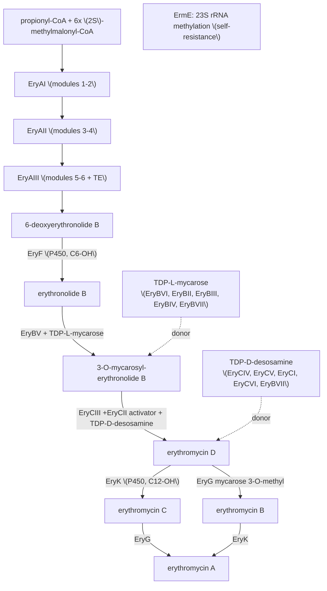

# Erythromycin biosynthesis (pathway concept)

**Representative species:** *Saccharopolyspora erythraea* NRRL 2338 (NCBITaxon:405948)
**External alignment:** MIBiG **BGC0000055** (compounds: erythromycin A, B, C, D)
**Biosynthetic class:** Polyketide (modular type I PKS) + Saccharide (two deoxysugars)
**Part of:** `projects/BGC.md`

## Overview

Erythromycin is a clinically important macrolide antibiotic. Its biosynthesis proceeds in
four stages, all encoded by the *ery* cluster:

1. **Macrolactone assembly** — the modular type I PKS **DEBS** (6-deoxyerythronolide B
   synthase; EryAI/AII/AIII) condenses one propionyl-CoA starter with six
   (2S)-methylmalonyl-CoA extenders across 6 modules to make **6-deoxyerythronolide B
   (6-dEB)**.
2. **Post-PKS oxidation** — the cytochrome P450 **EryF** hydroxylates 6-dEB at C-6 to give
   **erythronolide B (EB)**; later **EryK** hydroxylates at C-12.
3. **Glycosylation with two deoxysugars** — **EryBV** attaches **TDP-L-mycarose** (→
   3-*O*-mycarosyl-erythronolide B, MEB), then **EryCIII** (activated by **EryCII**)
   attaches **TDP-D-desosamine** (→ **erythromycin D**). The TDP-sugars are built by the
   dedicated **EryB*** (mycarose) and **EryC*** (desosamine) enzymes.
4. **Tailoring** — **EryK** (C-12 hydroxylation) and **EryG** (3''-*O*-methylation of
   mycarose → cladinose) convert erythromycin D, via erythromycin B and C, into the final
   **erythromycin A**.

Self-resistance is conferred by **ErmE** (23S rRNA N6-adenine methyltransferase).

## Pathway

## Gene alignment (MIBiG BGC0000055 → UniProt)

GenBank/MIBiG IDs and UniProt accessions verified; EC numbers from UniProt. **Review status**
is COMPLETE only where a full gene review exists under `genes/SACEN/`.

| Gene | GenBank | UniProt | EC | Role / stage | Review status |
|---|---|---|---|---|---|
| eryAI | CAM00062 | A4F7N8 | 2.3.1.94 | DEBS PKS, modules 1-2 (macrolactone) | not reviewed |
| eryAII | CAM00064 | A4F7P0 | 2.3.1.94 | DEBS PKS, modules 3-4 | not reviewed |
| eryAIII | CAM00065 | A4F7P1 | 2.3.1.94 | DEBS PKS, modules 5-6 + TE | not reviewed |
| eryF | CAM00071 | Q00441 | 1.14.15.35 | P450; 6-dEB C-6 hydroxylase (CYP107A1, P450eryF) | not reviewed |
| eryK | CAM00054 | P48635 | 1.14.13.154 | P450; erythromycin C-12 hydroxylase (CYP113A1) | not reviewed |
| eryBV | CAM00060 | A4F7N6 | 2.4.1.- | mycarosyltransferase (TDP-L-mycarose → EB) | not reviewed |
| **eryCIII** | CAM00067 | A4F7P3 | 2.4.1.278 | desosaminyltransferase (TDP-D-desosamine → MEB) | **COMPLETE** (`genes/SACEN/eryCIII/`) |
| **eryCII** | CAM00066 | A4F7P2 | — | **EryCIII activator** (P450 pseudoenzyme; see discrepancy) | **COMPLETE** (`genes/SACEN/eryCII/`) |
| eryG | CAM00069 | A4F7P5 | 2.1.1.254 | erythromycin 3''-O-methyltransferase (mycarose → cladinose) | not reviewed |
| eryCI | CAM00075 | P14290 | (2.6.1.-) | desosamine biosynthesis transaminase (see discrepancy) | not reviewed |
| eryCIV | CAM00057 | A4F7N3 | — | desosamine: NDP-6-deoxyhexose 3,4-dehydratase | not reviewed |
| eryCV | CAM00056 | A4F7N2 | — | desosamine: NDP-4,6-dideoxyhexose 3,4-enoyl reductase | not reviewed |
| eryCVI | CAM00059 | A4F7N5 | 2.1.1.- | desosamine: TDP-desosamine N,N-dimethyltransferase | not reviewed |
| eryBII | CAM00068 | A4F7P4 | 1.1.1.91 | mycarose: TDP-4-keto-6-deoxyhexose 2,3-reductase | not reviewed |
| eryBIII | CAM00072 | A4F7P8 | 2.1.1.- | mycarose: 3-C-methyltransferase | not reviewed |
| eryBIV | CAM00061 | A4F7N7 | 1.1.1.- | mycarose: dTDP-4-keto-6-deoxy-L-hexose 4-reductase | not reviewed |
| eryBVI | CAM00058 | A4F7N4 | 4.2.1.- | mycarose: NDP-4-keto-6-deoxyglucose 2,3-dehydratase | not reviewed |
| eryBVII | CAM00055 | A4F7N1 | 5.1.3.13 | dTDP-4-deoxyglucose 3,5-epimerase (shared by both sugars) | not reviewed |
| eryBI | CAM00073 | A4F7P9 | 3.2.1.21 | beta-D-glucosidase (role debated) | not reviewed |
| ermE | CAM00074 | P07287 | 2.1.1.184 | 23S rRNA N6-adenine MTase; macrolide self-resistance | not reviewed |
| (esterase) | CAM00053 | A4F7M9 | — | putative erythromycin esterase | not reviewed |
| (thioesterase) | CAM00070 | A4F7P6 | 3.1.2.14 | type II thioesterase (PKS proofreading) | not reviewed |
| (transposase) | CAM00063 | A4F7N9 | — | transposase (not biosynthetic) | excluded |

## MIBiG / annotation discrepancies (candidate upstream corrections)

1. **eryCII — "3,4-isomerase" (MIBiG) vs activator pseudoenzyme (this curation).** MIBiG
   annotates eryCII as *"TDP-4-keto-6-deoxy-glucose 3,4-isomerase"*, placing it as a catalytic
   step of desosamine biosynthesis. The crystal structure (PDB 2YJN; PMID:22056329) shows
   EryCII is a **heme-less cytochrome-P450 homologue with no active site** that functions as the
   **allosteric activator/stabilizer of the glycosyltransferase EryCIII** (EryCIII is inactive
   without it). UniProt (A4F7P2) agrees it is a P450-family protein "lacking the heme-binding
   sites", not a sugar isomerase. → MIBiG's catalytic isomerase assignment appears incorrect.
   See `genes/SACEN/eryCII/` and `projects/PSEUDOENZYMES.md`.
2. **eryCI — UniProt name "sensory transduction protein" vs transaminase.** MIBiG and the
   literature describe EryCI as the **desosamine PLP-dependent transaminase**; UniProt P14290
   carries the legacy name "Erythromycin biosynthesis sensory transduction protein EryC1".
   Flagged for review when eryCI is curated.

## Curation status

- **Reviewed (2/23):** eryCIII (desosaminyl GT) and eryCII (its activator) — the
  desosaminylation node, curated as the catalytic + pseudoenzyme-activator exemplar for the
  BGC project.
- **Not yet reviewed (21/23):** the DEBS megasynthases, both P450s, the second GT (EryBV),
  EryG, the two deoxysugar pathways, ErmE, and the editing/accessory genes above.

## References

- MIBiG BGC0000055 (https://mibig.secondarymetabolites.org/repository/BGC0000055/);
  gene set and product annotations.
- PMID:22056329 — Moncrieffe et al. 2012, *J Mol Biol*: EryCIII·EryCII structure (PDB 2YJN);
  EryCII as heme-less activator.
- PMID:15303858 — Lee et al. 2004, *JACS*: EryCIII desosaminyltransferase reconstitution.
- Per-gene primary references are recorded in the individual `genes/SACEN/*/` reviews.
