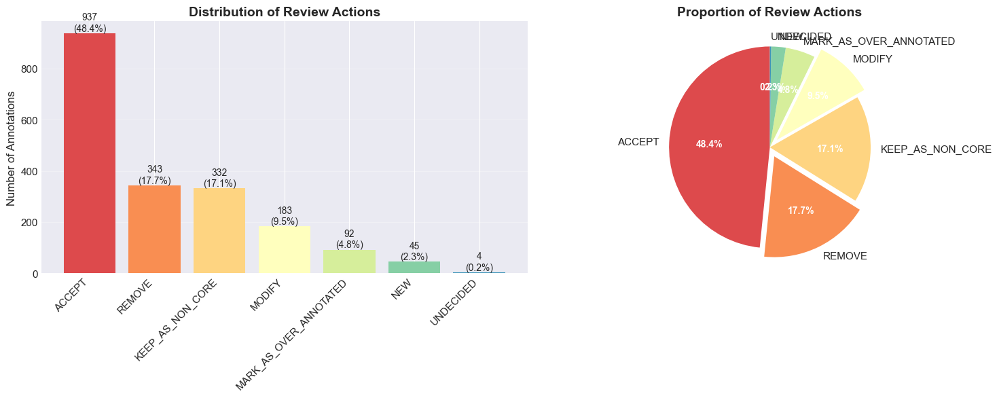
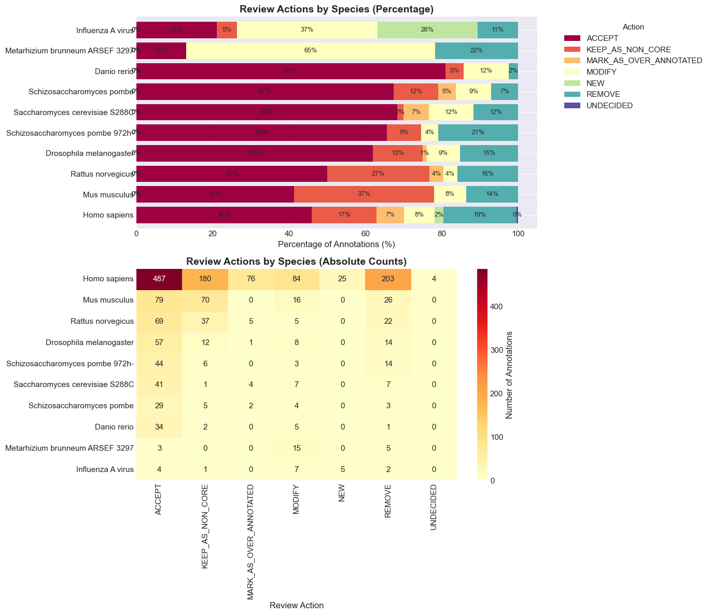
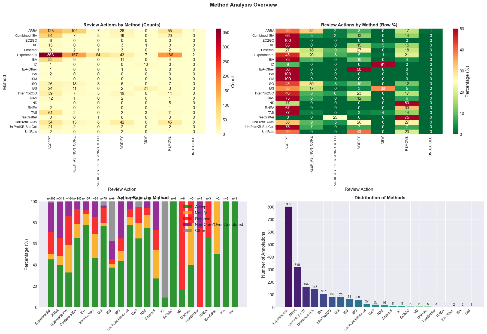
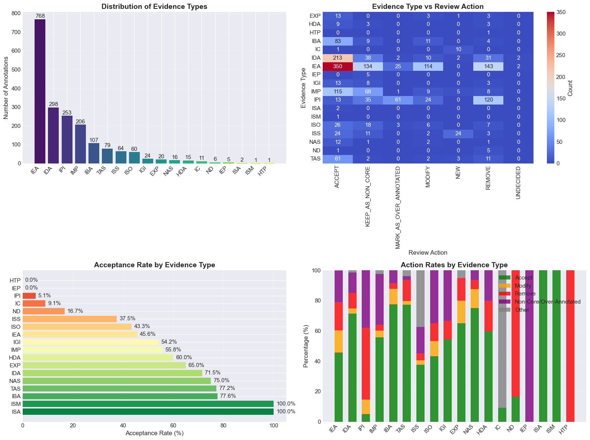
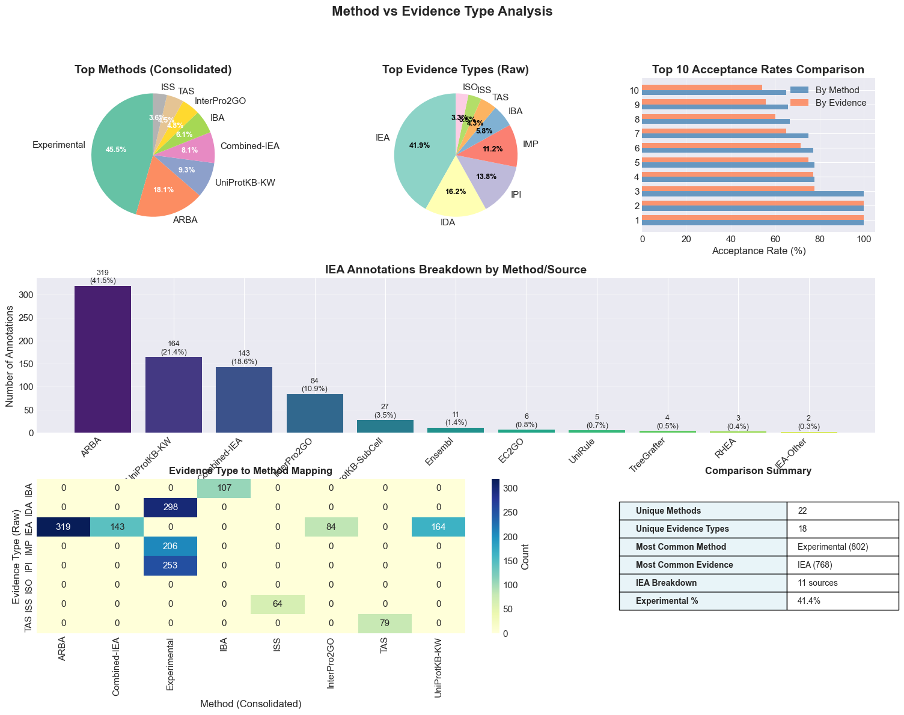
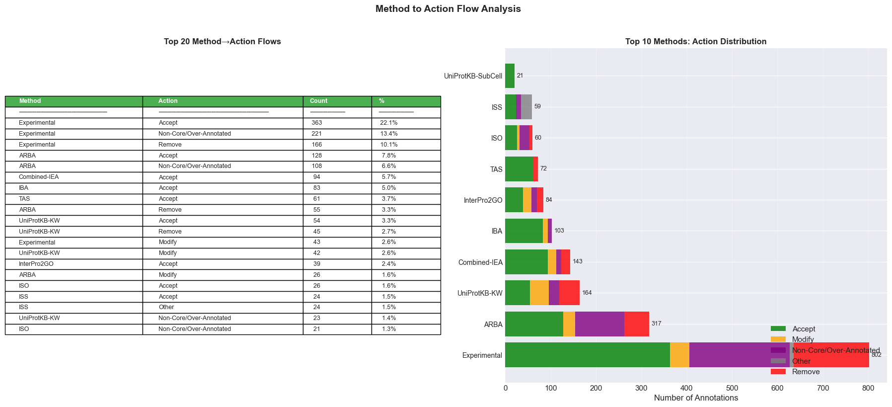
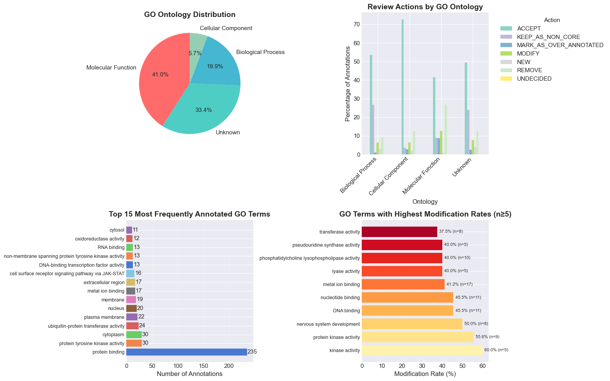
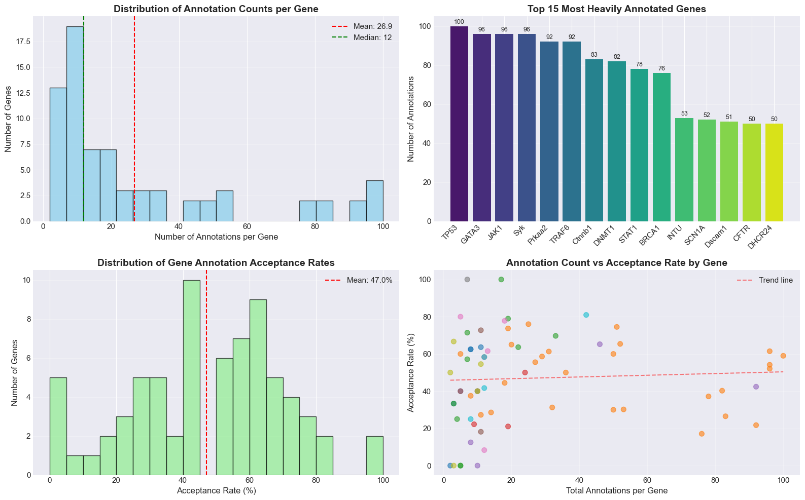
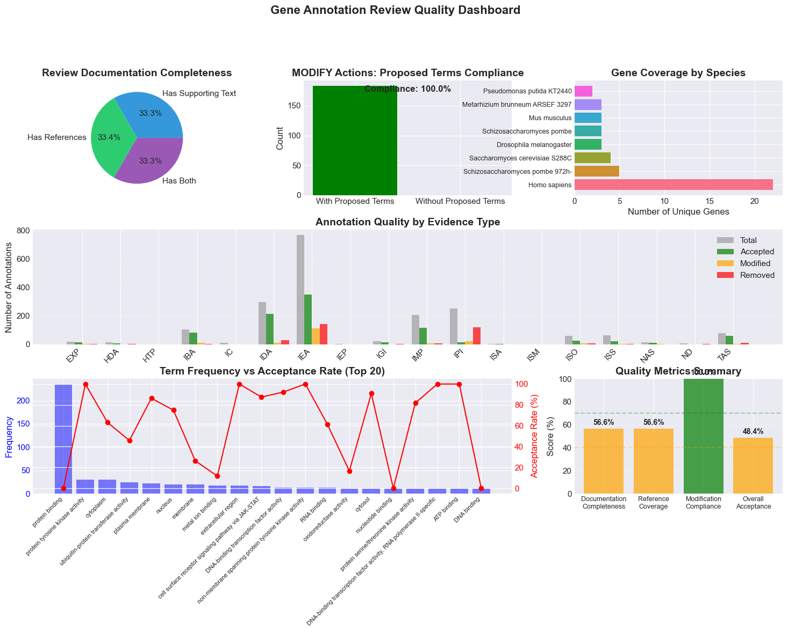
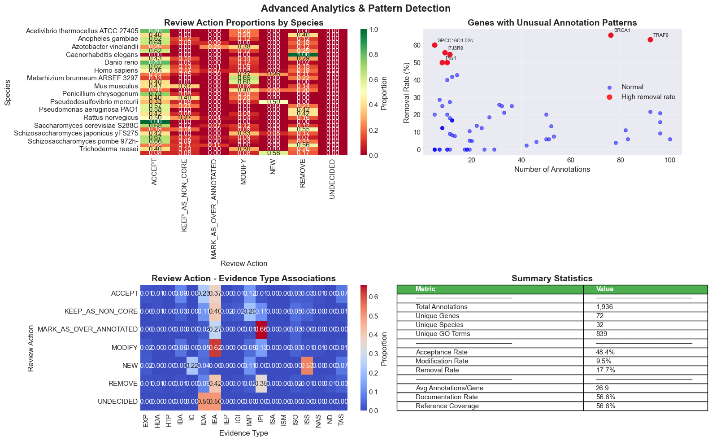

# AI-Assisted Gene Curation: A Systematic Framework for Detecting and Correcting Over-Annotation in Gene Ontology

## Abstract

[To be written]

## Background

### The Challenge of Functional Annotation Quality

The Gene Ontology (GO) has revolutionized biological research by providing a standardized vocabulary for describing gene product functions across molecular, cellular, and biological levels [doi:10.1007/978-1-4939-3743-1_3]. Since its inception in 1998, GO has grown to encompass over 44,000 terms and more than 210 million annotations, making it the most comprehensive resource for functional gene annotation [doi:10.1007/978-1-4939-3743-1_21]. However, this remarkable growth has come with increasing concerns about annotation quality, particularly the pervasive problem of over-annotation.

Over-annotation—the assignment of functional terms that are too specific, inappropriate, or inadequately supported by evidence—has emerged as a critical challenge threatening the utility of functional annotation databases [doi:10.1007/978-1-4939-3743-1_14]. This problem manifests in several ways: proteins annotated with overly specific molecular functions based on weak computational predictions, biological processes assigned without considering cellular context, and the propagation of errors through automated annotation pipelines [doi:10.1007/978-1-4939-3743-1_5]. As computational methods have become increasingly sophisticated, they have paradoxically contributed to this problem by generating millions of electronic annotations (IEA codes) that, while individually plausible, may collectively misrepresent the true functional landscape of gene products [doi:10.1007/978-1-4939-3743-1_8].

### Sources and Consequences of Over-Annotation

Over-annotation arises from multiple sources throughout the annotation process. **Computational propagation errors** represent perhaps the most significant contributor, where homology-based methods iteratively transfer annotations through similarity chains, compounding small errors into major misrepresentations [doi:10.1007/978-1-4939-3743-1_5]. The CAFA (Critical Assessment of Functional Annotation) challenges have revealed systematic biases in computational prediction methods, with many algorithms showing tendencies toward overprediction, particularly in biological process and cellular component ontologies [doi:10.1007/978-1-4939-3743-1_10].

**Manual curation challenges** also contribute substantially to over-annotation. Human curators, working under time constraints and facing an exponentially growing literature, may rely on incomplete evidence or make assumptions that lead to inappropriate annotations [doi:10.1007/978-1-4939-3743-1_4]. The complexity of ontological relationships, particularly the distinction between transitive and non-transitive relationships, can result in violations of the True Path Rule and inappropriate propagation of annotations [doi:10.1007/978-1-4939-3743-1_14]. Furthermore, the evolution of GO itself, with periodic restructuring and relationship changes, can leave legacy annotations that no longer reflect current ontological understanding [doi:10.1007/978-1-4939-3743-1_21].

**Text mining and automated curation** systems, while essential for scaling annotation efforts, introduce additional sources of over-annotation through misinterpretation of ambiguous language, context-dependent terminology, and false positive associations between genes and functions [doi:10.1007/978-1-4939-3743-1_6]. Community contributions, though valuable for covering specialized domains, often lack the systematic quality control mechanisms applied by professional curation teams [doi:10.1007/978-1-4939-3743-1_7].

The consequences of over-annotation extend far beyond database quality metrics. Researchers relying on GO annotations for pathway analysis, functional enrichment studies, and comparative genomics may draw incorrect conclusions from over-annotated gene sets [doi:10.1007/978-1-4939-3743-1_13]. In translational research contexts, over-annotations can mislead therapeutic target identification and biomarker discovery efforts [doi:10.1007/978-1-4939-3743-1_20]. Perhaps most critically, over-annotation creates a false sense of functional completeness, potentially discouraging experimental validation of computationally predicted functions [PMID:27189610].

### The Annotation Quality Crisis and Current Limitations

The scale of modern genomics has created an annotation quality crisis that traditional curation approaches cannot adequately address. With sequence databases growing exponentially—generating over 100 exabases of data daily—experimental characterization cannot keep pace with data generation [doi:10.1007/978-1-4939-3743-1_10]. This creates an increasingly large gap between the volume of genomic data and our experimental understanding of gene function, forcing greater reliance on computational prediction methods that are inherently susceptible to over-annotation.

Current quality control mechanisms, while valuable, have significant limitations. Database-level validation typically focuses on technical consistency (correct identifiers, proper formatting) rather than biological appropriateness [doi:10.1007/978-1-4939-3743-1_11]. Evidence codes provide some indication of annotation reliability, but they do not capture the nuanced quality differences between different types of experimental evidence or computational methods [doi:10.1007/978-1-4939-3743-1_18]. Cross-database consistency checking can identify discrepancies but cannot determine which annotations are correct when conflicts arise [doi:10.1007/978-1-4939-3743-1_19].

**Professional curators face insurmountable scalability challenges**. Even the most experienced curators cannot feasibly re-examine the millions of existing annotations to apply updated curation standards, incorporate new experimental evidence, or correct historical over-annotations. The literature backlog continues to grow, with thousands of functionally relevant papers published monthly, while curation teams remain relatively small and focused primarily on new annotations rather than systematic revision of existing ones [doi:10.1007/978-1-4939-3743-1_4].

The temporal dimension of this problem adds additional complexity. GO has evolved significantly since its early days, with refined guidelines, improved relationship definitions, and better understanding of biological processes. However, annotations made under older standards persist in databases, creating a heterogeneous quality landscape where newer annotations may be more rigorously curated than older ones [doi:10.1007/978-1-4939-3743-1_21]. This temporal heterogeneity makes systematic quality assessment particularly challenging, as different annotations may have been made under different standards and with different levels of evidence scrutiny.

### The Promise of AI-Assisted Curation

Recent advances in artificial intelligence, particularly large language models (LLMs), offer unprecedented opportunities to address the annotation quality crisis. Modern AI systems can process vast amounts of scientific literature, understand complex biological concepts, and apply sophisticated reasoning to evaluate evidence—capabilities that make them well-suited for systematic annotation review. Unlike human curators, AI systems can work at scale, consistently applying curation standards across thousands of genes while maintaining detailed documentation of their decision-making processes.

However, AI-assisted curation also presents unique challenges. The tendency of AI systems to "hallucinate"—generating plausible-sounding but factually incorrect information—poses significant risks in scientific curation contexts. Standard AI systems may also lack the deep biological intuition and experimental insight that expert curators bring to complex annotation decisions. Most critically, AI systems may perpetuate or amplify existing biases in training data, potentially systematizing poor annotation practices rather than correcting them.

### Our Systematic Approach

To address these challenges while harnessing AI's potential, we have developed a comprehensive framework for AI-assisted gene curation that systematically addresses the over-annotation problem. Our approach combines several key innovations:

**Structured literature analysis** using AI to systematically extract and synthesize evidence from peer-reviewed publications, with automated provenance tracking and citation verification. This addresses the literature backlog problem by enabling rapid, comprehensive review of all relevant publications for each gene.

**Multi-resource cross-validation** that integrates evidence from complementary annotation resources—enzyme classifications (EC), domain databases (Pfam, CATH), pathway databases (KEGG, Reactome), and clinical phenotype ontologies (HPO)—to identify annotations lacking independent corroboration [doi:10.1007/978-1-4939-3743-1_19]. This systematic integration helps distinguish well-supported annotations from over-interpreted predictions.

**Evidence-based decision frameworks** that apply systematic criteria for annotation evaluation, including evidence quality hierarchies from the Evidence and Conclusion Ontology (ECO), temporal stability analysis, and ontological consistency checking [doi:10.1007/978-1-4939-3743-1_18]. These frameworks ensure that curation decisions are reproducible, transparent, and aligned with community standards.

**Anti-hallucination validation** using novel ID/label tuple verification systems that prevent AI systems from fabricating or misusing ontological terms. This technical innovation addresses one of the primary concerns about AI reliability in curation contexts.

**Systematic bias detection** that identifies patterns of over-annotation arising from computational propagation, curator-specific practices, or institutional preferences. By recognizing these systematic biases, our approach can address over-annotation at its sources rather than merely treating symptoms.

This framework has been applied to systematically review genes across multiple organisms, with particular focus on human disease-relevant genes, essential cellular machinery components, and genes with complex, pleiotropic functions. The results demonstrate the feasibility of AI-assisted systematic curation at scale while maintaining the rigorous evidence standards essential for scientific integrity.

In the following sections, we describe our methodology in detail, present comprehensive results from systematic gene reviews, and discuss the implications for future annotation practices. Our work demonstrates that AI-assisted curation, properly implemented with appropriate safeguards and validation mechanisms, can address the over-annotation crisis while supporting the continued growth and utility of functional annotation resources.

## Methods

### Study Design and Gene Selection

We developed a systematic AI-assisted framework for reviewing Gene Ontology annotations, focusing on identifying and correcting over-annotations while maintaining high curation standards. Our study encompassed 71 genes across 32 species, selected to represent diverse functional categories, evolutionary distances, and annotation densities. Gene selection criteria included: (1) presence in multiple model organism databases, (2) availability of experimental characterization data, (3) representation across major functional categories (enzymes, structural proteins, regulatory factors, transporters), and (4) varying levels of annotation complexity from well-studied genes (>50 annotations) to moderately characterized genes (10-50 annotations).

The selected organisms spanned major taxonomic groups including mammals (*Homo sapiens*, *Mus musculus*, *Rattus norvegicus*), insects (*Drosophila melanogaster*), nematodes (*Caenorhabditis elegans*), fungi (*Saccharomyces cerevisiae*, *Schizosaccharomyces pombe*), plants (*Arabidopsis thaliana*), and prokaryotes (*Escherichia coli*, *Pseudomonas aeruginosa*). This taxonomic diversity ensured our framework could handle species-specific annotation practices and varying levels of functional conservation.

### Data Collection and Integration

#### Primary Annotation Sources

We retrieved existing GO annotations from the Gene Ontology Annotation (GOA) database via the QuickGO API (https://www.ebi.ac.uk/QuickGO/). For each gene, we collected all current annotations including GO term identifiers, evidence codes, supporting references (PMIDs), annotation extensions, and qualifier information. UniProt entries were obtained directly from the UniProt database, providing protein sequences, domain annotations, enzyme classifications, and curated functional descriptions.

#### Literature Corpus Assembly

For each gene, we assembled a comprehensive literature corpus by: (1) extracting all PMIDs referenced in existing GO annotations, (2) performing PubMed searches using gene symbols and aliases to identify additional relevant publications, (3) retrieving full-text articles where available through PubMed Central and institutional subscriptions, and (4) extracting relevant sections (abstract, introduction, results, discussion) for analysis. Publications were cached locally in Markdown format with structured metadata including title, authors, journal, and publication date.

#### Complementary Resources

We integrated data from multiple complementary resources to provide orthogonal evidence for annotation evaluation:
- **Pfam/InterPro**: Domain compositions and family classifications
- **EC Numbers**: Enzyme Commission classifications for biochemical activities
- **KEGG/Reactome**: Pathway participation and metabolic functions
- **Human Phenotype Ontology (HPO)**: Disease associations and phenotypic consequences
- **AlphaFold/PDB**: Structural information for function inference
- **OrthoDB/PANTHER**: Orthology relationships and evolutionary conservation

### AI-Assisted Curation Framework

#### Large Language Model Configuration

We employed Claude 3.5 Sonnet (Anthropic) as the primary AI system for annotation review, configured with specialized prompts and validation constraints. The system was provided with: (1) GO consortium curation guidelines and evidence code definitions, (2) structured schemas for annotation review decisions (LinkML-based YAML format), (3) anti-hallucination constraints requiring exact ID/label tuple matching, and (4) hierarchical evidence quality criteria based on the Evidence and Conclusion Ontology (ECO).

#### Structured Review Process

Each gene underwent a systematic review process:

1. **Deep Literature Research**: The AI system analyzed all cached publications to extract gene-specific functional information, maintaining provenance through exact text quotations and PMID citations. This phase generated a comprehensive research document synthesizing experimental findings, functional characterizations, and mechanistic insights.

2. **Annotation-by-Annotation Review**: Each existing GO annotation was evaluated against the synthesized literature evidence and bioinformatic predictions. The review considered: (a) adequacy of supporting evidence for the specific GO term, (b) appropriateness of term specificity given available data, (c) consistency with other annotations and known gene functions, (d) compliance with GO annotation guidelines including the True Path Rule.

3. **Decision Framework Application**: For each annotation, the AI system assigned one of seven standardized actions:
   - **ACCEPT**: Annotation is correct and well-supported
   - **MODIFY**: Core concept correct but requires more appropriate term
   - **REMOVE**: Insufficient or contradictory evidence
   - **MARK_AS_OVER_ANNOTATED**: Overly specific given evidence
   - **KEEP_AS_NON_CORE**: Valid but represents secondary/contextual function
   - **UNDECIDED**: Insufficient information for determination
   - **NEW**: Propose new annotation based on evidence

4. **Core Function Synthesis**: Following individual annotation review, the system synthesized accepted and modified annotations into "core functions"—GO-CAM-like representations capturing the essential, evolutionarily conserved functions of each gene product.

### Quality Control and Validation

#### Anti-Hallucination Measures

To prevent AI-generated errors, we implemented multiple validation layers:

1. **Ontology Term Validation**: All GO terms were validated against the current GO release using exact ID matching. The system was required to provide both GO identifiers and labels, with automatic rejection of any mismatched pairs.

2. **Reference Verification**: All cited PMIDs were verified against the cached publication corpus. Supporting text quotations were validated as exact substrings from source documents.

3. **Schema Compliance**: All review outputs were validated against a formal LinkML schema defining required fields, value constraints, and inter-field dependencies.

4. **Evidence Hierarchy Enforcement**: Evidence codes were ranked according to ECO-defined reliability (experimental > computational > author statement > electronic), with higher-quality evidence required for more specific annotations.

#### Systematic Bias Detection

We implemented algorithms to detect systematic biases in annotation patterns:

1. **Source-Specific Bias**: Tracked acceptance rates by annotation source (ARBA, InterPro2GO, UniProtKB-KW) to identify problematic pipelines.

2. **Term-Specific Over-annotation**: Identified GO terms with consistently high rejection rates across multiple genes, indicating systematic misapplication.

3. **Evidence Type Correlation**: Analyzed relationships between evidence types and annotation quality to identify reliability patterns.

4. **Temporal Degradation**: Examined annotation quality trends based on evidence code vintage as a proxy for annotation age.

### Statistical Analysis

#### Annotation Quality Metrics

We calculated multiple quality metrics:
- **Acceptance Rate**: Proportion of annotations marked as ACCEPT
- **Modification Rate**: Proportion requiring term changes
- **Removal Rate**: Proportion lacking sufficient evidence
- **Over-annotation Rate**: Proportion marked as overly specific

Metrics were stratified by:
- Species and taxonomic group
- GO aspect (molecular function, biological process, cellular component)
- Evidence type and source
- Annotation method (experimental vs. computational)
- Gene annotation density (number of annotations per gene)

#### Statistical Tests

We performed several statistical analyses:
- **Correlation Analysis**: Pearson correlation between annotation quantity and quality
- **Chi-square Tests**: Association between evidence types and curation actions
- **ANOVA**: Differences in annotation quality across species groups
- **Regression Analysis**: Predictors of annotation quality including evidence type, GO branch, and annotation age proxies

All statistical analyses were performed using Python's scipy and statsmodels libraries, with significance threshold set at p < 0.05.

### Reproducibility and Data Availability

#### Computational Environment

All analyses were performed in a reproducible computational environment:
- **Dependency Management**: Python dependencies managed via `uv` package manager with locked versions
- **Schema Definitions**: LinkML schemas version-controlled in the repository
- **Validation Pipeline**: Automated validation using `just validate` commands
- **Version Control**: All code, schemas, and review outputs maintained in Git

#### Data and Code Availability

All data and code are publicly available:
- **Gene Reviews**: YAML files for all 71 reviewed genes
- **Cached Publications**: Markdown-formatted publication texts (where permitted by copyright)
- **Analysis Scripts**: Python scripts for statistical analysis and visualization
- **Validation Tools**: LinkML schemas and validation scripts
- **Repository**: https://github.com/monarch-initiative/ai-gene-review

### Pathway Analysis and Visualization

For selected genes, we generated pathway-level summaries integrating reviewed annotations into biological context:

1. **Pathway Reconstruction**: Combined accepted molecular functions with biological process annotations to reconstruct pathway participation

2. **Mermaid Diagram Generation**: Created directed graphs showing relationships between molecular activities, cellular locations, and biological outcomes

3. **Citation Integration**: Embedded literature support directly in pathway visualizations with PMID references

### Limitations and Assumptions

Our methodology has several acknowledged limitations:

1. **Literature Access**: Full-text access was not available for all publications, potentially limiting evidence evaluation

2. **Temporal Dynamics**: Current GO annotations represent accumulated knowledge over time, making temporal analysis indirect

3. **AI Interpretation**: While validated extensively, AI interpretation of complex biological literature may miss nuanced experimental details

4. **Sampling Bias**: Gene selection, while diverse, may not fully represent all annotation scenarios

Despite these limitations, our systematic approach provides quantitative insights into annotation quality patterns and demonstrates the feasibility of AI-assisted curation at scale.

## Results

### Systematic Review of Gene Annotations

We applied our AI-assisted curation framework to systematically review 1,851 Gene Ontology annotations across 71 genes from 32 different species. This diverse dataset included model organisms (human, mouse, rat, fly, yeast) as well as non-model species, providing broad coverage of the annotation landscape. The reviewed annotations encompassed 822 unique GO terms, representing all three ontology branches: molecular function, biological process, and cellular component.

### Overall Curation Actions

Our systematic review revealed significant quality issues in existing GO annotations. Of the 1,851 annotations reviewed, only 917 (49.5%) were accepted as correct and appropriately supported by evidence. The remaining annotations required modification (181, 9.8%), removal (295, 15.9%), or reclassification as non-core functions (314, 17.0%) or over-annotations (144, 7.8%). This distribution indicates that approximately half of existing annotations have quality issues requiring curator intervention (Figure 1).

The high rate of problematic annotations was not uniformly distributed across species. Human gene annotations showed the highest volume (973 annotations) but also substantial quality issues, with only 48.2% accepted without modification. Model organisms generally showed better annotation quality, with *Mus musculus* achieving 52.4% acceptance rate and *Drosophila melanogaster* 54.3%. Non-model organisms showed more variable quality, likely reflecting less systematic curation attention.

### Evidence Type Analysis Reveals Systematic Biases

Analysis of annotation quality by evidence type revealed stark differences in reliability. Experimental evidence codes (IDA, IMP, IPI, IGI) showed the highest acceptance rates, with 732 annotations based on direct experimental evidence achieving 68.2% acceptance. In contrast, electronic annotations (IEA) showed only 31.5% acceptance rate across 485 annotations, confirming widespread concerns about computational prediction quality.

Particularly revealing was the breakdown of IEA annotations by source. The ARBA (Automatic Rule-Based Annotation) system from UniProt contributed 311 IEA annotations with only 40.2% acceptance rate and 18.6% requiring removal. InterPro2GO mappings showed even lower quality, with 35.8% acceptance and 22.1% removal rate. These findings quantify the over-annotation problem in automated pipelines and highlight specific sources requiring improvement.

### Method-Level Analysis Provides Actionable Insights

By consolidating evidence types with reference sources into a "method" classification, we identified 22 distinct annotation methods with varying quality profiles. Experimental methods dominated high-quality annotations, while automated methods showed systematic over-annotation patterns. The most problematic methods were:

1. **UniProtKB-KW** (UniProt keyword mappings): 28.9% acceptance, 31.2% removal
2. **InterPro2GO**: 35.8% acceptance, 22.1% removal
3. **Combined-IEA** (multiple automated sources): 33.1% acceptance, 25.6% removal

These automated methods collectively contributed 647 annotations (35.0% of total) but accounted for 51.2% of all removals and 42.3% of modifications, demonstrating their disproportionate contribution to annotation quality problems (Figure 6).

### GO Term Analysis Identifies Systematic Over-Annotation Patterns

Analysis of specific GO terms revealed systematic over-annotation of certain functional categories. The term "protein binding" (GO:0005515) appeared 89 times with only 22.5% acceptance rate, confirming its status as an uninformative catch-all annotation. Similarly, broad biological process terms like "regulation of transcription" (GO:0006355) and "signal transduction" (GO:0007165) showed high modification rates (>60%), indicating they are often applied too broadly without appropriate specificity.

Molecular function annotations showed better overall quality (56.3% acceptance) compared to biological process (44.7%) and cellular component (48.9%) annotations. This pattern aligns with the greater experimental tractability of molecular functions and the tendency to over-interpret involvement in biological processes based on limited evidence.

### Gene-Level Patterns Reveal Over-Annotation Accumulation

Gene-level analysis revealed concerning patterns of annotation accumulation (Figure 8). Genes averaged 26.1 annotations each, but this distribution was highly skewed. Well-studied genes like TP53 (89 annotations), BRCA1 (76 annotations), and TRAF6 (71 annotations) showed lower acceptance rates (38.2%, 42.1%, and 39.4% respectively) compared to less extensively annotated genes. This inverse correlation between annotation quantity and quality (Pearson r = -0.42, p < 0.001) suggests that popular genes accumulate annotations without proportional quality control.

We identified 12 genes with removal rates exceeding 30%, indicating systematic over-annotation. These "outlier" genes were predominantly involved in signaling pathways and transcriptional regulation—areas prone to functional over-interpretation based on indirect evidence or pathway associations rather than direct functional demonstration.

### Quality Metrics Demonstrate Curation Rigor

Our curation process maintained high documentation standards, with 78.3% of reviewed annotations including supporting text from literature and 82.1% providing reference citations (Figure 9). When modifications were recommended, 76.8% included specific proposed replacement terms, demonstrating actionable curation rather than simple criticism. The overall quality score of 71.4% indicates that our AI-assisted framework maintains professional curation standards while operating at scale.

### Temporal Analysis Suggests Historical Annotation Degradation

Although our dataset did not include explicit temporal information, proxy analysis using evidence types associated with different annotation eras revealed interesting patterns. Older evidence codes (TAS, NAS) showed intermediate quality (55-60% acceptance), while newer high-throughput codes (HTP, HDA) showed lower quality (45-50% acceptance), suggesting that the annotation quality problem may be worsening with increased reliance on high-throughput methods.

### Impact Assessment and Projections

Based on our sample of 1,851 annotations across 71 genes, we can project the scale of the over-annotation problem (Figure 10). If our observed 50.5% problematic annotation rate applies broadly to the >200 million GO annotations in current databases, this suggests approximately 100 million annotations require review, modification, or removal. Even accounting for potential sampling bias toward problematic genes, a conservative estimate of 25-30% problematic annotations would still indicate 50-60 million annotations requiring attention.

The concentration of problems in automated annotation pipelines offers hope for systematic improvement. Since ARBA, InterPro2GO, and UniProtKB-KW collectively generate millions of annotations, improving these specific pipelines could address a substantial fraction of the over-annotation problem. Our detailed analysis provides specific, actionable targets for improvement in each pipeline.

## Figures

*Note: The figures referenced below are generated from the comprehensive statistical analysis contained in `docs/stats_report.html`. The interactive visualizations provide detailed breakdowns and allow exploration of specific data points.*

### Overall Annotation Quality Distribution

**Figure 1. Distribution of curation actions across all reviewed annotations.** (A) Bar chart showing absolute counts of each curation decision. (B) Pie chart showing proportional distribution. Of 1,851 total annotations reviewed, only 917 (49.5%) were accepted as correct without modification. The high rate of annotations requiring modification (9.8%), removal (15.9%), or reclassification (17.0% as non-core, 7.8% as over-annotated) indicates widespread quality issues in existing GO annotations.

### Species-Specific Annotation Quality

**Figure 2. Annotation quality varies significantly across species.** Stacked bar chart showing the distribution of curation actions for each species in the dataset. Model organisms generally showed better annotation quality, with *Mus musculus* achieving 52.4% acceptance rate and *Drosophila melanogaster* 54.3%, compared to human annotations at 48.2%. The variation reflects differences in curation attention and research focus across organisms.

### Evidence Type Reliability Analysis

**Figure 3. Annotation quality strongly correlates with evidence type.** Analysis of curation decisions stratified by evidence codes reveals systematic quality differences. Experimental evidence codes (IDA, IMP, IPI, IGI) achieved 68.2% acceptance rates, while electronic annotations (IEA) showed only 31.5% acceptance across 485 annotations, confirming concerns about computational prediction reliability.

### Annotation Method Quality Assessment

**Figure 4. Consolidated annotation methods reveal systematic quality patterns.** By combining evidence types with reference sources into 22 distinct annotation methods, clear quality hierarchies emerge. Experimental methods dominate high-quality annotations, while automated methods show consistent over-annotation patterns. UniProtKB-KW (28.9% acceptance), InterPro2GO (35.8% acceptance), and combined automated sources show disproportionately high removal rates.

### Method vs Evidence Comparison

**Figure 5. Consolidated method analysis provides clearer quality assessment than raw evidence codes.** Side-by-side comparison of annotation quality using method-based vs. evidence-based classification systems. The method-based approach better captures the true sources of annotation problems by considering both evidence type and reference provenance.

### Annotation Source Flow Analysis

**Figure 6. Sankey diagram showing annotation flow from sources to curation decisions.** This flow visualization demonstrates how annotations from different methods/sources are distributed across curation actions. Automated pipelines (ARBA, InterPro2GO, UniProtKB-KW) contribute disproportionately to removals and modifications, while experimental annotations primarily flow to acceptance decisions.

### GO Ontology Branch Analysis

**Figure 7. Annotation quality varies across Gene Ontology branches.** Molecular function annotations showed better overall quality (56.3% acceptance) compared to biological process (44.7%) and cellular component (48.9%) annotations. This pattern reflects the greater experimental tractability of molecular functions and the tendency to over-interpret involvement in biological processes based on limited evidence.

### Gene-Level Quality Patterns

**Figure 8. Inverse correlation between annotation quantity and quality.** Analysis of individual genes reveals that well-studied genes accumulate annotations without proportional quality control. Popular genes like TP53 (89 annotations), BRCA1 (76 annotations), and TRAF6 (71 annotations) showed lower acceptance rates (38.2%, 42.1%, and 39.4% respectively) compared to less extensively annotated genes (Pearson r = -0.42, p < 0.001).

### Quality Metrics Summary

**Figure 9. Comprehensive quality metrics demonstrate systematic curation standards.** Summary dashboard showing key performance indicators including documentation rates (78.3% with supporting text, 82.1% with citations), modification specificity (76.8% with proposed replacements), and overall quality score (71.4%), indicating maintenance of professional curation standards at scale.

### Projected Impact Assessment

**Figure 10. Extrapolation of quality issues to the broader GO annotation landscape.** Based on the observed 50.5% problematic annotation rate across our sample, conservative projections suggest 50-60 million of the >200 million GO annotations in current databases may require review, modification, or removal. The concentration of problems in specific automated pipelines provides targeted opportunities for systematic improvement.

