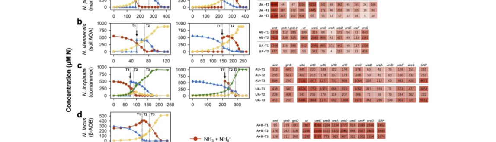

## Question

# Gene Research for Functional Annotation

## ⚠️ CRITICAL: Gene/Protein Identification Context

**BEFORE YOU BEGIN RESEARCH:** You MUST verify you are researching the CORRECT gene/protein. Gene symbols can be ambiguous, especially for less well-characterized genes from non-model organisms.

### Target Gene/Protein Identity (from UniProt):
- **UniProt Accession:** A0A060HK93
- **Protein Description:** RecName: Full=Urease subunit alpha {ECO:0000256|NCBIfam:TIGR01792}; EC=3.5.1.5 {ECO:0000256|NCBIfam:TIGR01792};
- **Gene Information:** Name=ureC1 {ECO:0000313|EMBL:AIC15715.1}; ORFNames=NVIE_014740 {ECO:0000313|EMBL:AIC15715.1};
- **Organism (full):** Nitrososphaera viennensis EN76.
- **Protein Family:** Belongs to the metallo-dependent hydrolases superfamily.
- **Key Domains:** Amidohydro-rel. (IPR006680); Metal-dep_hydrolase_composite. (IPR011059); Metal_Hydrolase. (IPR032466); Urease_alpha_N_dom. (IPR011612); Urease_alpha_subunit. (IPR050112)

### MANDATORY VERIFICATION STEPS:

1. **Check if the gene symbol "ureC1" matches the protein description above**
2. **Verify the organism is correct:** Nitrososphaera viennensis EN76.
3. **Check if protein family/domains align with what you find in literature**
4. **If you find literature for a DIFFERENT gene with the same or similar symbol, STOP**

### If Gene Symbol is Ambiguous or You Cannot Find Relevant Literature:

**DO NOT PROCEED WITH RESEARCH ON A DIFFERENT GENE.** Instead:
- State clearly: "The gene symbol 'ureC1' is ambiguous or literature is limited for this specific protein"
- Explain what you found (e.g., "Found extensive literature on a different gene with the same symbol in a different organism")
- Describe the protein based ONLY on the UniProt information provided above
- Suggest that the protein function can be inferred from domain/family information

### Research Target:

Please provide a comprehensive research report on the gene **ureC1** (gene ID: ureC1, UniProt: A0A060HK93) in 9ARCH.

The research report should be a detailed narrative explaining the function, biological processes, and localization of the gene product. Citations should be given for all claims.

You should prioritize authoritative reviews and primary scientific literature when conducting research. You can supplement
this with annotations you find in gene/protein databases, but these can be outdated or inaccurate.

We are specifically interested in the primary function of the gene - for enzymes, what reaction is catalyzed, and what is the substrate specificity? For transporters, what is the substrate? For structural proteins or adapters, what is the broader structural role? For signaling molecules, what is the role in the pathway.

We are interested in where in or outside the cell the gene product carries out its function.

We are also interested in the signaling or biochemical pathways in which the gene functions. We are less interested in broad pleiotropic effects, except where these elucidate the precise role.

Include evidence where possible. We are interested in both experimental evidence as well as inference from structure, evolution, or bioinformatic analysis. Precise studies should be prioritized over high-throughput, where available.

## Output

Question: You are an expert researcher providing comprehensive, well-cited information.

Provide detailed information focusing on:
1. Key concepts and definitions with current understanding
2. Recent developments and latest research (prioritize 2023-2024 sources)
3. Current applications and real-world implementations
4. Expert opinions and analysis from authoritative sources
5. Relevant statistics and data from recent studies

Format as a comprehensive research report with proper citations. Include URLs and publication dates where available.
Always prioritize recent, authoritative sources and provide specific citations for all major claims.

# Gene Research for Functional Annotation

## ⚠️ CRITICAL: Gene/Protein Identification Context

**BEFORE YOU BEGIN RESEARCH:** You MUST verify you are researching the CORRECT gene/protein. Gene symbols can be ambiguous, especially for less well-characterized genes from non-model organisms.

### Target Gene/Protein Identity (from UniProt):
- **UniProt Accession:** A0A060HK93
- **Protein Description:** RecName: Full=Urease subunit alpha {ECO:0000256|NCBIfam:TIGR01792}; EC=3.5.1.5 {ECO:0000256|NCBIfam:TIGR01792};
- **Gene Information:** Name=ureC1 {ECO:0000313|EMBL:AIC15715.1}; ORFNames=NVIE_014740 {ECO:0000313|EMBL:AIC15715.1};
- **Organism (full):** Nitrososphaera viennensis EN76.
- **Protein Family:** Belongs to the metallo-dependent hydrolases superfamily.
- **Key Domains:** Amidohydro-rel. (IPR006680); Metal-dep_hydrolase_composite. (IPR011059); Metal_Hydrolase. (IPR032466); Urease_alpha_N_dom. (IPR011612); Urease_alpha_subunit. (IPR050112)

### MANDATORY VERIFICATION STEPS:

1. **Check if the gene symbol "ureC1" matches the protein description above**
2. **Verify the organism is correct:** Nitrososphaera viennensis EN76.
3. **Check if protein family/domains align with what you find in literature**
4. **If you find literature for a DIFFERENT gene with the same or similar symbol, STOP**

### If Gene Symbol is Ambiguous or You Cannot Find Relevant Literature:

**DO NOT PROCEED WITH RESEARCH ON A DIFFERENT GENE.** Instead:
- State clearly: "The gene symbol 'ureC1' is ambiguous or literature is limited for this specific protein"
- Explain what you found (e.g., "Found extensive literature on a different gene with the same symbol in a different organism")
- Describe the protein based ONLY on the UniProt information provided above
- Suggest that the protein function can be inferred from domain/family information

### Research Target:

Please provide a comprehensive research report on the gene **ureC1** (gene ID: ureC1, UniProt: A0A060HK93) in 9ARCH.

The research report should be a detailed narrative explaining the function, biological processes, and localization of the gene product. Citations should be given for all claims.

You should prioritize authoritative reviews and primary scientific literature when conducting research. You can supplement
this with annotations you find in gene/protein databases, but these can be outdated or inaccurate.

We are specifically interested in the primary function of the gene - for enzymes, what reaction is catalyzed, and what is the substrate specificity? For transporters, what is the substrate? For structural proteins or adapters, what is the broader structural role? For signaling molecules, what is the role in the pathway.

We are interested in where in or outside the cell the gene product carries out its function.

We are also interested in the signaling or biochemical pathways in which the gene functions. We are less interested in broad pleiotropic effects, except where these elucidate the precise role.

Include evidence where possible. We are interested in both experimental evidence as well as inference from structure, evolution, or bioinformatic analysis. Precise studies should be prioritized over high-throughput, where available.

## Research Report: Functional annotation of **ureC1** (UniProt **A0A060HK93**; locus **NVIE_014740**) in *Nitrososphaera viennensis* EN76 (9ARCH)

### 1) Target verification (avoid gene-symbol ambiguity)
The UniProt target (A0A060HK93) corresponds to the **urease alpha (catalytic) subunit** in the soil ammonia-oxidizing archaeon *Nitrososphaera viennensis* EN76, with locus tag **NVIE_014740** (gene symbol **ureC/ureC1**). In recent primary literature, **ureC (NVIE_014740)** is explicitly annotated as the urease alpha subunit in *N. viennensis*, and it is reported to be in the same operon as a urea transporter gene (**ut; NVIE_014780**), matching the UniProt-provided ORF name and functional description. (qin2024ammoniaoxidizingbacteriaand pages 8-11, qin2023differentialsubstrateaffinity pages 10-13)

Earlier genomic characterization of strain EN76 also identified a contig containing a “potential urease operon”/“urease gene cluster,” supporting the presence of a urease system in this specific organism (and not a different ureC from bacteria or other archaea). (tourna2011nitrososphaeraviennensisan pages 2-3, tourna2011nitrososphaeraviennensisan pages 3-4)

### 2) Key concepts and current understanding (definitions and mechanistic role)
#### 2.1 Urease and the meaning of ureC/ureC1
Urease is the enzyme that hydrolyzes urea; **ureC (urease subunit alpha)** encodes the **catalytic subunit** (often used as the functional marker gene “ureC” in environmental studies). In *N. viennensis* EN76, ureC1 (NVIE_014740) is part of the genetic capacity for **urea utilization**, which supplies intracellular **ammonia** that can support both **biosynthesis** and **ammonia oxidation-derived energy metabolism** in ammonia-oxidizing archaea (AOA). (qin2024ammoniaoxidizingbacteriaand pages 8-11, tourna2011nitrososphaeraviennensisan pages 3-4)

#### 2.2 Pathway context in nitrifying archaea: urea as an ammonia precursor
Cultured AOA, including *N. viennensis*, can use urea such that urea hydrolysis in the **cytoplasm** releases ammonia that is then oxidized (and/or assimilated). Evidence supporting the intracellular coupling is that, across tested ammonia oxidizers including *N. viennensis*, extracellular urease activity was not detected and urease genes lacked secretion signals, supporting a model where urea is transported into the cell and hydrolyzed internally. (qin2023differentialsubstrateaffinity pages 4-7, qin2023differentialsubstrateaffinity pages 7-10)

### 3) Molecular function, substrate specificity, and operon/regulatory context (organism-specific)
#### 3.1 Reaction and substrate specificity
Although the reaction chemistry is not explicitly written in the extracted text, the **physiological and kinetic measurements** directly establish that *N. viennensis* couples urea use to nitrification, and that urea is a **secondary/less-preferred substrate** relative to ammonia.

In *N. viennensis* EN76, measured apparent affinities show:
- **Km(app) for ammonia oxidation:** **0.68 ± 0.16 µM**
- **Km(app) for urea-dependent oxidation:** **8.97 ± 1.27 µM**

This indicates substantially **lower affinity for urea** (and ~10-fold lower specific affinity) than for ammonia. (qin2024ammoniaoxidizingbacteriaand pages 8-11, qin2023differentialsubstrateaffinity pages 7-10, qin2024ammoniaoxidizingbacteriaand media 2caafcb9)

These organism-specific kinetic parameters are critical for functional annotation because they constrain when ureC1-mediated urea use is likely to contribute in situ (e.g., when urea is available and ammonia is scarce). (qin2024ammoniaoxidizingbacteriaand pages 8-11, qin2024ammoniaoxidizingbacteriaand media 2caafcb9)

#### 3.2 Operon context and accessory functions (transport + urease)
In *N. viennensis*, **ureC (NVIE_014740)** is reported to be located in the same operon as a urea transporter gene **ut (NVIE_014780)**, supporting a linked **import + hydrolysis** module for urea utilization. (qin2024ammoniaoxidizingbacteriaand pages 8-11, qin2023differentialsubstrateaffinity pages 10-13)

Comparative genomics across nitrifiers indicates that AOA commonly encode **urease structural genes (ureABC)** plus **accessory genes (ureDEFG)**, and they typically use archaeal-type urea transporters (e.g., **dur3**, **utp/ut**) rather than the bacterial high-affinity ABC transporter **urtABCDE**. This context supports that *Nitrososphaera* spp. (Group I.1b AOA, including *N. viennensis*) generally have the full intracellular machinery for urea uptake and urease activation. (liu2023genomicinsightinto pages 9-11, liu2023genomicinsightinto pages 1-2)

#### 3.3 Regulation: inducible urea utilization and repression by ammonia
Multiple complementary observations show that ureC1-linked urea use is **regulated by nitrogen source**:

1) **Transcriptomics (24 h after substrate switch):** In *N. viennensis*, transcripts of **ut** and **ureC (NVIE_014740)** changed by ~**tenfold** in response to urea vs ammonia addition, indicating a strongly inducible operon responsive to N source. (qin2024ammoniaoxidizingbacteriaand pages 8-11, qin2023differentialsubstrateaffinity pages 10-13)

2) **Physiology / microrespirometry:** When urea-grown *N. viennensis* cells were amended with low urea (10–20 µM) or ammonia (20–40 µM), O2 consumption responded immediately; however, when ammonia-grown cells were given 10 µM urea, there was **no immediate O2 uptake for hours after ammonia depletion**, consistent with repression of urea utilization during ammonia-based growth and a required adaptation period. (qin2024ammoniaoxidizingbacteriaand pages 55-58)

3) **Mechanistic interpretation:** The broader experimental framework supports that ammonia oxidizers can repress oxidation of extracellular ammonia when cytoplasmic urea hydrolysis satisfies N needs, consistent with regulated coupling between transport and downstream oxidation. (qin2023differentialsubstrateaffinity pages 7-10, qin2024ammoniaoxidizingbacteriaand pages 11-16)

### 4) Subcellular localization (where ureC1 functions)
Direct evidence supports **cytoplasmic/intracellular localization** of the urease system in *N. viennensis* and related ammonia oxidizers:
- No extracellular urease activity was detected for tested ammonia oxidizers including *N. viennensis*.
- Urease genes lacked signal peptides and urease operons were not flanked by secretion-system genes.

Together, these observations support that ureC1 (urease alpha subunit) acts **inside the cell**, consistent with an intracellular urea-to-ammonia conversion that then feeds ammonia oxidation/assimilation. (qin2023differentialsubstrateaffinity pages 4-7, qin2023differentialsubstrateaffinity pages 7-10)

### 5) Biological role in cellular metabolism and nitrogen cycling
#### 5.1 Role in *N. viennensis* physiology
Initial genome-based characterization suggested *N. viennensis* EN76 “might be able to use urea instead of ammonia as sole energy source,” indicating ureC1 supports metabolic flexibility in soil environments. (tourna2011nitrososphaeraviennensisan pages 3-4)

At the single-cell level, isotopic measurements show urea is used mainly as an **N** source rather than a major **C** source: for *N. viennensis*, urea-derived carbon incorporation was very low (~0.1% during ammonia growth and 0.5–1.1% after urea depletion), while bicarbonate-derived carbon incorporation remained much higher, consistent with chemoautotrophic carbon fixation dominating. (qin2024ammoniaoxidizingbacteriaand pages 58-62)

#### 5.2 Broader ecological context (soil and ocean)
Recent (2023–2024) ecosystem studies highlight how ureC/urease capacity shapes archaeal nitrifier niches:

- **Soils:** Across major soil Nitrososphaeria lineages, **85.7–89.8%** of AOA in surveyed soils were estimated to encode urease (based on ureC relative to amoA/rpoB), suggesting that urea utilization potential is widespread among soil archaeal nitrifiers related to *Nitrososphaera*. (liu2023genomicinsightinto pages 1-2)

- **Dark ocean:** Quantitative metagenomic and rate measurements indicate urea is a major N source below the photic zone. UreC prevalence was estimated at **39%** of deep-sea cells in one region, and **10–46%** globally; on average **25%** of deep-sea cells assimilated urea-derived N (or **60%** of detectably active cells). Urea concentrations ranged **21 nM–1.1 µM**, and urea-based nitrification could be comparable to ammonia-based nitrification at some depths/sites. (arandiagorostidi2024ureaassimilationand pages 1-2, arandiagorostidi2024ureaassimilationanda pages 8-13, arandiagorostidi2024ureaassimilationanda pages 17-20)

- **Quantitative nitrification example:** At 150 m depth in one dataset, nitrification product accumulation reached **16.1 nmol N L−1** from ammonium and **11.8 nmol N L−1** from urea incubations, and urea-based nitrification rates were reported as statistically indistinguishable from ammonia-based rates (t-test > 0.1). (arandiagorostidi2024ureaassimilationanda pages 8-13)

These data support the interpretation that ureC-like systems, including those in Nitrososphaeria, can materially contribute to nitrogen cycling under certain substrate regimes, even if ammonia remains the preferred substrate in many settings. (arandiagorostidi2024ureaassimilationanda pages 8-13, qin2024ammoniaoxidizingbacteriaand pages 8-11)

### 6) Recent developments (2023–2024) and expert analysis
A key 2024 synthesis from controlled cultures is that ammonia-oxidizing archaea and bacteria differ in nitrogen-source preference strategies. For *N. viennensis*, this includes: (i) higher affinity for ammonia than urea, (ii) inducible ut–ureC expression, and (iii) physiological repression of urea use during ammonia growth—features that collectively support niche differentiation and help explain coexistence patterns where multiple nitrifiers share environments but exploit different nitrogen pools over time. (qin2024ammoniaoxidizingbacteriaand pages 8-11, qin2024ammoniaoxidizingbacteriaand pages 55-58)

From a genomic/evolutionary perspective, a 2023 comparative genomics analysis argues urea is the most widely encoded LDON substrate among nitrifiers and that AOA urea metabolic genes (including ureC and certain transporters) show evolutionary patterns consistent with archaeal-specific trajectories and/or lateral gene transfer for some transport components. This supports ongoing research emphasis on transport and regulation as central determinants of urea utilization efficiency. (liu2023genomicinsightinto pages 1-2)

### 7) Current applications and real-world implementations
#### 7.1 Environmental monitoring and biogeochemical modeling
Because ureC is a widely used marker for urease potential, quantitative evidence that ureC is present in large fractions of deep-sea cells (10–46% globally) and that urea assimilation can involve ~25% of deep-sea cells supports incorporating urea-driven processes into models of ocean nitrogen cycling and chemoautotrophic production. (arandiagorostidi2024ureaassimilationand pages 1-2, arandiagorostidi2024ureaassimilationanda pages 8-13)

Similarly, soil results indicating 85.7–89.8% of AOA in diverse soils encode urease suggest ureC-based functional profiling is useful for predicting archaeal nitrogen acquisition strategies and niche partitioning in terrestrial ecosystems, including those influenced by fertilizer-derived urea. (liu2023genomicinsightinto pages 1-2)

#### 7.2 Interpreting ureC as an activity proxy (limitations)
Recent field observations caution that ureC abundance does not always predict urea oxidation rates. For example, Southern Ocean work reported variable Thaumarchaeota ureC abundance (highest mean 1.2 × 10^6 copies L−1 in one water mass) but found urea oxidation rates generally lower than ammonia oxidation and not well correlated with marker gene ratios, indicating regulation and community context must be considered in applications that infer function from gene abundance alone. (hollibaugh2023contributionofurean pages 14-18)

### 8) Evidence tables
The following tables compile organism-specific ureC1 evidence and 2023–2024 quantitative developments with URLs and publication dates.

| Claim/Topic | Key findings (include quantitative values) | Evidence type | Source (full citation short) | Publication date | URL |
|---|---|---|---|---|---|
| Target identity verification | In *Nitrososphaera viennensis* EN76, **ureC / NVIE_014740** is explicitly identified as the **urease alpha subunit**; it is reported in the same operon as a urea transporter gene **ut / NVIE_014780**, matching UniProt A0A060HK93 annotation (qin2024ammoniaoxidizingbacteriaand pages 8-11, qin2023differentialsubstrateaffinity pages 10-13) | Transcriptomics / genome-linked annotation | Qin et al., *Nat Microbiol* | Jan 2024 | https://doi.org/10.1038/s41564-023-01593-7 |
| Primary function and substrate preference in EN76 | *N. viennensis* uses urea as an alternative N/energy source precursor but **prefers ammonia over urea**: apparent **Km(app)** for ammonia **0.68 ± 0.16 µM** versus urea **8.97 ± 1.27 µM**; specific affinity for urea is ~**10-fold lower** than for ammonia (qin2024ammoniaoxidizingbacteriaand pages 8-11, qin2023differentialsubstrateaffinity pages 7-10, qin2024ammoniaoxidizingbacteriaand media 2caafcb9) | Culture kinetics | Qin et al., *Nat Microbiol* | Jan 2024 | https://doi.org/10.1038/s41564-023-01593-7 |
| Regulation of ureC1 by nitrogen source | After substrate switching, **ut** and **ureC (NVIE_014740)** transcripts changed by about **10-fold within 24 h**: induced after urea addition and reduced after ammonia addition; by contrast **amt1** remained similar (**1,379 TPM on ammonia vs 1,348 TPM on urea; P = 0.84**) (qin2024ammoniaoxidizingbacteriaand pages 8-11, qin2023differentialsubstrateaffinity pages 10-13) | Transcriptomics | Qin et al., *Nat Microbiol* | Jan 2024 | https://doi.org/10.1038/s41564-023-01593-7 |
| Physiological switching behavior | Urea-grown EN76 showed immediate O2 consumption when low urea (**10–20 µM**) or ammonia (**20–40 µM**) was added, but ammonia-grown cells given **10 µM urea** showed no immediate O2 uptake until after ammonia depletion, indicating repression of urea use during ammonia growth; EN76 maintained growth without a pronounced lag during transition (qin2024ammoniaoxidizingbacteriaand pages 55-58) | Physiology / microrespirometry | Qin et al., *Nat Microbiol* | Jan 2024 | https://doi.org/10.1038/s41564-023-01593-7 |
| Cellular role of urea in EN76 | NanoSIMS-based single-cell data indicate AOM use urea mainly as an **N source rather than C source**; in soil AOA *N. viennensis*, urea-derived C was only ~**0.1%** during ammonia growth, increasing to **0.5–1.1%** after urea depletion, while bicarbonate-derived C remained much larger (**13 ± 4.5% → 8.0 ± 3.5%**) (qin2024ammoniaoxidizingbacteriaand pages 58-62) | Single-cell isotope tracing | Qin et al., *Nat Microbiol* | Jan 2024 | https://doi.org/10.1038/s41564-023-01593-7 |
| Localization of urease system | Across tested ammonia oxidizers including EN76, **no extracellular urease activity** was detected; no **signal peptides** were found in urease genes and no nearby secretion-system genes were found, supporting **cytoplasmic localization** of urease/ureC1 (qin2023differentialsubstrateaffinity pages 4-7) | Enzyme assay + comparative genomics | Qin et al., bioRxiv | Aug 2023 | https://doi.org/10.1101/2023.08.04.551995 |
| Broader AOA genomic context | Review/genomic survey of **70 nitrifier genomes** found urea to be the most commonly encoded LDON substrate; AOA generally carry **ureABC** plus **ureDEFG** and use archaeal transporter types **dur3** and/or **utp** rather than bacterial **urtABCDE**; experimental urea use is confirmed for **N. viennensis EN76** (liu2023genomicinsightinto pages 9-11, liu2023genomicinsightinto pages 1-2) | Comparative genomics / review | Liu et al., *Front Microbiol* | Dec 2023 | https://doi.org/10.3389/fmicb.2023.1273211 |
| Initial discovery of urease capacity in EN76 | Draft genome of EN76 contained a contig with a **potential urease operon/urease gene cluster**, leading the authors to propose that this soil AOA could use **urea instead of ammonia as sole energy source**; this provided the first genome-based indication for ureC1 function in this organism (tourna2011nitrososphaeraviennensisan pages 3-4, tourna2011nitrososphaeraviennensisan pages 2-3) | Genomics / culture characterization | Tourna et al., *PNAS* | Apr 2011 | https://doi.org/10.1073/pnas.1013488108 |
| Soil archaeal prevalence of urease potential | Across 12 major soil Nitrososphaeria lineages, **85.7–89.8%** of AOA in surveyed soils were estimated to encode **urease** (based on **ureC** relative to **amoA/rpoB**), indicating urea use is widespread among soil archaeal nitrifiers related to *Nitrososphaera* (liu2023genomicinsightinto pages 1-2) | Soil metagenomics / expression-focused ecology | Zhao et al., *ISME J* | Aug 2023 | https://doi.org/10.1038/s41396-023-01493-y |
| Environmental significance of archaeal ureC | In dark-ocean metagenomes, **ureC** occurred in **39%** of deep-sea cells regionally and **10–46%** globally (median ~**36%**); on average **25%** of deep-sea cells assimilated urea-derived N (or **60%** of active cells), and urea-based nitrification occurred at all sampled depths at one site (arandiagorostidi2024ureaassimilationanda pages 13-17, arandiagorostidi2024ureaassimilationand pages 1-2, arandiagorostidi2024ureaassimilationanda pages 17-20, arandiagorostidi2024ureaassimilationanda pages 8-13) | Environmental metagenomics + rates | Arandia-Gorostidi et al., *ISME J* | Jan 2024 | https://doi.org/10.1093/ismejo/wrae230 |
| Quantitative urea contribution to marine nitrification | Southern Ocean data showed Thaumarchaeota-associated **ureC** abundance was variable (highest mean **1.2 × 10^6 copies L^-1** in CDW); mean **ureC/rrs ~0.14** overall. Ammonia oxidation averaged **10.9 nmol L^-1 d^-1** versus urea oxidation **2.6 nmol L^-1 d^-1** (or **1.5** excluding outliers), suggesting urea makes a significant but smaller, context-dependent contribution to nitrification (hollibaugh2023contributionofurean pages 14-18) | Environmental rates + qPCR/metagenetics | Hollibaugh et al., preprint/2023 study | 2023 | URL not available in retrieved context |

*Table: This table compiles organism-specific and ecosystem-level evidence relevant to ureC1 (NVIE_014740) in *Nitrososphaera viennensis* EN76, emphasizing verified identity, biochemical role, regulation, localization, and recent quantitative findings from 2023–2024 literature.*

| Study/system | Key quantitative results | Implication/application | Publication date | URL |
|---|---|---|---|---|
| Qin et al. 2024 — *Nitrososphaera viennensis* EN76 culture physiology and regulation | In *N. viennensis*, **ureC (NVIE_014740)** and adjacent **ut (NVIE_014780)** transcripts changed by ~**10-fold within 24 h** after switching between urea and ammonia; apparent substrate affinities showed **Km(app) ammonia = 0.68 ± 0.16 µM** versus **Km(app) urea = 8.97 ± 1.27 µM**, with ~**10-fold lower specific affinity** for urea; ammonia-grown cells given **10 µM urea** showed no immediate O2 uptake until ammonia depletion, indicating repression of urea use during ammonia growth (qin2024ammoniaoxidizingbacteriaand pages 8-11, qin2024ammoniaoxidizingbacteriaand pages 55-58, qin2024ammoniaoxidizingbacteriaand media 2caafcb9) | Shows that urease-linked urea oxidation in soil AOA is inducible but typically secondary to ammonia use; useful for modeling nitrogen-source competition in soils and bioreactors and for interpreting ureC expression as a condition-dependent, not constitutive, marker | Jan 2024 | https://doi.org/10.1038/s41564-023-01593-7 |
| Zhao et al. 2023 — soil Nitrososphaeria resource acquisition | Across 12 major soil Nitrososphaeria lineages, **85.7–89.8%** of AOA in surveyed soils were estimated to encode **urease** based on **ureC** relative to **amoA/rpoB** reads (liu2023genomicinsightinto pages 1-2) | Indicates that urea use is a widespread niche-defining trait in soil archaeal nitrifiers, supporting application of ureC-based analyses in predicting nitrogen acquisition strategies and coexistence patterns in agricultural and natural soils | Aug 2023 | https://doi.org/10.1038/s41396-023-01493-y |
| Arandia-Gorostidi et al. 2024 — dark ocean urea assimilation and nitrification | Regional deep-sea metagenomes estimated **ureC in 39% of cells**; global datasets estimated **10–46%** of deep-sea cells carry ureC (median ~**36%**); on average **25%** of deep-sea cells assimilated urea-derived N, or **60% of detectably active cells**; urea concentrations ranged **21 nM–1.1 µM**; peak nitrification at **150 m** reached **16.1 nmol N L^-1** from ammonium and **11.8 nmol N L^-1** from urea; urea-based nitrification rates were statistically indistinguishable from ammonia-based rates at sampled depths; urea-supported chemoautotrophic C fixation was estimated at **1.4–8.8 mg C m^-2 d^-1**, ~**5–7%** of sinking POC at study sites (arandiagorostidi2024ureaassimilationanda pages 13-17, arandiagorostidi2024ureaassimilationand pages 1-2, arandiagorostidi2024ureaassimilationanda pages 17-20, arandiagorostidi2024ureaassimilationanda pages 8-13) | Demonstrates that ureC-bearing archaeal and bacterial communities substantially support deep-ocean N cycling and some chemoautotrophic production; relevant to ocean biogeochemical models and to interpreting ureC as an ecologically important marker beyond surface waters | Jan 2024 | https://doi.org/10.1093/ismejo/wrae230 |
| Hollibaugh et al. 2024 preprint / 2023 Southern Ocean study — polar nitrification | Thaumarchaeota-associated **ureC** abundance was variable by water mass, with highest mean **1.2 × 10^6 copies L^-1** in CDW; mean **ureC/rrs ≈ 0.14** overall; ammonia oxidation averaged **10.9 nmol L^-1 d^-1** versus urea oxidation **2.6 nmol L^-1 d^-1** (or **1.5 nmol L^-1 d^-1** excluding high outliers); AO and UO differed significantly among water masses (**p = 0.008**) (hollibaugh2023contributionofurean pages 14-18) | Suggests urea contributes a measurable but generally smaller share of nitrification in polar waters; useful for constraining regional nitrogen-cycle budgets and for evaluating when ureC abundance does or does not predict active urea-based nitrification | Feb 2024 preprint / 2023 study | https://doi.org/10.1101/2024.02.20.581251 |

*Table: This table summarizes key 2023–2024 quantitative findings on ureC/urease and urea-based nitrification or assimilation in archaeal nitrifiers across culture, soil, and ocean systems. It highlights the most useful recent statistics for functional interpretation and environmental application.*

### 9) Key takeaways for functional annotation of ureC1 (A0A060HK93) in *N. viennensis*
- **Molecular function:** ureC1 (NVIE_014740) encodes the **urease alpha (catalytic) subunit**; it supports urea utilization via an operon that includes a urea transporter (ut; NVIE_014780). (qin2024ammoniaoxidizingbacteriaand pages 8-11, qin2023differentialsubstrateaffinity pages 10-13)
- **Physiological role:** supplies intracellular ammonia from urea; urea use is **inducible** and **repressed by ammonia**, consistent with regulated nitrogen-source prioritization. (qin2024ammoniaoxidizingbacteriaand pages 8-11, qin2024ammoniaoxidizingbacteriaand pages 55-58)
- **Substrate preference:** much higher apparent affinity for ammonia than urea (Km(app) 0.68 µM vs 8.97 µM). (qin2024ammoniaoxidizingbacteriaand pages 8-11, qin2024ammoniaoxidizingbacteriaand media 2caafcb9)
- **Localization:** urease is **cytoplasmic/intracellular**; no extracellular urease activity detected and no secretion signals in urease genes. (qin2023differentialsubstrateaffinity pages 4-7, qin2023differentialsubstrateaffinity pages 7-10)
- **Ecological relevance:** ureC is widespread among Nitrososphaeria in soils and among deep-ocean communities; urea can make substantial contributions to assimilation and, in some settings, nitrification. (liu2023genomicinsightinto pages 1-2, arandiagorostidi2024ureaassimilationand pages 1-2, arandiagorostidi2024ureaassimilationanda pages 8-13)

References

1. (qin2024ammoniaoxidizingbacteriaand pages 8-11): Wei Qin, Stephany P. Wei, Yue Zheng, Eunkyung Choi, Xiangpeng Li, Juliet Johnston, Xianhui Wan, Britt Abrahamson, Zachary Flinkstrom, Baozhan Wang, Hanyan Li, Lei Hou, Qing Tao, Wyatt W. Chlouber, Xin Sun, Michael Wells, Long Ngo, Kristopher A. Hunt, Hidetoshi Urakawa, Xuanyu Tao, Dongyu Wang, Xiaoyuan Yan, Dazhi Wang, Chongle Pan, Peter K. Weber, Jiandong Jiang, Jizhong Zhou, Yao Zhang, David A. Stahl, Bess B. Ward, Xavier Mayali, Willm Martens-Habbena, and Mari-Karoliina H. Winkler. Ammonia-oxidizing bacteria and archaea exhibit differential nitrogen source preferences. Nature microbiology, 9:524-536, Jan 2024. URL: https://doi.org/10.1038/s41564-023-01593-7, doi:10.1038/s41564-023-01593-7. This article has 122 citations and is from a highest quality peer-reviewed journal.

2. (qin2023differentialsubstrateaffinity pages 10-13): Wei Qin, Stephany P. Wei, Yue Zheng, Eunkyung Choi, Xiangpeng Li, Juliet Johnston, Xianhui Wan, Britt Abrahamson, Zachary Flinkstrom, Baozhan Wang, Hanyan Li, Lei Hou, Qing Tao, Wyatt W. Chlouber, Xin Sun, Michael Wells, Long Ngo, Kristopher A. Hunt, Hidetoshi Urakawa, Xuanyu Tao, Dongyu Wang, Xiaoyuan Yan, Dazhi Wang, Chongle Pan, Peter K. Weber, Jiandong Jiang, Jizhong Zhou, Yao Zhang, David A. Stahl, Bess B. Ward, Xavier Mayali, Willm Martens-Habbena, and Mari-Karoliina H. Winkler. Differential substrate affinity and catabolite repression enable preferential use of urea by ammonia-oxidizing bacteria. bioRxiv, Aug 2023. URL: https://doi.org/10.1101/2023.08.04.551995, doi:10.1101/2023.08.04.551995. This article has 1 citations.

3. (tourna2011nitrososphaeraviennensisan pages 2-3): Maria Tourna, Michaela Stieglmeier, Anja Spang, Martin Könneke, Arno Schintlmeister, Tim Urich, Marion Engel, Michael Schloter, Michael Wagner, Andreas Richter, and Christa Schleper. Nitrososphaera viennensis, an ammonia oxidizing archaeon from soil. Proceedings of the National Academy of Sciences, 108:8420-8425, Apr 2011. URL: https://doi.org/10.1073/pnas.1013488108, doi:10.1073/pnas.1013488108. This article has 1117 citations and is from a highest quality peer-reviewed journal.

4. (tourna2011nitrososphaeraviennensisan pages 3-4): Maria Tourna, Michaela Stieglmeier, Anja Spang, Martin Könneke, Arno Schintlmeister, Tim Urich, Marion Engel, Michael Schloter, Michael Wagner, Andreas Richter, and Christa Schleper. Nitrososphaera viennensis, an ammonia oxidizing archaeon from soil. Proceedings of the National Academy of Sciences, 108:8420-8425, Apr 2011. URL: https://doi.org/10.1073/pnas.1013488108, doi:10.1073/pnas.1013488108. This article has 1117 citations and is from a highest quality peer-reviewed journal.

5. (qin2023differentialsubstrateaffinity pages 4-7): Wei Qin, Stephany P. Wei, Yue Zheng, Eunkyung Choi, Xiangpeng Li, Juliet Johnston, Xianhui Wan, Britt Abrahamson, Zachary Flinkstrom, Baozhan Wang, Hanyan Li, Lei Hou, Qing Tao, Wyatt W. Chlouber, Xin Sun, Michael Wells, Long Ngo, Kristopher A. Hunt, Hidetoshi Urakawa, Xuanyu Tao, Dongyu Wang, Xiaoyuan Yan, Dazhi Wang, Chongle Pan, Peter K. Weber, Jiandong Jiang, Jizhong Zhou, Yao Zhang, David A. Stahl, Bess B. Ward, Xavier Mayali, Willm Martens-Habbena, and Mari-Karoliina H. Winkler. Differential substrate affinity and catabolite repression enable preferential use of urea by ammonia-oxidizing bacteria. bioRxiv, Aug 2023. URL: https://doi.org/10.1101/2023.08.04.551995, doi:10.1101/2023.08.04.551995. This article has 1 citations.

6. (qin2023differentialsubstrateaffinity pages 7-10): Wei Qin, Stephany P. Wei, Yue Zheng, Eunkyung Choi, Xiangpeng Li, Juliet Johnston, Xianhui Wan, Britt Abrahamson, Zachary Flinkstrom, Baozhan Wang, Hanyan Li, Lei Hou, Qing Tao, Wyatt W. Chlouber, Xin Sun, Michael Wells, Long Ngo, Kristopher A. Hunt, Hidetoshi Urakawa, Xuanyu Tao, Dongyu Wang, Xiaoyuan Yan, Dazhi Wang, Chongle Pan, Peter K. Weber, Jiandong Jiang, Jizhong Zhou, Yao Zhang, David A. Stahl, Bess B. Ward, Xavier Mayali, Willm Martens-Habbena, and Mari-Karoliina H. Winkler. Differential substrate affinity and catabolite repression enable preferential use of urea by ammonia-oxidizing bacteria. bioRxiv, Aug 2023. URL: https://doi.org/10.1101/2023.08.04.551995, doi:10.1101/2023.08.04.551995. This article has 1 citations.

7. (qin2024ammoniaoxidizingbacteriaand media 2caafcb9): Wei Qin, Stephany P. Wei, Yue Zheng, Eunkyung Choi, Xiangpeng Li, Juliet Johnston, Xianhui Wan, Britt Abrahamson, Zachary Flinkstrom, Baozhan Wang, Hanyan Li, Lei Hou, Qing Tao, Wyatt W. Chlouber, Xin Sun, Michael Wells, Long Ngo, Kristopher A. Hunt, Hidetoshi Urakawa, Xuanyu Tao, Dongyu Wang, Xiaoyuan Yan, Dazhi Wang, Chongle Pan, Peter K. Weber, Jiandong Jiang, Jizhong Zhou, Yao Zhang, David A. Stahl, Bess B. Ward, Xavier Mayali, Willm Martens-Habbena, and Mari-Karoliina H. Winkler. Ammonia-oxidizing bacteria and archaea exhibit differential nitrogen source preferences. Nature microbiology, 9:524-536, Jan 2024. URL: https://doi.org/10.1038/s41564-023-01593-7, doi:10.1038/s41564-023-01593-7. This article has 122 citations and is from a highest quality peer-reviewed journal.

8. (liu2023genomicinsightinto pages 9-11): Qian Liu, Yuhao Chen, and Xue-Wei Xu. Genomic insight into strategy, interaction and evolution of nitrifiers in metabolizing key labile-dissolved organic nitrogen in different environmental niches. Frontiers in Microbiology, Dec 2023. URL: https://doi.org/10.3389/fmicb.2023.1273211, doi:10.3389/fmicb.2023.1273211. This article has 10 citations and is from a peer-reviewed journal.

9. (liu2023genomicinsightinto pages 1-2): Qian Liu, Yuhao Chen, and Xue-Wei Xu. Genomic insight into strategy, interaction and evolution of nitrifiers in metabolizing key labile-dissolved organic nitrogen in different environmental niches. Frontiers in Microbiology, Dec 2023. URL: https://doi.org/10.3389/fmicb.2023.1273211, doi:10.3389/fmicb.2023.1273211. This article has 10 citations and is from a peer-reviewed journal.

10. (qin2024ammoniaoxidizingbacteriaand pages 55-58): Wei Qin, Stephany P. Wei, Yue Zheng, Eunkyung Choi, Xiangpeng Li, Juliet Johnston, Xianhui Wan, Britt Abrahamson, Zachary Flinkstrom, Baozhan Wang, Hanyan Li, Lei Hou, Qing Tao, Wyatt W. Chlouber, Xin Sun, Michael Wells, Long Ngo, Kristopher A. Hunt, Hidetoshi Urakawa, Xuanyu Tao, Dongyu Wang, Xiaoyuan Yan, Dazhi Wang, Chongle Pan, Peter K. Weber, Jiandong Jiang, Jizhong Zhou, Yao Zhang, David A. Stahl, Bess B. Ward, Xavier Mayali, Willm Martens-Habbena, and Mari-Karoliina H. Winkler. Ammonia-oxidizing bacteria and archaea exhibit differential nitrogen source preferences. Nature microbiology, 9:524-536, Jan 2024. URL: https://doi.org/10.1038/s41564-023-01593-7, doi:10.1038/s41564-023-01593-7. This article has 122 citations and is from a highest quality peer-reviewed journal.

11. (qin2024ammoniaoxidizingbacteriaand pages 11-16): Wei Qin, Stephany P. Wei, Yue Zheng, Eunkyung Choi, Xiangpeng Li, Juliet Johnston, Xianhui Wan, Britt Abrahamson, Zachary Flinkstrom, Baozhan Wang, Hanyan Li, Lei Hou, Qing Tao, Wyatt W. Chlouber, Xin Sun, Michael Wells, Long Ngo, Kristopher A. Hunt, Hidetoshi Urakawa, Xuanyu Tao, Dongyu Wang, Xiaoyuan Yan, Dazhi Wang, Chongle Pan, Peter K. Weber, Jiandong Jiang, Jizhong Zhou, Yao Zhang, David A. Stahl, Bess B. Ward, Xavier Mayali, Willm Martens-Habbena, and Mari-Karoliina H. Winkler. Ammonia-oxidizing bacteria and archaea exhibit differential nitrogen source preferences. Nature microbiology, 9:524-536, Jan 2024. URL: https://doi.org/10.1038/s41564-023-01593-7, doi:10.1038/s41564-023-01593-7. This article has 122 citations and is from a highest quality peer-reviewed journal.

12. (qin2024ammoniaoxidizingbacteriaand pages 58-62): Wei Qin, Stephany P. Wei, Yue Zheng, Eunkyung Choi, Xiangpeng Li, Juliet Johnston, Xianhui Wan, Britt Abrahamson, Zachary Flinkstrom, Baozhan Wang, Hanyan Li, Lei Hou, Qing Tao, Wyatt W. Chlouber, Xin Sun, Michael Wells, Long Ngo, Kristopher A. Hunt, Hidetoshi Urakawa, Xuanyu Tao, Dongyu Wang, Xiaoyuan Yan, Dazhi Wang, Chongle Pan, Peter K. Weber, Jiandong Jiang, Jizhong Zhou, Yao Zhang, David A. Stahl, Bess B. Ward, Xavier Mayali, Willm Martens-Habbena, and Mari-Karoliina H. Winkler. Ammonia-oxidizing bacteria and archaea exhibit differential nitrogen source preferences. Nature microbiology, 9:524-536, Jan 2024. URL: https://doi.org/10.1038/s41564-023-01593-7, doi:10.1038/s41564-023-01593-7. This article has 122 citations and is from a highest quality peer-reviewed journal.

13. (arandiagorostidi2024ureaassimilationand pages 1-2): Nestor Arandia-Gorostidi, Alexander L Jaffe, Alma E Parada, Bennett J Kapili, Karen L Casciotti, Rebecca S R Salcedo, Chloé M J Baumas, and Anne E Dekas. Urea assimilation and oxidation support activity of phylogenetically diverse microbial communities of the dark ocean. The ISME Journal, Jan 2024. URL: https://doi.org/10.1093/ismejo/wrae230, doi:10.1093/ismejo/wrae230. This article has 10 citations.

14. (arandiagorostidi2024ureaassimilationanda pages 8-13): Nestor Arandia-Gorostidi, Alexander L. Jaffe, Alma E. Parada, Bennett J. Kapili, Karen L. Casciotti, Rebecca S. R. Salcedo, Chloé M. J. Baumas, and Anne E. Dekas. Urea assimilation and oxidation supports the activity of a phylogenetically diverse microbial community in the dark ocean. bioRxiv, Jul 2024. URL: https://doi.org/10.1101/2024.07.26.605319, doi:10.1101/2024.07.26.605319. This article has 1 citations.

15. (arandiagorostidi2024ureaassimilationanda pages 17-20): Nestor Arandia-Gorostidi, Alexander L. Jaffe, Alma E. Parada, Bennett J. Kapili, Karen L. Casciotti, Rebecca S. R. Salcedo, Chloé M. J. Baumas, and Anne E. Dekas. Urea assimilation and oxidation supports the activity of a phylogenetically diverse microbial community in the dark ocean. bioRxiv, Jul 2024. URL: https://doi.org/10.1101/2024.07.26.605319, doi:10.1101/2024.07.26.605319. This article has 1 citations.

16. (hollibaugh2023contributionofurean pages 14-18): JT Hollibaugh, A Okotie-Oyekan, and J Damashek. Contribution of urea-n to nitrification in the southern ocean west of the antarctic peninsula. Unknown journal, 2023.

17. (arandiagorostidi2024ureaassimilationanda pages 13-17): Nestor Arandia-Gorostidi, Alexander L. Jaffe, Alma E. Parada, Bennett J. Kapili, Karen L. Casciotti, Rebecca S. R. Salcedo, Chloé M. J. Baumas, and Anne E. Dekas. Urea assimilation and oxidation supports the activity of a phylogenetically diverse microbial community in the dark ocean. bioRxiv, Jul 2024. URL: https://doi.org/10.1101/2024.07.26.605319, doi:10.1101/2024.07.26.605319. This article has 1 citations.

## Artifacts

- [Edison artifact artifact-00](ureC1-deep-research-falcon_artifacts/artifact-00.md)
- [Edison artifact artifact-01](ureC1-deep-research-falcon_artifacts/artifact-01.md)

## Citations

1. qin2024ammoniaoxidizingbacteriaand pages 55-58
2. tourna2011nitrososphaeraviennensisan pages 3-4
3. qin2024ammoniaoxidizingbacteriaand pages 58-62
4. liu2023genomicinsightinto pages 1-2
5. arandiagorostidi2024ureaassimilationanda pages 8-13
6. hollibaugh2023contributionofurean pages 14-18
7. qin2023differentialsubstrateaffinity pages 4-7
8. qin2024ammoniaoxidizingbacteriaand pages 8-11
9. qin2023differentialsubstrateaffinity pages 10-13
10. tourna2011nitrososphaeraviennensisan pages 2-3
11. qin2023differentialsubstrateaffinity pages 7-10
12. liu2023genomicinsightinto pages 9-11
13. qin2024ammoniaoxidizingbacteriaand pages 11-16
14. arandiagorostidi2024ureaassimilationand pages 1-2
15. arandiagorostidi2024ureaassimilationanda pages 17-20
16. arandiagorostidi2024ureaassimilationanda pages 13-17
17. https://doi.org/10.1038/s41564-023-01593-7
18. https://doi.org/10.1101/2023.08.04.551995
19. https://doi.org/10.3389/fmicb.2023.1273211
20. https://doi.org/10.1073/pnas.1013488108
21. https://doi.org/10.1038/s41396-023-01493-y
22. https://doi.org/10.1093/ismejo/wrae230
23. https://doi.org/10.1101/2024.02.20.581251
24. https://doi.org/10.1038/s41564-023-01593-7,
25. https://doi.org/10.1101/2023.08.04.551995,
26. https://doi.org/10.1073/pnas.1013488108,
27. https://doi.org/10.3389/fmicb.2023.1273211,
28. https://doi.org/10.1093/ismejo/wrae230,
29. https://doi.org/10.1101/2024.07.26.605319,