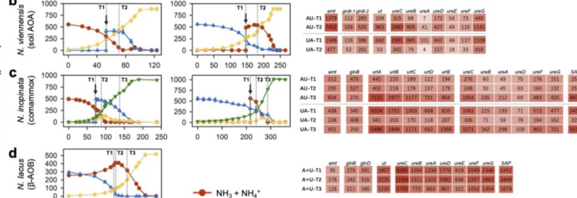

## Question

# Gene Research for Functional Annotation

## ⚠️ CRITICAL: Gene/Protein Identification Context

**BEFORE YOU BEGIN RESEARCH:** You MUST verify you are researching the CORRECT gene/protein. Gene symbols can be ambiguous, especially for less well-characterized genes from non-model organisms.

### Target Gene/Protein Identity (from UniProt):
- **UniProt Accession:** A0A060HQC5
- **Protein Description:** RecName: Full=Urease {ECO:0000256|ARBA:ARBA00012934, ECO:0000256|RuleBase:RU000510}; EC=3.5.1.5 {ECO:0000256|ARBA:ARBA00012934, ECO:0000256|RuleBase:RU000510};
- **Gene Information:** Name=ureC2 {ECO:0000313|EMBL:AIC15746.1}; ORFNames=NVIE_015020 {ECO:0000313|EMBL:AIC15746.1};
- **Organism (full):** Nitrososphaera viennensis EN76.
- **Protein Family:** Belongs to the metallo-dependent hydrolases superfamily.
- **Key Domains:** Amidohydro-rel. (IPR006680); Metal-dep_hydrolase_composite. (IPR011059); Metal_Hydrolase. (IPR032466); Urease_alpha_N_dom. (IPR011612); Urease_alpha_subunit. (IPR050112)

### MANDATORY VERIFICATION STEPS:

1. **Check if the gene symbol "ureC2" matches the protein description above**
2. **Verify the organism is correct:** Nitrososphaera viennensis EN76.
3. **Check if protein family/domains align with what you find in literature**
4. **If you find literature for a DIFFERENT gene with the same or similar symbol, STOP**

### If Gene Symbol is Ambiguous or You Cannot Find Relevant Literature:

**DO NOT PROCEED WITH RESEARCH ON A DIFFERENT GENE.** Instead:
- State clearly: "The gene symbol 'ureC2' is ambiguous or literature is limited for this specific protein"
- Explain what you found (e.g., "Found extensive literature on a different gene with the same symbol in a different organism")
- Describe the protein based ONLY on the UniProt information provided above
- Suggest that the protein function can be inferred from domain/family information

### Research Target:

Please provide a comprehensive research report on the gene **ureC2** (gene ID: ureC2, UniProt: A0A060HQC5) in 9ARCH.

The research report should be a detailed narrative explaining the function, biological processes, and localization of the gene product. Citations should be given for all claims.

You should prioritize authoritative reviews and primary scientific literature when conducting research. You can supplement
this with annotations you find in gene/protein databases, but these can be outdated or inaccurate.

We are specifically interested in the primary function of the gene - for enzymes, what reaction is catalyzed, and what is the substrate specificity? For transporters, what is the substrate? For structural proteins or adapters, what is the broader structural role? For signaling molecules, what is the role in the pathway.

We are interested in where in or outside the cell the gene product carries out its function.

We are also interested in the signaling or biochemical pathways in which the gene functions. We are less interested in broad pleiotropic effects, except where these elucidate the precise role.

Include evidence where possible. We are interested in both experimental evidence as well as inference from structure, evolution, or bioinformatic analysis. Precise studies should be prioritized over high-throughput, where available.

## Output

Question: You are an expert researcher providing comprehensive, well-cited information.

Provide detailed information focusing on:
1. Key concepts and definitions with current understanding
2. Recent developments and latest research (prioritize 2023-2024 sources)
3. Current applications and real-world implementations
4. Expert opinions and analysis from authoritative sources
5. Relevant statistics and data from recent studies

Format as a comprehensive research report with proper citations. Include URLs and publication dates where available.
Always prioritize recent, authoritative sources and provide specific citations for all major claims.

# Gene Research for Functional Annotation

## ⚠️ CRITICAL: Gene/Protein Identification Context

**BEFORE YOU BEGIN RESEARCH:** You MUST verify you are researching the CORRECT gene/protein. Gene symbols can be ambiguous, especially for less well-characterized genes from non-model organisms.

### Target Gene/Protein Identity (from UniProt):
- **UniProt Accession:** A0A060HQC5
- **Protein Description:** RecName: Full=Urease {ECO:0000256|ARBA:ARBA00012934, ECO:0000256|RuleBase:RU000510}; EC=3.5.1.5 {ECO:0000256|ARBA:ARBA00012934, ECO:0000256|RuleBase:RU000510};
- **Gene Information:** Name=ureC2 {ECO:0000313|EMBL:AIC15746.1}; ORFNames=NVIE_015020 {ECO:0000313|EMBL:AIC15746.1};
- **Organism (full):** Nitrososphaera viennensis EN76.
- **Protein Family:** Belongs to the metallo-dependent hydrolases superfamily.
- **Key Domains:** Amidohydro-rel. (IPR006680); Metal-dep_hydrolase_composite. (IPR011059); Metal_Hydrolase. (IPR032466); Urease_alpha_N_dom. (IPR011612); Urease_alpha_subunit. (IPR050112)

### MANDATORY VERIFICATION STEPS:

1. **Check if the gene symbol "ureC2" matches the protein description above**
2. **Verify the organism is correct:** Nitrososphaera viennensis EN76.
3. **Check if protein family/domains align with what you find in literature**
4. **If you find literature for a DIFFERENT gene with the same or similar symbol, STOP**

### If Gene Symbol is Ambiguous or You Cannot Find Relevant Literature:

**DO NOT PROCEED WITH RESEARCH ON A DIFFERENT GENE.** Instead:
- State clearly: "The gene symbol 'ureC2' is ambiguous or literature is limited for this specific protein"
- Explain what you found (e.g., "Found extensive literature on a different gene with the same symbol in a different organism")
- Describe the protein based ONLY on the UniProt information provided above
- Suggest that the protein function can be inferred from domain/family information

### Research Target:

Please provide a comprehensive research report on the gene **ureC2** (gene ID: ureC2, UniProt: A0A060HQC5) in 9ARCH.

The research report should be a detailed narrative explaining the function, biological processes, and localization of the gene product. Citations should be given for all claims.

You should prioritize authoritative reviews and primary scientific literature when conducting research. You can supplement
this with annotations you find in gene/protein databases, but these can be outdated or inaccurate.

We are specifically interested in the primary function of the gene - for enzymes, what reaction is catalyzed, and what is the substrate specificity? For transporters, what is the substrate? For structural proteins or adapters, what is the broader structural role? For signaling molecules, what is the role in the pathway.

We are interested in where in or outside the cell the gene product carries out its function.

We are also interested in the signaling or biochemical pathways in which the gene functions. We are less interested in broad pleiotropic effects, except where these elucidate the precise role.

Include evidence where possible. We are interested in both experimental evidence as well as inference from structure, evolution, or bioinformatic analysis. Precise studies should be prioritized over high-throughput, where available.

## Research report: functional annotation of **ureC2** (UniProt **A0A060HQC5**) in *Nitrososphaera viennensis* EN76 (AOA; class Nitrososphaeria)

### 1) Identity verification and gene-symbol ambiguity control (critical)
The UniProt accession **A0A060HQC5** is annotated as **Urease (EC 3.5.1.5)** with gene name **ureC2** and ORF name **NVIE_015020** in *Nitrososphaera viennensis* EN76. However, the organism’s best-supported urease alpha-subunit described in recent primary literature is **ureC (NVIE_014740)**, not NVIE_015020, and it sits in a **ut–ure operon** whose transcription is strongly regulated by nitrogen source (urea vs ammonia). In *N. viennensis*, transcripts of **ut (NVIE_014780)** and **ureC (NVIE_014740)** are ~10× higher after urea addition and ~10× lower after ammonia addition within 24 h, demonstrating direct condition-responsive expression of the characterized urease locus in EN76 (Qin et al., 2024; publication date Jan 2024). (qin2024ammoniaoxidizingbacteriaand pages 8-11, qin2024ammoniaoxidizingbacteriaand media 3dc337b2, qin2024ammoniaoxidizingbacteriaand media 6e9b78f2)

No retrieved primary paper in this tool session explicitly mentions **NVIE_015020** or **UniProt A0A060HQC5** by identifier. Therefore, **ureC2 (NVIE_015020)** should be treated as a **putative urease-alpha paralog** whose function is inferred from (i) urease family mechanism and (ii) evidence that EN76 contains **two copies of ureABC**, which makes a ureC paralog plausible. A 2023 comparative genomics study reports that **Nitrososphaera viennensis EN76 harbors two copies of ureABC**, consistent with a ureC paralog such as “ureC2,” but it does not map the second copy to NVIE_015020 in the excerpts available here. (Liu et al., 2023; publication date Dec 2023). (liu2023genomicinsightinto pages 4-7)

**Conclusion for verification:**
- **Confirmed for EN76:** a urease alpha-subunit **ureC (NVIE_014740)** in a regulated ut–ure operon, with direct transcriptomic evidence. (qin2024ammoniaoxidizingbacteriaand pages 8-11, qin2024ammoniaoxidizingbacteriaand media 3dc337b2, qin2024ammoniaoxidizingbacteriaand media 6e9b78f2)
- **Not directly confirmed from literature in this corpus:** that **ureC2 (NVIE_015020; A0A060HQC5)** is the same locus as NVIE_014740, or that it is expressed/functional under tested conditions. Claims below about ureC2 are therefore **inferences**, clearly labeled.

### 2) Key concepts and definitions (current understanding)

#### 2.1 Urease reaction, substrate specificity, and products
Urease (EC **3.5.1.5**) is a metalloenzyme that catalyzes urea hydrolysis. A commonly described mechanistic breakdown is that urease converts **urea to ammonia and carbamate**, and carbamate then decomposes spontaneously to yield a **second ammonia** and **bicarbonate** (or CO2/HCO3− depending on conditions). (hausinger2017ureaseactivation pages 1-3, nim2019thematurationpathway pages 1-3, proshlyakov2021ironcontainingureases. pages 1-2)

Across conventional ureases, the dominant and best-supported substrate is **urea**; this is the basis for annotating ureC-family genes as urea-hydrolyzing enzymes. (hausinger2017ureaseactivation pages 1-3, nim2019thematurationpathway pages 1-3)

#### 2.2 Subunit architecture: UreA/UreB/UreC and the catalytic role of UreC
In many bacteria, urease comprises three structural subunits, with the **α (large/catalytic) subunit encoded by ureC** and the conserved active site residing in this α subunit; the β and γ subunits are typically encoded by **ureB** and **ureA**, respectively, with variations such as fused subunits in some taxa. (hausinger2017ureaseactivation pages 1-3, nim2019thematurationpathway pages 1-3, proshlyakov2021ironcontainingureases. pages 1-2)

**Functional annotation implication for ureC2:** if A0A060HQC5 is truly a UreC-family protein in EN76, it most likely encodes an **α/large catalytic subunit** of a urease enzyme complex, contributing directly to urea hydrolysis. (hausinger2017ureaseactivation pages 1-3, nim2019thematurationpathway pages 1-3)

#### 2.3 Metal cofactors: dinuclear nickel (Ni2+) center
Conventional ureases typically contain a **dinuclear nickel active site**, often described as two Ni2+ ions bridged by a **carbamylated lysine** residue, with histidine/aspartate ligation. (hausinger2017ureaseactivation pages 1-3, nim2019thematurationpathway pages 1-3, proshlyakov2021ironcontainingureases. pages 1-2)

#### 2.4 Urease maturation (activation): accessory proteins UreD/UreH, UreE, UreF, UreG
A defining feature of many urease systems is the need for accessory proteins to assemble and insert the Ni2+ metallocenter. Reviews describe a maturation pathway involving **UreD (or UreH in some organisms), UreE, UreF, and UreG**, with Ni transfer chaperoned along a pathway summarized as **UreE → UreG → UreF/UreD → urease**, and with **UreG** functioning as a GTPase whose activity is coupled to nickel delivery. (hausinger2017ureaseactivation pages 1-3, nim2019thematurationpathway pages 1-3, nim2019thematurationpathway pages 8-10, nim2019thematurationpathway pages 3-5, hausinger2017ureaseactivation pages 6-7, hausinger2017ureaseactivation pages 7-8)

### 3) Current understanding of urease/urea utilization in *Nitrososphaera viennensis* EN76

#### 3.1 Genomic context: the characterized ut–ure operon (EN76)
A high-confidence EN76 urease locus includes a **urease operon associated with a urea transporter gene (ut)**. In EN76, **ureC (NVIE_014740)** is reported in the same operon context with **ut (NVIE_014780)**. This arrangement is illustrated in the paper’s Extended Data operon schematic, and the expression response is shown in the main figure heatmap. (qin2024ammoniaoxidizingbacteriaand pages 8-11, qin2024ammoniaoxidizingbacteriaand media 3dc337b2, qin2024ammoniaoxidizingbacteriaand media 6e9b78f2)

Earlier genome work on EN76 also reported a contig containing “genes encoding a potential urease operon,” providing historical genome-level support for urease capacity in this soil AOA lineage (Tourna et al., 2011; publication date Apr 2011). (tourna2011nitrososphaeraviennensisan pages 2-3)

#### 3.2 Evidence for regulation and functional role
The EN76 ut–ure locus shows strong transcriptional regulation consistent with urea utilization: ut and ureC transcripts increase after urea addition and decrease after ammonia addition, supporting a model where EN76 induces urea acquisition/hydrolysis machinery when urea is available or when ammonia is limiting. (qin2024ammoniaoxidizingbacteriaand pages 8-11, qin2024ammoniaoxidizingbacteriaand media 3dc337b2)

#### 3.3 Paralog/duplication evidence relevant to ureC2
A 2023 nitrifier comparative genomics study reports that **N. viennensis EN76 harbors two copies of ureABC**, and another 2014 genome analysis reports duplicated urease subunits in *Ca. Nitrososphaera* genomes (including two copies of urease subunits in *Ca. Nitrososphaera evergladensis*), suggesting duplication of urease structural genes can occur in this lineage. These results support the plausibility that **ureC2 (NVIE_015020)** corresponds to a second ureC-like copy in EN76. (liu2023genomicinsightinto pages 4-7, zhalnina2014genomesequenceof pages 5-6)

However, these sources do not provide locus-level mapping of the “second copy” to NVIE_015020 in the excerpts available here, and they do not provide expression or biochemical validation specific to ureC2. (liu2023genomicinsightinto pages 4-7, zhalnina2014genomesequenceof pages 5-6)

### 4) Likely molecular function of ureC2 (A0A060HQC5) and pathway placement (inference constrained by evidence)

#### 4.1 Primary molecular function (inferred)
Given the conserved urease system mechanism and the explicit annotation of A0A060HQC5 as urease (EC 3.5.1.5), the most parsimonious functional annotation is:
- **ureC2 encodes a urease α/large catalytic subunit** participating in urea hydrolysis to produce ammonia (and carbon dioxide/bicarbonate via carbamate decomposition). (hausinger2017ureaseactivation pages 1-3, nim2019thematurationpathway pages 1-3, proshlyakov2021ironcontainingureases. pages 1-2)

#### 4.2 Substrate specificity
The authoritative urease reviews describe urease as a specialized enzyme for **urea** hydrolysis, and the core catalytic architecture is conserved; thus ureC-family genes overwhelmingly imply urea as substrate. (hausinger2017ureaseactivation pages 1-3, nim2019thematurationpathway pages 1-3)

#### 4.3 Cellular localization
For ammonia-oxidizing archaea tested (including EN76), no extracellular urease activity was observed and urease genes lacked secretion signals, supporting **cytoplasmic localization** of urease activity (i.e., urea is imported and hydrolyzed intracellularly). This inference is consistent with EN76 having a urea transporter gene colocated with urease genes. (qin2023differentialsubstrateaffinity pages 4-7, qin2024ammoniaoxidizingbacteriaand media 3dc337b2, qin2024ammoniaoxidizingbacteriaand media 6e9b78f2)

#### 4.4 Pathway context in AOA physiology
In AOA, urease provides a route to generate **NH3/NH4+** from urea, which can feed:
- **ammonia oxidation** (energy metabolism) when ammonia is limiting, and/or
- **nitrogen assimilation** pathways.

Recent work emphasizes that AOA (including EN76) often prefer ammonia and regulate urea utilization, consistent with urease acting as an **alternative N (and potentially energy) source** rather than always the preferred substrate. (qin2023differentialsubstrateaffinity pages 4-7, qin2024ammoniaoxidizingbacteriaand pages 58-62)

### 5) Recent developments (2023–2024 prioritized)

#### 5.1 Differential nitrogen-source preference and operon-level regulation (2024)
A 2024 *Nature Microbiology* study provides direct evidence that EN76’s urea transporter and urease genes are **rapidly transcriptionally regulated** by nitrogen source, with strong induction upon urea addition and repression upon ammonia addition. This connects the urease locus to physiological nitrogen switching strategies in nitrifiers. (qin2024ammoniaoxidizingbacteriaand pages 8-11, qin2024ammoniaoxidizingbacteriaand media 3dc337b2, qin2024ammoniaoxidizingbacteriaand media 6e9b78f2)

#### 5.2 Soil Nitrososphaeria: ureC prevalence and in situ expression (2023)
A 2023 *ISME Journal* study analyzing soil archaeal lineages estimated that **~85.7–89.8% of AOA** in upland soils encoded urease (ureC) on average, indicating broad potential for urea utilization among soil Nitrososphaeria lineages (including Nitrososphaerales). (zhao2023nitrogenandphosphorous pages 5-6)

The same study found many Nitrososphaerales families had **ureC transcripts 13–22× higher** and **ut transcripts 41–177× higher** than an ammonium-replete *N. viennensis* culture reference, supporting the view that urea acquisition/hydrolysis is often upregulated in soils relative to nutrient-replete laboratory conditions. (zhao2023nitrogenandphosphorous pages 7-9)

#### 5.3 Comparative genomics/evolution: duplicated ureABC and transporter associations (2023)
A 2023 comparative genomics survey of nitrifiers reports widespread urease gene clusters in AOA, with urea transporters such as **dur3** and **utp/ut** rather than bacterial urtABCDE. It also reports that **EN76 harbors two copies of ureABC**, relevant for interpreting a ureC2 paralog. (liu2023genomicinsightinto pages 9-11, liu2023genomicinsightinto pages 4-7)

#### 5.4 Ocean-scale importance: ureC prevalence and single-cell urea assimilation (2024)
A 2024 *ISME Journal* study combining metagenomics and NanoSIMS reported that **39% of deep-sea cells** in a NE Pacific region contained **ureC**, and global surveys suggested **~10–46%** of deep-sea cells contain ureC, indicating a large reservoir of urea-hydrolyzing potential in the dark ocean microbiome. They also found that on average **~25% of deep-sea cells assimilated urea-derived N** (representing **60% of detectably active cells**). (arandiagorostidi2024ureaassimilationand pages 1-2)

### 6) Real-world applications and implementations (contextualized to ureC/urease in nitrifiers)

Although ureC2 in EN76 is basic science rather than a directly engineered target, urease biology in nitrifiers underpins applied domains:

1. **Agricultural nitrogen management:** Urea fertilizers are globally important; microbial urease and nitrification contribute to nitrogen transformations and losses. Mechanistic understanding of urease genes (ureC) and their regulation in soil nitrifiers helps interpret how fertilization regimes may shift nitrifier function and N cycling. Soil studies show high prevalence and expression of ureC among soil AOA lineages, supporting its relevance in managed soils. (zhao2023nitrogenandphosphorous pages 5-6, zhao2023nitrogenandphosphorous pages 7-9)

2. **Environmental monitoring and modeling:** ureC abundance and expression are used as indicators of urea utilization capacity in ecosystems. Recent ocean work quantifies ureC prevalence at large scales and links it to urea assimilation and nitrification in the deep sea. (arandiagorostidi2024ureaassimilationand pages 1-2)

3. **Bioprocesses involving nitrogen cycling:** While EN76 itself is not a standard wastewater workhorse, insights into how nitrifiers regulate urea uptake and hydrolysis can inform design/operation of nitrifying systems where urea or urea-derived compounds are present, and help interpret gene-expression readouts in engineered microbiomes. The 2024 study provides a general framework for differential substrate preference and regulatory control among ammonia oxidizers. (qin2024ammoniaoxidizingbacteriaand pages 8-11)

### 7) Expert interpretation and authoritative analysis

#### 7.1 Urease as a nickel-dependent metalloenzyme requiring maturation systems
Authoritative reviews emphasize that urease activity depends not just on ureC but also on a dedicated maturation pathway for safe Ni2+ delivery (UreD/E/F/G; UreG GTPase), implying that functional annotation of ureC2 should consider whether accessory genes are present and co-regulated in the genome neighborhood or regulon. (nim2019thematurationpathway pages 1-3, nim2019thematurationpathway pages 8-10, hausinger2017ureaseactivation pages 6-7)

#### 7.2 Why keep two ureABC copies? (hypothesis constrained by evidence)
The available literature here supports duplication of ureABC in EN76 and related *Nitrososphaera* lineages but does not experimentally resolve paralog specialization. Plausible expert-level hypotheses (not directly proven here) include: differential regulation under distinct nitrogen regimes, redundancy for robustness, or divergent enzyme kinetics/metal handling. Any such claims require dedicated paralog-specific expression/proteomics/biochemistry, which is not provided for NVIE_015020 in the retrieved corpus. (liu2023genomicinsightinto pages 4-7, zhalnina2014genomesequenceof pages 5-6)

### 8) Key quantitative statistics (recent)
- **EN76 ut–ure operon expression response:** ut and ureC transcripts in EN76 were ~10× higher after urea addition and ~10× lower after ammonia addition within 24 h. (Qin et al., 2024, *Nature Microbiology*, Jan 2024). (qin2024ammoniaoxidizingbacteriaand pages 8-11, qin2024ammoniaoxidizingbacteriaand media 3dc337b2)
- **Soil AOA ureC prevalence:** ~85.7–89.8% of AOA in upland soils encoded urease (ureC) on average. (Zhao et al., 2023, *ISME Journal*, Aug 2023). (zhao2023nitrogenandphosphorous pages 5-6)
- **Soil transcript enrichment vs EN76 reference:** ureC transcripts 13–22× and ut transcripts 41–177× higher than ammonium-replete *N. viennensis* reference in most Nitrososphaerales families. (Zhao et al., 2023). (zhao2023nitrogenandphosphorous pages 7-9)
- **Deep ocean ureC prevalence:** 39% of deep-sea cells (NE Pacific) contained ureC; globally ~10–46% of deep-sea cells estimated to contain ureC. (Arandia-Gorostidi et al., 2024, *ISME Journal*, Jan 2024). (arandiagorostidi2024ureaassimilationand pages 1-2)
- **Deep ocean single-cell activity:** ~25% of deep-sea cells assimilated urea-derived N on average (60% of detectably active cells). (Arandia-Gorostidi et al., 2024). (arandiagorostidi2024ureaassimilationand pages 1-2)

### 9) Evidence summary table (EN76-focused)
The following table compiles key claims, gene IDs, and limitations—especially the critical distinction between EN76 ureC (NVIE_014740) supported by experiments and the target ureC2 (NVIE_015020; A0A060HQC5) not explicitly mentioned in retrieved primary literature.

| Topic | Key finding | Specific gene/locus (if given) | Evidence type (genomic, transcriptomic, physiology, review) | Source (first author year, journal) | URL | Notes/limitations |
|---|---|---|---|---|---|---|
| Verified urease operon in *N. viennensis* EN76 | A urease alpha-subunit gene annotated as **ureC (NVIE_014740)** occurs in a **ut–ure operon**; transcript levels of **ut** and **ureC** increase strongly after urea addition and decrease after ammonia addition, indicating nitrogen-source-responsive regulation. | **ureC = NVIE_014740**; **ut = NVIE_014780** | Genomic + transcriptomic | Qin 2024, *Nature Microbiology* | https://doi.org/10.1038/s41564-023-01593-7 | This is the clearest organism-specific evidence for EN76 urease expression, but it refers to **NVIE_014740**, not the UniProt target **A0A060HQC5 / NVIE_015020 (ureC2)**; therefore these should not be conflated. Operon schematic also shown in figure context. (qin2024ammoniaoxidizingbacteriaand pages 8-11, qin2024ammoniaoxidizingbacteriaand media 3dc337b2, qin2024ammoniaoxidizingbacteriaand media 6e9b78f2) |
| Potential second urease copy in *N. viennensis* EN76 | Comparative genomics reported that *N. viennensis* EN76 **harbors two copies of ureABC**. | Strain-level duplication reported; specific second-copy locus not given in excerpt | Genomic | Liu 2023, *Frontiers in Microbiology* | https://doi.org/10.3389/fmicb.2023.1273211 | Supports the possibility of a second urease alpha-subunit paralog, consistent with a **ureC2-like** annotation, but the excerpt does **not** explicitly map this to **NVIE_015020/A0A060HQC5**. (liu2023genomicinsightinto pages 4-7) |
| Broader *Ca. Nitrososphaera* duplication pattern | In *Ca. Nitrososphaera evergladensis*, all urease subunits were reported in **two copies**, and this duplication was described as characteristic of *Ca. Nitrososphaera* genomes compared with other AOA examined. | **ureA, ureB, ureC** duplicated in *Ca. N. evergladensis* | Genomic | Zhalnina 2014, *PLoS ONE* | https://doi.org/10.1371/journal.pone.0101648 | This supports lineage-level precedent for duplicated urease genes in Nitrososphaerales/related *Nitrososphaera*, but is not direct proof for the exact EN76 locus **NVIE_015020**. (zhalnina2014genomesequenceof pages 5-6) |
| Earliest EN76 urease evidence | The original EN76 draft genome contained a contig with a **potential urease operon**. | Not specified in excerpt | Genomic | Tourna 2011, *PNAS* | https://doi.org/10.1073/pnas.1013488108 | Establishes early genome-based evidence for urease in EN76, but without locus IDs, operon order, or direct physiological proof of growth on urea in the cited excerpt. (tourna2011nitrososphaeraviennensisan pages 2-3) |
| Urease localization in AOA | No extracellular urease activity was observed in tested AOA, and urease genes lacked secretion signals; this supports **cytoplasmic localization** of urease in *N. viennensis* and related AOA. | Urease operon genes in AOA; no secretory signal reported | Physiology + genomic inference | Qin 2023, *bioRxiv*; Qin 2024, *Nature Microbiology* | https://doi.org/10.1101/2023.08.04.551995 ; https://doi.org/10.1038/s41564-023-01593-7 | Strong functional inference for subcellular localization, but not direct microscopy/protein-localization assay. (qin2023differentialsubstrateaffinity pages 4-7) |
| Urea utilization physiology in AOA including EN76 | Tested AOA, including *N. viennensis*, generally **prefer ammonia over urea** and repress urea-use functions when ammonia is available; after ammonia exhaustion, EN76 transitions to urea use. | EN76 urease pathway; specific loci not all listed in excerpt | Physiology + transcriptomic | Qin 2023, *bioRxiv*; Qin 2024, *Nature Microbiology* | https://doi.org/10.1101/2023.08.04.551995 ; https://doi.org/10.1038/s41564-023-01593-7 | Important for functional interpretation: urease contributes to alternative N acquisition rather than constitutive preferred substrate use under ammonia-replete conditions. (qin2023differentialsubstrateaffinity pages 4-7, qin2024ammoniaoxidizingbacteriaand pages 58-62) |
| Urease catalytic function | Urease (EC 3.5.1.5) hydrolyzes **urea → ammonia + carbamate**, and carbamate then decomposes to a second ammonia plus bicarbonate/CO2. The catalytic active site resides in the **UreC/α subunit**. | **UreC = alpha/large catalytic subunit** | Review/mechanistic | Hausinger 2017, *Encyclopedia of Inorganic and Bioinorganic Chemistry*; Nim 2019, *Inorganics* | https://doi.org/10.1002/9781119951438.eibc2483 ; https://doi.org/10.3390/inorganics7070085 | This is the best-supported molecular function to infer for **A0A060HQC5** if it is a true urease alpha-subunit paralog. Substrate specificity is overwhelmingly urea in conventional ureases. (hausinger2017ureaseactivation pages 1-3, nim2019thematurationpathway pages 1-3, nim2019thematurationpathway pages 10-12, proshlyakov2021ironcontainingureases. pages 1-2) |
| Metal cofactor and maturation | Conventional ureases contain a **dinuclear Ni2+ active site** bridged by a carbamylated lysine; activation requires accessory proteins **UreD/UreH, UreE, UreF, UreG**, with Ni transfer along **UreE → UreG → UreF/UreD → urease**. | Accessory genes **ureD/ureH, ureE, ureF, ureG** | Review/mechanistic | Hausinger 2017, *Encyclopedia*; Nim 2019, *Inorganics* | https://doi.org/10.1002/9781119951438.eibc2483 ; https://doi.org/10.3390/inorganics7070085 | Strongly supports annotation of a urease alpha-subunit-like protein, but does not distinguish which EN76 paralog is catalytically active. (nim2019thematurationpathway pages 1-3, nim2019thematurationpathway pages 8-10, nim2019thematurationpathway pages 3-5, hausinger2017ureaseactivation pages 6-7, hausinger2017ureaseactivation pages 7-8) |
| Operon organization in AOA | Most AOA genomes contain **ureABC + ureDEFG**; in many AOA, urea transporter genes (**dur3** and/or **utp/ut**) occur near urease genes. | **ureABC, ureDEFG, dur3, ut/utp** | Comparative genomics | Liu 2023, *Frontiers in Microbiology* | https://doi.org/10.3389/fmicb.2023.1273211 | Provides comparative context for EN76 operon architecture and helps explain why transporter and urease genes are often co-regulated. (liu2023genomicinsightinto pages 9-11, liu2023genomicinsightinto pages 4-7) |
| Soil AOA prevalence of ureC | In upland soils, an estimated **85.7–89.8% of AOA** encoded **urease (ureC)** on average; ureC was detected across all Nitrososphaerales lineages sampled. | **ureC** | Metagenomic/statistical | Zhao 2023, *The ISME Journal* | https://doi.org/10.1038/s41396-023-01493-y | Supports ecological importance of urease in soil Nitrososphaeria, relevant because EN76 is a soil AOA. This is lineage/community-level, not EN76-specific. (zhao2023nitrogenandphosphorous pages 5-6) |
| Soil AOA ureC expression versus EN76 culture reference | In soil metatranscriptomes, most Nitrososphaerales families showed **ureC transcripts 13–22× higher** and **urea transporter transcripts 41–177× higher** than ammonium-replete *N. viennensis* reference cultures. | **ureC**, **ut** | Metatranscriptomic/statistical | Zhao 2023, *The ISME Journal* | https://doi.org/10.1038/s41396-023-01493-y | Suggests that field AOA often upregulate urea acquisition more strongly than EN76 grown under ammonium-replete lab conditions. (zhao2023nitrogenandphosphorous pages 7-9) |
| Deep-ocean ureC prevalence and activity | In a 2024 deep-ocean study, **39% of deep-sea cells** in the sampled region contained **ureC**; globally, **~10–46%** of deep-sea cells were estimated to contain ureC. On average, **25% of deep-sea cells** assimilated urea-derived N, representing **60% of detectably active cells**. | **ureC** | Metagenomic + single-cell activity/statistical | Arandia-Gorostidi 2024, *The ISME Journal* | https://doi.org/10.1093/ismejo/wrae230 | Not EN76-specific, but demonstrates contemporary ecological importance of urease-bearing nitrifiers including Nitrososphaeria. (arandiagorostidi2024ureaassimilationanda pages 13-17, arandiagorostidi2024ureaassimilationand pages 1-2) |
| Quantitative comparison of ureC vs amoA in the deep ocean | **ureC was ~2× more abundant than amoA** on average (**0.45 ureC/recA vs 0.23 amoA/recA**), implying substantial urea-cleaving potential outside strict ammonia oxidizers; ureC-containing MAGs were more abundant in the bathypelagic (**2.56%**) than epipelagic (**0.76%**). | **ureC, amoA** | Metagenomic/statistical | Arandia-Gorostidi 2024, *bioRxiv* | https://doi.org/10.1101/2024.07.26.605319 | Preprint values; useful recent quantitative context for environmental importance of urease/ureC. (arandiagorostidi2024ureaassimilationanda pages 13-17, arandiagorostidi2024ureaassimilationanda pages 8-13) |

*Table: This table compiles organism-specific and comparative evidence about urease genes, operon context, regulation, localization, and ecological relevance for *Nitrososphaera viennensis* EN76. It is especially useful for distinguishing the experimentally supported EN76 urease locus NVIE_014740 from the less directly documented putative paralog ureC2/NVIE_015020.*

### 10) Bottom-line functional annotation for **ureC2 (A0A060HQC5; NVIE_015020)**

**Most likely molecular function (inferred):** ureC2 encodes a **UreC-family urease α/large catalytic subunit** (EC 3.5.1.5) that catalyzes intracellular hydrolysis of **urea → ammonia + carbamate** (followed by carbamate → ammonia + bicarbonate/CO2), using a **dinuclear Ni2+** active site assembled via accessory maturation proteins (UreD/E/F/G). (hausinger2017ureaseactivation pages 1-3, nim2019thematurationpathway pages 1-3, proshlyakov2021ironcontainingureases. pages 1-2)

**Most likely biological role in EN76:** provide ammonia from urea as an alternative nitrogen (and potentially energy) source under ammonia limitation, consistent with strong urea-responsive regulation observed for the characterized EN76 urease locus and widespread soil AOA ureC capacity/expression. (qin2024ammoniaoxidizingbacteriaand pages 8-11, zhao2023nitrogenandphosphorous pages 5-6, zhao2023nitrogenandphosphorous pages 7-9)

**Localization:** cytoplasmic, based on lack of evidence for extracellular urease activity and absence of secretion signals in tested AOA, consistent with presence of urea transporters colocated with ure genes. (qin2023differentialsubstrateaffinity pages 4-7)

**Critical limitation:** this report cannot attribute the above properties specifically to NVIE_015020 (A0A060HQC5) rather than the experimentally referenced ureC NVIE_014740, because NVIE_015020 is not explicitly cited in the retrieved primary literature; ureC2-specific conclusions therefore remain inferential, albeit supported by (i) urease mechanism reviews and (ii) duplication of ureABC in EN76 reported by comparative genomics. (liu2023genomicinsightinto pages 4-7)

References

1. (qin2024ammoniaoxidizingbacteriaand pages 8-11): Wei Qin, Stephany P. Wei, Yue Zheng, Eunkyung Choi, Xiangpeng Li, Juliet Johnston, Xianhui Wan, Britt Abrahamson, Zachary Flinkstrom, Baozhan Wang, Hanyan Li, Lei Hou, Qing Tao, Wyatt W. Chlouber, Xin Sun, Michael Wells, Long Ngo, Kristopher A. Hunt, Hidetoshi Urakawa, Xuanyu Tao, Dongyu Wang, Xiaoyuan Yan, Dazhi Wang, Chongle Pan, Peter K. Weber, Jiandong Jiang, Jizhong Zhou, Yao Zhang, David A. Stahl, Bess B. Ward, Xavier Mayali, Willm Martens-Habbena, and Mari-Karoliina H. Winkler. Ammonia-oxidizing bacteria and archaea exhibit differential nitrogen source preferences. Nature microbiology, 9:524-536, Jan 2024. URL: https://doi.org/10.1038/s41564-023-01593-7, doi:10.1038/s41564-023-01593-7. This article has 122 citations and is from a highest quality peer-reviewed journal.

2. (qin2024ammoniaoxidizingbacteriaand media 3dc337b2): Wei Qin, Stephany P. Wei, Yue Zheng, Eunkyung Choi, Xiangpeng Li, Juliet Johnston, Xianhui Wan, Britt Abrahamson, Zachary Flinkstrom, Baozhan Wang, Hanyan Li, Lei Hou, Qing Tao, Wyatt W. Chlouber, Xin Sun, Michael Wells, Long Ngo, Kristopher A. Hunt, Hidetoshi Urakawa, Xuanyu Tao, Dongyu Wang, Xiaoyuan Yan, Dazhi Wang, Chongle Pan, Peter K. Weber, Jiandong Jiang, Jizhong Zhou, Yao Zhang, David A. Stahl, Bess B. Ward, Xavier Mayali, Willm Martens-Habbena, and Mari-Karoliina H. Winkler. Ammonia-oxidizing bacteria and archaea exhibit differential nitrogen source preferences. Nature microbiology, 9:524-536, Jan 2024. URL: https://doi.org/10.1038/s41564-023-01593-7, doi:10.1038/s41564-023-01593-7. This article has 122 citations and is from a highest quality peer-reviewed journal.

3. (qin2024ammoniaoxidizingbacteriaand media 6e9b78f2): Wei Qin, Stephany P. Wei, Yue Zheng, Eunkyung Choi, Xiangpeng Li, Juliet Johnston, Xianhui Wan, Britt Abrahamson, Zachary Flinkstrom, Baozhan Wang, Hanyan Li, Lei Hou, Qing Tao, Wyatt W. Chlouber, Xin Sun, Michael Wells, Long Ngo, Kristopher A. Hunt, Hidetoshi Urakawa, Xuanyu Tao, Dongyu Wang, Xiaoyuan Yan, Dazhi Wang, Chongle Pan, Peter K. Weber, Jiandong Jiang, Jizhong Zhou, Yao Zhang, David A. Stahl, Bess B. Ward, Xavier Mayali, Willm Martens-Habbena, and Mari-Karoliina H. Winkler. Ammonia-oxidizing bacteria and archaea exhibit differential nitrogen source preferences. Nature microbiology, 9:524-536, Jan 2024. URL: https://doi.org/10.1038/s41564-023-01593-7, doi:10.1038/s41564-023-01593-7. This article has 122 citations and is from a highest quality peer-reviewed journal.

4. (liu2023genomicinsightinto pages 4-7): Qian Liu, Yuhao Chen, and Xue-Wei Xu. Genomic insight into strategy, interaction and evolution of nitrifiers in metabolizing key labile-dissolved organic nitrogen in different environmental niches. Frontiers in Microbiology, Dec 2023. URL: https://doi.org/10.3389/fmicb.2023.1273211, doi:10.3389/fmicb.2023.1273211. This article has 10 citations and is from a peer-reviewed journal.

5. (hausinger2017ureaseactivation pages 1-3): Robert P. Hausinger. Urease activation. Encyclopedia of Inorganic and Bioinorganic Chemistry, pages 1-10, Sep 2017. URL: https://doi.org/10.1002/9781119951438.eibc2483, doi:10.1002/9781119951438.eibc2483. This article has 2 citations.

6. (nim2019thematurationpathway pages 1-3): Yap Shing Nim and Kam-Bo Wong. The maturation pathway of nickel urease. Inorganics, 7:85, Jul 2019. URL: https://doi.org/10.3390/inorganics7070085, doi:10.3390/inorganics7070085. This article has 51 citations.

7. (proshlyakov2021ironcontainingureases. pages 1-2): Denis A. Proshlyakov, Mark A. Farrugia, Yegor D. Proshlyakov, and Robert P. Hausinger. Iron-containing ureases. Coordination chemistry reviews, 448:214190, Dec 2021. URL: https://doi.org/10.1016/j.ccr.2021.214190, doi:10.1016/j.ccr.2021.214190. This article has 17 citations and is from a peer-reviewed journal.

8. (nim2019thematurationpathway pages 8-10): Yap Shing Nim and Kam-Bo Wong. The maturation pathway of nickel urease. Inorganics, 7:85, Jul 2019. URL: https://doi.org/10.3390/inorganics7070085, doi:10.3390/inorganics7070085. This article has 51 citations.

9. (nim2019thematurationpathway pages 3-5): Yap Shing Nim and Kam-Bo Wong. The maturation pathway of nickel urease. Inorganics, 7:85, Jul 2019. URL: https://doi.org/10.3390/inorganics7070085, doi:10.3390/inorganics7070085. This article has 51 citations.

10. (hausinger2017ureaseactivation pages 6-7): Robert P. Hausinger. Urease activation. Encyclopedia of Inorganic and Bioinorganic Chemistry, pages 1-10, Sep 2017. URL: https://doi.org/10.1002/9781119951438.eibc2483, doi:10.1002/9781119951438.eibc2483. This article has 2 citations.

11. (hausinger2017ureaseactivation pages 7-8): Robert P. Hausinger. Urease activation. Encyclopedia of Inorganic and Bioinorganic Chemistry, pages 1-10, Sep 2017. URL: https://doi.org/10.1002/9781119951438.eibc2483, doi:10.1002/9781119951438.eibc2483. This article has 2 citations.

12. (tourna2011nitrososphaeraviennensisan pages 2-3): Maria Tourna, Michaela Stieglmeier, Anja Spang, Martin Könneke, Arno Schintlmeister, Tim Urich, Marion Engel, Michael Schloter, Michael Wagner, Andreas Richter, and Christa Schleper. Nitrososphaera viennensis, an ammonia oxidizing archaeon from soil. Proceedings of the National Academy of Sciences, 108:8420-8425, Apr 2011. URL: https://doi.org/10.1073/pnas.1013488108, doi:10.1073/pnas.1013488108. This article has 1117 citations and is from a highest quality peer-reviewed journal.

13. (zhalnina2014genomesequenceof pages 5-6): Kateryna V. Zhalnina, Raquel Dias, Michael T. Leonard, Patricia Dorr de Quadros, Flavio A. O. Camargo, Jennifer C. Drew, William G. Farmerie, Samira H. Daroub, and Eric W. Triplett. Genome sequence of candidatus nitrososphaera evergladensis from group i.1b enriched from everglades soil reveals novel genomic features of the ammonia-oxidizing archaea. PLoS ONE, 9:e101648, Jul 2014. URL: https://doi.org/10.1371/journal.pone.0101648, doi:10.1371/journal.pone.0101648. This article has 129 citations and is from a peer-reviewed journal.

14. (qin2023differentialsubstrateaffinity pages 4-7): Wei Qin, Stephany P. Wei, Yue Zheng, Eunkyung Choi, Xiangpeng Li, Juliet Johnston, Xianhui Wan, Britt Abrahamson, Zachary Flinkstrom, Baozhan Wang, Hanyan Li, Lei Hou, Qing Tao, Wyatt W. Chlouber, Xin Sun, Michael Wells, Long Ngo, Kristopher A. Hunt, Hidetoshi Urakawa, Xuanyu Tao, Dongyu Wang, Xiaoyuan Yan, Dazhi Wang, Chongle Pan, Peter K. Weber, Jiandong Jiang, Jizhong Zhou, Yao Zhang, David A. Stahl, Bess B. Ward, Xavier Mayali, Willm Martens-Habbena, and Mari-Karoliina H. Winkler. Differential substrate affinity and catabolite repression enable preferential use of urea by ammonia-oxidizing bacteria. bioRxiv, Aug 2023. URL: https://doi.org/10.1101/2023.08.04.551995, doi:10.1101/2023.08.04.551995. This article has 1 citations.

15. (qin2024ammoniaoxidizingbacteriaand pages 58-62): Wei Qin, Stephany P. Wei, Yue Zheng, Eunkyung Choi, Xiangpeng Li, Juliet Johnston, Xianhui Wan, Britt Abrahamson, Zachary Flinkstrom, Baozhan Wang, Hanyan Li, Lei Hou, Qing Tao, Wyatt W. Chlouber, Xin Sun, Michael Wells, Long Ngo, Kristopher A. Hunt, Hidetoshi Urakawa, Xuanyu Tao, Dongyu Wang, Xiaoyuan Yan, Dazhi Wang, Chongle Pan, Peter K. Weber, Jiandong Jiang, Jizhong Zhou, Yao Zhang, David A. Stahl, Bess B. Ward, Xavier Mayali, Willm Martens-Habbena, and Mari-Karoliina H. Winkler. Ammonia-oxidizing bacteria and archaea exhibit differential nitrogen source preferences. Nature microbiology, 9:524-536, Jan 2024. URL: https://doi.org/10.1038/s41564-023-01593-7, doi:10.1038/s41564-023-01593-7. This article has 122 citations and is from a highest quality peer-reviewed journal.

16. (zhao2023nitrogenandphosphorous pages 5-6): Jun Zhao, Laibin Huang, Seemanti Chakrabarti, Jennifer Cooper, EunKyung Choi, Carolina Ganan, Bryn Tolchinsky, Eric W Triplett, Samira H Daroub, and Willm Martens-Habbena. Nitrogen and phosphorous acquisition strategies drive coexistence patterns among archaeal lineages in soil. The ISME Journal, 17:1839-1850, Aug 2023. URL: https://doi.org/10.1038/s41396-023-01493-y, doi:10.1038/s41396-023-01493-y. This article has 25 citations.

17. (zhao2023nitrogenandphosphorous pages 7-9): Jun Zhao, Laibin Huang, Seemanti Chakrabarti, Jennifer Cooper, EunKyung Choi, Carolina Ganan, Bryn Tolchinsky, Eric W Triplett, Samira H Daroub, and Willm Martens-Habbena. Nitrogen and phosphorous acquisition strategies drive coexistence patterns among archaeal lineages in soil. The ISME Journal, 17:1839-1850, Aug 2023. URL: https://doi.org/10.1038/s41396-023-01493-y, doi:10.1038/s41396-023-01493-y. This article has 25 citations.

18. (liu2023genomicinsightinto pages 9-11): Qian Liu, Yuhao Chen, and Xue-Wei Xu. Genomic insight into strategy, interaction and evolution of nitrifiers in metabolizing key labile-dissolved organic nitrogen in different environmental niches. Frontiers in Microbiology, Dec 2023. URL: https://doi.org/10.3389/fmicb.2023.1273211, doi:10.3389/fmicb.2023.1273211. This article has 10 citations and is from a peer-reviewed journal.

19. (arandiagorostidi2024ureaassimilationand pages 1-2): Nestor Arandia-Gorostidi, Alexander L Jaffe, Alma E Parada, Bennett J Kapili, Karen L Casciotti, Rebecca S R Salcedo, Chloé M J Baumas, and Anne E Dekas. Urea assimilation and oxidation support activity of phylogenetically diverse microbial communities of the dark ocean. The ISME Journal, Jan 2024. URL: https://doi.org/10.1093/ismejo/wrae230, doi:10.1093/ismejo/wrae230. This article has 10 citations.

20. (nim2019thematurationpathway pages 10-12): Yap Shing Nim and Kam-Bo Wong. The maturation pathway of nickel urease. Inorganics, 7:85, Jul 2019. URL: https://doi.org/10.3390/inorganics7070085, doi:10.3390/inorganics7070085. This article has 51 citations.

21. (arandiagorostidi2024ureaassimilationanda pages 13-17): Nestor Arandia-Gorostidi, Alexander L. Jaffe, Alma E. Parada, Bennett J. Kapili, Karen L. Casciotti, Rebecca S. R. Salcedo, Chloé M. J. Baumas, and Anne E. Dekas. Urea assimilation and oxidation supports the activity of a phylogenetically diverse microbial community in the dark ocean. bioRxiv, Jul 2024. URL: https://doi.org/10.1101/2024.07.26.605319, doi:10.1101/2024.07.26.605319. This article has 1 citations.

22. (arandiagorostidi2024ureaassimilationanda pages 8-13): Nestor Arandia-Gorostidi, Alexander L. Jaffe, Alma E. Parada, Bennett J. Kapili, Karen L. Casciotti, Rebecca S. R. Salcedo, Chloé M. J. Baumas, and Anne E. Dekas. Urea assimilation and oxidation supports the activity of a phylogenetically diverse microbial community in the dark ocean. bioRxiv, Jul 2024. URL: https://doi.org/10.1101/2024.07.26.605319, doi:10.1101/2024.07.26.605319. This article has 1 citations.

## Artifacts

- [Edison artifact artifact-00](ureC2-deep-research-falcon_artifacts/artifact-00.md)

## Citations

1. liu2023genomicinsightinto pages 4-7
2. tourna2011nitrososphaeraviennensisan pages 2-3
3. zhao2023nitrogenandphosphorous pages 5-6
4. zhao2023nitrogenandphosphorous pages 7-9
5. arandiagorostidi2024ureaassimilationand pages 1-2
6. qin2024ammoniaoxidizingbacteriaand pages 8-11
7. zhalnina2014genomesequenceof pages 5-6
8. qin2023differentialsubstrateaffinity pages 4-7
9. hausinger2017ureaseactivation pages 1-3
10. nim2019thematurationpathway pages 1-3
11. nim2019thematurationpathway pages 8-10
12. nim2019thematurationpathway pages 3-5
13. hausinger2017ureaseactivation pages 6-7
14. hausinger2017ureaseactivation pages 7-8
15. qin2024ammoniaoxidizingbacteriaand pages 58-62
16. liu2023genomicinsightinto pages 9-11
17. nim2019thematurationpathway pages 10-12
18. arandiagorostidi2024ureaassimilationanda pages 13-17
19. arandiagorostidi2024ureaassimilationanda pages 8-13
20. https://doi.org/10.1038/s41564-023-01593-7
21. https://doi.org/10.3389/fmicb.2023.1273211
22. https://doi.org/10.1371/journal.pone.0101648
23. https://doi.org/10.1073/pnas.1013488108
24. https://doi.org/10.1101/2023.08.04.551995
25. https://doi.org/10.1002/9781119951438.eibc2483
26. https://doi.org/10.3390/inorganics7070085
27. https://doi.org/10.1038/s41396-023-01493-y
28. https://doi.org/10.1093/ismejo/wrae230
29. https://doi.org/10.1101/2024.07.26.605319
30. https://doi.org/10.1038/s41564-023-01593-7,
31. https://doi.org/10.3389/fmicb.2023.1273211,
32. https://doi.org/10.1002/9781119951438.eibc2483,
33. https://doi.org/10.3390/inorganics7070085,
34. https://doi.org/10.1016/j.ccr.2021.214190,
35. https://doi.org/10.1073/pnas.1013488108,
36. https://doi.org/10.1371/journal.pone.0101648,
37. https://doi.org/10.1101/2023.08.04.551995,
38. https://doi.org/10.1038/s41396-023-01493-y,
39. https://doi.org/10.1093/ismejo/wrae230,
40. https://doi.org/10.1101/2024.07.26.605319,