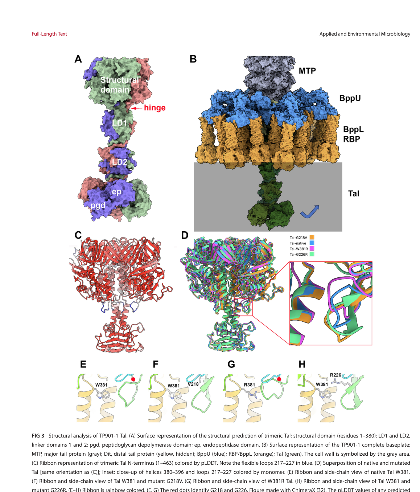

## Question

# Gene Research for Functional Annotation

## ⚠️ CRITICAL: Gene/Protein Identification Context

**BEFORE YOU BEGIN RESEARCH:** You MUST verify you are researching the CORRECT gene/protein. Gene symbols can be ambiguous, especially for less well-characterized genes from non-model organisms.

### Target Gene/Protein Identity (from UniProt):
- **UniProt Accession:** A0ABV4S5I6
- **Protein Description:** SubName: Full=Prophage endopeptidase tail family protein {ECO:0000313|EMBL:MFA2795213.1};
- **Gene Information:** ORFNames=AB1I70_28485 {ECO:0000313|EMBL:MFA2795213.1};
- **Organism (full):** Bacillus mobilis.
- **Protein Family:** Not specified in UniProt
- **Key Domains:** Phage_tail_spike_N. (IPR007119); Prophage_tail_N. (IPR044051); Tail_dom. (IPR010572); Prophage_tail (PF06605); Prophage_tailD1 (PF18994)

### MANDATORY VERIFICATION STEPS:

1. **Check if the gene symbol "AB1I70_28485" matches the protein description above**
2. **Verify the organism is correct:** Bacillus mobilis.
3. **Check if protein family/domains align with what you find in literature**
4. **If you find literature for a DIFFERENT gene with the same or similar symbol, STOP**

### If Gene Symbol is Ambiguous or You Cannot Find Relevant Literature:

**DO NOT PROCEED WITH RESEARCH ON A DIFFERENT GENE.** Instead:
- State clearly: "The gene symbol 'AB1I70_28485' is ambiguous or literature is limited for this specific protein"
- Explain what you found (e.g., "Found extensive literature on a different gene with the same symbol in a different organism")
- Describe the protein based ONLY on the UniProt information provided above
- Suggest that the protein function can be inferred from domain/family information

### Research Target:

Please provide a comprehensive research report on the gene **AB1I70_28485** (gene ID: AB1I70_28485, UniProt: A0ABV4S5I6) in 9BACI.

The research report should be a detailed narrative explaining the function, biological processes, and localization of the gene product. Citations should be given for all claims.

You should prioritize authoritative reviews and primary scientific literature when conducting research. You can supplement
this with annotations you find in gene/protein databases, but these can be outdated or inaccurate.

We are specifically interested in the primary function of the gene - for enzymes, what reaction is catalyzed, and what is the substrate specificity? For transporters, what is the substrate? For structural proteins or adapters, what is the broader structural role? For signaling molecules, what is the role in the pathway.

We are interested in where in or outside the cell the gene product carries out its function.

We are also interested in the signaling or biochemical pathways in which the gene functions. We are less interested in broad pleiotropic effects, except where these elucidate the precise role.

Include evidence where possible. We are interested in both experimental evidence as well as inference from structure, evolution, or bioinformatic analysis. Precise studies should be prioritized over high-throughput, where available.

## Output

Question: You are an expert researcher providing comprehensive, well-cited information.

Provide detailed information focusing on:
1. Key concepts and definitions with current understanding
2. Recent developments and latest research (prioritize 2023-2024 sources)
3. Current applications and real-world implementations
4. Expert opinions and analysis from authoritative sources
5. Relevant statistics and data from recent studies

Format as a comprehensive research report with proper citations. Include URLs and publication dates where available.
Always prioritize recent, authoritative sources and provide specific citations for all major claims.

# Gene Research for Functional Annotation

## ⚠️ CRITICAL: Gene/Protein Identification Context

**BEFORE YOU BEGIN RESEARCH:** You MUST verify you are researching the CORRECT gene/protein. Gene symbols can be ambiguous, especially for less well-characterized genes from non-model organisms.

### Target Gene/Protein Identity (from UniProt):
- **UniProt Accession:** A0ABV4S5I6
- **Protein Description:** SubName: Full=Prophage endopeptidase tail family protein {ECO:0000313|EMBL:MFA2795213.1};
- **Gene Information:** ORFNames=AB1I70_28485 {ECO:0000313|EMBL:MFA2795213.1};
- **Organism (full):** Bacillus mobilis.
- **Protein Family:** Not specified in UniProt
- **Key Domains:** Phage_tail_spike_N. (IPR007119); Prophage_tail_N. (IPR044051); Tail_dom. (IPR010572); Prophage_tail (PF06605); Prophage_tailD1 (PF18994)

### MANDATORY VERIFICATION STEPS:

1. **Check if the gene symbol "AB1I70_28485" matches the protein description above**
2. **Verify the organism is correct:** Bacillus mobilis.
3. **Check if protein family/domains align with what you find in literature**
4. **If you find literature for a DIFFERENT gene with the same or similar symbol, STOP**

### If Gene Symbol is Ambiguous or You Cannot Find Relevant Literature:

**DO NOT PROCEED WITH RESEARCH ON A DIFFERENT GENE.** Instead:
- State clearly: "The gene symbol 'AB1I70_28485' is ambiguous or literature is limited for this specific protein"
- Explain what you found (e.g., "Found extensive literature on a different gene with the same symbol in a different organism")
- Describe the protein based ONLY on the UniProt information provided above
- Suggest that the protein function can be inferred from domain/family information

### Research Target:

Please provide a comprehensive research report on the gene **AB1I70_28485** (gene ID: AB1I70_28485, UniProt: A0ABV4S5I6) in 9BACI.

The research report should be a detailed narrative explaining the function, biological processes, and localization of the gene product. Citations should be given for all claims.

You should prioritize authoritative reviews and primary scientific literature when conducting research. You can supplement
this with annotations you find in gene/protein databases, but these can be outdated or inaccurate.

We are specifically interested in the primary function of the gene - for enzymes, what reaction is catalyzed, and what is the substrate specificity? For transporters, what is the substrate? For structural proteins or adapters, what is the broader structural role? For signaling molecules, what is the role in the pathway.

We are interested in where in or outside the cell the gene product carries out its function.

We are also interested in the signaling or biochemical pathways in which the gene functions. We are less interested in broad pleiotropic effects, except where these elucidate the precise role.

Include evidence where possible. We are interested in both experimental evidence as well as inference from structure, evolution, or bioinformatic analysis. Precise studies should be prioritized over high-throughput, where available.

## Comprehensive Research Report: Functional Annotation of **AB1I70_28485** (UniProt **A0ABV4S5I6**) in *Bacillus mobilis*

### 0. Executive summary
The gene **AB1I70_28485** (UniProt **A0ABV4S5I6**) is annotated (per the provided UniProt context) as a **“prophage endopeptidase tail family protein”** from ***Bacillus mobilis***, with phage-tail/interactions-associated domains (PF06605 “Prophage_tail”; PF18994 “Prophage_tailD1”; and InterPro entries consistent with phage tail spike/structural tail modules). In the retrieved literature corpus, **no paper directly mentions A0ABV4S5I6, AB1I70_28485, or EMBL MFA2795213.1**, so the most defensible annotation is **domain/family-based inference** from well-studied **tail-associated lysins/endopeptidases (Tal/TAEP)** in Gram-positive phages/prophages. These proteins are typically **virion tail-tip/baseplate components** that provide **localized peptidoglycan (PG) degradation** to enable **cell-wall penetration and genome injection**, sometimes coupled to conformational transitions that gate DNA ejection. (alrafaie2023enterococcalbacteriophagea pages 4-6, ruizcruz2024thetalgene pages 1-2, zhydzetski2024agentstargetingthe pages 9-10)

### 1. Target verification and scope control (mandatory)
**Verified constraints for this report:**
- Target identity is fixed to the user-provided UniProt record context: **A0ABV4S5I6 = prophage endopeptidase tail family protein**, gene/ORF name **AB1I70_28485**, organism ***Bacillus mobilis***.
- Because **no direct publications** mentioning A0ABV4S5I6/AB1I70_28485/MFA2795213.1 were retrieved, this report **does not** attribute any experimental phenotype, pathway membership, or substrate specificity specifically to *B. mobilis* AB1I70_28485.
- All mechanistic/function claims below are explicitly framed as **inference from homologous, experimentally studied Tal/TAEP proteins** in Gram-positive bacteriophages/prophages, consistent with the **PF06605 tail-associated endopeptidase family** and placement in the **TMP–Dit–Tal** tail module. (alrafaie2023enterococcalbacteriophagea pages 4-6, goulet2020conservedanddiverse pages 1-3)

### 2. Key concepts and definitions (current understanding)
#### 2.1 Prophage and prophage tail proteins
A **prophage** is a bacteriophage genome maintained within a bacterial host (integrated or plasmid-like), often encoding structural proteins and enzymes that can contribute to phage particle formation, induction, or phage-derived tail-like systems. Prophage regions in *Bacillus* genomes commonly contain **tail structural genes (tail tube, tape measure protein)** and **cell-wall-acting enzymes (endolysins/holins/LysM-binding modules)**, illustrating the plausibility that AB1I70_28485 belongs to a prophage structural/entry apparatus rather than a bacterial housekeeping pathway. (pudova2022comparativegenomeanalysis pages 9-10)

#### 2.2 Tail-associated lysins (TAL), tail-associated endopeptidases (TAEP), and virion-associated lysins (VAL)
In Gram-positive phages, tail-tip/baseplate assemblies frequently include **cell-wall-degrading activities**.
- **TAEPs** (tail-associated endopeptidases) are commonly detected by the Pfam **PF06605** domain and function as **peptidoglycan endopeptidases** that cleave peptide bonds (stem peptide or cross-bridge), enabling localized “drilling” through PG during infection. (alrafaie2023enterococcalbacteriophagea pages 4-6)
- **Virion-associated lysins (VALs)** act during infection to locally open PG for genome delivery, whereas **endolysins** execute large-scale PG degradation for phage progeny release; holins coordinate endolysin access to the PG by permeabilizing the membrane. (zhydzetski2024agentstargetingthe pages 9-10)

#### 2.3 The conserved **TMP–Dit–Tal** initiator complex in Gram-positive phage tails
A conserved organizational principle in many tailed phages (especially siphophages infecting Gram-positive bacteria) is a distal-tail scaffold comprising the **tape measure protein (TMP)**, **distal tail protein (Dit)**, and **Tal (tail-associated lysin/lysozyme)**. This arrangement is conserved both genomically (gene order) and structurally at the tail tip, and is involved in tail assembly and host interaction. (goulet2020conservedanddiverse pages 1-3)

### 3. Functional annotation of AB1I70_28485 (A0ABV4S5I6): best-supported inference
| Evidence type | Feature | Key details | Supporting sources (with year and URL) | Notes/uncertainty |
|---|---|---|---|---|
| Direct evidence unavailable | Gene/protein identity | No retrieved paper directly mentioned **AB1I70_28485**, **UniProt A0ABV4S5I6**, or **EMBL MFA2795213.1**; annotation therefore relies on the supplied UniProt description: **"prophage endopeptidase tail family protein"** from **Bacillus mobilis**. | UniProt record supplied in prompt; literature searches returned only homolog/inference-level evidence (alrafaie2023enterococcalbacteriophagea pages 4-6, pudova2022comparativegenomeanalysis pages 9-10) | High uncertainty for gene-specific claims; avoid over-interpreting as experimentally validated in *B. mobilis*. |
| Inference | Function | Most likely a **tail-associated peptidoglycan hydrolase / endopeptidase** used by a prophage-derived tail module to create **localized cell-wall degradation** during adsorption or genome injection, rather than a soluble housekeeping enzyme. PF06605-defined tail-associated endopeptidases are typically found in the **Tal position** of phage tail modules. | Alrafaie & Stafford 2023, *Virus Research*, https://doi.org/10.1016/j.virusres.2023.199073 (alrafaie2023enterococcalbacteriophagea pages 4-6, alrafaie2023enterococcalbacteriophagea pages 1-2); Zhydzetski et al. 2024, *Molecules*, https://doi.org/10.3390/molecules29174065 (zhydzetski2024agentstargetingthe pages 9-10) | Function is inferred from family/domain assignment, not from a direct assay on AB1I70_28485. |
| Inference | Substrate | The probable substrate is **bacterial peptidoglycan**, specifically **peptide bonds in the stem peptide or cross-bridge** rather than glycan bonds. Survey data for PF06605 TAEPs indicate endopeptidase activity against PG peptide linkages; some homologs map to **M23B** or **C104** peptidase families. | Alrafaie & Stafford 2023, https://doi.org/10.1016/j.virusres.2023.199073 (alrafaie2023enterococcalbacteriophagea pages 4-6); Zhydzetski et al. 2024, https://doi.org/10.3390/molecules29174065 (zhydzetski2024agentstargetingthe pages 14-15) | Exact scissile bond for AB1I70_28485 is unknown; no direct biochemical substrate-specificity study was found. |
| Inference | Localization | Likely located at the **distal tail/baseplate region** of a prophage or prophage-like tail assembly, i.e., **extracellular at the virion surface during host contact**, where virion-associated lysins "drill" through peptidoglycan. | Goulet et al. 2020, *Viruses*, https://doi.org/10.3390/v12050512 (goulet2020conservedanddiverse pages 1-3); Ruiz-Cruz et al. 2024, *Applied and Environmental Microbiology*, https://doi.org/10.1128/aem.00694-24 (ruizcruz2024thetalgene pages 1-2); Zhydzetski et al. 2024, https://doi.org/10.3390/molecules29174065 (zhydzetski2024agentstargetingthe pages 9-10) | Localization is inferred from Tal/TAEP family behavior; subcellular localization in *B. mobilis* has not been directly shown. |
| Inference | Complex/module | Best placed in the conserved **TMP–Dit–Tal initiator/adhesion module** of Gram-positive siphophage tails. Tal proteins form part of the baseplate core and can mediate conformational changes linked to DNA ejection. | Goulet et al. 2020, https://doi.org/10.3390/v12050512 (goulet2020conservedanddiverse pages 1-3); Ruiz-Cruz et al. 2024, https://doi.org/10.1128/aem.00694-24 (ruizcruz2024thetalgene pages 1-2, ruizcruz2024thetalgene pages 10-12); Alrafaie & Stafford 2023, https://doi.org/10.1016/j.virusres.2023.199073 (alrafaie2023enterococcalbacteriophagea pages 9-12, alrafaie2023enterococcalbacteriophagea pages 6-8) | The exact prophage locus context around AB1I70_28485 was not independently retrieved here. |
| Inference | Domains | Supplied annotation lists **Phage_tail_spike_N / Prophage_tail_N / Tail_dom / Prophage_tail / Prophage_tailD1** (IPR007119, IPR044051, IPR010572; PF06605, PF18994), consistent with a **tail-associated lysin / Tal-like structural-catalytic protein** with an N-terminal tail-assembly region and phage-tail-associated catalytic family assignment. | Domain evidence supplied in prompt; family behavior consistent with Alrafaie & Stafford 2023, https://doi.org/10.1016/j.virusres.2023.199073 (alrafaie2023enterococcalbacteriophagea pages 4-6); Ruiz-Cruz et al. 2024, https://doi.org/10.1128/aem.00694-24 (ruizcruz2024thetalgene pages 1-2, ruizcruz2024thetalgene media c526232a) | Domain composition supports phage-tail association, but exact domain boundaries and catalytic residues for this protein were not available from retrieved literature. |
| Inference | Biological process | Most probable role is in **phage adsorption/entry**: limited hydrolysis of host cell wall to facilitate **tail penetration** and/or **DNA injection**. Recent Tal work shows tail-associated lysins can be mechanistically coupled to **triggered genome release** after receptor engagement. | Ruiz-Cruz et al. 2024, https://doi.org/10.1128/aem.00694-24 (ruizcruz2024thetalgene pages 1-2, ruizcruz2024thetalgene pages 10-12); Zhydzetski et al. 2024, https://doi.org/10.3390/molecules29174065 (zhydzetski2024agentstargetingthe pages 9-10) | This is a mechanistic inference from Gram-positive phage Tal proteins, not direct proof for AB1I70_28485. |
| Inference | Taxonomic/host context | Bacillus genomes commonly carry prophage structural and lytic genes, including tail proteins, tape-measure proteins, amidases, endolysins, LysM-containing proteins, and other wall-targeting functions, supporting the plausibility of a prophage-tail role in *Bacillus* spp. | Pudova et al. 2022, *Genes*, https://doi.org/10.3390/genes13030409 (pudova2022comparativegenomeanalysis pages 9-10, pudova2022comparativegenomeanalysis pages 10-12); Nakonieczna et al. 2022, *Viruses*, https://doi.org/10.3390/v14020213 (nakonieczna2022threenovelbacteriophages pages 16-17) | This supports organismal plausibility only; it does not specifically validate AB1I70_28485. |
| Inference | Broader significance / applications | Homologous tail-associated lysins and virion-associated muralytic enzymes are being developed as **enzybiotics**, **biofilm-control agents**, and **diagnostic targeting modules**; these applications support interest in proteins of this family even when gene-specific data are sparse. | Zhydzetski et al. 2024, https://doi.org/10.3390/molecules29174065 (zhydzetski2024agentstargetingthe pages 18-19, zhydzetski2024agentstargetingthe pages 19-21, zhydzetski2024agentstargetingthe pages 25-26, zhydzetski2024agentstargetingthe pages 26-28); Alrafaie & Stafford 2023, https://doi.org/10.1016/j.virusres.2023.199073 (alrafaie2023enterococcalbacteriophagea pages 1-2) | Application evidence pertains to homologous lysins, not directly to AB1I70_28485. |

*Table: This table summarizes the most defensible functional annotation for Bacillus mobilis AB1I70_28485 using only direct search results and domain/family-based inference from phage tail-associated endopeptidase literature. It highlights where evidence is indirect and where uncertainty remains high.*

#### 3.1 Most likely primary function
Given the PF06605 “prophage tail” association (per prompt) and the “prophage endopeptidase tail family” description, AB1I70_28485 is most plausibly a **tail-associated peptidoglycan endopeptidase (TAEP/Tal-like)** whose role is to support **phage adsorption/entry** by **localized PG peptide bond cleavage**, facilitating tail penetration and genome injection. (alrafaie2023enterococcalbacteriophagea pages 4-6, zhydzetski2024agentstargetingthe pages 9-10)

A large phage/prophage survey of tail-associated lysins identified **PF06605 TAEPs** as a dominant class and emphasized their localization in the **Tal position** (TMP–Dit–Tal) in siphovirus tail modules, consistent with a distal tail tip function rather than cytosolic metabolism. (alrafaie2023enterococcalbacteriophagea pages 4-6, alrafaie2023enterococcalbacteriophagea pages 6-8)

#### 3.2 Likely substrate specificity (what bond is cleaved)
The clearest family-level evidence indicates PF06605 TAEPs are **peptidoglycan endopeptidases** that cleave **peptide bonds** in the **stem peptide and/or cross-bridge**, not the glycan backbone (which is instead targeted by lysozymes/transglycosylases). (alrafaie2023enterococcalbacteriophagea pages 4-6)

Within TAEP representatives, MEROPS-based assignments include **M23B** and **C104** peptidase families in some cases, implying that depending on sequence specifics, different peptide bond targets in PG can be used across related proteins. (alrafaie2023enterococcalbacteriophagea pages 4-6)

**Important limitation:** no retrieved source provides the exact scissile bond or kinetic parameters for AB1I70_28485 specifically.

#### 3.3 Localization and cellular compartment
The best-supported localization for a Tal/TAEP-family protein is **on the phage particle tail tip/baseplate** (virion-associated; extracellular during host contact). In conceptual terms, VAL/TAL proteins act by locally “drilling” through peptidoglycan to enable genome injection. (zhydzetski2024agentstargetingthe pages 9-10)

Recent experimental work on the Gram-positive phage TP901-1 places Tal as a **trimer at the distal tail extremity forming the baseplate core**, consistent with a tail-tip location for proteins of this family. (ruizcruz2024thetalgene pages 1-2)

#### 3.4 Biological process and mechanism (entry and DNA release coupling)
A key mechanistic refinement from 2024 work is that Tal can be directly involved in **the transition from reversible adsorption to DNA ejection**. In TP901-1, single amino-acid substitutions in the N-terminal gp27-like domain of Tal enabled phage infection of resistant hosts by favoring conformational changes that facilitate **TMP release and DNA ejection**, even in the absence of an otherwise required host trigger. (ruizcruz2024thetalgene pages 1-2)

This supports a model where Tal-family proteins are not merely catalytic “drills” but may also serve as **mechanical/structural gating elements** in the tail-tip apparatus.

### 4. Recent developments (prioritizing 2023–2024)
#### 4.1 Quantitative landscape of PF06605 TAEPs (2023)
A 2023 survey of enterococcal phage/prophage genomes provides quantitative context for PF06605-identified TAEPs:
- In a dataset of lysins, **383 TAEPs** were identified and these accounted for **~70.4%** of detected tail-associated lysin types in that analysis. (alrafaie2023enterococcalbacteriophagea pages 4-6)
- The TAEPs were commonly located in the **Tal position** in the **TMP–Dit–Tal** module, reinforcing the distal tail association. (alrafaie2023enterococcalbacteriophagea pages 4-6)
- The same study reported additional tail-associated enzymatic strategies (e.g., **lytic transglycosylases** embedded in TMPs), illustrating modularity and co-occurrence of multiple wall-targeting domains in tails. (alrafaie2023enterococcalbacteriophagea pages 6-8)

While this dataset is Enterococcus-focused, it provides a robust, recent quantitative framework for interpreting PF06605-associated annotations as tail-associated entry enzymes.

#### 4.2 Tal as a functional determinant of DNA release (2024)
Ruiz-Cruz et al. (2024) provide a mechanistic link between Tal structure and genome delivery: Tal is a distal-tail trimer forming the baseplate core, and point mutations in its N-terminal conserved domain can alter infection outcomes by enabling DNA release under otherwise restrictive host envelope conditions. (ruizcruz2024thetalgene pages 1-2)

#### 4.3 Translational progress: lysins/VALs/TALs as “enzybiotics” (2024)
A 2024 review synthesizes the application landscape for PG-degrading enzymes including endolysins and virion-associated muralytic enzymes (VALs/TALs): they can be developed as **recombinant protein antibacterials** with rapid killing kinetics and selectivity, with engineered “generations” aimed at improved spectrum and pharmacokinetics; some first-generation lysins are in **early clinical trials**. (zhydzetski2024agentstargetingthe pages 19-21)

The same review highlights resistance-related observations: sub-lethal exposure of *S. aureus* increased MICs **42-fold** for LysK and **585-fold** for lysostaphin, whereas engineered/chimeric lysins reportedly show much smaller resistance increases, motivating multi-domain designs to reduce resistance emergence. (zhydzetski2024agentstargetingthe pages 18-19)

### 5. Applications and real-world implementations relevant to this protein family
Although AB1I70_28485 itself is not yet characterized as a product, its inferred family (tail-associated PG hydrolases/endopeptidases) is part of a broader class of enzymes being pursued as:
- **Antibacterial therapeutics (enzybiotics):** exogenous lysins can rapidly digest Gram-positive PG, including antibiotic-resistant strains; they can also act against biofilms in vitro and in vivo (animal models). (zhydzetski2024agentstargetingthe pages 18-19)
- **Adjuncts and engineered formats:** chimeric lysins, PEG-conjugated forms, and combinations with antibiotics are being explored to improve stability, half-life, and efficacy. (zhydzetski2024agentstargetingthe pages 19-21)
- **Diagnostics and targeting tools:** binding domains and engineered constructs (e.g., fluorescent fusions) can be used for pathogen detection and specificity tuning, illustrating how phage structural/entry modules are being repurposed. (zhydzetski2024agentstargetingthe pages 25-26)

### 6. Expert analysis and interpretation (authoritative sources)
- Structural phage biology work emphasizes the **conserved TMP–Dit–Tal scaffold** as both an assembly initiator and a platform for receptor-binding proteins and other functional extensions, supporting the interpretation that AB1I70_28485 is more likely a **tail-tip apparatus component** than a generic bacterial endopeptidase. (goulet2020conservedanddiverse pages 1-3)
- Recent experimental evidence supports an expanded view of Tal: it can couple **structural rearrangements** with **DNA ejection**, and its enzymatic domain(s) may be proteolytically processed, introducing heterogeneity that could assist infection across hosts with different cell wall architectures. (ruizcruz2024thetalgene pages 1-2)

### 7. Data excerpts and statistics (recent studies)
- **TAEP prevalence and counts (2023):** 383 PF06605 TAEP proteins identified; TAEPs constituted ~70.4% of lysin types in that survey. (alrafaie2023enterococcalbacteriophagea pages 4-6)
- **Tail-module architecture frequency (2023):** TAEP placement commonly at the Tal position of **TMP–Dit–Tal** tail modules; lytic transglycosylase domains were largely embedded in TMP proteins (97/98 LTs). (alrafaie2023enterococcalbacteriophagea pages 6-8)
- **Resistance-related data (2024 review):** MIC increases after sub-lethal exposure (42-fold LysK; 585-fold lysostaphin), contrasted with smaller resistance shifts for engineered/chimeric lysins. (zhydzetski2024agentstargetingthe pages 18-19)

### 8. Visual evidence (structural/domain architecture)
Ruiz-Cruz et al. provide figures that (i) show Tal domain architecture and (ii) depict Tal positioning in the baseplate and a proposed early infection model including conformational changes enabling TMP release and DNA ejection. These schematics support the inference that Tal-family proteins are tail-tip/baseplate components linked to genome delivery. (ruizcruz2024thetalgene media c526232a, ruizcruz2024thetalgene media b6538667)

### 9. Practical functional annotation (recommended wording)
**Recommended annotation for AB1I70_28485 (A0ABV4S5I6):**
- **Protein name:** Prophage tail-associated peptidoglycan endopeptidase (Tal/TAEP-like)
- **Primary role:** Phage/prophage tail-tip component mediating localized PG peptide-bond cleavage and contributing to tail penetration/genome injection
- **Likely substrate:** Peptidoglycan peptide stem/cross-bridge (endopeptidase activity)
- **Localization:** Virion tail tip/baseplate (extracellular during host contact)
- **Evidence:** Domain/family inference from PF06605 TAEP/Tal literature; no direct experimental characterization of *B. mobilis* AB1I70_28485 located in retrieved corpus

### 10. Limitations and gaps
- No direct experimental paper for AB1I70_28485/A0ABV4S5I6 was retrieved, so substrate specificity, catalytic residues, and in vivo role in *B. mobilis* remain unvalidated here.
- The precise mapping of the provided InterPro entries (Phage_tail_spike_N, Tail_dom) to specific mechanistic subfunctions (e.g., receptor binding vs enzymatic activity) cannot be resolved without sequence-level analysis and/or structural prediction for A0ABV4S5I6.

### Key cited sources (with dates and URLs)
- Alrafaie A, Stafford GP. **Feb 2023**. *Virus Research*. “Enterococcal bacteriophage: A survey of the tail associated lysin landscape.” https://doi.org/10.1016/j.virusres.2023.199073 (alrafaie2023enterococcalbacteriophagea pages 4-6, alrafaie2023enterococcalbacteriophagea pages 6-8, alrafaie2023enterococcalbacteriophagea pages 1-2)
- Ruiz-Cruz S, et al. **Sep 2024**. *Applied and Environmental Microbiology*. “The tal gene of lactococcal bacteriophage TP901-1 is involved in DNA release following host adsorption.” https://doi.org/10.1128/aem.00694-24 (ruizcruz2024thetalgene pages 1-2, ruizcruz2024thetalgene media c526232a, ruizcruz2024thetalgene media b6538667)
- Zhydzetski A, et al. **Aug 2024**. *Molecules*. “Agents Targeting the Bacterial Cell Wall as Tools to Combat Gram-Positive Pathogens.” https://doi.org/10.3390/molecules29174065 (zhydzetski2024agentstargetingthe pages 18-19, zhydzetski2024agentstargetingthe pages 19-21, zhydzetski2024agentstargetingthe pages 9-10)
- Goulet A, et al. **May 2020**. *Viruses*. “Conserved and Diverse Traits of Adhesion Devices from Siphoviridae…” https://doi.org/10.3390/v12050512 (goulet2020conservedanddiverse pages 1-3)
- Pudova DS, et al. **Feb 2022**. *Genes*. “Comparative Genome Analysis of Two Bacillus pumilus Strains…” https://doi.org/10.3390/genes13030409 (pudova2022comparativegenomeanalysis pages 9-10)

References

1. (alrafaie2023enterococcalbacteriophagea pages 4-6): Alhassan Alrafaie and Graham Philip Stafford. Enterococcal bacteriophage: a survey of the tail associated lysin landscape. Virus Research, Feb 2023. URL: https://doi.org/10.1016/j.virusres.2023.199073, doi:10.1016/j.virusres.2023.199073. This article has 14 citations and is from a peer-reviewed journal.

2. (ruizcruz2024thetalgene pages 1-2): Sofía Ruiz-Cruz, Andrea Erazo Garzon, Christian Cambillau, Guillermo Ortiz Charneco, Gabriele Andrea Lugli, Marco Ventura, Jennifer Mahony, and Douwe van Sinderen. The <i>tal</i> gene of lactococcal bacteriophage tp901-1 is involved in dna release following host adsorption. Sep 2024. URL: https://doi.org/10.1128/aem.00694-24, doi:10.1128/aem.00694-24. This article has 1 citations and is from a peer-reviewed journal.

3. (zhydzetski2024agentstargetingthe pages 9-10): Aliaksandr Zhydzetski, Zuzanna Głowacka-Grzyb, Michal Bukowski, Tomasz Żądło, Emilia Bonar, and Benedykt Władyka. Agents targeting the bacterial cell wall as tools to combat gram-positive pathogens. Molecules, 29:4065, Aug 2024. URL: https://doi.org/10.3390/molecules29174065, doi:10.3390/molecules29174065. This article has 72 citations.

4. (goulet2020conservedanddiverse pages 1-3): Adeline Goulet, Silvia Spinelli, Jennifer Mahony, and Christian Cambillau. Conserved and diverse traits of adhesion devices from siphoviridae recognizing proteinaceous or saccharidic receptors. Viruses, 12:512, May 2020. URL: https://doi.org/10.3390/v12050512, doi:10.3390/v12050512. This article has 90 citations.

5. (pudova2022comparativegenomeanalysis pages 9-10): Daria S. Pudova, Anna A. Toymentseva, Natalia E. Gogoleva, Elena I. Shagimardanova, Ayslu M. Mardanova, and Margarita R. Sharipova. Comparative genome analysis of two bacillus pumilus strains producing high level of extracellular hydrolases. Genes, 13:409, Feb 2022. URL: https://doi.org/10.3390/genes13030409, doi:10.3390/genes13030409. This article has 20 citations.

6. (alrafaie2023enterococcalbacteriophagea pages 1-2): Alhassan Alrafaie and Graham Philip Stafford. Enterococcal bacteriophage: a survey of the tail associated lysin landscape. Virus Research, Feb 2023. URL: https://doi.org/10.1016/j.virusres.2023.199073, doi:10.1016/j.virusres.2023.199073. This article has 14 citations and is from a peer-reviewed journal.

7. (zhydzetski2024agentstargetingthe pages 14-15): Aliaksandr Zhydzetski, Zuzanna Głowacka-Grzyb, Michal Bukowski, Tomasz Żądło, Emilia Bonar, and Benedykt Władyka. Agents targeting the bacterial cell wall as tools to combat gram-positive pathogens. Molecules, 29:4065, Aug 2024. URL: https://doi.org/10.3390/molecules29174065, doi:10.3390/molecules29174065. This article has 72 citations.

8. (ruizcruz2024thetalgene pages 10-12): Sofía Ruiz-Cruz, Andrea Erazo Garzon, Christian Cambillau, Guillermo Ortiz Charneco, Gabriele Andrea Lugli, Marco Ventura, Jennifer Mahony, and Douwe van Sinderen. The <i>tal</i> gene of lactococcal bacteriophage tp901-1 is involved in dna release following host adsorption. Sep 2024. URL: https://doi.org/10.1128/aem.00694-24, doi:10.1128/aem.00694-24. This article has 1 citations and is from a peer-reviewed journal.

9. (alrafaie2023enterococcalbacteriophagea pages 9-12): Alhassan Alrafaie and Graham Philip Stafford. Enterococcal bacteriophage: a survey of the tail associated lysin landscape. Virus Research, Feb 2023. URL: https://doi.org/10.1016/j.virusres.2023.199073, doi:10.1016/j.virusres.2023.199073. This article has 14 citations and is from a peer-reviewed journal.

10. (alrafaie2023enterococcalbacteriophagea pages 6-8): Alhassan Alrafaie and Graham Philip Stafford. Enterococcal bacteriophage: a survey of the tail associated lysin landscape. Virus Research, Feb 2023. URL: https://doi.org/10.1016/j.virusres.2023.199073, doi:10.1016/j.virusres.2023.199073. This article has 14 citations and is from a peer-reviewed journal.

11. (ruizcruz2024thetalgene media c526232a): Sofía Ruiz-Cruz, Andrea Erazo Garzon, Christian Cambillau, Guillermo Ortiz Charneco, Gabriele Andrea Lugli, Marco Ventura, Jennifer Mahony, and Douwe van Sinderen. The <i>tal</i> gene of lactococcal bacteriophage tp901-1 is involved in dna release following host adsorption. Sep 2024. URL: https://doi.org/10.1128/aem.00694-24, doi:10.1128/aem.00694-24. This article has 1 citations and is from a peer-reviewed journal.

12. (pudova2022comparativegenomeanalysis pages 10-12): Daria S. Pudova, Anna A. Toymentseva, Natalia E. Gogoleva, Elena I. Shagimardanova, Ayslu M. Mardanova, and Margarita R. Sharipova. Comparative genome analysis of two bacillus pumilus strains producing high level of extracellular hydrolases. Genes, 13:409, Feb 2022. URL: https://doi.org/10.3390/genes13030409, doi:10.3390/genes13030409. This article has 20 citations.

13. (nakonieczna2022threenovelbacteriophages pages 16-17): Aleksandra Nakonieczna, Paweł Rutyna, Magdalena Fedorowicz, Magdalena Kwiatek, Lidia Mizak, and Małgorzata Łobocka. Three novel bacteriophages, j5a, f16ba, and z1a, specific for bacillus anthracis, define a new clade of historical wbeta phage relatives. Viruses, 14:213, Jan 2022. URL: https://doi.org/10.3390/v14020213, doi:10.3390/v14020213. This article has 17 citations.

14. (zhydzetski2024agentstargetingthe pages 18-19): Aliaksandr Zhydzetski, Zuzanna Głowacka-Grzyb, Michal Bukowski, Tomasz Żądło, Emilia Bonar, and Benedykt Władyka. Agents targeting the bacterial cell wall as tools to combat gram-positive pathogens. Molecules, 29:4065, Aug 2024. URL: https://doi.org/10.3390/molecules29174065, doi:10.3390/molecules29174065. This article has 72 citations.

15. (zhydzetski2024agentstargetingthe pages 19-21): Aliaksandr Zhydzetski, Zuzanna Głowacka-Grzyb, Michal Bukowski, Tomasz Żądło, Emilia Bonar, and Benedykt Władyka. Agents targeting the bacterial cell wall as tools to combat gram-positive pathogens. Molecules, 29:4065, Aug 2024. URL: https://doi.org/10.3390/molecules29174065, doi:10.3390/molecules29174065. This article has 72 citations.

16. (zhydzetski2024agentstargetingthe pages 25-26): Aliaksandr Zhydzetski, Zuzanna Głowacka-Grzyb, Michal Bukowski, Tomasz Żądło, Emilia Bonar, and Benedykt Władyka. Agents targeting the bacterial cell wall as tools to combat gram-positive pathogens. Molecules, 29:4065, Aug 2024. URL: https://doi.org/10.3390/molecules29174065, doi:10.3390/molecules29174065. This article has 72 citations.

17. (zhydzetski2024agentstargetingthe pages 26-28): Aliaksandr Zhydzetski, Zuzanna Głowacka-Grzyb, Michal Bukowski, Tomasz Żądło, Emilia Bonar, and Benedykt Władyka. Agents targeting the bacterial cell wall as tools to combat gram-positive pathogens. Molecules, 29:4065, Aug 2024. URL: https://doi.org/10.3390/molecules29174065, doi:10.3390/molecules29174065. This article has 72 citations.

18. (ruizcruz2024thetalgene media b6538667): Sofía Ruiz-Cruz, Andrea Erazo Garzon, Christian Cambillau, Guillermo Ortiz Charneco, Gabriele Andrea Lugli, Marco Ventura, Jennifer Mahony, and Douwe van Sinderen. The <i>tal</i> gene of lactococcal bacteriophage tp901-1 is involved in dna release following host adsorption. Sep 2024. URL: https://doi.org/10.1128/aem.00694-24, doi:10.1128/aem.00694-24. This article has 1 citations and is from a peer-reviewed journal.

## Artifacts

- [Edison artifact artifact-00](AB1I70_28485-deep-research-falcon_artifacts/artifact-00.md)

## Citations

1. pudova2022comparativegenomeanalysis pages 9-10
2. alrafaie2023enterococcalbacteriophagea pages 4-6
3. zhydzetski2024agentstargetingthe pages 9-10
4. goulet2020conservedanddiverse pages 1-3
5. zhydzetski2024agentstargetingthe pages 14-15
6. ruizcruz2024thetalgene pages 1-2
7. nakonieczna2022threenovelbacteriophages pages 16-17
8. alrafaie2023enterococcalbacteriophagea pages 1-2
9. alrafaie2023enterococcalbacteriophagea pages 6-8
10. zhydzetski2024agentstargetingthe pages 19-21
11. zhydzetski2024agentstargetingthe pages 18-19
12. zhydzetski2024agentstargetingthe pages 25-26
13. ruizcruz2024thetalgene pages 10-12
14. alrafaie2023enterococcalbacteriophagea pages 9-12
15. pudova2022comparativegenomeanalysis pages 10-12
16. zhydzetski2024agentstargetingthe pages 26-28
17. https://doi.org/10.1016/j.virusres.2023.199073
18. https://doi.org/10.3390/molecules29174065
19. https://doi.org/10.3390/v12050512
20. https://doi.org/10.1128/aem.00694-24
21. https://doi.org/10.3390/genes13030409
22. https://doi.org/10.3390/v14020213
23. https://doi.org/10.1016/j.virusres.2023.199073,
24. https://doi.org/10.1128/aem.00694-24,
25. https://doi.org/10.3390/molecules29174065,
26. https://doi.org/10.3390/v12050512,
27. https://doi.org/10.3390/genes13030409,
28. https://doi.org/10.3390/v14020213,