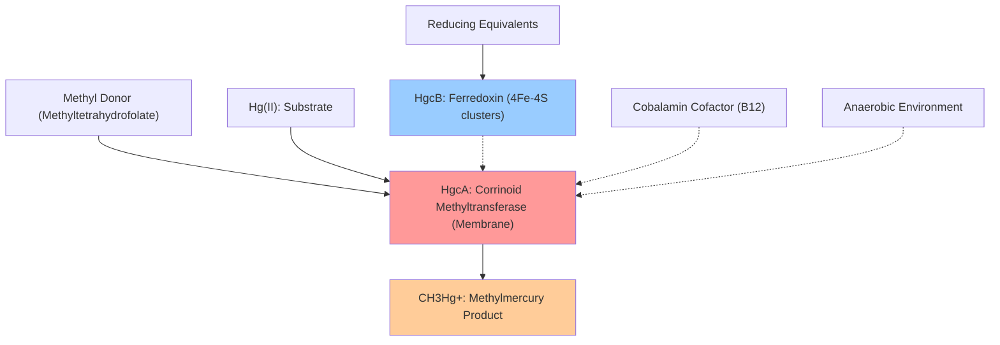

# Pathway Summary for HgcA

## Overview
HgcA participates in the mercury methylation pathway where it functions as a corrinoid-dependent methyltransferase [file:9BACT/HgcA/HgcA-deep-research.md]. This pathway is critical for the bacterial transformation of inorganic mercury(II) to highly toxic methylmercury, representing a key environmental mercury transformation process found exclusively in anaerobic bacteria and archaea.

## Mercury Methylation Pathway
The mercury methylation pathway represents the primary mechanism by which environmental mercury is converted to methylmercury, a neurotoxic organomercurial that bioaccumulates in food chains [file:9BACT/HgcA/HgcA-deep-research.md]. HgcA serves as the catalytic methyltransferase component of this two-protein system, working in concert with HgcB to facilitate the transfer of methyl groups from cellular methyl donors to inorganic mercury substrates.

HgcA contains a cobalamin (vitamin B12) binding domain that is essential for its methyltransferase activity [file:9BACT/HgcA/HgcA-deep-research.md]. The enzyme operates through a corrinoid-dependent mechanism where methylated B12 cofactor serves as an intermediate methyl carrier. The pathway requires strictly anaerobic conditions, as methylmercury production only occurs in oxygen-limited environments where both HgcA and HgcB are found [file:9BACT/HgcA/HgcA-deep-research.md].

The methylation reaction involves the coordination of mercury(II) ions by the HgcAB complex, followed by the reductive activation of the corrinoid cofactor and subsequent methyl transfer to form methylmercury [file:9BACT/HgcA/HgcA-deep-research.md]. This process represents a microbial response mechanism to environmental mercury exposure, though it inadvertently creates a more toxic organomercurial product.

## Mercury Methylation Pathway Diagram

## Environmental Mercury Cycling
HgcA participates in the broader environmental mercury cycle by mediating the transformation of inorganic mercury to methylmercury [file:9BACT/HgcA/HgcA-deep-research.md]. This pathway is found in diverse anaerobic microorganisms including sulfate-reducing bacteria, iron-reducing bacteria, and methanogenic archaea. The pathway represents a critical step in mercury biogeochemistry, as methylmercury is the primary form that bioaccumulates in aquatic food webs.

The mercury methylation pathway operates as part of the microbial response to mercury exposure, though the evolutionary purpose of this transformation remains unclear since it produces a more toxic product than the substrate [file:9BACT/HgcA/HgcA-deep-research.md]. The pathway is regulated by environmental factors including oxygen availability, sulfate concentrations, and the presence of competing metal ions.