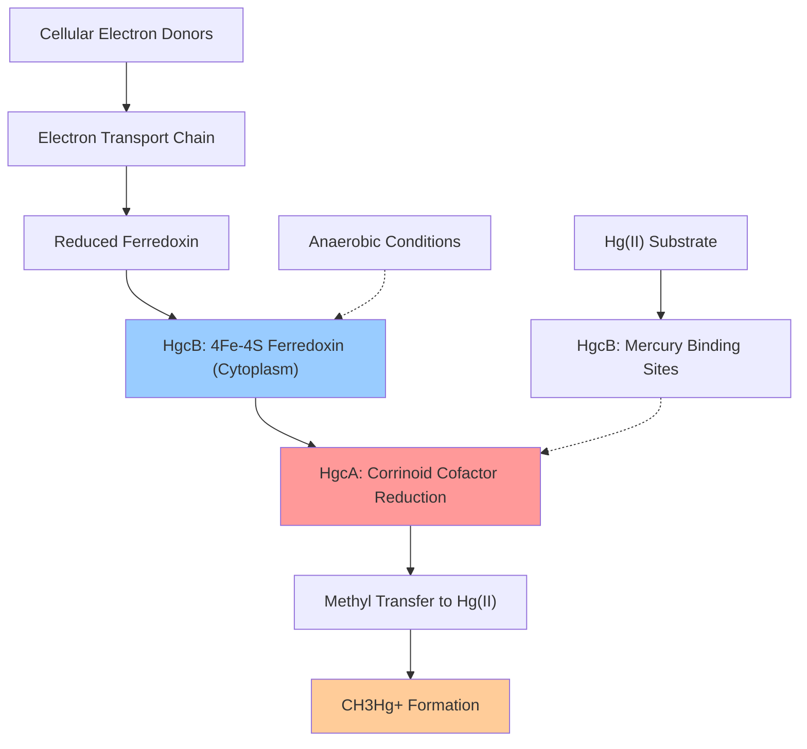

# Pathway Summary for HgcB

## Overview
HgcB participates in the mercury methylation pathway where it functions as a ferredoxin electron transfer partner [file:9BACT/HgcB/HgcB-deep-research.md]. This small iron-sulfur protein provides the reducing equivalents necessary for corrinoid cofactor activation in the HgcAB mercury methylation complex, enabling the conversion of inorganic mercury to methylmercury under anaerobic conditions.

## Mercury Methylation Pathway - Electron Transfer Component
HgcB serves as the essential electron transfer component of the mercury methylation system, working in tight functional partnership with HgcA [file:9BACT/HgcB/HgcB-deep-research.md]. The protein contains two 4Fe-4S clusters that enable its function as a ferredoxin, shuttling electrons required for the reductive activation of the corrinoid cofactor in HgcA during the methylation reaction.

The electron transfer pathway mediated by HgcB is critical for mercury methylation because the corrinoid cofactor in HgcA must be in the reduced Co(I) state to accept methyl groups from cellular methyl donors [file:9BACT/HgcB/HgcB-deep-research.md]. HgcB receives reducing equivalents from the cellular electron transport chain and transfers them to HgcA, enabling the cyclic reduction and reoxidation of the corrinoid cofactor that drives methylmercury formation.

The conserved cysteine residues in HgcB not only coordinate the iron-sulfur clusters but also likely participate in mercury binding during the methylation process [file:9BACT/HgcB/HgcB-deep-research.md]. This dual function positions HgcB as both an electron carrier and a mercury-binding partner in the methylation complex.

## Mercury Methylation Electron Flow Diagram

## Redox Coupling and Mercury Transformation
HgcB couples the mercury methylation reaction to cellular redox metabolism through its iron-sulfur clusters [file:9BACT/HgcB/HgcB-deep-research.md]. The protein operates within the broader context of anaerobic respiration, where the reducing power generated from organic matter oxidation or inorganic electron donors is channeled through ferredoxins like HgcB to drive mercury methylation.

This coupling links mercury transformation to cellular energy metabolism, suggesting that mercury methylation may occur as a side reaction of normal anaerobic respiratory processes. The redox potential of HgcB's iron-sulfur clusters must be appropriately matched to both the cellular electron donors and the corrinoid cofactor reduction potential to enable efficient electron transfer and mercury methylation.

## Environmental Significance
HgcB-mediated electron transfer represents a critical step in environmental mercury cycling, as the methylmercury produced by the HgcAB system is the primary form that bioaccumulates in aquatic food webs [file:9BACT/HgcB/HgcB-deep-research.md]. The protein is found across diverse anaerobic bacterial and archaeal lineages, indicating the widespread nature of this mercury transformation pathway in oxygen-limited environments such as sediments, wetlands, and anoxic water bodies.