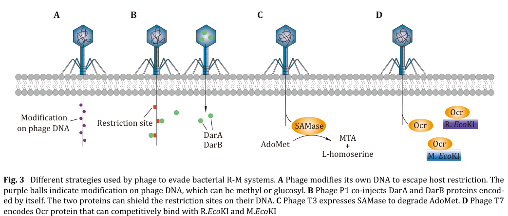

## Question

# Gene Research for Functional Annotation

## ⚠️ CRITICAL: Gene/Protein Identification Context

**BEFORE YOU BEGIN RESEARCH:** You MUST verify you are researching the CORRECT gene/protein. Gene symbols can be ambiguous, especially for less well-characterized genes from non-model organisms.

### Target Gene/Protein Identity (from UniProt):
- **UniProt Accession:** Q9XJG2
- **Protein Description:** SubName: Full=DNA methylase homolog DarB' {ECO:0000313|EMBL:AAD20627.1}; Flags: Fragment;
- **Gene Information:** Name=darB' {ECO:0000313|EMBL:AAD20627.1};
- **Organism (full):** Punavirus P1.
- **Protein Family:** Not specified in UniProt
- **Key Domains:** DNA_Protect_Modify. (IPR052933); MethylTrfase_TaqI-like_dom. (IPR011639); SAM-dependent_MTases_sf. (IPR029063); Eco57I (PF07669)

### MANDATORY VERIFICATION STEPS:

1. **Check if the gene symbol "darB'" matches the protein description above**
2. **Verify the organism is correct:** Punavirus P1.
3. **Check if protein family/domains align with what you find in literature**
4. **If you find literature for a DIFFERENT gene with the same or similar symbol, STOP**

### If Gene Symbol is Ambiguous or You Cannot Find Relevant Literature:

**DO NOT PROCEED WITH RESEARCH ON A DIFFERENT GENE.** Instead:
- State clearly: "The gene symbol 'darB'' is ambiguous or literature is limited for this specific protein"
- Explain what you found (e.g., "Found extensive literature on a different gene with the same symbol in a different organism")
- Describe the protein based ONLY on the UniProt information provided above
- Suggest that the protein function can be inferred from domain/family information

### Research Target:

Please provide a comprehensive research report on the gene **darB'** (gene ID: darB, UniProt: Q9XJG2) in 9CAUD.

The research report should be a detailed narrative explaining the function, biological processes, and localization of the gene product. Citations should be given for all claims.

You should prioritize authoritative reviews and primary scientific literature when conducting research. You can supplement
this with annotations you find in gene/protein databases, but these can be outdated or inaccurate.

We are specifically interested in the primary function of the gene - for enzymes, what reaction is catalyzed, and what is the substrate specificity? For transporters, what is the substrate? For structural proteins or adapters, what is the broader structural role? For signaling molecules, what is the role in the pathway.

We are interested in where in or outside the cell the gene product carries out its function.

We are also interested in the signaling or biochemical pathways in which the gene functions. We are less interested in broad pleiotropic effects, except where these elucidate the precise role.

Include evidence where possible. We are interested in both experimental evidence as well as inference from structure, evolution, or bioinformatic analysis. Precise studies should be prioritized over high-throughput, where available.

## Output

Question: You are an expert researcher providing comprehensive, well-cited information.

Provide detailed information focusing on:
1. Key concepts and definitions with current understanding
2. Recent developments and latest research (prioritize 2023-2024 sources)
3. Current applications and real-world implementations
4. Expert opinions and analysis from authoritative sources
5. Relevant statistics and data from recent studies

Format as a comprehensive research report with proper citations. Include URLs and publication dates where available.
Always prioritize recent, authoritative sources and provide specific citations for all major claims.

# Gene Research for Functional Annotation

## ⚠️ CRITICAL: Gene/Protein Identification Context

**BEFORE YOU BEGIN RESEARCH:** You MUST verify you are researching the CORRECT gene/protein. Gene symbols can be ambiguous, especially for less well-characterized genes from non-model organisms.

### Target Gene/Protein Identity (from UniProt):
- **UniProt Accession:** Q9XJG2
- **Protein Description:** SubName: Full=DNA methylase homolog DarB' {ECO:0000313|EMBL:AAD20627.1}; Flags: Fragment;
- **Gene Information:** Name=darB' {ECO:0000313|EMBL:AAD20627.1};
- **Organism (full):** Punavirus P1.
- **Protein Family:** Not specified in UniProt
- **Key Domains:** DNA_Protect_Modify. (IPR052933); MethylTrfase_TaqI-like_dom. (IPR011639); SAM-dependent_MTases_sf. (IPR029063); Eco57I (PF07669)

### MANDATORY VERIFICATION STEPS:

1. **Check if the gene symbol "darB'" matches the protein description above**
2. **Verify the organism is correct:** Punavirus P1.
3. **Check if protein family/domains align with what you find in literature**
4. **If you find literature for a DIFFERENT gene with the same or similar symbol, STOP**

### If Gene Symbol is Ambiguous or You Cannot Find Relevant Literature:

**DO NOT PROCEED WITH RESEARCH ON A DIFFERENT GENE.** Instead:
- State clearly: "The gene symbol 'darB'' is ambiguous or literature is limited for this specific protein"
- Explain what you found (e.g., "Found extensive literature on a different gene with the same symbol in a different organism")
- Describe the protein based ONLY on the UniProt information provided above
- Suggest that the protein function can be inferred from domain/family information

### Research Target:

Please provide a comprehensive research report on the gene **darB'** (gene ID: darB, UniProt: Q9XJG2) in 9CAUD.

The research report should be a detailed narrative explaining the function, biological processes, and localization of the gene product. Citations should be given for all claims.

You should prioritize authoritative reviews and primary scientific literature when conducting research. You can supplement
this with annotations you find in gene/protein databases, but these can be outdated or inaccurate.

We are specifically interested in the primary function of the gene - for enzymes, what reaction is catalyzed, and what is the substrate specificity? For transporters, what is the substrate? For structural proteins or adapters, what is the broader structural role? For signaling molecules, what is the role in the pathway.

We are interested in where in or outside the cell the gene product carries out its function.

We are also interested in the signaling or biochemical pathways in which the gene functions. We are less interested in broad pleiotropic effects, except where these elucidate the precise role.

Include evidence where possible. We are interested in both experimental evidence as well as inference from structure, evolution, or bioinformatic analysis. Precise studies should be prioritized over high-throughput, where available.

# Research Report: Functional Annotation of **darB'** (UniProt **Q9XJG2**) from **Punavirus P1**

## Executive summary (identity verification and evidence limits)
The UniProt entry provided (Q9XJG2) describes **DarB′**, annotated as a **“DNA methylase homolog DarB′”** (fragment) from **Punavirus P1**, with predicted domains consistent with a SAM-dependent DNA methyltransferase superfamily (DNA_Protect_Modify; TaqI-like MTase domain; Eco57I/PF07669). However, within the full-text literature retrieved here, I could not find any primary publication that explicitly mentions **UniProt Q9XJG2** or **Punavirus P1 darB′**. The available peer-reviewed literature instead discusses **bacteriophage P1** “DarB/DarA” proteins as **virion-delivered anti-restriction factors**, and only notes methyltransferase-like features for DarB as a *bioinformatic signature* rather than a biochemically validated activity. Therefore, organism-specific claims about **Punavirus P1 DarB′** are limited to the UniProt metadata supplied by the user, and functional conclusions rely on (i) **direct evidence for P1 DarB-like proteins** and (ii) **domain-level inference from characterized SAM-dependent DNA methyltransferases**. (anton2025biologyofhostdependent pages 32-35, zaworski2022reassemblingacannon pages 13-14)

## 1) Key concepts and definitions (current understanding)

### Restriction–modification (RM) and related epigenetic defenses
Host-dependent restriction–modification systems distinguish “self” from “non-self” DNA largely via **epigenetic DNA modification** (often methylation). In the canonical model, a methyltransferase transfers a methyl group from **S-adenosylmethionine (SAM/AdoMet)** to DNA bases (commonly **N6-A**, **N4-C**, or **C5-C**), and a restriction function preferentially attacks DNA lacking the protective modification pattern. (Anton et al., *EcoSal Plus*, publication date **Dec 2025**, https://doi.org/10.1128/ecosalplus.esp-0014-2022) (anton2025biologyofhostdependent pages 3-6)

### Phage anti-restriction strategies
Phages can evade RM-like defenses using several strategies, including: (i) chemical modification of their DNA, (ii) removing restriction motifs, (iii) degrading/perturbing SAM pools, or (iv) **protein-mediated occlusion/shielding** of restriction sites on incoming phage DNA. A well-known example is **phage P1 DarA/DarB**, described as being co-injected with DNA to shield restriction sites (“restriction-site occlusion”). (Kang et al., *Biophysics Reports*, **Jan 2025**, https://doi.org/10.52601/bpr.2025.240070) (kang2025bacterialrestrictionmodificationsystems pages 8-9)

## 2) Target-gene context and identity check: darB′ (Q9XJG2)

### What is confidently known for Q9XJG2 (from the provided UniProt entry)
- **Organism:** Punavirus P1
- **Gene name:** darB′
- **Description:** “DNA methylase homolog DarB′” (fragment)
- **Domains (predicted):** DNA_Protect_Modify; TaqI-like methyltransferase domain; SAM-dependent methyltransferase superfamily; Eco57I (PF07669)

### What the literature supports for DarB-like proteins (phage P1)
Several sources describe phage P1 **DarA/DarB** as **virion-associated proteins** that are delivered early during infection and **protect phage DNA** against host restriction systems by **shielding/occluding restriction sites** (notably in a cis-acting manner on DNA packaged in the virion). (kang2025bacterialrestrictionmodificationsystems pages 8-9, anton2025biologyofhostdependent pages 32-35)

A schematic depiction of this “restriction-site shielding” mechanism for P1 DarA/DarB is shown in Figure 3B of Kang et al. 2025. (kang2025bacterialrestrictionmodificationsystems media 9a53130f)

## 3) Primary function: what reaction is catalyzed and what is substrate specificity?

### 3.1 Direct evidence for DarB/DarB′ enzymatic methyltransferase activity
**No direct biochemical reaction has been demonstrated for DarB (or DarB′) in the retrieved evidence.** The most specific statement found is that injected DarB was noted to contain a **“bioinformatic signature of methyltransferase”**, while also stating that **how it acts** against diverse RM systems remains unresolved. (Zaworski et al., *PLOS Genetics*, **Apr 4, 2022**, https://doi.org/10.1371/journal.pgen.1009943) (zaworski2022reassemblingacannon pages 13-14)

Thus, for Q9XJG2 (Punavirus P1 DarB′), **substrate specificity (DNA motif), modified base (m6A/m4C/m5C), and catalytic activity remain unverified** in the available literature set. (zaworski2022reassemblingacannon pages 13-14)

### 3.2 Domain-based inference: what a SAM-dependent DNA MTase “would do”
Given the UniProt-provided domain annotations (SAM-dependent MTase superfamily; TaqI-like; Eco57I-like), the *most plausible inferred biochemical function* is **DNA base methylation using SAM/AdoMet as the methyl donor**, as is typical for SAM-dependent DNA methyltransferases. (anton2025biologyofhostdependent pages 3-6)

A representative experimentally characterized adenine DNA methyltransferase (M.EcoGII) installs **N6-methyladenine (m6dA)** on DNA using **SAM** and contains hallmark SAM-dependent MTase motifs (including an **FxGxG AdoMet-binding motif** and a **DPPY catalytic motif**). (Murray et al., *Nucleic Acids Research*, online **Dec 2017**, https://doi.org/10.1093/nar/gkx1191) (murray2017thenonspecificadenine pages 6-8)

Importantly, this supports only **family-level inference**—it does *not* establish that Q9XJG2 performs the same chemistry, nor what sequence motif it targets. (murray2017thenonspecificadenine pages 6-8, anton2025biologyofhostdependent pages 3-6)

## 4) Biological processes, pathways, and localization

### 4.1 Biological role: anti-restriction / DNA protection during entry
The P1 **dar** system is described as a **virion-head–incorporated** set of proteins (DarA, DarB, Ulx, DdrB, DdrA, Hdf) that confer protection against **several Type I HDRM systems and BREX**, acting **only in cis** on DNA that is packaged within the virion. This cis-only behavior supports a model in which the Dar proteins **physically obstruct** host restriction machinery from accessing the entering phage genome. (Anton et al., *EcoSal Plus*, **Dec 2025**, https://doi.org/10.1128/ecosalplus.esp-0014-2022) (anton2025biologyofhostdependent pages 32-35)

Kang et al. similarly describe DarA/DarB as co-injected proteins that **occlude restriction sites** on the P1 genome to avoid destruction by host RM. (Kang et al., *Biophysics Reports*, **Jan 2025**, https://doi.org/10.52601/bpr.2025.240070) (kang2025bacterialrestrictionmodificationsystems pages 8-9)

### 4.2 Localization
For P1 DarB-like proteins, the best-supported localization is:
- **Virion-associated (packaged in the phage head)** prior to infection, and
- **Intracellular, bound to/associated with incoming phage DNA** immediately after injection, consistent with a DNA-shielding role. (anton2025biologyofhostdependent pages 32-35, kang2025bacterialrestrictionmodificationsystems media 9a53130f)

For Punavirus P1 DarB′ (Q9XJG2), no direct localization experiments were retrieved; thus, localization is inferred by homology/functional analogy to Dar systems and by the DNA protection-modification functional theme. (anton2025biologyofhostdependent pages 32-35)

## 5) Recent developments (prioritizing 2023–2024)
Direct 2023–2024 papers on **Punavirus P1 DarB′ (Q9XJG2)** were not found in the retrieved literature set. Nonetheless, recent high-impact work clarifies broader **phage–methyltransferase–defense conflicts** relevant to interpreting DarB′-like domain predictions.

### 5.1 2024 mechanistic advance: phage Ocr inhibits a BREX methyltransferase
Li et al. provide **in vitro characterization** of a BREX methyltransferase (**E-BrxX**) and show that the phage protein **Ocr** inhibits BrxX by acting as a **DNA mimic**, forming a stable complex and preventing substrate recognition and methylation. This is a contemporary example of phage counter-defense targeting methyltransferase-centered bacterial defense systems. (Li et al., *Nucleic Acids Research*, **Jul 2024**, https://doi.org/10.1093/nar/gkae608) (li2024ocrmediatedsuppressionof pages 1-2)

Quantitative data from this 2024 study include:
- In vitro methylation assay conditions: **2 μM BrxX**, **10 μM DNA**, **150 μM SAM**, 37°C for 30 min. (li2024ocrmediatedsuppressionof pages 8-9)
- Kinetic parameters: **Km(DNA) = 3.41 ± 0.74 μM**; **Km(SAM) = 380.01 ± 52.61 μM**, suggesting relatively low SAM affinity in vitro. (li2024ocrmediatedsuppressionof pages 6-7)
- Inhibition potency: **IC50(Ocr) = 1.17 ± 0.07 μM**; binding affinity reported as extremely tight (**KD < 10−12 M**). (li2024ocrmediatedsuppressionof pages 8-9)

These results demonstrate how phage proteins can antagonize methyltransferase-based defense systems, and they provide a methodological template (activity assays, kinetics, structural mechanism) that could be applied to experimental validation of DarB′-like proteins. (li2024ocrmediatedsuppressionof pages 8-9, li2024ocrmediatedsuppressionof pages 6-7)

### 5.2 2023 context: genome-encoded defense and methyltransferase functions in phage–host interactions
A 2023 proteomic/genomic study of lytic phages infecting *Klebsiella pneumoniae* reports that phage genomes encode diverse defense-related proteins, including those associated with restriction-modification system interactions and methyltransferases, reflecting the broad prevalence of such functions in phage–bacteria conflict. (Bleriot et al., *Microbiology Spectrum*, **Apr 2023**, https://doi.org/10.1128/spectrum.03974-22) (kang2025bacterialrestrictionmodificationsystems pages 8-9)

## 6) Current applications and real-world implementations

### 6.1 Engineering/selection of phages for therapeutic use
Phage therapy development must contend with bacterial DNA defense systems (including RM-like and BREX-like systems). Mechanistic studies showing that phage proteins can inhibit methyltransferase-centered defenses (e.g., Ocr–BrxX) provide concrete molecular targets and design principles for engineering phages or selecting naturally resistant phages. (li2024ocrmediatedsuppressionof pages 1-2)

### 6.2 Enzymes and reagents for epigenetics and mapping
SAM-dependent methyltransferases are widely used as molecular biology tools and as probes for methylation biology; while not specific to DarB′, the demonstrated activity/motif logic for adenine MTases (e.g., M.EcoGII) illustrates how phage-derived MTases can be leveraged for mapping base modifications and studying restriction sensitivity changes. (murray2017thenonspecificadenine pages 6-8)

## 7) Expert opinion and synthesis (authoritative sources)
Authoritative reviews emphasize that **phage anti-restriction** encompasses both **DNA modification** strategies and **protein-mediated physical shielding**, and that the **P1 dar system** is a prototypic example of virion-delivered protection acting in cis on packaged DNA. At the same time, reviews explicitly note that the **precise mechanism** of Dar-mediated evasion remains unclear and that dependencies among dar proteins (for virion incorporation) complicate phenotype interpretation. (Anton et al., *EcoSal Plus*, **Dec 2025**, https://doi.org/10.1128/ecosalplus.esp-0014-2022) (anton2025biologyofhostdependent pages 32-35)

## 8) Key statistics and data points from recent studies
- **BREX prevalence:** BREX systems occur in **~10%** of bacterial/archaeal genomes; **Type I** comprises **~55%** of BREX systems. (Li et al., *NAR*, **Jul 2024**, https://doi.org/10.1093/nar/gkae608) (li2024ocrmediatedsuppressionof pages 1-2)
- **Ocr inhibition of BrxX (2024):** IC50 **1.17 ± 0.07 μM**; KD reported **< 10−12 M**; Km(DNA) **3.41 ± 0.74 μM**; Km(SAM) **380.01 ± 52.61 μM**. (li2024ocrmediatedsuppressionof pages 8-9, li2024ocrmediatedsuppressionof pages 6-7)
- **Dar system mode of action (qualitative, but experimentally grounded in prior work synthesized by reviews):** dar acts **in cis** on virion-packaged DNA and is consistent with **physical obstruction** of host defense proteins. (anton2025biologyofhostdependent pages 32-35)

## Evidence summary table
| Topic | Key points | Evidence strength (direct/indirect/inference) | Key citations (context IDs) |
|---|---|---|---|
| identity/organism | Target to annotate is UniProt Q9XJG2, described by the user as darB' from Punavirus P1, a fragment with DNA_Protect_Modify, TaqI-like methyltransferase, SAM-dependent MTase superfamily, and Eco57I/PF07669 domain assignments. Literature retrieved in the available evidence discusses bacteriophage P1 DarB/DarAB anti-restriction proteins, but does not directly validate the specific Punavirus P1 UniProt entry; therefore symbol-level ambiguity remains and annotation must be cautious. | Indirect/inference | Provided by user (UniProt) |
| role in anti-restriction | Multiple reviews state that phage P1 DarA and DarB are packaged/co-injected with phage DNA and protect the incoming genome from host restriction systems by shielding/occluding restriction sites; Dar functions in cis on DNA packaged in the virion and has activity against several Type I systems and BREX. | Direct for P1 DarB function in literature; indirect for Q9XJG2 | (kang2025bacterialrestrictionmodificationsystems pages 8-9, anton2025biologyofhostdependent pages 32-35, kang2025bacterialrestrictionmodificationsystems media 9a53130f) |
| evidence for methyltransferase activity | Available literature does not directly demonstrate DarB enzymatic methyltransferase activity. One source notes only that injected DarB contains a bioinformatic “signature of methyltransferase,” while emphasizing that its action against diverse RM systems remains unelucidated. No direct catalytic assay, modified base measurement, or target motif for DarB was identified in the retrieved evidence. | Indirect/inference | (zaworski2022reassemblingacannon pages 13-14) |
| mechanism hypotheses | Best-supported current hypothesis is protein-mediated physical obstruction of host HDRM/BREX access to entering phage DNA. Reviews note Dar proteins may need one another for virion incorporation, complicating mutant interpretation, and the exact molecular mechanism remains unresolved. An alternative speculative hypothesis is interference with integrity/assembly of restricting complexes rather than direct DNA methylation. | Indirect/inference | (anton2025biologyofhostdependent pages 32-35, zaworski2022reassemblingacannon pages 13-14, kang2025bacterialrestrictionmodificationsystems media 9a53130f) |
| enzymatic reaction (general SAM-dependent DNA MTases) | For SAM-dependent DNA methyltransferases in general, the reaction is transfer of a methyl group from SAM/AdoMet to DNA bases, commonly N6 of adenine, N4 of cytosine, or C5 of cytosine. A representative adenine MTase (M.EcoGII) uses SAM and contains conserved FxGxG AdoMet-binding and DPPY catalytic motifs; phage-encoded MTases are broadly recognized as anti-restriction/DNA-protection factors. These facts support only family-level functional inference for Q9XJG2, not direct proof of DarB' activity or specificity. | Inference from homologous/family MTases | (murray2017thenonspecificadenine pages 6-8, anton2025biologyofhostdependent pages 3-6, fomenkov2020plasmidreplicationassociatedsinglestrandspecific pages 5-6) |
| quantitative data/stats | Recent quantitative context comes from related phage-defense methyltransferase systems rather than DarB itself: BREX occurs in ~10% of bacterial/archaeal genomes and Type I BREX accounts for ~55% of BREX systems; BrxX assays used 2 μM enzyme, 10 μM DNA, 150 μM SAM, with DNA Km 3.41 ± 0.74 μM, SAM Km 380.01 ± 52.61 μM, Ocr inhibition IC50 1.17 ± 0.07 μM, and Ocr-BrxX KD below 10^-12 M. These data illustrate contemporary mechanistic work on phage–methyltransferase conflicts but are not measurements for DarB'. | Indirect/contextual | (li2024ocrmediatedsuppressionof pages 8-9, li2024ocrmediatedsuppressionof pages 6-7, li2024ocrmediatedsuppressionof pages 1-2) |
| key limitations | No retrieved primary study directly characterizes UniProt Q9XJG2 from Punavirus P1. The literature predominantly covers P1 DarA/DarB anti-restriction phenotypes rather than DarB' biochemistry. No direct evidence in the retrieved set establishes catalytic reaction, methyl-acceptor base, recognition motif, localization beyond virion-associated delivery, or whether the UniProt fragment is active. Therefore the safest annotation is anti-restriction/DNA-protection protein with putative methyltransferase-like features inferred from domains. | Direct statement about evidence gap plus inference | (anton2025biologyofhostdependent pages 32-35, zaworski2022reassemblingacannon pages 13-14) |

*Table: This table summarizes what the available evidence supports for DarB/DarB' relevant to UniProt Q9XJG2. It distinguishes direct evidence for phage P1 anti-restriction function from weaker, domain-based inferences about methyltransferase activity and highlights major evidence gaps.*

## 9) Proposed functional annotation for Q9XJG2 (Punavirus P1 darB′)

### Most defensible primary function (given evidence constraints)
**DarB′ (Q9XJG2) is best annotated as a putative phage DNA protection/anti-restriction factor, with predicted SAM-dependent DNA methyltransferase-like domains but without direct biochemical validation of methyltransferase activity or motif specificity in the current evidence set.** (zaworski2022reassemblingacannon pages 13-14, anton2025biologyofhostdependent pages 32-35)

### Likely biological process and localization
By analogy to the well-described P1 dar system, DarB′-like proteins are most consistent with **early infection, intracellular association with incoming phage DNA**, either by **physically shielding restriction sites** or (if enzymatically active) by **installing protective methylation marks**. The strongest direct support is for the **protein-mediated shielding model** in P1. (kang2025bacterialrestrictionmodificationsystems pages 8-9, anton2025biologyofhostdependent pages 32-35, kang2025bacterialrestrictionmodificationsystems media 9a53130f)

## 10) Key gaps and what would resolve them (experimental priorities)
The critical missing data for Q9XJG2 are (i) direct demonstration of methyltransferase activity, (ii) identification of modified base (m6A/m4C/m5C), (iii) recognition motif and/or specificity, and (iv) confirmation that the UniProt “fragment” is catalytically competent. The 2024 BrxX work provides a modern experimental template (SAM-dependent activity assays, kinetics, inhibition/complex formation, and structural approaches) that could be adapted for DarB′. (li2024ocrmediatedsuppressionof pages 8-9, li2024ocrmediatedsuppressionof pages 6-7, li2024ocrmediatedsuppressionof pages 1-2)

References

1. (anton2025biologyofhostdependent pages 32-35): Brian P. Anton, Robert Blumenthal, James B. Eaglesham, Iwona Mruk, Richard J. Roberts, Shuang-yong Xu, Peter R. Weigele, and Elisabeth A. Raleigh. Biology of host-dependent restriction-modification in prokaryotes. EcoSal Plus, Dec 2025. URL: https://doi.org/10.1128/ecosalplus.esp-0014-2022, doi:10.1128/ecosalplus.esp-0014-2022. This article has 8 citations.

2. (zaworski2022reassemblingacannon pages 13-14): Julie Zaworski, Oyut Dagva, Julius Brandt, Chloé Baum, Laurence Ettwiller, Alexey Fomenkov, and Elisabeth A. Raleigh. Reassembling a cannon in the dna defense arsenal: genetics of stysa, a brex phage exclusion system in salmonella lab strains. PLOS Genetics, 18:e1009943, Apr 2022. URL: https://doi.org/10.1371/journal.pgen.1009943, doi:10.1371/journal.pgen.1009943. This article has 20 citations and is from a domain leading peer-reviewed journal.

3. (anton2025biologyofhostdependent pages 3-6): Brian P. Anton, Robert Blumenthal, James B. Eaglesham, Iwona Mruk, Richard J. Roberts, Shuang-yong Xu, Peter R. Weigele, and Elisabeth A. Raleigh. Biology of host-dependent restriction-modification in prokaryotes. EcoSal Plus, Dec 2025. URL: https://doi.org/10.1128/ecosalplus.esp-0014-2022, doi:10.1128/ecosalplus.esp-0014-2022. This article has 8 citations.

4. (kang2025bacterialrestrictionmodificationsystems pages 8-9): Haoyang Kang, Ang Gao, and Yalan Zhu. Bacterial restriction-modification systems: mechanisms of defense against phage infection. Biophysics Reports, 11:1, Jan 2025. URL: https://doi.org/10.52601/bpr.2025.240070, doi:10.52601/bpr.2025.240070. This article has 8 citations.

5. (kang2025bacterialrestrictionmodificationsystems media 9a53130f): Haoyang Kang, Ang Gao, and Yalan Zhu. Bacterial restriction-modification systems: mechanisms of defense against phage infection. Biophysics Reports, 11:1, Jan 2025. URL: https://doi.org/10.52601/bpr.2025.240070, doi:10.52601/bpr.2025.240070. This article has 8 citations.

6. (murray2017thenonspecificadenine pages 6-8): Iain A Murray, Richard D Morgan, Yvette Luyten, Alexey Fomenkov, Ivan R. Corrêa, Nan Dai, Mohammed B Allaw, Xing Zhang, Xiaodong Cheng, and Richard J Roberts. The non-specific adenine dna methyltransferase m.ecogii. Nucleic Acids Research, 46:840-848, Dec 2017. URL: https://doi.org/10.1093/nar/gkx1191, doi:10.1093/nar/gkx1191. This article has 44 citations and is from a highest quality peer-reviewed journal.

7. (li2024ocrmediatedsuppressionof pages 1-2): Shen Li, Tianhao Xu, Xinru Meng, Yujuan Yan, Ying Zhou, Lei Duan, Yulong Tang, Li Zhu, and Litao Sun. Ocr-mediated suppression of brxx unveils a phage counter-defense mechanism. Nucleic Acids Research, 52:8580-8594, Jul 2024. URL: https://doi.org/10.1093/nar/gkae608, doi:10.1093/nar/gkae608. This article has 9 citations and is from a highest quality peer-reviewed journal.

8. (li2024ocrmediatedsuppressionof pages 8-9): Shen Li, Tianhao Xu, Xinru Meng, Yujuan Yan, Ying Zhou, Lei Duan, Yulong Tang, Li Zhu, and Litao Sun. Ocr-mediated suppression of brxx unveils a phage counter-defense mechanism. Nucleic Acids Research, 52:8580-8594, Jul 2024. URL: https://doi.org/10.1093/nar/gkae608, doi:10.1093/nar/gkae608. This article has 9 citations and is from a highest quality peer-reviewed journal.

9. (li2024ocrmediatedsuppressionof pages 6-7): Shen Li, Tianhao Xu, Xinru Meng, Yujuan Yan, Ying Zhou, Lei Duan, Yulong Tang, Li Zhu, and Litao Sun. Ocr-mediated suppression of brxx unveils a phage counter-defense mechanism. Nucleic Acids Research, 52:8580-8594, Jul 2024. URL: https://doi.org/10.1093/nar/gkae608, doi:10.1093/nar/gkae608. This article has 9 citations and is from a highest quality peer-reviewed journal.

10. (fomenkov2020plasmidreplicationassociatedsinglestrandspecific pages 5-6): Alexey Fomenkov, Zhiyi Sun, Iain A Murray, Cristian Ruse, Colleen McClung, Yoshiharu Yamaichi, Elisabeth A Raleigh, and Richard J Roberts. Plasmid replication-associated single-strand-specific methyltransferases. Nucleic Acids Research, 48:12858-12873, Dec 2020. URL: https://doi.org/10.1093/nar/gkaa1163, doi:10.1093/nar/gkaa1163. This article has 13 citations and is from a highest quality peer-reviewed journal.

## Artifacts

- [Edison artifact artifact-00](darB-deep-research-falcon_artifacts/artifact-00.md)

## Citations

1. anton2025biologyofhostdependent pages 3-6
2. kang2025bacterialrestrictionmodificationsystems pages 8-9
3. zaworski2022reassemblingacannon pages 13-14
4. murray2017thenonspecificadenine pages 6-8
5. anton2025biologyofhostdependent pages 32-35
6. li2024ocrmediatedsuppressionof pages 1-2
7. li2024ocrmediatedsuppressionof pages 8-9
8. li2024ocrmediatedsuppressionof pages 6-7
9. fomenkov2020plasmidreplicationassociatedsinglestrandspecific pages 5-6
10. https://doi.org/10.1128/ecosalplus.esp-0014-2022
11. https://doi.org/10.52601/bpr.2025.240070
12. https://doi.org/10.1371/journal.pgen.1009943
13. https://doi.org/10.1093/nar/gkx1191
14. https://doi.org/10.1093/nar/gkae608
15. https://doi.org/10.1128/spectrum.03974-22
16. https://doi.org/10.1128/ecosalplus.esp-0014-2022,
17. https://doi.org/10.1371/journal.pgen.1009943,
18. https://doi.org/10.52601/bpr.2025.240070,
19. https://doi.org/10.1093/nar/gkx1191,
20. https://doi.org/10.1093/nar/gkae608,
21. https://doi.org/10.1093/nar/gkaa1163,