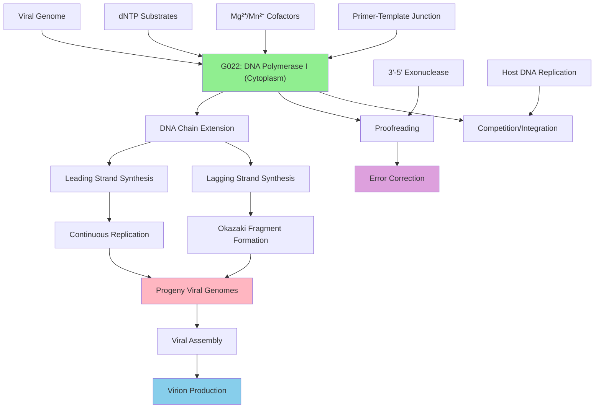

# Pathway Summary for g022

## Overview
G022 encodes DNA polymerase I from Yersinia phage phiR8-01, a phage-encoded DNA-directed DNA polymerase (EC 2.7.7.7) that catalyzes DNA synthesis during viral genome replication [I7J3R9]. The protein belongs to DNA polymerase family A and contains characteristic domains for nucleotidyltransferase activity, including the essential palm domain that coordinates metal cofactors and facilitates the nucleotidyl transfer reaction [GO_REF:0000120].

## Viral DNA Replication Pathway
G022 DNA polymerase I serves as the primary replicative enzyme for the Tequatrovirus genome, catalyzing the synthesis of both leading and lagging DNA strands during viral replication [GO_REF:0000120]. The enzyme recognizes primer-template junctions and extends DNA chains by incorporating complementary dNTPs in the 5' to 3' direction. This replication process is essential for producing progeny viral genomes that will be packaged into new virions during the lytic cycle.

## Family A DNA Polymerase Mechanism
As a member of DNA polymerase family A, G022 employs the characteristic two-metal-ion mechanism for nucleotidyl transfer [file:9CAUD/g022/g022-deep-research.md]. The enzyme's palm domain coordinates two divalent metal ions (typically Mg2+ or Mn2+) that facilitate nucleophilic attack by the 3'-OH group of the primer on the α-phosphate of the incoming dNTP. This mechanism ensures high-fidelity DNA synthesis through proper geometric alignment of substrates and products.

## Primer Extension and Processivity
G022 DNA polymerase requires a primer-template substrate to initiate DNA synthesis, as it cannot start synthesis de novo [file:9CAUD/g022/g022-deep-research.md]. The enzyme exhibits processivity characteristic of replicative polymerases, remaining associated with the DNA template while incorporating multiple nucleotides before dissociating. This processivity is crucial for efficient replication of the relatively large bacteriophage genome.

## Proofreading and Fidelity Control
Many family A DNA polymerases, including bacterial DNA polymerase I, possess 3' to 5' exonuclease activity for proofreading newly incorporated nucleotides [file:9CAUD/g022/g022-deep-research.md]. While specific proofreading data for G022 is not available, this activity would contribute to replication fidelity by removing incorrectly incorporated nucleotides. The balance between polymerase and exonuclease activities determines the overall error rate of viral genome replication.

## Pathway Diagram

## Host-Pathogen Interaction and Resource Competition
G022 DNA polymerase competes with host DNA replication machinery for cellular resources including dNTP pools and replication factors [file:9CAUD/g022/g022-deep-research.md]. The phage polymerase may have evolved specific adaptations to function efficiently in the bacterial cytoplasmic environment, potentially showing different cofactor requirements or substrate specificities compared to host polymerases. This competition can influence the timing and efficiency of viral replication.

## Replication Fork Dynamics and Coordination
During viral DNA replication, G022 must coordinate with other replication proteins including helicases, primase, and single-strand binding proteins [file:9CAUD/g022/g022-deep-research.md]. The enzyme's activity is integrated into the replication fork machinery that unwinds the double-stranded viral genome and provides the single-stranded templates necessary for DNA synthesis. This coordination ensures efficient and processive replication of the entire viral genome.

## Temporal Regulation and Lytic Cycle Integration
G022 expression and activity are temporally regulated as part of the phage lytic cycle program [file:9CAUD/g022/g022-deep-research.md]. The polymerase is typically expressed during the DNA replication phase of infection, after early gene products have prepared the cellular environment for viral replication but before late genes required for virion assembly and lysis. This temporal control ensures optimal resource utilization and viral progeny production.

## Evolutionary Adaptation and Phylogeny
G022 DNA polymerase represents an evolutionary adaptation that allows the bacteriophage to replicate independently of host DNA replication machinery [file:9CAUD/g022/g022-deep-research.md]. The enzyme likely evolved from bacterial DNA polymerases but may have acquired specific modifications that optimize it for viral replication requirements. Phylogenetic analysis of phage DNA polymerases provides insights into viral evolution and host-pathogen coevolution.

## Biotechnological Applications and Research Tools
Phage DNA polymerases like G022 have potential applications as research tools for molecular biology applications requiring high-fidelity DNA synthesis [file:9CAUD/g022/g022-deep-research.md]. The enzyme's properties, including thermostability, processivity, and cofactor requirements, determine its suitability for applications such as PCR, DNA sequencing, and genome amplification. Understanding these properties informs development of improved molecular biology reagents.

## Antiviral Target Potential and Drug Development
DNA polymerases represent potential targets for antiviral therapy, as they are essential for viral replication and often differ from host polymerases in important ways [file:9CAUD/g022/g022-deep-research.md]. While bacteriophages are generally beneficial or neutral to humans, understanding phage DNA polymerase structure and function contributes to broader knowledge of viral replication mechanisms and potential therapeutic targets for pathogenic viruses.