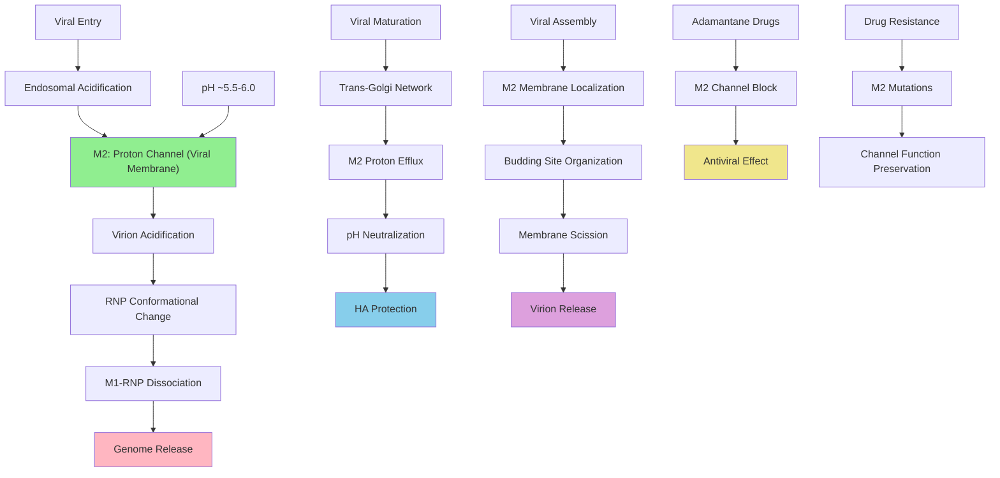

# Pathway Summary for M2

## Overview
Matrix protein 2 (M2) is a 97-amino acid transmembrane protein that forms a pH-activated, proton-selective ion channel essential for influenza A virus replication [A0A1S7IWC7]. The protein assembles as a homotetramer and functions in two critical stages of the viral life cycle: during viral entry to acidify the virion interior and facilitate genome release, and during viral maturation to maintain neutral pH in the trans-Golgi network [UniProt:A0A1S7IWC7]. The channel is activated by low pH (~5.5-6.0) and represents a validated antiviral drug target.

## Viral Entry and Genome Release Pathway
During viral entry, M2 functions as a critical pH-activated proton channel that facilitates viral uncoating and genome release [UniProt:A0A1S7IWC7]. After endocytosis, the virus encounters the acidic environment of the endosome, which activates the M2 proton channel. Proton influx through M2 acidifies the virion interior, causing conformational changes in the viral ribonucleoprotein (RNP) complex that weaken the interaction between M1 matrix protein and RNP, ultimately allowing genome release into the cytoplasm for replication.

## Proton Channel Structure and Function
M2 forms a homotetramer with a central proton-conducting pore that exhibits remarkable selectivity for protons over other monovalent cations [GO_REF:0000104]. The channel contains a histidine residue (His37) that acts as a pH sensor and gate, becoming protonated at low pH to allow proton conduction. This mechanism enables M2 to function as a pH-activated switch that is closed at neutral pH but opens in acidic environments, providing precise temporal control over viral processes.

## Viral Maturation and HA Protection
During viral budding and maturation, M2 plays a crucial role in protecting hemagglutinin (HA) from premature conformational changes [file:9INFA/M2/M2-deep-research.md]. The protein maintains a more neutral pH in the trans-Golgi network by providing a pathway for proton efflux, preventing the acid-induced conformational changes in HA that would render newly formed virions non-infectious. This function is essential for producing viable viral progeny.

## Viral Assembly and Budding Process
M2 participates in viral assembly and budding through its interaction with other viral proteins and cellular membranes [file:9INFA/M2/M2-deep-research.md]. The protein localizes to budding sites where it may facilitate membrane curvature and scission processes necessary for virion release. M2's role in viral budding involves both its ion channel activity and its structural interactions with other viral components.

## Pathway Diagram

## Host Cell Interaction and Autophagy Modulation
M2 interacts with host cellular processes including autophagy machinery to promote viral replication [file:9INFA/M2/M2-deep-research.md]. The protein can modulate autophagosome formation and maturation, potentially redirecting cellular resources toward viral replication while evading cellular defense mechanisms. This interaction represents an example of how viral proteins manipulate host cell biology for their benefit.

## Innate Immune Response and Inflammasome Activation
M2 can trigger innate immune responses including inflammasome activation, which represents a double-edged aspect of infection [file:9INFA/M2/M2-deep-research.md]. While inflammasome activation can limit viral replication, it also contributes to the inflammatory pathology associated with influenza infection. Understanding M2's role in immune activation helps explain both viral clearance mechanisms and disease severity.

## Antiviral Drug Target and Resistance Mechanisms
M2 was historically the target of adamantane drugs (amantadine and rimantadine) that block the proton channel [file:9INFA/M2/M2-deep-research.md]. However, widespread resistance has emerged through mutations that preserve channel function while preventing drug binding. The evolution of drug resistance in M2 provides insights into viral adaptation mechanisms and highlights the challenges of antiviral drug development.

## Membrane Organization and Lipid Interactions
M2 influences membrane organization and interacts with specific lipid environments that affect its function [file:9INFA/M2/M2-deep-research.md]. The protein's transmembrane domain can cause membrane curvature and organize lipid microdomains that facilitate viral assembly and budding. These membrane-organizing properties contribute to both the channel's function and its role in viral morphogenesis.

## Structural Biology and Mechanistic Insights
High-resolution structural studies of M2 have provided detailed insights into its proton conduction mechanism and drug binding sites [file:9INFA/M2/M2-deep-research.md]. The channel's structure reveals how pH sensing, proton selectivity, and drug resistance are achieved at the molecular level. These structural insights inform both basic understanding of ion channel mechanisms and rational drug design efforts.

## Clinical and Public Health Significance
M2's role as an antiviral target and its involvement in drug resistance make it significant for influenza control and pandemic preparedness [file:9INFA/M2/M2-deep-research.md]. Understanding M2 function helps inform surveillance for drug-resistant strains and development of new therapeutic strategies. The protein's essential role in viral replication makes it a continuing target for antiviral development despite current resistance issues.