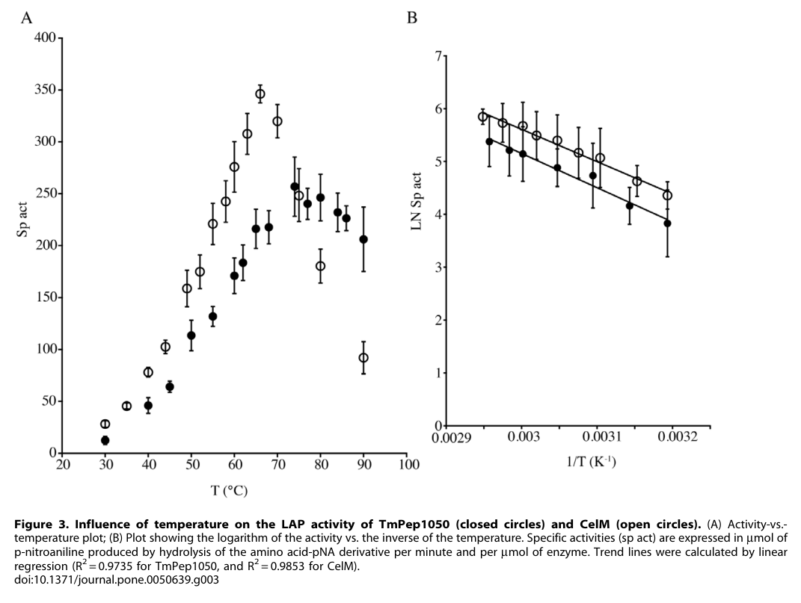

## Question

# Gene Research for Functional Annotation

## ⚠️ CRITICAL: Gene/Protein Identification Context

**BEFORE YOU BEGIN RESEARCH:** You MUST verify you are researching the CORRECT gene/protein. Gene symbols can be ambiguous, especially for less well-characterized genes from non-model organisms.

### Target Gene/Protein Identity (from UniProt):
- **UniProt Accession:** P55742
- **Protein Description:** RecName: Full=Putative aminopeptidase; EC=3.4.11.-;
- **Gene Information:** Name=celM;
- **Organism (full):** Acetivibrio thermocellus (Hungateiclostridium thermocellum) (Clostridium thermocellum).
- **Protein Family:** Belongs to the peptidase M42 family. .
- **Key Domains:** Peptidase_M42. (IPR008007); Peptidase_M42_aminopept. (IPR051464); Peptidase_M42_dom2. (IPR023367); Peptidase_M42 (PF05343)

### MANDATORY VERIFICATION STEPS:

1. **Check if the gene symbol "celM" matches the protein description above**
2. **Verify the organism is correct:** Acetivibrio thermocellus (Hungateiclostridium thermocellum) (Clostridium thermocellum).
3. **Check if protein family/domains align with what you find in literature**
4. **If you find literature for a DIFFERENT gene with the same or similar symbol, STOP**

### If Gene Symbol is Ambiguous or You Cannot Find Relevant Literature:

**DO NOT PROCEED WITH RESEARCH ON A DIFFERENT GENE.** Instead:
- State clearly: "The gene symbol 'celM' is ambiguous or literature is limited for this specific protein"
- Explain what you found (e.g., "Found extensive literature on a different gene with the same symbol in a different organism")
- Describe the protein based ONLY on the UniProt information provided above
- Suggest that the protein function can be inferred from domain/family information

### Research Target:

Please provide a comprehensive research report on the gene **celM** (gene ID: P55742, UniProt: P55742) in ACET2.

The research report should be a detailed narrative explaining the function, biological processes, and localization of the gene product. Citations should be given for all claims.

You should prioritize authoritative reviews and primary scientific literature when conducting research. You can supplement
this with annotations you find in gene/protein databases, but these can be outdated or inaccurate.

We are specifically interested in the primary function of the gene - for enzymes, what reaction is catalyzed, and what is the substrate specificity? For transporters, what is the substrate? For structural proteins or adapters, what is the broader structural role? For signaling molecules, what is the role in the pathway.

We are interested in where in or outside the cell the gene product carries out its function.

We are also interested in the signaling or biochemical pathways in which the gene functions. We are less interested in broad pleiotropic effects, except where these elucidate the precise role.

Include evidence where possible. We are interested in both experimental evidence as well as inference from structure, evolution, or bioinformatic analysis. Precise studies should be prioritized over high-throughput, where available.

## Output

Question: You are an expert researcher providing comprehensive, well-cited information.

Provide detailed information focusing on:
1. Key concepts and definitions with current understanding
2. Recent developments and latest research (prioritize 2023-2024 sources)
3. Current applications and real-world implementations
4. Expert opinions and analysis from authoritative sources
5. Relevant statistics and data from recent studies

Format as a comprehensive research report with proper citations. Include URLs and publication dates where available.
Always prioritize recent, authoritative sources and provide specific citations for all major claims.

# Gene Research for Functional Annotation

## ⚠️ CRITICAL: Gene/Protein Identification Context

**BEFORE YOU BEGIN RESEARCH:** You MUST verify you are researching the CORRECT gene/protein. Gene symbols can be ambiguous, especially for less well-characterized genes from non-model organisms.

### Target Gene/Protein Identity (from UniProt):
- **UniProt Accession:** P55742
- **Protein Description:** RecName: Full=Putative aminopeptidase; EC=3.4.11.-;
- **Gene Information:** Name=celM;
- **Organism (full):** Acetivibrio thermocellus (Hungateiclostridium thermocellum) (Clostridium thermocellum).
- **Protein Family:** Belongs to the peptidase M42 family. .
- **Key Domains:** Peptidase_M42. (IPR008007); Peptidase_M42_aminopept. (IPR051464); Peptidase_M42_dom2. (IPR023367); Peptidase_M42 (PF05343)

### MANDATORY VERIFICATION STEPS:

1. **Check if the gene symbol "celM" matches the protein description above**
2. **Verify the organism is correct:** Acetivibrio thermocellus (Hungateiclostridium thermocellum) (Clostridium thermocellum).
3. **Check if protein family/domains align with what you find in literature**
4. **If you find literature for a DIFFERENT gene with the same or similar symbol, STOP**

### If Gene Symbol is Ambiguous or You Cannot Find Relevant Literature:

**DO NOT PROCEED WITH RESEARCH ON A DIFFERENT GENE.** Instead:
- State clearly: "The gene symbol 'celM' is ambiguous or literature is limited for this specific protein"
- Explain what you found (e.g., "Found extensive literature on a different gene with the same symbol in a different organism")
- Describe the protein based ONLY on the UniProt information provided above
- Suggest that the protein function can be inferred from domain/family information

### Research Target:

Please provide a comprehensive research report on the gene **celM** (gene ID: P55742, UniProt: P55742) in ACET2.

The research report should be a detailed narrative explaining the function, biological processes, and localization of the gene product. Citations should be given for all claims.

You should prioritize authoritative reviews and primary scientific literature when conducting research. You can supplement
this with annotations you find in gene/protein databases, but these can be outdated or inaccurate.

We are specifically interested in the primary function of the gene - for enzymes, what reaction is catalyzed, and what is the substrate specificity? For transporters, what is the substrate? For structural proteins or adapters, what is the broader structural role? For signaling molecules, what is the role in the pathway.

We are interested in where in or outside the cell the gene product carries out its function.

We are also interested in the signaling or biochemical pathways in which the gene functions. We are less interested in broad pleiotropic effects, except where these elucidate the precise role.

Include evidence where possible. We are interested in both experimental evidence as well as inference from structure, evolution, or bioinformatic analysis. Precise studies should be prioritized over high-throughput, where available.

# Research Report: **celM (UniProt P55742)** from *Acetivibrio thermocellus* (= *Hungateiclostridium thermocellum*, formerly *Clostridium thermocellum*)

## Executive summary
The gene **celM** encoding UniProt **P55742** from *Acetivibrio thermocellus* corresponds to an **M42-family metallopeptidase** that forms a **TET (tetrahedral) dodecameric aminopeptidase complex** and functions as a **cobalt-activated aminopeptidase** rather than a cellulase. This was established by direct biochemical characterization showing **robust leucine aminopeptidase-like activity**, strong **Co²⁺ activation**, **EDTA/bestatin inhibition**, and **no detectable endoglucanase activity** on standard cellulose substrates under tested conditions. (dutoit2012functionalcharacterizationof pages 1-2, dutoit2012functionalcharacterizationof pages 3-4)

## 0) Mandatory identity verification (to prevent symbol ambiguity)
**Target match:** The literature recharacterization explicitly concerns **CelM from *C. thermocellum*** and uses the **same UniProt accession P55742** cited in your target definition. CelM is shown to be homologous to canonical **M42/TET aminopeptidases** (e.g., archaeal PhTET2) and to carry the conserved **metal-binding residues** and **catalytic glutamate** typical of the family, consistent with UniProt’s “putative aminopeptidase; EC 3.4.11.-; M42 family” annotation. (dutoit2012functionalcharacterizationof pages 3-4)

## 1) Key concepts and definitions (current understanding)

### 1.1 Aminopeptidases and exopeptidase function
Aminopeptidases are **metal-dependent exopeptidases** that cleave amino acids from the **N-terminus** of peptide substrates; they participate broadly in **protein/peptide turnover** and maturation. (bhat2024drugtargetingof pages 1-2)

### 1.2 M42/TET aminopeptidases (MEROPS M42; “tetrahedral” complexes)
The **M42/TET peptidases** are described as **large, ATP-independent cytosolic peptidases** in prokaryotes that assemble into **12-subunit hollow tetrahedral particles (dodecamers)** and act as **non-processive, cobalt-activated aminopeptidases** with substrate specificity shaped by the **internal catalytic chamber**. (appolaire2016tetpeptidasesa pages 1-2)

A key mechanistic principle is that **enzyme activity toward longer polypeptides is coupled to assembly**: the dodecamer creates a protected internal compartment with pores for peptide access, while lower oligomers (dimers) show markedly reduced activity especially on larger substrates. (appolaire2016tetpeptidasesa pages 1-2, appolaire2016tetpeptidasesa pages 6-8)

## 2) Direct functional annotation for celM/P55742 (primary evidence)

### 2.1 Primary biochemical function: aminopeptidase (not cellulase)
In a targeted study motivated by widespread misannotation, recombinant CelM was tested against classical cellulase substrates (**cellobiose, carboxymethyl cellulose, filter paper cellulose**) and showed **no significant cellulase activity** under the experimental conditions used. (dutoit2012functionalcharacterizationof pages 3-4)

In contrast, CelM displayed clear **aminopeptidase activity** on aminoacyl-p-nitroanilide substrates, with strongest activity on **L-leucine-pNA**, supporting annotation as a **leucyl aminopeptidase-like** enzyme. (dutoit2012functionalcharacterizationof pages 3-4, dutoit2012functionalcharacterizationof pages 6-7)

### 2.2 Substrate specificity (quantitative)
CelM preferentially hydrolyzed **nonpolar aliphatic N-terminal residues**, including:
- **L-Leu-pNA** (highest)
- **L-Ile-pNA, L-Met-pNA, L-Val-pNA, L-Ala-pNA** (lower)
and showed no detectable activity on several tested alternatives (e.g., D-Leu-pNA; Gly-, Phe-, His-, Pro-, Glu-pNA). (dutoit2012functionalcharacterizationof pages 3-4)

Reported catalytic efficiencies (**kcat/Km**) were:
- **114.3 s⁻¹ M⁻¹** for **L-Leu-pNA**
- **39.3 s⁻¹ M⁻¹** for **L-Ile-pNA**
- **24.8 s⁻¹ M⁻¹** for **L-Met-pNA** (dutoit2012functionalcharacterizationof pages 4-6)

CelM could **not** deblock **N-acetyl-L-Leu-pNA** (no aminoacylase activity under test conditions). (dutoit2012functionalcharacterizationof pages 3-4)

### 2.3 Metal dependence and inhibitors (quantitative)
CelM activity is strongly metal-dependent and is **maximally stimulated by Co²⁺**. In a metal panel (100 µM), specific activity rose from **3.8 ± 1.3** (no added metal) to **319.6 ± 20.8 mmol min⁻¹ mmol⁻¹ enzyme** with **Co²⁺**, while other metals supported only low activity (e.g., Ni²⁺ 8.5 ± 0.6; Zn²⁺ 1.0 ± 0.1). (dutoit2012functionalcharacterizationof pages 4-6)

This metal dependence is visually summarized in the extracted table region. (dutoit2012functionalcharacterizationof media 4ce93bbc)

Consistent with metalloaminopeptidase function, CelM was **>98% inhibited** by the metal chelator **EDTA** and inhibited by **bestatin** (a metalloaminopeptidase inhibitor) with an apparent **Ki ≈ 292 ± 66 nM** for CelM. (dutoit2012functionalcharacterizationof pages 3-4)

### 2.4 Oligomerization state and assembly-dependent activity
Purified recombinant CelM populated at least two oligomeric states by gel filtration:
- ~**407 ± 34 kDa**, interpreted as **dodecamer** (from a ~36.2 kDa monomer)
- ~**75 ± 6 kDa**, interpreted as **dimer**

Importantly, the **dodecameric** form showed high activity (e.g., **291.7 mmol min⁻¹ mmol⁻¹** on L-Leu-pNA), whereas the **dimer** was **barely active** (6.4 mmol min⁻¹ mmol⁻¹). This provides direct experimental evidence that CelM’s **functional state is the assembled high-order oligomer**, aligning with the TET family paradigm. (dutoit2012functionalcharacterizationof pages 3-4)

### 2.5 pH/temperature profile (quantitative)
CelM showed maximal leucine aminopeptidase activity around **pH 6.7–7.1** and **~65°C**, with sharp decline at higher temperatures (above ~75°C). The Arrhenius-derived activation energy reported for CelM was **60.47 ± 2.31 kJ mol⁻¹**. (dutoit2012functionalcharacterizationof pages 3-4)

The extracted temperature-dependence figure provides visual evidence for the activity-vs-temperature and Arrhenius behavior. (dutoit2012functionalcharacterizationof media f3f0c184)

## 3) Cellular localization and pathway context

### 3.1 Likely localization: cytosol (family-supported)
While the CelM biochemical study does not directly localize the protein in *A. thermocellus*, authoritative M42/TET literature describes TET peptidases as **cytosolic prokaryotic enzymes**, with multiple TET complexes often coexisting in the **cytosol** in some organisms. (appolaire2016tetpeptidasesa pages 1-2, basbous2018characterizationofa pages 3-5)

Therefore, the most defensible localization for celM/P55742 for functional annotation—based on its family membership and lack of secretion-related evidence in the retrieved sources—is **intracellular/cytosolic**. (appolaire2016tetpeptidasesa pages 1-2, basbous2018characterizationofa pages 3-5)

### 3.2 Proposed physiological role: intracellular peptide turnover (“downstream of major proteolysis”)
M42/TET aminopeptidases are discussed as part of the **terminal peptide destruction/processing layer** in prokaryotes, trimming peptides generated by major proteolytic systems and contributing to amino acid homeostasis and peptide metabolism. (appolaire2016tetpeptidasesa pages 1-2)

A commonly cited hypothesis is that TET aminopeptidases can act **downstream of the proteasome** (alongside alternative systems such as tricorn/TRI) to complete peptide degradation; proteasomes typically generate **short peptides (~3–25 residues)** that require further processing. (dutoit2012functionalcharacterizationof pages 1-2)

For mechanistic context, archaeal TET2 studies describe a self-compartmentalized chamber with pores permissive for short/unfolded peptides while excluding folded proteins, supporting a role in **intracellular protein quality control and peptide degradation**. (gauto2022functionalcontrolof pages 1-2)

## 4) Recent developments and “latest research” (prioritizing 2023–2024 where possible)

### 4.1 Evidence gap for 2023–2024 specifically on *A. thermocellus* CelM
In this tool-assisted retrieval, **no 2023–2024 primary studies specifically focused on celM/P55742 from *A. thermocellus*** were identified. Accordingly, CelM’s direct functional assignment remains anchored in the foundational biochemical recharacterization (2012) and is reinforced by later family-level mechanistic and structural work (2016–2022). (dutoit2012functionalcharacterizationof pages 1-2, appolaire2016tetpeptidasesa pages 1-2, gauto2022functionalcontrolof pages 1-2)

### 4.2 2024 expert analysis relevant to CelM annotation: physiological metal cofactors
A 2024 expert review on aminopeptidase drug targeting highlights a methodological issue broadly relevant to metalloenzymes: **activity and inhibitor conclusions can be confounded by using non-physiological metals** in vitro, and metal choice influences folding/remodeling of the catalytic site and inhibitor potency. Although this review focuses mainly on other aminopeptidase families, the principle supports careful interpretation of CelM’s metal-activation findings and strengthens the general recommendation to consider physiological metal occupancy when annotating M42/TET enzymes. (bhat2024drugtargetingof pages 1-2)

## 5) Real-world applications and implementations

### 5.1 Correcting misannotation in genomes and enzyme catalogs
CelM historically contributed to misannotation of M42 enzymes as “cellulases.” Direct demonstration that CelM is an aminopeptidase and lacks detectable cellulase activity under standard assays provides a concrete basis for **curation of genome annotations** and for avoiding propagation of incorrect “endoglucanase/cellulase” labels among M42 homologs. (dutoit2012functionalcharacterizationof pages 1-2, dutoit2012functionalcharacterizationof pages 3-4)

### 5.2 Biocatalyst potential (thermostable intracellular peptidase)
CelM shows maximal activity at elevated temperatures (~65°C) and near-neutral pH, and it forms a highly stable oligomeric complex—traits often sought for **robust industrial biocatalysts**. Family-level work also emphasizes that some TET peptidases exhibit varied substrate preferences (e.g., glycyl-specific, lysyl-specific, leucyl-like), suggesting potential for engineering/selecting TET enzymes for tailored peptide-processing applications. (dutoit2012functionalcharacterizationof pages 3-4, basbous2018characterizationofa pages 3-5)

*Note:* the retrieved sources do not document a deployed industrial process using CelM specifically; the application claim is therefore limited to plausible utility based on measured biochemical properties.

## 6) Statistics and data highlights (from cited studies)
- **Co²⁺ activation:** CelM specific activity increased from **3.8 ± 1.3** (no added metal) to **319.6 ± 20.8 mmol min⁻¹ mmol⁻¹** at 100 µM Co²⁺. (dutoit2012functionalcharacterizationof pages 4-6, dutoit2012functionalcharacterizationof media 4ce93bbc)
- **Inhibitor potency:** bestatin apparent **Ki ≈ 292 ± 66 nM** for CelM. (dutoit2012functionalcharacterizationof pages 3-4)
- **Assembly dependence:** dodecameric CelM high activity (**~291.7 mmol min⁻¹ mmol⁻¹**) vs dimer low activity (**6.4 mmol min⁻¹ mmol⁻¹**). (dutoit2012functionalcharacterizationof pages 3-4)
- **Catalytic efficiencies:** **kcat/Km 114.3 s⁻¹ M⁻¹** (Leu-pNA), **39.3 s⁻¹ M⁻¹** (Ile-pNA), **24.8 s⁻¹ M⁻¹** (Met-pNA). (dutoit2012functionalcharacterizationof pages 4-6)
- **Thermophilic behavior:** optimum ~**65°C**, activation energy **60.47 ± 2.31 kJ mol⁻¹**. (dutoit2012functionalcharacterizationof pages 3-4, dutoit2012functionalcharacterizationof media f3f0c184)

## 7) Expert interpretation for functional annotation (recommended wording)
**Most supported annotation (direct evidence):**
- *Function:* “Cobalt-activated M42 metallopeptidase aminopeptidase (leucyl aminopeptidase-like); hydrolyzes N-terminal residues from peptide-like substrates; prefers nonpolar aliphatic residues (Leu > Ile > Met).” (dutoit2012functionalcharacterizationof pages 3-4, dutoit2012functionalcharacterizationof pages 4-6)
- *Catalytic type:* “Metallo-dependent aminopeptidase inhibited by EDTA and bestatin.” (dutoit2012functionalcharacterizationof pages 3-4)
- *Quaternary structure:* “Active as a dodecameric TET complex; dimer is weakly active.” (dutoit2012functionalcharacterizationof pages 3-4)

**Supported inference (family-level):**
- *Localization:* “Likely cytosolic/intracellular (TET/M42 complexes are described as cytosolic prokaryotic peptidases).” (appolaire2016tetpeptidasesa pages 1-2, basbous2018characterizationofa pages 3-5)
- *Biological process:* “Likely contributes to intracellular peptide turnover downstream of proteolysis; activity regulated by oligomerization and metal loading.” (appolaire2016tetpeptidasesa pages 1-2, dutoit2012functionalcharacterizationof pages 1-2)

## 8) Structured summary table
| Category | celM (P55742) summary | Evidence scope | Key references with publication date and URL |
|---|---|---|---|
| Identifier | **Gene/protein:** celM; **UniProt accession:** P55742; **Organism:** *Acetivibrio thermocellus* (= *Hungateiclostridium thermocellum*, formerly *Clostridium thermocellum*); protein is in the **M42 peptidase/TET aminopeptidase family**, not a bona fide cellulase in the tested biochemical assays (dutoit2012functionalcharacterizationof pages 1-2, dutoit2012functionalcharacterizationof pages 3-4) | **Direct CelM experiment** for reannotation; family assignment supported by sequence/structural comparison | Dutoit et al., **2012-11**, PLoS ONE, https://doi.org/10.1371/journal.pone.0050639 (dutoit2012functionalcharacterizationof pages 1-2, dutoit2012functionalcharacterizationof pages 3-4) |
| Function | Primary experimentally supported function is **aminopeptidase (leucine aminopeptidase-like) activity**, releasing N-terminal amino acids from short peptide-like substrates; **no significant cellulase activity** detected on cellobiose, carboxymethyl cellulose, or filter paper cellulose under assay conditions (dutoit2012functionalcharacterizationof pages 1-2, dutoit2012functionalcharacterizationof pages 3-4) | **Direct CelM experiment** | Dutoit et al., **2012-11**, https://doi.org/10.1371/journal.pone.0050639 (dutoit2012functionalcharacterizationof pages 1-2, dutoit2012functionalcharacterizationof pages 3-4) |
| Enzyme class | **Putative aminopeptidase, EC 3.4.11.-; M42 metallopeptidase / TET aminopeptidase.** Family-level work describes M42/TET enzymes as **dinuclear metallo-aminopeptidases** that form self-compartmentalized tetrahedral complexes and function in intracellular peptide turnover (appolaire2016tetpeptidasesa pages 1-2) | **Family-level inference** with CelM-specific sequence/functional consistency | Appolaire et al., **2016-03**, https://doi.org/10.1016/j.biochi.2015.11.001 (appolaire2016tetpeptidasesa pages 1-2); Bhat, **2024-04-24**, https://doi.org/10.1007/s12551-024-01192-8 (bhat2024drugtargetingof pages 1-2) |
| Substrates tested & preference | CelM hydrolyzed **L-Leu-pNA best**; also active on **L-Ile-pNA, L-Met-pNA, L-Val-pNA, L-Ala-pNA**; no detectable activity on **D-Leu-pNA, L-Gly-pNA, L-Phe-pNA, L-His-pNA, L-Pro-pNA, L-Glu-pNA**; no aminoacylase activity toward **N-acetyl-L-Leu-pNA**. Reported specific activities included **L-Leu-pNA 291.7 ± 12.6**, **L-Ile-pNA 53.1 ± 13.1**, **L-Met-pNA 14.6 ± 1.5**, **L-Val-pNA 8.4 ± 0.016**, **L-Ala-pNA 2.1 ± 0.1** mmol min⁻¹ mmol⁻¹ enzyme. Catalytic efficiencies: **kcat/Km** for CelM were **114.3 s⁻¹ M⁻¹ (Leu-pNA)**, **39.3 s⁻¹ M⁻¹ (Ile-pNA)**, **24.8 s⁻¹ M⁻¹ (Met-pNA)** (dutoit2012functionalcharacterizationof pages 6-7, dutoit2012functionalcharacterizationof pages 4-6, dutoit2012functionalcharacterizationof pages 3-4) | **Direct CelM experiment** | Dutoit et al., **2012-11**, https://doi.org/10.1371/journal.pone.0050639 (dutoit2012functionalcharacterizationof pages 6-7, dutoit2012functionalcharacterizationof pages 4-6, dutoit2012functionalcharacterizationof pages 3-4) |
| Metal dependence | Assay optimization identified **1 mM Co²⁺** as optimal; at 100 µM, CelM activity increased from **3.8 ± 1.3** (no added metal) to **319.6 ± 20.8 mmol min⁻¹ mmol⁻¹** with **Co²⁺**; other divalent ions gave much lower activity (**Ni²⁺ 8.5 ± 0.6; Zn²⁺ 1.0 ± 0.1; Mn²⁺ 4.5 ± 0.4; Fe²⁺ 4.5 ± 0.6; Mg²⁺ 3.9 ± 0.3; Cu²⁺ 4.3 ± 0.4; Ca²⁺ 2.9 ± 0.2**). Family-level studies indicate M42 enzymes are **dinuclear metal enzymes** whose catalytic state and oligomerization depend on metal loading (dutoit2012functionalcharacterizationof pages 2-3, dutoit2012functionalcharacterizationof pages 4-6, appolaire2016tetpeptidasesa pages 1-2) | **Direct CelM experiment** plus **family-level mechanistic support** | Dutoit et al., **2012-11**, https://doi.org/10.1371/journal.pone.0050639 (dutoit2012functionalcharacterizationof pages 2-3, dutoit2012functionalcharacterizationof pages 4-6, dutoit2012functionalcharacterizationof media 4ce93bbc); Appolaire et al., **2016-03**, https://doi.org/10.1016/j.biochi.2015.11.001 (appolaire2016tetpeptidasesa pages 1-2); Bhat, **2024-04-24**, https://doi.org/10.1007/s12551-024-01192-8 (bhat2024drugtargetingof pages 1-2) |
| Inhibitors | CelM was strongly inhibited by **EDTA** (>98% inhibition under reported conditions) and by **bestatin**, with apparent **Ki ≈ 292 ± 66 nM**, supporting assignment as a **metalloaminopeptidase** (dutoit2012functionalcharacterizationof pages 3-4) | **Direct CelM experiment** | Dutoit et al., **2012-11**, https://doi.org/10.1371/journal.pone.0050639 (dutoit2012functionalcharacterizationof pages 3-4) |
| Oligomerization | Purified recombinant CelM resolved into two species by gel filtration: approximately **407 ± 34 kDa** and **75 ± 6 kDa**, interpreted as **dodecamer** and **dimer**, respectively, from a **36.2 kDa monomer**. The **dodecameric** form was catalytically active (**291.7 mmol min⁻¹ mmol⁻¹** on Leu-pNA), whereas the **dimer** was only weakly active (**6.4 mmol min⁻¹ mmol⁻¹**) (dutoit2012functionalcharacterizationof pages 3-4). M42/TET literature defines these complexes as self-compartmentalized **12-subunit tetrahedral particles**, with activity toward polypeptides coupled to assembly (appolaire2016tetpeptidasesa pages 1-2) | **Direct CelM experiment** plus **family-level structural inference** | Dutoit et al., **2012-11**, https://doi.org/10.1371/journal.pone.0050639 (dutoit2012functionalcharacterizationof pages 3-4); Appolaire et al., **2016-03**, https://doi.org/10.1016/j.biochi.2015.11.001 (appolaire2016tetpeptidasesa pages 1-2); Gauto et al., **2022-04**, https://doi.org/10.1038/s41467-022-29423-0 (appolaire2016tetpeptidasesa pages 1-2) |
| Temperature/pH optima | CelM leucine aminopeptidase activity was maximal at about **60–65°C** (figure text notes around **65°C**), with sharp decline above ~75°C; **optimal pH ~6.7–7.1** (neutral range). Activation energy from Arrhenius analysis was **60.47 ± 2.31 kJ mol⁻¹** (dutoit2012functionalcharacterizationof pages 3-4, dutoit2012functionalcharacterizationof pages 2-3, dutoit2012functionalcharacterizationof pages 4-6, dutoit2012functionalcharacterizationof media f3f0c184) | **Direct CelM experiment** | Dutoit et al., **2012-11**, https://doi.org/10.1371/journal.pone.0050639 (dutoit2012functionalcharacterizationof pages 3-4, dutoit2012functionalcharacterizationof pages 2-3, dutoit2012functionalcharacterizationof pages 4-6, dutoit2012functionalcharacterizationof media f3f0c184) |
| Evidence type | **Strong direct evidence:** recombinant CelM biochemical assays, substrate profiling, inhibitor tests, metal dependence, gel filtration, pH/temperature optimization. **Moderate inference:** cytosolic localization and role in intracellular peptide turnover are inferred from the broader M42/TET literature, which places TET peptidases among **ATP-independent cytosolic prokaryotic peptidases** involved in peptide degradation (appolaire2016tetpeptidasesa pages 1-2, basbous2018characterizationofa pages 3-5) | Mixed: **direct CelM** + **family-level inference** | Dutoit et al., **2012-11**, https://doi.org/10.1371/journal.pone.0050639 (dutoit2012functionalcharacterizationof pages 1-2, dutoit2012functionalcharacterizationof pages 3-4); Appolaire et al., **2016-03**, https://doi.org/10.1016/j.biochi.2015.11.001 (appolaire2016tetpeptidasesa pages 1-2); Basbous et al., **2018-09**, https://doi.org/10.1128/jb.00059-18 (basbous2018characterizationofa pages 3-5) |
| Key references with publication date and URL | **CelM-defining study:** Dutoit et al., *Functional Characterization of Two M42 Aminopeptidases Erroneously Annotated as Cellulases*, **2012-11**, PLoS ONE, https://doi.org/10.1371/journal.pone.0050639. **Family review:** Appolaire et al., *TET peptidases: A family of tetrahedral complexes conserved in prokaryotes*, **2016-03**, Biochimie, https://doi.org/10.1016/j.biochi.2015.11.001. **Family specificity context:** Basbous et al., *Characterization of a Glycyl-Specific TET Aminopeptidase Complex from Pyrococcus horikoshii*, **2018-09**, J Bacteriol, https://doi.org/10.1128/jb.00059-18. **Dynamic mechanism context:** Gauto et al., *Functional control of a 0.5 MDa TET aminopeptidase by a flexible loop revealed by MAS NMR*, **2022-04**, Nat Commun, https://doi.org/10.1038/s41467-022-29423-0. **Recent metal-cofactor review:** Bhat, *Drug targeting of aminopeptidases: importance of deploying a right metal cofactor*, **2024-04-24**, Biophysical Reviews, https://doi.org/10.1007/s12551-024-01192-8 (dutoit2012functionalcharacterizationof pages 1-2, appolaire2016tetpeptidasesa pages 1-2, basbous2018characterizationofa pages 3-5, bhat2024drugtargetingof pages 1-2) | Reference row | Dutoit 2012; Appolaire 2016; Basbous 2018; Gauto 2022; Bhat 2024 (dutoit2012functionalcharacterizationof pages 1-2, appolaire2016tetpeptidasesa pages 1-2, basbous2018characterizationofa pages 3-5, bhat2024drugtargetingof pages 1-2) |

*Table: This table compiles the key experimentally supported and inferred properties of celM (UniProt P55742) from Acetivibrio thermocellus/Hungateiclostridium thermocellum. It distinguishes direct CelM evidence from broader M42/TET family inference and highlights the most relevant references, dates, and URLs.*

## Key sources (with publication dates and URLs)
- Dutoit R. et al. **2012-11**. *Functional Characterization of Two M42 Aminopeptidases Erroneously Annotated as Cellulases.* **PLOS ONE**. https://doi.org/10.1371/journal.pone.0050639 (dutoit2012functionalcharacterizationof pages 1-2)
- Appolaire A. et al. **2016-03**. *TET peptidases: A family of tetrahedral complexes conserved in prokaryotes.* **Biochimie**. https://doi.org/10.1016/j.biochi.2015.11.001 (appolaire2016tetpeptidasesa pages 1-2)
- Basbous H. et al. **2018-09**. *Characterization of a Glycyl-Specific TET Aminopeptidase Complex from Pyrococcus horikoshii.* **Journal of Bacteriology**. https://doi.org/10.1128/jb.00059-18 (basbous2018characterizationofa pages 3-5)
- Gauto D.F. et al. **2022-04**. *Functional control of a 0.5 MDa TET aminopeptidase by a flexible loop revealed by MAS NMR.* **Nature Communications**. https://doi.org/10.1038/s41467-022-29423-0 (gauto2022functionalcontrolof pages 1-2)
- Bhat S.Y. **2024-04-24**. *Drug targeting of aminopeptidases: importance of deploying a right metal cofactor.* **Biophysical Reviews**. https://doi.org/10.1007/s12551-024-01192-8 (bhat2024drugtargetingof pages 1-2)

References

1. (dutoit2012functionalcharacterizationof pages 1-2): Raphaël Dutoit, Nathalie Brandt, Christianne Legrain, and Cédric Bauvois. Functional characterization of two m42 aminopeptidases erroneously annotated as cellulases. PLoS ONE, 7:e50639, Nov 2012. URL: https://doi.org/10.1371/journal.pone.0050639, doi:10.1371/journal.pone.0050639. This article has 23 citations and is from a peer-reviewed journal.

2. (dutoit2012functionalcharacterizationof pages 3-4): Raphaël Dutoit, Nathalie Brandt, Christianne Legrain, and Cédric Bauvois. Functional characterization of two m42 aminopeptidases erroneously annotated as cellulases. PLoS ONE, 7:e50639, Nov 2012. URL: https://doi.org/10.1371/journal.pone.0050639, doi:10.1371/journal.pone.0050639. This article has 23 citations and is from a peer-reviewed journal.

3. (bhat2024drugtargetingof pages 1-2): Saleem Yousuf Bhat. Drug targeting of aminopeptidases: importance of deploying a right metal cofactor. Biophysical Reviews, 16:249-256, Apr 2024. URL: https://doi.org/10.1007/s12551-024-01192-8, doi:10.1007/s12551-024-01192-8. This article has 4 citations and is from a peer-reviewed journal.

4. (appolaire2016tetpeptidasesa pages 1-2): Alexandre Appolaire, Matteo Colombo, Hind Basbous, Frank Gabel, E. Girard, and Bruno Franzetti. Tet peptidases: a family of tetrahedral complexes conserved in prokaryotes. Biochimie, 122:188-96, Mar 2016. URL: https://doi.org/10.1016/j.biochi.2015.11.001, doi:10.1016/j.biochi.2015.11.001. This article has 20 citations and is from a peer-reviewed journal.

5. (appolaire2016tetpeptidasesa pages 6-8): Alexandre Appolaire, Matteo Colombo, Hind Basbous, Frank Gabel, E. Girard, and Bruno Franzetti. Tet peptidases: a family of tetrahedral complexes conserved in prokaryotes. Biochimie, 122:188-96, Mar 2016. URL: https://doi.org/10.1016/j.biochi.2015.11.001, doi:10.1016/j.biochi.2015.11.001. This article has 20 citations and is from a peer-reviewed journal.

6. (dutoit2012functionalcharacterizationof pages 6-7): Raphaël Dutoit, Nathalie Brandt, Christianne Legrain, and Cédric Bauvois. Functional characterization of two m42 aminopeptidases erroneously annotated as cellulases. PLoS ONE, 7:e50639, Nov 2012. URL: https://doi.org/10.1371/journal.pone.0050639, doi:10.1371/journal.pone.0050639. This article has 23 citations and is from a peer-reviewed journal.

7. (dutoit2012functionalcharacterizationof pages 4-6): Raphaël Dutoit, Nathalie Brandt, Christianne Legrain, and Cédric Bauvois. Functional characterization of two m42 aminopeptidases erroneously annotated as cellulases. PLoS ONE, 7:e50639, Nov 2012. URL: https://doi.org/10.1371/journal.pone.0050639, doi:10.1371/journal.pone.0050639. This article has 23 citations and is from a peer-reviewed journal.

8. (dutoit2012functionalcharacterizationof media 4ce93bbc): Raphaël Dutoit, Nathalie Brandt, Christianne Legrain, and Cédric Bauvois. Functional characterization of two m42 aminopeptidases erroneously annotated as cellulases. PLoS ONE, 7:e50639, Nov 2012. URL: https://doi.org/10.1371/journal.pone.0050639, doi:10.1371/journal.pone.0050639. This article has 23 citations and is from a peer-reviewed journal.

9. (dutoit2012functionalcharacterizationof media f3f0c184): Raphaël Dutoit, Nathalie Brandt, Christianne Legrain, and Cédric Bauvois. Functional characterization of two m42 aminopeptidases erroneously annotated as cellulases. PLoS ONE, 7:e50639, Nov 2012. URL: https://doi.org/10.1371/journal.pone.0050639, doi:10.1371/journal.pone.0050639. This article has 23 citations and is from a peer-reviewed journal.

10. (basbous2018characterizationofa pages 3-5): Hind Basbous, Alexandre Appolaire, Eric Girard, and Bruno Franzetti. Characterization of a glycyl-specific tet aminopeptidase complex from pyrococcus horikoshii. Journal of Bacteriology, Sep 2018. URL: https://doi.org/10.1128/jb.00059-18, doi:10.1128/jb.00059-18. This article has 15 citations and is from a peer-reviewed journal.

11. (gauto2022functionalcontrolof pages 1-2): Diego F. Gauto, Pavel Macek, Duccio Malinverni, Hugo Fraga, Matteo Paloni, Iva Sučec, Audrey Hessel, Juan Pablo Bustamante, Alessandro Barducci, and Paul Schanda. Functional control of a 0.5 mda tet aminopeptidase by a flexible loop revealed by mas nmr. Nature Communications, Apr 2022. URL: https://doi.org/10.1038/s41467-022-29423-0, doi:10.1038/s41467-022-29423-0. This article has 29 citations and is from a highest quality peer-reviewed journal.

12. (dutoit2012functionalcharacterizationof pages 2-3): Raphaël Dutoit, Nathalie Brandt, Christianne Legrain, and Cédric Bauvois. Functional characterization of two m42 aminopeptidases erroneously annotated as cellulases. PLoS ONE, 7:e50639, Nov 2012. URL: https://doi.org/10.1371/journal.pone.0050639, doi:10.1371/journal.pone.0050639. This article has 23 citations and is from a peer-reviewed journal.

## Artifacts

- [Edison artifact artifact-00](P55742-deep-research-falcon_artifacts/artifact-00.md)

## Citations

1. dutoit2012functionalcharacterizationof pages 3-4
2. bhat2024drugtargetingof pages 1-2
3. appolaire2016tetpeptidasesa pages 1-2
4. dutoit2012functionalcharacterizationof pages 4-6
5. dutoit2012functionalcharacterizationof pages 1-2
6. gauto2022functionalcontrolof pages 1-2
7. basbous2018characterizationofa pages 3-5
8. appolaire2016tetpeptidasesa pages 6-8
9. dutoit2012functionalcharacterizationof pages 6-7
10. dutoit2012functionalcharacterizationof pages 2-3
11. https://doi.org/10.1371/journal.pone.0050639
12. https://doi.org/10.1016/j.biochi.2015.11.001
13. https://doi.org/10.1007/s12551-024-01192-8
14. https://doi.org/10.1038/s41467-022-29423-0
15. https://doi.org/10.1128/jb.00059-18
16. https://doi.org/10.1371/journal.pone.0050639.
17. https://doi.org/10.1016/j.biochi.2015.11.001.
18. https://doi.org/10.1128/jb.00059-18.
19. https://doi.org/10.1038/s41467-022-29423-0.
20. https://doi.org/10.1371/journal.pone.0050639,
21. https://doi.org/10.1007/s12551-024-01192-8,
22. https://doi.org/10.1016/j.biochi.2015.11.001,
23. https://doi.org/10.1128/jb.00059-18,
24. https://doi.org/10.1038/s41467-022-29423-0,