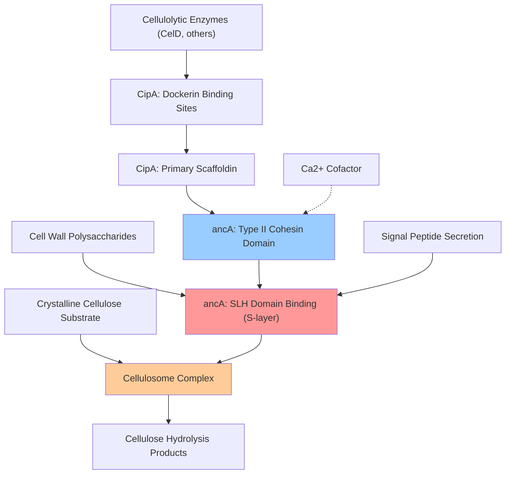

# Pathway Summary for ancA

## Overview
ancA participates in the cellulosome assembly and cellulose catabolic pathways where it functions as a cell surface anchoring protein [PMID:8458832, file:ACET2/ancA/ancA-deep-research.md]. This non-catalytic scaffolding protein enables efficient plant biomass degradation by tethering the multi-enzyme cellulosome complex to the bacterial cell surface, concentrating cellulolytic enzymes at the substrate interface and preventing their loss to the medium.

## Cellulosome Assembly and Anchoring Pathway
The cellulosome assembly pathway represents a sophisticated bacterial strategy for the efficient degradation of crystalline cellulose and other plant cell wall polysaccharides [file:ACET2/ancA/ancA-deep-research.md]. ancA encodes the primary anchoring protein that mediates the attachment of the cellulosome complex to the cell surface through a highly specific protein-protein interaction mechanism.

ancA contains a Type II cohesin domain at its N-terminus that specifically binds to the dockerin domain of CipA, the primary scaffoldin protein of the cellulosome [PMID:8458832, file:ACET2/ancA/ancA-deep-research.md]. This calcium-dependent cohesin-dockerin interaction represents a key structural feature that enables the stable association of the large cellulosome complex with the cell surface while maintaining conformational flexibility for substrate access.

The C-terminal region of ancA contains 3-4 S-layer homology (SLH) domains that mediate non-covalent attachment to cell wall polysaccharides [PMID:8458832, file:ACET2/ancA/ancA-deep-research.md]. These domains anchor the protein to the S-layer, creating a stable platform for cellulosome attachment that positions the enzymatic machinery optimally for substrate degradation.

## Cellulose Catabolic Process
ancA directly contributes to the cellulose catabolic process by enabling the formation of cell-associated cellulosome complexes [file:ACET2/ancA/ancA-deep-research.md]. The anchoring function concentrates cellulolytic enzymes at the cell-substrate interface, creating a high local enzyme concentration that enhances cellulose hydrolysis efficiency through proximity effects and enzyme synergy.

Knockout studies demonstrate that strains lacking ancA show reduced cellulose hydrolysis rates (14-23% slower) and delayed substrate degradation, confirming the protein's essential role in efficient cellulose catabolism [file:ACET2/ancA/ancA-deep-research.md]. This anchoring mechanism prevents the loss of expensive cellulolytic enzymes to the medium and maintains optimal enzyme-substrate contact for maximal hydrolytic activity.

## Cellulosome Assembly and Anchoring Pathway Diagram

## Cell Wall Organization and Enzyme Targeting
ancA participates in cell wall organization by mediating the proper spatial arrangement of the cellulosome machinery on the bacterial cell surface [file:ACET2/ancA/ancA-deep-research.md]. The protein's SLH domains interact with cell wall polysaccharides to create organized arrays of cellulosome complexes that maximize the cell's capacity for plant biomass degradation.

This organization creates a specialized cell surface architecture that is optimized for substrate binding and enzyme activity. The anchoring mechanism allows for the coordinated action of multiple cellulolytic enzymes within each cellulosome complex while maintaining the structural integrity needed for efficient substrate degradation.

## Biotechnological Significance
The ancA-mediated cellulosome anchoring pathway represents a key target for biotechnological applications in biomass conversion and biofuel production [file:ACET2/ancA/ancA-deep-research.md]. Understanding the molecular mechanism of cellulosome anchoring has enabled the development of engineered systems for enhanced cellulolytic activity and the design of synthetic biology approaches for improved plant biomass degradation.

The specific cohesin-dockerin interaction mechanism used by ancA provides a modular system that can be engineered to create designer cellulosomes with defined enzyme compositions and activities tailored for specific biomass substrates and industrial applications.