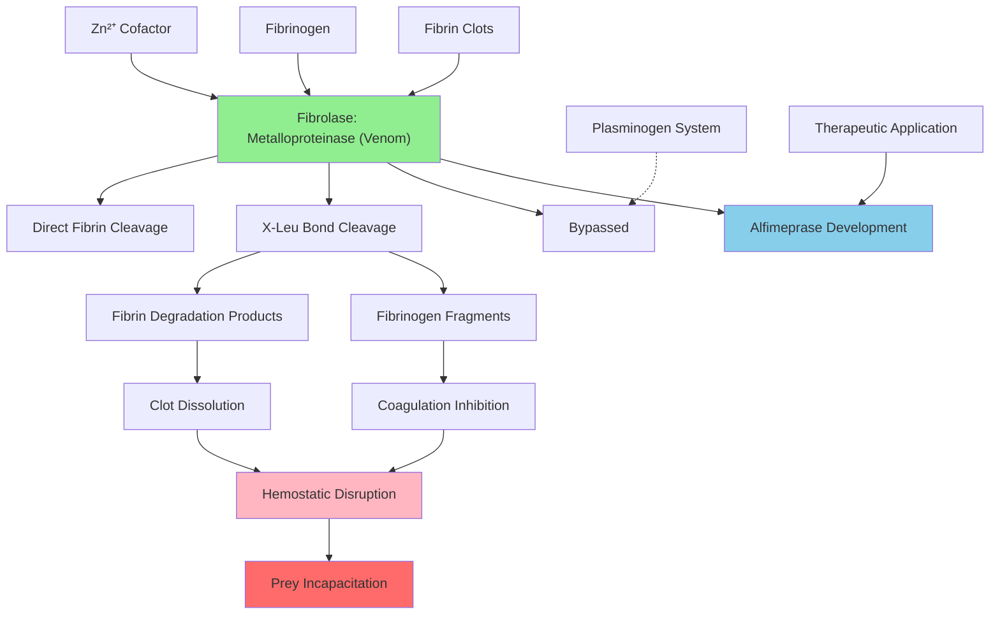

# Pathway Summary for fibrolase

## Overview
Fibrolase is a non-hemorrhagic snake venom zinc metalloproteinase (EC 3.4.24.72) from southern copperhead (Agkistrodon contortrix contortrix) that exhibits direct fibrinolytic activity [P28891]. Unlike conventional plasminogen activators, fibrolase directly cleaves fibrin and fibrinogen at specific X-Leu bonds without requiring plasminogen activation, making it a unique fibrinolytic enzyme [PMID:1898066]. As a venom component, it functions to disrupt hemostasis in envenomated prey by dissolving blood clots.

## Direct Fibrinolytic Pathway
Fibrolase operates through a direct fibrinolytic mechanism that bypasses the normal plasminogen activation cascade [PMID:1898066]. The enzyme directly cleaves fibrin fibers and fibrinogen molecules at specific leucine-containing peptide bonds, causing dissolution of blood clots and preventing coagulation. This direct action distinguishes it from physiological fibrinolytic agents like tissue plasminogen activator (tPA) that require plasminogen conversion to plasmin for fibrin degradation.

## Zinc-Dependent Metalloproteinase Activity
The enzyme requires zinc cofactor for its metalloendopeptidase activity, utilizing the metal ion for catalytic peptide bond hydrolysis [GO_REF:0000120]. The zinc atom is coordinated by histidine and other residues in the active site, enabling the nucleophilic attack on peptide bonds within fibrin and fibrinogen substrates. This zinc dependency is characteristic of the M12 family of metalloproteinases and is essential for the enzyme's catalytic function.

## Venom-Mediated Hemostatic Disruption
As a venom component, fibrolase serves to incapacitate prey by disrupting normal blood coagulation processes [PMID:1304358]. The enzyme's fibrinolytic activity prevents blood clot formation and dissolves existing clots, leading to hemorrhage and circulatory compromise in envenomated animals. This hemostatic disruption is part of the snake's predatory strategy, immobilizing prey through systemic coagulation dysfunction.

## Substrate Specificity and Cleavage Mechanism
Fibrolase exhibits specific substrate recognition, preferentially cleaving X-Leu peptide bonds in fibrin and fibrinogen [PMID:1898066]. This specificity allows the enzyme to selectively target coagulation proteins while avoiding widespread proteolysis of other plasma proteins. The precise cleavage pattern results in specific fibrin degradation products that can be distinguished from those produced by plasmin or other fibrinolytic enzymes.

## Pathway Diagram

## Inter-Organism Modulation and Toxicity
Fibrolase functions as a toxin that modulates physiological processes in other organisms through its fibrinolytic activity [GO_REF:0000108]. The enzyme's ability to dissolve blood clots and prevent coagulation represents a form of biochemical warfare against prey species. This inter-organism modulation is achieved through specific enzymatic activity rather than general tissue destruction, making fibrolase a precision biological weapon.

## Non-Hemorrhagic Toxicity Mechanism
Unlike many venom metalloproteinases that cause tissue destruction and bleeding through basement membrane degradation, fibrolase is specifically non-hemorrhagic [PMID:1304358]. Its toxicity is limited to disrupting blood coagulation processes without causing direct tissue damage or capillary destruction. This specificity makes the enzyme particularly interesting for potential therapeutic applications.

## Therapeutic Development and Clinical Applications
Fibrolase served as the basis for developing alfimeprase, a recombinant fibrinolytic enzyme investigated for treating acute peripheral arterial occlusion [file:AGKCO/fibrolase/fibrolase-deep-research.md]. The enzyme's direct fibrinolytic activity without plasminogen activation made it attractive for clinical use, as it could potentially avoid some complications associated with conventional thrombolytic therapy. However, phase III clinical trials were ultimately unsuccessful.

## Comparative Fibrinolysis and Evolutionary Adaptation
Fibrolase represents an evolutionary adaptation that allows snakes to exploit a critical vulnerability in vertebrate physiology - the blood coagulation system [PMID:1304358]. The enzyme's direct action mechanism provides advantages over indirect approaches, ensuring rapid and effective hemostatic disruption. This evolutionary innovation demonstrates how venomous animals have developed sophisticated biochemical tools for prey capture.

## Biochemical Characterization and Structure-Function
The enzyme's specific cleavage pattern and zinc dependence have been extensively characterized, revealing insights into its catalytic mechanism and substrate recognition [PMID:1898066]. Understanding fibrolase's structure-function relationships has informed both basic research into metalloproteinase enzymology and applied research into therapeutic fibrinolytic agents. The enzyme serves as a model for understanding how venom components achieve their specific biological effects.

## Clinical and Research Applications
Beyond its therapeutic development, fibrolase has been valuable as a research tool for studying blood coagulation and fibrinolysis [file:AGKCO/fibrolase/fibrolase-deep-research.md]. Its unique properties have enabled researchers to dissect fibrinolytic pathways and understand the roles of different components in hemostasis. The enzyme's specificity and direct action make it useful for in vitro studies of coagulation processes and for developing diagnostic assays.