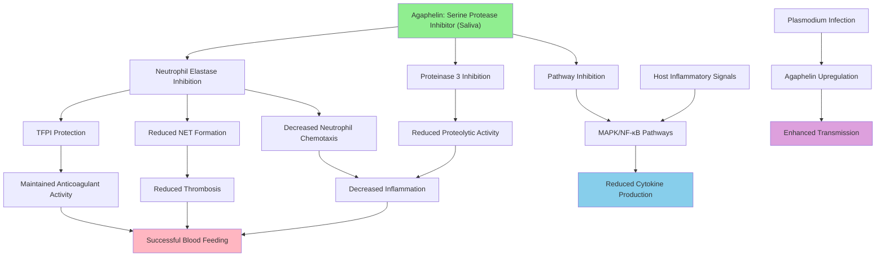

# Pathway Summary for Agaphelin

## Overview
Agaphelin is a mosquito salivary protein containing a single Kazal domain that functions as a highly selective serine protease inhibitor, specifically targeting neutrophil elastase (ELANE) and proteinase 3 (PRTN3) [PMID:25211214]. The protein plays a crucial role in facilitating blood feeding by preventing blood coagulation and inflammatory responses in the host, while its expression is significantly upregulated upon Plasmodium falciparum infection, suggesting additional roles in parasite transmission [PMID:25211214].

## Blood Feeding and Hematophagy Pathway
Agaphelin is secreted in mosquito saliva and functions as a key mediator of successful hematophagy by modulating host hemostatic and inflammatory responses [PMID:25211214]. The protein acts as a slow and tight inhibitor of neutrophil elastase with extremely high affinity (KD ~10 nM), effectively blocking host defense mechanisms that would otherwise prevent efficient blood feeding [PMID:25211214]. This inhibition allows the mosquito to obtain a complete blood meal without triggering harmful host responses.

## Anticoagulant and Anti-Thrombotic Pathway
Through its inhibition of neutrophil elastase, Agaphelin prevents the elastase-mediated cleavage of tissue factor pathway inhibitor (TFPI), thereby maintaining the anticoagulant environment necessary for blood feeding [PMID:25211214]. The protein demonstrates potent anti-thrombotic activity, preventing FeCl3-induced arterial thrombosis in experimental models while remarkably preserving normal hemostasis [PMID:25211214]. This selective action distinguishes Agaphelin from traditional anticoagulants that often cause bleeding complications.

## Neutrophil Function Modulation Pathway
Agaphelin significantly modulates neutrophil function through multiple mechanisms beyond elastase inhibition [PMID:25211214]. The protein inhibits neutrophil chemotaxis toward formyl peptides (fMLP), affecting several parameters associated with cell migration and reducing neutrophil recruitment to sites of tissue damage [PMID:25211214]. Additionally, Agaphelin blocks neutrophil extracellular trap (NET) formation, preventing the release of DNA-protein complexes that normally contribute to antimicrobial defense and thrombosis [PMID:25211214].

## Anti-Inflammatory Signaling Pathway
Agaphelin exhibits potent anti-inflammatory activities that extend beyond its role in blood feeding [PMID:32201094, PMID:33401017]. The protein reduces the production of inflammatory cytokines including CCL2 and IL-8 in stimulated bronchial epithelial cells, demonstrating its ability to modulate inflammatory responses in various tissue contexts [PMID:32201094]. In stroke models, Agaphelin reduces ischemia-induced activation of MAPK and NF-κB signaling pathways while decreasing caspase-3-dependent apoptosis [PMID:33401017].

## Pathway Diagram

## Parasite Transmission Enhancement
Agaphelin expression is significantly upregulated in Anopheles gambiae salivary glands upon P. falciparum infection, indicating a role in facilitating parasite transmission [PMID:25211214]. This upregulation suggests that the malaria parasite may manipulate mosquito gene expression to enhance its own transmission success by increasing the effectiveness of blood feeding. The anti-inflammatory and anticoagulant properties of Agaphelin may create more favorable conditions for parasite establishment in the vertebrate host.

## Therapeutic Potential and Vascular Protection
Agaphelin's unique properties make it a promising candidate for therapeutic applications in thrombotic and inflammatory diseases [PMID:33401017]. Unlike traditional anticoagulants, Agaphelin provides anti-thrombotic protection without impairing normal hemostatic mechanisms, reducing the risk of bleeding complications [PMID:25211214]. In stroke models, the protein demonstrates neuroprotective effects by reducing blood-brain barrier damage and inflammation while preserving tissue integrity [PMID:33401017].

## Molecular Specificity and Selectivity
The Kazal domain of Agaphelin confers remarkable specificity for neutrophil elastase and proteinase 3, distinguishing it from other serine protease inhibitors [PMID:25211214]. This specificity allows Agaphelin to target inflammatory processes without broadly inhibiting all serine proteases, which would have detrimental effects on normal physiological functions. The protein's selectivity represents an evolutionary adaptation that maximizes anti-hemostatic effectiveness while minimizing harmful side effects.

## Evolutionary and Ecological Significance
Agaphelin represents a sophisticated evolutionary adaptation that enables efficient hematophagy in disease vector mosquitoes. The protein's dual role in blood feeding facilitation and potential parasite transmission enhancement illustrates the complex co-evolutionary relationships between vectors, pathogens, and hosts. Understanding Agaphelin's function may inform novel approaches for vector control and disease prevention strategies targeting the blood feeding behavior of mosquitoes.