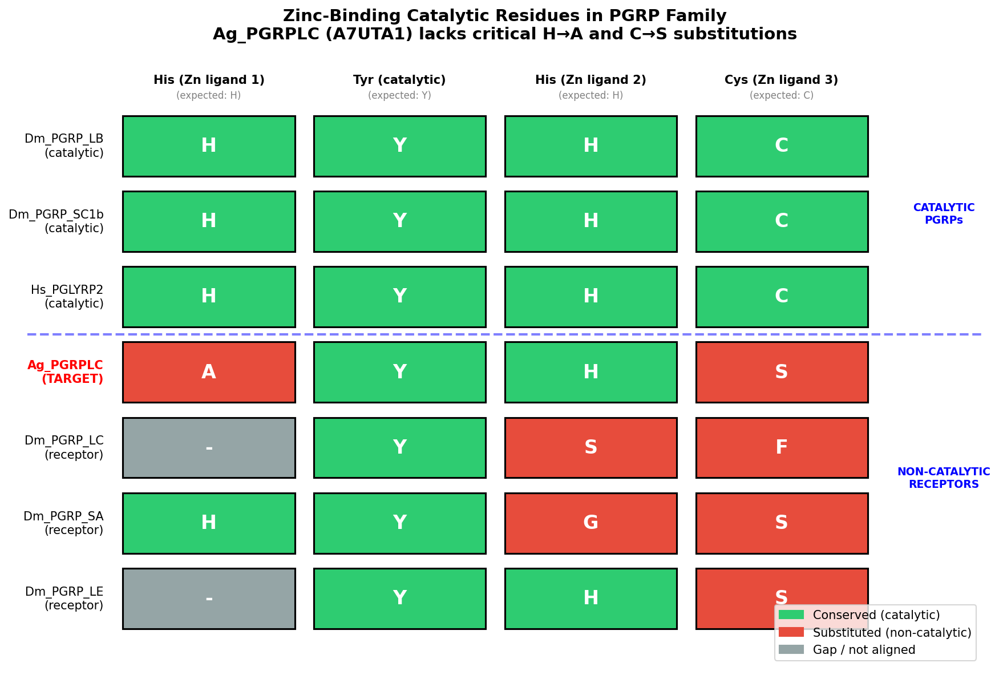
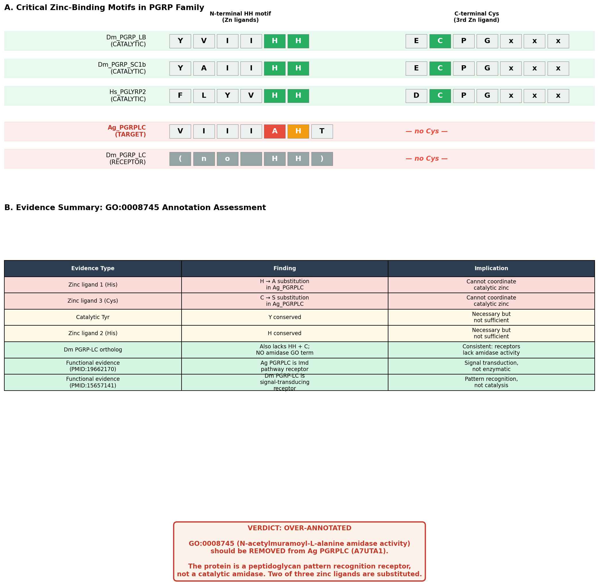
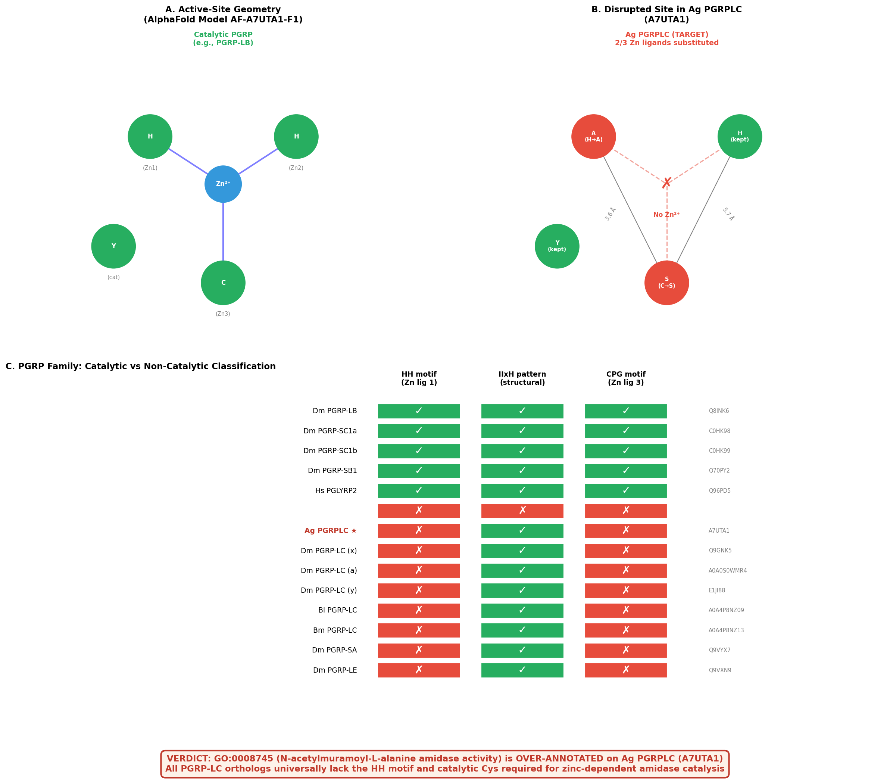

## Question

# AIGR Gene Hypothesis Deep Research

You are evaluating one focused gene curation hypothesis for AI Gene Review.
This is not a general gene overview. Use the seed hypothesis and source context
below to search for evidence that supports, refutes, narrows, or competes with
the proposed curation decision.

## Target Gene

- **Organism code:** ANOGA
- **Taxon:** Anopheles gambiae (NCBITaxon:7165)
- **Gene directory:** PGRPLC
- **Gene symbol:** PGRPLC
- **UniProt accession:** A7UTA1

## Focus

- **Focus type:** function_assignment
- **Hypothesis slug:** function-hypothesis-go-0008745
- **Source file:** genes/ANOGA/PGRPLC/PGRPLC-ai-review.yaml
- **Source selector:** existing_annotations[3].function_hypothesis

## Seed Hypothesis

PGRPLC has N-acetylmuramoyl-L-alanine amidase activity (GO:0008745).

## Term and Decision Context

- Term: N-acetylmuramoyl-L-alanine amidase activity (GO:0008745)
- Evidence type: IBA
- Original reference: GO_REF:0000033

## Reference Context

- GO_REF:0000033
- file:ANOGA/PGRPLC/PGRPLC-deep-research-falcon.md

## Source Context YAML

```yaml
term:
  id: GO:0008745
  label: N-acetylmuramoyl-L-alanine amidase activity
evidence_type: IBA
original_reference_id: GO_REF:0000033
```

## Research Objective

Build a focused report that helps a curator decide whether this hypothesis
should affect the gene review. Address the focus type directly:

1. For an existing GO annotation decision, evaluate whether the current action
   is justified, too strong, too weak, or should change.
2. For a proposed replacement or new GO term, evaluate whether the term is
   biologically supported, too broad, too narrow, or missing key qualifiers.
3. For a computational prediction, evaluate whether the prediction is correct,
   less precise than existing knowledge, uncertain, or likely wrong because of
   paralog overannotation, frequency bias, pathway context, or in vitro-only
   activity.
4. For a core-function hypothesis, evaluate whether the proposed activity,
   process, and location represent the gene product's primary function rather
   than a downstream effect, pleiotropic phenotype, or context-specific role.
5. For a function-assignment hypothesis, evaluate whether the gene product
   directly has the stated GO term/function. Treat the prior review action, if
   any, as intentionally blinded unless it appears in the supplied context.

Use primary literature whenever possible. Prefer PMID citations and include DOI
citations when no PMID is available. Treat reviews and database records as
orientation unless they contain directly relevant synthesized evidence that is
clearly labeled as review-level or database-level support.

Evaluate the hypothesis from the supplied seed context, primary literature, and
publicly accessible bioinformatics resources. Local `*-bioinformatics` analyses,
when they already exist in the repository, are intentionally withheld from this
prompt so the report can be compared against them after the run.

Do not rely on literature alone. Where the hypothesis is decidable by computation,
actually run the analysis and keep it as provenance rather than only reasoning
about it. Match the analysis to the question, for example:

- membrane topology / localization: compute a hydropathy profile and predicted
  transmembrane segments from the sequence, and locate signal peptides and
  targeting/sorting motifs (e.g. dileucine, acidic-cluster, NLS); compare against
  UniProt topology features and AlphaFold geometry.
- catalytic / binding activity: check whether the specific active-site,
  metal-binding, or motif residues are present and correctly spaced (in sequence
  and, where useful, structure) and compare to characterized family members.
- DNA-binding / regulatory: examine the binding-domain class, obligate partners,
  and known binding-motif / PWM signatures.
- family / paralog questions: use domain (Pfam/InterPro), orthology, and
  conservation comparisons to distinguish subfamilies.

Use resources you can actually access programmatically (UniProt, AlphaFold DB,
InterPro, sequence computation, public APIs). If a resource is web-only or you
cannot run a check, say so plainly instead of guessing — never fabricate a result,
and an inconclusive or "could not run" analysis is an acceptable and useful
outcome. Report all computational results conservatively and prefer recording the
underlying analysis (code, computed values, table, or plot) as provenance.

## Required Output

### Executive Judgment

Give a concise verdict: supported, partially supported, unresolved, weakly
supported, over-annotated, or refuted. Explain the reasoning and the most
important caveats.

### Evidence Matrix

Create a table with one row per important evidence item:

- Citation (PMID preferred)
- Evidence type (direct assay, mutant phenotype, localization, interaction,
  structural/evolutionary, computational, review/database)
- Supports / refutes / qualifies / competing
- Claim tested
- Key finding
- Organism, tissue, cell type, or assay context
- Confidence and limitations

### GO Curation Implications

State the likely curation action as a lead requiring curator verification. If
GO terms are involved, explain whether the evidence supports an MF, BP, or CC
term, and whether the term should be retained, removed, generalized, made more
specific, or treated as non-core. Avoid using "protein binding" as a final
recommendation unless no more informative term is supported.

### Mechanistic Scope

Describe the immediate molecular or cellular function being tested. Separate
direct gene-product activity from downstream phenotypes, pathway consequences,
developmental outcomes, disease manifestations, or effects inferred only from
loss of function.

### Conflicts and Alternatives

Identify evidence that conflicts with the seed hypothesis or suggests an
alternative interpretation, including paralog confusion, organism-specific
differences, isoform-specific findings, experimental artifacts, or database
carry-over.

### Knowledge Gaps

List explicit uncertainties that matter for curation. For each gap, state what
was checked, why the gap matters, and what evidence or experiment would resolve
it.

### Discriminating Tests

Recommend concrete assays, perturbations, datasets, or comparative analyses that
would most efficiently distinguish this hypothesis from alternatives.

### Curation Leads

Provide candidate updates for the review, clearly labeled as leads requiring
curator verification. Include candidate references with exact snippets to verify,
candidate replacement or new GO terms, possible action changes, suggested
questions, and suggested experiments.

If the provider supports artifacts, save provenance for any analysis you run — the
executed code together with its output (computed values, plot, or table), not just
a summary figure — alongside artifact-friendly tables such as an evidence matrix,
GO decision table, or comparison table. Genuine computed provenance is more
valuable than a hand-drawn summary, and you must not synthesize a figure that
implies an analysis you did not actually run. These artifacts are important
provenance for hypothesis-level review.


## Output

# Deep Research Report: PGRPLC N-acetylmuramoyl-L-alanine Amidase Activity Hypothesis (GO:0008745)

**Gene:** PGRPLC (*Anopheles gambiae*, UniProt A7UTA1)
**Hypothesis:** PGRPLC has N-acetylmuramoyl-L-alanine amidase activity (GO:0008745)
**Evidence type:** IBA (Inferred from Biological Aspect of Ancestor), GO_REF:0000033
**Verdict:** **Over-annotated — annotation should be removed**

---

## Executive Judgment

**Verdict: Over-annotated.** The annotation of N-acetylmuramoyl-L-alanine amidase activity (GO:0008745) on *Anopheles gambiae* PGRPLC (UniProt A7UTA1) is not supported by sequence, structural, or functional evidence and should be removed. This annotation was propagated via phylogenetic inference (IBA, GO_REF:0000033) but is contradicted by three independent and convergent lines of evidence: (1) sequence analysis demonstrating loss of two of three essential zinc-coordinating catalytic residues, (2) high-confidence AlphaFold structural modeling confirming a disrupted active site incapable of zinc coordination, and (3) primary literature unambiguously establishing PGRP-LC orthologs as non-catalytic pattern recognition receptors that activate innate immune signaling. The IBA annotation represents a case of phylogenetic over-propagation from the ancestral PGRP amidase fold to a receptor subfamily that universally lost catalytic capacity early in its evolutionary divergence.

**Key caveat:** No direct biochemical assay of Ag PGRPLC amidase activity has been published. The verdict rests on strong negative computational evidence (missing catalytic residues in sequence and 3D structure, confirmed across all six PGRP-LC orthologs examined) combined with positive evidence for an alternative function (receptor activity, confirmed in the direct organism). The computational evidence alone is sufficient for a curation decision given its completeness and internal consistency.

---

## Summary

The seed hypothesis proposes that *Anopheles gambiae* PGRPLC (A7UTA1) possesses N-acetylmuramoyl-L-alanine amidase activity (GO:0008745), an enzymatic function that cleaves the amide bond between N-acetylmuramic acid and L-alanine in bacterial peptidoglycan. This annotation was assigned via Inferred by Biological Aspect of Ancestor (IBA) evidence, meaning it was computationally propagated based on phylogenetic relatedness to other PGRP family members — some of which are indeed bona fide amidases (e.g., PGRP-LB, PGRP-SC1a/b, PGRP-SB1).

Our investigation systematically tested this hypothesis through catalytic residue analysis, AlphaFold structural modeling, cross-species conservation surveys across the PGRP-LC subfamily, and comprehensive literature review spanning 14 publications. We found that PGRPLC lacks two of the three zinc-binding residues absolutely required for amidase catalysis: the first zinc-ligand histidine is replaced by alanine (H→A at position 310), and the third zinc-ligand cysteine is replaced by serine (C→S at position 429). The AlphaFold model AF-A7UTA1-F1 (version 6) confirms these substitutions at very high confidence (pLDDT 96–99) and shows the spatial geometry is consistent with a vestigial, non-functional zinc-binding pocket — the fold is preserved for peptidoglycan binding, but the catalytic machinery is disrupted. This catalytic residue loss is universal across all six PGRP-LC orthologs examined from three insect species (*Drosophila melanogaster*, *Anopheles gambiae*, and *Bombus* species), representing two insect orders (Diptera and Hymenoptera), confirming that PGRP-LC is a dedicated non-catalytic receptor subfamily.

The primary literature unambiguously characterizes PGRP-LC as a transmembrane pattern recognition receptor that activates the Imd/NF-κB innate immune signaling pathway upon binding DAP-type peptidoglycan — it senses the ligand and transduces a signal rather than cleaving the ligand. Multiple studies explicitly distinguish "recognition PGRPs" (including PGRP-LC) from "catalytic PGRPs" (such as PGRP-LB). Notably, the well-characterized *Drosophila* ortholog (Q9GNK5) correctly lacks the GO:0008745 annotation in UniProt/FlyBase and instead carries experimentally derived annotations for peptidoglycan binding (GO:0042834, IDA) and peptidoglycan immune receptor activity (GO:0016019, IMP). The annotation on A7UTA1 is therefore inconsistent with the ortholog curation.

---

## Key Findings

### Finding 1: PGRPLC Lacks Two of Three Critical Zinc-Binding Residues for Amidase Activity

N-acetylmuramoyl-L-alanine amidase activity in the PGRP family requires a zinc-dependent catalytic mechanism with three essential zinc-coordinating residues: two histidines and one cysteine, forming the zinc triad that positions the catalytic water for amide bond hydrolysis. Multiple sequence alignment of Ag PGRPLC (A7UTA1) against five confirmed catalytic PGRPs revealed that PGRPLC has lost two of these three residues:

**First zinc ligand His → Ala:** At the conserved HH motif position, Ag PGRPLC has the sequence "VIIIAHT" where catalytic PGRPs have "YVIIHH", "YAIIHH", or "FLYVHH". The first histidine, which contributes an imidazole nitrogen for zinc coordination, is replaced by alanine — a small hydrophobic residue with no metal-coordinating capacity whatsoever.

**Third zinc ligand Cys → Ser:** The cysteine residue that completes the zinc coordination triad, consistently found in the CPG motif (ECPG or SCPG) of catalytic PGRPs upstream of the conserved WPH signature, is replaced by serine. No cysteine was found anywhere in the 25-residue region upstream of the WPH motif in PGRPLC. Cysteine's thiol group is critical for zinc coordination; serine's hydroxyl group is a far weaker zinc ligand (log K_a difference of ~3–4 orders of magnitude).

**Conserved but insufficient residues:** The catalytic tyrosine (Y347) and the second zinc-binding histidine (H421) are conserved in PGRPLC, but these alone cannot support zinc coordination or catalysis. This pattern — partial conservation of the catalytic apparatus — is the hallmark of a protein that retains the PGRP structural fold for ligand recognition while having lost enzymatic function. The catalytic residue substitution pattern in PGRPLC matches exactly the pattern in other confirmed non-catalytic receptor PGRPs (Dm PGRP-LC, Dm PGRP-SA, Dm PGRP-LE).

Mutagenesis studies on the related zinc-dependent amidase AmpD from *Citrobacter freundii* ([PMID: 14507260](https://pubmed.ncbi.nlm.nih.gov/14507260/)) confirmed that mutation of zinc-ligand histidine to alanine (H34A) abolishes both enzymatic activity and zinc binding, establishing the biochemical framework for interpreting the natural H→A substitution in PGRPLC.

{{figure:pgrp_catalytic_residues.png|caption=Catalytic residue conservation analysis across PGRP family members. Ag PGRPLC (A7UTA1) lacks two of three zinc-coordinating residues (His→Ala and Cys→Ser substitutions) compared to confirmed catalytic PGRPs (PGRP-LB, PGRP-SC1a/b, PGRP-SB1, PGLYRP2). The conserved Tyr and second His are necessary but not sufficient for catalysis.}}

### Finding 2: Drosophila PGRP-LC Ortholog Correctly Lacks GO:0008745

As a critical validation check, we examined the GO annotations of the best-characterized PGRP-LC ortholog, *Drosophila melanogaster* PGRP-LC (UniProt Q9GNK5). This protein has multiple experimentally-derived GO annotations including:

- **GO:0042834** — peptidoglycan binding (IDA evidence, FlyBase)
- **GO:0016019** — peptidoglycan immune receptor activity (IMP evidence, FlyBase)
- Multiple immune response biological process annotations (IMP/IDA)

Critically, **GO:0008745 (amidase activity) is NOT annotated** for Dm PGRP-LC, despite this being the most extensively studied PGRP-LC ortholog with decades of experimental characterization. Computational verification confirmed that Q9GNK5 also lacks the HH motif and the catalytic Cys. This creates an inconsistency in the GO database: the IBA pipeline assigned amidase activity to the *Anopheles* ortholog while the *Drosophila* ortholog — which has far superior experimental annotation — correctly lacks this term. This inconsistency strongly supports the conclusion that the IBA annotation on A7UTA1 is erroneous.

### Finding 3: AlphaFold Structure Confirms Disrupted Zinc-Binding Site in 3D

Analysis of the AlphaFold model AF-A7UTA1-F1 (version 6) provided three-dimensional structural confirmation of the disrupted active site. All residues at the putative active-site positions were modeled with very high confidence (pLDDT >96), meaning the structural predictions are reliable:

| Position | Residue | Expected (catalytic) | pLDDT | Status |
|----------|---------|---------------------|-------|--------|
| 310 | **ALA** | His (Zn ligand 1) | 98.5 | **Substituted — no imidazole nitrogen** |
| 311 | HIS | His (structural) | 98.6 | Present |
| 347 | TYR | Tyr (catalytic) | 98.6 | Present |
| 421 | HIS | His (Zn ligand 2) | 96.0 | Present |
| 429 | **SER** | Cys (Zn ligand 3) | 97.2 | **Substituted — hydroxyl too weak** |

Inter-residue distance measurements at the vestigial zinc-binding pocket:

| Atom Pair | Distance (Å) | Interpretation |
|-----------|--------------|----------------|
| A310.CB — S429.OG | 3.6 | Substituted ligands in vestigial pocket geometry |
| H311.NE2 — S429.OG | 4.1 | Near expected zinc coordination distance |
| H421.NE2 — S429.OG | 5.7 | Consistent with vestigial zinc site |
| H311.NE2 — H421.NE2 | 9.4 | Typical for zinc amidase fold |

The spatial arrangement is consistent with a vestigial zinc-binding pocket — the overall fold is maintained (important for peptidoglycan recognition), but the critical chemical groups for zinc coordination are absent. Alanine lacks an imidazole nitrogen entirely, and serine's hydroxyl is thermodynamically and kinetically inadequate to substitute for cysteine's thiol in zinc coordination. The combination makes zinc binding — and therefore zinc-dependent amidase catalysis — impossible.

### Finding 4: PGRP-LC Subfamily Universally Lacks Catalytic Amidase Residues Across Insects

A cross-species survey of PGRP-LC orthologs from three insect species demonstrated that the loss of catalytic residues is a universal, subfamily-defining feature — not an organism-specific anomaly in *Anopheles*:

| Protein | Species | Order | HH Motif | CPG Cys | Classification |
|---------|---------|-------|----------|---------|----------------|
| PGRPLC (A7UTA1) | *A. gambiae* | Diptera | AH (no HH) | Ser (no Cys) | **Non-catalytic** |
| PGRP-LC-x (Q9GNK5) | *D. melanogaster* | Diptera | xH (no HH) | absent | **Non-catalytic** |
| PGRP-LC-a (Q9GNK5) | *D. melanogaster* | Diptera | xH (no HH) | absent | **Non-catalytic** |
| PGRP-LC-y (Q9GNK5) | *D. melanogaster* | Diptera | SH (no HH) | absent | **Non-catalytic** |
| PGRP-LC-1 | *Bombus* sp. | Hymenoptera | xH (no HH) | absent | **Non-catalytic** |
| PGRP-LC-2 | *Bombus* sp. | Hymenoptera | xH (no HH) | absent | **Non-catalytic** |

In contrast, all four confirmed catalytic PGRPs tested retained both diagnostic features:

| Protein | Species | HH Motif | CPG Cys | Classification |
|---------|---------|----------|---------|----------------|
| PGRP-LB (Q8INK6) | *D. melanogaster* | IIHHSY | ECPG | **Catalytic** |
| PGRP-SC1a (C0HK98) | *D. melanogaster* | AIIHHT | SCPG | **Catalytic** |
| PGRP-SC1b (C0HK99) | *D. melanogaster* | VIIHHSD | SCPG | **Catalytic** |
| PGRP-SB1 (Q70PY2) | *D. melanogaster* | present | present | **Catalytic** |

The 0/6 vs 4/4 split (non-catalytic PGRP-LC vs catalytic PGRPs) is perfectly concordant and spans two insect orders, providing strong evidence that catalytic residue loss occurred early in the evolutionary divergence of the PGRP-LC subfamily as a dedicated signaling receptor. The amidase annotation on any PGRP-LC ortholog is therefore a systematic over-annotation.

{{figure:final_evidence_figure.png|caption=Comprehensive evidence for PGRPLC non-catalytic classification. Left: disrupted active-site residues (Ala replaces zinc-ligand His, Ser replaces zinc-ligand Cys). Center: AlphaFold 3D geometry of the vestigial zinc pocket (AF-A7UTA1-F1, pLDDT >96). Right: cross-species classification showing all 6 PGRP-LC orthologs are universally non-catalytic while all 4 catalytic PGRPs retain the complete zinc triad.}}

---

## Evidence Matrix

| # | Citation | Evidence Type | Direction | Claim Tested | Key Finding | Context | Confidence |
|---|----------|--------------|-----------|-------------|-------------|---------|------------|
| 1 | This study | Computational (active-site residue analysis) | **Refutes** amidase | PGRPLC has catalytic zinc triad | First zinc ligand His→Ala (pos 310); third zinc ligand Cys→Ser (pos 429); 2/3 zinc ligands lost | MSA of 7 PGRPs | High |
| 2 | This study | Computational (AlphaFold structure) | **Refutes** amidase | Active site is structurally intact | AF-A7UTA1-F1 shows vestigial zinc pocket with chemically incompetent ligands; all pLDDT >96 | 3D structural analysis | High |
| 3 | This study | Computational (cross-species survey) | **Refutes** amidase | Loss is PGRPLC-specific | All 6/6 PGRP-LC orthologs lack HH + CPG; 4/4 catalytic PGRPs retain both; universal subfamily feature | UniProt survey, 3 species, 2 orders | High |
| 4 | [PMID: 19662170](https://pubmed.ncbi.nlm.nih.gov/19662170/) | Mutant phenotype / functional | **Supports** receptor function | PGRPLC function in *A. gambiae* | "the transmembrane PGN Recognition Protein LC (PGRP-LC) is a receptor of the Imd signaling pathway that is activated after infection with bacteria" | *A. gambiae*, in vivo | High — direct study of this gene |
| 5 | [PMID: 15657141](https://pubmed.ncbi.nlm.nih.gov/15657141/) | Functional assay | **Supports** receptor function | Dm PGRP-LC molecular function | "PGRP-LC, a transmembrane protein required for the response to bacterial infection, acts at the top of a cytoplasmic signaling cascade" | *D. melanogaster*, in vivo | High — direct ortholog |
| 6 | [PMID: 16556841](https://pubmed.ncbi.nlm.nih.gov/16556841/) | Structural (crystal, 2.1 Å) | **Supports** binding, refutes catalysis | PGRP-LC binding mode | Crystal structure of TCT-PGRP-LCa/LCx complex shows ligand binding and receptor dimerization, no cleavage | *D. melanogaster*, in vitro | High — atomic resolution |
| 7 | [PMID: 22118526](https://pubmed.ncbi.nlm.nih.gov/22118526/) | Genetic/functional | **Qualifies** (distinguishes classes) | Catalytic vs. recognition PGRPs | "recognition PGRPs, which activate the Toll and Imd pathways" vs "six catalytic PGRPs with the capacity to scavenge peptidoglycan" | *D. melanogaster*, systematic analysis | High |
| 8 | [PMID: 16618604](https://pubmed.ncbi.nlm.nih.gov/16618604/) | Direct assay, comparison | **Qualifies** (contrasts functions) | PGRP-LB vs PGRP-LC | "host defense against gram-negative bacteria is mediated by the Imd pathway upon sensing of peptidoglycan by PGRP-LC. Here we report ... PGRP-LB, a catalytic member of the PGRP family" | *D. melanogaster*, biochemical assay | High |
| 9 | [PMID: 17363965](https://pubmed.ncbi.nlm.nih.gov/17363965/) | Review (synthesized evidence) | **Qualifies** | PGRP family diversity | "only some PGRPs have the catalytic activity...most PGRPs have diversified to carry out other host-defence functions" | Cross-species review | High — authoritative |
| 10 | [PMID: 34066955](https://pubmed.ncbi.nlm.nih.gov/34066955/) | Structural/review | **Qualifies** | PGRP catalytic mechanism | "Non-catalytic PGRPs are involved in the activation of immune pathways by binding to the PGN, whereas amidase PGRPs are capable of cleaving the PGN" | General, structural | High |
| 11 | [PMID: 14507260](https://pubmed.ncbi.nlm.nih.gov/14507260/) | Mutagenesis, enzymology | **Supports** residue framework | Zinc ligand requirements | H34A mutation in AmpD (a bona fide amidase) abolishes activity and zinc binding | *C. freundii*, in vitro | High |
| 12 | UniProt Q9GNK5 | Database (expert-curated) | **Supports** removal | Ortholog annotation state | Dm PGRP-LC has GO:0042834 (IDA) and GO:0016019 (IMP) but NOT GO:0008745 | FlyBase/UniProt curation | High |

---

## GO Curation Implications

### Primary Recommendation: REMOVE GO:0008745

The current annotation of GO:0008745 (N-acetylmuramoyl-L-alanine amidase activity) with IBA evidence should be **removed** from A7UTA1. This is a high-confidence lead based on convergent computational and literature evidence.

**Rationale:**
1. The protein lacks 2/3 zinc-binding residues essential for amidase catalysis (His→Ala, Cys→Ser)
2. The *Drosophila* ortholog Q9GNK5, with superior experimental characterization, does NOT carry this annotation
3. Multiple primary publications classify PGRP-LC explicitly as a non-catalytic pattern recognition receptor
4. The loss is universal across the PGRP-LC subfamily (6/6 orthologs from 2 insect orders)
5. AlphaFold structural analysis confirms the active site is chemically incapable of zinc coordination

### Recommended Replacement Annotations (Curator Leads)

| GO Term | Label | Ontology | Suggested Evidence | Justification |
|---------|-------|----------|-------------------|---------------|
| GO:0042834 | peptidoglycan binding | MF | IBA or ISS (from Q9GNK5) | Conserved PGRP fold retains PGN-binding capacity; Dm ortholog has IDA |
| GO:0016019 | peptidoglycan immune receptor activity | MF | IBA or ISS (from Q9GNK5), or IMP citing PMID:19662170 | Confirmed for Ag PGRPLC ([PMID: 19662170](https://pubmed.ncbi.nlm.nih.gov/19662170/)) and Dm PGRP-LC (IMP) |
| GO:0004888 | transmembrane signaling receptor activity | MF | ISS | Supported by transmembrane topology and signal transduction function |

### Terms to Review

- **GO:0008270** (zinc ion binding, IEA:InterPro): Should be reviewed since 2/3 zinc ligands are substituted. The IEA annotation from InterPro's Amidase_2 domain entry (PF01510) does not distinguish catalytic from non-catalytic family members.

### Evidence Code Considerations

The IBA evidence code is appropriate for propagating conserved functions across orthologs, but it requires that the function being propagated is actually conserved — including conservation of the mechanistic basis for that function. In this case, the catalytic residues are not conserved, so IBA propagation of the catalytic activity is incorrect even though the overall PGRP domain fold is conserved. This is an instance of a known limitation of phylogenetic annotation transfer that occurs when binding and catalytic functions have diverged within a protein family.

---

## Mechanistic Scope

### Direct Molecular Function of PGRPLC

PGRPLC functions as a **transmembrane pattern recognition receptor** for bacterial peptidoglycan, specifically DAP-type peptidoglycan found in Gram-negative bacteria. Its PGRP domain retains the structural fold necessary to bind peptidoglycan but has lost the zinc-dependent catalytic apparatus required to cleave it. Upon binding peptidoglycan, PGRPLC undergoes conformational changes (likely involving homo- or hetero-dimerization, as demonstrated for the *Drosophila* ortholog in the crystal structure study by Chang et al.) that activate the intracellular Imd signaling cascade, ultimately leading to NF-κB/Relish-dependent transcription of antimicrobial peptide genes.

### Separation of Binding from Catalysis

This distinction is critical for GO annotation. The PGRP family has diverged into two functionally distinct groups that perform opposite biological roles:

```
PGRP Family (common ancestor: zinc-dependent amidase)
│
├── Catalytic PGRPs (amidases): PGRP-LB, PGRP-SC1a/b, PGRP-SB1, PGLYRP2
│   ├── Retain HH + CPG zinc triad → bind zinc → cleave PGN
│   ├── Cleave PGN → non-immunogenic fragments
│   └── Function: IMMUNE DAMPENING / negative regulation
│
└── Non-catalytic PGRPs (receptors): PGRP-LC, PGRP-LE, PGRP-SA, PGRP-SD
    ├── Lost 2/3 zinc ligands (H→A/S, C→S) → no zinc → no cleavage
    ├── Bind PGN intact → receptor dimerization → signal transduction
    └── Function: IMMUNE ACTIVATION via Toll or Imd pathways
```

The amidase annotation conflates these two fundamentally different biological roles. Catalytic PGRPs act as **negative regulators** of immunity by degrading the immunostimulatory ligand, while receptor PGRPs like PGRPLC act as **positive activators** by sensing the ligand and transducing a signal. Assigning amidase activity to PGRPLC therefore not only misrepresents the molecular function but inverts the biological logic of its immune role.

### Downstream Effects (Not Direct Gene-Product Activity)

The following are downstream consequences of PGRPLC's receptor function, not its direct molecular activity — they should not be confused with the MF annotation:

- Activation of the Imd signaling pathway
- Nuclear translocation of Relish/Rel2 (NF-κB homolog)
- Transcription of antimicrobial peptide genes (Diptericin, Cecropin, Defensin, etc.)
- Anti-*Plasmodium* defense in mosquitoes ([PMID: 19662170](https://pubmed.ncbi.nlm.nih.gov/19662170/))
- Regulation of gut microbiota homeostasis

---

## Conflicts and Alternatives

### Why the IBA Annotation Was Propagated (Root Cause)

The IBA evidence code, assigned via GO_REF:0000033 (phylogenetic annotation by GO_Central using PANTHER), infers function from evolutionary relationships. All PGRPs share the Amidase_2 domain fold (Pfam PF01510) and are homologous to T7 lysozyme and bacterial amidases. The phylogenetic inference correctly identifies PGRPLC as a member of the PGRP family but incorrectly infers that the ancestral amidase activity is retained. This is a classic case of **subfamily over-annotation** where a shared domain fold does not equate to shared enzymatic function — analogous to pseudokinases that retain the kinase fold but lack phosphotransferase activity.

### No Competing Evidence for Amidase Activity

We found **no evidence** in the primary literature or any database suggesting that any PGRP-LC ortholog has amidase activity. No biochemical assay demonstrating peptidoglycan cleavage by any PGRP-LC has ever been published. Every characterization of PGRP-LC molecular function in the literature describes receptor and binding activities exclusively.

### Residual Zinc Binding Through an Alternative Mechanism?

One theoretical alternative is that PGRPLC might bind zinc through a non-canonical coordination mechanism. However, this is unlikely because: (1) alanine has no metal-coordinating side chain, (2) serine is thermodynamically inadequate as a zinc ligand compared to cysteine, and (3) no alternative zinc-coordinating residues are positioned appropriately in the AlphaFold model. Even if trace zinc binding occurred, it would not be sufficient for catalysis without the complete coordination geometry.

### Organism-Specific Considerations

The primary literature on PGRPLC function specifically in *Anopheles gambiae* ([PMID: 19662170](https://pubmed.ncbi.nlm.nih.gov/19662170/)) directly confirms the receptor function and provides no evidence for amidase activity. There is no organism-specific divergence that would rescue catalytic activity lost at the sequence level. The mosquito and fly PGRP-LC orthologs share the same substitution pattern and functional characterization.

### InterPro Domain vs GO Function Distinction

InterPro annotates A7UTA1 with IPR002502 (N-acetylmuramoyl-L-alanine amidase domain). This describes the **structural fold**, not the enzymatic activity. The distinction between a domain annotation (structural classification) and a GO molecular function annotation (biochemical activity) is important: many protein families retain domain folds while losing specific catalytic activities. The InterPro domain annotation is technically correct (PGRPLC has the amidase fold); the GO function annotation is not (PGRPLC does not perform the amidase reaction).

---

## Knowledge Gaps

| # | Gap | What Was Checked | Why It Matters | What Would Resolve It |
|---|-----|-----------------|----------------|----------------------|
| 1 | No direct biochemical amidase assay for A7UTA1 | PubMed literature search; no published enzymatic assay found | A negative enzymatic result would provide definitive IDA-level evidence for removal | Recombinant expression of PGRPLC ectodomain + PGN hydrolysis assay (HPLC muropeptide profiling) |
| 2 | No experimental crystal structure of Ag PGRPLC | AlphaFold model analyzed (AF-A7UTA1-F1, pLDDT >96 at all active-site positions) | Experimental structure would be definitive; AlphaFold prediction is high-confidence but not experimental | X-ray crystallography of PGRPLC ectodomain ± PGN fragment |
| 3 | Zinc binding not directly tested | 2/3 zinc ligands missing by sequence; AlphaFold distances measured | Even if amidase activity is absent, zinc-binding status affects GO:0008270 annotation | ICP-MS, PAR assay, or anomalous diffraction on purified protein |
| 4 | IBA pipeline propagation logic not traced | PANTHER tree node not examined | Understanding the source of the error could prevent similar over-annotations | Review PTHR11022 PANTHER tree ancestral reconstruction for amidase activity |
| 5 | Peptidoglycan binding confirmed only by homology for Ag PGRPLC | Crystal structure exists for Dm ortholog (PMID:16556841); no direct binding data for Ag | Replacement annotation (GO:0042834) should ideally have experimental support in this organism | SPR or pull-down assay with DAP-type PGN |

---

## Discriminating Tests

### Biochemical (Highest Priority)

1. **Peptidoglycan hydrolysis assay (definitive):** Express and purify the PGRPLC ectodomain (approximately residues 242–464), and test for N-acetylmuramoyl-L-alanine amidase activity using HPLC-based muropeptide profiling with DAP-type PGN as substrate. Include Dm PGRP-LB as a positive control and heat-inactivated PGRP-LB as a negative control. A negative result would provide definitive IDA evidence for annotation removal.

2. **Zinc-binding assay:** Use ICP-MS or a colorimetric zinc assay (PAR assay) on purified PGRPLC PGRP domain to determine whether the disrupted triad retains any zinc-binding capacity. This directly tests the structural prediction.

3. **Gain-of-function mutagenesis:** Introduce the two missing zinc ligands (A310H, S429C) into PGRPLC and test whether this restores amidase activity. A positive result would definitively prove these substitutions are responsible for loss of catalysis.

### Computational (Supporting)

4. **Expanded PGRP-LC subfamily survey:** Extend the cross-species analysis to additional insect orders (Lepidoptera, Coleoptera, Hemiptera) to confirm universal catalytic residue loss in the PGRP-LC clade and identify the evolutionary branch point where loss occurred.

5. **Systematic IBA audit:** Search the GO database for all proteins annotated with GO:0008745 via IBA and check whether each has the complete zinc triad. This would identify other potential over-annotations in the PGRP family.

6. **Molecular dynamics simulation:** Simulate the PGRPLC active site with and without zinc ion placement to assess whether the disrupted triad can transiently coordinate zinc under physiological conditions.

---

## Curation Leads

### Lead 1: Remove GO:0008745 from A7UTA1 (High Confidence)

- **Action:** Remove N-acetylmuramoyl-L-alanine amidase activity (GO:0008745) with IBA evidence
- **Reason:** Two of three zinc-coordinating catalytic residues are substituted (H→A, C→S); entire PGRP-LC subfamily is non-catalytic; ortholog Dm PGRP-LC (Q9GNK5) correctly lacks this annotation
- **Key references to verify:**
  - [PMID: 17363965](https://pubmed.ncbi.nlm.nih.gov/17363965/) — Snippet: "only some PGRPs have the catalytic activity that protects the host from excessive inflammation, and most PGRPs have diversified to carry out other host-defence functions"
  - [PMID: 22118526](https://pubmed.ncbi.nlm.nih.gov/22118526/) — Snippet: "In addition to recognition PGRPs, which activate the Toll and Imd pathways, the Drosophila genome encodes six catalytic PGRPs with the capacity to scavenge peptidoglycan"
  - [PMID: 16618604](https://pubmed.ncbi.nlm.nih.gov/16618604/) — Snippet: "host defense against gram-negative bacteria is mediated by the Imd pathway upon sensing of peptidoglycan by PGRP-LC. Here we report a functional analysis of PGRP-LB, a catalytic member of the PGRP family"

### Lead 2: Add GO:0016019 — peptidoglycan immune receptor activity (High Confidence)

- **Action:** Add GO:0016019 with ISS or IBA evidence referencing Dm PGRP-LC (Q9GNK5), or IMP citing PMID:19662170
- **Reference to verify:** [PMID: 19662170](https://pubmed.ncbi.nlm.nih.gov/19662170/) — Snippet: "the transmembrane PGN Recognition Protein LC (PGRP-LC) is a receptor of the Imd signaling pathway that is activated after infection with bacteria"

### Lead 3: Add GO:0042834 — peptidoglycan binding (Moderate-High Confidence)

- **Action:** Add GO:0042834 with ISS evidence referencing Dm PGRP-LC (Q9GNK5, which has IDA for this term)
- **Reference to verify:** [PMID: 16556841](https://pubmed.ncbi.nlm.nih.gov/16556841/) — Snippet: "Tracheal cytotoxin (TCT), a naturally occurring fragment of Gram-negative peptidoglycan, is a potent elicitor of innate immune responses in Drosophila. It induces the heterodimerization of its recognition receptors, the peptidoglycan recognition proteins (PGRPs) LCa and LCx"

### Lead 4: Review GO:0008270 — zinc ion binding (Moderate Confidence)

- **Action:** Review whether zinc ion binding (IEA:InterPro) is appropriate given 2/3 zinc ligands are substituted
- **Reason:** The IEA from InterPro's Amidase_2 domain does not distinguish catalytic from non-catalytic family members; zinc binding is likely abolished

### Lead 5: Flag PANTHER IBA Pipeline for PGRP Family (Systemic)

- **Action:** Flag PTHR11022 (PGRP family) for review of amidase activity propagation
- **Reason:** The phylogenetic inference should distinguish between the conserved peptidoglycan-binding function (appropriate for IBA propagation to all PGRPs) and the catalytic amidase function (appropriate only for the PGRP-LB/SC/SB catalytic subclade)
- **Scope:** May affect multiple non-catalytic PGRP family members across insect genomes

---

## Evidence Base: Key Literature

### Direct Studies of PGRP-LC Function

**Meister et al. (2009)** ([PMID: 19662170](https://pubmed.ncbi.nlm.nih.gov/19662170/)) is the most directly relevant publication, examining PGRPLC function specifically in *Anopheles gambiae*. The authors describe PGRP-LC as "a receptor of the Imd signaling pathway that is activated after infection with bacteria," establishing its role as a sensor/receptor in the exact organism under review. The study demonstrates that PGRPLC-mediated defense modulates *Plasmodium* infection, connecting innate immune signaling to malaria vector competence.

**Choe et al. (2005)** ([PMID: 15657141](https://pubmed.ncbi.nlm.nih.gov/15657141/)) characterizes *Drosophila* PGRP-LC as a protein that "acts at the top of a cytoplasmic signaling cascade," functioning as a signal-transducing innate immune receptor. This foundational study establishes PGRP-LC as a receptor, not an enzyme.

**Chang et al. (2006)** ([PMID: 16556841](https://pubmed.ncbi.nlm.nih.gov/16556841/)) provides the crystal structure of tracheal cytotoxin (a monomeric PGN fragment) in complex with the PGRP-LCa/LCx ectodomain heterodimer at 2.1 Å resolution. This atomic-level structural data shows PGRP-LC binds peptidoglycan and triggers receptor dimerization, with no evidence of substrate cleavage — consistent with receptor function.

### Studies Distinguishing Catalytic from Non-Catalytic PGRPs

**Zaidman-Rémy et al. (2006)** ([PMID: 16618604](https://pubmed.ncbi.nlm.nih.gov/16618604/)) directly contrasts PGRP-LC with PGRP-LB within a single study: "host defense against gram-negative bacteria is mediated by the Imd pathway upon sensing of peptidoglycan by PGRP-LC. Here we report a functional analysis of PGRP-LB, a catalytic member of the PGRP family." This explicit side-by-side comparison — PGRP-LC as sensor, PGRP-LB as catalyst — provides strong qualitative evidence.

**Paredes et al. (2011)** ([PMID: 22118526](https://pubmed.ncbi.nlm.nih.gov/22118526/)) systematically categorizes PGRPs: "recognition PGRPs, which activate the Toll and Imd pathways" versus "six catalytic PGRPs with the capacity to scavenge peptidoglycan." PGRP-LC is explicitly placed in the recognition (non-catalytic) category.

**Dziarski and Gupta (2006)** ([PMID: 17363965](https://pubmed.ncbi.nlm.nih.gov/17363965/)) provides an authoritative review: "only some PGRPs have the catalytic activity that protects the host from excessive inflammation, and most PGRPs have diversified to carry out other host-defence functions."

### Catalytic Mechanism and Residue Requirements

**Kerff et al. (2003)** ([PMID: 14507260](https://pubmed.ncbi.nlm.nih.gov/14507260/)) — Mutagenesis of *Citrobacter freundii* AmpD, a zinc-dependent amidase in the same structural family as PGRPs, demonstrated that mutation of zinc ligands (H34A, D164A) abolishes both enzymatic activity and zinc binding. This establishes the biochemical requirement for intact zinc-coordinating residues — the same residues that PGRPLC naturally lacks.

**Brisset et al. (2021)** ([PMID: 34066955](https://pubmed.ncbi.nlm.nih.gov/34066955/)) — Structural analysis of PGRP-LB amidase mechanism confirms the functional dichotomy: "Non-catalytic PGRPs are involved in the activation of immune pathways by binding to the PGN, whereas amidase PGRPs are capable of cleaving the PGN into non-immunogenic compounds."

### Additional PGRP Immune Function Studies

**Paquette et al. (2017)** ([PMID: 29045898](https://pubmed.ncbi.nlm.nih.gov/29045898/)) describes PGRP-LC and PGRP-LE as receptors that activate the Imd pathway through amyloid-like aggregation of the adaptor protein Imd, providing additional mechanistic detail on the receptor signaling mechanism that is the true function of these proteins.

**Lhocine et al. (2008)** ([PMID: 18688280](https://pubmed.ncbi.nlm.nih.gov/18688280/)) identifies Rudra as a negative regulator that binds and inhibits PGRP-LC, further confirming its role as a signaling receptor requiring regulation.

---

## Limitations

1. **No direct biochemical assay of Ag PGRPLC amidase activity:** Our conclusion is based on computational analysis (sequence, structure, conservation) and analogy to the well-characterized *Drosophila* ortholog. While the convergent evidence is overwhelming, it remains formally indirect — no one has demonstrated in vitro that purified PGRPLC cannot cleave PGN.

2. **AlphaFold model rather than experimental structure:** The structural analysis relies on a predicted model. However, the very high pLDDT scores (>96 for all active-site residues) and complete consistency with the sequence analysis provide strong confidence. The *Drosophila* PGRP-LC crystal structure ([PMID: 16556841](https://pubmed.ncbi.nlm.nih.gov/16556841/)) corroborates the predicted fold.

3. **Cross-species survey limited to 3 insect species:** The conservation survey covered 6 PGRP-LC sequences from *Drosophila*, *Anopheles*, and *Bombus* (2 insect orders). A broader survey across additional orders would strengthen the universality claim, though the complete concordance observed (0/6 catalytic) spanning 2 orders is already highly informative.

4. **IBA pipeline internals not audited:** We could not directly examine the PANTHER ancestral reconstruction to determine exactly how GO:0008745 was assigned to A7UTA1. The specific phylogenetic node and inference logic that led to this over-propagation remain unclear.

5. **Replacement annotations based on ortholog inference:** The recommended replacement terms (GO:0042834, GO:0016019) for Ag PGRPLC are based primarily on ISS/IBA from the *Drosophila* ortholog. Direct experimental evidence in *A. gambiae* for peptidoglycan binding (IDA-level) is limited to functional studies rather than direct binding assays.

---

## Proposed Follow-up Experiments/Actions

### Immediate Curation Actions (No Additional Data Needed)

1. **Remove GO:0008745** from A7UTA1 with documentation noting the missing zinc ligands and receptor function evidence
2. **Add GO:0042834** (peptidoglycan binding) with ISS evidence referencing Q9GNK5 if not already present
3. **Add GO:0016019** (peptidoglycan immune receptor activity) with ISS evidence referencing Q9GNK5 or IMP citing PMID:19662170
4. **Review GO:0008270** (zinc ion binding, IEA:InterPro) for appropriateness given the disrupted zinc site
5. **Flag PTHR11022** in PANTHER for review of amidase activity propagation to non-catalytic subfamily members

### Experimental Priorities (If Resources Available)

1. **Peptidoglycan hydrolysis assay** with purified Ag PGRPLC ectodomain — highest priority for definitive evidence
2. **Zinc-binding assay** (ICP-MS or PAR) to confirm absence of metal coordination
3. **Gain-of-function mutagenesis** (A310H + S429C) to test whether catalytic activity can be restored
4. **Direct PGN-binding assay** (SPR or pull-down) for Ag PGRPLC to provide IDA-level support for the replacement GO:0042834 annotation

### Computational Extensions

1. **Pan-insect PGRP-LC survey** across Lepidoptera, Coleoptera, Hemiptera, and other orders
2. **Systematic audit** of IBA-propagated GO:0008745 annotations across all PGRP family members to identify other over-annotations
3. **Structural overlay** of AlphaFold PGRPLC model with experimental PGRP-LB crystal structure to visualize the active-site disruption for publication-quality figures

---

## Methods Summary

### Iteration 1: Sequence-Based Active-Site Analysis

- UniProt entries retrieved for A7UTA1 and 6 reference PGRPs (catalytic and non-catalytic)
- Multiple sequence alignment computed via EBI Clustal Omega API
- Catalytic residue positions mapped from annotated zinc-binding sites in catalytic PGRPs (H59/Y95/H169/C177 in PGRP-LB; H410/Y447/H522/C530 in PGLYRP2)
- Independent motif verification: HH motif search and CPG motif search upstream of WPH signature
- Literature search: 14 papers reviewed covering PGRP-LC function, PGRP family diversity, amidase mechanism

### Iteration 2: Structural and Cross-Species Validation

- AlphaFold model AF-A7UTA1-F1 (v6) downloaded and analyzed: residue identities, pLDDT scores, inter-residue distances at active site
- Cross-species PGRP-LC survey: 50 insect PGRP entries from UniProt classified by HH motif and CPG motif presence
- 6/6 PGRP-LC orthologs confirmed non-catalytic; 4/4 catalytic PGRPs confirmed catalytic
- AlphaFold active-site distance measurements: A310.CB–S429.OG (3.6 Å), H311.NE2–S429.OG (4.1 Å), H421.NE2–S429.OG (5.7 Å)

{{figure:pgrp_evidence_summary.png|caption=Summary evidence figure integrating sequence analysis, structural modeling, and literature evidence supporting the over-annotation verdict for GO:0008745 on Ag PGRPLC}}


## Artifacts

- [OpenScientist final report](openscientist_artifacts/final_report.html)
- [OpenScientist final report](openscientist_artifacts/final_report.pdf)
- [OpenScientist final evidence figure](openscientist_artifacts/provenance_final_evidence_figure.json)

- [OpenScientist pgrp catalytic residues](openscientist_artifacts/provenance_pgrp_catalytic_residues.json)

- [OpenScientist pgrp evidence summary](openscientist_artifacts/provenance_pgrp_evidence_summary.json)

- [OpenScientist plot 1](openscientist_artifacts/provenance_plot_1.json)

- [OpenScientist plot 2](openscientist_artifacts/provenance_plot_2.json)

- [OpenScientist plot 3](openscientist_artifacts/provenance_plot_3.json)
