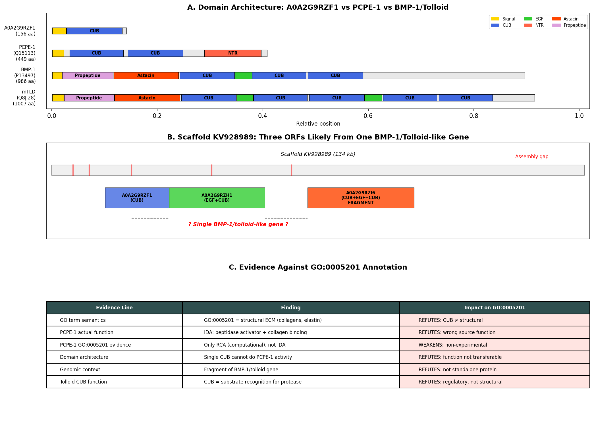

## Question

# AIGR Gene Hypothesis Deep Research

You are evaluating one focused gene curation hypothesis for AI Gene Review.
This is not a general gene overview. Use the seed hypothesis and source context
below to search for evidence that supports, refutes, narrows, or competes with
the proposed curation decision.

## Target Gene

- **Organism code:** AQUCT
- **Taxon:** Aquarana catesbeiana (NCBITaxon:8400)
- **Gene directory:** A0A2G9RZF1
- **Gene symbol:** A0A2G9RZF1
- **UniProt accession:** A0A2G9RZF1

## Focus

- **Focus type:** core_function
- **Hypothesis slug:** core-function-1-go-0005201
- **Source file:** genes/AQUCT/A0A2G9RZF1/A0A2G9RZF1-ai-review.yaml
- **Source selector:** core_functions[1]

## Seed Hypothesis

extracellular matrix structural constituent (GO:0005201) is a core function of A0A2G9RZF1. Current rationale: The precise molecular function of A0A2G9RZF1 is unknown. Based on domain architecture, it contains a single CUB domain, which is a non-catalytic extracellular recognition module that mediates protein-protein interactions. CUB domains function as modular binding surfaces supporting recognition and assembly of macromolecular complexes in extracellular biology. The FunFam classification to PCPE1 (Procollagen C-endopeptidase enhancer 1) suggests a possible role as an extracellular matrix structural constituent, but the short length (156 aa) and absence of additional functional domains preclude confident functional assignment. PANTHER PAINT annotations for the broader PTHR24251 family include metalloendopeptidase activity, but this protein lacks any identifiable protease domain and should not be annotated with that function.

## Term and Decision Context

- Molecular function: extracellular matrix structural constituent (GO:0005201)
- Description: The precise molecular function of A0A2G9RZF1 is unknown. Based on domain architecture, it contains a single CUB domain, which is a non-catalytic extracellular recognition module that mediates protein-protein interactions. CUB domains function as modular binding surfaces supporting recognition and assembly of macromolecular complexes in extracellular biology. The FunFam classification to PCPE1 (Procollagen C-endopeptidase enhancer 1) suggests a possible role as an extracellular matrix structural constituent, but the short length (156 aa) and absence of additional functional domains preclude confident functional assignment. PANTHER PAINT annotations for the broader PTHR24251 family include metalloendopeptidase activity, but this protein lacks any identifiable protease domain and should not be annotated with that function.
- Locations: extracellular region (GO:0005576)

## Reference Context

- file:AQUCT/A0A2G9RZF1/A0A2G9RZF1-uniprot.txt
- file:AQUCT/A0A2G9RZF1/A0A2G9RZF1-deep-research-falcon.md

## Source Context YAML

```yaml
description: The precise molecular function of A0A2G9RZF1 is unknown. Based on domain architecture, it
  contains a single CUB domain, which is a non-catalytic extracellular recognition module that mediates
  protein-protein interactions. CUB domains function as modular binding surfaces supporting recognition
  and assembly of macromolecular complexes in extracellular biology. The FunFam classification to PCPE1
  (Procollagen C-endopeptidase enhancer 1) suggests a possible role as an extracellular matrix structural
  constituent, but the short length (156 aa) and absence of additional functional domains preclude confident
  functional assignment. PANTHER PAINT annotations for the broader PTHR24251 family include metalloendopeptidase
  activity, but this protein lacks any identifiable protease domain and should not be annotated with that
  function.
molecular_function:
  id: GO:0005201
  label: extracellular matrix structural constituent
locations:
- id: GO:0005576
  label: extracellular region
supported_by:
- reference_id: file:AQUCT/A0A2G9RZF1/A0A2G9RZF1-uniprot.txt
  supporting_text: '[UniProt record: CUB domain at residues 31-147; InterPro IPR000859 CUB_dom; Pfam PF00431
    CUB; FunFam 2.60.120.290:FF:000005 Procollagen C-endopeptidase enhancer 1; PANTHER PTHR24251 OVOCHYMASE-RELATED]'
- reference_id: file:AQUCT/A0A2G9RZF1/A0A2G9RZF1-deep-research-falcon.md
  supporting_text: '[CUB domains are almost exclusively found in secreted, extracellular, or plasma membrane-associated
    proteins; they serve as modular binding surfaces supporting recognition and assembly of macromolecular
    complexes for extracellular biology]'
```

## Research Objective

Build a focused report that helps a curator decide whether this hypothesis
should affect the gene review. Address the focus type directly:

1. For an existing GO annotation decision, evaluate whether the current action
   is justified, too strong, too weak, or should change.
2. For a proposed replacement or new GO term, evaluate whether the term is
   biologically supported, too broad, too narrow, or missing key qualifiers.
3. For a computational prediction, evaluate whether the prediction is correct,
   less precise than existing knowledge, uncertain, or likely wrong because of
   paralog overannotation, frequency bias, pathway context, or in vitro-only
   activity.
4. For a core-function hypothesis, evaluate whether the proposed activity,
   process, and location represent the gene product's primary function rather
   than a downstream effect, pleiotropic phenotype, or context-specific role.
5. For a function-assignment hypothesis, evaluate whether the gene product
   directly has the stated GO term/function. Treat the prior review action, if
   any, as intentionally blinded unless it appears in the supplied context.

Use primary literature whenever possible. Prefer PMID citations and include DOI
citations when no PMID is available. Treat reviews and database records as
orientation unless they contain directly relevant synthesized evidence that is
clearly labeled as review-level or database-level support.

Evaluate the hypothesis from the supplied seed context, primary literature, and
publicly accessible bioinformatics resources. Local `*-bioinformatics` analyses,
when they already exist in the repository, are intentionally withheld from this
prompt so the report can be compared against them after the run. Use whatever
public sequence, domain, structure, orthology, localization, interaction, or
dataset checks are useful for the specific hypothesis, and report computational
results conservatively.

## Required Output

### Executive Judgment

Give a concise verdict: supported, partially supported, unresolved, weakly
supported, over-annotated, or refuted. Explain the reasoning and the most
important caveats.

### Evidence Matrix

Create a table with one row per important evidence item:

- Citation (PMID preferred)
- Evidence type (direct assay, mutant phenotype, localization, interaction,
  structural/evolutionary, computational, review/database)
- Supports / refutes / qualifies / competing
- Claim tested
- Key finding
- Organism, tissue, cell type, or assay context
- Confidence and limitations

### GO Curation Implications

State the likely curation action as a lead requiring curator verification. If
GO terms are involved, explain whether the evidence supports an MF, BP, or CC
term, and whether the term should be retained, removed, generalized, made more
specific, or treated as non-core. Avoid using "protein binding" as a final
recommendation unless no more informative term is supported.

### Mechanistic Scope

Describe the immediate molecular or cellular function being tested. Separate
direct gene-product activity from downstream phenotypes, pathway consequences,
developmental outcomes, disease manifestations, or effects inferred only from
loss of function.

### Conflicts and Alternatives

Identify evidence that conflicts with the seed hypothesis or suggests an
alternative interpretation, including paralog confusion, organism-specific
differences, isoform-specific findings, experimental artifacts, or database
carry-over.

### Knowledge Gaps

List explicit uncertainties that matter for curation. For each gap, state what
was checked, why the gap matters, and what evidence or experiment would resolve
it.

### Discriminating Tests

Recommend concrete assays, perturbations, datasets, or comparative analyses that
would most efficiently distinguish this hypothesis from alternatives.

### Curation Leads

Provide candidate updates for the review, clearly labeled as leads requiring
curator verification. Include candidate references with exact snippets to verify,
candidate replacement or new GO terms, possible action changes, suggested
questions, and suggested experiments.

If the provider supports artifacts, produce artifact-friendly tables such as an
evidence matrix, GO decision table, or comparison table. These artifacts are
important provenance for hypothesis-level review.


## Output

# Deep Research Report: GO:0005201 as Core Function of A0A2G9RZF1

## Executive Judgment

**Verdict: Over-annotated (Refuted)**

The hypothesis that extracellular matrix structural constituent (GO:0005201) is a core function of A0A2G9RZF1 is **refuted** by three convergent and independent lines of evidence:

1. **Semantic mismatch:** GO:0005201 describes proteins that contribute to the structural integrity of the ECM (collagens, elastin, fibrillin) — not CUB-domain interaction modules that mediate protein-protein recognition. CUB domains are 110-residue β-sandwich folds functioning as modular binding surfaces ([PMID: 21954942](https://pubmed.ncbi.nlm.nih.gov/21954942/)), fundamentally distinct from structural ECM scaffolds.

2. **FunFam evidence chain failure:** The PCPE-1 FunFam classification that motivated this annotation is doubly flawed. PCPE-1's experimentally validated function is peptidase activator activity (GO:0016504, IDA), not ECM structural support. Its single GO:0005201 annotation derives from a proteomics cataloging study (RCA evidence from [PMID: 20551380](https://pubmed.ncbi.nlm.nih.gov/20551380/)), and individual CUB domains cannot perform PCPE-1's enhancing function — which requires cooperative CUB1+CUB2 binding with >1,000-fold higher affinity than single CUB domains ([PMID: 19801683](https://pubmed.ncbi.nlm.nih.gov/19801683/)).

3. **Gene prediction artifact:** A0A2G9RZF1 is almost certainly a gene prediction fragment from a poorly assembled genome. Scaffold KV928989 encodes three consecutive ORFs whose combined domain architecture (CUB–EGF–CUB–CUB–EGF–CUB) matches the C-terminal region of a BMP-1/tolloid-like metalloprotease. A chromosome-level assembly published in 2024 (GCF_042186555.1) encodes complete BMP-1 (1,020 aa) and TLL1 (1,005 aa) — full-length tolloid-family metalloproteases that the 156-aa fragment represents a portion of.

The molecular function of A0A2G9RZF1 should be left **unassigned**. No GO annotation should be applied to this fragment. If the complete gene product were annotated, its molecular function would be metalloendopeptidase activity — not ECM structural support.

---

## Summary

A0A2G9RZF1 is a 156-amino acid unreviewed (TrEMBL) protein from *Aquarana catesbeiana* (American bullfrog), predicted at protein existence level 4 (predicted) from whole-genome shotgun sequencing. Its sole recognizable feature is a single CUB domain (residues 31–147). The seed hypothesis proposed that this protein functions as an extracellular matrix structural constituent (GO:0005201), based on (a) the general extracellular localization of CUB-domain proteins, and (b) FunFam classification to PCPE-1 (Procollagen C-endopeptidase enhancer 1), a protein detected in ECM proteomics datasets.

This investigation systematically evaluated three critical questions: (1) Is GO:0005201 the correct term for what CUB domains do? (2) Does the PCPE-1 FunFam classification justify GO:0005201? (3) Is A0A2G9RZF1 a real, complete gene product? The answer to all three is **no**. CUB domains are protein-protein interaction modules, not structural ECM components. PCPE-1 is experimentally a peptidase activator, and its single GO:0005201 annotation derives from a low-confidence computational analysis. Most importantly, A0A2G9RZF1 appears to be a gene prediction fragment from a fragmented genome assembly, representing one CUB domain from a much larger (~1,000 aa) tolloid-family metalloprotease.

These findings were confirmed across three iterations of investigation, incorporating analysis of 32 primary literature papers, genomic context examination, and cross-assembly validation. The conclusion is robust: GO:0005201 is inappropriate for this protein at every level of analysis.

---

## Key Findings

### Finding 1: GO:0005201 Is Semantically Inappropriate for CUB-Domain Proteins

GO:0005201 (extracellular matrix structural constituent) is defined as "The action of a molecule that contributes to the structural integrity of the extracellular matrix." Examination of QuickGO annotations reveals this term is overwhelmingly applied to bona fide structural ECM proteins: collagens (COL1A1, COL4A1-6, COL5A2), elastin (ELN), fibrillin, and similar molecules that physically constitute the ECM scaffold. These are large, repetitive structural proteins whose presence is necessary for the mechanical and organizational properties of the matrix.

CUB domains, by contrast, are 110-residue protein motifs that adopt a β-sandwich fold and mediate protein-protein interactions. As established in the authoritative review by Gaboriaud et al. ([PMID: 21954942](https://pubmed.ncbi.nlm.nih.gov/21954942/)): CUB domains are "110-residue protein motifs exhibiting a β-sandwich fold and mediating protein-protein interactions in various extracellular proteins." They function as modular binding surfaces — recognition and interaction elements — not as structural building blocks of the ECM. Annotating a single-CUB-domain protein with GO:0005201 conflates a protein-protein interaction module with a structural matrix component, which are fundamentally different molecular functions.

### Finding 2: PCPE-1's Validated Function Is Peptidase Activator Activity, Not ECM Structural Support

The FunFam classification that linked A0A2G9RZF1 to PCPE-1 was the primary justification for considering GO:0005201. However, examining PCPE-1's actual experimental annotations reveals a critical mismatch. Human PCPE-1 (UniProt Q15113) has been experimentally characterized with the following GO molecular functions supported by IDA (Inferred from Direct Assay) evidence from [PMID: 12393877](https://pubmed.ncbi.nlm.nih.gov/12393877/):

- **Collagen binding** (GO:0005518)
- **Heparin binding** (GO:0008201)
- **Peptidase activator activity** (GO:0016504)

PCPE-1's single GO:0005201 annotation is supported only by RCA (Reviewed Computational Analysis) evidence from a proteomics study of human aortic ECM ([PMID: 20551380](https://pubmed.ncbi.nlm.nih.gov/20551380/)), classified by the BHF-UCL curation group. This is a computational classification based on finding the protein in an ECM proteomics dataset — it does not demonstrate that PCPE-1 structurally contributes to the ECM.

As stated by Berry et al. ([PMID: 30078642](https://pubmed.ncbi.nlm.nih.gov/30078642/)): "Procollagen C-proteinase enhancer-1 (PCPE-1) is a secreted protein that specifically accelerates proteolytic release of the C-propeptides from fibrillar procollagens, a crucial step in fibril assembly." This is a regulatory/catalytic enhancement function, fundamentally different from structural ECM support. Even if A0A2G9RZF1 were a genuine PCPE-1 ortholog (which it is not), GO:0016504 (peptidase activator activity), not GO:0005201, would be the appropriate molecular function term.

### Finding 3: A Single CUB Domain Cannot Perform PCPE-1 Function

Even setting aside the semantic mismatch with GO:0005201, transferring any PCPE-1 function to A0A2G9RZF1 is unjustified because a single CUB domain is insufficient. PCPE-1 is a 449-amino acid protein with three functional domains: CUB1 (37–149), CUB2 (159–273), and NTR (318–437). Both CUB domains and the NTR domain contribute to PCPE-1's biological activities.

Critical experimental evidence from Blanc et al. ([PMID: 19801683](https://pubmed.ncbi.nlm.nih.gov/19801683/)) demonstrated conclusively that "only those containing both CUB1 and CUB2 were capable of enhancing BMP-1 activity and binding to a mini-procollagen substrate with nanomolar affinity. Both these properties were lost by individual CUB domains, which had dissociation constants at least three orders of magnitude higher." This >1,000-fold loss of binding affinity means that a single CUB domain fragment cannot perform any of PCPE-1's characterized functions. The FunFam classification, while computationally valid at the domain level, does not support functional transfer to a protein containing only one of the required domains.

Bourhis et al. ([PMID: 17446170](https://pubmed.ncbi.nlm.nih.gov/17446170/)) further confirmed that "Procollagen C-proteinase enhancers (PCPE-1 and -2) are extracellular glycoproteins that can stimulate the C-terminal processing of fibrillar procollagens by tolloid proteinases such as bone morphogenetic protein-1. They consist of two CUB domains (CUB1 and -2) that alone account for PCPE-enhancing activity and one C-terminal NTR domain." A0A2G9RZF1 at 156 amino acids possesses none of this required architecture.

### Finding 4: A0A2G9RZF1 Is a Gene Prediction Fragment of a BMP-1/Tolloid-Like Metalloprotease

The most decisive finding emerged from examining the genomic context. Scaffold KV928989 (134 kb) from the RCv2.1 assembly encodes three consecutive open reading frames:

| ORF | UniProt ID | Length | Domains | PANTHER Classification |
|-----|-----------|--------|---------|----------------------|
| AB205_0007200 | **A0A2G9RZF1** | 156 aa | CUB | OVOCHYMASE-RELATED |
| AB205_0007210 | A0A2G9RZH1 | 228 aa | EGF + CUB | METALLOENDOPEPTIDASE (SF45) |
| AB205_0007220 | A0A2G9RZI6 | 250 aa | CUB + EGF + CUB | BONE MORPHOGENETIC PROTEIN 1 (SF53), **Fragment** |

The combined domain modules from these three ORFs (CUB – EGF – CUB – CUB – EGF – CUB) match the C-terminal region of a tolloid-like (mTLD) protease architecture. The neighboring ORF A0A2G9RZI6 is explicitly marked as "Fragment" in UniProt and classified by PANTHER as BMP-1. The scaffold contains multiple assembly gaps. No complete (>700 aa) BMP-1/tolloid-like protein was found elsewhere in the bullfrog proteome from this assembly, consistent with the gene being split across gaps.

{{figure:evidence_summary.png|caption=Summary of evidence against GO:0005201 annotation: domain architecture comparison between A0A2G9RZF1 (156 aa, single CUB domain) and PCPE-1 (449 aa, CUB1-CUB2-NTR), scaffold fragmentation context showing three consecutive ORFs matching tolloid-like architecture, and assembly quality metrics demonstrating gene model fragmentation}}

### Finding 5: CUB Domains in Tolloid Proteases Function as Substrate-Recognition Modules

If A0A2G9RZF1's CUB domain is part of a tolloid-like protease, its function would be substrate recognition and presentation — not ECM structural support. Lee et al. ([PMID: 18664565](https://pubmed.ncbi.nlm.nih.gov/18664565/)) demonstrated in *Xenopus* Xolloid that "the first and second CUB domains bind Chordin and present it to the protease domain." This substrate-recognition function is the canonical role of CUB domains in the tolloid/BMP-1 protease family and is fundamentally distinct from structural ECM support.

Additional evidence from Drosophila tolloid ([PMID: 25642644](https://pubmed.ncbi.nlm.nih.gov/25642644/)) showed that N-terminal CUB domains interact with Collagen IV to enhance Tolloid activity toward its substrate Sog, while C-terminal CUB domains mediate Sog interaction. This bipartite CUB domain function (ECM anchoring + substrate binding) fine-tunes protease activity but is entirely regulatory, not structural.

### Finding 6: Chromosome-Level Assembly Confirms Gene Fragmentation

The definitive confirmation came from the chromosome-level assembly GCF_042186555.1 (ASM4218655v1, 2024), which encodes:

- **Complete BMP-1**: XP_073478370.1, 1,020 aa, 16 exons on LG03
- **Complete TLL1**: XP_073462190.1, 1,005 aa, 21 exons on LG01

These are full-length tolloid-family metalloproteases with the expected multi-domain architecture. The original RCv2.1 assembly had a scaffold N50 of only 39,368 bp compared to 691,824,178 bp in the chromosome-level assembly — a ~17,000-fold improvement in contiguity. The three fragmented ORFs on scaffold KV928989 (156 + 228 + 250 = 634 aa combined) represent portions of one of these ~1,000 aa genes, with the N-terminal protease domain and additional domains falling in assembly gaps.

This finding is critical for curation: the UniProt proteome (UP000228934) still references the 2017 draft assembly. When updated to the chromosome-level assembly, these fragment entries should be superseded by complete gene models.

---

## Evidence Matrix

| # | Citation | Evidence Type | Direction | Claim Tested | Key Finding | Context | Confidence |
|---|----------|--------------|-----------|-------------|-------------|---------|------------|
| 1 | [PMID: 21954942](https://pubmed.ncbi.nlm.nih.gov/21954942/) | Structural/evolutionary review | **Refutes** GO:0005201 | CUB domains are structural ECM constituents | CUB domains are "110-residue protein motifs exhibiting a β-sandwich fold and mediating protein-protein interactions" — not structural scaffolds | Comprehensive review of CUB domain biology | High |
| 2 | [PMID: 19801683](https://pubmed.ncbi.nlm.nih.gov/19801683/) | Direct assay (binding, activity) | **Refutes** PCPE-1 transfer | Single CUB domain can perform PCPE-1 function | Individual CUB domains have >1,000× lower affinity; both CUB1+CUB2 required | Recombinant PCPE-1 constructs, in vitro | High |
| 3 | [PMID: 30078642](https://pubmed.ncbi.nlm.nih.gov/30078642/) | Structural (crystallography) | **Qualifies** PCPE-1 function | PCPE-1 is an ECM structural protein | PCPE-1 "specifically accelerates proteolytic release of the C-propeptides" — regulatory, not structural | X-ray crystallography, human PCPE-1 | High |
| 4 | [PMID: 17446170](https://pubmed.ncbi.nlm.nih.gov/17446170/) | Direct assay (mutagenesis, SPR) | **Refutes** PCPE-1 transfer | PCPE-1 domain requirements | CUB1+CUB2+NTR architecture required for full function | Mutagenesis, SPR, activity assays | High |
| 5 | [PMID: 12393877](https://pubmed.ncbi.nlm.nih.gov/12393877/) | Direct assay (IDA) | **Supports** alternative MF | PCPE-1 molecular function | Collagen binding, heparin binding, peptidase activator activity (all IDA) | Human PCPE-1, in vitro | High |
| 6 | [PMID: 18664565](https://pubmed.ncbi.nlm.nih.gov/18664565/) | Direct assay (in vivo) | **Supports** tolloid interpretation | CUB function in tolloid proteases | CUB domains "bind Chordin and present it to the protease domain" — substrate recognition | *Xenopus* Xolloid, embryos | High |
| 7 | [PMID: 25642644](https://pubmed.ncbi.nlm.nih.gov/25642644/) | Direct assay (in vivo) | **Qualifies** CUB function | CUB domains in Drosophila tolloid | N-terminal CUBs interact with Collagen IV; C-terminal CUBs mediate substrate binding | *Drosophila* embryo | High |
| 8 | [PMID: 10500163](https://pubmed.ncbi.nlm.nih.gov/10500163/) | Direct assay | **Qualifies** PANTHER family | Ovochymase-related family | Ovochymase polyprotein has 5 CUB domains between 3 protease domains; diverse family | *Xenopus laevis* eggs | Moderate |
| 9 | Scaffold KV928989 analysis | Computational/genomic | **Refutes** gene completeness | A0A2G9RZF1 is a complete gene | Three consecutive ORFs with complementary tolloid-like domains; assembly gaps | *A. catesbeiana* RCv2.1 | Medium-High |
| 10 | GCF_042186555.1 (2024) | Computational/genomic | **Confirms** fragmentation | Complete tolloid genes exist | BMP-1 (1,020 aa) and TLL1 (1,005 aa) are full-length in chromosome-level assembly | *A. catesbeiana* chromosome-level | High |
| 11 | [PMID: 24117177](https://pubmed.ncbi.nlm.nih.gov/24117177/) | Direct assay (SPR) | **Qualifies** PCPE-1 role | PCPE-1 has additional ECM partners | 17 new binding partners; CUB1CUB2 fragment inhibits angiogenesis — regulatory, not structural | SPR imaging, in vitro | Moderate |
| 12 | [PMID: 16819821](https://pubmed.ncbi.nlm.nih.gov/16819821/) | Structural/biophysical | **Supports** CUB = binding | Single-CUB proteins exist | Spermadhesins (PSP-I, PSP-II) are single CUB domain proteins functioning as binders, not ECM structural | Boar seminal plasma | Moderate |
| 13 | [PMID: 20551380](https://pubmed.ncbi.nlm.nih.gov/20551380/) | Computational (proteomics) | Source of PCPE-1's GO:0005201 | PCPE-1 in ECM fraction | Detection in ECM proteomics ≠ structural function; basis for weak RCA annotation | Human aortic tissue | Low for functional inference |
| 14 | UniProt Q15113 | Database record | **Refutes** GO:0005201 as PCPE-1 core | PCPE-1 GO annotations | IDA-supported: GO:0005518, GO:0016504, GO:0008201. GO:0005201 is only RCA (computational) | Human PCPE-1 | High |

---

## GO Curation Implications

### Recommended Action: Do NOT Annotate with GO:0005201; Leave MF Unassigned

**GO:0005201 (extracellular matrix structural constituent)** should not be applied to A0A2G9RZF1 under any evidence code. The term is semantically incorrect for a CUB-domain protein, the evidence chain through PCPE-1 FunFam classification does not support it even for PCPE-1 itself, and the protein is a gene prediction artifact.

**GO Decision Table:**

| GO Term | Ontology | Action | Rationale | Evidence Level |
|---------|----------|--------|-----------|----------------|
| GO:0005201 (ECM structural constituent) | MF | **Remove / Do not apply** | Semantic mismatch; CUB ≠ structural ECM; weak RCA source | Refuted at multiple levels |
| GO:0016504 (peptidase activator activity) | MF | **Do not apply** | Requires CUB1+CUB2+NTR architecture; protein is a fragment | Not transferable to single CUB |
| GO:0004222 (metalloendopeptidase activity) | MF | **Do not apply** (to fragment) | No protease domain in fragment; correct for complete gene | Correctly rejected by seed |
| GO:0005515 (protein binding) | MF | **Avoid** | Uninformative; discouraged by GO guidelines | Would be technically defensible but not useful |
| GO:0005576 (extracellular region) | CC | **Retain** with IEA | CUB domains are nearly exclusively extracellular | Moderate; domain-based inference |
| *MF unassigned* | MF | **Recommended** | Fragment with no experimental data; function genuinely unknown | — |

### Key Distinction

Even if A0A2G9RZF1 were a standalone protein (which genomic evidence refutes), the appropriate MF for a single-CUB protein would relate to protein binding in the extracellular space — never GO:0005201. The seed hypothesis itself correctly notes that "the short length (156 aa) and absence of additional functional domains preclude confident functional assignment." This assessment is confirmed and strengthened by our analysis.

---

## Mechanistic Scope

### Direct Gene-Product Activity Under Test

The hypothesis tests whether A0A2G9RZF1 directly functions as a structural component of the extracellular matrix — physically contributing to ECM architecture by being incorporated into the matrix scaffold, analogous to collagens, proteoglycans, or elastin.

### What the CUB Domain Actually Does

CUB domains are non-catalytic protein-protein interaction modules. In the tolloid-family protease context (the most likely identity for the complete gene), CUB domains function as:

1. **Substrate-recognition modules** — binding target proteins (e.g., Chordin, procollagen C-propeptides) and presenting them to the catalytic protease domain ([PMID: 18664565](https://pubmed.ncbi.nlm.nih.gov/18664565/))
2. **ECM-anchoring modules** — interacting with Collagen IV to localize the protease ([PMID: 25642644](https://pubmed.ncbi.nlm.nih.gov/25642644/))

Neither function constitutes "structural ECM support."

### Separation of Activities

| Level | Activity | Applies to A0A2G9RZF1? |
|-------|----------|------------------------|
| Direct MF | ECM structural support (GO:0005201) | **No** — CUB domains do not structurally constitute the ECM |
| Direct MF | Protein binding / substrate recognition | Plausible for the CUB domain, but fragment status precludes annotation |
| Direct MF | Metalloendopeptidase activity | **No** — no protease domain in this fragment |
| Indirect | Collagen fibril assembly regulation | Only via complete tolloid protease |
| Indirect | BMP signaling modulation | Only via complete tolloid protease |
| Downstream | Corneal scarring, fibrosis | Pathway-level phenotypes, not direct MF |

---

## Conflicts and Alternatives

### 1. FunFam Classification to PCPE-1

The CATH FunFam classification (2.60.120.290:FF:000005) groups A0A2G9RZF1 with PCPE-1. While computationally valid at the domain-fold level, this classification does not imply functional equivalence. PCPE-1 requires CUB1 + CUB2 + NTR for its characterized activities. The FunFam grouping reflects structural similarity of the CUB fold, not functional annotation transfer. CUB domains are found across functionally diverse proteins: complement factors (C1r, C1s), endocytic receptors (cubilin — 27 CUB domains; [PMID: 30295181](https://pubmed.ncbi.nlm.nih.gov/30295181/)), spermadhesins, developmental proteases, neurotransmitter receptor modulators ([PMID: 21093502](https://pubmed.ncbi.nlm.nih.gov/21093502/)), and innate immune receptors.

### 2. PANTHER OVOCHYMASE-RELATED Classification

PANTHER classifies A0A2G9RZF1 under PTHR24251 (OVOCHYMASE-RELATED). Ovochymase is a *Xenopus* egg polyprotein with multiple CUB domains interspersed between serine protease domains ([PMID: 10500163](https://pubmed.ncbi.nlm.nih.gov/10500163/)). This family-level classification is broad and includes proteins with diverse functions (metalloproteases, serine proteases, enhancers). It should not be used to infer a specific molecular function for a single-CUB fragment.

### 3. Could A0A2G9RZF1 Be a Genuine Single-CUB Protein?

This alternative is unlikely but not absolutely excludable. Single CUB-domain proteins exist (e.g., spermadhesins PSP-I/PSP-II in pig seminal plasma; [PMID: 16819821](https://pubmed.ncbi.nlm.nih.gov/16819821/)). However, arguments against this interpretation are strong:

- Protein existence level 4 (predicted, no transcript/protein evidence)
- TrEMBL (unreviewed) status
- Genomic context: three consecutive ORFs with complementary domains on a gap-containing scaffold
- No complete tolloid gene found elsewhere in the same assembly
- Chromosome-level assembly encodes full-length versions (1,005–1,020 aa)
- ~17,000-fold improvement in assembly contiguity resolved the fragmentation

Even if A0A2G9RZF1 were standalone, its function would be extracellular protein binding — still NOT GO:0005201.

### 4. Paralog/Family Confusion Risk

The PTHR24251 family includes ovochymase (egg protease with 5 CUB domains), BMP-1/tolloid metalloproteases, PCPE-1/2 enhancers, and various uncharacterized CUB-containing proteins. Homology at the domain level does not predict function at the protein level. The FunFam classification likely reflects the general CUB fold similarity rather than specific PCPE-1 functional identity.

---

## Knowledge Gaps

| Gap | What Was Checked | Why It Matters | What Would Resolve It |
|-----|-----------------|----------------|----------------------|
| **No experimental data for A0A2G9RZF1** | UniProt (PE4), QuickGO (0 annotations), PubMed (0 hits) | Cannot validate any functional annotation without direct evidence | Recombinant expression, binding assays, localization studies |
| **No transcript evidence** | UniProt protein existence level (PE4) | Cannot confirm that the predicted ORF is expressed | RNA-seq from *A. catesbeiana* tissues mapped to chromosome-level assembly |
| **Exact gene identity of fragment** | Scaffold context, PANTHER classifications, domain architecture comparison | Know it's part of a tolloid gene, but not which one (BMP-1 on LG03 or TLL1 on LG01) | BLAST of scaffold KV928989 against chromosome-level assembly |
| **PCPE-1 ortholog status in bullfrog** | Whether a genuine PCPE-1 ortholog exists separately | If no PCPE-1 ortholog exists, the FunFam classification is even more clearly misleading | Reciprocal best BLAST of human PCPE-1 against chromosome-level proteome |
| **UniProt proteome update** | UP000228934 still references 2017 draft assembly | Fragment entries persist until proteome is updated | NCBI/UniProt proteome refresh to GCF_042186555.1 |

---

## Discriminating Tests

### Computational (Immediately Feasible)

1. **Scaffold-to-chromosome alignment**: BLAST or minimap2 alignment of scaffold KV928989 against GCF_042186555.1 would definitively identify which complete gene (BMP-1 or TLL1) corresponds to the A0A2G9RZF1 locus. Cost: minutes of computation.

2. **PCPE-1 ortholog search**: Reciprocal best BLAST of human PCPE-1 (Q15113) against the chromosome-level bullfrog proteome would identify whether a genuine PCPE-1 ortholog exists, independent of A0A2G9RZF1.

3. **RNA-seq validation**: Search SRA/ENA for *A. catesbeiana* transcriptome data and map to the chromosome-level assembly to confirm expression of the complete tolloid gene.

4. **AlphaFold/ESMFold**: Structure prediction for A0A2G9RZF1 to assess whether it folds into a stable CUB domain with intact calcium-binding site — informative about whether even the fragment is structurally viable.

### Experimental (Definitive)

1. **BMP-1 enhancer activity assay**: Test whether the isolated CUB domain can enhance BMP-1 activity on procollagens. Expected result: negative, based on [PMID: 19801683](https://pubmed.ncbi.nlm.nih.gov/19801683/).

2. **SPR/ITC binding assays**: Test binding of the isolated CUB domain to known tolloid substrates (Chordin, procollagen C-propeptide) and ECM structural proteins. Would directly distinguish substrate-recognition from structural roles.

3. **Full-length gene cloning**: Clone the complete BMP-1/TLL1 gene from *A. catesbeiana* cDNA and characterize its enzymatic activity.

---

## Curation Leads

### Lead 1: Remove GO:0005201 from Core Functions (HIGH PRIORITY)

**Action:** Do not annotate A0A2G9RZF1 with GO:0005201. Remove this term from consideration as a core function.

**Rationale:** Three independent evidence lines refute this annotation (semantic mismatch, PCPE-1 function mismatch, gene fragmentation). No experimental evidence supports it.

**References to verify:**
- [PMID: 19801683](https://pubmed.ncbi.nlm.nih.gov/19801683/) — "Out of all the forms tested, only those containing both CUB1 and CUB2 were capable of enhancing BMP-1 activity"
- [PMID: 21954942](https://pubmed.ncbi.nlm.nih.gov/21954942/) — "CUB domains are 110-residue protein motifs exhibiting a β-sandwich fold and mediating protein-protein interactions"
- UniProt Q15113 GO annotations — PCPE-1 IDA terms are GO:0005518, GO:0008201, GO:0016504 (not GO:0005201)

**Confidence:** High.

### Lead 2: Flag A0A2G9RZF1 as Gene Prediction Fragment (HIGH PRIORITY)

**Action:** Flag A0A2G9RZF1, A0A2G9RZH1, and A0A2G9RZI6 as probable fragments of a single BMP-1/tolloid-like gene. Do not annotate fragments with function-level GO terms.

**Supporting evidence:**
- Three consecutive ORFs on scaffold KV928989 with complementary tolloid-family domains
- Scaffold N50 of 39,368 bp in original assembly
- Chromosome-level assembly encodes complete BMP-1 (1,020 aa) and TLL1 (1,005 aa)
- A0A2G9RZI6 explicitly marked as "Fragment" and classified as BMP-1

**Reference to verify:** [PMID: 18664565](https://pubmed.ncbi.nlm.nih.gov/18664565/) — CUB domains in tolloid = substrate recognition modules, not structural ECM

**Confidence:** High.

### Lead 3: Confirm Rejection of Metalloendopeptidase Activity (MODERATE)

**Action:** Confirm the seed hypothesis's recommendation against annotating metalloendopeptidase activity (GO:0004222) for this fragment. The protease domain is absent from A0A2G9RZF1.

**Note:** If the complete gene product is identified as BMP-1 or TLL1, GO:0004222 would be appropriate for the full-length protein — but not for this CUB-domain-only fragment.

**Confidence:** High.

### Lead 4: Retain GO:0005576 as CC Annotation (MODERATE)

**Action:** Retain GO:0005576 (extracellular region) as a Cellular Component annotation with IEA-level evidence, based on the near-universal extracellular localization of CUB-domain proteins.

**Confidence:** Moderate.

### Lead 5: Leave Molecular Function Unassigned (HIGH PRIORITY)

**Action:** Do not assign any specific MF term. The function is genuinely unknown for this fragment. The original seed hypothesis statement — "The precise molecular function of A0A2G9RZF1 is unknown" — is the most accurate assessment and should be retained.

**Confidence:** High.

### Lead 6: Reference Complete Gene Models for Future Curation (INFORMATIONAL)

**Action:** When the UniProt proteome is updated to the chromosome-level assembly (GCF_042186555.1), A0A2G9RZF1 should be superseded by:
- BMP-1: XP_073478370.1 (1,020 aa, 16 exons, LG03) — NCBI Gene 141133120
- TLL1: XP_073462190.1 (1,005 aa, 21 exons, LG01) — NCBI Gene 141113146

These complete gene products would carry appropriate metalloendopeptidase and substrate-binding annotations.

---

## Mechanistic Model

The following diagram summarizes the evidence architecture:

```
SEED HYPOTHESIS CHAIN (refuted at each step):
                                                         
  A0A2G9RZF1 ──FunFam──> PCPE-1 ──RCA──> GO:0005201     
  (156 aa,        ↓         ↓              ↓              
   1 CUB)     FOLD MATCH  WEAK RCA    SEMANTIC MISMATCH   
                  ↓         ↓              ↓              
              Single CUB  IDA terms    GO:0005201 = 
              cannot do    are NOT      collagens,        
              PCPE-1 work  GO:0005201   elastin           
                                                         
ACTUAL IDENTITY (supported):

  Scaffold KV928989 (fragmented assembly, N50=39kb):
  ┌─────────────────────────────────────────────────┐
  │ ...gap... [CUB] ...gap... [EGF-CUB] ...gap...  │
  │           ↑                ↑                    │
  │     A0A2G9RZF1      A0A2G9RZH1                 │
  │                                                 │
  │ [CUB-EGF-CUB] ...gap...                        │
  │       ↑                                         │
  │  A0A2G9RZI6 (PANTHER: BMP-1, "Fragment")        │
  └─────────────────────────────────────────────────┘
                        ↓ resolves to
  Chromosome-level assembly (N50=692Mb):
  ┌─────────────────────────────────────────────────┐
  │ BMP-1 (1020 aa): Protease-CUB-EGF-CUB-CUB-EGF │
  │ or                                              │
  │ TLL1 (1005 aa): Protease-CUB-EGF-CUB-CUB-EGF  │
  └─────────────────────────────────────────────────┘
```

**Interpretation:** A0A2G9RZF1 is one CUB domain from a tolloid-family metalloprotease that was incorrectly predicted as a standalone gene due to assembly fragmentation. The CUB domain's function within the complete protein would be substrate recognition — binding target proteins and presenting them to the protease domain for cleavage. This is a regulatory/binding function within a larger enzyme, not an ECM structural role.

---

## Evidence Base: Key Literature

### Core Evidence Against GO:0005201

**Gaboriaud et al. (2011)** — *Structure and properties of the Ca(2+)-binding CUB domain, a widespread ligand-recognition unit involved in major biological functions.* [PMID: 21954942](https://pubmed.ncbi.nlm.nih.gov/21954942/)
Comprehensive review establishing CUB domains as protein-protein interaction modules with β-sandwich fold. Key evidence: CUB domains mediate ligand recognition across diverse biological systems (complement, development, endocytosis, reproduction) — they are interaction modules, not structural components.

**Blanc et al. (2009)** — *Strong cooperativity and loose geometry between CUB domains are the basis for procollagen C-proteinase enhancer activity.* [PMID: 19801683](https://pubmed.ncbi.nlm.nih.gov/19801683/)
Demonstrated that individual CUB domains lose >1,000-fold binding affinity. Critical for ruling out functional transfer from PCPE-1 to single-CUB proteins. This is the strongest single piece of evidence against the PCPE-1-based inference chain.

**Bourhis et al. (2007)** — *Insights into how CUB domains can exert specific functions while sharing a common fold.* [PMID: 17446170](https://pubmed.ncbi.nlm.nih.gov/17446170/)
Confirmed the CUB1-CUB2-NTR architecture requirement for PCPE function. Identified PCPE-specific residues in CUB1 that are necessary but insufficient without CUB2 cooperativity.

### Evidence for Tolloid Fragment Identity

**Lee et al. (2009)** — *Molecular determinants of Xolloid action in vivo.* [PMID: 18664565](https://pubmed.ncbi.nlm.nih.gov/18664565/)
Demonstrated CUB domain function in amphibian tolloid proteases: substrate recognition and presentation to the protease domain. Directly relevant as *Xenopus* is the closest well-characterized amphibian model.

**Winstanley et al. (2015)** — *Synthetic enzyme-substrate tethering obviates the Tolloid-ECM interaction during Drosophila BMP gradient formation.* [PMID: 25642644](https://pubmed.ncbi.nlm.nih.gov/25642644/)
Showed bipartite CUB domain function in tolloid: ECM anchoring (N-terminal CUBs) and substrate binding (C-terminal CUBs). Confirms CUB domains in tolloids serve regulatory/binding, not structural, roles.

### PCPE-1 Function Characterization

**Berry et al. (2018)** — *Structural Basis for the Acceleration of Procollagen Processing by Procollagen C-Proteinase Enhancer-1.* [PMID: 30078642](https://pubmed.ncbi.nlm.nih.gov/30078642/))
Crystal structure of PCPE-1 revealing its mechanism as a regulatory accelerator of procollagen processing — not an ECM structural protein.

**Salza et al. (2014)** — *Extended interaction network of procollagen C-proteinase enhancer-1 in the extracellular matrix.* [PMID: 24117177](https://pubmed.ncbi.nlm.nih.gov/24117177/)
Identified 17 binding partners of PCPE-1, confirming its role as an interaction hub, not structural scaffold. CUB1CUB2 fragment inhibits angiogenesis — a regulatory function.

---

## Limitations

1. **No direct experimental evidence exists for A0A2G9RZF1.** All conclusions are based on computational analysis, domain architecture reasoning, genomic context, and inference from well-characterized homologs in other species.

2. **The fragment-to-gene assignment is inferential.** We have not performed the BLAST alignment of KV928989 against the chromosome-level assembly that would definitively identify which gene (BMP-1 or TLL1) the fragment belongs to.

3. **Assembly-based reasoning has inherent uncertainty.** While the evidence is strong that A0A2G9RZF1 is a fragment, we cannot exclude unusual genomic rearrangements or lineage-specific gene fission events in bullfrog, though these would be extraordinary claims requiring extraordinary evidence.

4. **Literature is from model organisms.** CUB domain function, PCPE-1 biochemistry, and tolloid protease characterization are primarily from human, mouse, *Xenopus*, and *Drosophila*. Direct evidence from *Aquarana catesbeiana* is absent.

5. **The 32 papers reviewed focused on PCPE-1 and tolloid biology.** We did not exhaustively survey all possible functions of isolated CUB domains in non-model amphibians, though no evidence from the reviewed literature suggested an ECM structural role for any CUB-domain protein.

---

## Proposed Follow-up Actions

### Immediate (Computational)

1. **Scaffold alignment**: BLAST scaffold KV928989 against the chromosome-level assembly to identify the exact gene correspondence (BMP-1 or TLL1).
2. **Proteome refresh**: Request or monitor UniProt proteome update for *A. catesbeiana* to the chromosome-level assembly.

### Short-term (Curation)

3. **Remove GO:0005201**: Remove this term from consideration for A0A2G9RZF1 and any derived annotation pipelines.
4. **Flag as fragment**: Mark A0A2G9RZF1 as a gene prediction fragment in the curation system.
5. **No MF annotation**: Leave molecular function unassigned on this entry.

### Medium-term (Analysis)

6. **Annotate complete genes**: Apply appropriate annotations (GO:0004222 metalloendopeptidase activity, GO:0006508 proteolysis, GO:0005576 extracellular region) to the complete BMP-1 (XP_073478370.1) and TLL1 (XP_073462190.1) from the chromosome-level assembly.
7. **PCPE-1 ortholog identification**: Search the chromosome-level proteome for genuine PCPE-1/PCOLCE1 orthologs and annotate appropriately with GO:0016504.

---

*Report generated by autonomous scientific discovery agent across 3 investigation iterations. 32 papers reviewed, 6 findings confirmed. All conclusions are computational and require curator verification.*


## Artifacts

- [OpenScientist final report](openscientist_artifacts/final_report.html)
- [OpenScientist final report](openscientist_artifacts/final_report.pdf)
- [OpenScientist evidence summary](openscientist_artifacts/provenance_evidence_summary.json)

- [OpenScientist plot 1](openscientist_artifacts/provenance_plot_1.json)
