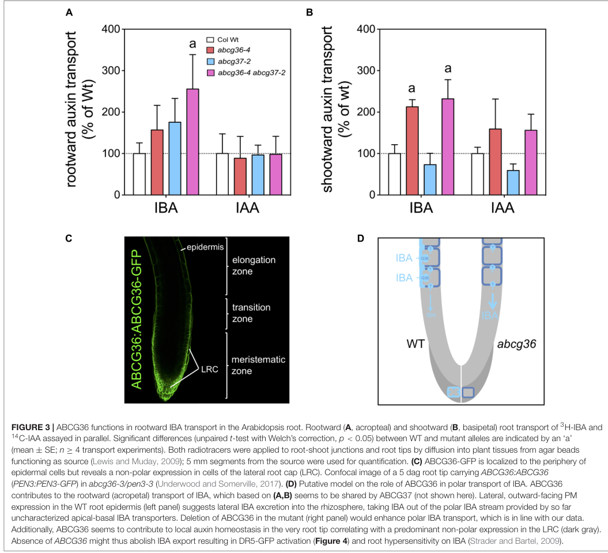

## Question

# Gene Research for Functional Annotation

## ⚠️ CRITICAL: Gene/Protein Identification Context

**BEFORE YOU BEGIN RESEARCH:** You MUST verify you are researching the CORRECT gene/protein. Gene symbols can be ambiguous, especially for less well-characterized genes from non-model organisms.

### Target Gene/Protein Identity (from UniProt):
- **UniProt Accession:** Q9XIE2
- **Protein Description:** RecName: Full=ABC transporter G family member 36 {ECO:0000303|PubMed:18299247}; Short=ABC transporter ABCG.36 {ECO:0000303|PubMed:18299247}; Short=AtABCG36 {ECO:0000303|PubMed:18299247}; AltName: Full=Pleiotropic drug resistance protein 8 {ECO:0000303|PubMed:12430018, ECO:0000303|PubMed:16415066, ECO:0000303|PubMed:16506311}; Short=AtPDR8 {ECO:0000303|PubMed:23815470}; AltName: Full=Protein PENETRATION 3 {ECO:0000303|PubMed:16473969};
- **Gene Information:** Name=ABCG36 {ECO:0000303|PubMed:18299247}; Synonyms=PDR8 {ECO:0000303|PubMed:12430018, ECO:0000303|PubMed:16415066, ECO:0000303|PubMed:16506311}, PEN3 {ECO:0000303|PubMed:16473969}; OrderedLocusNames=At1g59870 {ECO:0000312|Araport:AT1G59870}; ORFNames=F23H11.19 {ECO:0000312|EMBL:AAD39329.1};
- **Organism (full):** Arabidopsis thaliana (Mouse-ear cress).
- **Protein Family:** Belongs to the ABC transporter superfamily. ABCG family.
- **Key Domains:** AAA+_ATPase. (IPR003593); ABC2_TM. (IPR013525); ABC_trans_N. (IPR029481); ABC_transporter-like_ATP-bd. (IPR003439); ABCG_dom. (IPR043926)

### MANDATORY VERIFICATION STEPS:

1. **Check if the gene symbol "ABCG36" matches the protein description above**
2. **Verify the organism is correct:** Arabidopsis thaliana (Mouse-ear cress).
3. **Check if protein family/domains align with what you find in literature**
4. **If you find literature for a DIFFERENT gene with the same or similar symbol, STOP**

### If Gene Symbol is Ambiguous or You Cannot Find Relevant Literature:

**DO NOT PROCEED WITH RESEARCH ON A DIFFERENT GENE.** Instead:
- State clearly: "The gene symbol 'ABCG36' is ambiguous or literature is limited for this specific protein"
- Explain what you found (e.g., "Found extensive literature on a different gene with the same symbol in a different organism")
- Describe the protein based ONLY on the UniProt information provided above
- Suggest that the protein function can be inferred from domain/family information

### Research Target:

Please provide a comprehensive research report on the gene **ABCG36** (gene ID: ABCG36, UniProt: Q9XIE2) in ARATH.

The research report should be a detailed narrative explaining the function, biological processes, and localization of the gene product. Citations should be given for all claims.

You should prioritize authoritative reviews and primary scientific literature when conducting research. You can supplement
this with annotations you find in gene/protein databases, but these can be outdated or inaccurate.

We are specifically interested in the primary function of the gene - for enzymes, what reaction is catalyzed, and what is the substrate specificity? For transporters, what is the substrate? For structural proteins or adapters, what is the broader structural role? For signaling molecules, what is the role in the pathway.

We are interested in where in or outside the cell the gene product carries out its function.

We are also interested in the signaling or biochemical pathways in which the gene functions. We are less interested in broad pleiotropic effects, except where these elucidate the precise role.

Include evidence where possible. We are interested in both experimental evidence as well as inference from structure, evolution, or bioinformatic analysis. Precise studies should be prioritized over high-throughput, where available.

## Output

Question: You are an expert researcher providing comprehensive, well-cited information.

Provide detailed information focusing on:
1. Key concepts and definitions with current understanding
2. Recent developments and latest research (prioritize 2023-2024 sources)
3. Current applications and real-world implementations
4. Expert opinions and analysis from authoritative sources
5. Relevant statistics and data from recent studies

Format as a comprehensive research report with proper citations. Include URLs and publication dates where available.
Always prioritize recent, authoritative sources and provide specific citations for all major claims.

# Gene Research for Functional Annotation

## ⚠️ CRITICAL: Gene/Protein Identification Context

**BEFORE YOU BEGIN RESEARCH:** You MUST verify you are researching the CORRECT gene/protein. Gene symbols can be ambiguous, especially for less well-characterized genes from non-model organisms.

### Target Gene/Protein Identity (from UniProt):
- **UniProt Accession:** Q9XIE2
- **Protein Description:** RecName: Full=ABC transporter G family member 36 {ECO:0000303|PubMed:18299247}; Short=ABC transporter ABCG.36 {ECO:0000303|PubMed:18299247}; Short=AtABCG36 {ECO:0000303|PubMed:18299247}; AltName: Full=Pleiotropic drug resistance protein 8 {ECO:0000303|PubMed:12430018, ECO:0000303|PubMed:16415066, ECO:0000303|PubMed:16506311}; Short=AtPDR8 {ECO:0000303|PubMed:23815470}; AltName: Full=Protein PENETRATION 3 {ECO:0000303|PubMed:16473969};
- **Gene Information:** Name=ABCG36 {ECO:0000303|PubMed:18299247}; Synonyms=PDR8 {ECO:0000303|PubMed:12430018, ECO:0000303|PubMed:16415066, ECO:0000303|PubMed:16506311}, PEN3 {ECO:0000303|PubMed:16473969}; OrderedLocusNames=At1g59870 {ECO:0000312|Araport:AT1G59870}; ORFNames=F23H11.19 {ECO:0000312|EMBL:AAD39329.1};
- **Organism (full):** Arabidopsis thaliana (Mouse-ear cress).
- **Protein Family:** Belongs to the ABC transporter superfamily. ABCG family.
- **Key Domains:** AAA+_ATPase. (IPR003593); ABC2_TM. (IPR013525); ABC_trans_N. (IPR029481); ABC_transporter-like_ATP-bd. (IPR003439); ABCG_dom. (IPR043926)

### MANDATORY VERIFICATION STEPS:

1. **Check if the gene symbol "ABCG36" matches the protein description above**
2. **Verify the organism is correct:** Arabidopsis thaliana (Mouse-ear cress).
3. **Check if protein family/domains align with what you find in literature**
4. **If you find literature for a DIFFERENT gene with the same or similar symbol, STOP**

### If Gene Symbol is Ambiguous or You Cannot Find Relevant Literature:

**DO NOT PROCEED WITH RESEARCH ON A DIFFERENT GENE.** Instead:
- State clearly: "The gene symbol 'ABCG36' is ambiguous or literature is limited for this specific protein"
- Explain what you found (e.g., "Found extensive literature on a different gene with the same symbol in a different organism")
- Describe the protein based ONLY on the UniProt information provided above
- Suggest that the protein function can be inferred from domain/family information

### Research Target:

Please provide a comprehensive research report on the gene **ABCG36** (gene ID: ABCG36, UniProt: Q9XIE2) in ARATH.

The research report should be a detailed narrative explaining the function, biological processes, and localization of the gene product. Citations should be given for all claims.

You should prioritize authoritative reviews and primary scientific literature when conducting research. You can supplement
this with annotations you find in gene/protein databases, but these can be outdated or inaccurate.

We are specifically interested in the primary function of the gene - for enzymes, what reaction is catalyzed, and what is the substrate specificity? For transporters, what is the substrate? For structural proteins or adapters, what is the broader structural role? For signaling molecules, what is the role in the pathway.

We are interested in where in or outside the cell the gene product carries out its function.

We are also interested in the signaling or biochemical pathways in which the gene functions. We are less interested in broad pleiotropic effects, except where these elucidate the precise role.

Include evidence where possible. We are interested in both experimental evidence as well as inference from structure, evolution, or bioinformatic analysis. Precise studies should be prioritized over high-throughput, where available.

# Functional annotation of *Arabidopsis thaliana* ABCG36

## Identity and principal function

**Identity verified.** UniProt Q9XIE2 corresponds to the *Arabidopsis thaliana* gene **ABCG36**, locus **At1g59870**, historically called **PENETRATION3 (PEN3)** or **PLEIOTROPIC DRUG RESISTANCE8 (PDR8)**. The original PEN3 mutant study mapped the phenotype to At1g59870; subsequent biochemical studies explicitly identify PEN3/PDR8 as ABCG36. This report therefore concerns the specified Arabidopsis protein, not another organism’s similarly named transporter. (stein2006arabidopsispen3pdr8anatp pages 2-3, lu2015mutantallelespecificuncoupling pages 5-7)

ABCG36 is a **full-size, PDR-type ABCG transporter**, rather than an enzyme that chemically converts its substrates. Its principal molecular activity is ATP-coupled **export across the plasma membrane**. Its conserved nucleotide-binding/ATPase and transmembrane regions agree with the domains specified for Q9XIE2; the original study predicted a 1,469-amino-acid protein with two nucleotide-binding folds and 13 membrane-spanning segments. Biochemical evidence for ATP coupling includes ATP-dependent transport of an indole defense metabolite and substrate-stimulated, vanadate-sensitive ATPase activity. ABCG36 is **multispecific**: the best-supported endogenous transported molecules are the auxin precursor **indole-3-butyric acid (IBA)**, the glucosinolate-derived **4-methoxyindol-3-ylmethanol (4MeOI3M)**, and the phytoalexin **camalexin**. Its primary biological role is therefore best described as *context-dependent export of growth- and defense-related compounds*, not transport of a single universal substrate. (stein2006arabidopsispen3pdr8anatp pages 3-4, lu2015mutantallelespecificuncoupling pages 5-7, matern2019asubstrateof pages 5-6, aryal2022aphosphoswitchprovided pages 4-7)

The following table separates transport demonstrated in biochemical assays from metabolites implicated only by genetics, competition, or accumulation.

| Compound | Status / transport evidence | Biological implication | Key references |
|---|---|---|---|
| Indole-3-butyric acid (IBA) | **Direct substrate; strong evidence.** Radiotracer export was demonstrated in yeast, *Nicotiana benthamiana* protoplasts, and Arabidopsis gain- and loss-of-function lines. | Regulates root IBA homeostasis and polar transport, probably through outward lateral export from root epidermal cells; function overlaps with ABCG37. | Aryal et al., 2019, [DOI](https://doi.org/10.3389/fpls.2019.00899) (aryal2019abcg36pen3pdr8isan pages 2-3, aryal2019abcg36pen3pdr8isan pages 3-4, aryal2019abcg36pen3pdr8isan pages 4-6) |
| 2,4-D | **Direct experimental substrate.** ABCG36 expression increased radiolabeled 2,4-D export, whereas loss-of-function alleles reduced it. | Defines transporter breadth toward a synthetic auxinic herbicide; a native physiological role is not established. | Aryal et al., 2019, [DOI](https://doi.org/10.3389/fpls.2019.00899) (aryal2019abcg36pen3pdr8isan pages 2-3, aryal2019abcg36pen3pdr8isan pages 3-4) |
| 4-Methoxyindol-3-ylmethanol (4MeOI3M) | **Direct substrate; strong evidence.** Radiotracer protoplast and microsome assays showed PEN3-dependent transport; removal of ATP reduced microsomal transport. | PEN2/PCS1-dependent extracellular defense metabolite. At 10 µM it elicited a modest Ca²⁺ transient and enhanced flg22-induced callose, but 100 µM did not inhibit *Phytophthora infestans* growth. | Matern et al., 2019, [DOI](https://doi.org/10.1074/jbc.RA119.007676) (matern2019asubstrateof pages 1-2, matern2019asubstrateof pages 6-8, matern2019asubstrateof pages 5-6) |
| Camalexin | **Direct substrate; strong but network-dependent evidence.** Radiotracer export, mutant assays, substrate-stimulated vanadate-sensitive ATPase activity, and competition support ATP-dependent transport. Interpretation is complicated because infected leaf washes from two null alleles contained about 5- and 11-fold more camalexin than infected wild type, consistent with compensatory or regulatory effects involving other ABCGs. | Links ABCG36 to phytoalexin secretion. QSK1/ALK1 phosphorylation selectively suppresses IBA export while preserving camalexin transport, prioritizing defense. | Aryal et al., 2023, [DOI](https://doi.org/10.1016/j.cub.2023.04.029); 2022 precursor, [DOI](https://doi.org/10.1101/2022.05.11.491457) (aryal2022aphosphoswitchprovided pages 1-4, aryal2022aphosphoswitchprovided pages 4-7, aryal2022aphosphoswitchprovided pages 14-16) |
| Cadmium: Cd²⁺ or a Cd conjugate | **Tracer-supported export; chemical species unresolved.** A 2007 study reported higher cellular ¹⁰⁹Cd after AtPDR8 silencing and lower levels after overexpression; the experiment did not distinguish free Cd²⁺ from a Cd complex or conjugate. | Supports cadmium extrusion and tolerance, but the molecular substrate should be annotated conservatively as Cd²⁺ and/or a Cd conjugate. | Kim et al., 2007, [DOI](https://doi.org/10.1111/j.1365-313X.2007.03044.x); summarized by Lu et al., 2015 (lu2015mutantallelespecificuncoupling pages 5-7) |
| S-(4-Methoxyindol-3-ylmethyl)cysteine (4MeOI3Cys) | **Candidate substrate; not directly demonstrated.** Extracellular metabolomics showed PEN2-, PCS1-, and PEN3-dependent accumulation, and unlabeled 4MeOI3Cys competed with radiolabeled 4MeOI3M. No direct radiolabeled 4MeOI3Cys transport assay was reported; competition does not prove translocation. | Candidate extracellular PEN2-pathway product with a possible signaling role; it showed no direct anti-oomycete activity at 100 µM. | Matern et al., 2019, [DOI](https://doi.org/10.1074/jbc.RA119.007676) (matern2019asubstrateof pages 4-5, matern2019asubstrateof pages 1-2, matern2019asubstrateof pages 5-6) |
| 4-O-β-D-Glucosyl-indol-3-yl formamide (4OGlcI3F) | **Not an established substrate.** This PEN2-dependent product accumulates in pathogen-challenged *pen3* tissue; an upstream precursor, rather than 4OGlcI3F itself, was proposed as the transported molecule. | Connects ABCG36 to pathogen-induced tryptophan metabolism without identifying the actual substrate. | Lu et al., 2015, [DOI](https://doi.org/10.1104/pp.15.00182) (lu2015mutantallelespecificuncoupling pages 1-5, lu2015mutantallelespecificuncoupling pages 7-13, aryal2022aphosphoswitchprovided pages 4-7) |
| Indole-3-acetic acid (IAA) | **Non-substrate of wild-type ABCG36.** Wild-type ABCG36 did not increase IAA export or show IAA-stimulated ATPase activity. Engineered L704Y acquired IAA and indole transport activity. | Establishes selectivity for IBA over the principal active auxin IAA and identifies extracellular-gate residue L704 as a substrate-quality-control determinant. | Aryal et al., 2019, [DOI](https://doi.org/10.3389/fpls.2019.00899); Xia et al., preprint posted April 22, 2024, [DOI](https://doi.org/10.1101/2024.04.22.590559) (aryal2019abcg36pen3pdr8isan pages 1-2, xia2025akeyresidue pages 1-4, xia2025akeyresidue pages 11-14, xia2025akeyresidue pages 9-11, xia2025akeyresidue pages 4-6) |
| Overall limitations and application status | The cited studies do not supply a consistent set of kinetic constants or a comprehensive affinity ranking; assay systems and tissues differ, and related ABCGs may compensate for ABCG36 loss. | ABCG36 is a mechanistic target for studying growth-defense allocation and transporter engineering. No validated field-scale crop implementation has been established. | Evidence synthesis (matern2019asubstrateof pages 5-6, aryal2022aphosphoswitchprovided pages 4-7, aryal2022aphosphoswitchprovided pages 14-16, xia2025akeyresidue pages 6-9) |

*Table: Evidence-ranked substrates and non-substrates of Arabidopsis ABCG36/PEN3/AtPDR8 (Q9XIE2), distinguishing direct transport from competition, metabolomic, or genetic inference. The table also highlights unresolved substrate identities, network compensation, and current application limits.*

## Where ABCG36 acts

Fluorescently tagged PEN3/ABCG36 localizes to the **plasma membrane**. In leaves it becomes concentrated at attempted pathogen-entry sites, positioning export toward the **apoplast and plant–microbe interface**. In roots, ABCG36 is enriched at outward-facing lateral plasma-membrane domains of epidermal cells; root-cap localization is less polar. The observed root distribution and radiotracer phenotypes support lateral IBA export, but the particular contribution of secretion into soil versus redistribution within the root remains a physiological interpretation, not a directly measured rhizosphere flux. Figure 3 of Aryal and colleagues shows both the root-cell localization and the associated IBA-transport measurements. (stein2006arabidopsispen3pdr8anatp pages 2-3, aryal2019abcg36pen3pdr8isan pages 4-6, aryal2019abcg36pen3pdr8isan media f7433ec4)

## Substrate specificity: what the experiments establish

**IBA and growth.** Expression of ABCG36 increased radiolabeled IBA efflux in heterologous yeast and tobacco-protoplast assays; Arabidopsis overexpression increased efflux, whereas independent loss-of-function alleles reduced it. The same experiments support export of the *synthetic* auxinic compound **2,4-D**, but do not assign 2,4-D an endogenous function. Crucially, **indole-3-acetic acid (IAA) is not an established substrate of wild-type ABCG36**: ABCG36 expression did not increase IAA export, and IAA did not stimulate its ATPase in the reported assay. IBA is an auxin precursor whose conversion can affect IAA signaling; an IAA-related developmental phenotype does not imply direct IAA transport. ABCG36 and the related, distinct transporter **ABCG37/PDR9** have overlapping roles in root IBA homeostasis. (aryal2019abcg36pen3pdr8isan pages 2-3, aryal2019abcg36pen3pdr8isan pages 3-4, aryal2019abcg36pen3pdr8isan pages 1-2, aryal2022aphosphoswitchprovided pages 4-7)

**An exported immune-associated indole.** After *Phytophthora infestans* challenge, 4MeOI3M was recovered from wild-type leaf surfaces at higher levels than from *pen3* mutants. More decisively, radiolabeled 4MeOI3M showed PEN3-dependent transport in protoplasts and membrane preparations; microsomal transport was diminished without ATP. The related **S-(4-methoxyindol-3-ylmethyl)cysteine** also showed PEN3-dependent extracellular accumulation and competed with labeled 4MeOI3M, but its own translocation was not directly demonstrated. It should remain a *candidate*, not be annotated with the same certainty as 4MeOI3M. (matern2019asubstrateof pages 4-5, matern2019asubstrateof pages 5-6)

**Camalexin and defense.** Radiolabeled-camalexin export in heterologous cells, reduced export in ABCG36-deficient protoplasts, substrate-stimulated ATPase activity, and competition with IBA support **direct camalexin transport**. Transporter interactions complicate inference from whole plants: after *P. infestans* inoculation, infected wild-type leaf-surface samples contained approximately **1,800-fold** more camalexin than uninfected controls, yet samples from two infected *abcg36* null alleles contained approximately **5-fold and 11-fold more**, respectively, than infected wild type. Those measurements **must not be interpreted as increased ABCG36 activity in null mutants**. The authors discuss compensatory or regulatory effects involving other ABCG transporters; the mechanism and the relationship between leaf-surface abundance and correctly positioned defense export remain unresolved. (aryal2022aphosphoswitchprovided pages 4-7, aryal2022aphosphoswitchprovided pages 14-16)

**Cadmium: an important qualification.** A cadmium study reported greater cellular **¹⁰⁹Cd** retention after AtPDR8 silencing and lower retention after overexpression, consistent with cadmium-associated efflux and tolerance. The radiotracer result alone does not resolve whether the transported chemical entity is free **Cd²⁺** or a cadmium complex/conjugate. This is a supported additional activity, but neither precise chemical substrate nor its priority relative to endogenous indole transport is established by those data. (lu2015mutantallelespecificuncoupling pages 5-7)

## Biochemical and signaling pathways

In **pre-invasive immunity**, pathogen-responsive indole-glucosinolate metabolism generates material for local export. CYP81F2 directs production of **4-methoxyindol-3-ylmethyl glucosinolate**; the atypical myrosinase **PEN2** processes it; PEN3/ABCG36 supplies a plasma-membrane export step for at least one resulting metabolite, 4MeOI3M. **PCS1** is also required for accumulation of the extracellular metabolites identified after *P. infestans* challenge. The pathogen-induced compound **4-O-β-D-glucosyl-indol-3-yl formamide** accumulates in *pen3* tissue, but the proposed exported molecule is one or more of its **precursors**—the accumulated end product is *not* a demonstrated ABCG36 substrate. PEN2–PEN3 metabolic export is distinct from the parallel PEN1-associated secretory defense route. (lu2015mutantallelespecificuncoupling pages 5-7, lu2015mutantallelespecificuncoupling pages 1-5, matern2019asubstrateof pages 5-6)

The link between metabolite export and immune signaling is more precise than a generic “antimicrobial pump” description. At **10 µM**, exogenously supplied 4MeOI3M elicited a modest transient cytosolic Ca²⁺ increase; with the flagellin peptide **flg22**, it enhanced callose deposition and partially restored the deficient *pen3* response. Neither 4MeOI3M nor the corresponding cysteine derivative significantly inhibited *P. infestans* mycelial growth at **100 µM** in the reported in-vitro assay. These observations favor a **defense-modulating role** for 4MeOI3M in that setting, without proving a specific extracellular receptor. By contrast, camalexin is a defense-associated phytoalexin that ABCG36 can export. (matern2019asubstrateof pages 6-8, matern2019asubstrateof pages 5-6, aryal2022aphosphoswitchprovided pages 4-7)

This pathway has demonstrated organismal consequences. *pen3* mutants permit more invasion by the nonadapted powdery mildews *Blumeria graminis* f. sp. *hordei* and *Erysiphe pisi*, and by *P. infestans*. PEN3 also affects other host–pathogen interactions, but their phenotypes should not all be assigned to one exported substrate. In particular, enhanced resistance of some *pen3* plants to a host-adapted powdery mildew depends on **salicylic-acid signaling** and can reflect secondary activation after transporter loss, rather than a direct salicylic-acid transport function. (stein2006arabidopsispen3pdr8anatp pages 2-3, stein2006arabidopsispen3pdr8anatp pages 4-5, lu2015mutantallelespecificuncoupling pages 5-7)

## Recent mechanistic developments, 2023–2024

The study published by **Aryal and colleagues in *Current Biology* in May 2023**, “[An LRR receptor kinase controls ABC transporter substrate preferences during plant growth-defense decisions](https://doi.org/10.1016/j.cub.2023.04.029),” associates ABCG36 with the receptor-like kinase **ALK1/QSK1/KIN7**. The accessible experimental precursor, [posted May 2022](https://doi.org/10.1101/2022.05.11.491457), reports physical association, kinase-dependent phosphorylation, and selective **suppression of IBA export while camalexin export is maintained**. Its phosphoproteomic and mutational evidence particularly implicates ABCG36 **S823/S825** in this substrate-prioritizing switch. Kinase-deficient and ABCG36 phospho-dead lines exhibited greater susceptibility to the root pathogen *Fusarium oxysporum*. The 2023 publication was identified bibliographically, but the detailed experimental claims here were checked against its accessible precursor; final-version wording or measurements should not be presumed identical. (aryal2022aphosphoswitchprovided pages 7-9, aryal2022aphosphoswitchprovided pages 9-11, aryal2022aphosphoswitchprovided pages 1-4, aryal2022aphosphoswitchprovided pages 14-16)

A second study, [first posted **22 April 2024**](https://doi.org/10.1101/2024.04.22.590559) as a **preprint** and indexed with a **2025 *Nature Communications*** publication date, probes *how* ABCG36 discriminates substrates. Its **L704F** extracellular-gate substitution retained IBA export but disrupted camalexin export, including in genetically complemented Arabidopsis lines; modeling proposed altered passage through an extracellular gate. Conversely, engineered **L704Y** permitted transport of IAA and indole that **wild-type ABCG36 does not transport**. These experiments support a specificity-control role for the gate, while the molecular-dynamics explanation remains a model rather than a directly observed transport-cycle structure. The accessible document bears the **2024 preprint DOI**, not a separately verified journal DOI. (xia2025akeyresidue pages 1-4, xia2025akeyresidue pages 11-14, xia2025akeyresidue pages 6-9, xia2025akeyresidue pages 4-6)

## Interpretation and applications

The **best-supported functional annotation** is: *plasma-membrane, ATP-dependent exporter of IBA, 4MeOI3M and camalexin, operating at outward-facing root surfaces and pathogen-contact sites to regulate auxin-precursor distribution and deployment of immune-associated metabolites*. Cadmium-associated efflux is supported, but its transported chemical form is unresolved. Evidence from kinase and gate mutants shows that **substrate preference can be regulated**, not merely inferred from a gene’s expression or from a whole-plant resistance phenotype. The experimental implementations are currently Arabidopsis genetics, radiotracer transport, metabolomics, membrane assays and pathogen challenges; the cited studies do **not** establish a deployed crop trait or field-scale intervention based on ABCG36 itself. (aryal2019abcg36pen3pdr8isan pages 3-4, matern2019asubstrateof pages 5-6, aryal2022aphosphoswitchprovided pages 4-7, xia2025akeyresidue pages 6-9)

**Key primary-source URLs and dates:** [Stein et al., *Plant Cell*, February 2006](https://doi.org/10.1105/tpc.105.038372); [Lu et al., *Plant Physiology*, May 2015](https://doi.org/10.1104/pp.15.00182); [Aryal et al., *Frontiers in Plant Science*, July 2019](https://doi.org/10.3389/fpls.2019.00899); [Matern et al., *Journal of Biological Chemistry*, April 2019](https://doi.org/10.1074/jbc.RA119.007676); [Aryal et al., *Current Biology*, May 2023](https://doi.org/10.1016/j.cub.2023.04.029), with [accessible 2022 precursor](https://doi.org/10.1101/2022.05.11.491457); and [Xia et al., preprint posted 22 April 2024](https://doi.org/10.1101/2024.04.22.590559). (stein2006arabidopsispen3pdr8anatp pages 2-3, lu2015mutantallelespecificuncoupling pages 5-7, aryal2019abcg36pen3pdr8isan pages 3-4, matern2019asubstrateof pages 1-2, aryal2022aphosphoswitchprovided pages 1-4, xia2025akeyresidue pages 1-4)

References

1. (stein2006arabidopsispen3pdr8anatp pages 2-3): Mónica Stein, Jan Dittgen, Clara Sánchez-Rodríguez, Bi-Huei Hou, Antonio Molina, Paul Schulze-Lefert, Volker Lipka, and Shauna Somerville. <i>arabidopsis</i>pen3/pdr8, an atp binding cassette transporter, contributes to nonhost resistance to inappropriate pathogens that enter by direct penetration. The Plant Cell, 18:731-746, Feb 2006. URL: https://doi.org/10.1105/tpc.105.038372, doi:10.1105/tpc.105.038372. This article has 826 citations.

2. (lu2015mutantallelespecificuncoupling pages 5-7): Xunli Lu, Jan Dittgen, Mariola Piślewska-Bednarek, Antonio Molina, Bernd Schneider, Aleš Svatoš, Jan Doubský, Korbinian Schneeberger, Detlef Weigel, Paweł Bednarek, and Paul Schulze-Lefert. Mutant allele-specific uncoupling of penetration3 functions reveals engagement of the atp-binding cassette transporter in distinct tryptophan metabolic pathways1[open]. Plant Physiology, 168:814-827, May 2015. URL: https://doi.org/10.1104/pp.15.00182, doi:10.1104/pp.15.00182. This article has 89 citations and is from a highest quality peer-reviewed journal.

3. (stein2006arabidopsispen3pdr8anatp pages 3-4): Mónica Stein, Jan Dittgen, Clara Sánchez-Rodríguez, Bi-Huei Hou, Antonio Molina, Paul Schulze-Lefert, Volker Lipka, and Shauna Somerville. <i>arabidopsis</i>pen3/pdr8, an atp binding cassette transporter, contributes to nonhost resistance to inappropriate pathogens that enter by direct penetration. The Plant Cell, 18:731-746, Feb 2006. URL: https://doi.org/10.1105/tpc.105.038372, doi:10.1105/tpc.105.038372. This article has 826 citations.

4. (matern2019asubstrateof pages 5-6): Andreas Matern, Christoph Böttcher, Lennart Eschen-Lippold, Bernhard Westermann, Ulrike Smolka, Stefanie Döll, Fabian Trempel, Bibek Aryal, Dierk Scheel, Markus Geisler, and Sabine Rosahl. A substrate of the abc transporter pen3 stimulates bacterial flagellin (flg22)-induced callose deposition in arabidopsis thaliana. Journal of Biological Chemistry, 294:6857-6870, Apr 2019. URL: https://doi.org/10.1074/jbc.ra119.007676, doi:10.1074/jbc.ra119.007676. This article has 57 citations and is from a domain leading peer-reviewed journal.

5. (aryal2022aphosphoswitchprovided pages 4-7): Bibek Aryal, Jian Xia, Zehan Hu, Tashi Tsering, Jie Liu, John Huynh, Yoichiro Fukao, Nina Glöckner, Hsin-Yao Huang, Gloria Sáncho-Andrés, Konrad Pakula, Karin Gorzolka, Marta Zwiewka, Tomasz Nodzynski, Klaus Harter, Clara Sánchez-Rodríguez, Michał Jasiński, Sabine Rosahl, and Markus Geisler. A phospho-switch provided by lrr receptor-like kinase, alk1/qsk1/kin7, prioritizes abcg36/pen3/pdr8 transport toward defense. bioRxiv, May 2022. URL: https://doi.org/10.1101/2022.05.11.491457, doi:10.1101/2022.05.11.491457. This article has 1 citations.

6. (aryal2019abcg36pen3pdr8isan pages 2-3): Bibek Aryal, John Huynh, Jerôme Schneuwly, Alexandra Siffert, Jie Liu, Santiago Alejandro, Jutta Ludwig-Müller, Enrico Martinoia, and Markus Geisler. Abcg36/pen3/pdr8 is an exporter of the auxin precursor, indole-3-butyric acid, and involved in auxin-controlled development. Frontiers in Plant Science, Jul 2019. URL: https://doi.org/10.3389/fpls.2019.00899, doi:10.3389/fpls.2019.00899. This article has 43 citations.

7. (aryal2019abcg36pen3pdr8isan pages 3-4): Bibek Aryal, John Huynh, Jerôme Schneuwly, Alexandra Siffert, Jie Liu, Santiago Alejandro, Jutta Ludwig-Müller, Enrico Martinoia, and Markus Geisler. Abcg36/pen3/pdr8 is an exporter of the auxin precursor, indole-3-butyric acid, and involved in auxin-controlled development. Frontiers in Plant Science, Jul 2019. URL: https://doi.org/10.3389/fpls.2019.00899, doi:10.3389/fpls.2019.00899. This article has 43 citations.

8. (aryal2019abcg36pen3pdr8isan pages 4-6): Bibek Aryal, John Huynh, Jerôme Schneuwly, Alexandra Siffert, Jie Liu, Santiago Alejandro, Jutta Ludwig-Müller, Enrico Martinoia, and Markus Geisler. Abcg36/pen3/pdr8 is an exporter of the auxin precursor, indole-3-butyric acid, and involved in auxin-controlled development. Frontiers in Plant Science, Jul 2019. URL: https://doi.org/10.3389/fpls.2019.00899, doi:10.3389/fpls.2019.00899. This article has 43 citations.

9. (matern2019asubstrateof pages 1-2): Andreas Matern, Christoph Böttcher, Lennart Eschen-Lippold, Bernhard Westermann, Ulrike Smolka, Stefanie Döll, Fabian Trempel, Bibek Aryal, Dierk Scheel, Markus Geisler, and Sabine Rosahl. A substrate of the abc transporter pen3 stimulates bacterial flagellin (flg22)-induced callose deposition in arabidopsis thaliana. Journal of Biological Chemistry, 294:6857-6870, Apr 2019. URL: https://doi.org/10.1074/jbc.ra119.007676, doi:10.1074/jbc.ra119.007676. This article has 57 citations and is from a domain leading peer-reviewed journal.

10. (matern2019asubstrateof pages 6-8): Andreas Matern, Christoph Böttcher, Lennart Eschen-Lippold, Bernhard Westermann, Ulrike Smolka, Stefanie Döll, Fabian Trempel, Bibek Aryal, Dierk Scheel, Markus Geisler, and Sabine Rosahl. A substrate of the abc transporter pen3 stimulates bacterial flagellin (flg22)-induced callose deposition in arabidopsis thaliana. Journal of Biological Chemistry, 294:6857-6870, Apr 2019. URL: https://doi.org/10.1074/jbc.ra119.007676, doi:10.1074/jbc.ra119.007676. This article has 57 citations and is from a domain leading peer-reviewed journal.

11. (aryal2022aphosphoswitchprovided pages 1-4): Bibek Aryal, Jian Xia, Zehan Hu, Tashi Tsering, Jie Liu, John Huynh, Yoichiro Fukao, Nina Glöckner, Hsin-Yao Huang, Gloria Sáncho-Andrés, Konrad Pakula, Karin Gorzolka, Marta Zwiewka, Tomasz Nodzynski, Klaus Harter, Clara Sánchez-Rodríguez, Michał Jasiński, Sabine Rosahl, and Markus Geisler. A phospho-switch provided by lrr receptor-like kinase, alk1/qsk1/kin7, prioritizes abcg36/pen3/pdr8 transport toward defense. bioRxiv, May 2022. URL: https://doi.org/10.1101/2022.05.11.491457, doi:10.1101/2022.05.11.491457. This article has 1 citations.

12. (aryal2022aphosphoswitchprovided pages 14-16): Bibek Aryal, Jian Xia, Zehan Hu, Tashi Tsering, Jie Liu, John Huynh, Yoichiro Fukao, Nina Glöckner, Hsin-Yao Huang, Gloria Sáncho-Andrés, Konrad Pakula, Karin Gorzolka, Marta Zwiewka, Tomasz Nodzynski, Klaus Harter, Clara Sánchez-Rodríguez, Michał Jasiński, Sabine Rosahl, and Markus Geisler. A phospho-switch provided by lrr receptor-like kinase, alk1/qsk1/kin7, prioritizes abcg36/pen3/pdr8 transport toward defense. bioRxiv, May 2022. URL: https://doi.org/10.1101/2022.05.11.491457, doi:10.1101/2022.05.11.491457. This article has 1 citations.

13. (matern2019asubstrateof pages 4-5): Andreas Matern, Christoph Böttcher, Lennart Eschen-Lippold, Bernhard Westermann, Ulrike Smolka, Stefanie Döll, Fabian Trempel, Bibek Aryal, Dierk Scheel, Markus Geisler, and Sabine Rosahl. A substrate of the abc transporter pen3 stimulates bacterial flagellin (flg22)-induced callose deposition in arabidopsis thaliana. Journal of Biological Chemistry, 294:6857-6870, Apr 2019. URL: https://doi.org/10.1074/jbc.ra119.007676, doi:10.1074/jbc.ra119.007676. This article has 57 citations and is from a domain leading peer-reviewed journal.

14. (lu2015mutantallelespecificuncoupling pages 1-5): Xunli Lu, Jan Dittgen, Mariola Piślewska-Bednarek, Antonio Molina, Bernd Schneider, Aleš Svatoš, Jan Doubský, Korbinian Schneeberger, Detlef Weigel, Paweł Bednarek, and Paul Schulze-Lefert. Mutant allele-specific uncoupling of penetration3 functions reveals engagement of the atp-binding cassette transporter in distinct tryptophan metabolic pathways1[open]. Plant Physiology, 168:814-827, May 2015. URL: https://doi.org/10.1104/pp.15.00182, doi:10.1104/pp.15.00182. This article has 89 citations and is from a highest quality peer-reviewed journal.

15. (lu2015mutantallelespecificuncoupling pages 7-13): Xunli Lu, Jan Dittgen, Mariola Piślewska-Bednarek, Antonio Molina, Bernd Schneider, Aleš Svatoš, Jan Doubský, Korbinian Schneeberger, Detlef Weigel, Paweł Bednarek, and Paul Schulze-Lefert. Mutant allele-specific uncoupling of penetration3 functions reveals engagement of the atp-binding cassette transporter in distinct tryptophan metabolic pathways1[open]. Plant Physiology, 168:814-827, May 2015. URL: https://doi.org/10.1104/pp.15.00182, doi:10.1104/pp.15.00182. This article has 89 citations and is from a highest quality peer-reviewed journal.

16. (aryal2019abcg36pen3pdr8isan pages 1-2): Bibek Aryal, John Huynh, Jerôme Schneuwly, Alexandra Siffert, Jie Liu, Santiago Alejandro, Jutta Ludwig-Müller, Enrico Martinoia, and Markus Geisler. Abcg36/pen3/pdr8 is an exporter of the auxin precursor, indole-3-butyric acid, and involved in auxin-controlled development. Frontiers in Plant Science, Jul 2019. URL: https://doi.org/10.3389/fpls.2019.00899, doi:10.3389/fpls.2019.00899. This article has 43 citations.

17. (xia2025akeyresidue pages 1-4): Jian Xia, Alexandra Siffert, Odalys Torres, Joanna Banasiak, Konrad Pakuła, Jörg Ziegler, Sabine Rosahl, Noel Ferro, Michał Jasiński, Tamás Hegedűs, and Markus M. Geisler. A key residue of the extracellular gate provides quality control contributing to abcg substrate specificity. Nature Communications, Apr 2025. URL: https://doi.org/10.1101/2024.04.22.590559, doi:10.1101/2024.04.22.590559. This article has 4 citations and is from a highest quality peer-reviewed journal.

18. (xia2025akeyresidue pages 11-14): Jian Xia, Alexandra Siffert, Odalys Torres, Joanna Banasiak, Konrad Pakuła, Jörg Ziegler, Sabine Rosahl, Noel Ferro, Michał Jasiński, Tamás Hegedűs, and Markus M. Geisler. A key residue of the extracellular gate provides quality control contributing to abcg substrate specificity. Nature Communications, Apr 2025. URL: https://doi.org/10.1101/2024.04.22.590559, doi:10.1101/2024.04.22.590559. This article has 4 citations and is from a highest quality peer-reviewed journal.

19. (xia2025akeyresidue pages 9-11): Jian Xia, Alexandra Siffert, Odalys Torres, Joanna Banasiak, Konrad Pakuła, Jörg Ziegler, Sabine Rosahl, Noel Ferro, Michał Jasiński, Tamás Hegedűs, and Markus M. Geisler. A key residue of the extracellular gate provides quality control contributing to abcg substrate specificity. Nature Communications, Apr 2025. URL: https://doi.org/10.1101/2024.04.22.590559, doi:10.1101/2024.04.22.590559. This article has 4 citations and is from a highest quality peer-reviewed journal.

20. (xia2025akeyresidue pages 4-6): Jian Xia, Alexandra Siffert, Odalys Torres, Joanna Banasiak, Konrad Pakuła, Jörg Ziegler, Sabine Rosahl, Noel Ferro, Michał Jasiński, Tamás Hegedűs, and Markus M. Geisler. A key residue of the extracellular gate provides quality control contributing to abcg substrate specificity. Nature Communications, Apr 2025. URL: https://doi.org/10.1101/2024.04.22.590559, doi:10.1101/2024.04.22.590559. This article has 4 citations and is from a highest quality peer-reviewed journal.

21. (xia2025akeyresidue pages 6-9): Jian Xia, Alexandra Siffert, Odalys Torres, Joanna Banasiak, Konrad Pakuła, Jörg Ziegler, Sabine Rosahl, Noel Ferro, Michał Jasiński, Tamás Hegedűs, and Markus M. Geisler. A key residue of the extracellular gate provides quality control contributing to abcg substrate specificity. Nature Communications, Apr 2025. URL: https://doi.org/10.1101/2024.04.22.590559, doi:10.1101/2024.04.22.590559. This article has 4 citations and is from a highest quality peer-reviewed journal.

22. (aryal2019abcg36pen3pdr8isan media f7433ec4): Bibek Aryal, John Huynh, Jerôme Schneuwly, Alexandra Siffert, Jie Liu, Santiago Alejandro, Jutta Ludwig-Müller, Enrico Martinoia, and Markus Geisler. Abcg36/pen3/pdr8 is an exporter of the auxin precursor, indole-3-butyric acid, and involved in auxin-controlled development. Frontiers in Plant Science, Jul 2019. URL: https://doi.org/10.3389/fpls.2019.00899, doi:10.3389/fpls.2019.00899. This article has 43 citations.

23. (stein2006arabidopsispen3pdr8anatp pages 4-5): Mónica Stein, Jan Dittgen, Clara Sánchez-Rodríguez, Bi-Huei Hou, Antonio Molina, Paul Schulze-Lefert, Volker Lipka, and Shauna Somerville. <i>arabidopsis</i>pen3/pdr8, an atp binding cassette transporter, contributes to nonhost resistance to inappropriate pathogens that enter by direct penetration. The Plant Cell, 18:731-746, Feb 2006. URL: https://doi.org/10.1105/tpc.105.038372, doi:10.1105/tpc.105.038372. This article has 826 citations.

24. (aryal2022aphosphoswitchprovided pages 7-9): Bibek Aryal, Jian Xia, Zehan Hu, Tashi Tsering, Jie Liu, John Huynh, Yoichiro Fukao, Nina Glöckner, Hsin-Yao Huang, Gloria Sáncho-Andrés, Konrad Pakula, Karin Gorzolka, Marta Zwiewka, Tomasz Nodzynski, Klaus Harter, Clara Sánchez-Rodríguez, Michał Jasiński, Sabine Rosahl, and Markus Geisler. A phospho-switch provided by lrr receptor-like kinase, alk1/qsk1/kin7, prioritizes abcg36/pen3/pdr8 transport toward defense. bioRxiv, May 2022. URL: https://doi.org/10.1101/2022.05.11.491457, doi:10.1101/2022.05.11.491457. This article has 1 citations.

25. (aryal2022aphosphoswitchprovided pages 9-11): Bibek Aryal, Jian Xia, Zehan Hu, Tashi Tsering, Jie Liu, John Huynh, Yoichiro Fukao, Nina Glöckner, Hsin-Yao Huang, Gloria Sáncho-Andrés, Konrad Pakula, Karin Gorzolka, Marta Zwiewka, Tomasz Nodzynski, Klaus Harter, Clara Sánchez-Rodríguez, Michał Jasiński, Sabine Rosahl, and Markus Geisler. A phospho-switch provided by lrr receptor-like kinase, alk1/qsk1/kin7, prioritizes abcg36/pen3/pdr8 transport toward defense. bioRxiv, May 2022. URL: https://doi.org/10.1101/2022.05.11.491457, doi:10.1101/2022.05.11.491457. This article has 1 citations.

## Artifacts

- [Edison artifact artifact-00](ABCG36-deep-research-falcon_artifacts/artifact-00.md)

## Citations

1. lu2015mutantallelespecificuncoupling pages 5-7
2. matern2019asubstrateof pages 5-6
3. aryal2022aphosphoswitchprovided pages 4-7
4. matern2019asubstrateof pages 1-2
5. matern2019asubstrateof pages 6-8
6. aryal2022aphosphoswitchprovided pages 1-4
7. aryal2022aphosphoswitchprovided pages 14-16
8. matern2019asubstrateof pages 4-5
9. lu2015mutantallelespecificuncoupling pages 1-5
10. lu2015mutantallelespecificuncoupling pages 7-13
11. xia2025akeyresidue pages 1-4
12. xia2025akeyresidue pages 11-14
13. xia2025akeyresidue pages 9-11
14. xia2025akeyresidue pages 4-6
15. xia2025akeyresidue pages 6-9
16. aryal2022aphosphoswitchprovided pages 7-9
17. aryal2022aphosphoswitchprovided pages 9-11
18. DOI
19. An LRR receptor kinase controls ABC transporter substrate preferences during plant growth-defense decisions
20. posted May 2022
21. first posted **22 April 2024**
22. Stein et al., *Plant Cell*, February 2006
23. Lu et al., *Plant Physiology*, May 2015
24. Aryal et al., *Frontiers in Plant Science*, July 2019
25. Matern et al., *Journal of Biological Chemistry*, April 2019
26. Aryal et al., *Current Biology*, May 2023
27. accessible 2022 precursor
28. Xia et al., preprint posted 22 April 2024
29. open
30. https://doi.org/10.3389/fpls.2019.00899
31. https://doi.org/10.1074/jbc.RA119.007676
32. https://doi.org/10.1016/j.cub.2023.04.029
33. https://doi.org/10.1101/2022.05.11.491457
34. https://doi.org/10.1111/j.1365-313X.2007.03044.x
35. https://doi.org/10.1104/pp.15.00182
36. https://doi.org/10.1101/2024.04.22.590559
37. https://doi.org/10.1105/tpc.105.038372
38. https://doi.org/10.1105/tpc.105.038372,
39. https://doi.org/10.1104/pp.15.00182,
40. https://doi.org/10.1074/jbc.ra119.007676,
41. https://doi.org/10.1101/2022.05.11.491457,
42. https://doi.org/10.3389/fpls.2019.00899,
43. https://doi.org/10.1101/2024.04.22.590559,