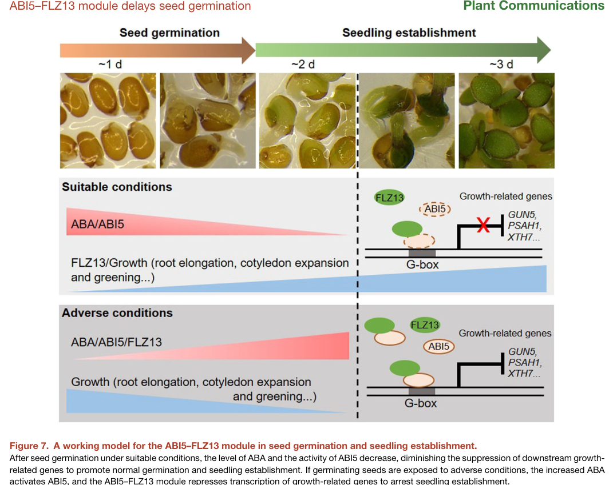

## Question

# Gene Research for Functional Annotation

## ⚠️ CRITICAL: Gene/Protein Identification Context

**BEFORE YOU BEGIN RESEARCH:** You MUST verify you are researching the CORRECT gene/protein. Gene symbols can be ambiguous, especially for less well-characterized genes from non-model organisms.

### Target Gene/Protein Identity (from UniProt):
- **UniProt Accession:** Q9SJN0
- **Protein Description:** RecName: Full=Protein ABSCISIC ACID-INSENSITIVE 5; AltName: Full=Dc3 promoter-binding factor 1; Short=AtDPBF1; AltName: Full=Protein GROWTH-INSENSITIVITY TO ABA 1; AltName: Full=bZIP transcription factor 39; Short=AtbZIP39;
- **Gene Information:** Name=ABI5; Synonyms=BZIP39, DPBF1, GIA1, NEM1; OrderedLocusNames=At2g36270; ORFNames=F2H17.12;
- **Organism (full):** Arabidopsis thaliana (Mouse-ear cress).
- **Protein Family:** Belongs to the bZIP family. ABI5 subfamily. .
- **Key Domains:** bZIP. (IPR004827); BZIP46-like. (IPR043452); bZIP_sf. (IPR046347); bZIP_1 (PF00170)

### MANDATORY VERIFICATION STEPS:

1. **Check if the gene symbol "ABI5" matches the protein description above**
2. **Verify the organism is correct:** Arabidopsis thaliana (Mouse-ear cress).
3. **Check if protein family/domains align with what you find in literature**
4. **If you find literature for a DIFFERENT gene with the same or similar symbol, STOP**

### If Gene Symbol is Ambiguous or You Cannot Find Relevant Literature:

**DO NOT PROCEED WITH RESEARCH ON A DIFFERENT GENE.** Instead:
- State clearly: "The gene symbol 'ABI5' is ambiguous or literature is limited for this specific protein"
- Explain what you found (e.g., "Found extensive literature on a different gene with the same symbol in a different organism")
- Describe the protein based ONLY on the UniProt information provided above
- Suggest that the protein function can be inferred from domain/family information

### Research Target:

Please provide a comprehensive research report on the gene **ABI5** (gene ID: ABI5, UniProt: Q9SJN0) in ARATH.

The research report should be a detailed narrative explaining the function, biological processes, and localization of the gene product. Citations should be given for all claims.

You should prioritize authoritative reviews and primary scientific literature when conducting research. You can supplement
this with annotations you find in gene/protein databases, but these can be outdated or inaccurate.

We are specifically interested in the primary function of the gene - for enzymes, what reaction is catalyzed, and what is the substrate specificity? For transporters, what is the substrate? For structural proteins or adapters, what is the broader structural role? For signaling molecules, what is the role in the pathway.

We are interested in where in or outside the cell the gene product carries out its function.

We are also interested in the signaling or biochemical pathways in which the gene functions. We are less interested in broad pleiotropic effects, except where these elucidate the precise role.

Include evidence where possible. We are interested in both experimental evidence as well as inference from structure, evolution, or bioinformatic analysis. Precise studies should be prioritized over high-throughput, where available.

## Output

Question: You are an expert researcher providing comprehensive, well-cited information.

Provide detailed information focusing on:
1. Key concepts and definitions with current understanding
2. Recent developments and latest research (prioritize 2023-2024 sources)
3. Current applications and real-world implementations
4. Expert opinions and analysis from authoritative sources
5. Relevant statistics and data from recent studies

Format as a comprehensive research report with proper citations. Include URLs and publication dates where available.
Always prioritize recent, authoritative sources and provide specific citations for all major claims.

# Gene Research for Functional Annotation

## ⚠️ CRITICAL: Gene/Protein Identification Context

**BEFORE YOU BEGIN RESEARCH:** You MUST verify you are researching the CORRECT gene/protein. Gene symbols can be ambiguous, especially for less well-characterized genes from non-model organisms.

### Target Gene/Protein Identity (from UniProt):
- **UniProt Accession:** Q9SJN0
- **Protein Description:** RecName: Full=Protein ABSCISIC ACID-INSENSITIVE 5; AltName: Full=Dc3 promoter-binding factor 1; Short=AtDPBF1; AltName: Full=Protein GROWTH-INSENSITIVITY TO ABA 1; AltName: Full=bZIP transcription factor 39; Short=AtbZIP39;
- **Gene Information:** Name=ABI5; Synonyms=BZIP39, DPBF1, GIA1, NEM1; OrderedLocusNames=At2g36270; ORFNames=F2H17.12;
- **Organism (full):** Arabidopsis thaliana (Mouse-ear cress).
- **Protein Family:** Belongs to the bZIP family. ABI5 subfamily. .
- **Key Domains:** bZIP. (IPR004827); BZIP46-like. (IPR043452); bZIP_sf. (IPR046347); bZIP_1 (PF00170)

### MANDATORY VERIFICATION STEPS:

1. **Check if the gene symbol "ABI5" matches the protein description above**
2. **Verify the organism is correct:** Arabidopsis thaliana (Mouse-ear cress).
3. **Check if protein family/domains align with what you find in literature**
4. **If you find literature for a DIFFERENT gene with the same or similar symbol, STOP**

### If Gene Symbol is Ambiguous or You Cannot Find Relevant Literature:

**DO NOT PROCEED WITH RESEARCH ON A DIFFERENT GENE.** Instead:
- State clearly: "The gene symbol 'ABI5' is ambiguous or literature is limited for this specific protein"
- Explain what you found (e.g., "Found extensive literature on a different gene with the same symbol in a different organism")
- Describe the protein based ONLY on the UniProt information provided above
- Suggest that the protein function can be inferred from domain/family information

### Research Target:

Please provide a comprehensive research report on the gene **ABI5** (gene ID: ABI5, UniProt: Q9SJN0) in ARATH.

The research report should be a detailed narrative explaining the function, biological processes, and localization of the gene product. Citations should be given for all claims.

You should prioritize authoritative reviews and primary scientific literature when conducting research. You can supplement
this with annotations you find in gene/protein databases, but these can be outdated or inaccurate.

We are specifically interested in the primary function of the gene - for enzymes, what reaction is catalyzed, and what is the substrate specificity? For transporters, what is the substrate? For structural proteins or adapters, what is the broader structural role? For signaling molecules, what is the role in the pathway.

We are interested in where in or outside the cell the gene product carries out its function.

We are also interested in the signaling or biochemical pathways in which the gene functions. We are less interested in broad pleiotropic effects, except where these elucidate the precise role.

Include evidence where possible. We are interested in both experimental evidence as well as inference from structure, evolution, or bioinformatic analysis. Precise studies should be prioritized over high-throughput, where available.

## Comprehensive Research Report: Arabidopsis **ABI5** (UniProt Q9SJN0; gene **ABI5**, locus **At2g36270**) — Functional Annotation

### 0) Scope and identity verification (mandatory)
The UniProt entry **Q9SJN0** corresponds to *Arabidopsis thaliana* **ABSCISIC ACID-INSENSITIVE 5 (ABI5)**, a **group A bZIP transcription factor** in the AREB/ABF clade. The literature retrieved here consistently describes ABI5 as a **bZIP TF** functioning downstream of the canonical ABA core signaling pathway, matching the UniProt description (and not indicating a different “ABI5” in another organism as the main subject). (collin2021updatesonthe pages 1-2, xie2024identificationandcharacterization pages 1-2)

**Important limitation:** the retrieved papers do not explicitly list all UniProt-recorded synonyms (e.g., DPBF1/AtbZIP39/GIA1/NEM1) or InterPro/Pfam accessions; these identity-defining synonym/domain details are therefore treated as **database annotations** rather than literature-derived claims.

---

### 1) Key concepts and definitions (current understanding)

#### 1.1 ABI5 as an ABA-responsive bZIP transcription factor
ABI5 is a **basic leucine zipper (bZIP) transcription factor** that binds ACGT-core cis-elements (e.g., G-box and ABRE-related motifs) to regulate ABA/stress-responsive gene expression, especially in seeds and early seedlings. (collin2021updatesonthe pages 1-2, xie2024identificationandcharacterization pages 1-2)

#### 1.2 Core ABA signaling pathway context (PYR/PYL–PP2C–SnRK2–ABI5)
The core ABA signal transduction module is widely described as:
1) **ABA** binds **PYR/PYL/RCAR** receptors; 2) receptor–ABA complexes inhibit **clade A PP2C** phosphatases; 3) this releases/activates **SnRK2 kinases**; 4) activated SnRK2s phosphorylate downstream targets including **ABI5/AREB/ABF bZIP TFs**, which then drive ABRE-centered transcriptional programs. (collin2021updatesonthe pages 1-2, xie2024identificationandcharacterization pages 1-2, nee2023drysideof pages 1-2)

#### 1.3 ABRE and related motifs
ABREs are commonly described as cis-elements with a conserved core such as **(C/T)ACGTGGC**, and ABI5/ABF proteins bind ABREs and related ACGT-core elements (e.g., G-box **CACGTG**). (collin2021updatesonthe pages 1-2, xie2024identificationandcharacterization pages 1-2)

---

### 2) Recent developments and latest research (prioritizing 2023–2024)

#### 2.1 ABI5–FLZ13 module: how ABA represses growth programs during germination (2023)
A 2023 primary study identified **FLZ13** (an FCS-like zinc-finger protein) as an ABI5 interactor using TurboID proximity labeling and validated physical interaction by Y2H/pull-down. (yang2023abi5–flz13moduletranscriptionally pages 1-3)

Mechanistically, FLZ13 is **partially required for ABI5 DNA binding** at multiple promoters. In ABA-treated material, ABI5 enrichment at promoters (e.g., **GUN5, PSAH1, PBSR, PBSQ2, XTH7**) decreased when FLZ13 was knocked down, supporting FLZ13 as a cofactor that enhances ABI5 occupancy at target loci. (yang2023abi5–flz13moduletranscriptionally pages 10-12)

Transcriptomically, the study reported **567 genes** co-regulated by ABA, ABI5, and FLZ13, with a strong bias toward repression of growth-associated categories. Gene-set enrichments included **photosynthesis (41 genes; P = 3.6E−22)** and **cell wall organization (40 genes; P = 1.7E−11)**, helping define ABI5’s functional output as suppression of growth programs during the embryo-to-seedling transition under ABA. (yang2023abi5–flz13moduletranscriptionally pages 12-13)

A schematic “working model” from this study is available as a cropped figure. (yang2023abi5–flz13moduletranscriptionally media 5752279d)

#### 2.2 Direct repression of a cell-wall enzyme regulator PME31 by ABI5 (2024)
A 2024 study connects ABI5 to cell-wall remodeling during ABA-inhibited germination by showing ABI5 **directly represses** **PME31** (pectin methylesterase 31). Evidence includes direct binding to a promoter fragment containing an ACGT-core motif and transcriptional repression in reporter assays, supporting that ABI5 can act as a **transcriptional repressor** for specific targets relevant to germination mechanics. (xiang2024pectinmethylesterase31 pages 7-9, xiang2024pectinmethylesterase31 pages 3-4)

Genetic analysis showed **PME31 functions downstream of ABI5** in ABA-mediated inhibition of germination (double mutant phenotypes intermediate), placing ABI5→PME31 within an ABA-regulated module affecting germination. (xiang2024pectinmethylesterase31 pages 7-9)

#### 2.3 ABI5 proteostasis control by ubiquitin–proteasome: PUB8 (peer-reviewed, 2023)
A 2023 *Plant Physiology* paper demonstrated that the **U-box E3 ubiquitin ligase PUB8** physically interacts with ABI5 (and ABI3) and promotes their **ubiquitin/26S proteasome-dependent degradation**. (li2023uboxe3ubiquitin pages 8-9)

Key experimental details include cycloheximide (CHX) chase assays with/without proteasome inhibitor MG132 and ABA treatments, supporting proteasome-mediated ABI5 turnover. (li2023uboxe3ubiquitin pages 8-9)

Phenotypically, pub8 loss-of-function mutants displayed ABA hypersensitivity during cotyledon greening and showed sustained ABI5 accumulation (reported to persist up to **5 days** of ABA treatment), whereas PUB8 overexpression reduced ABI5 abundance and ABA responsiveness. (li2023uboxe3ubiquitin pages 4-5)

#### 2.4 ABI5 degradation spatial control at the nuclear periphery: NUP1 (preprint, 2023)
A 2023 bioRxiv preprint proposes a nuclear architecture component, **NUCLEOPORIN1 (NUP1)**, as an upstream regulator controlling ABI5 degradation. RNA-seq revealed markedly amplified ABA-dependent transcriptional changes in nup1 seedlings: e.g., nup1+ABA vs nup1 had **~4,486 DEGs (1,692 up; 2,794 down)**, whereas Col-0+ABA vs Col-0 had **1,804 DEGs (1,018 up; 786 down)**. (thapa2023nucleoporin1mediatesproteasomebased pages 7-9)

The same study reported strong induction of ABI3/ABI4/ABI5 and co-target “effector” genes (including **EM6, Rd29B, EM1, LEA4.5, LEA4.2**) with large reported fold-changes (>15-fold in Col-0+ABA and >30-fold in nup1+ABA for a subset). (thapa2023nucleoporin1mediatesproteasomebased pages 7-9)

Subnuclear localization experiments using ABI5-GFP under the native promoter suggested ABI5 is largely **nucleoplasmic** after ABA induction but, upon stress removal, is normally degraded; in nup1, ABI5 becomes retained in the **nucleolus** instead of being cleared, implicating nuclear pore/proteasome positioning in ABI5 proteostasis. (thapa2023nucleoporin1mediatesproteasomebased pages 12-14)

#### 2.5 ABI5-binding proteins (AFPs) as phosphorylation-regulated hubs (preprint, 2024)
A 2024 bioRxiv study positions ABI5-binding proteins (**AFPs**) as negative regulators integrated into core ABA signaling. AFPs interact with ABA core components and are substrates of SnRK2s and PP2Cs; for **AFP2**, ABA-promoted phosphorylation was linked to changes in stability and localization (loss of phosphorylation decreased stability and shifted localization to dispersed foci), affecting inhibition of ABA responses during germination. (lynch2024abi5bindingproteins pages 1-4)

---

### 3) Molecular function, biological processes, and localization (evidence-based functional annotation)

#### 3.1 Primary molecular function
ABI5 is a **sequence-specific transcription factor** (bZIP/AREB/ABF family) that binds ABRE/ACGT-core motifs and modulates transcription of ABA-responsive genes, functioning as a central transcriptional effector downstream of SnRK2 kinases. (collin2021updatesonthe pages 1-2, nee2023drysideof pages 1-2)

#### 3.2 Biological process focus: inhibiting germination and early seedling establishment under stress
Multiple recent studies converge on ABI5 as a master regulator of ABA-mediated **growth arrest** during the embryo-to-seedling transition, repressing suites of growth-related genes (photosynthesis and cell-wall organization categories) when ABA is elevated. (yang2023abi5–flz13moduletranscriptionally pages 12-13, yang2023abi5–flz13moduletranscriptionally media 5752279d)

#### 3.3 Direct target genes (examples with experimental support)
**Growth-related repression module (ABI5–FLZ13, 2023):** promoter occupancy/effects on binding were documented for **GUN5, PSAH1, PBSR, PBSQ2, XTH7**, with G-box motif dependency tested via mutant probes and binding assays. (yang2023abi5–flz13moduletranscriptionally pages 10-12)

**Cell-wall enzyme regulatory link (PME31, 2024):** ABI5 directly binds a PME31 promoter region containing an ACGT-core element and represses PME31 expression in multiple assays (Y1H/EMSA and luciferase reporter logic), with genetic evidence placing PME31 downstream of ABI5 in ABA-inhibited germination. (xiang2024pectinmethylesterase31 pages 7-9, xiang2024pectinmethylesterase31 pages 3-4)

**Canonical ABA-responsive targets highlighted in 2023–2024 datasets:** ABI5 co-target genes with ABI3/ABI4 and classical ABA marker genes include **EM1, EM6, RD29B, RAB18** and LEA genes; strong induction of EM6/RD29B/EM1/LEA4.x was reported under ABA in the nup1 transcriptome context. (thapa2023nucleoporin1mediatesproteasomebased pages 7-9, li2023uboxe3ubiquitin pages 4-5)

#### 3.4 Protein interactors and regulatory complexes
- **FLZ13:** interacts with ABI5; supports ABI5 DNA binding and ABA sensitivity; interaction involves ABI5 bZIP region and is ABA-responsive. (yang2023abi5–flz13moduletranscriptionally pages 12-13, yang2023abi5–flz13moduletranscriptionally pages 1-3)
- **PUB8:** E3 ligase that interacts with ABI5 and promotes degradation via ubiquitin–26S proteasome, attenuating ABA responses during early seedling growth. (li2023uboxe3ubiquitin pages 8-9, li2023uboxe3ubiquitin pages 4-5)
- **NUP1:** links nuclear pore complex/proteasome positioning to ABI5 degradation, affecting ABI5 subnuclear dynamics and ABA hypersensitivity (preprint). (thapa2023nucleoporin1mediatesproteasomebased pages 12-14, thapa2023nucleoporin1mediatesproteasomebased pages 7-9)
- **AFPs (e.g., AFP2):** ABI5-binding proteins functioning as negative regulators and phosphorylation-regulated pathway hubs (preprint). (lynch2024abi5bindingproteins pages 1-4)

#### 3.5 Subcellular localization
ABI5 functions in the **nucleus**. Recent evidence refines this to subnuclear compartments: ABI5 is predominantly **nucleoplasmic** under ABA/abiotic stress and is normally degraded after stress removal; disruption of NUP1 causes **nucleolar retention** of ABI5, consistent with spatially regulated proteasomal turnover. (thapa2023nucleoporin1mediatesproteasomebased pages 12-14)

---

### 4) Statistics and recent data highlights

Key quantitative findings directly extracted from 2023–2024 studies:
- **nup1 RNA-seq (ABA response amplification):** nup1 vs Col-0: 341 up / 360 down; Col-0+ABA vs Col-0: 1,018 up / 786 down; nup1+ABA vs nup1: 1,692 up / 2,794 down (~4,486 DEGs); nup1+ABA vs Col-0+ABA: 599 up / 2,182 down. (thapa2023nucleoporin1mediatesproteasomebased pages 7-9)
- **ABI5–FLZ13 co-regulation:** 567 ABA/ABI5/FLZ13 co-regulated genes; GO enrichments for photosynthesis (41 genes; P = 3.6E−22) and cell wall organization (40 genes; P = 1.7E−11). (yang2023abi5–flz13moduletranscriptionally pages 12-13)
- **ABI5 interactome thresholds:** TurboID study used preys with log2FC > 1 (fold change >2) and P < 0.05 as significant, from a 611-protein pool. (yang2023abi5–flz13moduletranscriptionally pages 1-3)

---

### 5) Current applications and real-world implementations (2024 emphasis)

Although ABI5 itself is most deeply characterized in *Arabidopsis*, 2024 application-focused sources treat the **ABA–ABI (including ABI5) axis** as an actionable lever for agriculture.

#### 5.1 Chemical control of ABA signaling (agonists/antagonists; precision growth control)
A 2024 review summarizes practical strategies using **ABA receptor agonists** and **antagonists** as tools to suppress or accelerate germination and to fine-tune ABA responses. Named examples include **Quinabactin** and **Opabactin-related agonists**, and antagonists such as **(+)-PAT3, (+)-PATT1, AA1, Aantabatin**, with reported effects across Arabidopsis, tomato, and barley contexts. (zheng2024fromregulationto pages 14-16)

#### 5.2 Breeding and allele selection for dormancy / pre-harvest sprouting resistance
A high-impact 2024 *Nature Communications* study in rice cloned a dormancy QTL (qSDR3.1; **LOD 11.75**) involving modulation of bZIP/ABI transcription factor activity, with recombinant 7-day germination rates ranging **20.16%–72.14%**. While this is not Arabidopsis ABI5 per se, it provides a direct translational blueprint: selecting/introgressing alleles that tune ABI-like transcription factor activity to control dormancy and reduce pre-harvest sprouting. (guo2024amediatorof pages 1-2)

#### 5.3 Gene editing / transgenics targeting ABA pathway nodes
The same 2024 agronomic review highlights CRISPR/Cas9 strategies targeting ABA metabolism and signaling (e.g., editing catabolic 8′-hydroxylase genes to increase dormancy without yield penalties; or editing biosynthetic genes that can inadvertently increase pre-harvest germination risk), positioning ABI/ABI5-regulated programs downstream of these interventions. Quantitative examples include tomato shelf-life extension from **7 days to 15–29 days** and firmness increases **30–45%** via ABA-pathway engineering (fruit-specific NCED RNAi example) and ripening acceleration by **3–4 days** (BG1 overexpression). (zheng2024fromregulationto pages 16-17)

#### 5.4 Epigenetic regulation as an application-relevant control point
A 2024 pea seed transition study reported **>20-fold downregulation** of PsABI3/4/5 during late germination, with promoter methylation already high, illustrating that ABI gene expression can be strongly gated by epigenetic state—suggesting potential routes for breeding or epigenetic editing to tune dormancy-to-germination transitions. (smolikova2024involvementofabscisic pages 1-2)

---

### 6) Expert opinions and authoritative synthesis (what experts currently emphasize)

Recent expert syntheses highlight several convergent themes:
1) **Signal specificity** in ABA responses likely comes from combinatorial control: which receptors/PP2Cs/SnRK2s are present, plus peripheral regulators and proteostasis switches, producing context-dependent ABI5 activity in seeds. (nee2023drysideof pages 1-2, nee2023drysideof pages 10-11)
2) **ABI5 activity is not only “on/off,”** but tuned by (i) phosphorylation state (SnRK2s vs PP2Cs), (ii) interaction partners/cofactors that modulate promoter occupancy (e.g., FLZ13), and (iii) regulated degradation pathways (E3 ligases like PUB8; nuclear pore-associated processes). (yang2023abi5–flz13moduletranscriptionally pages 12-13, li2023uboxe3ubiquitin pages 4-5, thapa2023nucleoporin1mediatesproteasomebased pages 12-14)
3) **Translational constraint:** ABA itself is unstable (photoinstability/rapid degradation), motivating ABA analogs and receptor modulators for more precise agronomic control; reviews emphasize stage-specific and tissue-specific modulation to avoid yield penalties. (zheng2024fromregulationto pages 12-13, zheng2024fromregulationto pages 16-17)

---

### 7) Visual evidence (mechanistic model)
A working model figure from the 2023 ABI5–FLZ13 study summarizes the concept that elevated ABA activates ABI5, and the ABI5–FLZ13 module represses growth-related genes to arrest seedling establishment under adverse conditions; when conditions improve, ABA/ABI5 activity decreases, relieving repression and enabling germination/establishment. (yang2023abi5–flz13moduletranscriptionally media 5752279d)

---

### 8) Evidence summary table (quick reference)

| Category | Key findings | Evidence type (review/primary; assay) | Representative references (with DOI URL and pub date) | Citation IDs |
|---|---|---|---|---|
| identity/domains | Arabidopsis ABI5 corresponds to At2g36270 / UniProt Q9SJN0; a group A AREB/ABF basic leucine zipper (bZIP) TF that binds ACGT-core cis-elements/ABREs and is activated by SnRK2 phosphorylation; user-provided synonyms DPBF1, AtbZIP39, GIA1 align with this ABI5 identity, though synonym/locus details were mainly database-supplied rather than explicit in recent papers. | Review/comparative review; pathway synthesis | Collin et al., *Cells* (2021-08), https://doi.org/10.3390/cells10081996; Xie et al., *Plants* (2024-03), https://doi.org/10.3390/plants13060774 | (collin2021updatesonthe pages 1-2, xie2024identificationandcharacterization pages 1-2) |
| pathway role | ABI5 is a core downstream transcriptional effector of the PYR/PYL/RCAR → PP2C → SnRK2 ABA pathway, functioning mainly in seeds/early seedlings to inhibit germination and post-germinative growth under unfavorable conditions. | Review; signaling model synthesis | Née & Krüger, *Frontiers in Plant Science* (2023-07), https://doi.org/10.3389/fpls.2023.1192652; Xie et al., *Plants* (2024-03), https://doi.org/10.3390/plants13060774 | (nee2023drysideof pages 1-2, xie2024identificationandcharacterization pages 1-2) |
| direct DNA binding motifs | ABI5/AREB proteins recognize ABREs with consensus (C/T)ACGTGGC and related ACGT-core elements; direct binding was experimentally shown at a PME31 promoter element containing `ttaCACGTag` (EMSA/Y1H), and in the ABI5–FLZ13 study at G-box motifs (CACGTG) in target promoters, with mutant probes abolishing binding support. | Review + primary; Y1H, EMSA, ChIP-qPCR, luciferase | Collin et al., *Cells* (2021-08), https://doi.org/10.3390/cells10081996; Xiang et al., *Frontiers in Plant Science* (2024-02), https://doi.org/10.3389/fpls.2024.1336689; Yang et al., *Plant Communications* (2023-11), https://doi.org/10.1016/j.xplc.2023.100636 | (collin2021updatesonthe pages 1-2, xiang2024pectinmethylesterase31 pages 3-4, yang2023abi5–flz13moduletranscriptionally pages 10-12) |
| validated target genes | Canonical/validated ABI5-responsive genes include EM1, EM6, RAB18, RD29B and additional co-targets with ABI3/ABI4. New 2023–2024 direct targets include PME31 (direct repression) and growth-related genes GUN5, PSAH1, PBSR, PBSQ2, XTH7 via the ABI5–FLZ13 module. In nup1 ABA-treated seedlings, ABI3/4/5 co-targets EM6, Rd29B, LEA4.5, EM1 and LEA4.2 were strongly induced (>15-fold in Col-0+ABA; >30-fold in nup1+ABA). | Primary; RNA-seq, ChIP-qPCR, EMSA, Y1H, luciferase, genetics | Xiang et al., *Frontiers in Plant Science* (2024-02), https://doi.org/10.3389/fpls.2024.1336689; Yang et al., *Plant Communications* (2023-11), https://doi.org/10.1016/j.xplc.2023.100636; Thapa et al., *bioRxiv* (2023-08), https://doi.org/10.1101/2023.08.10.552853 | (xiang2024pectinmethylesterase31 pages 7-9, yang2023abi5–flz13moduletranscriptionally pages 10-12, thapa2023nucleoporin1mediatesproteasomebased pages 7-9) |
| interactors/complexes | ABI5 physically/functionally interacts with FLZ13 (promotes DNA binding/repression), PUB8 (E3 ligase), NUP1 (nuclear pore/proteasome-associated factor), AFPs (negative regulators of ABA response), and reported regulators such as PRR5/7, MED19a, XIW1. ABI5-TurboID proximity labeling recovered 611 proteins; significant preys were defined by log2FC > 1 and P < 0.05. | Primary + review; TurboID, Y2H, pull-down, BiFC, genetic interaction | Yang et al., *Plant Communications* (2023-11), https://doi.org/10.1016/j.xplc.2023.100636; Li et al., *Plant Physiology* (2023-01), https://doi.org/10.1093/plphys/kiad044; Lynch et al., *bioRxiv* (2024-10), https://doi.org/10.1101/2024.10.11.617944 | (yang2023abi5–flz13moduletranscriptionally pages 1-3, li2023uboxe3ubiquitin pages 8-9, lynch2024abi5bindingproteins pages 1-4) |
| post-translational regulation | ABI5 activity is enhanced by phosphorylation (mainly SnRK2s; additional kinases noted in reviews). Stability is tightly controlled by ubiquitin–26S proteasome pathways: PUB8 promotes ABI5 degradation; prior KEG/DWA complexes remain relevant. In pub8, ABI5 persisted up to 5 d of ABA treatment, whereas PUB8-OE lowered ABI5 and ABA-responsive transcripts. AFP2 phosphorylation is ABA-promoted; blocking AFP2 phosphorylation reduced stability, shifted localization to dispersed foci, and weakened ABA inhibition at germination. | Primary + review; CHX chase, MG132, immunoblot, phosphorylation assays | Li et al., *Plant Physiology* (2023-01), https://doi.org/10.1093/plphys/kiad044; Lynch et al., *bioRxiv* (2024-10), https://doi.org/10.1101/2024.10.11.617944; Née & Krüger, *Frontiers in Plant Science* (2023-07), https://doi.org/10.3389/fpls.2023.1192652 | (li2023uboxe3ubiquitin pages 4-5, li2023uboxe3ubiquitin pages 8-9, lynch2024abi5bindingproteins pages 1-4) |
| subcellular localization | ABI5 acts in the nucleus. In native-promoter ABI5-GFP lines, ABI5 was predominantly nucleoplasmic after 4 h ABA treatment; after ABA removal it was normally degraded, but in nup1 it was retained in the nucleolus instead of being cleared. XIW1 was previously noted to shuttle nucleus/cytoplasm and protect nuclear ABI5 from degradation; DcaABI5 complementation work also localized an ABI5 homolog to the nucleus. | Primary + review; confocal imaging, transgenic localization | Thapa et al., *bioRxiv* (2023-08), https://doi.org/10.1101/2023.08.10.552853; Xie et al., *Plants* (2024-03), https://doi.org/10.3390/plants13060774; Collin et al., *Cells* (2021-08), https://doi.org/10.3390/cells10081996 | (thapa2023nucleoporin1mediatesproteasomebased pages 12-14, xie2024identificationandcharacterization pages 7-10, collin2021updatesonthe pages 2-4) |
| quantitative statistics | **nup1 RNA-seq:** 341 up/360 down genes vs Col-0; Col-0+ABA 1,018 up/786 down; nup1+ABA 1,692 up/2,794 down (~4,486 total DEGs); nup1+ABA vs Col-0+ABA 599 up/2,182 down. **ABI5–FLZ13 RNA-seq/GO:** 567 ABA/ABI5/FLZ13 co-regulated genes; enrichment for photosynthesis (41 genes, P = 3.6E-22) and cell wall organization (40 genes, P = 1.7E-11). **Rice dormancy breeding example:** qSDR3.1 LOD 11.75; recombinant 7-d germination 20.16%–72.14%. **Pea transition:** PsABI3/4/5 downregulated >20-fold. | Primary; RNA-seq, GO enrichment, QTL mapping, LC-MS/MS/transcriptomics | Thapa et al., *bioRxiv* (2023-08), https://doi.org/10.1101/2023.08.10.552853; Yang et al., *Plant Communications* (2023-11), https://doi.org/10.1016/j.xplc.2023.100636; Guo et al., *Nature Communications* (2024-02), https://doi.org/10.1038/s41467-024-45402-z; Smolikova et al., *Plants* (2024-01), https://doi.org/10.3390/plants13020206 | (thapa2023nucleoporin1mediatesproteasomebased pages 7-9, yang2023abi5–flz13moduletranscriptionally pages 12-13, guo2024amediatorof pages 1-2, smolikova2024involvementofabscisic pages 1-2) |
| applications/translation | ABI5-centered ABA signaling is an actionable lever for seed dormancy, pre-harvest sprouting resistance, stress tolerance, and fruit/seed traits. 2024 reviews highlight ABA analogs and receptor modulators (e.g., Quinabactin, Opabactin-like agonists; antagonists such as (+)-PAT3, (+)-PATT1, AA1, Aantabatin), plus breeding/editing of NCED, CYP707A, PYLs, and ABI genes. Reported quantitative outcomes include tomato shelf-life extension from 7 d to 15–29 d and firmness gains of 30–45%; BG1 overexpression advanced ripening by 3–4 d; wheat NCED-driven ABA increased embryo ABA and delayed germination by several days. Marker-assisted selection using TaABI5/TaNCED and QTL alleles regulating ABI TF activity is proposed for PHS resistance. | Application-focused review + high-impact primary breeding study | Zheng et al., *International Journal of Molecular Sciences* (2024-11), https://doi.org/10.3390/ijms252212024; Mo et al., *Frontiers in Plant Science* (2024-11), https://doi.org/10.3389/fpls.2024.1437184; Guo et al., *Nature Communications* (2024-02), https://doi.org/10.1038/s41467-024-45402-z | (zheng2024fromregulationto pages 14-16, zheng2024fromregulationto pages 16-17, mo2024unveilingthecrucial pages 15-16, guo2024amediatorof pages 1-2) |

*Table: This table summarizes evidence-based functional annotation for Arabidopsis ABI5, prioritizing 2023-2024 literature while anchoring identity and pathway context with authoritative reviews. It highlights direct assays, validated targets, localization, quantitative findings, and translational relevance for seed biology and crop improvement.*

---

### 9) Practical takeaway for functional annotation (concise)
ABI5 (Q9SJN0; At2g36270) is best annotated as a **nuclear bZIP transcription factor** that integrates ABA core signaling into transcriptional programs that **suppress germination and early seedling growth** under stress. Its function is tightly regulated through **SnRK2/PP2C phosphorylation control**, **cofactor-dependent promoter occupancy** (e.g., FLZ13), and **spatiotemporally controlled proteasome-mediated turnover** (e.g., PUB8; NUP1-associated nuclear degradation), with direct experimentally supported targets spanning classical ABA markers (EM1/EM6/RD29B/RAB18/LEAs) and growth/cell-wall regulators (PME31; photosynthesis/cell wall genes via ABI5–FLZ13). (collin2021updatesonthe pages 1-2, yang2023abi5–flz13moduletranscriptionally pages 12-13, xiang2024pectinmethylesterase31 pages 7-9, li2023uboxe3ubiquitin pages 4-5, thapa2023nucleoporin1mediatesproteasomebased pages 12-14)

References

1. (collin2021updatesonthe pages 1-2): Anna Collin, Agata Daszkowska-Golec, and Iwona Szarejko. Updates on the role of abscisic acid insensitive 5 (abi5) and abscisic acid-responsive element binding factors (abfs) in aba signaling in different developmental stages in plants. Cells, 10:1996, Aug 2021. URL: https://doi.org/10.3390/cells10081996, doi:10.3390/cells10081996. This article has 165 citations.

2. (xie2024identificationandcharacterization pages 1-2): Xi Xie, Miaoyan Lin, Gengsheng Xiao, Qin Wang, and Zhiyong Li. Identification and characterization of the areb/abf gene family in three orchid species and functional analysis of dcaabi5 in arabidopsis. Plants, 13:774, Mar 2024. URL: https://doi.org/10.3390/plants13060774, doi:10.3390/plants13060774. This article has 9 citations.

3. (nee2023drysideof pages 1-2): Guillaume Née and Thorben Krüger. Dry side of the core: a meta-analysis addressing the original nature of the aba signalosome at the onset of seed imbibition. Frontiers in Plant Science, Jul 2023. URL: https://doi.org/10.3389/fpls.2023.1192652, doi:10.3389/fpls.2023.1192652. This article has 8 citations.

4. (yang2023abi5–flz13moduletranscriptionally pages 1-3): Chao Yang, Xibao Li, Shunquan Chen, Chuanliang Liu, Lianming Yang, Kailin Li, Jun Liao, Xuanang Zheng, Hongbo Li, Yongqing Li, Shaohua Zeng, Xiaohong Zhuang, Pedro L. Rodriguez, Ming Luo, Ying Wang, and Caiji Gao. Abi5–flz13 module transcriptionally represses growth-related genes to delay seed germination in response to aba. Nov 2023. URL: https://doi.org/10.1016/j.xplc.2023.100636, doi:10.1016/j.xplc.2023.100636. This article has 44 citations and is from a peer-reviewed journal.

5. (yang2023abi5–flz13moduletranscriptionally pages 10-12): Chao Yang, Xibao Li, Shunquan Chen, Chuanliang Liu, Lianming Yang, Kailin Li, Jun Liao, Xuanang Zheng, Hongbo Li, Yongqing Li, Shaohua Zeng, Xiaohong Zhuang, Pedro L. Rodriguez, Ming Luo, Ying Wang, and Caiji Gao. Abi5–flz13 module transcriptionally represses growth-related genes to delay seed germination in response to aba. Nov 2023. URL: https://doi.org/10.1016/j.xplc.2023.100636, doi:10.1016/j.xplc.2023.100636. This article has 44 citations and is from a peer-reviewed journal.

6. (yang2023abi5–flz13moduletranscriptionally pages 12-13): Chao Yang, Xibao Li, Shunquan Chen, Chuanliang Liu, Lianming Yang, Kailin Li, Jun Liao, Xuanang Zheng, Hongbo Li, Yongqing Li, Shaohua Zeng, Xiaohong Zhuang, Pedro L. Rodriguez, Ming Luo, Ying Wang, and Caiji Gao. Abi5–flz13 module transcriptionally represses growth-related genes to delay seed germination in response to aba. Nov 2023. URL: https://doi.org/10.1016/j.xplc.2023.100636, doi:10.1016/j.xplc.2023.100636. This article has 44 citations and is from a peer-reviewed journal.

7. (yang2023abi5–flz13moduletranscriptionally media 5752279d): Chao Yang, Xibao Li, Shunquan Chen, Chuanliang Liu, Lianming Yang, Kailin Li, Jun Liao, Xuanang Zheng, Hongbo Li, Yongqing Li, Shaohua Zeng, Xiaohong Zhuang, Pedro L. Rodriguez, Ming Luo, Ying Wang, and Caiji Gao. Abi5–flz13 module transcriptionally represses growth-related genes to delay seed germination in response to aba. Nov 2023. URL: https://doi.org/10.1016/j.xplc.2023.100636, doi:10.1016/j.xplc.2023.100636. This article has 44 citations and is from a peer-reviewed journal.

8. (xiang2024pectinmethylesterase31 pages 7-9): Yang Xiang, Chongyang Zhao, Qian Li, Yingxue Niu, Yitian Pan, Guangdong Li, Yuan Cheng, and Aying Zhang. Pectin methylesterase 31 is transcriptionally repressed by abi5 to negatively regulate aba-mediated inhibition of seed germination. Frontiers in Plant Science, Feb 2024. URL: https://doi.org/10.3389/fpls.2024.1336689, doi:10.3389/fpls.2024.1336689. This article has 8 citations.

9. (xiang2024pectinmethylesterase31 pages 3-4): Yang Xiang, Chongyang Zhao, Qian Li, Yingxue Niu, Yitian Pan, Guangdong Li, Yuan Cheng, and Aying Zhang. Pectin methylesterase 31 is transcriptionally repressed by abi5 to negatively regulate aba-mediated inhibition of seed germination. Frontiers in Plant Science, Feb 2024. URL: https://doi.org/10.3389/fpls.2024.1336689, doi:10.3389/fpls.2024.1336689. This article has 8 citations.

10. (li2023uboxe3ubiquitin pages 8-9): Zhipeng Li, Shaoqin Li, Dongjie Jin, Yongping Yang, Zhengyan Pu, Xiao Han, Yanru Hu, and Yanjuan Jiang. U-box e3 ubiquitin ligase pub8 attenuates abscisic acid responses during early seedling growth. Plant Physiology, 191:2519-2533, Jan 2023. URL: https://doi.org/10.1093/plphys/kiad044, doi:10.1093/plphys/kiad044. This article has 31 citations and is from a highest quality peer-reviewed journal.

11. (li2023uboxe3ubiquitin pages 4-5): Zhipeng Li, Shaoqin Li, Dongjie Jin, Yongping Yang, Zhengyan Pu, Xiao Han, Yanru Hu, and Yanjuan Jiang. U-box e3 ubiquitin ligase pub8 attenuates abscisic acid responses during early seedling growth. Plant Physiology, 191:2519-2533, Jan 2023. URL: https://doi.org/10.1093/plphys/kiad044, doi:10.1093/plphys/kiad044. This article has 31 citations and is from a highest quality peer-reviewed journal.

12. (thapa2023nucleoporin1mediatesproteasomebased pages 7-9): Raj K Thapa, Gang Tian, Qing Shi Mimmie Lu, Yaoguang Yu, Jie Shu, Chen Chen, Jingpu Song, Xin Xie, Binghui Shan, Vi Nguyen, Chenlong Li, Shaomin Bian, Jun Liu, Susanne E Kohalmi, and Yuhai Cui. Nucleoporin1 mediates proteasome-based degradation of abi5 to regulate arabidopsis seed germination. bioRxiv, Aug 2023. URL: https://doi.org/10.1101/2023.08.10.552853, doi:10.1101/2023.08.10.552853. This article has 1 citations.

13. (thapa2023nucleoporin1mediatesproteasomebased pages 12-14): Raj K Thapa, Gang Tian, Qing Shi Mimmie Lu, Yaoguang Yu, Jie Shu, Chen Chen, Jingpu Song, Xin Xie, Binghui Shan, Vi Nguyen, Chenlong Li, Shaomin Bian, Jun Liu, Susanne E Kohalmi, and Yuhai Cui. Nucleoporin1 mediates proteasome-based degradation of abi5 to regulate arabidopsis seed germination. bioRxiv, Aug 2023. URL: https://doi.org/10.1101/2023.08.10.552853, doi:10.1101/2023.08.10.552853. This article has 1 citations.

14. (lynch2024abi5bindingproteins pages 1-4): Tim J Lynch, B. Joy Erickson McNally, Teodora Losic, Jonas Lindquist, and Ruth Finkelstein. Abi5 binding proteins are substrates of key components in the aba core signaling pathway. bioRxiv, Oct 2024. URL: https://doi.org/10.1101/2024.10.11.617944, doi:10.1101/2024.10.11.617944. This article has 1 citations.

15. (zheng2024fromregulationto pages 14-16): Xunan Zheng, Weiliang Mo, Zecheng Zuo, Qingchi Shi, Xiaoyu Chen, Xuelai Zhao, and Junyou Han. From regulation to application: the role of abscisic acid in seed and fruit development and agronomic production strategies. International Journal of Molecular Sciences, 25:12024, Nov 2024. URL: https://doi.org/10.3390/ijms252212024, doi:10.3390/ijms252212024. This article has 12 citations.

16. (guo2024amediatorof pages 1-2): Naihui Guo, Shengjia Tang, Yakun Wang, Wei Chen, Ruihu An, Zongliang Ren, Shikai Hu, Shaoqing Tang, Xiangjin Wei, Gaoneng Shao, Guiai Jiao, Lihong Xie, Ling Wang, Ying Chen, Fengli Zhao, Zhonghua Sheng, and Peisong Hu. A mediator of osbzip46 deactivation and degradation negatively regulates seed dormancy in rice. Nature Communications, Feb 2024. URL: https://doi.org/10.1038/s41467-024-45402-z, doi:10.1038/s41467-024-45402-z. This article has 34 citations and is from a highest quality peer-reviewed journal.

17. (zheng2024fromregulationto pages 16-17): Xunan Zheng, Weiliang Mo, Zecheng Zuo, Qingchi Shi, Xiaoyu Chen, Xuelai Zhao, and Junyou Han. From regulation to application: the role of abscisic acid in seed and fruit development and agronomic production strategies. International Journal of Molecular Sciences, 25:12024, Nov 2024. URL: https://doi.org/10.3390/ijms252212024, doi:10.3390/ijms252212024. This article has 12 citations.

18. (smolikova2024involvementofabscisic pages 1-2): Galina Smolikova, Ekaterina Krylova, Ivan Petřík, Polina Vilis, Aleksander Vikhorev, Ksenia Strygina, Miroslav Strnad, Andrej Frolov, Elena Khlestkina, and Sergei Medvedev. Involvement of abscisic acid in transition of pea (pisum sativum l.) seeds from germination to post-germination stages. Plants, 13:206, Jan 2024. URL: https://doi.org/10.3390/plants13020206, doi:10.3390/plants13020206. This article has 6 citations.

19. (nee2023drysideof pages 10-11): Guillaume Née and Thorben Krüger. Dry side of the core: a meta-analysis addressing the original nature of the aba signalosome at the onset of seed imbibition. Frontiers in Plant Science, Jul 2023. URL: https://doi.org/10.3389/fpls.2023.1192652, doi:10.3389/fpls.2023.1192652. This article has 8 citations.

20. (zheng2024fromregulationto pages 12-13): Xunan Zheng, Weiliang Mo, Zecheng Zuo, Qingchi Shi, Xiaoyu Chen, Xuelai Zhao, and Junyou Han. From regulation to application: the role of abscisic acid in seed and fruit development and agronomic production strategies. International Journal of Molecular Sciences, 25:12024, Nov 2024. URL: https://doi.org/10.3390/ijms252212024, doi:10.3390/ijms252212024. This article has 12 citations.

21. (xie2024identificationandcharacterization pages 7-10): Xi Xie, Miaoyan Lin, Gengsheng Xiao, Qin Wang, and Zhiyong Li. Identification and characterization of the areb/abf gene family in three orchid species and functional analysis of dcaabi5 in arabidopsis. Plants, 13:774, Mar 2024. URL: https://doi.org/10.3390/plants13060774, doi:10.3390/plants13060774. This article has 9 citations.

22. (collin2021updatesonthe pages 2-4): Anna Collin, Agata Daszkowska-Golec, and Iwona Szarejko. Updates on the role of abscisic acid insensitive 5 (abi5) and abscisic acid-responsive element binding factors (abfs) in aba signaling in different developmental stages in plants. Cells, 10:1996, Aug 2021. URL: https://doi.org/10.3390/cells10081996, doi:10.3390/cells10081996. This article has 165 citations.

23. (mo2024unveilingthecrucial pages 15-16): Weiliang Mo, Xunan Zheng, Qingchi Shi, Xuelai Zhao, Xiaoyu Chen, Zhenming Yang, and Zecheng Zuo. Unveiling the crucial roles of abscisic acid in plant physiology: implications for enhancing stress tolerance and productivity. Frontiers in Plant Science, Nov 2024. URL: https://doi.org/10.3389/fpls.2024.1437184, doi:10.3389/fpls.2024.1437184. This article has 55 citations.

## Artifacts

- [Edison artifact artifact-00](ABI5-deep-research-falcon_artifacts/artifact-00.md)

## Citations

1. zheng2024fromregulationto pages 14-16
2. guo2024amediatorof pages 1-2
3. zheng2024fromregulationto pages 16-17
4. smolikova2024involvementofabscisic pages 1-2
5. collin2021updatesonthe pages 1-2
6. xie2024identificationandcharacterization pages 1-2
7. nee2023drysideof pages 1-2
8. nee2023drysideof pages 10-11
9. zheng2024fromregulationto pages 12-13
10. xie2024identificationandcharacterization pages 7-10
11. collin2021updatesonthe pages 2-4
12. mo2024unveilingthecrucial pages 15-16
13. https://doi.org/10.3390/cells10081996;
14. https://doi.org/10.3390/plants13060774
15. https://doi.org/10.3389/fpls.2023.1192652;
16. https://doi.org/10.3389/fpls.2024.1336689;
17. https://doi.org/10.1016/j.xplc.2023.100636
18. https://doi.org/10.1016/j.xplc.2023.100636;
19. https://doi.org/10.1101/2023.08.10.552853
20. https://doi.org/10.1093/plphys/kiad044;
21. https://doi.org/10.1101/2024.10.11.617944
22. https://doi.org/10.1101/2024.10.11.617944;
23. https://doi.org/10.3389/fpls.2023.1192652
24. https://doi.org/10.1101/2023.08.10.552853;
25. https://doi.org/10.3390/plants13060774;
26. https://doi.org/10.3390/cells10081996
27. https://doi.org/10.1038/s41467-024-45402-z;
28. https://doi.org/10.3390/plants13020206
29. https://doi.org/10.3390/ijms252212024;
30. https://doi.org/10.3389/fpls.2024.1437184;
31. https://doi.org/10.1038/s41467-024-45402-z
32. https://doi.org/10.3390/cells10081996,
33. https://doi.org/10.3390/plants13060774,
34. https://doi.org/10.3389/fpls.2023.1192652,
35. https://doi.org/10.1016/j.xplc.2023.100636,
36. https://doi.org/10.3389/fpls.2024.1336689,
37. https://doi.org/10.1093/plphys/kiad044,
38. https://doi.org/10.1101/2023.08.10.552853,
39. https://doi.org/10.1101/2024.10.11.617944,
40. https://doi.org/10.3390/ijms252212024,
41. https://doi.org/10.1038/s41467-024-45402-z,
42. https://doi.org/10.3390/plants13020206,
43. https://doi.org/10.3389/fpls.2024.1437184,