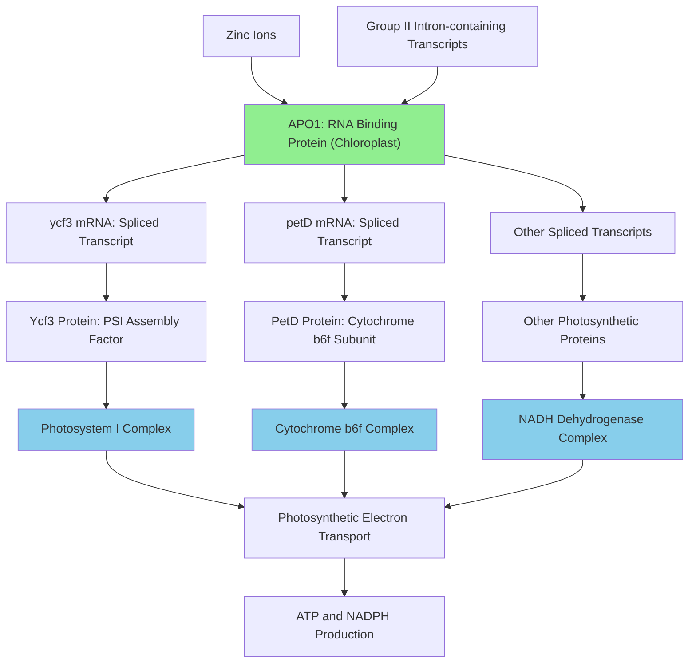

# Pathway Summary for APO1

## Overview
APO1 (ACCUMULATION OF PHOTOSYSTEM ONE 1) is a chloroplast-localized RNA-binding protein that functions as a critical component in chloroplast gene expression through its role in group II intron splicing [PMID:21421812]. The protein enables the assembly and function of photosynthetic electron transport complexes by processing chloroplast transcripts encoding essential components of photosystem I and NADH dehydrogenase complexes [PMID:15494558, PMID:21421812].

## Chloroplast Group II Intron Splicing Pathway
APO1 serves as an essential splicing factor for multiple chloroplast group II introns, utilizing its zinc-dependent DUF794 RNA-binding domain to promote efficient intron removal [PMID:21421812]. This activity is crucial for the proper expression of photosystem genes including ycf3, petD, and other components of the photosynthetic machinery. Loss of APO1 function results in accumulation of unspliced transcripts, particularly complete failure to splice ycf3-intron 2 and severe reduction in petD intron splicing [PMID:21421812].

## Photosynthetic Complex Assembly Pathway
Through its RNA processing function, APO1 indirectly regulates the assembly of photosynthetic electron transport complexes [PMID:15494558]. The protein's splicing activity enables proper expression of genes encoding [4Fe-4S] cluster-containing proteins essential for photosystem I and NADH dehydrogenase function. Defects in APO1 lead to undetectable levels of PSI core subunits and failure to accumulate outer antenna proteins of both PSI and PSII [PMID:15494558].

## Chloroplast Organization and Thylakoid Structure
APO1 function indirectly influences chloroplast structural organization through its effects on photosynthetic complex assembly [PMID:15494558]. Mutants lacking functional APO1 fail to form normal grana stacks, reflecting the disruption of thylakoid membrane organization that occurs when photosynthetic complexes cannot properly assemble [PMID:15494558].

## Pathway Diagram

## Molecular Mechanism and Regulation
APO1 functions through its DUF794 domain, which contains zinc finger-like motifs essential for high-affinity RNA binding [PMID:21421812]. The protein coordinates zinc ions through conserved cysteine and histidine residues, and this zinc coordination is absolutely required for both RNA binding activity and splicing function [PMID:21421812]. The protein specifically recognizes and binds to chloroplast group II intron sequences, facilitating the conformational changes required for intron excision.

## Evolutionary and Physiological Significance
APO1 represents a plant-specific adaptation for chloroplast gene expression regulation, with family members found only in vascular plants [PMID:15494558]. The protein's essential role in photosynthetic complex assembly makes it critical for photoautotrophic growth and plant survival under light conditions [PMID:15494558]. The zinc-dependent RNA binding mechanism represents a specialized solution for processing the complex secondary structures characteristic of group II introns in chloroplast transcripts.

## Cross-talk with Other Pathways
While APO1's primary function is in RNA splicing, its effects cascade through multiple cellular processes. The protein indirectly influences cellular energy status through its effects on photosynthetic electron transport and ATP synthesis. Loss of APO1 function ultimately compromises the plant's ability to perform photosynthesis, linking RNA processing directly to energy metabolism and carbon fixation pathways.