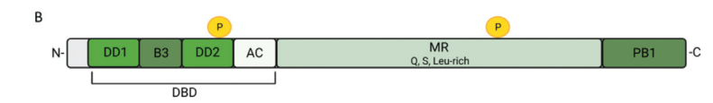

## Question

# Gene Research for Functional Annotation

## ⚠️ CRITICAL: Gene/Protein Identification Context

**BEFORE YOU BEGIN RESEARCH:** You MUST verify you are researching the CORRECT gene/protein. Gene symbols can be ambiguous, especially for less well-characterized genes from non-model organisms.

### Target Gene/Protein Identity (from UniProt):
- **UniProt Accession:** P93024
- **Protein Description:** RecName: Full=Auxin response factor 5; AltName: Full=Auxin-responsive protein IAA24; AltName: Full=Transcription factor MONOPTEROS;
- **Gene Information:** Name=ARF5; Synonyms=IAA24, MP; OrderedLocusNames=At1g19850; ORFNames=F6F9.10;
- **Organism (full):** Arabidopsis thaliana (Mouse-ear cress).
- **Protein Family:** Belongs to the ARF family. .
- **Key Domains:** ARF_dom. (IPR010525); ARF_plant. (IPR044835); AUX/IAA_dom. (IPR033389); B3_DNA-bd. (IPR003340); DNA-bd_pseudobarrel_sf. (IPR015300)

### MANDATORY VERIFICATION STEPS:

1. **Check if the gene symbol "ARF5" matches the protein description above**
2. **Verify the organism is correct:** Arabidopsis thaliana (Mouse-ear cress).
3. **Check if protein family/domains align with what you find in literature**
4. **If you find literature for a DIFFERENT gene with the same or similar symbol, STOP**

### If Gene Symbol is Ambiguous or You Cannot Find Relevant Literature:

**DO NOT PROCEED WITH RESEARCH ON A DIFFERENT GENE.** Instead:
- State clearly: "The gene symbol 'ARF5' is ambiguous or literature is limited for this specific protein"
- Explain what you found (e.g., "Found extensive literature on a different gene with the same symbol in a different organism")
- Describe the protein based ONLY on the UniProt information provided above
- Suggest that the protein function can be inferred from domain/family information

### Research Target:

Please provide a comprehensive research report on the gene **ARF5** (gene ID: ARF5, UniProt: P93024) in ARATH.

The research report should be a detailed narrative explaining the function, biological processes, and localization of the gene product. Citations should be given for all claims.

You should prioritize authoritative reviews and primary scientific literature when conducting research. You can supplement
this with annotations you find in gene/protein databases, but these can be outdated or inaccurate.

We are specifically interested in the primary function of the gene - for enzymes, what reaction is catalyzed, and what is the substrate specificity? For transporters, what is the substrate? For structural proteins or adapters, what is the broader structural role? For signaling molecules, what is the role in the pathway.

We are interested in where in or outside the cell the gene product carries out its function.

We are also interested in the signaling or biochemical pathways in which the gene functions. We are less interested in broad pleiotropic effects, except where these elucidate the precise role.

Include evidence where possible. We are interested in both experimental evidence as well as inference from structure, evolution, or bioinformatic analysis. Precise studies should be prioritized over high-throughput, where available.

## Output

Question: You are an expert researcher providing comprehensive, well-cited information.

Provide detailed information focusing on:
1. Key concepts and definitions with current understanding
2. Recent developments and latest research (prioritize 2023-2024 sources)
3. Current applications and real-world implementations
4. Expert opinions and analysis from authoritative sources
5. Relevant statistics and data from recent studies

Format as a comprehensive research report with proper citations. Include URLs and publication dates where available.
Always prioritize recent, authoritative sources and provide specific citations for all major claims.

# Gene Research for Functional Annotation

## ⚠️ CRITICAL: Gene/Protein Identification Context

**BEFORE YOU BEGIN RESEARCH:** You MUST verify you are researching the CORRECT gene/protein. Gene symbols can be ambiguous, especially for less well-characterized genes from non-model organisms.

### Target Gene/Protein Identity (from UniProt):
- **UniProt Accession:** P93024
- **Protein Description:** RecName: Full=Auxin response factor 5; AltName: Full=Auxin-responsive protein IAA24; AltName: Full=Transcription factor MONOPTEROS;
- **Gene Information:** Name=ARF5; Synonyms=IAA24, MP; OrderedLocusNames=At1g19850; ORFNames=F6F9.10;
- **Organism (full):** Arabidopsis thaliana (Mouse-ear cress).
- **Protein Family:** Belongs to the ARF family. .
- **Key Domains:** ARF_dom. (IPR010525); ARF_plant. (IPR044835); AUX/IAA_dom. (IPR033389); B3_DNA-bd. (IPR003340); DNA-bd_pseudobarrel_sf. (IPR015300)

### MANDATORY VERIFICATION STEPS:

1. **Check if the gene symbol "ARF5" matches the protein description above**
2. **Verify the organism is correct:** Arabidopsis thaliana (Mouse-ear cress).
3. **Check if protein family/domains align with what you find in literature**
4. **If you find literature for a DIFFERENT gene with the same or similar symbol, STOP**

### If Gene Symbol is Ambiguous or You Cannot Find Relevant Literature:

**DO NOT PROCEED WITH RESEARCH ON A DIFFERENT GENE.** Instead:
- State clearly: "The gene symbol 'ARF5' is ambiguous or literature is limited for this specific protein"
- Explain what you found (e.g., "Found extensive literature on a different gene with the same symbol in a different organism")
- Describe the protein based ONLY on the UniProt information provided above
- Suggest that the protein function can be inferred from domain/family information

### Research Target:

Please provide a comprehensive research report on the gene **ARF5** (gene ID: ARF5, UniProt: P93024) in ARATH.

The research report should be a detailed narrative explaining the function, biological processes, and localization of the gene product. Citations should be given for all claims.

You should prioritize authoritative reviews and primary scientific literature when conducting research. You can supplement
this with annotations you find in gene/protein databases, but these can be outdated or inaccurate.

We are specifically interested in the primary function of the gene - for enzymes, what reaction is catalyzed, and what is the substrate specificity? For transporters, what is the substrate? For structural proteins or adapters, what is the broader structural role? For signaling molecules, what is the role in the pathway.

We are interested in where in or outside the cell the gene product carries out its function.

We are also interested in the signaling or biochemical pathways in which the gene functions. We are less interested in broad pleiotropic effects, except where these elucidate the precise role.

Include evidence where possible. We are interested in both experimental evidence as well as inference from structure, evolution, or bioinformatic analysis. Precise studies should be prioritized over high-throughput, where available.

# Comprehensive research report: **ARF5 / MONOPTEROS (MP)** functional annotation (UniProt **P93024**, *Arabidopsis thaliana*)

## Executive summary
Auxin response factor 5 (**ARF5**), best known as **MONOPTEROS (MP)**, is an A-class **nuclear transcription factor** that acts as a central output node of the **canonical/nuclear auxin signaling pathway**. MP/ARF5 binds specific **auxin response elements (AuxREs)** in DNA and is **repressed by Aux/IAA proteins** (notably **BDL/IAA12**) at low auxin. Increased auxin promotes **TIR1/AFB-mediated Aux/IAA degradation**, releasing MP/ARF5 to activate transcription, often coupled to **chromatin remodeling** (SWI/SNF remodelers **BRM/SYD**) and **histone acetylation** activities recruited via transcriptional cofactors. MP/ARF5 is essential for **embryogenesis and vascular patterning** and is widely used as a **module for synthetic auxin-responsive gene circuits** and inducible genetic tools in plant research. (wojcikowska2023gameofthrones pages 6-7, wojcikowska2023gameofthrones pages 4-5, rienstra2023tobindor pages 1-3)

## 1) Key concepts, definitions, and current understanding

### 1.1 Verified gene/protein identity and disambiguation
The target protein is **Arabidopsis thaliana ARF5** (gene **At1g19850**), synonymous with **MONOPTEROS (MP)**, a canonical member of the **AUXIN RESPONSE FACTOR (ARF)** family. Recent authoritative reviews explicitly use the combined designation **MP/ARF5 (MONOPTEROS/AUXIN RESPONSE FACTOR 5)** and describe its canonical ARF architecture. (wojcikowska2023gameofthrones pages 6-7, wojcikowska2023gameofthrones pages 1-2)

### 1.2 What ARF5/MP is (core definition)
ARF5/MP is a **sequence-specific DNA-binding transcription factor** functioning in the **nucleus** as a terminal effector of the **nuclear auxin pathway (NAP)**, translating auxin levels into transcriptional outputs at AuxRE-containing cis-regulatory elements. (wojcikowska2023gameofthrones pages 1-2, rienstra2023tobindor pages 1-3)

### 1.3 Domain architecture and biochemical mechanism
Canonical ARFs—including MP/ARF5—are modular proteins with three major regions:

* **N-terminal DNA-binding domain (DBD)** containing a **B3** subdomain that recognizes AuxREs, plus additional DBD substructures that enable dimerization and cooperative binding (e.g., dimerization domains and an ancillary subdomain). For MP/ARF5, homodimerization is described as required for promoter binding and in vivo specificity. (wojcikowska2023gameofthrones pages 4-4, wojcikowska2023gameofthrones pages 3-4)
* **Middle region (MR)** that contributes to transcriptional activation vs repression; MP/ARF5 MR is reported as enriched in **Q/S/L residues**, consistent with activator-class ARFs. (wojcikowska2023gameofthrones pages 3-4)
* **C-terminal PB1 domain** (Phox/Bem1) mediating directional **protein–protein interactions**, including ARF–ARF oligomerization and interaction with Aux/IAA repressors. An MP splice isoform (**MP11ir**) lacks PB1, a key mechanistic variant relevant to auxin sensitivity. (wojcikowska2023gameofthrones pages 3-4, wojcikowska2023gameofthrones pages 4-4)

**Visual evidence.** A figure panel summarizing MP domain architecture and a figure panel summarizing the nuclear auxin signaling module (MP repression by BDL/IAA12 and derepression via TIR1/AFB) were retrieved from an authoritative review. (wojcikowska2023gameofthrones media 28ff2f5c, wojcikowska2023gameofthrones media bee4ef37)

### 1.4 Nuclear auxin pathway (NAP) module: MP/ARF5–Aux/IAA–TIR1/AFB
A key organizing concept is that **Aux/IAA proteins** are transcriptional co-repressors that bind ARFs (via PB1–PB1 interactions), and auxin promotes **TIR1/AFB–Aux/IAA** association, leading to Aux/IAA ubiquitination and proteasomal degradation, thereby releasing ARFs to regulate transcription. (rienstra2023tobindor pages 1-3)

For MP specifically, **BDL/IAA12** represses MP/ARF5 at low auxin by recruiting co-repressors **TOPLESS/TPL (and TPRs)** and **HDA19**, maintaining a repressive chromatin state; increased auxin triggers **TIR1–BDL/IAA12** co-receptor-mediated degradation of BDL/IAA12 and activation of MP-dependent transcription. (wojcikowska2023gameofthrones pages 6-7, wojcikowska2023gameofthrones pages 4-5)

### 1.5 DNA-binding specificity: AuxRE grammar
ARF binding is often described around the **TGTCNN** AuxRE core motif, with high affinity reported for **TGTCGG** in multiple sources. For MP/ARF5 specifically, preference for **5ʹ-TGTCGG-3ʹ** over the canonical **5ʹ-TGTCTC-3ʹ** is reported. (wojcikowska2023gameofthrones pages 4-4, rienstra2023tobindor pages 1-3)

A critical refinement is that ARFs frequently bind **paired** AuxREs with orientation/spacing constraints (IR/DR/ER elements); MP/ARF5 shows strong affinity for specific spacings (e.g., IR7–8 and IR18; DR4–5 and others), highlighting that **cis-regulatory “grammar”** contributes to MP target selection. (wojcikowska2023gameofthrones pages 4-5)

### 1.6 Chromatin coupling and cofactors
MP/ARF5 transcriptional activation is coupled to chromatin regulation, including physical association with chromatin-remodeling complexes containing **BRM** and **SYD** and **histone acetylases**. (wojcikowska2023gameofthrones pages 6-7)

Additionally, MP can cooperate with other transcription factors such as **bZIP11**, which can recruit the **SAGA acetyltransferase complex** to acetylate nearby histones and open chromatin for transcription. (wojcikowska2023gameofthrones pages 5-6)

## 2) Recent developments and latest research (prioritizing 2023–2024)

### 2.1 2023: Synthesis of “30 years of MONOPTEROS research” and open problems
A 2023 Journal of Experimental Botany review consolidates MP/ARF5 research, while emphasizing key unknowns that represent expert consensus on current limitations: incomplete knowledge of MP complexes, direct targets, and upstream/epigenetic regulators, and limited information on post-translational modifications and their functional consequences. (wojcikowska2023gameofthrones pages 1-2)

### 2.2 2024: Evolutionary/structural origin of ARFs links ARF DBD to chromatin-regulator folds
A high-impact 2024 Nature Communications study reconstructs ARF evolutionary history and reports that the ARF DNA-binding fold shares origin with a conserved **eukaryotic chromatin regulator**, proposing that regions of the ARF DBD (DD–AD) likely originated from a PHIP-related crypto-Tudor domain. This reframes ARF structure/function in a broader chromatin-centric evolutionary context and helps rationalize how diversification of ARF domains could underlie functional divergence among ARF classes. (hernandezgarcia2024evolutionaryoriginsand pages 1-2)

### 2.3 2024: Composite AuxREs and partner TFs as a mechanism for specificity
A 2024 bioRxiv preprint systematically mines Arabidopsis promoters and proposes that **composite cis-elements** (AuxRE plus a coupling motif) are enriched in auxin-responsive genes. The work supports a mechanism in which **ARF–non-ARF TF complexes** recognize composite motifs, expanding the classic view of AuxRE-only control. The preprint also notes examples where **GBF factors** bind ARF5 to modulate vascular gene expression, reinforcing the idea that MP outputs depend on combinatorial TF partnerships. (novikova2024mechanismofauxindependent pages 1-4)

### 2.4 2024: Network-level reconstructions emphasize indirect regulatory cascades
A 2024 study in *Plants* compiles ARF binding datasets (including DAP-seq for ARF5/ARF2 and ChIP-seq for multiple ARFs) and reconstructs an auxin-induced transcription factor regulatory network. A key quantitative inference is that primary TF targets account for only **~20–30%** of auxin-responsive DEGs, implying that MP/ARF5 and other ARFs initiate broad gene-expression cascades via downstream TFs (e.g., TMO5/TMO6, DOF5.8, LBD16/29). (omelyanchuk2024computationalreconstructionof pages 1-2)

## 3) Current applications and real-world implementations

### 3.1 Synthetic biology: ARF5/MP as a programmable auxin-response module (yeast reconstitution)
A 2023 PNAS study transplanted an ARF5/MP-centered auxin feedback circuit into *Saccharomyces cerevisiae*. The authors built a synthetic auxin-responsive promoter (**psynAUX**) based on MP binding sites and used auxin-dependent degradation of an Aux/IAA repressor (BDL/IAA12 variants) to tune dynamics. Reported behaviors include **nearly 10-fold MP-dependent reporter induction** with low leak and pulse-processing behaviors including a **“once per three pulses”** response under certain dynamic contexts. (avdovic2023dynamiccontextdependentregulation pages 1-2)

In microfluidic pulsing experiments, coordinated gene-expression contexts yielded **~6-hour periods** for **2-hour auxin pulses**, with population-level replication (e.g., **n = 16 populations** each with >1,000 cells; and broader distributions in other contexts, **n = 26**, with periods extending to **10–14 hours**). (avdovic2023dynamiccontextdependentregulation pages 2-3)

### 3.2 Plant research toolkits: inducible constructs, reporters, and engineered MP variants
A comprehensive MP/ARF5 review catalogs extensive toolsets used in planta, including MP truncations (e.g., PB1-deleted variants), glucocorticoid receptor fusions (GR), β-estradiol/XVE-inducible systems, and reporter-coupled constructs in Arabidopsis backgrounds (e.g., DR5rev::GFP). These are widely used to dissect MP function and to implement conditional auxin-response behaviors in developmental experiments. (wojcikowska2023gameofthrones pages 7-7)

### 3.3 Crop and translational contexts (orthologs and ARF modules)
Recent reviews summarize crop-relevant ARF interventions, emphasizing that ARF/IAA modules are modular “levers” for traits including architecture and stress tolerance. For example, ARF overexpression in rice can influence leaf angle via direct target activation, and ARF/Aux-IAA modules influence nutrient-stress responses (e.g., low-phosphate tolerance via IAA14–ARF7/19 module). While these are not MP/ARF5 itself, they motivate translational use of MP-like activator ARFs and conserved auxin transcriptional modules. (liu2024enigmaticroleof pages 11-12)

A 2023 MP/ARF5-focused review also highlights specific crop-facing outcomes in ARF5 ortholog contexts, including an ARF5 ortholog (MdARF5) that activates ethylene biosynthetic genes to initiate apple fruit ripening, and a sweet potato ortholog (IbARF5) that—when expressed in Arabidopsis—enhanced carotenoid biosynthesis and salt/drought tolerance, illustrating practical trait modulation using ARF5-class regulators. (wojcikowska2023gameofthrones pages 18-18, wojcikowska2023gameofthrones pages 15-16)

## 4) Expert opinions and analysis from authoritative sources

### 4.1 Consensus model with acknowledged gaps
The 2023 JEB MP/ARF5 review provides an expert synthesis and explicitly frames remaining “big questions”: the full composition of MP complexes, the complete set of direct target genes, and upstream epigenetic regulators remain incompletely defined; post-translational modification knowledge is described as marginal and consequences are poorly understood. This signals that while the core NAP mechanism is robust, MP-specific regulatory layers are still actively developing. (wojcikowska2023gameofthrones pages 1-2)

### 4.2 Target selection is multi-layered (DNA grammar + protein interaction + abundance)
A 2023 JEB review focused on ARF target selection emphasizes that DNA motif presence alone is insufficient: ARF domain architecture (DBD dimerization, PB1-mediated oligomerization), motif spacing/orientation, and regulation of ARF levels collectively determine which genes become auxin responsive. This perspective supports current consensus that MP output is an emergent property of cis-element grammar and protein-network context. (rienstra2023tobindor pages 1-3)

## 5) Relevant statistics and recent data points

### 5.1 MP/AuxRE scale and direct target counts
Quantitative summary reported in a 2023 MP/ARF5 review:

* AuxRE motif presence in promoters of **11,092 genes**. (wojcikowska2023gameofthrones pages 4-5)
* MP/ARF5 directly regulates **~4,585** targets in an auxin-dependent manner. (wojcikowska2023gameofthrones pages 4-5)

### 5.2 MP genomic binding versus PB1-deleted MPΔ (illustrating PB1 as a specificity gate)
Two quantitative comparisons reported:

* One dataset: MP binds **258** promoters, MPΔ binds **3,405**, with **922** promoters shared. (wojcikowska2023gameofthrones pages 4-5)
* ChIP-seq summary: MP bound **339** genes (with **302/339** auxin-insensitive interactions), whereas MPΔ bound **3,404** genes in +IAA and **3,970** genes in −IAA, with **3,047** MPΔ interactions auxin-insensitive. (wojcikowska2023gameofthrones pages 5-6)

These results support a model where PB1 contributes to MP’s auxin responsiveness and limits promiscuous binding, while PB1 deletion yields broader, largely auxin-insensitive occupancy. (wojcikowska2023gameofthrones pages 5-6)

### 5.3 Synthetic circuit performance statistics
In yeast reconstitution:

* **Nearly 10-fold** MP-dependent reporter induction with negligible leakage. (avdovic2023dynamiccontextdependentregulation pages 1-2)
* Pulse-processing behavior: a reporter response **once per three** auxin pulse cycles (in one dynamic regime). (avdovic2023dynamiccontextdependentregulation pages 1-2)
* Microfluidic experiments: **6-hour periods** for **2-hour** auxin pulses; example population sample sizes include **n = 16 populations** (>1,000 cells each) and **n = 26** in another regime, with periods extending to **10–14 hours**. (avdovic2023dynamiccontextdependentregulation pages 2-3)

## Consolidated evidence table

| Category | Key points | Evidence |
|---|---|---|
| Identity/domains | ARF5 in *Arabidopsis thaliana* is MONOPTEROS (MP), a canonical A-class ARF transcription factor. It has an N-terminal DNA-binding domain with B3 and dimerization subdomains, a Q/S/L-rich middle region consistent with activator function, and a C-terminal PB1 domain for ARF–ARF and ARF–Aux/IAA interactions; an alternative isoform (MP11ir) lacks PB1. It acts in the nucleus as part of the nuclear auxin pathway. (wojcikowska2023gameofthrones pages 3-4, wojcikowska2023gameofthrones pages 4-4, rienstra2023tobindor pages 1-3) | Wójcikowska et al. 2023, J Exp Bot, https://doi.org/10.1093/jxb/erad272; Rienstra et al. 2023, J Exp Bot, https://doi.org/10.1093/jxb/erad259 |
| Core mechanism | At low auxin, BDL/IAA12 binds MP/ARF5 and recruits TPL/TPR co-repressors and HDA19 to maintain repression. At high auxin, auxin promotes TIR1/AFB–Aux/IAA interaction, causing Aux/IAA ubiquitination and proteasomal degradation, which derepresses MP/ARF5. Activated MP/ARF5 then associates with chromatin remodelers and histone acetylation machinery to induce transcription. (wojcikowska2023gameofthrones pages 6-7, wojcikowska2023gameofthrones pages 4-5, rienstra2023tobindor pages 1-3) | Wójcikowska et al. 2023, J Exp Bot, https://doi.org/10.1093/jxb/erad272; Rienstra et al. 2023, J Exp Bot, https://doi.org/10.1093/jxb/erad259 |
| DNA-binding specifics | ARFs recognize AuxRE core motifs of the form TGTCNN; for ARF5-family binding, TGTCGG is reported as a preferred high-affinity motif over canonical TGTCTC. Binding is promoted by dimerization and by spacing/orientation of paired motifs, including inverted, direct, and everted repeats; DBD-mediated cooperative binding to IR7 is a key structural paradigm. (wojcikowska2023gameofthrones pages 4-4, rienstra2023tobindor pages 1-3, novikova2024mechanismofauxindependent pages 1-4) | Wójcikowska et al. 2023, J Exp Bot, https://doi.org/10.1093/jxb/erad272; Rienstra et al. 2023, J Exp Bot, https://doi.org/10.1093/jxb/erad259; Novikova et al. 2024, bioRxiv, https://doi.org/10.1101/2024.07.16.603724 |
| Key cofactors/chromatin | MP/ARF5 function is coupled to chromatin regulation. Reported cofactors include BRM and SYD SWI/SNF remodelers, histone acetylases, and bZIP11, which can recruit the SAGA acetyltransferase complex to nearby chromatin. These interactions support chromatin opening and transcriptional activation at auxin-responsive loci. (wojcikowska2023gameofthrones pages 5-6, wojcikowska2023gameofthrones pages 6-7, wojcikowska2023gameofthrones pages 4-5, wojcikowska2023gameofthrones pages 12-13) | Wójcikowska et al. 2023, J Exp Bot, https://doi.org/10.1093/jxb/erad272 |
| Biological roles | MP/ARF5 is a central developmental regulator controlling embryogenesis, vascularization, leaf/provascular patterning, meristem formation, inflorescence development, and primary root processes. Direct targets and pathways mentioned in the evidence include TMO5/TMO6, DOF5.8, LBD genes, and miR390, consistent with roles in tissue patterning and auxin-mediated developmental gene networks. (wojcikowska2023gameofthrones pages 12-13, wojcikowska2023gameofthrones pages 15-16, omelyanchuk2024computationalreconstructionof pages 1-2, liu2024enigmaticroleof pages 7-8) | Wójcikowska et al. 2023, J Exp Bot, https://doi.org/10.1093/jxb/erad272; Omelyanchuk et al. 2024, Plants, https://doi.org/10.3390/plants13141905; Liu et al. 2024, Front Plant Sci, https://doi.org/10.3389/fpls.2024.1398818 |
| Recent 2024 developments | 2024 work extended ARF understanding beyond classical genetics: ARF domain evolution was traced to a chromatin regulator-related fold, supporting deeper structural links between ARFs and chromatin-associated protein architecture. New promoter analyses proposed composite AuxRE-based cis-elements recognized by ARF plus partner TFs, including cases involving ARF5-associated GBF factors. Network reconstruction studies also refined the distinction between primary ARF targets and downstream transcriptional subnetworks. (hernandezgarcia2024evolutionaryoriginsand pages 1-2, novikova2024mechanismofauxindependent pages 1-4, omelyanchuk2024computationalreconstructionof pages 1-2) | Hernández-García et al. 2024, Nat Commun, https://doi.org/10.1038/s41467-024-55278-8; Novikova et al. 2024, bioRxiv, https://doi.org/10.1101/2024.07.16.603724; Omelyanchuk et al. 2024, Plants, https://doi.org/10.3390/plants13141905 |
| Applications/implementations | ARF5/MP has been reconstituted in synthetic auxin circuits in yeast with IAA12/BDL and TIR1, enabling controlled reporter outputs under microfluidic auxin pulses. ARF5-derived engineered variants lacking PB1 show altered, more auxin-insensitive DNA binding, highlighting a tunable design lever for synthetic biology. ARF modules are also discussed as engineering targets for crop traits such as architecture, nutrient responses, and regeneration. (avdovic2023dynamiccontextdependentregulation pages 1-2, wojcikowska2023gameofthrones pages 5-6, wojcikowska2023gameofthrones pages 7-7, liu2024enigmaticroleof pages 11-12, wojcikowska2023gameofthrones pages 18-18) | Avdovic et al. 2023, PNAS, https://doi.org/10.1073/pnas.2309007120; Wójcikowska et al. 2023, J Exp Bot, https://doi.org/10.1093/jxb/erad272; Liu et al. 2024, Front Plant Sci, https://doi.org/10.3389/fpls.2024.1398818 |
| Quantitative statistics | Reported quantitative details include: AuxREs in promoters of 11,092 genes; ~4,585 direct MP/ARF5 targets; wild-type MP/ARF5 bound 258 promoters in one dataset versus PB1-deleted MPΔ binding 3,405; another summary cites 339 MP-bound targets versus 3,404 with MPΔ in the presence of IAA (3,970 without IAA), with 3,047 MPΔ interactions auxin-insensitive. In synthetic yeast circuits, MP-dependent induction was nearly 10-fold, and coordinated oscillatory responses were measured across 16 populations with ~6 h periods under 2 h auxin pulses. (wojcikowska2023gameofthrones pages 4-5, wojcikowska2023gameofthrones pages 5-6, avdovic2023dynamiccontextdependentregulation pages 1-2, avdovic2023dynamiccontextdependentregulation pages 2-3) | Wójcikowska et al. 2023, J Exp Bot, https://doi.org/10.1093/jxb/erad272; Avdovic et al. 2023, PNAS, https://doi.org/10.1073/pnas.2309007120 |

*Table: This table compacts the main functional annotation points for Arabidopsis ARF5/MONOPTEROS (UniProt P93024), including identity, mechanism, DNA binding, chromatin partners, biological roles, recent 2024 advances, applications, and quantitative findings. It is useful as a citation-backed summary for downstream narrative reporting.*

## Key takeaways for functional annotation (summary)
* **Primary function:** MP/ARF5 is a **nuclear auxin-dependent transcriptional activator** that binds AuxREs and drives developmental gene programs. (wojcikowska2023gameofthrones pages 1-2, rienstra2023tobindor pages 1-3)
* **Mechanism:** MP/ARF5 is repressed by **BDL/IAA12** with co-repressors (TPL/TPR, HDA19) at low auxin, and derepressed upon **TIR1/AFB-mediated Aux/IAA degradation** at high auxin, coupled to chromatin remodeling (BRM/SYD) and histone acetylation mechanisms. (wojcikowska2023gameofthrones pages 6-7, wojcikowska2023gameofthrones pages 4-5)
* **Localization:** Functional action is in the **nucleus** (DNA binding, transcriptional regulation). (wojcikowska2023gameofthrones pages 1-2, rienstra2023tobindor pages 1-3)
* **Recent (2024) advances:** deeper **evolution/structure** of ARF DBD in chromatin-regulator context; emerging **composite AuxRE** grammar; network reconstructions quantifying the extent of indirect regulation. (hernandezgarcia2024evolutionaryoriginsand pages 1-2, novikova2024mechanismofauxindependent pages 1-4, omelyanchuk2024computationalreconstructionof pages 1-2)
* **Applications:** MP module is widely used in **inducible genetic systems** and **synthetic gene circuits**, including reconstituted auxin feedback networks in yeast and engineered MP variants (e.g., PB1 deletion) as tunable transcriptional regulators. (wojcikowska2023gameofthrones pages 7-7, avdovic2023dynamiccontextdependentregulation pages 1-2, avdovic2023dynamiccontextdependentregulation pages 2-3)

## Source list (URLs and publication dates)
* Wójcikowska B, Belaidi S, Robert HS. **“Game of thrones among AUXIN RESPONSE FACTORs—over 30 years of MONOPTEROS research.”** *Journal of Experimental Botany* (Aug 2023). https://doi.org/10.1093/jxb/erad272 (wojcikowska2023gameofthrones pages 1-2)
* Rienstra J, Hernández-García J, Weijers D. **“To bind or not to bind: how AUXIN RESPONSE FACTORs select their target genes.”** *Journal of Experimental Botany* (Jul 2023). https://doi.org/10.1093/jxb/erad259 (rienstra2023tobindor pages 1-3)
* Avdovic M, Garcia-Navarrete M, Ruiz-Sanchis D, Wabnik K. **“Dynamic context-dependent regulation of auxin feedback signaling in synthetic gene circuits.”** *PNAS* (Oct 2023). https://doi.org/10.1073/pnas.2309007120 (avdovic2023dynamiccontextdependentregulation pages 1-2)
* Liu L, Yahaya BS, Li J, Wu F. **“Enigmatic role of auxin response factors in plant growth and stress tolerance.”** *Frontiers in Plant Science* (Jun 2024). https://doi.org/10.3389/fpls.2024.1398818 (liu2024enigmaticroleof pages 11-12)
* Hernández-García J et al. **“Evolutionary origins and functional diversification of Auxin Response Factors.”** *Nature Communications* (Dec 2024). https://doi.org/10.1038/s41467-024-55278-8 (hernandezgarcia2024evolutionaryoriginsand pages 1-2)
* Novikova DD et al. **“Mechanism of auxin-dependent gene regulation through composite auxin response elements.”** *bioRxiv* (Jul 2024). https://doi.org/10.1101/2024.07.16.603724 (novikova2024mechanismofauxindependent pages 1-4)
* Omelyanchuk NA et al. **“Computational Reconstruction of the Transcription Factor Regulatory Network Induced by Auxin in Arabidopsis thaliana L.”** *Plants* (Jul 2024). https://doi.org/10.3390/plants13141905 (omelyanchuk2024computationalreconstructionof pages 1-2)

References

1. (wojcikowska2023gameofthrones pages 6-7): Barbara Wójcikowska, Samia Belaidi, and Hélène S Robert. Game of thrones among auxin response factors—over 30 years of monopteros research. Journal of Experimental Botany, 74:6904-6921, Aug 2023. URL: https://doi.org/10.1093/jxb/erad272, doi:10.1093/jxb/erad272. This article has 21 citations and is from a domain leading peer-reviewed journal.

2. (wojcikowska2023gameofthrones pages 4-5): Barbara Wójcikowska, Samia Belaidi, and Hélène S Robert. Game of thrones among auxin response factors—over 30 years of monopteros research. Journal of Experimental Botany, 74:6904-6921, Aug 2023. URL: https://doi.org/10.1093/jxb/erad272, doi:10.1093/jxb/erad272. This article has 21 citations and is from a domain leading peer-reviewed journal.

3. (rienstra2023tobindor pages 1-3): Juriaan Rienstra, Jorge Hernández-García, and Dolf Weijers. To bind or not to bind: how auxin response factors select their target genes. Journal of Experimental Botany, 74:6922-6932, Jul 2023. URL: https://doi.org/10.1093/jxb/erad259, doi:10.1093/jxb/erad259. This article has 39 citations and is from a domain leading peer-reviewed journal.

4. (wojcikowska2023gameofthrones pages 1-2): Barbara Wójcikowska, Samia Belaidi, and Hélène S Robert. Game of thrones among auxin response factors—over 30 years of monopteros research. Journal of Experimental Botany, 74:6904-6921, Aug 2023. URL: https://doi.org/10.1093/jxb/erad272, doi:10.1093/jxb/erad272. This article has 21 citations and is from a domain leading peer-reviewed journal.

5. (wojcikowska2023gameofthrones pages 4-4): Barbara Wójcikowska, Samia Belaidi, and Hélène S Robert. Game of thrones among auxin response factors—over 30 years of monopteros research. Journal of Experimental Botany, 74:6904-6921, Aug 2023. URL: https://doi.org/10.1093/jxb/erad272, doi:10.1093/jxb/erad272. This article has 21 citations and is from a domain leading peer-reviewed journal.

6. (wojcikowska2023gameofthrones pages 3-4): Barbara Wójcikowska, Samia Belaidi, and Hélène S Robert. Game of thrones among auxin response factors—over 30 years of monopteros research. Journal of Experimental Botany, 74:6904-6921, Aug 2023. URL: https://doi.org/10.1093/jxb/erad272, doi:10.1093/jxb/erad272. This article has 21 citations and is from a domain leading peer-reviewed journal.

7. (wojcikowska2023gameofthrones media 28ff2f5c): Barbara Wójcikowska, Samia Belaidi, and Hélène S Robert. Game of thrones among auxin response factors—over 30 years of monopteros research. Journal of Experimental Botany, 74:6904-6921, Aug 2023. URL: https://doi.org/10.1093/jxb/erad272, doi:10.1093/jxb/erad272. This article has 21 citations and is from a domain leading peer-reviewed journal.

8. (wojcikowska2023gameofthrones media bee4ef37): Barbara Wójcikowska, Samia Belaidi, and Hélène S Robert. Game of thrones among auxin response factors—over 30 years of monopteros research. Journal of Experimental Botany, 74:6904-6921, Aug 2023. URL: https://doi.org/10.1093/jxb/erad272, doi:10.1093/jxb/erad272. This article has 21 citations and is from a domain leading peer-reviewed journal.

9. (wojcikowska2023gameofthrones pages 5-6): Barbara Wójcikowska, Samia Belaidi, and Hélène S Robert. Game of thrones among auxin response factors—over 30 years of monopteros research. Journal of Experimental Botany, 74:6904-6921, Aug 2023. URL: https://doi.org/10.1093/jxb/erad272, doi:10.1093/jxb/erad272. This article has 21 citations and is from a domain leading peer-reviewed journal.

10. (hernandezgarcia2024evolutionaryoriginsand pages 1-2): Jorge Hernández-García, Vanessa Polet Carrillo-Carrasco, Juriaan Rienstra, Keita Tanaka, Martijn de Roij, Melissa Dipp-Álvarez, Alejandra Freire-Ríos, Isidro Crespo, Roeland Boer, Willy A. M. van den Berg, Simon Lindhoud, and Dolf Weijers. Evolutionary origins and functional diversification of auxin response factors. Nature Communications, Dec 2024. URL: https://doi.org/10.1038/s41467-024-55278-8, doi:10.1038/s41467-024-55278-8. This article has 37 citations and is from a highest quality peer-reviewed journal.

11. (novikova2024mechanismofauxindependent pages 1-4): Daria D. Novikova, Nadya Omelyanchuk, Anastasiia Korosteleva, Catherine Albrecht, Viktoriya V. Lavrekha, Dolf Weijers, and Victoria Mironova. Mechanism of auxin-dependent gene regulation through composite auxin response elements. bioRxiv, Jul 2024. URL: https://doi.org/10.1101/2024.07.16.603724, doi:10.1101/2024.07.16.603724. This article has 5 citations.

12. (omelyanchuk2024computationalreconstructionof pages 1-2): Nadya A. Omelyanchuk, Viktoriya V. Lavrekha, Anton G. Bogomolov, Vladislav A. Dolgikh, Aleksandra D. Sidorenko, and Elena V. Zemlyanskaya. Computational reconstruction of the transcription factor regulatory network induced by auxin in arabidopsis thaliana l. Jul 2024. URL: https://doi.org/10.3390/plants13141905, doi:10.3390/plants13141905. This article has 4 citations.

13. (avdovic2023dynamiccontextdependentregulation pages 1-2): Merisa Avdovic, Mario Garcia-Navarrete, Diego Ruiz-Sanchis, and Krzysztof Wabnik. Dynamic context-dependent regulation of auxin feedback signaling in synthetic gene circuits. Proceedings of the National Academy of Sciences of the United States of America, Oct 2023. URL: https://doi.org/10.1073/pnas.2309007120, doi:10.1073/pnas.2309007120. This article has 4 citations and is from a highest quality peer-reviewed journal.

14. (avdovic2023dynamiccontextdependentregulation pages 2-3): Merisa Avdovic, Mario Garcia-Navarrete, Diego Ruiz-Sanchis, and Krzysztof Wabnik. Dynamic context-dependent regulation of auxin feedback signaling in synthetic gene circuits. Proceedings of the National Academy of Sciences of the United States of America, Oct 2023. URL: https://doi.org/10.1073/pnas.2309007120, doi:10.1073/pnas.2309007120. This article has 4 citations and is from a highest quality peer-reviewed journal.

15. (wojcikowska2023gameofthrones pages 7-7): Barbara Wójcikowska, Samia Belaidi, and Hélène S Robert. Game of thrones among auxin response factors—over 30 years of monopteros research. Journal of Experimental Botany, 74:6904-6921, Aug 2023. URL: https://doi.org/10.1093/jxb/erad272, doi:10.1093/jxb/erad272. This article has 21 citations and is from a domain leading peer-reviewed journal.

16. (liu2024enigmaticroleof pages 11-12): Ling Liu, Baba Salifu Yahaya, Jing Li, and Fengkai Wu. Enigmatic role of auxin response factors in plant growth and stress tolerance. Frontiers in Plant Science, Jun 2024. URL: https://doi.org/10.3389/fpls.2024.1398818, doi:10.3389/fpls.2024.1398818. This article has 61 citations.

17. (wojcikowska2023gameofthrones pages 18-18): Barbara Wójcikowska, Samia Belaidi, and Hélène S Robert. Game of thrones among auxin response factors—over 30 years of monopteros research. Journal of Experimental Botany, 74:6904-6921, Aug 2023. URL: https://doi.org/10.1093/jxb/erad272, doi:10.1093/jxb/erad272. This article has 21 citations and is from a domain leading peer-reviewed journal.

18. (wojcikowska2023gameofthrones pages 15-16): Barbara Wójcikowska, Samia Belaidi, and Hélène S Robert. Game of thrones among auxin response factors—over 30 years of monopteros research. Journal of Experimental Botany, 74:6904-6921, Aug 2023. URL: https://doi.org/10.1093/jxb/erad272, doi:10.1093/jxb/erad272. This article has 21 citations and is from a domain leading peer-reviewed journal.

19. (wojcikowska2023gameofthrones pages 12-13): Barbara Wójcikowska, Samia Belaidi, and Hélène S Robert. Game of thrones among auxin response factors—over 30 years of monopteros research. Journal of Experimental Botany, 74:6904-6921, Aug 2023. URL: https://doi.org/10.1093/jxb/erad272, doi:10.1093/jxb/erad272. This article has 21 citations and is from a domain leading peer-reviewed journal.

20. (liu2024enigmaticroleof pages 7-8): Ling Liu, Baba Salifu Yahaya, Jing Li, and Fengkai Wu. Enigmatic role of auxin response factors in plant growth and stress tolerance. Frontiers in Plant Science, Jun 2024. URL: https://doi.org/10.3389/fpls.2024.1398818, doi:10.3389/fpls.2024.1398818. This article has 61 citations.

## Artifacts

- [Edison artifact artifact-00](ARF5-deep-research-falcon_artifacts/artifact-00.md)

## Citations

1. wojcikowska2023gameofthrones pages 3-4
2. rienstra2023tobindor pages 1-3
3. wojcikowska2023gameofthrones pages 4-5
4. wojcikowska2023gameofthrones pages 6-7
5. wojcikowska2023gameofthrones pages 5-6
6. wojcikowska2023gameofthrones pages 1-2
7. hernandezgarcia2024evolutionaryoriginsand pages 1-2
8. novikova2024mechanismofauxindependent pages 1-4
9. omelyanchuk2024computationalreconstructionof pages 1-2
10. avdovic2023dynamiccontextdependentregulation pages 1-2
11. avdovic2023dynamiccontextdependentregulation pages 2-3
12. wojcikowska2023gameofthrones pages 7-7
13. liu2024enigmaticroleof pages 11-12
14. wojcikowska2023gameofthrones pages 4-4
15. wojcikowska2023gameofthrones pages 18-18
16. wojcikowska2023gameofthrones pages 15-16
17. wojcikowska2023gameofthrones pages 12-13
18. liu2024enigmaticroleof pages 7-8
19. https://doi.org/10.1093/jxb/erad272;
20. https://doi.org/10.1093/jxb/erad259
21. https://doi.org/10.1093/jxb/erad259;
22. https://doi.org/10.1101/2024.07.16.603724
23. https://doi.org/10.1093/jxb/erad272
24. https://doi.org/10.3390/plants13141905;
25. https://doi.org/10.3389/fpls.2024.1398818
26. https://doi.org/10.1038/s41467-024-55278-8;
27. https://doi.org/10.1101/2024.07.16.603724;
28. https://doi.org/10.3390/plants13141905
29. https://doi.org/10.1073/pnas.2309007120;
30. https://doi.org/10.1073/pnas.2309007120
31. https://doi.org/10.1038/s41467-024-55278-8
32. https://doi.org/10.1093/jxb/erad272,
33. https://doi.org/10.1093/jxb/erad259,
34. https://doi.org/10.1038/s41467-024-55278-8,
35. https://doi.org/10.1101/2024.07.16.603724,
36. https://doi.org/10.3390/plants13141905,
37. https://doi.org/10.1073/pnas.2309007120,
38. https://doi.org/10.3389/fpls.2024.1398818,