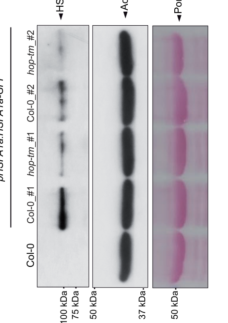

## Question

# Gene Research for Functional Annotation

## ⚠️ CRITICAL: Gene/Protein Identification Context

**BEFORE YOU BEGIN RESEARCH:** You MUST verify you are researching the CORRECT gene/protein. Gene symbols can be ambiguous, especially for less well-characterized genes from non-model organisms.

### Target Gene/Protein Identity (from UniProt):
- **UniProt Accession:** P41151
- **Protein Description:** RecName: Full=Heat stress transcription factor A-1a; Short=AtHsfA1a; AltName: Full=AtHsf-13; AltName: Full=Heat shock factor protein 1; Short=HSF 1; AltName: Full=Heat shock transcription factor 1; Short=HSTF 1;
- **Gene Information:** Name=HSFA1A; Synonyms=HSF1, HSF13; OrderedLocusNames=At4g17750; ORFNames=dl4910c, FCAALL.107;
- **Organism (full):** Arabidopsis thaliana (Mouse-ear cress).
- **Protein Family:** Belongs to the HSF family. Class A subfamily.
- **Key Domains:** HSF_DNA-bd. (IPR000232); WH-like_DNA-bd_sf. (IPR036388); WH_DNA-bd_sf. (IPR036390); HSF_DNA-bind (PF00447)

### MANDATORY VERIFICATION STEPS:

1. **Check if the gene symbol "HSFA1A" matches the protein description above**
2. **Verify the organism is correct:** Arabidopsis thaliana (Mouse-ear cress).
3. **Check if protein family/domains align with what you find in literature**
4. **If you find literature for a DIFFERENT gene with the same or similar symbol, STOP**

### If Gene Symbol is Ambiguous or You Cannot Find Relevant Literature:

**DO NOT PROCEED WITH RESEARCH ON A DIFFERENT GENE.** Instead:
- State clearly: "The gene symbol 'HSFA1A' is ambiguous or literature is limited for this specific protein"
- Explain what you found (e.g., "Found extensive literature on a different gene with the same symbol in a different organism")
- Describe the protein based ONLY on the UniProt information provided above
- Suggest that the protein function can be inferred from domain/family information

### Research Target:

Please provide a comprehensive research report on the gene **HSFA1A** (gene ID: AT4G17750, UniProt: P41151) in ARATH.

The research report should be a detailed narrative explaining the function, biological processes, and localization of the gene product. Citations should be given for all claims.

You should prioritize authoritative reviews and primary scientific literature when conducting research. You can supplement
this with annotations you find in gene/protein databases, but these can be outdated or inaccurate.

We are specifically interested in the primary function of the gene - for enzymes, what reaction is catalyzed, and what is the substrate specificity? For transporters, what is the substrate? For structural proteins or adapters, what is the broader structural role? For signaling molecules, what is the role in the pathway.

We are interested in where in or outside the cell the gene product carries out its function.

We are also interested in the signaling or biochemical pathways in which the gene functions. We are less interested in broad pleiotropic effects, except where these elucidate the precise role.

Include evidence where possible. We are interested in both experimental evidence as well as inference from structure, evolution, or bioinformatic analysis. Precise studies should be prioritized over high-throughput, where available.

## Output

Question: You are an expert researcher providing comprehensive, well-cited information.

Provide detailed information focusing on:
1. Key concepts and definitions with current understanding
2. Recent developments and latest research (prioritize 2023-2024 sources)
3. Current applications and real-world implementations
4. Expert opinions and analysis from authoritative sources
5. Relevant statistics and data from recent studies

Format as a comprehensive research report with proper citations. Include URLs and publication dates where available.
Always prioritize recent, authoritative sources and provide specific citations for all major claims.

# Gene Research for Functional Annotation

## ⚠️ CRITICAL: Gene/Protein Identification Context

**BEFORE YOU BEGIN RESEARCH:** You MUST verify you are researching the CORRECT gene/protein. Gene symbols can be ambiguous, especially for less well-characterized genes from non-model organisms.

### Target Gene/Protein Identity (from UniProt):
- **UniProt Accession:** P41151
- **Protein Description:** RecName: Full=Heat stress transcription factor A-1a; Short=AtHsfA1a; AltName: Full=AtHsf-13; AltName: Full=Heat shock factor protein 1; Short=HSF 1; AltName: Full=Heat shock transcription factor 1; Short=HSTF 1;
- **Gene Information:** Name=HSFA1A; Synonyms=HSF1, HSF13; OrderedLocusNames=At4g17750; ORFNames=dl4910c, FCAALL.107;
- **Organism (full):** Arabidopsis thaliana (Mouse-ear cress).
- **Protein Family:** Belongs to the HSF family. Class A subfamily.
- **Key Domains:** HSF_DNA-bd. (IPR000232); WH-like_DNA-bd_sf. (IPR036388); WH_DNA-bd_sf. (IPR036390); HSF_DNA-bind (PF00447)

### MANDATORY VERIFICATION STEPS:

1. **Check if the gene symbol "HSFA1A" matches the protein description above**
2. **Verify the organism is correct:** Arabidopsis thaliana (Mouse-ear cress).
3. **Check if protein family/domains align with what you find in literature**
4. **If you find literature for a DIFFERENT gene with the same or similar symbol, STOP**

### If Gene Symbol is Ambiguous or You Cannot Find Relevant Literature:

**DO NOT PROCEED WITH RESEARCH ON A DIFFERENT GENE.** Instead:
- State clearly: "The gene symbol 'HSFA1A' is ambiguous or literature is limited for this specific protein"
- Explain what you found (e.g., "Found extensive literature on a different gene with the same symbol in a different organism")
- Describe the protein based ONLY on the UniProt information provided above
- Suggest that the protein function can be inferred from domain/family information

### Research Target:

Please provide a comprehensive research report on the gene **HSFA1A** (gene ID: AT4G17750, UniProt: P41151) in ARATH.

The research report should be a detailed narrative explaining the function, biological processes, and localization of the gene product. Citations should be given for all claims.

You should prioritize authoritative reviews and primary scientific literature when conducting research. You can supplement
this with annotations you find in gene/protein databases, but these can be outdated or inaccurate.

We are specifically interested in the primary function of the gene - for enzymes, what reaction is catalyzed, and what is the substrate specificity? For transporters, what is the substrate? For structural proteins or adapters, what is the broader structural role? For signaling molecules, what is the role in the pathway.

We are interested in where in or outside the cell the gene product carries out its function.

We are also interested in the signaling or biochemical pathways in which the gene functions. We are less interested in broad pleiotropic effects, except where these elucidate the precise role.

Include evidence where possible. We are interested in both experimental evidence as well as inference from structure, evolution, or bioinformatic analysis. Precise studies should be prioritized over high-throughput, where available.

# Research Report: **Arabidopsis thaliana HSFA1A (At4g17750; UniProt P41151)** — Functional Annotation

## 1) Gene/protein identity verification (mandatory)
The target is **Arabidopsis thaliana Heat stress transcription factor A-1a (AtHsfA1a)** encoded by **HSFA1A (At4g17750)**, a member of the **class A heat shock transcription factors (HSFs)** that function as master regulators of heat-responsive transcription in plants. (toribio2024thehsfa1ais pages 1-3, wang2023transcriptionalregulatorsof pages 2-4)

Functionally consistent structural hallmarks of **class A plant HSFs** include a **conserved DNA-binding domain**, an **oligomerization domain**, **nuclear localization signal (NLS) features**, a **C-terminal nuclear export signal (NES)**, and **AHA activation motifs** involved in transcriptional activation. (wang2023transcriptionalregulatorsof pages 2-4, wang2023transcriptionalregulatorsof pages 1-2)

## 2) Key concepts and current understanding
### 2.1 What HSFA1A is (definition)
**HSFA1A encodes a sequence-specific transcription factor** that initiates and shapes the plant **heat stress response (HSR)** by binding heat-responsive promoter elements and inducing canonical protective programs (notably heat shock proteins, other HSFs, and additional stress TFs). HSFA1 family members are widely described as the **top tier (“master regulators”)** in an HSF regulatory hierarchy. (toribio2024thehsfa1ais pages 1-3, wang2023transcriptionalregulatorsof pages 2-4, bakery2024heatstresstranscription pages 5-6)

### 2.2 How class A HSFs are activated (conceptual model)
A widely used model for plant HSFA1 activation is **chaperone-mediated repression** at ambient temperature: HSFA1 proteins can be held inactive through interactions with **HSP70/HSP90**, and heat-induced protein misfolding titrates chaperones away, permitting HSFA1 activation. Regulation is further tuned by **post-translational modifications (PTMs)** (e.g., phosphorylation, SUMOylation, ubiquitination) and negative regulators that attenuate activity after the stress peak. (wang2023transcriptionalregulatorsof pages 2-4, bakery2024heatstresstranscription pages 4-4)

A 2024 synthesis frames plant HSFs as a **“molecular rheostat”**—their activity defines both the **intensity** and the **duration** of the response, balancing survival with recovery and growth. In this model, HSFA1 proteins are maintained in a restrained state by HSP70/HSP90, heat triggers their activation (including oligomerization and promoter binding), and multiple negative regulators help shut the response down. (bakery2024heatstresstranscription pages 4-4, bakery2024heatstresstranscription pages 5-6)

## 3) Molecular function, localization, and pathway placement
### 3.1 Molecular function and downstream gene control
HSFA1 proteins induce a broad transcriptional program that includes:
- **Other transcription factors** such as **DREB2A**, multiple HSFs (including **HSFA2**, **HSFA7A/B**), and **MBF1C**. (wang2023transcriptionalregulatorsof pages 2-4)
- Canonical heat-response genes including **HSP101**, **HSP18.2**, and others; HSFA2 is frequently highlighted as a key HSFA1-induced factor that supports sustained response and acclimation. (wang2023transcriptionalregulatorsof pages 2-4, toribio2024thehsfa1ais pages 11-13)

In the thermomorphogenesis context (mild, sustained warm temperature), **prior ChIP-seq work (cited in 2024 primary data)** identified **1,371 direct HSFA1a targets**. (toribio2024thehsfa1ais pages 11-13)

### 3.2 Subcellular localization
A notable Arabidopsis-specific feature emphasized by recent primary work is that **AtHSFA1a is predominantly nuclear even under non-stress conditions**. Furthermore, HSFA1a nuclear localization was reported to be **independent of HOP** co-chaperones (and remained nuclear in the hop triple mutant) in the tested conditions. (toribio2024thehsfa1ais pages 11-13, toribio2024thehsfa1ais pages 6-8)

### 3.3 Upstream regulation (proteostasis and signaling inputs)
**Chaperone and co-chaperone control.** A 2024 mechanistic study reports that **HOP (HSP70–HSP90 organizing protein; HOP1/2/3)** physically interacts with HSFA1a in planta, with interaction signals detected predominantly in the nucleus, and that HOP is required to maintain HSFA1a protein accumulation. (toribio2024thehsfa1ais pages 6-8, toribio2024thehsfa1ais pages 11-13)

**Proteasome-linked stability control.** In hop1 hop2 hop3 mutants, HSFA1a protein accumulation is reduced and can be restored by the **proteasome inhibitor MG132** or by a **chemical chaperone (TUDCA)**, supporting a model in which HOP promotes HSFA1a folding/stability and prevents proteasome-dependent loss. (toribio2024thehsfa1ais pages 11-13, toribio2024thehsfa1ais media 65a20fc2, toribio2024thehsfa1ais media 3f2cba7e)

**PTMs and negative regulators.** Reviews highlight that HSFA1 activity is tuned by PTMs (phosphorylation, SUMOylation, ubiquitination) and negative regulators (e.g., BIN2, HSBP, E3 ligases) that contribute to attenuation and recovery dynamics after heat stress. (wang2023transcriptionalregulatorsof pages 2-4, bakery2024heatstresstranscription pages 4-4)

## 4) Recent developments (prioritizing 2023–2024)
### 4.1 2024: HOP co-chaperones stabilize HSFA1a (new regulatory mechanism)
Toribio et al. (bioRxiv **2024-01**, DOI: **10.1101/2024.01.30.577911**, URL: https://doi.org/10.1101/2024.01.30.577911) identify HSFA1a as a **HOP client** and provide evidence that HOP binds HSFA1a and is required for HSFA1a **protein stability** and appropriate activation of HSFA1a-regulated transcription under mild warming conditions. (toribio2024thehsfa1ais pages 1-3, toribio2024thehsfa1ais pages 11-13)

This study provides several quantitative dataset-level statistics:
- At **29°C**, hop1 hop2 hop3 mutants show **1,192 differentially expressed genes** (666 up; 526 down), enriched in heat/stress-related functions. (toribio2024thehsfa1ais pages 11-13)
- Although HSFA1a transcript levels are essentially unchanged, HSFA1a protein is reduced in hop mutants, consistent with post-transcriptional control. (toribio2024thehsfa1ais pages 11-13)
- Of the **1,371 direct HSFA1a targets** (from prior ChIP-seq cited in the same study), **103** are significantly misexpressed in the hop triple mutant at 29°C. (toribio2024thehsfa1ais pages 11-13)
- Specific downregulated HSR genes in hop mutants include **HSFA2, HSP101, HSP18.2, HSA32**. (toribio2024thehsfa1ais pages 11-13)

**Visual evidence** in the same preprint supports these conclusions, including blots/quantification of reduced HSFA1a-GFP accumulation in hop mutants, rescue by MG132/TUDCA, and a summary model of HOP-mediated stabilization. (toribio2024thehsfa1ais media 65a20fc2, toribio2024thehsfa1ais media 3f2cba7e, toribio2024thehsfa1ais media d944d0a2)

### 4.2 2023–2024: HSFA1 integrates heat response with development (thermomorphogenesis)
A 2024 New Phytologist review (published **2024-07**, DOI: **10.1111/nph.20017**, URL: https://doi.org/10.1111/nph.20017) emphasizes that HSFA1 family members connect heat response with thermomorphogenic growth control via interactions with **PIF4** and modulation of **PIF4–PHYB** relationships at warm temperatures. Genetic evidence summarized in this review indicates that an **hsfa1 quadruple mutant** fails to show temperature-induced hypocotyl elongation, supporting a requirement for HSFA1s in thermomorphogenesis. (bakery2024heatstresstranscription pages 9-9)

A 2023 heat-response regulators review (published **2023-08**, DOI: **10.3390/ijms241713297**, URL: https://doi.org/10.3390/ijms241713297) provides the modern domain/regulatory framework for class A HSFs (NLS/NES/AHA) and emphasizes HSFA1s as master regulators that induce secondary TF cascades and canonical HSR targets. (wang2023transcriptionalregulatorsof pages 2-4)

## 5) Current applications and real-world implementations
### 5.1 Engineering thermotolerance (translation potential)
Recent reviews argue that manipulating **HSF-centered regulatory networks** is a promising strategy for improving heat resilience in crops under climate warming—via tuning master regulators (HSFA1 tier), downstream TFs (e.g., HSFA2), and proteostasis/attenuation mechanisms for recovery. (bakery2024heatstresstranscription pages 5-6, fragkostefanakis2025backtothe pages 1-2)

The newly described **HOP–HSFA1a stability axis** provides a mechanistically specific intervention point: modulating co-chaperone capacity or proteostasis control could plausibly adjust HSFA1a abundance and thereby the onset/intensity of the HSR under warm regimes relevant to agriculture (with the caveat that the 2024 mechanistic work is currently a preprint in the provided evidence). (toribio2024thehsfa1ais pages 11-13, toribio2024thehsfa1ais media d944d0a2)

## 6) Expert opinions and analysis (authoritative sources)
- The 2024 New Phytologist review explicitly conceptualizes HSFs as a **dynamic “rheostat”**, emphasizing that both rapid activation and timely attenuation are required for survival and recovery; HSFA1s are highlighted as master regulators in this balancing act. (bakery2024heatstresstranscription pages 5-6)
- Reviews also highlight that regulation is multi-layered (chaperone sequestration, PTMs, transcriptional and post-transcriptional control), supporting the idea that functional annotation of HSFA1A must include **proteostasis and regulatory network context**, not merely “activates HSP genes.” (wang2023transcriptionalregulatorsof pages 2-4, bakery2024heatstresstranscription pages 4-4)

## 7) Key statistics/data points (recent studies)
- **1,192 DE genes** in hop triple mutant vs WT at 29°C (666 up; 526 down), indicating broad transcriptional disruption of warm-temperature programs when HSFA1a stability is compromised. (toribio2024thehsfa1ais pages 11-13)
- **1,371 direct HSFA1a targets** (from earlier ChIP-seq cited in 2024 study) and **103** of these misexpressed in hop triple mutant at 29°C. (toribio2024thehsfa1ais pages 11-13)
- **HSFA1a mRNA ~unchanged** in hop mutant (reported log2FC near zero; non-significant adjusted p-values), while HSFA1a protein abundance drops—consistent with post-transcriptional stability control. (toribio2024thehsfa1ais pages 11-13)

## Evidence summary table
| Topic | Key points | Evidence & citation IDs |
|---|---|---|
| Identity / domains | Target identity is Arabidopsis thaliana HSFA1A/AtHsfA1a (At4g17750; UniProt P41151), a member of the HsfA1 family and class A heat shock transcription factors. Class A HSFs are defined by a conserved DNA-binding domain, oligomerization domain, basic residues functioning as NLS, a C-terminal NES, and AHA activation motifs for transcriptional activation. | AtHsfA1a class A identity and master-regulator status supported in recent primary/review sources; domain features from plant HSF reviews (toribio2024thehsfa1ais pages 1-3, wang2023transcriptionalregulatorsof pages 2-4, wang2023transcriptionalregulatorsof pages 1-2) |
| Localization | AtHSFA1a is predominantly nuclear even without stress; in the 2024 HOP study, its nuclear localization was not altered by loss of HOP or by HSP90 inhibition conditions tested, indicating HOP mainly affects stability rather than localization. More generally, HSFA1 activity is controlled by NLS/NES-based nucleo-cytoplasmic shuttling in plant HSF models. | Nuclear localization and HOP independence (toribio2024thehsfa1ais pages 11-13, toribio2024thehsfa1ais pages 6-8); general shuttling model (wang2023transcriptionalregulatorsof pages 2-4, wang2023transcriptionalregulatorsof pages 1-2) |
| Upstream regulators | HSFA1 proteins are regulated by HSP70/HSP90 chaperone systems; heat stress relieves chaperone sequestration, allowing activation. Recent work identified HOP1/2/3 as in vivo HSFA1a-binding co-chaperones that promote folding/stability and prevent proteasome-dependent degradation. Additional regulators mentioned in the evidence include calmodulin/CaM3, kinases such as CBK3 and BIN2, HSBP, PHABULOSA, SUMOylation, ubiquitination, and proteasomal turnover. | HSP70/HSP90/HOP stabilization model (toribio2024thehsfa1ais pages 23-26, toribio2024thehsfa1ais pages 11-13, toribio2024thehsfa1ais pages 6-8, toribio2024thehsfa1ais pages 1-3); broader PTM/regulatory network (toribio2024thehsfa1ais pages 35-36, wang2023transcriptionalregulatorsof pages 2-4, bakery2024heatstresstranscription pages 4-4, bakery2024heatstresstranscription pages 5-6) |
| Downstream targets | HSFA1s act as master regulators of Arabidopsis heat-stress transcription, inducing downstream TFs and canonical heat-response genes. Specific targets named in the evidence include HSFA2, HSP101, HSP18.2, HSA32, DREB2A, HSFA7A/B, MBF1C, and HSP promoters such as HSP90 and HSP18.2. | Direct/indirect target examples from recent review and 2024 primary study (toribio2024thehsfa1ais pages 11-13, toribio2024thehsfa1ais pages 35-36, wang2023transcriptionalregulatorsof pages 2-4) |
| Biological roles | HSFA1A functions as a master regulator of the heat stress response and contributes to thermomorphogenesis by binding promoters of heat-responsive genes under mild warming. The broader HSFA1 family is required for temperature-induced hypocotyl elongation, interacts with PIF4 signaling, and sits at the top of an HSF hierarchy that activates HSFA2 and acclimation programs. | HSR and thermomorphogenesis roles (toribio2024thehsfa1ais pages 1-3, bakery2024heatstresstranscription pages 9-9); master-regulator review context (bakery2024heatstresstranscription pages 4-4, bakery2024heatstresstranscription pages 5-6) |
| Quantitative stats from recent study | In hop1 hop2 hop3 at 29°C, transcriptomics found 1,192 differentially expressed genes (666 up, 526 down), enriched for heat/stress functions. Prior work cited in the 2024 study identified 1,371 direct HSFA1a targets; 103 of these were significantly misexpressed in the hop triple mutant. HSFA1a mRNA itself was essentially unchanged between genotypes (log2FC about 0.096 and -0.04; adjusted p-values 0.896 and 0.938), supporting post-transcriptional regulation. | Quantitative evidence from Toribio et al. 2024 (toribio2024thehsfa1ais pages 11-13) |
| Applications / real-world relevance | HSFA1-centered networks are highlighted in 2023-2024 reviews as key targets for engineering crop thermotolerance. Mechanistically informed manipulation of HSF pathways, chaperone control, and downstream regulons is proposed as a route to improve heat resilience under climate warming; the HOP-HSFA1a axis suggests a specific proteostasis-based intervention point. | Crop-improvement and engineering relevance from recent reviews plus HOP-HSFA1a mechanism (toribio2024thehsfa1ais pages 1-3, bakery2024heatstresstranscription pages 5-6, fragkostefanakis2025backtothe pages 1-2) |

*Table: This table condenses the evidence-supported functional annotation of Arabidopsis HSFA1A, covering identity, domains, localization, regulation, targets, biological roles, and recent quantitative findings. It is useful as a compact reference for building the full narrative report.*

## Selected references (URLs and publication dates)
1. **Toribio R, Navarro A, Castellano MM.** *The HSFA1a is stabilized by the co-chaperone HSP70-HSP90 organizing protein HOP in Arabidopsis.* **bioRxiv** (posted **2024-01-30**). DOI: 10.1101/2024.01.30.577911. URL: https://doi.org/10.1101/2024.01.30.577911 (toribio2024thehsfa1ais pages 11-13, toribio2024thehsfa1ais media 65a20fc2)
2. **Bakery A, et al.** *Heat stress transcription factors as the central molecular rheostat to optimize plant survival and recovery from heat stress.* **New Phytologist** (**2024-07**). DOI: 10.1111/nph.20017. URL: https://doi.org/10.1111/nph.20017 (bakery2024heatstresstranscription pages 5-6, bakery2024heatstresstranscription pages 9-9)
3. **Wang X, et al.** *Transcriptional Regulators of Plant Adaptation to Heat Stress.* **International Journal of Molecular Sciences** (**2023-08**). DOI: 10.3390/ijms241713297. URL: https://doi.org/10.3390/ijms241713297 (wang2023transcriptionalregulatorsof pages 2-4)

## Scope note / limitations
The evidence base available here strongly supports HSFA1A’s role as a class A HSF master regulator, its predominantly nuclear localization, and a 2024 mechanistic update on **HOP-dependent protein stabilization**. However, specific details requested in your prompt—such as HSFA1A’s precise DNA motif preferences and locus-resolved target lists beyond the cited “1,371 direct targets”—are referenced indirectly (via prior ChIP-seq) but not provided as primary text in the retrieved documents. (toribio2024thehsfa1ais pages 11-13)

References

1. (toribio2024thehsfa1ais pages 1-3): René Toribio, Aurora Navarro, and M. Mar Castellano. The hsfa1a is stabilized by the co-chaperone hsp70-hsp90 organizing protein hop in arabidopsis. bioRxiv, Jan 2024. URL: https://doi.org/10.1101/2024.01.30.577911, doi:10.1101/2024.01.30.577911. This article has 0 citations.

2. (wang2023transcriptionalregulatorsof pages 2-4): Xuejing Wang, Nicholas Wui Kiat Tan, Fong Yi Chung, Nobutoshi Yamaguchi, Eng-Seng Gan, and Toshiro Ito. Transcriptional regulators of plant adaptation to heat stress. International Journal of Molecular Sciences, 24:13297, Aug 2023. URL: https://doi.org/10.3390/ijms241713297, doi:10.3390/ijms241713297. This article has 44 citations.

3. (wang2023transcriptionalregulatorsof pages 1-2): Xuejing Wang, Nicholas Wui Kiat Tan, Fong Yi Chung, Nobutoshi Yamaguchi, Eng-Seng Gan, and Toshiro Ito. Transcriptional regulators of plant adaptation to heat stress. International Journal of Molecular Sciences, 24:13297, Aug 2023. URL: https://doi.org/10.3390/ijms241713297, doi:10.3390/ijms241713297. This article has 44 citations.

4. (bakery2024heatstresstranscription pages 5-6): Ayat Bakery, Stavros Vraggalas, Boushra Shalha, Harsh Chauhan, Moussa Benhamed, and Sotirios Fragkostefanakis. Heat stress transcription factors as the central molecular rheostat to optimize plant survival and recovery from heat stress. The New phytologist, 244:51-64, Jul 2024. URL: https://doi.org/10.1111/nph.20017, doi:10.1111/nph.20017. This article has 93 citations.

5. (bakery2024heatstresstranscription pages 4-4): Ayat Bakery, Stavros Vraggalas, Boushra Shalha, Harsh Chauhan, Moussa Benhamed, and Sotirios Fragkostefanakis. Heat stress transcription factors as the central molecular rheostat to optimize plant survival and recovery from heat stress. The New phytologist, 244:51-64, Jul 2024. URL: https://doi.org/10.1111/nph.20017, doi:10.1111/nph.20017. This article has 93 citations.

6. (toribio2024thehsfa1ais pages 11-13): René Toribio, Aurora Navarro, and M. Mar Castellano. The hsfa1a is stabilized by the co-chaperone hsp70-hsp90 organizing protein hop in arabidopsis. bioRxiv, Jan 2024. URL: https://doi.org/10.1101/2024.01.30.577911, doi:10.1101/2024.01.30.577911. This article has 0 citations.

7. (toribio2024thehsfa1ais pages 6-8): René Toribio, Aurora Navarro, and M. Mar Castellano. The hsfa1a is stabilized by the co-chaperone hsp70-hsp90 organizing protein hop in arabidopsis. bioRxiv, Jan 2024. URL: https://doi.org/10.1101/2024.01.30.577911, doi:10.1101/2024.01.30.577911. This article has 0 citations.

8. (toribio2024thehsfa1ais media 65a20fc2): René Toribio, Aurora Navarro, and M. Mar Castellano. The hsfa1a is stabilized by the co-chaperone hsp70-hsp90 organizing protein hop in arabidopsis. bioRxiv, Jan 2024. URL: https://doi.org/10.1101/2024.01.30.577911, doi:10.1101/2024.01.30.577911. This article has 0 citations.

9. (toribio2024thehsfa1ais media 3f2cba7e): René Toribio, Aurora Navarro, and M. Mar Castellano. The hsfa1a is stabilized by the co-chaperone hsp70-hsp90 organizing protein hop in arabidopsis. bioRxiv, Jan 2024. URL: https://doi.org/10.1101/2024.01.30.577911, doi:10.1101/2024.01.30.577911. This article has 0 citations.

10. (toribio2024thehsfa1ais media d944d0a2): René Toribio, Aurora Navarro, and M. Mar Castellano. The hsfa1a is stabilized by the co-chaperone hsp70-hsp90 organizing protein hop in arabidopsis. bioRxiv, Jan 2024. URL: https://doi.org/10.1101/2024.01.30.577911, doi:10.1101/2024.01.30.577911. This article has 0 citations.

11. (bakery2024heatstresstranscription pages 9-9): Ayat Bakery, Stavros Vraggalas, Boushra Shalha, Harsh Chauhan, Moussa Benhamed, and Sotirios Fragkostefanakis. Heat stress transcription factors as the central molecular rheostat to optimize plant survival and recovery from heat stress. The New phytologist, 244:51-64, Jul 2024. URL: https://doi.org/10.1111/nph.20017, doi:10.1111/nph.20017. This article has 93 citations.

12. (fragkostefanakis2025backtothe pages 1-2): Sotirios Fragkostefanakis, Enrico Schleiff, and Klaus-Dieter Scharf. Back to the basics: the molecular blueprint of plant heat stress transcription factors. Biological Chemistry, Apr 2025. URL: https://doi.org/10.1515/hsz-2025-0115, doi:10.1515/hsz-2025-0115. This article has 12 citations and is from a peer-reviewed journal.

13. (toribio2024thehsfa1ais pages 23-26): René Toribio, Aurora Navarro, and M. Mar Castellano. The hsfa1a is stabilized by the co-chaperone hsp70-hsp90 organizing protein hop in arabidopsis. bioRxiv, Jan 2024. URL: https://doi.org/10.1101/2024.01.30.577911, doi:10.1101/2024.01.30.577911. This article has 0 citations.

14. (toribio2024thehsfa1ais pages 35-36): René Toribio, Aurora Navarro, and M. Mar Castellano. The hsfa1a is stabilized by the co-chaperone hsp70-hsp90 organizing protein hop in arabidopsis. bioRxiv, Jan 2024. URL: https://doi.org/10.1101/2024.01.30.577911, doi:10.1101/2024.01.30.577911. This article has 0 citations.

## Artifacts

- [Edison artifact artifact-00](AT4G17750-deep-research-falcon_artifacts/artifact-00.md)

## Citations

1. wang2023transcriptionalregulatorsof pages 2-4
2. bakery2024heatstresstranscription pages 9-9
3. bakery2024heatstresstranscription pages 5-6
4. wang2023transcriptionalregulatorsof pages 1-2
5. bakery2024heatstresstranscription pages 4-4
6. fragkostefanakis2025backtothe pages 1-2
7. https://doi.org/10.1101/2024.01.30.577911
8. https://doi.org/10.1111/nph.20017
9. https://doi.org/10.3390/ijms241713297
10. https://doi.org/10.1101/2024.01.30.577911,
11. https://doi.org/10.3390/ijms241713297,
12. https://doi.org/10.1111/nph.20017,
13. https://doi.org/10.1515/hsz-2025-0115,