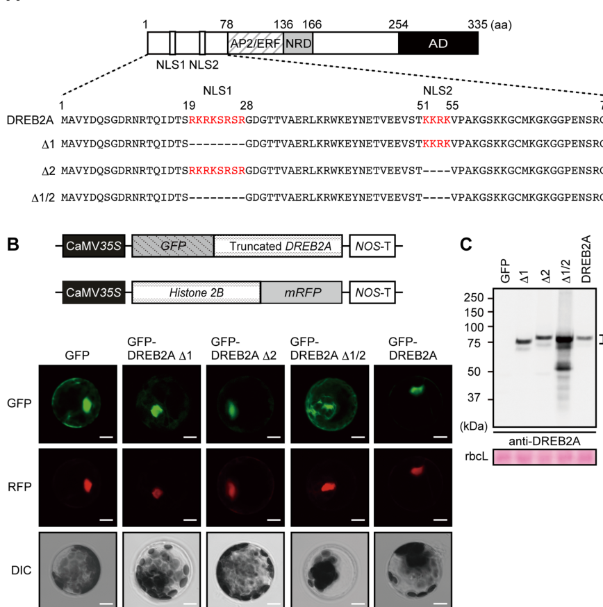

## Question

# Gene Research for Functional Annotation

## ⚠️ CRITICAL: Gene/Protein Identification Context

**BEFORE YOU BEGIN RESEARCH:** You MUST verify you are researching the CORRECT gene/protein. Gene symbols can be ambiguous, especially for less well-characterized genes from non-model organisms.

### Target Gene/Protein Identity (from UniProt):
- **UniProt Accession:** O82132
- **Protein Description:** RecName: Full=Dehydration-responsive element-binding protein 2A {ECO:0000303|PubMed:10809011, ECO:0000303|PubMed:9707537}; Short=Protein DREB2A {ECO:0000303|PubMed:10809011, ECO:0000303|PubMed:9707537};
- **Gene Information:** Name=DREB2A {ECO:0000303|PubMed:10809011, ECO:0000303|PubMed:9707537}; Synonyms=ERF045 {ECO:0000303|PubMed:16407444}; OrderedLocusNames=At5g05410 {ECO:0000312|Araport:AT5G05410}; ORFNames=K18I23.22 {ECO:0000312|EMBL:BAB09984.1};
- **Organism (full):** Arabidopsis thaliana (Mouse-ear cress).
- **Protein Family:** Belongs to the AP2/ERF transcription factor family. ERF
- **Key Domains:** AP2/ERF_dom. (IPR001471); AP2/ERF_dom_sf. (IPR036955); DNA-bd_dom_sf. (IPR016177); AP2 (PF00847)

### MANDATORY VERIFICATION STEPS:

1. **Check if the gene symbol "DREB2A" matches the protein description above**
2. **Verify the organism is correct:** Arabidopsis thaliana (Mouse-ear cress).
3. **Check if protein family/domains align with what you find in literature**
4. **If you find literature for a DIFFERENT gene with the same or similar symbol, STOP**

### If Gene Symbol is Ambiguous or You Cannot Find Relevant Literature:

**DO NOT PROCEED WITH RESEARCH ON A DIFFERENT GENE.** Instead:
- State clearly: "The gene symbol 'DREB2A' is ambiguous or literature is limited for this specific protein"
- Explain what you found (e.g., "Found extensive literature on a different gene with the same symbol in a different organism")
- Describe the protein based ONLY on the UniProt information provided above
- Suggest that the protein function can be inferred from domain/family information

### Research Target:

Please provide a comprehensive research report on the gene **DREB2A** (gene ID: AT5G05410, UniProt: O82132) in ARATH.

The research report should be a detailed narrative explaining the function, biological processes, and localization of the gene product. Citations should be given for all claims.

You should prioritize authoritative reviews and primary scientific literature when conducting research. You can supplement
this with annotations you find in gene/protein databases, but these can be outdated or inaccurate.

We are specifically interested in the primary function of the gene - for enzymes, what reaction is catalyzed, and what is the substrate specificity? For transporters, what is the substrate? For structural proteins or adapters, what is the broader structural role? For signaling molecules, what is the role in the pathway.

We are interested in where in or outside the cell the gene product carries out its function.

We are also interested in the signaling or biochemical pathways in which the gene functions. We are less interested in broad pleiotropic effects, except where these elucidate the precise role.

Include evidence where possible. We are interested in both experimental evidence as well as inference from structure, evolution, or bioinformatic analysis. Precise studies should be prioritized over high-throughput, where available.

## Output

Question: You are an expert researcher providing comprehensive, well-cited information.

Provide detailed information focusing on:
1. Key concepts and definitions with current understanding
2. Recent developments and latest research (prioritize 2023-2024 sources)
3. Current applications and real-world implementations
4. Expert opinions and analysis from authoritative sources
5. Relevant statistics and data from recent studies

Format as a comprehensive research report with proper citations. Include URLs and publication dates where available.
Always prioritize recent, authoritative sources and provide specific citations for all major claims.

# Gene Research for Functional Annotation

## ⚠️ CRITICAL: Gene/Protein Identification Context

**BEFORE YOU BEGIN RESEARCH:** You MUST verify you are researching the CORRECT gene/protein. Gene symbols can be ambiguous, especially for less well-characterized genes from non-model organisms.

### Target Gene/Protein Identity (from UniProt):
- **UniProt Accession:** O82132
- **Protein Description:** RecName: Full=Dehydration-responsive element-binding protein 2A {ECO:0000303|PubMed:10809011, ECO:0000303|PubMed:9707537}; Short=Protein DREB2A {ECO:0000303|PubMed:10809011, ECO:0000303|PubMed:9707537};
- **Gene Information:** Name=DREB2A {ECO:0000303|PubMed:10809011, ECO:0000303|PubMed:9707537}; Synonyms=ERF045 {ECO:0000303|PubMed:16407444}; OrderedLocusNames=At5g05410 {ECO:0000312|Araport:AT5G05410}; ORFNames=K18I23.22 {ECO:0000312|EMBL:BAB09984.1};
- **Organism (full):** Arabidopsis thaliana (Mouse-ear cress).
- **Protein Family:** Belongs to the AP2/ERF transcription factor family. ERF
- **Key Domains:** AP2/ERF_dom. (IPR001471); AP2/ERF_dom_sf. (IPR036955); DNA-bd_dom_sf. (IPR016177); AP2 (PF00847)

### MANDATORY VERIFICATION STEPS:

1. **Check if the gene symbol "DREB2A" matches the protein description above**
2. **Verify the organism is correct:** Arabidopsis thaliana (Mouse-ear cress).
3. **Check if protein family/domains align with what you find in literature**
4. **If you find literature for a DIFFERENT gene with the same or similar symbol, STOP**

### If Gene Symbol is Ambiguous or You Cannot Find Relevant Literature:

**DO NOT PROCEED WITH RESEARCH ON A DIFFERENT GENE.** Instead:
- State clearly: "The gene symbol 'DREB2A' is ambiguous or literature is limited for this specific protein"
- Explain what you found (e.g., "Found extensive literature on a different gene with the same symbol in a different organism")
- Describe the protein based ONLY on the UniProt information provided above
- Suggest that the protein function can be inferred from domain/family information

### Research Target:

Please provide a comprehensive research report on the gene **DREB2A** (gene ID: AT5G05410, UniProt: O82132) in ARATH.

The research report should be a detailed narrative explaining the function, biological processes, and localization of the gene product. Citations should be given for all claims.

You should prioritize authoritative reviews and primary scientific literature when conducting research. You can supplement
this with annotations you find in gene/protein databases, but these can be outdated or inaccurate.

We are specifically interested in the primary function of the gene - for enzymes, what reaction is catalyzed, and what is the substrate specificity? For transporters, what is the substrate? For structural proteins or adapters, what is the broader structural role? For signaling molecules, what is the role in the pathway.

We are interested in where in or outside the cell the gene product carries out its function.

We are also interested in the signaling or biochemical pathways in which the gene functions. We are less interested in broad pleiotropic effects, except where these elucidate the precise role.

Include evidence where possible. We are interested in both experimental evidence as well as inference from structure, evolution, or bioinformatic analysis. Precise studies should be prioritized over high-throughput, where available.

# Comprehensive Research Report: Arabidopsis thaliana **DREB2A** (AT5G05410; UniProt **O82132**) — Functional Annotation and Mechanistic Context

## 1. Target verification (identity and disambiguation)
The research target is **Arabidopsis thaliana** DREB2A (gene **AT5G05410**; protein “Dehydration-responsive element-binding protein 2A”), a member of the **AP2/ERF transcription factor family** that binds DRE/CRT elements and regulates drought- and heat-stress transcriptional programs (publication contexts explicitly refer to Arabidopsis DREB2A and its known regulators such as DRIP1/DRIP2, NRD, and DRE/CRT specificity). (morimoto2013stabilizationofarabidopsis pages 1-2, sato2024complexplantresponses pages 8-8, nakashima2025transcriptionalgenenetwork pages 5-6)

## 2. Key concepts and definitions (current understanding)

### 2.1 What DREB2A is (primary molecular function)
**DREB2A is a sequence-specific DNA-binding transcription factor** that regulates stress-inducible gene expression in response to environmental stresses, especially **dehydration/osmotic stress and heat stress**. (morimoto2013stabilizationofarabidopsis pages 1-2, sato2024complexplantresponses pages 8-8)

### 2.2 DRE/CRT cis-element and DREB2A binding specificity
DREB2A regulates target genes primarily by binding **DRE/CRT cis-elements** (classically reported as **A/GCCGAC**). (morimoto2013stabilizationofarabidopsis pages 1-2)
A recent mechanistic synthesis further emphasizes that DREB2A shows promoter preference centered on **ACCGAC**, which helps explain partial target specificity differences relative to DREB1 proteins. (nakashima2025transcriptionalgenenetwork pages 5-6)

### 2.3 Negative regulatory domain (NRD) and “constitutively active” DREB2A
A central concept in DREB2A biology is its **negative regulatory domain (NRD)**—a ~30 amino acid Ser/Thr-rich region (often described as PEST-like) that promotes instability/negative regulation. **Deleting the NRD produces a “constitutively active” DREB2A (DREB2A CA)** that more readily activates stress-responsive transcription. (nakashima2025transcriptionalgenenetwork pages 5-6, morimoto2013stabilizationofarabidopsis pages 1-2)

### 2.4 “Two-step” activation model (stabilization is necessary but not sufficient)
A widely used interpretive framework is that **DREB2A activation requires at least two separable steps**: (i) **stress-dependent stabilization** (reduced degradation), and (ii) an additional, stress-dependent **activation step** (e.g., post-translational modification and/or cofactor engagement), because forced accumulation of DREB2A by proteasome inhibitors does not automatically activate target genes under non-stress conditions. (morimoto2013stabilizationofarabidopsis pages 9-10)

## 3. Subcellular localization and where DREB2A acts

### 3.1 Nuclear localization is required for function and regulated stability
DREB2A activity occurs in the **nucleus**, consistent with its transcription-factor role. A key experimental finding is that DREB2A contains **two redundantly acting N-terminal nuclear localization signals (NLSs)**; removing both NLSs shifts DREB2A largely to the **cytosol** and strongly reduces transactivation activity. (morimoto2013stabilizationofarabidopsis pages 4-5)

### 3.2 Nuclear import is linked to proteasome-dependent turnover
DREB2A **proteasome-dependent degradation requires nuclear import**; cytosolic (double-NLS) variants accumulate to higher levels than nuclear-localized forms, consistent with degradation occurring in the nucleus. (morimoto2013stabilizationofarabidopsis pages 3-4, morimoto2013stabilizationofarabidopsis media 348c1ccf)

## 4. DREB2A regulation and pathway placement

### 4.1 Transcriptional regulation (promoter-level control)
Recent authoritative review synthesis highlights multiple promoter inputs:
- Under non-stress conditions, **GRF7 represses DREB2A expression** via the promoter cis-element **TGTCAGG**. (Sato et al., 2024; published Jan 2024; https://doi.org/10.1111/tpj.16612) (sato2024complexplantresponses pages 8-8)
- Under drought, DREB2A expression is induced through **ABA-dependent and ABA-independent pathways**, with **ABRE/CE3-related** promoter control implicated. (sato2024complexplantresponses pages 8-8)
- Under heat, DREB2A induction is promoted by **HSFA1 transcription factors** and **MBF1C**, acting via promoter motifs including **HSE** and **CTAGA** (and ABRE-linked regulation is also noted in this context). (sato2024complexplantresponses pages 8-8)

### 4.2 Post-translational regulation (protein stability and activity)
DREB2A is strongly controlled by post-translational mechanisms that tune its abundance and stress responsiveness.

#### 4.2.1 Ubiquitin–proteasome degradation via DRIP1/DRIP2 (direct negative regulators)
A primary experimental study showed that DREB2A is normally degraded via the **26S proteasome**, and that **DRIP1 and DRIP2** (C3HC4 RING-type E3 ubiquitin ligases) mediate DREB2A turnover under both normal and stress conditions. (Morimoto et al., 2013; published Dec 2013; https://doi.org/10.1371/journal.pone.0080457) (morimoto2013stabilizationofarabidopsis pages 1-2, morimoto2013stabilizationofarabidopsis pages 4-5)

#### 4.2.2 Additional NRD-dependent degradation via CUL3 adaptors (BPM proteins) and stress-modulated PTMs
A mechanistic synthesis integrates additional layers beyond DRIP1/2:
- **BPM proteins** (CUL3 substrate adaptors) bind the **NRD** to promote **CUL3-dependent ubiquitination/degradation** of DREB2A; BPM knockdown stabilizes DREB2A. (nakashima2025transcriptionalgenenetwork pages 5-6)
- The **NRD is highly phosphorylated in non-stress conditions**, and changes in phosphorylation during stress are proposed to affect interactions such as with BPM2; **casein kinase 1 (CK1)** is suggested as a kinase involved in this regulatory logic. (nakashima2025transcriptionalgenenetwork pages 5-6)
- **SUMOylation near the NRD during heat stress** is described as inhibiting BPM interaction, thereby stabilizing DREB2A and promoting heat-response output. (nakashima2025transcriptionalgenenetwork pages 5-6)

#### 4.2.3 Cofactors and interactors that tune output (stress specificity)
Multiple interacting proteins modulate DREB2A activity and/or target selectivity:
- **NF-YC10 (DPB3-1)** is a DREB2A-interacting factor implicated in activation of **heat-inducible** DREB2A target genes, supporting a mechanism for stress-specific output selection via cofactors. (sato2024complexplantresponses pages 8-9, nakashima2025transcriptionalgenenetwork pages 6-7)
- **MED25** is described as a DREB2A-interacting regulator that can inhibit DREB2A DNA binding via conformational effects. (morimoto2013stabilizationofarabidopsis pages 9-10, nakashima2025transcriptionalgenenetwork pages 5-6, nakashima2025transcriptionalgenenetwork pages 6-7)
- **RCD1** binds DREB2A (via a C-terminal region) and is implicated in regulating its activity/stability. (morimoto2013stabilizationofarabidopsis pages 9-10, nakashima2025transcriptionalgenenetwork pages 6-7)

## 5. Downstream targets and biological processes

### 5.1 Heat-stress gene regulatory cascade: HSFA1 → DREB2A → HSFA3 → HSP/HSR genes
A 2024 review positions DREB2A as downstream of **HSFA1** (master regulator), acting as an important transcriptional activator in heat response. DREB2A activates **HSFA3**, which then regulates broader heat shock response genes including **heat shock proteins (HSPs)** and other protective outputs. (Ma et al., 2024; published Jan 2024; https://doi.org/10.3390/ijms25020893) (ma2024understandingap2erftranscription pages 8-9)
A complementary 2024 synthesis similarly emphasizes that DREB2A activates heat-stress responsive genes including **HSFA3**. (sato2024complexplantresponses pages 8-8)

### 5.2 Drought/dehydration responses
DREB2A is induced by drought and integrates both ABA-dependent and ABA-independent transcriptional control at the promoter level, consistent with its role in dehydration response gene networks. (sato2024complexplantresponses pages 8-8)
A mechanistic synthesis notes that DREB2A CA can drive expression of dehydration-responsive genes including **LEA** and also heat-shock related genes, linking DREB2A control to both drought and heat protection programs. (nakashima2025transcriptionalgenenetwork pages 5-6)

## 6. Recent developments (prioritizing 2023–2024)

### 6.1 Integrated drought–heat response under climate change (review-level synthesis)
A 2024 review explicitly frames DREB2A as a **shared regulator** across drought and heat stress responses and emphasizes that regulation occurs at both transcriptional (GRF7 repression; HSFA1/MBF1C activation) and post-translational levels, shaping stress-specific outputs. (Sato et al., 2024; Jan 2024; https://doi.org/10.1111/tpj.16612) (sato2024complexplantresponses pages 8-8, sato2024complexplantresponses pages 8-9)

### 6.2 Engineering-relevant regulatory lever: manipulating E3 ligase pathways that gate DREB2A stability
Sato et al. (2024) summarizes evidence that an upstream E3 ligase from wheat (**TaSAP5**) was suggested to degrade **DRIP1/DRIP2**, and **TaSAP5 overexpression increased DREB2A protein accumulation under drought stress and enhanced drought tolerance in Arabidopsis**, illustrating how DREB2A stability can be tuned indirectly through the ubiquitin system. (sato2024complexplantresponses pages 8-9)

### 6.3 Heat-pathway framing and DREB2A CA as a lever to upregulate HSR genes
Ma et al. (2024) highlights DREB2A’s role in the HSFA1→DREB2A→HSFA3 cascade and notes that overexpression of **constitutively active DREB2A** upregulates heat stress response genes, reinforcing the concept that bypassing negative regulation can drive protective programs. (ma2024understandingap2erftranscription pages 8-9)

## 7. Quantitative findings and data (from experimental studies)

### 7.1 Stress kinetics of DREB2A accumulation
In Arabidopsis, heat stress produces **rapid DREB2A accumulation within 1–2 hours**, followed by a gradual reduction, whereas dehydration leads to a more gradual accumulation profile. (morimoto2013stabilizationofarabidopsis pages 3-4)

### 7.2 Proteasome dependence of DREB2A degradation
Proteasome inhibitor **MG132** “almost completely” blocks DREB2A degradation in cell-based assays, supporting ubiquitin–26S proteasome control. (morimoto2013stabilizationofarabidopsis pages 3-4)

### 7.3 Quantitative transcriptional activation readout (reporter assay)
In a DRE-containing reporter system (36DRE-GUS), **DREB2A CA** shows approximately **~2× higher transactivation activity** than full-length DREB2A; in contrast, a double-NLS mutant (cytosolic) shows transactivation activity near vector control. (morimoto2013stabilizationofarabidopsis pages 4-5)

### 7.4 Stabilization is not sufficient for transcriptional induction (quantitative RT-PCR context)
Proteasome inhibitors (e.g., MG115/MG132) increase DREB2A protein levels, but **MG115-induced accumulation of GFP-DREB2A is not sufficient** to induce DREB2A target gene expression under normal conditions (qRT-PCR normalization to ACT8 described), consistent with a two-step activation requirement. (morimoto2013stabilizationofarabidopsis pages 9-10)

## 8. Current applications and real-world implementations

### 8.1 Translational rationale: DREB2A as a crop stress-resilience hub
Recent high-level synthesis highlights decades of Arabidopsis-derived DREB network knowledge as a foundation for **stress tolerance crop engineering**, including use of DREB-family TFs and DREB2A CA-like strategies, while cautioning that TF overexpression can inhibit growth and may require promoter/timing optimization (e.g., stress-inducible promoters). (Nakashima et al., 2025; published May 2025; https://doi.org/10.1098/rstb.2024.0236) (nakashima2025transcriptionalgenenetwork pages 6-7)

### 8.2 Evidence of field-oriented deployment (review synthesis)
A recent synthesis reports that sugarcane overexpressing **constitutively active DREB2A (DREB2A CA)** showed **superior field performance** (reported as a translational example), illustrating real-world direction of DREB2A-based engineering, though numeric agronomic statistics were not present in the excerpted text available here. (nakashima2025transcriptionalgenenetwork pages 6-7)

## 9. Expert analysis: consensus model and remaining uncertainties

### 9.1 Consensus mechanistic model
Across primary evidence and authoritative syntheses, DREB2A is best understood as a **stress-activated transcriptional hub** whose output is controlled by:
1) **Promoter-level integration** of multiple upstream TFs (e.g., GRF7 repression; HSFA1/MBF1C activation), and (sato2024complexplantresponses pages 8-8)
2) **Post-translational gating** of protein abundance via ubiquitin–proteasome degradation (DRIP1/DRIP2; CUL3–BPM via NRD), and stress-modulated PTMs (phosphorylation/SUMOylation near NRD), and (nakashima2025transcriptionalgenenetwork pages 5-6, morimoto2013stabilizationofarabidopsis pages 1-2)
3) **Cofactor-dependent tuning of target selectivity** (e.g., NF-Y complexes; MED25; RCD1). (nakashima2025transcriptionalgenenetwork pages 6-7, nakashima2025transcriptionalgenenetwork pages 5-6)

### 9.2 Uncertainties/limitations in the retrieved 2023–2024 record
While 2024 reviews provide a current integrative framework, **the specific residue-level mechanisms** (exact phosphorylation/SUMOylation sites, precise activation-step biochemistry) and **quantitative field/yield statistics** are not present in the excerpted 2023–2024 materials available in this retrieval set; for quantitative kinetics and mechanistic assays, the strongest direct evidence retrieved here is from Morimoto et al. (2013). (morimoto2013stabilizationofarabidopsis pages 9-10, morimoto2013stabilizationofarabidopsis pages 3-4)

---

## Summary table (mechanisms, pathways, applications)
The following table consolidates the key functional-annotation claims with publication years, URLs, and evidence types.

| Aspect | Key details | Evidence type | Key citation IDs | Publication year | URL |
|---|---|---|---|---|---|
| Identity | **Arabidopsis thaliana** DREB2A, gene **AT5G05410**, UniProt **O82132**; AP2/ERF-family transcription factor functioning in drought and heat stress responses; literature cited here matches the Arabidopsis locus/protein context rather than similarly named orthologs in other species. | Review + primary | (nakashima2025transcriptionalgenenetwork pages 5-6, morimoto2013stabilizationofarabidopsis pages 1-2, sato2024complexplantresponses pages 8-8) | 2013, 2024, 2025 | https://doi.org/10.1371/journal.pone.0080457; https://doi.org/10.1111/tpj.16612; https://doi.org/10.1098/rstb.2024.0236 |
| Domain | Contains the conserved **AP2/ERF DNA-binding domain** and a central **negative regulatory domain (NRD)** of ~30 aa, rich in Ser/Thr and described as PEST-like/predicted instability region; NRD deletion yields constitutively active **DREB2A CA**. | Review + primary | (nakashima2025transcriptionalgenenetwork pages 5-6, morimoto2013stabilizationofarabidopsis pages 1-2, vlachonasios2015phenomicanalysisof pages 6-11) | 2013, 2015, 2025 | https://doi.org/10.1371/journal.pone.0080457; https://doi.org/10.1098/rstb.2024.0236 |
| Function | Master stress-response TF in largely **ABA-independent** signaling, but integrated with ABA-responsive transcriptional control; induces dehydration- and heat-responsive gene expression and is required for appropriate transcriptional output under water deficit and high temperature. | Review + primary | (nakashima2025transcriptionalgenenetwork pages 5-6, morimoto2013stabilizationofarabidopsis pages 1-2, morimoto2013stabilizationofarabidopsis pages 11-11, sato2024complexplantresponses pages 8-8) | 2013, 2024, 2025 | https://doi.org/10.1371/journal.pone.0080457; https://doi.org/10.1111/tpj.16612; https://doi.org/10.1098/rstb.2024.0236 |
| Localization | Predominantly **nuclear** for active function; DREB2A has **two redundantly acting NLSs** in the N-terminus. Deleting both NLSs causes cytosolic localization, increased stability, and near-loss of transactivation, indicating that normal degradation and function are nucleus-linked. | Primary | (morimoto2013stabilizationofarabidopsis pages 4-5, morimoto2013stabilizationofarabidopsis pages 3-4) | 2013 | https://doi.org/10.1371/journal.pone.0080457 |
| DNA motif | Binds the **DRE/CRT** cis-element; recent synthesis highlights a promoter preference centered on **ACCGAC** for DREB2A, helping explain target selectivity relative to DREB1 proteins. Earlier primary work also cites recognition of **A/GCCGAC** DRE/CRT motifs. | Review + primary | (nakashima2025transcriptionalgenenetwork pages 5-6, morimoto2013stabilizationofarabidopsis pages 1-2, vlachonasios2015phenomicanalysisof pages 6-11) | 2013, 2015, 2025 | https://doi.org/10.1371/journal.pone.0080457; https://doi.org/10.1098/rstb.2024.0236 |
| Upstream transcriptional regulation | Under non-stress conditions, **GRF7** represses DREB2A via **TGTCAGG** in the promoter. During drought, expression is induced through **ABA-dependent and ABA-independent** inputs, with **ABRE/CE3-related** promoter control implicated. During heat, **HSFA1s** and **MBF1C** activate DREB2A through **HSE**, **CTAGA**, and ABRE-linked promoter regulation. | Review | (sato2024complexplantresponses pages 8-8) | 2024 | https://doi.org/10.1111/tpj.16612 |
| Post-translational regulation | Multi-layered control: **DRIP1/DRIP2** RING E3 ligases target DREB2A for **26S proteasome** degradation; **BPM proteins** act as **CUL3 substrate adaptors** binding the NRD to promote turnover; **SUMOylation near the NRD during heat** reduces BPM interaction and stabilizes DREB2A; the NRD is highly phosphorylated under non-stress conditions, with **CK1** proposed as a kinase affecting BPM2 interaction; heat/dehydration stabilize the protein but additional activation is needed. | Review + primary | (nakashima2025transcriptionalgenenetwork pages 5-6, morimoto2013stabilizationofarabidopsis pages 1-2, morimoto2013stabilizationofarabidopsis pages 3-4, morimoto2013stabilizationofarabidopsis pages 9-10, sato2024complexplantresponses pages 8-9, morimoto2013stabilizationofarabidopsis pages 11-11) | 2013, 2024, 2025 | https://doi.org/10.1371/journal.pone.0080457; https://doi.org/10.1111/tpj.16612; https://doi.org/10.1098/rstb.2024.0236 |
| Quantitative mechanistic findings | Heat caused **rapid DREB2A accumulation within 1–2 h** followed by decline; dehydration caused gradual accumulation. **MG132 almost completely inhibited degradation** in cell assays. **DREB2A CA** showed about **2×** higher reporter transactivation than full-length DREB2A. Double NLS mutant accumulated strongly in cytosol and had activity near vector control. | Primary | (morimoto2013stabilizationofarabidopsis pages 3-4, morimoto2013stabilizationofarabidopsis pages 9-10, morimoto2013stabilizationofarabidopsis pages 4-5) | 2013 | https://doi.org/10.1371/journal.pone.0080457 |
| Two-step model | Current mechanistic model: **stabilization is required but not sufficient**. Stress first stabilizes DREB2A (reduced proteasomal turnover), then a second activation step—likely involving PTMs and/or cofactor interactions—enables target-gene induction. Proteasome inhibitors can accumulate DREB2A without activating downstream genes under normal conditions. | Primary + review | (morimoto2013stabilizationofarabidopsis pages 1-2, morimoto2013stabilizationofarabidopsis pages 9-10) | 2013 | https://doi.org/10.1371/journal.pone.0080457 |
| Downstream targets | Activates **HSFA3** as a well-supported heat-response target and induces broader dehydration/heat-response programs including **LEA genes**, **heat-shock protein genes**, and other stress-inducible loci; NF-YC10/DPB3-1 helps activate heat-inducible DREB2A targets. | Review + primary | (nakashima2025transcriptionalgenenetwork pages 5-6, morimoto2013stabilizationofarabidopsis pages 9-10, sato2024complexplantresponses pages 8-8, sato2024complexplantresponses pages 8-9) | 2013, 2024, 2025 | https://doi.org/10.1371/journal.pone.0080457; https://doi.org/10.1111/tpj.16612; https://doi.org/10.1098/rstb.2024.0236 |
| Interacting regulators/cofactors | Physical/functional interactors include **RCD1**, **MED25**, and **NF-Y** subunits; these modulate DREB2A activity, conformation, stability, or target selectivity. MED25 has been reported to inhibit DNA binding in later mechanistic syntheses, while NF-YC10 promotes activation of heat-inducible targets. | Review + primary | (morimoto2013stabilizationofarabidopsis pages 9-10, morimoto2013stabilizationofarabidopsis pages 11-11, nakashima2025transcriptionalgenenetwork pages 5-6, sato2024complexplantresponses pages 8-9) | 2013, 2024, 2025 | https://doi.org/10.1371/journal.pone.0080457; https://doi.org/10.1111/tpj.16612; https://doi.org/10.1098/rstb.2024.0236 |
| Applications | DREB2A is widely treated as a **crop-engineering hub** for improving drought/heat resilience; recent authoritative reviews highlight Arabidopsis DREB2A network knowledge as a basis for stress-tolerance breeding and genome engineering, while cautioning that constitutive activation can require careful tuning to avoid growth penalties. | Review | (sato2024complexplantresponses pages 8-8, nakashima2025transcriptionalgenenetwork pages 5-6) | 2024, 2025 | https://doi.org/10.1111/tpj.16612; https://doi.org/10.1098/rstb.2024.0236 |

*Table: This table summarizes the verified identity, molecular function, localization, regulatory mechanisms, and translational relevance of Arabidopsis thaliana DREB2A (AT5G05410/O82132). It highlights the most important experimentally supported and review-synthesized findings, including NRD-dependent control, DNA-binding specificity, and key upstream and downstream regulatory connections.*

## Image-based evidence highlights (from primary data)
- Nuclear localization and stability dependence on NLSs (cytosolic double-NLS variant accumulates strongly and is functionally impaired). (morimoto2013stabilizationofarabidopsis media 348c1ccf)
- DRIP1/DRIP2 E3 ligase involvement in DREB2A protein accumulation under dehydration/heat stress (mutant comparisons). (morimoto2013stabilizationofarabidopsis media aeeedd95)
- Time-course accumulation patterns under heat and dehydration and relation to target induction. (morimoto2013stabilizationofarabidopsis media 458564fa)
- Proteasome inhibitor stabilization without corresponding target-gene activation (supports two-step model). (morimoto2013stabilizationofarabidopsis media e4fe95de)

## Key references (with dates and URLs)
- Morimoto K. et al. **“Stabilization of Arabidopsis DREB2A Is Required but Not Sufficient for the Induction of Target Genes under Conditions of Stress.”** *PLoS ONE* (Dec **2013**). https://doi.org/10.1371/journal.pone.0080457 (morimoto2013stabilizationofarabidopsis pages 1-2)
- Sato H. et al. **“Complex plant responses to drought and heat stress under climate change.”** *The Plant Journal* (Jan **2024**). https://doi.org/10.1111/tpj.16612 (sato2024complexplantresponses pages 8-8)
- Ma Z. et al. **“Understanding AP2/ERF Transcription Factor Responses and Tolerance to Various Abiotic Stresses in Plants: A Comprehensive Review.”** *Int. J. Mol. Sci.* (Jan **2024**). https://doi.org/10.3390/ijms25020893 (ma2024understandingap2erftranscription pages 8-9)
- Nakashima K. et al. **“Transcriptional gene network involved in drought stress response: application for crop breeding in the context of climate change.”** *Phil. Trans. R. Soc. B* (May **2025**). https://doi.org/10.1098/rstb.2024.0236 (nakashima2025transcriptionalgenenetwork pages 6-7)

References

1. (morimoto2013stabilizationofarabidopsis pages 1-2): Kyoko Morimoto, Junya Mizoi, Feng Qin, June-Sik Kim, Hikaru Sato, Yuriko Osakabe, Kazuo Shinozaki, and Kazuko Yamaguchi-Shinozaki. Stabilization of arabidopsis dreb2a is required but not sufficient for the induction of target genes under conditions of stress. PLoS ONE, 8:e80457, Dec 2013. URL: https://doi.org/10.1371/journal.pone.0080457, doi:10.1371/journal.pone.0080457. This article has 85 citations and is from a peer-reviewed journal.

2. (sato2024complexplantresponses pages 8-8): Hikaru Sato, Junya Mizoi, Kazuo Shinozaki, and Kazuko Yamaguchi‐Shinozaki. Complex plant responses to drought and heat stress under climate change. The Plant journal : for cell and molecular biology, 117:1873-1892, Jan 2024. URL: https://doi.org/10.1111/tpj.16612, doi:10.1111/tpj.16612. This article has 457 citations.

3. (nakashima2025transcriptionalgenenetwork pages 5-6): Kazuo Nakashima, Kazuko Yamaguchi-Shinozaki, and Kazuo Shinozaki. Transcriptional gene network involved in drought stress response: application for crop breeding in the context of climate change. Philosophical Transactions of the Royal Society B: Biological Sciences, May 2025. URL: https://doi.org/10.1098/rstb.2024.0236, doi:10.1098/rstb.2024.0236. This article has 21 citations and is from a domain leading peer-reviewed journal.

4. (morimoto2013stabilizationofarabidopsis pages 9-10): Kyoko Morimoto, Junya Mizoi, Feng Qin, June-Sik Kim, Hikaru Sato, Yuriko Osakabe, Kazuo Shinozaki, and Kazuko Yamaguchi-Shinozaki. Stabilization of arabidopsis dreb2a is required but not sufficient for the induction of target genes under conditions of stress. PLoS ONE, 8:e80457, Dec 2013. URL: https://doi.org/10.1371/journal.pone.0080457, doi:10.1371/journal.pone.0080457. This article has 85 citations and is from a peer-reviewed journal.

5. (morimoto2013stabilizationofarabidopsis pages 4-5): Kyoko Morimoto, Junya Mizoi, Feng Qin, June-Sik Kim, Hikaru Sato, Yuriko Osakabe, Kazuo Shinozaki, and Kazuko Yamaguchi-Shinozaki. Stabilization of arabidopsis dreb2a is required but not sufficient for the induction of target genes under conditions of stress. PLoS ONE, 8:e80457, Dec 2013. URL: https://doi.org/10.1371/journal.pone.0080457, doi:10.1371/journal.pone.0080457. This article has 85 citations and is from a peer-reviewed journal.

6. (morimoto2013stabilizationofarabidopsis pages 3-4): Kyoko Morimoto, Junya Mizoi, Feng Qin, June-Sik Kim, Hikaru Sato, Yuriko Osakabe, Kazuo Shinozaki, and Kazuko Yamaguchi-Shinozaki. Stabilization of arabidopsis dreb2a is required but not sufficient for the induction of target genes under conditions of stress. PLoS ONE, 8:e80457, Dec 2013. URL: https://doi.org/10.1371/journal.pone.0080457, doi:10.1371/journal.pone.0080457. This article has 85 citations and is from a peer-reviewed journal.

7. (morimoto2013stabilizationofarabidopsis media 348c1ccf): Kyoko Morimoto, Junya Mizoi, Feng Qin, June-Sik Kim, Hikaru Sato, Yuriko Osakabe, Kazuo Shinozaki, and Kazuko Yamaguchi-Shinozaki. Stabilization of arabidopsis dreb2a is required but not sufficient for the induction of target genes under conditions of stress. PLoS ONE, 8:e80457, Dec 2013. URL: https://doi.org/10.1371/journal.pone.0080457, doi:10.1371/journal.pone.0080457. This article has 85 citations and is from a peer-reviewed journal.

8. (sato2024complexplantresponses pages 8-9): Hikaru Sato, Junya Mizoi, Kazuo Shinozaki, and Kazuko Yamaguchi‐Shinozaki. Complex plant responses to drought and heat stress under climate change. The Plant journal : for cell and molecular biology, 117:1873-1892, Jan 2024. URL: https://doi.org/10.1111/tpj.16612, doi:10.1111/tpj.16612. This article has 457 citations.

9. (nakashima2025transcriptionalgenenetwork pages 6-7): Kazuo Nakashima, Kazuko Yamaguchi-Shinozaki, and Kazuo Shinozaki. Transcriptional gene network involved in drought stress response: application for crop breeding in the context of climate change. Philosophical Transactions of the Royal Society B: Biological Sciences, May 2025. URL: https://doi.org/10.1098/rstb.2024.0236, doi:10.1098/rstb.2024.0236. This article has 21 citations and is from a domain leading peer-reviewed journal.

10. (ma2024understandingap2erftranscription pages 8-9): Ziming Ma, Lanjuan Hu, and Wenzhu Jiang. Understanding ap2/erf transcription factor responses and tolerance to various abiotic stresses in plants: a comprehensive review. International Journal of Molecular Sciences, 25:893, Jan 2024. URL: https://doi.org/10.3390/ijms25020893, doi:10.3390/ijms25020893. This article has 217 citations.

11. (vlachonasios2015phenomicanalysisof pages 6-11): E Vlachonasios. Phenomic analysis of chrom mutants of arabidopsis tha. Unknown journal, 2015.

12. (morimoto2013stabilizationofarabidopsis pages 11-11): Kyoko Morimoto, Junya Mizoi, Feng Qin, June-Sik Kim, Hikaru Sato, Yuriko Osakabe, Kazuo Shinozaki, and Kazuko Yamaguchi-Shinozaki. Stabilization of arabidopsis dreb2a is required but not sufficient for the induction of target genes under conditions of stress. PLoS ONE, 8:e80457, Dec 2013. URL: https://doi.org/10.1371/journal.pone.0080457, doi:10.1371/journal.pone.0080457. This article has 85 citations and is from a peer-reviewed journal.

13. (morimoto2013stabilizationofarabidopsis media aeeedd95): Kyoko Morimoto, Junya Mizoi, Feng Qin, June-Sik Kim, Hikaru Sato, Yuriko Osakabe, Kazuo Shinozaki, and Kazuko Yamaguchi-Shinozaki. Stabilization of arabidopsis dreb2a is required but not sufficient for the induction of target genes under conditions of stress. PLoS ONE, 8:e80457, Dec 2013. URL: https://doi.org/10.1371/journal.pone.0080457, doi:10.1371/journal.pone.0080457. This article has 85 citations and is from a peer-reviewed journal.

14. (morimoto2013stabilizationofarabidopsis media 458564fa): Kyoko Morimoto, Junya Mizoi, Feng Qin, June-Sik Kim, Hikaru Sato, Yuriko Osakabe, Kazuo Shinozaki, and Kazuko Yamaguchi-Shinozaki. Stabilization of arabidopsis dreb2a is required but not sufficient for the induction of target genes under conditions of stress. PLoS ONE, 8:e80457, Dec 2013. URL: https://doi.org/10.1371/journal.pone.0080457, doi:10.1371/journal.pone.0080457. This article has 85 citations and is from a peer-reviewed journal.

15. (morimoto2013stabilizationofarabidopsis media e4fe95de): Kyoko Morimoto, Junya Mizoi, Feng Qin, June-Sik Kim, Hikaru Sato, Yuriko Osakabe, Kazuo Shinozaki, and Kazuko Yamaguchi-Shinozaki. Stabilization of arabidopsis dreb2a is required but not sufficient for the induction of target genes under conditions of stress. PLoS ONE, 8:e80457, Dec 2013. URL: https://doi.org/10.1371/journal.pone.0080457, doi:10.1371/journal.pone.0080457. This article has 85 citations and is from a peer-reviewed journal.

## Artifacts

- [Edison artifact artifact-00](AT5G05410-deep-research-falcon_artifacts/artifact-00.md)

## Citations

1. morimoto2013stabilizationofarabidopsis pages 1-2
2. nakashima2025transcriptionalgenenetwork pages 5-6
3. morimoto2013stabilizationofarabidopsis pages 9-10
4. morimoto2013stabilizationofarabidopsis pages 4-5
5. sato2024complexplantresponses pages 8-8
6. sato2024complexplantresponses pages 8-9
7. morimoto2013stabilizationofarabidopsis pages 3-4
8. nakashima2025transcriptionalgenenetwork pages 6-7
9. vlachonasios2015phenomicanalysisof pages 6-11
10. morimoto2013stabilizationofarabidopsis pages 11-11
11. https://doi.org/10.1111/tpj.16612
12. https://doi.org/10.1371/journal.pone.0080457
13. https://doi.org/10.3390/ijms25020893
14. https://doi.org/10.1098/rstb.2024.0236
15. https://doi.org/10.1371/journal.pone.0080457;
16. https://doi.org/10.1111/tpj.16612;
17. https://doi.org/10.1371/journal.pone.0080457,
18. https://doi.org/10.1111/tpj.16612,
19. https://doi.org/10.1098/rstb.2024.0236,
20. https://doi.org/10.3390/ijms25020893,