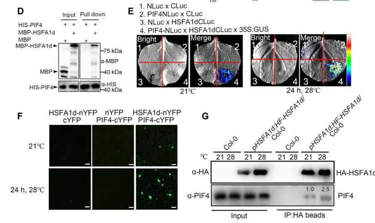

## Question

# Gene Research for Functional Annotation

## ⚠️ CRITICAL: Gene/Protein Identification Context

**BEFORE YOU BEGIN RESEARCH:** You MUST verify you are researching the CORRECT gene/protein. Gene symbols can be ambiguous, especially for less well-characterized genes from non-model organisms.

### Target Gene/Protein Identity (from UniProt):
- **UniProt Accession:** O81821
- **Protein Description:** RecName: Full=Heat stress transcription factor A-1b; Short=AtHsfA1b; AltName: Full=AtHsf-18; AltName: Full=Heat shock factor protein 3; Short=HSF 3; AltName: Full=Heat shock transcription factor 3; Short=HSTF 3;
- **Gene Information:** Name=HSFA1B; Synonyms=HSF18, HSF3; OrderedLocusNames=At5g16820; ORFNames=F5E19.160;
- **Organism (full):** Arabidopsis thaliana (Mouse-ear cress).
- **Protein Family:** Belongs to the HSF family. Class A subfamily.
- **Key Domains:** HSF_DNA-bd. (IPR000232); WH-like_DNA-bd_sf. (IPR036388); WH_DNA-bd_sf. (IPR036390); HSF_DNA-bind (PF00447)

### MANDATORY VERIFICATION STEPS:

1. **Check if the gene symbol "HSFA1B" matches the protein description above**
2. **Verify the organism is correct:** Arabidopsis thaliana (Mouse-ear cress).
3. **Check if protein family/domains align with what you find in literature**
4. **If you find literature for a DIFFERENT gene with the same or similar symbol, STOP**

### If Gene Symbol is Ambiguous or You Cannot Find Relevant Literature:

**DO NOT PROCEED WITH RESEARCH ON A DIFFERENT GENE.** Instead:
- State clearly: "The gene symbol 'HSFA1B' is ambiguous or literature is limited for this specific protein"
- Explain what you found (e.g., "Found extensive literature on a different gene with the same symbol in a different organism")
- Describe the protein based ONLY on the UniProt information provided above
- Suggest that the protein function can be inferred from domain/family information

### Research Target:

Please provide a comprehensive research report on the gene **HSFA1B** (gene ID: AT5G16820, UniProt: O81821) in ARATH.

The research report should be a detailed narrative explaining the function, biological processes, and localization of the gene product. Citations should be given for all claims.

You should prioritize authoritative reviews and primary scientific literature when conducting research. You can supplement
this with annotations you find in gene/protein databases, but these can be outdated or inaccurate.

We are specifically interested in the primary function of the gene - for enzymes, what reaction is catalyzed, and what is the substrate specificity? For transporters, what is the substrate? For structural proteins or adapters, what is the broader structural role? For signaling molecules, what is the role in the pathway.

We are interested in where in or outside the cell the gene product carries out its function.

We are also interested in the signaling or biochemical pathways in which the gene functions. We are less interested in broad pleiotropic effects, except where these elucidate the precise role.

Include evidence where possible. We are interested in both experimental evidence as well as inference from structure, evolution, or bioinformatic analysis. Precise studies should be prioritized over high-throughput, where available.

## Output

Question: You are an expert researcher providing comprehensive, well-cited information.

Provide detailed information focusing on:
1. Key concepts and definitions with current understanding
2. Recent developments and latest research (prioritize 2023-2024 sources)
3. Current applications and real-world implementations
4. Expert opinions and analysis from authoritative sources
5. Relevant statistics and data from recent studies

Format as a comprehensive research report with proper citations. Include URLs and publication dates where available.
Always prioritize recent, authoritative sources and provide specific citations for all major claims.

# Gene Research for Functional Annotation

## ⚠️ CRITICAL: Gene/Protein Identification Context

**BEFORE YOU BEGIN RESEARCH:** You MUST verify you are researching the CORRECT gene/protein. Gene symbols can be ambiguous, especially for less well-characterized genes from non-model organisms.

### Target Gene/Protein Identity (from UniProt):
- **UniProt Accession:** O81821
- **Protein Description:** RecName: Full=Heat stress transcription factor A-1b; Short=AtHsfA1b; AltName: Full=AtHsf-18; AltName: Full=Heat shock factor protein 3; Short=HSF 3; AltName: Full=Heat shock transcription factor 3; Short=HSTF 3;
- **Gene Information:** Name=HSFA1B; Synonyms=HSF18, HSF3; OrderedLocusNames=At5g16820; ORFNames=F5E19.160;
- **Organism (full):** Arabidopsis thaliana (Mouse-ear cress).
- **Protein Family:** Belongs to the HSF family. Class A subfamily.
- **Key Domains:** HSF_DNA-bd. (IPR000232); WH-like_DNA-bd_sf. (IPR036388); WH_DNA-bd_sf. (IPR036390); HSF_DNA-bind (PF00447)

### MANDATORY VERIFICATION STEPS:

1. **Check if the gene symbol "HSFA1B" matches the protein description above**
2. **Verify the organism is correct:** Arabidopsis thaliana (Mouse-ear cress).
3. **Check if protein family/domains align with what you find in literature**
4. **If you find literature for a DIFFERENT gene with the same or similar symbol, STOP**

### If Gene Symbol is Ambiguous or You Cannot Find Relevant Literature:

**DO NOT PROCEED WITH RESEARCH ON A DIFFERENT GENE.** Instead:
- State clearly: "The gene symbol 'HSFA1B' is ambiguous or literature is limited for this specific protein"
- Explain what you found (e.g., "Found extensive literature on a different gene with the same symbol in a different organism")
- Describe the protein based ONLY on the UniProt information provided above
- Suggest that the protein function can be inferred from domain/family information

### Research Target:

Please provide a comprehensive research report on the gene **HSFA1B** (gene ID: AT5G16820, UniProt: O81821) in ARATH.

The research report should be a detailed narrative explaining the function, biological processes, and localization of the gene product. Citations should be given for all claims.

You should prioritize authoritative reviews and primary scientific literature when conducting research. You can supplement
this with annotations you find in gene/protein databases, but these can be outdated or inaccurate.

We are specifically interested in the primary function of the gene - for enzymes, what reaction is catalyzed, and what is the substrate specificity? For transporters, what is the substrate? For structural proteins or adapters, what is the broader structural role? For signaling molecules, what is the role in the pathway.

We are interested in where in or outside the cell the gene product carries out its function.

We are also interested in the signaling or biochemical pathways in which the gene functions. We are less interested in broad pleiotropic effects, except where these elucidate the precise role.

Include evidence where possible. We are interested in both experimental evidence as well as inference from structure, evolution, or bioinformatic analysis. Precise studies should be prioritized over high-throughput, where available.

# Comprehensive research report: **Arabidopsis thaliana HSFA1B** (AT5G16820; UniProt O81821)

## 0) Scope and target verification (critical)
The target in this report is **Arabidopsis thaliana** **HSFA1B** (locus **At5g16820**, UniProt **O81821**), annotated as **Heat stress transcription factor A-1b (AtHsfA1b)** and a member of the plant **HSF family, class A1**. Multiple authoritative sources explicitly map **HSFA1B to At5g16820** and place it within the four Arabidopsis **HSFA1 isoforms (HSFA1a/b/d/e)** that function as top-tier regulators of heat responses. (wang2023transcriptionalregulatorsof pages 2-4, liu2011theroleof pages 1-2, liu2011theroleof pages 6-7)

## 1) Key concepts and definitions (current understanding)

### 1.1 Heat-shock response (HSR) and HSFs
The plant **heat-shock response (HSR)** is a transcriptional program induced by elevated temperature (and associated proteotoxic stress) that promotes proteostasis and survival, largely via induction of **heat shock proteins (HSPs)**. In plants, **heat shock transcription factors (HSFs)** are the core transcriptional regulators of HSR. HSFs recognize **heat shock elements (HSEs)** in promoters, typically built from **nGAAn repeats** (e.g., GAAnnTTC) and activate transcription of HSPs and other stress-response genes. (liu2013commonanddistinct pages 1-2, wang2023transcriptionalregulatorsof pages 2-4)

### 1.2 Class A1 HSFs as master regulators
Arabidopsis contains 21 HSFs, but the **class A1 HSFs (HSFA1a, HSFA1b, HSFA1d, HSFA1e)** are repeatedly described as **master regulators** because they sit upstream of large fractions of HS-induced transcription and trigger downstream HSF cascades (e.g., induction of HSFA2). (liu2013commonanddistinct pages 1-2, liu2011theroleof pages 1-2, wang2023transcriptionalregulatorsof pages 2-4)

### 1.3 “Master regulator” versus “molecular rheostat” framing
Recent synthesis argues that HSFs are not simply ON/OFF switches; rather, their activity acts as a **dynamic rheostat** controlling intensity and timing of stress protection versus recovery/growth, using partner-protein interactions and feedback attenuation. This conceptual framing is important for interpreting HSFA1B phenotypes, which are often subtle in single mutants because network-level buffering tunes system output. (bakery2024heatstresstranscription pages 4-4)

## 2) HSFA1B molecular function and mechanism

### 2.1 Molecular function: sequence-specific transcription factor
HSFA1B is a **sequence-specific DNA-binding transcription factor**. As a class A HSF, it contains a **transactivation motif** enabling transcriptional activation, and it binds HSEs to promote expression of HSR genes and other stress-adaptive programs. (liu2013commonanddistinct pages 1-2, liu2011theroleof pages 1-2)

### 2.2 DNA binding and promoter logic
Genome-wide profiling shows HSFA1B recognizes canonical HSEs and co-occurs with other promoter motifs such as **G-box, CArG (MADS-box), LEAFY**, and **UPRE** motifs, consistent with combinatorial regulation of stress and development. (albihlal2018arabidopsisheatshock pages 10-12, albihlal2018arabidopsisheatshock pages 1-4)

### 2.3 Regulation/activation: chaperone repression and release
A widely supported model is that at ambient temperature, HSFA1 proteins are **repressed by direct association with HSP70/HSP90**, limiting transcriptional activation and even nuclear localization; heat-driven protein misfolding titrates chaperones away and releases HSFA1s to activate transcription. (wang2023transcriptionalregulatorsof pages 2-4, bakery2024heatstresstranscription pages 4-4)

### 2.4 Post-translational and signaling integration
HSFA1 activity is tuned by **post-translational modifications** including **phosphorylation and SUMOylation** (and ubiquitination in some models), and by interactions with kinases/phosphatases (e.g., **CDKA1, CBK3, PP7**) and negative regulators (e.g., **HSBP, HSFB antagonists**, and other attenuation factors). These layers are central to the “rheostat” view of HSF function. (wang2023transcriptionalregulatorsof pages 2-4, bakery2024heatstresstranscription pages 4-4, bakery2024heatstresstranscription pages 3-3)

## 3) Biological roles of HSFA1B in Arabidopsis

### 3.1 Early HSR and thermotolerance; redundancy within HSFA1s
Genetic and transcriptome evidence supports HSFA1B as part of a partially redundant HSFA1 module that is required for robust thermotolerance and HSR. A key quantitative estimate from hsfa1 loss-of-function analyses is that **more than 65%** of heat-upregulated genes are HSFA1-dependent. (liu2011theroleof pages 1-2)

A detailed microarray comparison reported that, across two Arabidopsis ecotypes, the hsfa1 quadruple mutant shows >3-fold reduction for **230/346 (66.5%)** and **278/408 (68.1%)** heat-upregulated genes, with **209 genes** affected in both ecotypes. (liu2011theroleof pages 6-7)

Within the HSFA1 clade, HSFA1a and HSFA1d are often described as stronger effectors, but HSFA1b contributes substantially and can act redundantly with other HSFA1s, particularly in the early phase of heat responses. (liu2011theroleof pages 6-7)

### 3.2 Systems-level target network: HSFA1B links stress defense with growth/development
A key HSFA1B-specific advance is genome-wide mapping of HSFA1B binding and transcript effects.

**Albihlal et al. 2018 (J Exp Bot; published Apr 2018; https://doi.org/10.1093/jxb/ery142)** performed HSFA1B ChIP-seq and RNA-seq under **non-stress** and **heat stress (37°C, 30 min)**. They identified **709** binding peaks under non-stress and **1083** under heat stress, corresponding to **1207 HSFA1B target genes** (q≤0.05; FE≥2). (albihlal2018arabidopsisheatshock pages 7-10)

The binding pattern reconfigures rapidly with heat: within 30 min of heat, HSFA1B **ceases binding 124 genes** (NS-unique group) and **engages 553 genes** (HS-unique group), demonstrating a fast switch in target selection between growth/development and stress defense. (albihlal2018arabidopsisheatshock pages 12-15)

On the expression side, heat triggered **7137** differentially expressed genes (DEGs), of which **721** were HSFA1B-bound; HSFA1B overexpression changed **3306** protein-coding genes, with **72%** overlap with heat-regulated genes, and the overexpression transcriptome sits “between” NS and HS wild-type states (Pearson r=0.92 vs NS WT; r=0.88 vs HS WT). (albihlal2018arabidopsisheatshock pages 10-12, albihlal2018arabidopsisheatshock pages 7-10)

Together, these data support a model in which HSFA1B does not only activate classical HSP genes but also participates in **developmental and reproductive regulation** in ways that can affect fitness trade-offs. (albihlal2018arabidopsisheatshock pages 1-4)

### 3.3 Downstream pathways and transcriptional cascade
Reviews and primary research describe HSFA1s (including HSFA1B) as initiating a cascade that includes:
- Direct/indirect induction of **HSFA2** and **HSFA3** (HSFA3 partly via HSFA1-induced DREB2s), (kappel2023genomicandepigenomic pages 3-5)
- Induction of other TF regulators (e.g., **DREB2A, HSFA7A/B, MBF1C**), (wang2023transcriptionalregulatorsof pages 2-4)
- Induction and later attenuation by **HSFB repressors** (HSFB1/HSFB2 classes), (wang2023transcriptionalregulatorsof pages 2-4, bakery2024heatstresstranscription pages 4-4)
- Large-scale induction of **HSP families** that execute proteostasis protection. (li2025heatshocktranscription pages 6-7, wang2023transcriptionalregulatorsof pages 2-4)

### 3.4 Thermomorphogenesis: integration of warm temperature with light via PIF4
A major recent development is the linkage of HSFA1s to warm-temperature growth responses (thermomorphogenesis), not only extreme heat stress.

**Tan et al. 2023 (Science Advances; published Nov 2023; https://doi.org/10.1126/sciadv.adh1738)** reported that under warm daytime temperatures HSFA1 proteins **accumulate and move into the nucleus**, where they interact with **PIF4** and stabilize it by interfering with the phyB–PIF4 interaction; HSFA1s are required for warm-temperature hypocotyl elongation phenotypes. (tan2023theheatresponse pages 1-2)

Figure evidence from this study supports nuclear interaction and nuclear relocalization (shown for HSFA1d, interpreted as HSFA1-family behavior): BiFC shows HSFA1d–PIF4 interaction in nuclei and strengthened at 28°C compared to 21°C, and imaging shows 28°C promotes HSFA1d-GFP nuclear translocation in light. (tan2023theheatresponse media 2354b667)

This work positions HSFA1 family members (including HSFA1B) as integrators of **temperature and light signaling**, beyond canonical HSR. (tan2023theheatresponse pages 1-2)

## 4) Cellular localization: where HSFA1B acts
HSFA1B is expected to execute its transcriptional function in the **nucleus**, and regulatory models explicitly connect repression/activation to **nuclear localization control** (HSP70/HSP90-mediated repression of nuclear localization at ambient conditions; release upon heat). (wang2023transcriptionalregulatorsof pages 2-4)

Direct imaging/localization in the most recent primary work is shown for HSFA1d (nuclear accumulation and nuclear PIF4 interaction) and is used to infer family-level behavior for HSFA1s under warm conditions; however, isoform-specific HSFA1B localization microscopy was not present in the extracted excerpts. (tan2023theheatresponse pages 1-2, tan2023theheatresponse media 2354b667)

## 5) Heat-stress memory (thermomemory) connections

### 5.1 HSFA1B is upstream of memory HSFs
A key recent genome-wide analysis connects early HSFA1 activity with memory-HSF induction.

**Kappel et al. 2023 (Genome Biology; published May 2023; https://doi.org/10.1186/s13059-023-02970-5)** states that HSFA1 isoforms (HSFA1A/HSFA1B/HSFA1D) are constitutively expressed and required for the early HS response; HSFA1s directly induce HSFA2, and promote HSFA3 activation via DREB2 intermediates. (kappel2023genomicandepigenomic pages 1-3, kappel2023genomicandepigenomic pages 3-5)

### 5.2 Memory gene determinants and quantitative genome-wide data
Kappel et al. performed time-course ChIP-seq for memory factors HSFA2/HSFA3 and found binding is strongly sequence-determined and memory genes are enriched for a **tripartite HSE**, accessible chromatin, and heat-induced **H3K4me3**. They clustered peaks into **15** clusters; **7 HS-induced clusters** comprised **4,948 peaks** as putatively biologically relevant targets. (kappel2023genomicandepigenomic pages 3-5)

They also report in vitro binding assays including HSFA1b (at **25°C vs 37°C**) to explore DNA sequence contributions to binding. (kappel2023genomicandepigenomic pages 5-8)

## 6) Current applications and real-world implementations

### 6.1 Engineering principles: why HSFA1-family manipulation is attractive and risky
Because HSFA1s are upstream “master regulators,” they are attractive for engineering thermotolerance; however, broad activation can impose growth penalties. A recent review summarizes that inducible strategies may reduce trade-offs.

**Wang et al. 2023 (IJMS; published Aug 2023; https://doi.org/10.3390/ijms241713297)** discusses transgenic overexpression as a strategy to enhance heat tolerance in crops (with examples in other species) but emphasizes that constitutive overproduction may cause growth retardation and therefore highlights use of **inducible promoters** (including heat-inducible promoters). It also describes a programmable epigenome strategy: **heat-inducible dCas9 fused to an H3K4 demethylase (JMJ) domain** in Arabidopsis to target histone modification at selected loci, illustrating a modern implementation path for heat-response engineering. (wang2023transcriptionalregulatorsof pages 9-11)

### 6.2 HSFA1B network tuning: from overexpression to promoter engineering
HSFA1B-specific work shows that overexpression can “pre-poise” transcriptomes between growth and defense states, suggesting biotechnological utility but also likely pleiotropy. In Arabidopsis, HSFA1B overexpression increases stress resistance and can shift biomass allocation toward reproduction/seed yield in the Albihlal et al. framework, supporting a potential route for yield stability under stress. (albihlal2018arabidopsisheatshock pages 1-4)

While many explicit crop engineering examples in the retrieved set are for HSFA1 homologs in non-Arabidopsis systems, the mechanistic logic is transferable: HSFA1-family tuning of HSP and antioxidant/proteostasis networks is a common engineering target. (wang2023transcriptionalregulatorsof pages 9-11)

## 7) Consolidated evidence map
The following table provides a compact evidence-linked map of HSFA1B identity, mechanism, pathways, recent developments, and quantitative data.

| Category | Summary |
|---|---|
| Identity/domains | Arabidopsis thaliana HSFA1B corresponds to locus **At5g16820** and UniProt **O81821**; it is one of four **class A1 heat shock factors** (HSFA1a/b/d/e) in the 21-member Arabidopsis HSF family. HSFs contain an **HSF DNA-binding domain**, oligomerization heptad-repeat regions, and class A members carry a **C-terminal transactivation motif** enabling activator function. HSFA1B is repeatedly placed in the **master-regulator HSFA1 subgroup** rather than being a separate non-HSF protein. (liu2013commonanddistinct pages 1-2, wang2023transcriptionalregulatorsof pages 2-4, liu2011theroleof pages 1-2) |
| Molecular function | HSFA1B functions as a **sequence-specific transcription factor** that binds **heat shock elements (HSEs; GAAnnTTC/nGAAn repeats)** in promoters, oligomerizes, and activates heat-responsive transcription. As part of HSFA1s, it regulates a large share of the early heat-shock transcriptome and can promote expression of other HSFs and HSP genes. Evidence supports **partial redundancy** with HSFA1a and HSFA1d, with HSFA1b contributing to the early phase of heat-shock gene activation rather than acting alone. (liu2013commonanddistinct pages 1-2, liu2011theroleof pages 1-2, guan2013molecularmechanismsof pages 58-64) |
| Activation/regulation | At normal temperatures, **HSP70/HSP90 repress HSFA1 activity** and can limit transcriptional activation and nuclear localization; heat-induced protein misfolding releases HSFA1s for activation. Activated HSFA1s undergo **oligomerization**, **nuclear translocation**, and are further modulated by **phosphorylation, SUMOylation, and ubiquitination**; kinases such as **CDKA1/CBK3** and regulators including **PP7**, **HSBP**, **BIN2**, and other HSFB antagonists tune activity. HSFA1s are also integrated with ROS/Ca2+ signaling and chromatin accessibility. (wang2023transcriptionalregulatorsof pages 2-4, bakery2024heatstresstranscription pages 4-4, bakery2024heatstresstranscription pages 3-3) |
| Downstream targets | Reported HSFA1/HSFA1B downstream targets and network outputs include **HSP genes**, **HSFA2**, **HSFA3** (indirectly via DREB2s), **DREB2A**, **HSFA7A/B**, **MBF1C**, and **HSFB1/HSFB2A/HSFB2B**. Recent thermomorphogenesis work shows HSFA1s also interact with **PIF4**, stabilizing it under warm daytime temperatures to connect heat and light signaling. In transcriptional-memory studies, HSFA1b was assayed together with HSFA2/HSFA3 in vitro, supporting its placement upstream of memory-HSF cascades. (wang2023transcriptionalregulatorsof pages 2-4, bakery2024heatstresstranscription pages 9-9, kappel2023genomicandepigenomic pages 3-5, kappel2023genomicandepigenomic pages 5-8) |
| Biological processes/phenotypes | HSFA1B participates in **basal thermotolerance**, **acquired thermotolerance**, and the **early heat-stress response**; together with HSFA1a/1d it is also implicated in responses to salt, osmotic, oxidative, and other stresses. Single hsfa1b loss often shows weak phenotype because of redundancy, whereas higher-order **hsfa1 mutants** display severe heat sensitivity and developmental defects; overexpression studies indicate HSFA1B can drive constitutive HSP accumulation and broaden stress tolerance. HSFA1s also contribute to **thermomorphogenesis** by enabling temperature-induced hypocotyl elongation. (albhilal2015thearabidopsisthaliana pages 38-42, liu2013commonanddistinct pages 1-2, liu2011theroleof pages 6-7, tan2023theheatresponse pages 1-2) |
| Localization | As expected for a transcription factor, HSFA1B acts in the **nucleus** after activation. Reviews state HSP70/HSP90 repression affects **nuclear localization**, and recent Arabidopsis work showed HSFA1 proteins accumulate and **move into the nucleus under warm daytime temperature**; direct imaging was shown for HSFA1d, which is generally interpreted as informative for HSFA1-family behavior, though not HSFA1B specifically. Nuclear interaction of HSFA1s with **PIF4** further supports a nuclear site of action. (wang2023transcriptionalregulatorsof pages 2-4, tan2023theheatresponse pages 1-2, tan2023theheatresponse media 2354b667) |
| Recent (2023-2024) developments | 2023 reviews reaffirm HSFA1s, including HSFA1B, as the **central activators/master regulators** of plant heat-stress transcription. **Kappel et al. 2023** linked upstream HSFA1 activity to memory-HSF induction and showed memory genes are enriched for **tripartite HSEs**, accessible chromatin, and heat-induced **H3K4me3**. **Tan et al. 2023** connected HSFA1s to **thermomorphogenesis via PIF4 stabilization**, and **Bakery et al. 2024** reframed HSFs as a dynamic **molecular rheostat** tuned by chaperones, PTMs, and attenuation circuits. (tan2023theheatresponse pages 1-2, kappel2023genomicandepigenomic pages 3-5, kappel2023genomicandepigenomic pages 1-3, bakery2024heatstresstranscription pages 4-4) |
| Quantitative data | Transcriptomics from HSFA1-loss mutants indicate **>65%** of heat-upregulated genes are HSFA1 dependent; specifically, one analysis found **230/346 (66.5%)** and **278/408 (68.1%)** heat-upregulated genes reduced >3-fold in the hsfa1 quadruple mutant in two ecotypes, with **209 genes** commonly affected. Kappel et al. identified **15 ChIP-seq clusters**, with **7 heat-induced clusters totaling 4,948 peaks** for HSFA2/HSFA3; one memory-associated cluster (**c12**) contained **43 genes**. Thermomemory-related in vitro binding assays compared HSFA2, HSFA3, and HSFA1b at **25°C vs 37°C**. (liu2011theroleof pages 6-7, kappel2023genomicandepigenomic pages 3-5, kappel2023genomicandepigenomic pages 5-8) |

*Table: This table summarizes the core functional annotation of Arabidopsis HSFA1B/At5g16820, including identity, molecular role, regulation, pathways, localization, recent 2023–2024 advances, and quantitative findings. It is useful as a compact evidence map linking HSFA1B to authoritative mechanistic and genome-wide studies.*

## 8) Practical functional annotation summary (actionable)

**Primary molecular function:** HSFA1B is a **sequence-specific DNA-binding transcription factor** (class A1 HSF) that activates transcription at **HSE-containing promoters**, initiating early heat-stress transcription and broader temperature-responsive programs. (liu2013commonanddistinct pages 1-2, liu2011theroleof pages 1-2, wang2023transcriptionalregulatorsof pages 2-4)

**Key biological processes:** basal and acquired thermotolerance/HSR; integration of warm-temperature signals with growth (thermomorphogenesis); coupling of stress defense to development and reproductive fitness through extensive direct/indirect transcriptional regulation. (tan2023theheatresponse pages 1-2, albihlal2018arabidopsisheatshock pages 1-4, albihlal2018arabidopsisheatshock pages 7-10)

**Cellular site of action:** predominantly **nuclear** during activation; nuclear accumulation and nuclear partner interactions are core to HSFA1-family function (demonstrated for HSFA1s in warm temperature contexts). (wang2023transcriptionalregulatorsof pages 2-4, tan2023theheatresponse pages 1-2, tan2023theheatresponse media 2354b667)

**Core pathway placement:** upstream “master regulator” layer (HSFA1a/b/d/e) → induction of HSP genes and downstream TF cascade (HSFA2/3, DREB2A, MBF1C, HSFA7s) → proteostasis, antioxidant/redox balancing, and chromatin-associated memory programs (H3K4me3 enrichment at memory genes via HSFA2/3). (wang2023transcriptionalregulatorsof pages 2-4, kappel2023genomicandepigenomic pages 3-5, kappel2023genomicandepigenomic pages 1-3)

## 9) Limitations and evidence gaps
- **Isoform-specific HSFA1B localization microscopy** was not found in the extracted passages; recent imaging is strongest for HSFA1d within the HSFA1 family. (tan2023theheatresponse pages 1-2, tan2023theheatresponse media 2354b667)
- Several application claims regarding specific crops and HSFA1 homologs were discussed in reviews; for strict “real-world implementation,” confirmation at field scale would require the original crop trials, which were not directly retrieved here. (wang2023transcriptionalregulatorsof pages 9-11)

References

1. (wang2023transcriptionalregulatorsof pages 2-4): Xuejing Wang, Nicholas Wui Kiat Tan, Fong Yi Chung, Nobutoshi Yamaguchi, Eng-Seng Gan, and Toshiro Ito. Transcriptional regulators of plant adaptation to heat stress. International Journal of Molecular Sciences, 24:13297, Aug 2023. URL: https://doi.org/10.3390/ijms241713297, doi:10.3390/ijms241713297. This article has 44 citations.

2. (liu2011theroleof pages 1-2): HSIANG‐CHIN LIU, HSIU‐TING LIAO, and YEE‐YUNG CHARNG. The role of class a1 heat shock factors (hsfa1s) in response to heat and other stresses in arabidopsis. Plant, cell & environment, 34 5:738-51, May 2011. URL: https://doi.org/10.1111/j.1365-3040.2011.02278.x, doi:10.1111/j.1365-3040.2011.02278.x. This article has 667 citations.

3. (liu2011theroleof pages 6-7): HSIANG‐CHIN LIU, HSIU‐TING LIAO, and YEE‐YUNG CHARNG. The role of class a1 heat shock factors (hsfa1s) in response to heat and other stresses in arabidopsis. Plant, cell & environment, 34 5:738-51, May 2011. URL: https://doi.org/10.1111/j.1365-3040.2011.02278.x, doi:10.1111/j.1365-3040.2011.02278.x. This article has 667 citations.

4. (liu2013commonanddistinct pages 1-2): Hsiang-chin Liu and Yee-yung Charng. Common and distinct functions of arabidopsis class a1 and a2 heat shock factors in diverse abiotic stress responses and development1[w][open]. Plant Physiology, 163:276-290, Jul 2013. URL: https://doi.org/10.1104/pp.113.221168, doi:10.1104/pp.113.221168. This article has 263 citations and is from a highest quality peer-reviewed journal.

5. (bakery2024heatstresstranscription pages 4-4): Ayat Bakery, Stavros Vraggalas, Boushra Shalha, Harsh Chauhan, Moussa Benhamed, and Sotirios Fragkostefanakis. Heat stress transcription factors as the central molecular rheostat to optimize plant survival and recovery from heat stress. The New phytologist, 244:51-64, Jul 2024. URL: https://doi.org/10.1111/nph.20017, doi:10.1111/nph.20017. This article has 93 citations.

6. (albihlal2018arabidopsisheatshock pages 10-12): Waleed S Albihlal, Irabonosi Obomighie, Thomas Blein, Ramona Persad, Igor Chernukhin, Martin Crespi, Ulrike Bechtold, and Philip M Mullineaux. Arabidopsis heat shock transcription factora1b regulates multiple developmental genes under benign and stress conditions. Journal of Experimental Botany, 69:2847-2862, Apr 2018. URL: https://doi.org/10.1093/jxb/ery142, doi:10.1093/jxb/ery142. This article has 89 citations and is from a domain leading peer-reviewed journal.

7. (albihlal2018arabidopsisheatshock pages 1-4): Waleed S Albihlal, Irabonosi Obomighie, Thomas Blein, Ramona Persad, Igor Chernukhin, Martin Crespi, Ulrike Bechtold, and Philip M Mullineaux. Arabidopsis heat shock transcription factora1b regulates multiple developmental genes under benign and stress conditions. Journal of Experimental Botany, 69:2847-2862, Apr 2018. URL: https://doi.org/10.1093/jxb/ery142, doi:10.1093/jxb/ery142. This article has 89 citations and is from a domain leading peer-reviewed journal.

8. (bakery2024heatstresstranscription pages 3-3): Ayat Bakery, Stavros Vraggalas, Boushra Shalha, Harsh Chauhan, Moussa Benhamed, and Sotirios Fragkostefanakis. Heat stress transcription factors as the central molecular rheostat to optimize plant survival and recovery from heat stress. The New phytologist, 244:51-64, Jul 2024. URL: https://doi.org/10.1111/nph.20017, doi:10.1111/nph.20017. This article has 93 citations.

9. (albihlal2018arabidopsisheatshock pages 7-10): Waleed S Albihlal, Irabonosi Obomighie, Thomas Blein, Ramona Persad, Igor Chernukhin, Martin Crespi, Ulrike Bechtold, and Philip M Mullineaux. Arabidopsis heat shock transcription factora1b regulates multiple developmental genes under benign and stress conditions. Journal of Experimental Botany, 69:2847-2862, Apr 2018. URL: https://doi.org/10.1093/jxb/ery142, doi:10.1093/jxb/ery142. This article has 89 citations and is from a domain leading peer-reviewed journal.

10. (albihlal2018arabidopsisheatshock pages 12-15): Waleed S Albihlal, Irabonosi Obomighie, Thomas Blein, Ramona Persad, Igor Chernukhin, Martin Crespi, Ulrike Bechtold, and Philip M Mullineaux. Arabidopsis heat shock transcription factora1b regulates multiple developmental genes under benign and stress conditions. Journal of Experimental Botany, 69:2847-2862, Apr 2018. URL: https://doi.org/10.1093/jxb/ery142, doi:10.1093/jxb/ery142. This article has 89 citations and is from a domain leading peer-reviewed journal.

11. (kappel2023genomicandepigenomic pages 3-5): Christian Kappel, Thomas Friedrich, Vicky Oberkofler, Li Jiang, Tim Crawford, Michael Lenhard, and Isabel Bäurle. Genomic and epigenomic determinants of heat stress-induced transcriptional memory in arabidopsis. Genome Biology, May 2023. URL: https://doi.org/10.1186/s13059-023-02970-5, doi:10.1186/s13059-023-02970-5. This article has 54 citations and is from a highest quality peer-reviewed journal.

12. (li2025heatshocktranscription pages 6-7): Yuan Li, Kang Gong, Xinyi Wang, Zhihong Sun, and Fei Ding. Heat shock transcription factors as central integrators of plant stress responses: from thermotolerance to multi-stress resilience. Biology, 14:1800, Dec 2025. URL: https://doi.org/10.3390/biology14121800, doi:10.3390/biology14121800. This article has 1 citations.

13. (tan2023theheatresponse pages 1-2): Wenrong Tan, Junhua Chen, Xiaolan Yue, Shuli Chai, Wei Liu, Chenglin Li, Feng Yang, Yongfeng Gao, Lucas Gutiérrez Rodríguez, Víctor Resco de Dios, Dawei Zhang, and Yinan Yao. The heat response regulators hsfa1s promote arabidopsis thermomorphogenesis via stabilizing pif4 during the day. Science Advances, Nov 2023. URL: https://doi.org/10.1126/sciadv.adh1738, doi:10.1126/sciadv.adh1738. This article has 71 citations and is from a highest quality peer-reviewed journal.

14. (tan2023theheatresponse media 2354b667): Wenrong Tan, Junhua Chen, Xiaolan Yue, Shuli Chai, Wei Liu, Chenglin Li, Feng Yang, Yongfeng Gao, Lucas Gutiérrez Rodríguez, Víctor Resco de Dios, Dawei Zhang, and Yinan Yao. The heat response regulators hsfa1s promote arabidopsis thermomorphogenesis via stabilizing pif4 during the day. Science Advances, Nov 2023. URL: https://doi.org/10.1126/sciadv.adh1738, doi:10.1126/sciadv.adh1738. This article has 71 citations and is from a highest quality peer-reviewed journal.

15. (kappel2023genomicandepigenomic pages 1-3): Christian Kappel, Thomas Friedrich, Vicky Oberkofler, Li Jiang, Tim Crawford, Michael Lenhard, and Isabel Bäurle. Genomic and epigenomic determinants of heat stress-induced transcriptional memory in arabidopsis. Genome Biology, May 2023. URL: https://doi.org/10.1186/s13059-023-02970-5, doi:10.1186/s13059-023-02970-5. This article has 54 citations and is from a highest quality peer-reviewed journal.

16. (kappel2023genomicandepigenomic pages 5-8): Christian Kappel, Thomas Friedrich, Vicky Oberkofler, Li Jiang, Tim Crawford, Michael Lenhard, and Isabel Bäurle. Genomic and epigenomic determinants of heat stress-induced transcriptional memory in arabidopsis. Genome Biology, May 2023. URL: https://doi.org/10.1186/s13059-023-02970-5, doi:10.1186/s13059-023-02970-5. This article has 54 citations and is from a highest quality peer-reviewed journal.

17. (wang2023transcriptionalregulatorsof pages 9-11): Xuejing Wang, Nicholas Wui Kiat Tan, Fong Yi Chung, Nobutoshi Yamaguchi, Eng-Seng Gan, and Toshiro Ito. Transcriptional regulators of plant adaptation to heat stress. International Journal of Molecular Sciences, 24:13297, Aug 2023. URL: https://doi.org/10.3390/ijms241713297, doi:10.3390/ijms241713297. This article has 44 citations.

18. (guan2013molecularmechanismsof pages 58-64): Q Guan. Molecular mechanisms of plant responses to cold, heat and salt stresses in arabidopsis. Unknown journal, 2013.

19. (bakery2024heatstresstranscription pages 9-9): Ayat Bakery, Stavros Vraggalas, Boushra Shalha, Harsh Chauhan, Moussa Benhamed, and Sotirios Fragkostefanakis. Heat stress transcription factors as the central molecular rheostat to optimize plant survival and recovery from heat stress. The New phytologist, 244:51-64, Jul 2024. URL: https://doi.org/10.1111/nph.20017, doi:10.1111/nph.20017. This article has 93 citations.

20. (albhilal2015thearabidopsisthaliana pages 38-42): WS Albhilal. The arabidopsis thaliana heat shock transcription factor a1b transcriptional regulatory network. Unknown journal, 2015.

## Artifacts

- [Edison artifact artifact-00](AT5G16820-deep-research-falcon_artifacts/artifact-00.md)

## Citations

1. bakery2024heatstresstranscription pages 4-4
2. liu2011theroleof pages 1-2
3. liu2011theroleof pages 6-7
4. albihlal2018arabidopsisheatshock pages 7-10
5. albihlal2018arabidopsisheatshock pages 12-15
6. albihlal2018arabidopsisheatshock pages 1-4
7. kappel2023genomicandepigenomic pages 3-5
8. wang2023transcriptionalregulatorsof pages 2-4
9. tan2023theheatresponse pages 1-2
10. kappel2023genomicandepigenomic pages 5-8
11. wang2023transcriptionalregulatorsof pages 9-11
12. liu2013commonanddistinct pages 1-2
13. albihlal2018arabidopsisheatshock pages 10-12
14. bakery2024heatstresstranscription pages 3-3
15. li2025heatshocktranscription pages 6-7
16. kappel2023genomicandepigenomic pages 1-3
17. guan2013molecularmechanismsof pages 58-64
18. bakery2024heatstresstranscription pages 9-9
19. albhilal2015thearabidopsisthaliana pages 38-42
20. w
21. open
22. https://doi.org/10.1093/jxb/ery142
23. https://doi.org/10.1126/sciadv.adh1738
24. https://doi.org/10.1186/s13059-023-02970-5
25. https://doi.org/10.3390/ijms241713297
26. https://doi.org/10.3390/ijms241713297,
27. https://doi.org/10.1111/j.1365-3040.2011.02278.x,
28. https://doi.org/10.1104/pp.113.221168,
29. https://doi.org/10.1111/nph.20017,
30. https://doi.org/10.1093/jxb/ery142,
31. https://doi.org/10.1186/s13059-023-02970-5,
32. https://doi.org/10.3390/biology14121800,
33. https://doi.org/10.1126/sciadv.adh1738,