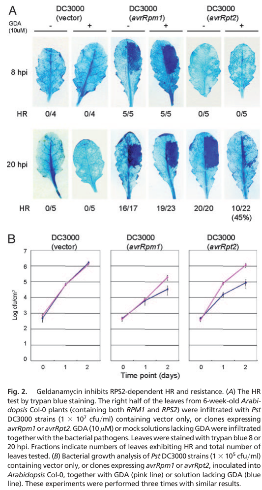

## Question

# Gene Research for Functional Annotation

## ⚠️ CRITICAL: Gene/Protein Identification Context

**BEFORE YOU BEGIN RESEARCH:** You MUST verify you are researching the CORRECT gene/protein. Gene symbols can be ambiguous, especially for less well-characterized genes from non-model organisms.

### Target Gene/Protein Identity (from UniProt):
- **UniProt Accession:** P27323
- **Protein Description:** RecName: Full=Heat shock protein 90-1 {ECO:0000305}; Short=AtHSP90.1 {ECO:0000305}; Short=AtHsp90-1 {ECO:0000303|PubMed:11599565}; AltName: Full=Heat shock protein 81-1 {ECO:0000305}; Short=Hsp81-1 {ECO:0000303|PubMed:11599565}; AltName: Full=Heat shock protein 83;
- **Gene Information:** Name=HSP90-1 {ECO:0000303|PubMed:11599565}; Synonyms=HSP81-1 {ECO:0000303|PubMed:11599565}, HSP83; OrderedLocusNames=At5g52640; ORFNames=F6N7.13;
- **Organism (full):** Arabidopsis thaliana (Mouse-ear cress).
- **Protein Family:** Belongs to the heat shock protein 90 family. .
- **Key Domains:** HATPase_C_sf. (IPR036890); Heat_shock_protein_90_CS. (IPR019805); HSP90_C. (IPR037196); Hsp90_fam. (IPR001404); Hsp90_N. (IPR020575)

### MANDATORY VERIFICATION STEPS:

1. **Check if the gene symbol "HSP90-1" matches the protein description above**
2. **Verify the organism is correct:** Arabidopsis thaliana (Mouse-ear cress).
3. **Check if protein family/domains align with what you find in literature**
4. **If you find literature for a DIFFERENT gene with the same or similar symbol, STOP**

### If Gene Symbol is Ambiguous or You Cannot Find Relevant Literature:

**DO NOT PROCEED WITH RESEARCH ON A DIFFERENT GENE.** Instead:
- State clearly: "The gene symbol 'HSP90-1' is ambiguous or literature is limited for this specific protein"
- Explain what you found (e.g., "Found extensive literature on a different gene with the same symbol in a different organism")
- Describe the protein based ONLY on the UniProt information provided above
- Suggest that the protein function can be inferred from domain/family information

### Research Target:

Please provide a comprehensive research report on the gene **HSP90-1** (gene ID: AT5G52640, UniProt: P27323) in ARATH.

The research report should be a detailed narrative explaining the function, biological processes, and localization of the gene product. Citations should be given for all claims.

You should prioritize authoritative reviews and primary scientific literature when conducting research. You can supplement
this with annotations you find in gene/protein databases, but these can be outdated or inaccurate.

We are specifically interested in the primary function of the gene - for enzymes, what reaction is catalyzed, and what is the substrate specificity? For transporters, what is the substrate? For structural proteins or adapters, what is the broader structural role? For signaling molecules, what is the role in the pathway.

We are interested in where in or outside the cell the gene product carries out its function.

We are also interested in the signaling or biochemical pathways in which the gene functions. We are less interested in broad pleiotropic effects, except where these elucidate the precise role.

Include evidence where possible. We are interested in both experimental evidence as well as inference from structure, evolution, or bioinformatic analysis. Precise studies should be prioritized over high-throughput, where available.

## Output

Question: You are an expert researcher providing comprehensive, well-cited information.

Provide detailed information focusing on:
1. Key concepts and definitions with current understanding
2. Recent developments and latest research (prioritize 2023-2024 sources)
3. Current applications and real-world implementations
4. Expert opinions and analysis from authoritative sources
5. Relevant statistics and data from recent studies

Format as a comprehensive research report with proper citations. Include URLs and publication dates where available.
Always prioritize recent, authoritative sources and provide specific citations for all major claims.

# Gene Research for Functional Annotation

## ⚠️ CRITICAL: Gene/Protein Identification Context

**BEFORE YOU BEGIN RESEARCH:** You MUST verify you are researching the CORRECT gene/protein. Gene symbols can be ambiguous, especially for less well-characterized genes from non-model organisms.

### Target Gene/Protein Identity (from UniProt):
- **UniProt Accession:** P27323
- **Protein Description:** RecName: Full=Heat shock protein 90-1 {ECO:0000305}; Short=AtHSP90.1 {ECO:0000305}; Short=AtHsp90-1 {ECO:0000303|PubMed:11599565}; AltName: Full=Heat shock protein 81-1 {ECO:0000305}; Short=Hsp81-1 {ECO:0000303|PubMed:11599565}; AltName: Full=Heat shock protein 83;
- **Gene Information:** Name=HSP90-1 {ECO:0000303|PubMed:11599565}; Synonyms=HSP81-1 {ECO:0000303|PubMed:11599565}, HSP83; OrderedLocusNames=At5g52640; ORFNames=F6N7.13;
- **Organism (full):** Arabidopsis thaliana (Mouse-ear cress).
- **Protein Family:** Belongs to the heat shock protein 90 family. .
- **Key Domains:** HATPase_C_sf. (IPR036890); Heat_shock_protein_90_CS. (IPR019805); HSP90_C. (IPR037196); Hsp90_fam. (IPR001404); Hsp90_N. (IPR020575)

### MANDATORY VERIFICATION STEPS:

1. **Check if the gene symbol "HSP90-1" matches the protein description above**
2. **Verify the organism is correct:** Arabidopsis thaliana (Mouse-ear cress).
3. **Check if protein family/domains align with what you find in literature**
4. **If you find literature for a DIFFERENT gene with the same or similar symbol, STOP**

### If Gene Symbol is Ambiguous or You Cannot Find Relevant Literature:

**DO NOT PROCEED WITH RESEARCH ON A DIFFERENT GENE.** Instead:
- State clearly: "The gene symbol 'HSP90-1' is ambiguous or literature is limited for this specific protein"
- Explain what you found (e.g., "Found extensive literature on a different gene with the same symbol in a different organism")
- Describe the protein based ONLY on the UniProt information provided above
- Suggest that the protein function can be inferred from domain/family information

### Research Target:

Please provide a comprehensive research report on the gene **HSP90-1** (gene ID: AT5G52640, UniProt: P27323) in ARATH.

The research report should be a detailed narrative explaining the function, biological processes, and localization of the gene product. Citations should be given for all claims.

You should prioritize authoritative reviews and primary scientific literature when conducting research. You can supplement
this with annotations you find in gene/protein databases, but these can be outdated or inaccurate.

We are specifically interested in the primary function of the gene - for enzymes, what reaction is catalyzed, and what is the substrate specificity? For transporters, what is the substrate? For structural proteins or adapters, what is the broader structural role? For signaling molecules, what is the role in the pathway.

We are interested in where in or outside the cell the gene product carries out its function.

We are also interested in the signaling or biochemical pathways in which the gene functions. We are less interested in broad pleiotropic effects, except where these elucidate the precise role.

Include evidence where possible. We are interested in both experimental evidence as well as inference from structure, evolution, or bioinformatic analysis. Precise studies should be prioritized over high-throughput, where available.

# Research report: Arabidopsis thaliana **HSP90-1** (AT5G52640; UniProt **P27323**) functional annotation

## Executive summary
Arabidopsis **HSP90-1** (AtHSP90.1; AT5G52640; UniProt P27323) encodes a **cytosolic Hsp90-family molecular chaperone** that uses an ATP-driven conformational cycle and co-chaperones to **stabilize and mature specific client proteins** in multiple pathways. The best-supported primary functions are (i) **innate immunity**, where AtHSP90.1 forms functionally critical complexes with cochaperones **RAR1** and **SGT1** to support NLR-mediated effector-triggered immunity; and (ii) **proteostasis and developmental plasticity**, where recent work implicates cytosolic HSP90 (including HSP90.1) in **heat acclimation networks** and in **stabilizing plasma-membrane ABCB auxin transporters** through interaction with the immunophilin **TWD1**. (takahashi2003hsp90interactswith pages 1-2, takahashi2003hsp90interactswith pages 4-5, geisler2024hsp90providesplasticity pages 1-5, lefa2023proteomeanalysisof pages 9-11)

## 1. Target identity verification (critical disambiguation)
The symbol **HSP90-1** is used across species, but the target here is unambiguously **Arabidopsis thaliana** cytosolic Hsp90 encoded by **AT5G52640**, matching UniProt **P27323**. A foundational Arabidopsis immunity study directly analyzes **AtHSP90.1** and **athsp90.1** T-DNA mutants in this locus context. (takahashi2003hsp90interactswith pages 4-5)

A recent 2024 study on auxin transport explicitly lists the **hsp90.1** genotype as **At5g52640** (SALK_007614) and uses HSP90.1-tagged constructs for interaction assays, further confirming identity consistency with UniProt P27323. (geisler2024hsp90providesplasticity pages 17-21)

## 2. Key concepts and definitions (current understanding)
### 2.1 Hsp90 molecular chaperone system
**Hsp90** proteins are ATP-dependent molecular chaperones that act as dynamic scaffolds for folding/maturation and stabilization of a subset of regulatory proteins (“clients”). Arabidopsis AtHSP90.1 is described with the **canonical three-domain architecture**: an **N-terminal ATPase domain**, a **middle domain** implicated in client interactions, and a **C-terminal dimerization region** containing a conserved **MEEVD motif** that binds many TPR-domain cochaperones. (takahashi2003hsp90interactswith pages 2-3)

**Co-chaperones** regulate Hsp90’s cycle and specify clients. The Arabidopsis immune co-chaperone system includes **RAR1** (non-TPR cochaperone) and **SGT1** (TPR/CS-domain cochaperone), which interact with HSP90 via distinct binding modes (MEEVD/TPR interactions and additional N-terminal contacts). (takahashi2003hsp90interactswith pages 2-3, takahashi2003hsp90interactswith pages 5-6)

### 2.2 Client proteins and pathway buffering
A key conceptual point from plant Hsp90 literature is that Hsp90 often buffers the stability/function of signaling proteins, such that **Hsp90 inhibition destabilizes clients** and disrupts pathway outputs (e.g., immune receptors, transporters). This is directly supported in Arabidopsis by pharmacological Hsp90 inhibition (geldanamycin) and by athsp90.1 genetics affecting effector-triggered immunity. (takahashi2003hsp90interactswith pages 4-5)

## 3. Molecular function of AtHSP90.1
### 3.1 Biochemical function: ATP-dependent chaperone
AtHSP90.1 is a **cytosolic Hsp90 chaperone** with an N-terminal region containing the **ATPase domain**. Interaction mapping shows RAR1 binds the **N-terminal (ATPase-containing) half** of HSP90, reinforcing that the canonical Hsp90 ATPase module is present and functionally engaged in cochaperone binding. (takahashi2003hsp90interactswith pages 1-2, takahashi2003hsp90interactswith pages 2-3)

### 3.2 Co-chaperone interactions specifying function
**RAR1**: Identified in a yeast two-hybrid screen using RAR1 CHORD-I; deletion/pull-down mapping indicates the HSP90 N-terminal half is sufficient for direct RAR1 interaction and that CHORD-I mediates binding. (takahashi2003hsp90interactswith pages 2-3)

**SGT1**: SGT1 also interacts with HSP90, with evidence for both a **C-terminal MEEVD/TPR-mediated interaction** and an additional **N-terminal binding site**, consistent with multi-site engagement to tune the chaperone cycle. (takahashi2003hsp90interactswith pages 2-3, takahashi2003hsp90interactswith pages 5-6)

**HOP/FKBPs**: Cytosolic HSP90 cooperates with TPR cochaperones such as **HOP** and immunophilins (FKBPs) in additional pathways, including chloroplast preprotein targeting and heat acclimation networks. (fellerer2011cytosolichsp90cochaperones pages 7-9, lefa2023proteomeanalysisof pages 14-15)

## 4. Subcellular localization
AtHSP90.1 is consistently described as a **cytosolic/cytoplasmic HSP90 isoform**. Arabidopsis contains multiple Hsp90 paralogs, including organellar forms (chloroplast/mitochondrial/ER), but AtHSP90.1 is among the **four cytosolic** isoforms, distinguishing it from compartment-targeted Hsp90 family members. (takahashi2003hsp90interactswith pages 1-2, kahrizi2025hsp90mediatedstressresilience pages 1-4)

Functionally, “cytosolic” localization is supported by its roles in (i) **cytosolic immune receptor maturation/signaling** and (ii) interaction with cytosolic-facing trafficking/PM stability modules for ABCB transporters. (takahashi2003hsp90interactswith pages 4-5, geisler2024hsp90providesplasticity pages 21-28)

## 5. Biological processes and pathways

### 5.1 Innate immunity: RPS2/RPM1 effector-triggered immunity
A landmark Arabidopsis study demonstrated AtHSP90.1 is required for full **RPS2-mediated resistance** and contributes to **RPM1 resistance**, acting with cochaperones **RAR1** and **SGT1**. (takahashi2003hsp90interactswith pages 5-6, takahashi2003hsp90interactswith pages 4-5)

**Quantitative phenotypes / statistics (pathogen growth assays):**
- Pharmacological inhibition with the Hsp90 inhibitor **geldanamycin (GDA)** impaired RPS2-dependent hypersensitive response and increased bacterial titers for Pseudomonas syringae pv. tomato DC3000 carrying avrRpt2 by approximately **5–6× at 1 dpi** and **~10× at 2 dpi**; for avrRpm1, ~**6×** higher growth was observed at 2 dpi. (takahashi2003hsp90interactswith pages 4-5)
- **athsp90.1** loss-of-function mutants showed **~5–20×** higher bacterial growth by **3 dpi** under RPS2-dependent conditions, with differences reported as significant at **P < 0.05**. (takahashi2003hsp90interactswith pages 4-5, takahashi2003hsp90interactswith pages 5-6)

A key interpretive model proposed is that HSP90 supports immune signaling by **stabilizing resistance (R/NLR) proteins** and/or their immediate signaling complexes, consistent with client destabilization when Hsp90 function is compromised. (takahashi2003hsp90interactswith pages 5-6)

**Visual evidence (figure panels):** The bacterial growth and disease phenotype panels supporting the above quantitative claims are shown in the extracted figure regions. (takahashi2003hsp90interactswith media 5dd24e95, takahashi2003hsp90interactswith media 14a3512f)

### 5.2 Protein targeting to chloroplasts (cytosolic chaperone escort)
Cytosolic HSP90 participates in a pathway for **post-translational chloroplast preprotein targeting** to the TOC import machinery. Co-immunoprecipitation data support a complex containing an FKBP (FKBP73), **HSP90**, and a chloroplast preprotein; peptide sequencing also identified **HOP** in preprotein pull-downs. A mechanistic model is proposed where preproteins initially bind HSP70, and a subset then recruit HSP90 (via HOP), supporting docking at TOC components (including Toc64), with FKBP73 potentially replacing HOP through TPR interactions. (fellerer2011cytosolichsp90cochaperones pages 7-9)

**Quantitative descriptors:** In that study, “more than half” of assessed preproteins used an HSP90+HSP70 route, and **12** tested preproteins specifically bound HSP90; HOP identification in the pull-down included ~**9.9% sequence coverage** for the wheat HOP homolog used as reference in peptide matching. (fellerer2011cytosolichsp90cochaperones pages 7-9)

### 5.3 Heat stress and proteostasis (including heat acclimation and recovery)
A 2023 Arabidopsis proteomics study of **ROF1/ROF2** (FKBP immunophilins) mutants places HSP90-1 within heat-acclimation proteostasis networks. The authors report that heat acclimation at **37 °C** induces heat response/protein folding pathways across genotypes, and that the **rof1/rof2 double mutant** accumulates significantly higher levels of many HSPs than WT following acclimation, including **HSP90-1** as a heat-induced “large HSP”. (lefa2023proteomeanalysisof pages 14-15)

In the same dataset, lists of proteins preferentially accumulated after heat acclimation include **HSP90-1**, and ontology/KEGG analyses quantify pathway-level enrichment patterns; statistical analysis references **FDR thresholds (0.05 and 0.1)** for significance calls in comparative analyses. (lefa2023proteomeanalysisof pages 14-15, lefa2023proteomeanalysisof pages 8-9)

Mechanistically, this work also summarizes the Hsp90 cycle at the level of domain transitions and ATP-binding/dimerization, connecting Hsp90 activation to co-chaperone exchange (e.g., HOP dissociation and recruitment of additional cochaperones leading to an “ATPase-competent conformation”). (lefa2023proteomeanalysisof pages 14-15)

### 5.4 Developmental plasticity and auxin transport (2024 evidence)
Recent work proposes that HSP90 (including **HSP90.1**) contributes to developmental plasticity by stabilizing plasma membrane presence of **ABCB-type auxin transporters**, through interaction with the immunophilin cochaperone **FKBP42/TWD1**. (geisler2024hsp90providesplasticity pages 1-5, geisler2024hsp90providesplasticity pages 21-28)

**Interaction and mechanism:**
- HSP90.1 physically associates with TWD1 (co-IP and FRET-FLIM evidence), and ABCB1 can pull down HSP90.1/3 upon co-expression, supporting an HSP90–TWD1–ABCB module. (geisler2024hsp90providesplasticity pages 21-28, geisler2024hsp90providesplasticity pages 17-21)
- A prior estimate cited in this work reports HSP90.1–TWD1 binding in the **low micromolar KD** range. (geisler2024hsp90providesplasticity pages 1-5)

**Experimental perturbations and quantitative descriptors:**
- **Geldanamycin 5 μM for 24 h** was used as an HSP90 inhibitor condition in transporter stability/proteomics experiments. (geisler2024hsp90providesplasticity pages 21-28)
- Microsomal quantitative proteomics used **TMT-based 16-plex multiplexing** with **n = 4** biological replicates (as described in the excerpted methods/results text) and statistical significance denoted (e.g., **p < 0.05**). (geisler2024hsp90providesplasticity pages 21-28)
- Root twisting phenotypes were quantified with **n > 20** and reported as significantly increased in twd1, hsp90.1, hsp90.3 and HSP90RNAi backgrounds. (geisler2024hsp90providesplasticity pages 21-28)

These results expand AtHSP90.1 annotation beyond stress/immunity into **hormone-regulated developmental processes**, consistent with Hsp90 client specialization and co-chaperone-directed specificity. (geisler2024hsp90providesplasticity pages 21-28, geisler2024hsp90providesplasticity pages 12-15)

## 6. Current applications and real-world implementations
### 6.1 Chemical biology and inhibitor-based perturbation
Hsp90 inhibitors (e.g., **geldanamycin**) are routinely used as **mechanistic probes** in plant biology to reveal dependence of pathways on Hsp90 function. In Arabidopsis, GDA treatment phenocopies aspects of athsp90.1 defects in immunity and affects auxin transporter stability, demonstrating how Hsp90 can be modulated experimentally to dissect client dependence. (takahashi2003hsp90interactswith pages 4-5, geisler2024hsp90providesplasticity pages 21-28)

### 6.2 Crop improvement relevance (stress and disease resilience)
The network roles of HSP90.1 in **thermotolerance/proteostasis** and **immune receptor stability** make it an attractive—but high-risk—node for engineering. Evidence indicates that decreasing Hsp90 activity can compromise ETI, while modulating Hsp90/co-chaperone modules can shift stress acclimation outcomes (e.g., altered HSP accumulation patterns in ROF mutant networks). Thus, translational strategies are more likely to succeed by targeting **specific co-chaperones (e.g., ROF1/ROF2; TWD1)** or pathway-specific clients rather than globally suppressing Hsp90 activity. (takahashi2003hsp90interactswith pages 4-5, lefa2023proteomeanalysisof pages 14-15, geisler2024hsp90providesplasticity pages 21-28)

## 7. Expert opinion and authoritative synthesis (evidence-based analysis)
A coherent mechanistic model supported by the cited primary literature is that AtHSP90.1 acts as an **ATP-dependent chaperone hub** whose physiological specificity is largely determined by **co-chaperones**:
- In immunity, RAR1 and SGT1 provide a cochaperone module that couples AtHSP90.1 to **NLR maturation/stability**, explaining the observed increases in pathogen growth when Hsp90 is inhibited or genetically compromised. (takahashi2003hsp90interactswith pages 5-6, takahashi2003hsp90interactswith pages 4-5)
- In development, TWD1 appears to direct Hsp90 action toward **ABCB transporter biogenesis/PM stability**, giving a plausible mechanism for selective client regulation (ABCBs affected while some other transporters are less affected). (geisler2024hsp90providesplasticity pages 21-28, geisler2024hsp90providesplasticity pages 12-15)
- In heat acclimation, FKBP cochaperones ROF1/ROF2 and downstream HSF/HSP modules provide a route by which AtHSP90.1 participates in **thermotolerance acquisition and recovery**, consistent with Hsp90’s central role in proteostasis. (lefa2023proteomeanalysisof pages 14-15, lefa2023proteomeanalysisof pages 9-11)

## 8. Key statistics and data points (recent and classic)
- Immunity (Takahashi 2003, PNAS): **~5–6× (1 dpi)** and **~10× (2 dpi)** higher bacterial titers under GDA for avrRpt2-triggered resistance; **~5–20× higher** bacterial growth by 3 dpi in athsp90.1 mutants; reported **P < 0.05** significance for bacterial-growth differences. (takahashi2003hsp90interactswith pages 4-5, takahashi2003hsp90interactswith pages 5-6)
- Development/auxin (Geisler 2024 preprint): HSP90 inhibition with **GDA 5 μM (24 h)**; proteomics **n = 4**; phenotype quantification **n > 20**; HSP90.1–TWD1 binding cited in **low μM KD** range. (geisler2024hsp90providesplasticity pages 21-28, geisler2024hsp90providesplasticity pages 1-5)
- Heat acclimation proteomics (Lefa 2023, ACS Omega): HSP90-1 is a heat-induced HSP and shows higher accumulation patterns in rof1/rof2 double mutant; analysis uses **FDR thresholds 0.05/0.1** and reports pathway enrichment scores across conditions. (lefa2023proteomeanalysisof pages 14-15, lefa2023proteomeanalysisof pages 8-9)
- Chloroplast preprotein targeting (Fellerer 2011, Mol Plant): “More than half” of preproteins use an HSP90+HSP70 route; **12** tested preproteins bound HSP90; HOP peptide identification includes ~**9.9%** coverage. (fellerer2011cytosolichsp90cochaperones pages 7-9)

## Evidence map table
| Functional aspect | Key findings | Evidence type | Quantitative/statistical details | Primary source (author, year, journal) with URL |
|---|---|---|---|---|
| Molecular function | AtHSP90.1 (At5g52640; UniProt P27323) is the cytosolic Hsp90 isoform in Arabidopsis with canonical Hsp90 architecture: N-terminal ATPase domain, middle client-binding region, and C-terminal dimerization/MEEVD motif for TPR co-chaperones; functions as an ATP-dependent molecular chaperone/scaffold for client protein maturation and stability (takahashi2003hsp90interactswith pages 2-3, takahashi2003hsp90interactswith pages 1-2) | Biochemistry, genetics | Domain-level mapping showed RAR1 binds the N-terminal ATPase-containing half; geldanamycin used at 10–50 μM in immune assays (takahashi2003hsp90interactswith pages 2-3) | Takahashi et al., 2003, *PNAS*. https://doi.org/10.1073/pnas.2033934100 |
| Localization | Evidence supports AtHSP90.1 as a cytosolic HSP90; Arabidopsis has four cytosolic HSP90 isoforms, with other family members targeted to chloroplast, mitochondrion, or ER, distinguishing AtHSP90.1 from organellar paralogs (takahashi2003hsp90interactswith pages 1-2, kahrizi2025hsp90mediatedstressresilience pages 1-4, prasad2010insilicoidentification pages 17-17) | Genetics, review/inference | No explicit localization percentage reported in cited excerpts; localization is consistently described as cytosolic/cytoplasmic (takahashi2003hsp90interactswith pages 1-2, kahrizi2025hsp90mediatedstressresilience pages 1-4) | Takahashi et al., 2003, *PNAS*. https://doi.org/10.1073/pnas.2033934100; Kahrizi et al., 2025, *bioRxiv*. https://doi.org/10.1101/2025.06.21.660849 |
| Key partners / co-chaperones | AtHSP90.1 physically interacts with RAR1 and SGT1; RAR1 binds the N-terminal ATPase region, while SGT1 engages HSP90 through TPR/CS-related features. These interactions define a plant HSP90–SGT1–RAR1 immune chaperone system for NLR stability/function (takahashi2003hsp90interactswith pages 2-3, takahashi2003hsp90interactswith pages 5-6, takahashi2003hsp90interactswith pages 1-2) | Biochemistry, genetics | Two interaction modes proposed for SGT1 with HSP90; deletion mapping identified HSP90 interaction regions including C-terminal MEEVD-dependent and N-terminal contacts (takahashi2003hsp90interactswith pages 2-3) | Takahashi et al., 2003, *PNAS*. https://doi.org/10.1073/pnas.2033934100 |
| Pathways / biological processes: immunity | AtHSP90.1 is essential for full RPS2-mediated disease resistance and contributes to RPM1 resistance; it supports hypersensitive response and likely stabilizes NLR immune receptors/complexes (takahashi2003hsp90interactswith pages 5-6, takahashi2003hsp90interactswith pages 1-2, takahashi2003hsp90interactswith pages 4-5) | Genetics, pharmacology, plant pathology | Geldanamycin caused ~5–6-fold higher *Pst* avrRpt2 bacterial titer at 1 dpi and ~10-fold at 2 dpi; ~6-fold increase for avrRpm1 at 2 dpi. *athsp90.1* mutants showed 5–20-fold more bacterial growth by 3 dpi; significance reported at P < 0.05 (takahashi2003hsp90interactswith pages 4-5, takahashi2003hsp90interactswith pages 5-6) | Takahashi et al., 2003, *PNAS*. https://doi.org/10.1073/pnas.2033934100 |
| Pathways / biological processes: chloroplast preprotein targeting | Cytosolic HSP90, together with HOP and FKBP cochaperones, associates with freshly synthesized chloroplast preproteins and helps route a subset to the TOC import machinery, linking AtHSP90.1-like cytosolic HSP90 activity to post-translational plastid protein targeting (fellerer2011cytosolichsp90cochaperones pages 7-9) | Biochemistry, co-IP, pull-down | “More than half” of tested preproteins used the HSP90+HSP70 route; 12 tested preproteins specifically bound HSP90; TaHOP identified in pull-down with 9.9% sequence coverage (fellerer2011cytosolichsp90cochaperones pages 7-9) | Fellerer et al., 2011, *Molecular Plant*. https://doi.org/10.1093/mp/ssr037 |
| Pathways / biological processes: heat stress / thermotolerance | AtHSP90.1 participates in heat-stress responses with FKBP co-chaperones ROF1/ROF2 and the HsfA2 network; literature cited in 2023 work indicates ROF1 interacts with HSP90.1 to modulate thermotolerance and small HSP accumulation, and HSP90.1/ROF1 are targets of NBR1-mediated selective autophagy in heat-stress memory (lefa2023proteomeanalysisof pages 17-18) | Proteomics, genetics, review of primary studies | No direct fold-change for AtHSP90.1 in excerpt; rof1 mutants are heat sensitive after 45 °C challenge, whereas rof2 shows greater heat resistance; HSP90.1 listed among proteins enriched in rof1/rof2 double mutants (lefa2023proteomeanalysisof pages 11-14, lefa2023proteomeanalysisof pages 17-18) | Lefa et al., 2023, *ACS Omega*. https://doi.org/10.1021/acsomega.3c06773 |
| Pathways / biological processes: auxin transport / development (recent 2024) | 2024 work implicates HSP90.1 in development by stabilizing plasma-membrane ABCB auxin transporters through interaction with FKBP42/TWD1; HSP90 inhibition or mutation reduces ABCB abundance, perturbs polar auxin transport, increases root twisting, and alters root auxin distribution (geisler2024hsp90providesplasticity pages 1-5, geisler2024hsp90providesplasticity pages 21-28, geisler2024hsp90providesplasticity pages 17-21, geisler2024hsp90providesplasticity pages 5-7) | Biochemistry, pharmacology, genetics, proteomics | HSP90.1–TWD1 binding reported in low micromolar Kd range; 5 μM geldanamycin for 24 h reduced PM ABCB levels; TMT proteomics used n=4; root twisting quantified with n > 20; significance shown at P < 0.05 (geisler2024hsp90providesplasticity pages 1-5, geisler2024hsp90providesplasticity pages 21-28) | Geisler et al., 2024, *Research Square preprint*. https://doi.org/10.21203/rs.3.rs-4533687/v1 |
| Phenotypes / quantitative data | *athsp90.1* loss-of-function mutants show no obvious morphology under normal growth but are compromised in effector-triggered immunity; pharmacological HSP90 inhibition similarly impairs HR and resistance. This supports a specialized stress/immune buffering role rather than a strong constitutive developmental defect (takahashi2003hsp90interactswith pages 4-5, takahashi2003hsp90interactswith media 5dd24e95, takahashi2003hsp90interactswith media 14a3512f) | Genetics, pharmacology | Pathogen assays used *Pst* inocula of 10^5–10^7 cfu/mL; bacterial growth measured immediately and 3 dpi; chlorosis increased by 6 dpi in mutants; figure evidence documents CFU/cm² increases in mutants and geldanamycin-treated plants (takahashi2003hsp90interactswith pages 4-5, takahashi2003hsp90interactswith media 5dd24e95) | Takahashi et al., 2003, *PNAS*. https://doi.org/10.1073/pnas.2033934100 |
| Recent 2023–2024 findings | 2023 proteomics linked HSP90-1 abundance to ROF-FKBP-dependent heat acclimation networks; 2024 studies/reviews extended HSP90.1 relevance to selective autophagy/heat recovery and to auxin-transporter stabilization, broadening its annotation beyond immunity alone (lefa2023proteomeanalysisof pages 11-14, geisler2024hsp90providesplasticity pages 21-28, lefa2023proteomeanalysisof pages 17-18) | Proteomics, systems biology, review, preprint | In rof datasets, HSP90-1 was differentially accumulated/enriched in double mutants; in auxin work, HSP90-dependent microsomal proteomics used 16-plex TMT and GDA 5 μM for 24 h (geisler2024hsp90providesplasticity pages 21-28, lefa2023proteomeanalysisof pages 9-11) | Lefa et al., 2023, *ACS Omega*. https://doi.org/10.1021/acsomega.3c06773; Geisler et al., 2024, *Research Square preprint*. https://doi.org/10.21203/rs.3.rs-4533687/v1 |
| Applications / real-world relevance | AtHSP90.1 is a plausible target for engineering stress resilience and disease resistance, but also a cautionary node because HSP90 inhibition can suppress immunity and auxin-dependent development. Plant HSP90 biology is already used conceptually in chemical biology (geldanamycin/radicicol-class inhibition) and in crop stress-improvement strategies through chaperone/co-chaperone manipulation (takahashi2003hsp90interactswith pages 4-5, fellerer2011cytosolichsp90cochaperones pages 7-9, geisler2024hsp90providesplasticity pages 21-28) | Pharmacology, translational inference | Practical perturbants include geldanamycin 5–50 μM depending on assay; recent work links HSP90-dependent proteostasis to developmental plasticity and thermotolerance pathways, making the system relevant for crop engineering (takahashi2003hsp90interactswith pages 4-5, geisler2024hsp90providesplasticity pages 21-28) | Takahashi et al., 2003, *PNAS*. https://doi.org/10.1073/pnas.2033934100; Geisler et al., 2024, *Research Square preprint*. https://doi.org/10.21203/rs.3.rs-4533687/v1 |

*Table: This table summarizes functional annotation evidence for Arabidopsis thaliana HSP90-1/AtHSP90.1 (At5g52640; UniProt P27323), including molecular role, localization, interaction partners, pathways, phenotypes, and recent 2023–2024 findings. It is useful as a compact evidence map linking specific claims to experimental modalities, quantitative details, and source URLs.*

## References (URLs and publication dates)
- Takahashi A. et al. **2003-09**. *PNAS*. “HSP90 interacts with RAR1 and SGT1 and is essential for RPS2-mediated disease resistance in Arabidopsis.” https://doi.org/10.1073/pnas.2033934100 (takahashi2003hsp90interactswith pages 4-5, takahashi2003hsp90interactswith pages 2-3)
- Fellerer C. et al. **2011-11**. *Molecular Plant*. “Cytosolic HSP90 cochaperones HOP and FKBP interact with freshly synthesized chloroplast preproteins of Arabidopsis.” https://doi.org/10.1093/mp/ssr037 (fellerer2011cytosolichsp90cochaperones pages 7-9)
- Lefa P. et al. **2023-12**. *ACS Omega* (vol 9 issue year listed as 2024 in PDF header; article year 2023). “Proteome Analysis of the ROF-FKBP Mutants…” https://doi.org/10.1021/acsomega.3c06773 (lefa2023proteomeanalysisof pages 14-15, lefa2023proteomeanalysisof pages 8-9)
- Geisler M. et al. **2024-06**. *Research Square* (preprint). “HSP90 provides plasticity to plant development by gradually stabilizing plasma membrane presence of ABCB-type auxin transporters.” https://doi.org/10.21203/rs.3.rs-4533687/v1 (geisler2024hsp90providesplasticity pages 21-28, geisler2024hsp90providesplasticity pages 1-5)

## Limitations of this report
Despite targeted searching, some classic Arabidopsis HSP90.1 client/pathway papers (e.g., circadian client ZTL stabilization) were not retrievable in full text within the current tool session; therefore, circadian roles are not described here beyond general Hsp90 client concepts. Claims above are restricted to evidence available in the cited sources.

References

1. (takahashi2003hsp90interactswith pages 1-2): Akira Takahashi, Catarina Casais, Kazuya Ichimura, and Ken Shirasu. Hsp90 interacts with rar1 and sgt1 and is essential for rps2-mediated disease resistance in arabidopsis. Proceedings of the National Academy of Sciences of the United States of America, 100:11777-11782, Sep 2003. URL: https://doi.org/10.1073/pnas.2033934100, doi:10.1073/pnas.2033934100. This article has 655 citations and is from a highest quality peer-reviewed journal.

2. (takahashi2003hsp90interactswith pages 4-5): Akira Takahashi, Catarina Casais, Kazuya Ichimura, and Ken Shirasu. Hsp90 interacts with rar1 and sgt1 and is essential for rps2-mediated disease resistance in arabidopsis. Proceedings of the National Academy of Sciences of the United States of America, 100:11777-11782, Sep 2003. URL: https://doi.org/10.1073/pnas.2033934100, doi:10.1073/pnas.2033934100. This article has 655 citations and is from a highest quality peer-reviewed journal.

3. (geisler2024hsp90providesplasticity pages 1-5): Markus Geisler, Tashi Tsering, Martin Di Donato, Despina Samakovli, Dimitra Milioni, Elisa Azarello, Stefano Mancuso, Vendula Pukyšová, Marta Zwiewka, Tomasz Nodzynski, Michael Stumpe, Jutta Ludwig-Müller, Aurelien Bailly, and Polydefkis Hatzopoulos. Hsp90 provides plasticity to plant development by gradually stabilizing plasma membrane presence of abcb-type auxin transporters. Unknown journal, Jun 2024. URL: https://doi.org/10.21203/rs.3.rs-4533687/v1, doi:10.21203/rs.3.rs-4533687/v1.

4. (lefa2023proteomeanalysisof pages 9-11): Paraskevi Lefa, Martina Samiotaki, and Theodora Farmaki. Proteome analysis of the rof-fkbp mutants reveals functional relations among heat stress responses, plant development, and protein quality control during heat acclimation in arabidopsis thaliana. ACS Omega, 9:2391-2408, Dec 2023. URL: https://doi.org/10.1021/acsomega.3c06773, doi:10.1021/acsomega.3c06773. This article has 6 citations and is from a peer-reviewed journal.

5. (geisler2024hsp90providesplasticity pages 17-21): Markus Geisler, Tashi Tsering, Martin Di Donato, Despina Samakovli, Dimitra Milioni, Elisa Azarello, Stefano Mancuso, Vendula Pukyšová, Marta Zwiewka, Tomasz Nodzynski, Michael Stumpe, Jutta Ludwig-Müller, Aurelien Bailly, and Polydefkis Hatzopoulos. Hsp90 provides plasticity to plant development by gradually stabilizing plasma membrane presence of abcb-type auxin transporters. Unknown journal, Jun 2024. URL: https://doi.org/10.21203/rs.3.rs-4533687/v1, doi:10.21203/rs.3.rs-4533687/v1.

6. (takahashi2003hsp90interactswith pages 2-3): Akira Takahashi, Catarina Casais, Kazuya Ichimura, and Ken Shirasu. Hsp90 interacts with rar1 and sgt1 and is essential for rps2-mediated disease resistance in arabidopsis. Proceedings of the National Academy of Sciences of the United States of America, 100:11777-11782, Sep 2003. URL: https://doi.org/10.1073/pnas.2033934100, doi:10.1073/pnas.2033934100. This article has 655 citations and is from a highest quality peer-reviewed journal.

7. (takahashi2003hsp90interactswith pages 5-6): Akira Takahashi, Catarina Casais, Kazuya Ichimura, and Ken Shirasu. Hsp90 interacts with rar1 and sgt1 and is essential for rps2-mediated disease resistance in arabidopsis. Proceedings of the National Academy of Sciences of the United States of America, 100:11777-11782, Sep 2003. URL: https://doi.org/10.1073/pnas.2033934100, doi:10.1073/pnas.2033934100. This article has 655 citations and is from a highest quality peer-reviewed journal.

8. (fellerer2011cytosolichsp90cochaperones pages 7-9): Christine Fellerer, Regina Schweiger, Katharina Schöngruber, Jürgen Soll, and Serena Schwenkert. Cytosolic hsp90 cochaperones hop and fkbp interact with freshly synthesized chloroplast preproteins of arabidopsis. Molecular plant, 4 6:1133-45, Nov 2011. URL: https://doi.org/10.1093/mp/ssr037, doi:10.1093/mp/ssr037. This article has 109 citations and is from a highest quality peer-reviewed journal.

9. (lefa2023proteomeanalysisof pages 14-15): Paraskevi Lefa, Martina Samiotaki, and Theodora Farmaki. Proteome analysis of the rof-fkbp mutants reveals functional relations among heat stress responses, plant development, and protein quality control during heat acclimation in arabidopsis thaliana. ACS Omega, 9:2391-2408, Dec 2023. URL: https://doi.org/10.1021/acsomega.3c06773, doi:10.1021/acsomega.3c06773. This article has 6 citations and is from a peer-reviewed journal.

10. (kahrizi2025hsp90mediatedstressresilience pages 1-4): Zahra Kahrizi, Christos Michailidis, Karel Raabe, Jan Fíla, Božena Klodová, Jiří Rudolf, Petra Procházková Schrumpfová, David Honys, and Sotirios Fragkostefanakis. Hsp90-mediated stress resilience in male gametophyte of arabidopsis thaliana. bioRxiv, Jun 2025. URL: https://doi.org/10.1101/2025.06.21.660849, doi:10.1101/2025.06.21.660849. This article has 2 citations.

11. (geisler2024hsp90providesplasticity pages 21-28): Markus Geisler, Tashi Tsering, Martin Di Donato, Despina Samakovli, Dimitra Milioni, Elisa Azarello, Stefano Mancuso, Vendula Pukyšová, Marta Zwiewka, Tomasz Nodzynski, Michael Stumpe, Jutta Ludwig-Müller, Aurelien Bailly, and Polydefkis Hatzopoulos. Hsp90 provides plasticity to plant development by gradually stabilizing plasma membrane presence of abcb-type auxin transporters. Unknown journal, Jun 2024. URL: https://doi.org/10.21203/rs.3.rs-4533687/v1, doi:10.21203/rs.3.rs-4533687/v1.

12. (takahashi2003hsp90interactswith media 5dd24e95): Akira Takahashi, Catarina Casais, Kazuya Ichimura, and Ken Shirasu. Hsp90 interacts with rar1 and sgt1 and is essential for rps2-mediated disease resistance in arabidopsis. Proceedings of the National Academy of Sciences of the United States of America, 100:11777-11782, Sep 2003. URL: https://doi.org/10.1073/pnas.2033934100, doi:10.1073/pnas.2033934100. This article has 655 citations and is from a highest quality peer-reviewed journal.

13. (takahashi2003hsp90interactswith media 14a3512f): Akira Takahashi, Catarina Casais, Kazuya Ichimura, and Ken Shirasu. Hsp90 interacts with rar1 and sgt1 and is essential for rps2-mediated disease resistance in arabidopsis. Proceedings of the National Academy of Sciences of the United States of America, 100:11777-11782, Sep 2003. URL: https://doi.org/10.1073/pnas.2033934100, doi:10.1073/pnas.2033934100. This article has 655 citations and is from a highest quality peer-reviewed journal.

14. (lefa2023proteomeanalysisof pages 8-9): Paraskevi Lefa, Martina Samiotaki, and Theodora Farmaki. Proteome analysis of the rof-fkbp mutants reveals functional relations among heat stress responses, plant development, and protein quality control during heat acclimation in arabidopsis thaliana. ACS Omega, 9:2391-2408, Dec 2023. URL: https://doi.org/10.1021/acsomega.3c06773, doi:10.1021/acsomega.3c06773. This article has 6 citations and is from a peer-reviewed journal.

15. (geisler2024hsp90providesplasticity pages 12-15): Markus Geisler, Tashi Tsering, Martin Di Donato, Despina Samakovli, Dimitra Milioni, Elisa Azarello, Stefano Mancuso, Vendula Pukyšová, Marta Zwiewka, Tomasz Nodzynski, Michael Stumpe, Jutta Ludwig-Müller, Aurelien Bailly, and Polydefkis Hatzopoulos. Hsp90 provides plasticity to plant development by gradually stabilizing plasma membrane presence of abcb-type auxin transporters. Unknown journal, Jun 2024. URL: https://doi.org/10.21203/rs.3.rs-4533687/v1, doi:10.21203/rs.3.rs-4533687/v1.

16. (prasad2010insilicoidentification pages 17-17): Bishun D. Prasad, Shilpi Goel, and Priti Krishna. In silico identification of carboxylate clamp type tetratricopeptide repeat proteins in arabidopsis and rice as putative co-chaperones of hsp90/hsp70. PLoS ONE, 5:e12761, Sep 2010. URL: https://doi.org/10.1371/journal.pone.0012761, doi:10.1371/journal.pone.0012761. This article has 117 citations and is from a peer-reviewed journal.

17. (lefa2023proteomeanalysisof pages 17-18): Paraskevi Lefa, Martina Samiotaki, and Theodora Farmaki. Proteome analysis of the rof-fkbp mutants reveals functional relations among heat stress responses, plant development, and protein quality control during heat acclimation in arabidopsis thaliana. ACS Omega, 9:2391-2408, Dec 2023. URL: https://doi.org/10.1021/acsomega.3c06773, doi:10.1021/acsomega.3c06773. This article has 6 citations and is from a peer-reviewed journal.

18. (lefa2023proteomeanalysisof pages 11-14): Paraskevi Lefa, Martina Samiotaki, and Theodora Farmaki. Proteome analysis of the rof-fkbp mutants reveals functional relations among heat stress responses, plant development, and protein quality control during heat acclimation in arabidopsis thaliana. ACS Omega, 9:2391-2408, Dec 2023. URL: https://doi.org/10.1021/acsomega.3c06773, doi:10.1021/acsomega.3c06773. This article has 6 citations and is from a peer-reviewed journal.

19. (geisler2024hsp90providesplasticity pages 5-7): Markus Geisler, Tashi Tsering, Martin Di Donato, Despina Samakovli, Dimitra Milioni, Elisa Azarello, Stefano Mancuso, Vendula Pukyšová, Marta Zwiewka, Tomasz Nodzynski, Michael Stumpe, Jutta Ludwig-Müller, Aurelien Bailly, and Polydefkis Hatzopoulos. Hsp90 provides plasticity to plant development by gradually stabilizing plasma membrane presence of abcb-type auxin transporters. Unknown journal, Jun 2024. URL: https://doi.org/10.21203/rs.3.rs-4533687/v1, doi:10.21203/rs.3.rs-4533687/v1.

## Artifacts

- [Edison artifact artifact-00](AT5G52640-deep-research-falcon_artifacts/artifact-00.md)

## Citations

1. lefa2023proteomeanalysisof pages 14-15
2. lefa2023proteomeanalysisof pages 17-18
3. lefa2023proteomeanalysisof pages 9-11
4. lefa2023proteomeanalysisof pages 8-9
5. prasad2010insilicoidentification pages 17-17
6. lefa2023proteomeanalysisof pages 11-14
7. https://doi.org/10.1073/pnas.2033934100
8. https://doi.org/10.1073/pnas.2033934100;
9. https://doi.org/10.1101/2025.06.21.660849
10. https://doi.org/10.1093/mp/ssr037
11. https://doi.org/10.1021/acsomega.3c06773
12. https://doi.org/10.21203/rs.3.rs-4533687/v1
13. https://doi.org/10.1021/acsomega.3c06773;
14. https://doi.org/10.1073/pnas.2033934100,
15. https://doi.org/10.21203/rs.3.rs-4533687/v1,
16. https://doi.org/10.1021/acsomega.3c06773,
17. https://doi.org/10.1093/mp/ssr037,
18. https://doi.org/10.1101/2025.06.21.660849,
19. https://doi.org/10.1371/journal.pone.0012761,