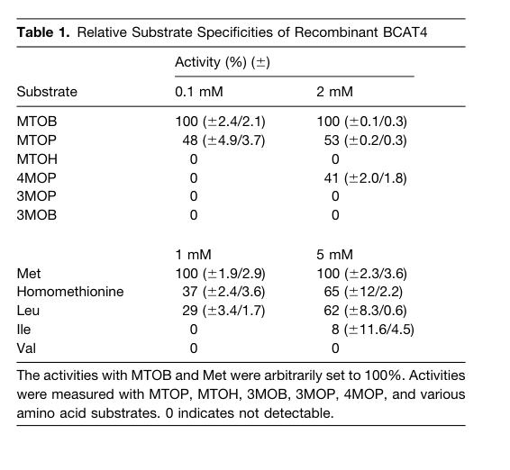
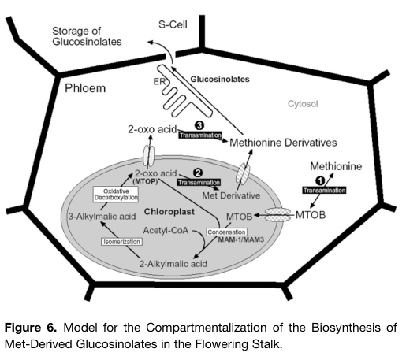

## Question

# Gene Research for Functional Annotation

## ⚠️ CRITICAL: Gene/Protein Identification Context

**BEFORE YOU BEGIN RESEARCH:** You MUST verify you are researching the CORRECT gene/protein. Gene symbols can be ambiguous, especially for less well-characterized genes from non-model organisms.

### Target Gene/Protein Identity (from UniProt):
- **UniProt Accession:** Q9LE06
- **Protein Description:** RecName: Full=Methionine aminotransferase BCAT4; EC=2.6.1.88; AltName: Full=Branched-chain-amino-acid aminotransferase 4; Short=Atbcat-4; AltName: Full=Methionine-oxo-acid transaminase BCAT4;
- **Gene Information:** Name=BCAT4; OrderedLocusNames=At3g19710; ORFNames=MMB12_16;
- **Organism (full):** Arabidopsis thaliana (Mouse-ear cress).
- **Protein Family:** Belongs to the class-IV pyridoxal-phosphate-dependent
- **Key Domains:** Aminotrans_IV. (IPR001544); Aminotransferase-like. (IPR036038); B_amino_transII. (IPR005786); BCAT-like_C. (IPR043132); BCAT-like_N. (IPR043131)

### MANDATORY VERIFICATION STEPS:

1. **Check if the gene symbol "BCAT4" matches the protein description above**
2. **Verify the organism is correct:** Arabidopsis thaliana (Mouse-ear cress).
3. **Check if protein family/domains align with what you find in literature**
4. **If you find literature for a DIFFERENT gene with the same or similar symbol, STOP**

### If Gene Symbol is Ambiguous or You Cannot Find Relevant Literature:

**DO NOT PROCEED WITH RESEARCH ON A DIFFERENT GENE.** Instead:
- State clearly: "The gene symbol 'BCAT4' is ambiguous or literature is limited for this specific protein"
- Explain what you found (e.g., "Found extensive literature on a different gene with the same symbol in a different organism")
- Describe the protein based ONLY on the UniProt information provided above
- Suggest that the protein function can be inferred from domain/family information

### Research Target:

Please provide a comprehensive research report on the gene **BCAT4** (gene ID: BCAT4, UniProt: Q9LE06) in ARATH.

The research report should be a detailed narrative explaining the function, biological processes, and localization of the gene product. Citations should be given for all claims.

You should prioritize authoritative reviews and primary scientific literature when conducting research. You can supplement
this with annotations you find in gene/protein databases, but these can be outdated or inaccurate.

We are specifically interested in the primary function of the gene - for enzymes, what reaction is catalyzed, and what is the substrate specificity? For transporters, what is the substrate? For structural proteins or adapters, what is the broader structural role? For signaling molecules, what is the role in the pathway.

We are interested in where in or outside the cell the gene product carries out its function.

We are also interested in the signaling or biochemical pathways in which the gene functions. We are less interested in broad pleiotropic effects, except where these elucidate the precise role.

Include evidence where possible. We are interested in both experimental evidence as well as inference from structure, evolution, or bioinformatic analysis. Precise studies should be prioritized over high-throughput, where available.

## Output

Question: You are an expert researcher providing comprehensive, well-cited information.

Provide detailed information focusing on:
1. Key concepts and definitions with current understanding
2. Recent developments and latest research (prioritize 2023-2024 sources)
3. Current applications and real-world implementations
4. Expert opinions and analysis from authoritative sources
5. Relevant statistics and data from recent studies

Format as a comprehensive research report with proper citations. Include URLs and publication dates where available.
Always prioritize recent, authoritative sources and provide specific citations for all major claims.

# Gene Research for Functional Annotation

## ⚠️ CRITICAL: Gene/Protein Identification Context

**BEFORE YOU BEGIN RESEARCH:** You MUST verify you are researching the CORRECT gene/protein. Gene symbols can be ambiguous, especially for less well-characterized genes from non-model organisms.

### Target Gene/Protein Identity (from UniProt):
- **UniProt Accession:** Q9LE06
- **Protein Description:** RecName: Full=Methionine aminotransferase BCAT4; EC=2.6.1.88; AltName: Full=Branched-chain-amino-acid aminotransferase 4; Short=Atbcat-4; AltName: Full=Methionine-oxo-acid transaminase BCAT4;
- **Gene Information:** Name=BCAT4; OrderedLocusNames=At3g19710; ORFNames=MMB12_16;
- **Organism (full):** Arabidopsis thaliana (Mouse-ear cress).
- **Protein Family:** Belongs to the class-IV pyridoxal-phosphate-dependent
- **Key Domains:** Aminotrans_IV. (IPR001544); Aminotransferase-like. (IPR036038); B_amino_transII. (IPR005786); BCAT-like_C. (IPR043132); BCAT-like_N. (IPR043131)

### MANDATORY VERIFICATION STEPS:

1. **Check if the gene symbol "BCAT4" matches the protein description above**
2. **Verify the organism is correct:** Arabidopsis thaliana (Mouse-ear cress).
3. **Check if protein family/domains align with what you find in literature**
4. **If you find literature for a DIFFERENT gene with the same or similar symbol, STOP**

### If Gene Symbol is Ambiguous or You Cannot Find Relevant Literature:

**DO NOT PROCEED WITH RESEARCH ON A DIFFERENT GENE.** Instead:
- State clearly: "The gene symbol 'BCAT4' is ambiguous or literature is limited for this specific protein"
- Explain what you found (e.g., "Found extensive literature on a different gene with the same symbol in a different organism")
- Describe the protein based ONLY on the UniProt information provided above
- Suggest that the protein function can be inferred from domain/family information

### Research Target:

Please provide a comprehensive research report on the gene **BCAT4** (gene ID: BCAT4, UniProt: Q9LE06) in ARATH.

The research report should be a detailed narrative explaining the function, biological processes, and localization of the gene product. Citations should be given for all claims.

You should prioritize authoritative reviews and primary scientific literature when conducting research. You can supplement
this with annotations you find in gene/protein databases, but these can be outdated or inaccurate.

We are specifically interested in the primary function of the gene - for enzymes, what reaction is catalyzed, and what is the substrate specificity? For transporters, what is the substrate? For structural proteins or adapters, what is the broader structural role? For signaling molecules, what is the role in the pathway.

We are interested in where in or outside the cell the gene product carries out its function.

We are also interested in the signaling or biochemical pathways in which the gene functions. We are less interested in broad pleiotropic effects, except where these elucidate the precise role.

Include evidence where possible. We are interested in both experimental evidence as well as inference from structure, evolution, or bioinformatic analysis. Precise studies should be prioritized over high-throughput, where available.

# Comprehensive Research Report: BCAT4 (At3g19710) in Arabidopsis thaliana

## Gene and Protein Identity

BCAT4 (UniProt accession Q9LE06, gene locus At3g19710) encodes a branched-chain aminotransferase in *Arabidopsis thaliana* that has undergone functional specialization from its ancestral role in branched-chain amino acid metabolism to a dedicated function in specialized metabolism (koper2022evolutionaryoriginand pages 17-18, binder2010branchedchainaminoacid pages 9-10, schuster2006branchedchainaminotransferase4is pages 1-2). The protein belongs to the class-IV pyridoxal-phosphate-dependent aminotransferase family and contains characteristic Aminotrans_IV and BCAT-like domains (UniProt provided). BCAT4 is classified under EC number 2.6.1.88, formally designated as methionine aminotransferase, reflecting its specialized substrate preference (koper2022evolutionaryoriginand pages 17-18, schuster2006branchedchainaminotransferase4is pages 2-3).

## Primary Enzymatic Function and Substrate Specificity

### Catalytic Reaction

BCAT4 catalyzes a reversible pyridoxal-phosphate (PLP)-dependent transamination reaction, with its primary physiological function being the conversion of L-methionine to 4-methylthio-2-oxobutyrate (MTOB) (schuster2006branchedchainaminotransferase4is pages 2-3, schuster2006branchedchainaminotransferase4is pages 1-2). The reaction proceeds as follows:

**L-Methionine + α-ketoglutarate ⇄ 4-methylthio-2-oxobutyrate (MTOB) + L-glutamate**

This represents the committed entry step for methionine into the chain-elongation pathway that ultimately produces methionine-derived aliphatic glucosinolates (schuster2006branchedchainaminotransferase4is pages 8-9, schuster2006branchedchainaminotransferase4is pages 1-2, knill2008arabidopsisbranchedchainaminotransferase pages 1-2).

### Substrate Specificity and Kinetic Parameters

Biochemical characterization of recombinant BCAT4 has revealed its strong preference for methionine-related substrates over canonical branched-chain amino acids (schuster2006branchedchainaminotransferase4is pages 2-3, schuster2006branchedchainaminotransferase4is pages 6-8). Key kinetic parameters include:

**For 2-oxo acid substrates:**
- MTOB (methionine-derived): Km = 0.045 ± 0.006 mM; Vmax = 2.7 ± 0.09 μmol·min⁻¹·mg protein⁻¹
- MTOP (one-carbon elongated): 48-53% relative activity compared to MTOB
- 4MOP (leucine-derived): No activity at 0.1 mM; 41% activity at 2.0 mM

**For amino acid substrates:**
- L-Methionine: Km = 0.93 ± 0.08 mM; Vmax = 0.089 ± 0.002 μmol·min⁻¹·mg protein⁻¹
- Homomethionine: 37-65% relative activity compared to methionine
- L-Leucine: Km = 4.86 ± 0.41 mM; Vmax = 0.11 ± 0.004 μmol·min⁻¹·mg protein⁻¹ (5.2-fold higher Km than methionine)
- L-Isoleucine: 0-8% activity
- L-Valine: No detectable activity

(schuster2006branchedchainaminotransferase4is pages 2-3, schuster2006branchedchainaminotransferase4is media 7cab97c5)

The exceptionally low Km value for MTOB (0.045 mM) compared to methionine (0.93 mM) suggests that BCAT4 has particularly high affinity for the 2-oxo acid substrate, consistent with its potential role in both the forward (methionine deamination) and reverse (transamination of chain-elongated 2-oxo acids) reactions of the pathway (schuster2006branchedchainaminotransferase4is pages 2-3, schuster2006branchedchainaminotransferase4is pages 11-12). The ability to accept MTOP and homomethionine indicates that BCAT4 can participate in transamination reactions at multiple points in the chain-elongation cycle, though other aminotransferases (particularly plastidic BCAT3) contribute to terminal transamination steps for longer-chain intermediates (knill2008arabidopsisbranchedchainaminotransferase pages 1-2).

| Substrate class | Substrate | Biological relationship | Assay concentration(s) | Relative BCAT4 activity | K_m (mM) | V_max (μmol·min⁻¹·mg protein⁻¹) | Interpretation |
|---|---|---|---:|---:|---:|---:|---|
| **2-oxo acid** | **4-Methylthio-2-oxobutyrate (MTOB)** | Methionine-derived; initial keto-acid intermediate in glucosinolate side-chain elongation | 0.1 and 2.0 mM | **100%** (reference) | **0.045 ± 0.006** | **2.7 ± 0.09** | Highest-affinity measured substrate; strongly supports specialization for methionine metabolism. (schuster2006branchedchainaminotransferase4is pages 2-3, schuster2006branchedchainaminotransferase4is media 7cab97c5) |
| **2-oxo acid** | **5-Methylthio-2-oxopentanoate (MTOP)** | One-carbon-elongated methionine keto acid; precursor of homomethionine | 0.1 / 2.0 mM | **48% / 53%** | Not reported | Not reported | Efficient acceptance indicates that BCAT4 can transaminate at least one chain-elongated intermediate. (schuster2006branchedchainaminotransferase4is pages 2-3) |
| **2-oxo acid** | 6-Methylthio-2-oxohexanoate (MTOH) | Longer methionine-chain-elongation intermediate | 0.1 / 2.0 mM | Not detected | Not reported | Not reported | Longer-chain intermediates are not universally accepted; other aminotransferases contribute to terminal transamination. (schuster2006branchedchainaminotransferase4is pages 2-3, knill2008arabidopsisbranchedchainaminotransferase pages 1-2) |
| **2-oxo acid** | 4-Methyl-2-oxopentanoate (4MOP; α-ketoisocaproate) | Leucine-corresponding keto acid; canonical BCAT substrate | 0.1 / 2.0 mM | **0% / 41%** | Not reported | Not reported | Detectable only at high concentration, consistent with residual ancestral activity. (schuster2006branchedchainaminotransferase4is pages 2-3, binder2010branchedchainaminoacid pages 9-10) |
| **2-oxo acid** | 3-Methyl-2-oxopentanoate (3MOP) | Isoleucine-corresponding keto acid | 0.1 / 2.0 mM | Not detected | Not reported | Not reported | No measurable activity under the tested conditions. (schuster2006branchedchainaminotransferase4is pages 2-3) |
| **2-oxo acid** | 3-Methyl-2-oxobutanoate (3MOB) | Valine-corresponding keto acid | 0.1 / 2.0 mM | Not detected | Not reported | Not reported | No measurable activity under the tested conditions. (schuster2006branchedchainaminotransferase4is pages 2-3) |
| **Amino acid** | **L-Methionine** | Entry substrate for methionine-derived aliphatic glucosinolate biosynthesis | 1 and 5 mM | **100%** (reference) | **0.93 ± 0.08** | **0.089 ± 0.002** | Preferred amino-acid substrate; supports Met + 2-oxoglutarate ⇌ MTOB + glutamate. (koper2022evolutionaryoriginand pages 17-18, schuster2006branchedchainaminotransferase4is pages 2-3, schuster2006branchedchainaminotransferase4is media 7cab97c5) |
| **Amino acid** | **Homomethionine** | One-carbon-elongated methionine derivative and glucosinolate precursor | 1 / 5 mM | **37% / 65%** | Not reported | Not reported | Substantial activity supports reversible transamination of chain-elongated intermediates. (schuster2006branchedchainaminotransferase4is pages 2-3) |
| **Amino acid** | L-Leucine | Canonical branched-chain amino-acid substrate | 1 / 5 mM | **29% / 62%** | **4.86 ± 0.41** | **0.11 ± 0.004** | Accepted at elevated concentration, but its K_m is approximately 5.2-fold higher than that for methionine, indicating lower apparent affinity. (schuster2006branchedchainaminotransferase4is pages 2-3, schuster2006branchedchainaminotransferase4is media 7cab97c5) |
| **Amino acid** | L-Isoleucine | Canonical branched-chain amino acid | 1 / 5 mM | **0% / 8%** | Not reported | Not reported | Only weak activity at high concentration. (schuster2006branchedchainaminotransferase4is pages 2-3) |
| **Amino acid** | L-Valine | Canonical branched-chain amino acid | 1 / 5 mM | Not detected | Not reported | Not reported | No measurable activity, arguing against a major role in canonical valine metabolism. (schuster2006branchedchainaminotransferase4is pages 2-3) |
| **Overall specificity** | Methionine-pathway substrates versus canonical BCAAs | Functional specialization | — | MTOB, Met, MTOP, and homomethionine favored over Ile/Val substrates | — | — | The combined data identify BCAT4 as a specialized methionine aminotransferase for glucosinolate precursor formation, despite retained leucine-related activity. (koper2022evolutionaryoriginand pages 17-18, schuster2006branchedchainaminotransferase4is pages 2-3, schuster2006branchedchainaminotransferase4is pages 6-8, binder2010branchedchainaminoacid pages 9-10) |

*Table: Substrate-specificity and kinetic data show that Arabidopsis BCAT4 preferentially processes methionine and methionine-chain-elongation intermediates rather than canonical branched-chain amino-acid substrates.*

## Subcellular Localization

BCAT4 is exclusively localized to the cytosol, as definitively demonstrated through multiple complementary experimental approaches (chen2023researchprogresson pages 4-5, mattice2023investigatingthemitochondrial pages 63-67, schuster2006branchedchainaminotransferase4is pages 6-8). Subcellular fractionation studies and GFP-tagging experiments confirmed that BCAT4 is not detected in chloroplasts, mitochondria, nuclei, or peroxisomes (schuster2006branchedchainaminotransferase4is pages 6-8). This cytosolic localization is consistent with its predicted amino acid sequence, which lacks plastid or mitochondrial targeting sequences (chen2023researchprogresson pages 4-5).

### Tissue-Specific Expression

BCAT4 shows highly restricted tissue-specific expression, being predominantly expressed in phloem cells of vascular tissues (schuster2006branchedchainaminotransferase4is pages 8-9, schuster2006branchedchainaminotransferase4is pages 6-8, schuster2006branchedchainaminotransferase4is pages 1-2, schuster2006branchedchainaminotransferase4is pages 5-6). Promoter-GUS reporter studies revealed strong BCAT4 expression in:
- Phloem cells of flowering stalks
- Vascular tissues of leaves, particularly in veins and petioles
- Root stele, specifically in phloem cells
- Tissues adjacent to S-cells (proposed glucosinolate storage sites)

(schuster2006branchedchainaminotransferase4is pages 8-9, schuster2006branchedchainaminotransferase4is pages 5-6, schuster2006branchedchainaminotransferase4is pages 4-5)

This phloem-predominant expression pattern is shared with other enzymes of the methionine-derived glucosinolate pathway, including MAM1, CYP79F1, and CYP79F2, suggesting coordinated spatial regulation of pathway components (schuster2006branchedchainaminotransferase4is pages 11-12, schuster2006branchedchainaminotransferase4is pages 8-9).

## Biochemical Pathway Context

### Role in Methionine-Derived Glucosinolate Biosynthesis

BCAT4 functions at the critical entry point of the methionine chain-elongation pathway, which constitutes the first phase of aliphatic glucosinolate biosynthesis (schuster2006branchedchainaminotransferase4is pages 11-12, schuster2006branchedchainaminotransferase4is pages 8-9, schuster2006branchedchainaminotransferase4is pages 2-3, binder2010branchedchainaminoacid pages 8-9). The complete pathway involves extensive compartmentalization between the cytosol and chloroplast:

**Step 1 - Initial Transamination (Cytosol):**
BCAT4 converts methionine to MTOB in the cytosol (schuster2006branchedchainaminotransferase4is pages 8-9, schuster2006branchedchainaminotransferase4is pages 1-2, schuster2006branchedchainaminotransferase4is pages 6-8).

**Step 2 - Chloroplast Import and Chain Elongation:**
MTOB is transported into the chloroplast, likely via the BAT5 transporter (gigolashvili2009theplastidicbile pages 1-2). Within the chloroplast, a cyclic chain-elongation process occurs:
- MAM1/MAM3 (methylthioalkylmalate synthases) catalyze condensation of MTOB with acetyl-CoA
- IPMI (isopropylmalate isomerase) catalyzes isomerization
- IPMDH1 (isopropylmalate dehydrogenase) catalyzes oxidative decarboxylation
- This produces chain-elongated 2-oxo acids (e.g., MTOP for one-carbon elongation)

(schuster2006branchedchainaminotransferase4is pages 11-12, schuster2006branchedchainaminotransferase4is pages 2-3, gigolashvili2009theplastidicbile pages 1-2)

**Step 3 - Transamination to Amino Acids:**
Chain-elongated 2-oxo acids undergo transamination to produce elongated methionine derivatives (homomethionine, dihomomethionine, etc.). This can occur via plastidic BCAT3 or by export to the cytosol followed by BCAT4-catalyzed transamination (schuster2006branchedchainaminotransferase4is pages 11-12, knill2008arabidopsisbranchedchainaminotransferase pages 1-2).

**Step 4 - Core Glucosinolate Formation:**
Elongated methionine derivatives are converted by CYP79F1/F2 (cytochrome P450s) to aldoximes, then processed through CYP83A1, C-S lyases, UDP-glucosyltransferases, and sulfotransferases to form mature glucosinolates (gigolashvili2009theplastidicbile pages 1-2).

(schuster2006branchedchainaminotransferase4is media 57065c3e, schuster2006branchedchainaminotransferase4is media b27b9c80)

### Evolutionary Relationship to Leucine Biosynthesis

BCAT4 represents an example of enzyme recruitment and functional divergence from primary to specialized metabolism (binder2010branchedchainaminoacid pages 9-10, schuster2006branchedchainaminotransferase4is pages 2-3, schuster2006branchedchainaminotransferase4is pages 1-2, schuster2006branchedchainaminotransferase4is pages 8-9). The methionine chain-elongation pathway shows remarkable parallel architecture to leucine biosynthesis:

- BCAT enzymes (leucine biosynthesis) ↔ BCAT4 (glucosinolate biosynthesis)
- IPMS (isopropylmalate synthase) ↔ MAM1/MAM3 (methylthioalkylmalate synthase)
- IPMI and IPMDH (shared between both pathways)

(schuster2006branchedchainaminotransferase4is pages 2-3, schuster2006branchedchainaminotransferase4is media b27b9c80)

BCAT4 retains detectable activity toward leucine and its corresponding 2-oxo acid (29-62% relative activity), representing residual ancestral function (schuster2006branchedchainaminotransferase4is pages 2-3, binder2010branchedchainaminoacid pages 9-10, schuster2006branchedchainaminotransferase4is pages 8-9). However, it has undergone functional specialization away from canonical BCAA metabolism, as evidenced by: (1) failure to complement yeast BCAA auxotrophs, (2) minimal activity with isoleucine and no activity with valine, and (3) substantially higher affinity for methionine-derived substrates (koper2022evolutionaryoriginand pages 17-18, schuster2006branchedchainaminotransferase4is pages 2-3).

## Genetic Evidence from Knockout Mutants

Analysis of T-DNA insertion mutants has provided strong genetic support for BCAT4's essential role in glucosinolate biosynthesis (schuster2006branchedchainaminotransferase4is pages 8-9, schuster2006branchedchainaminotransferase4is pages 4-5, schuster2006branchedchainaminotransferase4is pages 1-2). Two independent knockout lines (bcat4-1 with insertion in the last exon, and bcat4-2 with insertion in the second intron) were both confirmed as complete expression knockouts with no detectable BCAT4 protein (schuster2006branchedchainaminotransferase4is pages 8-9, schuster2006branchedchainaminotransferase4is pages 2-3).

### Metabolic Phenotypes

**Glucosinolate Reduction:**
- Rosette leaves: Total methionine-derived glucosinolates reduced by approximately 47-50%
- Seeds: Total methionine-derived glucosinolates reduced by approximately 44-49%
- Multiple individual aliphatic glucosinolates (3MSOP, 4MSOB, 7MSOH, 8MSOO) were significantly reduced

(schuster2006branchedchainaminotransferase4is pages 8-9, schuster2006branchedchainaminotransferase4is pages 4-5, schuster2006branchedchainaminotransferase4is pages 1-2)

**Methionine Accumulation:**
- Seeds: Free methionine increased 3.5-fold in bcat4-1 (0.08 to 0.28 nmol·mg⁻¹) and 4.8-fold in bcat4-2 (0.09 to 0.43 nmol·mg⁻¹)
- S-methylmethionine (SMM), the phloem transport form of methionine, accumulated dramatically in mutant seeds (from undetectable in wild-type to highly abundant levels)

(schuster2006branchedchainaminotransferase4is pages 4-5, schuster2006branchedchainaminotransferase4is pages 9-11)

These metabolic changes strongly support BCAT4's proposed role in catalyzing the initial deamination of methionine: loss of BCAT4 activity creates a metabolic bottleneck, causing upstream accumulation of methionine and SMM while reducing downstream glucosinolate production (schuster2006branchedchainaminotransferase4is pages 8-9, schuster2006branchedchainaminotransferase4is pages 1-2). The incomplete (~50%) reduction in glucosinolates indicates that other aminotransferases, particularly plastidic BCAT3, can partially compensate for BCAT4 loss (knill2008arabidopsisbranchedchainaminotransferase pages 5-6, knill2008arabidopsisbranchedchainaminotransferase pages 1-2).

| Tissue | Phenotype / analyte | WT control for **bcat4-1** | **bcat4-1** | WT control for **bcat4-2** | **bcat4-2** | Interpretation |
|---|---|---:|---:|---:|---:|---|
| Rosette leaves | Total glucosinolates (µmol·g⁻¹ dry weight) | 27.23 | 17.62 | 24.87 | 16.66 | Decreased by approximately 35% and 33%, respectively. (schuster2006branchedchainaminotransferase4is pages 4-5) |
| Rosette leaves | Total methionine-derived glucosinolates (µmol·g⁻¹ dry weight) | 21.54 | 11.38 | 21.04 | 11.37 | Decreased by approximately 47% and 46%, establishing a major role for BCAT4 in pathway flux. (schuster2006branchedchainaminotransferase4is pages 8-9, schuster2006branchedchainaminotransferase4is pages 4-5) |
| Rosette leaves | Individual aliphatic glucosinolates | — | 3MSOP, 4MSOB, 7MSOH, and 8MSOO reduced | — | 3MSOP, 4MSOB, 7MSOH, and 8MSOO reduced | The effect extends across several methionine-derived glucosinolate chain lengths. (schuster2006branchedchainaminotransferase4is pages 4-5) |
| Rosette leaves | Free methionine | Lower baseline | Increased | Lower baseline | Increased | Impaired conversion of methionine to MTOB causes upstream substrate accumulation; exact leaf concentrations were unavailable. (schuster2006branchedchainaminotransferase4is pages 8-9, schuster2006branchedchainaminotransferase4is pages 1-2) |
| Rosette leaves | S-methylmethionine (SMM) | Lower baseline | Strongly increased | Lower baseline | Strongly increased | Accumulation of the phloem methionine-transport form supports reduced pathway entry; exact leaf concentrations were unavailable. (schuster2006branchedchainaminotransferase4is pages 8-9, schuster2006branchedchainaminotransferase4is pages 9-11) |
| Seeds | Total glucosinolates (µmol·g⁻¹ dry weight) | 85.35 | 44.85 | 116.55 | 69.17 | Decreased by approximately 47% and 41%, respectively. (schuster2006branchedchainaminotransferase4is pages 4-5) |
| Seeds | Total methionine-derived glucosinolates (µmol·g⁻¹ dry weight) | 83.23 | 42.22 | 111.78 | 63.12 | Decreased by approximately 49% and 44%, respectively. (schuster2006branchedchainaminotransferase4is pages 4-5) |
| Seeds | Free methionine (nmol·mg⁻¹ dry weight) | 0.08 | 0.28 | 0.09 | 0.43 | Increased approximately 3.5-fold in **bcat4-1** and 4.8-fold in **bcat4-2**. (schuster2006branchedchainaminotransferase4is pages 4-5) |
| Seeds | S-methylmethionine (SMM) | Undetectable | Strongly accumulated | Undetectable | Strongly accumulated | SMM became highly abundant, indicating pronounced disruption of methionine allocation; line-specific concentrations were unavailable. (schuster2006branchedchainaminotransferase4is pages 9-11) |
| Seeds | Individual aliphatic glucosinolates | Multiple compounds at normal levels | Several reduced; 4MSOB and 5MSOP increased | Multiple compounds at normal levels | Several reduced; 4MSOB and 5MSOP increased | Most aliphatic products declined, but selected compounds accumulated, indicating altered composition and reduced total flux. (schuster2006branchedchainaminotransferase4is pages 4-5) |
| Overall | BCAT4 protein/expression | BCAT4 present | Not detected | BCAT4 present | Not detected | Both T-DNA lines were complete expression knockouts, strengthening the causal link between BCAT4 loss and the metabolic phenotype. (schuster2006branchedchainaminotransferase4is pages 8-9, schuster2006branchedchainaminotransferase4is pages 2-3) |

*Table: Comparison of glucosinolate and methionine-related phenotypes in Arabidopsis bcat4-1 and bcat4-2 knockout lines. Both mutants show reduced methionine-derived glucosinolates and accumulation of free methionine and S-methylmethionine.*

## Regulation and Physiological Context

### Transcriptional Regulation

BCAT4 expression is regulated by multiple environmental and temporal signals, consistent with its role in defense-related secondary metabolism:

**Wound Response:**
Mechanical wounding (cutting, squeezing, or piercing plant tissues) induces rapid BCAT4 transcription. BCAT4 mRNA levels increase within 5 minutes of wounding, reach a maximum increase of approximately 2-2.6-fold, and return to baseline within 2 hours (schuster2006branchedchainaminotransferase4is pages 6-8, schuster2006branchedchainaminotransferase4is pages 5-6, schuster2006branchedchainaminotransferase4is pages 11-12). This wound-inducible expression is consistent with glucosinolates' role as defense compounds against herbivores (schuster2006branchedchainaminotransferase4is pages 8-9, schuster2006branchedchainaminotransferase4is pages 11-12).

**Diurnal Regulation:**
BCAT4 exhibits diurnal expression patterns coordinated with light/dark cycles. Transcript levels are low during darkness but increase up to fivefold upon illumination, remaining elevated during continued light exposure (schuster2006branchedchainaminotransferase4is pages 5-6). This diurnal regulation is shared with MAM1, indicating coordinated temporal control of pathway components (schuster2006branchedchainaminotransferase4is pages 8-9, schuster2006branchedchainaminotransferase4is pages 5-6).

**Coordinated Pathway Expression:**
BCAT4 expression shows strong correlation with MAM1 and other glucosinolate biosynthetic genes, supporting their functional relationship (schuster2006branchedchainaminotransferase4is pages 2-3, schuster2006branchedchainaminotransferase4is pages 8-9, schuster2006branchedchainaminotransferase4is pages 9-11, schuster2006branchedchainaminotransferase4is pages 6-8). Both BCAT4 and MAM1 respond similarly to wounding and light signals, and both are preferentially expressed in phloem tissues (schuster2006branchedchainaminotransferase4is pages 8-9).

### Metabolic Integration

BCAT4 operates at a critical metabolic branch point, channeling methionine from primary metabolism into specialized glucosinolate biosynthesis (schuster2006branchedchainaminotransferase4is pages 8-9, binder2010branchedchainaminoacid pages 8-9). The cytosolic localization of BCAT4, combined with evidence of coordinated expression with cytosolic methionine synthase genes rather than plastidic methionine biosynthesis genes, suggests that BCAT4 preferentially utilizes recycled cytosolic methionine rather than newly synthesized methionine from plastids (schuster2006branchedchainaminotransferase4is pages 9-11).

## Recent Research Developments (2020-2025)

Recent studies have continued to elucidate BCAT4's broader context in plant metabolism and evolution:

**Evolutionary and Functional Diversification:**
A comprehensive 2022 review by Koper et al. placed BCAT4 within the broader evolutionary context of aminotransferase diversification, confirming that BCAT4 represents a clear example of functional specialization where an enzyme recruited from primary metabolism has been optimized for specialized metabolite production (koper2022evolutionaryoriginand pages 17-18, koper2022evolutionaryoriginand pages 16-17, koper2022evolutionaryoriginand pages 12-13). Unlike most Arabidopsis BCAT paralogs, BCAT4 does not show strong canonical BCAT activity and cannot rescue yeast BCAA auxotrophs, with its strongest activity directed toward the methionine-derived substrate 4MTOB (koper2022evolutionaryoriginand pages 17-18).

**Glucosinolate Engineering Applications:**
Multiple studies from 2021-2025 have utilized BCAT4 in metabolic engineering efforts to produce glucosinolates in heterologous hosts. Wang et al. (2021) demonstrated that *Barbarea vulgaris* BCAT4 performs more efficiently than Arabidopsis BCAT4 in engineering 2-phenylethylglucosinolate production, highlighting natural variation in BCAT substrate specificities (zhao2025sulforaphaneincancer pages 2-4, kitainda2021structuralstudiesof pages 9-11). These engineering studies confirm BCAT4's rate-limiting role at the pathway entry point (zhao2025sulforaphaneincancer pages 2-4).

**Stress and Defense Signaling:**
Recent work has linked BCAT4 to broader defense responses. A 2025 study on sulforaphane biosynthesis confirmed that BCAT4 knockout mutants exhibit 50-60% decreases in aliphatic glucosinolates and 5- to 12-fold accumulation of free methionine, emphasizing its critical role in directing methionine toward defense compound production (zhao2025sulforaphaneincancer pages 2-4). Zhao et al. (2025) noted that BCAT4 expression can be induced by environmental stresses including wounding, consistent with its participation in inducible chemical defense responses (zhao2025sulforaphaneincancer pages 2-4).

**Pathway Regulation:**
A 2025 study by Nguyen et al. examining WHIRLY1 regulation of glucosinolate biosynthesis found that genes in the early steps of aliphatic glucosinolate biosynthesis, including pathway genes regulated alongside BCAT4, are coordinately controlled during seedling development, though BCAT4 transcript levels themselves were not significantly altered in whirly1 mutants (kitainda2021structuralstudiesof pages 9-11). This suggests that while BCAT4 is part of a regulated pathway network, it may be under distinct regulatory control from some downstream genes.

## Conclusions and Functional Summary

BCAT4 (At3g19710) functions as a specialized cytosolic methionine aminotransferase that catalyzes the committed entry step for methionine-derived aliphatic glucosinolate biosynthesis in *Arabidopsis thaliana*. Through its primary catalytic activity—the reversible transamination of L-methionine to 4-methylthio-2-oxobutyrate (MTOB)—BCAT4 channels methionine from primary metabolism into the chain-elongation pathway that ultimately produces diverse aliphatic glucosinolates (schuster2006branchedchainaminotransferase4is pages 2-3, schuster2006branchedchainaminotransferase4is pages 8-9, schuster2006branchedchainaminotransferase4is pages 1-2).

The enzyme exhibits remarkable substrate specificity for methionine and methionine-chain-elongation intermediates (Km for MTOB = 0.045 mM; Km for Met = 0.93 mM), with minimal activity toward canonical branched-chain amino acids valine and isoleucine (schuster2006branchedchainaminotransferase4is pages 2-3, schuster2006branchedchainaminotransferase4is pages 6-8). This specialization represents an evolutionary adaptation from an ancestral BCAA metabolism enzyme, with BCAT4 retaining only residual leucine-related activity (binder2010branchedchainaminoacid pages 9-10, schuster2006branchedchainaminotransferase4is pages 2-3, schuster2006branchedchainaminotransferase4is pages 1-2).

BCAT4 operates exclusively in the cytosol and is predominantly expressed in phloem tissues, where it responds to wounding and follows diurnal expression patterns (schuster2006branchedchainaminotransferase4is pages 6-8, schuster2006branchedchainaminotransferase4is pages 1-2, schuster2006branchedchainaminotransferase4is pages 5-6). Its activity is coordinated with downstream enzymes including MAM1 (chloroplastic chain elongation), BCAT3 (plastidic transamination), and CYP79F1/F2 (aldoxime formation), establishing a compartmentalized metabolic pathway linking cytosolic, plastidic, and ER-localized enzymatic steps (schuster2006branchedchainaminotransferase4is pages 11-12, gigolashvili2009theplastidicbile pages 1-2, schuster2006branchedchainaminotransferase4is pages 8-9).

Genetic evidence from knockout mutants demonstrates BCAT4's essential contribution to glucosinolate production: bcat4 mutants show approximately 50% reduction in methionine-derived glucosinolates and dramatic accumulation of free methionine and S-methylmethionine (schuster2006branchedchainaminotransferase4is pages 8-9, schuster2006branchedchainaminotransferase4is pages 4-5, schuster2006branchedchainaminotransferase4is pages 1-2). This partial rather than complete loss of glucosinolates reflects functional redundancy with other aminotransferases, particularly BCAT3 (knill2008arabidopsisbranchedchainaminotransferase pages 5-6, knill2008arabidopsisbranchedchainaminotransferase pages 1-2).

Through its integration of primary methionine metabolism with specialized glucosinolate biosynthesis, wound-responsive regulation, and phloem-specific expression, BCAT4 represents a key metabolic gateway controlling the production of defense-related secondary metabolites in *Arabidopsis thaliana* (schuster2006branchedchainaminotransferase4is pages 8-9, binder2010branchedchainaminoacid pages 8-9).

References

1. (koper2022evolutionaryoriginand pages 17-18): Kaan Koper, Sang-Woo Han, Delia Casas Pastor, Yasuo Yoshikuni, and Hiroshi A. Maeda. Evolutionary origin and functional diversification of aminotransferases. Journal of Biological Chemistry, 298:102122, Aug 2022. URL: https://doi.org/10.1016/j.jbc.2022.102122, doi:10.1016/j.jbc.2022.102122. This article has 104 citations and is from a domain leading peer-reviewed journal.

2. (binder2010branchedchainaminoacid pages 9-10): Stefan Binder. Branched-chain amino acid metabolism in arabidopsis thaliana. The Arabidopsis Book, 2010:e0137, Jan 2010. URL: https://doi.org/10.1199/tab.0137, doi:10.1199/tab.0137. This article has 313 citations and is from a peer-reviewed journal.

3. (schuster2006branchedchainaminotransferase4is pages 1-2): Joachim Schuster, Tanja Knill, Michael Reichelt, Jonathan Gershenzon, and Stefan Binder. Branched-chain aminotransferase4 is part of the chain elongation pathway in the biosynthesis of methionine-derived glucosinolates in <i>arabidopsis</i>. The Plant Cell, 18(10):2664-2679, Oct 2006. URL: https://doi.org/10.1105/tpc.105.039339, doi:10.1105/tpc.105.039339. This article has 254 citations.

4. (schuster2006branchedchainaminotransferase4is pages 2-3): Joachim Schuster, Tanja Knill, Michael Reichelt, Jonathan Gershenzon, and Stefan Binder. Branched-chain aminotransferase4 is part of the chain elongation pathway in the biosynthesis of methionine-derived glucosinolates in <i>arabidopsis</i>. The Plant Cell, 18(10):2664-2679, Oct 2006. URL: https://doi.org/10.1105/tpc.105.039339, doi:10.1105/tpc.105.039339. This article has 254 citations.

5. (schuster2006branchedchainaminotransferase4is pages 8-9): Joachim Schuster, Tanja Knill, Michael Reichelt, Jonathan Gershenzon, and Stefan Binder. Branched-chain aminotransferase4 is part of the chain elongation pathway in the biosynthesis of methionine-derived glucosinolates in <i>arabidopsis</i>. The Plant Cell, 18(10):2664-2679, Oct 2006. URL: https://doi.org/10.1105/tpc.105.039339, doi:10.1105/tpc.105.039339. This article has 254 citations.

6. (knill2008arabidopsisbranchedchainaminotransferase pages 1-2): Tanja Knill, Joachim Schuster, Michael Reichelt, Jonathan Gershenzon, and Stefan Binder. Arabidopsis branched-chain aminotransferase 3 functions in both amino acid and glucosinolate biosynthesis. Plant Physiology, 146:1028-1039, Dec 2008. URL: https://doi.org/10.1104/pp.107.111609, doi:10.1104/pp.107.111609. This article has 166 citations and is from a highest quality peer-reviewed journal.

7. (schuster2006branchedchainaminotransferase4is pages 6-8): Joachim Schuster, Tanja Knill, Michael Reichelt, Jonathan Gershenzon, and Stefan Binder. Branched-chain aminotransferase4 is part of the chain elongation pathway in the biosynthesis of methionine-derived glucosinolates in <i>arabidopsis</i>. The Plant Cell, 18(10):2664-2679, Oct 2006. URL: https://doi.org/10.1105/tpc.105.039339, doi:10.1105/tpc.105.039339. This article has 254 citations.

8. (schuster2006branchedchainaminotransferase4is media 7cab97c5): Joachim Schuster, Tanja Knill, Michael Reichelt, Jonathan Gershenzon, and Stefan Binder. Branched-chain aminotransferase4 is part of the chain elongation pathway in the biosynthesis of methionine-derived glucosinolates in <i>arabidopsis</i>. The Plant Cell, 18(10):2664-2679, Oct 2006. URL: https://doi.org/10.1105/tpc.105.039339, doi:10.1105/tpc.105.039339. This article has 254 citations.

9. (schuster2006branchedchainaminotransferase4is pages 11-12): Joachim Schuster, Tanja Knill, Michael Reichelt, Jonathan Gershenzon, and Stefan Binder. Branched-chain aminotransferase4 is part of the chain elongation pathway in the biosynthesis of methionine-derived glucosinolates in <i>arabidopsis</i>. The Plant Cell, 18(10):2664-2679, Oct 2006. URL: https://doi.org/10.1105/tpc.105.039339, doi:10.1105/tpc.105.039339. This article has 254 citations.

10. (chen2023researchprogresson pages 4-5): Can Chen, Hassan Naveed, and Keping Chen. Research progress on branched-chain amino acid aminotransferases. Frontiers in Genetics, Nov 2023. URL: https://doi.org/10.3389/fgene.2023.1233669, doi:10.3389/fgene.2023.1233669. This article has 36 citations and is from a peer-reviewed journal.

11. (mattice2023investigatingthemitochondrial pages 63-67): Jordan F Mattice. Investigating the mitochondrial signaling role of shewanella-like protein phosphatase 2 in arabidopsis thaliana. Jan 2023. URL: https://doi.org/10.11575/prism/dspace/41240, doi:10.11575/prism/dspace/41240. This article has 0 citations.

12. (schuster2006branchedchainaminotransferase4is pages 5-6): Joachim Schuster, Tanja Knill, Michael Reichelt, Jonathan Gershenzon, and Stefan Binder. Branched-chain aminotransferase4 is part of the chain elongation pathway in the biosynthesis of methionine-derived glucosinolates in <i>arabidopsis</i>. The Plant Cell, 18(10):2664-2679, Oct 2006. URL: https://doi.org/10.1105/tpc.105.039339, doi:10.1105/tpc.105.039339. This article has 254 citations.

13. (schuster2006branchedchainaminotransferase4is pages 4-5): Joachim Schuster, Tanja Knill, Michael Reichelt, Jonathan Gershenzon, and Stefan Binder. Branched-chain aminotransferase4 is part of the chain elongation pathway in the biosynthesis of methionine-derived glucosinolates in <i>arabidopsis</i>. The Plant Cell, 18(10):2664-2679, Oct 2006. URL: https://doi.org/10.1105/tpc.105.039339, doi:10.1105/tpc.105.039339. This article has 254 citations.

14. (binder2010branchedchainaminoacid pages 8-9): Stefan Binder. Branched-chain amino acid metabolism in arabidopsis thaliana. The Arabidopsis Book, 2010:e0137, Jan 2010. URL: https://doi.org/10.1199/tab.0137, doi:10.1199/tab.0137. This article has 313 citations and is from a peer-reviewed journal.

15. (gigolashvili2009theplastidicbile pages 1-2): Tamara Gigolashvili, Ruslan Yatusevich, Inga Rollwitz, Melanie Humphry, Jonathan Gershenzon, and Ulf-Ingo Flügge. The plastidic bile acid transporter 5 is required for the biosynthesis of methionine-derived glucosinolates in <i>arabidopsis thaliana</i>. The Plant Cell, 21:1813-1829, Jun 2009. URL: https://doi.org/10.1105/tpc.109.066399, doi:10.1105/tpc.109.066399. This article has 168 citations.

16. (schuster2006branchedchainaminotransferase4is media 57065c3e): Joachim Schuster, Tanja Knill, Michael Reichelt, Jonathan Gershenzon, and Stefan Binder. Branched-chain aminotransferase4 is part of the chain elongation pathway in the biosynthesis of methionine-derived glucosinolates in <i>arabidopsis</i>. The Plant Cell, 18(10):2664-2679, Oct 2006. URL: https://doi.org/10.1105/tpc.105.039339, doi:10.1105/tpc.105.039339. This article has 254 citations.

17. (schuster2006branchedchainaminotransferase4is media b27b9c80): Joachim Schuster, Tanja Knill, Michael Reichelt, Jonathan Gershenzon, and Stefan Binder. Branched-chain aminotransferase4 is part of the chain elongation pathway in the biosynthesis of methionine-derived glucosinolates in <i>arabidopsis</i>. The Plant Cell, 18(10):2664-2679, Oct 2006. URL: https://doi.org/10.1105/tpc.105.039339, doi:10.1105/tpc.105.039339. This article has 254 citations.

18. (schuster2006branchedchainaminotransferase4is pages 9-11): Joachim Schuster, Tanja Knill, Michael Reichelt, Jonathan Gershenzon, and Stefan Binder. Branched-chain aminotransferase4 is part of the chain elongation pathway in the biosynthesis of methionine-derived glucosinolates in <i>arabidopsis</i>. The Plant Cell, 18(10):2664-2679, Oct 2006. URL: https://doi.org/10.1105/tpc.105.039339, doi:10.1105/tpc.105.039339. This article has 254 citations.

19. (knill2008arabidopsisbranchedchainaminotransferase pages 5-6): Tanja Knill, Joachim Schuster, Michael Reichelt, Jonathan Gershenzon, and Stefan Binder. Arabidopsis branched-chain aminotransferase 3 functions in both amino acid and glucosinolate biosynthesis. Plant Physiology, 146:1028-1039, Dec 2008. URL: https://doi.org/10.1104/pp.107.111609, doi:10.1104/pp.107.111609. This article has 166 citations and is from a highest quality peer-reviewed journal.

20. (koper2022evolutionaryoriginand pages 16-17): Kaan Koper, Sang-Woo Han, Delia Casas Pastor, Yasuo Yoshikuni, and Hiroshi A. Maeda. Evolutionary origin and functional diversification of aminotransferases. Journal of Biological Chemistry, 298:102122, Aug 2022. URL: https://doi.org/10.1016/j.jbc.2022.102122, doi:10.1016/j.jbc.2022.102122. This article has 104 citations and is from a domain leading peer-reviewed journal.

21. (koper2022evolutionaryoriginand pages 12-13): Kaan Koper, Sang-Woo Han, Delia Casas Pastor, Yasuo Yoshikuni, and Hiroshi A. Maeda. Evolutionary origin and functional diversification of aminotransferases. Journal of Biological Chemistry, 298:102122, Aug 2022. URL: https://doi.org/10.1016/j.jbc.2022.102122, doi:10.1016/j.jbc.2022.102122. This article has 104 citations and is from a domain leading peer-reviewed journal.

22. (zhao2025sulforaphaneincancer pages 2-4): Zhi-Peng Zhao, Qian-Qian Chen, Xinyu Qiao, Jian-Jiang Wang, Zaid Tala Abdulqader Ali, Jun Li, and L. Yin. Sulforaphane in cancer precision medicine: from biosynthetic origins to multiscale mechanisms and clinical translation. Frontiers in Immunology, Oct 2025. URL: https://doi.org/10.3389/fimmu.2025.1702860, doi:10.3389/fimmu.2025.1702860. This article has 17 citations and is from a peer-reviewed journal.

23. (kitainda2021structuralstudiesof pages 9-11): Vivian Kitainda and Joseph M. Jez. Structural studies of aliphatic glucosinolate chain-elongation enzymes. Antioxidants, 10:1500, Sep 2021. URL: https://doi.org/10.3390/antiox10091500, doi:10.3390/antiox10091500. This article has 34 citations.

## Artifacts

- [Edison artifact artifact-00](BCAT4-deep-research-falcon_artifacts/artifact-00.md)
- [Edison artifact artifact-01](BCAT4-deep-research-falcon_artifacts/artifact-01.md)

## Citations

1. knill2008arabidopsisbranchedchainaminotransferase pages 1-2
2. chen2023researchprogresson pages 4-5
3. gigolashvili2009theplastidicbile pages 1-2
4. koper2022evolutionaryoriginand pages 17-18
5. zhao2025sulforaphaneincancer pages 2-4
6. kitainda2021structuralstudiesof pages 9-11
7. binder2010branchedchainaminoacid pages 9-10
8. mattice2023investigatingthemitochondrial pages 63-67
9. binder2010branchedchainaminoacid pages 8-9
10. knill2008arabidopsisbranchedchainaminotransferase pages 5-6
11. koper2022evolutionaryoriginand pages 16-17
12. koper2022evolutionaryoriginand pages 12-13
13. https://doi.org/10.1016/j.jbc.2022.102122,
14. https://doi.org/10.1199/tab.0137,
15. https://doi.org/10.1105/tpc.105.039339,
16. https://doi.org/10.1104/pp.107.111609,
17. https://doi.org/10.3389/fgene.2023.1233669,
18. https://doi.org/10.11575/prism/dspace/41240,
19. https://doi.org/10.1105/tpc.109.066399,
20. https://doi.org/10.3389/fimmu.2025.1702860,
21. https://doi.org/10.3390/antiox10091500,