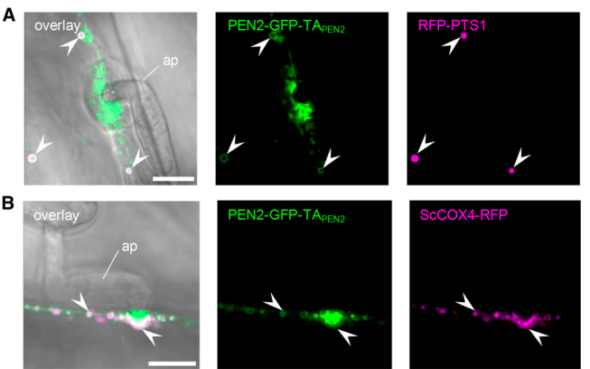

## Question

# Gene Research for Functional Annotation

## ⚠️ CRITICAL: Gene/Protein Identification Context

**BEFORE YOU BEGIN RESEARCH:** You MUST verify you are researching the CORRECT gene/protein. Gene symbols can be ambiguous, especially for less well-characterized genes from non-model organisms.

### Target Gene/Protein Identity (from UniProt):
- **UniProt Accession:** O64883
- **Protein Description:** RecName: Full=Beta-glucosidase 26, peroxisomal {ECO:0000303|PubMed:15604686}; Short=AtBGLU26 {ECO:0000303|PubMed:15604686}; EC=3.2.1.21 {ECO:0000269|PubMed:19095900}; AltName: Full=Protein PENETRATION 2 {ECO:0000303|PubMed:19095900};
- **Gene Information:** Name=BGLU26 {ECO:0000303|PubMed:15604686}; Synonyms=PEN2 {ECO:0000303|PubMed:19095900}; OrderedLocusNames=At2g44490 {ECO:0000312|Araport:AT2G44490}; ORFNames=F4I1.30 {ECO:0000312|EMBL:AAC16095.1};
- **Organism (full):** Arabidopsis thaliana (Mouse-ear cress).
- **Protein Family:** Belongs to the glycosyl hydrolase 1 family. .
- **Key Domains:** GH_1_N_CS. (IPR033132); GH_hydrolase_sf. (IPR017853); Glyco_hydro_1. (IPR001360); Glyco_hydro_1 (PF00232)

### MANDATORY VERIFICATION STEPS:

1. **Check if the gene symbol "BGLU26" matches the protein description above**
2. **Verify the organism is correct:** Arabidopsis thaliana (Mouse-ear cress).
3. **Check if protein family/domains align with what you find in literature**
4. **If you find literature for a DIFFERENT gene with the same or similar symbol, STOP**

### If Gene Symbol is Ambiguous or You Cannot Find Relevant Literature:

**DO NOT PROCEED WITH RESEARCH ON A DIFFERENT GENE.** Instead:
- State clearly: "The gene symbol 'BGLU26' is ambiguous or literature is limited for this specific protein"
- Explain what you found (e.g., "Found extensive literature on a different gene with the same symbol in a different organism")
- Describe the protein based ONLY on the UniProt information provided above
- Suggest that the protein function can be inferred from domain/family information

### Research Target:

Please provide a comprehensive research report on the gene **BGLU26** (gene ID: BGLU26, UniProt: O64883) in ARATH.

The research report should be a detailed narrative explaining the function, biological processes, and localization of the gene product. Citations should be given for all claims.

You should prioritize authoritative reviews and primary scientific literature when conducting research. You can supplement
this with annotations you find in gene/protein databases, but these can be outdated or inaccurate.

We are specifically interested in the primary function of the gene - for enzymes, what reaction is catalyzed, and what is the substrate specificity? For transporters, what is the substrate? For structural proteins or adapters, what is the broader structural role? For signaling molecules, what is the role in the pathway.

We are interested in where in or outside the cell the gene product carries out its function.

We are also interested in the signaling or biochemical pathways in which the gene functions. We are less interested in broad pleiotropic effects, except where these elucidate the precise role.

Include evidence where possible. We are interested in both experimental evidence as well as inference from structure, evolution, or bioinformatic analysis. Precise studies should be prioritized over high-throughput, where available.

## Output

Question: You are an expert researcher providing comprehensive, well-cited information.

Provide detailed information focusing on:
1. Key concepts and definitions with current understanding
2. Recent developments and latest research (prioritize 2023-2024 sources)
3. Current applications and real-world implementations
4. Expert opinions and analysis from authoritative sources
5. Relevant statistics and data from recent studies

Format as a comprehensive research report with proper citations. Include URLs and publication dates where available.
Always prioritize recent, authoritative sources and provide specific citations for all major claims.

# Gene Research for Functional Annotation

## ⚠️ CRITICAL: Gene/Protein Identification Context

**BEFORE YOU BEGIN RESEARCH:** You MUST verify you are researching the CORRECT gene/protein. Gene symbols can be ambiguous, especially for less well-characterized genes from non-model organisms.

### Target Gene/Protein Identity (from UniProt):
- **UniProt Accession:** O64883
- **Protein Description:** RecName: Full=Beta-glucosidase 26, peroxisomal {ECO:0000303|PubMed:15604686}; Short=AtBGLU26 {ECO:0000303|PubMed:15604686}; EC=3.2.1.21 {ECO:0000269|PubMed:19095900}; AltName: Full=Protein PENETRATION 2 {ECO:0000303|PubMed:19095900};
- **Gene Information:** Name=BGLU26 {ECO:0000303|PubMed:15604686}; Synonyms=PEN2 {ECO:0000303|PubMed:19095900}; OrderedLocusNames=At2g44490 {ECO:0000312|Araport:AT2G44490}; ORFNames=F4I1.30 {ECO:0000312|EMBL:AAC16095.1};
- **Organism (full):** Arabidopsis thaliana (Mouse-ear cress).
- **Protein Family:** Belongs to the glycosyl hydrolase 1 family. .
- **Key Domains:** GH_1_N_CS. (IPR033132); GH_hydrolase_sf. (IPR017853); Glyco_hydro_1. (IPR001360); Glyco_hydro_1 (PF00232)

### MANDATORY VERIFICATION STEPS:

1. **Check if the gene symbol "BGLU26" matches the protein description above**
2. **Verify the organism is correct:** Arabidopsis thaliana (Mouse-ear cress).
3. **Check if protein family/domains align with what you find in literature**
4. **If you find literature for a DIFFERENT gene with the same or similar symbol, STOP**

### If Gene Symbol is Ambiguous or You Cannot Find Relevant Literature:

**DO NOT PROCEED WITH RESEARCH ON A DIFFERENT GENE.** Instead:
- State clearly: "The gene symbol 'BGLU26' is ambiguous or literature is limited for this specific protein"
- Explain what you found (e.g., "Found extensive literature on a different gene with the same symbol in a different organism")
- Describe the protein based ONLY on the UniProt information provided above
- Suggest that the protein function can be inferred from domain/family information

### Research Target:

Please provide a comprehensive research report on the gene **BGLU26** (gene ID: BGLU26, UniProt: O64883) in ARATH.

The research report should be a detailed narrative explaining the function, biological processes, and localization of the gene product. Citations should be given for all claims.

You should prioritize authoritative reviews and primary scientific literature when conducting research. You can supplement
this with annotations you find in gene/protein databases, but these can be outdated or inaccurate.

We are specifically interested in the primary function of the gene - for enzymes, what reaction is catalyzed, and what is the substrate specificity? For transporters, what is the substrate? For structural proteins or adapters, what is the broader structural role? For signaling molecules, what is the role in the pathway.

We are interested in where in or outside the cell the gene product carries out its function.

We are also interested in the signaling or biochemical pathways in which the gene functions. We are less interested in broad pleiotropic effects, except where these elucidate the precise role.

Include evidence where possible. We are interested in both experimental evidence as well as inference from structure, evolution, or bioinformatic analysis. Precise studies should be prioritized over high-throughput, where available.

# Functional annotation report: Arabidopsis BGLU26/PEN2

## Identity and principal function

**Identity verified.** The subject is *Arabidopsis thaliana* β-glucosidase 26, **BGLU26**, also called **PENETRATION 2 (PEN2)**, encoded by **At2g44490**; the supplied UniProt accession is **[O64883](https://www.uniprot.org/uniprotkb/O64883/entry)**. Published Arabidopsis annotations independently connect BGLU26, PEN2, and At2g44490 and place the protein among family-1 glycoside hydrolases (GH1). This report does not concern other proteins called PEN2 or the related Arabidopsis enzyme BGLU27. (sugiyama2019atypicalmyrosinaseas pages 3-4, fuchs2016immobilizedsubpopulationsof pages 1-2)

**Best-supported annotation:** PEN2 is an *atypical myrosinase*—a β-thioglucosidase (EC 3.2.1.21)—that activates **tryptophan-derived indole glucosinolates** during localized, pre-invasive plant immunity. It hydrolyzes the glucosinolate’s thioglucosidic bond, yielding glucose and an unstable aglycone that undergoes further reactions. PEN2 therefore catalyzes the *initiating hydrolysis*, not the complete conversion to any one detected defensive metabolite. Unlike many classical myrosinases, it retains a glutamate at a catalytic position commonly occupied by glutamine. (sugiyama2019atypicalmyrosinaseas pages 3-4, bednarek2009aglucosinolatemetabolism pages 4-5, singh2026lossofa pages 1-4)

## Reaction and substrate specificity

Purified recombinant PEN2 directly hydrolyzed **indol-3-ylmethyl glucosinolate** (I3G; glucobrassicin) and **4-methoxyindol-3-ylmethyl glucosinolate** (4MI3G). In the foundational biochemical study, its activity optimum was approximately **pH 6**. It also hydrolyzed the artificial *O*-glucoside 4-methylumbelliferyl-β-D-glucoside (4MUG), but its maximum reaction rate on 4MUG was approximately **tenfold lower** than on the assayed glucosinolates, with an approximately **fivefold lower Michaelis constant**. Replacing catalytic Glu183 with Asp eliminated detectable I3G hydrolysis while retaining 4MUG hydrolysis; the stable variant also failed to restore the *pen2* pathogen-entry phenotype. Thus, generic β-glucosidase activity alone does not explain PEN2’s immune function. [Bednarek *et al.*, January 2009, *Science*](https://doi.org/10.1126/science.1163732). (bednarek2009aglucosinolatemetabolism pages 4-5)

**Biochemical substrate range is not the same as the crucial in-plant substrate.** Following fungal challenge, *pen2* leaves accumulate unusually high amounts of 4MI3G. Mutations in **CYP81F2**, which supplies 4-substituted indole glucosinolates, lower 4MI3G and impair penetration resistance; combining *cyp81f2* and *pen2* does not further worsen the tested entry phenotype. Although PEN2 can also hydrolyze unsubstituted I3G, these results implicate the **CYP81F2-dependent, 4-substituted substrate branch—especially 4MI3G—in effective antifungal defense**. Hydrolysis of 4-hydroxy-I3G or subsequent processing may also contribute, but the relative native turnover rates of these individual compounds and the identity of the decisive bioactive product have not been established by these genetic comparisons. [Bednarek *et al.*, 2009](https://doi.org/10.1126/science.1163732); [Sugiyama and Hirai, August 2019, *Frontiers in Plant Science*](https://doi.org/10.3389/fpls.2019.01008). (bednarek2009aglucosinolatemetabolism pages 3-4, bednarek2009aglucosinolatemetabolism pages 4-5, bednarek2009aglucosinolatemetabolism pages 5-6, sugiyama2019atypicalmyrosinaseas pages 4-6)

The detected **indol-3-ylmethylamine (I3A)**, **raphanusamic acid (RA)**, and **4-*O*-β-D-glucosyl-indol-3-yl formamide (4OGlcI3F)** are best described as *PEN2-pathway-associated, downstream metabolites*, **not** direct products demonstrated for purified PEN2. Notably, I3A and RA can also accumulate when another myrosinase, TGG4, is overexpressed; their persistence in *cyp81f2* mutants argues against assigning either compound alone as the agent of CYP81F2-dependent penetration resistance. [Bednarek *et al.*, 2009](https://doi.org/10.1126/science.1163732); [Lu *et al.*, May 2015, *Plant Physiology*](https://doi.org/10.1104/pp.15.00182). (bednarek2009aglucosinolatemetabolism pages 4-5, bednarek2009aglucosinolatemetabolism pages 5-6, lu2015mutantallelespecificuncoupling pages 17-22)

The table separates experimentally established hydrolysis and localization from downstream pathway assignments and unresolved product identities.

| Evidence area | Key findings for *A. thaliana* BGLU26/PEN2 (At2g44490) | Evidence grade and limitations | Sources |
|---|---|---|---|
| Catalytic reaction and direct substrates | PEN2 is an atypical GH1 myrosinase that hydrolyzes the beta-thioglucosidic bond of indole glucosinolates, releasing glucose and an unstable aglycone. Purified recombinant PEN2 directly hydrolyzed I3G and 4-methoxy-I3G (4MI3G), with an optimum near pH 6. Its maximum rate on the model O-glucoside 4-MUG was approximately **10-fold lower**, while the Michaelis constant was approximately **5-fold lower**. The catalytic-site E183D variant lost I3G hydrolysis but retained 4-MUG activity, linking Glu183 specifically to myrosinase function. | **High:** direct purified-enzyme and catalytic-mutant evidence. The unstable aglycone—not I3A, raphanusamic acid (RA), or 4OGlcI3F—is the immediate hydrolysis product; those detected metabolites arise through subsequent chemistry. | Bednarek et al., 2009, *Science*, [doi:10.1126/science.1163732](https://doi.org/10.1126/science.1163732) (bednarek2009aglucosinolatemetabolism pages 4-5, sugiyama2019atypicalmyrosinaseas pages 3-4) |
| Physiologically important substrate | Pathogen-challenged **pen2** leaves hyperaccumulated 4MI3G, whereas **cyp81f2** mutants had reduced 4MI3G and phenocopied the penetration-resistance defect; the **cyp81f2 pen2** double mutant was no more impaired than either single mutant. Although PEN2 hydrolyzes I3G and 4MI3G in vitro, genetic evidence indicates that products derived from CYP81F2-generated 4-substituted indole glucosinolates—especially 4MI3G and possibly 4OHI3G—are crucial for antifungal entry control. | **High for pathway dependence; moderate for the exact native substrate; unresolved for the final toxin.** I3A and RA remain in **cyp81f2** and therefore are not sufficient to explain penetration resistance. The precise bioactive metabolite remains unknown, and 4OGlcI3F is a downstream pathway product rather than the immediate PEN2 product. | Bednarek et al., 2009, [doi:10.1126/science.1163732](https://doi.org/10.1126/science.1163732); Sugiyama and Hirai, 2019, [doi:10.3389/fpls.2019.01008](https://doi.org/10.3389/fpls.2019.01008) (bednarek2009aglucosinolatemetabolism pages 3-4, bednarek2009aglucosinolatemetabolism pages 5-6, sugiyama2019atypicalmyrosinaseas pages 4-6) |
| Functional subcellular location | PEN2 is a C-terminally tail-anchored protein dually targeted to peroxisomal and mitochondrial outer membranes, with its large catalytic domain facing the cytosol. Only a mitochondrial subpopulation becomes immobilized beneath attempted fungal penetration sites and develops PEN2 aggregates; fluorescence intensifies over approximately **20–30 min**. Replacing the native anchor with the mitochondria-specific TOM20-4 anchor excluded PEN2 from peroxisomes yet restored the **pen2** entry-resistance phenotype to wild-type levels. ER-localized CYP81F2 reorganizes next to these mitochondria, spatially coupling substrate formation and hydrolysis. | **High:** live-cell colocalization, fractionation, organelle-specific retargeting, and genetic complementation. A solely “peroxisomal” annotation is incomplete: a mitochondrial outer-membrane pool is sufficient for the tested powdery-mildew defense function, although a role for the peroxisomal pool in other contexts is not excluded. | Fuchs et al., 2016, *Plant Cell*, [doi:10.1105/tpc.15.00887](https://doi.org/10.1105/tpc.15.00887) (fuchs2016immobilizedsubpopulationsof pages 1-2, fuchs2016immobilizedsubpopulationsof pages 2-3, fuchs2016immobilizedsubpopulationsof pages 6-10, fuchs2016immobilizedsubpopulationsof media 0a05356d) |
| Downstream processing and export | GSTU13 acts downstream of PEN2 in glutathione-dependent processing: **gstu13** mutants retain normal I3G and 4MI3G but lose most pathogen-induced 4OGlcI3F and show reduced I3A and RA. PCS1 relocates to PEN2-decorated mitochondria and supports the same pathway independently of its canonical catalytic activities. PEN3 exports pathway products across the plasma membrane. Transport assays directly establish **4-methoxyindol-3-yl methanol (4MeOI3M)** as a PEN3 substrate; by contrast, the proposal that a precursor of 4OGlcI3F is exported is inferred from its accumulation in **pen3**. Neither 4MeOI3M nor its cysteine conjugate directly inhibited *P. infestans* growth in vitro, whereas 4MeOI3M enhanced flg22-induced callose, suggesting signaling or defense reinforcement. | **High for GSTU13 and PCS1 pathway membership and PEN3 transport of 4MeOI3M; moderate for the identities of other exported compounds.** These downstream metabolites should not be annotated as direct PEN2 catalytic products. | Piślewska-Bednarek et al., 2018, [doi:10.1104/pp.17.01455](https://doi.org/10.1104/pp.17.01455); Matern et al., 2019, [doi:10.1074/jbc.RA119.007676](https://doi.org/10.1074/jbc.RA119.007676); Hématy et al., 2020, [doi:10.1104/pp.19.01393](https://doi.org/10.1104/pp.19.01393) (pislewskabednarek2018glutathionetransferaseu13 pages 6-9, matern2019asubstrateof pages 1-2, lu2015mutantallelespecificuncoupling pages 17-22, hematy2020moonlightingfunctionof pages 1-2) |

*Table: Evidence grading for the catalytic function, physiological substrates, subcellular localization, and downstream pathway of Arabidopsis BGLU26/PEN2. The table separates direct PEN2 hydrolysis from subsequent metabolite processing and PEN3-mediated export.*

## Where PEN2 acts

The description **“peroxisomal β-glucosidase” is incomplete**. Functional fluorescent fusions and biochemical fractionation place PEN2 on **both peroxisomal and mitochondrial membranes**. Its C-terminal tail anchor positions the large catalytic portion toward the **cytosol**, rather than in the peroxisomal matrix or mitochondrial interior. During attempted powdery-mildew entry into leaf epidermal cells, a subset of **mitochondria**, but not peroxisomes, becomes immobilized beneath the fungal penetration site and develops concentrated peripheral PEN2 signal. Time-lapse imaging observed intensification over roughly **20–30 minutes**. [Fuchs *et al.*, January 2016 issue, *The Plant Cell*](https://doi.org/10.1105/tpc.15.00887). (fuchs2016immobilizedsubpopulationsof pages 1-2, fuchs2016immobilizedsubpopulationsof pages 2-3, fuchs2016immobilizedsubpopulationsof pages 5-6)

Most decisively, replacing PEN2’s native anchor with a mitochondria-specific **TOM20-4** anchor yielded a protein excluded from peroxisomes that **restored pathogen-entry resistance** in *pen2* plants. The mitochondrial outer-membrane pool is therefore sufficient for this experimentally tested defense function; the experiment does **not** exclude another role for peroxisome-associated PEN2 under different conditions. Cropped Figure 3 localization panels and Figure 4 targeting/complementation panels provide visual evidence for this distinction. [Fuchs *et al.*, 2016](https://doi.org/10.1105/tpc.15.00887). (fuchs2016immobilizedsubpopulationsof pages 6-10, fuchs2016immobilizedsubpopulationsof media 0a05356d)

## Pathway and biological process

The most directly supported sequence is **tryptophan-derived I3G → CYP81F2-dependent 4-hydroxylated glucosinolate → methoxylated 4MI3G → PEN2-initiated hydrolysis → further glutathione-associated processing and localized export**. CYP81F2 is associated with the endoplasmic-reticulum surface, which reorganizes near PEN2-bearing, immobilized mitochondria at attempted fungal entry sites. This proximity offers a spatial explanation for producing and activating defensive metabolites within otherwise intact plant cells—a process distinct from the tissue-damage-triggered classical “mustard oil bomb.” [Bednarek *et al.*, 2009](https://doi.org/10.1126/science.1163732); [Fuchs *et al.*, 2016](https://doi.org/10.1105/tpc.15.00887); [Qin *et al.*, July 2023, *Plant Communications*](https://doi.org/10.1016/j.xplc.2023.100565). (fuchs2016immobilizedsubpopulationsof pages 1-2, fuchs2016immobilizedsubpopulationsof pages 2-3, bednarek2009aglucosinolatemetabolism pages 5-6, qin2023developingmultifunctionalcrops pages 4-5)

**Downstream partners have different jobs.** GSTU13 participates in glutathione-dependent processing *after* PEN2: *gstu13* plants retain approximately wild-type I3G and 4MI3G levels but are strongly impaired in pathogen-induced 4OGlcI3F accumulation and partially impaired in I3A/RA accumulation. The cytosolic protein **PCS1** moves to PEN2-bearing mitochondrial surfaces after pathogen challenge and is needed for normal pathway-associated metabolite production, apparently independently of its canonical phytochelatin-synthesis activity. **PEN3/PDR8**, in contrast, is a plasma-membrane ABC transporter implicated in export at pathogen contact sites; it must not be confused with the enzyme PEN2. [Piślewska-Bednarek *et al.*, 2018, *Plant Physiology*](https://doi.org/10.1104/pp.17.01455); [Hématy *et al.*, 2020, *Plant Physiology*](https://doi.org/10.1104/pp.19.01393); [Stein *et al.*, 2006, *The Plant Cell*](https://doi.org/10.1105/tpc.105.038372). (pislewskabednarek2018glutathionetransferaseu13 pages 6-9, hematy2020moonlightingfunctionof pages 1-2, stein2006arabidopsispen3pdr8anatp pages 9-11)

A chemically specific export result comes from assays showing that **4-methoxyindol-3-yl methanol** is transported by PEN3 and that its production requires PEN2 and PCS1. This compound and a related cysteine conjugate were found in pathogen-exposed leaf-surface samples. Neither inhibited *Phytophthora infestans* mycelial growth in the reported *in-vitro* assay; externally supplied methanol derivative instead enhanced **flg22-triggered callose deposition**, supporting a possible defense-modulating role. Separately, accumulation of 4OGlcI3F in *pen3* suggests transport of a **precursor**, not proof that PEN3 transports 4OGlcI3F itself. The full identity of the protective PEN2-derived product or products remains unsettled and may depend on the challenge. [Matern *et al.*, April 2019, *Journal of Biological Chemistry*](https://doi.org/10.1074/jbc.RA119.007676); [Lu *et al.*, 2015](https://doi.org/10.1104/pp.15.00182). (matern2019asubstrateof pages 1-2, matern2019asubstrateof pages 8-9, lu2015mutantallelespecificuncoupling pages 1-5)

Functionally, PEN2 restricts **pre-invasive penetration** by nonadapted powdery mildews, including *Blumeria graminis* f. sp. *hordei* and *Erysiphe pisi*; the pathway also contributes to defense against other filamentous pathogens. Its importance is not uniform across pathogen entry strategies: Arabidopsis indole-glucosinolate-dependent resistance to *Colletotrichum* is particularly associated with **hyphal-tip-based entry**. PEN2-dependent metabolism is also implicated in microbe-associated-molecular-pattern-triggered callose responses, but callose accumulation and resistance to fungal entry should not be treated as interchangeable measures. [Bednarek *et al.*, 2009](https://doi.org/10.1126/science.1163732); [Hiruma *et al.*, July 2010, *The Plant Cell*](https://doi.org/10.1105/tpc.110.074344); [Sugiyama and Hirai, 2019](https://doi.org/10.3389/fpls.2019.01008). (bednarek2009aglucosinolatemetabolism pages 3-4, hiruma2010entrymode–dependentfunction pages 1-2, sugiyama2019atypicalmyrosinaseas pages 4-6)

## Recent research and application status

**2023–2024 context.** The 2023 crop-glucosinolate review describes the biosynthetic route supplying 4-substituted indole glucosinolates and its relevance to Brassicaceae improvement, but does not establish an agricultural deployment of **BGLU26 itself**. [Qin *et al.*, July 2023](https://doi.org/10.1016/j.xplc.2023.100565). A 2024 primary study of root-microbiota assembly examined **PYK10/BGLU21** in ER bodies, *not* PEN2; its root-microbiota phenotypes should not be transferred to BGLU26 merely because the enzymes can act on related glucosinolates. [Basak *et al.*, 2024, *New Phytologist*; accepted September 2023](https://doi.org/10.1111/nph.19289). The demonstrated real-world implementation of PEN2 remains an **Arabidopsis experimental system**—loss-of-function analysis, metabolite profiling, pathogen-challenge imaging, and targeted complementation—rather than a validated PEN2-based commercial crop-resistance intervention. (qin2023developingmultifunctionalcrops pages 4-5, basak2024erbodyresidentmyrosinases pages 1-2, basak2024erbodyresidentmyrosinases pages 2-3, fuchs2016immobilizedsubpopulationsof pages 6-10)

**Subsequent provisional development.** An **August 2026 bioRxiv preprint, not peer reviewed**, reports that mitochondria-targeted Arabidopsis BGLU27 and *Brassica rapa* BABG.a can partially replace PEN2 in mutant plants, whereas several other tested BGLUs cannot. Restoring a normally absent conserved disulfide bond abolished engineered PEN2 activity. This supports a testable structural/evolutionary explanation for PEN2-like immune myrosinases but is **not** evidence of crop deployment or a replacement for the earlier direct biochemical demonstration. [Singh *et al.*, August 2026, bioRxiv](https://doi.org/10.64898/2026.08.10.742692). (singh2026lossofa pages 1-4, singh2026lossofa pages 22-25)

**Conclusion.** Annotate O64883/At2g44490 primarily as a **cytosol-facing, mitochondrial- and peroxisomal-membrane-associated GH1 indole-glucosinolate myrosinase**. Its experimentally demonstrated reaction is cleavage of I3G and 4MI3G, while its best-supported immune role is localized activation of the **CYP81F2-dependent 4-substituted indole-glucosinolate pathway** at attempted pathogen-entry sites. Keep immediate enzyme products, downstream metabolites, and proposed antimicrobial or signaling activities explicitly distinct. (bednarek2009aglucosinolatemetabolism pages 4-5, bednarek2009aglucosinolatemetabolism pages 5-6, fuchs2016immobilizedsubpopulationsof pages 1-2, matern2019asubstrateof pages 1-2)

References

1. (sugiyama2019atypicalmyrosinaseas pages 3-4): Ryosuke Sugiyama and Masami Y. Hirai. Atypical myrosinase as a mediator of glucosinolate functions in plants. Frontiers in Plant Science, Aug 2019. URL: https://doi.org/10.3389/fpls.2019.01008, doi:10.3389/fpls.2019.01008. This article has 72 citations.

2. (fuchs2016immobilizedsubpopulationsof pages 1-2): Rene Fuchs, Michaela Kopischke, Christine Klapprodt, Gerd Hause, Andreas J. Meyer, Markus Schwarzländer, Mark D. Fricker, and Volker Lipka. Immobilized subpopulations of leaf epidermal mitochondria mediate penetration2-dependent pathogen entry control in arabidopsis. Plant Cell, 28:130-145, Dec 2016. URL: https://doi.org/10.1105/tpc.15.00887, doi:10.1105/tpc.15.00887. This article has 134 citations and is from a highest quality peer-reviewed journal.

3. (bednarek2009aglucosinolatemetabolism pages 4-5): Paweł Bednarek, Mariola Piślewska-Bednarek, Aleš Svatoš, Bernd Schneider, Jan Doubský, Madina Mansurova, Matt Humphry, Chiara Consonni, Ralph Panstruga, Andrea Sanchez-Vallet, Antonio Molina, and Paul Schulze-Lefert. A glucosinolate metabolism pathway in living plant cells mediates broad-spectrum antifungal defense. Science, 323:101-106, Jan 2009. URL: https://doi.org/10.1126/science.1163732, doi:10.1126/science.1163732. This article has 1233 citations and is from a highest quality peer-reviewed journal.

4. (singh2026lossofa pages 1-4): Gopal Singh, Himani Agrawal, Mariola Piślewska-Bednarek, Suthitar Singkaravanit-Ogawa, Chujia Jin, Anna Piasecka, Monidipa Bose, Sylwia Kuczewska, Aleksander Strugała, Łukasz Marczak, Milosz Ruszkowski, Yoshitaka Takano, and Paweł Bednarek. Loss of a conserved disulfide bond defines penetration2-related immune myrosinases in brassicaceae. bioRxiv, Aug 2026. URL: https://doi.org/10.64898/2026.08.10.742692, doi:10.64898/2026.08.10.742692. This article has 0 citations.

5. (bednarek2009aglucosinolatemetabolism pages 3-4): Paweł Bednarek, Mariola Piślewska-Bednarek, Aleš Svatoš, Bernd Schneider, Jan Doubský, Madina Mansurova, Matt Humphry, Chiara Consonni, Ralph Panstruga, Andrea Sanchez-Vallet, Antonio Molina, and Paul Schulze-Lefert. A glucosinolate metabolism pathway in living plant cells mediates broad-spectrum antifungal defense. Science, 323:101-106, Jan 2009. URL: https://doi.org/10.1126/science.1163732, doi:10.1126/science.1163732. This article has 1233 citations and is from a highest quality peer-reviewed journal.

6. (bednarek2009aglucosinolatemetabolism pages 5-6): Paweł Bednarek, Mariola Piślewska-Bednarek, Aleš Svatoš, Bernd Schneider, Jan Doubský, Madina Mansurova, Matt Humphry, Chiara Consonni, Ralph Panstruga, Andrea Sanchez-Vallet, Antonio Molina, and Paul Schulze-Lefert. A glucosinolate metabolism pathway in living plant cells mediates broad-spectrum antifungal defense. Science, 323:101-106, Jan 2009. URL: https://doi.org/10.1126/science.1163732, doi:10.1126/science.1163732. This article has 1233 citations and is from a highest quality peer-reviewed journal.

7. (sugiyama2019atypicalmyrosinaseas pages 4-6): Ryosuke Sugiyama and Masami Y. Hirai. Atypical myrosinase as a mediator of glucosinolate functions in plants. Frontiers in Plant Science, Aug 2019. URL: https://doi.org/10.3389/fpls.2019.01008, doi:10.3389/fpls.2019.01008. This article has 72 citations.

8. (lu2015mutantallelespecificuncoupling pages 17-22): Xunli Lu, Jan Dittgen, Mariola Piślewska-Bednarek, Antonio Molina, Bernd Schneider, Aleš Svatoš, Jan Doubský, Korbinian Schneeberger, Detlef Weigel, Paweł Bednarek, and Paul Schulze-Lefert. Mutant allele-specific uncoupling of penetration3 functions reveals engagement of the atp-binding cassette transporter in distinct tryptophan metabolic pathways1[open]. Plant Physiology, 168:814-827, May 2015. URL: https://doi.org/10.1104/pp.15.00182, doi:10.1104/pp.15.00182. This article has 89 citations and is from a highest quality peer-reviewed journal.

9. (fuchs2016immobilizedsubpopulationsof pages 2-3): Rene Fuchs, Michaela Kopischke, Christine Klapprodt, Gerd Hause, Andreas J. Meyer, Markus Schwarzländer, Mark D. Fricker, and Volker Lipka. Immobilized subpopulations of leaf epidermal mitochondria mediate penetration2-dependent pathogen entry control in arabidopsis. Plant Cell, 28:130-145, Dec 2016. URL: https://doi.org/10.1105/tpc.15.00887, doi:10.1105/tpc.15.00887. This article has 134 citations and is from a highest quality peer-reviewed journal.

10. (fuchs2016immobilizedsubpopulationsof pages 6-10): Rene Fuchs, Michaela Kopischke, Christine Klapprodt, Gerd Hause, Andreas J. Meyer, Markus Schwarzländer, Mark D. Fricker, and Volker Lipka. Immobilized subpopulations of leaf epidermal mitochondria mediate penetration2-dependent pathogen entry control in arabidopsis. Plant Cell, 28:130-145, Dec 2016. URL: https://doi.org/10.1105/tpc.15.00887, doi:10.1105/tpc.15.00887. This article has 134 citations and is from a highest quality peer-reviewed journal.

11. (fuchs2016immobilizedsubpopulationsof media 0a05356d): Rene Fuchs, Michaela Kopischke, Christine Klapprodt, Gerd Hause, Andreas J. Meyer, Markus Schwarzländer, Mark D. Fricker, and Volker Lipka. Immobilized subpopulations of leaf epidermal mitochondria mediate penetration2-dependent pathogen entry control in arabidopsis. Plant Cell, 28:130-145, Dec 2016. URL: https://doi.org/10.1105/tpc.15.00887, doi:10.1105/tpc.15.00887. This article has 134 citations and is from a highest quality peer-reviewed journal.

12. (pislewskabednarek2018glutathionetransferaseu13 pages 6-9): Mariola Piślewska-Bednarek, Ryohei Thomas Nakano, Kei Hiruma, Marta Pastorczyk, Andrea Sanchez-Vallet, Suthitar Singkaravanit-Ogawa, Danuta Ciesiołka, Yoshitaka Takano, Antonio Molina, Paul Schulze-Lefert, and Paweł Bednarek. Glutathione transferase u13 functions in pathogen-triggered glucosinolate metabolism1. Plant Physiology, 176:538-551, Nov 2018. URL: https://doi.org/10.1104/pp.17.01455, doi:10.1104/pp.17.01455. This article has 104 citations and is from a highest quality peer-reviewed journal.

13. (matern2019asubstrateof pages 1-2): Andreas Matern, Christoph Böttcher, Lennart Eschen-Lippold, Bernhard Westermann, Ulrike Smolka, Stefanie Döll, Fabian Trempel, Bibek Aryal, Dierk Scheel, Markus Geisler, and Sabine Rosahl. A substrate of the abc transporter pen3 stimulates bacterial flagellin (flg22)-induced callose deposition in arabidopsis thaliana. Journal of Biological Chemistry, 294:6857-6870, Apr 2019. URL: https://doi.org/10.1074/jbc.ra119.007676, doi:10.1074/jbc.ra119.007676. This article has 57 citations and is from a domain leading peer-reviewed journal.

14. (hematy2020moonlightingfunctionof pages 1-2): Kian Hématy, Melisa Lim, Candice Cherk, Mariola Piślewska-Bednarek, Clara Sanchez-Rodriguez, Monica Stein, Rene Fuchs, Christine Klapprodt, Volker Lipka, Antonio Molina, Erwin Grill, Paul Schulze-Lefert, Paweł Bednarek, and Shauna Somerville. Moonlighting function of phytochelatin synthase1 in extracellular defense against fungal pathogens. Plant Physiology, 182:1920-1932, Jan 2020. URL: https://doi.org/10.1104/pp.19.01393, doi:10.1104/pp.19.01393. This article has 42 citations and is from a highest quality peer-reviewed journal.

15. (fuchs2016immobilizedsubpopulationsof pages 5-6): Rene Fuchs, Michaela Kopischke, Christine Klapprodt, Gerd Hause, Andreas J. Meyer, Markus Schwarzländer, Mark D. Fricker, and Volker Lipka. Immobilized subpopulations of leaf epidermal mitochondria mediate penetration2-dependent pathogen entry control in arabidopsis. Plant Cell, 28:130-145, Dec 2016. URL: https://doi.org/10.1105/tpc.15.00887, doi:10.1105/tpc.15.00887. This article has 134 citations and is from a highest quality peer-reviewed journal.

16. (qin2023developingmultifunctionalcrops pages 4-5): Han Qin, Graham J. King, Priyakshee Borpatragohain, and Jun Zou. Developing multifunctional crops by engineering brassicaceae glucosinolate pathways. Jul 2023. URL: https://doi.org/10.1016/j.xplc.2023.100565, doi:10.1016/j.xplc.2023.100565. This article has 58 citations and is from a peer-reviewed journal.

17. (stein2006arabidopsispen3pdr8anatp pages 9-11): Mónica Stein, Jan Dittgen, Clara Sánchez-Rodríguez, Bi-Huei Hou, Antonio Molina, Paul Schulze-Lefert, Volker Lipka, and Shauna Somerville. <i>arabidopsis</i>pen3/pdr8, an atp binding cassette transporter, contributes to nonhost resistance to inappropriate pathogens that enter by direct penetration. The Plant Cell, 18:731-746, Feb 2006. URL: https://doi.org/10.1105/tpc.105.038372, doi:10.1105/tpc.105.038372. This article has 826 citations.

18. (matern2019asubstrateof pages 8-9): Andreas Matern, Christoph Böttcher, Lennart Eschen-Lippold, Bernhard Westermann, Ulrike Smolka, Stefanie Döll, Fabian Trempel, Bibek Aryal, Dierk Scheel, Markus Geisler, and Sabine Rosahl. A substrate of the abc transporter pen3 stimulates bacterial flagellin (flg22)-induced callose deposition in arabidopsis thaliana. Journal of Biological Chemistry, 294:6857-6870, Apr 2019. URL: https://doi.org/10.1074/jbc.ra119.007676, doi:10.1074/jbc.ra119.007676. This article has 57 citations and is from a domain leading peer-reviewed journal.

19. (lu2015mutantallelespecificuncoupling pages 1-5): Xunli Lu, Jan Dittgen, Mariola Piślewska-Bednarek, Antonio Molina, Bernd Schneider, Aleš Svatoš, Jan Doubský, Korbinian Schneeberger, Detlef Weigel, Paweł Bednarek, and Paul Schulze-Lefert. Mutant allele-specific uncoupling of penetration3 functions reveals engagement of the atp-binding cassette transporter in distinct tryptophan metabolic pathways1[open]. Plant Physiology, 168:814-827, May 2015. URL: https://doi.org/10.1104/pp.15.00182, doi:10.1104/pp.15.00182. This article has 89 citations and is from a highest quality peer-reviewed journal.

20. (hiruma2010entrymode–dependentfunction pages 1-2): Kei Hiruma, Mariko Onozawa-Komori, Fumika Takahashi, Makoto Asakura, Paweł Bednarek, Tetsuro Okuno, Paul Schulze-Lefert, and Yoshitaka Takano. Entry mode–dependent function of an indole glucosinolate pathway in arabidopsis for nonhost resistance against anthracnose pathogens[w]. Plant Cell, 22:2429-2443, Jul 2010. URL: https://doi.org/10.1105/tpc.110.074344, doi:10.1105/tpc.110.074344. This article has 150 citations and is from a highest quality peer-reviewed journal.

21. (basak2024erbodyresidentmyrosinases pages 1-2): Arpan Kumar Basak, Anna Piasecka, Jana Hucklenbroich, Gözde Merve Türksoy, Rui Guan, Pengfan Zhang, Felix Getzke, Ruben Garrido‐Oter, Stephane Hacquard, Kazimierz Strzałka, Paweł Bednarek, Kenji Yamada, and Ryohei Thomas Nakano. Er body-resident myrosinases and tryptophan specialized metabolism modulate root microbiota assembly. The New phytologist, 241:329-342, Sep 2024. URL: https://doi.org/10.1111/nph.19289, doi:10.1111/nph.19289. This article has 28 citations.

22. (basak2024erbodyresidentmyrosinases pages 2-3): Arpan Kumar Basak, Anna Piasecka, Jana Hucklenbroich, Gözde Merve Türksoy, Rui Guan, Pengfan Zhang, Felix Getzke, Ruben Garrido‐Oter, Stephane Hacquard, Kazimierz Strzałka, Paweł Bednarek, Kenji Yamada, and Ryohei Thomas Nakano. Er body-resident myrosinases and tryptophan specialized metabolism modulate root microbiota assembly. The New phytologist, 241:329-342, Sep 2024. URL: https://doi.org/10.1111/nph.19289, doi:10.1111/nph.19289. This article has 28 citations.

23. (singh2026lossofa pages 22-25): Gopal Singh, Himani Agrawal, Mariola Piślewska-Bednarek, Suthitar Singkaravanit-Ogawa, Chujia Jin, Anna Piasecka, Monidipa Bose, Sylwia Kuczewska, Aleksander Strugała, Łukasz Marczak, Milosz Ruszkowski, Yoshitaka Takano, and Paweł Bednarek. Loss of a conserved disulfide bond defines penetration2-related immune myrosinases in brassicaceae. bioRxiv, Aug 2026. URL: https://doi.org/10.64898/2026.08.10.742692, doi:10.64898/2026.08.10.742692. This article has 0 citations.

## Artifacts

- [Edison artifact artifact-00](BGLU26-deep-research-falcon_artifacts/artifact-00.md)

## Citations

1. bednarek2009aglucosinolatemetabolism pages 4-5
2. sugiyama2019atypicalmyrosinaseas pages 3-4
3. fuchs2016immobilizedsubpopulationsof pages 1-2
4. singh2026lossofa pages 1-4
5. bednarek2009aglucosinolatemetabolism pages 3-4
6. bednarek2009aglucosinolatemetabolism pages 5-6
7. sugiyama2019atypicalmyrosinaseas pages 4-6
8. lu2015mutantallelespecificuncoupling pages 17-22
9. fuchs2016immobilizedsubpopulationsof pages 2-3
10. fuchs2016immobilizedsubpopulationsof pages 6-10
11. matern2019asubstrateof pages 1-2
12. hematy2020moonlightingfunctionof pages 1-2
13. fuchs2016immobilizedsubpopulationsof pages 5-6
14. qin2023developingmultifunctionalcrops pages 4-5
15. matern2019asubstrateof pages 8-9
16. lu2015mutantallelespecificuncoupling pages 1-5
17. basak2024erbodyresidentmyrosinases pages 1-2
18. basak2024erbodyresidentmyrosinases pages 2-3
19. singh2026lossofa pages 22-25
20. O64883
21. Bednarek *et al.*, January 2009, *Science*
22. Bednarek *et al.*, 2009
23. Sugiyama and Hirai, August 2019, *Frontiers in Plant Science*
24. Lu *et al.*, May 2015, *Plant Physiology*
25. doi:10.1126/science.1163732
26. doi:10.3389/fpls.2019.01008
27. doi:10.1105/tpc.15.00887
28. doi:10.1104/pp.17.01455
29. doi:10.1074/jbc.RA119.007676
30. doi:10.1104/pp.19.01393
31. Fuchs *et al.*, January 2016 issue, *The Plant Cell*
32. Fuchs *et al.*, 2016
33. Qin *et al.*, July 2023, *Plant Communications*
34. Piślewska-Bednarek *et al.*, 2018, *Plant Physiology*
35. Hématy *et al.*, 2020, *Plant Physiology*
36. Stein *et al.*, 2006, *The Plant Cell*
37. Matern *et al.*, April 2019, *Journal of Biological Chemistry*
38. Lu *et al.*, 2015
39. Hiruma *et al.*, July 2010, *The Plant Cell*
40. Sugiyama and Hirai, 2019
41. Qin *et al.*, July 2023
42. Basak *et al.*, 2024, *New Phytologist*; accepted September 2023
43. Singh *et al.*, August 2026, bioRxiv
44. open
45. w
46. https://www.uniprot.org/uniprotkb/O64883/entry
47. https://doi.org/10.1126/science.1163732
48. https://doi.org/10.3389/fpls.2019.01008
49. https://doi.org/10.1104/pp.15.00182
50. https://doi.org/10.1105/tpc.15.00887
51. https://doi.org/10.1104/pp.17.01455
52. https://doi.org/10.1074/jbc.RA119.007676
53. https://doi.org/10.1104/pp.19.01393
54. https://doi.org/10.1016/j.xplc.2023.100565
55. https://doi.org/10.1105/tpc.105.038372
56. https://doi.org/10.1105/tpc.110.074344
57. https://doi.org/10.1111/nph.19289
58. https://doi.org/10.64898/2026.08.10.742692
59. https://doi.org/10.3389/fpls.2019.01008,
60. https://doi.org/10.1105/tpc.15.00887,
61. https://doi.org/10.1126/science.1163732,
62. https://doi.org/10.64898/2026.08.10.742692,
63. https://doi.org/10.1104/pp.15.00182,
64. https://doi.org/10.1104/pp.17.01455,
65. https://doi.org/10.1074/jbc.ra119.007676,
66. https://doi.org/10.1104/pp.19.01393,
67. https://doi.org/10.1016/j.xplc.2023.100565,
68. https://doi.org/10.1105/tpc.105.038372,
69. https://doi.org/10.1105/tpc.110.074344,
70. https://doi.org/10.1111/nph.19289,