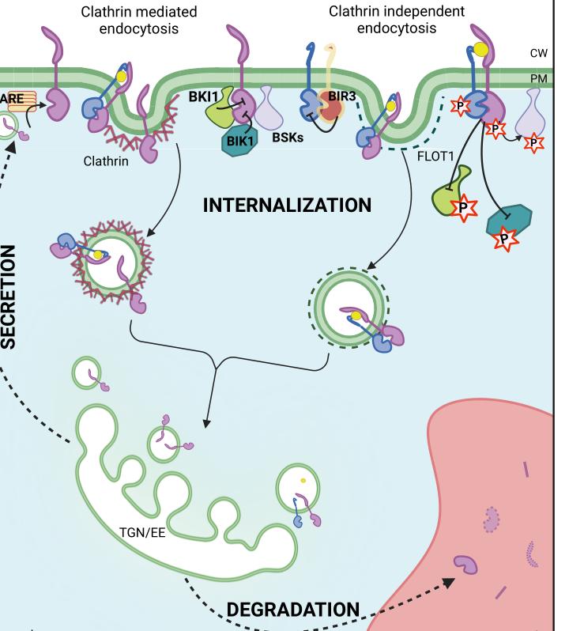

## Question

# Gene Research for Functional Annotation

## ⚠️ CRITICAL: Gene/Protein Identification Context

**BEFORE YOU BEGIN RESEARCH:** You MUST verify you are researching the CORRECT gene/protein. Gene symbols can be ambiguous, especially for less well-characterized genes from non-model organisms.

### Target Gene/Protein Identity (from UniProt):
- **UniProt Accession:** O22476
- **Protein Description:** RecName: Full=Protein BRASSINOSTEROID INSENSITIVE 1 {ECO:0000303|PubMed:9298904}; Short=AtBRI1 {ECO:0000303|PubMed:9298904}; EC=2.7.10.1 {ECO:0000305}; EC=2.7.11.1 {ECO:0000305}; AltName: Full=Brassinosteroid LRR receptor kinase {ECO:0000303|PubMed:9298904}; Flags: Precursor;
- **Gene Information:** Name=BRI1 {ECO:0000303|PubMed:9298904}; OrderedLocusNames=At4g39400 {ECO:0000312|Araport:AT4G39400}; ORFNames=F23K16.30 {ECO:0000312|EMBL:CAB44675.1};
- **Organism (full):** Arabidopsis thaliana (Mouse-ear cress).
- **Protein Family:** Belongs to the protein kinase superfamily. Ser/Thr protein
- **Key Domains:** BRI1_island_dom. (IPR045381); Kinase-like_dom_sf. (IPR011009); Leu-rich_rpt. (IPR001611); Leu-rich_rpt_typical-subtyp. (IPR003591); LRR_dom_sf. (IPR032675)

### MANDATORY VERIFICATION STEPS:

1. **Check if the gene symbol "BRI1" matches the protein description above**
2. **Verify the organism is correct:** Arabidopsis thaliana (Mouse-ear cress).
3. **Check if protein family/domains align with what you find in literature**
4. **If you find literature for a DIFFERENT gene with the same or similar symbol, STOP**

### If Gene Symbol is Ambiguous or You Cannot Find Relevant Literature:

**DO NOT PROCEED WITH RESEARCH ON A DIFFERENT GENE.** Instead:
- State clearly: "The gene symbol 'BRI1' is ambiguous or literature is limited for this specific protein"
- Explain what you found (e.g., "Found extensive literature on a different gene with the same symbol in a different organism")
- Describe the protein based ONLY on the UniProt information provided above
- Suggest that the protein function can be inferred from domain/family information

### Research Target:

Please provide a comprehensive research report on the gene **BRI1** (gene ID: BRI1, UniProt: O22476) in ARATH.

The research report should be a detailed narrative explaining the function, biological processes, and localization of the gene product. Citations should be given for all claims.

You should prioritize authoritative reviews and primary scientific literature when conducting research. You can supplement
this with annotations you find in gene/protein databases, but these can be outdated or inaccurate.

We are specifically interested in the primary function of the gene - for enzymes, what reaction is catalyzed, and what is the substrate specificity? For transporters, what is the substrate? For structural proteins or adapters, what is the broader structural role? For signaling molecules, what is the role in the pathway.

We are interested in where in or outside the cell the gene product carries out its function.

We are also interested in the signaling or biochemical pathways in which the gene functions. We are less interested in broad pleiotropic effects, except where these elucidate the precise role.

Include evidence where possible. We are interested in both experimental evidence as well as inference from structure, evolution, or bioinformatic analysis. Precise studies should be prioritized over high-throughput, where available.

## Output

Question: You are an expert researcher providing comprehensive, well-cited information.

Provide detailed information focusing on:
1. Key concepts and definitions with current understanding
2. Recent developments and latest research (prioritize 2023-2024 sources)
3. Current applications and real-world implementations
4. Expert opinions and analysis from authoritative sources
5. Relevant statistics and data from recent studies

Format as a comprehensive research report with proper citations. Include URLs and publication dates where available.
Always prioritize recent, authoritative sources and provide specific citations for all major claims.

# Gene Research for Functional Annotation

## ⚠️ CRITICAL: Gene/Protein Identification Context

**BEFORE YOU BEGIN RESEARCH:** You MUST verify you are researching the CORRECT gene/protein. Gene symbols can be ambiguous, especially for less well-characterized genes from non-model organisms.

### Target Gene/Protein Identity (from UniProt):
- **UniProt Accession:** O22476
- **Protein Description:** RecName: Full=Protein BRASSINOSTEROID INSENSITIVE 1 {ECO:0000303|PubMed:9298904}; Short=AtBRI1 {ECO:0000303|PubMed:9298904}; EC=2.7.10.1 {ECO:0000305}; EC=2.7.11.1 {ECO:0000305}; AltName: Full=Brassinosteroid LRR receptor kinase {ECO:0000303|PubMed:9298904}; Flags: Precursor;
- **Gene Information:** Name=BRI1 {ECO:0000303|PubMed:9298904}; OrderedLocusNames=At4g39400 {ECO:0000312|Araport:AT4G39400}; ORFNames=F23K16.30 {ECO:0000312|EMBL:CAB44675.1};
- **Organism (full):** Arabidopsis thaliana (Mouse-ear cress).
- **Protein Family:** Belongs to the protein kinase superfamily. Ser/Thr protein
- **Key Domains:** BRI1_island_dom. (IPR045381); Kinase-like_dom_sf. (IPR011009); Leu-rich_rpt. (IPR001611); Leu-rich_rpt_typical-subtyp. (IPR003591); LRR_dom_sf. (IPR032675)

### MANDATORY VERIFICATION STEPS:

1. **Check if the gene symbol "BRI1" matches the protein description above**
2. **Verify the organism is correct:** Arabidopsis thaliana (Mouse-ear cress).
3. **Check if protein family/domains align with what you find in literature**
4. **If you find literature for a DIFFERENT gene with the same or similar symbol, STOP**

### If Gene Symbol is Ambiguous or You Cannot Find Relevant Literature:

**DO NOT PROCEED WITH RESEARCH ON A DIFFERENT GENE.** Instead:
- State clearly: "The gene symbol 'BRI1' is ambiguous or literature is limited for this specific protein"
- Explain what you found (e.g., "Found extensive literature on a different gene with the same symbol in a different organism")
- Describe the protein based ONLY on the UniProt information provided above
- Suggest that the protein function can be inferred from domain/family information

### Research Target:

Please provide a comprehensive research report on the gene **BRI1** (gene ID: BRI1, UniProt: O22476) in ARATH.

The research report should be a detailed narrative explaining the function, biological processes, and localization of the gene product. Citations should be given for all claims.

You should prioritize authoritative reviews and primary scientific literature when conducting research. You can supplement
this with annotations you find in gene/protein databases, but these can be outdated or inaccurate.

We are specifically interested in the primary function of the gene - for enzymes, what reaction is catalyzed, and what is the substrate specificity? For transporters, what is the substrate? For structural proteins or adapters, what is the broader structural role? For signaling molecules, what is the role in the pathway.

We are interested in where in or outside the cell the gene product carries out its function.

We are also interested in the signaling or biochemical pathways in which the gene functions. We are less interested in broad pleiotropic effects, except where these elucidate the precise role.

Include evidence where possible. We are interested in both experimental evidence as well as inference from structure, evolution, or bioinformatic analysis. Precise studies should be prioritized over high-throughput, where available.

## Research report: Arabidopsis thaliana **BRI1** (BRASSINOSTEROID INSENSITIVE 1; UniProt **O22476**; At4g39400)

### 0) Target verification (required disambiguation)
The UniProt accession **O22476** corresponds to **Arabidopsis thaliana BRI1**, a **leucine-rich repeat receptor-like kinase (LRR-RLK)** that functions as the canonical **cell-surface brassinosteroid (BR) receptor** and signals with **SERK co-receptors** (notably **BAK1/AtSERK3**). This identity, domain architecture (LRR ectodomain with an “island domain” plus intracellular kinase domain), and pathway placement are consistently described in authoritative review and primary literature, matching the provided UniProt description. (delesalle2024thecellsurface pages 24-28, wang2008sequentialtransphosphorylationof pages 1-2)

### 1) Key concepts and definitions (current understanding)

#### 1.1 Brassinosteroids (BRs) and BR perception
**Brassinosteroids** are plant steroid hormones that regulate growth and development by being perceived at the **plasma membrane (PM)** by BRI1. Ligand binding (classically **brassinolide, BL**) is the initiating event that enables assembly/activation of a receptor complex and downstream phosphorylation signaling. (delesalle2024thecellsurface pages 20-24, wang2008sequentialtransphosphorylationof pages 1-2)

#### 1.2 BRI1 as an LRR receptor kinase with an “island domain”
BRI1 is a **cell-surface LRR-RLK** whose ectodomain contains an **island domain** that participates directly in steroid binding; work on early BR signaling established that the **island domain together with LRR22** forms the steroid-binding motif. (wang2008sequentialtransphosphorylationof pages 1-2)

#### 1.3 Co-receptors and receptor-kinase complexes (SERKs/BAK1)
A core concept in BR signaling is that ligand binding promotes formation of an **active receptor/co-receptor complex**. In Arabidopsis, BRI1 forms a complex with a **SERK family co-receptor**, especially **BAK1/AtSERK3**, and the complex becomes active through **sequential transphosphorylation** between the two kinase domains. (delesalle2024thecellsurface pages 20-24, wang2008sequentialtransphosphorylationof pages 1-2)

#### 1.4 Downstream signaling logic: RLCK relay → phosphatase → GSK3 inhibition → transcription factors
Activated BRI1 initiates signaling through receptor-proximal kinases (e.g., **BSK1** and **CDG1**) that activate the phosphatase **BSU1**, which in turn inactivates the GSK3-like kinase **BIN2**. BIN2 normally represses BR output by phosphorylating the transcription factors **BES1/BZR1**; BR signaling shifts BES1/BZR1 toward nuclear accumulation and transcriptional reprogramming. (delesalle2024thecellsurface pages 20-24, kim2011thecdg1kinase pages 1-2)

### 2) Molecular function of BRI1 (enzyme activity, substrates, and specificity)

#### 2.1 Catalytic activity: receptor kinase with dual specificity
BRI1 is a receptor kinase primarily classified as a Ser/Thr kinase, but it also displays **tyrosine phosphorylation** (dual-specificity behavior) as part of BR signaling regulatory logic. (delesalle2024thecellsurface pages 20-24)

#### 2.2 Experimentally mapped phosphorylation sites and functional residues
A detailed LC–MS/MS study identified **in vivo BRI1 phosphosites** including **S838, S858, T872, T880** (juxtamembrane), **T982** (kinase domain), and **S1168** (C-terminal region), with additional sites suggested in the activation loop. Functional mutagenesis showed that activation-loop residues **T1049** and either **S1044 or T1045** are essential for normal kinase activity/signaling, while **T1039A** and **S1042A** show intermediate effects. (wang2005identificationandfunctional pages 1-2, wang2005identificationandfunctional pages 10-11)

A notable quantitative enzyme-kinetic observation from this work is that the **T872A** mutation increases **Vmax ~10-fold** and reduces **Km ~2-fold**, strongly increasing catalytic efficiency relative to wild-type BRI1. (wang2005identificationandfunctional pages 13-15)

#### 2.3 Direct downstream phosphotargets in early BR signaling
A key primary study established residue-level phosphorylation events linking BRI1 to downstream BR signaling:
- BRI1 phosphorylates **BSK1 at Ser230**, increasing BSK1 interaction with BSU1.
- BRI1 phosphorylates **CDG1 at Ser44, Ser47, and Ser234**, with **Ser234** important for CDG1 activation.
- Activated CDG1 phosphorylates **BSU1 at Ser764**, enhancing BSU1 function.
- BSU1 promotes BIN2 inactivation by dephosphorylating **BIN2 Tyr200**.
(kim2011thecdg1kinase pages 1-2)

### 3) Ligand perception and receptor activation mechanism

#### 3.1 Brassinolide binding and structural logic
Work on early BR signaling emphasizes that BL is perceived through the BRI1 ectodomain and that the **island domain + LRR22** are integral to the steroid-binding motif. (wang2008sequentialtransphosphorylationof pages 1-2)

Recent structural/biophysical analysis of BR receptor complexes further supports the mechanism whereby BR binding creates a co-receptor (SERK) binding interface, enabling receptor–co-receptor association and activation. In this work, a **BRI1–BL–SERK1** complex highlights polar contacts involving BL functional groups and residues including **BRI1 Tyr642 and Lys601** and a co-receptor residue **His62**, illustrating how ligand chemistry supports co-receptor recruitment. (caregnato2025amechanisticframework pages 40-55)

#### 3.2 Sequential transphosphorylation with BAK1/SERKs
A key mechanistic concept is **sequential transphosphorylation**: BR-dependent BRI1 activation precedes/permits association with BAK1, after which BRI1 and BAK1 **transphosphorylate each other**, enhancing signaling output. Conserved activation-loop residues (notably **S1044** and **T1049**) are critical for BRI1 function in vitro and for BR signaling in planta. (wang2008sequentialtransphosphorylationof pages 1-2)

#### 3.3 Relief of inhibition: BKI1 release
Receptor activation involves dissociation of an inhibitory factor, **BKI1**, triggered by tyrosine phosphorylation; this is an early step connecting ligand perception to propagation of the phosphorylation cascade. (qiu2025brassinosteroidsignalingdynamics pages 14-16, kim2011thecdg1kinase pages 1-2)

### 4) Subcellular localization, trafficking, and spatial organization

#### 4.1 Primary site of action: the cell surface (plasma membrane)
A 2024 synthesis emphasizes that BR perception and key early signaling steps occur at the **cell surface**, with BRI1 functioning as a PM receptor whose abundance and activity are tightly controlled. (delesalle2024thecellsurface pages 5-8, delesalle2024thecellsurface pages 24-28)

#### 4.2 Nanodomain organization
BRI1 is organized in **PM nanodomains** that are distinct from certain immune receptor nanodomains (e.g., FLS2). This spatial patterning is proposed to support signaling specificity, and BRI1-associated complexes can align with cortical microtubules. (delesalle2024thecellsurface pages 5-8)

#### 4.3 Endocytosis and post-translational modification (PTM) control
BRI1 undergoes regulated internalization by multiple routes including **clathrin-mediated endocytosis** (AP-2/T-PLATE-associated) and a **clathrin-independent** pathway (FLOT1-associated), followed by endosomal trafficking (e.g., via **TGN/EE**) and vacuolar degradation. (delesalle2024thecellsurface pages 5-8, delesalle2024thecellsurface media 76d771eb)

A major, current theme (highlighted in 2024) is that BRI1 PM abundance is controlled by competing PTMs:
- **K63-linked polyubiquitination** promotes endocytosis, involving **PUB12/13** (E3 ligases) and **UBC35/36** (E2 enzymes).
- Deubiquitination by **UBP12/13** stabilizes BRI1 at the PM.
- **SUMOylation** stabilizes BRI1, whereas deSUMOylation by **DeSi3a** promotes internalization.
Moreover, mutation of **25 cytosolic lysines** blocks internalization/degradation and causes hyperactivated BR signaling, consistent with extensive PTM control on overlapping Lys residues. (delesalle2024thecellsurface pages 5-8, delesalle2024thecellsurface media 76d771eb)

### 5) Pathways and biological processes impacted (focused on primary role)

#### 5.1 Core BR signaling pathway
Integrating primary and review evidence, the core pathway can be summarized as:
1) BL binding to BRI1 ectodomain → 2) recruitment/activation with BAK1/SERKs (transphosphorylation) → 3) release of BKI1 inhibition → 4) phosphorylation of RLCKs (BSK1, CDG1) → 5) activation of BSU1 → 6) inactivation of BIN2 → 7) activation/nuclear accumulation of BES1/BZR1 → transcriptional regulation of BR-responsive genes. (delesalle2024thecellsurface pages 20-24, kim2011thecdg1kinase pages 1-2, wang2008sequentialtransphosphorylationof pages 1-2)

#### 5.2 Quantitative and experimental condition examples
Primary experiments that illustrate BR-dependent complex formation used **BRZ** (biosynthesis inhibitor) followed by **0.1 mM BL for 90 minutes**, where BL increased BAK1 co-immunoprecipitation with BRI1 and BRZ reduced it. (wang2005identificationandfunctional pages 2-3)

### 6) Recent developments and latest research (prioritizing 2023–2024)

#### 6.1 2024 high-authority perspective: “cell surface is the place to be”
A 2024 Nature Plants review emphasizes that BR perception and response are organized at the PM and regulated by receptor trafficking, nanodomains, and PTM “codes” (ubiquitin/SUMO) that tune BRI1 abundance and signaling capacity. It also highlights gaps in understanding, such as how nanodomains are established/maintained and how PTM patterns are read to route receptors to distinct fates. (delesalle2024thecellsurface pages 5-8, delesalle2024thecellsurface pages 24-28)

#### 6.2 2024 primary mechanism expansion: BON copines as facilitators of BRI1–SERK complex formation
A 2024 Nature Communications study identifies PM-associated **copine/BON proteins** as direct SERK interactors that promote effective **BRI1–SERK interaction and transphosphorylation**, adding a mechanistic layer upstream of the receptor complex activation step and pointing to new trait-engineering targets. (jing2024copineproteinsare pages 1-2)

### 7) Current applications and real-world implementations

#### 7.1 Crop architecture engineering by tuning BRI1/BR perception
Although the target here is Arabidopsis BRI1, “BRI1” function is sufficiently conserved that applied work in crops leverages the same receptor logic. A 2025 peer-reviewed wheat study demonstrates that induced variation in **TaBRI1** generates a **compact, upright-leaf architecture**, with quantitative phenotypes including:
- **57%** and **27%** shorter plants for two triple-mutant combinations, and one triple mutant at **34.3 cm vs 53.0 cm** control (≈ **35%** reduction).
- **56% reduction** in flag-leaf angle (FLA) in a triple mutant.
- Trade-offs including **16% shorter spike length** and reduced thousand-grain weight (e.g., **15.9%** reduction in one genotype).
This illustrates a real-world implementation pattern: partial reduction of BR perception can improve canopy architecture but may impose yield penalties that breeding must mitigate. (gill2025inducedvariationin pages 6-9)

#### 7.2 Chemical and hormonal implementations (growth and stress tolerance)
Recent reviews discuss the use of **exogenous BR treatments** (e.g., 2,4-epibrassinolide) and BR-pathway manipulation to improve stress tolerance and growth traits in horticultural contexts, and note that BR metabolism can modulate whether ligands fit the BRI1 pocket (thereby affecting perception). These strategies represent practical routes to modulate BRI1-pathway output without direct gene editing of BRI1. (gao2024brassinolidessignalingpathway pages 1-2)

### 8) Expert synthesis and analysis (authoritative-source interpretation)
The best-supported contemporary view is that BRI1 signaling output is determined not only by ligand availability and receptor–co-receptor phosphorylation chemistry, but also by **spatial compartmentalization (nanodomains)** and **dynamic receptor trafficking regulated by PTMs (ubiquitin/SUMO)**. This implies that “functional annotation” for BRI1 should be framed as a **system property**: BRI1 is a kinase receptor whose core biochemical role is phosphorylation signaling, but whose biological function depends on regulated residence time at the PM, endosomal routing, and assembly with auxiliary proteins controlling complex formation (e.g., BON/SERKs). (delesalle2024thecellsurface pages 5-8, jing2024copineproteinsare pages 1-2)

### 9) Evidence map (summary table)
The following table provides a compact, citable map of key findings, residues, and mechanistic components.

| Topic | Key findings | Key molecules/residues | Evidence type | Year | DOI/URL |
|---|---|---|---|---|---|
| Identity/domains | Arabidopsis thaliana BRI1 (UniProt O22476; At4g39400) is consistently identified as a plasma-membrane leucine-rich repeat receptor-like kinase (LRR-RLK) with an extracellular LRR domain containing an island domain for steroid perception and an intracellular kinase domain; this matches the UniProt annotation. (delesalle2024thecellsurface pages 5-8, delesalle2024thecellsurface pages 24-28, wang2008sequentialtransphosphorylationof pages 1-2) | BRI1; LRR ectodomain; island domain; kinase domain | Review + primary | 2024, 2008 | https://doi.org/10.1038/s41477-024-01621-2 ; https://doi.org/10.1016/j.devcel.2008.06.011 |
| Ligand perception | BRI1 perceives brassinosteroids, especially brassinolide (BL), through the extracellular LRR/island domain; BL binding creates a SERK-binding surface and the island domain together with LRR22 directly forms the steroid-binding motif. Recent structural work further mapped BL-contacting chemistry important for co-receptor recruitment. (caregnato2025amechanisticframework pages 40-55, wang2008sequentialtransphosphorylationof pages 1-2, wang2005autoregulationandhomodimerization pages 1-2) | BL; island domain; LRR22; Tyr642; Lys601; His62 | Primary | 2025, 2008, 2005 | https://doi.org/10.1101/2025.08.08.669299 ; https://doi.org/10.1016/j.devcel.2008.06.011 ; https://doi.org/10.1016/j.devcel.2005.05.001 |
| Co-receptor complex | BR binding promotes BRI1 association with SERK co-receptors, especially BAK1/AtSERK3; the complex undergoes sequential transphosphorylation, and BRI1 can phosphorylate BAK1 before reciprocal activation further boosts signaling. BL also increases BAK1-GFP co-immunoprecipitation with BRI1, whereas BRZ reduces association. (qiu2025brassinosteroidsignalingdynamics pages 14-16, delesalle2024thecellsurface pages 20-24, wang2008sequentialtransphosphorylationof pages 1-2, wang2005identificationandfunctional pages 2-3) | BAK1/AtSERK3; SERK1; BRZ; BL | Review + primary | 2025, 2024, 2008, 2005 | https://doi.org/10.3390/ijms26104502 ; https://doi.org/10.1038/s41477-024-01621-2 ; https://doi.org/10.1016/j.devcel.2008.06.011 ; https://doi.org/10.1105/tpc.105.031393 |
| Kinase activity | BRI1 is a dual-specificity kinase: historically classified as Ser/Thr, but later shown to autophosphorylate on tyrosine as well. Autophosphorylation appears hierarchical (Ser > Thr > Tyr), and the juxtamembrane domain activates kinase output. (delesalle2024thecellsurface pages 24-28, delesalle2024thecellsurface pages 20-24) | Ser/Thr/Tyr phosphorylation; juxtamembrane domain | Review + primary | 2024, 2012, 2009 | https://doi.org/10.1038/s41477-024-01621-2 ; https://doi.org/10.3389/fpls.2012.00175 ; https://doi.org/10.1073/pnas.0810249106 |
| Kinase activity/phosphosites | In vivo phosphosites identified on BRI1 include S838, S858, T872, T880, T982, and S1168, with additional activation-loop sites detected by MS. Activation-loop residues are functionally critical: T1049 and S1044/T1045 are essential for kinase activity/signaling; T1039A and S1042A show intermediate rescue. T872A increased Vmax ~10-fold and lowered Km ~2-fold. (wang2005identificationandfunctional pages 10-11, wang2005identificationandfunctional pages 1-2, wang2005identificationandfunctional pages 13-15) | S838; S858; T872; T880; T982; S1168; T1039; S1042; S1044; T1045; T1049 | Primary | 2005 | https://doi.org/10.1105/tpc.105.031393 |
| Receptor regulation | BRI1 activation includes release of the inhibitor BKI1 via tyrosine phosphorylation; BKI1 dissociation is an early step linking receptor activation to downstream signaling. (qiu2025brassinosteroidsignalingdynamics pages 14-16, delesalle2024thecellsurface pages 24-28, kim2011thecdg1kinase pages 1-2) | BKI1; Tyr phosphorylation | Review + primary | 2025, 2024, 2011 | https://doi.org/10.3390/ijms26104502 ; https://doi.org/10.1038/s41477-024-01621-2 ; https://doi.org/10.1016/j.molcel.2011.05.037 |
| Early downstream signaling | Activated BRI1 phosphorylates RLCKs including BSK1 and CDG1; BSK1 is phosphorylated at Ser230, and CDG1 at Ser44, Ser47, and Ser234, with Ser234 important for CDG1 activation. (kim2011thecdg1kinase pages 1-2) | BSK1 Ser230; CDG1 Ser44/Ser47/Ser234 | Primary | 2011 | https://doi.org/10.1016/j.molcel.2011.05.037 |
| Core phosphorylation cascade | Activated CDG1 phosphorylates BSU1 at Ser764, enhancing BSU1-mediated dephosphorylation of BIN2 at Tyr200; BIN2 inactivation releases BES1/BZR1 to accumulate in the nucleus and regulate BR-responsive genes. (qiu2025brassinosteroidsignalingdynamics pages 14-16, delesalle2024thecellsurface pages 20-24, kim2011thecdg1kinase pages 1-2, wang2005autoregulationandhomodimerization pages 1-2) | BSU1 Ser764; BIN2 Tyr200; BES1; BZR1/BZR2 | Review + primary | 2025, 2024, 2011, 2005 | https://doi.org/10.3390/ijms26104502 ; https://doi.org/10.1038/s41477-024-01621-2 ; https://doi.org/10.1016/j.molcel.2011.05.037 ; https://doi.org/10.1016/j.devcel.2005.05.001 |
| Localization/nanodomains | BRI1 is primarily plasma-membrane localized and enriched in distinct PM nanodomains separate from FLS2; BRI1-BAK1-BIK1 complexes align with cortical microtubules, supporting spatially organized signaling. (delesalle2024thecellsurface pages 35-37, delesalle2024thecellsurface pages 5-8, delesalle2024thecellsurface media 76d771eb) | PM nanodomains; BIK1; cortical microtubules | Review | 2024 | https://doi.org/10.1038/s41477-024-01621-2 |
| Trafficking/endocytosis | BRI1 abundance is dynamically controlled by endocytosis and recycling. Internalization occurs via AP-2/T-PLATE-dependent clathrin-mediated endocytosis and a clathrin-independent FLOT1 pathway, followed by trafficking through TGN/EE and vacuolar degradation. (delesalle2024thecellsurface pages 5-8, delesalle2024thecellsurface media 76d771eb) | AP-2; T-PLATE; FLOT1; TGN/EE; vacuole | Review | 2024 | https://doi.org/10.1038/s41477-024-01621-2 |
| PTM control of receptor abundance | K63-polyubiquitination by PUB12/13 with E2s UBC35/36 promotes BRI1 endocytosis; deubiquitination by UBP12/13 stabilizes PM BRI1. Mutation of 25 cytosolic Lys residues abolishes internalization/degradation and causes hyperactive BR signaling. SUMOylation stabilizes BRI1, whereas deSUMOylation by DeSi3a promotes internalization. (delesalle2024thecellsurface pages 35-37, delesalle2024thecellsurface pages 5-8, delesalle2024thecellsurface media 76d771eb) | PUB12/13; UBC35/36; UBP12/13; 25 Lys residues; SUMO; DeSi3a | Review | 2024 | https://doi.org/10.1038/s41477-024-01621-2 |
| Functional/phenotypic evidence | Exogenous BR decreases root stele area in wild type, whereas perturbed BR signaling increases stele area; epidermis-specific BRI1 expression in bri1 mutants can rescue root growth and limit stele area. Recent chemical-biology assays used 100 nM BL in root growth inhibition tests (n = 30-35). (delesalle2024thecellsurface pages 16-20, caregnato2025amechanisticframework pages 40-55) | Root stele area; bri1 mutants; 100 nM BL; n=30-35 | Review + primary | 2024, 2025 | https://doi.org/10.1038/s41477-024-01621-2 ; https://doi.org/10.1101/2025.08.08.669299 |

*Table: This table summarizes experimentally supported functional annotation evidence for Arabidopsis thaliana BRI1 (UniProt O22476), covering identity, ligand perception, receptor-complex formation, kinase activity, trafficking, and downstream signaling. It is useful as a compact evidence map linking molecular features to specific publications and residues.*

### 10) Visual schematic evidence (cell-surface model)
A schematic model figure from the 2024 Nature Plants review summarizes (i) BR perception and BRI1–BAK1 complex formation at the PM, (ii) clathrin-mediated and clathrin-independent internalization routes, and (iii) ubiquitin/SUMO control of receptor dynamics and downstream signaling logic (BIK1, BIN2, BES1/BZR1). (delesalle2024thecellsurface media 76d771eb)

---

## Key references (URLs and publication dates)
- Delesalle C, Vert G, Fujita S. **The cell surface is the place to be for brassinosteroid perception and responses.** *Nature Plants* (Feb **2024**). https://doi.org/10.1038/s41477-024-01621-2 (delesalle2024thecellsurface pages 5-8)
- Jing T et al. **Copine proteins are required for brassinosteroid signaling in maize and Arabidopsis.** *Nature Communications* (Mar **2024**). https://doi.org/10.1038/s41467-024-46289-6 (jing2024copineproteinsare pages 1-2)
- Kim T-W et al. **The CDG1 kinase mediates brassinosteroid signal transduction from BRI1… to BSU1… and BIN2.** *Molecular Cell* (Aug **2011**). https://doi.org/10.1016/j.molcel.2011.05.037 (kim2011thecdg1kinase pages 1-2)
- Wang X et al. **Sequential transphosphorylation of the BRI1/BAK1 receptor kinase complex…** *Developmental Cell* (Aug **2008**). https://doi.org/10.1016/j.devcel.2008.06.011 (wang2008sequentialtransphosphorylationof pages 1-2)
- Wang X et al. **Identification and functional analysis of in vivo phosphorylation sites of BRI1.** *The Plant Cell* (May **2005**). https://doi.org/10.1105/tpc.105.031393 (wang2005identificationandfunctional pages 1-2)
- Gill MS et al. **Induced variation in BRI1 confers a compact wheat architecture.** *BMC Plant Biology* (May **2025**). https://doi.org/10.1186/s12870-025-06762-w (gill2025inducedvariationin pages 6-9)

References

1. (delesalle2024thecellsurface pages 24-28): Charlotte Delesalle, Grégory Vert, and Satoshi Fujita. The cell surface is the place to be for brassinosteroid perception and responses. Nature Plants, 10:206-218, Feb 2024. URL: https://doi.org/10.1038/s41477-024-01621-2, doi:10.1038/s41477-024-01621-2. This article has 21 citations and is from a highest quality peer-reviewed journal.

2. (wang2008sequentialtransphosphorylationof pages 1-2): Xiaofeng Wang, Uma Kota, Kai He, Kevin Blackburn, Jia Li, Michael B. Goshe, Steven C. Huber, and Steven D. Clouse. Sequential transphosphorylation of the bri1/bak1 receptor kinase complex impacts early events in brassinosteroid signaling. Developmental cell, 15 2:220-35, Aug 2008. URL: https://doi.org/10.1016/j.devcel.2008.06.011, doi:10.1016/j.devcel.2008.06.011. This article has 668 citations and is from a highest quality peer-reviewed journal.

3. (delesalle2024thecellsurface pages 20-24): Charlotte Delesalle, Grégory Vert, and Satoshi Fujita. The cell surface is the place to be for brassinosteroid perception and responses. Nature Plants, 10:206-218, Feb 2024. URL: https://doi.org/10.1038/s41477-024-01621-2, doi:10.1038/s41477-024-01621-2. This article has 21 citations and is from a highest quality peer-reviewed journal.

4. (kim2011thecdg1kinase pages 1-2): Tae-Wuk Kim, Shenheng Guan, Alma L. Burlingame, and Zhi-Yong Wang. The cdg1 kinase mediates brassinosteroid signal transduction from bri1 receptor kinase to bsu1 phosphatase and gsk3-like kinase bin2. Molecular cell, 43 4:561-71, Aug 2011. URL: https://doi.org/10.1016/j.molcel.2011.05.037, doi:10.1016/j.molcel.2011.05.037. This article has 487 citations and is from a highest quality peer-reviewed journal.

5. (wang2005identificationandfunctional pages 1-2): Xiaofeng Wang, Michael B. Goshe, Erik J. Soderblom, Brett S. Phinney, Jason A. Kuchar, Jia Li, Tadao Asami, Shigeo Yoshida, Steven C. Huber, and Steven D. Clouse. Identification and functional analysis of in vivo phosphorylation sites of the arabidopsis brassinosteroid-insensitive1 receptor kinase. The Plant Cell, 17:1685-1703, May 2005. URL: https://doi.org/10.1105/tpc.105.031393, doi:10.1105/tpc.105.031393. This article has 492 citations.

6. (wang2005identificationandfunctional pages 10-11): Xiaofeng Wang, Michael B. Goshe, Erik J. Soderblom, Brett S. Phinney, Jason A. Kuchar, Jia Li, Tadao Asami, Shigeo Yoshida, Steven C. Huber, and Steven D. Clouse. Identification and functional analysis of in vivo phosphorylation sites of the arabidopsis brassinosteroid-insensitive1 receptor kinase. The Plant Cell, 17:1685-1703, May 2005. URL: https://doi.org/10.1105/tpc.105.031393, doi:10.1105/tpc.105.031393. This article has 492 citations.

7. (wang2005identificationandfunctional pages 13-15): Xiaofeng Wang, Michael B. Goshe, Erik J. Soderblom, Brett S. Phinney, Jason A. Kuchar, Jia Li, Tadao Asami, Shigeo Yoshida, Steven C. Huber, and Steven D. Clouse. Identification and functional analysis of in vivo phosphorylation sites of the arabidopsis brassinosteroid-insensitive1 receptor kinase. The Plant Cell, 17:1685-1703, May 2005. URL: https://doi.org/10.1105/tpc.105.031393, doi:10.1105/tpc.105.031393. This article has 492 citations.

8. (caregnato2025amechanisticframework pages 40-55): Alberto Caregnato, Houming Chen, Miroslav Kvasnica, Ulrich Hohmann, Jana Oklestkova, Karoll Ferrer, Larissa Broger, Ludwig A. Hothorn, Miroslav Strnad, and Michael Hothorn. A mechanistic framework for the recognition of chemically diverse brassinosteroids by bri1-family receptor kinases. bioRxiv, Aug 2025. URL: https://doi.org/10.1101/2025.08.08.669299, doi:10.1101/2025.08.08.669299. This article has 3 citations.

9. (qiu2025brassinosteroidsignalingdynamics pages 14-16): Riguang Qiu, Yan Zhou, and Juan Mao. Brassinosteroid signaling dynamics: ubiquitination-dependent regulation of core signaling components. International Journal of Molecular Sciences, 26:4502, May 2025. URL: https://doi.org/10.3390/ijms26104502, doi:10.3390/ijms26104502. This article has 2 citations.

10. (delesalle2024thecellsurface pages 5-8): Charlotte Delesalle, Grégory Vert, and Satoshi Fujita. The cell surface is the place to be for brassinosteroid perception and responses. Nature Plants, 10:206-218, Feb 2024. URL: https://doi.org/10.1038/s41477-024-01621-2, doi:10.1038/s41477-024-01621-2. This article has 21 citations and is from a highest quality peer-reviewed journal.

11. (delesalle2024thecellsurface media 76d771eb): Charlotte Delesalle, Grégory Vert, and Satoshi Fujita. The cell surface is the place to be for brassinosteroid perception and responses. Nature Plants, 10:206-218, Feb 2024. URL: https://doi.org/10.1038/s41477-024-01621-2, doi:10.1038/s41477-024-01621-2. This article has 21 citations and is from a highest quality peer-reviewed journal.

12. (wang2005identificationandfunctional pages 2-3): Xiaofeng Wang, Michael B. Goshe, Erik J. Soderblom, Brett S. Phinney, Jason A. Kuchar, Jia Li, Tadao Asami, Shigeo Yoshida, Steven C. Huber, and Steven D. Clouse. Identification and functional analysis of in vivo phosphorylation sites of the arabidopsis brassinosteroid-insensitive1 receptor kinase. The Plant Cell, 17:1685-1703, May 2005. URL: https://doi.org/10.1105/tpc.105.031393, doi:10.1105/tpc.105.031393. This article has 492 citations.

13. (jing2024copineproteinsare pages 1-2): Teng Jing, Yuying Wu, Yanwen Yu, Jiankun Li, Xiaohuan Mu, Liping Xu, Xi Wang, Guang Qi, Jihua Tang, Daowen Wang, Shuhua Yang, Jian Hua, and Mingyue Gou. Copine proteins are required for brassinosteroid signaling in maize and arabidopsis. Nature Communications, Mar 2024. URL: https://doi.org/10.1038/s41467-024-46289-6, doi:10.1038/s41467-024-46289-6. This article has 22 citations and is from a highest quality peer-reviewed journal.

14. (gill2025inducedvariationin pages 6-9): Manpartik S. Gill, Andrew L. Phillips, Danuše Tarkowská, John Addy, Patrycja Sokolowska, M. John Foulkes, Stephen Pearce, Stephen G. Thomas, and Peter Hedden. Induced variation in brassinosteroid insensitive 1 (bri1) confers a compact wheat architecture. BMC Plant Biology, May 2025. URL: https://doi.org/10.1186/s12870-025-06762-w, doi:10.1186/s12870-025-06762-w. This article has 2 citations and is from a peer-reviewed journal.

15. (gao2024brassinolidessignalingpathway pages 1-2): Yanlong Gao, Xiaolan Ma, Zhongxing Zhang, Xiaoya Wang, and Yanxiu Wang. Brassinolides signaling pathway: tandem response to plant hormones and regulation under various abiotic stresses. Horticulture Advances, Oct 2024. URL: https://doi.org/10.1007/s44281-024-00050-7, doi:10.1007/s44281-024-00050-7. This article has 24 citations.

16. (wang2005autoregulationandhomodimerization pages 1-2): Xuelu Wang, Xiaoqing Li, Jill Meisenhelder, Tony Hunter, Shigeo Yoshida, Tadao Asami, and Joanne Chory. Autoregulation and homodimerization are involved in the activation of the plant steroid receptor bri1. Developmental cell, 8 6:855-65, Jun 2005. URL: https://doi.org/10.1016/j.devcel.2005.05.001, doi:10.1016/j.devcel.2005.05.001. This article has 375 citations and is from a highest quality peer-reviewed journal.

17. (delesalle2024thecellsurface pages 35-37): Charlotte Delesalle, Grégory Vert, and Satoshi Fujita. The cell surface is the place to be for brassinosteroid perception and responses. Nature Plants, 10:206-218, Feb 2024. URL: https://doi.org/10.1038/s41477-024-01621-2, doi:10.1038/s41477-024-01621-2. This article has 21 citations and is from a highest quality peer-reviewed journal.

18. (delesalle2024thecellsurface pages 16-20): Charlotte Delesalle, Grégory Vert, and Satoshi Fujita. The cell surface is the place to be for brassinosteroid perception and responses. Nature Plants, 10:206-218, Feb 2024. URL: https://doi.org/10.1038/s41477-024-01621-2, doi:10.1038/s41477-024-01621-2. This article has 21 citations and is from a highest quality peer-reviewed journal.

## Artifacts

- [Edison artifact artifact-00](BRI1-deep-research-falcon_artifacts/artifact-00.md)

## Citations

1. wang2008sequentialtransphosphorylationof pages 1-2
2. delesalle2024thecellsurface pages 20-24
3. wang2005identificationandfunctional pages 13-15
4. caregnato2025amechanisticframework pages 40-55
5. delesalle2024thecellsurface pages 5-8
6. wang2005identificationandfunctional pages 2-3
7. jing2024copineproteinsare pages 1-2
8. gill2025inducedvariationin pages 6-9
9. gao2024brassinolidessignalingpathway pages 1-2
10. wang2005identificationandfunctional pages 1-2
11. delesalle2024thecellsurface pages 24-28
12. wang2005identificationandfunctional pages 10-11
13. qiu2025brassinosteroidsignalingdynamics pages 14-16
14. wang2005autoregulationandhomodimerization pages 1-2
15. delesalle2024thecellsurface pages 35-37
16. delesalle2024thecellsurface pages 16-20
17. https://doi.org/10.1038/s41477-024-01621-2
18. https://doi.org/10.1016/j.devcel.2008.06.011
19. https://doi.org/10.1101/2025.08.08.669299
20. https://doi.org/10.1016/j.devcel.2005.05.001
21. https://doi.org/10.3390/ijms26104502
22. https://doi.org/10.1105/tpc.105.031393
23. https://doi.org/10.3389/fpls.2012.00175
24. https://doi.org/10.1073/pnas.0810249106
25. https://doi.org/10.1016/j.molcel.2011.05.037
26. https://doi.org/10.1038/s41467-024-46289-6
27. https://doi.org/10.1186/s12870-025-06762-w
28. https://doi.org/10.1038/s41477-024-01621-2,
29. https://doi.org/10.1016/j.devcel.2008.06.011,
30. https://doi.org/10.1016/j.molcel.2011.05.037,
31. https://doi.org/10.1105/tpc.105.031393,
32. https://doi.org/10.1101/2025.08.08.669299,
33. https://doi.org/10.3390/ijms26104502,
34. https://doi.org/10.1038/s41467-024-46289-6,
35. https://doi.org/10.1186/s12870-025-06762-w,
36. https://doi.org/10.1007/s44281-024-00050-7,
37. https://doi.org/10.1016/j.devcel.2005.05.001,