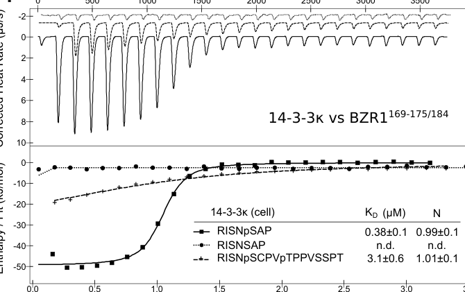

## Question

# Gene Research for Functional Annotation

## ⚠️ CRITICAL: Gene/Protein Identification Context

**BEFORE YOU BEGIN RESEARCH:** You MUST verify you are researching the CORRECT gene/protein. Gene symbols can be ambiguous, especially for less well-characterized genes from non-model organisms.

### Target Gene/Protein Identity (from UniProt):
- **UniProt Accession:** Q8S307
- **Protein Description:** RecName: Full=Protein BRASSINAZOLE-RESISTANT 1 {ECO:0000303|PubMed:11970900}; AltName: Full=Protein BIN2 SUBSTRATE 2 {ECO:0000303|PubMed:12427989};
- **Gene Information:** Name=BZR1 {ECO:0000303|PubMed:11970900}; Synonyms=BIS2 {ECO:0000303|PubMed:12427989}; OrderedLocusNames=At1g75080 {ECO:0000312|Araport:AT1G75080}; ORFNames=F9E10.7 {ECO:0000312|EMBL:AAG51929.1};
- **Organism (full):** Arabidopsis thaliana (Mouse-ear cress).
- **Protein Family:** Belongs to the BZR/LAT61 family. .
- **Key Domains:** BES1_N. (IPR008540); BZR. (IPR033264); BES1_N (PF05687)

### MANDATORY VERIFICATION STEPS:

1. **Check if the gene symbol "BZR1" matches the protein description above**
2. **Verify the organism is correct:** Arabidopsis thaliana (Mouse-ear cress).
3. **Check if protein family/domains align with what you find in literature**
4. **If you find literature for a DIFFERENT gene with the same or similar symbol, STOP**

### If Gene Symbol is Ambiguous or You Cannot Find Relevant Literature:

**DO NOT PROCEED WITH RESEARCH ON A DIFFERENT GENE.** Instead:
- State clearly: "The gene symbol 'BZR1' is ambiguous or literature is limited for this specific protein"
- Explain what you found (e.g., "Found extensive literature on a different gene with the same symbol in a different organism")
- Describe the protein based ONLY on the UniProt information provided above
- Suggest that the protein function can be inferred from domain/family information

### Research Target:

Please provide a comprehensive research report on the gene **BZR1** (gene ID: BZR1, UniProt: Q8S307) in ARATH.

The research report should be a detailed narrative explaining the function, biological processes, and localization of the gene product. Citations should be given for all claims.

You should prioritize authoritative reviews and primary scientific literature when conducting research. You can supplement
this with annotations you find in gene/protein databases, but these can be outdated or inaccurate.

We are specifically interested in the primary function of the gene - for enzymes, what reaction is catalyzed, and what is the substrate specificity? For transporters, what is the substrate? For structural proteins or adapters, what is the broader structural role? For signaling molecules, what is the role in the pathway.

We are interested in where in or outside the cell the gene product carries out its function.

We are also interested in the signaling or biochemical pathways in which the gene functions. We are less interested in broad pleiotropic effects, except where these elucidate the precise role.

Include evidence where possible. We are interested in both experimental evidence as well as inference from structure, evolution, or bioinformatic analysis. Precise studies should be prioritized over high-throughput, where available.

## Output

Question: You are an expert researcher providing comprehensive, well-cited information.

Provide detailed information focusing on:
1. Key concepts and definitions with current understanding
2. Recent developments and latest research (prioritize 2023-2024 sources)
3. Current applications and real-world implementations
4. Expert opinions and analysis from authoritative sources
5. Relevant statistics and data from recent studies

Format as a comprehensive research report with proper citations. Include URLs and publication dates where available.
Always prioritize recent, authoritative sources and provide specific citations for all major claims.

# Gene Research for Functional Annotation

## ⚠️ CRITICAL: Gene/Protein Identification Context

**BEFORE YOU BEGIN RESEARCH:** You MUST verify you are researching the CORRECT gene/protein. Gene symbols can be ambiguous, especially for less well-characterized genes from non-model organisms.

### Target Gene/Protein Identity (from UniProt):
- **UniProt Accession:** Q8S307
- **Protein Description:** RecName: Full=Protein BRASSINAZOLE-RESISTANT 1 {ECO:0000303|PubMed:11970900}; AltName: Full=Protein BIN2 SUBSTRATE 2 {ECO:0000303|PubMed:12427989};
- **Gene Information:** Name=BZR1 {ECO:0000303|PubMed:11970900}; Synonyms=BIS2 {ECO:0000303|PubMed:12427989}; OrderedLocusNames=At1g75080 {ECO:0000312|Araport:AT1G75080}; ORFNames=F9E10.7 {ECO:0000312|EMBL:AAG51929.1};
- **Organism (full):** Arabidopsis thaliana (Mouse-ear cress).
- **Protein Family:** Belongs to the BZR/LAT61 family. .
- **Key Domains:** BES1_N. (IPR008540); BZR. (IPR033264); BES1_N (PF05687)

### MANDATORY VERIFICATION STEPS:

1. **Check if the gene symbol "BZR1" matches the protein description above**
2. **Verify the organism is correct:** Arabidopsis thaliana (Mouse-ear cress).
3. **Check if protein family/domains align with what you find in literature**
4. **If you find literature for a DIFFERENT gene with the same or similar symbol, STOP**

### If Gene Symbol is Ambiguous or You Cannot Find Relevant Literature:

**DO NOT PROCEED WITH RESEARCH ON A DIFFERENT GENE.** Instead:
- State clearly: "The gene symbol 'BZR1' is ambiguous or literature is limited for this specific protein"
- Explain what you found (e.g., "Found extensive literature on a different gene with the same symbol in a different organism")
- Describe the protein based ONLY on the UniProt information provided above
- Suggest that the protein function can be inferred from domain/family information

### Research Target:

Please provide a comprehensive research report on the gene **BZR1** (gene ID: BZR1, UniProt: Q8S307) in ARATH.

The research report should be a detailed narrative explaining the function, biological processes, and localization of the gene product. Citations should be given for all claims.

You should prioritize authoritative reviews and primary scientific literature when conducting research. You can supplement
this with annotations you find in gene/protein databases, but these can be outdated or inaccurate.

We are specifically interested in the primary function of the gene - for enzymes, what reaction is catalyzed, and what is the substrate specificity? For transporters, what is the substrate? For structural proteins or adapters, what is the broader structural role? For signaling molecules, what is the role in the pathway.

We are interested in where in or outside the cell the gene product carries out its function.

We are also interested in the signaling or biochemical pathways in which the gene functions. We are less interested in broad pleiotropic effects, except where these elucidate the precise role.

Include evidence where possible. We are interested in both experimental evidence as well as inference from structure, evolution, or bioinformatic analysis. Precise studies should be prioritized over high-throughput, where available.

## Research Report: Arabidopsis thaliana BZR1 (UniProt Q8S307; At1g75080)

### 0) Target verification (critical disambiguation)
The research target is **Arabidopsis thaliana BRASSINAZOLE-RESISTANT 1 (BZR1)**, a core brassinosteroid (BR) signaling transcription factor studied extensively in Arabidopsis BR literature, distinct from “BZR” family genes in other plant species and from any unrelated similarly named loci. Recent Arabidopsis-focused studies explicitly describe **BZR1/BES1** as downstream BR transcription factors regulated by **BIN2** phosphorylation and **14-3-3** association, confirming the match to the UniProt description for Q8S307 (obergfell2024mechanisticinsightsinto pages 1-4, cao2024interactionofthe pages 1-2).

### 1) Key concepts and current understanding

#### 1.1 What BZR1 is (primary molecular function)
BZR1 is a **brassinosteroid-regulated transcription factor** that acts as a principal nuclear effector of the BR receptor-initiated signaling cascade, together with the closely related family member BES1. It regulates BR-responsive gene expression (activation and repression depending on partners/context), thereby controlling growth programs and BR homeostasis (cao2024interactionofthe pages 9-11, cao2024interactionofthe pages 1-2).

Authoritative synthesis (2024) frames **BZR1/BES1 as “master” BR transcription factors** whose outputs are tuned by post-translational modifications (PTMs) and protein interactions controlling **subcellular localization, stability, and transcriptional activity** (poppenberger2024brassinosteroidsinfocus. pages 4-5).

#### 1.2 Core BR signaling logic around BZR1 (definition-level pathway summary)
In the canonical BR pathway, BR perception at the plasma membrane by the BRI1/BAK1 receptor complex is relayed through a phosphorylation network culminating in regulation of BZR1 phosphorylation status. In the absence of BR output, the GSK3-like kinase **BIN2** phosphorylates BZR1, restricting its nuclear activity and promoting cytoplasmic retention and/or degradation; conversely, BR signaling promotes **PP2A-dependent dephosphorylation** and activation of BZR1, enabling BR-responsive transcription (obergfell2024mechanisticinsightsinto pages 1-4, cao2024interactionofthe pages 1-2).

#### 1.3 Subcellular localization and “switch” behavior
A central concept is that BZR1 functions as a **phosphorylation-controlled nucleocytoplasmic shuttling transcription factor**: phosphorylated forms are biased toward cytoplasmic sequestration, while dephosphorylated forms accumulate in the nucleus and drive transcriptional outputs (obergfell2024mechanisticinsightsinto pages 1-4, obergfell2024mechanisticinsightsinto pages 23-25).

A key mechanistic element of this localization control is binding by **14-3-3 proteins**, which recognize phosphorylated motifs on BR pathway components including BZR1 and act overall as negative regulators of BR signaling (obergfell2024mechanisticinsightsinto pages 1-4, poppenberger2024brassinosteroidsinfocus. pages 4-4).

### 2) Recent developments and latest research (prioritizing 2023–2024)

#### 2.1 2024 structural/biophysical mechanism: how 14-3-3 recognizes BZR1
A major recent advance is the **mechanistic dissection of 14-3-3 binding motifs in Arabidopsis BZR1** using quantitative ligand binding and structural biology. Obergfell et al. (Plant & Cell Physiology, 2024; posted 2023-10-13; https://doi.org/10.1101/2023.10.13.562204) mapped a minimal 14-3-3-binding phosphomotif in BZR1 (RISNpSAP; residues 169–175), with binding strictly dependent on phosphorylation at the BIN2-targeted serine, and showed BZR1 binds 14-3-3 as a canonical type II phosphomotif (obergfell2024mechanisticinsightsinto pages 4-7).

Quantitatively, this core phosphorylated BZR1 peptide binds 14-3-3κ with **KD ~0.5 µM** and 2:2 stoichiometry, and kinetic measurements indicate a **short complex lifetime (~1 s)**, consistent with highly dynamic regulation of BZR1 localization and activity (obergfell2024mechanisticinsightsinto pages 4-7). The figure evidence retrieved from this paper captures the ITC binding and KD values (obergfell2024mechanisticinsightsinto media e0269d28, obergfell2024mechanisticinsightsinto media a54f28eb).

#### 2.2 2023 hormone crosstalk mechanism: auxin increases BZR1 nuclear accumulation via MPK3/6 → GRF4
A 2023 Science Advances study (Yu et al., 2023-01; https://doi.org/10.1126/sciadv.ade2493) provided a concrete mechanistic bridge between auxin signaling and BZR1 localization. The authors found auxin-driven hypocotyl elongation depends on BZR1 and that auxin promotes BZR1 nuclear accumulation through **MPK3/MPK6-mediated regulation of GRF4**, a 14-3-3 protein that otherwise retains BZR1 in the cytoplasm (yu2023auxinpromoteshypocotyl pages 10-11). This is a strong example of how environmental/hormonal cues feed into the BR pathway at the level of BZR1 subcellular partitioning.

#### 2.3 2023 systems-level advance: mapping BIN2’s proximity network clarifies BZR1 regulatory context
Because BIN2 is a primary upstream kinase controlling BZR1 phosphorylation, defining BIN2 substrates and interactors helps refine BZR1 functional annotation. Kim et al. (The Plant Cell, 2023-01; https://doi.org/10.1093/plcell/koad013) used TurboID proximity labeling plus phosphoproteomics to map BIN2’s signaling network and recovered BZR1 as a canonical BIN2-associated substrate (kim2023mappingthesignaling pages 1-2).

The dataset is notable for its scale: **482 BIN2-proximal proteins** were identified; integrated evidence supported BIN2-dependent phosphorylation for **344 (71%)** of these, and **216 (45%)** were considered high-confidence (supported by ≥2 studies) (kim2023mappingthesignaling pages 10-11). This strengthens the view that the BIN2→BZR1 module sits within a much broader PTM network connecting BR signaling to diverse cellular processes.

#### 2.4 2024 expert perspective: multilayer PTM control and dynamic compartmentalization
A 2024 perspective/editorial in Plant & Cell Physiology (Poppenberger et al., 2024-10; https://doi.org/10.1093/pcp/pcae112) emphasizes that BZR1/BES1 outputs are tuned by multiple PTMs (phosphorylation, ubiquitination, SUMOylation, oxidation) and by interactions controlling nucleocytoplasmic shuttling and stability, highlighting dynamic spatial regulation (including scaffold-mediated control of BIN2 localization) as a key frontier (poppenberger2024brassinosteroidsinfocus. pages 4-5).

### 3) Current applications and real-world implementations

Although BZR1 itself is an Arabidopsis model-gene, the BR–BIN2–BZR1/BES1 regulatory logic is widely conserved and is actively discussed as a target for crop improvement.

#### 3.1 Engineering growth–stress tradeoffs and disease resistance
A 2024 review focusing on BES1/BZR1 interactors explicitly frames the **BES1/BZR1 interactome as a source of actionable targets** for crop improvement via gene editing or molecular breeding (Cao et al., IJMS, 2024-06; https://doi.org/10.3390/ijms25136836) (cao2024interactionofthe pages 1-2). The review highlights modules proposed to improve productivity and pathogen resistance simultaneously, including evidence that **cytoplasmic accumulation of mutant BZR1** can enhance pathogen resistance without growth penalty in specific contexts (cao2024interactionofthe pages 8-9).

#### 3.2 BR treatments and horticultural stress tolerance
A 2024 horticulture-focused review notes real-world use of **exogenous brassinosteroids/analogs (e.g., epibrassinolide)** to improve tolerance to abiotic stresses (cold, drought, salinity, heat) across several horticultural crops, while also emphasizing the need to deepen mechanistic understanding of BR signal transduction to better translate to genetics-based approaches (Gao et al., 2024-10; https://doi.org/10.1007/s44281-024-00050-7) (gao2024brassinolidessignalingpathway pages 1-2).

#### 3.3 Targeting upstream kinases (BIN2/GSK3s) for stress-resilient crops
A 2023 review of plant GSK3-like kinases (including BIN2) emphasizes their role as signaling hubs controlling BES1/BZR1 and stresses opportunities for **engineering stress-resilient crops** by manipulating this kinase network (Song et al., Frontiers in Plant Science, 2023-03; https://doi.org/10.3389/fpls.2023.1123436) (song2023regulatorynetworkof pages 1-2).

### 4) Expert opinions and analysis (authoritative synthesis)

Across 2024 sources, there is broad expert consensus that BZR1/BES1 are central transcriptional hubs whose manipulation can unlock yield and stress tolerance, but that **pleiotropy and tradeoffs** are persistent challenges because these TFs control extensive gene networks and are influenced by many PTMs/interactors (poppenberger2024brassinosteroidsinfocus. pages 4-5, cao2024interactionofthe pages 1-2). The prevailing expert recommendation is to focus on **context- and tissue-specific modulation** of BR outputs (e.g., via pathway components, interactors, localization regulators) rather than indiscriminate activation, to achieve agronomically favorable outcomes while minimizing unintended phenotypes (cao2024interactionofthe pages 8-9, cao2024interactionofthe pages 1-2).

### 5) Relevant recent statistics and quantitative data

#### 5.1 Quantitative binding parameters (14-3-3–BZR1)
Obergfell et al. (2024) report that the phosphorylated BZR1 motif (pBZR1 169–175) binds 14-3-3κ with **KD ~0.5 µM** and fast dissociation (estimated complex lifetime **~1 s**), providing a quantitative basis for dynamic BZR1 sequestration/trafficking models (obergfell2024mechanisticinsightsinto pages 4-7). Figure panels showing these ITC-derived KD values were retrieved (obergfell2024mechanisticinsightsinto media e0269d28, obergfell2024mechanisticinsightsinto media a54f28eb).

#### 5.2 BIN2 proximity network scale and substrate confidence
Kim et al. (2023) identified **482 BIN2-proximal proteins** via TurboID proximity labeling, with integrated evidence supporting BIN2-dependent phosphorylation for **344 (71%)** of them and defining **216 (45%)** as high-confidence substrates supported by at least two studies (kim2023mappingthesignaling pages 10-11). These numbers contextualize BZR1 regulation as part of a large kinase-centered PTM network.

#### 5.3 Additional experimental numeric context (auxin–BZR1 crosstalk)
Yu et al. (2023) describe the Arabidopsis **14-3-3 family as 13 members** in the context of BZR1 cytoplasmic retention, and they map MPK3/6 phosphorylation of GRF4 at **S248**, linking auxin signaling to BZR1 nuclear accumulation through regulated 14-3-3 availability (yu2023auxinpromoteshypocotyl pages 10-11).

### Summary of key takeaways for functional annotation
1. **Primary function**: BZR1 is a BR-regulated transcription factor controlling BR-responsive gene expression programs that drive growth and developmental outputs (cao2024interactionofthe pages 1-2).
2. **Core regulation**: BZR1 activity is governed by a phosphorylation switch: **BIN2 phosphorylation** promotes inhibition and **PP2A dephosphorylation** promotes activation; **14-3-3 binding** recognizes phosphorylated motifs and contributes to negative regulation and localization control (obergfell2024mechanisticinsightsinto pages 1-4, cao2024interactionofthe pages 1-2, obergfell2024mechanisticinsightsinto pages 4-7).
3. **Localization**: BZR1 is dynamically partitioned between cytoplasm and nucleus; phosphorylation-dependent shuttling is essential for BR signaling outputs (obergfell2024mechanisticinsightsinto pages 23-25).
4. **2023–2024 advances**: mechanistic crosstalk (auxin→MPK3/6→GRF4→BZR1 nuclear accumulation), large-scale BIN2 network mapping, and structural/quantitative definition of BZR1–14-3-3 binding (yu2023auxinpromoteshypocotyl pages 10-11, kim2023mappingthesignaling pages 10-11, obergfell2024mechanisticinsightsinto pages 4-7).
5. **Applications**: reviews explicitly recommend leveraging BZR1/BES1 and their regulators/interactors for **crop improvement** via gene editing/molecular breeding and stress-resilience engineering, while managing pleiotropy via precision/context-specific strategies (cao2024interactionofthe pages 8-9, song2023regulatorynetworkof pages 1-2, cao2024interactionofthe pages 1-2).

### Evidence synthesis table
| Aspect | Concise summary | Key quantitative details |
|---|---|---|
| Functional role in BR signaling | Arabidopsis **BZR1 (At1g75080; UniProt Q8S307)** is the canonical **BRASSINAZOLE-RESISTANT 1** transcription factor in the BZR/BES1 family, acting downstream of BRI1/BAK1 as a phosphorylation-regulated nuclear effector of brassinosteroid (BR) signaling. It binds BRRE/E-box-associated promoters and can activate or repress BR-responsive genes controlling growth and BR homeostasis (cao2024interactionofthe pages 9-11, fan2018characterizationofbrassinazole pages 1-2, chen2019bzr1familytranscription pages 2-3, cao2024interactionofthe pages 1-2). | Loss of the broader BZR family in Arabidopsis causes near-complete BR insensitivity; recent family genetics support that BZR proteins are indispensable and partly redundant BR outputs (chen2019bzr1familytranscription pages 2-3). |
| Key regulators and PTMs | **BIN2** phosphorylates BZR1, reducing DNA-binding/nuclear activity and favoring cytoplasmic sequestration and degradation; **PP2A** dephosphorylates/activates BZR1; **14-3-3 proteins** bind phosphorylated BZR1 as negative regulators; additional control occurs through **ubiquitination/proteasomal turnover** and other PTMs including SUMOylation and oxidation (obergfell2024mechanisticinsightsinto pages 1-4, poppenberger2024brassinosteroidsinfocus. pages 4-5, cao2024interactionofthe pages 9-11, cao2024interactionofthe pages 1-2). | 2024 structural/biophysical work mapped the minimal BZR1 14-3-3-binding phosphomotif to **residues 169–175 (RISNpSAP)** centered on **pSer173**, with high-affinity binding in the submicromolar range (obergfell2024mechanisticinsightsinto pages 4-7, obergfell2024mechanisticinsightsinto media e0269d28). |
| Localization control | BZR1 function depends on **phosphorylation-controlled nucleocytoplasmic shuttling**: BIN2-phosphorylated BZR1 is retained more in the cytoplasm through 14-3-3 association, whereas dephosphorylated BZR1 accumulates in the nucleus to regulate transcription. Recent reviews also emphasize scaffold-mediated localization control and dynamic compartmentalization as a central regulatory layer (obergfell2024mechanisticinsightsinto pages 23-25, poppenberger2024brassinosteroidsinfocus. pages 4-5, obergfell2024mechanisticinsightsinto pages 1-4, cao2024interactionofthe pages 1-2). | For the BZR1 core phosphopeptide, 14-3-3 binding showed an estimated complex lifetime of only **~1 s**, consistent with highly dynamic localization control (obergfell2024mechanisticinsightsinto pages 4-7). |
| 2023 mechanistic advance: BIN2 network mapping | TurboID proximity labeling plus phosphoproteomics greatly expanded the upstream regulatory context of BZR1 by mapping the **BIN2 signaling network**, validating BZR1 as a canonical BIN2-proximal substrate and showing that BIN2 regulates broad cellular modules beyond the classical BR core pathway (kim2023mappingthesignaling pages 10-11, kim2023mappingthesignaling pages 1-2, kim2023mappingthesignaling pages 3-5, kim2023mappingthesignaling pages 7-8). | **482** BIN2-proximal proteins identified; **169 (35%)** showed bikinin-induced dephosphorylation in this dataset; integrated evidence supported BIN2-dependent phosphorylation for **344 (71%)** of the proximal proteins, with **216 (45%)** considered high-confidence by support from ≥2 studies (kim2023mappingthesignaling pages 10-11, kim2023mappingthesignaling pages 1-2). |
| 2023 mechanistic advance: auxin crosstalk | A 2023 Science Advances study showed that **auxin promotes hypocotyl elongation by increasing BZR1 nuclear accumulation** through **MPK3/MPK6-dependent phosphorylation and destabilization of GRF4**, a 14-3-3 family member that otherwise helps retain BZR1 outside the nucleus. This provides a direct mechanistic bridge from auxin signaling to BZR1 localization/output (lu2025understandingthebrassinosteroiddependent pages 13-15, yu2023auxinpromoteshypocotyl pages 10-11). | The study notes the Arabidopsis 14-3-3 family has **13 members** and used pharmacological/genetic perturbations to show MPK3/6-dependent control of BZR1 nuclear accumulation via **GRF4 S248** phosphorylation (yu2023auxinpromoteshypocotyl pages 10-11). |
| 2024 mechanistic advance: 14-3-3 motif mapping | 2024 work resolved how 14-3-3 proteins recognize BZR1 at the molecular level, showing that BZR1 binds 14-3-3s through a **canonical type II phosphomotif** and that non-ε 14-3-3 isoforms show little preference for the BZR1 core motif. This strengthens the model that phospho-BZR1 sequestration is structurally encoded (obergfell2024mechanisticinsightsinto pages 1-4, poppenberger2024brassinosteroidsinfocus. pages 4-4, obergfell2024mechanisticinsightsinto pages 4-7, obergfell2024mechanisticinsightsinto media e0269d28). | **KD ~0.5 µM** by ITC/GCI for pBZR1(169–175); extended peptide **169–184** reduced binding by **~10-fold**; structures were solved to **2.8 Å, 3.5 Å, 2.35 Å, and 1.90 Å** depending on construct/complex (obergfell2024mechanisticinsightsinto pages 4-7, obergfell2024mechanisticinsightsinto media e0269d28). |
| 2024 expert synthesis/current understanding | 2024 expert reviews converge on BZR1/BES1 as multilayer-controlled master BR transcription factors whose activity is tuned by **phosphorylation, ubiquitination, SUMOylation, oxidation, protein interactors, and subcellular trafficking**. These reviews also emphasize BZR1 as an integration node for light, auxin, GA, ethylene, and stress signaling (poppenberger2024brassinosteroidsinfocus. pages 4-5, cao2024interactionofthe pages 11-12, cao2024interactionofthe pages 1-2, cao2024interactionofthe pages 2-4). | Reviews highlight that BZR1/BES1 regulate **thousands of genes** and that practical engineering will likely require tissue- or stage-specific modulation rather than bulk pathway activation (poppenberger2024brassinosteroidsinfocus. pages 4-5, cao2024interactionofthe pages 8-9, cao2024interactionofthe pages 1-2). |
| Translational implications | Although Arabidopsis BZR1 itself is a model-gene target, recent reviews argue that manipulating **BZR1/BES1, BIN2/GSK3 modules, or BZR1 interactors** is promising for crop improvement, especially for balancing growth, yield, and stress resilience. Proposed implementations include gene editing/molecular breeding and precision, tissue-specific BR-pathway engineering (cao2024interactionofthe pages 8-9, cao2024interactionofthe pages 9-11, song2023regulatorynetworkof pages 1-2, gao2024brassinolidessignalingpathway pages 1-2, cao2024interactionofthe pages 1-2). | Review-level examples include targeting BR modules to improve productivity and pathogen resistance together, and using precision BR engineering rather than broad pathway activation to avoid pleiotropic costs (cao2024interactionofthe pages 8-9, vukasinovic2025unlockingthepotential pages 1-3, song2023regulatorynetworkof pages 1-2). |

*Table: This table condenses the verified role of Arabidopsis BZR1 in brassinosteroid signaling, emphasizing regulation by BIN2, PP2A, 14-3-3 proteins, and other PTMs. It also highlights the most important 2023–2024 mechanistic advances and quantitative data useful for a research report.*

References

1. (obergfell2024mechanisticinsightsinto pages 1-4): Elsa Obergfell, Ulrich Hohmann, Andrea Moretti, and Michael Hothorn. Mechanistic insights into the function of 14-3-3 proteins as negative regulators of brassinosteroid signaling in arabidopsis. Plant and Cell Physiology, 65:1674-1688, Oct 2024. URL: https://doi.org/10.1101/2023.10.13.562204, doi:10.1101/2023.10.13.562204. This article has 10 citations and is from a domain leading peer-reviewed journal.

2. (cao2024interactionofthe pages 1-2): Xuehua Cao, Yanni Wei, Biaodi Shen, Linchuan Liu, and Juan Mao. Interaction of the transcription factors bes1/bzr1 in plant growth and stress response. International Journal of Molecular Sciences, 25:6836, Jun 2024. URL: https://doi.org/10.3390/ijms25136836, doi:10.3390/ijms25136836. This article has 28 citations.

3. (cao2024interactionofthe pages 9-11): Xuehua Cao, Yanni Wei, Biaodi Shen, Linchuan Liu, and Juan Mao. Interaction of the transcription factors bes1/bzr1 in plant growth and stress response. International Journal of Molecular Sciences, 25:6836, Jun 2024. URL: https://doi.org/10.3390/ijms25136836, doi:10.3390/ijms25136836. This article has 28 citations.

4. (poppenberger2024brassinosteroidsinfocus. pages 4-5): Brigitte Poppenberger, Eugenia Russinova, and Sigal Savaldi-Goldstein. Brassinosteroids in focus. Plant & cell physiology, 65:1495-1499, Oct 2024. URL: https://doi.org/10.1093/pcp/pcae112, doi:10.1093/pcp/pcae112. This article has 6 citations and is from a domain leading peer-reviewed journal.

5. (obergfell2024mechanisticinsightsinto pages 23-25): Elsa Obergfell, Ulrich Hohmann, Andrea Moretti, and Michael Hothorn. Mechanistic insights into the function of 14-3-3 proteins as negative regulators of brassinosteroid signaling in arabidopsis. Plant and Cell Physiology, 65:1674-1688, Oct 2024. URL: https://doi.org/10.1101/2023.10.13.562204, doi:10.1101/2023.10.13.562204. This article has 10 citations and is from a domain leading peer-reviewed journal.

6. (poppenberger2024brassinosteroidsinfocus. pages 4-4): Brigitte Poppenberger, Eugenia Russinova, and Sigal Savaldi-Goldstein. Brassinosteroids in focus. Plant & cell physiology, 65:1495-1499, Oct 2024. URL: https://doi.org/10.1093/pcp/pcae112, doi:10.1093/pcp/pcae112. This article has 6 citations and is from a domain leading peer-reviewed journal.

7. (obergfell2024mechanisticinsightsinto pages 4-7): Elsa Obergfell, Ulrich Hohmann, Andrea Moretti, and Michael Hothorn. Mechanistic insights into the function of 14-3-3 proteins as negative regulators of brassinosteroid signaling in arabidopsis. Plant and Cell Physiology, 65:1674-1688, Oct 2024. URL: https://doi.org/10.1101/2023.10.13.562204, doi:10.1101/2023.10.13.562204. This article has 10 citations and is from a domain leading peer-reviewed journal.

8. (obergfell2024mechanisticinsightsinto media e0269d28): Elsa Obergfell, Ulrich Hohmann, Andrea Moretti, and Michael Hothorn. Mechanistic insights into the function of 14-3-3 proteins as negative regulators of brassinosteroid signaling in arabidopsis. Plant and Cell Physiology, 65:1674-1688, Oct 2024. URL: https://doi.org/10.1101/2023.10.13.562204, doi:10.1101/2023.10.13.562204. This article has 10 citations and is from a domain leading peer-reviewed journal.

9. (obergfell2024mechanisticinsightsinto media a54f28eb): Elsa Obergfell, Ulrich Hohmann, Andrea Moretti, and Michael Hothorn. Mechanistic insights into the function of 14-3-3 proteins as negative regulators of brassinosteroid signaling in arabidopsis. Plant and Cell Physiology, 65:1674-1688, Oct 2024. URL: https://doi.org/10.1101/2023.10.13.562204, doi:10.1101/2023.10.13.562204. This article has 10 citations and is from a domain leading peer-reviewed journal.

10. (yu2023auxinpromoteshypocotyl pages 10-11): Zipeng Yu, Jinxin Ma, Mengyue Zhang, Xiaoxuan Li, Yi Sun, Mengxin Zhang, and Zhaojun Ding. Auxin promotes hypocotyl elongation by enhancing bzr1 nuclear accumulation in <i>arabidopsis</i>. Science Advances, Jan 2023. URL: https://doi.org/10.1126/sciadv.ade2493, doi:10.1126/sciadv.ade2493. This article has 79 citations and is from a highest quality peer-reviewed journal.

11. (kim2023mappingthesignaling pages 1-2): Tae-Wuk Kim, Chan Ho Park, Chuan-Chih Hsu, Yeong-Woo Kim, Yeong-Woo Ko, Zhenzhen Zhang, Jia-Ying Zhu, Yu-Chun Hsiao, Tess Branon, Krista Kaasik, Evan Saldivar, Kevin Li, Asher Pasha, Nicholas J Provart, Alma L Burlingame, Shou-Ling Xu, Alice Y Ting, and Zhi-Yong Wang. Mapping the signaling network of bin2 kinase using turboid-mediated biotin labeling and phosphoproteomics. The Plant Cell, 35:975-993, Jan 2023. URL: https://doi.org/10.1093/plcell/koad013, doi:10.1093/plcell/koad013. This article has 111 citations.

12. (kim2023mappingthesignaling pages 10-11): Tae-Wuk Kim, Chan Ho Park, Chuan-Chih Hsu, Yeong-Woo Kim, Yeong-Woo Ko, Zhenzhen Zhang, Jia-Ying Zhu, Yu-Chun Hsiao, Tess Branon, Krista Kaasik, Evan Saldivar, Kevin Li, Asher Pasha, Nicholas J Provart, Alma L Burlingame, Shou-Ling Xu, Alice Y Ting, and Zhi-Yong Wang. Mapping the signaling network of bin2 kinase using turboid-mediated biotin labeling and phosphoproteomics. The Plant Cell, 35:975-993, Jan 2023. URL: https://doi.org/10.1093/plcell/koad013, doi:10.1093/plcell/koad013. This article has 111 citations.

13. (cao2024interactionofthe pages 8-9): Xuehua Cao, Yanni Wei, Biaodi Shen, Linchuan Liu, and Juan Mao. Interaction of the transcription factors bes1/bzr1 in plant growth and stress response. International Journal of Molecular Sciences, 25:6836, Jun 2024. URL: https://doi.org/10.3390/ijms25136836, doi:10.3390/ijms25136836. This article has 28 citations.

14. (gao2024brassinolidessignalingpathway pages 1-2): Yanlong Gao, Xiaolan Ma, Zhongxing Zhang, Xiaoya Wang, and Yanxiu Wang. Brassinolides signaling pathway: tandem response to plant hormones and regulation under various abiotic stresses. Horticulture Advances, Oct 2024. URL: https://doi.org/10.1007/s44281-024-00050-7, doi:10.1007/s44281-024-00050-7. This article has 25 citations.

15. (song2023regulatorynetworkof pages 1-2): Yun Song, Ying Wang, Qianqian Yu, Yueying Sun, Jianling Zhang, Jiasui Zhan, and Maozhi Ren. Regulatory network of gsk3-like kinases and their role in plant stress response. Frontiers in Plant Science, Mar 2023. URL: https://doi.org/10.3389/fpls.2023.1123436, doi:10.3389/fpls.2023.1123436. This article has 19 citations.

16. (fan2018characterizationofbrassinazole pages 1-2): Chunjie Fan, Guangsheng Guo, Huifang Yan, Zhenfei Qiu, Qianyu Liu, and Bingshan Zeng. Characterization of brassinazole resistant (bzr) gene family and stress induced expression in eucalyptus grandis. Physiology and Molecular Biology of Plants, 24:821-831, Jun 2018. URL: https://doi.org/10.1007/s12298-018-0543-2, doi:10.1007/s12298-018-0543-2. This article has 30 citations and is from a peer-reviewed journal.

17. (chen2019bzr1familytranscription pages 2-3): Lian-Ge Chen, Zhihua Gao, Zhiying Zhao, Xinye Liu, Yongpeng Li, Yuxiang Zhang, Xigang Liu, Yu Sun, and Wenqiang Tang. Bzr1 family transcription factors function redundantly and indispensably in br signaling but exhibit bri1-independent function in regulating anther development in arabidopsis. Molecular plant, Oct 2019. URL: https://doi.org/10.1016/j.molp.2019.06.006, doi:10.1016/j.molp.2019.06.006. This article has 137 citations and is from a highest quality peer-reviewed journal.

18. (kim2023mappingthesignaling pages 3-5): Tae-Wuk Kim, Chan Ho Park, Chuan-Chih Hsu, Yeong-Woo Kim, Yeong-Woo Ko, Zhenzhen Zhang, Jia-Ying Zhu, Yu-Chun Hsiao, Tess Branon, Krista Kaasik, Evan Saldivar, Kevin Li, Asher Pasha, Nicholas J Provart, Alma L Burlingame, Shou-Ling Xu, Alice Y Ting, and Zhi-Yong Wang. Mapping the signaling network of bin2 kinase using turboid-mediated biotin labeling and phosphoproteomics. The Plant Cell, 35:975-993, Jan 2023. URL: https://doi.org/10.1093/plcell/koad013, doi:10.1093/plcell/koad013. This article has 111 citations.

19. (kim2023mappingthesignaling pages 7-8): Tae-Wuk Kim, Chan Ho Park, Chuan-Chih Hsu, Yeong-Woo Kim, Yeong-Woo Ko, Zhenzhen Zhang, Jia-Ying Zhu, Yu-Chun Hsiao, Tess Branon, Krista Kaasik, Evan Saldivar, Kevin Li, Asher Pasha, Nicholas J Provart, Alma L Burlingame, Shou-Ling Xu, Alice Y Ting, and Zhi-Yong Wang. Mapping the signaling network of bin2 kinase using turboid-mediated biotin labeling and phosphoproteomics. The Plant Cell, 35:975-993, Jan 2023. URL: https://doi.org/10.1093/plcell/koad013, doi:10.1093/plcell/koad013. This article has 111 citations.

20. (lu2025understandingthebrassinosteroiddependent pages 13-15): Zhenni Lu, Changrui Ma, Yuzhen Xie, Yuqing Zeng, Jiashi Peng, Dinggang Zhou, and Jinfeng Wu. Understanding the brassinosteroid-dependent environmental adaption in brassicaceae plants. Plants, 14:1554, May 2025. URL: https://doi.org/10.3390/plants14101554, doi:10.3390/plants14101554. This article has 4 citations.

21. (cao2024interactionofthe pages 11-12): Xuehua Cao, Yanni Wei, Biaodi Shen, Linchuan Liu, and Juan Mao. Interaction of the transcription factors bes1/bzr1 in plant growth and stress response. International Journal of Molecular Sciences, 25:6836, Jun 2024. URL: https://doi.org/10.3390/ijms25136836, doi:10.3390/ijms25136836. This article has 28 citations.

22. (cao2024interactionofthe pages 2-4): Xuehua Cao, Yanni Wei, Biaodi Shen, Linchuan Liu, and Juan Mao. Interaction of the transcription factors bes1/bzr1 in plant growth and stress response. International Journal of Molecular Sciences, 25:6836, Jun 2024. URL: https://doi.org/10.3390/ijms25136836, doi:10.3390/ijms25136836. This article has 28 citations.

23. (vukasinovic2025unlockingthepotential pages 1-3): Nemanja Vukašinović, Trevor M. Nolan, and Eugenia Russinova. Unlocking the potential of brassinosteroids: a path to precision plant engineering. Science, 390:eadu9798, Nov 2025. URL: https://doi.org/10.1126/science.adu9798, doi:10.1126/science.adu9798. This article has 9 citations and is from a highest quality peer-reviewed journal.

## Artifacts

- [Edison artifact artifact-00](BZR1-deep-research-falcon_artifacts/artifact-00.md)

## Citations

1. obergfell2024mechanisticinsightsinto pages 4-7
2. yu2023auxinpromoteshypocotyl pages 10-11
3. kim2023mappingthesignaling pages 1-2
4. kim2023mappingthesignaling pages 10-11
5. cao2024interactionofthe pages 1-2
6. cao2024interactionofthe pages 8-9
7. gao2024brassinolidessignalingpathway pages 1-2
8. song2023regulatorynetworkof pages 1-2
9. obergfell2024mechanisticinsightsinto pages 23-25
10. obergfell2024mechanisticinsightsinto pages 1-4
11. cao2024interactionofthe pages 9-11
12. fan2018characterizationofbrassinazole pages 1-2
13. kim2023mappingthesignaling pages 3-5
14. kim2023mappingthesignaling pages 7-8
15. lu2025understandingthebrassinosteroiddependent pages 13-15
16. cao2024interactionofthe pages 11-12
17. cao2024interactionofthe pages 2-4
18. vukasinovic2025unlockingthepotential pages 1-3
19. https://doi.org/10.1101/2023.10.13.562204
20. https://doi.org/10.1126/sciadv.ade2493
21. https://doi.org/10.1093/plcell/koad013
22. https://doi.org/10.1093/pcp/pcae112
23. https://doi.org/10.3390/ijms25136836
24. https://doi.org/10.1007/s44281-024-00050-7
25. https://doi.org/10.3389/fpls.2023.1123436
26. https://doi.org/10.1101/2023.10.13.562204,
27. https://doi.org/10.3390/ijms25136836,
28. https://doi.org/10.1093/pcp/pcae112,
29. https://doi.org/10.1126/sciadv.ade2493,
30. https://doi.org/10.1093/plcell/koad013,
31. https://doi.org/10.1007/s44281-024-00050-7,
32. https://doi.org/10.3389/fpls.2023.1123436,
33. https://doi.org/10.1007/s12298-018-0543-2,
34. https://doi.org/10.1016/j.molp.2019.06.006,
35. https://doi.org/10.3390/plants14101554,
36. https://doi.org/10.1126/science.adu9798,