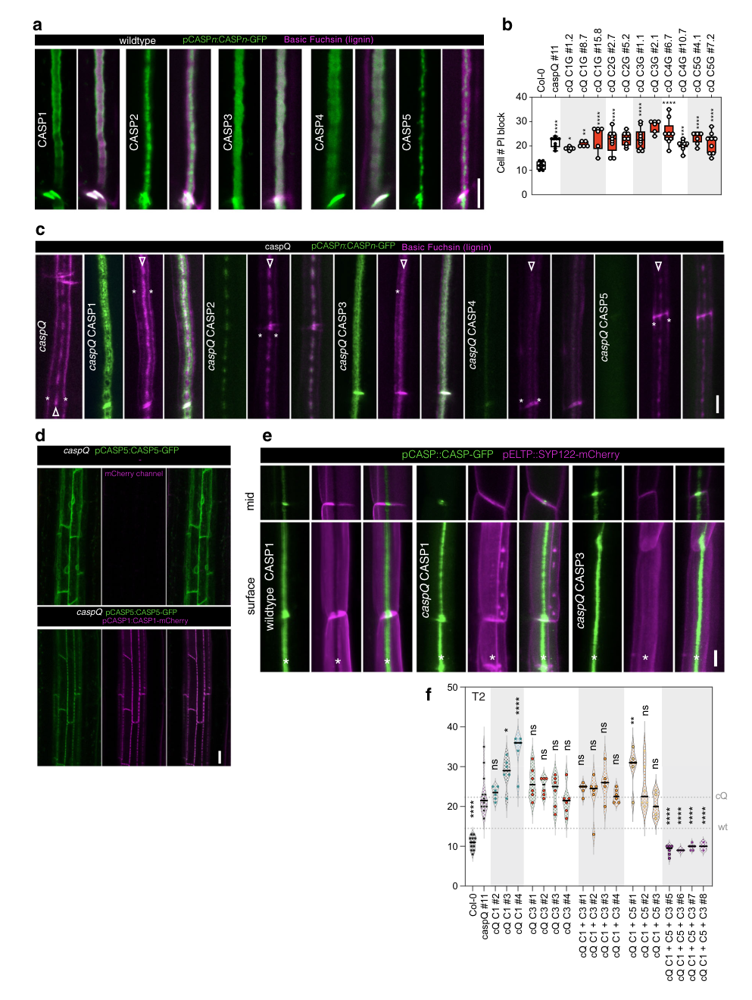

## Question

# Gene Research for Functional Annotation

## ⚠️ CRITICAL: Gene/Protein Identification Context

**BEFORE YOU BEGIN RESEARCH:** You MUST verify you are researching the CORRECT gene/protein. Gene symbols can be ambiguous, especially for less well-characterized genes from non-model organisms.

### Target Gene/Protein Identity (from UniProt):
- **UniProt Accession:** Q9FI10
- **Protein Description:** RecName: Full=CASP-like protein 1B1; Short=AtCASPL1B1;
- **Gene Information:** OrderedLocusNames=At5g44550; ORFNames=MFC16.23;
- **Organism (full):** Arabidopsis thaliana (Mouse-ear cress).
- **Protein Family:** Belongs to the Casparian strip membrane proteins (CASP)
- **Key Domains:** CASP/CASPL. (IPR006459); CASP_dom. (IPR006702); CASPL. (IPR044173); CASP_dom (PF04535)

### MANDATORY VERIFICATION STEPS:

1. **Check if the gene symbol "CASPL1B1" matches the protein description above**
2. **Verify the organism is correct:** Arabidopsis thaliana (Mouse-ear cress).
3. **Check if protein family/domains align with what you find in literature**
4. **If you find literature for a DIFFERENT gene with the same or similar symbol, STOP**

### If Gene Symbol is Ambiguous or You Cannot Find Relevant Literature:

**DO NOT PROCEED WITH RESEARCH ON A DIFFERENT GENE.** Instead:
- State clearly: "The gene symbol 'CASPL1B1' is ambiguous or literature is limited for this specific protein"
- Explain what you found (e.g., "Found extensive literature on a different gene with the same symbol in a different organism")
- Describe the protein based ONLY on the UniProt information provided above
- Suggest that the protein function can be inferred from domain/family information

### Research Target:

Please provide a comprehensive research report on the gene **CASPL1B1** (gene ID: Q9FI10, UniProt: Q9FI10) in ARATH.

The research report should be a detailed narrative explaining the function, biological processes, and localization of the gene product. Citations should be given for all claims.

You should prioritize authoritative reviews and primary scientific literature when conducting research. You can supplement
this with annotations you find in gene/protein databases, but these can be outdated or inaccurate.

We are specifically interested in the primary function of the gene - for enzymes, what reaction is catalyzed, and what is the substrate specificity? For transporters, what is the substrate? For structural proteins or adapters, what is the broader structural role? For signaling molecules, what is the role in the pathway.

We are interested in where in or outside the cell the gene product carries out its function.

We are also interested in the signaling or biochemical pathways in which the gene functions. We are less interested in broad pleiotropic effects, except where these elucidate the precise role.

Include evidence where possible. We are interested in both experimental evidence as well as inference from structure, evolution, or bioinformatic analysis. Precise studies should be prioritized over high-throughput, where available.

## Output

Question: You are an expert researcher providing comprehensive, well-cited information.

Provide detailed information focusing on:
1. Key concepts and definitions with current understanding
2. Recent developments and latest research (prioritize 2023-2024 sources)
3. Current applications and real-world implementations
4. Expert opinions and analysis from authoritative sources
5. Relevant statistics and data from recent studies

Format as a comprehensive research report with proper citations. Include URLs and publication dates where available.
Always prioritize recent, authoritative sources and provide specific citations for all major claims.

# Gene Research for Functional Annotation

## ⚠️ CRITICAL: Gene/Protein Identification Context

**BEFORE YOU BEGIN RESEARCH:** You MUST verify you are researching the CORRECT gene/protein. Gene symbols can be ambiguous, especially for less well-characterized genes from non-model organisms.

### Target Gene/Protein Identity (from UniProt):
- **UniProt Accession:** Q9FI10
- **Protein Description:** RecName: Full=CASP-like protein 1B1; Short=AtCASPL1B1;
- **Gene Information:** OrderedLocusNames=At5g44550; ORFNames=MFC16.23;
- **Organism (full):** Arabidopsis thaliana (Mouse-ear cress).
- **Protein Family:** Belongs to the Casparian strip membrane proteins (CASP)
- **Key Domains:** CASP/CASPL. (IPR006459); CASP_dom. (IPR006702); CASPL. (IPR044173); CASP_dom (PF04535)

### MANDATORY VERIFICATION STEPS:

1. **Check if the gene symbol "CASPL1B1" matches the protein description above**
2. **Verify the organism is correct:** Arabidopsis thaliana (Mouse-ear cress).
3. **Check if protein family/domains align with what you find in literature**
4. **If you find literature for a DIFFERENT gene with the same or similar symbol, STOP**

### If Gene Symbol is Ambiguous or You Cannot Find Relevant Literature:

**DO NOT PROCEED WITH RESEARCH ON A DIFFERENT GENE.** Instead:
- State clearly: "The gene symbol 'CASPL1B1' is ambiguous or literature is limited for this specific protein"
- Explain what you found (e.g., "Found extensive literature on a different gene with the same symbol in a different organism")
- Describe the protein based ONLY on the UniProt information provided above
- Suggest that the protein function can be inferred from domain/family information

### Research Target:

Please provide a comprehensive research report on the gene **CASPL1B1** (gene ID: Q9FI10, UniProt: Q9FI10) in ARATH.

The research report should be a detailed narrative explaining the function, biological processes, and localization of the gene product. Citations should be given for all claims.

You should prioritize authoritative reviews and primary scientific literature when conducting research. You can supplement
this with annotations you find in gene/protein databases, but these can be outdated or inaccurate.

We are specifically interested in the primary function of the gene - for enzymes, what reaction is catalyzed, and what is the substrate specificity? For transporters, what is the substrate? For structural proteins or adapters, what is the broader structural role? For signaling molecules, what is the role in the pathway.

We are interested in where in or outside the cell the gene product carries out its function.

We are also interested in the signaling or biochemical pathways in which the gene functions. We are less interested in broad pleiotropic effects, except where these elucidate the precise role.

Include evidence where possible. We are interested in both experimental evidence as well as inference from structure, evolution, or bioinformatic analysis. Precise studies should be prioritized over high-throughput, where available.

## Research Report: Arabidopsis thaliana CASPL1B1 (UniProt Q9FI10; At5g44550; AtCASPL1B1)

### 1) Target verification (gene/protein identity)
The research target **CASPL1B1** is unambiguously linked in the peer‑reviewed literature to **Arabidopsis thaliana** locus **At5g44550** (consistent with UniProt accession **Q9FI10**) (champeyroux2019regulationofa pages 2-3, champeyroux2019regulationofa pages 1-2). In recent mechanistic work on root Casparian strip membrane nanodomains, CASPL1B1 is also discussed specifically as a member of the Arabidopsis **CASP‑LIKE (CASPL)** family (within a CASPL1 clade), with endodermis-related expression and higher‑order mutant testing (barbosa2023directedgrowthand pages 3-4). These sources are consistent with the UniProt-provided context (Arabidopsis CASP/CASPL family protein) and do not suggest a conflicting gene identity.

### 2) Key concepts and definitions (current understanding)
#### 2.1 Casparian strip (CS) and Casparian strip membrane domain (CSD)
The **Casparian strip (CS)** is a **lignin-impregnated band** in root endodermal cell walls that forms an **extracellular diffusion barrier** (apoplastic barrier) (barbosa2023directedgrowthand pages 1-2). Functionally, this barrier blocks apoplastic flow and forces selective uptake across endodermal plasma membranes (shen2023rootbarriersurveillance pages 1-2).

At the plasma membrane, the CS corresponds to a specialized domain—the **Casparian strip domain (CSD)**—marked by CASP-family proteins and characterized by **membrane protein exclusion** and strong membrane–cell-wall adhesion properties (barbosa2023directedgrowthand pages 1-2, barbosa2023directedgrowthand pages 7-8).

#### 2.2 CASP and CASPL proteins (family-level definition)
CASP proteins are described as small **four‑transmembrane** proteins forming an extensive and stable transmembrane platform at the CSD (barbosa2023directedgrowthand pages 1-2). Mechanistically, CASP proteins define the CSD by generating a **protein exclusion zone** and promoting **cell-wall adhesion**; importantly, CASPs are **not strictly required for initiation of localized lignification**, but are required for **proper ultrastructure and fusion** of the lignified microdomains into a continuous band that seals the extracellular space (barbosa2023directedgrowthand pages 1-2, barbosa2023directedgrowthand pages 7-8).

In mechanistic characterization of the CASP/CASPL superfamily, CASPs/CASPLs are presented as a plant-specific branch of the **MARVEL superfamily**, with four transmembrane domains and divergent sequences (barbosa2023directedgrowthand pages 11-12). CASPL proteins (including CASPL1B1) are CASP‑LIKE homologs that share the membrane domain architecture and are often discussed in the context of endodermal barrier formation and associated membrane microdomains (barbosa2023directedgrowthand pages 3-4).

### 3) Gene-specific functional annotation: CASPL1B1 (At5g44550; Q9FI10)
**Summary:** Evidence supports CASPL1B1 as an endodermis-associated, membrane-domain protein implicated in **suberized endodermal cells** and in **protein–protein interactions with aquaporins**. Direct evidence for an essential, non-redundant role in whole-root water transport or early Casparian strip formation is currently limited.

#### 3.1 Expression and cell-type context
In a focused study of CASPL proteins and aquaporin regulation, **CASPL1B1 (At5g44550)** was reported to be **exclusively expressed in suberized endodermal cells**, suggesting a role specialized to the suberizing endodermis (champeyroux2019regulationofa pages 1-2). This supports functional association with the endodermal diffusion barrier system (where both lignin-based CS and later suberin lamellae modulate radial transport).

Recent CS-domain work further supports that CASPL1B1 belongs to an endodermis-relevant CASPL clade and shows regulation in CS-defect or CS-signaling contexts (barbosa2023directedgrowthand pages 3-4).

#### 3.2 Molecular interactions: aquaporin PIP2;1
A key gene-specific experimental result is that **CASPL1B1 physically interacts with the aquaporin PIP2;1**, and was proposed to potentially influence regulation of aquaporins via effects on their phosphorylated form (champeyroux2019regulationofa pages 1-2). This positions CASPL1B1 as a plausible scaffold/adaptor that modulates membrane protein behavior in a specialized endodermal membrane domain.

**Interpretation (evidence-bounded):** The data support a **protein interaction** role; however, the evidence available here does not establish a direct causal mechanism linking CASPL1B1 to measurable changes in root water flux at the whole-root scale under the tested conditions (champeyroux2019regulationofa pages 1-2).

#### 3.3 Loss-of-function genetics and phenotypes
In the same study, CASPL loss-of-function mutants did **not** show a detectable phenotype in whole-root hydraulic conductivity (**Lpr**) under control, salt (NaCl), or ABA treatment in the experiments described (champeyroux2019regulationofa pages 1-2). This suggests CASPL1B1 is **not a dominant determinant** of whole-root water transport, or that its effect may be conditional, compensated, cell-local, or below assay sensitivity.

In a separate, state-of-the-art CS-domain study, higher-order deletion of **six endodermis-expressed CASPL genes including CASPL1B1** in the background of a full CASP knockout (**caspQ**) did **not** increase phenotypic severity beyond caspQ itself (barbosa2023directedgrowthand pages 3-4). This implies either (i) substantial redundancy among CASPLs and other factors, (ii) a role that is not rate-limiting for the caspQ phenotype being measured, or (iii) a function more linked to later or distinct endodermal states (e.g., suberization) rather than early CS assembly.

### 4) Pathways and biological processes connected to CASPL1B1 function
#### 4.1 Casparian strip formation and nanodomain organization (CASP-centric pathway context)
Recent mechanistic work (2023) clarifies that CASPs (CASP1–CASP5) organize the CSD as **microdomains that fuse into a continuous band** and that multiple CASPs are required to robustly reconstitute functional domain properties (barbosa2023directedgrowthand pages 8-9, barbosa2023directedgrowthand pages 7-8). CASPs are proposed to promote domain fusion by **displacing secretory foci** (involving exocyst dynamics) and establishing membrane exclusion and matrix adhesion (barbosa2023directedgrowthand pages 1-2).

Although CASPL1B1 itself is not shown in the provided evidence to be a core structural requirement for CS assembly, its classification as a CASP-like protein and its endodermis/suberization expression pattern are consistent with participation in the broader endodermal barrier membrane-domain machinery (champeyroux2019regulationofa pages 1-2, barbosa2023directedgrowthand pages 3-4).

#### 4.2 Schengen pathway (CS integrity surveillance) as regulatory framework
The **Schengen surveillance pathway** is a receptor–ligand system that monitors CS integrity: stele-derived **CIF peptides** are perceived by the receptor kinase **SGN3/GSO1**, with downstream cytoplasmic kinase **SGN1**, and CS disruption can allow CIF diffusion and hyperactivation of SGN signaling (shen2023rootbarriersurveillance pages 1-2). This pathway provides a mechanistic explanation for why many endodermal barrier genes—including CASP/CASPL components—show regulation under CS-defect or CIF treatment conditions (barbosa2023directedgrowthand pages 3-4, shen2023rootbarriersurveillance pages 1-2).

### 5) Recent developments and latest research (prioritizing 2023–2024)
#### 5.1 2023: A revised mechanistic model of CASP function
A major 2023 advance is the demonstration that **localized lignin microdomains can form even without CASPs**, but CASPs are required for correct **ultrastructural organization**, membrane exclusion zones, and membrane–wall adhesion at the CSD (barbosa2023directedgrowthand pages 1-2). This refines prior models by separating **lignin initiation** from **domain maturation and sealing**, and suggests CASP proteins act as organizers/scaffolds controlling secretion dynamics and domain fusion (barbosa2023directedgrowthand pages 1-2).

In the same work, CASP proximity labeling identifies RabA-type small GTPases (exocyst activators) enriched as candidate CASP interactors, and RabA perturbations cause a “weak, but consistent delay” in barrier formation with statistical testing (barbosa2023directedgrowthand pages 11-12). These findings strengthen the view of the CSD as a **specialized secretion and membrane organization problem**, not simply a localized lignin polymerization site (barbosa2023directedgrowthand pages 11-12, barbosa2023directedgrowthand pages 1-2).

#### 5.2 2023: Physiological relevance of CS for boron exclusion under hydroponics
A 2023 study directly tested CS function under excess boron and found that CS-defective mutants (**sgn3**, **sgn4**) were highly sensitive to boron excess in hydroponics and accumulated more boron in shoots, with tracer evidence and a boric-acid biosensor indicating faster boric-acid flux into mutant steles (muro2023casparianstripsprevent pages 1-2). This provides a clear, environment-dependent demonstration that intact CS function can be essential for preventing apoplastic entry of specific solutes (boric acid) into the stele under transpiration-driven conditions (muro2023casparianstripsprevent pages 1-2).

#### 5.3 2023: Engineering barrier formation to dissect barrier vs signaling roles
A 2023 preprint re-engineered endodermal barrier formation by placing **MYB36** under a **CASP1 promoter** feedback loop (“MYB36Loop”), generating earlier, Schengen-independent CS formation and strongly increased expression of MYB36 and CASP1 (shen2023rootbarriersurveillance pages 1-2). This work argues that stronger barrier establishment can improve stress resistance, while Schengen signaling itself impacts the establishment of a growth-promoting root microbiome and conveys soil nitrogen status to shoots (shen2023rootbarriersurveillance pages 1-2). While not CASPL1B1-specific, it is directly relevant to interpreting CASPL/CASP gene regulation and the separation of barrier formation from receptor-mediated signaling outputs.

### 6) Current applications and real-world implementations
Direct “deployment” of CASPL1B1 in agriculture is not established in the provided evidence; however, **endodermal diffusion barrier engineering** is an active concept with implications for nutrient efficiency and stress resilience.

* **Elemental toxicity/nutrient management:** Demonstration that CS integrity prevents excessive boron translocation under certain growth conditions suggests barrier manipulation could influence crop tolerance to micronutrient excess/toxic element exposure (muro2023casparianstripsprevent pages 1-2).
* **Barrier engineering and microbiome/nitrogen signaling:** Synthetic rewiring of CS formation and Schengen signaling provides a blueprint for separating improved barrier function from signaling consequences relevant to nitrogen responses and microbiome assembly (shen2023rootbarriersurveillance pages 1-2).

### 7) Expert opinions and analysis (authoritative sources)
Recent expert mechanistic analysis emphasizes that the essential role of CASP proteins lies in **organizing and fusing membrane–wall microdomains** and establishing the defining features of the CSD (exclusion zone, adhesion), rather than being strictly required for the **initial localization of lignification** (barbosa2023directedgrowthand pages 1-2). This view implies that CASPL proteins, when expressed in endodermal subdomains, may plausibly function as **membrane organizers/scaffolds** or **interaction platforms** for specific client proteins (e.g., aquaporins), consistent with the CASPL1B1–PIP2;1 interaction evidence (champeyroux2019regulationofa pages 1-2, barbosa2023directedgrowthand pages 1-2).

### 8) Relevant statistics and quantitative data (recent studies)
* **Barrier assay sample sizes (2023, Nature Communications):** Propidium iodide (PI) uptake/barrier assays were quantified with **n = 8** individuals for boxplot comparisons (two independent T3 lines per gene) and **n = 6** individuals in complementation tests; multiple CASPs were required for robust caspQ complementation (barbosa2023directedgrowthand pages 8-9, barbosa2023directedgrowthand media 6773621b).
* **Proteomics/statistics (2023):** Proximity-labeling (CASP1-tID) enriched RabA GTPases as candidate interactors with significance reported (e.g., enriched with p-values indicated such as **p < 0.01**), and RabA perturbations produced statistically evaluated barrier delays (barbosa2023directedgrowthand pages 11-12).
* **Functional transport readout (2023, Frontiers in Plant Science):** CS-defective mutants (sgn3/sgn4) showed **higher shoot boron accumulation** and **faster boric-acid flux into steles** demonstrated by 10B tracer and a genetically encoded boric-acid biosensor (muro2023casparianstripsprevent pages 1-2).

### 9) Visual evidence (key figure)
A key figure from Barbosa et al. (2023) shows: (i) distinct nanodomain localizations of **CASP1–CASP5-GFP** relative to lignin staining, and (ii) boxplots quantifying the PI barrier assay across complementation lines (barbosa2023directedgrowthand media 6773621b). This image supports the mechanistic framing of CASP-organized membrane domains as essential for functional barrier sealing.

### 10) Evidence-limited areas and cautious inferences
* **No enzymatic reaction/transport substrate for CASPL1B1 is established** in the provided evidence; CASPL1B1 is best supported as a **membrane-domain protein** with an **interaction/scaffold** role (PIP2;1 binding) in a specific endodermal cell state (suberized endodermis) (champeyroux2019regulationofa pages 1-2).
* **Gene-specific localization (subcellular) for CASPL1B1** beyond the endodermal cell-type specificity is not directly evidenced in the extracted snippets; recent CS nanodomain imaging is CASP-centric rather than CASPL1B1-centric (barbosa2023directedgrowthand pages 8-9, barbosa2023directedgrowthand media 6773621b).
* CASPL1B1’s **non-redundant necessity** for CS formation is not supported: higher-order CASPL knockout in a severe casp background did not worsen the phenotype (barbosa2023directedgrowthand pages 3-4).

---

### Evidence summary table
| Gene/protein | Evidence type (expression, localization, interaction, mutant phenotype, pathway context) | Key finding | Experimental system/assay | Publication (year, journal) | URL/DOI | Evidence citation id(s) |
|---|---|---|---|---|---|---|
| CASPL1B1 / At5g44550 / Q9FI10 | Expression | Explicitly identified as Arabidopsis locus **At5g44550**; reported to be **exclusively expressed in suberized endodermal cells**, supporting a root endodermis-associated role. | Arabidopsis; promoter-based expression analysis described in study | Champeyroux et al. 2019, *Plant, Cell & Environment* | https://doi.org/10.1111/pce.13537 ; DOI: 10.1111/pce.13537 | (champeyroux2019regulationofa pages 2-3, champeyroux2019regulationofa pages 1-2) |
| CASPL1B1 / At5g44550 / Q9FI10 | Interaction | **Physically interacts with aquaporin PIP2;1**; authors propose CASPL1B1 may influence aquaporin regulation via the phosphorylated form of PIP2;1. | Molecular interaction analysis in Arabidopsis study context | Champeyroux et al. 2019, *Plant, Cell & Environment* | https://doi.org/10.1111/pce.13537 ; DOI: 10.1111/pce.13537 | (champeyroux2019regulationofa pages 1-2) |
| CASPL1B1 / At5g44550 / Q9FI10 | Mutant phenotype | Loss of CASPL1B1-family members did **not** produce a clear whole-root hydraulic conductivity phenotype under control, NaCl, or ABA conditions; evidence supports no major role in bulk root water transport. | Arabidopsis loss-of-function mutants; root hydraulic conductivity (Lpr) assays under control, salt, and ABA treatments | Champeyroux et al. 2019, *Plant, Cell & Environment* | https://doi.org/10.1111/pce.13537 ; DOI: 10.1111/pce.13537 | (champeyroux2019regulationofa pages 1-2) |
| CASPL1B1 (CASPL1 clade) | Pathway/family context | In a 39-member Arabidopsis CASP-LIKE family context, **CASPL1B1 belongs to the CASPL1 clade**; RNA-seq analyses indicated CASPL1B1 is **up-regulated in myb36 mutant or CIF2 treatment**, linking it to endodermal barrier-defect responses. | RNA-seq/endodermis-focused expression analyses under **myb36** and **CIF2** conditions | Barbosa et al. 2023, *Nature Communications* | https://doi.org/10.1038/s41467-023-37265-7 ; DOI: 10.1038/s41467-023-37265-7 | (barbosa2023directedgrowthand pages 3-4) |
| CASPL1B1 with CASPL family members | Mutant phenotype / redundancy | Simultaneous knockout of **six endodermis-expressed CASPL genes including CASPL1B1** in the **caspQ** background did **not** increase phenotypic severity over caspQ, suggesting redundancy or a nonessential role for early CS defect enhancement. | Higher-order Arabidopsis mutant analysis in **caspQ 6x-caspl** background | Barbosa et al. 2023, *Nature Communications* | https://doi.org/10.1038/s41467-023-37265-7 ; DOI: 10.1038/s41467-023-37265-7 | (barbosa2023directedgrowthand pages 3-4) |
| CASP family (family context for CASPL1B1) | Localization / structural role | CASPs are small **four-transmembrane-span** proteins that form a stable **Casparian strip membrane domain** platform; they are required for proper microdomain ultrastructure, membrane protein exclusion, wall adhesion, and organized strip fusion, but **not strictly for localized lignification initiation**. | Full CASP knockout, fluorescence imaging, ultrastructural analysis, proximity labeling | Barbosa et al. 2023, *Nature Communications* | https://doi.org/10.1038/s41467-023-37265-7 ; DOI: 10.1038/s41467-023-37265-7 | (barbosa2023directedgrowthand pages 11-12, barbosa2023directedgrowthand pages 1-2, barbosa2023directedgrowthand pages 7-8) |
| CASP family (family context for CASPL1B1) | Quantitative barrier phenotype | CASP complementation studies used **propidium iodide (PI) barrier assays**; functional complementation of **caspQ** required multiple CASPs, with **CASP1/CASP3/CASP5** the most effective tested combination; assays included **n = 8** individuals for boxplots and **n = 6** in complementation tests. | PI uptake barrier assay; transgenic complementation lines | Barbosa et al. 2023, *Nature Communications* | https://doi.org/10.1038/s41467-023-37265-7 ; DOI: 10.1038/s41467-023-37265-7 | (barbosa2023directedgrowthand pages 8-9, barbosa2023directedgrowthand media 6773621b) |
| Casparian strip / CASP pathway context | Pathway context | The **Schengen surveillance pathway** monitors Casparian strip integrity through stele-derived **CIF peptides** and **SGN3/GSO1** with downstream **SGN1**; CS establishment depends on **CASPs** plus lignin-polymerizing machinery. | Genetic pathway analysis; MYB36 positive-feedback engineering | Shen et al. 2023, *bioRxiv* | https://doi.org/10.1101/2023.04.19.537470 ; DOI: 10.1101/2023.04.19.537470 | (shen2023rootbarriersurveillance pages 1-2) |
| Casparian strip barrier (family/biological context) | Functional relevance / transport barrier | Defective CS mutants (**sgn3**, **sgn4**) showed **higher boron accumulation in shoots** and **faster boric-acid flux into steles** in hydroponics, demonstrating that the CASP-associated endodermal barrier limits apoplastic boric acid entry into the stele under excess B. | Arabidopsis hydroponics, **10B** tracer experiment, stele-specific boric-acid biosensor | Muro et al. 2023, *Frontiers in Plant Science* | https://doi.org/10.3389/fpls.2023.988419 ; DOI: 10.3389/fpls.2023.988419 | (muro2023casparianstripsprevent pages 1-2) |

*Table: This table summarizes direct evidence for Arabidopsis CASPL1B1/At5g44550 and key family-context findings needed for functional annotation. It distinguishes gene-specific data from broader CASP/Casparian strip pathway evidence relevant to interpreting CASPL1B1 function.*

---

## Key cited sources (URLs and publication dates)
1. Champeyroux C. et al. **Regulation of a plant aquaporin by a Casparian strip membrane domain protein-like.** *Plant, Cell & Environment* (Mar 2019). https://doi.org/10.1111/pce.13537 (champeyroux2019regulationofa pages 2-3, champeyroux2019regulationofa pages 1-2)
2. Barbosa I.C.R. et al. **Directed growth and fusion of membrane-wall microdomains requires CASP-mediated inhibition and displacement of secretory foci.** *Nature Communications* (Jul 2023). https://doi.org/10.1038/s41467-023-37265-7 (barbosa2023directedgrowthand pages 3-4, barbosa2023directedgrowthand pages 11-12, barbosa2023directedgrowthand pages 8-9, barbosa2023directedgrowthand pages 1-2, barbosa2023directedgrowthand pages 7-8, barbosa2023directedgrowthand media 6773621b)
3. Shen D. et al. **Root barrier surveillance mechanisms convey soil nitrogen status to shoots.** *bioRxiv* (Jul 2023). https://doi.org/10.1101/2023.04.19.537470 (shen2023rootbarriersurveillance pages 1-2)
4. Muro K. et al. **Casparian strips prevent apoplastic diffusion of boric acid into root steles for excess B tolerance.** *Frontiers in Plant Science* (Dec 2023). https://doi.org/10.3389/fpls.2023.988419 (muro2023casparianstripsprevent pages 1-2)

References

1. (champeyroux2019regulationofa pages 2-3): Chloé Champeyroux, Jorge Bellati, Marie Barberon, Valérie Rofidal, Christophe Maurel, and Véronique Santoni. Regulation of a plant aquaporin by a casparian strip membrane domain protein-like. Plant, cell & environment, 42 6:1788-1801, Mar 2019. URL: https://doi.org/10.1111/pce.13537, doi:10.1111/pce.13537. This article has 19 citations.

2. (champeyroux2019regulationofa pages 1-2): Chloé Champeyroux, Jorge Bellati, Marie Barberon, Valérie Rofidal, Christophe Maurel, and Véronique Santoni. Regulation of a plant aquaporin by a casparian strip membrane domain protein-like. Plant, cell & environment, 42 6:1788-1801, Mar 2019. URL: https://doi.org/10.1111/pce.13537, doi:10.1111/pce.13537. This article has 19 citations.

3. (barbosa2023directedgrowthand pages 3-4): Inês Catarina Ramos Barbosa, D. De Bellis, Isabelle Flückiger, E. Bellani, Mathieu Grangé-Guerment, Kian Hématy, and N. Geldner. Directed growth and fusion of membrane-wall microdomains requires casp-mediated inhibition and displacement of secretory foci. Nature Communications, Jul 2023. URL: https://doi.org/10.1038/s41467-023-37265-7, doi:10.1038/s41467-023-37265-7. This article has 33 citations and is from a highest quality peer-reviewed journal.

4. (barbosa2023directedgrowthand pages 1-2): Inês Catarina Ramos Barbosa, D. De Bellis, Isabelle Flückiger, E. Bellani, Mathieu Grangé-Guerment, Kian Hématy, and N. Geldner. Directed growth and fusion of membrane-wall microdomains requires casp-mediated inhibition and displacement of secretory foci. Nature Communications, Jul 2023. URL: https://doi.org/10.1038/s41467-023-37265-7, doi:10.1038/s41467-023-37265-7. This article has 33 citations and is from a highest quality peer-reviewed journal.

5. (shen2023rootbarriersurveillance pages 1-2): Defeng Shen, Kathrin Wippel, Simone Remmel, Pengfan Zhang, Noah Kuertoes, Ulla Neumann, Stanislav Kopriva, and Tonni Grube Andersen. Root barrier surveillance mechanisms convey soil nitrogen status to shoots. bioRxiv, Jul 2023. URL: https://doi.org/10.1101/2023.04.19.537470, doi:10.1101/2023.04.19.537470. This article has 1 citations.

6. (barbosa2023directedgrowthand pages 7-8): Inês Catarina Ramos Barbosa, D. De Bellis, Isabelle Flückiger, E. Bellani, Mathieu Grangé-Guerment, Kian Hématy, and N. Geldner. Directed growth and fusion of membrane-wall microdomains requires casp-mediated inhibition and displacement of secretory foci. Nature Communications, Jul 2023. URL: https://doi.org/10.1038/s41467-023-37265-7, doi:10.1038/s41467-023-37265-7. This article has 33 citations and is from a highest quality peer-reviewed journal.

7. (barbosa2023directedgrowthand pages 11-12): Inês Catarina Ramos Barbosa, D. De Bellis, Isabelle Flückiger, E. Bellani, Mathieu Grangé-Guerment, Kian Hématy, and N. Geldner. Directed growth and fusion of membrane-wall microdomains requires casp-mediated inhibition and displacement of secretory foci. Nature Communications, Jul 2023. URL: https://doi.org/10.1038/s41467-023-37265-7, doi:10.1038/s41467-023-37265-7. This article has 33 citations and is from a highest quality peer-reviewed journal.

8. (barbosa2023directedgrowthand pages 8-9): Inês Catarina Ramos Barbosa, D. De Bellis, Isabelle Flückiger, E. Bellani, Mathieu Grangé-Guerment, Kian Hématy, and N. Geldner. Directed growth and fusion of membrane-wall microdomains requires casp-mediated inhibition and displacement of secretory foci. Nature Communications, Jul 2023. URL: https://doi.org/10.1038/s41467-023-37265-7, doi:10.1038/s41467-023-37265-7. This article has 33 citations and is from a highest quality peer-reviewed journal.

9. (muro2023casparianstripsprevent pages 1-2): Keita Muro, Jio Kamiyo, Sheliang Wang, Niko Geldner, and Junpei Takano. Casparian strips prevent apoplastic diffusion of boric acid into root steles for excess b tolerance. Frontiers in Plant Science, Dec 2023. URL: https://doi.org/10.3389/fpls.2023.988419, doi:10.3389/fpls.2023.988419. This article has 9 citations.

10. (barbosa2023directedgrowthand media 6773621b): Inês Catarina Ramos Barbosa, D. De Bellis, Isabelle Flückiger, E. Bellani, Mathieu Grangé-Guerment, Kian Hématy, and N. Geldner. Directed growth and fusion of membrane-wall microdomains requires casp-mediated inhibition and displacement of secretory foci. Nature Communications, Jul 2023. URL: https://doi.org/10.1038/s41467-023-37265-7, doi:10.1038/s41467-023-37265-7. This article has 33 citations and is from a highest quality peer-reviewed journal.

## Artifacts

- [Edison artifact artifact-00](CASPL1B1-deep-research-falcon_artifacts/artifact-00.md)

## Citations

1. barbosa2023directedgrowthand pages 3-4
2. barbosa2023directedgrowthand pages 1-2
3. shen2023rootbarriersurveillance pages 1-2
4. barbosa2023directedgrowthand pages 11-12
5. champeyroux2019regulationofa pages 1-2
6. muro2023casparianstripsprevent pages 1-2
7. champeyroux2019regulationofa pages 2-3
8. barbosa2023directedgrowthand pages 7-8
9. barbosa2023directedgrowthand pages 8-9
10. https://doi.org/10.1111/pce.13537
11. https://doi.org/10.1038/s41467-023-37265-7
12. https://doi.org/10.1101/2023.04.19.537470
13. https://doi.org/10.3389/fpls.2023.988419
14. https://doi.org/10.1111/pce.13537,
15. https://doi.org/10.1038/s41467-023-37265-7,
16. https://doi.org/10.1101/2023.04.19.537470,
17. https://doi.org/10.3389/fpls.2023.988419,