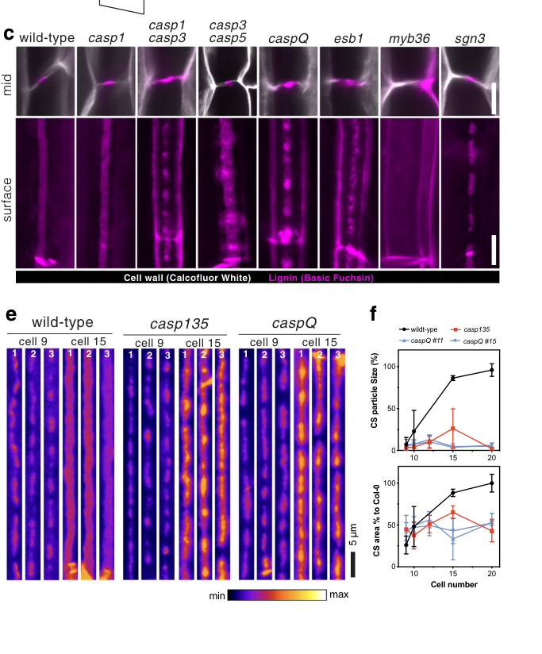

## Question

# Gene Research for Functional Annotation

## ⚠️ CRITICAL: Gene/Protein Identification Context

**BEFORE YOU BEGIN RESEARCH:** You MUST verify you are researching the CORRECT gene/protein. Gene symbols can be ambiguous, especially for less well-characterized genes from non-model organisms.

### Target Gene/Protein Identity (from UniProt):
- **UniProt Accession:** Q9SUP0
- **Protein Description:** RecName: Full=CASP-like protein 1B2; Short=AtCASPL1B2;
- **Gene Information:** OrderedLocusNames=At4g20390; ORFNames=F9F13.40;
- **Organism (full):** Arabidopsis thaliana (Mouse-ear cress).
- **Protein Family:** Belongs to the Casparian strip membrane proteins (CASP)
- **Key Domains:** CASP/CASPL. (IPR006459); CASP_dom. (IPR006702); CASPL. (IPR044173); CASP_dom (PF04535)

### MANDATORY VERIFICATION STEPS:

1. **Check if the gene symbol "CASPL1B2" matches the protein description above**
2. **Verify the organism is correct:** Arabidopsis thaliana (Mouse-ear cress).
3. **Check if protein family/domains align with what you find in literature**
4. **If you find literature for a DIFFERENT gene with the same or similar symbol, STOP**

### If Gene Symbol is Ambiguous or You Cannot Find Relevant Literature:

**DO NOT PROCEED WITH RESEARCH ON A DIFFERENT GENE.** Instead:
- State clearly: "The gene symbol 'CASPL1B2' is ambiguous or literature is limited for this specific protein"
- Explain what you found (e.g., "Found extensive literature on a different gene with the same symbol in a different organism")
- Describe the protein based ONLY on the UniProt information provided above
- Suggest that the protein function can be inferred from domain/family information

### Research Target:

Please provide a comprehensive research report on the gene **CASPL1B2** (gene ID: Q9SUP0, UniProt: Q9SUP0) in ARATH.

The research report should be a detailed narrative explaining the function, biological processes, and localization of the gene product. Citations should be given for all claims.

You should prioritize authoritative reviews and primary scientific literature when conducting research. You can supplement
this with annotations you find in gene/protein databases, but these can be outdated or inaccurate.

We are specifically interested in the primary function of the gene - for enzymes, what reaction is catalyzed, and what is the substrate specificity? For transporters, what is the substrate? For structural proteins or adapters, what is the broader structural role? For signaling molecules, what is the role in the pathway.

We are interested in where in or outside the cell the gene product carries out its function.

We are also interested in the signaling or biochemical pathways in which the gene functions. We are less interested in broad pleiotropic effects, except where these elucidate the precise role.

Include evidence where possible. We are interested in both experimental evidence as well as inference from structure, evolution, or bioinformatic analysis. Precise studies should be prioritized over high-throughput, where available.

## Output

Question: You are an expert researcher providing comprehensive, well-cited information.

Provide detailed information focusing on:
1. Key concepts and definitions with current understanding
2. Recent developments and latest research (prioritize 2023-2024 sources)
3. Current applications and real-world implementations
4. Expert opinions and analysis from authoritative sources
5. Relevant statistics and data from recent studies

Format as a comprehensive research report with proper citations. Include URLs and publication dates where available.
Always prioritize recent, authoritative sources and provide specific citations for all major claims.

# Gene Research for Functional Annotation

## ⚠️ CRITICAL: Gene/Protein Identification Context

**BEFORE YOU BEGIN RESEARCH:** You MUST verify you are researching the CORRECT gene/protein. Gene symbols can be ambiguous, especially for less well-characterized genes from non-model organisms.

### Target Gene/Protein Identity (from UniProt):
- **UniProt Accession:** Q9SUP0
- **Protein Description:** RecName: Full=CASP-like protein 1B2; Short=AtCASPL1B2;
- **Gene Information:** OrderedLocusNames=At4g20390; ORFNames=F9F13.40;
- **Organism (full):** Arabidopsis thaliana (Mouse-ear cress).
- **Protein Family:** Belongs to the Casparian strip membrane proteins (CASP)
- **Key Domains:** CASP/CASPL. (IPR006459); CASP_dom. (IPR006702); CASPL. (IPR044173); CASP_dom (PF04535)

### MANDATORY VERIFICATION STEPS:

1. **Check if the gene symbol "CASPL1B2" matches the protein description above**
2. **Verify the organism is correct:** Arabidopsis thaliana (Mouse-ear cress).
3. **Check if protein family/domains align with what you find in literature**
4. **If you find literature for a DIFFERENT gene with the same or similar symbol, STOP**

### If Gene Symbol is Ambiguous or You Cannot Find Relevant Literature:

**DO NOT PROCEED WITH RESEARCH ON A DIFFERENT GENE.** Instead:
- State clearly: "The gene symbol 'CASPL1B2' is ambiguous or literature is limited for this specific protein"
- Explain what you found (e.g., "Found extensive literature on a different gene with the same symbol in a different organism")
- Describe the protein based ONLY on the UniProt information provided above
- Suggest that the protein function can be inferred from domain/family information

### Research Target:

Please provide a comprehensive research report on the gene **CASPL1B2** (gene ID: Q9SUP0, UniProt: Q9SUP0) in ARATH.

The research report should be a detailed narrative explaining the function, biological processes, and localization of the gene product. Citations should be given for all claims.

You should prioritize authoritative reviews and primary scientific literature when conducting research. You can supplement
this with annotations you find in gene/protein databases, but these can be outdated or inaccurate.

We are specifically interested in the primary function of the gene - for enzymes, what reaction is catalyzed, and what is the substrate specificity? For transporters, what is the substrate? For structural proteins or adapters, what is the broader structural role? For signaling molecules, what is the role in the pathway.

We are interested in where in or outside the cell the gene product carries out its function.

We are also interested in the signaling or biochemical pathways in which the gene functions. We are less interested in broad pleiotropic effects, except where these elucidate the precise role.

Include evidence where possible. We are interested in both experimental evidence as well as inference from structure, evolution, or bioinformatic analysis. Precise studies should be prioritized over high-throughput, where available.

## Research report: *Arabidopsis thaliana* AtCASPL1B2 (UniProt Q9SUP0; locus At4g20390)

### Executive summary (evidence-weighted)
AtCASPL1B2 (UniProt Q9SUP0; locus At4g20390) is an *Arabidopsis thaliana* member of the CASP-like (CASPL) protein family related to Casparian strip membrane domain proteins (CASPs). The strongest gene-specific experimental evidence currently retrieved is that an AtCASPL1B2–mCherry fusion, when expressed from the **endodermis CASP1 promoter**, can **localize to the Casparian strip membrane domain (CSD)** in at least two independent transgenic lines; many other lines lacked detectable signal, suggesting variable expression/stability in that assay. (roppolo2014functionalandevolutionary pages 32-37)

No direct mutant phenotype or biochemical activity for AtCASPL1B2 was retrieved in this run. Therefore, functional annotation must rely on a cautious inference that AtCASPL1B2 is a **four-transmembrane, MARVEL-like scaffold/microdomain protein** with the *capacity* to partition into CSD-like microdomains, consistent with broader CASP/CASPL family properties demonstrated experimentally in *Arabidopsis*. (roppolo2014functionalandevolutionary pages 32-37, pfister2014areceptorlikekinase pages 2-3, roppolo2014functionalandevolutionary pages 1-2, roppolo2014functionalandevolutionary pages 1-1)

### 1) Target verification (mandatory gene/protein identification)
**Verified identity and organism.** A primary family-analysis paper explicitly lists **AtCASPL1B2** as **UniProt Q9SUP0** in *Arabidopsis thaliana*, placing it among CASPL proteins (CASP-like) and mapping it within a CASPL group classification. This directly matches the provided UniProt context (Q9SUP0; AtCASPL1B2; *A. thaliana*; CASP/CASPL domain family). (roppolo2014functionalandevolutionary pages 32-37)

**Ambiguity check.** The symbol “CASPL” is used in multiple species (e.g., crop comparative genomics), but the direct mention of AtCASPL1B2 = Q9SUP0 in a focused *Arabidopsis* CASP/CASPL study resolves identity for the target here. (roppolo2014functionalandevolutionary pages 32-37)

### 2) Key concepts and definitions (current understanding)
#### 2.1 Casparian strip (CS) and Casparian strip membrane domain (CSD)
The **Casparian strip (CS)** is a lignin-impregnated cell-wall band in root endodermal cells that forms a major extracellular (apoplastic) diffusion barrier. A key organizing feature is the **Casparian strip membrane domain (CSD)**, a specialized plasma-membrane domain aligned with the CS that functions as a **lateral diffusion barrier** and polarizes the endodermal plasma membrane. (pfister2014areceptorlikekinase pages 2-3, roppolo2014functionalandevolutionary pages 1-2)

Developmentally, CS lignification is detected at approximately **~12 endodermal cells after the onset of elongation**, while **suberin lamellae** are detected much later (**~38 cells after onset of elongation**), highlighting that lignin-based CS establishment and later suberization are temporally distinct processes in the endodermis. (nawrath2013apoplasticdiffusionbarriers pages 9-10)

#### 2.2 CASP vs CASPL proteins
**CASPs (CASP1–CASP5)** are small, four-transmembrane proteins (MARVEL superfamily-related) that assemble into stable microdomains at the CSD in endodermal cells, functioning as a membrane scaffold and “fence” that contributes to barrier organization. (pfister2014areceptorlikekinase pages 2-3, roppolo2014functionalandevolutionary pages 1-2, barbosa2023directedgrowthand pages 1-2)

**CASPLs (CASP-like proteins)** are a larger related family. In *Arabidopsis*, many CASPLs show cell-type-specific expression (e.g., multiple non-endodermal types), and when ectopically expressed in the endodermis, many CASPL proteins can integrate into the CASP membrane domain, supporting the concept that CASPLs share a propensity to form transmembrane scaffolds/microdomains. (roppolo2014functionalandevolutionary pages 1-1)

### 3) Direct evidence for AtCASPL1B2 (Q9SUP0)
#### 3.1 Subcellular localization (direct experimental evidence)
In a systematic CASPL characterization study, AtCASPL1B2 (Q9SUP0) was tested as an **mCherry fusion expressed under the AtCASP1 promoter** (i.e., driven in an endodermal/CSD-forming context). Under these conditions, **AtCASPL1B2 localized to the CSD in 2 independent lines**, whereas **13 other transgenic lines showed no fluorescence**, indicating that detectable accumulation was variable in that experimental setup. This provides direct evidence that AtCASPL1B2 has the intrinsic capacity to target/partition into CSD microdomains in endodermal cells, but it does not establish endogenous expression or function. (roppolo2014functionalandevolutionary pages 32-37)

#### 3.2 Function, pathway placement, phenotype (limitations)
No AtCASPL1B2-specific loss-of-function phenotype, biochemical activity, or endogenous expression pattern was retrieved among the available texts. Consequently, claims about AtCASPL1B2’s physiological function must be labeled as **inferred** from family behavior rather than directly demonstrated for AtCASPL1B2. (roppolo2014functionalandevolutionary pages 32-37)

### 4) Functional inference from CASP/CASPL family biology (clearly labeled inference)
#### 4.1 Most plausible molecular function class
**Inference (not directly shown for AtCASPL1B2):** AtCASPL1B2 is most plausibly a **structural membrane scaffold/microdomain-forming protein** rather than an enzyme or transporter, consistent with CASP/CASPL family membership and four-transmembrane MARVEL-like architecture. CASPs form stable microdomains and are proposed to spatially organize lignin-polymerizing machinery at the CS site. (pfister2014areceptorlikekinase pages 2-3, roppolo2014functionalandevolutionary pages 1-2, barbosa2023directedgrowthand pages 1-2)

#### 4.2 Likely cellular location and tissue context
**Direct evidence supports** AtCASPL1B2’s ability to localize to the **CSD** when expressed in endodermal cells. (roppolo2014functionalandevolutionary pages 32-37)

**Inference:** If AtCASPL1B2 is expressed in endodermis in vivo (not established here), it could participate in CSD-associated microdomain architecture or barrier maturation, similar to other CASPLs that can integrate into CASP domains. However, CASPLs also show diverse expression in non-endodermal cells, so AtCASPL1B2 could also function in other cell types as a MARVEL-like microdomain protein. (roppolo2014functionalandevolutionary pages 1-1)

### 5) Recent developments and latest research (prioritizing 2023–2024)
#### 5.1 2023: refined mechanistic model for CASP microdomain function
A 2023 study using a **full CASP quintuple knock-out (caspQ)** reframed CASP function: **localized lignification foci can still form without CASPs**, but the resulting structures are **ultrastructurally disorganized** and fail to mature into a sealing, continuous band. CASPs are therefore critical for **proper microdomain organization, membrane–wall adhesion, exclusion zones, and controlled wall growth** rather than being strictly required to initiate lignification. (barbosa2023directedgrowthand pages 1-2, barbosa2023directedgrowthand pages 3-4)

Mechanistically, CASPs were proposed to enforce the **directed growth and fusion** of membrane–wall microdomains by **displacing exocyst landmarks (EXO70A1)** from occupied sites, thereby moving secretory foci and promoting fusion into a continuous strip; proximity labeling implicated **RabA GTPases** as candidate CASP-proximal components involved in trafficking/exocyst dynamics. (barbosa2023directedgrowthand pages 12-13, barbosa2023directedgrowthand pages 2-3)

Supporting visual evidence for CASP localization and caspQ phenotypes, as well as a conceptual model of EXO70A1 displacement, is contained in retrieved figure panels. (barbosa2023directedgrowthand media 5173c757, barbosa2023directedgrowthand media 132a71e3, barbosa2023directedgrowthand media ed2b6d7c)

**Relevance to AtCASPL1B2:** Because AtCASPL1B2 can localize to CSD under an endodermal promoter, these mechanistic insights provide the best current framework for hypothesizing what a CSD-localized CASPL might contribute (scaffold/microdomain organization and trafficking exclusion), while recognizing that gene-specific roles remain unproven. (roppolo2014functionalandevolutionary pages 32-37, barbosa2023directedgrowthand pages 12-13)

#### 5.2 2024: comparative genomics and expression context for Arabidopsis CASP/CASPL repertoires
A 2024 comparative analysis reported **39 Arabidopsis CASP/CASP_like genes** identified by domain-based HMM methods and grouped into six subfamilies. Transcriptomic analysis in this work indicated that many AtCASP/CASP_like genes are **root enriched** and that several show **endodermis-enriched expression**, highlighting **AtCASP_like1** and **AtCASP_like31** as particularly pronounced in endodermis and candidate CS-related genes. (xue2024comparativeanalysisof pages 1-2, xue2024comparativeanalysisof pages 7-11, xue2024comparativeanalysisof pages 15-17)

While this 2024 analysis does not provide AtCASPL1B2-specific expression in the excerpts retrieved here, it supports a current community view that many CASP_like/CASPL proteins may have barrier-associated roles, motivating targeted functional genetics for specific family members such as AtCASPL1B2. (xue2024comparativeanalysisof pages 1-2, xue2024comparativeanalysisof pages 7-11)

### 6) Quantitative data and statistics from relevant studies (barrier assays and physiology)
Although gene-specific quantitative data for AtCASPL1B2 were not retrieved, quantitative CS/CSD barrier measurements provide context for interpreting potential phenotypes of barrier-related genes.

#### 6.1 Standard barrier assay: Propidium iodide (PI) penetration
A widely used CS diffusion-barrier assay incubates seedlings in **15 mM propidium iodide (PI; 10 mg/mL) for 10 minutes**; quantification is performed by counting endodermal cells from the **onset of elongation** (defined as cell length >2× width) until PI penetration is blocked. (pfister2014areceptorlikekinase pages 16-17)

#### 6.2 Barrier breakdown consequences: ionomics and nutrient homeostasis
In the **sgn3** mutant (defective in proper CASP localization and CSD integrity), ionomic profiling of rosette leaves across multiple labs and growth conditions reported a consistent **potassium (K) decrease of ~1.4–3.0-fold**, along with **magnesium increase ~1.5–2.1-fold** and **cesium increase ~1.3–1.4-fold**, illustrating that severe endodermal barrier defects can yield selective nutrient-homeostasis phenotypes rather than uniform dysregulation. (pfister2014areceptorlikekinase pages 10-11)

Experimental design and statistics included (examples): qRT-PCR with **n=3 biological replicates** and genotype differences assessed by ANOVA with Tukey post hoc (p < 0.05), and potassium-deficiency phenotyping summarized as percentages across **≥50 plants total** from two independent experiments. (pfister2014areceptorlikekinase pages 11-13)

### 7) Current applications and real-world implementations
**Agronomic relevance of apoplastic barriers:** Mechanistic understanding of CS/CSD formation is increasingly treated as a route to engineer root selectivity for **mineral nutrient uptake** and **stress resilience** (e.g., salt/drought) by tuning apoplastic bypass and endodermal barrier properties. This translational framing is reflected by recent comparative genomics studies linking CASP/CASPL gene families to stress responsiveness and mineral element uptake in crops, and by mechanistic work clarifying which molecular features control barrier sealing vs. initiation. (xue2024comparativeanalysisof pages 1-2, xue2024genomewideidentificationand pages 2-4, barbosa2023directedgrowthand pages 1-2)

For *Arabidopsis* specifically, the sgn3 barrier mutant’s selective K defects (rather than global failure of homeostasis) highlight that barrier manipulation could have element-specific outcomes, which is important for rational crop engineering. (pfister2014areceptorlikekinase pages 10-11)

### 8) Expert interpretation / authoritative synthesis (with explicit uncertainty)
**What can be stated with high confidence for AtCASPL1B2/Q9SUP0:**
- It is a CASPL family protein in *Arabidopsis* and has been experimentally tested as a tagged construct. (roppolo2014functionalandevolutionary pages 32-37)
- It can localize to the CSD in an endodermal expression context (AtCASP1 promoter), supporting a microdomain-targeting propensity consistent with CASP/CASPL biology. (roppolo2014functionalandevolutionary pages 32-37)

**What is likely but not proven for AtCASPL1B2 specifically:**
- A role as a membrane scaffold influencing microdomain organization/trafficking exclusion analogous to CASPs, which are known to organize microdomains, exocyst dynamics, and membrane–wall attachment during CS maturation. (barbosa2023directedgrowthand pages 12-13, pfister2014areceptorlikekinase pages 2-3, barbosa2023directedgrowthand pages 1-2)

**What remains open for AtCASPL1B2 and would be required for a strong functional annotation:**
- Endogenous expression (cell type, developmental stage, stress responsiveness), confirmed by promoter reporters or single-cell datasets tied directly to At4g20390.
- Loss- and gain-of-function phenotypes (CS permeability assays, ionomics, developmental traits) and genetic interactions with CASP pathway components.
- Protein–protein proximity/interaction tests in vivo to determine whether AtCASPL1B2 associates with known CSD machinery (e.g., exocyst landmarks, Rab GTPases, peroxidases).

### Key visual evidence (from retrieved figures)
- CASP1–CASP5 microdomain localization patterns and disruption in caspQ, plus a model for EXO70A1 displacement and microdomain fusion, are shown in figure panels retrieved from Barbosa et al. 2023. (barbosa2023directedgrowthand media 5173c757, barbosa2023directedgrowthand media 132a71e3, barbosa2023directedgrowthand media ed2b6d7c)

### Evidence summary table
| Evidence level | Claim | Key details/assay | Source (authors, year, journal) | URL/DOI |
|---|---|---|---|---|
| Direct (AtCASPL1B2) | **Target identity:** AtCASPL1B2 corresponds to **UniProt Q9SUP0 / At4g20390** and is a **Group 1 CASPL** family member in *Arabidopsis thaliana* | Primary family analysis explicitly identifies AtCASPL1B2/Q9SUP0; belongs to CASPL/CASP-related MARVEL-like 4TM family (roppolo2014functionalandevolutionary pages 32-37) | Roppolo et al., 2014, *Plant Physiology* | https://doi.org/10.1104/pp.114.239137 |
| Direct (AtCASPL1B2) | **Localization inference with direct construct evidence:** AtCASPL1B2 can localize to the **Casparian strip membrane domain (CSD)** when expressed under the **AtCASP1 promoter** | mCherry-tagged AtCASPL1B2 showed CSD localization in **2 independent lines**; **13 lines** had no detectable fluorescence under this assay, indicating limited/variable detectable expression or stability in this context (roppolo2014functionalandevolutionary pages 32-37) | Roppolo et al., 2014, *Plant Physiology* | https://doi.org/10.1104/pp.114.239137 |
| Family-level | **CASP proteins are membrane scaffolds that define the CSD and organize localized lignification** | Four-transmembrane proteins; stable ring-like CSD; proposed recruitment/organization of lignin-polymerization machinery including PER64-associated processes; multiple CASP knockouts disrupt strip continuity (pfister2014areceptorlikekinase pages 2-3, roppolo2014functionalandevolutionary pages 1-2, roppolo2014functionalandevolutionary pages 1-1) | Pfister et al., 2014, *eLife*; Roppolo et al., 2014, *Plant Physiology* | https://doi.org/10.7554/eLife.03115 ; https://doi.org/10.1104/pp.114.239137 |
| Family-level | **Barrier-function consequence of defective CSD/CASP organization:** loss of strip integrity causes strong apoplastic bypass and selective ion-homeostasis defects | PI tracer assay used **15 mM PI (10 mg/mL), 10 min**; ionomics across multiple labs/growth systems found **K decreased 1.4–3.0-fold**, **Mg increased 1.5–2.1-fold**, **Cs increased 1.3–1.4-fold** in *sgn3*; low-K hypersensitivity observed (pfister2014areceptorlikekinase pages 10-11, pfister2014areceptorlikekinase pages 16-17, pfister2014areceptorlikekinase pages 11-13, pfister2014areceptorlikekinase pages 13-14) | Pfister et al., 2014, *eLife* | https://doi.org/10.7554/eLife.03115 |
| Family-level, recent (2023) | **Updated mechanism:** CASPs are not strictly required to initiate localized lignification, but are required to organize/fuse microdomains and displace secretory foci for a sealed barrier | In **caspQ** quintuple mutants, lignin forms disorganized microdomains; CASPs mediate **EXO70A1** eviction and promote microdomain fusion into a continuous band; proximity labeling implicated **RabA GTPases** (barbosa2023directedgrowthand pages 12-13, barbosa2023directedgrowthand pages 1-2, barbosa2023directedgrowthand pages 3-4, barbosa2023directedgrowthand pages 2-3) | Barbosa et al., 2023, *Nature Communications* | https://doi.org/10.1038/s41467-023-37265-7 |
| Family-level, recent (2024) | **Arabidopsis CASP/CASPL family context:** Arabidopsis has a large CASP/CASPL repertoire with root/endodermis-enriched members | Bioinformatic survey identified **39 Arabidopsis CASP genes**; most are root enriched; **AtCASP_like1** and **AtCASP_like31** were highlighted as strongly endodermis-enriched candidates linked to CS formation (xue2024comparativeanalysisof pages 1-2, xue2024comparativeanalysisof pages 7-11, xue2024comparativeanalysisof pages 15-17) | Xue et al., 2024, *International Journal of Molecular Sciences* | https://doi.org/10.3390/ijms25189858 |
| Family-level review | **Developmental timing benchmark for CS vs suberin deposition** | Review summarizes that detectable **Casparian strip lignification appears ~12 cells after onset of elongation**, whereas detectable **suberin lamellae appear ~38 cells after onset**; supports distinct timing of barrier components (nawrath2013apoplasticdiffusionbarriers pages 9-10) | Nawrath et al., 2013, *The Arabidopsis Book* | https://doi.org/10.1199/tab.0167 |

*Table: This table compiles the strongest direct and family-level evidence relevant to AtCASPL1B2/Q9SUP0, separating gene-specific observations from broader CASP/CASPL functional inferences. It is useful for building a cautious annotation when direct experimental data on this specific Arabidopsis protein are limited.*

References

1. (roppolo2014functionalandevolutionary pages 32-37): Daniele Roppolo, Brigitte Boeckmann, Alexandre Pfister, Emmanuel Boutet, Maria C. Rubio, Valérie Dénervaud-Tendon, Joop E.M. Vermeer, Jacqueline Gheyselinck, Ioannis Xenarios, and Niko Geldner. Functional and evolutionary analysis of the casparian strip membrane domain protein family. Plant Physiology, 165:1709-1722, Jun 2014. URL: https://doi.org/10.1104/pp.114.239137, doi:10.1104/pp.114.239137. This article has 136 citations and is from a highest quality peer-reviewed journal.

2. (pfister2014areceptorlikekinase pages 2-3): Alexandre Pfister, Marie Barberon, Julien Alassimone, Lothar Kalmbach, Yuree Lee, Joop EM Vermeer, Misako Yamazaki, Guowei Li, Christophe Maurel, Junpei Takano, Takehiro Kamiya, David E Salt, Daniele Roppolo, and Niko Geldner. A receptor-like kinase mutant with absent endodermal diffusion barrier displays selective nutrient homeostasis defects. Sep 2014. URL: https://doi.org/10.7554/elife.03115, doi:10.7554/elife.03115. This article has 282 citations and is from a domain leading peer-reviewed journal.

3. (roppolo2014functionalandevolutionary pages 1-2): Daniele Roppolo, Brigitte Boeckmann, Alexandre Pfister, Emmanuel Boutet, Maria C. Rubio, Valérie Dénervaud-Tendon, Joop E.M. Vermeer, Jacqueline Gheyselinck, Ioannis Xenarios, and Niko Geldner. Functional and evolutionary analysis of the casparian strip membrane domain protein family. Plant Physiology, 165:1709-1722, Jun 2014. URL: https://doi.org/10.1104/pp.114.239137, doi:10.1104/pp.114.239137. This article has 136 citations and is from a highest quality peer-reviewed journal.

4. (roppolo2014functionalandevolutionary pages 1-1): Daniele Roppolo, Brigitte Boeckmann, Alexandre Pfister, Emmanuel Boutet, Maria C. Rubio, Valérie Dénervaud-Tendon, Joop E.M. Vermeer, Jacqueline Gheyselinck, Ioannis Xenarios, and Niko Geldner. Functional and evolutionary analysis of the casparian strip membrane domain protein family. Plant Physiology, 165:1709-1722, Jun 2014. URL: https://doi.org/10.1104/pp.114.239137, doi:10.1104/pp.114.239137. This article has 136 citations and is from a highest quality peer-reviewed journal.

5. (nawrath2013apoplasticdiffusionbarriers pages 9-10): Christiane Nawrath, Lukas Schreiber, Rochus Benni Franke, Niko Geldner, José J. Reina-Pinto, and Ljerka Kunst. Apoplastic diffusion barriers in arabidopsis. The Arabidopsis Book, 2013:e0167, Dec 2013. URL: https://doi.org/10.1199/tab.0167, doi:10.1199/tab.0167. This article has 216 citations and is from a peer-reviewed journal.

6. (barbosa2023directedgrowthand pages 1-2): Inês Catarina Ramos Barbosa, D. De Bellis, Isabelle Flückiger, E. Bellani, Mathieu Grangé-Guerment, Kian Hématy, and N. Geldner. Directed growth and fusion of membrane-wall microdomains requires casp-mediated inhibition and displacement of secretory foci. Nature Communications, Jul 2023. URL: https://doi.org/10.1038/s41467-023-37265-7, doi:10.1038/s41467-023-37265-7. This article has 33 citations and is from a highest quality peer-reviewed journal.

7. (barbosa2023directedgrowthand pages 3-4): Inês Catarina Ramos Barbosa, D. De Bellis, Isabelle Flückiger, E. Bellani, Mathieu Grangé-Guerment, Kian Hématy, and N. Geldner. Directed growth and fusion of membrane-wall microdomains requires casp-mediated inhibition and displacement of secretory foci. Nature Communications, Jul 2023. URL: https://doi.org/10.1038/s41467-023-37265-7, doi:10.1038/s41467-023-37265-7. This article has 33 citations and is from a highest quality peer-reviewed journal.

8. (barbosa2023directedgrowthand pages 12-13): Inês Catarina Ramos Barbosa, D. De Bellis, Isabelle Flückiger, E. Bellani, Mathieu Grangé-Guerment, Kian Hématy, and N. Geldner. Directed growth and fusion of membrane-wall microdomains requires casp-mediated inhibition and displacement of secretory foci. Nature Communications, Jul 2023. URL: https://doi.org/10.1038/s41467-023-37265-7, doi:10.1038/s41467-023-37265-7. This article has 33 citations and is from a highest quality peer-reviewed journal.

9. (barbosa2023directedgrowthand pages 2-3): Inês Catarina Ramos Barbosa, D. De Bellis, Isabelle Flückiger, E. Bellani, Mathieu Grangé-Guerment, Kian Hématy, and N. Geldner. Directed growth and fusion of membrane-wall microdomains requires casp-mediated inhibition and displacement of secretory foci. Nature Communications, Jul 2023. URL: https://doi.org/10.1038/s41467-023-37265-7, doi:10.1038/s41467-023-37265-7. This article has 33 citations and is from a highest quality peer-reviewed journal.

10. (barbosa2023directedgrowthand media 5173c757): Inês Catarina Ramos Barbosa, D. De Bellis, Isabelle Flückiger, E. Bellani, Mathieu Grangé-Guerment, Kian Hématy, and N. Geldner. Directed growth and fusion of membrane-wall microdomains requires casp-mediated inhibition and displacement of secretory foci. Nature Communications, Jul 2023. URL: https://doi.org/10.1038/s41467-023-37265-7, doi:10.1038/s41467-023-37265-7. This article has 33 citations and is from a highest quality peer-reviewed journal.

11. (barbosa2023directedgrowthand media 132a71e3): Inês Catarina Ramos Barbosa, D. De Bellis, Isabelle Flückiger, E. Bellani, Mathieu Grangé-Guerment, Kian Hématy, and N. Geldner. Directed growth and fusion of membrane-wall microdomains requires casp-mediated inhibition and displacement of secretory foci. Nature Communications, Jul 2023. URL: https://doi.org/10.1038/s41467-023-37265-7, doi:10.1038/s41467-023-37265-7. This article has 33 citations and is from a highest quality peer-reviewed journal.

12. (barbosa2023directedgrowthand media ed2b6d7c): Inês Catarina Ramos Barbosa, D. De Bellis, Isabelle Flückiger, E. Bellani, Mathieu Grangé-Guerment, Kian Hématy, and N. Geldner. Directed growth and fusion of membrane-wall microdomains requires casp-mediated inhibition and displacement of secretory foci. Nature Communications, Jul 2023. URL: https://doi.org/10.1038/s41467-023-37265-7, doi:10.1038/s41467-023-37265-7. This article has 33 citations and is from a highest quality peer-reviewed journal.

13. (xue2024comparativeanalysisof pages 1-2): Baoping Xue, Zicong Liang, Yue Liu, Dongyang Li, Peng Cao, and Chang Liu. Comparative analysis of casparian strip membrane domain protein family in oryza sativa (l.) and arabidopsis thaliana (l.). International Journal of Molecular Sciences, 25:9858, Sep 2024. URL: https://doi.org/10.3390/ijms25189858, doi:10.3390/ijms25189858. This article has 5 citations.

14. (xue2024comparativeanalysisof pages 7-11): Baoping Xue, Zicong Liang, Yue Liu, Dongyang Li, Peng Cao, and Chang Liu. Comparative analysis of casparian strip membrane domain protein family in oryza sativa (l.) and arabidopsis thaliana (l.). International Journal of Molecular Sciences, 25:9858, Sep 2024. URL: https://doi.org/10.3390/ijms25189858, doi:10.3390/ijms25189858. This article has 5 citations.

15. (xue2024comparativeanalysisof pages 15-17): Baoping Xue, Zicong Liang, Yue Liu, Dongyang Li, Peng Cao, and Chang Liu. Comparative analysis of casparian strip membrane domain protein family in oryza sativa (l.) and arabidopsis thaliana (l.). International Journal of Molecular Sciences, 25:9858, Sep 2024. URL: https://doi.org/10.3390/ijms25189858, doi:10.3390/ijms25189858. This article has 5 citations.

16. (pfister2014areceptorlikekinase pages 16-17): Alexandre Pfister, Marie Barberon, Julien Alassimone, Lothar Kalmbach, Yuree Lee, Joop EM Vermeer, Misako Yamazaki, Guowei Li, Christophe Maurel, Junpei Takano, Takehiro Kamiya, David E Salt, Daniele Roppolo, and Niko Geldner. A receptor-like kinase mutant with absent endodermal diffusion barrier displays selective nutrient homeostasis defects. Sep 2014. URL: https://doi.org/10.7554/elife.03115, doi:10.7554/elife.03115. This article has 282 citations and is from a domain leading peer-reviewed journal.

17. (pfister2014areceptorlikekinase pages 10-11): Alexandre Pfister, Marie Barberon, Julien Alassimone, Lothar Kalmbach, Yuree Lee, Joop EM Vermeer, Misako Yamazaki, Guowei Li, Christophe Maurel, Junpei Takano, Takehiro Kamiya, David E Salt, Daniele Roppolo, and Niko Geldner. A receptor-like kinase mutant with absent endodermal diffusion barrier displays selective nutrient homeostasis defects. Sep 2014. URL: https://doi.org/10.7554/elife.03115, doi:10.7554/elife.03115. This article has 282 citations and is from a domain leading peer-reviewed journal.

18. (pfister2014areceptorlikekinase pages 11-13): Alexandre Pfister, Marie Barberon, Julien Alassimone, Lothar Kalmbach, Yuree Lee, Joop EM Vermeer, Misako Yamazaki, Guowei Li, Christophe Maurel, Junpei Takano, Takehiro Kamiya, David E Salt, Daniele Roppolo, and Niko Geldner. A receptor-like kinase mutant with absent endodermal diffusion barrier displays selective nutrient homeostasis defects. Sep 2014. URL: https://doi.org/10.7554/elife.03115, doi:10.7554/elife.03115. This article has 282 citations and is from a domain leading peer-reviewed journal.

19. (xue2024genomewideidentificationand pages 2-4): Baoping Xue, Zicong Liang, Dongyang Li, Yue Liu, and Chang Liu. Genome-wide identification and expression analysis of caspl gene family in zea mays (l.). Frontiers in Plant Science, Oct 2024. URL: https://doi.org/10.3389/fpls.2024.1477383, doi:10.3389/fpls.2024.1477383. This article has 4 citations.

20. (pfister2014areceptorlikekinase pages 13-14): Alexandre Pfister, Marie Barberon, Julien Alassimone, Lothar Kalmbach, Yuree Lee, Joop EM Vermeer, Misako Yamazaki, Guowei Li, Christophe Maurel, Junpei Takano, Takehiro Kamiya, David E Salt, Daniele Roppolo, and Niko Geldner. A receptor-like kinase mutant with absent endodermal diffusion barrier displays selective nutrient homeostasis defects. Sep 2014. URL: https://doi.org/10.7554/elife.03115, doi:10.7554/elife.03115. This article has 282 citations and is from a domain leading peer-reviewed journal.

## Artifacts

- [Edison artifact artifact-00](CASPL1B2-deep-research-falcon_artifacts/artifact-00.md)

## Citations

1. roppolo2014functionalandevolutionary pages 32-37
2. nawrath2013apoplasticdiffusionbarriers pages 9-10
3. roppolo2014functionalandevolutionary pages 1-1
4. pfister2014areceptorlikekinase pages 16-17
5. pfister2014areceptorlikekinase pages 10-11
6. pfister2014areceptorlikekinase pages 11-13
7. pfister2014areceptorlikekinase pages 2-3
8. roppolo2014functionalandevolutionary pages 1-2
9. barbosa2023directedgrowthand pages 1-2
10. barbosa2023directedgrowthand pages 3-4
11. barbosa2023directedgrowthand pages 12-13
12. barbosa2023directedgrowthand pages 2-3
13. xue2024comparativeanalysisof pages 1-2
14. xue2024comparativeanalysisof pages 7-11
15. xue2024comparativeanalysisof pages 15-17
16. xue2024genomewideidentificationand pages 2-4
17. pfister2014areceptorlikekinase pages 13-14
18. https://doi.org/10.1104/pp.114.239137
19. https://doi.org/10.7554/eLife.03115
20. https://doi.org/10.1038/s41467-023-37265-7
21. https://doi.org/10.3390/ijms25189858
22. https://doi.org/10.1199/tab.0167
23. https://doi.org/10.1104/pp.114.239137,
24. https://doi.org/10.7554/elife.03115,
25. https://doi.org/10.1199/tab.0167,
26. https://doi.org/10.1038/s41467-023-37265-7,
27. https://doi.org/10.3390/ijms25189858,
28. https://doi.org/10.3389/fpls.2024.1477383,