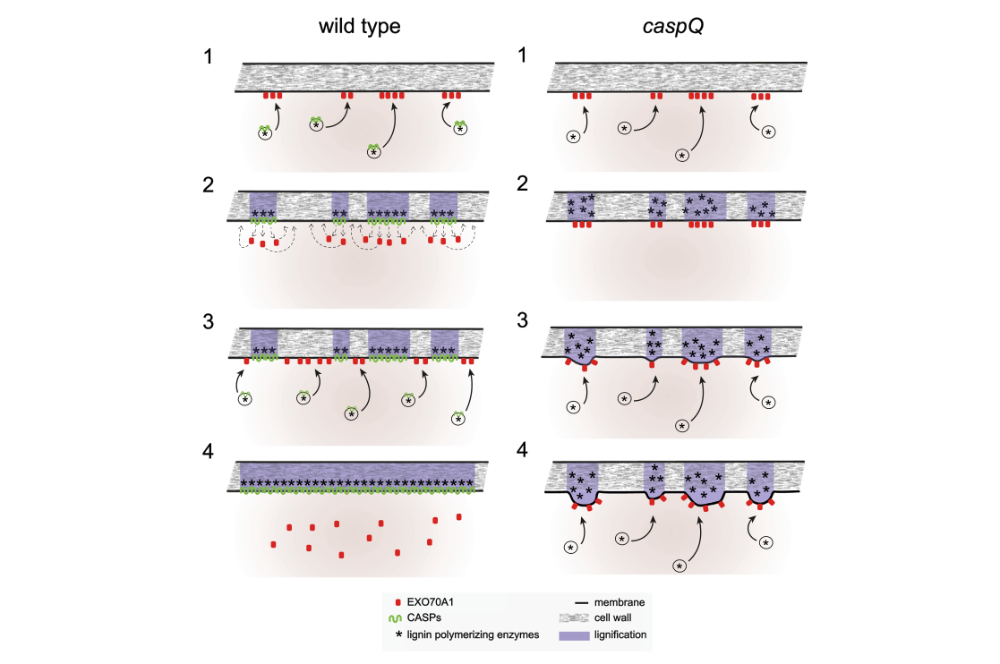

## Question

# Gene Research for Functional Annotation

## ⚠️ CRITICAL: Gene/Protein Identification Context

**BEFORE YOU BEGIN RESEARCH:** You MUST verify you are researching the CORRECT gene/protein. Gene symbols can be ambiguous, especially for less well-characterized genes from non-model organisms.

### Target Gene/Protein Identity (from UniProt):
- **UniProt Accession:** Q9FE29
- **Protein Description:** RecName: Full=CASP-like protein 1D1; Short=AtCASPL1D1;
- **Gene Information:** OrderedLocusNames=At4g15610; ORFNames=Dl3845w, FCAALL.139;
- **Organism (full):** Arabidopsis thaliana (Mouse-ear cress).
- **Protein Family:** Belongs to the Casparian strip membrane proteins (CASP)
- **Key Domains:** CASP/CASPL. (IPR006459); CASP_dom. (IPR006702); CASPL. (IPR044173); CASP_dom (PF04535)

### MANDATORY VERIFICATION STEPS:

1. **Check if the gene symbol "CASPL1D1" matches the protein description above**
2. **Verify the organism is correct:** Arabidopsis thaliana (Mouse-ear cress).
3. **Check if protein family/domains align with what you find in literature**
4. **If you find literature for a DIFFERENT gene with the same or similar symbol, STOP**

### If Gene Symbol is Ambiguous or You Cannot Find Relevant Literature:

**DO NOT PROCEED WITH RESEARCH ON A DIFFERENT GENE.** Instead:
- State clearly: "The gene symbol 'CASPL1D1' is ambiguous or literature is limited for this specific protein"
- Explain what you found (e.g., "Found extensive literature on a different gene with the same symbol in a different organism")
- Describe the protein based ONLY on the UniProt information provided above
- Suggest that the protein function can be inferred from domain/family information

### Research Target:

Please provide a comprehensive research report on the gene **CASPL1D1** (gene ID: Q9FE29, UniProt: Q9FE29) in ARATH.

The research report should be a detailed narrative explaining the function, biological processes, and localization of the gene product. Citations should be given for all claims.

You should prioritize authoritative reviews and primary scientific literature when conducting research. You can supplement
this with annotations you find in gene/protein databases, but these can be outdated or inaccurate.

We are specifically interested in the primary function of the gene - for enzymes, what reaction is catalyzed, and what is the substrate specificity? For transporters, what is the substrate? For structural proteins or adapters, what is the broader structural role? For signaling molecules, what is the role in the pathway.

We are interested in where in or outside the cell the gene product carries out its function.

We are also interested in the signaling or biochemical pathways in which the gene functions. We are less interested in broad pleiotropic effects, except where these elucidate the precise role.

Include evidence where possible. We are interested in both experimental evidence as well as inference from structure, evolution, or bioinformatic analysis. Precise studies should be prioritized over high-throughput, where available.

## Output

Question: You are an expert researcher providing comprehensive, well-cited information.

Provide detailed information focusing on:
1. Key concepts and definitions with current understanding
2. Recent developments and latest research (prioritize 2023-2024 sources)
3. Current applications and real-world implementations
4. Expert opinions and analysis from authoritative sources
5. Relevant statistics and data from recent studies

Format as a comprehensive research report with proper citations. Include URLs and publication dates where available.
Always prioritize recent, authoritative sources and provide specific citations for all major claims.

# Gene Research for Functional Annotation

## ⚠️ CRITICAL: Gene/Protein Identification Context

**BEFORE YOU BEGIN RESEARCH:** You MUST verify you are researching the CORRECT gene/protein. Gene symbols can be ambiguous, especially for less well-characterized genes from non-model organisms.

### Target Gene/Protein Identity (from UniProt):
- **UniProt Accession:** Q9FE29
- **Protein Description:** RecName: Full=CASP-like protein 1D1; Short=AtCASPL1D1;
- **Gene Information:** OrderedLocusNames=At4g15610; ORFNames=Dl3845w, FCAALL.139;
- **Organism (full):** Arabidopsis thaliana (Mouse-ear cress).
- **Protein Family:** Belongs to the Casparian strip membrane proteins (CASP)
- **Key Domains:** CASP/CASPL. (IPR006459); CASP_dom. (IPR006702); CASPL. (IPR044173); CASP_dom (PF04535)

### MANDATORY VERIFICATION STEPS:

1. **Check if the gene symbol "CASPL1D1" matches the protein description above**
2. **Verify the organism is correct:** Arabidopsis thaliana (Mouse-ear cress).
3. **Check if protein family/domains align with what you find in literature**
4. **If you find literature for a DIFFERENT gene with the same or similar symbol, STOP**

### If Gene Symbol is Ambiguous or You Cannot Find Relevant Literature:

**DO NOT PROCEED WITH RESEARCH ON A DIFFERENT GENE.** Instead:
- State clearly: "The gene symbol 'CASPL1D1' is ambiguous or literature is limited for this specific protein"
- Explain what you found (e.g., "Found extensive literature on a different gene with the same symbol in a different organism")
- Describe the protein based ONLY on the UniProt information provided above
- Suggest that the protein function can be inferred from domain/family information

### Research Target:

Please provide a comprehensive research report on the gene **CASPL1D1** (gene ID: Q9FE29, UniProt: Q9FE29) in ARATH.

The research report should be a detailed narrative explaining the function, biological processes, and localization of the gene product. Citations should be given for all claims.

You should prioritize authoritative reviews and primary scientific literature when conducting research. You can supplement
this with annotations you find in gene/protein databases, but these can be outdated or inaccurate.

We are specifically interested in the primary function of the gene - for enzymes, what reaction is catalyzed, and what is the substrate specificity? For transporters, what is the substrate? For structural proteins or adapters, what is the broader structural role? For signaling molecules, what is the role in the pathway.

We are interested in where in or outside the cell the gene product carries out its function.

We are also interested in the signaling or biochemical pathways in which the gene functions. We are less interested in broad pleiotropic effects, except where these elucidate the precise role.

Include evidence where possible. We are interested in both experimental evidence as well as inference from structure, evolution, or bioinformatic analysis. Precise studies should be prioritized over high-throughput, where available.

## Research Report: Arabidopsis thaliana CASPL1D1 (At4g15610; UniProt Q9FE29)

### Executive summary
CASPL1D1 (Casparian strip membrane domain protein-like D1; At4g15610; UniProt Q9FE29) is a plant-specific multi-pass plasma-membrane protein in the CASP/CASPL (MARVEL-like) superfamily. The strongest direct experimental evidence indicates that CASPL1D1 is expressed predominantly in the root cortex near the tip, localizes to the cortical-cell plasma membrane, and is excluded from the Casparian strip membrane domain (CSD), arguing against it being a core CASP1–5 organizer of the endodermal CSD. Loss-of-function analysis (especially in a caspl1d1 caspl1d2 double mutant) shows only a weak, context-dependent increase in endodermal suberization under control and salt stress, with no major impacts on whole-root water transport metrics under the conditions tested. CASPL1D1 associates with the aquaporin PIP2;1 by copurification, suggesting a potential regulatory/scaffolding role at the plasma membrane rather than an enzymatic activity with defined substrates. (champeyroux2019regulationofa pages 4-6, champeyroux2019regulationofa pages 6-8, champeyroux2019regulationofa pages 8-10)

### 1) Key concepts and definitions (current understanding)

#### Casparian strip and Casparian strip membrane domain (CSD)
The Casparian strip (CS) is a lignin-impregnated band in endodermal cell walls that forms an extracellular diffusion barrier in roots. CASP proteins (CASP1–CASP5) are small, four-transmembrane-span, endodermis-specific MARVEL-family proteins that define the CSD, a specialized plasma-membrane domain tightly associated with the lignified wall and characterized by membrane protein exclusion and matrix adhesion. (barbosa2023directedgrowthand pages 1-2)

A key 2023 mechanistic advance is that CASPs are not required to initiate correctly positioned lignin microdomains; rather, CASPs are required to organize, expand, and fuse these initial lignin foci into a continuous band and to establish membrane–wall attachment/exclusion-zone properties typical of a mature CSD. (barbosa2023directedgrowthand pages 5-6, barbosa2023directedgrowthand pages 1-2)

#### CASPL proteins vs. CASP1–5 proteins
Barbosa et al. (2023) describe CASPs and CASP-LIKEs (CASPLs) as a plant-specific branch of the MARVEL family; however, CASP1–5 are the experimentally demonstrated core organizers of the endodermal CSD. Importantly, additional CASPL knockouts tested in a casp quintuple background did not enhance the casp phenotype, arguing against straightforward compensation of CASP loss by those CASPLs in canonical CSD assembly. (barbosa2023directedgrowthand pages 3-4, barbosa2023directedgrowthand pages 11-12)

### 2) Target gene verification (critical disambiguation)
Champeyroux et al. explicitly identify CASPL1D1 as Arabidopsis locus At4g15610 and treat it as one of four CASPL proteins previously identified as interactants of the aquaporin PIP2;1. This aligns with the user-provided UniProt identity (Q9FE29; At4g15610; CASP-like protein 1D1) and supports that the literature cited here refers to the correct Arabidopsis gene/protein. (champeyroux2019regulationofa pages 1-2)

### 3) Gene-specific functional evidence for CASPL1D1

#### 3.1 Expression pattern
In Champeyroux et al. (Plant Cell & Environment; published March 2019; https://doi.org/10.1111/pce.13537), CASPL1D1 promoter activity (GUS) and CASPL1D1::GFP indicate that CASPL1D1 is active in root tips/younger tissues and is reported as “mostly expressed in the cortex close to the root tip and in a continuous way along the root.” (champeyroux2019regulationofa pages 4-6)

This is a key gene-specific point because it distinguishes CASPL1D1 from paralogs that show more strictly suberized-endodermis expression (in the same study, CASPL1B1/CASPL1B2/CASPL1D2 are emphasized as exclusively expressed in suberized endodermal cells). (champeyroux2019regulationofa pages 1-2)

#### 3.2 Subcellular localization
CASPL1D1::GFP localizes to the plasma membrane in cortical cells and is excluded from the Casparian strip domain (CSD) (contrasted in the same work with CASPL1B2). This supports annotation of CASPL1D1 as a plasma-membrane protein that likely functions outside the core endodermal CSD scaffold. (champeyroux2019regulationofa pages 4-6)

#### 3.3 Molecular interactions and mechanistic role
CASPL1D1 was previously identified among PIP2;1 interactants and in Champeyroux et al. is supported to associate with aquaporin complexes by copurification with GFP-PIP2;1. The authors additionally note potential coexpression/colocalization with PIP2;1 at the plasma membrane of cortical cells, consistent with a scaffolding/regulatory association rather than a catalytic enzyme function. (champeyroux2019regulationofa pages 4-6, champeyroux2019regulationofa pages 6-8)

However, the provided evidence does not include direct FRET-FLIM binding validation for CASPL1D1 (direct interaction evidence is shown for other paralogs such as CASPL1D2 and CASPL1B1 in the same study). Therefore, CASPL1D1’s interaction should be treated as supported by biochemical association (copurification) but not definitively established as direct physical binding in planta from the snippets available here. (champeyroux2019regulationofa pages 10-11, champeyroux2019regulationofa pages 8-10)

#### 3.4 Mutant phenotypes and quantitative effects
Champeyroux et al. generated caspl1d1 mutant lines and a caspl1d1 caspl1d2 double mutant, with strong transcript reduction for CASPL1D1 in the mutant backgrounds (73% decrease in caspl1d1.1 and 76% decrease in the caspl1d1 caspl1d2 double mutant by RT-qPCR). (champeyroux2019regulationofa pages 6-8)

A reproducible quantitative phenotype reported for the caspl1d1 caspl1d2 double mutant is a modest but statistically significant increase in the continuous endodermal suberization zone: 42% vs 36% in control under baseline conditions, and 56% vs 50% in control under NaCl treatment, with no similar effect upon ABA treatment. This supports the conclusion that CASPL1D1 (together with CASPL1D2) plays a slight negative/modulatory role in endodermal suberization under some conditions. (champeyroux2019regulationofa pages 6-8)

Despite altered suberization metrics, multiple physiological readouts showed no major effects under tested conditions: no significant differences in solute exudation flux (Js) in caspl mutants compared with controls, and no clear whole-root hydraulic conductivity phenotype across control, NaCl, or ABA treatments. (champeyroux2019regulationofa pages 4-6, champeyroux2019regulationofa pages 6-8, champeyroux2019regulationofa pages 8-10, champeyroux2019regulationofa pages 1-2)

### 4) Pathways and biological processes implicated

#### 4.1 Endodermal barrier formation as the proximate process
Even though CASPL1D1 localizes primarily to cortical plasma membrane and is excluded from the CSD, genetic evidence suggests CASPL1D1 can modulate endodermal suberization (particularly in combination with CASPL1D2). Suberization is part of the broader root barrier system that works together with the lignified Casparian strip to regulate apoplastic flow. (champeyroux2019regulationofa pages 6-8, champeyroux2019regulationofa pages 1-2)

#### 4.2 Link to membrane trafficking and CSD assembly models (contextual inference)
Recent mechanistic work on CASP proteins provides a useful framework for interpreting CASPL proteins as membrane-domain organizers rather than enzymes/transporters. In a 2023 Nature Communications study (published July 2023; https://doi.org/10.1038/s41467-023-37265-7), CASPs are shown to organize the growth and fusion of lignin microdomains into a continuous Casparian strip by displacing secretory foci and exocyst components such as EXO70A1; proximity labeling also implicates RabA GTPases (known exocyst activators) as CASP-proximal factors. (barbosa2023directedgrowthand pages 1-2, barbosa2023directedgrowthand pages 12-13, barbosa2023directedgrowthand pages 11-12)

These findings strengthen the general interpretation that CASP/CASPL family members function as plasma-membrane scaffolds that shape where secretion and wall-modifying activities occur. For CASPL1D1 specifically, direct evidence for such a role is limited, but its plasma-membrane localization and association with PIP2;1 are consistent with a scaffold/regulator role at the membrane. (champeyroux2019regulationofa pages 4-6, barbosa2023directedgrowthand pages 11-12)

### 5) Recent developments and latest research (prioritizing 2023–2024)
The most relevant recent advance in this evidence set is the 2023 mechanistic dissection of CASP-mediated microdomain fusion and secretory focus displacement, including a negative-feedback model where CASPs evict EXO70A1 to move secretion along the median zone and seal gaps, and the demonstration that at least three CASPs (most effectively CASP1/3/5) are required to complement a casp quintuple mutant. This work modernizes the field’s model of how the endodermal diffusion barrier is assembled at the nanoscale. (barbosa2023directedgrowthand pages 8-9, barbosa2023directedgrowthand pages 12-13)

A key nuance from this 2023 study is that “CASPL” genes tested did not compensate for CASP loss in the caspQ phenotype (caspQ 6x-caspl), which argues against annotating CASPL1D1 as a direct functional equivalent of the core endodermal CASP scaffold in CSD formation without gene-specific evidence. (barbosa2023directedgrowthand pages 3-4)

### 6) Current applications and real-world implementations

#### 6.1 Modulating root water relations and stress tolerance via trafficking and plasma-membrane proteome changes
A concrete implementation relevant to CASPL1D1 comes from a plasma-membrane proteomics and functional stress-tolerance study: RabA2b overexpression in Arabidopsis improves drought tolerance and alters the plasma-membrane proteome (Frontiers in Plant Science; published October 2021; https://doi.org/10.3389/fpls.2021.738694). CASPL1D1 (At4g15610) appears among proteins reported in the PM-proteomics results (Table 1) with fold-change values close to 1 (0.94 and 1.07 in two OE lines, each with reported p-values), indicating detection in PM fractions and modest abundance differences in that dataset. (ambastha2021raba2boverexpressionalters pages 12-13)

The same study reiterates the functional hypothesis from prior work that CASPL1D1 interacts with PIP2;1 and was proposed to be involved in water transport regulation, linking CASPL1D1 to a broader translational theme: engineering membrane trafficking and aquaporin-associated membrane complexes to improve plant performance under water stress. (ambastha2021raba2boverexpressionalters pages 14-17)

### 7) Expert opinions and analysis (authoritative interpretations within sources)

#### 7.1 Gene-level interpretation from Champeyroux et al. 2019
Champeyroux et al. interpret the caspl1d1 caspl1d2 phenotype as consistent with a slight negative role for these genes in suberization under control and salt conditions, and they emphasize the absence of strong root transport phenotypes, implying CASPL1D1 is not a major determinant of whole-root hydraulics in their experimental settings. (champeyroux2019regulationofa pages 6-8, champeyroux2019regulationofa pages 1-2)

#### 7.2 Field-level mechanistic interpretation from Barbosa et al. 2023
Barbosa et al. present a mechanistic model in which CASP microdomains organize and confine localized secretion and lignification by displacing vesicle-tethering factors (EXO70A1/exocyst landmarks) to ensure microdomain growth and fusion into a continuous strip. This model shifts emphasis from CASPs as purely recruitment factors for lignin enzymes to CASPs as organizers of membrane-wall microdomain dynamics and secretory focus displacement. (barbosa2023directedgrowthand pages 1-2, barbosa2023directedgrowthand pages 12-13)

### 8) Key statistics and data points (from recent studies and relevant primary literature)
- CASPL1D1 transcript reduction in mutants: 73% decrease (caspl1d1.1) and 76% decrease (caspl1d1 caspl1d2), supporting that mutant phenotyping was conducted in substantially reduced-expression backgrounds. (champeyroux2019regulationofa pages 6-8)
- Suberization phenotype in caspl1d1 caspl1d2: continuous endodermal suberization zone 42% vs 36% (control) and 56% vs 50% (NaCl), with the effect not observed under ABA treatment in the reported comparisons. (champeyroux2019regulationofa pages 6-8)
- CASPL1D1 in PM proteomics (RabA2b OE drought-tolerance context): fold-change values 0.94 (OE6.4 vs WT; p=3.43E-02) and 1.07 (OE11.4 vs WT; p=1.41E-02). (ambastha2021raba2boverexpressionalters pages 12-13)
- CASP microdomain function (2023): at least three CASPs (best CASP1/3/5 combination) required to complement caspQ, supporting a cooperative multi-component scaffold model. (barbosa2023directedgrowthand pages 8-9)

### 9) Visual evidence: current mechanistic model for CASP/CSD assembly
The following cited figure provides a concise, current model of how CASP microdomains regulate secretory landmarks (EXO70A1) to drive microdomain fusion and how the caspQ mutant results in a ‘string-of-pearls’ phenotype due to persistent secretion at the same foci.

(barbosa2023directedgrowthand media d10ce794)

### 10) Practical functional annotation for CASPL1D1 (At4g15610; Q9FE29)

#### Molecular function (most defensible)
- **Likely role**: plasma-membrane scaffold/regulator associated with aquaporin-containing membrane complexes (PIP2;1) and/or membrane-domain organization.
- **Not supported**: enzymatic catalysis, defined transported substrate, or a direct core-CSD assembly role comparable to CASP1–5.

This interpretation is based on (i) plasma-membrane localization and cortical expression, (ii) copurification/association with PIP2;1, and (iii) weak, redundant phenotypes affecting suberization primarily observed in higher-order mutants. (champeyroux2019regulationofa pages 4-6, champeyroux2019regulationofa pages 6-8)

#### Biological processes
- **Root cell-type specific plasma membrane function** in cortex near the root tip (direct evidence). (champeyroux2019regulationofa pages 4-6)
- **Modulation of endodermal suberization** (direct evidence in caspl1d1 caspl1d2) with condition dependence (control/NaCl > ABA). (champeyroux2019regulationofa pages 6-8)

#### Subcellular localization
- **Plasma membrane** in cortical cells; excluded from the Casparian strip membrane domain. (champeyroux2019regulationofa pages 4-6)

### Evidence summary table
| Claim/annotation category | Specific finding | Experimental system/method | Conditions (e.g., control/NaCl/ABA) | Interpretation for functional annotation | Source (include DOI URL and year) |
|---|---|---|---|---|---|
| identity | CASPL1D1 corresponds to Arabidopsis thaliana locus **At4g15610** and is discussed as one of four **CASPL** proteins previously identified as interactants of aquaporin **PIP2;1**. | Gene/protein identification in Arabidopsis root studies; prior interactor-based selection summarized in paper | Arabidopsis roots | Confirms the target is the Arabidopsis **CASP-like protein 1D1** rather than a different similarly named gene from another species. | Champeyroux et al. 2019, Plant Cell Environ. DOI: https://doi.org/10.1111/pce.13537 (2019) (champeyroux2019regulationofa pages 1-2) |
| domain/family | CASPL1D1 belongs to the **CASP-LIKE (CASPL)** family; Barbosa et al. describe **CASPs/CASPLs** as a plant-specific branch of the **MARVEL** family with multiple transmembrane domains involved in membrane-domain organization. | Family-level comparative and functional analysis of CASP/CASPL proteins | General Casparian strip context | Supports annotation of AtCASPL1D1 as a small multi-pass membrane protein likely acting as a membrane-domain/scaffold component rather than an enzyme or transporter with known catalytic substrate. | Barbosa et al. 2023, Nat Commun. DOI: https://doi.org/10.1038/s41467-023-37265-7 (2023) (barbosa2023directedgrowthand pages 11-12, barbosa2023directedgrowthand pages 16-17) |
| expression | **CASPL1D1 shows GUS activity in root tips and younger tissues** and is reported as **mostly expressed in the cortex close to the root tip and continuously along the root**; this pattern was confirmed by **CASPL1D1::GFP**. | Promoter-GUS and GFP fusion expression analysis | Arabidopsis roots under standard conditions | Indicates a tissue-biased role in root cortex/plasma membrane biology rather than exclusive endodermal Casparian strip assembly. | Champeyroux et al. 2019, Plant Cell Environ. DOI: https://doi.org/10.1111/pce.13537 (2019) (champeyroux2019regulationofa pages 4-6) |
| expression | In contrast to CASPL1B1, CASPL1B2 and CASPL1D2, **CASPL1D1 is not described as exclusively expressed in suberized endodermal cells** in the provided evidence. | Comparative expression interpretation from reporter analyses | Arabidopsis roots | Suggests AtCASPL1D1 may function outside the canonical endodermal suberized domain emphasized for other CASPL paralogs. | Champeyroux et al. 2019, Plant Cell Environ. DOI: https://doi.org/10.1111/pce.13537 (2019) (champeyroux2019regulationofa pages 4-6, champeyroux2019regulationofa pages 1-2) |
| subcellular localization | **CASPL1D1 localizes to the plasma membrane in cortical cells** and, unlike CASPL1B2, is **excluded from the Casparian strip domain (CSD)**. | CASPL1D1::GFP localization microscopy | Arabidopsis root cortical cells | Strongly supports annotation as a **plasma-membrane structural/regulatory protein** rather than a lumenal or wall-localized factor; exclusion from the CSD argues against a direct core-CASP role in CSD formation. | Champeyroux et al. 2019, Plant Cell Environ. DOI: https://doi.org/10.1111/pce.13537 (2019) (champeyroux2019regulationofa pages 4-6) |
| interactions | CASPL1D1 is reported among four CASPL proteins that **copurify with GFP-PIP2;1**, and the authors note potential **coexpression/colocalization with PIP2;1** at the plasma membrane of cortical cells. | Copurification/proteomics plus expression-localization comparison | Arabidopsis roots | Supports a probable association with aquaporin regulatory complexes, but does **not** by itself establish direct binding or channel regulation by CASPL1D1. | Champeyroux et al. 2019, Plant Cell Environ. DOI: https://doi.org/10.1111/pce.13537 (2019) (champeyroux2019regulationofa pages 4-6, champeyroux2019regulationofa pages 6-8, champeyroux2019regulationofa pages 8-10) |
| interactions | Direct physical interaction/function was demonstrated in the study for **CASPL1B1** and for interaction testing of **CASPL1D2**, but **equivalent direct FRET/functional proof is not reported for CASPL1D1** in the provided snippets. | FRET-FLIM / heterologous functional assays summarized in excerpt | Arabidopsis / assay-specific | Functional annotation for AtCASPL1D1 should remain conservative: **association with PIP2;1 is supported, direct mechanistic regulation is not yet established** from the provided evidence. | Champeyroux et al. 2019, Plant Cell Environ. DOI: https://doi.org/10.1111/pce.13537 (2019) (champeyroux2019regulationofa pages 10-11, champeyroux2019regulationofa pages 8-10) |
| mutant/phenotype | **Single caspl1d1** mutants and **caspl1d1 caspl1d2** double mutants showed **no detectable alteration of endodermal suberization under standard growth conditions** in one summary, but other analyses found a **slight enlargement of the continuous suberization zone** in the double mutant. | T-DNA/transposon loss-of-function analysis with suberization phenotyping | Mainly control conditions | Indicates any role of AtCASPL1D1 in barrier formation is **weak/modulatory**, likely partially redundant with CASPL1D2. | Champeyroux et al. 2019, Plant Cell Environ. DOI: https://doi.org/10.1111/pce.13537 (2019) (champeyroux2019regulationofa pages 4-6, champeyroux2019regulationofa pages 6-8) |
| mutant/phenotype | Under **NaCl stress**, the **caspl1d1 caspl1d2** double mutant showed a somewhat stronger continuous suberization phenotype; **no phenotype after ABA** treatment was reported for this trait. | Root suberization assays in mutant lines | Control, NaCl, ABA | Supports a context-dependent role in modulating suberization, especially under salt stress, but not a major ABA-dependent pathway role based on current evidence. | Champeyroux et al. 2019, Plant Cell Environ. DOI: https://doi.org/10.1111/pce.13537 (2019) (champeyroux2019regulationofa pages 6-8, champeyroux2019regulationofa pages 1-2) |
| mutant/phenotype | **No significant differences** were detected for **root hydraulic conductivity (Lpr)**, **osmotic permeability (Lpr-o)**, **solute exudation fluxes (Js)**, or **root/shoot dry weight** in caspl1d1-related mutant backgrounds under tested conditions. | Root hydraulics, solute flux, and biomass phenotyping | Control, NaCl, ABA as tested | Suggests AtCASPL1D1 is **not a major determinant of whole-root water transport** or gross growth under the tested experimental settings. | Champeyroux et al. 2019, Plant Cell Environ. DOI: https://doi.org/10.1111/pce.13537 (2019) (champeyroux2019regulationofa pages 4-6, champeyroux2019regulationofa pages 6-8, champeyroux2019regulationofa pages 8-10, champeyroux2019regulationofa pages 1-2) |
| quantitative stats | **CASPL1D1 transcript abundance decreased by 73% in caspl1d1.1 and 76% in caspl1d1 caspl1d2** relative to control. | RT-qPCR in mutant lines | Mutant versus control | Confirms substantial knockdown/disruption in the analyzed mutant material, supporting interpretation of phenotype tests as informative for gene function. | Champeyroux et al. 2019, Plant Cell Environ. DOI: https://doi.org/10.1111/pce.13537 (2019) (champeyroux2019regulationofa pages 6-8) |
| quantitative stats | In the **caspl1d1 caspl1d2** double mutant, the **continuous endodermal suberization zone** was reported as **42% vs 36% in control** under standard conditions and **56% vs 50% in control** under **NaCl** treatment. | Quantification of suberization pattern in mutant and control roots | Control and NaCl | Quantitatively supports a **slight negative role** for CASPL1D1/CASPL1D2 in limiting continuous suberization. | Champeyroux et al. 2019, Plant Cell Environ. DOI: https://doi.org/10.1111/pce.13537 (2019) (champeyroux2019regulationofa pages 6-8) |
| domain/family | In the broader family context, **CASP proteins** are small **four-transmembrane-span**, endodermis-specific MARVEL-family proteins that form stable **Casparian strip membrane domains (CSDs)**, mediate membrane-wall adhesion, and help create membrane exclusion zones. | CASP quintuple-mutant analysis, imaging, proximity labeling, mechanistic modeling | Arabidopsis endodermis | Although this evidence concerns **CASP1-5 rather than CASPL1D1 directly**, it provides the best current mechanistic framework for inferring that CASPL proteins are membrane-domain organizers/scaffolds. | Barbosa et al. 2023, Nat Commun. DOI: https://doi.org/10.1038/s41467-023-37265-7 (2023) (barbosa2023directedgrowthand pages 1-2, barbosa2023directedgrowthand pages 11-12) |
| domain/family | Barbosa et al. tested extra **CASPL** knockouts in a **caspQ 6x-caspl** background and found **no enhancement** of the caspQ phenotype, arguing that tested CASPLs do **not compensate** for loss of core CASPs in Casparian strip assembly. | Higher-order mutant analysis | Casparian strip formation context | Suggests AtCASPL1D1 is unlikely to be a simple functional substitute for core CSD-forming CASPs and may have a distinct, more peripheral role. | Barbosa et al. 2023, Nat Commun. DOI: https://doi.org/10.1038/s41467-023-37265-7 (2023) (barbosa2023directedgrowthand pages 3-4) |
| quantitative stats | Family-level quantitative/mechanistic result: **at least three CASPs**—most effectively **CASP1, CASP3 and CASP5**—were needed to complement the **caspQ** mutant; single or double CASPs were insufficient. | Complementation analysis in caspQ | Casparian strip assembly assays | Reinforces that CSD function depends on cooperative assembly of membrane scaffolds; by analogy, CASPL1D1 may also act in complexes rather than alone, though this remains inferential for AtCASPL1D1. | Barbosa et al. 2023, Nat Commun. DOI: https://doi.org/10.1038/s41467-023-37265-7 (2023) (barbosa2023directedgrowthand pages 8-9) |

*Table: This table compiles gene-specific evidence for Arabidopsis AtCASPL1D1 (At4g15610; Q9FE29) from Champeyroux et al. 2019 and relevant family/mechanistic context from Barbosa et al. 2023. It separates direct findings on expression, localization, interactions, and mutant phenotypes from broader CASP/CASPL inferences useful for functional annotation.*

References

1. (champeyroux2019regulationofa pages 4-6): Chloé Champeyroux, Jorge Bellati, Marie Barberon, Valérie Rofidal, Christophe Maurel, and Véronique Santoni. Regulation of a plant aquaporin by a casparian strip membrane domain protein-like. Plant, cell & environment, 42 6:1788-1801, Mar 2019. URL: https://doi.org/10.1111/pce.13537, doi:10.1111/pce.13537. This article has 19 citations.

2. (champeyroux2019regulationofa pages 6-8): Chloé Champeyroux, Jorge Bellati, Marie Barberon, Valérie Rofidal, Christophe Maurel, and Véronique Santoni. Regulation of a plant aquaporin by a casparian strip membrane domain protein-like. Plant, cell & environment, 42 6:1788-1801, Mar 2019. URL: https://doi.org/10.1111/pce.13537, doi:10.1111/pce.13537. This article has 19 citations.

3. (champeyroux2019regulationofa pages 8-10): Chloé Champeyroux, Jorge Bellati, Marie Barberon, Valérie Rofidal, Christophe Maurel, and Véronique Santoni. Regulation of a plant aquaporin by a casparian strip membrane domain protein-like. Plant, cell & environment, 42 6:1788-1801, Mar 2019. URL: https://doi.org/10.1111/pce.13537, doi:10.1111/pce.13537. This article has 19 citations.

4. (barbosa2023directedgrowthand pages 1-2): Inês Catarina Ramos Barbosa, D. De Bellis, Isabelle Flückiger, E. Bellani, Mathieu Grangé-Guerment, Kian Hématy, and N. Geldner. Directed growth and fusion of membrane-wall microdomains requires casp-mediated inhibition and displacement of secretory foci. Nature Communications, Jul 2023. URL: https://doi.org/10.1038/s41467-023-37265-7, doi:10.1038/s41467-023-37265-7. This article has 33 citations and is from a highest quality peer-reviewed journal.

5. (barbosa2023directedgrowthand pages 5-6): Inês Catarina Ramos Barbosa, D. De Bellis, Isabelle Flückiger, E. Bellani, Mathieu Grangé-Guerment, Kian Hématy, and N. Geldner. Directed growth and fusion of membrane-wall microdomains requires casp-mediated inhibition and displacement of secretory foci. Nature Communications, Jul 2023. URL: https://doi.org/10.1038/s41467-023-37265-7, doi:10.1038/s41467-023-37265-7. This article has 33 citations and is from a highest quality peer-reviewed journal.

6. (barbosa2023directedgrowthand pages 3-4): Inês Catarina Ramos Barbosa, D. De Bellis, Isabelle Flückiger, E. Bellani, Mathieu Grangé-Guerment, Kian Hématy, and N. Geldner. Directed growth and fusion of membrane-wall microdomains requires casp-mediated inhibition and displacement of secretory foci. Nature Communications, Jul 2023. URL: https://doi.org/10.1038/s41467-023-37265-7, doi:10.1038/s41467-023-37265-7. This article has 33 citations and is from a highest quality peer-reviewed journal.

7. (barbosa2023directedgrowthand pages 11-12): Inês Catarina Ramos Barbosa, D. De Bellis, Isabelle Flückiger, E. Bellani, Mathieu Grangé-Guerment, Kian Hématy, and N. Geldner. Directed growth and fusion of membrane-wall microdomains requires casp-mediated inhibition and displacement of secretory foci. Nature Communications, Jul 2023. URL: https://doi.org/10.1038/s41467-023-37265-7, doi:10.1038/s41467-023-37265-7. This article has 33 citations and is from a highest quality peer-reviewed journal.

8. (champeyroux2019regulationofa pages 1-2): Chloé Champeyroux, Jorge Bellati, Marie Barberon, Valérie Rofidal, Christophe Maurel, and Véronique Santoni. Regulation of a plant aquaporin by a casparian strip membrane domain protein-like. Plant, cell & environment, 42 6:1788-1801, Mar 2019. URL: https://doi.org/10.1111/pce.13537, doi:10.1111/pce.13537. This article has 19 citations.

9. (champeyroux2019regulationofa pages 10-11): Chloé Champeyroux, Jorge Bellati, Marie Barberon, Valérie Rofidal, Christophe Maurel, and Véronique Santoni. Regulation of a plant aquaporin by a casparian strip membrane domain protein-like. Plant, cell & environment, 42 6:1788-1801, Mar 2019. URL: https://doi.org/10.1111/pce.13537, doi:10.1111/pce.13537. This article has 19 citations.

10. (barbosa2023directedgrowthand pages 12-13): Inês Catarina Ramos Barbosa, D. De Bellis, Isabelle Flückiger, E. Bellani, Mathieu Grangé-Guerment, Kian Hématy, and N. Geldner. Directed growth and fusion of membrane-wall microdomains requires casp-mediated inhibition and displacement of secretory foci. Nature Communications, Jul 2023. URL: https://doi.org/10.1038/s41467-023-37265-7, doi:10.1038/s41467-023-37265-7. This article has 33 citations and is from a highest quality peer-reviewed journal.

11. (barbosa2023directedgrowthand pages 8-9): Inês Catarina Ramos Barbosa, D. De Bellis, Isabelle Flückiger, E. Bellani, Mathieu Grangé-Guerment, Kian Hématy, and N. Geldner. Directed growth and fusion of membrane-wall microdomains requires casp-mediated inhibition and displacement of secretory foci. Nature Communications, Jul 2023. URL: https://doi.org/10.1038/s41467-023-37265-7, doi:10.1038/s41467-023-37265-7. This article has 33 citations and is from a highest quality peer-reviewed journal.

12. (ambastha2021raba2boverexpressionalters pages 12-13): Vivek Ambastha, Ifat Matityahu, Dafna Tidhar, and Yehoram Leshem. Raba2b overexpression alters the plasma-membrane proteome and improves drought tolerance in arabidopsis. Frontiers in Plant Science, Oct 2021. URL: https://doi.org/10.3389/fpls.2021.738694, doi:10.3389/fpls.2021.738694. This article has 16 citations.

13. (ambastha2021raba2boverexpressionalters pages 14-17): Vivek Ambastha, Ifat Matityahu, Dafna Tidhar, and Yehoram Leshem. Raba2b overexpression alters the plasma-membrane proteome and improves drought tolerance in arabidopsis. Frontiers in Plant Science, Oct 2021. URL: https://doi.org/10.3389/fpls.2021.738694, doi:10.3389/fpls.2021.738694. This article has 16 citations.

14. (barbosa2023directedgrowthand media d10ce794): Inês Catarina Ramos Barbosa, D. De Bellis, Isabelle Flückiger, E. Bellani, Mathieu Grangé-Guerment, Kian Hématy, and N. Geldner. Directed growth and fusion of membrane-wall microdomains requires casp-mediated inhibition and displacement of secretory foci. Nature Communications, Jul 2023. URL: https://doi.org/10.1038/s41467-023-37265-7, doi:10.1038/s41467-023-37265-7. This article has 33 citations and is from a highest quality peer-reviewed journal.

15. (barbosa2023directedgrowthand pages 16-17): Inês Catarina Ramos Barbosa, D. De Bellis, Isabelle Flückiger, E. Bellani, Mathieu Grangé-Guerment, Kian Hématy, and N. Geldner. Directed growth and fusion of membrane-wall microdomains requires casp-mediated inhibition and displacement of secretory foci. Nature Communications, Jul 2023. URL: https://doi.org/10.1038/s41467-023-37265-7, doi:10.1038/s41467-023-37265-7. This article has 33 citations and is from a highest quality peer-reviewed journal.

## Artifacts

- [Edison artifact artifact-00](CASPL1D1-deep-research-falcon_artifacts/artifact-00.md)

## Citations

1. barbosa2023directedgrowthand pages 1-2
2. champeyroux2019regulationofa pages 1-2
3. champeyroux2019regulationofa pages 4-6
4. champeyroux2019regulationofa pages 6-8
5. barbosa2023directedgrowthand pages 3-4
6. barbosa2023directedgrowthand pages 8-9
7. champeyroux2019regulationofa pages 8-10
8. barbosa2023directedgrowthand pages 5-6
9. barbosa2023directedgrowthand pages 11-12
10. champeyroux2019regulationofa pages 10-11
11. barbosa2023directedgrowthand pages 12-13
12. barbosa2023directedgrowthand pages 16-17
13. https://doi.org/10.1111/pce.13537
14. https://doi.org/10.1038/s41467-023-37265-7
15. https://doi.org/10.3389/fpls.2021.738694
16. https://doi.org/10.1111/pce.13537,
17. https://doi.org/10.1038/s41467-023-37265-7,
18. https://doi.org/10.3389/fpls.2021.738694,