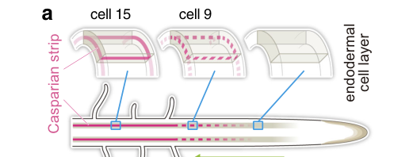

## Question

# Gene Research for Functional Annotation

## ⚠️ CRITICAL: Gene/Protein Identification Context

**BEFORE YOU BEGIN RESEARCH:** You MUST verify you are researching the CORRECT gene/protein. Gene symbols can be ambiguous, especially for less well-characterized genes from non-model organisms.

### Target Gene/Protein Identity (from UniProt):
- **UniProt Accession:** Q9SQU2
- **Protein Description:** RecName: Full=CASP-like protein 1D2; Short=AtCASPL1D2;
- **Gene Information:** OrderedLocusNames=At3g06390; ORFNames=F24P17.14;
- **Organism (full):** Arabidopsis thaliana (Mouse-ear cress).
- **Protein Family:** Belongs to the Casparian strip membrane proteins (CASP)
- **Key Domains:** CASP/CASPL. (IPR006459); CASP_dom. (IPR006702); CASPL. (IPR044173); CASP_dom (PF04535)

### MANDATORY VERIFICATION STEPS:

1. **Check if the gene symbol "CASPL1D2" matches the protein description above**
2. **Verify the organism is correct:** Arabidopsis thaliana (Mouse-ear cress).
3. **Check if protein family/domains align with what you find in literature**
4. **If you find literature for a DIFFERENT gene with the same or similar symbol, STOP**

### If Gene Symbol is Ambiguous or You Cannot Find Relevant Literature:

**DO NOT PROCEED WITH RESEARCH ON A DIFFERENT GENE.** Instead:
- State clearly: "The gene symbol 'CASPL1D2' is ambiguous or literature is limited for this specific protein"
- Explain what you found (e.g., "Found extensive literature on a different gene with the same symbol in a different organism")
- Describe the protein based ONLY on the UniProt information provided above
- Suggest that the protein function can be inferred from domain/family information

### Research Target:

Please provide a comprehensive research report on the gene **CASPL1D2** (gene ID: Q9SQU2, UniProt: Q9SQU2) in ARATH.

The research report should be a detailed narrative explaining the function, biological processes, and localization of the gene product. Citations should be given for all claims.

You should prioritize authoritative reviews and primary scientific literature when conducting research. You can supplement
this with annotations you find in gene/protein databases, but these can be outdated or inaccurate.

We are specifically interested in the primary function of the gene - for enzymes, what reaction is catalyzed, and what is the substrate specificity? For transporters, what is the substrate? For structural proteins or adapters, what is the broader structural role? For signaling molecules, what is the role in the pathway.

We are interested in where in or outside the cell the gene product carries out its function.

We are also interested in the signaling or biochemical pathways in which the gene functions. We are less interested in broad pleiotropic effects, except where these elucidate the precise role.

Include evidence where possible. We are interested in both experimental evidence as well as inference from structure, evolution, or bioinformatic analysis. Precise studies should be prioritized over high-throughput, where available.

## Output

Question: You are an expert researcher providing comprehensive, well-cited information.

Provide detailed information focusing on:
1. Key concepts and definitions with current understanding
2. Recent developments and latest research (prioritize 2023-2024 sources)
3. Current applications and real-world implementations
4. Expert opinions and analysis from authoritative sources
5. Relevant statistics and data from recent studies

Format as a comprehensive research report with proper citations. Include URLs and publication dates where available.
Always prioritize recent, authoritative sources and provide specific citations for all major claims.

# Gene Research for Functional Annotation

## ⚠️ CRITICAL: Gene/Protein Identification Context

**BEFORE YOU BEGIN RESEARCH:** You MUST verify you are researching the CORRECT gene/protein. Gene symbols can be ambiguous, especially for less well-characterized genes from non-model organisms.

### Target Gene/Protein Identity (from UniProt):
- **UniProt Accession:** Q9SQU2
- **Protein Description:** RecName: Full=CASP-like protein 1D2; Short=AtCASPL1D2;
- **Gene Information:** OrderedLocusNames=At3g06390; ORFNames=F24P17.14;
- **Organism (full):** Arabidopsis thaliana (Mouse-ear cress).
- **Protein Family:** Belongs to the Casparian strip membrane proteins (CASP)
- **Key Domains:** CASP/CASPL. (IPR006459); CASP_dom. (IPR006702); CASPL. (IPR044173); CASP_dom (PF04535)

### MANDATORY VERIFICATION STEPS:

1. **Check if the gene symbol "CASPL1D2" matches the protein description above**
2. **Verify the organism is correct:** Arabidopsis thaliana (Mouse-ear cress).
3. **Check if protein family/domains align with what you find in literature**
4. **If you find literature for a DIFFERENT gene with the same or similar symbol, STOP**

### If Gene Symbol is Ambiguous or You Cannot Find Relevant Literature:

**DO NOT PROCEED WITH RESEARCH ON A DIFFERENT GENE.** Instead:
- State clearly: "The gene symbol 'CASPL1D2' is ambiguous or literature is limited for this specific protein"
- Explain what you found (e.g., "Found extensive literature on a different gene with the same symbol in a different organism")
- Describe the protein based ONLY on the UniProt information provided above
- Suggest that the protein function can be inferred from domain/family information

### Research Target:

Please provide a comprehensive research report on the gene **CASPL1D2** (gene ID: Q9SQU2, UniProt: Q9SQU2) in ARATH.

The research report should be a detailed narrative explaining the function, biological processes, and localization of the gene product. Citations should be given for all claims.

You should prioritize authoritative reviews and primary scientific literature when conducting research. You can supplement
this with annotations you find in gene/protein databases, but these can be outdated or inaccurate.

We are specifically interested in the primary function of the gene - for enzymes, what reaction is catalyzed, and what is the substrate specificity? For transporters, what is the substrate? For structural proteins or adapters, what is the broader structural role? For signaling molecules, what is the role in the pathway.

We are interested in where in or outside the cell the gene product carries out its function.

We are also interested in the signaling or biochemical pathways in which the gene functions. We are less interested in broad pleiotropic effects, except where these elucidate the precise role.

Include evidence where possible. We are interested in both experimental evidence as well as inference from structure, evolution, or bioinformatic analysis. Precise studies should be prioritized over high-throughput, where available.

# Research Report: Functional Annotation of **Arabidopsis thaliana** CASPL1D2 (At3g06390; UniProt Q9SQU2)

## 0. Target verification (critical identity check)
The literature summarized here explicitly matches the UniProt target **Q9SQU2** as **CASP-like protein 1D2 (CASPL1D2)** from **Arabidopsis thaliana**, gene/locus **At3g06390** and a member of the **CASP/CASPL** (DUF588/PF04535; MARVEL-related 4TM) family. This avoids symbol ambiguity and ensures that evidence refers to the intended Arabidopsis protein rather than similarly named genes from other species. (champeyroux2019regulationofa pages 1-2, xue2024comparativeanalysisof pages 2-4, barbosa2023directedgrowthand pages 1-2)

## 1. Key concepts and definitions (current understanding)

### 1.1 Casparian strip and the Casparian strip membrane domain (CSD)
The **Casparian strip (CS)** is an **aligned, lignin-impregnated cell-wall band** in root **endodermal cells** that forms an **extracellular (apoplastic) diffusion barrier**. The corresponding specialized plasma-membrane region is the **Casparian strip membrane domain (CSD)**. (barbosa2023directedgrowthand pages 1-2)

The CSD is a **polar plasma-membrane domain** with functional properties of a **membrane diffusion barrier**, limiting diffusion of endogenous membrane proteins and lipophilic dyes across the domain boundary. (jaillais2024guidelinesfornaming pages 6-8)

### 1.2 CASP vs CASPL proteins
**CASPs (CASP1–CASP5)** are described as **small four-transmembrane-span proteins** that form a **highly stable transmembrane platform** localized to the CSD; they are homologous to animal **occludins**, show strong endodermis-specific expression, and form microdomains that fuse into a continuous band aligned with lignification. (barbosa2023directedgrowthand pages 1-2, barbosa2023directedgrowthand pages 2-3)

Plant plasma membrane organization is increasingly framed as nested scales—**nanodomains** embedded in larger **polar domains**. In the endodermis, CASP proteins first appear in small nanodomains that coalesce into a larger polar domain forming the continuous Casparian strip belt. (jaillais2024guidelinesfornaming pages 4-6, jaillais2024guidelinesfornaming pages 8-13)

**CASP-LIKE (CASPL)** proteins are members of the broader CASP/CASPL family (often defined by **DUF588/PF04535**, and frequently associated with MARVEL-like 4TM architecture), but are not necessarily core CSD scaffolds. Arabidopsis contains a large set of CASP/CASPL family members (reported as **39** in recent family-scale analyses). (xue2024comparativeanalysisof pages 2-4, barbosa2023directedgrowthand pages 1-2)

## 2. Gene-specific functional evidence for CASPL1D2 (At3g06390)

### 2.1 Expression pattern (cell type and developmental timing)
Direct reporter evidence (pCASPL1D2::GUS and pCASPL1D2::GFP-CASPL1D2) shows CASPL1D2 expression in the **root endodermis** and **cells overlying the base of lateral roots**, with little/no expression in younger tissues. (champeyroux2019regulationofa pages 4-6)

CASPL1D2 expression is associated with **suberized endodermal territories**. In the examined roots, expression was described as **discontinuous** over approximately **~29%** of mid-root length and then **continuous** over approximately **~29%** of basal root length, consistent with developmental progression of endodermal suberization. (champeyroux2019regulationofa pages 4-6)

### 2.2 Subcellular localization
In endodermal cells, CASPL1D2 localizes to the **plasma membrane**, and notably is reported to be **excluded from the CSD** (i.e., from the CASP-defined Casparian strip membrane domain itself). This positions CASPL1D2 as a plasma-membrane protein acting in endodermal cells but not as a core component of the CASP scaffold at the CS. (champeyroux2019regulationofa pages 4-6)

### 2.3 Molecular interactions and putative molecular function
CASPL1D2 was identified among proteins associated with the aquaporin **PIP2;1** and shows a **physical interaction** with PIP2;1 by **FRET-FLIM** after transient expression in tobacco epidermal cells. Quantitatively, CASPL1D2-GFP lifetime decreased from **2247 ± 12 ps** to **2171 ± 6 ps** in the presence of PIP2;1-SS-RFP (FRET efficiency **1.9%**, **P = 4.40 × 10−4**), supporting direct or very close association in vivo. (champeyroux2019regulationofa pages 8-10)

In Xenopus oocyte assays used to assess functional regulation of aquaporins, CASPL1D2—unlike CASPL1B1—did **not** measurably stimulate PIP2;1 water transport under the tested conditions, implying that CASPL1D2’s interaction may be context-dependent (e.g., requires additional partners or post-translational states) or affects properties not captured by this assay. (champeyroux2019regulationofa pages 11-12)

### 2.4 Mutant/phenotype evidence: suberization and root water transport
Loss-of-function alleles showed strong transcript knockdown; CASPL1D2 mRNA was reduced by **>89%** in the corresponding mutant line(s), supporting effective disruption. (champeyroux2019regulationofa pages 6-8)

A **caspl1d1 caspl1d2** double mutant displayed a **modest but significant increase** in continuous endodermal suberization (**42%** continuous suberization vs **36%** in control), supporting a **weak negative regulatory role** for the CASPL1D1/D2 pair in suberization under at least some conditions. (champeyroux2019regulationofa pages 6-8)

Under short treatments, continuous suberization increased to **58%** after **6 h ABA** in both genotypes, while under **NaCl** the reported values were **~50%** (control) vs **56%** (double mutant). (champeyroux2019regulationofa pages 6-8)

Despite these suberization changes, CASPL mutants did not show a robust whole-root hydraulic conductivity phenotype under the tested conditions. In one set of comparisons, ABA decreased hydrostatic root hydraulic conductivity (Lpr-h) similarly in WT and the double mutant (**53% vs 49% decrease**), while NaCl caused a trend toward stronger inhibition in the double mutant (**70% vs 52%**). (champeyroux2019regulationofa pages 8-10)

The authors also report no significant changes in solute flow (Js) or biomass measures in caspl mutants under their experimental conditions, consistent with CASPL1D2 contributing at most subtly to root barrier modulation rather than dominating whole-root transport. (champeyroux2019regulationofa pages 4-6)

### 2.5 Regulatory/pathway context: MYB41-linked stress/endodermis program
CASPL1D2 was reported to be the **most highly upregulated gene (~300-fold induction)** in **MYB41 overexpressors**, and MYB41 is part of an endodermal program induced by ABA/salt that activates genes contributing to suberin formation. This strongly supports transcriptional coupling of CASPL1D2 to stress-responsive endodermal barrier remodeling. (champeyroux2019regulationofa pages 6-8)

## 3. Recent developments (prioritizing 2023–2024) and their implications for CASPL1D2

### 3.1 Updated mechanistic model of CASP/CSD organization (2023)
Barbosa et al. (Nature Communications, **July 2023**) provide a key mechanistic update: a full CASP knockout indicates CASPs are not strictly required for the **initial appearance** of correctly positioned lignin microdomains, but are required for **proper organization, membrane–wall adhesion, protein exclusion**, and for the **directed growth/fusion** of microdomains into a continuous CS band via effects on secretory foci dynamics and vesicle tethering factor exclusion. (barbosa2023directedgrowthand pages 1-2, barbosa2023directedgrowthand pages 4-5)

This study includes quantitative and visual documentation of the “string-of-pearls” stage and the fusion failure phenotypes in CASP mutants, supporting a modern framework in which domain organization and secretion control are central. (barbosa2023directedgrowthand pages 2-3, barbosa2023directedgrowthand media fb1faa3e)

### 3.2 CASPL redundancy testing: CASPL1D2 does not compensate for CASP loss (2023)
To test whether CASPLs could explain residual CS initiation or compensate for CASP loss, Barbosa et al. inspected RNA-seq datasets and identified multiple CASPL1-clade members including **CASPL1D2** as upregulated in **myb36** or **CIF2** conditions. However, adding knockouts of six endodermis-expressed CASPLs (including **CASPL1D2**) to caspQ (creating an **undecuple mutant**) did **not** increase phenotypic severity. This indicates that CASPL1D2 is not redundant with CASP1–5 for early CS microdomain initiation/fusion phenotypes and supports a distinct, likely later or parallel role (e.g., suberized endodermis PM functions). (barbosa2023directedgrowthand pages 3-4, barbosa2023directedgrowthand pages 4-5)

### 3.3 Consensus terminology and methodological guidance for membrane domains (2024)
The Nature Plants consensus guidelines (August **2024**) recommend describing structures like the CSD as **polar domains** assembled from **nanodomains**, and emphasize that domains can be interpreted using driver–client relationships (CASPs as drivers vs lignin enzymes as clients), diffusion barriers, and quantitative imaging/biochemical approaches (including proximity labeling and detergent-free nanodisc purification). This provides an authoritative framing for how CASPL1D2 localization (PM but excluded from CSD) should be interpreted in domain terms. (jaillais2024guidelinesfornaming pages 4-6, jaillais2024guidelinesfornaming pages 6-8, jaillais2024guidelinesfornaming pages 8-13)

### 3.4 2024 family-scale analyses: counts, promoter motifs, and endodermis enrichment
A 2024 comparative bioinformatics analysis reports **39 Arabidopsis CASP/CASPL genes** identified via DUF588 (PF04535) HMM approaches and clustered into six subfamilies, and further reports that many CASP/CASPL genes are preferentially expressed in roots and often enriched in endodermal cells. Such family-scale resources contextualize CASPL1D2 as one member of a diversified membrane-protein family associated with diffusion barrier development and stress responsiveness. (xue2024comparativeanalysisof pages 2-4, xue2024comparativeanalysisof pages 1-2, xue2024comparativeanalysisof pages 7-11)

## 4. Primary functional interpretation (most supported annotation)

### 4.1 What CASPL1D2 most likely does
The strongest direct evidence supports CASPL1D2 as an **endodermis plasma-membrane protein associated with suberized endodermal cells** and with **physical proximity/interaction** to the aquaporin **PIP2;1**, with a **weak negative influence on continuous suberization** when CASPL1D2 is disrupted together with CASPL1D1. (champeyroux2019regulationofa pages 4-6, champeyroux2019regulationofa pages 8-10, champeyroux2019regulationofa pages 6-8)

Because CASPL1D2 is **excluded from the CSD**, it is unlikely to be a core CASP-like scaffold protein directly assembling the Casparian strip membrane domain. Instead, CASPL1D2 likely participates in **plasma membrane functions of differentiated/suberized endodermis**, potentially modulating aquaporin complex properties or endodermis-specific membrane organization during suberization and stress adaptation. (champeyroux2019regulationofa pages 4-6, champeyroux2019regulationofa pages 11-12)

### 4.2 What CASPL1D2 does *not* appear to do (based on current evidence)
- It does not show strong evidence of being required for bulk root hydraulic conductivity under tested conditions, despite its interaction with PIP2;1. (champeyroux2019regulationofa pages 1-2, champeyroux2019regulationofa pages 8-10)
- It does not compensate for CASP1–5 loss in early Casparian strip formation/fusion, based on high-order mutant analysis. (barbosa2023directedgrowthand pages 3-4)

## 5. Current applications and real-world implementations
Research on CASP/CASPL proteins is increasingly linked to **engineering root diffusion barriers** to modify nutrient and ion uptake and stress tolerance. For example, mechanistic insights into how membrane scaffolds organize lignin-based barriers inform strategies to strengthen or tune barrier properties (e.g., for salinity resilience) and to interpret endodermis barrier phenotypes in crop improvement research. While CASPL1D2 itself has not yet been directly deployed in applied engineering in the cited studies, its connection to suberized endodermis programs and stress-responsive regulation makes it a plausible candidate for future barrier-modulation strategies, particularly when combined with transcriptional regulators such as MYB41-linked networks. (champeyroux2019regulationofa pages 6-8, barbosa2023directedgrowthand pages 1-2)

## 6. Expert opinions and synthesis from authoritative sources
Two high-authority sources shape current interpretation:
1) **Barbosa et al. 2023 (Nat Commun)** emphasize that CASPs function primarily in **domain organization, secretion control, and membrane–wall adhesion**, rather than being strictly required for initial lignin targeting—reframing the CS as an emergent property of coupled trafficking and membrane domain dynamics. (barbosa2023directedgrowthand pages 1-2, barbosa2023directedgrowthand pages 4-5)
2) **Jaillais et al. 2024 (Nat Plants)** emphasize a rigorous conceptual vocabulary (polar domains vs nanodomains) and careful methodological standards for claiming “domains,” supporting conservative interpretation of proteins like CASPL1D2 that localize to the PM but are excluded from the CSD. (jaillais2024guidelinesfornaming pages 4-6, jaillais2024guidelinesfornaming pages 6-8)

## 7. Relevant statistics and recent data highlights
Key quantitative findings directly tied to CASPL1D2 include:
- **Expression perturbation:** CASPL1D2 transcript reduced **>89%** in mutant line(s). (champeyroux2019regulationofa pages 6-8)
- **Regulatory induction:** ~**300-fold** induction in MYB41 overexpressors. (champeyroux2019regulationofa pages 6-8)
- **Suberization phenotype:** **42% vs 36%** continuous suberization (double mutant vs control); ABA (6 h) **58%** both; NaCl **~50% vs 56%**. (champeyroux2019regulationofa pages 6-8)
- **Protein interaction metric:** FRET-FLIM lifetime shift **2247 ± 12 ps → 2171 ± 6 ps**, FRET efficiency **1.9%**, **P = 4.40 × 10−4** (interaction with PIP2;1). (champeyroux2019regulationofa pages 8-10)
- **Hydraulic response trends:** ABA reduces Lpr-h **53% vs 49%** (WT vs double mutant); NaCl **52% vs 70%** (trend). (champeyroux2019regulationofa pages 8-10)

For the underlying CS-domain framework (supporting inference): CASP mutants show stalled string-of-pearls progression and reduced lignin foci coverage (reported as ~**50%** of area at maturity in certain casp mutants/caspQ vs WT), with quantitative particle/area analyses presented in figures. (barbosa2023directedgrowthand pages 2-3, barbosa2023directedgrowthand media fb1faa3e)

## 8. Visual evidence (CASP/CSD conceptual framework)
Cropped figures from Barbosa et al. (2023) provide direct visual/quantitative evidence for the CASP microdomain “string-of-pearls” progression, fusion into a continuous strip, and mutant failure modes that define the modern mechanistic framework for the CSD. (barbosa2023directedgrowthand media fb1faa3e, barbosa2023directedgrowthand media 0122206e, barbosa2023directedgrowthand media 8b5be675, barbosa2023directedgrowthand media 675ffc01)

## 9. Evidence summary table
| Evidence category | Key findings | Source (first author year) | Publication date | URL | Citation ID(s) |
|---|---|---|---|---|---|
| identity/domains | CASPL1D2 is the Arabidopsis thaliana gene At3g06390 and belongs to the CASP/CASPL family; CASP/CASPL proteins are DUF588/PF04535-containing, typically four-transmembrane proteins within a MARVEL-related family associated with Casparian strip membrane domains. | Champeyroux 2019; Xue 2024; Barbosa 2023 | Mar 2019; Sep 2024; Jul 2023 | https://doi.org/10.1111/pce.13537; https://doi.org/10.3390/ijms25189858; https://doi.org/10.1038/s41467-023-37265-7 | (champeyroux2019regulationofa pages 1-2, xue2024comparativeanalysisof pages 2-4, barbosa2023directedgrowthand pages 1-2) |
| expression pattern | Reporter analyses showed CASPL1D2 expression in root endodermis and cells overlying lateral root bases, absent from young tissues, and specifically associated with suberized endodermal cells; 2024 comparative analyses also place many AtCASP/CASPL genes in root/endodermal expression programs. | Champeyroux 2019; Xue 2024 | Mar 2019; Sep 2024 | https://doi.org/10.1111/pce.13537; https://doi.org/10.3390/ijms25189858 | (champeyroux2019regulationofa pages 4-6, champeyroux2019regulationofa pages 1-2, xue2024comparativeanalysisof pages 7-11, xue2024comparativeanalysisof pages 15-17) |
| subcellular localization | GFP fusion data localized CASPL1D2 to the plasma membrane of endodermal cells and showed it is excluded from the Casparian strip membrane domain (CSD), distinguishing it from core CASP scaffold proteins. | Champeyroux 2019 | Mar 2019 | https://doi.org/10.1111/pce.13537 | (champeyroux2019regulationofa pages 4-6) |
| molecular interactions | CASPL1D2 was identified among PIP2;1-associated proteins and showed physical interaction with the aquaporin PIP2;1 by FRET-FLIM, but unlike CASPL1B1 it did not measurably stimulate PIP2;1 water transport in Xenopus oocytes. | Champeyroux 2019 | Mar 2019 | https://doi.org/10.1111/pce.13537 | (champeyroux2019regulationofa pages 8-10, champeyroux2019regulationofa pages 11-12) |
| mutant/phenotype | caspl1d1 caspl1d2 double mutants showed only weak/inconsistent enlargement of the continuous suberization zone and no major defects in total solute uptake, suberin barrier permeability, root hydraulic conductivity, or growth under tested control/NaCl/ABA conditions. In a 2023 CASP redundancy test, adding caspl1d2 and five other CASPL knockouts to caspQ did not worsen the caspQ phenotype. | Champeyroux 2019; Barbosa 2023 | Mar 2019; Jul 2023 | https://doi.org/10.1111/pce.13537; https://doi.org/10.1038/s41467-023-37265-7 | (champeyroux2019regulationofa pages 6-8, champeyroux2019regulationofa pages 1-2, barbosa2023directedgrowthand pages 3-4, barbosa2023directedgrowthand pages 4-5) |
| pathway/regulation | CASPL1D2 appears linked to endodermal suberization/stress-responsive programs rather than the core CASP scaffold for Casparian strip initiation. It is strongly induced in MYB41 overexpressors, and CASPL1-clade genes including CASPL1D2 were noted among endodermis/CIF2-responsive candidates, but CASPL1D2 did not compensate for CASP loss during early Casparian strip formation. | Champeyroux 2019; Barbosa 2023; Xue 2024 | Mar 2019; Jul 2023; Sep 2024 | https://doi.org/10.1111/pce.13537; https://doi.org/10.1038/s41467-023-37265-7; https://doi.org/10.3390/ijms25189858 | (champeyroux2019regulationofa pages 6-8, barbosa2023directedgrowthand pages 3-4, xue2024comparativeanalysisof pages 15-17) |
| key quantitative data | CASPL1D2 expression was reduced by >89% in mutant lines; it was reported as the most highly upregulated gene in MYB41 overexpressors (~300-fold). In suberization assays, continuous suberization was 42% in caspl1d1 caspl1d2 versus 36% in control under one condition; after 6 h ABA both reached 58%, and after NaCl ~50% (control) versus 56% (double mutant). FRET-FLIM with PIP2;1 reduced CASPL1D2-GFP lifetime from 2247 ± 12 ps to 2171 ± 6 ps (FRET efficiency 1.9%, P = 4.40 × 10−4). ABA reduced Lpr-h similarly in WT and double mutant (53% vs 49%), while 100 mM NaCl caused a stronger trend in the double mutant (70% vs 52%). Reporter patterning was described as discontinuous over ~29% of mid-root length then continuous over ~29% of basal root length. | Champeyroux 2019 | Mar 2019 | https://doi.org/10.1111/pce.13537 | (champeyroux2019regulationofa pages 4-6, champeyroux2019regulationofa pages 8-10, champeyroux2019regulationofa pages 6-8, champeyroux2019regulationofa pages 11-12) |

*Table: This table summarizes gene-specific and family-level functional annotation evidence for Arabidopsis CASPL1D2/At3g06390, including localization, interactions, phenotypes, regulation, and quantitative findings. It is useful as a compact evidence map showing where direct data exist and where inference depends on broader CASP/CASPL biology.*

## 10. Key references (with dates and URLs)
- Champeyroux C. et al. **Regulation of a plant aquaporin by a Casparian strip membrane domain protein-like.** *Plant, Cell & Environment* (Publication month: **Mar 2019**). https://doi.org/10.1111/pce.13537 (champeyroux2019regulationofa pages 4-6, champeyroux2019regulationofa pages 8-10, champeyroux2019regulationofa pages 6-8)
- Barbosa I.C.R. et al. **Directed growth and fusion of membrane-wall microdomains requires CASP-mediated inhibition and displacement of secretory foci.** *Nature Communications* (Publication month: **Jul 2023**). https://doi.org/10.1038/s41467-023-37265-7 (barbosa2023directedgrowthand pages 1-2, barbosa2023directedgrowthand pages 3-4, barbosa2023directedgrowthand media fb1faa3e)
- Jaillais Y. et al. **Guidelines for naming and studying plasma membrane domains in plants.** *Nature Plants* (Publication month: **Aug 2024**). https://doi.org/10.1038/s41477-024-01742-8 (jaillais2024guidelinesfornaming pages 4-6, jaillais2024guidelinesfornaming pages 6-8, jaillais2024guidelinesfornaming pages 8-13)
- Xue B. et al. **Comparative Analysis of Casparian Strip Membrane Domain Protein Family in Oryza sativa and Arabidopsis thaliana.** *International Journal of Molecular Sciences* (Publication month: **Sep 2024**). https://doi.org/10.3390/ijms25189858 (xue2024comparativeanalysisof pages 2-4, xue2024comparativeanalysisof pages 1-2, xue2024comparativeanalysisof pages 7-11)

References

1. (champeyroux2019regulationofa pages 1-2): Chloé Champeyroux, Jorge Bellati, Marie Barberon, Valérie Rofidal, Christophe Maurel, and Véronique Santoni. Regulation of a plant aquaporin by a casparian strip membrane domain protein-like. Plant, cell & environment, 42 6:1788-1801, Mar 2019. URL: https://doi.org/10.1111/pce.13537, doi:10.1111/pce.13537. This article has 19 citations.

2. (xue2024comparativeanalysisof pages 2-4): Baoping Xue, Zicong Liang, Yue Liu, Dongyang Li, Peng Cao, and Chang Liu. Comparative analysis of casparian strip membrane domain protein family in oryza sativa (l.) and arabidopsis thaliana (l.). International Journal of Molecular Sciences, 25:9858, Sep 2024. URL: https://doi.org/10.3390/ijms25189858, doi:10.3390/ijms25189858. This article has 5 citations.

3. (barbosa2023directedgrowthand pages 1-2): Inês Catarina Ramos Barbosa, D. De Bellis, Isabelle Flückiger, E. Bellani, Mathieu Grangé-Guerment, Kian Hématy, and N. Geldner. Directed growth and fusion of membrane-wall microdomains requires casp-mediated inhibition and displacement of secretory foci. Nature Communications, Jul 2023. URL: https://doi.org/10.1038/s41467-023-37265-7, doi:10.1038/s41467-023-37265-7. This article has 33 citations and is from a highest quality peer-reviewed journal.

4. (jaillais2024guidelinesfornaming pages 6-8): Yvon Jaillais, Emmanuelle Bayer, Dominique C. Bergmann, Miguel A. Botella, Yohann Boutté, Tolga O. Bozkurt, Marie-Cecile Caillaud, Véronique Germain, Guido Grossmann, Ingo Heilmann, Piers A. Hemsley, Charlotte Kirchhelle, Alexandre Martinière, Yansong Miao, Sebastien Mongrand, Sabine Müller, Lise C. Noack, Yoshihisa Oda, Thomas Ott, Xue Pan, Roman Pleskot, Martin Potocky, Stéphanie Robert, Clara Sanchez Rodriguez, Françoise Simon-Plas, Eugenia Russinova, Daniel Van Damme, Jaimie M. Van Norman, Dolf Weijers, Shaul Yalovsky, Zhenbiao Yang, Enric Zelazny, and Julien Gronnier. Guidelines for naming and studying plasma membrane domains in plants. Nature plants, 10:1172-1183, Aug 2024. URL: https://doi.org/10.1038/s41477-024-01742-8, doi:10.1038/s41477-024-01742-8. This article has 48 citations and is from a highest quality peer-reviewed journal.

5. (barbosa2023directedgrowthand pages 2-3): Inês Catarina Ramos Barbosa, D. De Bellis, Isabelle Flückiger, E. Bellani, Mathieu Grangé-Guerment, Kian Hématy, and N. Geldner. Directed growth and fusion of membrane-wall microdomains requires casp-mediated inhibition and displacement of secretory foci. Nature Communications, Jul 2023. URL: https://doi.org/10.1038/s41467-023-37265-7, doi:10.1038/s41467-023-37265-7. This article has 33 citations and is from a highest quality peer-reviewed journal.

6. (jaillais2024guidelinesfornaming pages 4-6): Yvon Jaillais, Emmanuelle Bayer, Dominique C. Bergmann, Miguel A. Botella, Yohann Boutté, Tolga O. Bozkurt, Marie-Cecile Caillaud, Véronique Germain, Guido Grossmann, Ingo Heilmann, Piers A. Hemsley, Charlotte Kirchhelle, Alexandre Martinière, Yansong Miao, Sebastien Mongrand, Sabine Müller, Lise C. Noack, Yoshihisa Oda, Thomas Ott, Xue Pan, Roman Pleskot, Martin Potocky, Stéphanie Robert, Clara Sanchez Rodriguez, Françoise Simon-Plas, Eugenia Russinova, Daniel Van Damme, Jaimie M. Van Norman, Dolf Weijers, Shaul Yalovsky, Zhenbiao Yang, Enric Zelazny, and Julien Gronnier. Guidelines for naming and studying plasma membrane domains in plants. Nature plants, 10:1172-1183, Aug 2024. URL: https://doi.org/10.1038/s41477-024-01742-8, doi:10.1038/s41477-024-01742-8. This article has 48 citations and is from a highest quality peer-reviewed journal.

7. (jaillais2024guidelinesfornaming pages 8-13): Yvon Jaillais, Emmanuelle Bayer, Dominique C. Bergmann, Miguel A. Botella, Yohann Boutté, Tolga O. Bozkurt, Marie-Cecile Caillaud, Véronique Germain, Guido Grossmann, Ingo Heilmann, Piers A. Hemsley, Charlotte Kirchhelle, Alexandre Martinière, Yansong Miao, Sebastien Mongrand, Sabine Müller, Lise C. Noack, Yoshihisa Oda, Thomas Ott, Xue Pan, Roman Pleskot, Martin Potocky, Stéphanie Robert, Clara Sanchez Rodriguez, Françoise Simon-Plas, Eugenia Russinova, Daniel Van Damme, Jaimie M. Van Norman, Dolf Weijers, Shaul Yalovsky, Zhenbiao Yang, Enric Zelazny, and Julien Gronnier. Guidelines for naming and studying plasma membrane domains in plants. Nature plants, 10:1172-1183, Aug 2024. URL: https://doi.org/10.1038/s41477-024-01742-8, doi:10.1038/s41477-024-01742-8. This article has 48 citations and is from a highest quality peer-reviewed journal.

8. (champeyroux2019regulationofa pages 4-6): Chloé Champeyroux, Jorge Bellati, Marie Barberon, Valérie Rofidal, Christophe Maurel, and Véronique Santoni. Regulation of a plant aquaporin by a casparian strip membrane domain protein-like. Plant, cell & environment, 42 6:1788-1801, Mar 2019. URL: https://doi.org/10.1111/pce.13537, doi:10.1111/pce.13537. This article has 19 citations.

9. (champeyroux2019regulationofa pages 8-10): Chloé Champeyroux, Jorge Bellati, Marie Barberon, Valérie Rofidal, Christophe Maurel, and Véronique Santoni. Regulation of a plant aquaporin by a casparian strip membrane domain protein-like. Plant, cell & environment, 42 6:1788-1801, Mar 2019. URL: https://doi.org/10.1111/pce.13537, doi:10.1111/pce.13537. This article has 19 citations.

10. (champeyroux2019regulationofa pages 11-12): Chloé Champeyroux, Jorge Bellati, Marie Barberon, Valérie Rofidal, Christophe Maurel, and Véronique Santoni. Regulation of a plant aquaporin by a casparian strip membrane domain protein-like. Plant, cell & environment, 42 6:1788-1801, Mar 2019. URL: https://doi.org/10.1111/pce.13537, doi:10.1111/pce.13537. This article has 19 citations.

11. (champeyroux2019regulationofa pages 6-8): Chloé Champeyroux, Jorge Bellati, Marie Barberon, Valérie Rofidal, Christophe Maurel, and Véronique Santoni. Regulation of a plant aquaporin by a casparian strip membrane domain protein-like. Plant, cell & environment, 42 6:1788-1801, Mar 2019. URL: https://doi.org/10.1111/pce.13537, doi:10.1111/pce.13537. This article has 19 citations.

12. (barbosa2023directedgrowthand pages 4-5): Inês Catarina Ramos Barbosa, D. De Bellis, Isabelle Flückiger, E. Bellani, Mathieu Grangé-Guerment, Kian Hématy, and N. Geldner. Directed growth and fusion of membrane-wall microdomains requires casp-mediated inhibition and displacement of secretory foci. Nature Communications, Jul 2023. URL: https://doi.org/10.1038/s41467-023-37265-7, doi:10.1038/s41467-023-37265-7. This article has 33 citations and is from a highest quality peer-reviewed journal.

13. (barbosa2023directedgrowthand media fb1faa3e): Inês Catarina Ramos Barbosa, D. De Bellis, Isabelle Flückiger, E. Bellani, Mathieu Grangé-Guerment, Kian Hématy, and N. Geldner. Directed growth and fusion of membrane-wall microdomains requires casp-mediated inhibition and displacement of secretory foci. Nature Communications, Jul 2023. URL: https://doi.org/10.1038/s41467-023-37265-7, doi:10.1038/s41467-023-37265-7. This article has 33 citations and is from a highest quality peer-reviewed journal.

14. (barbosa2023directedgrowthand pages 3-4): Inês Catarina Ramos Barbosa, D. De Bellis, Isabelle Flückiger, E. Bellani, Mathieu Grangé-Guerment, Kian Hématy, and N. Geldner. Directed growth and fusion of membrane-wall microdomains requires casp-mediated inhibition and displacement of secretory foci. Nature Communications, Jul 2023. URL: https://doi.org/10.1038/s41467-023-37265-7, doi:10.1038/s41467-023-37265-7. This article has 33 citations and is from a highest quality peer-reviewed journal.

15. (xue2024comparativeanalysisof pages 1-2): Baoping Xue, Zicong Liang, Yue Liu, Dongyang Li, Peng Cao, and Chang Liu. Comparative analysis of casparian strip membrane domain protein family in oryza sativa (l.) and arabidopsis thaliana (l.). International Journal of Molecular Sciences, 25:9858, Sep 2024. URL: https://doi.org/10.3390/ijms25189858, doi:10.3390/ijms25189858. This article has 5 citations.

16. (xue2024comparativeanalysisof pages 7-11): Baoping Xue, Zicong Liang, Yue Liu, Dongyang Li, Peng Cao, and Chang Liu. Comparative analysis of casparian strip membrane domain protein family in oryza sativa (l.) and arabidopsis thaliana (l.). International Journal of Molecular Sciences, 25:9858, Sep 2024. URL: https://doi.org/10.3390/ijms25189858, doi:10.3390/ijms25189858. This article has 5 citations.

17. (barbosa2023directedgrowthand media 0122206e): Inês Catarina Ramos Barbosa, D. De Bellis, Isabelle Flückiger, E. Bellani, Mathieu Grangé-Guerment, Kian Hématy, and N. Geldner. Directed growth and fusion of membrane-wall microdomains requires casp-mediated inhibition and displacement of secretory foci. Nature Communications, Jul 2023. URL: https://doi.org/10.1038/s41467-023-37265-7, doi:10.1038/s41467-023-37265-7. This article has 33 citations and is from a highest quality peer-reviewed journal.

18. (barbosa2023directedgrowthand media 8b5be675): Inês Catarina Ramos Barbosa, D. De Bellis, Isabelle Flückiger, E. Bellani, Mathieu Grangé-Guerment, Kian Hématy, and N. Geldner. Directed growth and fusion of membrane-wall microdomains requires casp-mediated inhibition and displacement of secretory foci. Nature Communications, Jul 2023. URL: https://doi.org/10.1038/s41467-023-37265-7, doi:10.1038/s41467-023-37265-7. This article has 33 citations and is from a highest quality peer-reviewed journal.

19. (barbosa2023directedgrowthand media 675ffc01): Inês Catarina Ramos Barbosa, D. De Bellis, Isabelle Flückiger, E. Bellani, Mathieu Grangé-Guerment, Kian Hématy, and N. Geldner. Directed growth and fusion of membrane-wall microdomains requires casp-mediated inhibition and displacement of secretory foci. Nature Communications, Jul 2023. URL: https://doi.org/10.1038/s41467-023-37265-7, doi:10.1038/s41467-023-37265-7. This article has 33 citations and is from a highest quality peer-reviewed journal.

20. (xue2024comparativeanalysisof pages 15-17): Baoping Xue, Zicong Liang, Yue Liu, Dongyang Li, Peng Cao, and Chang Liu. Comparative analysis of casparian strip membrane domain protein family in oryza sativa (l.) and arabidopsis thaliana (l.). International Journal of Molecular Sciences, 25:9858, Sep 2024. URL: https://doi.org/10.3390/ijms25189858, doi:10.3390/ijms25189858. This article has 5 citations.

## Artifacts

- [Edison artifact artifact-00](CASPL1D2-deep-research-falcon_artifacts/artifact-00.md)

## Citations

1. barbosa2023directedgrowthand pages 1-2
2. jaillais2024guidelinesfornaming pages 6-8
3. champeyroux2019regulationofa pages 4-6
4. champeyroux2019regulationofa pages 8-10
5. champeyroux2019regulationofa pages 11-12
6. champeyroux2019regulationofa pages 6-8
7. barbosa2023directedgrowthand pages 3-4
8. champeyroux2019regulationofa pages 1-2
9. xue2024comparativeanalysisof pages 2-4
10. barbosa2023directedgrowthand pages 2-3
11. jaillais2024guidelinesfornaming pages 4-6
12. jaillais2024guidelinesfornaming pages 8-13
13. barbosa2023directedgrowthand pages 4-5
14. xue2024comparativeanalysisof pages 1-2
15. xue2024comparativeanalysisof pages 7-11
16. xue2024comparativeanalysisof pages 15-17
17. https://doi.org/10.1111/pce.13537;
18. https://doi.org/10.3390/ijms25189858;
19. https://doi.org/10.1038/s41467-023-37265-7
20. https://doi.org/10.3390/ijms25189858
21. https://doi.org/10.1111/pce.13537
22. https://doi.org/10.1038/s41467-023-37265-7;
23. https://doi.org/10.1038/s41477-024-01742-8
24. https://doi.org/10.1111/pce.13537,
25. https://doi.org/10.3390/ijms25189858,
26. https://doi.org/10.1038/s41467-023-37265-7,
27. https://doi.org/10.1038/s41477-024-01742-8,