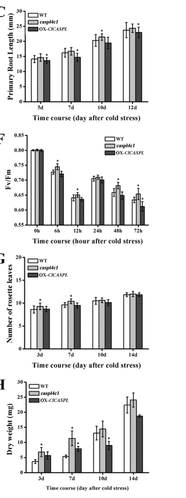

## Question

# Gene Research for Functional Annotation

## ⚠️ CRITICAL: Gene/Protein Identification Context

**BEFORE YOU BEGIN RESEARCH:** You MUST verify you are researching the CORRECT gene/protein. Gene symbols can be ambiguous, especially for less well-characterized genes from non-model organisms.

### Target Gene/Protein Identity (from UniProt):
- **UniProt Accession:** Q9M2U0
- **Protein Description:** RecName: Full=CASP-like protein 4C1; Short=AtCASPL4C1;
- **Gene Information:** OrderedLocusNames=At3g55390; ORFNames=T22E16.50;
- **Organism (full):** Arabidopsis thaliana (Mouse-ear cress).
- **Protein Family:** Belongs to the Casparian strip membrane proteins (CASP)
- **Key Domains:** CASP/CASPL. (IPR006459); CASP_dom. (IPR006702); CASP_dom (PF04535)

### MANDATORY VERIFICATION STEPS:

1. **Check if the gene symbol "CASPL4C1" matches the protein description above**
2. **Verify the organism is correct:** Arabidopsis thaliana (Mouse-ear cress).
3. **Check if protein family/domains align with what you find in literature**
4. **If you find literature for a DIFFERENT gene with the same or similar symbol, STOP**

### If Gene Symbol is Ambiguous or You Cannot Find Relevant Literature:

**DO NOT PROCEED WITH RESEARCH ON A DIFFERENT GENE.** Instead:
- State clearly: "The gene symbol 'CASPL4C1' is ambiguous or literature is limited for this specific protein"
- Explain what you found (e.g., "Found extensive literature on a different gene with the same symbol in a different organism")
- Describe the protein based ONLY on the UniProt information provided above
- Suggest that the protein function can be inferred from domain/family information

### Research Target:

Please provide a comprehensive research report on the gene **CASPL4C1** (gene ID: Q9M2U0, UniProt: Q9M2U0) in ARATH.

The research report should be a detailed narrative explaining the function, biological processes, and localization of the gene product. Citations should be given for all claims.

You should prioritize authoritative reviews and primary scientific literature when conducting research. You can supplement
this with annotations you find in gene/protein databases, but these can be outdated or inaccurate.

We are specifically interested in the primary function of the gene - for enzymes, what reaction is catalyzed, and what is the substrate specificity? For transporters, what is the substrate? For structural proteins or adapters, what is the broader structural role? For signaling molecules, what is the role in the pathway.

We are interested in where in or outside the cell the gene product carries out its function.

We are also interested in the signaling or biochemical pathways in which the gene functions. We are less interested in broad pleiotropic effects, except where these elucidate the precise role.

Include evidence where possible. We are interested in both experimental evidence as well as inference from structure, evolution, or bioinformatic analysis. Precise studies should be prioritized over high-throughput, where available.

## Output

Question: You are an expert researcher providing comprehensive, well-cited information.

Provide detailed information focusing on:
1. Key concepts and definitions with current understanding
2. Recent developments and latest research (prioritize 2023-2024 sources)
3. Current applications and real-world implementations
4. Expert opinions and analysis from authoritative sources
5. Relevant statistics and data from recent studies

Format as a comprehensive research report with proper citations. Include URLs and publication dates where available.
Always prioritize recent, authoritative sources and provide specific citations for all major claims.

# Gene Research for Functional Annotation

## ⚠️ CRITICAL: Gene/Protein Identification Context

**BEFORE YOU BEGIN RESEARCH:** You MUST verify you are researching the CORRECT gene/protein. Gene symbols can be ambiguous, especially for less well-characterized genes from non-model organisms.

### Target Gene/Protein Identity (from UniProt):
- **UniProt Accession:** Q9M2U0
- **Protein Description:** RecName: Full=CASP-like protein 4C1; Short=AtCASPL4C1;
- **Gene Information:** OrderedLocusNames=At3g55390; ORFNames=T22E16.50;
- **Organism (full):** Arabidopsis thaliana (Mouse-ear cress).
- **Protein Family:** Belongs to the Casparian strip membrane proteins (CASP)
- **Key Domains:** CASP/CASPL. (IPR006459); CASP_dom. (IPR006702); CASP_dom (PF04535)

### MANDATORY VERIFICATION STEPS:

1. **Check if the gene symbol "CASPL4C1" matches the protein description above**
2. **Verify the organism is correct:** Arabidopsis thaliana (Mouse-ear cress).
3. **Check if protein family/domains align with what you find in literature**
4. **If you find literature for a DIFFERENT gene with the same or similar symbol, STOP**

### If Gene Symbol is Ambiguous or You Cannot Find Relevant Literature:

**DO NOT PROCEED WITH RESEARCH ON A DIFFERENT GENE.** Instead:
- State clearly: "The gene symbol 'CASPL4C1' is ambiguous or literature is limited for this specific protein"
- Explain what you found (e.g., "Found extensive literature on a different gene with the same symbol in a different organism")
- Describe the protein based ONLY on the UniProt information provided above
- Suggest that the protein function can be inferred from domain/family information

### Research Target:

Please provide a comprehensive research report on the gene **CASPL4C1** (gene ID: Q9M2U0, UniProt: Q9M2U0) in ARATH.

The research report should be a detailed narrative explaining the function, biological processes, and localization of the gene product. Citations should be given for all claims.

You should prioritize authoritative reviews and primary scientific literature when conducting research. You can supplement
this with annotations you find in gene/protein databases, but these can be outdated or inaccurate.

We are specifically interested in the primary function of the gene - for enzymes, what reaction is catalyzed, and what is the substrate specificity? For transporters, what is the substrate? For structural proteins or adapters, what is the broader structural role? For signaling molecules, what is the role in the pathway.

We are interested in where in or outside the cell the gene product carries out its function.

We are also interested in the signaling or biochemical pathways in which the gene functions. We are less interested in broad pleiotropic effects, except where these elucidate the precise role.

Include evidence where possible. We are interested in both experimental evidence as well as inference from structure, evolution, or bioinformatic analysis. Precise studies should be prioritized over high-throughput, where available.

# Comprehensive Research Report: **AtCASPL4C1 / CASP-like protein 4C1** (Arabidopsis thaliana)

## 0) Mandatory identity verification (to avoid symbol ambiguity)

**Target confirmed:** The requested protein corresponds to **Arabidopsis thaliana** *AtCASPL4C1* encoded by **At3g55390** and annotated as **CASP-like protein 4C1** (UniProt **Q9M2U0**). Yang et al. explicitly identify **At3g55390** as “CASP-LIKE PROTEIN 4C1” and study it genetically in Arabidopsis using the T-DNA line **SALK_034800C**. (yang2015acasparianstrip pages 1-2, yang2015acasparianstrip pages 2-3)

**Family/domain consistency check:** The protein is a member of the broader **CASP/CASPL (CASP-like)** family, which sits within a plant-specific branch of the **MARVEL** superfamily and is typically a **4-transmembrane (4TM) topology** protein group. (barbosa2023directedgrowthand pages 1-2, yang2015acasparianstrip pages 2-3)

**Important disambiguation:** Many papers discuss **CASP1–CASP5** (canonical endodermal Casparian strip proteins) or CASPLs in other species; this report focuses only on evidence that directly addresses **Arabidopsis AtCASPL4C1 (At3g55390/Q9M2U0)**, and uses broader CASP/CASPL literature only for **carefully labeled inference/context**. (barbosa2023directedgrowthand pages 3-4, barbosa2023directedgrowthand pages 1-2, yang2015acasparianstrip pages 1-2)

---

## 1) Key concepts and definitions (current understanding)

### 1.1 Casparian strip and the Casparian strip membrane domain (CSD)
The **Casparian strip (CS)** is an aligned, lignin-impregnated cell-wall barrier in the root endodermis that restricts apoplastic diffusion. A specialized adjacent plasma-membrane region termed the **Casparian strip membrane domain (CSD)** is marked by **CASP1–CASP5** proteins in Arabidopsis. (barbosa2023directedgrowthand pages 1-2)

### 1.2 CASPs vs CASPLs
**CASPs (CASP1–5)**: Small 4TM proteins with **strong endodermis-specific expression** that form stable microdomains at the CSD. They contribute to organizing the CS into a continuous lignified band by promoting membrane–cell wall adhesion and creating a local membrane “exclusion zone” for other proteins. (barbosa2023directedgrowthand pages 1-2, barbosa2023directedgrowthand pages 12-13)

**CASPLs (CASP-LIKE proteins)**: A larger Arabidopsis family (described as **~39 members**) related to CASPs (plant MARVEL branch). CASPLs are reported to be expressed in **many cell types** and have been proposed to participate broadly in diverse cell wall modifications (e.g., suberization, abscission zone formation, pathogen-induced lignin deposition), but in at least one focused test, they did **not** compensate for the loss of canonical CASPs in early CS formation. (barbosa2023directedgrowthand pages 13-14, barbosa2023directedgrowthand pages 3-4, barbosa2023directedgrowthand pages 1-2)

### 1.3 What “functional annotation” means for AtCASPL4C1
For AtCASPL4C1, the best-supported functional statements are **phenotype-based** (growth and cold response) rather than enzymatic catalysis or transport: it is a **membrane protein** whose loss-of-function affects **growth dynamics and cold tolerance**, with no clear essential role shown for Casparian strip formation in the studied conditions. (yang2015acasparianstrip pages 3-6, yang2015acasparianstrip pages 6-9, yang2015acasparianstrip pages 1-2)

---

## 2) Gene/protein overview: AtCASPL4C1 (At3g55390; UniProt Q9M2U0)

### 2.1 Predicted protein features (sequence topology)
AtCASPL4C1 is predicted to encode a **4TM membrane protein** (a hallmark of CASP/CASPL family members). Yang et al. report predicted transmembrane helices at approximately **aa 36–56, 78–98, 119–139, and 160–180**. (yang2015acasparianstrip pages 2-3)

### 2.2 Subcellular localization
Direct localization in Yang et al. is shown experimentally for the **watermelon ortholog** (*ClCASPL*) as a **plasma membrane** protein via **ClCASPL–GFP** co-localization with a plasma membrane RFP marker in tobacco, and the authors use this as evidence consistent with plasma-membrane localization for the Arabidopsis ortholog as well. (yang2015acasparianstrip pages 1-2, yang2015acasparianstrip pages 2-3)

**Interpretation:** For *AtCASPL4C1* specifically, the strongest direct evidence in the retrieved sources supports **membrane localization** consistent with CASPL family topology, with experimental PM evidence shown for the ortholog and strong family-level support that CASP/CASPL proteins are 4TM membrane proteins. (barbosa2023directedgrowthand pages 1-2, yang2015acasparianstrip pages 2-3)

---

## 3) Expression patterns and regulation

### 3.1 Broad expression across organs (not endodermis-specific)
Using **promoter–GUS reporters**, *AtCASPL4C1* was reported to be **widely expressed**: signal in **roots (vascular cylinder; absent from root tip)**, emerged **lateral roots**, **leaves**, and multiple **floral organs** (filament, stigma, sepal), and **siliques** (but not seeds). This distinguishes AtCASPL4C1 from canonical endodermal CASPs (CASP1–5), which are more tightly associated with endodermal CSD function. (yang2015acasparianstrip pages 3-6, yang2015acasparianstrip pages 2-3)

### 3.2 Cold inducibility
Yang et al. report *AtCASPL4C1* to be **cold-inducible**, with induction during a time course at **10°C** and a reported transcript peak around **~48 h**. (yang2015acasparianstrip pages 3-6, yang2015acasparianstrip pages 6-9)

**Functional implication:** The observed cold inducibility is consistent with the genetic evidence that AtCASPL4C1 is a **negative regulator of cold tolerance** in the tested experimental systems. (yang2015acasparianstrip pages 6-9, yang2015acasparianstrip pages 1-2)

---

## 4) Experimental functional evidence (Arabidopsis): phenotypes and inferred role

## 4.1 Genetic perturbations used
Yang et al. used:
- A **T-DNA knockout** line for Arabidopsis *AtCASPL4C1* (**SALK_034800C**). (yang2015acasparianstrip pages 1-2, yang2015acasparianstrip pages 2-3)
- **Overexpression** in Arabidopsis of the watermelon ortholog (**OX-ClCASPL**) for functional contrast. (yang2015acasparianstrip pages 1-2, yang2015acasparianstrip pages 2-3)

### 4.2 Growth phenotypes under non-stress conditions
The *AtCASPL4C1* knockout exhibited:
- **Faster growth**, **increased biomass**, and **earlier flowering** relative to wild type (Col-0) and the overexpression condition, with **germination unchanged**. (yang2015acasparianstrip pages 3-6, yang2015acasparianstrip pages 1-2)

The study reports statistical testing and replication: data shown as **means ± SD**, with **n = 20** and significance indicated (e.g., p<0.05, and Tukey test indicated in figure legend). (yang2015acasparianstrip pages 1-2, yang2015acasparianstrip pages 9-10)

### 4.3 Cold tolerance phenotypes
Cold stress designs included:
- **5-day-old seedlings** transferred to 10°C for **7 days** (root-growth phenotyping). (yang2015acasparianstrip pages 6-9, yang2015acasparianstrip pages 9-10)
- **21-day-old plants** subjected to 10°C for **10 days** (soil/substrate phenotypes, leaves, biomass). (yang2015acasparianstrip pages 6-9, yang2015acasparianstrip pages 9-10)

Measured outcomes included:
- **Primary root length**
- **Chlorophyll fluorescence (Fv/Fm)**
- **Number of rosette leaves**
- **Dry weight/biomass**

Across these metrics, the *AtCASPL4C1* knockout showed **improved cold performance** relative to WT, while **OX-ClCASPL** tended to show **greater cold sensitivity**, consistent with AtCASPL4C1 acting as a **negative regulator of cold tolerance** in these assays. (yang2015acasparianstrip pages 6-9, yang2015acasparianstrip pages 1-2, yang2015acasparianstrip media d26b9df8)

**Visual/quantitative figure evidence:** Figure 7 (cropped panels with graphs and photo phenotypes) directly shows the time-course graphs (root length, Fv/Fm, rosette leaves, dry weight) and comparative plant phenotypes under cold treatment for WT vs *AtCASPL4C1* knockout vs OX-ClCASPL. (yang2015acasparianstrip media d26b9df8, yang2015acasparianstrip media 27a8331e, yang2015acasparianstrip media 7b6965b2)

### 4.4 Casparian strip / endodermal barrier involvement (negative or limited evidence)
Despite the CASP-like family membership, *AtCASPL4C1* knockout plants did **not** display significant changes in **Casparian strip formation** in the reported root assays. Yang et al. assessed barrier/CS-related readouts including **propidium iodide (PI)** staining conditions (e.g., 15 µM PI, 10 min on 5-day-old roots) and **lignin staining**, and reported that lignin staining indicative of CS presence was observed in knockout and controls. (yang2015acasparianstrip pages 3-6, yang2015acasparianstrip pages 2-3)

Yang et al. also report transcriptional changes in canonical CS markers: CASP1–CASP5 transcript levels were altered (e.g., **CASP1 increased** in the knockout; and **CASP2–CASP5 increased** in the knockout), consistent with potential compensatory responses or broader network effects, but without an overt CS structural phenotype for this locus under the tested conditions. (yang2015acasparianstrip pages 3-6)

---

## 5) Pathways and mechanistic context (what is supported vs inferred)

### 5.1 Strong, recent mechanistic context: CASPs in microdomain organization (2023)
A 2023 Nature Communications study provides a current mechanistic model for **canonical CASPs (CASP1–5)** in CS assembly. In a full **CASP quintuple knockout**, correctly positioned lignin microdomains can still form, but they are **disorganized** (excessive wall growth; lack of exclusion zone and matrix adhesion; impaired exocyst dynamics) and fail to fuse properly into an uninterrupted strip. (barbosa2023directedgrowthand pages 12-13, barbosa2023directedgrowthand pages 1-2)

Barbosa et al. further propose that CASP microdomains **displace/evict secretory foci** (including exocyst landmarks such as EXO70A1) to drive microdomain fusion into a continuous band, and proximity labeling (CASP1-turboID) identifies trafficking components (including **RabA** GTPases) enriched near CASP domains; dominant-negative RabAs cause a **weak but consistent delay** in barrier formation. (barbosa2023directedgrowthand pages 11-12, barbosa2023directedgrowthand pages 12-13)

### 5.2 CASPLs are not necessarily CASP substitutes in CS formation
In the same 2023 study, multiple CASPLs (not necessarily AtCASPL4C1) were tested for endodermal expression timing and genetic redundancy. Fluorescent CASPL fusions either showed **no endodermal expression** or expression **too late** to explain early lignin microdomains seen in casp mutants, and higher-order **caspQ + multiple caspl** knockouts did **not** exacerbate the caspQ phenotype. This supports an expert interpretation that CASPL proteins can be **functionally distinct** from CASP1–5 in the canonical CS pathway. (barbosa2023directedgrowthand pages 3-4, barbosa2023directedgrowthand pages 13-14)

### 5.3 What pathways does AtCASPL4C1 most likely participate in?
**Supported by direct genetics:** Cold response biology and growth regulation (negative regulation of cold tolerance; negative effect on growth under normal conditions) is the strongest experimentally supported functional axis for AtCASPL4C1 in Arabidopsis. (yang2015acasparianstrip pages 6-9, yang2015acasparianstrip pages 1-2)

**Inferred from family/domain and expression:** Because AtCASPL4C1 is a 4TM CASPL-family membrane protein and broadly expressed (including vascular tissues), it may contribute to **plasma membrane–cell wall microdomain organization** or **cell wall-related responses** outside the canonical endodermal CSD. However, this remains **inference**, not a demonstrated biochemical mechanism for this exact gene in the retrieved literature. (barbosa2023directedgrowthand pages 13-14, yang2015acasparianstrip pages 3-6)

---

## 6) Recent developments and latest research (prioritizing 2023–2024)

### 6.1 2023 (high-authority primary research): microdomain model for CASP function
Barbosa et al. (2023-07, Nature Communications; https://doi.org/10.1038/s41467-023-37265-7) is a key recent advance in mechanistic understanding of **how CASP microdomains organize wall deposition** and integrate with trafficking (RabA/exocyst) during CS formation. Although it does not provide AtCASPL4C1-specific functional annotation, it strongly informs how **CASP/CASPL family topology and microdomain behavior** can translate into barrier formation phenotypes. (barbosa2023directedgrowthand pages 12-13, barbosa2023directedgrowthand pages 11-12, barbosa2023directedgrowthand pages 1-2)

### 6.2 2024: limited Arabidopsis AtCASPL4C1-specific updates in the retrieved corpus
Within the retrieved sources, **no 2023–2024 primary paper was found that specifically functionally characterizes Arabidopsis AtCASPL4C1 (At3g55390/Q9M2U0)** beyond the 2015 study. A 2024 Frontiers in Plant Science paper provides genome-wide CASPL family analysis in **maize** (bioinformatic, not Arabidopsis AtCASPL4C1-specific) and is therefore not used as direct functional evidence for the target locus. (xue2024genomewideidentificationand; not cited here for AtCASPL4C1-specific claims)

**Implication for annotation:** The most up-to-date, high-confidence mechanistic context is driven by **CASP biology (2023)**, while the **gene-specific functional evidence for AtCASPL4C1 remains anchored in the 2015 Arabidopsis genetics study**. (barbosa2023directedgrowthand pages 1-2, yang2015acasparianstrip pages 1-2)

---

## 7) Current applications and real-world implementations

### 7.1 Stress tolerance engineering (cold stress)
Because AtCASPL4C1 loss-of-function is associated with **enhanced cold tolerance** (with improvements across root growth, chlorophyll fluorescence, and biomass measures during cold treatment), the gene is a plausible **candidate target for breeding/engineering cold resilience**, subject to validation across backgrounds and environments. This is supported directly by controlled growth-chamber experiments comparing knockout vs WT vs overexpression conditions. (yang2015acasparianstrip pages 6-9, yang2015acasparianstrip media d26b9df8)

### 7.2 Barrier biology / root function (contextual, not AtCASPL4C1-specific)
CASP microdomain biology is a key component of understanding and potentially manipulating the **root apoplastic barrier** (nutrient/water transport control; pathogen exclusion). However, AtCASPL4C1 itself is reported not to be required for CS formation in the tested assays, suggesting that applications aimed at Casparian strip engineering should focus primarily on **CASP1–5 and upstream regulators** rather than AtCASPL4C1. (yang2015acasparianstrip pages 3-6, barbosa2023directedgrowthand pages 1-2)

---

## 8) Expert interpretation and critical assessment of evidence strength

1. **Best-supported primary function (gene-specific):** AtCASPL4C1 appears to act as a **negative regulator of growth and cold tolerance**, based on Arabidopsis knockout phenotypes and cold-inducible expression. (yang2015acasparianstrip pages 6-9, yang2015acasparianstrip pages 1-2)

2. **Cellular location:** Evidence supports **plasma membrane localization** consistent with CASPL family 4TM topology; the strongest direct experimental localization in the retrieved sources is for the ortholog (ClCASPL-GFP at the plasma membrane), plus strong family-level support for 4TM membrane proteins. (yang2015acasparianstrip pages 2-3, barbosa2023directedgrowthand pages 1-2)

3. **Role in Casparian strip:** AtCASPL4C1 **does not show a strong CS phenotype** in the assays reported by Yang et al., and modern mechanistic studies reinforce that canonical CS formation relies heavily on **CASP1–5**, while tested CASPLs do not readily substitute for CASPs in early CS formation. (yang2015acasparianstrip pages 3-6, barbosa2023directedgrowthand pages 3-4, barbosa2023directedgrowthand pages 1-2)

4. **Evidence limitations:** The Arabidopsis AtCASPL4C1-specific functional literature retrieved here is dominated by a single primary report (2015), while the best 2023 mechanistic study focuses on CASP1–5 and select endodermal CASPLs (not necessarily AtCASPL4C1). Thus, mechanistic claims about AtCASPL4C1 beyond phenotypes should be treated as **hypotheses**. (barbosa2023directedgrowthand pages 3-4, yang2015acasparianstrip pages 3-6)

---

## 9) Summary of relevant statistics and data (from recent and key studies)

- **Replication/statistics in AtCASPL4C1 functional assays:** Yang et al. report phenotyping with **n = 20**, show **means ± SD**, and indicate significance thresholds (e.g., p<0.05; Tukey test indicated in figure legend). (yang2015acasparianstrip pages 1-2, yang2015acasparianstrip pages 9-10)
- **Quantitative cold response readouts:** Figure 7 provides time courses for **primary root length**, **Fv/Fm**, **rosette leaf number**, and **dry weight** under cold stress comparisons among genotypes (WT vs *AtCASPL4C1* vs OX-ClCASPL). (yang2015acasparianstrip media d26b9df8)
- **CASP-proximity labeling and candidate interactors:** Barbosa et al. report CASP1-turboID enrichment including **RabA** GTPases and observe that dominant-negative RabAs cause a **weak but consistent delay** in barrier formation, supporting a trafficking–microdomain coupling model in CS formation. (barbosa2023directedgrowthand pages 11-12)

---

## 10) Evidence summary table

| Claim/Topic | Evidence summary | System/assay | Key quantitative/statistical details (as available) | Source (with year, journal, DOI URL) |
|---|---|---|---|---|
| Target identity and family assignment | AtCASPL4C1 is the Arabidopsis ortholog discussed for At3g55390 and is annotated as CASP-LIKE PROTEIN 4C1; it belongs to the CASP/CASPL family within the plant MARVEL-like superfamily. | Orthology/annotation and phylogenetic analysis | Arabidopsis CASP/CASPL family noted as 39-member UPF0497/CASPL-related set; gene studied via SALK_034800C knockout and ortholog overexpression. (yang2015acasparianstrip pages 1-2, yang2015acasparianstrip pages 2-3) | Yang et al. 2015, *Scientific Reports*, https://doi.org/10.1038/srep14299 |
| Protein topology | AtCASPL4C1 is predicted to encode a four-pass membrane protein, consistent with CASP/CASPL family topology. | Bioinformatic transmembrane prediction | Predicted TM helices at aa 36–56, 78–98, 119–139, and 160–180. (yang2015acasparianstrip pages 2-3) | Yang et al. 2015, *Scientific Reports*, https://doi.org/10.1038/srep14299 |
| Subcellular localization | The watermelon ortholog ClCASPL-GFP co-localized with a plasma-membrane RFP marker; Yang et al. use this to support plasma-membrane localization for the Arabidopsis ortholog AtCASPL4C1. | Transient expression of ClCASPL-GFP in tobacco with PM-RFP co-marker | Localization was exclusive to the plasma membrane in the heterologous assay. (yang2015acasparianstrip pages 1-2, yang2015acasparianstrip pages 2-3) | Yang et al. 2015, *Scientific Reports*, https://doi.org/10.1038/srep14299 |
| Expression pattern | AtCASPL4C1 is broadly expressed rather than root-endodermis-specific: promoter-GUS signal was seen in roots (vascular cylinder, not root tip), emerged lateral roots, leaves, floral organs, and siliques, but not seeds. | Promoter-GUS reporter lines plus in silico expression analysis | Broad organ expression; specifically noted as not root-predominant unlike canonical CASP1-5. (yang2015acasparianstrip pages 3-6, yang2015acasparianstrip pages 2-3) | Yang et al. 2015, *Scientific Reports*, https://doi.org/10.1038/srep14299 |
| Cold inducibility | AtCASPL4C1 transcript and promoter activity are induced by cold stress, supporting a role in cold-response biology. | Cold treatment time course with transcript analysis and GUS staining | Induction reported over 72 h at 10°C, with transcript peak around ~48 h after cold exposure. (yang2015acasparianstrip pages 3-6, yang2015acasparianstrip pages 6-9) | Yang et al. 2015, *Scientific Reports*, https://doi.org/10.1038/srep14299 |
| Knockout growth phenotype under normal conditions | Loss of AtCASPL4C1 increases growth vigor: mutant plants had slightly longer primary roots, faster growth, larger plants, increased biomass, and earlier flowering relative to WT and ClCASPL overexpressors. | SALK T-DNA knockout phenotyping on MS medium and soil | Means ± SD reported; n=20 stated for phenotyping; significance tested (Student's *t*-test in methods/legend, and Tukey test in figure legend). Exact values are figure-based rather than text-extracted. (yang2015acasparianstrip pages 3-6, yang2015acasparianstrip pages 1-2, yang2015acasparianstrip pages 9-10) | Yang et al. 2015, *Scientific Reports*, https://doi.org/10.1038/srep14299 |
| Cold tolerance phenotype | AtCASPL4C1 knockout shows enhanced cold tolerance, whereas overexpression of the watermelon ortholog in Arabidopsis increases cold sensitivity. | Seedling and soil-grown plant cold assays at 10°C; root growth, Fv/Fm, rosette leaf number, dry weight | Assays included 5-day-old seedlings shifted to 10°C for 7 d and 21-day-old plants exposed to 10°C for 10 d; mutant showed longer roots, higher Fv/Fm, more rosette leaves, and greater dry weight than WT/OX lines; statistical significance indicated in figures. (yang2015acasparianstrip pages 6-9, yang2015acasparianstrip pages 1-2, yang2015acasparianstrip pages 9-10, yang2015acasparianstrip media d26b9df8) | Yang et al. 2015, *Scientific Reports*, https://doi.org/10.1038/srep14299 |
| Casparian strip / barrier role of AtCASPL4C1 | Despite family membership, AtCASPL4C1 knockout did not show a significant Casparian strip defect in roots, implying its primary demonstrated role is not essential CS assembly. | PI barrier assay and lignin staining of roots; CASP1-5 transcript checks | PI staining used 15 µM PI for 10 min on 5-day-old roots; lignin staining remained present in WT, mutant, and OX lines; CASP1 increased in knockout and CASP2-5 also increased, suggesting compensatory/redundant transcriptional responses. (yang2015acasparianstrip pages 3-6, yang2015acasparianstrip pages 6-9, yang2015acasparianstrip pages 2-3) | Yang et al. 2015, *Scientific Reports*, https://doi.org/10.1038/srep14299 |
| CASP vs CASPL distinction in Arabidopsis root barrier biology | Canonical CASP1-5 are endodermis-specific, immobile, stable microdomain proteins required to organize proper Casparian strip membrane-wall microdomains; they shape exclusion zones and membrane-wall adhesion but are not strictly required to position initial lignin foci. | Quintuple CASP knockout, microscopy, proximity labeling, barrier and lignin assays | Full CASP knockout caused disorganized, excessively thick lignified foci and impaired exocyst dynamics; CASP1-turboID identified 332 enriched proteins, including RabA GTPases; dominant-negative RabAs caused a weak but reproducible delay in barrier formation. (barbosa2023directedgrowthand pages 12-13, barbosa2023directedgrowthand pages 11-12, barbosa2023directedgrowthand pages 1-2) | Barbosa et al. 2023, *Nature Communications*, https://doi.org/10.1038/s41467-023-37265-7 |
| Evidence that tested CASPLs do not substitute for CASPs in CS formation | Barbosa et al. examined endodermis-expressed CASPLs and found their expression timing/pattern did not explain early CS lignin microdomains; higher-order caspQ plus multiple caspl knockouts were not more severe than caspQ alone. | RNA-seq expression analysis, fluorescent CASPL fusions, undecuple mutant genetics | Seven CASPL1-clade members were examined; a caspQ 6x-caspl mutant showed no stronger phenotype than caspQ, arguing tested CASPLs are functionally distinct from CASPs in CS formation. (barbosa2023directedgrowthand pages 3-4, barbosa2023directedgrowthand pages 13-14) | Barbosa et al. 2023, *Nature Communications*, https://doi.org/10.1038/s41467-023-37265-7 |
| Functional interpretation for AtCASPL4C1 | Current direct evidence supports AtCASPL4C1 as a broadly expressed four-pass plasma-membrane CASPL protein that negatively regulates growth and cold tolerance, with no demonstrated essential role in Arabidopsis Casparian strip formation. | Synthesis of genetic, expression, localization, and barrier assays | Conclusion is based on one Arabidopsis T-DNA mutant study plus family-context work showing CASPLs are generally distinct from canonical CASPs in CS microdomain organization. (yang2015acasparianstrip pages 3-6, yang2015acasparianstrip pages 6-9, barbosa2023directedgrowthand pages 3-4, barbosa2023directedgrowthand pages 1-2) | Yang et al. 2015, *Scientific Reports*, https://doi.org/10.1038/srep14299; Barbosa et al. 2023, *Nature Communications*, https://doi.org/10.1038/s41467-023-37265-7 |

*Table: This table consolidates the key experimental evidence for Arabidopsis AtCASPL4C1 (Q9M2U0/At3g55390), including localization, expression, cold-response phenotypes, and Casparian strip relevance. It also distinguishes the specific role of canonical CASPs from broader CASPL family members using the 2023 CASP microdomain study.*

---

## Key primary sources (URLs; publication dates)

- Barbosa I.C.R. et al. **“Directed growth and fusion of membrane-wall microdomains requires CASP-mediated inhibition and displacement of secretory foci.”** *Nature Communications* (Publication: **2023-07**). DOI URL: https://doi.org/10.1038/s41467-023-37265-7 (barbosa2023directedgrowthand pages 12-13, barbosa2023directedgrowthand pages 11-12, barbosa2023directedgrowthand pages 1-2)

- Yang J. et al. **“A Casparian strip domain-like gene, CASPL, negatively alters growth and cold tolerance.”** *Scientific Reports* (Publication: **2015-09**). DOI URL: https://doi.org/10.1038/srep14299 (yang2015acasparianstrip pages 6-9, yang2015acasparianstrip pages 1-2, yang2015acasparianstrip media d26b9df8)

References

1. (yang2015acasparianstrip pages 1-2): Jinghua Yang, Changqing Ding, Baochen Xu, Cuiting Chen, Reena Narsai, Jim Whelan, Zhongyuan Hu, and Mingfang Zhang. A casparian strip domain-like gene, caspl, negatively alters growth and cold tolerance. Scientific Reports, Sep 2015. URL: https://doi.org/10.1038/srep14299, doi:10.1038/srep14299. This article has 40 citations and is from a peer-reviewed journal.

2. (yang2015acasparianstrip pages 2-3): Jinghua Yang, Changqing Ding, Baochen Xu, Cuiting Chen, Reena Narsai, Jim Whelan, Zhongyuan Hu, and Mingfang Zhang. A casparian strip domain-like gene, caspl, negatively alters growth and cold tolerance. Scientific Reports, Sep 2015. URL: https://doi.org/10.1038/srep14299, doi:10.1038/srep14299. This article has 40 citations and is from a peer-reviewed journal.

3. (barbosa2023directedgrowthand pages 1-2): Inês Catarina Ramos Barbosa, D. De Bellis, Isabelle Flückiger, E. Bellani, Mathieu Grangé-Guerment, Kian Hématy, and N. Geldner. Directed growth and fusion of membrane-wall microdomains requires casp-mediated inhibition and displacement of secretory foci. Nature Communications, Jul 2023. URL: https://doi.org/10.1038/s41467-023-37265-7, doi:10.1038/s41467-023-37265-7. This article has 33 citations and is from a highest quality peer-reviewed journal.

4. (barbosa2023directedgrowthand pages 3-4): Inês Catarina Ramos Barbosa, D. De Bellis, Isabelle Flückiger, E. Bellani, Mathieu Grangé-Guerment, Kian Hématy, and N. Geldner. Directed growth and fusion of membrane-wall microdomains requires casp-mediated inhibition and displacement of secretory foci. Nature Communications, Jul 2023. URL: https://doi.org/10.1038/s41467-023-37265-7, doi:10.1038/s41467-023-37265-7. This article has 33 citations and is from a highest quality peer-reviewed journal.

5. (barbosa2023directedgrowthand pages 12-13): Inês Catarina Ramos Barbosa, D. De Bellis, Isabelle Flückiger, E. Bellani, Mathieu Grangé-Guerment, Kian Hématy, and N. Geldner. Directed growth and fusion of membrane-wall microdomains requires casp-mediated inhibition and displacement of secretory foci. Nature Communications, Jul 2023. URL: https://doi.org/10.1038/s41467-023-37265-7, doi:10.1038/s41467-023-37265-7. This article has 33 citations and is from a highest quality peer-reviewed journal.

6. (barbosa2023directedgrowthand pages 13-14): Inês Catarina Ramos Barbosa, D. De Bellis, Isabelle Flückiger, E. Bellani, Mathieu Grangé-Guerment, Kian Hématy, and N. Geldner. Directed growth and fusion of membrane-wall microdomains requires casp-mediated inhibition and displacement of secretory foci. Nature Communications, Jul 2023. URL: https://doi.org/10.1038/s41467-023-37265-7, doi:10.1038/s41467-023-37265-7. This article has 33 citations and is from a highest quality peer-reviewed journal.

7. (yang2015acasparianstrip pages 3-6): Jinghua Yang, Changqing Ding, Baochen Xu, Cuiting Chen, Reena Narsai, Jim Whelan, Zhongyuan Hu, and Mingfang Zhang. A casparian strip domain-like gene, caspl, negatively alters growth and cold tolerance. Scientific Reports, Sep 2015. URL: https://doi.org/10.1038/srep14299, doi:10.1038/srep14299. This article has 40 citations and is from a peer-reviewed journal.

8. (yang2015acasparianstrip pages 6-9): Jinghua Yang, Changqing Ding, Baochen Xu, Cuiting Chen, Reena Narsai, Jim Whelan, Zhongyuan Hu, and Mingfang Zhang. A casparian strip domain-like gene, caspl, negatively alters growth and cold tolerance. Scientific Reports, Sep 2015. URL: https://doi.org/10.1038/srep14299, doi:10.1038/srep14299. This article has 40 citations and is from a peer-reviewed journal.

9. (yang2015acasparianstrip pages 9-10): Jinghua Yang, Changqing Ding, Baochen Xu, Cuiting Chen, Reena Narsai, Jim Whelan, Zhongyuan Hu, and Mingfang Zhang. A casparian strip domain-like gene, caspl, negatively alters growth and cold tolerance. Scientific Reports, Sep 2015. URL: https://doi.org/10.1038/srep14299, doi:10.1038/srep14299. This article has 40 citations and is from a peer-reviewed journal.

10. (yang2015acasparianstrip media d26b9df8): Jinghua Yang, Changqing Ding, Baochen Xu, Cuiting Chen, Reena Narsai, Jim Whelan, Zhongyuan Hu, and Mingfang Zhang. A casparian strip domain-like gene, caspl, negatively alters growth and cold tolerance. Scientific Reports, Sep 2015. URL: https://doi.org/10.1038/srep14299, doi:10.1038/srep14299. This article has 40 citations and is from a peer-reviewed journal.

11. (yang2015acasparianstrip media 27a8331e): Jinghua Yang, Changqing Ding, Baochen Xu, Cuiting Chen, Reena Narsai, Jim Whelan, Zhongyuan Hu, and Mingfang Zhang. A casparian strip domain-like gene, caspl, negatively alters growth and cold tolerance. Scientific Reports, Sep 2015. URL: https://doi.org/10.1038/srep14299, doi:10.1038/srep14299. This article has 40 citations and is from a peer-reviewed journal.

12. (yang2015acasparianstrip media 7b6965b2): Jinghua Yang, Changqing Ding, Baochen Xu, Cuiting Chen, Reena Narsai, Jim Whelan, Zhongyuan Hu, and Mingfang Zhang. A casparian strip domain-like gene, caspl, negatively alters growth and cold tolerance. Scientific Reports, Sep 2015. URL: https://doi.org/10.1038/srep14299, doi:10.1038/srep14299. This article has 40 citations and is from a peer-reviewed journal.

13. (barbosa2023directedgrowthand pages 11-12): Inês Catarina Ramos Barbosa, D. De Bellis, Isabelle Flückiger, E. Bellani, Mathieu Grangé-Guerment, Kian Hématy, and N. Geldner. Directed growth and fusion of membrane-wall microdomains requires casp-mediated inhibition and displacement of secretory foci. Nature Communications, Jul 2023. URL: https://doi.org/10.1038/s41467-023-37265-7, doi:10.1038/s41467-023-37265-7. This article has 33 citations and is from a highest quality peer-reviewed journal.

## Artifacts

- [Edison artifact artifact-00](CASPL4C1-deep-research-falcon_artifacts/artifact-00.md)

## Citations

1. barbosa2023directedgrowthand pages 1-2
2. yang2015acasparianstrip pages 2-3
3. yang2015acasparianstrip pages 3-6
4. barbosa2023directedgrowthand pages 11-12
5. yang2015acasparianstrip pages 1-2
6. barbosa2023directedgrowthand pages 3-4
7. barbosa2023directedgrowthand pages 12-13
8. barbosa2023directedgrowthand pages 13-14
9. yang2015acasparianstrip pages 6-9
10. yang2015acasparianstrip pages 9-10
11. https://doi.org/10.1038/s41467-023-37265-7
12. https://doi.org/10.1038/srep14299
13. https://doi.org/10.1038/srep14299;
14. https://doi.org/10.1038/srep14299,
15. https://doi.org/10.1038/s41467-023-37265-7,