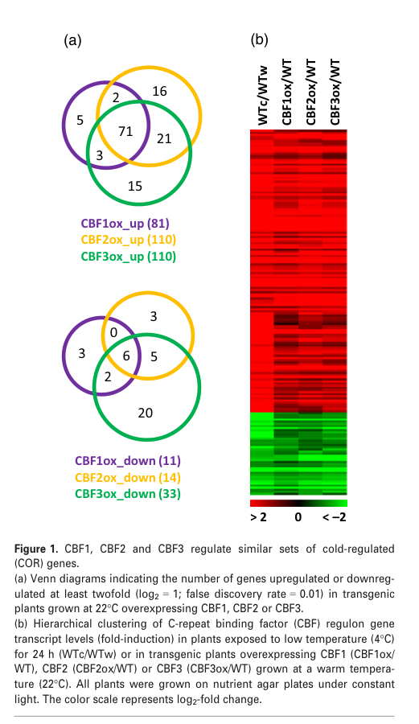

## Question

# Gene Research for Functional Annotation

## ⚠️ CRITICAL: Gene/Protein Identification Context

**BEFORE YOU BEGIN RESEARCH:** You MUST verify you are researching the CORRECT gene/protein. Gene symbols can be ambiguous, especially for less well-characterized genes from non-model organisms.

### Target Gene/Protein Identity (from UniProt):
- **UniProt Accession:** P93835
- **Protein Description:** RecName: Full=Dehydration-responsive element-binding protein 1B {ECO:0000303|PubMed:9707537}; Short=Protein DREB1B {ECO:0000303|PubMed:9707537}; AltName: Full=C-repeat/dehydration-responsive element-binding factor 1 {ECO:0000303|PubMed:9023378}; Short=C-repeat-binding factor 1 {ECO:0000303|PubMed:9023378}; Short=CRT/DRE-binding factor 1 {ECO:0000303|PubMed:9023378};
- **Gene Information:** Name=DREB1B {ECO:0000303|PubMed:9707537}; Synonyms=CBF1 {ECO:0000303|PubMed:9023378}, ERF029 {ECO:0000303|PubMed:16407444}; OrderedLocusNames=At4g25490 {ECO:0000312|Araport:AT4G25490}; ORFNames=M7J2.140 {ECO:0000312|EMBL:CAA18177.1};
- **Organism (full):** Arabidopsis thaliana (Mouse-ear cress).
- **Protein Family:** Belongs to the AP2/ERF transcription factor family. ERF
- **Key Domains:** AP2/ERF_dom. (IPR001471); AP2/ERF_dom_sf. (IPR036955); DNA-bd_dom_sf. (IPR016177); DRE1A-I. (IPR045277); AP2 (PF00847)

### MANDATORY VERIFICATION STEPS:

1. **Check if the gene symbol "DREB1B" matches the protein description above**
2. **Verify the organism is correct:** Arabidopsis thaliana (Mouse-ear cress).
3. **Check if protein family/domains align with what you find in literature**
4. **If you find literature for a DIFFERENT gene with the same or similar symbol, STOP**

### If Gene Symbol is Ambiguous or You Cannot Find Relevant Literature:

**DO NOT PROCEED WITH RESEARCH ON A DIFFERENT GENE.** Instead:
- State clearly: "The gene symbol 'DREB1B' is ambiguous or literature is limited for this specific protein"
- Explain what you found (e.g., "Found extensive literature on a different gene with the same symbol in a different organism")
- Describe the protein based ONLY on the UniProt information provided above
- Suggest that the protein function can be inferred from domain/family information

### Research Target:

Please provide a comprehensive research report on the gene **DREB1B** (gene ID: CBF1, UniProt: P93835) in ARATH.

The research report should be a detailed narrative explaining the function, biological processes, and localization of the gene product. Citations should be given for all claims.

You should prioritize authoritative reviews and primary scientific literature when conducting research. You can supplement
this with annotations you find in gene/protein databases, but these can be outdated or inaccurate.

We are specifically interested in the primary function of the gene - for enzymes, what reaction is catalyzed, and what is the substrate specificity? For transporters, what is the substrate? For structural proteins or adapters, what is the broader structural role? For signaling molecules, what is the role in the pathway.

We are interested in where in or outside the cell the gene product carries out its function.

We are also interested in the signaling or biochemical pathways in which the gene functions. We are less interested in broad pleiotropic effects, except where these elucidate the precise role.

Include evidence where possible. We are interested in both experimental evidence as well as inference from structure, evolution, or bioinformatic analysis. Precise studies should be prioritized over high-throughput, where available.

## Output

Question: You are an expert researcher providing comprehensive, well-cited information.

Provide detailed information focusing on:
1. Key concepts and definitions with current understanding
2. Recent developments and latest research (prioritize 2023-2024 sources)
3. Current applications and real-world implementations
4. Expert opinions and analysis from authoritative sources
5. Relevant statistics and data from recent studies

Format as a comprehensive research report with proper citations. Include URLs and publication dates where available.
Always prioritize recent, authoritative sources and provide specific citations for all major claims.

# Gene Research for Functional Annotation

## ⚠️ CRITICAL: Gene/Protein Identification Context

**BEFORE YOU BEGIN RESEARCH:** You MUST verify you are researching the CORRECT gene/protein. Gene symbols can be ambiguous, especially for less well-characterized genes from non-model organisms.

### Target Gene/Protein Identity (from UniProt):
- **UniProt Accession:** P93835
- **Protein Description:** RecName: Full=Dehydration-responsive element-binding protein 1B {ECO:0000303|PubMed:9707537}; Short=Protein DREB1B {ECO:0000303|PubMed:9707537}; AltName: Full=C-repeat/dehydration-responsive element-binding factor 1 {ECO:0000303|PubMed:9023378}; Short=C-repeat-binding factor 1 {ECO:0000303|PubMed:9023378}; Short=CRT/DRE-binding factor 1 {ECO:0000303|PubMed:9023378};
- **Gene Information:** Name=DREB1B {ECO:0000303|PubMed:9707537}; Synonyms=CBF1 {ECO:0000303|PubMed:9023378}, ERF029 {ECO:0000303|PubMed:16407444}; OrderedLocusNames=At4g25490 {ECO:0000312|Araport:AT4G25490}; ORFNames=M7J2.140 {ECO:0000312|EMBL:CAA18177.1};
- **Organism (full):** Arabidopsis thaliana (Mouse-ear cress).
- **Protein Family:** Belongs to the AP2/ERF transcription factor family. ERF
- **Key Domains:** AP2/ERF_dom. (IPR001471); AP2/ERF_dom_sf. (IPR036955); DNA-bd_dom_sf. (IPR016177); DRE1A-I. (IPR045277); AP2 (PF00847)

### MANDATORY VERIFICATION STEPS:

1. **Check if the gene symbol "DREB1B" matches the protein description above**
2. **Verify the organism is correct:** Arabidopsis thaliana (Mouse-ear cress).
3. **Check if protein family/domains align with what you find in literature**
4. **If you find literature for a DIFFERENT gene with the same or similar symbol, STOP**

### If Gene Symbol is Ambiguous or You Cannot Find Relevant Literature:

**DO NOT PROCEED WITH RESEARCH ON A DIFFERENT GENE.** Instead:
- State clearly: "The gene symbol 'DREB1B' is ambiguous or literature is limited for this specific protein"
- Explain what you found (e.g., "Found extensive literature on a different gene with the same symbol in a different organism")
- Describe the protein based ONLY on the UniProt information provided above
- Suggest that the protein function can be inferred from domain/family information

### Research Target:

Please provide a comprehensive research report on the gene **DREB1B** (gene ID: CBF1, UniProt: P93835) in ARATH.

The research report should be a detailed narrative explaining the function, biological processes, and localization of the gene product. Citations should be given for all claims.

You should prioritize authoritative reviews and primary scientific literature when conducting research. You can supplement
this with annotations you find in gene/protein databases, but these can be outdated or inaccurate.

We are specifically interested in the primary function of the gene - for enzymes, what reaction is catalyzed, and what is the substrate specificity? For transporters, what is the substrate? For structural proteins or adapters, what is the broader structural role? For signaling molecules, what is the role in the pathway.

We are interested in where in or outside the cell the gene product carries out its function.

We are also interested in the signaling or biochemical pathways in which the gene functions. We are less interested in broad pleiotropic effects, except where these elucidate the precise role.

Include evidence where possible. We are interested in both experimental evidence as well as inference from structure, evolution, or bioinformatic analysis. Precise studies should be prioritized over high-throughput, where available.

## Research report: Arabidopsis thaliana DREB1B/CBF1 (UniProt P93835; At4g25490)

### 1) Target verification (critical identity check)
The UniProt accession **P93835** corresponds to **Arabidopsis thaliana** **Dehydration-responsive element-binding protein 1B (DREB1B)**, also known as **C-repeat-binding factor 1 (CBF1)**, and to the locus **At4g25490**. Classic primary literature explicitly identifies **CBF1/DREB1B** as a ~24 kDa **AP2/ERF-family transcription factor** that binds the **CRT/DRE** promoter element; it resides in the tandem **CBF gene cluster** (CBF1/CBF2/CBF3 = DREB1B/DREB1C/DREB1A) that is a canonical Arabidopsis cold-response module. This matches the provided UniProt description and domain expectations (AP2 DNA-binding domain, activation region, putative NLS). (stockinger1997arabidopsisthalianacbf1 pages 1-2, gilmour1998lowtemperatureregulation pages 1-2, kanaya1999characterizationofthe pages 1-2)

### 2) Key concepts and definitions (current understanding)

#### 2.1 DREB/CBF transcription factors and the CRT/DRE cis-element
DREB1/CBF proteins are **AP2/ERF-domain** transcription factors that recognize **dehydration-responsive element/C-repeat (DRE/CRT)** motifs in promoters of stress-inducible genes, thereby converting temperature/dehydration signals into transcriptional programs. Arabidopsis CBF1 is experimentally established as a **sequence-specific transcriptional activator** of CRT/DRE-containing promoters. (fowler2002arabidopsistranscriptomeprofiling pages 1-2, gilmour1998lowtemperatureregulation pages 1-2)

At the molecular level, recombinant CBF1 binds the CRT/DRE sequence by gel-shift assays, with the **core recognition sequence reported as CCGAC**; competition assays show wild-type CRT/DRE oligonucleotides from COR promoters compete for binding whereas mutant CRT/DRE sequences do not, demonstrating specificity. (stockinger1997arabidopsisthalianacbf1 pages 1-2, stockinger1997arabidopsisthalianacbf1 pages 4-5)

#### 2.2 The ICE–CBF–COR cascade
The dominant conceptual framework for Arabidopsis cold acclimation is the **ICE1–CBF–COR cascade**, in which upstream cold signaling activates transcription of CBF genes; CBFin turn drives a downstream set of **cold-regulated (COR)** genes (often encoding protective proteins such as LEA-like proteins and enzymes affecting osmolyte metabolism), increasing freezing tolerance. Modern reviews emphasize that this cascade is embedded in a larger, highly interconnected “first-wave TF” network rather than being a single linear pathway. (kim2024regulatorynetworksin pages 7-8, park2015regulationofthe pages 1-2)

### 3) Molecular function of DREB1B/CBF1

#### 3.1 Molecular activity: sequence-specific DNA binding and transcriptional activation
CBF1 encodes an AP2-domain transcriptional activator that binds CRT/DRE motifs and can activate CRT/DRE-containing reporters in heterologous assays (yeast), supporting that it acts as a bona fide transcriptional activator rather than merely binding DNA. (stockinger1997arabidopsisthalianacbf1 pages 1-2, gilmour1998lowtemperatureregulation pages 1-2)

Protein feature mapping supports a mechanistic architecture compatible with transcriptional regulation: an AP2 DNA-binding domain, a region consistent with a **nuclear localization sequence**, and an **acidic activation region** (consistent with transcriptional activation domains in many TFs). (stockinger1997arabidopsisthalianacbf1 pages 1-2, kanaya1999characterizationofthe pages 1-2)

#### 3.2 Chromatin/cofactor recruitment (mechanistic regulation of transcription)
CBF1-mediated gene activation is supported by evidence that it can engage chromatin-modifying coactivators. Stockinger et al. (2001) report physical interaction (in vitro pull-down) between CBF1 and Arabidopsis homologs of **Ada/SAGA-like complex** components **ADA2a/ADA2b** and **GCN5** (a histone acetyltransferase). This provides a mechanistic basis for how a sequence-specific TF like CBF1 can promote transcriptional activation via chromatin acetylation. (stockinger2001transcriptionaladaptorand pages 8-9, stockinger2001transcriptionaladaptorand pages 1-2)

### 4) Biological processes, pathways, and regulatory network context

#### 4.1 Cold acclimation and freezing tolerance
CBF1 is a core regulator of **cold acclimation**. In classic cold-response studies, CBF-family transcripts rise rapidly following cold shift (minutes), and COR gene expression follows within hours; transcriptome profiling shows the CBF module contributes substantially but does not account for all cold-induced changes, indicating additional low-temperature regulons. (gilmour1998lowtemperatureregulation pages 1-2, fowler2002arabidopsistranscriptomeprofiling pages 1-2)

Quantitatively, Fowler & Thomashow (2002) identified **306 cold-responsive genes** (≥3-fold change at one or more time points during a 7-day cold acclimation time course; **218 upregulated**, **88 downregulated**). Only **~12%** of those cold-responsive genes were “certain members of the CBF regulon,” and **≥28%** were not regulated by CBF transcription factors, underscoring that CBF1 is a major driver but one component of a broader network. (fowler2002arabidopsistranscriptomeprofiling pages 1-2)

Park et al. (2015) further emphasize that CBF1/2/3 regulate **a regulon of >100 genes** and that the low-temperature regulatory network is highly interconnected with other first-wave TF regulons, meaning that “CBF targets” and cold-induced genes overlap with other regulatory programs. Their figures summarize overlap among CBF1/CBF2/CBF3 regulons and provide a network schematic of interactions among early cold-induced regulators. (park2015regulationofthe pages 1-2, park2015regulationofthe media 5e0e9233, park2015regulationofthe media 71e17a06)

Physiologically, genetic perturbation demonstrates that CBF1 (with closely related CBFs) contributes materially to freezing tolerance: antisense downregulation of **CBF1 and CBF3** reduces cold-induced freezing tolerance by about **60%** (i.e., substantial but incomplete contribution), consistent with the existence of CBF-independent modules. (park2015regulationofthe pages 1-2)

#### 4.2 Drought/water-deficit relevance
The CRT/DRE element is a shared regulatory node for cold- and dehydration-responsive gene expression, and CBF/DREB-type factors are widely used to connect these stress responses. Arabidopsis CBF1 was initially described as binding a cis-element that stimulates transcription in response to **low temperature and water deficit**, with CRT/DRE present in promoters of genes responsive to both stresses (e.g., COR15a and COR78/RD29A). (stockinger1997arabidopsisthalianacbf1 pages 1-2, stockinger1997arabidopsisthalianacbf1 pages 4-5)

At the network level, modern synthesis highlights that constitutive expression of DREB1/CBF genes can activate **hundreds of cold- and drought-responsive genes**, but also commonly causes growth trade-offs—critical for interpreting phenotypes and applications. (kim2024regulatorynetworksin pages 7-8)

#### 4.3 Upstream regulation (selected authoritative mechanisms)
Recent reviews (2024) and prior mechanistic work converge on multi-layer control of CBF1 transcription (and the CBF module):

* **ICE1-centered control and PTMs:** ICE1 is emphasized as a major upstream regulator of CBF transcription, with control by ubiquitin-mediated degradation and SUMOylation and kinase signaling (review synthesis). (agarwal2017dehydrationresponsiveelement pages 4-5, zhang2025molecularnetworksgoverning pages 12-14)
* **CAMTA transcription factors:** CAMTAs recognize promoter motifs (e.g., CGCG/CM-related motifs in reviews) and strongly upregulate **DREB1B/CBF1** and **DREB1C/CBF2**, with roles depending on the nature of cold onset (rapid vs gradual cooling). (kim2024regulatorynetworksin pages 7-8)
* **Clock/circadian regulators:** The DREB1 genes are under circadian influence and are regulated by clock-associated MYB-like TFs; this helps explain time-of-day–dependent cold responsiveness. (kim2024regulatorynetworksin pages 7-8, agarwal2017dehydrationresponsiveelement pages 4-5)

#### 4.4 Noncoding RNA regulation (major 2024 development)
A key recent development is detailed mechanistic synthesis of the **SVALKA (SVK)** cis-natural antisense lncRNA system, which fine-tunes CBF module output over time during cold exposure. The 2024 review summarizes experimentally supported mechanisms in which:

* At **22 °C**, the polyadenylated SVK-L isoform can form dsRNA with CBF1 mRNA, leading to **DICER-LIKE processing** and **AGO1/RISC loading**, decreasing CBF1 mRNA half-life without altering transcription.
* At **4 °C**, SVK-S accumulates (review reports maximal expression beginning ~**4 h** and peaking/plateauing **8–12 h**) and can drive **RNA polymerase II collision** on the CBF1 locus, producing premature termination and subsequent exosome-mediated decay.

Genetic perturbations (svk-1, uns-1 mutants) show increased CBF1 levels upon cold exposure, while SVK overexpression lowers CBF1, supporting a negative-feedback or buffering role in shaping the temporal dynamics of the cold response. (kiger2024svalkaalong pages 2-4)

### 5) Subcellular localization
Direct imaging evidence for CBF1 localization was not retrieved in the accessible primary-text excerpts here; however, multiple primary sources identify a **putative nuclear localization sequence** in the protein sequence, consistent with its function as a transcription factor acting on nuclear DNA. (stockinger1997arabidopsisthalianacbf1 pages 1-2, kanaya1999characterizationofthe pages 1-2)

### 6) Downstream targets, regulon characteristics, and quantitative statistics
CBF1 activates classic COR/LEA-type genes with CRT/DRE elements, including **COR15a** and **COR78/RD29A**, and additional CRT/DRE-containing genes such as **COR47** and **COR6.6/KIN2** referenced in mechanistic work on the regulon. (stockinger1997arabidopsisthalianacbf1 pages 4-5, stockinger2001transcriptionaladaptorand pages 1-2)

Key quantitative points from transcriptome and network studies include:

* **306** cold-responsive genes detected (≥3-fold; 7-day acclimation time series; 218 up / 88 down). (fowler2002arabidopsistranscriptomeprofiling pages 1-2)
* Only **~12%** of cold-responsive genes are “certain” CBF regulon members; **≥28%** are not CBF-regulated, indicating major CBF-independent cold pathways. (fowler2002arabidopsistranscriptomeprofiling pages 1-2)
* CBF1/2/3 regulons comprise **>100 genes**; CBF activity yields partial but not total freezing tolerance. (park2015regulationofthe pages 1-2)

The Park et al. (2015) figures provide a compact visualization of overlap among CBF1/CBF2/CBF3 regulons and a schematic of the cold transcriptional network. (park2015regulationofthe media 5e0e9233, park2015regulationofthe media 71e17a06)

### 7) Current applications and real-world implementations

#### 7.1 Transgenic engineering of stress tolerance
A well-established translational use of Arabidopsis CBF1 is heterologous expression in crops to improve stress tolerance. For example, **tomato plants ectopically expressing Arabidopsis CBF1** were engineered using a 35S-driven transgene cassette and showed **enhanced resistance to water deficit stress**, demonstrating cross-species utility of the transcriptional program controlled by CBF1. (hsieh2002tomatoplantsectopically; Oct 2002; https://doi.org/10.1104/pp.006783) (haake2002transcriptionfactorcbf4 pages 1-2)

#### 7.2 Implementation caveats (expert synthesis)
Authoritative reviews stress that while DREB1/CBF transgenes can boost abiotic stress tolerance, constitutive activation often entails **growth penalties** through repression of growth-related genes and resource reallocation; thus, practical implementation increasingly emphasizes **tissue-/stress-inducible promoters, temporal control, or tuning network components** rather than continuous overexpression. (kim2024regulatorynetworksin pages 7-8, agarwal2017dehydrationresponsiveelement pages 4-5)

### 8) Expert opinion and analysis (authoritative synthesis)
Recent authoritative reviews in high-quality venues frame DREB1B/CBF1 as a central node that integrates diverse upstream inputs (calcium, kinases, circadian/clock state, ROS signaling, and transcriptional regulators) into a transcriptional output that includes both protective proteins and metabolic reprogramming. The same reviews emphasize that cold acclimation is not explained by the CBF pathway alone—CBF-independent regulons and “first-wave TF” interactions materially shape outcomes, consistent with transcriptome statistics and network analyses from foundational studies. (kim2024regulatorynetworksin pages 7-8, fowler2002arabidopsistranscriptomeprofiling pages 1-2, park2015regulationofthe pages 1-2)

### Evidence map table
The following table consolidates key functional-annotation facts (identity → mechanism → regulators → targets → phenotypes → applications) with direct citations.

| Category | Key findings | Best supporting citations |
|---|---|---|
| Identity/domains | Verified target is **Arabidopsis thaliana DREB1B/CBF1 = At4g25490 = UniProt P93835**, one of three tandem **CBF1/CBF2/CBF3 (DREB1B/DREB1C/DREB1A)** genes on chromosome 4. Protein is ~24 kDa, in the **AP2/ERF family**, with a single **AP2 DNA-binding domain**, a **putative nuclear localization sequence**, and a **C-terminal acidic activation domain**. | (stockinger1997arabidopsisthalianacbf1 pages 1-2, kanaya1999characterizationofthe pages 1-2, gilmour1998lowtemperatureregulation pages 1-2) |
| DNA-binding specificity | CBF1 is a **transcriptional activator** that binds the **CRT/DRE** cis-element in cold/dehydration-responsive promoters; core recognition sequence reported as **CCGAC**, with the RD29A DRE example **TACCGACCT**. Binding is sequence-specific: wild-type COR15a/COR78 CRT-DRE probes compete, mutant probes do not. | (stockinger1997arabidopsisthalianacbf1 pages 1-2, kanaya1999characterizationofthe pages 1-2, stockinger1997arabidopsisthalianacbf1 pages 4-5) |
| Induction kinetics | Foundational work reported little detectable change in CBF1 mRNA in some early assays, but later definitive work showed the **CBF family transcripts increase within ~15 min after cold transfer**, while **COR target transcripts accumulate by ~2 h**. Recent synthesis places **CBF1 peak around ~4 h** during cold exposure, with upstream **ICE** activity peaking earlier (**~1–3 h**). | (stockinger1997arabidopsisthalianacbf1 pages 1-2, fowler2002arabidopsistranscriptomeprofiling pages 1-2, gilmour1998lowtemperatureregulation pages 1-2, kiger2024svalkaalong pages 2-4) |
| Upstream regulation | Canonical pathway is **ICE1–CBF–COR**. **ICE1** directly activates CBF genes; its stability/activity are modulated by **HOS1**-mediated ubiquitination, **SIZ1**-mediated SUMOylation, **OST1** phosphorylation, and MAPK signaling. **CAMTA** factors strongly promote rapid CBF induction; **MYB15** represses CBFs; circadian/clock regulators (**RVE4/RVE8, CCA1/LHY, PIF7**) shape timing and amplitude of DREB1B expression. | (kim2024regulatorynetworksin pages 7-8, agarwal2017dehydrationresponsiveelement pages 4-5, zhang2025molecularnetworksgoverning pages 12-14, bolt2017functionalandmolecular pages 26-28) |
| Downstream targets/regulon | CBF1 activates **COR/RD/LTI/KIN/LEA-type** genes including **COR15a, COR78/RD29A, COR47, COR6.6/KIN2**. Overexpression of CBF genes induces a regulon of **~100+ genes**; transcriptome profiling identified **306 cold-responsive genes** total (**218 up, 88 down; ≥3-fold**), with only **~12%** being certain CBF regulon members and **≥28%** not regulated by CBFs, showing CBF1 is major but not exclusive in cold acclimation. Antisense reduction of CBF1/CBF3 decreased cold-induced freezing tolerance by **~60%**. | (park2015regulationofthe pages 1-2, fowler2002arabidopsistranscriptomeprofiling pages 1-2, stockinger2001transcriptionaladaptorand pages 1-2) |
| Chromatin/cofactor interactions | CBF1 transcriptional activation depends partly on recruitment of **Ada/SAGA-like chromatin-modifying complexes**. In yeast and in vitro interaction assays, CBF1 function requires/interacts with **GCN5, ADA2, ADA3**; Arabidopsis **atGCN5** has HAT activity and interacts with **ADA2a/ADA2b**, while CBF1 physically associates with Arabidopsis GCN5/ADA2 proteins. | (stockinger2001transcriptionaladaptorand pages 8-9, stockinger2001transcriptionaladaptorand pages 1-2) |
| Noncoding RNA regulation | The **SVALKA (SVK)** cis-natural antisense lncRNA fine-tunes **CBF1** and **CBF3** during cold. At **22 °C**, **SVK-L** forms dsRNA with CBF1 and promotes **DICER/AGO1**-mediated destabilization. At **4 °C**, **SVK-S** rises beginning around **~4 h** and peaks at **~8–12 h**, causing antisense/sense **RNAPII collision** and premature CBF1 termination; by **~24 h** it helps recruit **PRC2/CLF** to silence **CBF3** via **H3K27me3**. **svk-1** and **uns-1** mutants show increased CBF1 during cold. | (kiger2024svalkaalong pages 2-4) |
| Physiological outcomes | Constitutive expression of CBF1 or related CBFs induces COR genes even without cold and enhances **freezing tolerance**; broader DREB1/CBF overexpression also improves **drought** and sometimes **salt** tolerance. CBF-driven acclimation is associated with higher **proline** and **soluble sugars** (including **sucrose, raffinose, glucose, fructose**). Overexpression can also repress growth-related genes and cause growth penalties. | (haake2002transcriptionfactorcbf4 pages 1-2, park2015regulationofthe pages 1-2, fowler2002arabidopsistranscriptomeprofiling pages 1-2, kim2024regulatorynetworksin pages 7-8) |
| Applications | Arabidopsis **CBF1/DREB1B** has been used as a stress-engineering transgene in crops: ectopic expression in **tomato** improved resistance to **water deficit**, and broader literature documents enhanced freezing/chilling tolerance in heterologous systems. Current reviews frame DREB1B/CBF1 as a core engineering target, but emphasize balancing stress tolerance with growth costs and using regulated expression strategies rather than constitutive overexpression. | (haake2002transcriptionfactorcbf4 pages 1-2, agarwal2017dehydrationresponsiveelement pages 4-5, kim2024regulatorynetworksin pages 7-8) |

*Table: This table summarizes the main experimentally supported functional-annotation points for Arabidopsis DREB1B/CBF1, including identity, molecular mechanism, regulatory network, and applied use. It is designed as a compact evidence map with quantitative details and direct context-ID citations.*

### Key references (publication date, URL)
* Stockinger EJ et al. **1997-02**. *PNAS*: “CBF1 encodes an AP2 domain-containing transcriptional activator that binds the C-repeat/DRE…” https://doi.org/10.1073/pnas.94.3.1035 (stockinger1997arabidopsisthalianacbf1 pages 1-2)
* Gilmour SJ et al. **1998-11**. *Plant Journal*: “Low temperature regulation of the Arabidopsis CBF family…” https://doi.org/10.1046/j.1365-313x.1998.00310.x (gilmour1998lowtemperatureregulation pages 1-2)
* Stockinger E et al. **2001-04**. *Nucleic Acids Research*: CBF1 interactions with GCN5/ADA2 and chromatin activation mechanisms. https://doi.org/10.1093/nar/29.7.1524 (stockinger2001transcriptionaladaptorand pages 8-9)
* Fowler S, Thomashow MF. **2002-08**. *Plant Cell*: cold acclimation transcriptome; 306 cold-responsive genes. https://doi.org/10.1105/tpc.003483 (fowler2002arabidopsistranscriptomeprofiling pages 1-2)
* Park S et al. **2015-04**. *Plant Journal*: complexity of CBF regulon/network; figures summarizing regulons and network. https://doi.org/10.1111/tpj.12796 (park2015regulationofthe pages 1-2, park2015regulationofthe media 5e0e9233, park2015regulationofthe media 71e17a06)
* Kim J-S et al. **2024-03**. *Plant Physiology* review: drought/cold regulatory networks and DREB1B/CBF1 placement. https://doi.org/10.1093/plphys/kiae105 (kim2024regulatorynetworksin pages 7-8)
* Qian Z et al. **2024-11**. *Frontiers in Plant Science* review: cold stress response overview including DREB1B/CBF1 context. https://doi.org/10.3389/fpls.2024.1443317 (qian2024understandingcoldstress pages 8-9)
* Kiger NM, Schroeder SJ. **2024-11**. *Non-Coding RNA* review: SVALKA regulation of CBF1/CBF3 with timing details. https://doi.org/10.3390/ncrna10060059 (kiger2024svalkaalong pages 2-4)

### Limitations of retrieved evidence
Within the retrieved excerpts, direct experimental subcellular localization (e.g., CBF1–GFP nuclear imaging) was not captured, so localization is supported here primarily by sequence/feature inference (putative NLS) and TF function rather than a dedicated localization assay. (stockinger1997arabidopsisthalianacbf1 pages 1-2, kanaya1999characterizationofthe pages 1-2)

References

1. (stockinger1997arabidopsisthalianacbf1 pages 1-2): Eric J. Stockinger, Sarah J. Gilmour, and Michael F. Thomashow. Arabidopsis thaliana cbf1 encodes an ap2 domain-containing transcriptional activator that binds to the c-repeat/dre, a cis-acting dna regulatory element that stimulates transcription in response to low temperature and water deficit. Proceedings of the National Academy of Sciences of the United States of America, 94 3:1035-40, Feb 1997. URL: https://doi.org/10.1073/pnas.94.3.1035, doi:10.1073/pnas.94.3.1035. This article has 2499 citations and is from a highest quality peer-reviewed journal.

2. (gilmour1998lowtemperatureregulation pages 1-2): S. J. Gilmour, D. Zarka, E. Stockinger, Maite P. Salazar, Jaimie M. Houghton, and M. Thomashow. Low temperature regulation of the arabidopsis cbf family of ap2 transcriptional activators as an early step in cold-induced cor gene expression. The Plant journal : for cell and molecular biology, 16 4:433-42, Nov 1998. URL: https://doi.org/10.1046/j.1365-313x.1998.00310.x, doi:10.1046/j.1365-313x.1998.00310.x. This article has 1685 citations.

3. (kanaya1999characterizationofthe pages 1-2): E Kanaya, N Nakajima, K Morikawa, and K Okada. Characterization of the transcriptional activator cbf1 fromarabidopsis thaliana: evidence for cold denaturation in regions outside of the dna …. Unknown journal, 1999.

4. (fowler2002arabidopsistranscriptomeprofiling pages 1-2): Sarah Fowler and Michael F. Thomashow. Arabidopsis transcriptome profiling indicates that multiple regulatory pathways are activated during cold acclimation in addition to the cbf cold response pathway[w]. The Plant Cell, 14(8):1675-1690, Aug 2002. URL: https://doi.org/10.1105/tpc.003483, doi:10.1105/tpc.003483. This article has 2159 citations.

5. (stockinger1997arabidopsisthalianacbf1 pages 4-5): Eric J. Stockinger, Sarah J. Gilmour, and Michael F. Thomashow. Arabidopsis thaliana cbf1 encodes an ap2 domain-containing transcriptional activator that binds to the c-repeat/dre, a cis-acting dna regulatory element that stimulates transcription in response to low temperature and water deficit. Proceedings of the National Academy of Sciences of the United States of America, 94 3:1035-40, Feb 1997. URL: https://doi.org/10.1073/pnas.94.3.1035, doi:10.1073/pnas.94.3.1035. This article has 2499 citations and is from a highest quality peer-reviewed journal.

6. (kim2024regulatorynetworksin pages 7-8): June-Sik Kim, Satoshi Kidokoro, Kazuko Yamaguchi-Shinozaki, and Kazuo Shinozaki. Regulatory networks in plant responses to drought and cold stress. Plant Physiology, 195:170-189, Mar 2024. URL: https://doi.org/10.1093/plphys/kiae105, doi:10.1093/plphys/kiae105. This article has 274 citations and is from a highest quality peer-reviewed journal.

7. (park2015regulationofthe pages 1-2): Sunchung Park, Chin‐Mei Lee, Colleen J. Doherty, Sarah J. Gilmour, YongSig Kim, and Michael F. Thomashow. Regulation of the arabidopsis cbf regulon by a complex low-temperature regulatory network. The Plant journal : for cell and molecular biology, 82 2:193-207, Apr 2015. URL: https://doi.org/10.1111/tpj.12796, doi:10.1111/tpj.12796. This article has 563 citations.

8. (stockinger2001transcriptionaladaptorand pages 8-9): E. Stockinger, Yaopan Mao, Martha K. Regier, S. Triezenberg, and M. Thomashow. Transcriptional adaptor and histone acetyltransferase proteins in arabidopsis and their interactions with cbf1, a transcriptional activator involved in cold-regulated gene expression. Nucleic Acids Research, 29:1524-1533, Apr 2001. URL: https://doi.org/10.1093/nar/29.7.1524, doi:10.1093/nar/29.7.1524. This article has 345 citations and is from a highest quality peer-reviewed journal.

9. (stockinger2001transcriptionaladaptorand pages 1-2): E. Stockinger, Yaopan Mao, Martha K. Regier, S. Triezenberg, and M. Thomashow. Transcriptional adaptor and histone acetyltransferase proteins in arabidopsis and their interactions with cbf1, a transcriptional activator involved in cold-regulated gene expression. Nucleic Acids Research, 29:1524-1533, Apr 2001. URL: https://doi.org/10.1093/nar/29.7.1524, doi:10.1093/nar/29.7.1524. This article has 345 citations and is from a highest quality peer-reviewed journal.

10. (park2015regulationofthe media 5e0e9233): Sunchung Park, Chin‐Mei Lee, Colleen J. Doherty, Sarah J. Gilmour, YongSig Kim, and Michael F. Thomashow. Regulation of the arabidopsis cbf regulon by a complex low-temperature regulatory network. The Plant journal : for cell and molecular biology, 82 2:193-207, Apr 2015. URL: https://doi.org/10.1111/tpj.12796, doi:10.1111/tpj.12796. This article has 563 citations.

11. (park2015regulationofthe media 71e17a06): Sunchung Park, Chin‐Mei Lee, Colleen J. Doherty, Sarah J. Gilmour, YongSig Kim, and Michael F. Thomashow. Regulation of the arabidopsis cbf regulon by a complex low-temperature regulatory network. The Plant journal : for cell and molecular biology, 82 2:193-207, Apr 2015. URL: https://doi.org/10.1111/tpj.12796, doi:10.1111/tpj.12796. This article has 563 citations.

12. (agarwal2017dehydrationresponsiveelement pages 4-5): Pradeep K. Agarwal, Kapil Gupta, Sergiy Lopato, and Parinita Agarwal. Dehydration responsive element binding transcription factors and their applications for the engineering of stress tolerance. Journal Of Experimental Botany, 68:2135–2148, Apr 2017. URL: https://doi.org/10.1093/jxb/erx118, doi:10.1093/jxb/erx118. This article has 288 citations and is from a domain leading peer-reviewed journal.

13. (zhang2025molecularnetworksgoverning pages 12-14): Ran Zhang, Lin Yang, Huan Zhang, Yingyu Yang, Lu Wen, Aoran Yin, and Liwen Fu. Molecular networks governing plant responses to heat and cold stress. Plants, 14:2073, Jul 2025. URL: https://doi.org/10.3390/plants14132073, doi:10.3390/plants14132073. This article has 7 citations.

14. (kiger2024svalkaalong pages 2-4): Nicholas M. Kiger and Susan J. Schroeder. Svalka: a long noncoding cis-natural antisense rna that plays a role in the regulation of the cold response of arabidopsis thaliana. Non-Coding RNA, 10:59, Nov 2024. URL: https://doi.org/10.3390/ncrna10060059, doi:10.3390/ncrna10060059. This article has 6 citations.

15. (haake2002transcriptionfactorcbf4 pages 1-2): Volker Haake, Daniel Cook, JoséLuis Riechmann, Omaira Pineda, Michael F. Thomashow, and James Z. Zhang. Transcription factor cbf4 is a regulator of drought adaptation in arabidopsis1. Plant Physiology, 130:639-648, Oct 2002. URL: https://doi.org/10.1104/pp.006478, doi:10.1104/pp.006478. This article has 1189 citations and is from a highest quality peer-reviewed journal.

16. (bolt2017functionalandmolecular pages 26-28): Sylvia Bolt. Functional and molecular characterization of the phylogenetically related erf102 to erf105 transcription factor genes in arabidopsis thaliana. ArXiv, Jan 2017. URL: https://doi.org/10.17169/refubium-14431, doi:10.17169/refubium-14431. This article has 0 citations.

17. (qian2024understandingcoldstress pages 8-9): Zhenfeng Qian, Lilian He, and Fusheng Li. Understanding cold stress response mechanisms in plants: an overview. Frontiers in Plant Science, Nov 2024. URL: https://doi.org/10.3389/fpls.2024.1443317, doi:10.3389/fpls.2024.1443317. This article has 118 citations.

## Artifacts

- [Edison artifact artifact-00](CBF1-deep-research-falcon_artifacts/artifact-00.md)

## Citations

1. fowler2002arabidopsistranscriptomeprofiling pages 1-2
2. park2015regulationofthe pages 1-2
3. kim2024regulatorynetworksin pages 7-8
4. kiger2024svalkaalong pages 2-4
5. gilmour1998lowtemperatureregulation pages 1-2
6. stockinger2001transcriptionaladaptorand pages 8-9
7. qian2024understandingcoldstress pages 8-9
8. kanaya1999characterizationofthe pages 1-2
9. stockinger2001transcriptionaladaptorand pages 1-2
10. agarwal2017dehydrationresponsiveelement pages 4-5
11. zhang2025molecularnetworksgoverning pages 12-14
12. bolt2017functionalandmolecular pages 26-28
13. w
14. https://doi.org/10.1104/pp.006783
15. https://doi.org/10.1073/pnas.94.3.1035
16. https://doi.org/10.1046/j.1365-313x.1998.00310.x
17. https://doi.org/10.1093/nar/29.7.1524
18. https://doi.org/10.1105/tpc.003483
19. https://doi.org/10.1111/tpj.12796
20. https://doi.org/10.1093/plphys/kiae105
21. https://doi.org/10.3389/fpls.2024.1443317
22. https://doi.org/10.3390/ncrna10060059
23. https://doi.org/10.1073/pnas.94.3.1035,
24. https://doi.org/10.1046/j.1365-313x.1998.00310.x,
25. https://doi.org/10.1105/tpc.003483,
26. https://doi.org/10.1093/plphys/kiae105,
27. https://doi.org/10.1111/tpj.12796,
28. https://doi.org/10.1093/nar/29.7.1524,
29. https://doi.org/10.1093/jxb/erx118,
30. https://doi.org/10.3390/plants14132073,
31. https://doi.org/10.3390/ncrna10060059,
32. https://doi.org/10.1104/pp.006478,
33. https://doi.org/10.17169/refubium-14431,
34. https://doi.org/10.3389/fpls.2024.1443317,