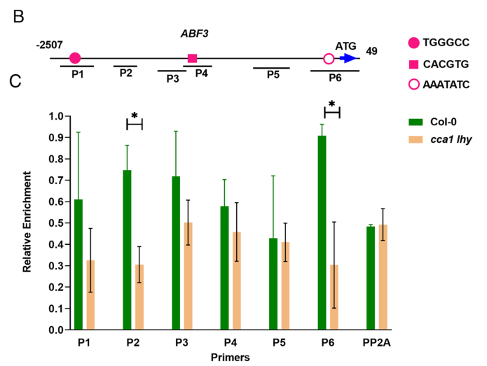

## Question

# Gene Research for Functional Annotation

## ⚠️ CRITICAL: Gene/Protein Identification Context

**BEFORE YOU BEGIN RESEARCH:** You MUST verify you are researching the CORRECT gene/protein. Gene symbols can be ambiguous, especially for less well-characterized genes from non-model organisms.

### Target Gene/Protein Identity (from UniProt):
- **UniProt Accession:** P92973
- **Protein Description:** RecName: Full=Protein CCA1 {ECO:0000303|PubMed:9144958}; AltName: Full=MYB-related transcription factor CCA1 {ECO:0000303|PubMed:9144958}; AltName: Full=Protein CIRCADIAN CLOCK ASSOCIATED 1 {ECO:0000303|PubMed:9144958};
- **Gene Information:** Name=CCA1 {ECO:0000303|PubMed:9144958}; OrderedLocusNames=At2g46830 {ECO:0000312|Araport:AT2G46830}; ORFNames=F19D11 {ECO:0000312|EMBL:AAC33507.1};
- **Organism (full):** Arabidopsis thaliana (Mouse-ear cress).
- **Protein Family:** Not specified in UniProt
- **Key Domains:** Homeodomain-like_sf. (IPR009057); Myb_dom. (IPR017930); Myb_dom_plants. (IPR006447); SANT/Myb. (IPR001005); SANT_dom. (IPR017884)

### MANDATORY VERIFICATION STEPS:

1. **Check if the gene symbol "CCA1" matches the protein description above**
2. **Verify the organism is correct:** Arabidopsis thaliana (Mouse-ear cress).
3. **Check if protein family/domains align with what you find in literature**
4. **If you find literature for a DIFFERENT gene with the same or similar symbol, STOP**

### If Gene Symbol is Ambiguous or You Cannot Find Relevant Literature:

**DO NOT PROCEED WITH RESEARCH ON A DIFFERENT GENE.** Instead:
- State clearly: "The gene symbol 'CCA1' is ambiguous or literature is limited for this specific protein"
- Explain what you found (e.g., "Found extensive literature on a different gene with the same symbol in a different organism")
- Describe the protein based ONLY on the UniProt information provided above
- Suggest that the protein function can be inferred from domain/family information

### Research Target:

Please provide a comprehensive research report on the gene **CCA1** (gene ID: CCA1, UniProt: P92973) in ARATH.

The research report should be a detailed narrative explaining the function, biological processes, and localization of the gene product. Citations should be given for all claims.

You should prioritize authoritative reviews and primary scientific literature when conducting research. You can supplement
this with annotations you find in gene/protein databases, but these can be outdated or inaccurate.

We are specifically interested in the primary function of the gene - for enzymes, what reaction is catalyzed, and what is the substrate specificity? For transporters, what is the substrate? For structural proteins or adapters, what is the broader structural role? For signaling molecules, what is the role in the pathway.

We are interested in where in or outside the cell the gene product carries out its function.

We are also interested in the signaling or biochemical pathways in which the gene functions. We are less interested in broad pleiotropic effects, except where these elucidate the precise role.

Include evidence where possible. We are interested in both experimental evidence as well as inference from structure, evolution, or bioinformatic analysis. Precise studies should be prioritized over high-throughput, where available.

## Output

Question: You are an expert researcher providing comprehensive, well-cited information.

Provide detailed information focusing on:
1. Key concepts and definitions with current understanding
2. Recent developments and latest research (prioritize 2023-2024 sources)
3. Current applications and real-world implementations
4. Expert opinions and analysis from authoritative sources
5. Relevant statistics and data from recent studies

Format as a comprehensive research report with proper citations. Include URLs and publication dates where available.
Always prioritize recent, authoritative sources and provide specific citations for all major claims.

# Gene Research for Functional Annotation

## ⚠️ CRITICAL: Gene/Protein Identification Context

**BEFORE YOU BEGIN RESEARCH:** You MUST verify you are researching the CORRECT gene/protein. Gene symbols can be ambiguous, especially for less well-characterized genes from non-model organisms.

### Target Gene/Protein Identity (from UniProt):
- **UniProt Accession:** P92973
- **Protein Description:** RecName: Full=Protein CCA1 {ECO:0000303|PubMed:9144958}; AltName: Full=MYB-related transcription factor CCA1 {ECO:0000303|PubMed:9144958}; AltName: Full=Protein CIRCADIAN CLOCK ASSOCIATED 1 {ECO:0000303|PubMed:9144958};
- **Gene Information:** Name=CCA1 {ECO:0000303|PubMed:9144958}; OrderedLocusNames=At2g46830 {ECO:0000312|Araport:AT2G46830}; ORFNames=F19D11 {ECO:0000312|EMBL:AAC33507.1};
- **Organism (full):** Arabidopsis thaliana (Mouse-ear cress).
- **Protein Family:** Not specified in UniProt
- **Key Domains:** Homeodomain-like_sf. (IPR009057); Myb_dom. (IPR017930); Myb_dom_plants. (IPR006447); SANT/Myb. (IPR001005); SANT_dom. (IPR017884)

### MANDATORY VERIFICATION STEPS:

1. **Check if the gene symbol "CCA1" matches the protein description above**
2. **Verify the organism is correct:** Arabidopsis thaliana (Mouse-ear cress).
3. **Check if protein family/domains align with what you find in literature**
4. **If you find literature for a DIFFERENT gene with the same or similar symbol, STOP**

### If Gene Symbol is Ambiguous or You Cannot Find Relevant Literature:

**DO NOT PROCEED WITH RESEARCH ON A DIFFERENT GENE.** Instead:
- State clearly: "The gene symbol 'CCA1' is ambiguous or literature is limited for this specific protein"
- Explain what you found (e.g., "Found extensive literature on a different gene with the same symbol in a different organism")
- Describe the protein based ONLY on the UniProt information provided above
- Suggest that the protein function can be inferred from domain/family information

### Research Target:

Please provide a comprehensive research report on the gene **CCA1** (gene ID: CCA1, UniProt: P92973) in ARATH.

The research report should be a detailed narrative explaining the function, biological processes, and localization of the gene product. Citations should be given for all claims.

You should prioritize authoritative reviews and primary scientific literature when conducting research. You can supplement
this with annotations you find in gene/protein databases, but these can be outdated or inaccurate.

We are specifically interested in the primary function of the gene - for enzymes, what reaction is catalyzed, and what is the substrate specificity? For transporters, what is the substrate? For structural proteins or adapters, what is the broader structural role? For signaling molecules, what is the role in the pathway.

We are interested in where in or outside the cell the gene product carries out its function.

We are also interested in the signaling or biochemical pathways in which the gene functions. We are less interested in broad pleiotropic effects, except where these elucidate the precise role.

Include evidence where possible. We are interested in both experimental evidence as well as inference from structure, evolution, or bioinformatic analysis. Precise studies should be prioritized over high-throughput, where available.

## Research report: Arabidopsis thaliana **CCA1** (CIRCADIAN CLOCK ASSOCIATED 1; At2g46830; UniProt P92973)

### Executive summary
CIRCADIAN CLOCK ASSOCIATED 1 (CCA1; At2g46830; UniProt P92973) is a dawn-phased, MYB/SANT-domain DNA-binding transcription factor that functions in the **core transcription–translation feedback loops (TTFLs)** of the Arabidopsis circadian oscillator, acting largely as a repressor of evening-phased clock genes while also serving as an activator or dual regulator for selected outputs (e.g., metabolic and developmental genes) depending on context. It operates in the **nucleus** to regulate rhythmic gene expression programs that integrate environmental cues (light/temperature) with endogenous pathways (including ABA/stress signaling), with major 2024 advances clarifying reciprocal wiring between **CCA1/LHY** and the ABA bZIP factor **ABF3**. (li2025transcriptionalactivationand pages 3-4, liang2024theinterplaybetween pages 2-3)

### Target identity verification (mandatory)
The literature retrieved and analyzed here consistently matches the requested target: **Arabidopsis thaliana CCA1**, described as “CIRCADIAN CLOCK ASSOCIATED 1,” a dawn-expressed MYB-family transcription factor in the plant circadian oscillator, often discussed together with its paralog LHY; this aligns with UniProt P92973 annotations (MYB/SANT-related TF; circadian function). (li2025transcriptionalactivationand pages 3-4, zhang2023environmentalfactors pages 1-2)

### 1) Key concepts and definitions (current understanding)

#### 1.1 Circadian oscillator architecture and CCA1’s position
In Arabidopsis, the circadian clock is commonly conceptualized as **interlocked TTFLs**. CCA1 (with LHY) is a **morning (dawn-phased) oscillator transcription factor** that participates in mutual inhibition with evening factors (notably TOC1), forming a central negative-feedback relationship that helps maintain ~24 h rhythms. (zhang2023environmentalfactors pages 1-2, li2025transcriptionalactivationand pages 1-3)

CCA1/LHY also repress additional evening genes (e.g., GI, LUX, ELF3/ELF4), and are embedded in broader multi-loop regulation including factors such as CHE/TCP21, PRRs, RVEs/LNKs and other complexes that reinforce phase-specific expression. (zhang2023environmentalfactors pages 1-2, li2025transcriptionalactivationand pages 1-3, perezllorca2024unlockingnature’srhythms pages 1-2)

#### 1.2 Molecular function: transcription factor (not enzyme/transporter)
CCA1’s primary molecular role is **sequence-specific transcriptional regulation** through promoter binding, rather than catalysis or transport. Reviews describe CCA1 as a **MYB-family TF** that binds to canonical promoter motifs—most prominently the **Evening Element (EE)** and the **CCA1-binding site (CBS)**—to regulate target gene expression. (li2025transcriptionalactivationand pages 3-4)

#### 1.3 DNA-binding motifs and regulatory elements
Review-level synthesis indicates CCA1 binds **EE** and **CBS** motifs in target promoters, consistent with its role repressing evening-phased genes such as TOC1. (li2025transcriptionalactivationand pages 3-4, zhang2023environmentalfactors pages 1-2)

A 2024 primary study examining CCA1/LHY links to ABA signaling performed promoter motif analysis of the **ABF3** locus and identified candidate motifs relevant to CCA1/LHY-linked control, including an **EE segment (AAATATC)**, a **G-box (CACGTG)**, and a **TCP-binding site (TGGGCC)**; experimental ChIP evidence supported LHY occupancy at ABF3 promoter regions. (liang2024theinterplaybetween pages 2-3, liang2024theinterplaybetween media 67ae3097)

#### 1.4 Subcellular localization
The evidence available in the retrieved texts supports a **nuclear site of action**, as CCA1 is repeatedly assayed via promoter binding (ChIP/ChIP-seq) and described as regulating transcription of nuclear genes. (li2025transcriptionalactivationand pages 3-4, liang2024theinterplaybetween pages 3-6)

### 2) Recent developments and latest research (prioritize 2023–2024)

#### 2.1 2024: Reciprocal ABA/stress module ABF3 ↔ CCA1/LHY (primary research)
A major 2024 advance is the demonstration of **reciprocal regulation** between morning clock TFs (CCA1/LHY) and ABA signaling through the bZIP transcription factor **ABF3**. Key findings include:

* **Genome-scale targetome refinement:** reanalysis combining three legacy ChIP-seq datasets identified **8,473 genes** bound by CCA1 or LHY, greatly expanding beyond prior “common targets” approaches (~304 in their comparison). Intersection with cca1 lhy mutant DEGs yielded **556** candidate direct regulated targets enriched for abiotic stress-related processes (cold, water deprivation, salt, wounding) as well as light and circadian terms. (liang2024theinterplaybetween pages 2-3)
* **Direct promoter binding:** LHY binding to the **ABF3 promoter** was validated in vivo (ChIP-qPCR), consistent with clock control of ABF3 transcription. (liang2024theinterplaybetween pages 2-3, liang2024theinterplaybetween media 67ae3097)
* **Feedback to the clock:** ABF3 binds promoters of **CCA1 and LHY** (ChIP), and ABF3 overexpression shortens the period of a pLHY::LUC reporter, demonstrating that ABA/stress transcriptional regulators can feed back into core clock timing. (liang2024theinterplaybetween pages 3-6)
* **Circadian gating of stress responsiveness:** ABF3 induction by **ABA** and **NaCl** differed by time-of-day (higher induction at **ZT10** than **ZT1**), supporting a mechanistic basis for circadian gating of stress transcriptional responses. (liang2024theinterplaybetween pages 2-3)

Visual evidence from Figure 2 of Liang et al. (2024) supports the promoter motif mapping, LHY ChIP-qPCR binding to ABF3, and salt-germination phenotypes. (liang2024theinterplaybetween media 67ae3097)

#### 2.2 2023: Environmental entrainment and developmental integration
A 2023 review emphasizes that CCA1/LHY peak around dawn, form heterodimers, repress TOC1 by binding promoter evening elements, and are themselves repressed by TOC1, placing CCA1 at the core of environmental entrainment (light/temperature) and downstream developmental outputs. (zhang2023environmentalfactors pages 1-2)

#### 2.3 Chromatin and output pathway integration (recent synthesis)
A recent synthesis in Plant Communications (2025) compiles evidence that CCA1 links the oscillator to rhythmic chromatin regulation and diverse outputs, including regulation of chromatin modifiers (e.g., HAF2, SDG2, ATX1, JMJ family demethylases) and output genes connected to metabolism and development (e.g., starch and lipid metabolism, hypocotyl elongation). While not a 2024 primary paper, it consolidates current understanding and provides a mechanistic framework consistent with ongoing research directions. (li2025transcriptionalactivationand pages 3-4, li2025transcriptionalactivationand pages 1-3)

### 3) Current applications and real-world implementations

#### 3.1 Crop improvement strategies: allele mining, breeding, gene editing, and chronoculture
Recent reviews highlight actionable translation pathways: selecting or modifying circadian loci to optimize phase/period/amplitude for local environments (temperature/latitude/light), including the broader concept of **chronoculture** (agro-chronobiology) to align biological timing with farming practices. (xu2023theregulatorynetworks pages 10-11)

A 2024 review focusing on crop circadian allelic diversity positions morning-loop genes (CCA1/LHY) as key nodes for engineering stress resilience and productivity via crossbreeding, transgenesis, and genome editing. (dwivedi2024unlockingallelicvariation pages 1-3)

#### 3.2 Concrete examples connected to CCA1/LHY and related clock genes
* **Stress tolerance mechanisms connected to CCA1:** evidence summarized in a 2024 review reports that CCA1 overexpression increases tolerance to ROS-generating agents, whereas loss-of-function in CCA1/LHY increases hypersensitivity, supporting the plausibility of manipulating this node for stress resilience (not necessarily via field deployment yet). (dwivedi2024unlockingallelicvariation pages 8-10)
* **Hybrid vigor linkage and yield-relevant rhythmic genes:** in hybrid rice ‘LY2186’, transcript profiling identified **1,552** rhythmic differentially expressed genes (RDGs), and **72% of 282 RDGs** mapped to yield-related QTLs, suggesting circadian-regulated gene sets (including core clock components and outputs) can be leveraged as candidate targets after functional validation. (dwivedi2024unlockingallelicvariation pages 8-10)

These examples represent a mix of direct CCA1 manipulation evidence (Arabidopsis stress tolerance) and circadian-network deployment concepts (hybrid breeding/chronoculture), reflecting the current state of translation: strong mechanistic rationale with selected demonstrations, but variable levels of field-scale validation depending on species/trait. (xu2023theregulatorynetworks pages 10-11, dwivedi2024unlockingallelicvariation pages 8-10)

### 4) Expert opinions and analysis (authoritative sources)

#### 4.1 Consensus on CCA1/LHY as essential oscillator regulators
Multiple reviews converge on the view that CCA1/LHY are essential for robust circadian rhythms: single mutants often shorten period, while cca1 lhy double mutants show severe disruption/low amplitude. This redundancy and central placement make CCA1 a high-leverage regulatory node but also raise engineering cautions about pleiotropy. (zhang2023environmentalfactors pages 1-2, li2025transcriptionalactivationand pages 3-4)

#### 4.2 Systems-level interpretation: clock as integrator of environment–hormone–stress networks
The 2024 ABF3 study provides a concrete example of a broader systems view: the clock is not only an upstream “timer” but also receives “reverse” inputs from stress-signaling TFs. This supports expert perspectives that **bidirectional coupling** between the circadian system and hormone/stress pathways is a key frontier for both mechanistic understanding and trait engineering. (liang2024theinterplaybetween pages 1-2, liang2024theinterplaybetween pages 3-6)

### 5) Relevant statistics and data (recent studies)

#### 5.1 Targetome scale and network overlap (2024)
* **8,473** genes: combined bound targets of CCA1 or LHY (three ChIP-seq datasets reanalyzed). (liang2024theinterplaybetween pages 2-3)
* **556** genes: overlap of bound targets with differentially expressed genes in cca1 lhy mutant, interpreted as likely direct regulated targets enriched for abiotic stress and environmental response processes. (liang2024theinterplaybetween pages 2-3)
* **14** genes: overlap between (i) the ChIP/RNA integrated set and (ii) TFs binding the CCA1 promoter from a yeast-one-hybrid screen, highlighting reciprocal regulatory architecture. (liang2024theinterplaybetween pages 2-3)

#### 5.2 Experimental design statistics (2024 ABF3 study)
* Stress treatments included **120 mM NaCl** and **50 µM ABA**, with clock readouts measured using luciferase reporters and FFT-NLLS; period assays reported **n = 12** in their quantifications. (liang2024theinterplaybetween pages 3-6)
* Seed germination assays under salinity included at least **40 seeds per genotype per replicate** (three biological replicates), supporting robustness of phenotype quantification. (liang2024theinterplaybetween pages 3-6)

#### 5.3 Scale of circadian regulation in plants (review statistic)
A 2024 review notes that under constant conditions ~**30%** of the transcriptome can be clock-controlled, and with light/temperature cues this can reach **up to 90%**, illustrating the potentially broad downstream impact of core clock TFs such as CCA1. (perezllorca2024unlockingnature’srhythms pages 1-2)

### Functional annotation synthesis (compact evidence map)
The following table provides a structured summary of CCA1’s functional annotation, with citations for each major point.

| Aspect | Key facts |
|---|---|
| Identity | • Verified target is **Arabidopsis thaliana CCA1** = **CIRCADIAN CLOCK ASSOCIATED 1**, locus **At2g46830**, UniProt **P92973**. • Literature consistently describes it as a **dawn-phased MYB-family transcription factor** and core clock component, matching the UniProt MYB/SANT domain annotation. • Frequently analyzed together with its close paralog **LHY** because of partial redundancy in the morning oscillator (li2025transcriptionalactivationand pages 3-4, zhang2023environmentalfactors pages 1-2, perezllorca2024unlockingnature’srhythms pages 1-2) |
| Molecular function | • **Sequence-specific DNA-binding transcription factor** that can act mainly as a repressor in the core clock, but also as an activator for selected outputs depending on promoter context. • Binds promoters of circadian and output genes to control rhythmic transcription. • Functions in transcriptional–translational feedback loops (TTFLs) rather than as an enzyme or transporter (li2025transcriptionalactivationand pages 3-4, li2025transcriptionalactivationand pages 1-3, mujahid2025integrationoflight pages 4-6) |
| DNA motifs | • Canonical motifs associated with CCA1/LHY regulation include the **Evening Element (EE)** and **CCA1-binding site (CBS)**. • In the 2024 ABF3 study, the **ABF3 promoter** contained candidate CCA1/LHY-linked motifs including **EE segment AAATATC**, **G-box CACGTG**, and **TCP site TGGGCC**; LHY binding was validated by ChIP-qPCR. • ABRE core motifs (**ACGTG**) in CCA1/LHY promoters support reciprocal regulation by ABA-pathway ABFs (li2025transcriptionalactivationand pages 3-4, liang2024theinterplaybetween pages 2-3, liang2024theinterplaybetween pages 3-6, liang2024theinterplaybetween media 67ae3097) |
| Localization | • Functional evidence places CCA1 in the **nucleus**, where it binds promoters and is assayed by ChIP/ChIP-seq. • No evidence suggests extracellular or membrane localization; its annotated role is nuclear gene regulation. • Reporter and ChIP experiments using tagged proteins support promoter occupancy in vivo (li2025transcriptionalactivationand pages 3-4, liang2024theinterplaybetween pages 3-6) |
| Core clock role | • CCA1 peaks near **dawn** and, together with LHY, forms the **morning loop** of the Arabidopsis circadian oscillator. • It represses evening-phased genes such as **TOC1** and evening-complex components; TOC1/CHE-mediated pathways reciprocally repress CCA1, generating interlocked feedback. • Also contributes to regulation of morning PRRs and broader oscillator robustness (zhang2023environmentalfactors pages 1-2, li2025transcriptionalactivationand pages 1-3, perezllorca2024unlockingnature’srhythms pages 1-2) |
| Key interactions | • Strongest functional partner is **LHY**; CCA1 and LHY can act redundantly and also form heterodimers in vivo. • Reciprocal and/or pathway-linked interactions reported with **TOC1**, **CHE/TCP21**, **PRR9/7/5**, **Evening Complex (ELF3/ELF4/LUX)**, **RVEs/LNKs**, and **ABF3**. • Recent work also highlights promoter-level crosstalk with ABA TFs and possible upstream environmental regulators (liang2024theinterplaybetween pages 1-2, zhang2023environmentalfactors pages 1-2, li2025transcriptionalactivationand pages 1-3, perezllorca2024unlockingnature’srhythms pages 1-2) |
| Direct targets/pathways | • Recent reanalysis integrated ChIP-seq/RNA-seq and identified **8,473 CCA1/LHY-bound genes**, with **556** likely regulated direct targets enriched for **light, circadian rhythm, cold, salt, wounding, and water deprivation** pathways. • Specific direct or supported targets/pathways include **ABF3**, **CBF1**-linked cold/freezing response, and output genes affecting **hypocotyl elongation, cell expansion, starch/lipid metabolism, flowering/vernalization**, and other rhythmic outputs. • A smaller overlap of **14** genes connected direct targets with TFs binding the CCA1 promoter, suggesting reciprocal network wiring (liang2024theinterplaybetween pages 2-3, liang2024theinterplaybetween pages 3-6, li2025transcriptionalactivationand pages 3-4) |
| Stress/ABA link | • A major 2024 advance is the **reciprocal CCA1/LHY–ABF3 module** connecting the clock to **ABA, salinity, drought/cold-related responses**. • **LHY binds the ABF3 promoter**, while **ABF3 binds CCA1/LHY promoters** via ABRE-containing regions; ABA enhances ABF3 DNA binding. • ABF3 induction by **ABA** and **NaCl** is higher at **ZT10** than **ZT1**, showing circadian gating of stress responsiveness (liang2024theinterplaybetween pages 1-2, liang2024theinterplaybetween pages 3-6, liang2024theinterplaybetween pages 2-3, liang2024theinterplaybetween media 67ae3097) |
| Chromatin/epigenetic roles | • Reviews place CCA1 in rhythmic chromatin regulation: it represses **HAF2**, activates **SDG2** and **ATX1**, and represses **JMJ** demethylases, linking CCA1 to rhythmic **H3K4me3** dynamics. • CCA1-associated pathways also intersect with chromatin control of vernalization/output genes such as **VIN3**. • In hybrids/allotetraploids, epigenetic repression of **CCA1/LHY** has been linked to downstream expression changes associated with vigor (li2025transcriptionalactivationand pages 3-4, dwivedi2024unlockingallelicvariation pages 8-10) |
| Phenotypes | • **cca1** or **lhy** single mutants typically show a **shortened circadian period**. • The **cca1 lhy double mutant** shows much stronger rhythmic disruption, including **very short period, low amplitude, and disordered/near-arrhythmic rhythms**. • In stress assays, **cca1-1** and **lhy-20** had reduced germination under salt, and the **double mutant showed additive reduction**; **LHY-OX** behaved similarly in that assay (zhang2023environmentalfactors pages 1-2, liang2024theinterplaybetween pages 2-3, liang2024theinterplaybetween pages 3-6) |
| Quantitative stats | • Combined legacy ChIP-seq reanalysis: **8,473** bound genes; overlap with mutant DEGs: **556** likely regulated targets; reciprocal-network overlap: **14** genes (liang2024theinterplaybetween pages 2-3). • Stress/circadian assays in the 2024 PNAS study used **120 mM NaCl**, **50 µM ABA**, entrainment under **12 h:12 h** cycles, sampling every **3 h**, with circadian period assays at **n = 12** and germination scored with **≥40 seeds/genotype/replicate** (liang2024theinterplaybetween pages 3-6). • Broader clock context: reviews note ~**30%** of the transcriptome is clock-controlled under constant conditions and up to **90%** with light/temperature cycles, underscoring the scale of CCA1-linked regulation (perezllorca2024unlockingnature’srhythms pages 1-2) |
| Applications | • CCA1/LHY and related clock genes are widely viewed as **breeding and engineering targets** for climate-resilient crops, especially for tuning **phase, period, amplitude, flowering, stress tolerance, and yield stability**. • Reported translational examples include exploiting allelic variation, transgenesis, and gene editing of clock networks across crops; for Arabidopsis specifically, **CCA1 overexpression increases tolerance to ROS-generating agents**, while CCA1/LHY loss causes hypersensitivity. • Clock-linked breeding concepts such as **chronoculture** and hybrid-vigor optimization are proposed for practical deployment (dwivedi2024unlockingallelicvariation pages 8-10, xu2023theregulatorynetworks pages 10-11, dwivedi2024unlockingallelicvariation pages 1-3) |

*Table: This table summarizes the core functional annotation of Arabidopsis thaliana CCA1 (UniProt P92973; At2g46830), emphasizing validated molecular function, clock role, regulatory interactions, recent 2024 stress-signaling findings, and translational relevance. It is designed as a compact evidence map for use in a full research report.*

### Mechanistic model (narrative)
**Core oscillator function:** At dawn, CCA1 (often functioning with LHY) binds EE/CBS-like promoter elements in evening-phased clock genes (e.g., TOC1) to repress their transcription, while evening factors reciprocally inhibit CCA1 expression through interlocked loops (including TOC1-mediated pathways and CHE/TCP regulators). This architecture generates stable circadian oscillations and sets phases for downstream outputs. (zhang2023environmentalfactors pages 1-2, li2025transcriptionalactivationand pages 1-3)

**Stress/ABA integration (2024 mechanism):** The oscillator exerts time-of-day control over ABA/stress responsiveness via regulation of ABF3 (direct promoter binding by LHY; promoter motif context including EE/G-box/TCP sites), while ABF3 can bind CCA1/LHY promoters via ABRE motifs and tune circadian period, with ABA enhancing ABF3 DNA-binding activity. This bidirectional connection provides a mechanism for stress signals to reshape clock timing while preserving circadian gating. (liang2024theinterplaybetween pages 3-6, liang2024theinterplaybetween pages 2-3, liang2024theinterplaybetween media 67ae3097)

### Limitations of this report (evidence-bound)
* The retrieved evidence strongly supports CCA1’s **TF identity, motifs (EE/CBS), nuclear promoter binding, core oscillator role, and 2024 ABF3 coupling**, but does not provide detailed structural boundaries for each annotated domain (MYB/SANT vs homeodomain-like superfamily) beyond general “MYB-family TF” descriptions in the excerpts; those details would require direct UniProt/InterPro curation or structural papers not retrieved here. (li2025transcriptionalactivationand pages 3-4)
* Some translational examples are **circadian-network-wide** (not exclusively CCA1), reflecting how clock engineering is commonly implemented across multiple loci. (xu2023theregulatorynetworks pages 10-11, dwivedi2024unlockingallelicvariation pages 8-10)

### Key sources (with URLs and publication dates)
* Liang T. et al. “The interplay between the circadian clock and abiotic stress responses mediated by ABF3 and CCA1/LHY.” **PNAS** (Feb 2024). https://doi.org/10.1073/pnas.2316825121 (liang2024theinterplaybetween pages 1-2, liang2024theinterplaybetween pages 2-3)
* Dwivedi S.L. et al. “Unlocking allelic variation in circadian clock genes to develop environmentally robust and productive crops.” **Planta** (Feb 2024). https://doi.org/10.1007/s00425-023-04324-8 (dwivedi2024unlockingallelicvariation pages 1-3, dwivedi2024unlockingallelicvariation pages 8-10)
* Pérez-Llorca M., Müller M. “Unlocking Nature’s Rhythms: Insights into Secondary Metabolite Modulation by the Circadian Clock.” **Int. J. Mol. Sci.** (Jul 2024). https://doi.org/10.3390/ijms25137308 (perezllorca2024unlockingnature’srhythms pages 1-2)
* Zhang Y. et al. “Environmental factors coordinate circadian clock function and rhythm to regulate plant development.” **Plant Signaling & Behavior** (Jul 2023). https://doi.org/10.1080/15592324.2023.2231202 (zhang2023environmentalfactors pages 1-2)
* Xu H. et al. “The Regulatory Networks of the Circadian Clock Involved in Plant Adaptation and Crop Yield.” **Plants** (May 2023). https://doi.org/10.3390/plants12091897 (xu2023theregulatorynetworks pages 10-11)
* Li J. et al. “Transcriptional Activation and Repression in the Plant Circadian Clock…” **Plant Communications** (Jun 2025). https://doi.org/10.1016/j.xplc.2025.101415 (li2025transcriptionalactivationand pages 3-4)

References

1. (li2025transcriptionalactivationand pages 3-4): Jing Li, Ming-kang Yang, Jian Zeng, Liang Chen, and Wei Huang. Transcriptional activation and repression in the plant circadian clock: revisiting core oscillator feedback loops and output pathways. Plant communications, pages 101415, Jun 2025. URL: https://doi.org/10.1016/j.xplc.2025.101415, doi:10.1016/j.xplc.2025.101415. This article has 12 citations and is from a peer-reviewed journal.

2. (liang2024theinterplaybetween pages 2-3): Tong Liang, Shi Yu, Yuanzhong Pan, Jiarui Wang, and Steve A. Kay. The interplay between the circadian clock and abiotic stress responses mediated by abf3 and cca1/lhy. Proceedings of the National Academy of Sciences of the United States of America, Feb 2024. URL: https://doi.org/10.1073/pnas.2316825121, doi:10.1073/pnas.2316825121. This article has 38 citations and is from a highest quality peer-reviewed journal.

3. (zhang2023environmentalfactors pages 1-2): Ying Zhang, Yuru Ma, Hao Zhang, Jiahui Xu, Xiaokuan Gao, Tengteng Zhang, Xigang Liu, Lin Guo, and Dan Zhao. Environmental f actors coordinate circadian clock function and rhythm to regulate plant development. Plant Signaling & Behavior, Jul 2023. URL: https://doi.org/10.1080/15592324.2023.2231202, doi:10.1080/15592324.2023.2231202. This article has 19 citations and is from a peer-reviewed journal.

4. (li2025transcriptionalactivationand pages 1-3): Jing Li, Ming-kang Yang, Jian Zeng, Liang Chen, and Wei Huang. Transcriptional activation and repression in the plant circadian clock: revisiting core oscillator feedback loops and output pathways. Plant communications, pages 101415, Jun 2025. URL: https://doi.org/10.1016/j.xplc.2025.101415, doi:10.1016/j.xplc.2025.101415. This article has 12 citations and is from a peer-reviewed journal.

5. (perezllorca2024unlockingnature’srhythms pages 1-2): Marina Pérez-Llorca and Maren Müller. Unlocking nature’s rhythms: insights into secondary metabolite modulation by the circadian clock. International Journal of Molecular Sciences, 25:7308, Jul 2024. URL: https://doi.org/10.3390/ijms25137308, doi:10.3390/ijms25137308. This article has 16 citations.

6. (liang2024theinterplaybetween media 67ae3097): Tong Liang, Shi Yu, Yuanzhong Pan, Jiarui Wang, and Steve A. Kay. The interplay between the circadian clock and abiotic stress responses mediated by abf3 and cca1/lhy. Proceedings of the National Academy of Sciences of the United States of America, Feb 2024. URL: https://doi.org/10.1073/pnas.2316825121, doi:10.1073/pnas.2316825121. This article has 38 citations and is from a highest quality peer-reviewed journal.

7. (liang2024theinterplaybetween pages 3-6): Tong Liang, Shi Yu, Yuanzhong Pan, Jiarui Wang, and Steve A. Kay. The interplay between the circadian clock and abiotic stress responses mediated by abf3 and cca1/lhy. Proceedings of the National Academy of Sciences of the United States of America, Feb 2024. URL: https://doi.org/10.1073/pnas.2316825121, doi:10.1073/pnas.2316825121. This article has 38 citations and is from a highest quality peer-reviewed journal.

8. (xu2023theregulatorynetworks pages 10-11): Hang Xu, Xiling Wang, Jian-hua Wei, Yi Zuo, and Lei Wang. The regulatory networks of the circadian clock involved in plant adaptation and crop yield. Plants, 12:1897, May 2023. URL: https://doi.org/10.3390/plants12091897, doi:10.3390/plants12091897. This article has 18 citations.

9. (dwivedi2024unlockingallelicvariation pages 1-3): Sangam Lal Dwivedi, Luis Felipe Quiroz, Charles Spillane, Rongling Wu, Autar K. Mattoo, and Rodomiro Ortiz. Unlocking allelic variation in circadian clock genes to develop environmentally robust and productive crops. Planta, Feb 2024. URL: https://doi.org/10.1007/s00425-023-04324-8, doi:10.1007/s00425-023-04324-8. This article has 16 citations and is from a peer-reviewed journal.

10. (dwivedi2024unlockingallelicvariation pages 8-10): Sangam Lal Dwivedi, Luis Felipe Quiroz, Charles Spillane, Rongling Wu, Autar K. Mattoo, and Rodomiro Ortiz. Unlocking allelic variation in circadian clock genes to develop environmentally robust and productive crops. Planta, Feb 2024. URL: https://doi.org/10.1007/s00425-023-04324-8, doi:10.1007/s00425-023-04324-8. This article has 16 citations and is from a peer-reviewed journal.

11. (liang2024theinterplaybetween pages 1-2): Tong Liang, Shi Yu, Yuanzhong Pan, Jiarui Wang, and Steve A. Kay. The interplay between the circadian clock and abiotic stress responses mediated by abf3 and cca1/lhy. Proceedings of the National Academy of Sciences of the United States of America, Feb 2024. URL: https://doi.org/10.1073/pnas.2316825121, doi:10.1073/pnas.2316825121. This article has 38 citations and is from a highest quality peer-reviewed journal.

12. (mujahid2025integrationoflight pages 4-6): Muhammad Mujahid, Alia Ambreen, Yusra Zarlashat, Zareen Sarfraz, Muhammad Sajid Iqbal, Abdul Waheed, and Muhammad Shahid Iqbal. Integration of light and circadian signaling in plant gene regulatory networks: implications for photomorphogenesis and stress adaptation. Biology, 14:1375, Oct 2025. URL: https://doi.org/10.3390/biology14101375, doi:10.3390/biology14101375. This article has 8 citations.

## Artifacts

- [Edison artifact artifact-00](CCA1-deep-research-falcon_artifacts/artifact-00.md)

## Citations

1. li2025transcriptionalactivationand pages 3-4
2. liang2024theinterplaybetween pages 2-3
3. liang2024theinterplaybetween pages 3-6
4. zhang2023environmentalfactors pages 1-2
5. xu2023theregulatorynetworks pages 10-11
6. dwivedi2024unlockingallelicvariation pages 1-3
7. dwivedi2024unlockingallelicvariation pages 8-10
8. li2025transcriptionalactivationand pages 1-3
9. liang2024theinterplaybetween pages 1-2
10. mujahid2025integrationoflight pages 4-6
11. https://doi.org/10.1073/pnas.2316825121
12. https://doi.org/10.1007/s00425-023-04324-8
13. https://doi.org/10.3390/ijms25137308
14. https://doi.org/10.1080/15592324.2023.2231202
15. https://doi.org/10.3390/plants12091897
16. https://doi.org/10.1016/j.xplc.2025.101415
17. https://doi.org/10.1016/j.xplc.2025.101415,
18. https://doi.org/10.1073/pnas.2316825121,
19. https://doi.org/10.1080/15592324.2023.2231202,
20. https://doi.org/10.3390/ijms25137308,
21. https://doi.org/10.3390/plants12091897,
22. https://doi.org/10.1007/s00425-023-04324-8,
23. https://doi.org/10.3390/biology14101375,