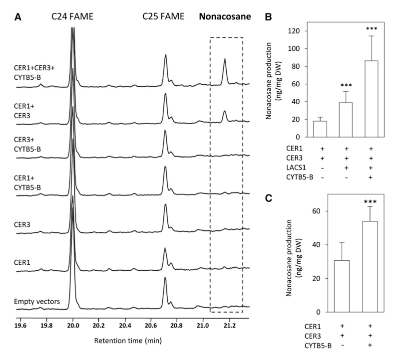

## Question

# Gene Research for Functional Annotation

## ⚠️ CRITICAL: Gene/Protein Identification Context

**BEFORE YOU BEGIN RESEARCH:** You MUST verify you are researching the CORRECT gene/protein. Gene symbols can be ambiguous, especially for less well-characterized genes from non-model organisms.

### Target Gene/Protein Identity (from UniProt):
- **UniProt Accession:** F4HVY0
- **Protein Description:** RecName: Full=Very-long-chain aldehyde decarbonylase CER1 {ECO:0000305}; EC=4.1.99.5 {ECO:0000269|PubMed:21386033, ECO:0000269|PubMed:22773744}; AltName: Full=Protein ECERIFERUM 1;
- **Gene Information:** Name=CER1; OrderedLocusNames=At1g02205; ORFNames=T7I23.10;
- **Organism (full):** Arabidopsis thaliana (Mouse-ear cress).
- **Protein Family:** Belongs to the sterol desaturase family. .
- **Key Domains:** CER1-like_C. (IPR021940); Fatty_acid_hydroxylase. (IPR006694); Sterol_Desaturase_Related. (IPR050307); CER1-like_C (PF12076); FA_hydroxylase (PF04116)

### MANDATORY VERIFICATION STEPS:

1. **Check if the gene symbol "CER1" matches the protein description above**
2. **Verify the organism is correct:** Arabidopsis thaliana (Mouse-ear cress).
3. **Check if protein family/domains align with what you find in literature**
4. **If you find literature for a DIFFERENT gene with the same or similar symbol, STOP**

### If Gene Symbol is Ambiguous or You Cannot Find Relevant Literature:

**DO NOT PROCEED WITH RESEARCH ON A DIFFERENT GENE.** Instead:
- State clearly: "The gene symbol 'CER1' is ambiguous or literature is limited for this specific protein"
- Explain what you found (e.g., "Found extensive literature on a different gene with the same symbol in a different organism")
- Describe the protein based ONLY on the UniProt information provided above
- Suggest that the protein function can be inferred from domain/family information

### Research Target:

Please provide a comprehensive research report on the gene **CER1** (gene ID: CER1, UniProt: F4HVY0) in ARATH.

The research report should be a detailed narrative explaining the function, biological processes, and localization of the gene product. Citations should be given for all claims.

You should prioritize authoritative reviews and primary scientific literature when conducting research. You can supplement
this with annotations you find in gene/protein databases, but these can be outdated or inaccurate.

We are specifically interested in the primary function of the gene - for enzymes, what reaction is catalyzed, and what is the substrate specificity? For transporters, what is the substrate? For structural proteins or adapters, what is the broader structural role? For signaling molecules, what is the role in the pathway.

We are interested in where in or outside the cell the gene product carries out its function.

We are also interested in the signaling or biochemical pathways in which the gene functions. We are less interested in broad pleiotropic effects, except where these elucidate the precise role.

Include evidence where possible. We are interested in both experimental evidence as well as inference from structure, evolution, or bioinformatic analysis. Precise studies should be prioritized over high-throughput, where available.

## Output

Question: You are an expert researcher providing comprehensive, well-cited information.

Provide detailed information focusing on:
1. Key concepts and definitions with current understanding
2. Recent developments and latest research (prioritize 2023-2024 sources)
3. Current applications and real-world implementations
4. Expert opinions and analysis from authoritative sources
5. Relevant statistics and data from recent studies

Format as a comprehensive research report with proper citations. Include URLs and publication dates where available.
Always prioritize recent, authoritative sources and provide specific citations for all major claims.

# Gene Research for Functional Annotation

## ⚠️ CRITICAL: Gene/Protein Identification Context

**BEFORE YOU BEGIN RESEARCH:** You MUST verify you are researching the CORRECT gene/protein. Gene symbols can be ambiguous, especially for less well-characterized genes from non-model organisms.

### Target Gene/Protein Identity (from UniProt):
- **UniProt Accession:** F4HVY0
- **Protein Description:** RecName: Full=Very-long-chain aldehyde decarbonylase CER1 {ECO:0000305}; EC=4.1.99.5 {ECO:0000269|PubMed:21386033, ECO:0000269|PubMed:22773744}; AltName: Full=Protein ECERIFERUM 1;
- **Gene Information:** Name=CER1; OrderedLocusNames=At1g02205; ORFNames=T7I23.10;
- **Organism (full):** Arabidopsis thaliana (Mouse-ear cress).
- **Protein Family:** Belongs to the sterol desaturase family. .
- **Key Domains:** CER1-like_C. (IPR021940); Fatty_acid_hydroxylase. (IPR006694); Sterol_Desaturase_Related. (IPR050307); CER1-like_C (PF12076); FA_hydroxylase (PF04116)

### MANDATORY VERIFICATION STEPS:

1. **Check if the gene symbol "CER1" matches the protein description above**
2. **Verify the organism is correct:** Arabidopsis thaliana (Mouse-ear cress).
3. **Check if protein family/domains align with what you find in literature**
4. **If you find literature for a DIFFERENT gene with the same or similar symbol, STOP**

### If Gene Symbol is Ambiguous or You Cannot Find Relevant Literature:

**DO NOT PROCEED WITH RESEARCH ON A DIFFERENT GENE.** Instead:
- State clearly: "The gene symbol 'CER1' is ambiguous or literature is limited for this specific protein"
- Explain what you found (e.g., "Found extensive literature on a different gene with the same symbol in a different organism")
- Describe the protein based ONLY on the UniProt information provided above
- Suggest that the protein function can be inferred from domain/family information

### Research Target:

Please provide a comprehensive research report on the gene **CER1** (gene ID: CER1, UniProt: F4HVY0) in ARATH.

The research report should be a detailed narrative explaining the function, biological processes, and localization of the gene product. Citations should be given for all claims.

You should prioritize authoritative reviews and primary scientific literature when conducting research. You can supplement
this with annotations you find in gene/protein databases, but these can be outdated or inaccurate.

We are specifically interested in the primary function of the gene - for enzymes, what reaction is catalyzed, and what is the substrate specificity? For transporters, what is the substrate? For structural proteins or adapters, what is the broader structural role? For signaling molecules, what is the role in the pathway.

We are interested in where in or outside the cell the gene product carries out its function.

We are also interested in the signaling or biochemical pathways in which the gene functions. We are less interested in broad pleiotropic effects, except where these elucidate the precise role.

Include evidence where possible. We are interested in both experimental evidence as well as inference from structure, evolution, or bioinformatic analysis. Precise studies should be prioritized over high-throughput, where available.

## Comprehensive research report: Arabidopsis thaliana **CER1** (At1g02205; UniProt **F4HVY0**)—functional annotation

### 0) Identity verification (critical disambiguation)
The target is **Arabidopsis thaliana** gene **CER1** (also called **ECERIFERUM 1**), locus **At1g02205**, encoding a membrane-associated enzyme in the cuticular wax **alkane-forming (decarbonylation)** pathway (bernard2012reconstitutionofplant pages 1-2, bernard2012reconstitutionofplant pages 2-3). The core functional literature explicitly studies **AtCER1** together with **AtCER3** in Arabidopsis and in heterologous yeast systems, matching the UniProt description of a **very-long-chain aldehyde decarbonylase** (bernard2012reconstitutionofplant pages 2-3, kojima2024broadchainlengthspecificity pages 1-2).

### 1) Key concepts and current definitions

#### 1.1 Cuticular wax alkane-forming pathway
In Arabidopsis aerial epidermis, **very-long-chain fatty acids (VLCFAs)** are elongated in the **endoplasmic reticulum (ER)** and then converted into diverse wax components. In the alkane-forming branch, VLC acyl-derived intermediates proceed through an **aldehyde intermediate** and then to **odd-chain alkanes** that are one carbon shorter than the aldehyde precursor (e.g., C30 aldehyde → C29 alkane) (kojima2024broadchainlengthspecificity pages 1-2, urano2024arabidopsisdreb26erf12and pages 7-7).

#### 1.2 CER1 definition and enzymatic role
CER1 is best supported as the **catalytic decarbonylase** component of an ER-localized alkane-synthesis complex. Genetic phenotypes (severe alkane depletion with aldehyde accumulation) are consistent with a block at the **aldehyde → alkane** conversion step (bernard2012reconstitutionofplant pages 2-3, kojima2024broadchainlengthspecificity pages 5-7). Functional **reconstitution in yeast** shows CER1 is a core component required for VLC alkane production (bernard2012reconstitutionofplant pages 7-8).

### 2) Primary function: reaction, substrate specificity, and required partners

#### 2.1 Reaction and pathway step
Across pathway descriptions and reconstitution experiments, CER1 functions in the conversion of **VLC aldehydes to VLC alkanes** (one carbon shorter), i.e., the **decarbonylation step** (kojima2024broadchainlengthspecificity pages 1-2, zhang2025brcer1intronmutation pages 1-2, bernard2012reconstitutionofplant pages 7-8). The precise coproduct (e.g., CO vs other one-carbon species) is not resolved in the excerpts available here, but the step is clearly positioned as aldehyde decarbonylation (lam2014uncoveringthemechanisms pages 25-29, kojima2024broadchainlengthspecificity pages 1-2).

#### 2.2 Substrate specificity (chain length)
Recent 2024 functional-complementation analysis refined chain-length preference: **AtCER1 preferentially uses C28–C32 fatty-aldehyde substrates** and frequently uses a **C30** precursor, producing predominantly **C29** alkane in wild type stems; AtCER1 does **not** efficiently use **C26 or shorter** substrates (kojima2024broadchainlengthspecificity pages 10-12, kojima2024broadchainlengthspecificity pages 1-2).

#### 2.3 Partner proteins and cofactors
**CER3**: CER3 acts upstream to generate the aldehyde intermediate (acyl-CoA reductase function in the alkane-forming branch), and CER1 and CER3 are **both required** for alkane production in reconstituted systems; genetic interaction and complementation data support a functional CER1–CER3 complex (kojima2024broadchainlengthspecificity pages 1-2, kojima2024broadchainlengthspecificity pages 5-7, bernard2012reconstitutionofplant pages 7-8).

**Cytochrome b5 (CYTB5) isoforms**: Bernard et al. identified CER1 interactions with multiple **ER-localized CYTB5 isoforms** using interaction assays, and coexpression of CYTB5 enhances alkane output in yeast—supporting CYTB5 as an **electron-transfer cofactor** for CER1 decarbonylation (bernard2012reconstitutionofplant pages 2-3, bernard2012reconstitutionofplant pages 3-7, bernard2012reconstitutionofplant pages 7-8).

**Key catalytic motifs**: Site-directed mutagenesis shows CER1 **His-rich motifs** are essential for activity (His→Ala mutants abolish alkane production and fail to complement cer1, despite maintained interaction), consistent with a **di-iron catalytic center** typical of sterol-desaturase-like enzymes and a redox-dependent mechanism (bernard2012reconstitutionofplant pages 8-10, bernard2012reconstitutionofplant pages 7-8).

### 3) Subcellular localization and where CER1 acts
CER1 is experimentally supported to be **ER-localized**, colocalizing with CYTB5 isoforms at the ER, consistent with its role in wax precursor synthesis prior to export to the cuticle (bernard2012reconstitutionofplant pages 3-7, bernard2012reconstitutionofplant pages 1-2). CER1 is also described as being expressed in epidermal tissues of aerial organs—consistent with cuticular wax production sites (bernard2012reconstitutionofplant pages 1-2, zhang2025brcer1intronmutation pages 7-9).

### 4) Mutant phenotypes and biological processes

#### 4.1 Stem cuticular wax and epicuticular crystals
**cer1 loss-of-function** produces a wax-deficient phenotype with **only trace alkanes** in stem wax, consistent with CER1 being nearly essential for stem alkane synthesis (kojima2024broadchainlengthspecificity pages 5-7). cer1 mutants also show **aldehyde accumulation** (including ~2× C30 aldehyde reported in a comparative analysis) consistent with interruption of aldehyde conversion (kojima2024broadchainlengthspecificity pages 5-7).

#### 4.2 Pollen coat and fertility
CER1 impacts reproductive surface lipid biology: cer1 mutants can show **male sterility** associated with defective pollen coat formation. Complementation with a functional CER1 ortholog restores alkane production and fertility, highlighting that CER1-mediated alkane synthesis contributes to pollen coat function (kojima2024broadchainlengthspecificity pages 10-12).

### 5) Quantitative data and statistics (recently extracted)

1. **Yeast pathway reconstitution (core quantitative benchmark)**: In yeast engineered to provide VLC substrates, coexpression of **CER1/CER3** yields detectable VLC alkanes (notably **nonacosane, C29**). Adding **CYTB5-B** (and LACS1) produced on average **~86 ng nonacosane per mg dry weight**, and CYTB5 increased nonacosane production by **~2-fold** (bernard2012reconstitutionofplant pages 7-8, bernard2012reconstitutionofplant media 57250818, bernard2012reconstitutionofplant media bd386d13).

2. **Wax load reduction in cer1 alleles** (reported in an in-context synthesis of allele data): strong cer1 alleles retain approximately **~17% (cer1-1)** or **~33% (cer1-6)** of wild-type total stem wax load (lam2014uncoveringthemechanisms pages 21-25).

3. **Heterologous alkane production with CER enzymes**: In tobacco BY-2 cells expressing CER1/CER3 ortholog combinations, alkane yields reported reached **43–53 μg/g fresh weight** (≈1.0–1.3 mg/g dry weight), demonstrating that expression of an alkane-forming CER pair can be sufficient for alkane production in a heterologous plant cell context (kojima2024broadchainlengthspecificity pages 14-15).

### 6) Recent developments (2024 priority)

#### 6.1 Mechanistic/structural modeling of the CER1–CER3 complex
Kojima et al. (2024) used structural prediction approaches to propose that CER1 and CER3 form a complex with a **putative substrate tunnel** connecting their active sites and that CER1 contains membrane-anchored features and His clusters consistent with catalysis (kojima2024broadchainlengthspecificity pages 12-14, kojima2024broadchainlengthspecificity pages 14-15). Although model-based, this work strengthens a physical rationale for why CER1/CER3 coexpression is required in vivo and in yeast (bernard2012reconstitutionofplant pages 7-8, kojima2024broadchainlengthspecificity pages 14-15).

#### 6.2 Drought-responsive regulation of wax/alkanes including CER1 module
Urano et al. (2024) identified AP2/ERF transcription factors (DREB26/ERF12 and related factors) that modulate cuticle properties under drought and discuss transcriptional regulation of wax biosynthetic genes; CER1 appears in the pathway module associated with **VLC alkane formation** in their schematic framework (urano2024arabidopsisdreb26erf12and pages 7-7).

### 7) Current applications and real-world implementations

1. **Synthetic biology / metabolic engineering of alkanes**: The yeast reconstitution system demonstrates that expressing plant CER components (CER1/CER3) plus electron-transfer support (CYTB5) can produce plant-like VLC alkanes (e.g., C29). This provides a blueprint for engineering hydrocarbon production platforms and testing enzyme variants (bernard2012reconstitutionofplant pages 7-8, bernard2012reconstitutionofplant pages 2-3).

2. **Engineering chain-length distribution for material properties**: Functional studies indicate that alkane chain-length composition affects wax crystal morphology and surface properties; producing shorter alkanes can disturb wax crystal formation required for water repellency, implying that CER1 specificity is relevant for designing desired surface traits (kojima2024broadchainlengthspecificity pages 10-12).

### 8) Expert opinions and authoritative synthesis
A key authoritative view emerging from high-impact primary evidence is that **CER1 and CER3 are the core components** of a multiprotein ER alkane-forming machinery, and that **CYTB5 isoforms** function as specific cofactors increasing output—supporting a **redox-dependent** decarbonylation mechanism and positioning CER1 as the catalytic center (bernard2012reconstitutionofplant pages 2-3, bernard2012reconstitutionofplant pages 7-8, bernard2012reconstitutionofplant pages 3-7). Later mechanistic modeling and comparative functional studies reinforce this complex-centric interpretation (kojima2024broadchainlengthspecificity pages 14-15, kojima2024broadchainlengthspecificity pages 12-14).

### 9) Evidence summary table
The following table consolidates the main functional-annotation claims, evidence types, quantitative values, and limitations.

| Aspect | Key findings | Evidence type | Source (paper + year) | DOI/URL | Notes/limitations |
|---|---|---|---|---|---|
| Reaction/function | Arabidopsis CER1 (At1g02205; UniProt F4HVY0) is the core aldehyde decarbonylase component of the very-long-chain (VLC) alkane-forming wax pathway; loss of CER1 nearly abolishes stem alkanes and overexpression increases odd-chain alkanes (bernard2012reconstitutionofplant pages 2-3, lam2014uncoveringthemechanisms pages 21-25) | Genetics; yeast reconstitution | Bernard et al., 2012; summarized in later analyses | https://doi.org/10.1105/tpc.112.099796 | Direct in vitro purified-enzyme chemistry remains limited; much evidence is from heterologous reconstitution and mutant phenotypes |
| Substrates/products | CER1 acts downstream of CER3 in converting VLC aldehyde intermediates into alkanes one carbon shorter; pathway context indicates VLC acyl-CoAs are first reduced to aldehydes, then decarbonylated to C27-C33 alkanes in Arabidopsis stems (kojima2024broadchainlengthspecificity pages 1-2, urano2024arabidopsisdreb26erf12and pages 7-7, zhang2025brcer1intronmutation pages 1-2) | Pathway genetics; comparative functional analysis | Bernard et al., 2012; Urano et al., 2024; later species-comparison studies | https://doi.org/10.1105/tpc.112.099796; https://doi.org/10.1111/tpj.17100 | Exact coproduct is not firmly resolved in these excerpts; literature has discussed CO/formate possibilities |
| Substrate specificity | Recent comparative complementation suggests AtCER1 preferentially uses C28-C32 fatty-aldehyde substrates and often a C30 precursor, yielding mainly C29 alkane; it does not efficiently use C26 or shorter substrates (kojima2024broadchainlengthspecificity pages 10-12, kojima2024broadchainlengthspecificity pages 1-2) | Comparative genetics; heterologous expression; modeling | Kojima et al., 2024 | https://doi.org/10.1093/pcp/pcad168 | Inference partly comes from comparison with Nymphaea orthologs rather than direct Arabidopsis enzyme kinetics |
| Required partners/cofactors | CER1 physically interacts with CER3 and ER-localized cytochrome b5 isoforms; CER1/CER3 coexpression is mandatory for alkane production in yeast, and CYTB5 coexpression increases alkane output, supporting a redox-dependent CER1 reaction (bernard2012reconstitutionofplant pages 2-3, bernard2012reconstitutionofplant pages 7-8, bernard2012reconstitutionofplant pages 3-7) | PPI; split-luciferase; yeast reconstitution; mutagenesis | Bernard et al., 2012 | https://doi.org/10.1105/tpc.112.099796 | CYTB5 is supported as an electron-transfer cofactor, but detailed stoichiometry and all accessory components are still incompletely defined |
| Catalytic residues/mechanism | CER1 contains essential His-rich motifs consistent with a di-iron catalytic center; CER1 His→Ala mutants lose alkane synthesis but still interact with CER3, indicating these residues are catalytic rather than structural for complex assembly (bernard2012reconstitutionofplant pages 8-10, bernard2012reconstitutionofplant pages 7-8, bernard2012reconstitutionofplant pages 1-2) | Site-directed mutagenesis; rescue assays; sequence-function inference | Bernard et al., 2012 | https://doi.org/10.1105/tpc.112.099796 | Mechanistic model is strong, but no high-resolution experimental structure of Arabidopsis CER1 is cited here |
| Subcellular localization | CER1 is ER-localized and colocalizes with CYTB5 isoforms at the ER; pathway synthesis occurs in epidermal cells where wax is produced for the cuticle (bernard2012reconstitutionofplant pages 3-7, bernard2012reconstitutionofplant pages 1-2, zhang2025brcer1intronmutation pages 7-9) | Localization; expression; pathway context | Bernard et al., 2012; later comparative summaries | https://doi.org/10.1105/tpc.112.099796 | Surface export requires additional transport machinery not directly addressed here |
| Tissue/biological context | CER1 is predominantly expressed in epidermal tissues of aerial organs and contributes to stem wax and pollen-coat-associated alkane production; floral expression is also high (zhang2025brcer1intronmutation pages 7-9, kojima2024broadchainlengthspecificity pages 10-12) | Expression; mutant/complementation phenotypes | Arabidopsis evidence summarized in Bernard et al., 2012 and later comparative work; Kojima et al., 2024 | https://doi.org/10.1105/tpc.112.099796; https://doi.org/10.1093/pcp/pcad168 | Some expression statements are summarized from ortholog-focused papers referencing Arabidopsis work |
| Mutant phenotypes | cer1 mutants are wax-deficient/waxless, have strongly reduced or trace alkane levels, altered wax crystal deposition, increased aldehydes, and can show male sterility due to defective pollen coat formation (kojima2024broadchainlengthspecificity pages 5-7, kojima2024broadchainlengthspecificity pages 10-12, lam2014uncoveringthemechanisms pages 21-25) | Genetics; wax chemistry; morphology | Bernard et al., 2012; Kojima et al., 2024 | https://doi.org/10.1105/tpc.112.099796; https://doi.org/10.1093/pcp/pcad168 | Male sterility and crystal defects reflect downstream biophysical effects of altered alkane chain-length/composition as well as reduced amount |
| Quantitative data | Strong cer1 alleles retain only ~17% (cer1-1) or ~33% (cer1-6) of WT total stem wax; cer1 mutants accumulate about 2-fold more C30 aldehyde than WT in one recent comparative analysis (lam2014uncoveringthemechanisms pages 21-25, kojima2024broadchainlengthspecificity pages 5-7) | Quantitative mutant analysis | Bernard et al., 2012-derived summaries; Kojima et al., 2024 | https://doi.org/10.1105/tpc.112.099796; https://doi.org/10.1093/pcp/pcad168 | Values depend on allele, organ, and growth condition |
| Quantitative reconstitution data | In SUR4# yeast engineered for VLC substrates, CER1+CER3+CYTB5-B+LACS1 produced ~86 ng nonacosane per mg dry weight; CYTB5 increased nonacosane production by nearly 2-fold over CER1/CER3 without CYTB5 (bernard2012reconstitutionofplant pages 7-8, bernard2012reconstitutionofplant pages 3-7) | Yeast reconstitution | Bernard et al., 2012 | https://doi.org/10.1105/tpc.112.099796 | Heterologous yeast output is much lower than Arabidopsis stem wax accumulation |
| Recent developments (2024) | New 2024 work refined understanding of CER1 chain-length specificity and proposed a CER1-CER3 complex with a substrate tunnel connecting active sites; CER1 is predicted to be membrane-anchored with catalytic His clusters in the N-terminal domain (kojima2024broadchainlengthspecificity pages 12-14, kojima2024broadchainlengthspecificity pages 14-15) | Comparative functional analysis; AlphaFold-based modeling | Kojima et al., 2024 | https://doi.org/10.1093/pcp/pcad168 | Structural conclusions are predictive/model-based, not experimentally solved |
| Recent developments (2024 regulation) | Drought-responsive transcription factors DREB26/ERF12, ERF13, and ERF14 regulate wax biosynthesis and drought-inducible VLC alkane accumulation; CER1 is part of the regulated alkane-forming module in these pathway schemes (urano2024arabidopsisdreb26erf12and pages 7-7) | Regulatory genetics; pathway analysis | Urano et al., 2024 | https://doi.org/10.1111/tpj.17100 | The cited excerpt supports pathway placement/regulation but provides limited CER1-specific quantitative chemistry in isolation |

*Table: This table summarizes experimentally supported functional annotation for Arabidopsis thaliana CER1/At1g02205, including biochemical role, substrates, partners, localization, mutant phenotypes, and recent mechanistic updates. It is useful as a compact evidence map linking classical and recent studies to specific annotation claims.*

### 10) Key references (with publication dates and URLs)
- Bernard A. et al. **Reconstitution of Plant Alkane Biosynthesis in Yeast…** *The Plant Cell* (July **2012**). https://doi.org/10.1105/tpc.112.099796 (bernard2012reconstitutionofplant pages 7-8, bernard2012reconstitutionofplant pages 3-7)
- Kojima H. et al. **Broad Chain-Length Specificity…** *Plant and Cell Physiology* (Feb **2024**). https://doi.org/10.1093/pcp/pcad168 (kojima2024broadchainlengthspecificity pages 10-12, kojima2024broadchainlengthspecificity pages 12-14)
- Urano K. et al. **Arabidopsis DREB26/ERF12…** *The Plant Journal* (Oct **2024**). https://doi.org/10.1111/tpj.17100 (urano2024arabidopsisdreb26erf12and pages 7-7)

### 11) Limitations of the present evidence set
Within the retrieved excerpts, CER1’s role is strongly supported genetically and via heterologous reconstitution, but detailed **in vitro** kinetics, complete cofactor stoichiometry, and definitive identification of the **one-carbon coproduct** of decarbonylation were not fully available in the provided text passages. The most recent mechanistic advances (2024) include predictive structural modeling rather than experimentally solved structures (kojima2024broadchainlengthspecificity pages 12-14, kojima2024broadchainlengthspecificity pages 14-15).

References

1. (bernard2012reconstitutionofplant pages 1-2): Amélie Bernard, F. Domergue, Stéphanie Pascal, R. Jetter, Charlotte Renne, J. Faure, R. Haslam, J. Napier, R. Lessire, and J. Joubès. Reconstitution of plant alkane biosynthesis in yeast demonstrates that arabidopsis eceriferum1 and eceriferum3 are core components of a very-long-chain alkane synthesis complex[c][w]. Plant Cell, 24:3106-3118, Jul 2012. URL: https://doi.org/10.1105/tpc.112.099796, doi:10.1105/tpc.112.099796. This article has 560 citations and is from a highest quality peer-reviewed journal.

2. (bernard2012reconstitutionofplant pages 2-3): Amélie Bernard, F. Domergue, Stéphanie Pascal, R. Jetter, Charlotte Renne, J. Faure, R. Haslam, J. Napier, R. Lessire, and J. Joubès. Reconstitution of plant alkane biosynthesis in yeast demonstrates that arabidopsis eceriferum1 and eceriferum3 are core components of a very-long-chain alkane synthesis complex[c][w]. Plant Cell, 24:3106-3118, Jul 2012. URL: https://doi.org/10.1105/tpc.112.099796, doi:10.1105/tpc.112.099796. This article has 560 citations and is from a highest quality peer-reviewed journal.

3. (kojima2024broadchainlengthspecificity pages 1-2): Hisae Kojima, Kanta Yamamoto, Takamasa Suzuki, Yuri Hayakawa, Tomoko Niwa, Kenro Tokuhiro, Satoshi Katahira, Tetsuya Higashiyama, and Sumie Ishiguro. Broad chain-length specificity of the alkane-forming enzymes nocer1a and nocer3a/b in <i>nymphaea odorata</i>. Plant And Cell Physiology, 65:428-446, Feb 2024. URL: https://doi.org/10.1093/pcp/pcad168, doi:10.1093/pcp/pcad168. This article has 5 citations and is from a domain leading peer-reviewed journal.

4. (urano2024arabidopsisdreb26erf12and pages 7-7): Kaoru Urano, Yoshimi Oshima, Toshiki Ishikawa, Takuma Kajino, Shingo Sakamoto, Mayuko Sato, Kiminori Toyooka, Miki Fujita, Maki Kawai‐Yamada, Teruaki Taji, Kyonoshin Maruyama, Kazuko Yamaguchi‐Shinozaki, and Kazuo Shinozaki. Arabidopsis dreb26/erf12 and its close relatives regulate cuticular wax biosynthesis under drought stress condition. The Plant Journal, 120:2057-2075, Oct 2024. URL: https://doi.org/10.1111/tpj.17100, doi:10.1111/tpj.17100. This article has 21 citations.

5. (kojima2024broadchainlengthspecificity pages 5-7): Hisae Kojima, Kanta Yamamoto, Takamasa Suzuki, Yuri Hayakawa, Tomoko Niwa, Kenro Tokuhiro, Satoshi Katahira, Tetsuya Higashiyama, and Sumie Ishiguro. Broad chain-length specificity of the alkane-forming enzymes nocer1a and nocer3a/b in <i>nymphaea odorata</i>. Plant And Cell Physiology, 65:428-446, Feb 2024. URL: https://doi.org/10.1093/pcp/pcad168, doi:10.1093/pcp/pcad168. This article has 5 citations and is from a domain leading peer-reviewed journal.

6. (bernard2012reconstitutionofplant pages 7-8): Amélie Bernard, F. Domergue, Stéphanie Pascal, R. Jetter, Charlotte Renne, J. Faure, R. Haslam, J. Napier, R. Lessire, and J. Joubès. Reconstitution of plant alkane biosynthesis in yeast demonstrates that arabidopsis eceriferum1 and eceriferum3 are core components of a very-long-chain alkane synthesis complex[c][w]. Plant Cell, 24:3106-3118, Jul 2012. URL: https://doi.org/10.1105/tpc.112.099796, doi:10.1105/tpc.112.099796. This article has 560 citations and is from a highest quality peer-reviewed journal.

7. (zhang2025brcer1intronmutation pages 1-2): Luyao Zhang, Zifan Zhao, Chong Tan, Yike Zhang, Shuang Zhang, Zhiyong Liu, Jie Ren, and Xueling Ye. Brcer1 intron mutation causing a wax deficient phenotype in chinese cabbage. BMC Plant Biology, Oct 2025. URL: https://doi.org/10.1186/s12870-025-07387-9, doi:10.1186/s12870-025-07387-9. This article has 2 citations and is from a peer-reviewed journal.

8. (lam2014uncoveringthemechanisms pages 25-29): Patricia Lam. Uncovering the mechanisms involved in regulating cuticular wax biosynthesis in arabidopsis thaliana. ArXiv, Jan 2014. URL: https://doi.org/10.14288/1.0073736, doi:10.14288/1.0073736. This article has 0 citations.

9. (kojima2024broadchainlengthspecificity pages 10-12): Hisae Kojima, Kanta Yamamoto, Takamasa Suzuki, Yuri Hayakawa, Tomoko Niwa, Kenro Tokuhiro, Satoshi Katahira, Tetsuya Higashiyama, and Sumie Ishiguro. Broad chain-length specificity of the alkane-forming enzymes nocer1a and nocer3a/b in <i>nymphaea odorata</i>. Plant And Cell Physiology, 65:428-446, Feb 2024. URL: https://doi.org/10.1093/pcp/pcad168, doi:10.1093/pcp/pcad168. This article has 5 citations and is from a domain leading peer-reviewed journal.

10. (bernard2012reconstitutionofplant pages 3-7): Amélie Bernard, F. Domergue, Stéphanie Pascal, R. Jetter, Charlotte Renne, J. Faure, R. Haslam, J. Napier, R. Lessire, and J. Joubès. Reconstitution of plant alkane biosynthesis in yeast demonstrates that arabidopsis eceriferum1 and eceriferum3 are core components of a very-long-chain alkane synthesis complex[c][w]. Plant Cell, 24:3106-3118, Jul 2012. URL: https://doi.org/10.1105/tpc.112.099796, doi:10.1105/tpc.112.099796. This article has 560 citations and is from a highest quality peer-reviewed journal.

11. (bernard2012reconstitutionofplant pages 8-10): Amélie Bernard, F. Domergue, Stéphanie Pascal, R. Jetter, Charlotte Renne, J. Faure, R. Haslam, J. Napier, R. Lessire, and J. Joubès. Reconstitution of plant alkane biosynthesis in yeast demonstrates that arabidopsis eceriferum1 and eceriferum3 are core components of a very-long-chain alkane synthesis complex[c][w]. Plant Cell, 24:3106-3118, Jul 2012. URL: https://doi.org/10.1105/tpc.112.099796, doi:10.1105/tpc.112.099796. This article has 560 citations and is from a highest quality peer-reviewed journal.

12. (zhang2025brcer1intronmutation pages 7-9): Luyao Zhang, Zifan Zhao, Chong Tan, Yike Zhang, Shuang Zhang, Zhiyong Liu, Jie Ren, and Xueling Ye. Brcer1 intron mutation causing a wax deficient phenotype in chinese cabbage. BMC Plant Biology, Oct 2025. URL: https://doi.org/10.1186/s12870-025-07387-9, doi:10.1186/s12870-025-07387-9. This article has 2 citations and is from a peer-reviewed journal.

13. (bernard2012reconstitutionofplant media 57250818): Amélie Bernard, F. Domergue, Stéphanie Pascal, R. Jetter, Charlotte Renne, J. Faure, R. Haslam, J. Napier, R. Lessire, and J. Joubès. Reconstitution of plant alkane biosynthesis in yeast demonstrates that arabidopsis eceriferum1 and eceriferum3 are core components of a very-long-chain alkane synthesis complex[c][w]. Plant Cell, 24:3106-3118, Jul 2012. URL: https://doi.org/10.1105/tpc.112.099796, doi:10.1105/tpc.112.099796. This article has 560 citations and is from a highest quality peer-reviewed journal.

14. (bernard2012reconstitutionofplant media bd386d13): Amélie Bernard, F. Domergue, Stéphanie Pascal, R. Jetter, Charlotte Renne, J. Faure, R. Haslam, J. Napier, R. Lessire, and J. Joubès. Reconstitution of plant alkane biosynthesis in yeast demonstrates that arabidopsis eceriferum1 and eceriferum3 are core components of a very-long-chain alkane synthesis complex[c][w]. Plant Cell, 24:3106-3118, Jul 2012. URL: https://doi.org/10.1105/tpc.112.099796, doi:10.1105/tpc.112.099796. This article has 560 citations and is from a highest quality peer-reviewed journal.

15. (lam2014uncoveringthemechanisms pages 21-25): Patricia Lam. Uncovering the mechanisms involved in regulating cuticular wax biosynthesis in arabidopsis thaliana. ArXiv, Jan 2014. URL: https://doi.org/10.14288/1.0073736, doi:10.14288/1.0073736. This article has 0 citations.

16. (kojima2024broadchainlengthspecificity pages 14-15): Hisae Kojima, Kanta Yamamoto, Takamasa Suzuki, Yuri Hayakawa, Tomoko Niwa, Kenro Tokuhiro, Satoshi Katahira, Tetsuya Higashiyama, and Sumie Ishiguro. Broad chain-length specificity of the alkane-forming enzymes nocer1a and nocer3a/b in <i>nymphaea odorata</i>. Plant And Cell Physiology, 65:428-446, Feb 2024. URL: https://doi.org/10.1093/pcp/pcad168, doi:10.1093/pcp/pcad168. This article has 5 citations and is from a domain leading peer-reviewed journal.

17. (kojima2024broadchainlengthspecificity pages 12-14): Hisae Kojima, Kanta Yamamoto, Takamasa Suzuki, Yuri Hayakawa, Tomoko Niwa, Kenro Tokuhiro, Satoshi Katahira, Tetsuya Higashiyama, and Sumie Ishiguro. Broad chain-length specificity of the alkane-forming enzymes nocer1a and nocer3a/b in <i>nymphaea odorata</i>. Plant And Cell Physiology, 65:428-446, Feb 2024. URL: https://doi.org/10.1093/pcp/pcad168, doi:10.1093/pcp/pcad168. This article has 5 citations and is from a domain leading peer-reviewed journal.

## Artifacts

- [Edison artifact artifact-00](CER1-deep-research-falcon_artifacts/artifact-00.md)

## Citations

1. bernard2012reconstitutionofplant pages 7-8
2. kojima2024broadchainlengthspecificity pages 5-7
3. kojima2024broadchainlengthspecificity pages 10-12
4. lam2014uncoveringthemechanisms pages 21-25
5. kojima2024broadchainlengthspecificity pages 14-15
6. bernard2012reconstitutionofplant pages 1-2
7. bernard2012reconstitutionofplant pages 2-3
8. kojima2024broadchainlengthspecificity pages 1-2
9. lam2014uncoveringthemechanisms pages 25-29
10. bernard2012reconstitutionofplant pages 3-7
11. bernard2012reconstitutionofplant pages 8-10
12. kojima2024broadchainlengthspecificity pages 12-14
13. c
14. w
15. https://doi.org/10.1105/tpc.112.099796
16. https://doi.org/10.1105/tpc.112.099796;
17. https://doi.org/10.1111/tpj.17100
18. https://doi.org/10.1093/pcp/pcad168
19. https://doi.org/10.1105/tpc.112.099796,
20. https://doi.org/10.1093/pcp/pcad168,
21. https://doi.org/10.1111/tpj.17100,
22. https://doi.org/10.1186/s12870-025-07387-9,
23. https://doi.org/10.14288/1.0073736,