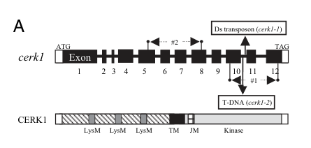

## Question

# Gene Research for Functional Annotation

## ⚠️ CRITICAL: Gene/Protein Identification Context

**BEFORE YOU BEGIN RESEARCH:** You MUST verify you are researching the CORRECT gene/protein. Gene symbols can be ambiguous, especially for less well-characterized genes from non-model organisms.

### Target Gene/Protein Identity (from UniProt):
- **UniProt Accession:** A8R7E6
- **Protein Description:** RecName: Full=Chitin elicitor receptor kinase 1; Short=AtCERK1; EC=2.7.11.1; AltName: Full=LysM domain receptor-like kinase 1; Short=LysM RLK1; Short=LysM-containing receptor-like kinase 1; Flags: Precursor;
- **Gene Information:** Name=CERK1; Synonyms=LYK1, RLK1; OrderedLocusNames=At3g21630; ORFNames=MIL23.20;
- **Organism (full):** Arabidopsis thaliana (Mouse-ear cress).
- **Protein Family:** Belongs to the protein kinase superfamily. Ser/Thr protein
- **Key Domains:** CERK1/LYK3-like. (IPR044812); Kinase-like_dom_sf. (IPR011009); LysM. (IPR018392); LysM2_CERK1_LYK3_4_5. (IPR056562); LysM_RLK3/10. (IPR057097)

### MANDATORY VERIFICATION STEPS:

1. **Check if the gene symbol "CERK1" matches the protein description above**
2. **Verify the organism is correct:** Arabidopsis thaliana (Mouse-ear cress).
3. **Check if protein family/domains align with what you find in literature**
4. **If you find literature for a DIFFERENT gene with the same or similar symbol, STOP**

### If Gene Symbol is Ambiguous or You Cannot Find Relevant Literature:

**DO NOT PROCEED WITH RESEARCH ON A DIFFERENT GENE.** Instead:
- State clearly: "The gene symbol 'CERK1' is ambiguous or literature is limited for this specific protein"
- Explain what you found (e.g., "Found extensive literature on a different gene with the same symbol in a different organism")
- Describe the protein based ONLY on the UniProt information provided above
- Suggest that the protein function can be inferred from domain/family information

### Research Target:

Please provide a comprehensive research report on the gene **CERK1** (gene ID: CERK1, UniProt: A8R7E6) in ARATH.

The research report should be a detailed narrative explaining the function, biological processes, and localization of the gene product. Citations should be given for all claims.

You should prioritize authoritative reviews and primary scientific literature when conducting research. You can supplement
this with annotations you find in gene/protein databases, but these can be outdated or inaccurate.

We are specifically interested in the primary function of the gene - for enzymes, what reaction is catalyzed, and what is the substrate specificity? For transporters, what is the substrate? For structural proteins or adapters, what is the broader structural role? For signaling molecules, what is the role in the pathway.

We are interested in where in or outside the cell the gene product carries out its function.

We are also interested in the signaling or biochemical pathways in which the gene functions. We are less interested in broad pleiotropic effects, except where these elucidate the precise role.

Include evidence where possible. We are interested in both experimental evidence as well as inference from structure, evolution, or bioinformatic analysis. Precise studies should be prioritized over high-throughput, where available.

## Output

Question: You are an expert researcher providing comprehensive, well-cited information.

Provide detailed information focusing on:
1. Key concepts and definitions with current understanding
2. Recent developments and latest research (prioritize 2023-2024 sources)
3. Current applications and real-world implementations
4. Expert opinions and analysis from authoritative sources
5. Relevant statistics and data from recent studies

Format as a comprehensive research report with proper citations. Include URLs and publication dates where available.
Always prioritize recent, authoritative sources and provide specific citations for all major claims.

# Gene Research for Functional Annotation

## ⚠️ CRITICAL: Gene/Protein Identification Context

**BEFORE YOU BEGIN RESEARCH:** You MUST verify you are researching the CORRECT gene/protein. Gene symbols can be ambiguous, especially for less well-characterized genes from non-model organisms.

### Target Gene/Protein Identity (from UniProt):
- **UniProt Accession:** A8R7E6
- **Protein Description:** RecName: Full=Chitin elicitor receptor kinase 1; Short=AtCERK1; EC=2.7.11.1; AltName: Full=LysM domain receptor-like kinase 1; Short=LysM RLK1; Short=LysM-containing receptor-like kinase 1; Flags: Precursor;
- **Gene Information:** Name=CERK1; Synonyms=LYK1, RLK1; OrderedLocusNames=At3g21630; ORFNames=MIL23.20;
- **Organism (full):** Arabidopsis thaliana (Mouse-ear cress).
- **Protein Family:** Belongs to the protein kinase superfamily. Ser/Thr protein
- **Key Domains:** CERK1/LYK3-like. (IPR044812); Kinase-like_dom_sf. (IPR011009); LysM. (IPR018392); LysM2_CERK1_LYK3_4_5. (IPR056562); LysM_RLK3/10. (IPR057097)

### MANDATORY VERIFICATION STEPS:

1. **Check if the gene symbol "CERK1" matches the protein description above**
2. **Verify the organism is correct:** Arabidopsis thaliana (Mouse-ear cress).
3. **Check if protein family/domains align with what you find in literature**
4. **If you find literature for a DIFFERENT gene with the same or similar symbol, STOP**

### If Gene Symbol is Ambiguous or You Cannot Find Relevant Literature:

**DO NOT PROCEED WITH RESEARCH ON A DIFFERENT GENE.** Instead:
- State clearly: "The gene symbol 'CERK1' is ambiguous or literature is limited for this specific protein"
- Explain what you found (e.g., "Found extensive literature on a different gene with the same symbol in a different organism")
- Describe the protein based ONLY on the UniProt information provided above
- Suggest that the protein function can be inferred from domain/family information

### Research Target:

Please provide a comprehensive research report on the gene **CERK1** (gene ID: CERK1, UniProt: A8R7E6) in ARATH.

The research report should be a detailed narrative explaining the function, biological processes, and localization of the gene product. Citations should be given for all claims.

You should prioritize authoritative reviews and primary scientific literature when conducting research. You can supplement
this with annotations you find in gene/protein databases, but these can be outdated or inaccurate.

We are specifically interested in the primary function of the gene - for enzymes, what reaction is catalyzed, and what is the substrate specificity? For transporters, what is the substrate? For structural proteins or adapters, what is the broader structural role? For signaling molecules, what is the role in the pathway.

We are interested in where in or outside the cell the gene product carries out its function.

We are also interested in the signaling or biochemical pathways in which the gene functions. We are less interested in broad pleiotropic effects, except where these elucidate the precise role.

Include evidence where possible. We are interested in both experimental evidence as well as inference from structure, evolution, or bioinformatic analysis. Precise studies should be prioritized over high-throughput, where available.

## Comprehensive research report: Arabidopsis thaliana **CERK1/LYK1** (At3g21630; UniProt **A8R7E6**) — functional annotation

### 0) Target verification (mandatory)
The literature retrieved here consistently matches the UniProt-provided target: **Arabidopsis thaliana** **Chitin elicitor receptor kinase 1 (CERK1)**, also called **LYK1/RLK1**, encoded by **At3g21630**, encoding a **plasma-membrane LysM receptor-like kinase** with **three extracellular LysM domains** and an intracellular **Ser/Thr protein kinase** domain. (vasquez2024celldeathsignaling pages 13-16, miya2007cerk1alysm pages 4-5, miya2007cerk1alysm pages 3-4, miya2007cerk1alysm media be53cc3e)

### 1) Key concepts and definitions (current understanding)

#### 1.1 Pattern recognition receptor (PRR) and chitin-triggered immunity
Plants detect conserved microbe-associated molecular patterns (MAMPs/PAMPs) using **pattern recognition receptors (PRRs)** at the plasma membrane. **Chitin** (a polymer of N-acetylglucosamine in fungal cell walls) is a canonical fungal MAMP that induces **pattern-triggered immunity (PTI)**. CERK1 is a key PRR component required for chitin-induced PTI outputs including MAPK activation, ROS burst, and defense gene induction. (miya2007cerk1alysm pages 4-5, miya2007cerk1alysm pages 3-4)

#### 1.2 CERK1 protein architecture (definition of functional parts)
CERK1 is a single-pass membrane receptor with: (i) an extracellular domain containing **three LysM motifs**, (ii) a **transmembrane (TM)** segment, (iii) a **juxtamembrane (JM)** region, and (iv) a cytosolic **protein kinase domain**. A schematic of these domains is shown in Miya et al. (2007) (Figure 1A). (miya2007cerk1alysm media be53cc3e)

### 2) Molecular function of CERK1: ligand specificity and receptor complex assembly

#### 2.1 Primary molecular function
**Primary function:** CERK1 acts as an essential receptor(-kinase) component for **chitin oligosaccharide perception and signal initiation** at the plasma membrane. Loss-of-function cerk1 mutants lose chitin-elicitor responses (MAPK activation, ROS production, defense gene expression), placing CERK1 at the top of the signaling cascade. (miya2007cerk1alysm pages 4-5, miya2007cerk1alysm pages 3-4)

#### 2.2 Ligand specificity (what is recognized)
Evidence across retrieved sources supports preferential responsiveness to **longer chitin oligomers**; chitin **heptamers/octamers** and the **chitin octamer (GlcNAc)8** are repeatedly referenced as potent elicitors in Arabidopsis CERK1-dependent signaling. (vasquez2024celldeathsignaling pages 13-16, miya2007cerk1alysm pages 3-4, awwanah2020characterizationofpopulus pages 27-30)

#### 2.3 Receptor complex components: CERK1 with LYK5/LKY4 and other LysM proteins
Current models describe CERK1 as operating in a chitin receptor complex involving other LysM proteins, notably **LYK5 and LYK4**, where LYK5 is often described as a high-affinity chitin-binding partner that associates with CERK1 after chitin exposure and becomes phosphorylated by CERK1. (muhr2022characterizationofpopulus pages 37-41, hu2021lysinmotif(lysm) pages 4-5, awwanah2020characterizationofpopulus pages 27-30)

Beyond fungal chitin signaling, CERK1 functionally intersects with additional LysM proteins (e.g., **LYM1/LYM3** in peptidoglycan-triggered responses and **LYM2** in plasmodesmal chitin-associated processes), indicating CERK1 can act as a shared signaling kinase for multiple carbohydrate-related immune perceptions. (vasquez2024celldeathsignaling pages 13-16)

### 3) Enzymatic activity: CERK1 kinase function, key residues, and phosphorylation logic

#### 3.1 CERK1 is an active Ser/Thr kinase (EC 2.7.11.1)
Miya et al. (2007) experimentally demonstrated intrinsic kinase activity of the CERK1 intracellular region, including **autophosphorylation** and phosphorylation of a model substrate (**myelin basic protein, MBP**) in vitro. Importantly, truncation removing the **juxtamembrane** region reduced kinase activity, supporting a regulatory role of JM for catalytic function. (miya2007cerk1alysm pages 4-5, miya2007cerk1alysm pages 3-4)

#### 3.2 Phosphorylation sites and signaling branch control (recent synthesis)
Recent synthesis sources emphasize that **specific CERK1 phosphorylation sites** tune downstream signaling branches. Reported CERK1 residues implicated in chitin signaling include **T479, Y428, T573, and Y557**; at least one synthesis notes that **Y557F** can selectively disrupt ROS production while leaving MAPK activation relatively intact, consistent with a model where CERK1 phosphocodes route signaling into distinct outputs. (moffat2024molecularinsightsinto pages 38-41, muhr2022characterizationofpopulus pages 136-139, meresa2024carbohydrateelicitorinducedplant pages 20-21)

### 4) Downstream signaling pathways and pathway placement

#### 4.1 Canonical PTI outputs downstream of CERK1
CERK1 activation triggers hallmark PTI responses: **MAPK activation**, **reactive oxygen species (ROS) burst**, defense-related **transcriptional reprogramming**, and enhanced resistance to non-adapted pathogens. (miya2007cerk1alysm pages 4-5, miya2007cerk1alysm pages 3-4)

#### 4.2 RLCK relay: CERK1 to receptor-like cytoplasmic kinases (RLCKs)
CERK1 signals through receptor-like cytoplasmic kinases (RLCKs) including **PBL27** and **BIK1** (RLCK-VII family). One 2024 review contextualizes RLCKs as a large Arabidopsis kinase subfamily (~**149 RLCKs**) frequently acting downstream of RLKs in immunity. (moffat2024molecularinsightsinto pages 38-41, zamora2024signalingofplant pages 5-7)

#### 4.3 A mechanistically resolved module: **LYK5–CERK1–PBL27–SLAH3** in stomatal immunity
A well-resolved, experimentally supported signaling module links chitin perception to guard-cell ion fluxes and stomatal defense. Liu et al. (2019) showed that chitin-triggered stomatal closure requires **LYK5 and CERK1**, and requires **PBL27**. Mechanistically, **PBL27 phosphorylates the anion channel SLAH3** at **S127 and S189**, and these sites are required for **chitin-induced stomatal closure** and leaf-level anti-fungal immunity. (liu2019anionchannelslah3 pages 2-3)

### 5) Subcellular localization and receptor trafficking

#### 5.1 Localization
CERK1 is a **plasma membrane protein**. Miya et al. (2007) visualized **CERK1–GFP** at the plasma membrane (Figure 4A; onion epidermal cells). (miya2007cerk1alysm pages 3-4, miya2007cerk1alysm media 06385074)

#### 5.2 Trafficking and negative regulation (current view)
Multiple sources support that receptor complex components are dynamically regulated after activation. A recurring model is that upon chitin perception **LYK5 undergoes CERK1-dependent endocytosis**, while CERK1 is often reported to remain at the plasma membrane; additional negative regulatory processes (e.g., ubiquitin ligases and phosphatases) are proposed to tune receptor abundance and/or phosphorylation state. (moffat2024molecularinsightsinto pages 38-41, hu2021lysinmotif(lysm) pages 9-10, awwanah2020characterizationofpopulus pages 27-30)

### 6) Recent developments and latest research emphasis (prioritize 2023–2024)

#### 6.1 2024 reviews: expanded mechanistic framing and translational context
- **Meresa et al., 2024 (Heliyon, Aug 2024; https://doi.org/10.1016/j.heliyon.2024.e34871)** synthesizes carbohydrate-elicitor immunity and emphasizes CERK1 phosphorylation requirements (including Y428) and conserved contributions of juxtamembrane regions to signaling. (meresa2024carbohydrateelicitorinducedplant pages 20-21)
- **Zamora et al., 2024 (Horticulturae, Apr 2024; https://doi.org/10.3390/horticulturae10040361)** emphasizes CERK1-centered RLK–RLCK–MAPK logic as a template for horticultural crop defense, including roles for RLCKs such as BIK1 in fungal resistance contexts. (zamora2024signalingofplant pages 5-7)

#### 6.2 2024 mechanistic synthesis of CERK1 phosphoregulation and network control
A 2024 dissertation-level synthesis describes CERK1 as a chitin co-receptor kinase in a complex with LYK5, highlights multiple chitin-induced phosphorylation sites (including Thr and Tyr residues), and articulates how specific sites may steer ROS vs MAPK branches. It also summarizes negative regulation via dephosphorylation and ubiquitination/trafficking modules. (moffat2024molecularinsightsinto pages 38-41)

#### 6.3 2024 biological-context studies touching CERK1 signaling outputs
A 2024 preprint/dissertation centered on **cerk1-4** emphasizes CERK1’s role as a primary chitin receptor kinase, details ectodomain features (disulfides/glycosylation), and reiterates preferential responsiveness to longer oligomers such as heptamers/octamers. (vasquez2024celldeathsignaling pages 13-16)

### 7) Current applications and real-world implementations

#### 7.1 Elicitor-based crop protection (chitin/chitooligosaccharides)
Chitin and related carbohydrate elicitors are widely discussed as **plant defense elicitors** with potential to reduce reliance on chemical fungicides. Recent reviews explicitly frame CERK1-centered perception/signaling as foundational to these approaches and to identifying/engineering comparable modules in horticultural crops. (meresa2024carbohydrateelicitorinducedplant pages 20-21, zamora2024signalingofplant pages 5-7)

#### 7.2 Translation of CERK1 pathway logic beyond Arabidopsis
The CERK1–LysM co-receptor–RLCK paradigm is used as a mechanistic reference for crop species, both for understanding endogenous chitin receptor systems and for guiding receptor/module manipulation to improve fungal resistance traits. (zamora2024signalingofplant pages 5-7)

### 8) Expert opinions and authoritative interpretations
Two 2024 reviews (Heliyon; Horticulturae) converge on an expert consensus framing CERK1 as a central receptor-kinase node that integrates carbohydrate perception into RLCK/MAPK signaling and defense outputs, while emphasizing that phosphorylation and receptor complex regulation are key control points and plausible engineering levers. (meresa2024carbohydrateelicitorinducedplant pages 20-21, zamora2024signalingofplant pages 5-7)

### 9) Quantitative statistics and data points from studies

#### 9.1 Global transcriptional dependence on CERK1 (Miya et al., 2007)
Miya et al. (2007) reported that chitin elicitor induced extensive transcriptional changes in wild type (**1,222 genes upregulated; 421 downregulated**) but that this response was almost absent in the cerk1 mutant (**3 upregulated; 2 downregulated**), demonstrating strong CERK1 dependence of elicitor-driven transcription. (miya2007cerk1alysm pages 3-4)

#### 9.2 Quantified disease phenotype (Miya et al., 2007)
Against the incompatible fungus **Alternaria brassicicola**, cerk1-2 showed significantly larger lesions (**1.37 ± 0.57 mm**) compared to Col-0 (**1.14 ± 0.56 mm**), with **n=86** and **n=102**, respectively (**P < 0.01**). (miya2007cerk1alysm pages 3-4)

#### 9.3 Quantified phosphosite requirement in stomatal immunity (Liu et al., 2019)
In the CERK1-dependent guard-cell pathway, **SLAH3 residues S127 and S189** were identified as functionally required phosphorylation sites for chitin-triggered stomatal closure and antifungal immunity, establishing a quantitatively testable mechanistic link between perception and ion channel control. (liu2019anionchannelslah3 pages 2-3)

### 10) Evidence summary table
The following table compiles the major functional-annotation elements supported by the retrieved literature.

| Topic | Key findings | Key sources with year + DOI/URL (no citation IDs) | Notes/limitations |
|---|---|---|---|
| identity/domains | Arabidopsis thaliana CERK1 corresponds to At3g21630 (syn. LYK1/RLK1), a plasma-membrane LysM receptor-like kinase with three extracellular LysM motifs, a transmembrane/juxtamembrane region, and an intracellular Ser/Thr kinase domain. The ectodomain is reported as globular with tightly packed LysMs, disulfide bridges, and glycosylation sites. (vasquez2024celldeathsignaling pages 13-16, miya2007cerk1alysm pages 4-5) | Miya et al., 2007, PNAS, doi:10.1073/pnas.0705147104, https://doi.org/10.1073/pnas.0705147104; Vasquez, 2024, https://doi.org/10.53846/goediss-10844 | Structural fine detail is partly summarized from review/thesis-style sources rather than a primary Arabidopsis structure paper directly retrieved here. |
| ligand specificity | CERK1 is essential for perception/signaling of chitin elicitors; evidence supports preferential recognition of longer chitin oligomers, especially chitin heptamers/octamers, and GlcNAc8-driven receptor activation/dimerization. One source also notes binding to non-branched 1,3-β-D-(Glc) hexasaccharides. All three LysM domains are required for full chitin responsiveness. (awwanah2020characterizationofpopulus pages 27-30, hu2021lysinmotif(lysm) pages 2-4, vasquez2024celldeathsignaling pages 13-16) | Miya et al., 2007, PNAS, doi:10.1073/pnas.0705147104, https://doi.org/10.1073/pnas.0705147104; Hu et al., 2021, Int J Mol Sci, doi:10.3390/ijms22063114, https://doi.org/10.3390/ijms22063114 | Miya et al. 2007 established signaling necessity but did not directly prove Arabidopsis CERK1 ligand binding in the same way as later structural/mechanistic work summarized in secondary sources. |
| receptor complex components | Early model: CERK1 can homodimerize upon chitin binding. Current model: CERK1 functions with LysM co-receptors, especially LYK5 and LYK4; LYK5 is often described as the higher-affinity chitin-binding partner, associates with CERK1 after chitin treatment, and is phosphorylated by CERK1. Other CERK1-associated LysM proteins contribute in different contexts, including LYM1/LYM3 for peptidoglycan signaling and LYM2 for plasmodesmal chitin responses. (awwanah2020characterizationofpopulus pages 27-30, muhr2022characterizationofpopulus pages 37-41, hu2021lysinmotif(lysm) pages 4-5, liu2019anionchannelslah3 pages 2-3) | Liu et al., 2019, eLife, doi:10.7554/eLife.44474, https://doi.org/10.7554/eLife.44474; Hu et al., 2021, Int J Mol Sci, doi:10.3390/ijms22063114, https://doi.org/10.3390/ijms22063114 | Exact stoichiometry and sequence of assembly remain model-dependent across studies; some statements come from synthesized literature rather than one decisive experiment. |
| kinase activity/phosphosites | CERK1 has intrinsic kinase activity with autophosphorylation and myelin basic protein phosphorylation in vitro; the juxtamembrane region is required for kinase function. Reported signaling-relevant phosphosites include T479, Y428, T573, and Y557; Y557F reportedly impairs ROS more than MAPK activation, indicating branch-specific signaling. Chitin-induced phosphorylation is central to activation. (moffat2024molecularinsightsinto pages 38-41, muhr2022characterizationofpopulus pages 136-139, miya2007cerk1alysm pages 4-5, meresa2024carbohydrateelicitorinducedplant pages 20-21, miya2007cerk1alysm pages 3-4) | Miya et al., 2007, PNAS, doi:10.1073/pnas.0705147104, https://doi.org/10.1073/pnas.0705147104; Meresa et al., 2024, Heliyon, doi:10.1016/j.heliyon.2024.e34871, https://doi.org/10.1016/j.heliyon.2024.e34871 | Several phosphosite assignments are summarized from later reviews/theses in the gathered evidence; not all underlying primary phosphosite papers were directly retrieved. |
| downstream signaling | Activated CERK1 signals through RLCK-VII kinases including PBL27, BIK1, and PBL19, linking receptor activation to ROS production, Ca2+ influx, MAPK cascades, defense gene expression, callose deposition, and stomatal immunity. In guard cells, the LYK5-CERK1-PBL27 pathway targets the anion channel SLAH3; PBL27 phosphorylates SLAH3 at S127 and S189, which are required for chitin-induced stomatal closure and antifungal defense. (moffat2024molecularinsightsinto pages 38-41, hu2021lysinmotif(lysm) pages 2-4, liu2019anionchannelslah3 pages 2-3, zamora2024signalingofplant pages 5-7) | Liu et al., 2019, eLife, doi:10.7554/eLife.44474, https://doi.org/10.7554/eLife.44474; Zamora et al., 2024, Horticulturae, doi:10.3390/horticulturae10040361, https://doi.org/10.3390/horticulturae10040361 | Specific pathway branches vary by cell type and readout; some roles of BIK1 vs PBL27 are synthesized across studies/reviews. |
| localization/trafficking | CERK1 is localized to the plasma membrane. After chitin perception, LYK5 undergoes CERK1-dependent endocytosis, whereas CERK1 is often reported to remain at the plasma membrane. Regulatory trafficking modules summarized in recent literature include PUB12/13-mediated turnover, EXO70B2-associated recycling, and dephosphorylation by CIPP1 as negative feedback. (awwanah2020characterizationofpopulus pages 27-30, moffat2024molecularinsightsinto pages 38-41, hu2021lysinmotif(lysm) pages 9-10, miya2007cerk1alysm pages 3-4) | Miya et al., 2007, PNAS, doi:10.1073/pnas.0705147104, https://doi.org/10.1073/pnas.0705147104; Hu et al., 2021, Int J Mol Sci, doi:10.3390/ijms22063114, https://doi.org/10.3390/ijms22063114 | The degradation route for CERK1-complex components is still described as debated in a 2024 synthesis source. |
| quantitative/statistics | In Miya et al. 2007, elicitor-responsive transcription was strongly CERK1-dependent: 1,222 genes were upregulated in WT versus only 3 in cerk1-1, and 421 downregulated in WT versus 2 in cerk1-1. Disease phenotype against Alternaria brassicicola showed lesion size 1.37 ± 0.57 mm in cerk1-2 versus 1.14 ± 0.56 mm in Col-0 (~20% larger), with n=86 and n=102 and P < 0.01. Experimental inoculum included 5 × 10^5 spores mL^-1. (miya2007cerk1alysm pages 4-5, miya2007cerk1alysm pages 3-4) | Miya et al., 2007, PNAS, doi:10.1073/pnas.0705147104, https://doi.org/10.1073/pnas.0705147104 | Quantitative kinetics/binding constants for Arabidopsis CERK1 were limited in the gathered evidence; many recent sources were more mechanistic than numerically detailed. |
| recent developments 2023-2024 | Recent syntheses emphasize CERK1 as an active RD kinase coreceptor in a broader chitin receptor network, with phosphosite-specific signaling outputs, dynamic receptor regulation, and links to systemic resistance after root chitin perception. A 2024 Arabidopsis study found Trichoderma atroviride-induced ISR was compromised in a chitin-receptor mutant, yet soil-applied chitin-triggered systemic resistance was not, suggesting partial separation between beneficial-fungus ISR and canonical chitin-CERK1 signaling. Recent reviews also frame CERK1-centered modules as templates for understanding horticultural crop immunity. (moffat2024molecularinsightsinto pages 32-35, meresa2024carbohydrateelicitorinducedplant pages 20-21, zamora2024signalingofplant pages 5-7) | Meresa et al., 2024, Heliyon, doi:10.1016/j.heliyon.2024.e34871, https://doi.org/10.1016/j.heliyon.2024.e34871; Zamora et al., 2024, Horticulturae, doi:10.3390/horticulturae10040361, https://doi.org/10.3390/horticulturae10040361; Sakai et al., 2024, Microbes Environ, doi:10.1264/jsme2.me24038, https://doi.org/10.1264/jsme2.me24038 | 2023-2024 Arabidopsis CERK1 primary literature in the gathered evidence is limited; some recent insights come from reviews or from studies focused on adjacent pathways/contexts. |
| applications | CERK1 knowledge is being used conceptually for crop protection via carbohydrate elicitors (especially chitin/chitooligosaccharides), receptor engineering, and transfer of LysM receptor modules across species to improve fungal resistance. Reviews highlight use of chitin-based elicitors as alternatives to chemical control and translation of Arabidopsis CERK1-LYK5-PBL27-MAPK paradigms into horticultural crops. (meresa2024carbohydrateelicitorinducedplant pages 20-21, zamora2024signalingofplant pages 5-7) | Meresa et al., 2024, Heliyon, doi:10.1016/j.heliyon.2024.e34871, https://doi.org/10.1016/j.heliyon.2024.e34871; Zamora et al., 2024, Horticulturae, doi:10.3390/horticulturae10040361, https://doi.org/10.3390/horticulturae10040361 | Application evidence here is mostly translational/review-based rather than field-deployed Arabidopsis CERK1 implementations with agronomic performance metrics. |

*Table: This table summarizes literature-supported functional annotation evidence for Arabidopsis thaliana CERK1/LYK1, including receptor identity, ligand recognition, signaling partners, phosphoregulation, localization, quantitative findings, and recent translational relevance.*

### 11) Key limitations of the retrieved evidence set (transparency)
- The evidence set includes high-quality foundational primary papers (notably **PNAS 2007** and **eLife 2019**) but comparatively fewer **2023–2024 primary research articles directly centered on Arabidopsis CERK1**; several 2024 insights here are from reviews or dissertation/preprint-style syntheses rather than peer-reviewed primary reports. (moffat2024molecularinsightsinto pages 38-41, meresa2024carbohydrateelicitorinducedplant pages 20-21, zamora2024signalingofplant pages 5-7)
- Several specific CERK1 phosphosite claims are cited in recent syntheses; the underlying primary phosphosite-mapping papers were not all directly retrieved in full text in this run, so those sites should be treated as **well-supported but secondarily sourced** within this report. (moffat2024molecularinsightsinto pages 38-41, muhr2022characterizationofpopulus pages 136-139, meresa2024carbohydrateelicitorinducedplant pages 20-21)

### 12) Core references (with URLs and publication dates)
- Miya A. et al. **“CERK1, a LysM receptor kinase, is essential for chitin elicitor signaling in Arabidopsis.”** *PNAS* (Dec **2007**). https://doi.org/10.1073/pnas.0705147104 (miya2007cerk1alysm pages 4-5, miya2007cerk1alysm pages 3-4, miya2007cerk1alysm media be53cc3e, miya2007cerk1alysm media 06385074)
- Liu Y. et al. **“Anion channel SLAH3 is a regulatory target of chitin receptor-associated kinase PBL27 in microbial stomatal closure.”** *eLife* (Sep **2019**). https://doi.org/10.7554/eLife.44474 (liu2019anionchannelslah3 pages 2-3)
- Meresa B.K. et al. **“Carbohydrate elicitor-induced plant immunity: Advances and prospects.”** *Heliyon* (Aug **2024**). https://doi.org/10.1016/j.heliyon.2024.e34871 (meresa2024carbohydrateelicitorinducedplant pages 20-21)
- Zamora O.R. et al. **“Signaling of Plant Defense…Triggered by Fungal Chitin in Horticultural Crops.”** *Horticulturae* (Apr **2024**). https://doi.org/10.3390/horticulturae10040361 (zamora2024signalingofplant pages 5-7)
- Hu S.-P. et al. **“Lysin Motif (LysM) Proteins: Interlinking Manipulation of Plant Immunity and Fungi.”** *Int. J. Mol. Sci.* (Mar **2021**). https://doi.org/10.3390/ijms22063114 (hu2021lysinmotif(lysm) pages 9-10, hu2021lysinmotif(lysm) pages 2-4, hu2021lysinmotif(lysm) pages 4-5)

References

1. (vasquez2024celldeathsignaling pages 13-16): Andrea Vasquez. Cell death signaling in the arabidopsis chitin receptor mutant cerk1-4. ArXiv, 2024. URL: https://doi.org/10.53846/goediss-10844, doi:10.53846/goediss-10844. This article has 1 citations.

2. (miya2007cerk1alysm pages 4-5): Ayako Miya, Premkumar Albert, Tomonori Shinya, Yoshitake Desaki, Kazuya Ichimura, Ken Shirasu, Yoshihiro Narusaka, Naoto Kawakami, Hanae Kaku, and Naoto Shibuya. Cerk1, a lysm receptor kinase, is essential for chitin elicitor signaling in arabidopsis. Proceedings of the National Academy of Sciences, 104:19613-19618, Dec 2007. URL: https://doi.org/10.1073/pnas.0705147104, doi:10.1073/pnas.0705147104. This article has 1886 citations and is from a highest quality peer-reviewed journal.

3. (miya2007cerk1alysm pages 3-4): Ayako Miya, Premkumar Albert, Tomonori Shinya, Yoshitake Desaki, Kazuya Ichimura, Ken Shirasu, Yoshihiro Narusaka, Naoto Kawakami, Hanae Kaku, and Naoto Shibuya. Cerk1, a lysm receptor kinase, is essential for chitin elicitor signaling in arabidopsis. Proceedings of the National Academy of Sciences, 104:19613-19618, Dec 2007. URL: https://doi.org/10.1073/pnas.0705147104, doi:10.1073/pnas.0705147104. This article has 1886 citations and is from a highest quality peer-reviewed journal.

4. (miya2007cerk1alysm media be53cc3e): Ayako Miya, Premkumar Albert, Tomonori Shinya, Yoshitake Desaki, Kazuya Ichimura, Ken Shirasu, Yoshihiro Narusaka, Naoto Kawakami, Hanae Kaku, and Naoto Shibuya. Cerk1, a lysm receptor kinase, is essential for chitin elicitor signaling in arabidopsis. Proceedings of the National Academy of Sciences, 104:19613-19618, Dec 2007. URL: https://doi.org/10.1073/pnas.0705147104, doi:10.1073/pnas.0705147104. This article has 1886 citations and is from a highest quality peer-reviewed journal.

5. (awwanah2020characterizationofpopulus pages 27-30): Mo Awwanah. Characterization of populus x canescens lysm-receptor like kinases lyk4/lyk5 and lysm-receptor like protein lym2 and their roles in chitin signaling. Unknown journal, 2020. URL: https://doi.org/10.53846/goediss-7913, doi:10.53846/goediss-7913.

6. (muhr2022characterizationofpopulus pages 37-41): Mascha Muhr. Characterization of populus x canescens lysm receptor-like kinases cerk1-1 and cerk1-2 and their role in chitin signaling. ArXiv, 2022. URL: https://doi.org/10.53846/goediss-9128, doi:10.53846/goediss-9128. This article has 2 citations.

7. (hu2021lysinmotif(lysm) pages 4-5): Shu-Ping Hu, Jun-Jiao Li, Nikhilesh Dhar, Jun-Peng Li, Jie-Yin Chen, Wei Jian, Xiao-Feng Dai, and Xing-Yong Yang. Lysin motif (lysm) proteins: interlinking manipulation of plant immunity and fungi. International Journal of Molecular Sciences, 22:3114, Mar 2021. URL: https://doi.org/10.3390/ijms22063114, doi:10.3390/ijms22063114. This article has 66 citations.

8. (moffat2024molecularinsightsinto pages 38-41): Molecular Insights Into the Perception of Fungal-Derived Molecular Patterns and Its Impact on Disease Resistance This article has 0 citations.

9. (muhr2022characterizationofpopulus pages 136-139): Mascha Muhr. Characterization of populus x canescens lysm receptor-like kinases cerk1-1 and cerk1-2 and their role in chitin signaling. ArXiv, 2022. URL: https://doi.org/10.53846/goediss-9128, doi:10.53846/goediss-9128. This article has 2 citations.

10. (meresa2024carbohydrateelicitorinducedplant pages 20-21): Birhanu Kahsay Meresa, Kiros-Meles Ayimut, Micheale Yifter Weldemichael, Kalayou Hiluf Geberemedhin, Hagos Hailu Kassegn, Bruh Asmelash Geberemikael, and Etsay Mesele Egigu. Carbohydrate elicitor-induced plant immunity: advances and prospects. Heliyon, 10:e34871, Aug 2024. URL: https://doi.org/10.1016/j.heliyon.2024.e34871, doi:10.1016/j.heliyon.2024.e34871. This article has 15 citations.

11. (zamora2024signalingofplant pages 5-7): Orlando Reyes Zamora, Rosalba Troncoso-Rojas, María Elena Báez-Flores, Martín Ernesto Tiznado-Hernández, and Agustín Rascón-Chu. Signaling of plant defense mediated by receptor-like kinases, receptor-like cytoplasmic protein kinases and mapks triggered by fungal chitin in horticultural crops. Horticulturae, 10:361, Apr 2024. URL: https://doi.org/10.3390/horticulturae10040361, doi:10.3390/horticulturae10040361. This article has 15 citations.

12. (liu2019anionchannelslah3 pages 2-3): Yi Liu, Tobias Maierhofer, Katarzyna Rybak, Jan Sklenar, Andy Breakspear, Matthew G Johnston, Judith Fliegmann, Shouguang Huang, M Rob G Roelfsema, Georg Felix, Christine Faulkner, Frank LH Menke, Dietmar Geiger, Rainer Hedrich, and Silke Robatzek. Anion channel slah3 is a regulatory target of chitin receptor-associated kinase pbl27 in microbial stomatal closure. eLife, Sep 2019. URL: https://doi.org/10.7554/elife.44474, doi:10.7554/elife.44474. This article has 76 citations and is from a domain leading peer-reviewed journal.

13. (miya2007cerk1alysm media 06385074): Ayako Miya, Premkumar Albert, Tomonori Shinya, Yoshitake Desaki, Kazuya Ichimura, Ken Shirasu, Yoshihiro Narusaka, Naoto Kawakami, Hanae Kaku, and Naoto Shibuya. Cerk1, a lysm receptor kinase, is essential for chitin elicitor signaling in arabidopsis. Proceedings of the National Academy of Sciences, 104:19613-19618, Dec 2007. URL: https://doi.org/10.1073/pnas.0705147104, doi:10.1073/pnas.0705147104. This article has 1886 citations and is from a highest quality peer-reviewed journal.

14. (hu2021lysinmotif(lysm) pages 9-10): Shu-Ping Hu, Jun-Jiao Li, Nikhilesh Dhar, Jun-Peng Li, Jie-Yin Chen, Wei Jian, Xiao-Feng Dai, and Xing-Yong Yang. Lysin motif (lysm) proteins: interlinking manipulation of plant immunity and fungi. International Journal of Molecular Sciences, 22:3114, Mar 2021. URL: https://doi.org/10.3390/ijms22063114, doi:10.3390/ijms22063114. This article has 66 citations.

15. (hu2021lysinmotif(lysm) pages 2-4): Shu-Ping Hu, Jun-Jiao Li, Nikhilesh Dhar, Jun-Peng Li, Jie-Yin Chen, Wei Jian, Xiao-Feng Dai, and Xing-Yong Yang. Lysin motif (lysm) proteins: interlinking manipulation of plant immunity and fungi. International Journal of Molecular Sciences, 22:3114, Mar 2021. URL: https://doi.org/10.3390/ijms22063114, doi:10.3390/ijms22063114. This article has 66 citations.

16. (moffat2024molecularinsightsinto pages 32-35): Molecular Insights Into the Perception of Fungal-Derived Molecular Patterns and Its Impact on Disease Resistance This article has 0 citations.

## Artifacts

- [Edison artifact artifact-00](CERK1-deep-research-falcon_artifacts/artifact-00.md)

## Citations

1. vasquez2024celldeathsignaling pages 13-16
2. meresa2024carbohydrateelicitorinducedplant pages 20-21
3. zamora2024signalingofplant pages 5-7
4. moffat2024molecularinsightsinto pages 38-41
5. awwanah2020characterizationofpopulus pages 27-30
6. muhr2022characterizationofpopulus pages 37-41
7. muhr2022characterizationofpopulus pages 136-139
8. moffat2024molecularinsightsinto pages 32-35
9. https://doi.org/10.1016/j.heliyon.2024.e34871
10. https://doi.org/10.3390/horticulturae10040361
11. https://doi.org/10.1073/pnas.0705147104;
12. https://doi.org/10.53846/goediss-10844
13. https://doi.org/10.3390/ijms22063114
14. https://doi.org/10.7554/eLife.44474;
15. https://doi.org/10.1073/pnas.0705147104
16. https://doi.org/10.1016/j.heliyon.2024.e34871;
17. https://doi.org/10.3390/horticulturae10040361;
18. https://doi.org/10.1264/jsme2.me24038
19. https://doi.org/10.7554/eLife.44474
20. https://doi.org/10.53846/goediss-10844,
21. https://doi.org/10.1073/pnas.0705147104,
22. https://doi.org/10.53846/goediss-7913,
23. https://doi.org/10.53846/goediss-9128,
24. https://doi.org/10.3390/ijms22063114,
25. https://doi.org/10.1016/j.heliyon.2024.e34871,
26. https://doi.org/10.3390/horticulturae10040361,
27. https://doi.org/10.7554/elife.44474,