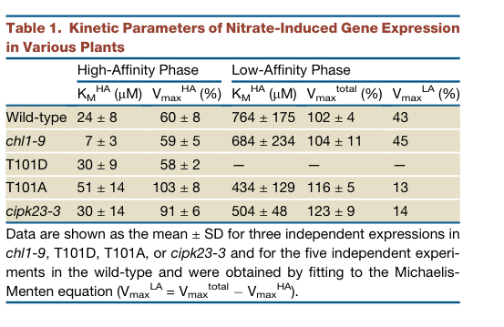

## Question

# Gene Research for Functional Annotation

## ⚠️ CRITICAL: Gene/Protein Identification Context

**BEFORE YOU BEGIN RESEARCH:** You MUST verify you are researching the CORRECT gene/protein. Gene symbols can be ambiguous, especially for less well-characterized genes from non-model organisms.

### Target Gene/Protein Identity (from UniProt):
- **UniProt Accession:** Q05085
- **Protein Description:** RecName: Full=Protein NRT1/ PTR FAMILY 6.3; Short=AtNPF6.3; AltName: Full=Nitrate transporter 1.1; Short=AtNRT1; AltName: Full=Nitrate/chlorate transporter; AltName: Full=Protein CHLORINA 1;
- **Gene Information:** Name=NPF6.3; Synonyms=CHL1, NRT1, NRT1.1; OrderedLocusNames=At1g12110; ORFNames=F12F1.1, T28K15_13;
- **Organism (full):** Arabidopsis thaliana (Mouse-ear cress).
- **Protein Family:** Belongs to the major facilitator superfamily. Proton-
- **Key Domains:** MFS_trans_sf. (IPR036259); POT_fam. (IPR000109); PTR2_symporter_CS. (IPR018456); PTR2 (PF00854)

### MANDATORY VERIFICATION STEPS:

1. **Check if the gene symbol "NPF6.3" matches the protein description above**
2. **Verify the organism is correct:** Arabidopsis thaliana (Mouse-ear cress).
3. **Check if protein family/domains align with what you find in literature**
4. **If you find literature for a DIFFERENT gene with the same or similar symbol, STOP**

### If Gene Symbol is Ambiguous or You Cannot Find Relevant Literature:

**DO NOT PROCEED WITH RESEARCH ON A DIFFERENT GENE.** Instead:
- State clearly: "The gene symbol 'NPF6.3' is ambiguous or literature is limited for this specific protein"
- Explain what you found (e.g., "Found extensive literature on a different gene with the same symbol in a different organism")
- Describe the protein based ONLY on the UniProt information provided above
- Suggest that the protein function can be inferred from domain/family information

### Research Target:

Please provide a comprehensive research report on the gene **NPF6.3** (gene ID: CHL1, UniProt: Q05085) in ARATH.

The research report should be a detailed narrative explaining the function, biological processes, and localization of the gene product. Citations should be given for all claims.

You should prioritize authoritative reviews and primary scientific literature when conducting research. You can supplement
this with annotations you find in gene/protein databases, but these can be outdated or inaccurate.

We are specifically interested in the primary function of the gene - for enzymes, what reaction is catalyzed, and what is the substrate specificity? For transporters, what is the substrate? For structural proteins or adapters, what is the broader structural role? For signaling molecules, what is the role in the pathway.

We are interested in where in or outside the cell the gene product carries out its function.

We are also interested in the signaling or biochemical pathways in which the gene functions. We are less interested in broad pleiotropic effects, except where these elucidate the precise role.

Include evidence where possible. We are interested in both experimental evidence as well as inference from structure, evolution, or bioinformatic analysis. Precise studies should be prioritized over high-throughput, where available.

## Output

Question: You are an expert researcher providing comprehensive, well-cited information.

Provide detailed information focusing on:
1. Key concepts and definitions with current understanding
2. Recent developments and latest research (prioritize 2023-2024 sources)
3. Current applications and real-world implementations
4. Expert opinions and analysis from authoritative sources
5. Relevant statistics and data from recent studies

Format as a comprehensive research report with proper citations. Include URLs and publication dates where available.
Always prioritize recent, authoritative sources and provide specific citations for all major claims.

# Gene Research for Functional Annotation

## ⚠️ CRITICAL: Gene/Protein Identification Context

**BEFORE YOU BEGIN RESEARCH:** You MUST verify you are researching the CORRECT gene/protein. Gene symbols can be ambiguous, especially for less well-characterized genes from non-model organisms.

### Target Gene/Protein Identity (from UniProt):
- **UniProt Accession:** Q05085
- **Protein Description:** RecName: Full=Protein NRT1/ PTR FAMILY 6.3; Short=AtNPF6.3; AltName: Full=Nitrate transporter 1.1; Short=AtNRT1; AltName: Full=Nitrate/chlorate transporter; AltName: Full=Protein CHLORINA 1;
- **Gene Information:** Name=NPF6.3; Synonyms=CHL1, NRT1, NRT1.1; OrderedLocusNames=At1g12110; ORFNames=F12F1.1, T28K15_13;
- **Organism (full):** Arabidopsis thaliana (Mouse-ear cress).
- **Protein Family:** Belongs to the major facilitator superfamily. Proton-
- **Key Domains:** MFS_trans_sf. (IPR036259); POT_fam. (IPR000109); PTR2_symporter_CS. (IPR018456); PTR2 (PF00854)

### MANDATORY VERIFICATION STEPS:

1. **Check if the gene symbol "NPF6.3" matches the protein description above**
2. **Verify the organism is correct:** Arabidopsis thaliana (Mouse-ear cress).
3. **Check if protein family/domains align with what you find in literature**
4. **If you find literature for a DIFFERENT gene with the same or similar symbol, STOP**

### If Gene Symbol is Ambiguous or You Cannot Find Relevant Literature:

**DO NOT PROCEED WITH RESEARCH ON A DIFFERENT GENE.** Instead:
- State clearly: "The gene symbol 'NPF6.3' is ambiguous or literature is limited for this specific protein"
- Explain what you found (e.g., "Found extensive literature on a different gene with the same symbol in a different organism")
- Describe the protein based ONLY on the UniProt information provided above
- Suggest that the protein function can be inferred from domain/family information

### Research Target:

Please provide a comprehensive research report on the gene **NPF6.3** (gene ID: CHL1, UniProt: Q05085) in ARATH.

The research report should be a detailed narrative explaining the function, biological processes, and localization of the gene product. Citations should be given for all claims.

You should prioritize authoritative reviews and primary scientific literature when conducting research. You can supplement
this with annotations you find in gene/protein databases, but these can be outdated or inaccurate.

We are specifically interested in the primary function of the gene - for enzymes, what reaction is catalyzed, and what is the substrate specificity? For transporters, what is the substrate? For structural proteins or adapters, what is the broader structural role? For signaling molecules, what is the role in the pathway.

We are interested in where in or outside the cell the gene product carries out its function.

We are also interested in the signaling or biochemical pathways in which the gene functions. We are less interested in broad pleiotropic effects, except where these elucidate the precise role.

Include evidence where possible. We are interested in both experimental evidence as well as inference from structure, evolution, or bioinformatic analysis. Precise studies should be prioritized over high-throughput, where available.

## Research report: Arabidopsis thaliana NPF6.3 (CHL1/NRT1.1; UniProt Q05085; AT1G12110)

### 1) Gene/protein identity verification (mandatory)
The literature surveyed here corresponds to *Arabidopsis thaliana* **NPF6.3**, also known as **CHL1** and **NRT1.1** (AGI locus **AT1G12110**), matching the UniProt record Q05085 description of an NRT1/PTR (NPF) family transporter in the major facilitator superfamily (MFS). This protein is consistently described as a **plasma-membrane nitrate transporter** with an additional **nitrate-sensing (“transceptor”)** function. (ho2009chl1functionsas pages 1-2, sun2015molecularmechanismunderlying pages 1-2, nedelyaeva2024functionalandmolecular pages 2-4)

### 2) Key concepts and definitions (current understanding)

#### 2.1 NPF6.3 is a dual-affinity nitrate transporter
NPF6.3/CHL1/NRT1.1 is widely regarded as a **dual-affinity** nitrate transporter with **biphasic kinetics**, enabling transport across a wide external nitrate range. A recent 2024 review summarizes the two kinetic phases as **Km ≈ 40–80 µM (high-affinity)** and **Km ≈ 4 mM (low-affinity)**. (nedelyaeva2024functionalandmolecular pages 8-9)

A structural/mechanistic review similarly reports a high-affinity phase around **Km ≈ 50 µM** and low-affinity phase around **Km ≈ 4 mM**, and emphasizes that this dual-affinity behavior is uncommon among NPF family members. (sun2015molecularmechanismunderlying pages 1-2)

#### 2.2 “Transceptor” concept: coupling transport and signaling
A core concept in nitrate biology is that NPF6.3 acts as a **transceptor**—a transporter with receptor-like signaling capability—helping initiate the **primary nitrate response (PNR)** and modulating expression of other nitrate transport genes (e.g., **NRT2.1**) and developmental programs. (ho2009chl1functionsas pages 1-2, sun2015molecularmechanismunderlying pages 1-2)

#### 2.3 Proton-coupled symport mechanism and key residues
NPF6.3 is described as a **proton-coupled nitrate symporter**. Recent mechanistic synthesis highlights essential structural determinants including the **ExxER** motif (linked to proton binding/coupling) and **His356** in the nitrate-binding pocket; mutation of **His356→Ala** abolishes nitrate transport activity. (nedelyaeva2024functionalandmolecular pages 4-7, nedelyaeva2024functionalandmolecular pages 2-4)

The 2024 review also summarizes gating/transition features, including a **K164–E476 salt bridge** involved in pore opening/closing and other residues (e.g., Thr360, Phe511) contributing to substrate specificity/transport. (nedelyaeva2024functionalandmolecular pages 4-7)

### 3) Regulation and pathway context

#### 3.1 Thr101 phosphorylation is the affinity-mode switch
A central and well-supported mechanism is that **Thr101** serves as an affinity-mode switch: phosphorylation favors high-affinity transport, whereas dephosphorylation favors low-affinity transport. This is repeatedly documented in both primary and review literature. (ho2009chl1functionsas pages 1-2, nedelyaeva2024functionalandmolecular pages 2-4, sun2015molecularmechanismunderlying pages 1-2)

A 2024 review further summarizes that in low external nitrate (micromolar range), **CIPK23** phosphorylates Thr101 and this is associated with a shift toward high-affinity behavior, whereas at higher nitrate (millimolar range) the transporter behaves predominantly in low-affinity mode. (nedelyaeva2024functionalandmolecular pages 2-4)

**Visual evidence:** Ho et al. (2009) provide an experimentally grounded summary model for this phosphorylation switch and a kinetic parameter table for nitrate-response behavior (Table 1; Figure 7). (ho2009chl1functionsas media 4ff1d3c7, ho2009chl1functionsas media 07e97324)

#### 3.2 Upstream nitrate-triggered Ca2+ signaling and CBL–CIPK module (recent synthesis)
A 2023 review describes NRT1.1/CHL1 as a plasma-membrane component of nitrate signaling that interfaces with Ca2+ dynamics: NRT1.1 forms a complex with **CNGC15**, and nitrate changes weaken this interaction, enabling CNGC15 Ca2+ channel activity. Nitrate-induced Ca2+ signals are perceived by **CBL1/CBL9**, activating **CIPK23**, which phosphorylates NRT1.1 at Thr101 and shifts apparent affinity from **Km ~4 mM** to **Km ~40 µM**. (jia2023findingbalancein pages 2-4)

#### 3.3 Integration with ABA signaling via ABI2
The same 2023 synthesis reports that **ABI2** can antagonize the CBL1/CIPK23 module (preventing NRT1.1 phosphorylation), while **ABA inhibits ABI2**, providing a mechanistic route for integrating nitrate responses with abiotic-stress hormone signaling. (jia2023findingbalancein pages 2-4)

### 4) Substrates and specificity (transport vs. related phenotypes)

#### 4.1 Nitrate is the primary transported substrate
Across sources, nitrate (NO3−) is the core substrate, and NPF6.3 contributes substantially to nitrate uptake (see statistics below). (nedelyaeva2024functionalandmolecular pages 8-9, sun2015molecularmechanismunderlying pages 1-2)

#### 4.2 Chlorate: historical phenotype linkage
The CHL1 name is linked to chlorate resistance screens; chlorate is a nitrate analog used in genetics, supporting the nitrate-related substrate recognition and historical discovery context. (nedelyaeva2024functionalandmolecular pages 8-9)

#### 4.3 Chloride competition / transport under low nitrate
A 2024 review reports that AtNPF6.3 can mediate chloride transport under low nitrate, and that chloride uptake in oocytes expressing AtNPF6.3 is inhibited by nitrate—supporting **substrate competition** between Cl− and NO3− (with crystallography not showing bound chloride). (nedelyaeva2024functionalandmolecular pages 10-12)

#### 4.4 Auxin-related role in root system architecture (developmental function)
Beyond direct nitrate transport, recent review-level synthesis connects NRT1.1 to auxin-dependent root development. A 2023 review states that NRT1.1 facilitates basipetal auxin transport and negatively regulates auxin biosynthesis/transport-related genes (e.g., TAR2, LAX3), thereby removing auxin from lateral root primordia under low nitrate and inhibiting lateral root growth; when nitrate is higher and NRT1.1 is repressed, auxin can accumulate and lateral root growth proceeds. (aluko2023unlockingthepotentials pages 11-12)

### 5) Localization: where NPF6.3 functions
A 2024 review summarizes that NPF6.3 is expressed throughout the plant but most strongly in roots, and localizes to the **plasma membrane** of **root epidermal** and **vascular** cells, with additional localization reported in **guard cells**—consistent with roles in uptake and long-distance nitrate handling and potentially stomatal physiology. (nedelyaeva2024functionalandmolecular pages 8-9, nedelyaeva2024functionalandmolecular pages 9-10)

### 6) Relevant statistics and quantitative data from studies/reviews

#### 6.1 Kinetic parameters (transport)
- High-affinity phase: **Km ~40–80 µM** (review synthesis) (nedelyaeva2024functionalandmolecular pages 8-9)
- Low-affinity phase: **Km ~4 mM** (review synthesis) (nedelyaeva2024functionalandmolecular pages 8-9)

A structural review reports similar values (Km ≈ 50 µM; 4 mM) and frames them as a hallmark of NRT1.1/NPF6.3 dual-affinity behavior. (sun2015molecularmechanismunderlying pages 1-2)

#### 6.2 Contribution to whole-plant nitrate uptake
A 2024 review estimates that AtNPF6.3 can contribute **~10–80% of whole-plant nitrate uptake**, depending on soil nitrate concentration. (nedelyaeva2024functionalandmolecular pages 8-9)

#### 6.3 Quantitative support for Thr101 switch (primary literature)
Ho et al. (2009) provide quantitative kinetic parameterization (Table 1) of nitrate-response behavior in wild type and mutants affecting the Thr101 phosphorylation state and CIPK23, supporting the Thr101/CIPK23 regulatory model in vivo. (ho2009chl1functionsas pages 3-4, ho2009chl1functionsas media 4ff1d3c7)

### 7) Recent developments and latest research directions (prioritizing 2023–2024)
Recent (2023–2024) authoritative syntheses have expanded NPF6.3’s role from “nitrate uptake transporter” to a **central hub integrating transport, Ca2+ signaling, and hormone/stress pathways**.

- **Signal transduction framing (2023):** NRT1.1’s coupling to a Ca2+ channel module (CNGC15) and to CBL–CIPK23, plus integration with ABI2/ABA, is highlighted as a mechanistic framework for nitrate sensing and signal relay. (jia2023findingbalancein pages 2-4)
- **Structure-to-function detailing (2024):** residue-level determinants (ExxER, His356, Thr101; gating salt bridge) and discussion of **chloride competition** are emphasized as constraints/opportunities for mechanistic interpretation and engineering. (nedelyaeva2024functionalandmolecular pages 4-7, nedelyaeva2024functionalandmolecular pages 10-12)

### 8) Current applications and real-world implementations
Because NPF6.3 orthologs combine uptake and signaling, they are prominent targets for **nitrogen use efficiency (NUE)** and yield improvement strategies.

#### 8.1 Crop engineering inspired by the Arabidopsis NRT1.1 “transceptor” paradigm (expert focus issue)
A 2025 expert synthesis in *The Plant Cell* reports multiple translational strategies in rice involving NRT1.1 orthologs:
- Introgression of an elite **indica OsNRT1.1B allele** into japonica, associated with **up to ~10% higher grain yield and NUE**.
- Structure-guided engineering: a **chimeric transporter NC4N** (built using domains from AtNRT1.1) with **~12-fold higher uptake** than NRT1.2 in assays, and **~8–11% increases in grain yield** with improved NUE in rice field trials.
These are presented as concrete, field-relevant implementations of nitrate-transceptor engineering. (roeder2025translationalinsightsinto pages 7-8)

#### 8.2 Review-level engineering rationale (2023)
A 2023 Frontiers review frames NRT1.1/NPF6.3 as a key lever for NUE because it links nitrate availability to root system architecture via auxin-related mechanisms and regulates downstream nitrate transport gene expression. It also notes practical improvement routes including exploitation of natural allelic variation (e.g., NRT1.1B alleles in rice) and genome editing approaches. (aluko2023unlockingthepotentials pages 11-12, aluko2023unlockingthepotentials pages 1-2)

#### 8.3 Ortholog selection and stress-adaptation considerations (2024)
A 2024 review highlights how orthologs can differ in affinity (e.g., seagrass ZosmaNPF6.3 with Km ~11 µM vs AtNPF6.3 ~50–80 µM) and summarizes evidence that NPF6.3-like genes are promising engineering targets for productivity and stress tolerance—while noting potential complications such as chloride competition and pH effects on transport. (nedelyaeva2024functionalandmolecular pages 10-12)

### 9) Expert opinions and analysis (authoritative sources)
Multiple authoritative sources converge on the view that NPF6.3’s unique value is not only its transport kinetics but its integration of uptake and signaling.

- The primary literature in *Cell* (2009) positions CHL1/NRT1.1 as a nitrate sensor that, via Thr101 phosphorylation control, can operate across wide nitrate ranges and drive nitrate signaling outputs. (ho2009chl1functionsas pages 1-2)
- Recent reviews (2023–2024) emphasize NRT1.1/NPF6.3 as a “nitrate sensor/transceptor” that sits upstream of Ca2+-dependent signal transduction, downstream transcriptional programs, and root developmental remodeling. (jia2023findingbalancein pages 2-4, nedelyaeva2024functionalandmolecular pages 4-7)
- Translational expert commentary (2025) argues that engineering of NRT1.1 orthologs/chimeras can translate Arabidopsis mechanistic insights into **measurable yield and NUE gains** in crops. (roeder2025translationalinsightsinto pages 7-8)

### 10) Evidence map for functional annotation
The following table consolidates the main experimentally supported annotation claims (protein type, substrates, kinetics, regulation, residues, localization, roles) with sources and URLs:

| Category | Finding | Key evidence | Source (with DOI URL and year) |
|---|---|---|---|
| Protein identity / family | Arabidopsis thaliana NPF6.3, also called CHL1/NRT1.1 (At1g12110; UniProt Q05085), is an NPF/NRT1/PTR-family major facilitator superfamily transporter functioning as a plasma-membrane nitrate transceptor. | Reviews and primary literature consistently identify CHL1/NPF6.3 as the first cloned plant nitrate transporter, a member of the NPF (NRT1/PTR) family, with both transport and sensing functions. Structural summaries place it in the proton-coupled NPF clade. (ho2009chl1functionsas pages 1-2, sun2015molecularmechanismunderlying pages 1-2, nedelyaeva2024functionalandmolecular pages 2-4) | Ho et al., *Cell* (2009), https://doi.org/10.1016/j.cell.2009.07.004; Sun & Zheng, *Front. Physiol.* (2015), https://doi.org/10.3389/fphys.2015.00386; Nedelyaeva et al., *Int. J. Mol. Sci.* (2024), https://doi.org/10.3390/ijms252413648 |
| Primary substrate | The primary substrate is nitrate (NO3−), transported by proton-coupled symport. | AtNPF6.3 shows nitrate transport in heterologous systems and in planta, with proposed 2 H+/1 NO3− stoichiometry and essential proton/nitrate-binding features including the ExxER motif and His356. (nedelyaeva2024functionalandmolecular pages 2-4, nedelyaeva2024functionalandmolecular pages 4-7, sun2015molecularmechanismunderlying pages 1-2) | Nedelyaeva et al. (2024), https://doi.org/10.3390/ijms252413648; Sun & Zheng (2015), https://doi.org/10.3389/fphys.2015.00386 |
| Chlorate relationship | CHL1 was originally identified through chlorate-related phenotypes; chlorate is a nitrate analog linked to the gene’s historical naming. | The CHL1 name derives from chlorate resistance, reflecting recognition of chlorate as a structural analog of nitrate in genetic studies, although the strongest direct functional evidence centers on nitrate transport. (nedelyaeva2024functionalandmolecular pages 8-9) | Nedelyaeva et al. (2024), https://doi.org/10.3390/ijms252413648 |
| Chloride competition | AtNPF6.3 can mediate chloride transport under low-nitrate conditions, and chloride uptake is inhibited by nitrate, indicating competition between Cl− and NO3−. | Oocyte and review evidence indicate chloride-transport activity when nitrate is scarce; nitrate competitively suppresses chloride uptake, and no bound chloride was seen crystallographically. (nedelyaeva2024functionalandmolecular pages 10-12) | Nedelyaeva et al. (2024), https://doi.org/10.3390/ijms252413648 |
| Auxin-related function | NPF6.3 is also linked to auxin transport/signaling, helping connect nitrate availability to root developmental responses. | Recent reviews summarize AtNPF6.3 as having auxin-transport-related activity/signaling consequences; under low nitrate it promotes auxin removal from lateral root primordia, restraining lateral root growth, whereas higher nitrate relieves this effect. (nedelyaeva2024functionalandmolecular pages 4-7, aluko2023unlockingthepotentials pages 11-12) | Nedelyaeva et al. (2024), https://doi.org/10.3390/ijms252413648; Aluko et al., *Front. Plant Sci.* (2023), https://doi.org/10.3389/fpls.2023.1074839 |
| Dual-affinity kinetics | NPF6.3 is a dual-affinity nitrate transporter with biphasic kinetics. | Reported kinetic values are ~40–80 µM (or ~50 µM) for the high-affinity mode and ~4 mM (or ~5 mM) for the low-affinity mode. (nedelyaeva2024functionalandmolecular pages 8-9, sun2015molecularmechanismunderlying pages 1-2, ho2009chl1functionsas pages 1-2) | Nedelyaeva et al. (2024), https://doi.org/10.3390/ijms252413648; Sun & Zheng (2015), https://doi.org/10.3389/fphys.2015.00386; Ho et al. (2009), https://doi.org/10.1016/j.cell.2009.07.004 |
| Regulatory switch | Thr101 is the key affinity-mode switch: phosphorylation favors high-affinity transport, dephosphorylation favors low-affinity transport. | Thr101 phosphomimic and non-phosphorylatable mutants convert the transporter to monophasic high- or low-affinity behavior; phosphorylation increases conformational flexibility and can increase nitrate uptake rate. (nedelyaeva2024functionalandmolecular pages 2-4, sun2015molecularmechanismunderlying pages 1-2, ho2009chl1functionsas pages 3-4, ho2009chl1functionsas media 4ff1d3c7) | Nedelyaeva et al. (2024), https://doi.org/10.3390/ijms252413648; Sun & Zheng (2015), https://doi.org/10.3389/fphys.2015.00386; Ho et al. (2009), https://doi.org/10.1016/j.cell.2009.07.004 |
| Upstream kinase module | CBL1/CBL9-CIPK23 phosphorylates NPF6.3 at Thr101 in nitrate/Ca2+ signaling. | Nitrate-triggered Ca2+ signals activate CBL1/9 and CIPK23; CIPK23 directly phosphorylates Thr101 and is central to switching NPF6.3 between affinity states and nitrate signaling outputs. (ho2009chl1functionsas pages 1-2, jia2023findingbalancein pages 2-4, nedelyaeva2024functionalandmolecular pages 2-4) | Ho et al. (2009), https://doi.org/10.1016/j.cell.2009.07.004; Jia et al., *Int. J. Mol. Sci.* (2023), https://doi.org/10.3390/ijms241914406; Nedelyaeva et al. (2024), https://doi.org/10.3390/ijms252413648 |
| ABI2 / ABA regulation | ABI2 antagonizes the CBL1/9-CIPK23 pathway, while ABA inhibits ABI2, thereby favoring NPF6.3 phosphorylation. | Review evidence indicates ABI2 dephosphorylates pathway components to block NPF6.3 phosphorylation; ABA inhibits ABI2, integrating nitrate and ABA signaling. (jia2023findingbalancein pages 2-4) | Jia et al. (2023), https://doi.org/10.3390/ijms241914406 |
| Additional signaling partners | NPF6.3 participates in early nitrate signaling with Ca2+ channels and other nitrate-response regulators. | NRT1.1 forms a complex with CNGC15, and changing nitrate weakens this interaction to enable nitrate-induced Ca2+ signaling; CIPK8 positively regulates low-affinity nitrate responses. (jia2023findingbalancein pages 2-4, ho2009chl1functionsas pages 1-2) | Jia et al. (2023), https://doi.org/10.3390/ijms241914406; Ho et al. (2009), https://doi.org/10.1016/j.cell.2009.07.004 |
| Mechanistic residues / motifs | Key mechanistic features include the ExxER proton-binding motif, His356 in the nitrate-binding pocket, Thr101 near the dimer interface, the K164–E476 salt bridge, and Pro492 involved in transport regulation. | His356Ala abolishes nitrate transport; ExxER and H356 are required for proton-coupled transport; K164–E476 acts as a gating salt bridge; Pro492 is important for transport but dispensable for sensory function; Thr101 controls the affinity switch. (nedelyaeva2024functionalandmolecular pages 4-7, nedelyaeva2024functionalandmolecular pages 2-4) | Nedelyaeva et al. (2024), https://doi.org/10.3390/ijms252413648 |
| Oligomeric/structural mechanism | Unmodified NPF6.3 forms homodimers; phosphorylation-linked changes in dimer coupling/flexibility underlie affinity conversion. | Structural analyses show dimeric NPF6.3 with Thr101 close to the dimer interface; phosphorylation promotes higher flexibility and favors the high-affinity state. (nedelyaeva2024functionalandmolecular pages 2-4, sun2015molecularmechanismunderlying pages 1-2) | Nedelyaeva et al. (2024), https://doi.org/10.3390/ijms252413648; Sun & Zheng (2015), https://doi.org/10.3389/fphys.2015.00386 |
| Subcellular and tissue localization | NPF6.3 localizes to the plasma membrane, especially in root epidermal and vascular cells, and is also reported in guard cells. | Reviews summarize expression throughout the plant with strongest root expression; protein localization is reported in plasma membranes of root epidermis and vasculature, with additional guard-cell localization. (nedelyaeva2024functionalandmolecular pages 8-9, nedelyaeva2024functionalandmolecular pages 9-10) | Nedelyaeva et al. (2024), https://doi.org/10.3390/ijms252413648 |
| Physiological role: nitrate uptake | NPF6.3 contributes substantially to root nitrate uptake over a broad external nitrate range. | Depending on external nitrate concentration, AtNPF6.3 has been estimated to contribute roughly 10–80% of whole-plant nitrate uptake. (nedelyaeva2024functionalandmolecular pages 8-9) | Nedelyaeva et al. (2024), https://doi.org/10.3390/ijms252413648 |
| Physiological role: nitrate sensing / primary nitrate response | NPF6.3 is a bona fide nitrate sensor/transceptor required for normal primary nitrate responses. | Mutant analyses (e.g., chl1 alleles) separate uptake from signaling defects and show that CHL1 controls nitrate-responsive gene expression and signaling across high- and low-nitrate ranges. (ho2009chl1functionsas pages 1-2, ho2009chl1functionsas pages 3-4) | Ho et al. (2009), https://doi.org/10.1016/j.cell.2009.07.004 |
| Physiological role: regulation of NRT2.1 and nitrate-response genes | NPF6.3 regulates expression of other nitrate transport/signaling genes, including NRT2.1. | NRT1.1/NPF6.3 is described as regulating expression of NRT2.1 and other primary nitrate-response genes; altered Thr101 status changes these transcriptional outputs. (sun2015molecularmechanismunderlying pages 1-2, ho2009chl1functionsas pages 3-4) | Sun & Zheng (2015), https://doi.org/10.3389/fphys.2015.00386; Ho et al. (2009), https://doi.org/10.1016/j.cell.2009.07.004 |
| Physiological role: root architecture | NPF6.3 links local nitrate supply to lateral root development through nitrate signaling and auxin-related mechanisms. | Reviews describe NPF6.3-mediated repression of lateral root growth under low nitrate via auxin transport/removal, while nitrate-dependent changes in Thr101 signaling influence root development and Ca2+ signaling outputs. (aluko2023unlockingthepotentials pages 11-12, jia2023findingbalancein pages 2-4) | Aluko et al. (2023), https://doi.org/10.3389/fpls.2023.1074839; Jia et al. (2023), https://doi.org/10.3390/ijms241914406 |

*Table: This table summarizes experimentally supported functional annotation facts for Arabidopsis NPF6.3/CHL1/NRT1.1, including transport properties, regulation, mechanism, localization, and physiological roles. It is useful as a compact evidence map for validating gene function and pathway context.*

### References (URLs and publication dates)
- Ho CH, Lin SH, Hu HC, Tsay YF. **“CHL1 Functions as a Nitrate Sensor in Plants.”** *Cell* (Sep 2009). https://doi.org/10.1016/j.cell.2009.07.004 (ho2009chl1functionsas pages 1-2, ho2009chl1functionsas pages 3-4, ho2009chl1functionsas media 4ff1d3c7, ho2009chl1functionsas media 07e97324)
- Sun J, Zheng N. **“Molecular Mechanism Underlying the Plant NRT1.1 Dual-Affinity Nitrate Transporter.”** *Frontiers in Physiology* (Dec 2015). https://doi.org/10.3389/fphys.2015.00386 (sun2015molecularmechanismunderlying pages 1-2)
- Jia Y, Qin D, Zheng Y, Wang Y. **“Finding Balance in Adversity: Nitrate Signaling as the Key to Plant Growth, Resilience, and Stress Response.”** *International Journal of Molecular Sciences* (Sep 2023). https://doi.org/10.3390/ijms241914406 (jia2023findingbalancein pages 2-4)
- Aluko OO et al. **“Unlocking the potentials of nitrate transporters at improving plant nitrogen use efficiency.”** *Frontiers in Plant Science* (Feb 2023). https://doi.org/10.3389/fpls.2023.1074839 (aluko2023unlockingthepotentials pages 11-12, aluko2023unlockingthepotentials pages 1-2, aluko2023unlockingthepotentials pages 10-11)
- Nedelyaeva OI et al. **“Functional and Molecular Characterization of Plant Nitrate Transporters Belonging to NPF (NRT1/PTR) 6 Subfamily.”** *International Journal of Molecular Sciences* (Dec 2024). https://doi.org/10.3390/ijms252413648 (nedelyaeva2024functionalandmolecular pages 4-7, nedelyaeva2024functionalandmolecular pages 2-4, nedelyaeva2024functionalandmolecular pages 8-9, nedelyaeva2024functionalandmolecular pages 10-12, nedelyaeva2024functionalandmolecular pages 9-10)
- Roeder AHK et al. **“Translational insights into abiotic interactions: From Arabidopsis to crop plants.”** *The Plant Cell* (Jun 2025). https://doi.org/10.1093/plcell/koaf140 (roeder2025translationalinsightsinto pages 7-8)

References

1. (ho2009chl1functionsas pages 1-2): Cheng-Hsun Ho, Shan-Hua Lin, Heng-Cheng Hu, and Yi-Fang Tsay. Chl1 functions as a nitrate sensor in plants. Cell, 138:1184-1194, Sep 2009. URL: https://doi.org/10.1016/j.cell.2009.07.004, doi:10.1016/j.cell.2009.07.004. This article has 1535 citations and is from a highest quality peer-reviewed journal.

2. (sun2015molecularmechanismunderlying pages 1-2): Ji Sun and Ning Zheng. Molecular mechanism underlying the plant nrt1.1 dual-affinity nitrate transporter. Frontiers in Physiology, Dec 2015. URL: https://doi.org/10.3389/fphys.2015.00386, doi:10.3389/fphys.2015.00386. This article has 89 citations.

3. (nedelyaeva2024functionalandmolecular pages 2-4): Olga I. Nedelyaeva, Dmitry E. Khramov, Yurii V. Balnokin, and Vadim S. Volkov. Functional and molecular characterization of plant nitrate transporters belonging to npf (nrt1/ptr) 6 subfamily. International Journal of Molecular Sciences, 25:13648, Dec 2024. URL: https://doi.org/10.3390/ijms252413648, doi:10.3390/ijms252413648. This article has 14 citations.

4. (nedelyaeva2024functionalandmolecular pages 8-9): Olga I. Nedelyaeva, Dmitry E. Khramov, Yurii V. Balnokin, and Vadim S. Volkov. Functional and molecular characterization of plant nitrate transporters belonging to npf (nrt1/ptr) 6 subfamily. International Journal of Molecular Sciences, 25:13648, Dec 2024. URL: https://doi.org/10.3390/ijms252413648, doi:10.3390/ijms252413648. This article has 14 citations.

5. (nedelyaeva2024functionalandmolecular pages 4-7): Olga I. Nedelyaeva, Dmitry E. Khramov, Yurii V. Balnokin, and Vadim S. Volkov. Functional and molecular characterization of plant nitrate transporters belonging to npf (nrt1/ptr) 6 subfamily. International Journal of Molecular Sciences, 25:13648, Dec 2024. URL: https://doi.org/10.3390/ijms252413648, doi:10.3390/ijms252413648. This article has 14 citations.

6. (ho2009chl1functionsas media 4ff1d3c7): Cheng-Hsun Ho, Shan-Hua Lin, Heng-Cheng Hu, and Yi-Fang Tsay. Chl1 functions as a nitrate sensor in plants. Cell, 138:1184-1194, Sep 2009. URL: https://doi.org/10.1016/j.cell.2009.07.004, doi:10.1016/j.cell.2009.07.004. This article has 1535 citations and is from a highest quality peer-reviewed journal.

7. (ho2009chl1functionsas media 07e97324): Cheng-Hsun Ho, Shan-Hua Lin, Heng-Cheng Hu, and Yi-Fang Tsay. Chl1 functions as a nitrate sensor in plants. Cell, 138:1184-1194, Sep 2009. URL: https://doi.org/10.1016/j.cell.2009.07.004, doi:10.1016/j.cell.2009.07.004. This article has 1535 citations and is from a highest quality peer-reviewed journal.

8. (jia2023findingbalancein pages 2-4): Yancong Jia, Debin Qin, Yulu Zheng, and Yang Wang. Finding balance in adversity: nitrate signaling as the key to plant growth, resilience, and stress response. International Journal of Molecular Sciences, 24:14406, Sep 2023. URL: https://doi.org/10.3390/ijms241914406, doi:10.3390/ijms241914406. This article has 22 citations.

9. (nedelyaeva2024functionalandmolecular pages 10-12): Olga I. Nedelyaeva, Dmitry E. Khramov, Yurii V. Balnokin, and Vadim S. Volkov. Functional and molecular characterization of plant nitrate transporters belonging to npf (nrt1/ptr) 6 subfamily. International Journal of Molecular Sciences, 25:13648, Dec 2024. URL: https://doi.org/10.3390/ijms252413648, doi:10.3390/ijms252413648. This article has 14 citations.

10. (aluko2023unlockingthepotentials pages 11-12): Oluwaseun Olayemi Aluko, Surya Kant, Oluwafemi Michael Adedire, Chuanzong Li, Guang Yuan, Haobao Liu, and Qian Wang. Unlocking the potentials of nitrate transporters at improving plant nitrogen use efficiency. Frontiers in Plant Science, Feb 2023. URL: https://doi.org/10.3389/fpls.2023.1074839, doi:10.3389/fpls.2023.1074839. This article has 67 citations.

11. (nedelyaeva2024functionalandmolecular pages 9-10): Olga I. Nedelyaeva, Dmitry E. Khramov, Yurii V. Balnokin, and Vadim S. Volkov. Functional and molecular characterization of plant nitrate transporters belonging to npf (nrt1/ptr) 6 subfamily. International Journal of Molecular Sciences, 25:13648, Dec 2024. URL: https://doi.org/10.3390/ijms252413648, doi:10.3390/ijms252413648. This article has 14 citations.

12. (ho2009chl1functionsas pages 3-4): Cheng-Hsun Ho, Shan-Hua Lin, Heng-Cheng Hu, and Yi-Fang Tsay. Chl1 functions as a nitrate sensor in plants. Cell, 138:1184-1194, Sep 2009. URL: https://doi.org/10.1016/j.cell.2009.07.004, doi:10.1016/j.cell.2009.07.004. This article has 1535 citations and is from a highest quality peer-reviewed journal.

13. (roeder2025translationalinsightsinto pages 7-8): Adrienne H K Roeder, Yiting Shi, Shuhua Yang, Mohamad Abbas, Rashmi Sasidharan, Marcelo J Yanovsky, Jorge José Casal, Sandrine Ruffel, Nicolaus von Wirén, Sarah M Assmann, Noah A Kinscherf, Arkadipta Bakshi, Burcu Alptekin, Simon Gilroy, Malleshaiah SharathKumar, Salomé Prat, and Cristiana T Argueso. Translational insights into abiotic interactions: from arabidopsis to crop plants. The Plant Cell, Jun 2025. URL: https://doi.org/10.1093/plcell/koaf140, doi:10.1093/plcell/koaf140. This article has 12 citations.

14. (aluko2023unlockingthepotentials pages 1-2): Oluwaseun Olayemi Aluko, Surya Kant, Oluwafemi Michael Adedire, Chuanzong Li, Guang Yuan, Haobao Liu, and Qian Wang. Unlocking the potentials of nitrate transporters at improving plant nitrogen use efficiency. Frontiers in Plant Science, Feb 2023. URL: https://doi.org/10.3389/fpls.2023.1074839, doi:10.3389/fpls.2023.1074839. This article has 67 citations.

15. (aluko2023unlockingthepotentials pages 10-11): Oluwaseun Olayemi Aluko, Surya Kant, Oluwafemi Michael Adedire, Chuanzong Li, Guang Yuan, Haobao Liu, and Qian Wang. Unlocking the potentials of nitrate transporters at improving plant nitrogen use efficiency. Frontiers in Plant Science, Feb 2023. URL: https://doi.org/10.3389/fpls.2023.1074839, doi:10.3389/fpls.2023.1074839. This article has 67 citations.

## Artifacts

- [Edison artifact artifact-00](CHL1-deep-research-falcon_artifacts/artifact-00.md)

## Citations

1. nedelyaeva2024functionalandmolecular pages 8-9
2. sun2015molecularmechanismunderlying pages 1-2
3. nedelyaeva2024functionalandmolecular pages 4-7
4. nedelyaeva2024functionalandmolecular pages 2-4
5. jia2023findingbalancein pages 2-4
6. nedelyaeva2024functionalandmolecular pages 10-12
7. aluko2023unlockingthepotentials pages 11-12
8. roeder2025translationalinsightsinto pages 7-8
9. nedelyaeva2024functionalandmolecular pages 9-10
10. aluko2023unlockingthepotentials pages 1-2
11. aluko2023unlockingthepotentials pages 10-11
12. https://doi.org/10.1016/j.cell.2009.07.004;
13. https://doi.org/10.3389/fphys.2015.00386;
14. https://doi.org/10.3390/ijms252413648
15. https://doi.org/10.3390/ijms252413648;
16. https://doi.org/10.3389/fphys.2015.00386
17. https://doi.org/10.3389/fpls.2023.1074839
18. https://doi.org/10.1016/j.cell.2009.07.004
19. https://doi.org/10.3390/ijms241914406;
20. https://doi.org/10.3390/ijms241914406
21. https://doi.org/10.3389/fpls.2023.1074839;
22. https://doi.org/10.1093/plcell/koaf140
23. https://doi.org/10.1016/j.cell.2009.07.004,
24. https://doi.org/10.3389/fphys.2015.00386,
25. https://doi.org/10.3390/ijms252413648,
26. https://doi.org/10.3390/ijms241914406,
27. https://doi.org/10.3389/fpls.2023.1074839,
28. https://doi.org/10.1093/plcell/koaf140,