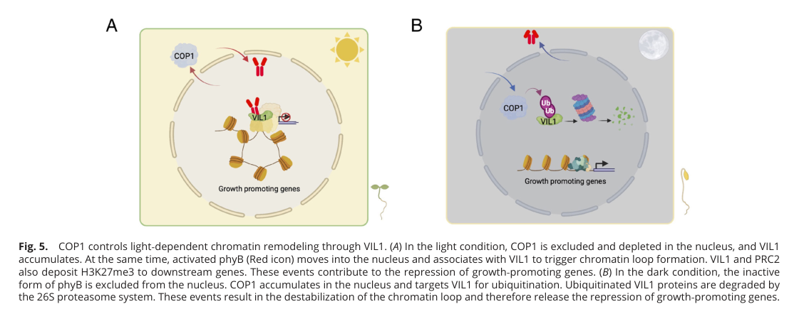

## Question

# Gene Research for Functional Annotation

## ⚠️ CRITICAL: Gene/Protein Identification Context

**BEFORE YOU BEGIN RESEARCH:** You MUST verify you are researching the CORRECT gene/protein. Gene symbols can be ambiguous, especially for less well-characterized genes from non-model organisms.

### Target Gene/Protein Identity (from UniProt):
- **UniProt Accession:** P43254
- **Protein Description:** RecName: Full=E3 ubiquitin-protein ligase COP1 {ECO:0000303|PubMed:1423630}; EC=2.3.2.27 {ECO:0000269|PubMed:14597662}; AltName: Full=Constitutive photomorphogenesis protein 1 {ECO:0000303|PubMed:1423630}; AltName: Full=RING-type E3 ubiquitin transferase COP1 {ECO:0000303|PubMed:1423630};
- **Gene Information:** Name=COP1 {ECO:0000303|PubMed:1423630}; OrderedLocusNames=At2g32950 {ECO:0000312|Araport:AT2G32950}; ORFNames=T21L14.11 {ECO:0000312|EMBL:AAB91983.1};
- **Organism (full):** Arabidopsis thaliana (Mouse-ear cress).
- **Protein Family:** Not specified in UniProt
- **Key Domains:** COP1. (IPR042755); WD40/YVTN_repeat-like_dom_sf. (IPR015943); WD40_repeat_CS. (IPR019775); WD40_repeat_dom_sf. (IPR036322); WD40_rpt. (IPR001680)

### MANDATORY VERIFICATION STEPS:

1. **Check if the gene symbol "COP1" matches the protein description above**
2. **Verify the organism is correct:** Arabidopsis thaliana (Mouse-ear cress).
3. **Check if protein family/domains align with what you find in literature**
4. **If you find literature for a DIFFERENT gene with the same or similar symbol, STOP**

### If Gene Symbol is Ambiguous or You Cannot Find Relevant Literature:

**DO NOT PROCEED WITH RESEARCH ON A DIFFERENT GENE.** Instead:
- State clearly: "The gene symbol 'COP1' is ambiguous or literature is limited for this specific protein"
- Explain what you found (e.g., "Found extensive literature on a different gene with the same symbol in a different organism")
- Describe the protein based ONLY on the UniProt information provided above
- Suggest that the protein function can be inferred from domain/family information

### Research Target:

Please provide a comprehensive research report on the gene **COP1** (gene ID: COP1, UniProt: P43254) in ARATH.

The research report should be a detailed narrative explaining the function, biological processes, and localization of the gene product. Citations should be given for all claims.

You should prioritize authoritative reviews and primary scientific literature when conducting research. You can supplement
this with annotations you find in gene/protein databases, but these can be outdated or inaccurate.

We are specifically interested in the primary function of the gene - for enzymes, what reaction is catalyzed, and what is the substrate specificity? For transporters, what is the substrate? For structural proteins or adapters, what is the broader structural role? For signaling molecules, what is the role in the pathway.

We are interested in where in or outside the cell the gene product carries out its function.

We are also interested in the signaling or biochemical pathways in which the gene functions. We are less interested in broad pleiotropic effects, except where these elucidate the precise role.

Include evidence where possible. We are interested in both experimental evidence as well as inference from structure, evolution, or bioinformatic analysis. Precise studies should be prioritized over high-throughput, where available.

## Output

Question: You are an expert researcher providing comprehensive, well-cited information.

Provide detailed information focusing on:
1. Key concepts and definitions with current understanding
2. Recent developments and latest research (prioritize 2023-2024 sources)
3. Current applications and real-world implementations
4. Expert opinions and analysis from authoritative sources
5. Relevant statistics and data from recent studies

Format as a comprehensive research report with proper citations. Include URLs and publication dates where available.
Always prioritize recent, authoritative sources and provide specific citations for all major claims.

# Gene Research for Functional Annotation

## ⚠️ CRITICAL: Gene/Protein Identification Context

**BEFORE YOU BEGIN RESEARCH:** You MUST verify you are researching the CORRECT gene/protein. Gene symbols can be ambiguous, especially for less well-characterized genes from non-model organisms.

### Target Gene/Protein Identity (from UniProt):
- **UniProt Accession:** P43254
- **Protein Description:** RecName: Full=E3 ubiquitin-protein ligase COP1 {ECO:0000303|PubMed:1423630}; EC=2.3.2.27 {ECO:0000269|PubMed:14597662}; AltName: Full=Constitutive photomorphogenesis protein 1 {ECO:0000303|PubMed:1423630}; AltName: Full=RING-type E3 ubiquitin transferase COP1 {ECO:0000303|PubMed:1423630};
- **Gene Information:** Name=COP1 {ECO:0000303|PubMed:1423630}; OrderedLocusNames=At2g32950 {ECO:0000312|Araport:AT2G32950}; ORFNames=T21L14.11 {ECO:0000312|EMBL:AAB91983.1};
- **Organism (full):** Arabidopsis thaliana (Mouse-ear cress).
- **Protein Family:** Not specified in UniProt
- **Key Domains:** COP1. (IPR042755); WD40/YVTN_repeat-like_dom_sf. (IPR015943); WD40_repeat_CS. (IPR019775); WD40_repeat_dom_sf. (IPR036322); WD40_rpt. (IPR001680)

### MANDATORY VERIFICATION STEPS:

1. **Check if the gene symbol "COP1" matches the protein description above**
2. **Verify the organism is correct:** Arabidopsis thaliana (Mouse-ear cress).
3. **Check if protein family/domains align with what you find in literature**
4. **If you find literature for a DIFFERENT gene with the same or similar symbol, STOP**

### If Gene Symbol is Ambiguous or You Cannot Find Relevant Literature:

**DO NOT PROCEED WITH RESEARCH ON A DIFFERENT GENE.** Instead:
- State clearly: "The gene symbol 'COP1' is ambiguous or literature is limited for this specific protein"
- Explain what you found (e.g., "Found extensive literature on a different gene with the same symbol in a different organism")
- Describe the protein based ONLY on the UniProt information provided above
- Suggest that the protein function can be inferred from domain/family information

### Research Target:

Please provide a comprehensive research report on the gene **COP1** (gene ID: COP1, UniProt: P43254) in ARATH.

The research report should be a detailed narrative explaining the function, biological processes, and localization of the gene product. Citations should be given for all claims.

You should prioritize authoritative reviews and primary scientific literature when conducting research. You can supplement
this with annotations you find in gene/protein databases, but these can be outdated or inaccurate.

We are specifically interested in the primary function of the gene - for enzymes, what reaction is catalyzed, and what is the substrate specificity? For transporters, what is the substrate? For structural proteins or adapters, what is the broader structural role? For signaling molecules, what is the role in the pathway.

We are interested in where in or outside the cell the gene product carries out its function.

We are also interested in the signaling or biochemical pathways in which the gene functions. We are less interested in broad pleiotropic effects, except where these elucidate the precise role.

Include evidence where possible. We are interested in both experimental evidence as well as inference from structure, evolution, or bioinformatic analysis. Precise studies should be prioritized over high-throughput, where available.

# Research report: Arabidopsis thaliana COP1 (UniProt P43254; At2g32950)

## 1) Identity verification and scope control (disambiguation)
The target is **Arabidopsis thaliana CONSTITUTIVE PHOTOMORPHOGENIC 1 (COP1)**, an **E3 ubiquitin-protein ligase** that functions as a central **repressor of photomorphogenesis**. In the Arabidopsis literature used here, COP1 is consistently described as a ~**76 kDa** RING-type E3 ligase with **N-terminal RING**, **central coiled-coil**, and **C-terminal WD40 repeats**, matching the UniProt P43254 identity and its domain architecture. (boycheva2024howhistoneacetyltransferases pages 7-9, ponnu2021illuminatingthecop1spa pages 1-2, han2020thephotomorphogeniccentral pages 2-3, ponnu2021illuminatingthecop1spa pages 2-4)

## 2) Key concepts and definitions (current understanding)

### 2.1 COP1 as an E3 ubiquitin ligase in the UPS
COP1 is a **RING-finger E3 ubiquitin ligase** that catalyzes E2-dependent ubiquitin transfer to substrates, leading commonly to **polyubiquitination** and **26S proteasome-dependent degradation** as a mechanism to repress light-induced developmental programs in darkness. (boycheva2024howhistoneacetyltransferases pages 7-9, ponnu2021illuminatingthecop1spa pages 1-2, han2020thephotomorphogeniccentral pages 2-3)

COP1 functions in vivo as part of a larger E3 ligase assembly: COP1 associates with **SPA proteins** to form COP1/SPA complexes and connects to a **CUL4–DDB1–RBX1** scaffold, creating a multimeric E3 ligase module that supports substrate ubiquitylation in light signaling. (boycheva2024howhistoneacetyltransferases pages 7-9, ponnu2021illuminatingthecop1spa pages 1-2, ponnu2021illuminatingthecop1spa pages 2-4)

### 2.2 Domain architecture and substrate recognition logic
Arabidopsis COP1 is composed of:
- **RING domain** (E2 interaction/ubiquitin transfer module)
- **Coiled-coil domain** (mediates COP1 homo-oligomerization and interaction with SPA proteins)
- **WD40 repeat domain** (a seven-bladed β-propeller; major substrate-recognition surface) (boycheva2024howhistoneacetyltransferases pages 7-9, ponnu2021illuminatingthecop1spa pages 1-2, han2020thephotomorphogeniccentral pages 2-3, ponnu2021illuminatingthecop1spa pages 2-4)

A key organizing concept is that many COP1 substrates (and some photoreceptor regulators) contain a short **VP (valine–proline) motif** that is recognized by the **COP1 WD40 pocket**, enabling competitive binding and light-dependent rewiring of interactions. (ponnu2021illuminatingthecop1spa pages 1-2, ponnu2021illuminatingthecop1spa pages 2-4)

### 2.3 Canonical pathway role: repress photomorphogenesis in darkness
COP1 is a “central switch” of global light-responsive gene expression by promoting the turnover of multiple nuclear positive regulators of photomorphogenesis, including the bZIP transcription factor **HY5** (direct COP1 substrate). (wang2024cop1controlslightdependent pages 1-2, han2020thephotomorphogeniccentral pages 2-3, han2020thephotomorphogeniccentral pages 1-2)

## 3) Molecular functions, biochemical activity, and substrate specificity

### 3.1 Primary biochemical function
**Reaction class:** COP1 is an **E3 ubiquitin ligase (EC 2.3.2.27)**. Its biochemical role is to facilitate transfer of ubiquitin from an E2 enzyme to specific substrate proteins (often transcription factors or regulatory proteins), typically marking them for proteasomal degradation. (boycheva2024howhistoneacetyltransferases pages 7-9, ponnu2021illuminatingthecop1spa pages 1-2)

**Substrate specificity:** Specificity is largely mediated by the **WD40 domain**, including **VP-motif-based recognition** used by many substrates/photoreceptors. (ponnu2021illuminatingthecop1spa pages 1-2, ponnu2021illuminatingthecop1spa pages 2-4)

### 3.2 Validated substrates and regulatory targets (selected, evidence-backed)
- **HY5 (ELONGATED HYPOCOTYL 5):** COP1 ubiquitinates HY5, limiting its accumulation and repressing photomorphogenesis. (han2020thephotomorphogeniccentral pages 2-3, fang2024ubiquitinspecificproteaseubp14 pages 1-2)
- **VIL1 (a Polycomb-associated PHD protein):** COP1 directly ubiquitinates VIL1 and promotes its proteasome-dependent degradation in darkness, linking COP1 to chromatin remodeling control. (wang2024cop1controlslightdependent pages 1-2, wang2024cop1controlslightdependent pages 2-3)
- **DCS1 (plant-specific spliceosomal component):** COP1-dependent ubiquitination/degradation of DCS1 contributes to light-regulated intron retention and nuclear detainment of transcripts. (zhou2024lightregulatesnuclear pages 1-2)

Reviews additionally cite multiple light-pathway transcriptional regulators (e.g., HYH, LAF1, HFR1, BBX/CONSTANS family members) as COP1-associated targets/partners consistent with COP1’s broad control of nuclear photomorphogenesis regulators. (han2020thephotomorphogeniccentral pages 2-3, ponnu2021illuminatingthecop1spa pages 2-4)

## 4) Subcellular localization and dynamics (where COP1 acts)
COP1 functions prominently in the **nucleus** in darkness, where it targets nuclear substrates for ubiquitination. COP1 contains a **bipartite nuclear localization signal (NLS)** and an **N-terminal cytoplasmic localization signal**, enabling **light-regulated nucleocytoplasmic partitioning**. (ponnu2021illuminatingthecop1spa pages 1-2)

Nuclear COP1 can appear in **punctate nuclear speckles/bodies** where interaction partners can colocalize, consistent with subnuclear organization of light signaling. (ponnu2021illuminatingthecop1spa pages 1-2)

In the COP1–VIL1 chromatin pathway, a key current model is that **COP1 is excluded/depleted from the nucleus in light**, permitting VIL1 accumulation; in darkness, **COP1 accumulates in the nucleus and ubiquitinates VIL1**, reducing loop formation and altering repression at growth genes. (wang2024cop1controlslightdependent pages 6-8, wang2024cop1controlslightdependent media 3ca0080b)

## 5) Pathways and regulatory inputs

### 5.1 COP1/SPA as a hub downstream of photoreceptors
COP1 integrates signals from multiple photoreceptors and modulates substrate stability accordingly. For example, UV-B involves COP1 interaction with UVR8 in a pathway that supports HY5 stabilization, and COP1/SPA can cooperate with phytochromes in regulating PIF stability in light signaling. (ponnu2021illuminatingthecop1spa pages 1-2, ponnu2021illuminatingthecop1spa pages 2-4)

### 5.2 Light-regulated transcript processing via COP1–spliceosome control (2024)
A major 2024 development is that COP1 affects photomorphogenesis not only through transcription-factor turnover but also through **alternative splicing/intron retention (IR)** and **nuclear detainment of intron-retained transcripts (IRTs)**. The Zhou et al. 2024 study reports that IR is prevalent and that COP1 and light regulate large numbers of **nuclear IR events**, with IRTs largely retained in the nucleus to prevent translation. (zhou2024lightregulatesnuclear pages 1-2, zhou2024lightregulatesnuclear pages 5-7)

## 6) Recent developments (prioritizing 2023–2024 primary research)

### 6.1 COP1 controls light-dependent chromatin remodeling via VIL1 (PNAS; Feb 2024)
Wang et al. (PNAS, **Feb 2024**, https://doi.org/10.1073/pnas.2312853121) established COP1 as the E3 ligase for **VIL1**, connecting COP1 to **PRC2-associated chromatin regulation**.

Key findings and data:
- COP1 limits H3K27me3 deposition at VIL1-dependent loci by degrading VIL1 in darkness. (wang2024cop1controlslightdependent pages 5-6)
- The study defined **3,368 genes** as **VIL1-dependent H3K27me3-enriched loci**. (wang2024cop1controlslightdependent pages 5-6)
- H3K27me3 at these loci is significantly higher in the cop1-4 mutant (**P = 3.8e−7**). (wang2024cop1controlslightdependent pages 5-6)
- A co-regulated subset of **665 genes** shows strong VIL1/COP1 co-regulation with highly elevated H3K27me3 in cop1-4 (**P = 6.8e−10**). (wang2024cop1controlslightdependent pages 5-6)
- Proteasome dependence: dark-induced VIL1 degradation can be inhibited by **bortezomib (40 μM)**. (wang2024cop1controlslightdependent pages 2-3)

Mechanistic model (from Figure 5): in light, COP1 nuclear depletion allows VIL1 accumulation and phyB-associated chromatin loop formation and repression; in dark, COP1 targets VIL1 for ubiquitination and degradation, destabilizing the loop and releasing repression. (wang2024cop1controlslightdependent media 3ca0080b)

### 6.2 COP1 regulates nuclear detainment of intron-retained transcripts via spliceosome/DCS proteins (Nature Communications; Jun 2024)
Zhou et al. (Nature Communications, **Jun 2024**, https://doi.org/10.1038/s41467-024-49571-9) showed COP1 modulates IR/IRT detainment through spliceosome control, including COP1-dependent ubiquitination/degradation of a spliceosomal factor (**DCS1**). (zhou2024lightregulatesnuclear pages 1-2)

Key findings and data:
- **1,625** nuclear IR events were light-responsive and **1,594** were COP1-responsive. (zhou2024lightregulatesnuclear pages 5-7)
- Only about **~4%** of detected IR events were in the cytoplasmic fraction, consistent with predominant nuclear detainment. (zhou2024lightregulatesnuclear pages 5-7)
- Around **~60%** of IRTs (including those from **PIF4, RVE1, ABA3**) were upregulated in light-grown WT and dark-grown cop1-6 seedlings. (zhou2024lightregulatesnuclear pages 5-7)
- Phenotype linkage: a **pif4 rve1 aba3 triple mutant** had hypocotyl length reduced to **~76% of WT** in the dark. (zhou2024lightregulatesnuclear pages 5-7)
- RNA-seq design: **three biological replicates**, differential expression criteria **FDR ≤ 0.05** and **fold change ≥ 2**. (zhou2024lightregulatesnuclear pages 10-11)

### 6.3 Refining the COP1–HY5 module: UBP14 stabilizes HY5 by deubiquitination (PNAS; Aug 2024)
Fang et al. (PNAS, **Aug 2024**, https://doi.org/10.1073/pnas.2404883121) added an important layer to COP1-centered HY5 control by identifying **UBP14** as a HY5 deubiquitinase that antagonizes COP1-mediated ubiquitination. (fang2024ubiquitinspecificproteaseubp14 pages 1-2, fang2024ubiquitinspecificproteaseubp14 pages 4-5)

Key findings and quantitative details:
- In vivo ubiquitination assays involve HY5-GFP and MYC-COP1 transient expression; UBP14 reduces HY5 ubiquitination in vivo. (fang2024ubiquitinspecificproteaseubp14 pages 4-5)
- HY5 stability experiments used **cycloheximide (CHX) 1 mM** ± proteasome inhibitor **MG132 50 μM**, sampled after **dark-to-light** transfer at **0, 2, 4 h**, with quantification from **three independent experiments** (means ± SD) and significance at **P < 0.05** (two-way ANOVA with Tukey). (fang2024ubiquitinspecificproteaseubp14 pages 4-5)
- Phospho-state preference: UBP14 binds and stabilizes nonphosphorylated HY5 (HY5S36A) more than phosphomimic HY5 (HY5S36D), with HY5S36A/S36D protein and ubiquitination time courses assessed at **0, 4, 8 h**, quantified from **three independent experiments** and analyzed by ANOVA/Tukey (P < 0.05). (fang2024ubiquitinspecificproteaseubp14 pages 6-7)

## 7) Current applications and real-world implementations
COP1 is widely treated as an actionable regulatory node for engineering light-regulated traits because it controls protein stability of key transcription factors and, as of 2024, also controls chromatin and RNA-processing layers of gene regulation. The mechanistic expansion to chromatin (COP1→VIL1→H3K27me3/looping) and RNA-processing (COP1–spliceosome→IRTs) suggests new entry points for modifying growth programs that respond to light/dark transitions and photoreceptor state. (zhou2024lightregulatesnuclear pages 1-2, wang2024cop1controlslightdependent pages 5-6, wang2024cop1controlslightdependent media 3ca0080b)

Additionally, COP1-centered regulation is discussed in the context of secondary metabolite and phenylpropanoid/phenolic compound regulation through light signaling networks, indicating relevance for horticulture/food-production traits that depend on light-regulated transcriptional programs (review context). (boycheva2024howhistoneacetyltransferases pages 7-9)

## 8) Expert synthesis and analysis (authoritative perspectives)
Authoritative reviews describe COP1/SPA as a central hub that (i) uses VP-motif-dependent binding to coordinate multiple light inputs, (ii) employs regulated nuclear localization to gate access to nuclear substrates, and (iii) operates via multisubunit E3 ligase assemblies to enforce dark-state developmental programs. (ponnu2021illuminatingthecop1spa pages 1-2, han2020thephotomorphogeniccentral pages 2-3, ponnu2021illuminatingthecop1spa pages 2-4)

The 2024 primary studies collectively broaden COP1’s functional annotation from “E3 ligase that degrades transcription factors” to a more general “light-responsive proteostasis hub” that also:
- tunes **chromatin repression architecture** (via VIL1/PRC2/H3K27me3 and chromatin loops), and
- modulates **spliceosome output and nuclear RNA availability** (via DCS proteins and IRT detainment). (zhou2024lightregulatesnuclear pages 1-2, wang2024cop1controlslightdependent pages 5-6, wang2024cop1controlslightdependent media 3ca0080b)

## 9) Summary table (functional annotation snapshot)
The following table consolidates the most robust, evidence-supported annotation elements for Arabidopsis COP1, emphasizing 2024 findings and quantitative results.

| Functional role / process | Molecular mechanism & key partners | Substrates / targets | Localization / dynamics | Key quantitative data / statistics | Most relevant recent (2024) evidence |
|---|---|---|---|---|---|
| Core E3 ligase architecture and light-signaling repressor | Arabidopsis COP1 is a ~76 kDa RING-type E3 ligase with N-terminal RING (E2 interaction), central coiled-coil (COP1 homo-/heterodimerization with SPA proteins), and C-terminal WD40 β-propeller for substrate/photoreceptor binding; COP1 acts with SPA proteins in a CUL4-DDB1-RBX1 E3 module; many client proteins use a VP motif recognized by the COP1 WD40 pocket | Canonical light-signaling regulators include HY5, HYH, LAF1, HFR1, PIF1; table evidence also supports BBX1/CONSTANS and PP2Cs ABI1/AHG3 as COP1/SPA-associated targets/partners | COP1 contains bipartite NLS plus cytoplasmic localization signal; light regulates nuclear import/export; nuclear-localized GFP-COP1 forms punctate speckles / nuclear bodies where signaling partners colocalize | Complex size reported for COP1-SPA tetramer ~440 kDa; dark-grown seedlings contain COP1 in a ~700-kDa multimeric complex | 2024-focused evidence remains consistent with this established architecture; recent work extends COP1 functions beyond transcription factor turnover to chromatin and RNA-processing control (boycheva2024howhistoneacetyltransferases pages 7-9, ponnu2021illuminatingthecop1spa pages 1-2, han2020thephotomorphogeniccentral pages 2-3, ponnu2021illuminatingthecop1spa pages 2-4) |
| Chromatin remodeling in photomorphogenesis | COP1 directly binds, polyubiquitinates, and degrades VIL1 in the dark via the 26S proteasome; interaction maps to COP1 N-terminus (aa 1-282) and VIL1 N-terminus/PHD region; by removing VIL1 in darkness, COP1 limits VIL1/PRC2-dependent chromatin loop formation and H3K27me3 deposition at growth genes; phyB contributes to light-induced loop formation, while COP1 antagonizes this in darkness | VIL1 (direct substrate); downstream affected loci include growth-promoting genes such as ATHB2, EDF3, BIM1 | Model: in light, COP1 is excluded/depleted from nucleus while VIL1 accumulates and associates with active phyB to promote chromatin loops and repression; in dark, COP1 accumulates in nucleus, ubiquitinates VIL1, and loops destabilize | 3,368 genes identified as VIL1-dependent H3K27me3-enriched loci; 665 genes co-regulated by VIL1 and COP1; H3K27me3 significantly higher in cop1-4 at VIL1 loci (P = 3.8e−7) and in the 665-gene cluster (P = 6.8e−10); VIL1 degradation blocked by 40 μM bortezomib; quantification from 3 biological replicates; gene-expression assays used n = 3 biological replicates with 4 technical replicates each; hypocotyl assays measured 30 seedlings per line across 3 biological replicates | PNAS 2024 established COP1→VIL1 as a direct ubiquitination axis linking light signaling to Polycomb-associated chromatin remodeling and dynamic chromatin loop control (wang2024cop1controlslightdependent pages 1-2, wang2024cop1controlslightdependent pages 2-3, wang2024cop1controlslightdependent pages 8-9, wang2024cop1controlslightdependent pages 5-6, wang2024cop1controlslightdependent pages 6-8, wang2024cop1controlslightdependent media 3ca0080b) |
| RNA processing / spliceosome-dependent photomorphogenesis | Light-induced alternative splicing changes are mediated in part through a COP1-spliceosome axis; COP1-dependent ubiquitination/degradation of the plant-specific spliceosomal component DCS1 contributes to intron retention (IR) and nuclear detainment of intron-retained transcripts (IRTs), thereby reducing translation of light-signaling genes under photomorphogenic conditions | DCS1 (spliceosomal component regulated by COP1); IRT-regulated signaling transcripts highlighted include PIF4, RVE1, ABA3 | IRTs are predominantly nuclear-retained rather than cytoplasmic; dark-grown cop1-6 phenocopies light-grown WT for many IR features; DCS1 interacts with COP1 (Y2H/BiFC/Co-IP evidence in figure excerpt) | 1,625 nuclear IR events were light responsive and 1,594 were COP1 responsive; only ~4% of IR events were in cytoplasmic fraction; ~60% of IRTs including PIF4/RVE1/ABA3 were upregulated in light-grown WT and dark-grown cop1-6; ~55% overlap for nuclear IR events vs ~30% for cytoplasmic IR events; pif4 rve1 aba3 triple mutant hypocotyl length reduced to ~76% of WT in dark; RNA-seq used 3 biological replicates; DE genes called at adjusted FDR ≤ 0.05 and fold change ≥ 2 | Nature Communications 2024 expanded COP1 function from proteolysis of transcription factors to control of spliceosome activity and nuclear RNA detainment during photomorphogenesis (zhou2024lightregulatesnuclear pages 1-2, zhou2024lightregulatesnuclear pages 10-11, zhou2024lightregulatesnuclear pages 5-7) |
| HY5 proteostasis and antagonistic deubiquitination | COP1 ubiquitinates HY5, opposing photomorphogenesis; UBP14 directly binds HY5 and removes ubiquitin, stabilizing HY5, with stronger affinity for nonphosphorylated HY5 (HY5S36A) than phosphomimic HY5S36D; UBP14 and HY5 form a positive-feedback loop because HY5 promotes UBP14 expression/accumulation | HY5 (direct COP1 substrate; direct UBP14 substrate for deubiquitination) | Nuclear HY5 stabilization promotes light responses, especially during dark-to-light transition | In vivo HY5 stability assays used 1 mM cycloheximide with DMSO or 1 mM cycloheximide + 50 μM MG132 after dark-to-light transfer; sampled at 0, 2, 4 h; HY5S36A/S36D protein and ubiquitination time course sampled at 0, 4, 8 h; quantification from 3 independent experiments with means ± SD; significance tested by two-way ANOVA with Tukey multiple comparisons (P < 0.05) | PNAS 2024 sharpened the COP1-HY5 module by showing that HY5 abundance is also actively set by UBP14-mediated deubiquitination, especially for the nonphosphorylated active form (fang2024ubiquitinspecificproteaseubp14 pages 1-2, fang2024ubiquitinspecificproteaseubp14 pages 6-7, fang2024ubiquitinspecificproteaseubp14 pages 4-5) |

*Table: This table summarizes experimentally supported functions, mechanisms, localization, and recent 2024 findings for Arabidopsis thaliana COP1 (UniProt P43254). It emphasizes direct evidence for COP1’s canonical E3 ligase architecture plus newer chromatin and RNA-processing roles.*

## 10) Key references (with publication dates and URLs)
- Ponnu J, Hoecker U. *Illuminating the COP1/SPA Ubiquitin Ligase…* **Frontiers in Plant Science** (Mar **2021**). https://doi.org/10.3389/fpls.2021.662793 (ponnu2021illuminatingthecop1spa pages 1-2, ponnu2021illuminatingthecop1spa pages 2-4)
- Han X, Huang X, Deng XW. *The Photomorphogenic Central Repressor COP1…* **Plant Communications** (May **2020**). https://doi.org/10.1016/j.xplc.2020.100044 (han2020thephotomorphogeniccentral pages 2-3, han2020thephotomorphogeniccentral pages 1-2)
- Wang W et al. *COP1 controls light-dependent chromatin remodeling* **PNAS** (Feb **2024**). https://doi.org/10.1073/pnas.2312853121 (wang2024cop1controlslightdependent pages 1-2, wang2024cop1controlslightdependent pages 2-3, wang2024cop1controlslightdependent pages 5-6, wang2024cop1controlslightdependent pages 6-8, wang2024cop1controlslightdependent media 3ca0080b)
- Zhou H et al. *Light regulates nuclear detainment of intron-retained transcripts through COP1-spliceosome…* **Nature Communications** (Jun **2024**). https://doi.org/10.1038/s41467-024-49571-9 (zhou2024lightregulatesnuclear pages 1-2, zhou2024lightregulatesnuclear pages 10-11, zhou2024lightregulatesnuclear pages 5-7)
- Fang K et al. *UBP14 stabilizes HY5 by deubiquitination to promote photomorphogenesis* **PNAS** (Aug **2024**). https://doi.org/10.1073/pnas.2404883121 (fang2024ubiquitinspecificproteaseubp14 pages 1-2, fang2024ubiquitinspecificproteaseubp14 pages 6-7, fang2024ubiquitinspecificproteaseubp14 pages 4-5)

---

## Notes on evidence limitations
Within the retrieved full texts, detailed quantitative localization metrics for COP1 nuclear bodies/condensates and comprehensive substrate catalogs beyond the highlighted validated targets were not fully extractable. However, the included claims are restricted to those directly supported by the extracted review and 2024 primary-study evidence listed above.

References

1. (boycheva2024howhistoneacetyltransferases pages 7-9): Irina Boycheva, Georgi Bonchev, Vasilissa Manova, Lubomir Stoilov, and Valya Vassileva. How histone acetyltransferases shape plant photomorphogenesis and uv response. International Journal of Molecular Sciences, 25:7851, Jul 2024. URL: https://doi.org/10.3390/ijms25147851, doi:10.3390/ijms25147851. This article has 9 citations.

2. (ponnu2021illuminatingthecop1spa pages 1-2): Jathish Ponnu and Ute Hoecker. Illuminating the cop1/spa ubiquitin ligase: fresh insights into its structure and functions during plant photomorphogenesis. Frontiers in Plant Science, Mar 2021. URL: https://doi.org/10.3389/fpls.2021.662793, doi:10.3389/fpls.2021.662793. This article has 115 citations.

3. (han2020thephotomorphogeniccentral pages 2-3): Xue Han, Xi Huang, and Xing Wang Deng. The photomorphogenic central repressor cop1: conservation and functional diversification during evolution. May 2020. URL: https://doi.org/10.1016/j.xplc.2020.100044, doi:10.1016/j.xplc.2020.100044. This article has 186 citations and is from a peer-reviewed journal.

4. (ponnu2021illuminatingthecop1spa pages 2-4): Jathish Ponnu and Ute Hoecker. Illuminating the cop1/spa ubiquitin ligase: fresh insights into its structure and functions during plant photomorphogenesis. Frontiers in Plant Science, Mar 2021. URL: https://doi.org/10.3389/fpls.2021.662793, doi:10.3389/fpls.2021.662793. This article has 115 citations.

5. (wang2024cop1controlslightdependent pages 1-2): Wenli Wang, Junghyun Kim, Teresa S. Martinez, Enamul Huq, and Sibum Sung. Cop1 controls light-dependent chromatin remodeling. Proceedings of the National Academy of Sciences of the United States of America, Feb 2024. URL: https://doi.org/10.1073/pnas.2312853121, doi:10.1073/pnas.2312853121. This article has 22 citations and is from a highest quality peer-reviewed journal.

6. (han2020thephotomorphogeniccentral pages 1-2): Xue Han, Xi Huang, and Xing Wang Deng. The photomorphogenic central repressor cop1: conservation and functional diversification during evolution. May 2020. URL: https://doi.org/10.1016/j.xplc.2020.100044, doi:10.1016/j.xplc.2020.100044. This article has 186 citations and is from a peer-reviewed journal.

7. (fang2024ubiquitinspecificproteaseubp14 pages 1-2): Ke Fang, Xiuhong Yao, Yu’ang Tian, Yang He, Yingru Lin, Wei Lei, Sihan Peng, Guohui Pan, Haoyu Shi, Dawei Zhang, and Honghui Lin. Ubiquitin-specific protease ubp14 stabilizes hy5 by deubiquitination to promote photomorphogenesis in arabidopsis thaliana. Proceedings of the National Academy of Sciences of the United States of America, Aug 2024. URL: https://doi.org/10.1073/pnas.2404883121, doi:10.1073/pnas.2404883121. This article has 11 citations and is from a highest quality peer-reviewed journal.

8. (wang2024cop1controlslightdependent pages 2-3): Wenli Wang, Junghyun Kim, Teresa S. Martinez, Enamul Huq, and Sibum Sung. Cop1 controls light-dependent chromatin remodeling. Proceedings of the National Academy of Sciences of the United States of America, Feb 2024. URL: https://doi.org/10.1073/pnas.2312853121, doi:10.1073/pnas.2312853121. This article has 22 citations and is from a highest quality peer-reviewed journal.

9. (zhou2024lightregulatesnuclear pages 1-2): Hua Zhou, Haiyue Zeng, Tingting Yan, Sunlu Chen, Ying Fu, Guochen Qin, Xianhai Zhao, Yueqin Heng, Jian Li, Fang Lin, Dongqing Xu, Ning Wei, and Xing Wang Deng. Light regulates nuclear detainment of intron-retained transcripts through cop1-spliceosome to modulate photomorphogenesis. Nature Communications, Jun 2024. URL: https://doi.org/10.1038/s41467-024-49571-9, doi:10.1038/s41467-024-49571-9. This article has 29 citations and is from a highest quality peer-reviewed journal.

10. (wang2024cop1controlslightdependent pages 6-8): Wenli Wang, Junghyun Kim, Teresa S. Martinez, Enamul Huq, and Sibum Sung. Cop1 controls light-dependent chromatin remodeling. Proceedings of the National Academy of Sciences of the United States of America, Feb 2024. URL: https://doi.org/10.1073/pnas.2312853121, doi:10.1073/pnas.2312853121. This article has 22 citations and is from a highest quality peer-reviewed journal.

11. (wang2024cop1controlslightdependent media 3ca0080b): Wenli Wang, Junghyun Kim, Teresa S. Martinez, Enamul Huq, and Sibum Sung. Cop1 controls light-dependent chromatin remodeling. Proceedings of the National Academy of Sciences of the United States of America, Feb 2024. URL: https://doi.org/10.1073/pnas.2312853121, doi:10.1073/pnas.2312853121. This article has 22 citations and is from a highest quality peer-reviewed journal.

12. (zhou2024lightregulatesnuclear pages 5-7): Hua Zhou, Haiyue Zeng, Tingting Yan, Sunlu Chen, Ying Fu, Guochen Qin, Xianhai Zhao, Yueqin Heng, Jian Li, Fang Lin, Dongqing Xu, Ning Wei, and Xing Wang Deng. Light regulates nuclear detainment of intron-retained transcripts through cop1-spliceosome to modulate photomorphogenesis. Nature Communications, Jun 2024. URL: https://doi.org/10.1038/s41467-024-49571-9, doi:10.1038/s41467-024-49571-9. This article has 29 citations and is from a highest quality peer-reviewed journal.

13. (wang2024cop1controlslightdependent pages 5-6): Wenli Wang, Junghyun Kim, Teresa S. Martinez, Enamul Huq, and Sibum Sung. Cop1 controls light-dependent chromatin remodeling. Proceedings of the National Academy of Sciences of the United States of America, Feb 2024. URL: https://doi.org/10.1073/pnas.2312853121, doi:10.1073/pnas.2312853121. This article has 22 citations and is from a highest quality peer-reviewed journal.

14. (zhou2024lightregulatesnuclear pages 10-11): Hua Zhou, Haiyue Zeng, Tingting Yan, Sunlu Chen, Ying Fu, Guochen Qin, Xianhai Zhao, Yueqin Heng, Jian Li, Fang Lin, Dongqing Xu, Ning Wei, and Xing Wang Deng. Light regulates nuclear detainment of intron-retained transcripts through cop1-spliceosome to modulate photomorphogenesis. Nature Communications, Jun 2024. URL: https://doi.org/10.1038/s41467-024-49571-9, doi:10.1038/s41467-024-49571-9. This article has 29 citations and is from a highest quality peer-reviewed journal.

15. (fang2024ubiquitinspecificproteaseubp14 pages 4-5): Ke Fang, Xiuhong Yao, Yu’ang Tian, Yang He, Yingru Lin, Wei Lei, Sihan Peng, Guohui Pan, Haoyu Shi, Dawei Zhang, and Honghui Lin. Ubiquitin-specific protease ubp14 stabilizes hy5 by deubiquitination to promote photomorphogenesis in arabidopsis thaliana. Proceedings of the National Academy of Sciences of the United States of America, Aug 2024. URL: https://doi.org/10.1073/pnas.2404883121, doi:10.1073/pnas.2404883121. This article has 11 citations and is from a highest quality peer-reviewed journal.

16. (fang2024ubiquitinspecificproteaseubp14 pages 6-7): Ke Fang, Xiuhong Yao, Yu’ang Tian, Yang He, Yingru Lin, Wei Lei, Sihan Peng, Guohui Pan, Haoyu Shi, Dawei Zhang, and Honghui Lin. Ubiquitin-specific protease ubp14 stabilizes hy5 by deubiquitination to promote photomorphogenesis in arabidopsis thaliana. Proceedings of the National Academy of Sciences of the United States of America, Aug 2024. URL: https://doi.org/10.1073/pnas.2404883121, doi:10.1073/pnas.2404883121. This article has 11 citations and is from a highest quality peer-reviewed journal.

17. (wang2024cop1controlslightdependent pages 8-9): Wenli Wang, Junghyun Kim, Teresa S. Martinez, Enamul Huq, and Sibum Sung. Cop1 controls light-dependent chromatin remodeling. Proceedings of the National Academy of Sciences of the United States of America, Feb 2024. URL: https://doi.org/10.1073/pnas.2312853121, doi:10.1073/pnas.2312853121. This article has 22 citations and is from a highest quality peer-reviewed journal.

## Artifacts

- [Edison artifact artifact-00](COP1-deep-research-falcon_artifacts/artifact-00.md)

## Citations

1. zhou2024lightregulatesnuclear pages 1-2
2. zhou2024lightregulatesnuclear pages 5-7
3. zhou2024lightregulatesnuclear pages 10-11
4. boycheva2024howhistoneacetyltransferases pages 7-9
5. han2020thephotomorphogeniccentral pages 2-3
6. han2020thephotomorphogeniccentral pages 1-2
7. https://doi.org/10.1073/pnas.2312853121
8. https://doi.org/10.1038/s41467-024-49571-9
9. https://doi.org/10.1073/pnas.2404883121
10. https://doi.org/10.3389/fpls.2021.662793
11. https://doi.org/10.1016/j.xplc.2020.100044
12. https://doi.org/10.3390/ijms25147851,
13. https://doi.org/10.3389/fpls.2021.662793,
14. https://doi.org/10.1016/j.xplc.2020.100044,
15. https://doi.org/10.1073/pnas.2312853121,
16. https://doi.org/10.1073/pnas.2404883121,
17. https://doi.org/10.1038/s41467-024-49571-9,