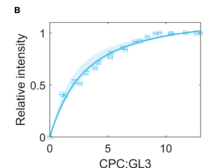

## Question

# Gene Research for Functional Annotation

## ⚠️ CRITICAL: Gene/Protein Identification Context

**BEFORE YOU BEGIN RESEARCH:** You MUST verify you are researching the CORRECT gene/protein. Gene symbols can be ambiguous, especially for less well-characterized genes from non-model organisms.

### Target Gene/Protein Identity (from UniProt):
- **UniProt Accession:** O22059
- **Protein Description:** RecName: Full=Transcription factor CPC; AltName: Full=Protein CAPRICE;
- **Gene Information:** Name=CPC; OrderedLocusNames=At2g46410; ORFNames=F11C10.10;
- **Organism (full):** Arabidopsis thaliana (Mouse-ear cress).
- **Protein Family:** Not specified in UniProt
- **Key Domains:** Homeodomain-like_sf. (IPR009057); Myb_dom. (IPR017930); Myb_TF_plants. (IPR015495); SANT/Myb. (IPR001005); Myb_DNA-binding (PF00249)

### MANDATORY VERIFICATION STEPS:

1. **Check if the gene symbol "CPC" matches the protein description above**
2. **Verify the organism is correct:** Arabidopsis thaliana (Mouse-ear cress).
3. **Check if protein family/domains align with what you find in literature**
4. **If you find literature for a DIFFERENT gene with the same or similar symbol, STOP**

### If Gene Symbol is Ambiguous or You Cannot Find Relevant Literature:

**DO NOT PROCEED WITH RESEARCH ON A DIFFERENT GENE.** Instead:
- State clearly: "The gene symbol 'CPC' is ambiguous or literature is limited for this specific protein"
- Explain what you found (e.g., "Found extensive literature on a different gene with the same symbol in a different organism")
- Describe the protein based ONLY on the UniProt information provided above
- Suggest that the protein function can be inferred from domain/family information

### Research Target:

Please provide a comprehensive research report on the gene **CPC** (gene ID: CPC, UniProt: O22059) in ARATH.

The research report should be a detailed narrative explaining the function, biological processes, and localization of the gene product. Citations should be given for all claims.

You should prioritize authoritative reviews and primary scientific literature when conducting research. You can supplement
this with annotations you find in gene/protein databases, but these can be outdated or inaccurate.

We are specifically interested in the primary function of the gene - for enzymes, what reaction is catalyzed, and what is the substrate specificity? For transporters, what is the substrate? For structural proteins or adapters, what is the broader structural role? For signaling molecules, what is the role in the pathway.

We are interested in where in or outside the cell the gene product carries out its function.

We are also interested in the signaling or biochemical pathways in which the gene functions. We are less interested in broad pleiotropic effects, except where these elucidate the precise role.

Include evidence where possible. We are interested in both experimental evidence as well as inference from structure, evolution, or bioinformatic analysis. Precise studies should be prioritized over high-throughput, where available.

## Output

Question: You are an expert researcher providing comprehensive, well-cited information.

Provide detailed information focusing on:
1. Key concepts and definitions with current understanding
2. Recent developments and latest research (prioritize 2023-2024 sources)
3. Current applications and real-world implementations
4. Expert opinions and analysis from authoritative sources
5. Relevant statistics and data from recent studies

Format as a comprehensive research report with proper citations. Include URLs and publication dates where available.
Always prioritize recent, authoritative sources and provide specific citations for all major claims.

# Gene Research for Functional Annotation

## ⚠️ CRITICAL: Gene/Protein Identification Context

**BEFORE YOU BEGIN RESEARCH:** You MUST verify you are researching the CORRECT gene/protein. Gene symbols can be ambiguous, especially for less well-characterized genes from non-model organisms.

### Target Gene/Protein Identity (from UniProt):
- **UniProt Accession:** O22059
- **Protein Description:** RecName: Full=Transcription factor CPC; AltName: Full=Protein CAPRICE;
- **Gene Information:** Name=CPC; OrderedLocusNames=At2g46410; ORFNames=F11C10.10;
- **Organism (full):** Arabidopsis thaliana (Mouse-ear cress).
- **Protein Family:** Not specified in UniProt
- **Key Domains:** Homeodomain-like_sf. (IPR009057); Myb_dom. (IPR017930); Myb_TF_plants. (IPR015495); SANT/Myb. (IPR001005); Myb_DNA-binding (PF00249)

### MANDATORY VERIFICATION STEPS:

1. **Check if the gene symbol "CPC" matches the protein description above**
2. **Verify the organism is correct:** Arabidopsis thaliana (Mouse-ear cress).
3. **Check if protein family/domains align with what you find in literature**
4. **If you find literature for a DIFFERENT gene with the same or similar symbol, STOP**

### If Gene Symbol is Ambiguous or You Cannot Find Relevant Literature:

**DO NOT PROCEED WITH RESEARCH ON A DIFFERENT GENE.** Instead:
- State clearly: "The gene symbol 'CPC' is ambiguous or literature is limited for this specific protein"
- Explain what you found (e.g., "Found extensive literature on a different gene with the same symbol in a different organism")
- Describe the protein based ONLY on the UniProt information provided above
- Suggest that the protein function can be inferred from domain/family information

### Research Target:

Please provide a comprehensive research report on the gene **CPC** (gene ID: CPC, UniProt: O22059) in ARATH.

The research report should be a detailed narrative explaining the function, biological processes, and localization of the gene product. Citations should be given for all claims.

You should prioritize authoritative reviews and primary scientific literature when conducting research. You can supplement
this with annotations you find in gene/protein databases, but these can be outdated or inaccurate.

We are specifically interested in the primary function of the gene - for enzymes, what reaction is catalyzed, and what is the substrate specificity? For transporters, what is the substrate? For structural proteins or adapters, what is the broader structural role? For signaling molecules, what is the role in the pathway.

We are interested in where in or outside the cell the gene product carries out its function.

We are also interested in the signaling or biochemical pathways in which the gene functions. We are less interested in broad pleiotropic effects, except where these elucidate the precise role.

Include evidence where possible. We are interested in both experimental evidence as well as inference from structure, evolution, or bioinformatic analysis. Precise studies should be prioritized over high-throughput, where available.

# Functional annotation report: Arabidopsis *CPC* / CAPRICE

## Identity and primary function

**Identity verified.** This report concerns *Arabidopsis thaliana* CAPRICE (*CPC*), locus **At2g46410**, corresponding to the supplied UniProt accession **O22059**. Independent literature explicitly identifies CPC as At2g46410 and describes the Arabidopsis protein as a small, single-repeat **R3-MYB** regulator of epidermal development. The UniProt domain labels supplied in the question—MYB, SANT/MYB and homeodomain-like superfamily—are consistent with this MYB-related fold; they should **not** be interpreted as evidence that CPC is the separate homeodomain protein GLABRA2 (GL2). Arabidopsis CPC must likewise be distinguished from similarly named proteins in other species. (pillitteri2013stomataldevelopmentin pages 9-10, rim2011analysisofarabidopsis pages 5-6, tominagawada2014regulationofroot pages 1-2, wang2008comprehensiveanalysisof pages 1-2)

**Functional assignment:** CPC is a *mobile, predominantly nuclear, competitive regulator of transcription-factor complexes*, not an enzyme or a membrane transporter. Its best-established function is to promote **root-hair-cell specification** while restricting **leaf-trichome initiation**. Consequently, no catalytic reaction or transported substrate should be assigned. The protein contains a single R3-MYB region with a conserved bHLH-interaction signature but lacks the activation region characteristic of transcriptional activators. Domain similarity alone does not establish that CPC directly binds target DNA; genetic and protein-interaction evidence instead supports regulation chiefly through partner proteins. (tominagawada2014regulationofroot pages 1-2, tominagawada2014regulationofroot pages 2-3, wang2008comprehensiveanalysisof pages 2-4, wang2008comprehensiveanalysisof pages 5-6)

## Molecular pathway and site of action

In the **root epidermis**, position relative to the underlying cortex biases cell fate: an epidermal cell over a junction between two cortical cells normally forms a root hair (**H position**), whereas a cell over one cortical cell normally remains hairless (**N position**). In N-position cells, the R2R3-MYB WEREWOLF (**WER**) works with bHLH proteins **GL3/EGL3** and WD40 protein **TTG1** to promote transcription of **GL2**, an inhibitor of hair-cell fate. This activator network also induces *CPC* expression. CPC protein produced preferentially in non-hair cells moves into neighboring epidermal cells, where its binding to GL3/EGL3 competes with WER-containing activating assemblies. The resulting reduction in GL2 activation permits H-position cells to adopt root-hair fate. Thus CPC is a non-cell-autonomous component of a local lateral-inhibition circuit: its principal output is **cell identity**, not direct construction or elongation of the hair. (tominagawada2014regulationofroot pages 1-2, tominagawada2014regulationofroot pages 2-3, wang2008comprehensiveanalysisof pages 5-6, wang2008comprehensiveanalysisof pages 6-9)

Protein-interaction experiments in **Arabidopsis protoplasts** directly detected CPC–GL3 interaction; protoplast expression experiments showed that WER or the shoot MYB **GL1**, together with GL3 or EGL3, could activate *CPC* transcription. These results establish both a molecular partner and feedback within the patterning network, although an engineered protoplast assay does not reproduce every in-root interaction. In the **shoot epidermis**, CPC similarly antagonizes GL1–GL3/EGL3-associated trichome-promoting activity, explaining why losing CPC increases trichomes. (wang2008comprehensiveanalysisof pages 5-6, wang2008comprehensiveanalysisof pages 6-9, wang2008comprehensiveanalysisof pages 2-4)

CPC acts **inside cells**, prominently in nuclei of prospective root-hair cells, rather than as a secreted extracellular peptide. Its cell-to-cell passage occurs through the root epidermis and is associated with plasmodesmal trafficking. Live photoconversion detected CPC–Dendra2 in adjacent epidermal cells **20 minutes** after conversion and found movement in both directions, rather than an intrinsic one-way flow from N to H cells. Preferential accumulation in H-cell nuclei has instead been attributed in part to **EGL3-dependent nuclear trapping**. Movement also depends on tissue context and expression level: experimentally overexpressed CPC fusions can cross boundaries not traversed under other expression conditions. These observations distinguish where CPC is **made**, where it **moves**, and where it is enriched while exerting its nuclear regulatory effect. (wu2011assessingtheutility pages 4-6, tominagawada2014regulationofroot pages 2-3, rim2011analysisofarabidopsis pages 5-6, rim2011analysisofarabidopsis pages 4-5)

## Strength of experimental evidence

The genetic effect is substantial. In an Arabidopsis comparison using at least ten roots per genotype, hair cells constituted **41.6 ± 2.9%** of wild-type epidermal cells but **14.2 ± 2.4%** in *cpc-1*; at the H position specifically, the respective proportions were **97.1 ± 1.7%** and **24.2 ± 2.7%**. The *cpc-1 try* double mutant produced **0%** hair cells in that experiment, consistent with partial redundancy between CPC and its R3-MYB relatives. On leaves, *cpc-1* produced **56.5 ± 10.2 trichomes per leaf**, versus **33.5 ± 6.0** in the corresponding wild type. These are genotype- and growth-condition-specific measurements, not universal species-wide frequencies. (wang2008comprehensiveanalysisof pages 5-6, wang2008comprehensiveanalysisof pages 2-4)

A **5 March 2024** quantitative pull-down study added a biochemical constraint to the competition model: its fitted **relative, dimensionless** dissociation constants were **2.3 for CPC–GL3**, **2.7 for TRY–GL3**, and **0.5 for GL1–GL3**. Under that assay, GL1 thus bound GL3 more strongly than CPC. The study also tested CPC in GL1–GL3 competition experiments, illustrated in the cropped **Figure 5B,D**. These numbers are **not molar affinities or measurements of protein occupancy in living epidermal cells**: the assay used heterologously expressed proteins, could not determine absolute protein concentrations, and modeled possible complex compositions. The authors caution that simple textbook diagrams of a single three-protein activator complex omit concentration-dependent and higher-order interactions. (zhang2024quantitativeanalysisof pages 6-8, zhang2024quantitativeanalysisof pages 8-10, zhang2024quantitativeanalysisof media d6932143, zhang2024quantitativeanalysisof media 80e7979f, zhang2024quantitativeanalysisof pages 10-11)

The following table separates direct CPC findings from results concerning CPC-family paralogs or a protein from another species. (wang2008comprehensiveanalysisof pages 5-6, zhang2024quantitativeanalysisof pages 8-10, jing2024plantelicitorpeptides pages 4-7, wakamatsu2024effectofphosphorus pages 1-2, zhu2025novelepidermal–corticalpattern pages 1-2)

| Question / experiment | Precise observation | Interpretation / limitation | Publication date + DOI URL |
|---|---|---|---|
| **Does AtCPC control root-hair specification?** Loss-of-function phenotyping, Table 2 | Hair cells comprised **41.6 ± 2.9%** of wild-type Col epidermal cells versus **14.2 ± 2.4%** in **cpc-1**; values were based on at least 10 roots per line. (wang2008comprehensiveanalysisof pages 5-6) | Strong genetic evidence that AtCPC promotes root-hair cell fate. The measurement concerns cell specification, not subsequent hair elongation. | **21 July 2008** — Wang et al., *BMC Plant Biology*. [https://doi.org/10.1186/1471-2229-8-81](https://doi.org/10.1186/1471-2229-8-81) |
| **Does AtCPC inhibit leaf-trichome formation?** Loss-of-function phenotyping, Table 1 | Wild type produced **33.5 ± 6.0 trichomes per leaf**, whereas **cpc-1** produced **56.5 ± 10.2**; at least 10 rosette leaves were examined per line. (wang2008comprehensiveanalysisof pages 2-4) | Supports a negative role for AtCPC in trichome initiation. Redundant R3-MYB paralogs complicate interpretation of higher-order patterning effects. | **21 July 2008** — Wang et al., *BMC Plant Biology*. [https://doi.org/10.1186/1471-2229-8-81](https://doi.org/10.1186/1471-2229-8-81) |
| **Is CPC a mobile protein?** Live photoconversion of CPC–Dendra2 in Arabidopsis roots | Photoconverted CPC–Dendra2 appeared in neighboring epidermal cells within **20 min** and moved isodiametrically rather than preferentially from non-hair to hair cells. (wu2011assessingtheutility pages 4-6) | Direct live-imaging evidence for intercellular mobility. Directional biological accumulation can therefore arise from expression, retention or nuclear trapping rather than intrinsically one-way transport; the fluorescent fusion may not reproduce every property of native CPC. | **November 2011** — Wu et al., *PLOS ONE*. [https://doi.org/10.1371/journal.pone.0027536](https://doi.org/10.1371/journal.pone.0027536) |
| **How strongly does CPC bind GL3?** Quantitative LUMIER pull-down and binding-model analysis | Relative, dimensionless dissociation constants were **K_D = 2.3** for CPC–GL3, **2.7** for TRY–GL3 and **0.5** for GL1–GL3; thus CPC/TRY inhibitor binding was weaker than GL1 binding under this assay. (zhang2024quantitativeanalysisof pages 8-10, zhang2024quantitativeanalysisof media d6932143) | Quantifies the competitive-binding model, but the proteins were expressed in heterologous **HEK293TM** cells and absolute concentrations could not be established. These are relative—not molar—affinities and should not be interpreted as in-vivo occupancy. (zhang2024quantitativeanalysisof pages 6-8, zhang2024quantitativeanalysisof pages 10-11) | **5 March 2024** — Zhang et al., *Frontiers in Plant Science*. [https://doi.org/10.3389/fpls.2024.1331156](https://doi.org/10.3389/fpls.2024.1331156) |
| **Does Pep2 signal through CPC during root-hair development?** Peptide treatment, expression assays and cpc epistasis | Treatment with **10 nM Pep2** increased CPC transcript abundance and decreased GL2 expression. In **cpc**, the Pep2-induced increase in root-hair density was compromised, whereas Pep2-induced elongation persisted; root phenotypes used **n = 15 roots per treatment**. (jing2024plantelicitorpeptides pages 4-7, jing2024plantelicitorpeptides pages 7-9) | Places CPC downstream of Pep2 primarily in hair-cell specification/density, while indicating that the elongation response has a CPC-independent branch. Transcript changes do not establish direct transcriptional regulation of CPC by Pep2. | **15 February 2024** — Jing et al., *Frontiers in Plant Science*. [https://doi.org/10.3389/fpls.2024.1336129](https://doi.org/10.3389/fpls.2024.1336129) |
| **How does phosphate deficiency engage the CPC-like family?** Root-hair counts and ETC1/ETC3 expression/localization | Phosphate deficiency increased wild-type root-hair number by approximately **2.5-fold**. The **etc1** response was attenuated, while **etc3** and **etc1 etc3** did not show a significant increase; ETC3 was induced internally but was not observed moving into the epidermis. (wakamatsu2024effectofphosphorus pages 1-2) | Evidence concerns the **AtCPC paralogs ETC1 and ETC3—not AtCPC itself**. It supports family-level participation in phosphate-responsive plasticity but cannot be cited as direct proof that CPC protein mediates this response. | **Online 1 March 2024** — Wakamatsu et al., *Journal of Plant Biochemistry and Biotechnology*. [https://doi.org/10.1007/s13562-024-00880-6](https://doi.org/10.1007/s13562-024-00880-6) |
| **Is CPC function conserved across species, and does promoter activity matter?** Blueberry VcCPC expression and complementation in Arabidopsis | Blueberry **VcCPC** retained root-hair-promoting activity in Arabidopsis. A construct using the native VcCPC promoter did not rescue the Arabidopsis **cpc** phenotype, whereas replacing its proximal promoter with **AtCPC −683 to −1 bp** restored root hairs. (zhu2025novelepidermal–corticalpattern pages 1-2, zhu2025novelepidermal–corticalpattern pages 4-5) | Demonstrates functional conservation and the importance of root-apical promoter regulation. **VcCPC is a blueberry homolog, not AtCPC/O22059**, and heterologous complementation does not prove identical regulation in blueberry. | **May 2025** — Zhu et al., *BMC Plant Biology*. [https://doi.org/10.1186/s12870-025-06744-y](https://doi.org/10.1186/s12870-025-06744-y) |

*Table: Key genetic, imaging, biochemical and signaling evidence for Arabidopsis CAPRICE, with quantitative results and explicit limitations. Paralog and cross-species findings are separated from direct evidence about AtCPC/O22059.*

## Recent research, biological scope and applications

A **15 February 2024** Arabidopsis study connected CPC to **plant elicitor peptide Pep2** signaling. Treatment with **10 nM Pep2** increased *CPC* transcripts and lowered *GL2* transcripts; loss of *PROPEP2* produced the opposite expression pattern. Crucially, the *cpc* mutation compromised Pep2-induced **root-hair density**, but Pep2-induced **hair elongation persisted**. The genetic evidence therefore places CPC in a peptide-responsive **fate/density branch** and argues against assigning it all downstream hair-growth effects. Altered transcript levels do not by themselves demonstrate direct transcriptional control of the *CPC* promoter by Pep2. (jing2024plantelicitorpeptides pages 1-2, jing2024plantelicitorpeptides pages 4-7, jing2024plantelicitorpeptides pages 7-9)

Work published online **1 March 2024** addresses nutrient-responsive plasticity but must be attributed accurately: during phosphate deficiency, wild-type root-hair number increased approximately **2.5-fold**, whereas *etc1* and *etc3* mutant responses were impaired. **ETC1 and ETC3 are CPC-family paralogs, not CPC/O22059**; the reported internal-tissue localization of ETC3 cannot be assigned to CPC. The results establish relevance of the *family* to phosphate-responsive hair development, not a directly demonstrated phosphate-sensing function for CPC itself. (wakamatsu2024effectofphosphorus pages 1-2)

CPC and its regulatory sequences are implemented primarily as **experimental tools** for manipulating or reporting epidermal fate, rather than as an established agricultural product. For example, Arabidopsis *CPC*-promoter-driven expression of the tomato R3-MYB **SlTRY** increased root hairs and inhibited trichomes, illustrating functional interchangeability in a transgenic test without identifying SlTRY as Arabidopsis CPC. A **2025** blueberry study likewise expressed the distinct homolog **VcCPC** in Arabidopsis: VcCPC retained hair-promoting activity, but its own promoter did not restore hairs to the Arabidopsis *cpc* mutant, whereas replacing a proximal promoter segment with the Arabidopsis *CPC* sequence did. This implicates **when and where the gene is expressed**, as well as protein capability, in cross-species phenotypes; it does not establish a field-tested strategy for increasing nutrient uptake in crops. CPC also participates in hypocotyl epidermal patterning and has been associated with anthocyanin regulation, but root-hair fate and trichome inhibition remain its most specifically substantiated primary functions. (tominagawada2013controlofplant pages 2-3, tominagawada2014regulationofroot pages 2-3, pillitteri2013stomataldevelopmentin pages 9-10, zhu2025novelepidermal–corticalpattern pages 1-2, zhu2025novelepidermal–corticalpattern pages 5-7)

**Interpretive boundary.** CPC is commonly termed a “transcription factor” because its MYB-related region and partnerships regulate transcription. The strongest direct evidence here is for **protein competition, intercellular mobility, nuclear enrichment and altered downstream gene expression**; calling CPC a direct DNA-binding activator, an extracellular peptide, or an enzyme would overstate that evidence. Partial redundancy with TRY/ETC proteins and the dependence of apparent trafficking on cellular context remain important constraints on experiments and functional annotation. (tominagawada2014regulationofroot pages 2-3, wang2008comprehensiveanalysisof pages 5-6, rim2011analysisofarabidopsis pages 4-5)

### Selected sources and publication dates

- Wang et al., **21 July 2008**, *BMC Plant Biology*, genetic, transcriptional and protein-interaction analysis: https://doi.org/10.1186/1471-2229-8-81. (wang2008comprehensiveanalysisof pages 1-2, wang2008comprehensiveanalysisof pages 5-6)
- Wu et al., **November 2011**, *PLOS ONE*, live imaging of CPC intercellular movement: https://doi.org/10.1371/journal.pone.0027536. (wu2011assessingtheutility pages 4-6)
- Tominaga-Wada and Wada, **13 March 2014**, *Frontiers in Plant Science*, expert review of the CPC-like R3-MYB network: https://doi.org/10.3389/fpls.2014.00091. (tominagawada2014regulationofroot pages 1-2, tominagawada2014regulationofroot pages 2-3)
- Jing et al., **15 February 2024**, *Frontiers in Plant Science*, Pep2–CPC–GL2 genetic and expression experiments: https://doi.org/10.3389/fpls.2024.1336129. (jing2024plantelicitorpeptides pages 1-2, jing2024plantelicitorpeptides pages 4-7)
- Wakamatsu et al., **online 1 March 2024**, *Journal of Plant Biochemistry and Biotechnology*, phosphate response of **ETC paralogs**: https://doi.org/10.1007/s13562-024-00880-6. (wakamatsu2024effectofphosphorus pages 1-2)
- Zhang et al., **5 March 2024**, *Frontiers in Plant Science*, quantitative GL3 partner-binding assays: https://doi.org/10.3389/fpls.2024.1331156. (zhang2024quantitativeanalysisof pages 1-2, zhang2024quantitativeanalysisof pages 8-10)
- Zhu et al., **2025**, *BMC Plant Biology*, cross-species **VcCPC** promoter/complementation experiments: https://doi.org/10.1186/s12870-025-06744-y. (zhu2025novelepidermal–corticalpattern pages 1-2, zhu2025novelepidermal–corticalpattern pages 5-7)

References

1. (pillitteri2013stomataldevelopmentin pages 9-10): Lynn Jo Pillitteri and Juan Dong. Stomatal development in arabidopsis. The Arabidopsis Book, 2013:e0162, Jun 2013. URL: https://doi.org/10.1199/tab.0162, doi:10.1199/tab.0162. This article has 202 citations and is from a peer-reviewed journal.

2. (rim2011analysisofarabidopsis pages 5-6): Yeonggil Rim, Lijun Huang, Hyosub Chu, Xiao Han, Won Kyong Cho, Che Ok Jeon, Hye Jin Kim, Jong-Chan Hong, William J. Lucas, and Jae-Yean Kim. Analysis of arabidopsis transcription factor families revealed extensive capacity for cell-to-cell movement as well as discrete trafficking patterns. Molecules and Cells, 32:519-526, Dec 2011. URL: https://doi.org/10.1007/s10059-011-0135-2, doi:10.1007/s10059-011-0135-2. This article has 64 citations and is from a peer-reviewed journal.

3. (tominagawada2014regulationofroot pages 1-2): Rumi Tominaga-Wada and Takuji Wada. Regulation of root hair cell differentiation by r3 myb transcription factors in tomato and arabidopsis. Frontiers in Plant Science, Mar 2014. URL: https://doi.org/10.3389/fpls.2014.00091, doi:10.3389/fpls.2014.00091. This article has 61 citations.

4. (wang2008comprehensiveanalysisof pages 1-2): Shucai Wang, Leah Hubbard, Ying Chang, Jianjun Guo, John Schiefelbein, and Jin-Gui Chen. Comprehensive analysis of single-repeat r3 myb proteins in epidermal cell patterning and their transcriptional regulation in arabidopsis. BMC Plant Biology, 8:81-81, Jul 2008. URL: https://doi.org/10.1186/1471-2229-8-81, doi:10.1186/1471-2229-8-81. This article has 153 citations and is from a peer-reviewed journal.

5. (tominagawada2014regulationofroot pages 2-3): Rumi Tominaga-Wada and Takuji Wada. Regulation of root hair cell differentiation by r3 myb transcription factors in tomato and arabidopsis. Frontiers in Plant Science, Mar 2014. URL: https://doi.org/10.3389/fpls.2014.00091, doi:10.3389/fpls.2014.00091. This article has 61 citations.

6. (wang2008comprehensiveanalysisof pages 2-4): Shucai Wang, Leah Hubbard, Ying Chang, Jianjun Guo, John Schiefelbein, and Jin-Gui Chen. Comprehensive analysis of single-repeat r3 myb proteins in epidermal cell patterning and their transcriptional regulation in arabidopsis. BMC Plant Biology, 8:81-81, Jul 2008. URL: https://doi.org/10.1186/1471-2229-8-81, doi:10.1186/1471-2229-8-81. This article has 153 citations and is from a peer-reviewed journal.

7. (wang2008comprehensiveanalysisof pages 5-6): Shucai Wang, Leah Hubbard, Ying Chang, Jianjun Guo, John Schiefelbein, and Jin-Gui Chen. Comprehensive analysis of single-repeat r3 myb proteins in epidermal cell patterning and their transcriptional regulation in arabidopsis. BMC Plant Biology, 8:81-81, Jul 2008. URL: https://doi.org/10.1186/1471-2229-8-81, doi:10.1186/1471-2229-8-81. This article has 153 citations and is from a peer-reviewed journal.

8. (wang2008comprehensiveanalysisof pages 6-9): Shucai Wang, Leah Hubbard, Ying Chang, Jianjun Guo, John Schiefelbein, and Jin-Gui Chen. Comprehensive analysis of single-repeat r3 myb proteins in epidermal cell patterning and their transcriptional regulation in arabidopsis. BMC Plant Biology, 8:81-81, Jul 2008. URL: https://doi.org/10.1186/1471-2229-8-81, doi:10.1186/1471-2229-8-81. This article has 153 citations and is from a peer-reviewed journal.

9. (wu2011assessingtheutility pages 4-6): Shuang Wu, Koji Koizumi, Aurora MacRae-Crerar, and Kimberly L. Gallagher. Assessing the utility of photoswitchable fluorescent proteins for tracking intercellular protein movement in the arabidopsis root. PLoS ONE, 6:e27536, Nov 2011. URL: https://doi.org/10.1371/journal.pone.0027536, doi:10.1371/journal.pone.0027536. This article has 35 citations and is from a peer-reviewed journal.

10. (rim2011analysisofarabidopsis pages 4-5): Yeonggil Rim, Lijun Huang, Hyosub Chu, Xiao Han, Won Kyong Cho, Che Ok Jeon, Hye Jin Kim, Jong-Chan Hong, William J. Lucas, and Jae-Yean Kim. Analysis of arabidopsis transcription factor families revealed extensive capacity for cell-to-cell movement as well as discrete trafficking patterns. Molecules and Cells, 32:519-526, Dec 2011. URL: https://doi.org/10.1007/s10059-011-0135-2, doi:10.1007/s10059-011-0135-2. This article has 64 citations and is from a peer-reviewed journal.

11. (zhang2024quantitativeanalysisof pages 6-8): Bipei Zhang, Anna Deneer, Christian Fleck, and Martin Hülskamp. Quantitative analysis of mbw complex formation in the context of trichome patterning. Frontiers in Plant Science, Mar 2024. URL: https://doi.org/10.3389/fpls.2024.1331156, doi:10.3389/fpls.2024.1331156. This article has 4 citations.

12. (zhang2024quantitativeanalysisof pages 8-10): Bipei Zhang, Anna Deneer, Christian Fleck, and Martin Hülskamp. Quantitative analysis of mbw complex formation in the context of trichome patterning. Frontiers in Plant Science, Mar 2024. URL: https://doi.org/10.3389/fpls.2024.1331156, doi:10.3389/fpls.2024.1331156. This article has 4 citations.

13. (zhang2024quantitativeanalysisof media d6932143): Bipei Zhang, Anna Deneer, Christian Fleck, and Martin Hülskamp. Quantitative analysis of mbw complex formation in the context of trichome patterning. Frontiers in Plant Science, Mar 2024. URL: https://doi.org/10.3389/fpls.2024.1331156, doi:10.3389/fpls.2024.1331156. This article has 4 citations.

14. (zhang2024quantitativeanalysisof media 80e7979f): Bipei Zhang, Anna Deneer, Christian Fleck, and Martin Hülskamp. Quantitative analysis of mbw complex formation in the context of trichome patterning. Frontiers in Plant Science, Mar 2024. URL: https://doi.org/10.3389/fpls.2024.1331156, doi:10.3389/fpls.2024.1331156. This article has 4 citations.

15. (zhang2024quantitativeanalysisof pages 10-11): Bipei Zhang, Anna Deneer, Christian Fleck, and Martin Hülskamp. Quantitative analysis of mbw complex formation in the context of trichome patterning. Frontiers in Plant Science, Mar 2024. URL: https://doi.org/10.3389/fpls.2024.1331156, doi:10.3389/fpls.2024.1331156. This article has 4 citations.

16. (jing2024plantelicitorpeptides pages 4-7): Yanping Jing, Fugeng Zhao, Ke Lai, Fei Sun, Chenjie Sun, Xingyue Zou, Min Xu, Aigen Fu, Rouhallah Sharifi, Jian Chen, Xiaojiang Zheng, and Sheng Luan. Plant elicitor peptides regulate root hair development in arabidopsis. Frontiers in Plant Science, Feb 2024. URL: https://doi.org/10.3389/fpls.2024.1336129, doi:10.3389/fpls.2024.1336129. This article has 16 citations.

17. (wakamatsu2024effectofphosphorus pages 1-2): Juri Wakamatsu, Jun Hosokawa, and Rumi Tominaga. Effect of phosphorus deficiency on the expression and protein localization of enhancer of try and cpc3 gene in arabidopsis roots. Journal of Plant Biochemistry and Biotechnology, 33:260-264, Mar 2024. URL: https://doi.org/10.1007/s13562-024-00880-6, doi:10.1007/s13562-024-00880-6. This article has 0 citations and is from a peer-reviewed journal.

18. (zhu2025novelepidermal–corticalpattern pages 1-2): Youyin Zhu, Ke Li, Yu Zong, Yongqiang Li, and Weidong Guo. Novel epidermal–cortical pattern and root apical silencing of vccpc promoter activity in arabidopsis might suggest a joint contribution to hairless roots in blueberry. BMC Plant Biology, May 2025. URL: https://doi.org/10.1186/s12870-025-06744-y, doi:10.1186/s12870-025-06744-y. This article has 1 citations and is from a peer-reviewed journal.

19. (jing2024plantelicitorpeptides pages 7-9): Yanping Jing, Fugeng Zhao, Ke Lai, Fei Sun, Chenjie Sun, Xingyue Zou, Min Xu, Aigen Fu, Rouhallah Sharifi, Jian Chen, Xiaojiang Zheng, and Sheng Luan. Plant elicitor peptides regulate root hair development in arabidopsis. Frontiers in Plant Science, Feb 2024. URL: https://doi.org/10.3389/fpls.2024.1336129, doi:10.3389/fpls.2024.1336129. This article has 16 citations.

20. (zhu2025novelepidermal–corticalpattern pages 4-5): Youyin Zhu, Ke Li, Yu Zong, Yongqiang Li, and Weidong Guo. Novel epidermal–cortical pattern and root apical silencing of vccpc promoter activity in arabidopsis might suggest a joint contribution to hairless roots in blueberry. BMC Plant Biology, May 2025. URL: https://doi.org/10.1186/s12870-025-06744-y, doi:10.1186/s12870-025-06744-y. This article has 1 citations and is from a peer-reviewed journal.

21. (jing2024plantelicitorpeptides pages 1-2): Yanping Jing, Fugeng Zhao, Ke Lai, Fei Sun, Chenjie Sun, Xingyue Zou, Min Xu, Aigen Fu, Rouhallah Sharifi, Jian Chen, Xiaojiang Zheng, and Sheng Luan. Plant elicitor peptides regulate root hair development in arabidopsis. Frontiers in Plant Science, Feb 2024. URL: https://doi.org/10.3389/fpls.2024.1336129, doi:10.3389/fpls.2024.1336129. This article has 16 citations.

22. (tominagawada2013controlofplant pages 2-3): Rumi Tominaga-Wada, Yuka Nukumizu, Shusei Sato, and Takuji Wada. Control of plant trichome and root-hair development by a tomato (solanum lycopersicum) r3 myb transcription factor. PLoS ONE, 8:e54019, Jan 2013. URL: https://doi.org/10.1371/journal.pone.0054019, doi:10.1371/journal.pone.0054019. This article has 105 citations and is from a peer-reviewed journal.

23. (zhu2025novelepidermal–corticalpattern pages 5-7): Youyin Zhu, Ke Li, Yu Zong, Yongqiang Li, and Weidong Guo. Novel epidermal–cortical pattern and root apical silencing of vccpc promoter activity in arabidopsis might suggest a joint contribution to hairless roots in blueberry. BMC Plant Biology, May 2025. URL: https://doi.org/10.1186/s12870-025-06744-y, doi:10.1186/s12870-025-06744-y. This article has 1 citations and is from a peer-reviewed journal.

24. (zhang2024quantitativeanalysisof pages 1-2): Bipei Zhang, Anna Deneer, Christian Fleck, and Martin Hülskamp. Quantitative analysis of mbw complex formation in the context of trichome patterning. Frontiers in Plant Science, Mar 2024. URL: https://doi.org/10.3389/fpls.2024.1331156, doi:10.3389/fpls.2024.1331156. This article has 4 citations.

## Artifacts

- [Edison artifact artifact-00](CPC-deep-research-falcon_artifacts/artifact-00.md)

## Citations

1. wang2008comprehensiveanalysisof pages 5-6
2. wang2008comprehensiveanalysisof pages 2-4
3. wu2011assessingtheutility pages 4-6
4. wakamatsu2024effectofphosphorus pages 1-2
5. pillitteri2013stomataldevelopmentin pages 9-10
6. rim2011analysisofarabidopsis pages 5-6
7. tominagawada2014regulationofroot pages 1-2
8. wang2008comprehensiveanalysisof pages 1-2
9. tominagawada2014regulationofroot pages 2-3
10. wang2008comprehensiveanalysisof pages 6-9
11. rim2011analysisofarabidopsis pages 4-5
12. zhang2024quantitativeanalysisof pages 6-8
13. zhang2024quantitativeanalysisof pages 8-10
14. zhang2024quantitativeanalysisof pages 10-11
15. jing2024plantelicitorpeptides pages 4-7
16. jing2024plantelicitorpeptides pages 7-9
17. jing2024plantelicitorpeptides pages 1-2
18. tominagawada2013controlofplant pages 2-3
19. zhang2024quantitativeanalysisof pages 1-2
20. https://doi.org/10.1186/1471-2229-8-81
21. https://doi.org/10.1371/journal.pone.0027536
22. https://doi.org/10.3389/fpls.2024.1331156
23. https://doi.org/10.3389/fpls.2024.1336129
24. https://doi.org/10.1007/s13562-024-00880-6
25. https://doi.org/10.1186/s12870-025-06744-y
26. https://doi.org/10.1186/1471-2229-8-81](https://doi.org/10.1186/1471-2229-8-81
27. https://doi.org/10.1371/journal.pone.0027536](https://doi.org/10.1371/journal.pone.0027536
28. https://doi.org/10.3389/fpls.2024.1331156](https://doi.org/10.3389/fpls.2024.1331156
29. https://doi.org/10.3389/fpls.2024.1336129](https://doi.org/10.3389/fpls.2024.1336129
30. https://doi.org/10.1007/s13562-024-00880-6](https://doi.org/10.1007/s13562-024-00880-6
31. https://doi.org/10.1186/s12870-025-06744-y](https://doi.org/10.1186/s12870-025-06744-y
32. https://doi.org/10.1186/1471-2229-8-81.
33. https://doi.org/10.1371/journal.pone.0027536.
34. https://doi.org/10.3389/fpls.2014.00091.
35. https://doi.org/10.3389/fpls.2024.1336129.
36. https://doi.org/10.1007/s13562-024-00880-6.
37. https://doi.org/10.3389/fpls.2024.1331156.
38. https://doi.org/10.1186/s12870-025-06744-y.
39. https://doi.org/10.1199/tab.0162,
40. https://doi.org/10.1007/s10059-011-0135-2,
41. https://doi.org/10.3389/fpls.2014.00091,
42. https://doi.org/10.1186/1471-2229-8-81,
43. https://doi.org/10.1371/journal.pone.0027536,
44. https://doi.org/10.3389/fpls.2024.1331156,
45. https://doi.org/10.3389/fpls.2024.1336129,
46. https://doi.org/10.1007/s13562-024-00880-6,
47. https://doi.org/10.1186/s12870-025-06744-y,
48. https://doi.org/10.1371/journal.pone.0054019,