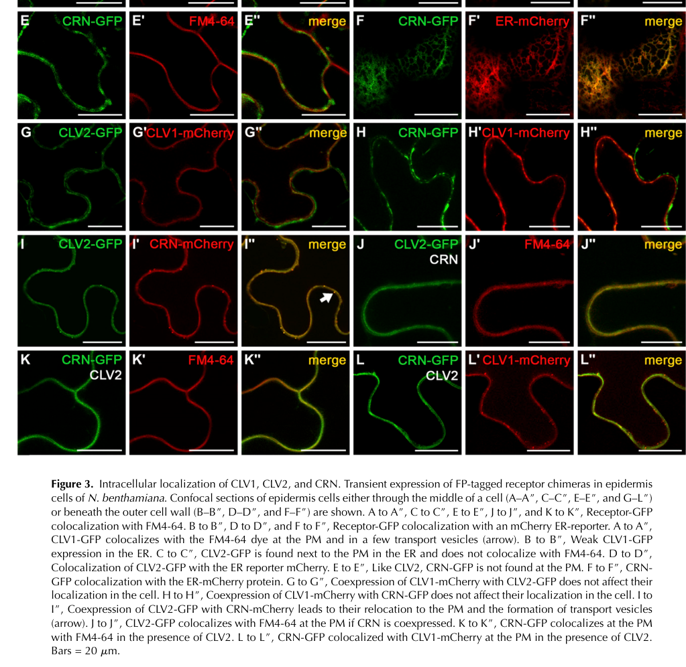

## Question

# Gene Research for Functional Annotation

## ⚠️ CRITICAL: Gene/Protein Identification Context

**BEFORE YOU BEGIN RESEARCH:** You MUST verify you are researching the CORRECT gene/protein. Gene symbols can be ambiguous, especially for less well-characterized genes from non-model organisms.

### Target Gene/Protein Identity (from UniProt):
- **UniProt Accession:** Q9LYU7
- **Protein Description:** RecName: Full=Inactive leucine-rich repeat receptor-like protein kinase CORYNE {ECO:0000303|PubMed:18381924}; AltName: Full=Protein SUPPRESSOR OF OVEREXPRESSION OF LLP1 2 {ECO:0000303|PubMed:12932329}; Flags: Precursor;
- **Gene Information:** Name=CRN {ECO:0000303|PubMed:18381924}; Synonyms=SOL2 {ECO:0000303|PubMed:12932329}; OrderedLocusNames=At5g13290 {ECO:0000312|Araport:AT5G13290}; ORFNames=T31B5.110 {ECO:0000312|EMBL:CAB86636.1};
- **Organism (full):** Arabidopsis thaliana (Mouse-ear cress).
- **Protein Family:** Belongs to the protein kinase superfamily. Ser/Thr protein
- **Key Domains:** Kinase-like_dom_sf. (IPR011009); LRR_receptor-like_kinase. (IPR051564); Prot_kinase_dom. (IPR000719); Pkinase (PF00069)

### MANDATORY VERIFICATION STEPS:

1. **Check if the gene symbol "CRN" matches the protein description above**
2. **Verify the organism is correct:** Arabidopsis thaliana (Mouse-ear cress).
3. **Check if protein family/domains align with what you find in literature**
4. **If you find literature for a DIFFERENT gene with the same or similar symbol, STOP**

### If Gene Symbol is Ambiguous or You Cannot Find Relevant Literature:

**DO NOT PROCEED WITH RESEARCH ON A DIFFERENT GENE.** Instead:
- State clearly: "The gene symbol 'CRN' is ambiguous or literature is limited for this specific protein"
- Explain what you found (e.g., "Found extensive literature on a different gene with the same symbol in a different organism")
- Describe the protein based ONLY on the UniProt information provided above
- Suggest that the protein function can be inferred from domain/family information

### Research Target:

Please provide a comprehensive research report on the gene **CRN** (gene ID: CRN, UniProt: Q9LYU7) in ARATH.

The research report should be a detailed narrative explaining the function, biological processes, and localization of the gene product. Citations should be given for all claims.

You should prioritize authoritative reviews and primary scientific literature when conducting research. You can supplement
this with annotations you find in gene/protein databases, but these can be outdated or inaccurate.

We are specifically interested in the primary function of the gene - for enzymes, what reaction is catalyzed, and what is the substrate specificity? For transporters, what is the substrate? For structural proteins or adapters, what is the broader structural role? For signaling molecules, what is the role in the pathway.

We are interested in where in or outside the cell the gene product carries out its function.

We are also interested in the signaling or biochemical pathways in which the gene functions. We are less interested in broad pleiotropic effects, except where these elucidate the precise role.

Include evidence where possible. We are interested in both experimental evidence as well as inference from structure, evolution, or bioinformatic analysis. Precise studies should be prioritized over high-throughput, where available.

## Output

Question: You are an expert researcher providing comprehensive, well-cited information.

Provide detailed information focusing on:
1. Key concepts and definitions with current understanding
2. Recent developments and latest research (prioritize 2023-2024 sources)
3. Current applications and real-world implementations
4. Expert opinions and analysis from authoritative sources
5. Relevant statistics and data from recent studies

Format as a comprehensive research report with proper citations. Include URLs and publication dates where available.
Always prioritize recent, authoritative sources and provide specific citations for all major claims.

# Gene Research for Functional Annotation

## ⚠️ CRITICAL: Gene/Protein Identification Context

**BEFORE YOU BEGIN RESEARCH:** You MUST verify you are researching the CORRECT gene/protein. Gene symbols can be ambiguous, especially for less well-characterized genes from non-model organisms.

### Target Gene/Protein Identity (from UniProt):
- **UniProt Accession:** Q9LYU7
- **Protein Description:** RecName: Full=Inactive leucine-rich repeat receptor-like protein kinase CORYNE {ECO:0000303|PubMed:18381924}; AltName: Full=Protein SUPPRESSOR OF OVEREXPRESSION OF LLP1 2 {ECO:0000303|PubMed:12932329}; Flags: Precursor;
- **Gene Information:** Name=CRN {ECO:0000303|PubMed:18381924}; Synonyms=SOL2 {ECO:0000303|PubMed:12932329}; OrderedLocusNames=At5g13290 {ECO:0000312|Araport:AT5G13290}; ORFNames=T31B5.110 {ECO:0000312|EMBL:CAB86636.1};
- **Organism (full):** Arabidopsis thaliana (Mouse-ear cress).
- **Protein Family:** Belongs to the protein kinase superfamily. Ser/Thr protein
- **Key Domains:** Kinase-like_dom_sf. (IPR011009); LRR_receptor-like_kinase. (IPR051564); Prot_kinase_dom. (IPR000719); Pkinase (PF00069)

### MANDATORY VERIFICATION STEPS:

1. **Check if the gene symbol "CRN" matches the protein description above**
2. **Verify the organism is correct:** Arabidopsis thaliana (Mouse-ear cress).
3. **Check if protein family/domains align with what you find in literature**
4. **If you find literature for a DIFFERENT gene with the same or similar symbol, STOP**

### If Gene Symbol is Ambiguous or You Cannot Find Relevant Literature:

**DO NOT PROCEED WITH RESEARCH ON A DIFFERENT GENE.** Instead:
- State clearly: "The gene symbol 'CRN' is ambiguous or literature is limited for this specific protein"
- Explain what you found (e.g., "Found extensive literature on a different gene with the same symbol in a different organism")
- Describe the protein based ONLY on the UniProt information provided above
- Suggest that the protein function can be inferred from domain/family information

### Research Target:

Please provide a comprehensive research report on the gene **CRN** (gene ID: CRN, UniProt: Q9LYU7) in ARATH.

The research report should be a detailed narrative explaining the function, biological processes, and localization of the gene product. Citations should be given for all claims.

You should prioritize authoritative reviews and primary scientific literature when conducting research. You can supplement
this with annotations you find in gene/protein databases, but these can be outdated or inaccurate.

We are specifically interested in the primary function of the gene - for enzymes, what reaction is catalyzed, and what is the substrate specificity? For transporters, what is the substrate? For structural proteins or adapters, what is the broader structural role? For signaling molecules, what is the role in the pathway.

We are interested in where in or outside the cell the gene product carries out its function.

We are also interested in the signaling or biochemical pathways in which the gene functions. We are less interested in broad pleiotropic effects, except where these elucidate the precise role.

Include evidence where possible. We are interested in both experimental evidence as well as inference from structure, evolution, or bioinformatic analysis. Precise studies should be prioritized over high-throughput, where available.

# Functional annotation of Arabidopsis CORYNE (CRN; UniProt Q9LYU7)

## Identity and principal function

**The target is Arabidopsis thaliana CRN, also called SOL2, encoded by At5g13290—not a similarly named protein from another species.** Map-based cloning identified At5g13290, and a genomic copy of that locus restored the *crn-1* mutant to the wild-type phenotype. The UniProt accession Q9LYU7 is the identifier supplied with the question; the primary paper independently establishes the gene, species, and protein architecture. CRN/SOL2 is a membrane-spanning, kinase-like **pseudokinase** whose principal demonstrated function is to partner with CLAVATA2 (CLV2) in cell-surface peptide-signaling systems that regulate stem-cell maintenance and developmental patterning. (muller2008thereceptorkinase pages 6-7, zhu2010analysisofinteractions pages 1-2, demesaarevalo2024intercellularcommunicationin pages 4-6)

Although annotated within the protein-kinase family and bearing a predicted intracellular Ser/Thr kinase domain, CRN should **not** be assigned a phosphorylation reaction or protein-substrate specificity. Kinase activity was not detected in the reported assays, and a kinase-impaired K146E variant rescued *crn-1* abnormalities. Its supported biochemical role is noncatalytic: assembling or maintaining receptor complexes and enabling CLV2-dependent signaling. The precise downstream reaction catalyzed by another member of a CRN-containing complex remains to be established. (kiyohara2012clesignalingsystems pages 12-14, betsuyaku2011thefunctionof pages 6-7, demesaarevalo2024intercellularcommunicationin pages 4-6)

## Molecular organization and site of action

The characterized CRN isoform is approximately **401 amino acids** long, with a predicted N-terminal signal peptide, a **short extracellular segment rather than an extracellular leucine-rich-repeat binding domain**, one transmembrane helix, and a cytosolic kinase-like domain. Thus, a database classification among LRR receptor-like kinases describes its signaling-family context; it must not be read as evidence that CRN itself has an LRR ectodomain. CLV2 supplies an extracellular LRR-containing receptor-like component but lacks an intracellular kinase domain. (muller2008thereceptorkinase pages 6-7, bleckmann2010stemcellsignaling pages 5-6, demesaarevalo2024intercellularcommunicationin pages 4-6)

**CRN acts at the plasma membrane when assembled with CLV2.** Arabidopsis-protoplast interaction assays detected a CLV2–CRN association without added CLV3 peptide. Fluorescent-protein experiments found substantial endoplasmic-reticulum retention when CLV2 or CRN was expressed alone, but coexpression allowed both to reach the plasma membrane. CRN’s transmembrane and adjacent extracellular sequences were important for this relocalization; removing its kinase domain did not abolish joint membrane localization. This provides a concrete trafficking function in addition to any signaling-scaffold role. Much of the detailed imaging used transient expression in *Nicotiana benthamiana*, so its cellular-resolution observations should not be mistaken for direct imaging throughout an unperturbed Arabidopsis meristem. (zhu2010analysisofinteractions pages 1-2, bleckmann2010stemcellsignaling pages 5-6, bleckmann2010stemcellsignaling pages 2-5)

The cropped **Figure 3** localization evidence shows CRN and CLV2 in the ER separately and at the plasma membrane when coexpressed; it illustrates the trafficking conclusion rather than direct peptide binding. (bleckmann2010stemcellsignaling media b5b6bf0b)

CRN transcripts have been observed in shoot and floral meristems, developing flower organs and vascular tissue, embryos, and root meristems and vasculature. These are expression sites, not proof that every expressing cell has an independently established CRN-dependent signaling output. (muller2008thereceptorkinase pages 6-7, muller2008thereceptorkinase pages 9-11)

## Established signaling roles

**Shoot and floral stem-cell control.** Stem cells produce the secreted CLE-family peptide CLAVATA3 (CLV3). CRN and CLV2 participate in a signaling branch that limits shoot- and floral-meristem stem-cell accumulation, genetically distinguishable from the CLV1 branch; the pathways contribute to restriction of the stem-cell-promoting transcription factor WUSCHEL (WUS). In the original study, *crn-1 clv2-1* showed little enhancement over the single mutants, whereas *crn-1 clv1-11* was enhanced. Mean carpels per flower were **2.0** in the Ler wild type, **3.9** in *crn-1*, **3.8** in *crn-1 clv2-1*, and **5.3** in *crn-1 clv1-11* under the reported conditions. These genetic data establish CRN’s importance to the pathway, but **do not establish direct binding of CLV3 by CRN**. (muller2008thereceptorkinase pages 6-7, muller2008thereceptorkinase pages 5-6, demesaarevalo2024intercellularcommunicationin pages 4-6)

**Root meristem: distinguish peptide dosage and position.** CRN–CLV2 contributes to responses to root-active CLE peptides, particularly in the *proximal* root meristem. In a 2014 mutant and transcriptomic analysis, endogenous CLE40 and CRN–CLV2 were genetically separable and could have opposing effects on proximal-meristem differentiation under normal growth conditions; elevated, externally applied CLE40 nevertheless required the CLV2-associated pathway for its root-growth effect. Neither *crn* nor *clv2* showed a conspicuous baseline cortex-cell-number defect in the tested conditions, and neither was required for the measured CLE40-induced loss of *distal* columella stem cells. Distal CLE40 responses principally involve CLV1 and ACR4. Consequently, resistance to an applied peptide is **not** sufficient evidence that CRN directly binds that peptide or is its unique physiological receptor. The 2014 root-tip analysis found **117** differentially expressed genes in *crn-3* versus wild type and **527** in the tested *clv2* comparison; most genes shared between their response sets changed in the same direction. (pallakies2014thecle40and pages 1-2, pallakies2014thecle40and pages 7-8, pallakies2014thecle40and pages 8-10, berckmans2020cle40signalingregulates pages 1-5)

**Root protophloem and CLE45.** A more specific root mechanism places CRN action in developing protophloem sieve-element files. Protophloem-targeted CRN expression restored *crn* sensitivity to the root-active CLE peptides tested, and CRN complementation restored the duration of detectable BAM3 receptor-fusion expression along the developing cell file. BAM3 signal disappeared earlier in *crn* roots; extra BAM3 expression did not itself bypass the need for CRN. Purified **BAM3**, rather than CRN, bound CLE45 directly, with an approximately **120 nM dissociation constant** and **1:1 binding stoichiometry**. The supported interpretation is that CRN is required for effective BAM3-associated signaling and receptor abundance or maintenance; the proposed contributions of other receptor-trafficking or complex-stabilization steps have not been fully separated experimentally. (hazak2017perceptionofroot‐active pages 1-2, hazak2017perceptionofroot‐active pages 9-10, hazak2017perceptionofroot‐active pages 6-7)

The evidence across sites is summarized below; importantly, it distinguishes physical receptor association, direct peptide binding, and phenotypic inference. (zhu2010analysisofinteractions pages 1-2, demesaarevalo2024intercellularcommunicationin pages 4-6)

| Pathway/site | Demonstrated CRN function and experimental evidence | Key caveat |
|---|---|---|
| Shoot CLV3–WUS stem-cell circuit | **CRN (At5g13290) acts with CLV2 in a CLV1-parallel branch that restricts shoot/floral meristem stem cells and converges on WUS repression.** Map-based cloning and genomic complementation established the locus; `crn clv2` was non-additive, whereas `crn clv1` was enhanced, and `wus` was epistatic to `crn`. DOI: [10.1105/tpc.107.057547](https://doi.org/10.1105/tpc.107.057547) (muller2008thereceptorkinase pages 6-7, muller2008thereceptorkinase pages 5-6) | CRN has no extracellular LRR ligand-binding domain. A 2024 authoritative review concludes that direct CLV3 binding by the CLV2–CRN heteromer is **not established** and its precise signaling mechanism remains unresolved. DOI: [10.1146/annurev-arplant-070523-035342](https://doi.org/10.1146/annurev-arplant-070523-035342) (demesaarevalo2024intercellularcommunicationin pages 4-6) |
| CLV2 trafficking and plasma membrane localization | **CRN and CLV2 physically associate and enable one another’s ER exit and plasma-membrane localization.** Luciferase-complementation/co-immunoprecipitation detected constitutive CLV2–CRN interaction; fluorescent-protein experiments showed ER retention when expressed separately and relocation to the plasma membrane and transport vesicles when coexpressed. CRN transmembrane and extracellular juxtamembrane sequences—not its kinase domain—were required. DOIs: [10.1111/j.1365-313X.2009.04049.x](https://doi.org/10.1111/j.1365-313X.2009.04049.x); [10.1104/pp.109.149930](https://doi.org/10.1104/pp.109.149930) (zhu2010analysisofinteractions pages 1-2, bleckmann2010stemcellsignaling pages 5-6) | Much of the high-resolution localization evidence came from transient expression in *Nicotiana benthamiana*, although tagged constructs complemented Arabidopsis mutants. CRN is best regarded as a **pseudokinase/scaffold**: kinase activity was undetectable and kinase-dead K146E retained biological function. (bleckmann2010stemcellsignaling pages 2-5, betsuyaku2011thefunctionof pages 6-7) |
| Root CLE40 dosage versus endogenous signaling | **CRN–CLV2 is required for proximal-root responses when CLE40 or related CLE peptides are elevated.** `clv2 cle40` roots were insensitive to exogenous CLE40, and CRN/CLV2 regulated transition-zone differentiation targets. DOI: [10.1093/mp/ssu094](https://doi.org/10.1093/mp/ssu094) (pallakies2014thecle40and pages 2-4, pallakies2014thecle40and pages 7-8, pallakies2014thecle40and pages 1-2) | Under normal conditions, `crn` and `clv2` showed no clear cortex-cell-number, root-length, or distal columella phenotype; endogenous CLE40 and CRN/CLV2 were genetically separable and could act antagonistically. Distal CLE40 signaling principally uses CLV1–ACR4, so exogenous-peptide resistance must not be equated with CRN being the direct endogenous CLE40 receptor. (berckmans2020cle40signalingregulates pages 1-5, pallakies2014thecle40and pages 7-8) |
| Root CLE45–BAM3 protophloem pathway | **Protophloem-expressed CRN restores `crn` sensitivity to root-active CLE peptides and maintains BAM3 protein expression through developing sieve-element files.** BAM3–CITRINE disappeared prematurely in `crn` and was restored by CRN complementation; increased BAM3 dosage alone did not bypass CRN. DOI: [10.15252/embr.201643535](https://doi.org/10.15252/embr.201643535) (hazak2017perceptionofroot‐active pages 9-10, hazak2017perceptionofroot‐active pages 6-7) | Direct ligand binding was measured for **CLE45–BAM3**, not CLE45–CRN: purified BAM3 ectodomain bound CLE45 at approximately **Kd 120 nM, 1:1 stoichiometry**, whereas CLV3 affinity was about 10 µM. CRN’s inferred role is receptor abundance/complex stabilization or trafficking, not peptide binding. (hazak2017perceptionofroot‐active pages 1-2, hazak2017perceptionofroot‐active pages 9-10) |
| Floral outgrowth, auxin, and temperature (2021–2023) | **CLV2–CRN promotes auxin-dependent floral-primordium outgrowth and environmental robustness.** Null mutants formed only 1–5 normal flowers before primordia terminated and stem elongation stalled; higher-order CIK mutants phenocopied the defect, reduced auxin signaling accompanied `crn`, and restored auxin biosynthesis rescued outgrowth. Later receptor-network work showed additive/conditional interactions with CLV1/BAM and CLV3, modulated by ELF3 and temperature. DOI: [10.1016/j.cub.2020.10.008](https://doi.org/10.1016/j.cub.2020.10.008); [10.1038/s41477-023-01485-y](https://doi.org/10.1038/s41477-023-01485-y) (jones2021clavatasignalingensures pages 1-3, john2023anetworkof pages 4-6, john2023anetworkof pages 1-2) | This is a developmental-buffering output, not proof that CRN directly catalyzes auxin production or binds a particular CLE ligand. Heat-induced YUCCA-dependent auxin biosynthesis can mask the phenotype, so penetrance is strongly environment-dependent. (john2023anetworkof pages 1-2) |
| 2024 fluorescent/photoactivatable CLV3 probes | **`crn` seedlings served as pathway-dependence controls for testing bioactivity of CLV3–TAMRA**, while fluorescent and NVOC-photocaged CLV3 enabled visualization, endocytosis, and spatially controlled activation. Root assays used ≥43 roots per condition across three experiments; active probe rapidly localized to the plasma membrane and was trafficked through endosomes. DOI: [10.1093/jxb/erae206](https://doi.org/10.1093/jxb/erae206) (narasimhan2024macromoleculartoolboxto pages 16-19, narasimhan2024macromoleculartoolboxto pages 10-13) | The probes chiefly demonstrated CLV1-clade RLK binding and CLE trafficking; they did **not** demonstrate direct CLV3 binding to CRN. The separate 2024 Zhang *et al.* root-patterning study analyzed antagonistic BAM-dependent CLE pathways but supplied no direct CRN experiment, so it should not be cited as new CRN-specific evidence. DOI: [10.1038/s41477-024-01838-1](https://doi.org/10.1038/s41477-024-01838-1) (zhang2024antagonisticclepeptide pages 4-5, zhang2024antagonisticclepeptide pages 1-2) |

*Table: Experimental evidence for Arabidopsis At5g13290/CRN across shoot, root, trafficking, auxin, and peptide-probe contexts. The matrix separates demonstrated CRN functions from direct ligand-binding evidence and major mechanistic limitations.*

## Recent research and uses of this annotation

**2023–2024 perspective.** A 2023 Arabidopsis receptor-network study directly investigated *crn* and *clv2/crn* backgrounds and showed that their roles in floral-primordium outgrowth and meristem maintenance intersect with auxin availability and temperature. Earlier primary experiments found that some *crn* plants form only **1–5 normal flowers** before initiating primordia that fail to develop, followed later by recovery; restoring auxin biosynthesis rescued outgrowth in the tested conditions. Higher-order CIK-family mutant phenotypes implicate CIK-associated signaling in this developmental output. These findings extend CRN annotation beyond a simple, constitutive WUS-repression phenotype, but do not show CRN catalyzing auxin biosynthesis. (jones2021clavatasignalingensures pages 1-3, john2023anetworkof pages 4-6, john2023anetworkof pages 1-2)

An authoritative **2024 review** emphasizes an important limit to current understanding: despite well-established CLV2–CRN association and strong pathway genetics, direct CLV3 binding by the CLV2–CRN heteromer and its exact signal-transduction mechanism remain unresolved. A **2024 peptide-tool study**, available here as a preprint, used *crn* seedlings as pathway controls for fluorescent and photoactivatable CLV3 probes; those experiments are a research use of CRN genetics, not evidence that a probe binds CRN directly. Recent work on antagonistic root CLE pathways provides useful receptor-network context, but its reported results should not be attributed to a new direct experiment on Arabidopsis CRN unless CRN itself was tested. No agricultural deployment of **Arabidopsis Q9LYU7** is established by the studies assessed here. (demesaarevalo2024intercellularcommunicationin pages 4-6, narasimhan2024macromoleculartoolboxto pages 16-19, narasimhan2024macromoleculartoolboxto pages 10-13, zhang2024antagonisticclepeptide pages 1-2)

**Bottom line:** annotate Q9LYU7/At5g13290 as a **CLV2-associated, plasma-membrane signaling pseudokinase and receptor-complex/trafficking component**, with demonstrated functions in shoot CLV3-dependent stem-cell regulation, context-dependent floral outgrowth, and root CLE-responsive protophloem signaling. Do **not** annotate it as a proven catalytically active kinase or a directly demonstrated CLE-peptide-binding protein. (muller2008thereceptorkinase pages 6-7, bleckmann2010stemcellsignaling pages 5-6, hazak2017perceptionofroot‐active pages 9-10, demesaarevalo2024intercellularcommunicationin pages 4-6)

### Selected dated sources and URLs

- Müller, Bleckmann & Simon, **April 2008**, *The Plant Cell*, original CRN locus identification and shoot genetics: https://doi.org/10.1105/tpc.107.057547. (muller2008thereceptorkinase pages 6-7)
- Zhu *et al.*, **published online November 2009** (*The Plant Journal*, 2010 volume), CLV2–CRN interaction: https://doi.org/10.1111/j.1365-313X.2009.04049.x. (zhu2010analysisofinteractions pages 1-2)
- Bleckmann *et al.*, **2010**, *Plant Physiology*, receptor localization and trafficking: https://doi.org/10.1104/pp.109.149930. (bleckmann2010stemcellsignaling pages 2-5, bleckmann2010stemcellsignaling pages 5-6)
- Pallakies & Simon, **2014**, *Molecular Plant*, endogenous versus elevated-CLE root responses: https://doi.org/10.1093/mp/ssu094. (pallakies2014thecle40and pages 1-2, pallakies2014thecle40and pages 7-8)
- Hazak *et al.*, **June 2017**, *EMBO Reports*, protophloem CRN and CLE45–BAM3: https://doi.org/10.15252/embr.201643535. (hazak2017perceptionofroot‐active pages 1-2, hazak2017perceptionofroot‐active pages 9-10)
- Jones *et al.*, **January 2021**, *Current Biology*, conditional floral outgrowth: https://doi.org/10.1016/j.cub.2020.10.008. (jones2021clavatasignalingensures pages 1-3)
- John *et al.*, **2023**, receptor-network and auxin study, retrieved text: https://doi.org/10.1038/s41477-023-01485-y. (john2023anetworkof pages 4-6, john2023anetworkof pages 1-2)
- Demesa-Arevalo, Narasimhan & Simon, **2024**, *Annual Review of Plant Biology*, assessment of unresolved receptor mechanism: https://doi.org/10.1146/annurev-arplant-070523-035342. (demesaarevalo2024intercellularcommunicationin pages 4-6)
- Narasimhan *et al.*, **January 2024 preprint**, fluorescent/photoactivatable CLE probes: https://doi.org/10.1101/2024.01.11.570615; a journal version is listed at https://doi.org/10.1093/jxb/erae206. The probe claims above rely on the retrieved preprint text. (narasimhan2024macromoleculartoolboxto pages 1-4, narasimhan2024macromoleculartoolboxto pages 16-19)

References

1. (muller2008thereceptorkinase pages 6-7): Ralf Müller, Andrea Bleckmann, and Rüdiger Simon. The receptor kinase coryne of <i>arabidopsis</i> transmits the stem cell–limiting signal clavata3 independently of clavata1. The Plant Cell, 20:934-946, Apr 2008. URL: https://doi.org/10.1105/tpc.107.057547, doi:10.1105/tpc.107.057547. This article has 577 citations.

2. (zhu2010analysisofinteractions pages 1-2): Yingfang Zhu, Yuqing Wang, Ruili Li, Xiufeng Song, Qinli Wang, Shanjin Huang, Jing Bo Jin, Chun-Ming Liu, and Jinxing Lin. Analysis of interactions among the clavata3 receptors reveals a direct interaction between clavata2 and coryne in arabidopsis. The Plant journal : for cell and molecular biology, 61 2:223-33, Nov 2010. URL: https://doi.org/10.1111/j.1365-313x.2009.04049.x, doi:10.1111/j.1365-313x.2009.04049.x. This article has 175 citations.

3. (demesaarevalo2024intercellularcommunicationin pages 4-6): Edgar Demesa-Arevalo, Madhumitha Narasimhan, and Rüdiger Simon. Intercellular communication in shoot meristems. Annual Review of Plant Biology, 75:319-344, Jul 2024. URL: https://doi.org/10.1146/annurev-arplant-070523-035342, doi:10.1146/annurev-arplant-070523-035342. This article has 27 citations and is from a domain leading peer-reviewed journal.

4. (kiyohara2012clesignalingsystems pages 12-14): Syunsuke Kiyohara and S. Sawa. Cle signaling systems during plant development and nematode infection. Plant & cell physiology, 53 12:1989-99, Dec 2012. URL: https://doi.org/10.1093/pcp/pcs136, doi:10.1093/pcp/pcs136. This article has 37 citations and is from a domain leading peer-reviewed journal.

5. (betsuyaku2011thefunctionof pages 6-7): Shigeyuki Betsuyaku, Shinichiro Sawa, and Masashi Yamada. The function of the cle peptides in plant development and plant-microbe interactions. The Arabidopsis Book, 2011:e0149, Sep 2011. URL: https://doi.org/10.1199/tab.0149, doi:10.1199/tab.0149. This article has 131 citations and is from a peer-reviewed journal.

6. (bleckmann2010stemcellsignaling pages 5-6): Andrea Bleckmann, Stefanie Weidtkamp-Peters, Claus A.M. Seidel, and Ruݶdiger Simon. Stem cell signaling in arabidopsis requires crn to localize clv2 to the plasma membrane1[w][oa]. Plant Physiology, 152:166-176, Nov 2010. URL: https://doi.org/10.1104/pp.109.149930, doi:10.1104/pp.109.149930. This article has 415 citations and is from a highest quality peer-reviewed journal.

7. (bleckmann2010stemcellsignaling pages 2-5): Andrea Bleckmann, Stefanie Weidtkamp-Peters, Claus A.M. Seidel, and Ruݶdiger Simon. Stem cell signaling in arabidopsis requires crn to localize clv2 to the plasma membrane1[w][oa]. Plant Physiology, 152:166-176, Nov 2010. URL: https://doi.org/10.1104/pp.109.149930, doi:10.1104/pp.109.149930. This article has 415 citations and is from a highest quality peer-reviewed journal.

8. (bleckmann2010stemcellsignaling media b5b6bf0b): Andrea Bleckmann, Stefanie Weidtkamp-Peters, Claus A.M. Seidel, and Ruݶdiger Simon. Stem cell signaling in arabidopsis requires crn to localize clv2 to the plasma membrane1[w][oa]. Plant Physiology, 152:166-176, Nov 2010. URL: https://doi.org/10.1104/pp.109.149930, doi:10.1104/pp.109.149930. This article has 415 citations and is from a highest quality peer-reviewed journal.

9. (muller2008thereceptorkinase pages 9-11): Ralf Müller, Andrea Bleckmann, and Rüdiger Simon. The receptor kinase coryne of <i>arabidopsis</i> transmits the stem cell–limiting signal clavata3 independently of clavata1. The Plant Cell, 20:934-946, Apr 2008. URL: https://doi.org/10.1105/tpc.107.057547, doi:10.1105/tpc.107.057547. This article has 577 citations.

10. (muller2008thereceptorkinase pages 5-6): Ralf Müller, Andrea Bleckmann, and Rüdiger Simon. The receptor kinase coryne of <i>arabidopsis</i> transmits the stem cell–limiting signal clavata3 independently of clavata1. The Plant Cell, 20:934-946, Apr 2008. URL: https://doi.org/10.1105/tpc.107.057547, doi:10.1105/tpc.107.057547. This article has 577 citations.

11. (pallakies2014thecle40and pages 1-2): Helge Pallakies and Rüdiger Simon. The cle40 and crn/clv2 signaling pathways antagonistically control root meristem growth in arabidopsis. Molecular plant, 7 11:1619-1636, Nov 2014. URL: https://doi.org/10.1093/mp/ssu094, doi:10.1093/mp/ssu094. This article has 65 citations and is from a highest quality peer-reviewed journal.

12. (pallakies2014thecle40and pages 7-8): Helge Pallakies and Rüdiger Simon. The cle40 and crn/clv2 signaling pathways antagonistically control root meristem growth in arabidopsis. Molecular plant, 7 11:1619-1636, Nov 2014. URL: https://doi.org/10.1093/mp/ssu094, doi:10.1093/mp/ssu094. This article has 65 citations and is from a highest quality peer-reviewed journal.

13. (pallakies2014thecle40and pages 8-10): Helge Pallakies and Rüdiger Simon. The cle40 and crn/clv2 signaling pathways antagonistically control root meristem growth in arabidopsis. Molecular plant, 7 11:1619-1636, Nov 2014. URL: https://doi.org/10.1093/mp/ssu094, doi:10.1093/mp/ssu094. This article has 65 citations and is from a highest quality peer-reviewed journal.

14. (berckmans2020cle40signalingregulates pages 1-5): Barbara Berckmans, Gwendolyn Kirschner, Nadja Gerlitz, Ruth Stadler, and Rüdiger Simon. Cle40 signaling regulates root stem cell fate. Plant Physiology, 182:1776-1792, Dec 2020. URL: https://doi.org/10.1104/pp.19.00914, doi:10.1104/pp.19.00914. This article has 120 citations and is from a highest quality peer-reviewed journal.

15. (hazak2017perceptionofroot‐active pages 1-2): Ora Hazak, Benjamin Brandt, Pietro Cattaneo, Julia Santiago, Antia Rodriguez‐Villalon, Michael Hothorn, and Christian S Hardtke. Perception of root‐active cle peptides requires coryne function in the phloem vasculature. EMBO Reports, 18:1367-1381, Jun 2017. URL: https://doi.org/10.15252/embr.201643535, doi:10.15252/embr.201643535. This article has 146 citations and is from a highest quality peer-reviewed journal.

16. (hazak2017perceptionofroot‐active pages 9-10): Ora Hazak, Benjamin Brandt, Pietro Cattaneo, Julia Santiago, Antia Rodriguez‐Villalon, Michael Hothorn, and Christian S Hardtke. Perception of root‐active cle peptides requires coryne function in the phloem vasculature. EMBO Reports, 18:1367-1381, Jun 2017. URL: https://doi.org/10.15252/embr.201643535, doi:10.15252/embr.201643535. This article has 146 citations and is from a highest quality peer-reviewed journal.

17. (hazak2017perceptionofroot‐active pages 6-7): Ora Hazak, Benjamin Brandt, Pietro Cattaneo, Julia Santiago, Antia Rodriguez‐Villalon, Michael Hothorn, and Christian S Hardtke. Perception of root‐active cle peptides requires coryne function in the phloem vasculature. EMBO Reports, 18:1367-1381, Jun 2017. URL: https://doi.org/10.15252/embr.201643535, doi:10.15252/embr.201643535. This article has 146 citations and is from a highest quality peer-reviewed journal.

18. (pallakies2014thecle40and pages 2-4): Helge Pallakies and Rüdiger Simon. The cle40 and crn/clv2 signaling pathways antagonistically control root meristem growth in arabidopsis. Molecular plant, 7 11:1619-1636, Nov 2014. URL: https://doi.org/10.1093/mp/ssu094, doi:10.1093/mp/ssu094. This article has 65 citations and is from a highest quality peer-reviewed journal.

19. (jones2021clavatasignalingensures pages 1-3): Daniel S. Jones, Amala John, Kylie R. VanDerMolen, and Zachary L. Nimchuk. Clavata signaling ensures reproductive development in plants across thermal environments. Current Biology, 31:220-227.e5, Jan 2021. URL: https://doi.org/10.1016/j.cub.2020.10.008, doi:10.1016/j.cub.2020.10.008. This article has 60 citations and is from a highest quality peer-reviewed journal.

20. (john2023anetworkof pages 4-6): Amala John, Elizabeth Sarkel Smith, Daniel S. Jones, Cara L. Soyars, and Zachary L. Nimchuk. A network of clavata receptors buffers auxin-dependent meristem maintenance. bioRxiv, May 2023. URL: https://doi.org/10.1038/s41477-023-01485-y, doi:10.1038/s41477-023-01485-y. This article has 42 citations.

21. (john2023anetworkof pages 1-2): Amala John, Elizabeth Sarkel Smith, Daniel S. Jones, Cara L. Soyars, and Zachary L. Nimchuk. A network of clavata receptors buffers auxin-dependent meristem maintenance. bioRxiv, May 2023. URL: https://doi.org/10.1038/s41477-023-01485-y, doi:10.1038/s41477-023-01485-y. This article has 42 citations.

22. (narasimhan2024macromoleculartoolboxto pages 16-19): Madhumitha Narasimhan, Nina Jahnke, Felix Kallert, Elmehdi Bahafid, Franziska Böhmer, Laura Hartmann, and Rüdiger Simon. Macromolecular toolbox to elucidate cle-rlk binding, signaling and downstream effects. bioRxiv, Jan 2024. URL: https://doi.org/10.1101/2024.01.11.570615, doi:10.1101/2024.01.11.570615. This article has 0 citations.

23. (narasimhan2024macromoleculartoolboxto pages 10-13): Madhumitha Narasimhan, Nina Jahnke, Felix Kallert, Elmehdi Bahafid, Franziska Böhmer, Laura Hartmann, and Rüdiger Simon. Macromolecular toolbox to elucidate cle-rlk binding, signaling and downstream effects. bioRxiv, Jan 2024. URL: https://doi.org/10.1101/2024.01.11.570615, doi:10.1101/2024.01.11.570615. This article has 0 citations.

24. (zhang2024antagonisticclepeptide pages 4-5): Hang Zhang, Qian Wang, Noel Blanco-Touriñán, and Christian S. Hardtke. Antagonistic cle peptide pathways shape root meristem tissue patterning. Nature plants, 10:1900-1908, Oct 2024. URL: https://doi.org/10.1038/s41477-024-01838-1, doi:10.1038/s41477-024-01838-1. This article has 37 citations and is from a highest quality peer-reviewed journal.

25. (zhang2024antagonisticclepeptide pages 1-2): Hang Zhang, Qian Wang, Noel Blanco-Touriñán, and Christian S. Hardtke. Antagonistic cle peptide pathways shape root meristem tissue patterning. Nature plants, 10:1900-1908, Oct 2024. URL: https://doi.org/10.1038/s41477-024-01838-1, doi:10.1038/s41477-024-01838-1. This article has 37 citations and is from a highest quality peer-reviewed journal.

26. (narasimhan2024macromoleculartoolboxto pages 1-4): Madhumitha Narasimhan, Nina Jahnke, Felix Kallert, Elmehdi Bahafid, Franziska Böhmer, Laura Hartmann, and Rüdiger Simon. Macromolecular toolbox to elucidate cle-rlk binding, signaling and downstream effects. bioRxiv, Jan 2024. URL: https://doi.org/10.1101/2024.01.11.570615, doi:10.1101/2024.01.11.570615. This article has 0 citations.

## Artifacts

- [Edison artifact artifact-00](CRN-deep-research-falcon_artifacts/artifact-00.md)

## Citations

1. demesaarevalo2024intercellularcommunicationin pages 4-6
2. john2023anetworkof pages 1-2
3. muller2008thereceptorkinase pages 6-7
4. zhu2010analysisofinteractions pages 1-2
5. jones2021clavatasignalingensures pages 1-3
6. kiyohara2012clesignalingsystems pages 12-14
7. betsuyaku2011thefunctionof pages 6-7
8. bleckmann2010stemcellsignaling pages 5-6
9. bleckmann2010stemcellsignaling pages 2-5
10. muller2008thereceptorkinase pages 9-11
11. muller2008thereceptorkinase pages 5-6
12. john2023anetworkof pages 4-6
13. narasimhan2024macromoleculartoolboxto pages 16-19
14. narasimhan2024macromoleculartoolboxto pages 10-13
15. zhang2024antagonisticclepeptide pages 4-5
16. zhang2024antagonisticclepeptide pages 1-2
17. narasimhan2024macromoleculartoolboxto pages 1-4
18. 10.1105/tpc.107.057547
19. 10.1146/annurev-arplant-070523-035342
20. 10.1111/j.1365-313X.2009.04049.x
21. 10.1104/pp.109.149930
22. 10.1093/mp/ssu094
23. 10.15252/embr.201643535
24. 10.1016/j.cub.2020.10.008
25. 10.1038/s41477-023-01485-y
26. 10.1093/jxb/erae206
27. 10.1038/s41477-024-01838-1
28. w
29. oa
30. https://doi.org/10.1105/tpc.107.057547
31. https://doi.org/10.1146/annurev-arplant-070523-035342
32. https://doi.org/10.1111/j.1365-313X.2009.04049.x
33. https://doi.org/10.1104/pp.109.149930
34. https://doi.org/10.1093/mp/ssu094
35. https://doi.org/10.15252/embr.201643535
36. https://doi.org/10.1016/j.cub.2020.10.008
37. https://doi.org/10.1038/s41477-023-01485-y
38. https://doi.org/10.1093/jxb/erae206
39. https://doi.org/10.1038/s41477-024-01838-1
40. https://doi.org/10.1105/tpc.107.057547.
41. https://doi.org/10.1111/j.1365-313X.2009.04049.x.
42. https://doi.org/10.1104/pp.109.149930.
43. https://doi.org/10.1093/mp/ssu094.
44. https://doi.org/10.15252/embr.201643535.
45. https://doi.org/10.1016/j.cub.2020.10.008.
46. https://doi.org/10.1038/s41477-023-01485-y.
47. https://doi.org/10.1146/annurev-arplant-070523-035342.
48. https://doi.org/10.1101/2024.01.11.570615;
49. https://doi.org/10.1093/jxb/erae206.
50. https://doi.org/10.1105/tpc.107.057547,
51. https://doi.org/10.1111/j.1365-313x.2009.04049.x,
52. https://doi.org/10.1146/annurev-arplant-070523-035342,
53. https://doi.org/10.1093/pcp/pcs136,
54. https://doi.org/10.1199/tab.0149,
55. https://doi.org/10.1104/pp.109.149930,
56. https://doi.org/10.1093/mp/ssu094,
57. https://doi.org/10.1104/pp.19.00914,
58. https://doi.org/10.15252/embr.201643535,
59. https://doi.org/10.1016/j.cub.2020.10.008,
60. https://doi.org/10.1038/s41477-023-01485-y,
61. https://doi.org/10.1101/2024.01.11.570615,
62. https://doi.org/10.1038/s41477-024-01838-1,