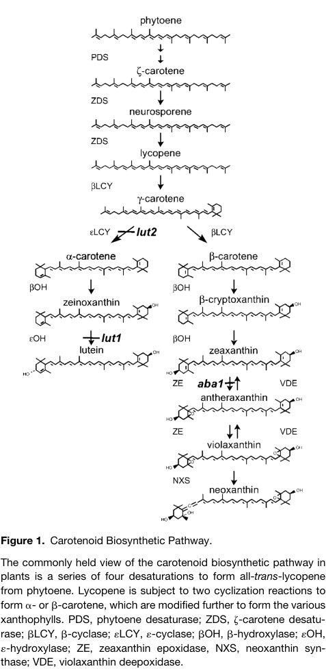

## Question

# Gene Research for Functional Annotation

## ⚠️ CRITICAL: Gene/Protein Identification Context

**BEFORE YOU BEGIN RESEARCH:** You MUST verify you are researching the CORRECT gene/protein. Gene symbols can be ambiguous, especially for less well-characterized genes from non-model organisms.

### Target Gene/Protein Identity (from UniProt):
- **UniProt Accession:** Q9M9Y8
- **Protein Description:** RecName: Full=Prolycopene isomerase, chloroplastic; Short=CrtISO; EC=5.2.1.13; AltName: Full=Carotenoid and chloroplast regulation protein 2; AltName: Full=Carotenoid isomerase; Flags: Precursor;
- **Gene Information:** Name=CRTISO; Synonyms=CCR2; OrderedLocusNames=At1g06820; ORFNames=F4H5.10;
- **Organism (full):** Arabidopsis thaliana (Mouse-ear cress).
- **Protein Family:** Belongs to the carotenoid/retinoid oxidoreductase family.
- **Key Domains:** Amino_oxidase. (IPR002937); CrtISO. (IPR014101); CrtISO-like. (IPR045892); FAD/NAD-bd_sf. (IPR036188); Amino_oxidase (PF01593)

### MANDATORY VERIFICATION STEPS:

1. **Check if the gene symbol "CRTISO" matches the protein description above**
2. **Verify the organism is correct:** Arabidopsis thaliana (Mouse-ear cress).
3. **Check if protein family/domains align with what you find in literature**
4. **If you find literature for a DIFFERENT gene with the same or similar symbol, STOP**

### If Gene Symbol is Ambiguous or You Cannot Find Relevant Literature:

**DO NOT PROCEED WITH RESEARCH ON A DIFFERENT GENE.** Instead:
- State clearly: "The gene symbol 'CRTISO' is ambiguous or literature is limited for this specific protein"
- Explain what you found (e.g., "Found extensive literature on a different gene with the same symbol in a different organism")
- Describe the protein based ONLY on the UniProt information provided above
- Suggest that the protein function can be inferred from domain/family information

### Research Target:

Please provide a comprehensive research report on the gene **CRTISO** (gene ID: CRTISO, UniProt: Q9M9Y8) in ARATH.

The research report should be a detailed narrative explaining the function, biological processes, and localization of the gene product. Citations should be given for all claims.

You should prioritize authoritative reviews and primary scientific literature when conducting research. You can supplement
this with annotations you find in gene/protein databases, but these can be outdated or inaccurate.

We are specifically interested in the primary function of the gene - for enzymes, what reaction is catalyzed, and what is the substrate specificity? For transporters, what is the substrate? For structural proteins or adapters, what is the broader structural role? For signaling molecules, what is the role in the pathway.

We are interested in where in or outside the cell the gene product carries out its function.

We are also interested in the signaling or biochemical pathways in which the gene functions. We are less interested in broad pleiotropic effects, except where these elucidate the precise role.

Include evidence where possible. We are interested in both experimental evidence as well as inference from structure, evolution, or bioinformatic analysis. Precise studies should be prioritized over high-throughput, where available.

## Output

Question: You are an expert researcher providing comprehensive, well-cited information.

Provide detailed information focusing on:
1. Key concepts and definitions with current understanding
2. Recent developments and latest research (prioritize 2023-2024 sources)
3. Current applications and real-world implementations
4. Expert opinions and analysis from authoritative sources
5. Relevant statistics and data from recent studies

Format as a comprehensive research report with proper citations. Include URLs and publication dates where available.
Always prioritize recent, authoritative sources and provide specific citations for all major claims.

# Gene Research for Functional Annotation

## ⚠️ CRITICAL: Gene/Protein Identification Context

**BEFORE YOU BEGIN RESEARCH:** You MUST verify you are researching the CORRECT gene/protein. Gene symbols can be ambiguous, especially for less well-characterized genes from non-model organisms.

### Target Gene/Protein Identity (from UniProt):
- **UniProt Accession:** Q9M9Y8
- **Protein Description:** RecName: Full=Prolycopene isomerase, chloroplastic; Short=CrtISO; EC=5.2.1.13; AltName: Full=Carotenoid and chloroplast regulation protein 2; AltName: Full=Carotenoid isomerase; Flags: Precursor;
- **Gene Information:** Name=CRTISO; Synonyms=CCR2; OrderedLocusNames=At1g06820; ORFNames=F4H5.10;
- **Organism (full):** Arabidopsis thaliana (Mouse-ear cress).
- **Protein Family:** Belongs to the carotenoid/retinoid oxidoreductase family.
- **Key Domains:** Amino_oxidase. (IPR002937); CrtISO. (IPR014101); CrtISO-like. (IPR045892); FAD/NAD-bd_sf. (IPR036188); Amino_oxidase (PF01593)

### MANDATORY VERIFICATION STEPS:

1. **Check if the gene symbol "CRTISO" matches the protein description above**
2. **Verify the organism is correct:** Arabidopsis thaliana (Mouse-ear cress).
3. **Check if protein family/domains align with what you find in literature**
4. **If you find literature for a DIFFERENT gene with the same or similar symbol, STOP**

### If Gene Symbol is Ambiguous or You Cannot Find Relevant Literature:

**DO NOT PROCEED WITH RESEARCH ON A DIFFERENT GENE.** Instead:
- State clearly: "The gene symbol 'CRTISO' is ambiguous or literature is limited for this specific protein"
- Explain what you found (e.g., "Found extensive literature on a different gene with the same symbol in a different organism")
- Describe the protein based ONLY on the UniProt information provided above
- Suggest that the protein function can be inferred from domain/family information

### Research Target:

Please provide a comprehensive research report on the gene **CRTISO** (gene ID: CRTISO, UniProt: Q9M9Y8) in ARATH.

The research report should be a detailed narrative explaining the function, biological processes, and localization of the gene product. Citations should be given for all claims.

You should prioritize authoritative reviews and primary scientific literature when conducting research. You can supplement
this with annotations you find in gene/protein databases, but these can be outdated or inaccurate.

We are specifically interested in the primary function of the gene - for enzymes, what reaction is catalyzed, and what is the substrate specificity? For transporters, what is the substrate? For structural proteins or adapters, what is the broader structural role? For signaling molecules, what is the role in the pathway.

We are interested in where in or outside the cell the gene product carries out its function.

We are also interested in the signaling or biochemical pathways in which the gene functions. We are less interested in broad pleiotropic effects, except where these elucidate the precise role.

Include evidence where possible. We are interested in both experimental evidence as well as inference from structure, evolution, or bioinformatic analysis. Precise studies should be prioritized over high-throughput, where available.

# Functional Annotation Report: *Arabidopsis thaliana* CRTISO (Q9M9Y8)

## Executive conclusion

The requested protein identity is verified. UniProt **Q9M9Y8** corresponds to the *Arabidopsis thaliana* nuclear locus **At1g06820**, originally cloned as **F4H5.10**, whose accepted names include **CRTISO**, **CRTISO1**, **CCR2**, carotenoid isomerase, and prolycopene isomerase. Positional cloning and three independent *ccr2* alleles linked this locus to the carotenoid-isomerase defect. It should not be confused with the distinct Arabidopsis paralog **At1g57770/CRTISO2**, for which functional carotenoid-isomerase activity was not established in the reviewed evidence. Thus, the organism, symbol, aliases, and supplied UniProt description are mutually consistent. (ruizsola2012carotenoidbiosynthesisin pages 7-8, park2002identificationofthe pages 4-6, cazzonelli2009regulationofcarotenoid pages 9-11)

CRTISO is a chloroplast-targeted, membrane-associated flavoprotein that completes the late cis-to-trans isomerization steps of linear carotene biosynthesis. Its principal physiological outcome is production of **all-trans-lycopene**, the branch-point substrate for α- and β-carotene synthesis. Its most severe loss-of-function consequences occur in darkness, when photochemical isomerization cannot substitute for the enzyme. (ruizsola2012carotenoidbiosynthesisin pages 7-8, cazzonelli2020aciscarotenederived pages 1-2)

| Annotation question | Conclusion | Evidence type/system | Confidence / limitations |
|---|---|---|---|
| Identity and aliases | The target is *Arabidopsis thaliana* **At1g06820**, also named **CCR2**, **CRTISO/CRTISO1**, and originally cloned as **F4H5.10**; it corresponds to UniProt **Q9M9Y8**. **At1g57770/CRTISO2** is a separate paralog and has not been experimentally demonstrated to encode the functional carotenoid isomerase. (ruizsola2012carotenoidbiosynthesisin pages 7-8, park2002identificationofthe pages 4-6, cazzonelli2009regulationofcarotenoid pages 9-11) | Direct Arabidopsis positional cloning with three independent mutant alleles; locus-specific literature and curated Arabidopsis review. | **High.** The gene, organism, aliases, and mutant complementation logic are concordant. CRTISO2 must not be conflated with this target. |
| Catalytic reaction and substrate specificity | CRTISO catalyzes **cis-to-trans isomerization of late, linear C40 carotene intermediates**: 7,9,9′-tri-cis-neurosporene → 9′-cis-neurosporene and 7′,9′-di-cis-lycopene → all-trans-lycopene; recombinant CRTISO also shifts poly-cis lycopene, neurosporene, and β-carotene pools toward trans forms. It is not supported as a desaturase or cyclase. (park2002identificationofthe pages 6-7, ruizsola2012carotenoidbiosynthesisin pages 7-8) | Direct recombinant-enzyme assay using *E. coli*-expressed Arabidopsis CRTISO and carotenoids from dark-grown Arabidopsis *ccr2* tissue; exact conversions summarized from subsequent biochemical work. | **High for isomerase function; moderate for complete substrate range.** Published evidence defines representative substrates, but comprehensive kinetic constants and purified-substrate specificity are unavailable in the gathered evidence. |
| FAD and membrane mechanism | Activity requires a **membrane environment** and **enzyme-bound FAD in its reduced state**. The reaction changes double-bond geometry without a net substrate redox change, consistent with the carotenoid/retinoid oxidoreductase and FAD/NAD-binding structural-family annotations. (ruizsola2012carotenoidbiosynthesisin pages 7-8, schaub2012onthestructure pages 8-9) | Biochemical synthesis and mechanistic comparison with homologous FAD-dependent carotenoid enzymes. | **Moderate–high.** Reduced-FAD and membrane dependence are supported, but the physiological reductant/electron-transfer partner and an Arabidopsis CRTISO structure remain unresolved in the cited evidence. |
| Chloroplast and subplastid localization | CRTISO is synthesized as a **chloroplast-targeted precursor** and functions in plastids. Proteomic syntheses place At1g06820 in plastid membranes, commonly assigned to the **chloroplast envelope**. (park2002identificationofthe pages 6-7, ruizsola2012carotenoidbiosynthesisin pages 7-8, joyard2009chloroplastproteomicsand pages 8-9, joyard2009chloroplastproteomicsand pages 10-10) | Transit-peptide prediction plus Arabidopsis chloroplast-fraction proteomics/database synthesis. | **High for plastid/chloroplast localization; moderate for envelope precision.** The subplastid assignment is proteomic rather than a definitive live-cell imaging result, and the retrieved quantitative table was column-disrupted. |
| Pathway position | CRTISO completes the late linear-carotene segment downstream of **PDS, ZISO, and ZDS**, converting tetra-/poly-cis lycopene intermediates into **all-trans-lycopene** before lycopene β- and ε-cyclization. This enables production of α-/β-carotenes and downstream xanthophylls such as lutein and violaxanthin. In darkness CRTISO is essential; light-dependent photoisomerization can partially bypass its absence. (ruizsola2012carotenoidbiosynthesisin pages 7-8, cazzonelli2020aciscarotenederived pages 1-2, hou2023reducingpsyactivity pages 1-4) | Direct Arabidopsis mutant biochemistry integrated with pathway reviews and dark/light experiments. | **High.** Pathway placement is strongly supported; light bypass explains why the null phenotype is more severe in etiolated than illuminated tissue. |
| *ccr2* phenotypes and quantitative findings | Dark-grown *ccr2* accumulates prolycopene, proneurosporene, pro-ζ-carotene and other poly-cis carotenes, lacks normal etioplast prolamellar bodies, and greens at about **half the wild-type rate** over three days. Lutein is approximately **10% of wild type after four days of illumination** and rises to about **40% in mature leaves**; total protochlorophyllide is reduced by **15%**. Among **34** mutant etioplasts, **29** had few prothylakoids and **5** had disorganized membrane swirls. (park2002identificationofthe pages 6-7, park2002identificationofthe pages 1-2, park2002identificationofthe pages 4-6, park2002identificationofthe media 7c260e5c) | Direct Arabidopsis genetics, HPLC pigment profiling, microscopy, and de-etiolation measurements. | **High.** These are locus-specific phenotypes. Broad developmental consequences should be interpreted as downstream effects of altered carotenoid geometry and plastid organization, not separate primary enzymatic functions. |
| Cis-carotene/apocarotenoid signaling | The best-supported model is that excess CRTISO substrates in *ccr2* feed a still-unidentified **cis-carotene-derived apocarotenoid signal** that regulates prolamellar-body formation, chloroplast development, and the **PIF3/HY5/POR** module. Removing ZISO activity suppressed selected cis-carotenes and restored PLBs in **more than 94%** of double-mutant etioplasts; chlorophyll recovered to approximately wild-type levels at 48–72 h. Newer PSY suppressor work shows that lowering selected cis-carotenes can rescue plastid biogenesis without restoring total xanthophyll or total cis-carotene pools. (cazzonelli2020aciscarotenederived pages 8-9, cazzonelli2020aciscarotenederived pages 21-22, cazzonelli2020aciscarotenederived pages 1-2, hou2023reducingpsyactivity pages 1-4, hou2023reducingpsyactivity pages 23-26) | Direct Arabidopsis epistasis, chemical inhibition, pigment profiling, protein measurements, and electron microscopy; 2020 peer-reviewed study plus 2023 preprint underlying a 2024 peer-reviewed report. | **Moderate–high for existence of signaling; low for signal identity.** Genetic and pharmacological evidence is strong, but the active cleavage product, its producing enzyme, receptor, and exact threshold remain unknown. |
| Applications and cross-species relevance | CRTISO is a practical target for manipulating carotenoid geometry, pigment color, plastid development, and nutritional traits. CRISPR disruption of both *Brassica napus* CRTISO copies produces creamy-white petals, yellowish leaves, reduced total carotenoids, and altered lycopene/α-carotene/γ-carotene levels; crop-expression studies also associate CRTISO with carotenoid-rich tissues. These examples demonstrate translational potential but do not directly annotate Q9M9Y8. | Cross-species crop gene editing, comparative expression, and breeding research; Arabidopsis supplies the mechanistic reference. | **Moderate for conserved crop relevance; low for predicting exact agronomic outcomes from Arabidopsis alone.** Paralogs, tissue context, illumination, and species-specific pathway regulation can substantially alter phenotypes. |

*Table: This table audits the functional annotation of Arabidopsis CRTISO/Q9M9Y8, separating direct locus-specific evidence from review-level synthesis and cross-species inference. It also flags unresolved questions concerning subplastid localization, mechanism, and the proposed cis-carotene-derived signal.*

## 1. Identity, family, and domain consistency

The original Arabidopsis study identified **CCR2 as CRTISO** through positional cloning, narrowing the mutation to F4H5.10 and confirming the assignment with independent mutant alleles. The encoded protein contains a predicted chloroplast-targeting sequence and a dinucleotide-binding region, and it is evolutionarily related to bacterial CrtI/CrtN-type carotenoid desaturases. Despite that ancestry, recombinant Arabidopsis CRTISO showed carotenoid cis–trans isomerase activity rather than detectable desaturase or cyclase activity. (park2002identificationofthe pages 6-7, park2002identificationofthe pages 4-6)

These findings align with the supplied annotations: carotenoid/retinoid oxidoreductase family, CrtISO/CrtISO-like domains, amino-oxidase-like PF01593/IPR002937 architecture, and FAD/NAD-binding fold. The “oxidoreductase-family” annotation should not be interpreted as evidence that CRTISO performs a net oxidation or reduction of its carotene substrate; its established physiological reaction changes alkene geometry. Reduced flavin is nevertheless required for catalysis. (ruizsola2012carotenoidbiosynthesisin pages 7-8, schaub2012onthestructure pages 8-9)

## 2. Primary biochemical function

### Reaction

CRTISO catalyzes cis-to-trans isomerization of late, acyclic C40 carotene intermediates generated by PDS, ZISO, and ZDS. Defined conversions include:

- **7,9,9′-tri-cis-neurosporene → 9′-cis-neurosporene**;
- **7′,9′-di-cis-lycopene → all-trans-lycopene**;
- more generally, progressive conversion of prolycopene/poly-cis lycopene intermediates toward all-trans-lycopene. (ruizsola2012carotenoidbiosynthesisin pages 7-8)

Park and colleagues expressed Arabidopsis CRTISO in *E. coli* and incubated it with carotenoid extracts from dark-grown *ccr2* tissue. The reaction increased trans forms of lycopene and neurosporene and depleted corresponding poly-cis pools. The recombinant enzyme did not exhibit the desaturase or cyclase activities that might have been predicted from its evolutionary relationship to bacterial proteins. (park2002identificationofthe pages 6-7)

### Substrate specificity

The strongest evidence supports specificity for **late linear poly-cis carotenes**, particularly neurosporene and lycopene isomers, rather than early phytoene. CRTISO is therefore not interchangeable with ZISO: ZISO acts earlier on the central 15-cis bond of ζ-carotene-related intermediates, whereas CRTISO resolves the remaining cis bonds in neurosporene/prolycopene-stage substrates. Exact comprehensive kinetic parameters, a physiological electron donor, and a complete purified-substrate specificity series were not available in the retrieved Arabidopsis literature. (ruizsola2012carotenoidbiosynthesisin pages 7-8, schaub2012onthestructure pages 8-9, cazzonelli2020aciscarotenederived pages 1-2)

### Cofactor and mechanism

Biochemical synthesis indicates that CRTISO activity requires a membrane environment and **enzyme-bound FAD in its reduced state**. Because cis–trans isomerization has no net change in substrate oxidation state, FAD is thought to facilitate double-bond activation and geometrical rearrangement rather than act as a stoichiometric oxidant. Mechanistic work on the homologous bacterial CRTI family supports this interpretation, but a high-resolution structure and complete catalytic cycle for Arabidopsis Q9M9Y8 remain lacking. (ruizsola2012carotenoidbiosynthesisin pages 7-8, schaub2012onthestructure pages 8-9)

## 3. Pathway placement and biological process

In plastid carotenoid biosynthesis, phytoene is processed through alternating desaturation and isomerization reactions involving PDS, ZISO, ZDS, and CRTISO. CRTISO completes the conversion of tetra-/poly-cis lycopene intermediates into all-trans-lycopene. Lycopene β- and ε-cyclases then direct flux into β-carotene and α-carotene, respectively, followed by production of xanthophylls including lutein, zeaxanthin, violaxanthin, and neoxanthin. (cazzonelli2020aciscarotenederived pages 1-2, hou2023reducingpsyactivity pages 1-4, park2002identificationofthe media 7c260e5c)

This placement explains why loss of CRTISO reduces downstream cyclic carotenoids without necessarily making illuminated plants inviable. In darkness, ZISO and CRTISO are strictly required for the relevant geometrical conversions. Under illumination, sensitized photoisomerization partially bypasses the enzymatic block, permitting some all-trans-lycopene and downstream xanthophyll synthesis. CRTISO is consequently most critical in etioplasts, internal or shaded tissues, and other contexts with insufficient light-driven isomerization. (ruizsola2012carotenoidbiosynthesisin pages 7-8, cazzonelli2020aciscarotenederived pages 1-2)

The retrieved HPLC evidence directly shows accumulation of prolycopene, proneurosporene, and cis-ζ-carotene species in etiolated *ccr2*, in contrast to wild-type lutein and violaxanthin. It also documents the partial recovery of lutein during illumination. (park2002identificationofthe pages 1-2, park2002identificationofthe media 111cb44e)

## 4. Cellular and subcellular localization

Q9M9Y8 is synthesized as a precursor with an N-terminal plastid transit peptide and imported into chloroplast-lineage plastids. Chloroplast-fraction proteomics and curated Arabidopsis localization syntheses assign CRTISO to plastid membranes, commonly the **chloroplast envelope**. This location is biologically plausible because its carotene substrates are extremely hydrophobic and membrane embedded. (park2002identificationofthe pages 6-7, ruizsola2012carotenoidbiosynthesisin pages 7-8, joyard2009chloroplastproteomicsand pages 8-9, joyard2009chloroplastproteomicsand pages 10-10)

The evidence is strongest for “chloroplast/plastid membrane” and somewhat weaker for an exclusive envelope assignment. The retrieved localization data are principally fractionation/proteomics and database synthesis rather than definitive live-cell imaging of Q9M9Y8. CRTISO also functions in etioplasts—the dark-grown precursors of chloroplasts—where loss of activity causes the most conspicuous biochemical and ultrastructural phenotype. (park2002identificationofthe pages 6-7, joyard2009chloroplastproteomicsand pages 8-9)

## 5. Direct Arabidopsis genetic and physiological evidence

### Pigment phenotype

Dark-grown *ccr2/crtiso* seedlings accumulate prolycopene, proneurosporene, pro-ζ-carotene, and additional acyclic poly-cis intermediates instead of normal cyclic all-trans xanthophylls. In illuminated leaves, lutein was about **10% of wild-type abundance after four days** and recovered to approximately **40% in mature leaves**, demonstrating partial light-dependent bypass rather than complete restoration. Seedling greening proceeded at roughly **half the wild-type rate during the first three days**. (park2002identificationofthe pages 1-2, park2002identificationofthe pages 4-6)

### Etioplast and photomorphogenesis phenotype

Wild-type etioplasts contain a paracrystalline prolamellar body (PLB), from which thylakoid membranes develop after illumination. Dark-grown *ccr2* etioplasts lack normal PLBs. In the original ultrastructural sample, **29 of 34** mutant etioplasts contained only sparse prothylakoids, while the other **5 of 34** contained disorganized membrane swirls. Total protochlorophyllide was reduced by approximately **15%**. These observations link correct carotenoid geometry and composition to membrane organization during etioplast-to-chloroplast differentiation. (park2002identificationofthe pages 6-7)

The broader interpretation should remain disciplined: CRTISO is not itself a membrane-structural protein or canonical light-signaling protein. PLB loss, slow greening, altered photomorphogenesis, and reduced lutein are downstream consequences of its primary enzymatic defect and the abnormal accumulation of cis-carotene substrates. (park2002identificationofthe pages 6-7, park2002identificationofthe pages 1-2)

## 6. Regulatory and signaling implications

Research since the original cloning has reframed *ccr2* as more than a simple carotenoid-deficiency mutant. The current model proposes that one or more cis-carotenes accumulating when CRTISO is absent are cleaved to produce an unidentified **cis-carotene-derived apocarotenoid signal**. This signal affects PLB formation and chloroplast differentiation through the POR/PIF3/HY5 regulatory system and acts in parallel with DEETIOLATED1-mediated photomorphogenic control. (cazzonelli2020aciscarotenederived pages 21-22, cazzonelli2020aciscarotenederived pages 1-2)

In a 2020 *eLife* study, eliminating upstream ZISO activity in the *ccr2* background removed selected cis-carotenes and restored PLBs in **more than 94%** of double-mutant etioplasts, without restoring the normal *ccr2* xanthophyll profile. Chlorophyll accumulation recovered to approximately wild-type levels at 48 and 72 hours after de-etiolation. Chemical inhibition of carotenoid-cleavage dioxygenase activity also restored PLB formation, supporting a cleavage product rather than bulk carotenoid deficiency as the regulatory agent. (cazzonelli2020aciscarotenederived pages 8-9, cazzonelli2020aciscarotenederived pages 1-2)

The most recent focused work identified four nonlethal **PSY suppressor alleles** that rescued the short-photoperiod leaf-virescence and plastid-biogenesis phenotypes of *ccr2*. These variants altered PSY splicing, catalytic interactions, protein abundance, or binding to ORANGE and reduced selected acyclic cis-carotenes without materially changing total xanthophyll or total cis-carotene accumulation. This supports a concentration-threshold model in which particular intermediates—especially di-cis-ζ-carotene and/or tri-cis-neurosporene—rather than total carotenoid abundance determine signaling output. The work first appeared as a July 2023 bioRxiv preprint and was subsequently published in the *Journal of Experimental Botany* in 2024 (DOI: [10.1093/jxb/erad443](https://doi.org/10.1093/jxb/erad443)). (hou2023reducingpsyactivity pages 39-42, hou2023reducingpsyactivity pages 1-4, hou2023reducingpsyactivity pages 23-26)

Important uncertainties remain. The active apocarotenoid has not been chemically identified; its producing enzyme, receptor, and precise concentration threshold are unknown. Accordingly, the existence of a cis-carotene-dependent regulatory process is substantially better supported than any proposed molecular identity for the signal. (hou2023reducingpsyactivity pages 1-4, hou2023reducingpsyactivity pages 23-26)

## 7. Regulation of CRTISO expression

CRTISO abundance is itself developmentally and epigenetically regulated. The histone methyltransferase SDG8/CCR1 controls chromatin marks near At1g06820, and *ccr1* mutants show markedly reduced CRTISO expression and a related cis-carotene phenotype. One expression analysis reported At1g06820 as downregulated by a fold-change value of **29.2** in *ccr1-1*. This is regulatory evidence and should not lead to conflation of **CCR1/SDG8**, the chromatin regulator, with **CCR2/CRTISO**, the enzyme studied here. (cazzonelli2009regulationofcarotenoid pages 9-11)

## 8. Applications and real-world relevance

Arabidopsis CRTISO provides a mechanistic reference for manipulating carotenoid geometry and accumulation in crops. Potential applications include:

1. **Fruit and flower color engineering.** Suppressing CRTISO favors orange/yellow poly-cis lycopene forms over red all-trans-lycopene and can alter downstream carotene/xanthophyll composition.
2. **Nutritional biofortification.** CRTISO activity controls entry into the lycopene branch point and therefore influences the precursors available for β-carotene/provitamin A and lutein synthesis.
3. **Ornamental and oilseed breeding.** CRISPR disruption of both functional CRTISO copies in *Brassica napus* produced creamy-white petals and yellowish leaves, reduced total carotenoids, and altered lycopene, α-carotene, and γ-carotene pools. This demonstrates practical editability but is cross-species evidence, not a direct phenotype of Q9M9Y8.
4. **Plastid-development research.** The *ccr2* mutant is an experimental system for separating bulk pigment deficiency from cis-carotene/apocarotenoid signaling during skotomorphogenesis and de-etiolation.

Species, tissue, and illumination matter strongly. Tomato fruit chromoplasts, rapeseed petals, and Arabidopsis leaves differ in paralog dosage, carotenoid storage, and availability of photoisomerization, so crop outcomes cannot be predicted quantitatively from Arabidopsis alone. (ruizsola2012carotenoidbiosynthesisin pages 7-8, cazzonelli2020aciscarotenederived pages 1-2)

## 9. Evidence-weighted annotation

**Recommended primary annotation:** chloroplast/plastid-membrane prolycopene isomerase (carotenoid isomerase; EC 5.2.1.13) that uses reduced FAD to convert late poly-cis neurosporene/lycopene intermediates into configurations culminating in all-trans-lycopene.

**Recommended biological-process annotation:** plastid carotenoid biosynthesis; linear-carotene isomerization; provision of all-trans-lycopene for α-/β-carotene and xanthophyll production; indirect control of etioplast PLB formation and chloroplast biogenesis through carotenoid composition and a putative cis-carotene-derived retrograde signal.

**Recommended localization annotation:** chloroplast-lineage plastids, membrane associated; chloroplast envelope is supported by proteomic synthesis but should be treated as less certain than the general plastid-membrane assignment.

**Key unresolved issues:** the complete kinetic substrate spectrum, physiological system that reduces FAD, high-resolution Arabidopsis CRTISO structure, exact subplastid topology, and identity/receptor of the proposed cis-apocarotenoid signal.

## Principal sources

- Park H. et al. **“Identification of the Carotenoid Isomerase Provides Insight into Carotenoid Biosynthesis, Prolamellar Body Formation, and Photomorphogenesis.”** *The Plant Cell* 14, 321–332. Published February 2002. DOI/URL: [10.1105/tpc.010302](https://doi.org/10.1105/tpc.010302). (park2002identificationofthe pages 6-7, park2002identificationofthe pages 1-2)
- Ruiz-Sola MÁ, Rodríguez-Concepción M. **“Carotenoid Biosynthesis in Arabidopsis: A Colorful Pathway.”** *The Arabidopsis Book* e0158. Published 2012. DOI/URL: [10.1199/tab.0158](https://doi.org/10.1199/tab.0158). (ruizsola2012carotenoidbiosynthesisin pages 7-8)
- Joyard J. et al. **“Chloroplast Proteomics and the Compartmentation of Plastidial Isoprenoid Biosynthetic Pathways.”** *Molecular Plant* 2, 1154–1180. Published November 2009. DOI/URL: [10.1093/mp/ssp088](https://doi.org/10.1093/mp/ssp088). (joyard2009chloroplastproteomicsand pages 8-9, joyard2009chloroplastproteomicsand pages 10-10)
- Cazzonelli CI. et al. **“A cis-Carotene Derived Apocarotenoid Regulates Etioplast and Chloroplast Development.”** *eLife* 9:e45310. Published 31 January 2020. DOI/URL: [10.7554/eLife.45310](https://doi.org/10.7554/eLife.45310). (cazzonelli2020aciscarotenederived pages 8-9, cazzonelli2020aciscarotenederived pages 1-2)
- Hou X. et al. **“Reducing Phytoene Synthase Activity Fine-Tunes the Abundance of a cis-Carotene-Derived Signal That Regulates the PIF3/HY5 Module and Plastid Biogenesis.”** *Journal of Experimental Botany* 75, 1187–1204. Published online November 2023; 2024 volume. DOI/URL: [10.1093/jxb/erad443](https://doi.org/10.1093/jxb/erad443). The retrieved full text was the July 2023 preprint [10.1101/2023.06.29.546996](https://doi.org/10.1101/2023.06.29.546996). (hou2023reducingpsyactivity pages 39-42, hou2023reducingpsyactivity pages 1-4, hou2023reducingpsyactivity pages 23-26)

References

1. (ruizsola2012carotenoidbiosynthesisin pages 7-8): M. Águila Ruiz-Sola and Manuel Rodríguez-Concepción. Carotenoid biosynthesis in arabidopsis: a colorful pathway. The Arabidopsis Book, 2012:e0158, Jan 2012. URL: https://doi.org/10.1199/tab.0158, doi:10.1199/tab.0158. This article has 742 citations and is from a peer-reviewed journal.

2. (park2002identificationofthe pages 4-6): Hyoungshin Park, Sarah S. Kreunen, Abby J. Cuttriss, Dean DellaPenna, and Barry J. Pogson. Identification of the carotenoid isomerase provides insight into carotenoid biosynthesis, prolamellar body formation, and photomorphogenesis article, publication date, and citation information can be found at www.plantcell.org/cgi/doi/10.1105/tpc.010302. The Plant Cell Online, 14:321-332, Feb 2002. URL: https://doi.org/10.1105/tpc.010302, doi:10.1105/tpc.010302. This article has 614 citations.

3. (cazzonelli2009regulationofcarotenoid pages 9-11): Christopher I. Cazzonelli, Abby J. Cuttriss, Susan B. Cossetto, William Pye, Peter Crisp, Jim Whelan, E. Jean Finnegan, Colin Turnbull, and Barry J. Pogson. Regulation of carotenoid composition and shoot branching in <i>arabidopsis</i> by a chromatin modifying histone methyltransferase, sdg8. The Plant Cell, 21:39-53, Jan 2009. URL: https://doi.org/10.1105/tpc.108.063131, doi:10.1105/tpc.108.063131. This article has 293 citations.

4. (cazzonelli2020aciscarotenederived pages 1-2): Christopher I Cazzonelli, Xin Hou, Yagiz Alagoz, John Rivers, Namraj Dhami, Jiwon Lee, Shashikanth Marri, and Barry J Pogson. A cis-carotene derived apocarotenoid regulates etioplast and chloroplast development. Jan 2020. URL: https://doi.org/10.7554/elife.45310, doi:10.7554/elife.45310. This article has 92 citations and is from a domain leading peer-reviewed journal.

5. (park2002identificationofthe pages 6-7): Hyoungshin Park, Sarah S. Kreunen, Abby J. Cuttriss, Dean DellaPenna, and Barry J. Pogson. Identification of the carotenoid isomerase provides insight into carotenoid biosynthesis, prolamellar body formation, and photomorphogenesis article, publication date, and citation information can be found at www.plantcell.org/cgi/doi/10.1105/tpc.010302. The Plant Cell Online, 14:321-332, Feb 2002. URL: https://doi.org/10.1105/tpc.010302, doi:10.1105/tpc.010302. This article has 614 citations.

6. (schaub2012onthestructure pages 8-9): Patrick Schaub, Qiuju Yu, Sandra Gemmecker, Pierre Poussin-Courmontagne, Justine Mailliot, Alastair G. McEwen, Sandro Ghisla, Salim Al-Babili, Jean Cavarelli, and Peter Beyer. On the structure and function of the phytoene desaturase crti from pantoea ananatis, a membrane-peripheral and fad-dependent oxidase/isomerase. PLoS ONE, 7:e39550, Jun 2012. URL: https://doi.org/10.1371/journal.pone.0039550, doi:10.1371/journal.pone.0039550. This article has 126 citations and is from a peer-reviewed journal.

7. (joyard2009chloroplastproteomicsand pages 8-9): Jacques Joyard, Myriam Ferro, Christophe Masselon, Daphné Seigneurin-Berny, Daniel Salvi, Jérôme Garin, and Norbert Rolland. Chloroplast proteomics and the compartmentation of plastidial isoprenoid biosynthetic pathways. Molecular plant, 2 6:1154-80, Nov 2009. URL: https://doi.org/10.1093/mp/ssp088, doi:10.1093/mp/ssp088. This article has 303 citations and is from a highest quality peer-reviewed journal.

8. (joyard2009chloroplastproteomicsand pages 10-10): Jacques Joyard, Myriam Ferro, Christophe Masselon, Daphné Seigneurin-Berny, Daniel Salvi, Jérôme Garin, and Norbert Rolland. Chloroplast proteomics and the compartmentation of plastidial isoprenoid biosynthetic pathways. Molecular plant, 2 6:1154-80, Nov 2009. URL: https://doi.org/10.1093/mp/ssp088, doi:10.1093/mp/ssp088. This article has 303 citations and is from a highest quality peer-reviewed journal.

9. (hou2023reducingpsyactivity pages 1-4): Xin Hou, Yagiz Alagoz, Ralf Welsch, Matthew D Mortimer, Barry J. Pogson, and Christopher I. Cazzonelli. Reducing psy activity fine tunes threshold levels of a cis-carotene-derived signal that regulates the pif3/hy5 module and plastid biogenesis. bioRxiv, Jul 2023. URL: https://doi.org/10.1101/2023.06.29.546996, doi:10.1101/2023.06.29.546996. This article has 0 citations.

10. (park2002identificationofthe pages 1-2): Hyoungshin Park, Sarah S. Kreunen, Abby J. Cuttriss, Dean DellaPenna, and Barry J. Pogson. Identification of the carotenoid isomerase provides insight into carotenoid biosynthesis, prolamellar body formation, and photomorphogenesis article, publication date, and citation information can be found at www.plantcell.org/cgi/doi/10.1105/tpc.010302. The Plant Cell Online, 14:321-332, Feb 2002. URL: https://doi.org/10.1105/tpc.010302, doi:10.1105/tpc.010302. This article has 614 citations.

11. (park2002identificationofthe media 7c260e5c): Hyoungshin Park, Sarah S. Kreunen, Abby J. Cuttriss, Dean DellaPenna, and Barry J. Pogson. Identification of the carotenoid isomerase provides insight into carotenoid biosynthesis, prolamellar body formation, and photomorphogenesis article, publication date, and citation information can be found at www.plantcell.org/cgi/doi/10.1105/tpc.010302. The Plant Cell Online, 14:321-332, Feb 2002. URL: https://doi.org/10.1105/tpc.010302, doi:10.1105/tpc.010302. This article has 614 citations.

12. (cazzonelli2020aciscarotenederived pages 8-9): Christopher I Cazzonelli, Xin Hou, Yagiz Alagoz, John Rivers, Namraj Dhami, Jiwon Lee, Shashikanth Marri, and Barry J Pogson. A cis-carotene derived apocarotenoid regulates etioplast and chloroplast development. Jan 2020. URL: https://doi.org/10.7554/elife.45310, doi:10.7554/elife.45310. This article has 92 citations and is from a domain leading peer-reviewed journal.

13. (cazzonelli2020aciscarotenederived pages 21-22): Christopher I Cazzonelli, Xin Hou, Yagiz Alagoz, John Rivers, Namraj Dhami, Jiwon Lee, Shashikanth Marri, and Barry J Pogson. A cis-carotene derived apocarotenoid regulates etioplast and chloroplast development. Jan 2020. URL: https://doi.org/10.7554/elife.45310, doi:10.7554/elife.45310. This article has 92 citations and is from a domain leading peer-reviewed journal.

14. (hou2023reducingpsyactivity pages 23-26): Xin Hou, Yagiz Alagoz, Ralf Welsch, Matthew D Mortimer, Barry J. Pogson, and Christopher I. Cazzonelli. Reducing psy activity fine tunes threshold levels of a cis-carotene-derived signal that regulates the pif3/hy5 module and plastid biogenesis. bioRxiv, Jul 2023. URL: https://doi.org/10.1101/2023.06.29.546996, doi:10.1101/2023.06.29.546996. This article has 0 citations.

15. (park2002identificationofthe media 111cb44e): Hyoungshin Park, Sarah S. Kreunen, Abby J. Cuttriss, Dean DellaPenna, and Barry J. Pogson. Identification of the carotenoid isomerase provides insight into carotenoid biosynthesis, prolamellar body formation, and photomorphogenesis article, publication date, and citation information can be found at www.plantcell.org/cgi/doi/10.1105/tpc.010302. The Plant Cell Online, 14:321-332, Feb 2002. URL: https://doi.org/10.1105/tpc.010302, doi:10.1105/tpc.010302. This article has 614 citations.

16. (hou2023reducingpsyactivity pages 39-42): Xin Hou, Yagiz Alagoz, Ralf Welsch, Matthew D Mortimer, Barry J. Pogson, and Christopher I. Cazzonelli. Reducing psy activity fine tunes threshold levels of a cis-carotene-derived signal that regulates the pif3/hy5 module and plastid biogenesis. bioRxiv, Jul 2023. URL: https://doi.org/10.1101/2023.06.29.546996, doi:10.1101/2023.06.29.546996. This article has 0 citations.

## Artifacts

- [Edison artifact artifact-00](CRTISO-deep-research-falcon_artifacts/artifact-00.md)

## Citations

1. ruizsola2012carotenoidbiosynthesisin pages 7-8
2. park2002identificationofthe pages 6-7
3. cazzonelli2009regulationofcarotenoid pages 9-11
4. park2002identificationofthe pages 4-6
5. cazzonelli2020aciscarotenederived pages 1-2
6. schaub2012onthestructure pages 8-9
7. joyard2009chloroplastproteomicsand pages 8-9
8. joyard2009chloroplastproteomicsand pages 10-10
9. hou2023reducingpsyactivity pages 1-4
10. park2002identificationofthe pages 1-2
11. cazzonelli2020aciscarotenederived pages 8-9
12. cazzonelli2020aciscarotenederived pages 21-22
13. hou2023reducingpsyactivity pages 23-26
14. hou2023reducingpsyactivity pages 39-42
15. 10.1093/jxb/erad443
16. 10.1105/tpc.010302
17. 10.1199/tab.0158
18. 10.1093/mp/ssp088
19. 10.7554/eLife.45310
20. 10.1101/2023.06.29.546996
21. https://doi.org/10.1093/jxb/erad443
22. https://doi.org/10.1105/tpc.010302
23. https://doi.org/10.1199/tab.0158
24. https://doi.org/10.1093/mp/ssp088
25. https://doi.org/10.7554/eLife.45310
26. https://doi.org/10.1101/2023.06.29.546996
27. https://doi.org/10.1199/tab.0158,
28. https://doi.org/10.1105/tpc.010302,
29. https://doi.org/10.1105/tpc.108.063131,
30. https://doi.org/10.7554/elife.45310,
31. https://doi.org/10.1371/journal.pone.0039550,
32. https://doi.org/10.1093/mp/ssp088,
33. https://doi.org/10.1101/2023.06.29.546996,