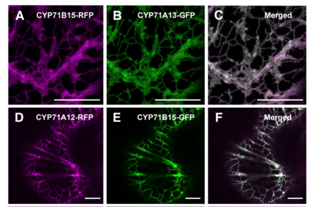

## Question

# Gene Research for Functional Annotation

## ⚠️ CRITICAL: Gene/Protein Identification Context

**BEFORE YOU BEGIN RESEARCH:** You MUST verify you are researching the CORRECT gene/protein. Gene symbols can be ambiguous, especially for less well-characterized genes from non-model organisms.

### Target Gene/Protein Identity (from UniProt):
- **UniProt Accession:** O49340
- **Protein Description:** RecName: Full=Cytochrome P450 71A12; EC=1.14.-.- {ECO:0000305};
- **Gene Information:** Name=CYP71A12; OrderedLocusNames=At2g30750; ORFNames=T11J7.14;
- **Organism (full):** Arabidopsis thaliana (Mouse-ear cress).
- **Protein Family:** Belongs to the cytochrome P450 family. .
- **Key Domains:** Cyt_P450. (IPR001128); Cyt_P450_CS. (IPR017972); Cyt_P450_E_grp-I. (IPR002401); Cyt_P450_sf. (IPR036396); p450 (PF00067)

### MANDATORY VERIFICATION STEPS:

1. **Check if the gene symbol "CYP71A12" matches the protein description above**
2. **Verify the organism is correct:** Arabidopsis thaliana (Mouse-ear cress).
3. **Check if protein family/domains align with what you find in literature**
4. **If you find literature for a DIFFERENT gene with the same or similar symbol, STOP**

### If Gene Symbol is Ambiguous or You Cannot Find Relevant Literature:

**DO NOT PROCEED WITH RESEARCH ON A DIFFERENT GENE.** Instead:
- State clearly: "The gene symbol 'CYP71A12' is ambiguous or literature is limited for this specific protein"
- Explain what you found (e.g., "Found extensive literature on a different gene with the same symbol in a different organism")
- Describe the protein based ONLY on the UniProt information provided above
- Suggest that the protein function can be inferred from domain/family information

### Research Target:

Please provide a comprehensive research report on the gene **CYP71A12** (gene ID: CYP71A12, UniProt: O49340) in ARATH.

The research report should be a detailed narrative explaining the function, biological processes, and localization of the gene product. Citations should be given for all claims.

You should prioritize authoritative reviews and primary scientific literature when conducting research. You can supplement
this with annotations you find in gene/protein databases, but these can be outdated or inaccurate.

We are specifically interested in the primary function of the gene - for enzymes, what reaction is catalyzed, and what is the substrate specificity? For transporters, what is the substrate? For structural proteins or adapters, what is the broader structural role? For signaling molecules, what is the role in the pathway.

We are interested in where in or outside the cell the gene product carries out its function.

We are also interested in the signaling or biochemical pathways in which the gene functions. We are less interested in broad pleiotropic effects, except where these elucidate the precise role.

Include evidence where possible. We are interested in both experimental evidence as well as inference from structure, evolution, or bioinformatic analysis. Precise studies should be prioritized over high-throughput, where available.

## Output

Question: You are an expert researcher providing comprehensive, well-cited information.

Provide detailed information focusing on:
1. Key concepts and definitions with current understanding
2. Recent developments and latest research (prioritize 2023-2024 sources)
3. Current applications and real-world implementations
4. Expert opinions and analysis from authoritative sources
5. Relevant statistics and data from recent studies

Format as a comprehensive research report with proper citations. Include URLs and publication dates where available.
Always prioritize recent, authoritative sources and provide specific citations for all major claims.

# Gene Research for Functional Annotation

## ⚠️ CRITICAL: Gene/Protein Identification Context

**BEFORE YOU BEGIN RESEARCH:** You MUST verify you are researching the CORRECT gene/protein. Gene symbols can be ambiguous, especially for less well-characterized genes from non-model organisms.

### Target Gene/Protein Identity (from UniProt):
- **UniProt Accession:** O49340
- **Protein Description:** RecName: Full=Cytochrome P450 71A12; EC=1.14.-.- {ECO:0000305};
- **Gene Information:** Name=CYP71A12; OrderedLocusNames=At2g30750; ORFNames=T11J7.14;
- **Organism (full):** Arabidopsis thaliana (Mouse-ear cress).
- **Protein Family:** Belongs to the cytochrome P450 family. .
- **Key Domains:** Cyt_P450. (IPR001128); Cyt_P450_CS. (IPR017972); Cyt_P450_E_grp-I. (IPR002401); Cyt_P450_sf. (IPR036396); p450 (PF00067)

### MANDATORY VERIFICATION STEPS:

1. **Check if the gene symbol "CYP71A12" matches the protein description above**
2. **Verify the organism is correct:** Arabidopsis thaliana (Mouse-ear cress).
3. **Check if protein family/domains align with what you find in literature**
4. **If you find literature for a DIFFERENT gene with the same or similar symbol, STOP**

### If Gene Symbol is Ambiguous or You Cannot Find Relevant Literature:

**DO NOT PROCEED WITH RESEARCH ON A DIFFERENT GENE.** Instead:
- State clearly: "The gene symbol 'CYP71A12' is ambiguous or literature is limited for this specific protein"
- Explain what you found (e.g., "Found extensive literature on a different gene with the same symbol in a different organism")
- Describe the protein based ONLY on the UniProt information provided above
- Suggest that the protein function can be inferred from domain/family information

### Research Target:

Please provide a comprehensive research report on the gene **CYP71A12** (gene ID: CYP71A12, UniProt: O49340) in ARATH.

The research report should be a detailed narrative explaining the function, biological processes, and localization of the gene product. Citations should be given for all claims.

You should prioritize authoritative reviews and primary scientific literature when conducting research. You can supplement
this with annotations you find in gene/protein databases, but these can be outdated or inaccurate.

We are specifically interested in the primary function of the gene - for enzymes, what reaction is catalyzed, and what is the substrate specificity? For transporters, what is the substrate? For structural proteins or adapters, what is the broader structural role? For signaling molecules, what is the role in the pathway.

We are interested in where in or outside the cell the gene product carries out its function.

We are also interested in the signaling or biochemical pathways in which the gene functions. We are less interested in broad pleiotropic effects, except where these elucidate the precise role.

Include evidence where possible. We are interested in both experimental evidence as well as inference from structure, evolution, or bioinformatic analysis. Precise studies should be prioritized over high-throughput, where available.

# Functional annotation of Arabidopsis CYP71A12

## Identity and principal function

**CYP71A12 is the Arabidopsis thaliana gene At2g30750**, corresponding to the user-specified UniProt accession [O49340](https://www.uniprot.org/uniprotkb/O49340/entry). The locus assignment appears explicitly in the primary pathway study; CYP71A13 and CYP71A27 are different genes and are not interchangeable with this target. Its experimentally established oxidative activity agrees with the supplied cytochrome-P450 family and domain annotation. (rajniak2015anewcyanogenic pages 2-3, rajniak2015anewcyanogenic pages 2-2, somssich2025gunsinrosettes pages 5-6)

**Best-supported functional annotation:** CYP71A12 is a pathogen-inducible, endoplasmic-reticulum-associated P450 that channels tryptophan-derived **indole-3-acetaldoxime (IAOx)** toward cyanogenic indole metabolites, particularly the **indole-3-carbonyl nitrile (ICN)/4-hydroxy-ICN pathway**, and is a major contributor to pathogen-induced **indole-3-carboxylic acid (ICA) derivatives**. It can also participate in chemistry shared with camalexin biosynthesis, but CYP71A13 generally has the stronger camalexin-associated role. These are metabolic assignments, **not** evidence that CYP71A12 is itself a receptor, transcription factor, or cyanide-releasing hydrolase. (rajniak2015anewcyanogenic pages 2-2, mucha2019theformationof pages 2-3, pastorczyk2020theroleof pages 10-11, somssich2025gunsinrosettes pages 6-7)

| Mechanistic assignment | Experimental evidence | Caveat |
|---|---|---|
| **IAOx → IAN/cyanohydrin chemistry:** stress-induced CYP71A12 and CYP71A13 can dehydrate indole-3-acetaldoxime (IAOx) to indole-3-acetonitrile (IAN) and participate in its subsequent activation to indole cyanohydrin. CYP71A13 predominantly channels flux toward camalexin, whereas CYP71A12 has the stronger association with the 4-OH-ICN branch. (mucha2019theformationof pages 2-3, somssich2025gunsinrosettes pages 6-7) | Pathway studies, mutant metabolite profiles and heterologous reconstitution support partially overlapping CYP71A12/CYP71A13 chemistry. CYP71A12 loss reduced nearly all measured ICN derivatives to below 10% of wild type, whereas the corresponding metabolites were unaffected in *cyp71A13*. (rajniak2015anewcyanogenic pages 2-2) | The short-lived intermediates have prevented complete stepwise resolution. Published work does not provide purified-enzyme kinetic constants that cleanly partition IAOx dehydration and IAN hydroxylation between CYP71A12 and CYP71A13. (rajniak2015anewcyanogenic pages 2-3, mucha2019theformationof pages 2-3) |
| **Cyanogenic branch:** CYP71A12 is proposed to form α-hydroxy-IAN; FOX1 oxidizes this cyanohydrin to indole-3-carbonyl nitrile (ICN), and CYP82C2 hydroxylates ICN to 4-OH-ICN. ICN can hydrolyze to indole-3-carboxylic acid (ICA) with HCN release; 4-OH-ICN has an approximately 3-minute half-life at pH 5–7.5. (rajniak2015anewcyanogenic pages 2-2, pastorczyk2020theroleof pages 2-3) | Yeast-microsome and *Nicotiana benthamiana* reconstitution placed CYP71A12 upstream of FOX1 and CYP82C2. *fox1* reduced ICN metabolites three- to fivefold and accumulated cyanohydrin-derived glycosides; CYP79B2 plus CYP71A12 without FOX1 likewise generated cyanogenic-glycoside signals. (rajniak2015anewcyanogenic pages 2-3) | 4-OH-ICN was often inferred from stable hydrolysis products rather than measured directly. ICN/4-OH-ICN instability and extraction-dependent conversion—including methyl-ester artifacts—complicate assignment of in-planta ICA pools and exact CYP71A12 products. (rajniak2015anewcyanogenic pages 2-3, rajniak2015anewcyanogenic pages 4-10, pastorczyk2020theroleof pages 2-3) |
| **Defense outputs:** CYP71A12 is the major contributor to pathogen-triggered ICN/ICA metabolism, whereas CYP71A13 is more specialized for camalexin, although compensation and shared flux occur. (pastorczyk2020theroleof pages 6-7, pastorczyk2020theroleof pages 10-11, pastorczyk2020theroleof pages 1-2) | *cyp71A12* strongly reduced infection-induced ICA glucosides and impaired resistance to selected post-invasive pathogens. It increased susceptibility to *Pseudomonas syringae* DC3000 and lesion development after *Alternaria brassicicola* invasion; exogenous 4-OH-ICN, but not ICN or camalexin, enhanced resistance to subsequent DC3000 infection. (rajniak2015anewcyanogenic pages 3-4, kosaka2021tryptophanderivedmetabolitesand pages 2-3, pastorczyk2020theroleof pages 3-4) | Effects are pathogen- and genetic-background-dependent: some phenotypes become strongest when PEN2 or camalexin defenses are removed, and *cyp82C2* did not affect the tested *A. brassicicola* assay. ICA lacked direct antifungal activity against *Plectosphaerella cucumerina* in vitro, suggesting that some effects may be regulatory. (pastorczyk2020theroleof pages 6-7, kosaka2021tryptophanderivedmetabolitesand pages 2-3, pastorczyk2020theroleof pages 10-11) |
| **Cellular site and organization:** CYP71A12 is an endoplasmic-reticulum-localized P450 capable of joining a membrane-associated camalexin biosynthetic metabolon. (mucha2019theformationof pages 5-5, mucha2019theformationof pages 9-10) | C-terminally tagged CYP71A12 colocalized with the ER marker RFP-HDEL after transient expression in *N. benthamiana*. Co-IP and FRET-FLIM detected associations with CYP71B15 and other pathway proteins; CYP71A12 also copurified from challenged Arabidopsis microsomes with CYP71B15-GFP bait. (mucha2019theformationof pages 5-6, mucha2019theformationof pages 5-5, mucha2019theformationof pages 3-4) | Direct CYP71A12 localization imaging was performed in heterologous *N. benthamiana*, not from the native locus in Arabidopsis. Arabidopsis co-IP supports membership in a microsomal complex but does not independently establish endogenous subcellular localization or its tissue distribution. (mucha2019theformationof pages 5-6, mucha2019theformationof pages 3-4, mucha2019theformationof pages 4-5) |

*Table: Evidence matrix separating CYP71A12 catalytic assignments, defense phenotypes and localization from CYP71A13 functions and pathway-level inference. Caveats highlight unresolved short-lived intermediates, pathogen dependence and heterologous localization evidence.*

## Reaction, substrates, and pathway specificity

The upstream substrate supply is established: **CYP79B2/CYP79B3 convert tryptophan to IAOx**. CYP71A12 and its close homolog CYP71A13 can convert IAOx toward **indole-3-acetonitrile (IAN)** and participate in formation of a reactive **indole cyanohydrin**. For the CYP71A12-enriched cyanogenic route, the working mechanistic model assigns CYP71A12 formation of **α-hydroxy-IAN/indole-3-cyanohydrin**, oxidation of that intermediate to **ICN by FOX1**, and ICN C-4 hydroxylation to **4-hydroxy-ICN (4-OH-ICN) by CYP82C2**. Thus, CYP71A12 does **not** itself catalyze the terminal formation of 4-OH-ICN. Reports describe both IAOx-to-IAN dehydration and subsequent IAN-associated cyanohydrin chemistry; the precise partition of individual reactions between CYP71A12 and CYP71A13 is less secure than their respective *in-planta* pathway preferences. (mucha2019theformationof pages 2-3, boter2023cyanogenesisaplant pages 4-6, pastorczyk2020theroleof pages 2-3)

The distinction is experimentally consequential. In the original metabolite-genetics study, nearly all assayed ICN derivatives in **cyp71a12** were **below 10% of wild-type levels**, whereas **cyp71a13** did not show that reduction. Reconstitution using CYP71A12-containing yeast-microsomal and *Nicotiana benthamiana* systems supported its position upstream of FOX1 and CYP82C2; loss of **FOX1** lowered ICN derivatives **three- to fivefold** and diverted the intermediate toward cyanogenic glycosides. These experiments establish pathway participation more firmly than they establish a complete purified-enzyme substrate-specificity or kinetic profile. (rajniak2015anewcyanogenic pages 2-2, rajniak2015anewcyanogenic pages 2-3)

**ICA requires careful interpretation.** ICN is unstable and can hydrolyze to ICA with hydrogen-cyanide release; its hydroxylated product has a reported half-life of approximately **3 minutes at pH 5–7.5**. Some ICA measured after extraction can therefore represent breakdown of nitriles rather than direct synthesis of ICA by CYP71A12. A second, lower-contribution route uses **CYP71B6 and AAO1** for IAN-derived ICA production. It would be incorrect to annotate CYP71A12 as the enzyme directly converting ICA into 4-OH-ICN, or as the enzyme responsible for every ICA molecule in Arabidopsis. (pastorczyk2020theroleof pages 1-2, rajniak2015anewcyanogenic pages 2-2, pastorczyk2020theroleof pages 2-3, rajniak2015anewcyanogenic pages 4-10)

## Biological process and causal evidence

CYP71A12 acts in **inducible, tryptophan-derived chemical defense**, notably after pathogen invasion. In *Plectosphaerella cucumerina*-challenged leaves, **cyp71a12** reduced accumulation of the ICA conjugates **6-O-glucosyl-ICA and ICA glucoside**, whereas unstressed mutant leaves had approximately wild-type basal ICA levels; CYP71A13 was not the predominant contributor to that infection-induced response. This directly supports an inducible metabolic role rather than a constitutive requirement for ICA accumulation. (pastorczyk2020theroleof pages 3-4, pastorczyk2020theroleof pages 6-7)

For bacterial immunity, adult **cyp71a12** leaves were more susceptible to **Pseudomonas syringae pv. tomato DC3000**. In the same experimental framework, leaf pretreatment with **100 μM 4-OH-ICN** enhanced subsequent bacterial resistance, whereas comparable pretreatment with ICN or camalexin did not. For filamentous pathogens, genetic analyses implicated CYP71A12-associated metabolites in **post-invasive growth restriction** against selected *Plectosphaerella* and *Colletotrichum* challenges. During **Alternaria brassicicola** infection, cyp71a12 increased lesion development and disrupted CYP71A12-dependent ICA production; combining cyp71a12 and cyp71a13 defects worsened lesions. These phenotypes depend on the pathogen and on whether parallel **PEN2-dependent glucosinolate defense** and camalexin defense remain intact; a cyp71a12 single mutant is not universally susceptible. Notably, **cyp82c2** had no significant effect in that particular *Alternaria* assay, so the CYP71A12-dependent defense cannot always be equated with 4-OH-ICN alone. (rajniak2015anewcyanogenic pages 3-4, pastorczyk2020theroleof pages 6-7, kosaka2021tryptophanderivedmetabolitesand pages 2-3, pastorczyk2020theroleof pages 10-11)

ICA should likewise not be assumed to be a directly fungitoxic product: ICA did **not** inhibit *P. cucumerina* hyphal growth in the reported *in-vitro* assay, leaving open an indirect or regulatory contribution in that interaction. The subsequent 2025 synthesis emphasizes **branch specialization**—CYP71A13 predominantly toward camalexin, CYP71A12 preferentially toward 4-OH-ICN-related metabolism—rather than treating the two paralogs as fully redundant. It also notes that pathogen-specific 4-OH-ICN phenotypes have not been uniformly reproduced across studies. (pastorczyk2020theroleof pages 10-11, somssich2025gunsinrosettes pages 6-7)

## Where the protein functions

The strongest direct localization experiment used **fluorescently tagged CYP71A12 transiently expressed in *N. benthamiana* leaves**: confocal microscopy placed it at the **endoplasmic reticulum (ER)** and reported colocalization with the ER marker **RFP-HDEL**. Figure 6 additionally shows CYP71A12 colocalizing with the pathway P450 CYP71B15 in that heterologous tissue. In challenged **Arabidopsis rosette-leaf microsomes**, CYP71A12 copurified with CYP71B15; targeted co-immunoprecipitation and fluorescence-lifetime experiments further support association with camalexin-pathway proteins. Together, these results support ER-associated catalysis and possible metabolic channeling. The Arabidopsis copurification does **not**, by itself, substitute for imaging CYP71A12 expressed from its native locus, and localization of another tagged P450 must not be mistaken for direct endogenous CYP71A12 imaging. (mucha2019theformationof pages 5-5, mucha2019theformationof media d450fece, mucha2019theformationof pages 5-6, mucha2019theformationof pages 3-4)

## Regulation, recent research, and use

Pathogen challenge induces this defense-metabolism module. A recent authoritative review describes **WRKY33-dependent activation of CYP71A12 during *Botrytis cinerea* infection**; MYB51-family factors influence production of the shared upstream IAOx precursor through regulation of CYP79 genes. Such transcriptional evidence explains when substrate is supplied, but cannot establish CYP71A12 substrate specificity on its own. The 2020 regulatory study similarly places WRKY33 and MYB factors in a coordinated defense-metabolism network. (somssich2025gunsinrosettes pages 5-6, frerigmann2016regulationofpathogentriggered pages 34-35, barco2020hierarchicalanddynamic pages 2-4)

**2023–2024 perspective.** Reviews published in **April 2023** and **April 2024** retain CYP71A12 in the Arabidopsis cyanogenic 4-OH-ICN pathway and discuss its relevance to inducible defense, including possible antiherbivore applications. A **May 2024** Arabidopsis study reported increased **CYP71A12, FOX1, and PAD3 transcripts** after treatment with growth-promoting *Burkholderia* strain BJ3. That study provides evidence of a rhizobacterium-responsive expression program, **not** a CYP71A12 activity assay or proof that BJ3 increased 4-OH-ICN production. Current implementation is principally **experimental**: heterologous reconstruction of the multigene pathway in *N. benthamiana* and metabolite treatments in Arabidopsis. The located evidence does not establish a deployed CYP71A12-engineered crop or field-validated disease-control product. (boter2023cyanogenesisaplant pages 4-6, martinez2024plantcyanogenicderivedmetabolites pages 4-5, chang2024employinggenomictools pages 8-10, rajniak2015anewcyanogenic pages 2-3, rajniak2015anewcyanogenic pages 3-4)

**Annotation confidence and open questions.** Confidence is high for CYP71A12 identity, participation in the induced ICN/ICA network, genetic importance for its metabolites, and ER localization upon heterologous expression. Greater caution is warranted for a single exclusive physiological substrate, exact stepwise kinetic specificity, endogenous subcellular distribution across Arabidopsis tissues, and attribution of an immune phenotype to one unstable downstream metabolite rather than overlapping defense branches. The particularly informative quantitative observations are the **<10% residual ICN derivatives** in cyp71a12, **three- to fivefold ICN-metabolite reduction** in fox1, and approximately **3-minute 4-OH-ICN half-life**; these are not enzyme kinetic constants. (rajniak2015anewcyanogenic pages 2-2, rajniak2015anewcyanogenic pages 2-3, mucha2019theformationof pages 5-5, somssich2025gunsinrosettes pages 6-7)

### Principal sources and publication dates

- Rajniak *et al.*, **September 2015**, *Nature*, “A new cyanogenic metabolite in Arabidopsis required for inducible pathogen defense.” https://doi.org/10.1038/nature14907. (rajniak2015anewcyanogenic pages 2-3, rajniak2015anewcyanogenic pages 2-2)
- Mucha *et al.*, **September 2019**, *The Plant Cell*, “The Formation of a Camalexin Biosynthetic Metabolon.” https://doi.org/10.1105/tpc.19.00403. (mucha2019theformationof pages 5-5)
- Pastorczyk *et al.*, **2020** (*New Phytologist*, volume 225), “The role of CYP71A12 monooxygenase in pathogen-triggered tryptophan metabolism and Arabidopsis immunity.” https://doi.org/10.1111/nph.16118. (pastorczyk2020theroleof pages 3-4, pastorczyk2020theroleof pages 1-2)
- Kosaka *et al.*, **January 2021**, *Scientific Reports*, “Tryptophan-derived metabolites and BAK1 separately contribute to Arabidopsis postinvasive immunity against Alternaria brassicicola.” https://doi.org/10.1038/s41598-020-79562-x. (kosaka2021tryptophanderivedmetabolitesand pages 2-3)
- Boter and Diaz, **April 2023**, *International Journal of Molecular Sciences*, “Cyanogenesis, a Plant Defence Strategy against Herbivores.” https://doi.org/10.3390/ijms24086982. (boter2023cyanogenesisaplant pages 4-6)
- Martinez and Diaz, **April 2024**, *Plants*, “Plant Cyanogenic-Derived Metabolites and Herbivore Counter-Defences.” https://doi.org/10.3390/plants13091239. (martinez2024plantcyanogenicderivedmetabolites pages 4-5)
- Chang *et al.*, **May 2024**, *International Journal of Molecular Sciences*, rhizobacterium BJ3 study. https://doi.org/10.3390/ijms25116091. (chang2024employinggenomictools pages 8-10)
- Somssich *et al.*, **September 2025**, *Plant Physiology*, “Guns in rosettes: The Arabidopsis chemical weapons arsenal.” https://doi.org/10.1093/plphys/kiaf411. (somssich2025gunsinrosettes pages 6-7, somssich2025gunsinrosettes pages 5-6)

References

1. (rajniak2015anewcyanogenic pages 2-3): Jakub Rajniak, Brenden Barco, Nicole K. Clay, and Elizabeth S. Sattely. A new cyanogenic metabolite in arabidopsis required for inducible pathogen defense. Nature, 525:376-379, Sep 2015. URL: https://doi.org/10.1038/nature14907, doi:10.1038/nature14907. This article has 257 citations and is from a highest quality peer-reviewed journal.

2. (rajniak2015anewcyanogenic pages 2-2): Jakub Rajniak, Brenden Barco, Nicole K. Clay, and Elizabeth S. Sattely. A new cyanogenic metabolite in arabidopsis required for inducible pathogen defense. Nature, 525:376-379, Sep 2015. URL: https://doi.org/10.1038/nature14907, doi:10.1038/nature14907. This article has 257 citations and is from a highest quality peer-reviewed journal.

3. (somssich2025gunsinrosettes pages 5-6): Marc Somssich, Daniel J Kliebenstein, and Tonni Grube Andersen. Guns in rosettes: the arabidopsis chemical weapons arsenal. Plant Physiology, Sep 2025. URL: https://doi.org/10.1093/plphys/kiaf411, doi:10.1093/plphys/kiaf411. This article has 4 citations and is from a highest quality peer-reviewed journal.

4. (mucha2019theformationof pages 2-3): Stefanie Mucha, Stephanie Heinzlmeir, Verena Kriechbaumer, Benjamin Strickland, Charlotte Kirchhelle, Manisha Choudhary, Natalie Kowalski, Ruth Eichmann, Ralph Hueckelhoven, Erwin Grill, Bernhard Kuster, and Erich Glawischnig. The formation of a camalexin biosynthetic metabolon. Plant Cell, 31:2697-2710, Sep 2019. URL: https://doi.org/10.1105/tpc.19.00403, doi:10.1105/tpc.19.00403. This article has 105 citations and is from a highest quality peer-reviewed journal.

5. (pastorczyk2020theroleof pages 10-11): Marta Pastorczyk, Ayumi Kosaka, Mariola Piślewska‐Bednarek, Gemma López, Henning Frerigmann, Karolina Kułak, Erich Glawischnig, Antonio Molina, Yoshitaka Takano, and Paweł Bednarek. The role of cyp71a12 monooxygenase in pathogen-triggered tryptophan metabolism and arabidopsis immunity. The New phytologist, 225:400-412, Sep 2020. URL: https://doi.org/10.1111/nph.16118, doi:10.1111/nph.16118. This article has 93 citations.

6. (somssich2025gunsinrosettes pages 6-7): Marc Somssich, Daniel J Kliebenstein, and Tonni Grube Andersen. Guns in rosettes: the arabidopsis chemical weapons arsenal. Plant Physiology, Sep 2025. URL: https://doi.org/10.1093/plphys/kiaf411, doi:10.1093/plphys/kiaf411. This article has 4 citations and is from a highest quality peer-reviewed journal.

7. (pastorczyk2020theroleof pages 2-3): Marta Pastorczyk, Ayumi Kosaka, Mariola Piślewska‐Bednarek, Gemma López, Henning Frerigmann, Karolina Kułak, Erich Glawischnig, Antonio Molina, Yoshitaka Takano, and Paweł Bednarek. The role of cyp71a12 monooxygenase in pathogen-triggered tryptophan metabolism and arabidopsis immunity. The New phytologist, 225:400-412, Sep 2020. URL: https://doi.org/10.1111/nph.16118, doi:10.1111/nph.16118. This article has 93 citations.

8. (rajniak2015anewcyanogenic pages 4-10): Jakub Rajniak, Brenden Barco, Nicole K. Clay, and Elizabeth S. Sattely. A new cyanogenic metabolite in arabidopsis required for inducible pathogen defense. Nature, 525:376-379, Sep 2015. URL: https://doi.org/10.1038/nature14907, doi:10.1038/nature14907. This article has 257 citations and is from a highest quality peer-reviewed journal.

9. (pastorczyk2020theroleof pages 6-7): Marta Pastorczyk, Ayumi Kosaka, Mariola Piślewska‐Bednarek, Gemma López, Henning Frerigmann, Karolina Kułak, Erich Glawischnig, Antonio Molina, Yoshitaka Takano, and Paweł Bednarek. The role of cyp71a12 monooxygenase in pathogen-triggered tryptophan metabolism and arabidopsis immunity. The New phytologist, 225:400-412, Sep 2020. URL: https://doi.org/10.1111/nph.16118, doi:10.1111/nph.16118. This article has 93 citations.

10. (pastorczyk2020theroleof pages 1-2): Marta Pastorczyk, Ayumi Kosaka, Mariola Piślewska‐Bednarek, Gemma López, Henning Frerigmann, Karolina Kułak, Erich Glawischnig, Antonio Molina, Yoshitaka Takano, and Paweł Bednarek. The role of cyp71a12 monooxygenase in pathogen-triggered tryptophan metabolism and arabidopsis immunity. The New phytologist, 225:400-412, Sep 2020. URL: https://doi.org/10.1111/nph.16118, doi:10.1111/nph.16118. This article has 93 citations.

11. (rajniak2015anewcyanogenic pages 3-4): Jakub Rajniak, Brenden Barco, Nicole K. Clay, and Elizabeth S. Sattely. A new cyanogenic metabolite in arabidopsis required for inducible pathogen defense. Nature, 525:376-379, Sep 2015. URL: https://doi.org/10.1038/nature14907, doi:10.1038/nature14907. This article has 257 citations and is from a highest quality peer-reviewed journal.

12. (kosaka2021tryptophanderivedmetabolitesand pages 2-3): Ayumi Kosaka, Marta Pastorczyk, Mariola Piślewska-Bednarek, Takumi Nishiuchi, Erika Ono, Haruka Suemoto, Atsushi Ishikawa, Henning Frerigmann, Masanori Kaido, Kazuyuki Mise, Paweł Bednarek, and Yoshitaka Takano. Tryptophan-derived metabolites and bak1 separately contribute to arabidopsis postinvasive immunity against alternaria brassicicola. Scientific Reports, Jan 2021. URL: https://doi.org/10.1038/s41598-020-79562-x, doi:10.1038/s41598-020-79562-x. This article has 16 citations and is from a peer-reviewed journal.

13. (pastorczyk2020theroleof pages 3-4): Marta Pastorczyk, Ayumi Kosaka, Mariola Piślewska‐Bednarek, Gemma López, Henning Frerigmann, Karolina Kułak, Erich Glawischnig, Antonio Molina, Yoshitaka Takano, and Paweł Bednarek. The role of cyp71a12 monooxygenase in pathogen-triggered tryptophan metabolism and arabidopsis immunity. The New phytologist, 225:400-412, Sep 2020. URL: https://doi.org/10.1111/nph.16118, doi:10.1111/nph.16118. This article has 93 citations.

14. (mucha2019theformationof pages 5-5): Stefanie Mucha, Stephanie Heinzlmeir, Verena Kriechbaumer, Benjamin Strickland, Charlotte Kirchhelle, Manisha Choudhary, Natalie Kowalski, Ruth Eichmann, Ralph Hueckelhoven, Erwin Grill, Bernhard Kuster, and Erich Glawischnig. The formation of a camalexin biosynthetic metabolon. Plant Cell, 31:2697-2710, Sep 2019. URL: https://doi.org/10.1105/tpc.19.00403, doi:10.1105/tpc.19.00403. This article has 105 citations and is from a highest quality peer-reviewed journal.

15. (mucha2019theformationof pages 9-10): Stefanie Mucha, Stephanie Heinzlmeir, Verena Kriechbaumer, Benjamin Strickland, Charlotte Kirchhelle, Manisha Choudhary, Natalie Kowalski, Ruth Eichmann, Ralph Hueckelhoven, Erwin Grill, Bernhard Kuster, and Erich Glawischnig. The formation of a camalexin biosynthetic metabolon. Plant Cell, 31:2697-2710, Sep 2019. URL: https://doi.org/10.1105/tpc.19.00403, doi:10.1105/tpc.19.00403. This article has 105 citations and is from a highest quality peer-reviewed journal.

16. (mucha2019theformationof pages 5-6): Stefanie Mucha, Stephanie Heinzlmeir, Verena Kriechbaumer, Benjamin Strickland, Charlotte Kirchhelle, Manisha Choudhary, Natalie Kowalski, Ruth Eichmann, Ralph Hueckelhoven, Erwin Grill, Bernhard Kuster, and Erich Glawischnig. The formation of a camalexin biosynthetic metabolon. Plant Cell, 31:2697-2710, Sep 2019. URL: https://doi.org/10.1105/tpc.19.00403, doi:10.1105/tpc.19.00403. This article has 105 citations and is from a highest quality peer-reviewed journal.

17. (mucha2019theformationof pages 3-4): Stefanie Mucha, Stephanie Heinzlmeir, Verena Kriechbaumer, Benjamin Strickland, Charlotte Kirchhelle, Manisha Choudhary, Natalie Kowalski, Ruth Eichmann, Ralph Hueckelhoven, Erwin Grill, Bernhard Kuster, and Erich Glawischnig. The formation of a camalexin biosynthetic metabolon. Plant Cell, 31:2697-2710, Sep 2019. URL: https://doi.org/10.1105/tpc.19.00403, doi:10.1105/tpc.19.00403. This article has 105 citations and is from a highest quality peer-reviewed journal.

18. (mucha2019theformationof pages 4-5): Stefanie Mucha, Stephanie Heinzlmeir, Verena Kriechbaumer, Benjamin Strickland, Charlotte Kirchhelle, Manisha Choudhary, Natalie Kowalski, Ruth Eichmann, Ralph Hueckelhoven, Erwin Grill, Bernhard Kuster, and Erich Glawischnig. The formation of a camalexin biosynthetic metabolon. Plant Cell, 31:2697-2710, Sep 2019. URL: https://doi.org/10.1105/tpc.19.00403, doi:10.1105/tpc.19.00403. This article has 105 citations and is from a highest quality peer-reviewed journal.

19. (boter2023cyanogenesisaplant pages 4-6): Marta Boter and Isabel Diaz. Cyanogenesis, a plant defence strategy against herbivores. International Journal of Molecular Sciences, 24:6982, Apr 2023. URL: https://doi.org/10.3390/ijms24086982, doi:10.3390/ijms24086982. This article has 41 citations.

20. (mucha2019theformationof media d450fece): Stefanie Mucha, Stephanie Heinzlmeir, Verena Kriechbaumer, Benjamin Strickland, Charlotte Kirchhelle, Manisha Choudhary, Natalie Kowalski, Ruth Eichmann, Ralph Hueckelhoven, Erwin Grill, Bernhard Kuster, and Erich Glawischnig. The formation of a camalexin biosynthetic metabolon. Plant Cell, 31:2697-2710, Sep 2019. URL: https://doi.org/10.1105/tpc.19.00403, doi:10.1105/tpc.19.00403. This article has 105 citations and is from a highest quality peer-reviewed journal.

21. (frerigmann2016regulationofpathogentriggered pages 34-35): Henning Frerigmann, Mariola Piślewska-Bednarek, Andrea Sánchez-Vallet, Antonio Molina, Erich Glawischnig, Tamara Gigolashvili, and Paweł Bednarek. Regulation of pathogen-triggered tryptophan metabolism in arabidopsis thaliana by myb transcription factors and indole glucosinolate conversion products. Molecular plant, 9 5:682-695, May 2016. URL: https://doi.org/10.1016/j.molp.2016.01.006, doi:10.1016/j.molp.2016.01.006. This article has 182 citations and is from a highest quality peer-reviewed journal.

22. (barco2020hierarchicalanddynamic pages 2-4): Brenden Barco and Nicole K. Clay. Hierarchical and dynamic regulation of defense-responsive specialized metabolism by wrky and myb transcription factors. Frontiers in Plant Science, Jan 2020. URL: https://doi.org/10.3389/fpls.2019.01775, doi:10.3389/fpls.2019.01775. This article has 48 citations.

23. (martinez2024plantcyanogenicderivedmetabolites pages 4-5): Manuel Martinez and Isabel Diaz. Plant cyanogenic-derived metabolites and herbivore counter-defences. Plants, 13:1239, Apr 2024. URL: https://doi.org/10.3390/plants13091239, doi:10.3390/plants13091239. This article has 27 citations.

24. (chang2024employinggenomictools pages 8-10): Yueh-Long Chang, Yu-Cheng Chang, Andi Kurniawan, Po-Chun Chang, Ting-Yu Liou, Wen-Der Wang, and Huey-Wen Chuang. Employing genomic tools to explore the molecular mechanisms behind the enhancement of plant growth and stress resilience facilitated by a burkholderia rhizobacterial strain. International Journal of Molecular Sciences, 25:6091, May 2024. URL: https://doi.org/10.3390/ijms25116091, doi:10.3390/ijms25116091. This article has 13 citations.

## Artifacts

- [Edison artifact artifact-00](CYP71A12-deep-research-falcon_artifacts/artifact-00.md)

## Citations

1. rajniak2015anewcyanogenic pages 2-2
2. rajniak2015anewcyanogenic pages 2-3
3. mucha2019theformationof pages 5-5
4. kosaka2021tryptophanderivedmetabolitesand pages 2-3
5. boter2023cyanogenesisaplant pages 4-6
6. martinez2024plantcyanogenicderivedmetabolites pages 4-5
7. chang2024employinggenomictools pages 8-10
8. somssich2025gunsinrosettes pages 5-6
9. mucha2019theformationof pages 2-3
10. pastorczyk2020theroleof pages 10-11
11. somssich2025gunsinrosettes pages 6-7
12. pastorczyk2020theroleof pages 2-3
13. rajniak2015anewcyanogenic pages 4-10
14. pastorczyk2020theroleof pages 6-7
15. pastorczyk2020theroleof pages 1-2
16. rajniak2015anewcyanogenic pages 3-4
17. pastorczyk2020theroleof pages 3-4
18. mucha2019theformationof pages 9-10
19. mucha2019theformationof pages 5-6
20. mucha2019theformationof pages 3-4
21. mucha2019theformationof pages 4-5
22. frerigmann2016regulationofpathogentriggered pages 34-35
23. barco2020hierarchicalanddynamic pages 2-4
24. O49340
25. https://www.uniprot.org/uniprotkb/O49340/entry
26. https://doi.org/10.1038/nature14907.
27. https://doi.org/10.1105/tpc.19.00403.
28. https://doi.org/10.1111/nph.16118.
29. https://doi.org/10.1038/s41598-020-79562-x.
30. https://doi.org/10.3390/ijms24086982.
31. https://doi.org/10.3390/plants13091239.
32. https://doi.org/10.3390/ijms25116091.
33. https://doi.org/10.1093/plphys/kiaf411.
34. https://doi.org/10.1038/nature14907,
35. https://doi.org/10.1093/plphys/kiaf411,
36. https://doi.org/10.1105/tpc.19.00403,
37. https://doi.org/10.1111/nph.16118,
38. https://doi.org/10.1038/s41598-020-79562-x,
39. https://doi.org/10.3390/ijms24086982,
40. https://doi.org/10.1016/j.molp.2016.01.006,
41. https://doi.org/10.3389/fpls.2019.01775,
42. https://doi.org/10.3390/plants13091239,
43. https://doi.org/10.3390/ijms25116091,