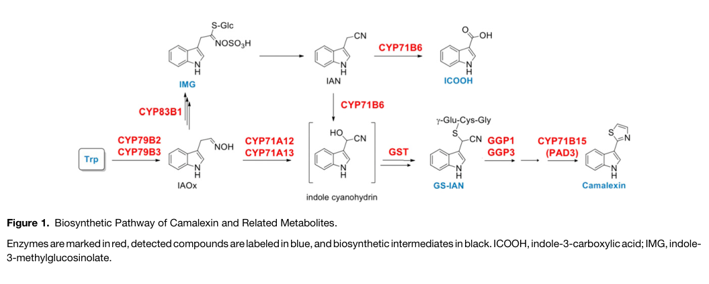

## Question

# Gene Research for Functional Annotation

## ⚠️ CRITICAL: Gene/Protein Identification Context

**BEFORE YOU BEGIN RESEARCH:** You MUST verify you are researching the CORRECT gene/protein. Gene symbols can be ambiguous, especially for less well-characterized genes from non-model organisms.

### Target Gene/Protein Identity (from UniProt):
- **UniProt Accession:** O49342
- **Protein Description:** RecName: Full=Indoleacetaldoxime dehydratase; EC=4.8.1.3 {ECO:0000269|PubMed:17573535}; AltName: Full=Cytochrome P450 71A13;
- **Gene Information:** Name=CYP71A13; OrderedLocusNames=At2g30770; ORFNames=T11J7.16;
- **Organism (full):** Arabidopsis thaliana (Mouse-ear cress).
- **Protein Family:** Belongs to the cytochrome P450 family. .
- **Key Domains:** Cyt_P450. (IPR001128); Cyt_P450_CS. (IPR017972); Cyt_P450_E_grp-I. (IPR002401); Cyt_P450_sf. (IPR036396); p450 (PF00067)

### MANDATORY VERIFICATION STEPS:

1. **Check if the gene symbol "CYP71A13" matches the protein description above**
2. **Verify the organism is correct:** Arabidopsis thaliana (Mouse-ear cress).
3. **Check if protein family/domains align with what you find in literature**
4. **If you find literature for a DIFFERENT gene with the same or similar symbol, STOP**

### If Gene Symbol is Ambiguous or You Cannot Find Relevant Literature:

**DO NOT PROCEED WITH RESEARCH ON A DIFFERENT GENE.** Instead:
- State clearly: "The gene symbol 'CYP71A13' is ambiguous or literature is limited for this specific protein"
- Explain what you found (e.g., "Found extensive literature on a different gene with the same symbol in a different organism")
- Describe the protein based ONLY on the UniProt information provided above
- Suggest that the protein function can be inferred from domain/family information

### Research Target:

Please provide a comprehensive research report on the gene **CYP71A13** (gene ID: CYP71A13, UniProt: O49342) in ARATH.

The research report should be a detailed narrative explaining the function, biological processes, and localization of the gene product. Citations should be given for all claims.

You should prioritize authoritative reviews and primary scientific literature when conducting research. You can supplement
this with annotations you find in gene/protein databases, but these can be outdated or inaccurate.

We are specifically interested in the primary function of the gene - for enzymes, what reaction is catalyzed, and what is the substrate specificity? For transporters, what is the substrate? For structural proteins or adapters, what is the broader structural role? For signaling molecules, what is the role in the pathway.

We are interested in where in or outside the cell the gene product carries out its function.

We are also interested in the signaling or biochemical pathways in which the gene functions. We are less interested in broad pleiotropic effects, except where these elucidate the precise role.

Include evidence where possible. We are interested in both experimental evidence as well as inference from structure, evolution, or bioinformatic analysis. Precise studies should be prioritized over high-throughput, where available.

## Output

Question: You are an expert researcher providing comprehensive, well-cited information.

Provide detailed information focusing on:
1. Key concepts and definitions with current understanding
2. Recent developments and latest research (prioritize 2023-2024 sources)
3. Current applications and real-world implementations
4. Expert opinions and analysis from authoritative sources
5. Relevant statistics and data from recent studies

Format as a comprehensive research report with proper citations. Include URLs and publication dates where available.
Always prioritize recent, authoritative sources and provide specific citations for all major claims.

# Gene Research for Functional Annotation

## ⚠️ CRITICAL: Gene/Protein Identification Context

**BEFORE YOU BEGIN RESEARCH:** You MUST verify you are researching the CORRECT gene/protein. Gene symbols can be ambiguous, especially for less well-characterized genes from non-model organisms.

### Target Gene/Protein Identity (from UniProt):
- **UniProt Accession:** O49342
- **Protein Description:** RecName: Full=Indoleacetaldoxime dehydratase; EC=4.8.1.3 {ECO:0000269|PubMed:17573535}; AltName: Full=Cytochrome P450 71A13;
- **Gene Information:** Name=CYP71A13; OrderedLocusNames=At2g30770; ORFNames=T11J7.16;
- **Organism (full):** Arabidopsis thaliana (Mouse-ear cress).
- **Protein Family:** Belongs to the cytochrome P450 family. .
- **Key Domains:** Cyt_P450. (IPR001128); Cyt_P450_CS. (IPR017972); Cyt_P450_E_grp-I. (IPR002401); Cyt_P450_sf. (IPR036396); p450 (PF00067)

### MANDATORY VERIFICATION STEPS:

1. **Check if the gene symbol "CYP71A13" matches the protein description above**
2. **Verify the organism is correct:** Arabidopsis thaliana (Mouse-ear cress).
3. **Check if protein family/domains align with what you find in literature**
4. **If you find literature for a DIFFERENT gene with the same or similar symbol, STOP**

### If Gene Symbol is Ambiguous or You Cannot Find Relevant Literature:

**DO NOT PROCEED WITH RESEARCH ON A DIFFERENT GENE.** Instead:
- State clearly: "The gene symbol 'CYP71A13' is ambiguous or literature is limited for this specific protein"
- Explain what you found (e.g., "Found extensive literature on a different gene with the same symbol in a different organism")
- Describe the protein based ONLY on the UniProt information provided above
- Suggest that the protein function can be inferred from domain/family information

### Research Target:

Please provide a comprehensive research report on the gene **CYP71A13** (gene ID: CYP71A13, UniProt: O49342) in ARATH.

The research report should be a detailed narrative explaining the function, biological processes, and localization of the gene product. Citations should be given for all claims.

You should prioritize authoritative reviews and primary scientific literature when conducting research. You can supplement
this with annotations you find in gene/protein databases, but these can be outdated or inaccurate.

We are specifically interested in the primary function of the gene - for enzymes, what reaction is catalyzed, and what is the substrate specificity? For transporters, what is the substrate? For structural proteins or adapters, what is the broader structural role? For signaling molecules, what is the role in the pathway.

We are interested in where in or outside the cell the gene product carries out its function.

We are also interested in the signaling or biochemical pathways in which the gene functions. We are less interested in broad pleiotropic effects, except where these elucidate the precise role.

Include evidence where possible. We are interested in both experimental evidence as well as inference from structure, evolution, or bioinformatic analysis. Precise studies should be prioritized over high-throughput, where available.

# CYP71A13 functional annotation: *Arabidopsis thaliana*

## Identity and principal conclusion

**CYP71A13** is the *Arabidopsis thaliana* cytochrome P450 specified in the question as **At2g30770; UniProt O49342**. The literature independently identifies *Arabidopsis* CYP71A13 as a P450 enzyme of **camalexin biosynthesis**, consistent with the supplied P450-family and domain annotations. The retrieved papers did not themselves reproduce the UniProt accession–locus cross-reference; that part of the identification relies on the supplied record. CYP71A13 must not be confused with its close homolog **CYP71A12** or with the downstream enzyme **CYP71B15/PAD3**. (mucha2019theformationof pages 1-2, pastorczyk2020theroleof pages 1-2)

**Primary molecular function:** CYP71A13 uses **indole-3-acetaldoxime (IAOx)** as a substrate and converts it to **indole-3-acetonitrile (IAN)**, a committed intermediate feeding inducible camalexin synthesis. This is the experimentally established reaction underlying its *indoleacetaldoxime dehydratase* annotation (EC 4.8.1.3, as supplied). It also contributes to subsequent activation of IAN toward a reactive intermediate commonly represented as **indole-3-cyanohydrin**. The latter assignment should not be mistaken for evidence that a stable, freely accumulating cyanohydrin has been measured in cells: its formation and transfer are interpreted within a pathway containing transient intermediates. CYP71A13 does **not** catalyze the final conversion to camalexin. (bak2011cytochromesp450 pages 11-12, mucha2019theformationof pages 2-3, mucha2019theformationof pages 1-2, mucha2019theformationof media f4f302ed)

## Reaction, substrate specificity, and pathway

Camalexin is an inducible, sulfur-containing antimicrobial **phytoalexin**: a plant-produced defense metabolite, rather than a signaling receptor or a constitutive structural component. CYP79B2/CYP79B3 first convert tryptophan to IAOx. IAOx is a metabolic branch point: CYP83B1 directs it into indole glucosinolates, whereas induced CYP71A13 and CYP71A12 direct it toward IAN and camalexin-related metabolism. Subsequent activation and glutathione conjugation yield a glutathione–IAN derivative, processed to cysteine–IAN [Cys(IAN)]; **CYP71B15/PAD3** then performs the terminal conversion to camalexin. The pathway and enzyme assignments are also depicted in the original pathway figure. (mucha2019theformationof pages 2-3, mucha2019theformationof pages 1-2, mucha2019theformationof media f4f302ed)

The following summary separates CYP71A13's reaction from reactions performed by neighboring enzymes. (mucha2019theformationof pages 2-3, pastorczyk2020theroleof pages 1-2, mucha2019theformationof media f4f302ed)

| Pathway step | Catalyst | Biochemical product or role | Evidence / important caveat |
|---|---|---|---|
| Tryptophan → indole-3-acetaldoxime (IAOx) | CYP79B2 and CYP79B3 | Generates IAOx, the branch-point precursor for camalexin, indole glucosinolates, indole-carboxylic acids, and other indolics | The CYP79B2/B3 double mutant largely lacks tryptophan-derived defense compounds, supporting their upstream role (mucha2019theformationof pages 2-3, pastorczyk2020theroleof pages 1-2). |
| IAOx → indole-3-acetonitrile (IAN) | **CYP71A13 (O49342)**; CYP71A12 can contribute | CYP71A13’s primary annotated reaction is oxidative dehydration of IAOx to IAN (indoleacetaldoxime dehydratase; EC 4.8.1.3), directing flux toward camalexin | Pathogen infection, UV, and heavy-metal stress induce CYP71A13/CYP71A12. The two proteins are 89% similar and partially redundant, so this step is not exclusively CYP71A13-dependent (mucha2019theformationof pages 2-3, pastorczyk2020theroleof pages 1-2). |
| IAN → activated IAN intermediate, commonly modeled as indole-3-cyanohydrin | Primarily CYP71A13, with CYP71A12 | Oxidative activation creates the proposed cyanohydrin substrate for glutathione conjugation | The cyanohydrin is chemically labile and often treated as a proposed or transient intermediate rather than a freely accumulating metabolite; metabolon-mediated channeling is likely (mucha2019theformationof pages 1-2, mucha2019theformationof media f4f302ed). |
| Alternative induced indolic metabolism | CYP71A12 | Major contributor to pathogen-induced indole-3-carboxylic-acid (ICA) accumulation; can also contribute to camalexin synthesis | CYP71A12 and CYP71A13 are not functionally interchangeable: CYP71A12, but not CYP71A13, is the major enzyme for pathogen-triggered ICA accumulation and also has support for indole-carbonyl-nitrile metabolism (pastorczyk2020theroleof pages 1-2). |
| Indole-3-cyanohydrin + glutathione → GS-IAN | Functionally redundant glutathione transferase activity | Produces glutathione–indole-3-acetonitrile (GS-IAN), capturing the reactive intermediate | Many Arabidopsis GSTs can catalyze product formation. Although GSTU4 physically associates with CYP71A13, knockout/overexpression phenotypes argue that it is **not** an obligatory positive camalexin-pathway enzyme (mucha2019theformationof pages 1-2, mucha2019theformationof pages 7-8). |
| GS-IAN → cysteine–IAN [Cys(IAN)] | γ-Glutamyl peptidase GGP1 plus subsequent glutathione-conjugate processing | Removes glutamate and glycine portions of the glutathione adduct to yield Cys(IAN) | GGP1 physically associates with camalexin-pathway P450s, consistent with recruitment into the ER-associated metabolon, although its soluble localization makes the association dynamic (mucha2019theformationof pages 1-2, mucha2019theformationof pages 7-8). |
| Cys(IAN) → dihydrocamalexic acid/intermediates → camalexin | CYP71B15/PAD3 | Executes the terminal multifunctional conversion to the sulfur-containing phytoalexin camalexin | This terminal activity belongs to **CYP71B15/PAD3, not CYP71A13**; pad3 mutants are camalexin deficient and accumulate Cys(IAN) and downstream precursors (mucha2019theformationof pages 2-3, mucha2019theformationof pages 1-2). |

*Table: Biochemical placement of Arabidopsis CYP71A13 within the ER-associated camalexin pathway, with experimentally important distinctions from CYP71A12 and CYP71B15/PAD3. Caveats identify transient intermediates and prevent overassignment of GSTU4 as essential.*

The specificity claim supported most strongly is **physiological preference for the IAOx/IAN branch feeding camalexin**, not absolute exclusivity for one substrate or pathway. CYP71A12 and CYP71A13 have **89% amino-acid similarity** and occur as tandem genes, and both contribute to camalexin production in challenged plants. Nevertheless, mutant metabolite profiling identifies **CYP71A12, not CYP71A13, as the major contributor to pathogen-induced indole-3-carboxylic-acid accumulation**; evidence also associates CYP71A12 more strongly with indole-carbonyl-nitrile metabolism. Those findings prevent assigning the full CYP71A12 product spectrum to CYP71A13 merely because their sequences are similar. No CYP71A13-specific substrate-affinity constant or comprehensive purified-enzyme substrate panel was established by the evidence reviewed here. (pastorczyk2020theroleof pages 1-2, pastorczyk2020theroleof pages 4-6)

## Biological function and experimental support

CYP71A13 supplies a critical upstream reaction in the production of camalexin during infection and other eliciting stresses. In genetic studies, **cyp71a13** mutants produced greatly reduced camalexin after *Pseudomonas syringae* or *Alternaria brassicicola* challenge and showed increased susceptibility to *A. brassicicola*. Single- and double-mutant analyses also demonstrate partial functional overlap with CYP71A12, rather than an absolute requirement for CYP71A13 under every condition. These are strong *in planta* tests of pathway function, although the magnitude of a disease phenotype depends on pathogen and tissue. (bak2011cytochromesp450 pages 12-13, bottcher2009themultifunctionalenzyme pages 1-2, pastorczyk2020theroleof pages 1-2)

The underlying process is **tryptophan-derived chemical defense**, particularly antifungal defense after pathogen entry. In a study comparing multiple mutants during filamentous-pathogen infection, both CYP71A12 and CYP71A13 contributed to post-invasion resistance, while their contributions to individual indolic metabolites differed. Root and leaf contexts should therefore not be collapsed into a single invariant CYP71A13 phenotype. (pastorczyk2020theroleof pages 1-2)

## Where the enzyme acts

**Subcellular site: endoplasmic reticulum (ER).** Fluorescently tagged CYP71A13 localized to the ER and colocalized with the ER marker **RFP-HDEL** in transiently expressing *Nicotiana benthamiana* leaf cells. CYP71A13 also colocalized there with pathway P450s CYP71B15 and CYP79B2. As a membrane-associated plant P450, its catalytic site is expected to face the cytosolic side of the ER; this orientation follows the established architecture of eukaryotic P450s rather than a CYP71A13-specific topology measurement in the cited experiment. Its biochemical reaction is thus assigned to an **intracellular ER-associated complex**, not the apoplast or an extracellularly secreted enzyme. (mucha2019theformationof pages 1-2, mucha2019theformationof pages 5-5, mucha2019theformationof pages 6-7)

This localization is supported beyond spatial overlap. Co-immunoprecipitation and fluorescence-lifetime FRET experiments detected associations among CYP71A13, CYP71B15, other pathway proteins, and the P450 reductase ATR1. The resulting **metabolon** model proposes that ER-associated enzymes channel reactive intermediates efficiently. Fluorescent native-promoter imaging near fungal infection sites was reported specifically for **CYP71B15/PAD3**, however; it does **not** establish a comparable infection-site distribution for CYP71A13 itself. Camalexin may subsequently be transported into extracellular defense space, but that is distinct from where CYP71A13 catalyzes its reaction. (mucha2019theformationof pages 1-2, mucha2019theformationof pages 5-5, mucha2019theformationof pages 2-3, mucha2019theformationof pages 8-9, zhou2020differentialphosphorylationof pages 1-4)

The enzyme-complex experiments add a useful quantitative result **without implying that it is a kinetic constant for CYP71A13**: coexpressing CYP71A13 with upstream CYP79B2 in yeast lowered **CYP79B2's apparent tryptophan Kₘ** from **17.5 ± 1.9 to 6.9 ± 0.9 mM** and shifted products toward IAN. This supports functional coupling or allosteric effects within the pathway; it does not measure CYP71A13's own Kₘ for IAOx. Although GSTU4 interacts physically with the complex, its knockout increased and its overexpression reduced camalexin in the tested conditions, arguing against labeling GSTU4 an obligatory positive camalexin-synthetic enzyme. (mucha2019theformationof pages 5-6, mucha2019theformationof pages 7-8, mucha2019theformationof pages 8-9)

## Induction, recent findings, and applications

CYP71A13 expression is low without challenge and induced as part of the camalexin program during pathogen infection; UV and silver-nitrate stress also induce the CYP71A12/CYP71A13 branch. In an experimentally supported regulatory route, pathogen-responsive **CPK5/CPK6** phosphorylate **WRKY33** at Thr-229 to increase DNA binding, while **MPK3/MPK6** phosphorylate N-terminal serines to increase transactivation. WRKY33 regulates camalexin-biosynthetic genes including CYP71A13. This is regulation **of the enzyme's expression/pathway**, not evidence that CYP71A13 itself senses pathogens or serves as a kinase. (mucha2019theformationof pages 2-3, zhou2020differentialphosphorylationof pages 1-4)

The available **2024** work principally advances understanding of *how the pathway is deployed*, rather than revising CYP71A13's established catalytic assignment. In one Arabidopsis laboratory priming study, pretreatment with **20 µM rac-GR24** reduced *Botrytis cinerea* lesion area by **26%**—**27.3 ± 2.35 versus 20.1 ± 3.55 mm²**—and increased infection-induced camalexin by **36% at 18 hours** and **44% at 24 hours**. Resistance enhancement was absent in **pad3** and **ein2** mutants. Importantly, this study measured PAD3 expression and camalexin, **not CYP71A13-specific expression or activity**; it therefore supports the practical potential of priming camalexin-dependent defense, not a demonstrated intervention acting specifically through CYP71A13. (fujita2024enhanceddiseaseresistance pages 4-5, fujita2024enhanceddiseaseresistance pages 5-6)

A **2024 biotechnology review** presents immune-regulatory control of camalexin genes, including CYP71A13, as an opportunity for targeted phytoalexin engineering. Presently supported implementations are **research tools**—Arabidopsis knockouts and metabolite assays, fluorescent localization and protein-interaction experiments, heterologous yeast-pathway experiments, and experimental chemical priming. The evidence reviewed here does **not** establish a commercially deployed CYP71A13-engineered crop or a field-validated CYP71A13-specific treatment. (mucha2019theformationof pages 5-5, fujita2024enhanceddiseaseresistance pages 4-5, mucha2019theformationof pages 5-6, hu2024unleashingplantsynthetic pages 3-4)

**Annotation assessment.** The highest-confidence concise annotation is: *ER-associated cytochrome P450 indole-3-acetaldoxime dehydratase that converts IAOx to IAN and contributes to further IAN activation, thereby supplying the induced Arabidopsis camalexin defense pathway.* Its shared chemistry with CYP71A12, the provisional nature of the freely diffusible cyanohydrin intermediate, and the distinction between CYP71A13 and terminal enzyme PAD3 should be retained in any functional annotation. (mucha2019theformationof pages 2-3, mucha2019theformationof pages 1-2, pastorczyk2020theroleof pages 1-2, mucha2019theformationof media f4f302ed)

### Key literature and dates

- **Nafisi and colleagues, June 2007**, *The Plant Cell*, original CYP71A13 reaction study: https://doi.org/10.1105/tpc.107.051383. Its identity and biochemical conclusion are corroborated in the accessible primary and review literature cited above; its full text was not retrievable for this report. (bak2011cytochromesp450 pages 11-12, bottcher2009themultifunctionalenzyme pages 1-2)
- **Mucha and colleagues, 2019**, *The Plant Cell*, ER localization, interactions and metabolon experiments: https://doi.org/10.1105/tpc.19.00403. (mucha2019theformationof pages 1-2, mucha2019theformationof pages 5-5)
- **Pastorczyk and colleagues, 2019 online/2020 volume**, *New Phytologist*, CYP71A12-versus-CYP71A13 genetics: https://doi.org/10.1111/nph.16118. (pastorczyk2020theroleof pages 1-2)
- **Zhou and colleagues, May 2020**, *The Plant Cell*, CPK/MAPK–WRKY33 regulation: https://doi.org/10.1105/tpc.19.00971. (zhou2020differentialphosphorylationof pages 1-4)
- **Fujita and colleagues, published online August 9, 2024**, *Journal of Pesticide Science*, pathway-level immune priming: https://doi.org/10.1584/jpestics.d24-019. (fujita2024enhanceddiseaseresistance pages 1-2, fujita2024enhanceddiseaseresistance pages 5-6)
- **Hu and colleagues, August 2024**, *Current Opinion in Biotechnology*, biotechnology perspective: https://doi.org/10.1016/j.copbio.2024.103148. (hu2024unleashingplantsynthetic pages 3-4)

References

1. (mucha2019theformationof pages 1-2): Stefanie Mucha, Stephanie Heinzlmeir, Verena Kriechbaumer, Benjamin Strickland, Charlotte Kirchhelle, Manisha Choudhary, Natalie Kowalski, Ruth Eichmann, Ralph Hueckelhoven, Erwin Grill, Bernhard Kuster, and Erich Glawischnig. The formation of a camalexin biosynthetic metabolon. Plant Cell, 31:2697-2710, Sep 2019. URL: https://doi.org/10.1105/tpc.19.00403, doi:10.1105/tpc.19.00403. This article has 105 citations and is from a highest quality peer-reviewed journal.

2. (pastorczyk2020theroleof pages 1-2): Marta Pastorczyk, Ayumi Kosaka, Mariola Piślewska‐Bednarek, Gemma López, Henning Frerigmann, Karolina Kułak, Erich Glawischnig, Antonio Molina, Yoshitaka Takano, and Paweł Bednarek. The role of cyp71a12 monooxygenase in pathogen-triggered tryptophan metabolism and arabidopsis immunity. The New phytologist, 225:400-412, Sep 2020. URL: https://doi.org/10.1111/nph.16118, doi:10.1111/nph.16118. This article has 93 citations.

3. (bak2011cytochromesp450 pages 11-12): Søren Bak, Fred Beisson, Gerard Bishop, Björn Hamberger, René Höfer, Suzanne Paquette, and Danièle Werck-Reichhart. Cytochromes p450. The Arabidopsis Book, 2011:e0144, Jan 2011. URL: https://doi.org/10.1199/tab.0144, doi:10.1199/tab.0144. This article has 540 citations and is from a peer-reviewed journal.

4. (mucha2019theformationof pages 2-3): Stefanie Mucha, Stephanie Heinzlmeir, Verena Kriechbaumer, Benjamin Strickland, Charlotte Kirchhelle, Manisha Choudhary, Natalie Kowalski, Ruth Eichmann, Ralph Hueckelhoven, Erwin Grill, Bernhard Kuster, and Erich Glawischnig. The formation of a camalexin biosynthetic metabolon. Plant Cell, 31:2697-2710, Sep 2019. URL: https://doi.org/10.1105/tpc.19.00403, doi:10.1105/tpc.19.00403. This article has 105 citations and is from a highest quality peer-reviewed journal.

5. (mucha2019theformationof media f4f302ed): Stefanie Mucha, Stephanie Heinzlmeir, Verena Kriechbaumer, Benjamin Strickland, Charlotte Kirchhelle, Manisha Choudhary, Natalie Kowalski, Ruth Eichmann, Ralph Hueckelhoven, Erwin Grill, Bernhard Kuster, and Erich Glawischnig. The formation of a camalexin biosynthetic metabolon. Plant Cell, 31:2697-2710, Sep 2019. URL: https://doi.org/10.1105/tpc.19.00403, doi:10.1105/tpc.19.00403. This article has 105 citations and is from a highest quality peer-reviewed journal.

6. (mucha2019theformationof pages 7-8): Stefanie Mucha, Stephanie Heinzlmeir, Verena Kriechbaumer, Benjamin Strickland, Charlotte Kirchhelle, Manisha Choudhary, Natalie Kowalski, Ruth Eichmann, Ralph Hueckelhoven, Erwin Grill, Bernhard Kuster, and Erich Glawischnig. The formation of a camalexin biosynthetic metabolon. Plant Cell, 31:2697-2710, Sep 2019. URL: https://doi.org/10.1105/tpc.19.00403, doi:10.1105/tpc.19.00403. This article has 105 citations and is from a highest quality peer-reviewed journal.

7. (pastorczyk2020theroleof pages 4-6): Marta Pastorczyk, Ayumi Kosaka, Mariola Piślewska‐Bednarek, Gemma López, Henning Frerigmann, Karolina Kułak, Erich Glawischnig, Antonio Molina, Yoshitaka Takano, and Paweł Bednarek. The role of cyp71a12 monooxygenase in pathogen-triggered tryptophan metabolism and arabidopsis immunity. The New phytologist, 225:400-412, Sep 2020. URL: https://doi.org/10.1111/nph.16118, doi:10.1111/nph.16118. This article has 93 citations.

8. (bak2011cytochromesp450 pages 12-13): Søren Bak, Fred Beisson, Gerard Bishop, Björn Hamberger, René Höfer, Suzanne Paquette, and Danièle Werck-Reichhart. Cytochromes p450. The Arabidopsis Book, 2011:e0144, Jan 2011. URL: https://doi.org/10.1199/tab.0144, doi:10.1199/tab.0144. This article has 540 citations and is from a peer-reviewed journal.

9. (bottcher2009themultifunctionalenzyme pages 1-2): C. Böttcher, L. Westphal, Constanze Schmotz, Elke Prade, D. Scheel, and E. Glawischnig. The multifunctional enzyme cyp71b15 (phytoalexin deficient3) converts cysteine-indole-3-acetonitrile to camalexin in the indole-3-acetonitrile metabolic network of arabidopsis thaliana[w][oa]. The Plant Cell Online, 21:1830-1845, Jun 2009. URL: https://doi.org/10.1105/tpc.109.066670, doi:10.1105/tpc.109.066670. This article has 279 citations.

10. (mucha2019theformationof pages 5-5): Stefanie Mucha, Stephanie Heinzlmeir, Verena Kriechbaumer, Benjamin Strickland, Charlotte Kirchhelle, Manisha Choudhary, Natalie Kowalski, Ruth Eichmann, Ralph Hueckelhoven, Erwin Grill, Bernhard Kuster, and Erich Glawischnig. The formation of a camalexin biosynthetic metabolon. Plant Cell, 31:2697-2710, Sep 2019. URL: https://doi.org/10.1105/tpc.19.00403, doi:10.1105/tpc.19.00403. This article has 105 citations and is from a highest quality peer-reviewed journal.

11. (mucha2019theformationof pages 6-7): Stefanie Mucha, Stephanie Heinzlmeir, Verena Kriechbaumer, Benjamin Strickland, Charlotte Kirchhelle, Manisha Choudhary, Natalie Kowalski, Ruth Eichmann, Ralph Hueckelhoven, Erwin Grill, Bernhard Kuster, and Erich Glawischnig. The formation of a camalexin biosynthetic metabolon. Plant Cell, 31:2697-2710, Sep 2019. URL: https://doi.org/10.1105/tpc.19.00403, doi:10.1105/tpc.19.00403. This article has 105 citations and is from a highest quality peer-reviewed journal.

12. (mucha2019theformationof pages 8-9): Stefanie Mucha, Stephanie Heinzlmeir, Verena Kriechbaumer, Benjamin Strickland, Charlotte Kirchhelle, Manisha Choudhary, Natalie Kowalski, Ruth Eichmann, Ralph Hueckelhoven, Erwin Grill, Bernhard Kuster, and Erich Glawischnig. The formation of a camalexin biosynthetic metabolon. Plant Cell, 31:2697-2710, Sep 2019. URL: https://doi.org/10.1105/tpc.19.00403, doi:10.1105/tpc.19.00403. This article has 105 citations and is from a highest quality peer-reviewed journal.

13. (zhou2020differentialphosphorylationof pages 1-4): Jinggeng Zhou, Xiaoyang Wang, Yunxia He, Tian Sang, Pengcheng Wang, Shaojun Dai, Shuqun Zhang, and Xiang-Zong Meng. Differential phosphorylation of the transcription factor wrky33 by the protein kinases cpk5/cpk6 and mpk3/mpk6 cooperatively regulates camalexin biosynthesis in arabidopsis. The Plant Cell, 32:2621-2638, May 2020. URL: https://doi.org/10.1105/tpc.19.00971, doi:10.1105/tpc.19.00971. This article has 262 citations.

14. (mucha2019theformationof pages 5-6): Stefanie Mucha, Stephanie Heinzlmeir, Verena Kriechbaumer, Benjamin Strickland, Charlotte Kirchhelle, Manisha Choudhary, Natalie Kowalski, Ruth Eichmann, Ralph Hueckelhoven, Erwin Grill, Bernhard Kuster, and Erich Glawischnig. The formation of a camalexin biosynthetic metabolon. Plant Cell, 31:2697-2710, Sep 2019. URL: https://doi.org/10.1105/tpc.19.00403, doi:10.1105/tpc.19.00403. This article has 105 citations and is from a highest quality peer-reviewed journal.

15. (fujita2024enhanceddiseaseresistance pages 4-5): Moeka Fujita, Tomoya Tanaka, Miyuki Kusajima, Kengo Inoshima, Futo Narita, Hidemitsu Nakamura, Tadao Asami, Akiko Maruyama-Nakashita, and Hideo Nakashita. Enhanced disease resistance against botrytis cinerea by strigolactone-mediated immune priming in arabidopsis thaliana. Journal of Pesticide Science, 49:186-194, Aug 2024. URL: https://doi.org/10.1584/jpestics.d24-019, doi:10.1584/jpestics.d24-019. This article has 10 citations and is from a peer-reviewed journal.

16. (fujita2024enhanceddiseaseresistance pages 5-6): Moeka Fujita, Tomoya Tanaka, Miyuki Kusajima, Kengo Inoshima, Futo Narita, Hidemitsu Nakamura, Tadao Asami, Akiko Maruyama-Nakashita, and Hideo Nakashita. Enhanced disease resistance against botrytis cinerea by strigolactone-mediated immune priming in arabidopsis thaliana. Journal of Pesticide Science, 49:186-194, Aug 2024. URL: https://doi.org/10.1584/jpestics.d24-019, doi:10.1584/jpestics.d24-019. This article has 10 citations and is from a peer-reviewed journal.

17. (hu2024unleashingplantsynthetic pages 3-4): Rongbin Hu, Xiaoxuan Teng, and Yanran Li. Unleashing plant synthetic capacity: navigating regulatory mechanisms for enhanced bioproduction and secondary metabolite discovery. Aug 2024. URL: https://doi.org/10.1016/j.copbio.2024.103148, doi:10.1016/j.copbio.2024.103148. This article has 10 citations and is from a peer-reviewed journal.

18. (fujita2024enhanceddiseaseresistance pages 1-2): Moeka Fujita, Tomoya Tanaka, Miyuki Kusajima, Kengo Inoshima, Futo Narita, Hidemitsu Nakamura, Tadao Asami, Akiko Maruyama-Nakashita, and Hideo Nakashita. Enhanced disease resistance against botrytis cinerea by strigolactone-mediated immune priming in arabidopsis thaliana. Journal of Pesticide Science, 49:186-194, Aug 2024. URL: https://doi.org/10.1584/jpestics.d24-019, doi:10.1584/jpestics.d24-019. This article has 10 citations and is from a peer-reviewed journal.

## Artifacts

- [Edison artifact artifact-00](CYP71A13-deep-research-falcon_artifacts/artifact-00.md)

## Citations

1. pastorczyk2020theroleof pages 1-2
2. zhou2020differentialphosphorylationof pages 1-4
3. hu2024unleashingplantsynthetic pages 3-4
4. mucha2019theformationof pages 1-2
5. mucha2019theformationof pages 2-3
6. mucha2019theformationof pages 7-8
7. pastorczyk2020theroleof pages 4-6
8. bottcher2009themultifunctionalenzyme pages 1-2
9. mucha2019theformationof pages 5-5
10. mucha2019theformationof pages 6-7
11. mucha2019theformationof pages 8-9
12. mucha2019theformationof pages 5-6
13. fujita2024enhanceddiseaseresistance pages 4-5
14. fujita2024enhanceddiseaseresistance pages 5-6
15. fujita2024enhanceddiseaseresistance pages 1-2
16. Cys(IAN)
17. w
18. oa
19. https://doi.org/10.1105/tpc.107.051383.
20. https://doi.org/10.1105/tpc.19.00403.
21. https://doi.org/10.1111/nph.16118.
22. https://doi.org/10.1105/tpc.19.00971.
23. https://doi.org/10.1584/jpestics.d24-019.
24. https://doi.org/10.1016/j.copbio.2024.103148.
25. https://doi.org/10.1105/tpc.19.00403,
26. https://doi.org/10.1111/nph.16118,
27. https://doi.org/10.1199/tab.0144,
28. https://doi.org/10.1105/tpc.109.066670,
29. https://doi.org/10.1105/tpc.19.00971,
30. https://doi.org/10.1584/jpestics.d24-019,
31. https://doi.org/10.1016/j.copbio.2024.103148,