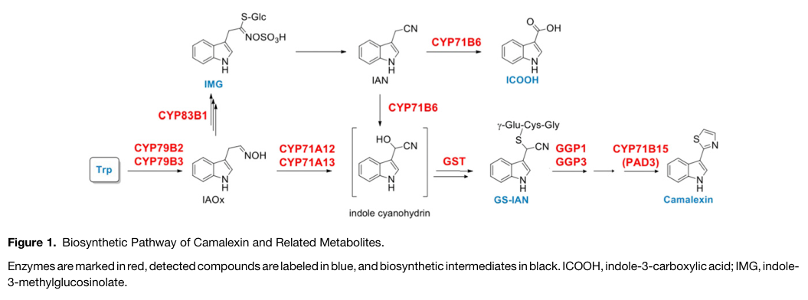

## Question

# Gene Research for Functional Annotation

## ⚠️ CRITICAL: Gene/Protein Identification Context

**BEFORE YOU BEGIN RESEARCH:** You MUST verify you are researching the CORRECT gene/protein. Gene symbols can be ambiguous, especially for less well-characterized genes from non-model organisms.

### Target Gene/Protein Identity (from UniProt):
- **UniProt Accession:** Q9LW27
- **Protein Description:** RecName: Full=Bifunctional dihydrocamalexate synthase/camalexin synthase; EC=1.14.19.52 {ECO:0000269|PubMed:16766671, ECO:0000269|PubMed:19567706}; AltName: Full=Cytochrome P450 71B15; AltName: Full=Dihydrocamalexate:NADP(+) oxidoreductase (decarboxylating); AltName: Full=Protein PHYTOALEXIN DEFICIENT 3;
- **Gene Information:** Name=CYP71B15; Synonyms=PAD3; OrderedLocusNames=At3g26830; ORFNames=MDJ14.15;
- **Organism (full):** Arabidopsis thaliana (Mouse-ear cress).
- **Protein Family:** Belongs to the cytochrome P450 family. .
- **Key Domains:** Cyt_P450. (IPR001128); Cyt_P450_CS. (IPR017972); Cyt_P450_E_grp-I. (IPR002401); Cyt_P450_sf. (IPR036396); Cytochrome_P450_71. (IPR050193)

### MANDATORY VERIFICATION STEPS:

1. **Check if the gene symbol "CYP71B15" matches the protein description above**
2. **Verify the organism is correct:** Arabidopsis thaliana (Mouse-ear cress).
3. **Check if protein family/domains align with what you find in literature**
4. **If you find literature for a DIFFERENT gene with the same or similar symbol, STOP**

### If Gene Symbol is Ambiguous or You Cannot Find Relevant Literature:

**DO NOT PROCEED WITH RESEARCH ON A DIFFERENT GENE.** Instead:
- State clearly: "The gene symbol 'CYP71B15' is ambiguous or literature is limited for this specific protein"
- Explain what you found (e.g., "Found extensive literature on a different gene with the same symbol in a different organism")
- Describe the protein based ONLY on the UniProt information provided above
- Suggest that the protein function can be inferred from domain/family information

### Research Target:

Please provide a comprehensive research report on the gene **CYP71B15** (gene ID: CYP71B15, UniProt: Q9LW27) in ARATH.

The research report should be a detailed narrative explaining the function, biological processes, and localization of the gene product. Citations should be given for all claims.

You should prioritize authoritative reviews and primary scientific literature when conducting research. You can supplement
this with annotations you find in gene/protein databases, but these can be outdated or inaccurate.

We are specifically interested in the primary function of the gene - for enzymes, what reaction is catalyzed, and what is the substrate specificity? For transporters, what is the substrate? For structural proteins or adapters, what is the broader structural role? For signaling molecules, what is the role in the pathway.

We are interested in where in or outside the cell the gene product carries out its function.

We are also interested in the signaling or biochemical pathways in which the gene functions. We are less interested in broad pleiotropic effects, except where these elucidate the precise role.

Include evidence where possible. We are interested in both experimental evidence as well as inference from structure, evolution, or bioinformatic analysis. Precise studies should be prioritized over high-throughput, where available.

## Output

Question: You are an expert researcher providing comprehensive, well-cited information.

Provide detailed information focusing on:
1. Key concepts and definitions with current understanding
2. Recent developments and latest research (prioritize 2023-2024 sources)
3. Current applications and real-world implementations
4. Expert opinions and analysis from authoritative sources
5. Relevant statistics and data from recent studies

Format as a comprehensive research report with proper citations. Include URLs and publication dates where available.
Always prioritize recent, authoritative sources and provide specific citations for all major claims.

# Gene Research for Functional Annotation

## ⚠️ CRITICAL: Gene/Protein Identification Context

**BEFORE YOU BEGIN RESEARCH:** You MUST verify you are researching the CORRECT gene/protein. Gene symbols can be ambiguous, especially for less well-characterized genes from non-model organisms.

### Target Gene/Protein Identity (from UniProt):
- **UniProt Accession:** Q9LW27
- **Protein Description:** RecName: Full=Bifunctional dihydrocamalexate synthase/camalexin synthase; EC=1.14.19.52 {ECO:0000269|PubMed:16766671, ECO:0000269|PubMed:19567706}; AltName: Full=Cytochrome P450 71B15; AltName: Full=Dihydrocamalexate:NADP(+) oxidoreductase (decarboxylating); AltName: Full=Protein PHYTOALEXIN DEFICIENT 3;
- **Gene Information:** Name=CYP71B15; Synonyms=PAD3; OrderedLocusNames=At3g26830; ORFNames=MDJ14.15;
- **Organism (full):** Arabidopsis thaliana (Mouse-ear cress).
- **Protein Family:** Belongs to the cytochrome P450 family. .
- **Key Domains:** Cyt_P450. (IPR001128); Cyt_P450_CS. (IPR017972); Cyt_P450_E_grp-I. (IPR002401); Cyt_P450_sf. (IPR036396); Cytochrome_P450_71. (IPR050193)

### MANDATORY VERIFICATION STEPS:

1. **Check if the gene symbol "CYP71B15" matches the protein description above**
2. **Verify the organism is correct:** Arabidopsis thaliana (Mouse-ear cress).
3. **Check if protein family/domains align with what you find in literature**
4. **If you find literature for a DIFFERENT gene with the same or similar symbol, STOP**

### If Gene Symbol is Ambiguous or You Cannot Find Relevant Literature:

**DO NOT PROCEED WITH RESEARCH ON A DIFFERENT GENE.** Instead:
- State clearly: "The gene symbol 'CYP71B15' is ambiguous or literature is limited for this specific protein"
- Explain what you found (e.g., "Found extensive literature on a different gene with the same symbol in a different organism")
- Describe the protein based ONLY on the UniProt information provided above
- Suggest that the protein function can be inferred from domain/family information

### Research Target:

Please provide a comprehensive research report on the gene **CYP71B15** (gene ID: CYP71B15, UniProt: Q9LW27) in ARATH.

The research report should be a detailed narrative explaining the function, biological processes, and localization of the gene product. Citations should be given for all claims.

You should prioritize authoritative reviews and primary scientific literature when conducting research. You can supplement
this with annotations you find in gene/protein databases, but these can be outdated or inaccurate.

We are specifically interested in the primary function of the gene - for enzymes, what reaction is catalyzed, and what is the substrate specificity? For transporters, what is the substrate? For structural proteins or adapters, what is the broader structural role? For signaling molecules, what is the role in the pathway.

We are interested in where in or outside the cell the gene product carries out its function.

We are also interested in the signaling or biochemical pathways in which the gene functions. We are less interested in broad pleiotropic effects, except where these elucidate the precise role.

Include evidence where possible. We are interested in both experimental evidence as well as inference from structure, evolution, or bioinformatic analysis. Precise studies should be prioritized over high-throughput, where available.

# CYP71B15/PAD3 in *Arabidopsis thaliana*: functional annotation

## Identity and principal function

**Identity verified.** The requested UniProt accession **Q9LW27** corresponds, as specified in the supplied identity record, to *A. thaliana* **CYP71B15**, also called **PAD3** (*PHYTOALEXIN DEFICIENT 3*; locus **At3g26830**). Independent literature identifies Arabidopsis CYP71B15/PAD3 as a cytochrome P450 required for biosynthesis of **camalexin**, an induced antimicrobial indole–sulfur compound. Its CYP71 designation and reported P450-domain annotations are consistent with that experimentally established enzyme class; CYP71A12, CYP71A13 and CYP71A27 are **different genes**, not alternative names for PAD3. The assignment rests on biochemical-pathway literature and the camalexin-deficient phenotype of *pad3/cyp71b15* mutants, rather than domain similarity alone. (frerigmann2015theroleof pages 1-3, mucha2019theformationof pages 1-2, geuflores2011cytosolicγglutamylpeptidases pages 2-4)

The evidence most relevant to functional annotation is summarized below. (mucha2019theformationof pages 2-3, geuflores2011cytosolicγglutamylpeptidases pages 2-4, fujita2024enhanceddiseaseresistance pages 4-5)

| Annotation aspect | Main finding | Evidence and confidence | Key source |
|---|---|---|---|
| Identity and family | Q9LW27 is *Arabidopsis thaliana* CYP71B15/PAD3 (At3g26830), the unique bifunctional CYP71-family cytochrome P450 in terminal camalexin biosynthesis. | **High:** genetic identity, mutant phenotype and pathway assignment; `cyp71b15/pad3` mutants are camalexin deficient and accumulate Cys(IAN), dihydrocamalexic acid and derivatives. | Mucha et al., 2019, [DOI](https://doi.org/10.1105/tpc.19.00403) (mucha2019theformationof pages 1-2) |
| Catalytic function | CYP71B15 catalyzes Cys(IAN) cyclization to dihydrocamalexic acid, followed by oxidative decarboxylation to camalexin: **Cys(IAN) → dihydrocamalexic acid → camalexin**. | **High for pathway assignment; limited for kinetics:** biochemical and genetic literature supports both terminal reactions, but the cited synthesis does not establish purified-PAD3 kinetic constants, complete substrate breadth or reaction stoichiometry. | Geu-Flores et al., 2011, [DOI](https://doi.org/10.1105/tpc.111.083998) (geuflores2011cytosolicγglutamylpeptidases pages 2-4) |
| Localization and organization | A functional native-promoter CYP71B15–GFP fusion localized to the ER—especially in cells adjacent to fungal infection—and physically associated with other camalexin-pathway proteins, including CYP71A12, CYP71A13, CYP79B2, GGP1 and GSTU4. No CYP71B15 homodimer was detected. | **High:** complementation, pathogen imaging, co-immunoprecipitation and FRET-FLIM support ER localization and an inducible biosynthetic metabolon. | Mucha et al., 2019, [DOI](https://doi.org/10.1105/tpc.19.00403) (mucha2019theformationof pages 2-3, mucha2019theformationof pages 5-6, mucha2019theformationof pages 3-4) |
| 2024 disease-priming evidence | With 20 µM rac-GR24 before *Botrytis cinerea* infection, wild-type lesions were **20.1 ± 3.55 versus 27.3 ± 2.35 mm²** (treated versus mock; 26% reduction), whereas `pad3` showed no significant protection (**19.8 ± 1.31 versus 22.2 ± 2.13 mm²**). In treated wild type, infection-induced PAD3 transcript abundance was about **2-fold** higher at 12 h and **1.6-fold** higher at 16 h; camalexin was **36%** and **44%** higher at 18 and 24 h, respectively. | **Moderate-to-high:** replicated genetic, expression and metabolite evidence shows that strigolactone-mediated priming requires PAD3-dependent camalexin production; it does not characterize CYP71B15 enzyme kinetics. | Fujita et al., 2024, [DOI](https://doi.org/10.1584/jpestics.d24-019) (fujita2024enhanceddiseaseresistance pages 4-5, fujita2024enhanceddiseaseresistance pages 5-6) |

*Table: Compact evidence summary for the identity, terminal camalexin reactions, ER-associated metabolon and recent PAD3-dependent disease priming of Arabidopsis CYP71B15/Q9LW27. Confidence wording distinguishes pathway-level evidence from unavailable purified-enzyme kinetic characterization.*

## Reaction, substrates and pathway

**CYP71B15 performs two consecutive terminal reactions:** it cyclizes **Cys(IAN)**—the cysteine conjugate of an activated indole-3-acetonitrile-derived intermediate—to **dihydrocamalexic acid (DHCA)**, then converts DHCA to **camalexin by oxidative decarboxylation**. Thus, its supported physiological substrate sequence is **Cys(IAN) → DHCA → camalexin**; assigning free tryptophan, free indole-3-acetonitrile or glutathione-conjugated IAN as PAD3’s immediate substrate would confuse its reaction with upstream steps. A 2011 *Plant Cell* pathway analysis explicitly attributes the cyclization and oxidative decarboxylation to CYP71B15, citing the original reaction studies. Consistently, *pad3/cyp71b15* plants lack camalexin and accumulate Cys(IAN), DHCA and related precursors. (geuflores2011cytosolicγglutamylpeptidases pages 2-4, mucha2019theformationof pages 1-2)

PAD3 acts within **tryptophan-derived specialized defense metabolism**. CYP79B2/B3 first form indole-3-acetaldoxime; CYP71A12 and especially CYP71A13 route this precursor toward an IAN-derived intermediate. Glutathione conjugation and processing, including γ-glutamyl-peptidase activity, supply Cys(IAN) for PAD3. The aldoxime is also a precursor to indole glucosinolates, so those compounds and camalexin are connected upstream but **PAD3’s assigned catalytic role is terminal camalexin synthesis**, not glucosinolate synthesis. The 2011 study showed that GGP1/GGP3 impairment causes accumulation of the upstream glutathione conjugate GS-IAN and reduces camalexin, independently supporting the order of pathway steps. (mucha2019theformationof pages 2-3, geuflores2011cytosolicγglutamylpeptidases pages 1-2, geuflores2011cytosolicγglutamylpeptidases pages 2-4)

## Site of action and molecular organization

The strongest protein-localization experiment expressed **CYP71B15–GFP from its native promoter in a *pad3* mutant** and selected a fusion that restored camalexin production. Upon fungal challenge, fluorescence appeared mainly in cells adjoining successful infection sites; in challenges with *Botrytis cinerea*, *Alternaria brassicicola* and *Erysiphe cruciferarum*, the fusion localized to the **endoplasmic reticulum (ER)**, including the ER around nuclei. The defensible site-of-action annotation is therefore **ER-associated, induced locally in pathogen-challenged tissue**. A cytosol-facing catalytic site is plausible from general ER-anchored P450 architecture, but orientation of PAD3’s active site was not directly demonstrated by this imaging experiment. The localized fluorescence does not mean that PAD3 itself is secreted or extracellular. The study’s infection-site image provides visual corroboration of this localization. (mucha2019theformationof pages 2-3, mucha2019theformationof pages 1-2, mucha2019theformationof media 5bfbb626)

PAD3 also participates in an **ER-associated camalexin biosynthetic protein assembly**, or metabolon. In infected Arabidopsis, CYP71B15-bait co-immunoprecipitation enriched pathway proteins, notably CYP71A13; reciprocal capture, targeted co-immunoprecipitation and fluorescence-lifetime interaction experiments reinforced associations with CYP71A12 and other pathway components. These experiments support physical organization that could facilitate intermediate transfer, although they do not establish that every detected association is necessary for PAD3 catalysis in vivo. In one proteomics experiment, **71 proteins**, including **22 P450s**, were significantly enriched with the PAD3 bait; those counts describe candidate associations, **not** 71 proven obligatory subunits. (mucha2019theformationof pages 3-4, mucha2019theformationof pages 5-6)

## Biological role, regulation and recent evidence

Camalexin is an induced phytoalexin, and PAD3 supplies its final biosynthetic capacity during pathogen defense. The phenotype is **context-dependent**, not a claim that PAD3 determines resistance to every microbe. For example, PAD3 overexpression increased infection-associated camalexin accumulation and powdery-mildew resistance in an Arabidopsis study, whereas *pad3* mutation removed the enhanced resistance of a camalexin-accumulating *cyp83a1* background. WRKY33 is implicated in regulation of PAD3 expression; by contrast, MYB34/MYB51/MYB122 largely control upstream precursor supply rather than directly activating a PAD3 promoter reporter in the tested assay. (liu2016mutationofthe pages 6-8, frerigmann2015theroleof pages 1-3)

**A 2024 application-oriented result** tested immune priming rather than a new catalytic activity. In Fujita and colleagues’ *B. cinerea* experiment, pretreatment with the strigolactone analogue **rac-GR24** reduced wild-type lesion area from **27.3 ± 2.35 to 20.1 ± 3.55 mm²** (reported **26%** reduction), but produced **no significant protection in *pad3***: **22.2 ± 2.13 versus 19.8 ± 1.31 mm²** for mock and treated plants, respectively. PAD3 expression did not increase detectably before infection; after infection it was about **twofold** higher at 12 hours and **1.6-fold** higher at 16 hours in primed plants, while camalexin was **36%** and **44%** higher at 18 and 24 hours. This is evidence for **PAD3-dependent, infection-triggered priming in the Arabidopsis experimental system**, not field-proven crop protection or a direct effect of rac-GR24 on PAD3 enzyme activity. (fujita2024enhanceddiseaseresistance pages 4-5, fujita2024enhanceddiseaseresistance pages 5-6)

In practical research, *pad3* loss-of-function lines provide a genetic test of camalexin’s contribution to particular plant–pathogen interactions; functional PAD3 fusions permit localization and interaction studies; and altering PAD3 expression is a route to test whether increasing terminal pathway capacity improves resistance under a specified challenge. These uses follow directly from the complementation, metabolon and overexpression experiments, but disease outcomes require pathogen- and setting-specific validation. (mucha2019theformationof pages 2-3, mucha2019theformationof pages 5-6, liu2016mutationofthe pages 6-8, fujita2024enhanceddiseaseresistance pages 5-6)

## Evidence boundaries and key sources

The **reaction assignment is well established at the pathway level**, but the accessible materials here do **not** establish a PAD3-specific kinetic constant, a systematically tested alternative-substrate panel, exact electron-donor stoichiometry or an experimentally demonstrated active-site orientation. The foundational 2006 and 2009 catalytic papers were identifiable through the subsequent literature but their full texts were not available in this retrieval; the precise two-reaction account above is therefore cited to an accessible peer-reviewed paper that explicitly describes and attributes both steps. Recent 2023–2024 work chiefly extends understanding of **when PAD3-dependent camalexin is deployed**; it should not be presented as a revision of PAD3 substrate specificity. (geuflores2011cytosolicγglutamylpeptidases pages 2-4, mucha2019theformationof pages 1-2, fujita2024enhanceddiseaseresistance pages 5-6)

**Selected dated, accessible sources:** Geu-Flores *et al.*, *The Plant Cell* (**June 2011**), [doi:10.1105/tpc.111.083998](https://doi.org/10.1105/tpc.111.083998), pathway chemistry and upstream glutathione-conjugate processing; Mucha *et al.*, *The Plant Cell* (**2019**), [doi:10.1105/tpc.19.00403](https://doi.org/10.1105/tpc.19.00403), complemented PAD3–GFP localization and metabolon experiments; Fujita *et al.*, *Journal of Pesticide Science* (**August 2024**), [doi:10.1584/jpestics.d24-019](https://doi.org/10.1584/jpestics.d24-019), quantified PAD3-dependent immune priming. For the historical reaction assignments cited in the 2011 pathway paper, see Schuhegger *et al.*, *Plant Physiology* (**2006**), [doi:10.1104/pp.106.082024](https://doi.org/10.1104/pp.106.082024). (geuflores2011cytosolicγglutamylpeptidases pages 2-4, mucha2019theformationof pages 2-3, fujita2024enhanceddiseaseresistance pages 4-5)

References

1. (frerigmann2015theroleof pages 1-3): Henning Frerigmann, Erich Glawischnig, and Tamara Gigolashvili. The role of myb34, myb51 and myb122 in the regulation of camalexin biosynthesis in arabidopsis thaliana. Frontiers in Plant Science, Aug 2015. URL: https://doi.org/10.3389/fpls.2015.00654, doi:10.3389/fpls.2015.00654. This article has 80 citations.

2. (mucha2019theformationof pages 1-2): Stefanie Mucha, Stephanie Heinzlmeir, Verena Kriechbaumer, Benjamin Strickland, Charlotte Kirchhelle, Manisha Choudhary, Natalie Kowalski, Ruth Eichmann, Ralph Hueckelhoven, Erwin Grill, Bernhard Kuster, and Erich Glawischnig. The formation of a camalexin biosynthetic metabolon. Plant Cell, 31:2697-2710, Sep 2019. URL: https://doi.org/10.1105/tpc.19.00403, doi:10.1105/tpc.19.00403. This article has 105 citations and is from a highest quality peer-reviewed journal.

3. (geuflores2011cytosolicγglutamylpeptidases pages 2-4): Fernando Geu-Flores, Morten Emil Møldrup, Christoph Böttcher, Carl Erik Olsen, Dierk Scheel, and Barbara Ann Halkier. Cytosolic γ-glutamyl peptidases process glutathione conjugates in the biosynthesis of glucosinolates and camalexin in <i>arabidopsis</i>. Jun 2011. URL: https://doi.org/10.1105/tpc.111.083998, doi:10.1105/tpc.111.083998. This article has 173 citations.

4. (mucha2019theformationof pages 2-3): Stefanie Mucha, Stephanie Heinzlmeir, Verena Kriechbaumer, Benjamin Strickland, Charlotte Kirchhelle, Manisha Choudhary, Natalie Kowalski, Ruth Eichmann, Ralph Hueckelhoven, Erwin Grill, Bernhard Kuster, and Erich Glawischnig. The formation of a camalexin biosynthetic metabolon. Plant Cell, 31:2697-2710, Sep 2019. URL: https://doi.org/10.1105/tpc.19.00403, doi:10.1105/tpc.19.00403. This article has 105 citations and is from a highest quality peer-reviewed journal.

5. (fujita2024enhanceddiseaseresistance pages 4-5): Moeka Fujita, Tomoya Tanaka, Miyuki Kusajima, Kengo Inoshima, Futo Narita, Hidemitsu Nakamura, Tadao Asami, Akiko Maruyama-Nakashita, and Hideo Nakashita. Enhanced disease resistance against botrytis cinerea by strigolactone-mediated immune priming in arabidopsis thaliana. Journal of Pesticide Science, 49:186-194, Aug 2024. URL: https://doi.org/10.1584/jpestics.d24-019, doi:10.1584/jpestics.d24-019. This article has 10 citations and is from a peer-reviewed journal.

6. (mucha2019theformationof pages 5-6): Stefanie Mucha, Stephanie Heinzlmeir, Verena Kriechbaumer, Benjamin Strickland, Charlotte Kirchhelle, Manisha Choudhary, Natalie Kowalski, Ruth Eichmann, Ralph Hueckelhoven, Erwin Grill, Bernhard Kuster, and Erich Glawischnig. The formation of a camalexin biosynthetic metabolon. Plant Cell, 31:2697-2710, Sep 2019. URL: https://doi.org/10.1105/tpc.19.00403, doi:10.1105/tpc.19.00403. This article has 105 citations and is from a highest quality peer-reviewed journal.

7. (mucha2019theformationof pages 3-4): Stefanie Mucha, Stephanie Heinzlmeir, Verena Kriechbaumer, Benjamin Strickland, Charlotte Kirchhelle, Manisha Choudhary, Natalie Kowalski, Ruth Eichmann, Ralph Hueckelhoven, Erwin Grill, Bernhard Kuster, and Erich Glawischnig. The formation of a camalexin biosynthetic metabolon. Plant Cell, 31:2697-2710, Sep 2019. URL: https://doi.org/10.1105/tpc.19.00403, doi:10.1105/tpc.19.00403. This article has 105 citations and is from a highest quality peer-reviewed journal.

8. (fujita2024enhanceddiseaseresistance pages 5-6): Moeka Fujita, Tomoya Tanaka, Miyuki Kusajima, Kengo Inoshima, Futo Narita, Hidemitsu Nakamura, Tadao Asami, Akiko Maruyama-Nakashita, and Hideo Nakashita. Enhanced disease resistance against botrytis cinerea by strigolactone-mediated immune priming in arabidopsis thaliana. Journal of Pesticide Science, 49:186-194, Aug 2024. URL: https://doi.org/10.1584/jpestics.d24-019, doi:10.1584/jpestics.d24-019. This article has 10 citations and is from a peer-reviewed journal.

9. (geuflores2011cytosolicγglutamylpeptidases pages 1-2): Fernando Geu-Flores, Morten Emil Møldrup, Christoph Böttcher, Carl Erik Olsen, Dierk Scheel, and Barbara Ann Halkier. Cytosolic γ-glutamyl peptidases process glutathione conjugates in the biosynthesis of glucosinolates and camalexin in <i>arabidopsis</i>. Jun 2011. URL: https://doi.org/10.1105/tpc.111.083998, doi:10.1105/tpc.111.083998. This article has 173 citations.

10. (mucha2019theformationof media 5bfbb626): Stefanie Mucha, Stephanie Heinzlmeir, Verena Kriechbaumer, Benjamin Strickland, Charlotte Kirchhelle, Manisha Choudhary, Natalie Kowalski, Ruth Eichmann, Ralph Hueckelhoven, Erwin Grill, Bernhard Kuster, and Erich Glawischnig. The formation of a camalexin biosynthetic metabolon. Plant Cell, 31:2697-2710, Sep 2019. URL: https://doi.org/10.1105/tpc.19.00403, doi:10.1105/tpc.19.00403. This article has 105 citations and is from a highest quality peer-reviewed journal.

11. (liu2016mutationofthe pages 6-8): Simu Liu, Lisa M. Bartnikas, Sigrid M. Volko, Frederick M. Ausubel, and Dingzhong Tang. Mutation of the glucosinolate biosynthesis enzyme cytochrome p450 83a1 monooxygenase increases camalexin accumulation and powdery mildew resistance. Frontiers in Plant Science, Mar 2016. URL: https://doi.org/10.3389/fpls.2016.00227, doi:10.3389/fpls.2016.00227. This article has 42 citations.

## Artifacts

- [Edison artifact artifact-00](CYP71B15-deep-research-falcon_artifacts/artifact-00.md)

## Citations

1. mucha2019theformationof pages 1-2
2. frerigmann2015theroleof pages 1-3
3. mucha2019theformationof pages 2-3
4. fujita2024enhanceddiseaseresistance pages 4-5
5. mucha2019theformationof pages 5-6
6. mucha2019theformationof pages 3-4
7. fujita2024enhanceddiseaseresistance pages 5-6
8. liu2016mutationofthe pages 6-8
9. DOI
10. doi:10.1105/tpc.111.083998
11. doi:10.1105/tpc.19.00403
12. doi:10.1584/jpestics.d24-019
13. doi:10.1104/pp.106.082024
14. https://doi.org/10.1105/tpc.19.00403
15. https://doi.org/10.1105/tpc.111.083998
16. https://doi.org/10.1584/jpestics.d24-019
17. https://doi.org/10.1104/pp.106.082024
18. https://doi.org/10.3389/fpls.2015.00654,
19. https://doi.org/10.1105/tpc.19.00403,
20. https://doi.org/10.1105/tpc.111.083998,
21. https://doi.org/10.1584/jpestics.d24-019,
22. https://doi.org/10.3389/fpls.2016.00227,