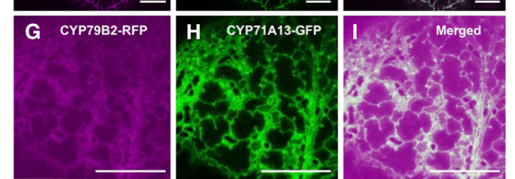

## Question

# Gene Research for Functional Annotation

## ⚠️ CRITICAL: Gene/Protein Identification Context

**BEFORE YOU BEGIN RESEARCH:** You MUST verify you are researching the CORRECT gene/protein. Gene symbols can be ambiguous, especially for less well-characterized genes from non-model organisms.

### Target Gene/Protein Identity (from UniProt):
- **UniProt Accession:** O81346
- **Protein Description:** RecName: Full=Tryptophan N-monooxygenase 1; EC=1.14.14.156 {ECO:0000269|PubMed:10681464}; AltName: Full=Cytochrome P450 79B2; AltName: Full=Tryptophan N-hydroxylase 1;
- **Gene Information:** Name=CYP79B2; OrderedLocusNames=At4g39950; ORFNames=T5J17.120;
- **Organism (full):** Arabidopsis thaliana (Mouse-ear cress).
- **Protein Family:** Belongs to the cytochrome P450 family. .
- **Key Domains:** Cyt_P450. (IPR001128); Cyt_P450_CS. (IPR017972); Cyt_P450_E_grp-I. (IPR002401); Cyt_P450_sf. (IPR036396); p450 (PF00067)

### MANDATORY VERIFICATION STEPS:

1. **Check if the gene symbol "CYP79B2" matches the protein description above**
2. **Verify the organism is correct:** Arabidopsis thaliana (Mouse-ear cress).
3. **Check if protein family/domains align with what you find in literature**
4. **If you find literature for a DIFFERENT gene with the same or similar symbol, STOP**

### If Gene Symbol is Ambiguous or You Cannot Find Relevant Literature:

**DO NOT PROCEED WITH RESEARCH ON A DIFFERENT GENE.** Instead:
- State clearly: "The gene symbol 'CYP79B2' is ambiguous or literature is limited for this specific protein"
- Explain what you found (e.g., "Found extensive literature on a different gene with the same symbol in a different organism")
- Describe the protein based ONLY on the UniProt information provided above
- Suggest that the protein function can be inferred from domain/family information

### Research Target:

Please provide a comprehensive research report on the gene **CYP79B2** (gene ID: CYP79B2, UniProt: O81346) in ARATH.

The research report should be a detailed narrative explaining the function, biological processes, and localization of the gene product. Citations should be given for all claims.

You should prioritize authoritative reviews and primary scientific literature when conducting research. You can supplement
this with annotations you find in gene/protein databases, but these can be outdated or inaccurate.

We are specifically interested in the primary function of the gene - for enzymes, what reaction is catalyzed, and what is the substrate specificity? For transporters, what is the substrate? For structural proteins or adapters, what is the broader structural role? For signaling molecules, what is the role in the pathway.

We are interested in where in or outside the cell the gene product carries out its function.

We are also interested in the signaling or biochemical pathways in which the gene functions. We are less interested in broad pleiotropic effects, except where these elucidate the precise role.

Include evidence where possible. We are interested in both experimental evidence as well as inference from structure, evolution, or bioinformatic analysis. Precise studies should be prioritized over high-throughput, where available.

## Output

Question: You are an expert researcher providing comprehensive, well-cited information.

Provide detailed information focusing on:
1. Key concepts and definitions with current understanding
2. Recent developments and latest research (prioritize 2023-2024 sources)
3. Current applications and real-world implementations
4. Expert opinions and analysis from authoritative sources
5. Relevant statistics and data from recent studies

Format as a comprehensive research report with proper citations. Include URLs and publication dates where available.
Always prioritize recent, authoritative sources and provide specific citations for all major claims.

# Gene Research for Functional Annotation

## ⚠️ CRITICAL: Gene/Protein Identification Context

**BEFORE YOU BEGIN RESEARCH:** You MUST verify you are researching the CORRECT gene/protein. Gene symbols can be ambiguous, especially for less well-characterized genes from non-model organisms.

### Target Gene/Protein Identity (from UniProt):
- **UniProt Accession:** O81346
- **Protein Description:** RecName: Full=Tryptophan N-monooxygenase 1; EC=1.14.14.156 {ECO:0000269|PubMed:10681464}; AltName: Full=Cytochrome P450 79B2; AltName: Full=Tryptophan N-hydroxylase 1;
- **Gene Information:** Name=CYP79B2; OrderedLocusNames=At4g39950; ORFNames=T5J17.120;
- **Organism (full):** Arabidopsis thaliana (Mouse-ear cress).
- **Protein Family:** Belongs to the cytochrome P450 family. .
- **Key Domains:** Cyt_P450. (IPR001128); Cyt_P450_CS. (IPR017972); Cyt_P450_E_grp-I. (IPR002401); Cyt_P450_sf. (IPR036396); p450 (PF00067)

### MANDATORY VERIFICATION STEPS:

1. **Check if the gene symbol "CYP79B2" matches the protein description above**
2. **Verify the organism is correct:** Arabidopsis thaliana (Mouse-ear cress).
3. **Check if protein family/domains align with what you find in literature**
4. **If you find literature for a DIFFERENT gene with the same or similar symbol, STOP**

### If Gene Symbol is Ambiguous or You Cannot Find Relevant Literature:

**DO NOT PROCEED WITH RESEARCH ON A DIFFERENT GENE.** Instead:
- State clearly: "The gene symbol 'CYP79B2' is ambiguous or literature is limited for this specific protein"
- Explain what you found (e.g., "Found extensive literature on a different gene with the same symbol in a different organism")
- Describe the protein based ONLY on the UniProt information provided above
- Suggest that the protein function can be inferred from domain/family information

### Research Target:

Please provide a comprehensive research report on the gene **CYP79B2** (gene ID: CYP79B2, UniProt: O81346) in ARATH.

The research report should be a detailed narrative explaining the function, biological processes, and localization of the gene product. Citations should be given for all claims.

You should prioritize authoritative reviews and primary scientific literature when conducting research. You can supplement
this with annotations you find in gene/protein databases, but these can be outdated or inaccurate.

We are specifically interested in the primary function of the gene - for enzymes, what reaction is catalyzed, and what is the substrate specificity? For transporters, what is the substrate? For structural proteins or adapters, what is the broader structural role? For signaling molecules, what is the role in the pathway.

We are interested in where in or outside the cell the gene product carries out its function.

We are also interested in the signaling or biochemical pathways in which the gene functions. We are less interested in broad pleiotropic effects, except where these elucidate the precise role.

Include evidence where possible. We are interested in both experimental evidence as well as inference from structure, evolution, or bioinformatic analysis. Precise studies should be prioritized over high-throughput, where available.

# CYP79B2 functional annotation: *Arabidopsis thaliana*

## Identity and principal function

**CYP79B2 (At4g39950; UniProt O81346)** is the *Arabidopsis thaliana* CYP79-family cytochrome P450 specified in the question, not its closely related paralog **CYP79B3 (At2g22330)**. The locus assignments are independently listed in a published CYP79-family comparison; primary studies identify the Arabidopsis CYP79B2 protein as a P450 and report approximately 85% amino-acid identity with CYP79B3. Its P450-family assignment agrees with the Cyt_P450 domains in the supplied UniProt record. The accession O81346 is taken from that record rather than independently established by the cited experiments. (mikkelsen2000cytochromep450cyp79b2 pages 3-4, wang2020characterizationofarabidopsis pages 9-10)

**The experimentally established reaction is conversion of L-tryptophan to indole-3-acetaldoxime (IAOx).** CYP79B2 is therefore an *entry-point enzyme* for tryptophan-derived indole metabolism, rather than an enzyme that directly synthesizes a glucosinolate, camalexin, or the auxin indole-3-acetic acid (IAA). Independent recombinant-expression studies identified the product, including by comparison with authentic IAOx and GC–MS. Among the aromatic amino acids tested, recombinant CYP79B2 produced no detectable oxime from phenylalanine or tyrosine. The reaction required an NADPH–cytochrome-P450-reductase electron-transfer system in the reconstituted assays. (hull2000arabidopsiscytochromep450s pages 1-1, mikkelsen2000cytochromep450cyp79b2 pages 3-4, mikkelsen2000cytochromep450cyp79b2 pages 4-5)

Mikkelsen and colleagues reported an apparent tryptophan **Kₘ of 21 µM** and a **Vₘₐₓ of 7.78 nmol h⁻¹ ml⁻¹ culture** for recombinant CYP79B2. The latter is normalized to expression-culture volume, not purified-enzyme mass. A later CYP79 comparison explicitly lists **21 µM** for CYP79B2/At4g39950; this is important because searchable text extracted from the original PDF renders the micro sign incorrectly as “m.” (mikkelsen2000cytochromep450cyp79b2 pages 3-4, wang2020characterizationofarabidopsis pages 9-10)

The following evidence summary separates the direct annotation from downstream and context-dependent effects. (mikkelsen2000cytochromep450cyp79b2 pages 3-4, mucha2019theformationof pages 5-6, lehmann2017arabidopsisnitrilase1 pages 1-2)

| Annotation | Direct evidence | Scope / caveat |
|---|---|---|
| **Identity — high confidence:** *Arabidopsis thaliana* CYP79B2 is **At4g39950**; CYP79B3 is the distinct paralog **At2g22330**. | A CYP79-family comparison assigns CYP79B2 to At4g39950 and CYP79B3 to At2g22330; the proteins share 85% amino-acid identity but are separate gene products. (mikkelsen2000cytochromep450cyp79b2 pages 3-4, wang2020characterizationofarabidopsis pages 9-10) | UniProt **O81346** maps to the requested CYP79B2 protein. Double-mutant results cannot resolve the individual contributions of CYP79B2 and CYP79B3. |
| **Primary catalytic function — high confidence:** CYP79B2 converts **L-tryptophan to indole-3-acetaldoxime (IAOx)** as a membrane-associated, NADPH–P450-reductase-dependent monooxygenase. | Recombinant CYP79B2 produced GC–MS-verified IAOx but no detectable oximes from phenylalanine or tyrosine. The apparent **Kₘ is 21 µM** and Vₘₐₓ is 7.78 nmol h⁻¹ ml⁻¹ culture; activity required added NADPH–cytochrome-P450 reductase. (mikkelsen2000cytochromep450cyp79b2 pages 3-4, mikkelsen2000cytochromep450cyp79b2 pages 4-5, wang2020characterizationofarabidopsis pages 9-10) | Vₘₐₓ is normalized to culture volume rather than purified-enzyme mass. The later CYP79-family table verifies the 21-µM unit; some text extractions incorrectly render it as mM. |
| **Pathway branch point — high confidence:** IAOx supplies indole-glucosinolate and induced camalexin or other indole-defense metabolism; its contribution to auxin is conditional. | CYP83B1 N-hydroxylates IAOx to a reactive intermediate that forms thiol adducts en route to indole glucosinolates. CYP71A12/A13 channel IAOx-derived flux toward camalexin metabolism and associate with CYP79B2 in an ER-associated complex. TAA1/TAR–YUCCA is the predominant general IAA pathway; *cyp79b2 cyp79b3* has near-wild-type IAA under standard conditions but modestly reduced IAA at 26°C, and it suppresses the IAOx-dependent high-auxin *rooty* phenotype. (mucha2019theformationof pages 5-6, casanovasaez2021auxinmetabolismin pages 4-5, lehmann2017arabidopsisnitrilase1 pages 1-2, brumos2020structure–functionanalysisof pages 1-4, bak2001cyp83b1acytochrome pages 2-3) | CYP79B2 directly makes **IAOx**, not glucosinolates, camalexin or IAA. The enzymes completing IAOx-to-IAA conversion remain incompletely resolved; CYP79B2 is not the principal general IAA-biosynthetic enzyme. |
| **Subcellular site — moderate-to-high confidence:** CYP79B2 is an **ER-associated membrane P450**, with its catalytic domain expected on the cytosolic face. | In *Nicotiana benthamiana*, CYP79B2–RFP displayed an ER-like reticulate pattern and colocalized with ER-localized CYP71A13–GFP in Figure 6G–I. Microscopy, FRET-FLIM and microsomal interaction data support an ER-surface camalexin metabolon. (mucha2019theformationof pages 5-6, mucha2019theformationof pages 5-5, mucha2019theformationof media af821672, mucha2019theformationof pages 6-7) | Evidence uses transient heterologous expression, and CYP79B2 fluorescence was weak. The early chloroplast assignment was sequence-based prediction only. CYP79B2 does **not** reside within ER bodies; that localization applies to downstream myrosinases such as PYK10/BGLU21. |
| **Current physiological evidence — moderate confidence:** CYP79B2/B3-dependent tryptophan metabolism supports root-microbiome homeostasis and pathogen resistance. | In 2024, *cyp79b2 cyp79b3* altered rhizoplane or endosphere communities and root-exudate effects, while most tested fungal endophytes severely restricted mutant growth. Separately, *cyp79b2 cyp79b3* fully abolished *mkp1-1* enhanced resistance to *Plectosphaerella cucumerina* and compromised resistance to *Pseudomonas syringae*. (basak2024erbodyresidentmyrosinases pages 1-2, berlanga2024mitogenactivatedproteinkinase pages 1-2) | These double-mutant, pathway-level phenotypes may reflect loss of several IAOx-derived metabolites rather than CYP79B2 alone or one specific product. They establish biological relevance but do not change the primary catalytic annotation. |

*Table: Five-row evidence synthesis for Arabidopsis CYP79B2 (At4g39950), covering identity, catalytic function, pathway placement, localization and recent physiological findings. Caveats distinguish direct CYP79B2 activity from downstream pathways and ER-body biology.*

## Biological pathways and strength of evidence

**Indole glucosinolates: strong physiological evidence.** IAOx enters the indole-glucosinolate branch through **CYP83B1**, a *different* P450 that converts IAOx into a reactive intermediate capable of forming thiol adducts on the route to glucosinolates. CYP79B2 overexpression in Arabidopsis increased the indole glucosinolates **glucobrassicin approximately fivefold** and **4-methoxyglucobrassicin approximately twofold**, without a comparable increase in non-indole glucosinolates. These biochemical and transgenic results directly support CYP79B2’s role in supplying this branch; they do not assign CYP83B1’s reaction to CYP79B2. (mikkelsen2000cytochromep450cyp79b2 pages 5-6, bak2001cyp83b1acytochrome pages 2-3, bak2001cyp83b1acytochrome pages 1-2)

**Camalexin and other induced indole defenses: upstream precursor supply.** CYP71A12/CYP71A13-associated metabolism draws on IAOx-derived intermediates for pathogen-induced camalexin biosynthesis. An experimental study found CYP79B2 in the camalexin-enzyme interaction network: fluorescence-proximity measurements supported association with downstream P450s, and coexpression with CYP71A13 in yeast microsomes increased apparent tryptophan affinity and shifted products toward indole-3-acetonitrile. The authors interpreted CYP79B2 as a relatively *loosely associated* branch-point component, not an enzyme dedicated exclusively to camalexin. A 2023 review also places its IAOx product upstream of the distinct 4-hydroxyindole-3-carbonyl-nitrile defense branch; CYP79B2 itself is not assigned those downstream reactions. (mucha2019theformationof pages 5-6, mucha2019theformationof pages 3-4, boter2023cyanogenesisaplant pages 4-6, mucha2019theformationof pages 1-2)

**Auxin: a conditional contribution, not the main general route.** IAOx can contribute to IAA-associated metabolism, particularly when flux through competing glucosinolate steps is disrupted or under certain environmental conditions. For example, blocking CYP79B2/CYP79B3-dependent precursor production suppresses the high-auxin phenotype of the glucosinolate-pathway *rooty* mutant. Conversely, a study of *cyp79b2 cyp79b3* found approximately wild-type IAA under standard growth conditions but a modest reduction in free IAA at **26 °C**. Authoritative auxin-metabolism synthesis identifies **TAA1/TAR → indole-3-pyruvic acid → YUCCA → IAA** as the major broadly conserved route. The exact enzymes and quantitative flux completing the IAOx-to-IAA route in ordinary plants remain incompletely resolved. Thus, annotating CYP79B2 simply as an “auxin-synthesis enzyme” would obscure its more securely established IAOx-producing, defense-metabolism role. (casanovasaez2021auxinmetabolismin pages 4-5, lehmann2017arabidopsisnitrilase1 pages 1-2, brumos2020structure–functionanalysisof pages 1-4, casanovasaez2021auxinmetabolismin pages 2-4)

## Where and when it functions

**Subcellular location: predominantly supported as an ER-associated membrane P450.** In a 2019 microscopy experiment, transiently expressed **CYP79B2–RFP** showed an endoplasmic-reticulum-associated signal and colocalized with ER-localized **CYP71A13–GFP**; microsomal interaction studies support an ER-surface camalexin-enzyme complex. CYP79B2 fluorescence was comparatively weak, and this experiment used heterologous *Nicotiana benthamiana* leaves, so it should not be described as definitive native-tissue membrane-topology measurement. An early proposal of chloroplast targeting was based on **sequence prediction**, not direct localization. The catalytic domain facing the cytosol is consistent with the ER-P450/metabolon model but was not separately established for CYP79B2 by a topology assay in these studies. Importantly, the **ER bodies** studied in roots contain downstream glucosinolate-hydrolyzing myrosinases such as PYK10; their residence there does **not** place CYP79B2 inside ER bodies. (hull2000arabidopsiscytochromep450s pages 1-3, mucha2019theformationof pages 9-10, mucha2019theformationof pages 5-5, mucha2019theformationof media af821672, basak2024erbodyresidentmyrosinases pages 1-2, mucha2019theformationof pages 6-7)

**Tissue expression and regulation.** The original Arabidopsis study detected CYP79B2 transcripts in roots, leaves, stems, and flowers, with root levels approximately **fourfold** those in rosette leaves. Rosette-leaf transcript abundance approximately **doubled two hours after wounding**; methyl jasmonate also induced CYP79-associated indole-glucosinolate responses. Promoter-reporter activity occurred prominently in young roots and cotyledons and around wounded tissue. These observations identify sites and stimuli for CYP79B2-dependent metabolism, but promoter or transcript measurements are not themselves measurements of protein location or reaction flux. (mikkelsen2000cytochromep450cyp79b2 pages 4-5, mikkelsen2000cytochromep450cyp79b2 pages 5-6, mikkelsen2003modulationofcyp79 pages 1-2)

## Recent research and applications

Recent experiments reinforce the *pathway’s* ecological importance rather than changing CYP79B2’s catalytic annotation. In **2024**, Basak and colleagues found altered root-associated microbial communities and exudate-associated community responses in *cyp79b2 cyp79b3* plants; most tested fungal endophytes strongly restricted double-mutant growth. A **2021** microbiota-reconstitution study likewise found fungal overgrowth in this mutant and reported that fungal load explained **more than 40%** of between-genotype variation in microbiota-associated growth differences across the tested genotypes. These studies implicate tryptophan-derived specialized metabolites in maintaining root–microbe balance, but double-mutant results cannot identify CYP79B2’s contribution separately from CYP79B3 or attribute the effect to one downstream compound. (basak2024erbodyresidentmyrosinases pages 1-2, wolinska2021tryptophanmetabolismand pages 1-2)

Also in **2024**, combining *cyp79b2 cyp79b3* with *mkp1-1* **abolished** the mutant’s enhanced resistance to *Plectosphaerella cucumerina* and compromised its resistance to *Pseudomonas syringae*. This is genetic evidence that the CYP79B2/B3-dependent metabolic branch matters in those immune contexts, not evidence that CYP79B2 directly transduces MKP1 signals. Earlier pathogen-mutant comparisons separated an **early** protective role for indole-glucosinolate breakdown products from a **later** camalexin contribution. Experimentally, CYP79B2 overexpression has also been used to raise Arabidopsis indole-glucosinolate content; these are research and metabolic-engineering demonstrations, not evidence of a deployed CYP79B2-specific agricultural product. (schlaeppi2010diseaseresistanceof pages 1-2, mikkelsen2000cytochromep450cyp79b2 pages 5-6, berlanga2024mitogenactivatedproteinkinase pages 1-2)

**Annotation conclusion.** Assign **CYP79B2/O81346** the high-confidence molecular function *L-tryptophan-to-indole-3-acetaldoxime cytochrome P450 monooxygenase*, with an ER-associated membrane location supported by imaging and enzyme-complex data. Annotate indole-glucosinolate and inducible indole-defense precursor supply as strongly supported biological processes; qualify IAA production as context dependent. Keep CYP79B3 redundancy, inferred membrane topology, and unresolved downstream auxin chemistry explicit. (mikkelsen2000cytochromep450cyp79b2 pages 3-4, mucha2019theformationof pages 5-5, casanovasaez2021auxinmetabolismin pages 4-5, wang2020characterizationofarabidopsis pages 9-10)

### Principal sources and publication dates

- Hull AK *et al.* **February 2000**, *PNAS*, CYP79B2/B3 biochemical identification: https://doi.org/10.1073/pnas.040569997. (hull2000arabidopsiscytochromep450s pages 1-1)
- Mikkelsen MD *et al.* **October 2000**; online **August 2000**, *Journal of Biological Chemistry*, CYP79B2 catalysis, expression and glucosinolates: https://doi.org/10.1074/jbc.M001667200. (mikkelsen2000cytochromep450cyp79b2 pages 1-2, mikkelsen2000cytochromep450cyp79b2 pages 5-6)
- Bak S *et al.* **January 2001**, *The Plant Cell*, downstream CYP83B1 reaction: https://doi.org/10.1105/tpc.13.1.101. (bak2001cyp83b1acytochrome pages 2-3)
- Mucha S *et al.* **September 2019**, *The Plant Cell*, enzyme complex and CYP79B2 localization, including **Figure 6G–I**: https://doi.org/10.1105/tpc.19.00403. (mucha2019theformationof pages 5-6, mucha2019theformationof media af821672)
- Casanova-Sáez R *et al.* **2021**, *Cold Spring Harbor Perspectives in Biology*, authoritative auxin-pathway review: https://doi.org/10.1101/cshperspect.a039867. (casanovasaez2021auxinmetabolismin pages 4-5, casanovasaez2021auxinmetabolismin pages 2-4)
- Basak AK *et al.* **2024 volume** (*accepted September 2023*), *New Phytologist*, root microbiota: https://doi.org/10.1111/nph.19289. (basak2024erbodyresidentmyrosinases pages 1-2)
- Berlanga DJ *et al.* **21 March 2024**, *Frontiers in Plant Science*, immunity epistasis: https://doi.org/10.3389/fpls.2024.1374194. (berlanga2024mitogenactivatedproteinkinase pages 1-2)

References

1. (mikkelsen2000cytochromep450cyp79b2 pages 3-4): Michael Dalgaard Mikkelsen, Carsten Hørslev Hansen, Ute Wittstock, and Barbara Ann Halkier. Cytochrome p450 cyp79b2 from arabidopsis catalyzes the conversion of tryptophan to indole-3-acetaldoxime, a precursor of indole glucosinolates and indole-3-acetic acid*. The Journal of Biological Chemistry, 275:33712-33717, Oct 2000. URL: https://doi.org/10.1074/jbc.m001667200, doi:10.1074/jbc.m001667200. This article has 601 citations.

2. (wang2020characterizationofarabidopsis pages 9-10): Cuiwei Wang, Mads Møller Dissing, Niels Agerbirk, Christoph Crocoll, and Barbara Ann Halkier. Characterization of arabidopsis cyp79c1 and cyp79c2 by glucosinolate pathway engineering in nicotiana benthamiana shows substrate specificity toward a range of aliphatic and aromatic amino acids. Frontiers in Plant Science, Feb 2020. URL: https://doi.org/10.3389/fpls.2020.00057, doi:10.3389/fpls.2020.00057. This article has 47 citations.

3. (hull2000arabidopsiscytochromep450s pages 1-1): Anna K. Hull, Rekha Vij, and John L. Celenza. Arabidopsis cytochrome p450s that catalyze the first step of tryptophan-dependent indole-3-acetic acid biosynthesis. Proceedings of the National Academy of Sciences of the United States of America, 97 5:2379-84, Feb 2000. URL: https://doi.org/10.1073/pnas.040569997, doi:10.1073/pnas.040569997. This article has 631 citations and is from a highest quality peer-reviewed journal.

4. (mikkelsen2000cytochromep450cyp79b2 pages 4-5): Michael Dalgaard Mikkelsen, Carsten Hørslev Hansen, Ute Wittstock, and Barbara Ann Halkier. Cytochrome p450 cyp79b2 from arabidopsis catalyzes the conversion of tryptophan to indole-3-acetaldoxime, a precursor of indole glucosinolates and indole-3-acetic acid*. The Journal of Biological Chemistry, 275:33712-33717, Oct 2000. URL: https://doi.org/10.1074/jbc.m001667200, doi:10.1074/jbc.m001667200. This article has 601 citations.

5. (mucha2019theformationof pages 5-6): Stefanie Mucha, Stephanie Heinzlmeir, Verena Kriechbaumer, Benjamin Strickland, Charlotte Kirchhelle, Manisha Choudhary, Natalie Kowalski, Ruth Eichmann, Ralph Hueckelhoven, Erwin Grill, Bernhard Kuster, and Erich Glawischnig. The formation of a camalexin biosynthetic metabolon. Plant Cell, 31:2697-2710, Sep 2019. URL: https://doi.org/10.1105/tpc.19.00403, doi:10.1105/tpc.19.00403. This article has 105 citations and is from a highest quality peer-reviewed journal.

6. (lehmann2017arabidopsisnitrilase1 pages 1-2): Thomas Lehmann, Tim Janowitz, Beatriz Sánchez-Parra, Marta-Marina Pérez Alonso, Inga Trompetter, Markus Piotrowski, and Stephan Pollmann. Arabidopsis nitrilase 1 contributes to the regulation of root growth and development through modulation of auxin biosynthesis in seedlings. Frontiers in Plant Science, Jan 2017. URL: https://doi.org/10.3389/fpls.2017.00036, doi:10.3389/fpls.2017.00036. This article has 115 citations.

7. (casanovasaez2021auxinmetabolismin pages 4-5): Rubén Casanova-Sáez, Eduardo Mateo-Bonmatí, and Karin Ljung. Auxin metabolism in plants. Cold Spring Harbor perspectives in biology, 13:a039867, Jan 2021. URL: https://doi.org/10.1101/cshperspect.a039867, doi:10.1101/cshperspect.a039867. This article has 361 citations and is from a peer-reviewed journal.

8. (brumos2020structure–functionanalysisof pages 1-4): Javier Brumos, Benjamin G. Bobay, Cierra A. Clark, Jose M. Alonso, and Anna N. Stepanova. Structure–function analysis of interallelic complementation in <i>rooty</i> transheterozygotes. Plant Physiology, 183(3):1110-1125, Apr 2020. URL: https://doi.org/10.1104/pp.20.00310, doi:10.1104/pp.20.00310. This article has 7 citations and is from a highest quality peer-reviewed journal.

9. (bak2001cyp83b1acytochrome pages 2-3): Soren Bak, Frans E. Tax, Kenneth A. Feldmann, David W. Galbraith, and Rene Feyereisen. Cyp83b1, a cytochrome p450 at the metabolic branch point in auxin and indole glucosinolate biosynthesis in arabidopsis. Plant Cell, 13:101-111, Jan 2001. URL: https://doi.org/10.1105/tpc.13.1.101, doi:10.1105/tpc.13.1.101. This article has 537 citations and is from a highest quality peer-reviewed journal.

10. (mucha2019theformationof pages 5-5): Stefanie Mucha, Stephanie Heinzlmeir, Verena Kriechbaumer, Benjamin Strickland, Charlotte Kirchhelle, Manisha Choudhary, Natalie Kowalski, Ruth Eichmann, Ralph Hueckelhoven, Erwin Grill, Bernhard Kuster, and Erich Glawischnig. The formation of a camalexin biosynthetic metabolon. Plant Cell, 31:2697-2710, Sep 2019. URL: https://doi.org/10.1105/tpc.19.00403, doi:10.1105/tpc.19.00403. This article has 105 citations and is from a highest quality peer-reviewed journal.

11. (mucha2019theformationof media af821672): Stefanie Mucha, Stephanie Heinzlmeir, Verena Kriechbaumer, Benjamin Strickland, Charlotte Kirchhelle, Manisha Choudhary, Natalie Kowalski, Ruth Eichmann, Ralph Hueckelhoven, Erwin Grill, Bernhard Kuster, and Erich Glawischnig. The formation of a camalexin biosynthetic metabolon. Plant Cell, 31:2697-2710, Sep 2019. URL: https://doi.org/10.1105/tpc.19.00403, doi:10.1105/tpc.19.00403. This article has 105 citations and is from a highest quality peer-reviewed journal.

12. (mucha2019theformationof pages 6-7): Stefanie Mucha, Stephanie Heinzlmeir, Verena Kriechbaumer, Benjamin Strickland, Charlotte Kirchhelle, Manisha Choudhary, Natalie Kowalski, Ruth Eichmann, Ralph Hueckelhoven, Erwin Grill, Bernhard Kuster, and Erich Glawischnig. The formation of a camalexin biosynthetic metabolon. Plant Cell, 31:2697-2710, Sep 2019. URL: https://doi.org/10.1105/tpc.19.00403, doi:10.1105/tpc.19.00403. This article has 105 citations and is from a highest quality peer-reviewed journal.

13. (basak2024erbodyresidentmyrosinases pages 1-2): Arpan Kumar Basak, Anna Piasecka, Jana Hucklenbroich, Gözde Merve Türksoy, Rui Guan, Pengfan Zhang, Felix Getzke, Ruben Garrido‐Oter, Stephane Hacquard, Kazimierz Strzałka, Paweł Bednarek, Kenji Yamada, and Ryohei Thomas Nakano. Er body-resident myrosinases and tryptophan specialized metabolism modulate root microbiota assembly. The New phytologist, 241:329-342, Sep 2024. URL: https://doi.org/10.1111/nph.19289, doi:10.1111/nph.19289. This article has 28 citations.

14. (berlanga2024mitogenactivatedproteinkinase pages 1-2): Diego José Berlanga, Antonio Molina, and Miguel Ángel Torres. Mitogen-activated protein kinase phosphatase 1 controls broad spectrum disease resistance in arabidopsis thaliana through diverse mechanisms of immune activation. Frontiers in Plant Science, Mar 2024. URL: https://doi.org/10.3389/fpls.2024.1374194, doi:10.3389/fpls.2024.1374194. This article has 5 citations.

15. (mikkelsen2000cytochromep450cyp79b2 pages 5-6): Michael Dalgaard Mikkelsen, Carsten Hørslev Hansen, Ute Wittstock, and Barbara Ann Halkier. Cytochrome p450 cyp79b2 from arabidopsis catalyzes the conversion of tryptophan to indole-3-acetaldoxime, a precursor of indole glucosinolates and indole-3-acetic acid*. The Journal of Biological Chemistry, 275:33712-33717, Oct 2000. URL: https://doi.org/10.1074/jbc.m001667200, doi:10.1074/jbc.m001667200. This article has 601 citations.

16. (bak2001cyp83b1acytochrome pages 1-2): Soren Bak, Frans E. Tax, Kenneth A. Feldmann, David W. Galbraith, and Rene Feyereisen. Cyp83b1, a cytochrome p450 at the metabolic branch point in auxin and indole glucosinolate biosynthesis in arabidopsis. Plant Cell, 13:101-111, Jan 2001. URL: https://doi.org/10.1105/tpc.13.1.101, doi:10.1105/tpc.13.1.101. This article has 537 citations and is from a highest quality peer-reviewed journal.

17. (mucha2019theformationof pages 3-4): Stefanie Mucha, Stephanie Heinzlmeir, Verena Kriechbaumer, Benjamin Strickland, Charlotte Kirchhelle, Manisha Choudhary, Natalie Kowalski, Ruth Eichmann, Ralph Hueckelhoven, Erwin Grill, Bernhard Kuster, and Erich Glawischnig. The formation of a camalexin biosynthetic metabolon. Plant Cell, 31:2697-2710, Sep 2019. URL: https://doi.org/10.1105/tpc.19.00403, doi:10.1105/tpc.19.00403. This article has 105 citations and is from a highest quality peer-reviewed journal.

18. (boter2023cyanogenesisaplant pages 4-6): Marta Boter and Isabel Diaz. Cyanogenesis, a plant defence strategy against herbivores. International Journal of Molecular Sciences, 24:6982, Apr 2023. URL: https://doi.org/10.3390/ijms24086982, doi:10.3390/ijms24086982. This article has 41 citations.

19. (mucha2019theformationof pages 1-2): Stefanie Mucha, Stephanie Heinzlmeir, Verena Kriechbaumer, Benjamin Strickland, Charlotte Kirchhelle, Manisha Choudhary, Natalie Kowalski, Ruth Eichmann, Ralph Hueckelhoven, Erwin Grill, Bernhard Kuster, and Erich Glawischnig. The formation of a camalexin biosynthetic metabolon. Plant Cell, 31:2697-2710, Sep 2019. URL: https://doi.org/10.1105/tpc.19.00403, doi:10.1105/tpc.19.00403. This article has 105 citations and is from a highest quality peer-reviewed journal.

20. (casanovasaez2021auxinmetabolismin pages 2-4): Rubén Casanova-Sáez, Eduardo Mateo-Bonmatí, and Karin Ljung. Auxin metabolism in plants. Cold Spring Harbor perspectives in biology, 13:a039867, Jan 2021. URL: https://doi.org/10.1101/cshperspect.a039867, doi:10.1101/cshperspect.a039867. This article has 361 citations and is from a peer-reviewed journal.

21. (hull2000arabidopsiscytochromep450s pages 1-3): Anna K. Hull, Rekha Vij, and John L. Celenza. Arabidopsis cytochrome p450s that catalyze the first step of tryptophan-dependent indole-3-acetic acid biosynthesis. Proceedings of the National Academy of Sciences of the United States of America, 97 5:2379-84, Feb 2000. URL: https://doi.org/10.1073/pnas.040569997, doi:10.1073/pnas.040569997. This article has 631 citations and is from a highest quality peer-reviewed journal.

22. (mucha2019theformationof pages 9-10): Stefanie Mucha, Stephanie Heinzlmeir, Verena Kriechbaumer, Benjamin Strickland, Charlotte Kirchhelle, Manisha Choudhary, Natalie Kowalski, Ruth Eichmann, Ralph Hueckelhoven, Erwin Grill, Bernhard Kuster, and Erich Glawischnig. The formation of a camalexin biosynthetic metabolon. Plant Cell, 31:2697-2710, Sep 2019. URL: https://doi.org/10.1105/tpc.19.00403, doi:10.1105/tpc.19.00403. This article has 105 citations and is from a highest quality peer-reviewed journal.

23. (mikkelsen2003modulationofcyp79 pages 1-2): Michael Dalgaard Mikkelsen, Bent Larsen Petersen, Erich Glawischnig, Anders Bøgh Jensen, Erik Andreasson, and Barbara Ann Halkier. Modulation of cyp79 genes and glucosinolate profiles in arabidopsis by defense signaling pathways1. Plant Physiology, 131:298-308, Jan 2003. URL: https://doi.org/10.1104/pp.011015, doi:10.1104/pp.011015. This article has 450 citations and is from a highest quality peer-reviewed journal.

24. (wolinska2021tryptophanmetabolismand pages 1-2): Katarzyna W. Wolinska, Nathan Vannier, Thorsten Thiergart, Brigitte Pickel, Sjoerd Gremmen, Anna Piasecka, Mariola Piślewska-Bednarek, Ryohei Thomas Nakano, Youssef Belkhadir, Paweł Bednarek, and Stéphane Hacquard. Tryptophan metabolism and bacterial commensals prevent fungal dysbiosis in arabidopsis roots. Proceedings of the National Academy of Sciences of the United States of America, Dec 2021. URL: https://doi.org/10.1073/pnas.2111521118, doi:10.1073/pnas.2111521118. This article has 110 citations and is from a highest quality peer-reviewed journal.

25. (schlaeppi2010diseaseresistanceof pages 1-2): Klaus Schlaeppi, Eliane Abou-Mansour, Antony Buchala, and Felix Mauch. Disease resistance of arabidopsis to phytophthora brassicae is established by the sequential action of indole glucosinolates and camalexin. The Plant journal : for cell and molecular biology, 62 5:840-51, Mar 2010. URL: https://doi.org/10.1111/j.1365-313x.2010.04197.x, doi:10.1111/j.1365-313x.2010.04197.x. This article has 240 citations.

26. (mikkelsen2000cytochromep450cyp79b2 pages 1-2): Michael Dalgaard Mikkelsen, Carsten Hørslev Hansen, Ute Wittstock, and Barbara Ann Halkier. Cytochrome p450 cyp79b2 from arabidopsis catalyzes the conversion of tryptophan to indole-3-acetaldoxime, a precursor of indole glucosinolates and indole-3-acetic acid*. The Journal of Biological Chemistry, 275:33712-33717, Oct 2000. URL: https://doi.org/10.1074/jbc.m001667200, doi:10.1074/jbc.m001667200. This article has 601 citations.

## Artifacts

- [Edison artifact artifact-00](CYP79B2-deep-research-falcon_artifacts/artifact-00.md)

## Citations

1. basak2024erbodyresidentmyrosinases pages 1-2
2. berlanga2024mitogenactivatedproteinkinase pages 1-2
3. wang2020characterizationofarabidopsis pages 9-10
4. mucha2019theformationof pages 5-6
5. casanovasaez2021auxinmetabolismin pages 4-5
6. mucha2019theformationof pages 5-5
7. mucha2019theformationof pages 6-7
8. mucha2019theformationof pages 3-4
9. boter2023cyanogenesisaplant pages 4-6
10. mucha2019theformationof pages 1-2
11. casanovasaez2021auxinmetabolismin pages 2-4
12. mucha2019theformationof pages 9-10
13. wolinska2021tryptophanmetabolismand pages 1-2
14. schlaeppi2010diseaseresistanceof pages 1-2
15. https://doi.org/10.1073/pnas.040569997.
16. https://doi.org/10.1074/jbc.M001667200.
17. https://doi.org/10.1105/tpc.13.1.101.
18. https://doi.org/10.1105/tpc.19.00403.
19. https://doi.org/10.1101/cshperspect.a039867.
20. https://doi.org/10.1111/nph.19289.
21. https://doi.org/10.3389/fpls.2024.1374194.
22. https://doi.org/10.1074/jbc.m001667200,
23. https://doi.org/10.3389/fpls.2020.00057,
24. https://doi.org/10.1073/pnas.040569997,
25. https://doi.org/10.1105/tpc.19.00403,
26. https://doi.org/10.3389/fpls.2017.00036,
27. https://doi.org/10.1101/cshperspect.a039867,
28. https://doi.org/10.1104/pp.20.00310,
29. https://doi.org/10.1105/tpc.13.1.101,
30. https://doi.org/10.1111/nph.19289,
31. https://doi.org/10.3389/fpls.2024.1374194,
32. https://doi.org/10.3390/ijms24086982,
33. https://doi.org/10.1104/pp.011015,
34. https://doi.org/10.1073/pnas.2111521118,
35. https://doi.org/10.1111/j.1365-313x.2010.04197.x,