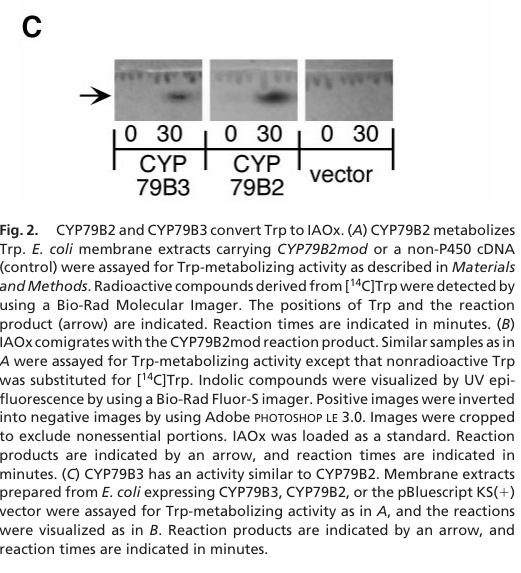

## Question

# Gene Research for Functional Annotation

## ⚠️ CRITICAL: Gene/Protein Identification Context

**BEFORE YOU BEGIN RESEARCH:** You MUST verify you are researching the CORRECT gene/protein. Gene symbols can be ambiguous, especially for less well-characterized genes from non-model organisms.

### Target Gene/Protein Identity (from UniProt):
- **UniProt Accession:** Q501D8
- **Protein Description:** RecName: Full=Tryptophan N-monooxygenase 2; EC=1.14.14.156 {ECO:0000269|PubMed:10681464}; AltName: Full=Cytochrome P450 79B3; AltName: Full=Tryptophan N-hydroxylase 2;
- **Gene Information:** Name=CYP79B3; OrderedLocusNames=At2g22330; ORFNames=T26C19.1;
- **Organism (full):** Arabidopsis thaliana (Mouse-ear cress).
- **Protein Family:** Belongs to the cytochrome P450 family. .
- **Key Domains:** Cyt_P450. (IPR001128); Cyt_P450_CS. (IPR017972); Cyt_P450_E_grp-I. (IPR002401); Cyt_P450_sf. (IPR036396); p450 (PF00067)

### MANDATORY VERIFICATION STEPS:

1. **Check if the gene symbol "CYP79B3" matches the protein description above**
2. **Verify the organism is correct:** Arabidopsis thaliana (Mouse-ear cress).
3. **Check if protein family/domains align with what you find in literature**
4. **If you find literature for a DIFFERENT gene with the same or similar symbol, STOP**

### If Gene Symbol is Ambiguous or You Cannot Find Relevant Literature:

**DO NOT PROCEED WITH RESEARCH ON A DIFFERENT GENE.** Instead:
- State clearly: "The gene symbol 'CYP79B3' is ambiguous or literature is limited for this specific protein"
- Explain what you found (e.g., "Found extensive literature on a different gene with the same symbol in a different organism")
- Describe the protein based ONLY on the UniProt information provided above
- Suggest that the protein function can be inferred from domain/family information

### Research Target:

Please provide a comprehensive research report on the gene **CYP79B3** (gene ID: CYP79B3, UniProt: Q501D8) in ARATH.

The research report should be a detailed narrative explaining the function, biological processes, and localization of the gene product. Citations should be given for all claims.

You should prioritize authoritative reviews and primary scientific literature when conducting research. You can supplement
this with annotations you find in gene/protein databases, but these can be outdated or inaccurate.

We are specifically interested in the primary function of the gene - for enzymes, what reaction is catalyzed, and what is the substrate specificity? For transporters, what is the substrate? For structural proteins or adapters, what is the broader structural role? For signaling molecules, what is the role in the pathway.

We are interested in where in or outside the cell the gene product carries out its function.

We are also interested in the signaling or biochemical pathways in which the gene functions. We are less interested in broad pleiotropic effects, except where these elucidate the precise role.

Include evidence where possible. We are interested in both experimental evidence as well as inference from structure, evolution, or bioinformatic analysis. Precise studies should be prioritized over high-throughput, where available.

## Output

Question: You are an expert researcher providing comprehensive, well-cited information.

Provide detailed information focusing on:
1. Key concepts and definitions with current understanding
2. Recent developments and latest research (prioritize 2023-2024 sources)
3. Current applications and real-world implementations
4. Expert opinions and analysis from authoritative sources
5. Relevant statistics and data from recent studies

Format as a comprehensive research report with proper citations. Include URLs and publication dates where available.
Always prioritize recent, authoritative sources and provide specific citations for all major claims.

# Gene Research for Functional Annotation

## ⚠️ CRITICAL: Gene/Protein Identification Context

**BEFORE YOU BEGIN RESEARCH:** You MUST verify you are researching the CORRECT gene/protein. Gene symbols can be ambiguous, especially for less well-characterized genes from non-model organisms.

### Target Gene/Protein Identity (from UniProt):
- **UniProt Accession:** Q501D8
- **Protein Description:** RecName: Full=Tryptophan N-monooxygenase 2; EC=1.14.14.156 {ECO:0000269|PubMed:10681464}; AltName: Full=Cytochrome P450 79B3; AltName: Full=Tryptophan N-hydroxylase 2;
- **Gene Information:** Name=CYP79B3; OrderedLocusNames=At2g22330; ORFNames=T26C19.1;
- **Organism (full):** Arabidopsis thaliana (Mouse-ear cress).
- **Protein Family:** Belongs to the cytochrome P450 family. .
- **Key Domains:** Cyt_P450. (IPR001128); Cyt_P450_CS. (IPR017972); Cyt_P450_E_grp-I. (IPR002401); Cyt_P450_sf. (IPR036396); p450 (PF00067)

### MANDATORY VERIFICATION STEPS:

1. **Check if the gene symbol "CYP79B3" matches the protein description above**
2. **Verify the organism is correct:** Arabidopsis thaliana (Mouse-ear cress).
3. **Check if protein family/domains align with what you find in literature**
4. **If you find literature for a DIFFERENT gene with the same or similar symbol, STOP**

### If Gene Symbol is Ambiguous or You Cannot Find Relevant Literature:

**DO NOT PROCEED WITH RESEARCH ON A DIFFERENT GENE.** Instead:
- State clearly: "The gene symbol 'CYP79B3' is ambiguous or literature is limited for this specific protein"
- Explain what you found (e.g., "Found extensive literature on a different gene with the same symbol in a different organism")
- Describe the protein based ONLY on the UniProt information provided above
- Suggest that the protein function can be inferred from domain/family information

### Research Target:

Please provide a comprehensive research report on the gene **CYP79B3** (gene ID: CYP79B3, UniProt: Q501D8) in ARATH.

The research report should be a detailed narrative explaining the function, biological processes, and localization of the gene product. Citations should be given for all claims.

You should prioritize authoritative reviews and primary scientific literature when conducting research. You can supplement
this with annotations you find in gene/protein databases, but these can be outdated or inaccurate.

We are specifically interested in the primary function of the gene - for enzymes, what reaction is catalyzed, and what is the substrate specificity? For transporters, what is the substrate? For structural proteins or adapters, what is the broader structural role? For signaling molecules, what is the role in the pathway.

We are interested in where in or outside the cell the gene product carries out its function.

We are also interested in the signaling or biochemical pathways in which the gene functions. We are less interested in broad pleiotropic effects, except where these elucidate the precise role.

Include evidence where possible. We are interested in both experimental evidence as well as inference from structure, evolution, or bioinformatic analysis. Precise studies should be prioritized over high-throughput, where available.

# CYP79B3 functional annotation in *Arabidopsis thaliana*

## Identity and principal function

**Identity verified.** The requested UniProt accession **Q501D8** corresponds, in the supplied annotation, to *Arabidopsis thaliana* **CYP79B3/At2g22330**, also called tryptophan N-monooxygenase 2. Independently, Hull and colleagues cloned an *Arabidopsis* CYP79B3 cDNA and demonstrated its activity; their CYP79B3 sequence was 85% identical to the related enzyme **CYP79B2**. The reported P450 sequence relationship and membrane-associated enzyme activity are consistent with the supplied cytochrome-P450 family and domain annotations. CYP79B2 is a paralog, **not** an alternative name for the requested protein. The locus assignment is also listed as At2g22330 in subsequent primary literature. (hull2000arabidopsiscytochromep450s pages 3-4, hull2000arabidopsiscytochromep450s pages 1-3, perez2021aldoximesareprecursors pages 15-16)

**The experimentally established reaction is conversion of L-tryptophan to indole-3-acetaldoxime (IAOx)**, the entry intermediate of an *Arabidopsis* tryptophan-derived metabolic branch. The name “tryptophan N-monooxygenase” describes this CYP79-catalyzed aldoxime-forming transformation; CYP79B3 is not an IAA receptor, transporter, or enzyme that directly makes indole-3-acetic acid (IAA). Hull *et al.* expressed CYP79B3 in *E. coli* and found that its membrane extracts converted tryptophan into a product migrating with IAOx, whereas vector-control extracts did not. Their Figure 2C presents the CYP79B3, CYP79B2, and control reactions side by side. This is **direct evidence for CYP79B3 activity**, rather than function inferred solely from its sequence. (hull2000arabidopsiscytochromep450s pages 3-4, hull2000arabidopsiscytochromep450s media 55148994)

**Substrate-specificity boundary.** L-tryptophan is a demonstrated CYP79B3 substrate. The retrieved CYP79B3 experiment did not establish a comprehensive alternative-amino-acid substrate profile or CYP79B3-specific kinetic constants. Tests finding no corresponding product from tyrosine or indole, and a reported kinetic measurement, concerned **CYP79B2**; they should not be transferred to CYP79B3. Both paralogs share the demonstrated tryptophan-to-IAOx activity, but their relative catalytic contributions in each tissue have not been established by that assay. (hull2000arabidopsiscytochromep450s pages 3-4, mikkelsen2000cytochromep450cyp79b2 pages 3-4)

## Biochemical pathways and biological role

**Indole glucosinolates.** CYP79B3 and CYP79B2 generate the IAOx that enters the core biosynthetic pathway for tryptophan-derived indole glucosinolates, defensive compounds characteristic of crucifers. Downstream, CYP83B1 preferentially metabolizes IAOx toward glucosinolate synthesis; SUR1 acts later in formation of the glucosinolate core. In a **cyp79b2 cyp79b3 double mutant**, IAOx and indole glucosinolates were at or below detection in the reported experiments. The strong double-mutant effect establishes the combined enzymes’ upstream requirement, not that CYP79B3 alone accounts for all pathway flux. (kim2015indoleglucosinolatebiosynthesis pages 2-3, bak2001cyp83b1acytochrome pages 1-2, perez2021aldoximesareprecursors pages 15-16)

**Camalexin and defense-related indoles.** IAOx also supplies the branch toward the antimicrobial phytoalexin camalexin. CYP71A12/CYP71A13 participate in processing IAOx-derived intermediates, and CYP71B15/PAD3 acts downstream in camalexin synthesis; the double CYP79B knockout cannot accumulate camalexin under the tested conditions. In pathogen assays, the double mutant was markedly susceptible to *Phytophthora brassicae* despite retaining examined immune responses such as callose deposition, supporting a specific contribution of missing tryptophan-derived chemical defenses. These observations implicate **the shared CYP79B2/B3 precursor step**; they do not isolate a CYP79B3-only resistance effect. (frerigmann2015theroleof pages 1-3, mucha2019theformationof pages 1-2, schlaeppi2010diseaseresistanceof pages 1-2)

**Auxin-related branch—important qualification.** IAOx can also contribute to IAA homeostasis, potentially through indole-3-acetonitrile (IAN), and blocking its glucosinolate sink at CYP83B1 can produce high-auxin phenotypes. Conversely, the CYP79B2/B3 double mutant is only partially deficient in IAA in some studies. The predominant general IAA-biosynthetic route is instead **tryptophan → indole-3-pyruvate (TAA1/TAR enzymes) → IAA (YUCCA enzymes)**. CYP79B3 is therefore best described as an **IAOx-producing branch-point enzyme with a context-dependent contribution to auxin metabolism**, not the principal IAA-synthesis enzyme. Flux into indole glucosinolates, camalexin, and IAA-related products must be distinguished from CYP79B3’s single directly observed reaction. (bak2001cyp83b1acytochrome pages 1-2, celenza2005thearabidopsisatr1 pages 1-2, soeno2024chemicalbiologyin pages 1-3)

## Where the protein acts

CYP79B3 is an **intracellular, membrane-associated P450**: its activity was recovered from recombinant bacterial membrane extracts. That experiment does **not** localize native CYP79B3 within plant cells. A reported fusion containing the CYP79B3 **N terminus** directed a GUS reporter to plastids, but targeting programs disagreed, and plant P450s are commonly associated with the cytosolic face of the endoplasmic-reticulum membrane. The authors evaluating these observations explicitly said that further work was needed. Thus **plastid targeting is suggestive, while the membrane/organellar site of active full-length native CYP79B3 remains unresolved**; neither chloroplast nor ER residence should be asserted as experimentally settled. Root **ER bodies** discussed in recent work house downstream glucosinolate-hydrolyzing myrosinases, not demonstrably CYP79B3. (mikkelsen2002biosynthesisandmetabolic pages 6-9, mucha2019theformationof pages 1-2, basak2024erbodyresidentmyrosinases pages 1-2)

Cellular location must also be distinguished from **where the gene is expressed**. In a 2023 promoter-reporter study, CYP79B3 promoter activity was seen at the base of a developing lateral root and subsequently in its meristem after emergence. This identifies expressing root tissues, **not** the subcellular localization of CYP79B3 protein. (zelm2023cyp79b2andcyp79b3 pages 3-6)

## Regulation, recent findings, and research use

CYP79B3 responds to defense-associated signaling. In *Arabidopsis* rosette leaves, methyl jasmonate induced CYP79B3 transcript abundance **3.5 ± 0.4-fold**, peaking at approximately **24 hours**; the ethylene precursor ACC reduced basal expression to **0.6 ± 0.1** of control and attenuated methyl-jasmonate induction. In the same study, methyl-jasmonate treatment increased the measured total indole-glucosinolate pool approximately **threefold**, from **3.3 ± 0.2 to 10.2 ± 0.1 nmol mg⁻¹ dry weight**. These metabolite measurements reflect a whole signaling response involving multiple enzymes, not an isolated quantitative contribution of CYP79B3. (mikkelsen2003modulationofcyp79 pages 2-3, mikkelsen2003modulationofcyp79 pages 5-6)

A **2024 peer-reviewed** root-microbiota study used the *cyp79b2b3* double mutant as a way to remove upstream tryptophan-specialized metabolism. Its root exudates assembled bacterial communities distinct from those exposed to wild-type exudates, and most of the fungal endophytes tested strongly restricted double-mutant growth. This extends the functional relevance of the pathway to root–microbe interactions, but cannot attribute community changes to **CYP79B3 alone** or to one identified CYP79B3 product. It also distinguishes biosynthesis by CYP79B enzymes from subsequent glucosinolate hydrolysis by ER-body myrosinases. (basak2024erbodyresidentmyrosinases pages 1-2, basak2024erbodyresidentmyrosinases pages 8-9)

A **September 2023 bioRxiv preprint**, rather than an established peer-reviewed finding in the retrieved record, reported that developing roots of the double mutant had IAN concentrations near zero while **measured IAA was not changed by genotype**. Salt increased IAN during wild-type lateral-root emergence, and externally supplied IAN—but not indole-3-acetamide in the reported comparison—rescued aspects of the mutant’s early lateral-root phenotype. The authors reported a **15-fmol injection detection limit** for camalexin, which was undetected in those root samples. These results favor a locally relevant IAOx/IAN branch under the experimental conditions; rescue does not prove that CYP79B3 directly catalyzes IAN formation or that altered bulk IAA explains the phenotype. (zelm2023cyp79b2andcyp79b3 pages 8-11)

**Application status.** CYP79B3 is presently most clearly useful as a **research target**: the combined CYP79B2/B3 knockout helps separate IAOx-derived defenses and root-exudate effects from other metabolism, while pathway-enzyme expression provides a strategy for investigating indole-glucosinolate production. The cited evidence does not establish a deployed agricultural product or a validated CYP79B3-specific intervention. Engineering conclusions drawn from other CYP79 genes or from CYP79B2 overexpression should not be presented as demonstrations for CYP79B3 itself. (kim2015indoleglucosinolatebiosynthesis pages 2-3, basak2024erbodyresidentmyrosinases pages 1-2, mikkelsen2000cytochromep450cyp79b2 pages 5-6)

The following evidence matrix separates directly established properties from paralog- or double-mutant-based inference.

| Annotation / claim | Experimental support | Limitation / evidence grade |
|---|---|---|
| **CYP79B3 converts L-tryptophan to indole-3-acetaldoxime (IAOx).** | Hull *et al.* expressed Arabidopsis CYP79B3 cDNA in *E. coli*. Membrane extracts generated an IAOx-comigrating product from tryptophan, unlike vector controls. **Direct biochemical evidence: high confidence.** (hull2000arabidopsiscytochromep450s pages 3-4, hull2000arabidopsiscytochromep450s media 55148994) | The assay established activity but did not report CYP79B3-specific kinetic constants or a comprehensive substrate panel. |
| **CYP79B3 is a close CYP79B2 paralog, but CYP79B2 findings cannot automatically be assigned to CYP79B3.** | CYP79B3 and CYP79B2 share **85% amino-acid identity**, and both recombinant proteins convert tryptophan to IAOx. CYP79B2 did not produce detectable products from tyrosine or indole, whereas CYP79B3 was tested directly only with tryptophan. **Paralogy: high confidence; broad CYP79B3 specificity: unresolved.** (hull2000arabidopsiscytochromep450s pages 3-4) | CYP79B2 kinetics, inhibitor responses, overexpression phenotypes, and negative substrate tests are paralog evidence, not CYP79B3-specific measurements. |
| **CYP79B2 and CYP79B3 supply the shared precursor for indole glucosinolates and camalexin.** | IAOx and indole glucosinolates were at or below detection in the *cyp79b2 cyp79b3* double knockout. The double mutant also fails to accumulate camalexin. **Double-mutant pathway evidence: high confidence.** (kim2015indoleglucosinolatebiosynthesis pages 2-3, schlaeppi2010diseaseresistanceof pages 1-2, glawischnig2007camalexin pages 2-3) | These results establish the combined requirement for CYP79B2 and CYP79B3 but do not quantify CYP79B3’s independent contribution; paralog compensation limits single-gene interpretation. |
| **CYP79B3 can contribute to IAA homeostasis through the IAOx branch, but this is not the principal general IAA pathway.** | Double-mutant evidence links CYP79B-derived IAOx to part of the IAA pool. Current understanding identifies TAA1/TAR-mediated tryptophan-to-IPyA conversion followed by YUCCA activity as the predominant IAA route. **Conditional branch contribution: moderate-to-high confidence.** (kim2015indoleglucosinolatebiosynthesis pages 2-3, soeno2024chemicalbiologyin pages 1-3, celenza2005thearabidopsisatr1 pages 1-2) | IAOx also feeds defense metabolism, and flux toward IAA varies with tissue, development, and stress. CYP79B3 should not be annotated as the sole or principal IAA-biosynthetic enzyme. |
| **Native subcellular localization remains unresolved; plastid targeting is suggested but not definitive.** | An N-terminal CYP79B3–GUS fusion reportedly directed GUS to plastids. This conflicts with inconsistent targeting predictions and the usual anchoring of eukaryotic plant P450s on the cytosolic face of the ER. The reviewing authors called for further localization studies. **Tentative evidence.** (mikkelsen2002biosynthesisandmetabolic pages 6-9, mucha2019theformationof pages 1-2) | An isolated N-terminal fusion does not establish the localization of active, full-length CYP79B3. ER bodies contain downstream myrosinases such as PYK10 and BGLU21; they are not evidence that CYP79B3 is an ER-body enzyme. (basak2024erbodyresidentmyrosinases pages 1-2) |
| **CYP79B2/B3-dependent metabolites influence root microbiota assembly.** | Basak *et al.* (2024, peer reviewed) found that *cyp79b2b3* root exudates produced bacterial-community profiles distinct from wild type. The double mutant also showed altered microbial interactions and severe growth restriction with most tested fungal endophytes. **Combined-pathway ecological evidence: high confidence.** (basak2024erbodyresidentmyrosinases pages 1-2, basak2024erbodyresidentmyrosinases pages 8-9, basak2024erbodyresidentmyrosinases pages 2-3) | This double-mutant result does not isolate CYP79B3 from CYP79B2 or identify one CYP79B3-derived metabolite as the causal factor. |
| **The IAOx-derived metabolite IAN may regulate early lateral-root growth under salt stress.** | A 2023 bioRxiv preprint reported nearly absent IAN but unchanged IAA in *cyp79b2/b3* root segments. Salt increased IAN in wild type, and exogenous IAN rescued early lateral-root length and salt-associated lateral-root-density defects. CYP79B3 promoter activity shifted from beneath the primordium to the emerged lateral-root meristem. **Suggestive preprint evidence.** (zelm2023cyp79b2andcyp79b3 pages 8-11, zelm2023cyp79b2andcyp79b3 pages 3-6) | The located record was not peer reviewed, and the phenotypes concern the double mutant rather than CYP79B3 alone. IAN rescue does not show that altered bulk IAA mediates the effect because measured IAA was unchanged by genotype. |

*Table: Evidence matrix separating direct CYP79B3 biochemical findings from paralog, double-mutant, localization, and preprint-based inferences. It identifies secure annotations and important gene-specific limitations.*

### Principal sources and publication dates

- **Hull, Vij & Celenza**, *PNAS*, **29 February 2000**, primary CYP79B3 biochemical characterization: https://doi.org/10.1073/pnas.040569997. (hull2000arabidopsiscytochromep450s pages 3-4, hull2000arabidopsiscytochromep450s pages 1-3)
- **Mikkelsen and colleagues**, *Amino Acids*, **April 2002**, glucosinolate-biosynthesis review discussing contradictory CYP79B3 localization evidence: https://doi.org/10.1007/s007260200014. (mikkelsen2002biosynthesisandmetabolic pages 6-9)
- **Mikkelsen and colleagues**, *Plant Physiology*, **January 2003**, CYP79B3 induction and glucosinolate measurements: https://doi.org/10.1104/pp.011015. (mikkelsen2003modulationofcyp79 pages 1-2, mikkelsen2003modulationofcyp79 pages 2-3)
- **Kim and colleagues**, *The Plant Cell*, **May 2015**, IAOx/glucosinolate genetic and metabolic evidence: https://doi.org/10.1105/tpc.15.00127. (kim2015indoleglucosinolatebiosynthesis pages 2-3)
- **Basak and colleagues**, *New Phytologist*, **2024** volume 241, pp. 329–342; manuscript accepted **13 September 2023**. Root microbiota and exudate experiments: https://doi.org/10.1111/nph.19289. (basak2024erbodyresidentmyrosinases pages 1-2)
- **van Zelm and colleagues**, *bioRxiv*, **September 2023**, **preprint** on lateral roots and IAN: https://doi.org/10.1101/2023.09.26.559630. (zelm2023cyp79b2andcyp79b3 pages 1-3, zelm2023cyp79b2andcyp79b3 pages 8-11)

**Bottom line:** The high-confidence annotation for *Arabidopsis* CYP79B3/Q501D8 is **L-tryptophan → indole-3-acetaldoxime**, supplying a shared precursor for indole glucosinolates, camalexin, and condition-dependent auxin-related metabolism. Its precise active compartment, complete substrate range, individual kinetic parameters, and contribution relative to CYP79B2 remain less firmly resolved. (hull2000arabidopsiscytochromep450s pages 3-4, kim2015indoleglucosinolatebiosynthesis pages 2-3, mikkelsen2002biosynthesisandmetabolic pages 6-9, soeno2024chemicalbiologyin pages 1-3)

References

1. (hull2000arabidopsiscytochromep450s pages 3-4): Anna K. Hull, Rekha Vij, and John L. Celenza. Arabidopsis cytochrome p450s that catalyze the first step of tryptophan-dependent indole-3-acetic acid biosynthesis. Proceedings of the National Academy of Sciences of the United States of America, 97 5:2379-84, Feb 2000. URL: https://doi.org/10.1073/pnas.040569997, doi:10.1073/pnas.040569997. This article has 631 citations and is from a highest quality peer-reviewed journal.

2. (hull2000arabidopsiscytochromep450s pages 1-3): Anna K. Hull, Rekha Vij, and John L. Celenza. Arabidopsis cytochrome p450s that catalyze the first step of tryptophan-dependent indole-3-acetic acid biosynthesis. Proceedings of the National Academy of Sciences of the United States of America, 97 5:2379-84, Feb 2000. URL: https://doi.org/10.1073/pnas.040569997, doi:10.1073/pnas.040569997. This article has 631 citations and is from a highest quality peer-reviewed journal.

3. (perez2021aldoximesareprecursors pages 15-16): Veronica C. Perez, Ru Dai, Bing Bai, Breanna Tomiczek, Bryce C. Askey, Yi Zhang, Garret M. Rubin, Yousong Ding, Alexander Grenning, Anna K. Block, and Jeongim Kim. Aldoximes are precursors of auxins in arabidopsis and maize. Jun 2021. URL: https://doi.org/10.1111/nph.17447, doi:10.1111/nph.17447. This article has 43 citations and is from a highest quality peer-reviewed journal.

4. (hull2000arabidopsiscytochromep450s media 55148994): Anna K. Hull, Rekha Vij, and John L. Celenza. Arabidopsis cytochrome p450s that catalyze the first step of tryptophan-dependent indole-3-acetic acid biosynthesis. Proceedings of the National Academy of Sciences of the United States of America, 97 5:2379-84, Feb 2000. URL: https://doi.org/10.1073/pnas.040569997, doi:10.1073/pnas.040569997. This article has 631 citations and is from a highest quality peer-reviewed journal.

5. (mikkelsen2000cytochromep450cyp79b2 pages 3-4): Michael Dalgaard Mikkelsen, Carsten Hørslev Hansen, Ute Wittstock, and Barbara Ann Halkier. Cytochrome p450 cyp79b2 from arabidopsis catalyzes the conversion of tryptophan to indole-3-acetaldoxime, a precursor of indole glucosinolates and indole-3-acetic acid*. The Journal of Biological Chemistry, 275:33712-33717, Oct 2000. URL: https://doi.org/10.1074/jbc.m001667200, doi:10.1074/jbc.m001667200. This article has 601 citations.

6. (kim2015indoleglucosinolatebiosynthesis pages 2-3): Jeong Im Kim, Whitney L. Dolan, Nickolas A. Anderson, and Clint Chapple. Indole glucosinolate biosynthesis limits phenylpropanoid accumulation in arabidopsis thaliana. Plant Cell, 27:1529-1546, May 2015. URL: https://doi.org/10.1105/tpc.15.00127, doi:10.1105/tpc.15.00127. This article has 145 citations and is from a highest quality peer-reviewed journal.

7. (bak2001cyp83b1acytochrome pages 1-2): Soren Bak, Frans E. Tax, Kenneth A. Feldmann, David W. Galbraith, and Rene Feyereisen. Cyp83b1, a cytochrome p450 at the metabolic branch point in auxin and indole glucosinolate biosynthesis in arabidopsis. Plant Cell, 13:101-111, Jan 2001. URL: https://doi.org/10.1105/tpc.13.1.101, doi:10.1105/tpc.13.1.101. This article has 537 citations and is from a highest quality peer-reviewed journal.

8. (frerigmann2015theroleof pages 1-3): Henning Frerigmann, Erich Glawischnig, and Tamara Gigolashvili. The role of myb34, myb51 and myb122 in the regulation of camalexin biosynthesis in arabidopsis thaliana. Frontiers in Plant Science, Aug 2015. URL: https://doi.org/10.3389/fpls.2015.00654, doi:10.3389/fpls.2015.00654. This article has 80 citations.

9. (mucha2019theformationof pages 1-2): Stefanie Mucha, S. Heinzlmeir, V. Kriechbaumer, Benjamin Strickland, C. Kirchhelle, M. Choudhary, Natalie Kowalski, R. Eichmann, R. Hückelhoven, E. Grill, B. Kuster, and E. Glawischnig. The formation of a camalexin biosynthetic metabolon. Plant Cell, 31:2697-2710, Sep 2019. URL: https://doi.org/10.1105/tpc.19.00403, doi:10.1105/tpc.19.00403. This article has 105 citations and is from a highest quality peer-reviewed journal.

10. (schlaeppi2010diseaseresistanceof pages 1-2): Klaus Schlaeppi, Eliane Abou-Mansour, Antony Buchala, and Felix Mauch. Disease resistance of arabidopsis to phytophthora brassicae is established by the sequential action of indole glucosinolates and camalexin. The Plant journal : for cell and molecular biology, 62 5:840-51, Mar 2010. URL: https://doi.org/10.1111/j.1365-313x.2010.04197.x, doi:10.1111/j.1365-313x.2010.04197.x. This article has 240 citations.

11. (celenza2005thearabidopsisatr1 pages 1-2): John L. Celenza, Juan A. Quiel, Gromoslaw A. Smolen, Houra Merrikh, Angela R. Silvestro, Jennifer Normanly, and Judith Bender. The arabidopsis atr1 myb transcription factor controls indolic glucosinolate homeostasis. Plant Physiology, 137:253-262, Jan 2005. URL: https://doi.org/10.1104/pp.104.054395, doi:10.1104/pp.104.054395. This article has 272 citations and is from a highest quality peer-reviewed journal.

12. (soeno2024chemicalbiologyin pages 1-3): Kazuo SOENO, Akiko SATO, and Yukihisa SHIMADA. Chemical biology in the auxin biosynthesis pathway via indole-3-pyruvic acid. Japan Agricultural Research Quarterly: JARQ, 58:1-11, Jan 2024. URL: https://doi.org/10.6090/jarq.58.1, doi:10.6090/jarq.58.1. This article has 4 citations.

13. (mikkelsen2002biosynthesisandmetabolic pages 6-9): M. D. Mikkelsen, B. L. Petersen, C. E. Olsen, and B. A. Halkier. Biosynthesis and metabolic engineering of glucosinolates. Amino Acids, 22:279-295, Apr 2002. URL: https://doi.org/10.1007/s007260200014, doi:10.1007/s007260200014. This article has 206 citations and is from a peer-reviewed journal.

14. (basak2024erbodyresidentmyrosinases pages 1-2): Arpan Kumar Basak, Anna Piasecka, Jana Hucklenbroich, Gözde Merve Türksoy, Rui Guan, Pengfan Zhang, Felix Getzke, Ruben Garrido‐Oter, Stephane Hacquard, Kazimierz Strzałka, Paweł Bednarek, Kenji Yamada, and Ryohei Thomas Nakano. Er body-resident myrosinases and tryptophan specialized metabolism modulate root microbiota assembly. The New phytologist, 241:329-342, Sep 2024. URL: https://doi.org/10.1111/nph.19289, doi:10.1111/nph.19289. This article has 28 citations.

15. (zelm2023cyp79b2andcyp79b3 pages 3-6): Eva van Zelm, Iko T. Koevoets, A. Jessica Meyer, Kyra van der Velde, Thijs A. J. de Zeeuw, Francel Verstappen, Rens Holmer, Wouter Kohlen, Viola Willemsen, Charlotte M.M. Gommers, and Christa Testerink. Cyp79b2 and cyp79b3 contribute to root branching through production of the auxin precursor indole-3-acetonitrile. bioRxiv, Sep 2023. URL: https://doi.org/10.1101/2023.09.26.559630, doi:10.1101/2023.09.26.559630. This article has 5 citations.

16. (mikkelsen2003modulationofcyp79 pages 2-3): Michael Dalgaard Mikkelsen, Bent Larsen Petersen, Erich Glawischnig, Anders Bøgh Jensen, Erik Andreasson, and Barbara Ann Halkier. Modulation of cyp79 genes and glucosinolate profiles in arabidopsis by defense signaling pathways1. Plant Physiology, 131:298-308, Jan 2003. URL: https://doi.org/10.1104/pp.011015, doi:10.1104/pp.011015. This article has 450 citations and is from a highest quality peer-reviewed journal.

17. (mikkelsen2003modulationofcyp79 pages 5-6): Michael Dalgaard Mikkelsen, Bent Larsen Petersen, Erich Glawischnig, Anders Bøgh Jensen, Erik Andreasson, and Barbara Ann Halkier. Modulation of cyp79 genes and glucosinolate profiles in arabidopsis by defense signaling pathways1. Plant Physiology, 131:298-308, Jan 2003. URL: https://doi.org/10.1104/pp.011015, doi:10.1104/pp.011015. This article has 450 citations and is from a highest quality peer-reviewed journal.

18. (basak2024erbodyresidentmyrosinases pages 8-9): Arpan Kumar Basak, Anna Piasecka, Jana Hucklenbroich, Gözde Merve Türksoy, Rui Guan, Pengfan Zhang, Felix Getzke, Ruben Garrido‐Oter, Stephane Hacquard, Kazimierz Strzałka, Paweł Bednarek, Kenji Yamada, and Ryohei Thomas Nakano. Er body-resident myrosinases and tryptophan specialized metabolism modulate root microbiota assembly. The New phytologist, 241:329-342, Sep 2024. URL: https://doi.org/10.1111/nph.19289, doi:10.1111/nph.19289. This article has 28 citations.

19. (zelm2023cyp79b2andcyp79b3 pages 8-11): Eva van Zelm, Iko T. Koevoets, A. Jessica Meyer, Kyra van der Velde, Thijs A. J. de Zeeuw, Francel Verstappen, Rens Holmer, Wouter Kohlen, Viola Willemsen, Charlotte M.M. Gommers, and Christa Testerink. Cyp79b2 and cyp79b3 contribute to root branching through production of the auxin precursor indole-3-acetonitrile. bioRxiv, Sep 2023. URL: https://doi.org/10.1101/2023.09.26.559630, doi:10.1101/2023.09.26.559630. This article has 5 citations.

20. (mikkelsen2000cytochromep450cyp79b2 pages 5-6): Michael Dalgaard Mikkelsen, Carsten Hørslev Hansen, Ute Wittstock, and Barbara Ann Halkier. Cytochrome p450 cyp79b2 from arabidopsis catalyzes the conversion of tryptophan to indole-3-acetaldoxime, a precursor of indole glucosinolates and indole-3-acetic acid*. The Journal of Biological Chemistry, 275:33712-33717, Oct 2000. URL: https://doi.org/10.1074/jbc.m001667200, doi:10.1074/jbc.m001667200. This article has 601 citations.

21. (glawischnig2007camalexin pages 2-3): Erich Glawischnig. Camalexin. Feb 2007. URL: https://doi.org/10.1016/j.phytochem.2006.12.005, doi:10.1016/j.phytochem.2006.12.005. This article has 398 citations and is from a peer-reviewed journal.

22. (basak2024erbodyresidentmyrosinases pages 2-3): Arpan Kumar Basak, Anna Piasecka, Jana Hucklenbroich, Gözde Merve Türksoy, Rui Guan, Pengfan Zhang, Felix Getzke, Ruben Garrido‐Oter, Stephane Hacquard, Kazimierz Strzałka, Paweł Bednarek, Kenji Yamada, and Ryohei Thomas Nakano. Er body-resident myrosinases and tryptophan specialized metabolism modulate root microbiota assembly. The New phytologist, 241:329-342, Sep 2024. URL: https://doi.org/10.1111/nph.19289, doi:10.1111/nph.19289. This article has 28 citations.

23. (mikkelsen2003modulationofcyp79 pages 1-2): Michael Dalgaard Mikkelsen, Bent Larsen Petersen, Erich Glawischnig, Anders Bøgh Jensen, Erik Andreasson, and Barbara Ann Halkier. Modulation of cyp79 genes and glucosinolate profiles in arabidopsis by defense signaling pathways1. Plant Physiology, 131:298-308, Jan 2003. URL: https://doi.org/10.1104/pp.011015, doi:10.1104/pp.011015. This article has 450 citations and is from a highest quality peer-reviewed journal.

24. (zelm2023cyp79b2andcyp79b3 pages 1-3): Eva van Zelm, Iko T. Koevoets, A. Jessica Meyer, Kyra van der Velde, Thijs A. J. de Zeeuw, Francel Verstappen, Rens Holmer, Wouter Kohlen, Viola Willemsen, Charlotte M.M. Gommers, and Christa Testerink. Cyp79b2 and cyp79b3 contribute to root branching through production of the auxin precursor indole-3-acetonitrile. bioRxiv, Sep 2023. URL: https://doi.org/10.1101/2023.09.26.559630, doi:10.1101/2023.09.26.559630. This article has 5 citations.

## Artifacts

- [Edison artifact artifact-00](CYP79B3-deep-research-falcon_artifacts/artifact-00.md)

## Citations

1. basak2024erbodyresidentmyrosinases pages 1-2
2. mikkelsen2002biosynthesisandmetabolic pages 6-9
3. kim2015indoleglucosinolatebiosynthesis pages 2-3
4. perez2021aldoximesareprecursors pages 15-16
5. frerigmann2015theroleof pages 1-3
6. mucha2019theformationof pages 1-2
7. schlaeppi2010diseaseresistanceof pages 1-2
8. soeno2024chemicalbiologyin pages 1-3
9. basak2024erbodyresidentmyrosinases pages 8-9
10. glawischnig2007camalexin pages 2-3
11. basak2024erbodyresidentmyrosinases pages 2-3
12. https://doi.org/10.1073/pnas.040569997.
13. https://doi.org/10.1007/s007260200014.
14. https://doi.org/10.1104/pp.011015.
15. https://doi.org/10.1105/tpc.15.00127.
16. https://doi.org/10.1111/nph.19289.
17. https://doi.org/10.1101/2023.09.26.559630.
18. https://doi.org/10.1073/pnas.040569997,
19. https://doi.org/10.1111/nph.17447,
20. https://doi.org/10.1074/jbc.m001667200,
21. https://doi.org/10.1105/tpc.15.00127,
22. https://doi.org/10.1105/tpc.13.1.101,
23. https://doi.org/10.3389/fpls.2015.00654,
24. https://doi.org/10.1105/tpc.19.00403,
25. https://doi.org/10.1111/j.1365-313x.2010.04197.x,
26. https://doi.org/10.1104/pp.104.054395,
27. https://doi.org/10.6090/jarq.58.1,
28. https://doi.org/10.1007/s007260200014,
29. https://doi.org/10.1111/nph.19289,
30. https://doi.org/10.1101/2023.09.26.559630,
31. https://doi.org/10.1104/pp.011015,
32. https://doi.org/10.1016/j.phytochem.2006.12.005,