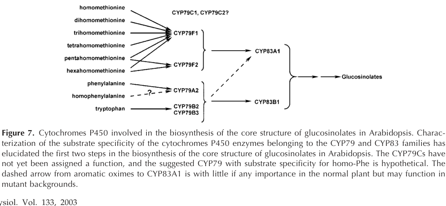

## Question

# Gene Research for Functional Annotation

## ⚠️ CRITICAL: Gene/Protein Identification Context

**BEFORE YOU BEGIN RESEARCH:** You MUST verify you are researching the CORRECT gene/protein. Gene symbols can be ambiguous, especially for less well-characterized genes from non-model organisms.

### Target Gene/Protein Identity (from UniProt):
- **UniProt Accession:** P48421
- **Protein Description:** RecName: Full=Cytochrome P450 83A1; EC=1.14.14.43 {ECO:0000269|PubMed:12970475}; AltName: Full=CYPLXXXIII; AltName: Full=Protein REDUCED EPIDERMAL FLUORESCENCE 2 {ECO:0000303|PubMed:12509530};
- **Gene Information:** Name=CYP83A1; Synonyms=CYP83, REF2 {ECO:0000303|PubMed:12509530}; OrderedLocusNames=At4g13770; ORFNames=F18A5.160;
- **Organism (full):** Arabidopsis thaliana (Mouse-ear cress).
- **Protein Family:** Belongs to the cytochrome P450 family. .
- **Key Domains:** Cyt_P450. (IPR001128); Cyt_P450_CS. (IPR017972); Cyt_P450_E_grp-I. (IPR002401); Cyt_P450_sf. (IPR036396); p450 (PF00067)

### MANDATORY VERIFICATION STEPS:

1. **Check if the gene symbol "CYP83A1" matches the protein description above**
2. **Verify the organism is correct:** Arabidopsis thaliana (Mouse-ear cress).
3. **Check if protein family/domains align with what you find in literature**
4. **If you find literature for a DIFFERENT gene with the same or similar symbol, STOP**

### If Gene Symbol is Ambiguous or You Cannot Find Relevant Literature:

**DO NOT PROCEED WITH RESEARCH ON A DIFFERENT GENE.** Instead:
- State clearly: "The gene symbol 'CYP83A1' is ambiguous or literature is limited for this specific protein"
- Explain what you found (e.g., "Found extensive literature on a different gene with the same symbol in a different organism")
- Describe the protein based ONLY on the UniProt information provided above
- Suggest that the protein function can be inferred from domain/family information

### Research Target:

Please provide a comprehensive research report on the gene **CYP83A1** (gene ID: CYP83A1, UniProt: P48421) in ARATH.

The research report should be a detailed narrative explaining the function, biological processes, and localization of the gene product. Citations should be given for all claims.

You should prioritize authoritative reviews and primary scientific literature when conducting research. You can supplement
this with annotations you find in gene/protein databases, but these can be outdated or inaccurate.

We are specifically interested in the primary function of the gene - for enzymes, what reaction is catalyzed, and what is the substrate specificity? For transporters, what is the substrate? For structural proteins or adapters, what is the broader structural role? For signaling molecules, what is the role in the pathway.

We are interested in where in or outside the cell the gene product carries out its function.

We are also interested in the signaling or biochemical pathways in which the gene functions. We are less interested in broad pleiotropic effects, except where these elucidate the precise role.

Include evidence where possible. We are interested in both experimental evidence as well as inference from structure, evolution, or bioinformatic analysis. Precise studies should be prioritized over high-throughput, where available.

## Output

Question: You are an expert researcher providing comprehensive, well-cited information.

Provide detailed information focusing on:
1. Key concepts and definitions with current understanding
2. Recent developments and latest research (prioritize 2023-2024 sources)
3. Current applications and real-world implementations
4. Expert opinions and analysis from authoritative sources
5. Relevant statistics and data from recent studies

Format as a comprehensive research report with proper citations. Include URLs and publication dates where available.
Always prioritize recent, authoritative sources and provide specific citations for all major claims.

# Gene Research for Functional Annotation

## ⚠️ CRITICAL: Gene/Protein Identification Context

**BEFORE YOU BEGIN RESEARCH:** You MUST verify you are researching the CORRECT gene/protein. Gene symbols can be ambiguous, especially for less well-characterized genes from non-model organisms.

### Target Gene/Protein Identity (from UniProt):
- **UniProt Accession:** P48421
- **Protein Description:** RecName: Full=Cytochrome P450 83A1; EC=1.14.14.43 {ECO:0000269|PubMed:12970475}; AltName: Full=CYPLXXXIII; AltName: Full=Protein REDUCED EPIDERMAL FLUORESCENCE 2 {ECO:0000303|PubMed:12509530};
- **Gene Information:** Name=CYP83A1; Synonyms=CYP83, REF2 {ECO:0000303|PubMed:12509530}; OrderedLocusNames=At4g13770; ORFNames=F18A5.160;
- **Organism (full):** Arabidopsis thaliana (Mouse-ear cress).
- **Protein Family:** Belongs to the cytochrome P450 family. .
- **Key Domains:** Cyt_P450. (IPR001128); Cyt_P450_CS. (IPR017972); Cyt_P450_E_grp-I. (IPR002401); Cyt_P450_sf. (IPR036396); p450 (PF00067)

### MANDATORY VERIFICATION STEPS:

1. **Check if the gene symbol "CYP83A1" matches the protein description above**
2. **Verify the organism is correct:** Arabidopsis thaliana (Mouse-ear cress).
3. **Check if protein family/domains align with what you find in literature**
4. **If you find literature for a DIFFERENT gene with the same or similar symbol, STOP**

### If Gene Symbol is Ambiguous or You Cannot Find Relevant Literature:

**DO NOT PROCEED WITH RESEARCH ON A DIFFERENT GENE.** Instead:
- State clearly: "The gene symbol 'CYP83A1' is ambiguous or literature is limited for this specific protein"
- Explain what you found (e.g., "Found extensive literature on a different gene with the same symbol in a different organism")
- Describe the protein based ONLY on the UniProt information provided above
- Suggest that the protein function can be inferred from domain/family information

### Research Target:

Please provide a comprehensive research report on the gene **CYP83A1** (gene ID: CYP83A1, UniProt: P48421) in ARATH.

The research report should be a detailed narrative explaining the function, biological processes, and localization of the gene product. Citations should be given for all claims.

You should prioritize authoritative reviews and primary scientific literature when conducting research. You can supplement
this with annotations you find in gene/protein databases, but these can be outdated or inaccurate.

We are specifically interested in the primary function of the gene - for enzymes, what reaction is catalyzed, and what is the substrate specificity? For transporters, what is the substrate? For structural proteins or adapters, what is the broader structural role? For signaling molecules, what is the role in the pathway.

We are interested in where in or outside the cell the gene product carries out its function.

We are also interested in the signaling or biochemical pathways in which the gene functions. We are less interested in broad pleiotropic effects, except where these elucidate the precise role.

Include evidence where possible. We are interested in both experimental evidence as well as inference from structure, evolution, or bioinformatic analysis. Precise studies should be prioritized over high-throughput, where available.

# Comprehensive Research Report: CYP83A1 (REF2) in Arabidopsis thaliana

## Gene Identity and Nomenclature

CYP83A1, also known as REF2 (REDUCED EPIDERMAL FLUORESCENCE 2) or simply CYP83, is a cytochrome P450 monooxygenase encoded by the gene At4g13770 in *Arabidopsis thaliana* (kim2015indoleglucosinolatebiosynthesis pages 1-2, kim2015indoleglucosinolatebiosynthesis pages 3-6). The enzyme belongs to the cytochrome P450 family and is classified as EC 1.14.14.43 according to the Enzyme Commission nomenclature (naur2003cyp83a1andcyp83b1 pages 3-4, naur2003cyp83a1andcyp83b1 pages 7-9).

## Enzymatic Function and Catalytic Mechanism

### Primary Reaction Catalyzed

CYP83A1 is an NADPH-dependent cytochrome P450 monooxygenase that catalyzes the oxidative activation of amino acid-derived aldoximes during glucosinolate biosynthesis (naur2003cyp83a1andcyp83b1 pages 3-4, naur2003cyp83a1andcyp83b1 pages 1-2, mikkelsen2002biosynthesisandmetabolic pages 6-9). The enzyme oxidizes aldoxime substrates to highly reactive intermediates, generally modeled as aci-nitro compounds and/or nitrile oxides, which are subsequently captured by sulfur nucleophiles such as glutathione or cysteine (mikkelsen2002biosynthesisandmetabolic pages 6-9, halkier2006biologyandbiochemistry pages 6-7).

The overall reaction can be summarized as:
**Aliphatic aldoxime + O₂ + NADPH + H⁺ + glutathione → S-alkylthiohydroximate conjugate + NADP⁺ + H₂O**

The immediate product is an S-alkylthiohydroximate that serves as an intermediate in the glucosinolate biosynthetic pathway (naur2003cyp83a1andcyp83b1 pages 3-4, naur2003cyp83a1andcyp83b1 pages 1-2). In biochemical assays using cysteine as the trapping agent, CYP83A1 converts 4-methylthiobutanaldoxime into S-(4-methylthiobutylhydroximoyl)-L-cysteine, which can spontaneously cyclize to form 2-(3-methylthiopropyl)-thiazoline-4-carboxylic acid (naur2003cyp83a1andcyp83b1 pages 3-4, naur2003cyp83a1andcyp83b1 pages 1-2).

### Substrate Specificity

CYP83A1 exhibits broad but strongly biased substrate specificity (naur2003cyp83a1andcyp83b1 pages 2-3, naur2003cyp83a1andcyp83b1 pages 1-2, naur2003cyp83a1andcyp83b1 pages 3-4). The enzyme preferentially metabolizes **aliphatic aldoximes** derived from chain-elongated methionine homologs, including:
- 4-methylthiobutanaldoxime
- 5-methylthiopentanaldoxime
- 6-methylthiohexanaldoxime
- 7-methylthioheptanaldoxime

While CYP83A1 can also metabolize aromatic aldoximes—including indole-3-acetaldoxime, phenylacetaldoxime, and *p*-hydroxyphenylacetaldoxime—it does so with substantially lower efficiency (naur2003cyp83a1andcyp83b1 pages 2-3, naur2003cyp83a1andcyp83b1 pages 1-2). Kinetic studies reveal that CYP83A1 has approximately 50-fold lower affinity for indole-3-acetaldoxime compared to its paralog CYP83B1, which is specialized for aromatic and indolic substrates (naur2003cyp83a1andcyp83b1 pages 2-3, naur2003cyp83a1andcyp83b1 pages 3-4).

## Biochemical Pathways and Biological Processes

### Role in Glucosinolate Biosynthesis

CYP83A1 functions as a critical enzyme in the **core aliphatic glucosinolate biosynthesis pathway**, positioned immediately downstream of CYP79 family enzymes (wang2020characterizationofarabidopsis pages 1-2, naur2003cyp83a1andcyp83b1 pages 6-7, naur2003cyp83a1andcyp83b1 media 2446b7c6). The pathway proceeds as follows:

1. CYP79 enzymes (particularly CYP79F1 and CYP79F2) convert chain-elongated methionine derivatives into their corresponding aldoximes
2. CYP83A1 oxidatively activates these aliphatic aldoximes
3. The oxidized products undergo glutathione-dependent sulfur conjugation
4. Subsequent enzymatic steps involving C-S lyase, glycosyltransferases, and sulfotransferases produce mature glucosinolates

This pathway organization is illustrated in the glucosinolate biosynthesis pathway diagram (naur2003cyp83a1andcyp83b1 media 2446b7c6), which shows CYP83A1 functioning in parallel with CYP83B1 to process aldoximes from different amino acid precursors.

### Metabolic Crosstalk with Auxin Biosynthesis

CYP83A1 occupies a metabolically strategic position at the branch point between glucosinolate biosynthesis and auxin (indole-3-acetic acid, IAA) production (naur2003cyp83a1andcyp83b1 pages 6-7, malka2017possibleinteractionsbetween pages 3-5, kim2015indoleglucosinolatebiosynthesis pages 2-3). Indole-3-acetaldoxime (IAOx) serves as a common intermediate that can be channeled either toward indole glucosinolate biosynthesis (primarily via CYP83B1) or toward IAA production.

When CYP83A1 or CYP83B1 activity is reduced, more IAOx becomes available for conversion to IAA, leading to elevated auxin levels (naur2003cyp83a1andcyp83b1 pages 6-7, malka2017possibleinteractionsbetween pages 3-5). However, unlike *cyp83b1/sur2* mutants which display pronounced high-auxin phenotypes, *ref2/cyp83a1* mutants generally lack strong auxin-related morphological changes, consistent with CYP83A1's primary role in aliphatic rather than indolic aldoxime metabolism (shin2023alteredmethioninemetabolism pages 4-6).

### Phenylpropanoid Pathway Interactions

One of the most striking aspects of CYP83A1 function is its impact on phenylpropanoid metabolism (kim2015indoleglucosinolatebiosynthesis pages 1-2, kim2015indoleglucosinolatebiosynthesis pages 3-6, shin2023alteredmethioninemetabolism pages 4-6). The *ref2* mutant phenotype was originally identified based on reduced epidermal fluorescence, reflecting approximately 70% decreased accumulation of sinapoylmalate, a UV-protective phenylpropanoid compound that fluoresces blue under UV light (kim2015indoleglucosinolatebiosynthesis pages 1-2, kim2015indoleglucosinolatebiosynthesis pages 3-6).

Recent studies have revealed that this phenylpropanoid deficiency results from accumulated aldoximes—both aliphatic aldoximes (AAOx) and indole-3-acetaldoxime (IAOx)—which repress phenylpropanoid biosynthesis, likely through accelerated degradation of phenylalanine ammonia-lyase (PAL), the entry-point enzyme of the phenylpropanoid pathway (shin2023alteredmethioninemetabolism pages 4-6). Genetic experiments removing AAOx biosynthesis fully restore phenylpropanoid production in *ref2* mutants, while removing only IAOx provides partial restoration (shin2023alteredmethioninemetabolism pages 4-6).

Additionally, *ref2* mutants show markedly reduced syringyl lignin content, with stems containing only 25-50% of wild-type syringyl-lignin deposition (kim2015indoleglucosinolatebiosynthesis pages 10-12, kim2015indoleglucosinolatebiosynthesis pages 2-3). This lignin phenotype distinguishes CYP83A1 from CYP83B1, as *ref5/cyp83b1* mutants do not show significant changes in lignin composition (kim2015indoleglucosinolatebiosynthesis pages 10-12).

## Subcellular Localization

CYP83A1 is a microsomal cytochrome P450 enzyme localized to the **endoplasmic reticulum (ER) membrane** (naur2003cyp83a1andcyp83b1 pages 7-9, hansen2001cyp83b1isthe pages 3-4). This localization is consistent with the general properties of plant cytochrome P450 enzymes, which are typically ER-associated membrane proteins. The enzyme requires an NADPH:cytochrome P450 reductase electron-transfer partner for catalytic activity, and recombinant CYP83A1 has been successfully expressed and assayed in yeast microsomes using the Arabidopsis P450 reductase ATR1 (naur2003cyp83a1andcyp83b1 pages 7-9).

## Expression Patterns and Regulation

### Tissue and Developmental Expression

CYP83A1 is expressed in both seedlings and mature rosette leaves (naur2003cyp83a1andcyp83b1 pages 3-4, naur2003cyp83a1andcyp83b1 pages 6-7). Semiquantitative RT-PCR analysis detected CYP83A1 transcripts in 10-day-old seedlings and in rosette leaves from 5-week-old plants, with relatively consistent expression levels across these developmental stages under normal growth conditions (naur2003cyp83a1andcyp83b1 pages 3-4).

### Regulatory Signals

CYP83A1 expression can be modulated by several factors:

1. **Cold stress**: Prolonged cold stress induces CYP83A1 expression approximately 2- to 4-fold in Arabidopsis (pandian2020roleofcytochrome pages 5-7)

2. **Metabolic feedback**: In the *rnt1-1* mutant background, which exhibits increased indole-3-acetaldoxime production, CYP83A1 expression is modestly elevated (approximately 1.5-fold) in mature rosette leaves, suggesting a compensatory response to metabolic imbalance (naur2003cyp83a1andcyp83b1 pages 3-4, naur2003cyp83a1andcyp83b1 pages 6-7)

3. **Auxin independence**: Unlike CYP83B1, whose promoter contains auxin-responsive elements and is induced by IAA, the CYP83A1 promoter lacks such elements and is not regulated by auxin through the same mechanism (mikkelsen2002biosynthesisandmetabolic pages 9-11)

## Mutant Phenotypes and Functional Evidence

### Glucosinolate Profiles

Loss of CYP83A1 function in *ref2* or *cyp83a1* mutants results in markedly reduced aliphatic glucosinolate levels, confirming the enzyme's dominant role in the aliphatic glucosinolate biosynthesis branch (xia2021genomewideidentificationand pages 25-27, xia2021genomewideidentificationand pages 27-28). Interestingly, these mutants often show compensatory increases in indole glucosinolate accumulation, reflecting metabolic flux redistribution (xia2021genomewideidentificationand pages 25-27, xia2021genomewideidentificationand pages 27-28).

### Disease Resistance Phenotype

A notable finding from recent research is that the *cyp83a1-3* mutant allele exhibits enhanced resistance to the powdery mildew fungus *Golovinomyces cichoracearum* (liu2016mutationofthe pages 1-2). This enhanced resistance is associated with elevated expression of camalexin biosynthesis genes and higher camalexin accumulation. Genetic analysis demonstrated that this resistance phenotype requires NPR1, EDS1, and PAD4, but not SID2 or EDS5, and that reducing camalexin production through *pad3* or *wrky33* mutations compromises the resistance (liu2016mutationofthe pages 1-2). This phenotype represents a metabolic redistribution effect rather than a direct defense function of CYP83A1.

### Double Mutant Phenotypes

The *ref2 ref5* double mutant, combining disruptions in both CYP83A1 and CYP83B1, displays a severe phenotype including slow growth, failure to bolt and flower, and approximately 96% reduction in sinapoylmalate levels (kim2015indoleglucosinolatebiosynthesis pages 3-6). This synthetic phenotype reveals partial functional redundancy between the two CYP83 paralogs and demonstrates that glucosinolate-pathway aldoxime metabolism is essential for normal plant development.

## Defense Functions

CYP83A1 contributes to plant chemical defense by supplying aliphatic glucosinolates, which are sulfur- and nitrogen-containing secondary metabolites stored in plant tissues (mikkelsen2003modulationofcyp79 pages 1-2, pandian2020roleofcytochrome pages 7-8). When tissues are damaged by herbivores or pathogens, myrosinase enzymes hydrolyze glucosinolates into biologically active products including isothiocyanates, nitriles, and thiocyanates (mikkelsen2003modulationofcyp79 pages 1-2). These breakdown products can:

- Inhibit microbial growth and pathogen development
- Deter generalist herbivores through toxicity or unpalatability
- Serve as attractants for specialist herbivores that have adapted to use glucosinolates as host-recognition cues

The enzyme thus plays an indirect but important role in constitutive chemical defense by ensuring adequate production of aliphatic glucosinolate precursors (mikkelsen2003modulationofcyp79 pages 1-2, pandian2020roleofcytochrome pages 7-8, mikkelsen2002biosynthesisandmetabolic pages 6-9).

## Recent Developments and Applications

Recent research has expanded understanding of CYP83A1 in several directions:

1. **Metabolic engineering**: CYP83A1 has been used in metabolic engineering approaches to modify glucosinolate profiles in crop brassicas. Studies in Chinese cabbage and broccoli have demonstrated that manipulating CYP83A1 expression can alter glucosinolate content and composition, with implications for nutritional quality and pest resistance (wang2020characterizationofarabidopsis pages 1-2)

2. **Heterologous expression**: Systematic engineering studies have identified optimal strategies for expressing plant CYP83 enzymes in *Escherichia coli* for biotechnological applications. Transmembrane domain truncation was identified as the most effective modification for achieving high in vivo activity of CYP83A1 in bacterial systems, increasing product titers by 2- to 170-fold (wang2020characterizationofarabidopsis pages 1-2)

3. **Natural variation**: Genome-wide association studies in local Arabidopsis populations have identified natural polymorphisms in CYP83A1 that affect glucosinolate diversity, providing the first evidence for effects of natural CYP83A1 variants on metabolite phenotypes (wang2020characterizationofarabidopsis pages 1-2)

## Summary Table

| Characteristic | CYP83A1 annotation and evidence |
|---|---|
| Identity | **CYP83A1**, also known as **CYP83** and **REF2 (REDUCED EPIDERMAL FLUORESCENCE 2)**, is the *Arabidopsis thaliana* protein encoded at **At4g13770**. Primary biochemical and mutant studies identify REF2 as CYP83A1 (kim2015indoleglucosinolatebiosynthesis pages 1-2, kim2015indoleglucosinolatebiosynthesis pages 3-6). |
| Enzyme class | Microsomal, heme-containing **cytochrome P450 monooxygenase** in the CYP83 family; activity is NADPH dependent and uses an NADPH–cytochrome P450 reductase electron-transfer partner (naur2003cyp83a1andcyp83b1 pages 3-4, naur2003cyp83a1andcyp83b1 pages 7-9). |
| Primary catalytic function | Oxidatively activates amino-acid-derived **aldoximes** during glucosinolate core-structure biosynthesis. The reactive product is generally modeled as an **aci-nitro compound and/or nitrile oxide**, which is captured by a sulfur nucleophile (mikkelsen2002biosynthesisandmetabolic pages 6-9, halkier2006biologyandbiochemistry pages 6-7). |
| Physiological reaction summary | **Aliphatic aldoxime + O₂ + NADPH + H⁺ + glutathione → S-alkylthiohydroximate conjugate + NADP⁺ + H₂O**. Sulfur conjugation follows CYP83A1-mediated oxidation; the unstable oxidized intermediate has not been isolated directly (naur2003cyp83a1andcyp83b1 pages 3-4, mikkelsen2002biosynthesisandmetabolic pages 6-9, halkier2006biologyandbiochemistry pages 6-7). |
| Preferred substrates | Strongly favors **aliphatic aldoximes derived from chain-elongated methionine homologues**, including 4-methylthiobutanaldoxime, 5-methylthiopentanaldoxime, 6-methylthiohexanaldoxime, and 7-methylthioheptanaldoxime (naur2003cyp83a1andcyp83b1 pages 2-3, naur2003cyp83a1andcyp83b1 pages 1-2). |
| Secondary substrates | Also accepts aromatic aldoximes—including indole-3-acetaldoxime, phenylacetaldoxime, and *p*-hydroxyphenylacetaldoxime—but CYP83B1 is substantially better adapted to aromatic/indolic substrates; affinity for indole-3-acetaldoxime differs by about **50-fold** between the enzymes (naur2003cyp83a1andcyp83b1 pages 2-3, naur2003cyp83a1andcyp83b1 pages 3-4). |
| Immediate products | In vivo, the oxidized aldoxime is captured principally through glutathione-dependent sulfur incorporation to form an **S-alkylthiohydroximate**. In cysteine-trapping assays, 4-methylthiobutanaldoxime yields S-(4-methylthiobutylhydroximoyl)-L-cysteine, which can cyclize to 2-(3-methylthiopropyl)-thiazoline-4-carboxylic acid (naur2003cyp83a1andcyp83b1 pages 3-4, naur2003cyp83a1andcyp83b1 pages 1-2). |
| Biological pathway | Functions immediately downstream of CYP79 enzymes in the **core aliphatic glucosinolate biosynthesis pathway**, channeling methionine-derived aldoximes toward sulfur-containing glucosinolate intermediates (wang2020characterizationofarabidopsis pages 1-2, naur2003cyp83a1andcyp83b1 pages 6-7, naur2003cyp83a1andcyp83b1 media 2446b7c6). |
| Subcellular localization | Best supported as an **endoplasmic-reticulum-associated microsomal enzyme**. Recombinant activity was recovered in yeast microsomes with an Arabidopsis P450 reductase; the ER assignment is mechanistically strong but largely inferred rather than established by a dedicated CYP83A1 imaging experiment (naur2003cyp83a1andcyp83b1 pages 7-9). |
| Defense role | Supplies aliphatic glucosinolates whose myrosinase-dependent hydrolysis after tissue injury generates bioactive products such as isothiocyanates, nitriles, and thiocyanates. These products can inhibit microbes and deter generalist herbivores, although some specialists use glucosinolates as host cues (liu2016mutationofthe pages 1-2, mikkelsen2003modulationofcyp79 pages 1-2). |
| Loss-of-function glucosinolate phenotype | **ref2/cyp83a1** mutants have markedly reduced aliphatic glucosinolates and can show compensatory increases in indole glucosinolates, confirming CYP83A1’s dominant in-planta role in the aliphatic branch (xia2021genomewideidentificationand pages 25-27, xia2021genomewideidentificationand pages 27-28, shin2023alteredmethioninemetabolism pages 4-6). |
| Reduced epidermal fluorescence | The **ref2** phenotype reflects an approximately **70% decrease in sinapoylmalate**, a UV-fluorescent phenylpropanoid accumulated in the leaf epidermis; consequently, mutant leaves show reduced blue fluorescence under UV illumination (kim2015indoleglucosinolatebiosynthesis pages 1-2, kim2015indoleglucosinolatebiosynthesis pages 3-6). |
| Lignin phenotype | CYP83A1 disruption changes phenylpropanoid allocation and markedly reduces syringyl lignin: ref2 stems contain only about **25–50% of wild-type syringyl-lignin deposition** in reported analyses (kim2015indoleglucosinolatebiosynthesis pages 10-12, kim2015indoleglucosinolatebiosynthesis pages 2-3). |
| Auxin-pathway crosstalk | CYP83A1 can metabolize indole-3-acetaldoxime and thereby limit diversion of this shared intermediate toward indole-3-acetic acid. This effect is secondary to its main aliphatic role and weaker than that of CYP83B1; notably, ref2 generally lacks the strong high-auxin morphology typical of *cyp83b1/sur2* (naur2003cyp83a1andcyp83b1 pages 6-7, kim2015indoleglucosinolatebiosynthesis pages 2-3, shin2023alteredmethioninemetabolism pages 4-6). |
| Phenylpropanoid crosstalk | Accumulated aliphatic and indolic aldoximes in ref2 repress phenylpropanoid production. Removing indole-3-acetaldoxime production only partially rescues the defect, whereas suppressing aliphatic-aldoxime production restores phenylpropanoid output and PAL activity more fully (kim2015indoleglucosinolatebiosynthesis pages 3-6, shin2023alteredmethioninemetabolism pages 4-6). |
| Pathogen-related phenotype | A *cyp83a1-3* allele accumulates more camalexin and shows enhanced resistance to *Golovinomyces cichoracearum*; genetic suppression of camalexin synthesis compromises this resistance. This is a metabolic-redistribution phenotype, not evidence that CYP83A1 normally synthesizes camalexin (liu2016mutationofthe pages 1-2). |
| Functional interpretation | CYP83A1 is best annotated as the principal **ER-associated aliphatic-aldoxime oxidase of glucosinolate core biosynthesis**. Its broader developmental and defense phenotypes arise chiefly from altered allocation among glucosinolate, phenylpropanoid, auxin-related, and camalexin metabolism rather than from a direct signaling function (naur2003cyp83a1andcyp83b1 pages 6-7, shin2023alteredmethioninemetabolism pages 4-6, liu2016mutationofthe pages 1-2). |

*Table: This table consolidates the experimentally supported identity, catalytic reaction, substrate preference, localization, pathway role, and mutant phenotypes of Arabidopsis CYP83A1/REF2. It distinguishes the enzyme’s primary aliphatic-glucosinolate function from secondary metabolic crosstalk.*

## Conclusions

CYP83A1/REF2 is a well-characterized cytochrome P450 monooxygenase that plays a central role in aliphatic glucosinolate biosynthesis in *Arabidopsis thaliana*. As an ER-localized enzyme, it catalyzes the NADPH-dependent oxidation of aliphatic aldoximes, preferentially metabolizing methionine-derived substrates to produce S-alkylthiohydroximate intermediates. Beyond its primary function in glucosinolate biosynthesis, CYP83A1 participates in complex metabolic crosstalk involving auxin homeostasis and phenylpropanoid metabolism. Loss-of-function mutations reveal pleiotropic effects including reduced glucosinolates, altered lignin composition, decreased phenylpropanoid accumulation, and paradoxically enhanced pathogen resistance through camalexin accumulation. The enzyme represents a key metabolic node integrating defense compound biosynthesis with broader aspects of plant development and stress responses.

References

1. (kim2015indoleglucosinolatebiosynthesis pages 1-2): Jeong Im Kim, Whitney L. Dolan, Nickolas A. Anderson, and Clint Chapple. Indole glucosinolate biosynthesis limits phenylpropanoid accumulation in arabidopsis thaliana. Plant Cell, 27:1529-1546, May 2015. URL: https://doi.org/10.1105/tpc.15.00127, doi:10.1105/tpc.15.00127. This article has 145 citations and is from a highest quality peer-reviewed journal.

2. (kim2015indoleglucosinolatebiosynthesis pages 3-6): Jeong Im Kim, Whitney L. Dolan, Nickolas A. Anderson, and Clint Chapple. Indole glucosinolate biosynthesis limits phenylpropanoid accumulation in arabidopsis thaliana. Plant Cell, 27:1529-1546, May 2015. URL: https://doi.org/10.1105/tpc.15.00127, doi:10.1105/tpc.15.00127. This article has 145 citations and is from a highest quality peer-reviewed journal.

3. (naur2003cyp83a1andcyp83b1 pages 3-4): Peter Naur, Bent Larsen Petersen, Michael Dalgaard Mikkelsen, Søren Bak, Hasse Rasmussen, Carl Erik Olsen, and Barbara Ann Halkier. Cyp83a1 and cyp83b1, two nonredundant cytochrome p450 enzymes metabolizing oximes in the biosynthesis of glucosinolates in arabidopsis1. Plant Physiology, 133:63-72, Sep 2003. URL: https://doi.org/10.1104/pp.102.019240, doi:10.1104/pp.102.019240. This article has 312 citations and is from a highest quality peer-reviewed journal.

4. (naur2003cyp83a1andcyp83b1 pages 7-9): Peter Naur, Bent Larsen Petersen, Michael Dalgaard Mikkelsen, Søren Bak, Hasse Rasmussen, Carl Erik Olsen, and Barbara Ann Halkier. Cyp83a1 and cyp83b1, two nonredundant cytochrome p450 enzymes metabolizing oximes in the biosynthesis of glucosinolates in arabidopsis1. Plant Physiology, 133:63-72, Sep 2003. URL: https://doi.org/10.1104/pp.102.019240, doi:10.1104/pp.102.019240. This article has 312 citations and is from a highest quality peer-reviewed journal.

5. (naur2003cyp83a1andcyp83b1 pages 1-2): Peter Naur, Bent Larsen Petersen, Michael Dalgaard Mikkelsen, Søren Bak, Hasse Rasmussen, Carl Erik Olsen, and Barbara Ann Halkier. Cyp83a1 and cyp83b1, two nonredundant cytochrome p450 enzymes metabolizing oximes in the biosynthesis of glucosinolates in arabidopsis1. Plant Physiology, 133:63-72, Sep 2003. URL: https://doi.org/10.1104/pp.102.019240, doi:10.1104/pp.102.019240. This article has 312 citations and is from a highest quality peer-reviewed journal.

6. (mikkelsen2002biosynthesisandmetabolic pages 6-9): M. D. Mikkelsen, B. L. Petersen, C. E. Olsen, and B. A. Halkier. Biosynthesis and metabolic engineering of glucosinolates. Amino Acids, 22:279-295, Apr 2002. URL: https://doi.org/10.1007/s007260200014, doi:10.1007/s007260200014. This article has 206 citations and is from a peer-reviewed journal.

7. (halkier2006biologyandbiochemistry pages 6-7): Barbara Ann Halkier and Jonathan Gershenzon. Biology and biochemistry of glucosinolates. Jun 2006. URL: https://doi.org/10.1146/annurev.arplant.57.032905.105228, doi:10.1146/annurev.arplant.57.032905.105228. This article has 2950 citations and is from a domain leading peer-reviewed journal.

8. (naur2003cyp83a1andcyp83b1 pages 2-3): Peter Naur, Bent Larsen Petersen, Michael Dalgaard Mikkelsen, Søren Bak, Hasse Rasmussen, Carl Erik Olsen, and Barbara Ann Halkier. Cyp83a1 and cyp83b1, two nonredundant cytochrome p450 enzymes metabolizing oximes in the biosynthesis of glucosinolates in arabidopsis1. Plant Physiology, 133:63-72, Sep 2003. URL: https://doi.org/10.1104/pp.102.019240, doi:10.1104/pp.102.019240. This article has 312 citations and is from a highest quality peer-reviewed journal.

9. (wang2020characterizationofarabidopsis pages 1-2): Cuiwei Wang, Mads Møller Dissing, Niels Agerbirk, Christoph Crocoll, and Barbara Ann Halkier. Characterization of arabidopsis cyp79c1 and cyp79c2 by glucosinolate pathway engineering in nicotiana benthamiana shows substrate specificity toward a range of aliphatic and aromatic amino acids. Frontiers in Plant Science, Feb 2020. URL: https://doi.org/10.3389/fpls.2020.00057, doi:10.3389/fpls.2020.00057. This article has 47 citations.

10. (naur2003cyp83a1andcyp83b1 pages 6-7): Peter Naur, Bent Larsen Petersen, Michael Dalgaard Mikkelsen, Søren Bak, Hasse Rasmussen, Carl Erik Olsen, and Barbara Ann Halkier. Cyp83a1 and cyp83b1, two nonredundant cytochrome p450 enzymes metabolizing oximes in the biosynthesis of glucosinolates in arabidopsis1. Plant Physiology, 133:63-72, Sep 2003. URL: https://doi.org/10.1104/pp.102.019240, doi:10.1104/pp.102.019240. This article has 312 citations and is from a highest quality peer-reviewed journal.

11. (naur2003cyp83a1andcyp83b1 media 2446b7c6): Peter Naur, Bent Larsen Petersen, Michael Dalgaard Mikkelsen, Søren Bak, Hasse Rasmussen, Carl Erik Olsen, and Barbara Ann Halkier. Cyp83a1 and cyp83b1, two nonredundant cytochrome p450 enzymes metabolizing oximes in the biosynthesis of glucosinolates in arabidopsis1. Plant Physiology, 133:63-72, Sep 2003. URL: https://doi.org/10.1104/pp.102.019240, doi:10.1104/pp.102.019240. This article has 312 citations and is from a highest quality peer-reviewed journal.

12. (malka2017possibleinteractionsbetween pages 3-5): Siva K. Malka and Youfa Cheng. Possible interactions between the biosynthetic pathways of indole glucosinolate and auxin. Frontiers in Plant Science, Dec 2017. URL: https://doi.org/10.3389/fpls.2017.02131, doi:10.3389/fpls.2017.02131. This article has 107 citations.

13. (kim2015indoleglucosinolatebiosynthesis pages 2-3): Jeong Im Kim, Whitney L. Dolan, Nickolas A. Anderson, and Clint Chapple. Indole glucosinolate biosynthesis limits phenylpropanoid accumulation in arabidopsis thaliana. Plant Cell, 27:1529-1546, May 2015. URL: https://doi.org/10.1105/tpc.15.00127, doi:10.1105/tpc.15.00127. This article has 145 citations and is from a highest quality peer-reviewed journal.

14. (shin2023alteredmethioninemetabolism pages 4-6): Doosan Shin, Veronica C. Perez, Gabriella K. Dickinson, Haohao Zhao, Ru Dai, Breanna Tomiczek, Keun Ho Cho, Ning Zhu, Jin Koh, Alexander Grenning, and Jeongim Kim. Altered methionine metabolism impacts phenylpropanoid production and plant development in <i>arabidopsis thaliana</i>. The Plant Journal, 116:187-200, Jul 2023. URL: https://doi.org/10.1111/tpj.16370, doi:10.1111/tpj.16370. This article has 22 citations.

15. (kim2015indoleglucosinolatebiosynthesis pages 10-12): Jeong Im Kim, Whitney L. Dolan, Nickolas A. Anderson, and Clint Chapple. Indole glucosinolate biosynthesis limits phenylpropanoid accumulation in arabidopsis thaliana. Plant Cell, 27:1529-1546, May 2015. URL: https://doi.org/10.1105/tpc.15.00127, doi:10.1105/tpc.15.00127. This article has 145 citations and is from a highest quality peer-reviewed journal.

16. (hansen2001cyp83b1isthe pages 3-4): Carsten Hørslev Hansen, Liangcheng Du, Peter Naur, Carl Erik Olsen, Kristian B. Axelsen, Alastair J. Hick, John A. Pickett, and Barbara Ann Halkier. Cyp83b1 is the oxime-metabolizing enzyme in the glucosinolate pathway in arabidopsis *. The Journal of Biological Chemistry, 276:24790-24796, Jul 2001. URL: https://doi.org/10.1074/jbc.m102637200, doi:10.1074/jbc.m102637200. This article has 203 citations.

17. (pandian2020roleofcytochrome pages 5-7): Balaji Aravindhan Pandian, Rajendran Sathishraj, Maduraimuthu Djanaguiraman, P.V. Vara Prasad, and Mithila Jugulam. Role of cytochrome p450 enzymes in plant stress response. Antioxidants, 9:454, May 2020. URL: https://doi.org/10.3390/antiox9050454, doi:10.3390/antiox9050454. This article has 533 citations.

18. (mikkelsen2002biosynthesisandmetabolic pages 9-11): M. D. Mikkelsen, B. L. Petersen, C. E. Olsen, and B. A. Halkier. Biosynthesis and metabolic engineering of glucosinolates. Amino Acids, 22:279-295, Apr 2002. URL: https://doi.org/10.1007/s007260200014, doi:10.1007/s007260200014. This article has 206 citations and is from a peer-reviewed journal.

19. (xia2021genomewideidentificationand pages 25-27): Yaying Xia, Junfeng Yang, Lin Ma, Su Yan, and Yongzhen Pang. Genome-wide identification and analyses of drought/salt-responsive cytochrome p450 genes in medicago truncatula. International Journal of Molecular Sciences, 22:9957, Sep 2021. URL: https://doi.org/10.3390/ijms22189957, doi:10.3390/ijms22189957. This article has 39 citations.

20. (xia2021genomewideidentificationand pages 27-28): Yaying Xia, Junfeng Yang, Lin Ma, Su Yan, and Yongzhen Pang. Genome-wide identification and analyses of drought/salt-responsive cytochrome p450 genes in medicago truncatula. International Journal of Molecular Sciences, 22:9957, Sep 2021. URL: https://doi.org/10.3390/ijms22189957, doi:10.3390/ijms22189957. This article has 39 citations.

21. (liu2016mutationofthe pages 1-2): Simu Liu, Lisa M. Bartnikas, Sigrid M. Volko, Frederick M. Ausubel, and Dingzhong Tang. Mutation of the glucosinolate biosynthesis enzyme cytochrome p450 83a1 monooxygenase increases camalexin accumulation and powdery mildew resistance. Frontiers in Plant Science, Mar 2016. URL: https://doi.org/10.3389/fpls.2016.00227, doi:10.3389/fpls.2016.00227. This article has 42 citations.

22. (mikkelsen2003modulationofcyp79 pages 1-2): Michael Dalgaard Mikkelsen, Bent Larsen Petersen, Erich Glawischnig, Anders Bøgh Jensen, Erik Andreasson, and Barbara Ann Halkier. Modulation of cyp79 genes and glucosinolate profiles in arabidopsis by defense signaling pathways1. Plant Physiology, 131:298-308, Jan 2003. URL: https://doi.org/10.1104/pp.011015, doi:10.1104/pp.011015. This article has 451 citations and is from a highest quality peer-reviewed journal.

23. (pandian2020roleofcytochrome pages 7-8): Balaji Aravindhan Pandian, Rajendran Sathishraj, Maduraimuthu Djanaguiraman, P.V. Vara Prasad, and Mithila Jugulam. Role of cytochrome p450 enzymes in plant stress response. Antioxidants, 9:454, May 2020. URL: https://doi.org/10.3390/antiox9050454, doi:10.3390/antiox9050454. This article has 533 citations.

## Artifacts

- [Edison artifact artifact-00](CYP83A1-deep-research-falcon_artifacts/artifact-00.md)

## Citations

1. shin2023alteredmethioninemetabolism pages 4-6
2. kim2015indoleglucosinolatebiosynthesis pages 10-12
3. pandian2020roleofcytochrome pages 5-7
4. mikkelsen2002biosynthesisandmetabolic pages 9-11
5. liu2016mutationofthe pages 1-2
6. kim2015indoleglucosinolatebiosynthesis pages 3-6
7. wang2020characterizationofarabidopsis pages 1-2
8. kim2015indoleglucosinolatebiosynthesis pages 1-2
9. mikkelsen2002biosynthesisandmetabolic pages 6-9
10. halkier2006biologyandbiochemistry pages 6-7
11. malka2017possibleinteractionsbetween pages 3-5
12. kim2015indoleglucosinolatebiosynthesis pages 2-3
13. xia2021genomewideidentificationand pages 25-27
14. xia2021genomewideidentificationand pages 27-28
15. pandian2020roleofcytochrome pages 7-8
16. https://doi.org/10.1105/tpc.15.00127,
17. https://doi.org/10.1104/pp.102.019240,
18. https://doi.org/10.1007/s007260200014,
19. https://doi.org/10.1146/annurev.arplant.57.032905.105228,
20. https://doi.org/10.3389/fpls.2020.00057,
21. https://doi.org/10.3389/fpls.2017.02131,
22. https://doi.org/10.1111/tpj.16370,
23. https://doi.org/10.1074/jbc.m102637200,
24. https://doi.org/10.3390/antiox9050454,
25. https://doi.org/10.3390/ijms22189957,
26. https://doi.org/10.3389/fpls.2016.00227,
27. https://doi.org/10.1104/pp.011015,