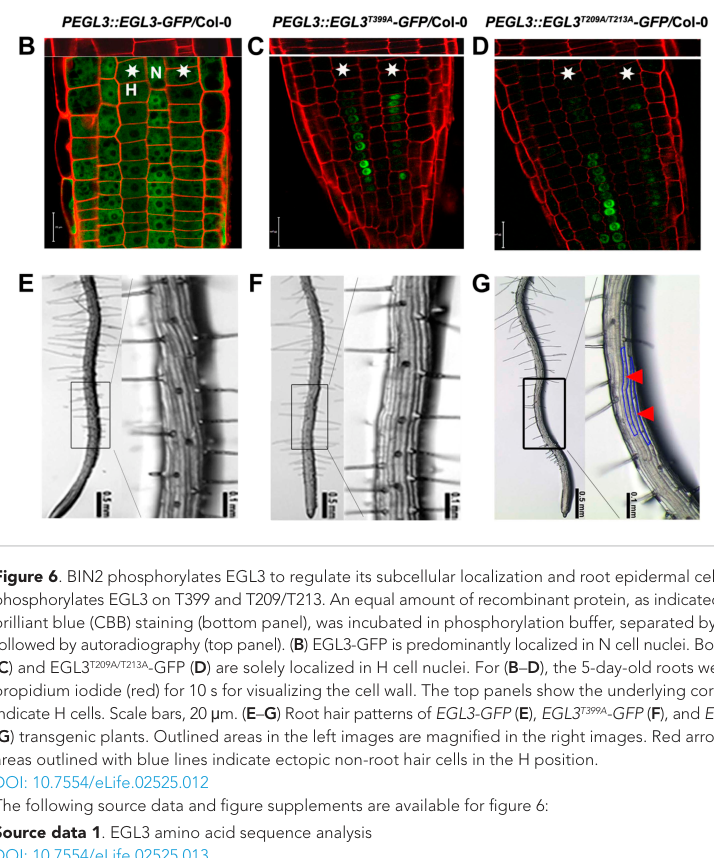

## Question

# Gene Research for Functional Annotation

## ⚠️ CRITICAL: Gene/Protein Identification Context

**BEFORE YOU BEGIN RESEARCH:** You MUST verify you are researching the CORRECT gene/protein. Gene symbols can be ambiguous, especially for less well-characterized genes from non-model organisms.

### Target Gene/Protein Identity (from UniProt):
- **UniProt Accession:** Q9CAD0
- **Protein Description:** RecName: Full=Transcription factor EGL1; AltName: Full=Basic helix-loop-helix protein 2; Short=AtMYC146; Short=AtbHLH2; Short=bHLH 2; AltName: Full=Protein ENHANCER OF GLABRA 3; AltName: Full=Transcription factor EN 30; AltName: Full=bHLH transcription factor bHLH002;
- **Gene Information:** Name=BHLH2; Synonyms=EGL1, EGL3, EN30, MYC146; OrderedLocusNames=At1g63650; ORFNames=F24D7.16;
- **Organism (full):** Arabidopsis thaliana (Mouse-ear cress).
- **Protein Family:** Not specified in UniProt
- **Key Domains:** bHLH-TF_ACT-like_plant. (IPR054502); bHLH_dom. (IPR011598); HLH_DNA-bd_sf. (IPR036638); MYC/MYB_N. (IPR025610); bHLH-MYC_N (PF14215)

### MANDATORY VERIFICATION STEPS:

1. **Check if the gene symbol "BHLH2" matches the protein description above**
2. **Verify the organism is correct:** Arabidopsis thaliana (Mouse-ear cress).
3. **Check if protein family/domains align with what you find in literature**
4. **If you find literature for a DIFFERENT gene with the same or similar symbol, STOP**

### If Gene Symbol is Ambiguous or You Cannot Find Relevant Literature:

**DO NOT PROCEED WITH RESEARCH ON A DIFFERENT GENE.** Instead:
- State clearly: "The gene symbol 'BHLH2' is ambiguous or literature is limited for this specific protein"
- Explain what you found (e.g., "Found extensive literature on a different gene with the same symbol in a different organism")
- Describe the protein based ONLY on the UniProt information provided above
- Suggest that the protein function can be inferred from domain/family information

### Research Target:

Please provide a comprehensive research report on the gene **BHLH2** (gene ID: EGL3, UniProt: Q9CAD0) in ARATH.

The research report should be a detailed narrative explaining the function, biological processes, and localization of the gene product. Citations should be given for all claims.

You should prioritize authoritative reviews and primary scientific literature when conducting research. You can supplement
this with annotations you find in gene/protein databases, but these can be outdated or inaccurate.

We are specifically interested in the primary function of the gene - for enzymes, what reaction is catalyzed, and what is the substrate specificity? For transporters, what is the substrate? For structural proteins or adapters, what is the broader structural role? For signaling molecules, what is the role in the pathway.

We are interested in where in or outside the cell the gene product carries out its function.

We are also interested in the signaling or biochemical pathways in which the gene functions. We are less interested in broad pleiotropic effects, except where these elucidate the precise role.

Include evidence where possible. We are interested in both experimental evidence as well as inference from structure, evolution, or bioinformatic analysis. Precise studies should be prioritized over high-throughput, where available.

## Output

Question: You are an expert researcher providing comprehensive, well-cited information.

Provide detailed information focusing on:
1. Key concepts and definitions with current understanding
2. Recent developments and latest research (prioritize 2023-2024 sources)
3. Current applications and real-world implementations
4. Expert opinions and analysis from authoritative sources
5. Relevant statistics and data from recent studies

Format as a comprehensive research report with proper citations. Include URLs and publication dates where available.
Always prioritize recent, authoritative sources and provide specific citations for all major claims.

# Gene Research for Functional Annotation

## ⚠️ CRITICAL: Gene/Protein Identification Context

**BEFORE YOU BEGIN RESEARCH:** You MUST verify you are researching the CORRECT gene/protein. Gene symbols can be ambiguous, especially for less well-characterized genes from non-model organisms.

### Target Gene/Protein Identity (from UniProt):
- **UniProt Accession:** Q9CAD0
- **Protein Description:** RecName: Full=Transcription factor EGL1; AltName: Full=Basic helix-loop-helix protein 2; Short=AtMYC146; Short=AtbHLH2; Short=bHLH 2; AltName: Full=Protein ENHANCER OF GLABRA 3; AltName: Full=Transcription factor EN 30; AltName: Full=bHLH transcription factor bHLH002;
- **Gene Information:** Name=BHLH2; Synonyms=EGL1, EGL3, EN30, MYC146; OrderedLocusNames=At1g63650; ORFNames=F24D7.16;
- **Organism (full):** Arabidopsis thaliana (Mouse-ear cress).
- **Protein Family:** Not specified in UniProt
- **Key Domains:** bHLH-TF_ACT-like_plant. (IPR054502); bHLH_dom. (IPR011598); HLH_DNA-bd_sf. (IPR036638); MYC/MYB_N. (IPR025610); bHLH-MYC_N (PF14215)

### MANDATORY VERIFICATION STEPS:

1. **Check if the gene symbol "BHLH2" matches the protein description above**
2. **Verify the organism is correct:** Arabidopsis thaliana (Mouse-ear cress).
3. **Check if protein family/domains align with what you find in literature**
4. **If you find literature for a DIFFERENT gene with the same or similar symbol, STOP**

### If Gene Symbol is Ambiguous or You Cannot Find Relevant Literature:

**DO NOT PROCEED WITH RESEARCH ON A DIFFERENT GENE.** Instead:
- State clearly: "The gene symbol 'BHLH2' is ambiguous or literature is limited for this specific protein"
- Explain what you found (e.g., "Found extensive literature on a different gene with the same symbol in a different organism")
- Describe the protein based ONLY on the UniProt information provided above
- Suggest that the protein function can be inferred from domain/family information

### Research Target:

Please provide a comprehensive research report on the gene **BHLH2** (gene ID: EGL3, UniProt: Q9CAD0) in ARATH.

The research report should be a detailed narrative explaining the function, biological processes, and localization of the gene product. Citations should be given for all claims.

You should prioritize authoritative reviews and primary scientific literature when conducting research. You can supplement
this with annotations you find in gene/protein databases, but these can be outdated or inaccurate.

We are specifically interested in the primary function of the gene - for enzymes, what reaction is catalyzed, and what is the substrate specificity? For transporters, what is the substrate? For structural proteins or adapters, what is the broader structural role? For signaling molecules, what is the role in the pathway.

We are interested in where in or outside the cell the gene product carries out its function.

We are also interested in the signaling or biochemical pathways in which the gene functions. We are less interested in broad pleiotropic effects, except where these elucidate the precise role.

Include evidence where possible. We are interested in both experimental evidence as well as inference from structure, evolution, or bioinformatic analysis. Precise studies should be prioritized over high-throughput, where available.

# Functional annotation of *Arabidopsis thaliana* EGL3/BHLH2

## Identity and principal function

**The protein of interest is EGL3 (ENHANCER OF GLABRA3), encoded by *At1g63650*, UniProt Q9CAD0—not the related protein GL3, encoded by *At5g41315*.** BHLH2/bHLH002 is an alternative name for this *Arabidopsis* protein, but “BHLH2” alone is insufficient to identify an organism or protein reliably. A 2023 comparative study independently identifies EGL3 as *At1g63650* and places it, separately from GL3, in the plant subgroup-IIIf basic helix–loop–helix (bHLH) transcription factors. Its conserved N-terminal MYB-interacting region, intervening WD40/acidic region, and C-terminal bHLH region agree with the domain architecture supplied for Q9CAD0. The MYB- and WD40-interaction assignments are supported by comparative sequence analysis, while the bHLH region supports a transcription-factor role; the domains do **not** imply enzymatic catalysis or a transported substrate. (zumajocardona2023evolutionarystudiesof pages 2-3, zumajocardona2023evolutionarystudiesof pages 5-6, zumajocardona2023evolutionarystudiesof pages 6-7)

**Primary functional annotation:** EGL3 is a context-dependent transcriptional regulator of epidermal cell fate. As the bHLH component of MYB–bHLH–WD40 (MBW) regulatory assemblies, it helps activate the developmental regulator *GLABRA2* (*GL2*). In shoots, this promotes trichome development; in roots, *GL2* expression specifies non-hair epidermal fate and therefore restricts root-hair formation. Partner availability, competing MYB repressors, phosphorylation, and protein distribution determine where this activity occurs. EGL3 has overlapping—but not interchangeable—functions with GL3. (chen2019glabra2acommon pages 3-5, morohashi2007participationofthe pages 4-6, morohashi2007participationofthe pages 1-2, cheng2014brassinosteroidscontrolroot pages 8-9)

## Molecular mechanism and biological pathways

**Trichome initiation and patterning.** The established model pairs EGL3 or GL3 with the R2R3-MYB factor GL1 and WD40-repeat protein TTG1 to activate *GL2* in selected shoot epidermal cells. This is more than an annotation inferred from sequence: in a *gl3 egl3* background, inducible EGL3 restored trichome formation, and chromatin immunoprecipitation detected EGL3 at the *GL2* promoter. The *gl3 egl3* double mutant is glabrous, illustrating functional overlap that can conceal EGL3 contributions in a single mutant. Short R3-MYB proteins compete with activating MYB partners for bHLH association, providing inhibitory feedback and helping space trichomes. Importantly, direct EGL3 association with *GL2* must not be expanded into a claim that EGL3 itself was shown to occupy every promoter occupied by GL3: the cited assay did **not** detect EGL3 at *TRY* or *GL3*, and its EGL3-specific evidence does not establish *CPC* or *ETC1* promoter occupancy. (mendezvigo2025thebhlhtranscription pages 8-9, morohashi2007participationofthe pages 4-6, morohashi2007participationofthe pages 6-8, morohashi2007participationofthe pages 1-2)

**Root-hair versus non-hair specification.** In the root epidermis, an activating WER–EGL3/GL3–TTG1 assembly promotes *GL2* and non-hair fate. The R3-MYB inhibitor CPC can compete with WER for bHLH association, reducing this activation and favoring hair fate; feedback and movement between neighboring cell files help establish the pattern. The *gl3 egl3* double mutant develops ectopic hairs in normally non-hair cell files. These findings describe cell-fate regulation, **not** an EGL3 function in the physical structure of a mature root hair. The proposed EGL3-dependent retention of CPC in hair-cell nuclei is supported by localization genetics, but the precise transport and trapping mechanism remains unresolved. (tominagawada2014regulationofroot pages 2-3, schiefelbein2014regulationofepidermal pages 2-3, morohashi2007participationofthe pages 1-2)

**Brassinosteroid input: an EGL3-specific mechanism.** The BR-signaling-associated GSK3-like kinase BIN2 physically associates with EGL3 in interaction assays and phosphorylates it in vitro. Mass spectrometry nominated EGL3 T209, T213, T399 and T403; alanine substitutions identified T209/T213 and T399 as major BIN2-responsive sites in the assays. Nonphosphorylatable EGL3 variants accumulated in hair-position nuclei rather than showing the normal distribution across hair and non-hair cells. The T209A/T213A variant significantly reduced root hairs and promoted inappropriate non-hair fate at hair positions, whereas T399A did not measurably alter patterning: nuclear retention alone therefore does not guarantee productive *GL2* activation. In transient *GL2*-promoter reporter experiments, WER plus EGL3 activated expression, TTG1 enhanced it, and active BIN2 suppressed the three-component output; BIN2 also phosphorylated TTG1. The authors’ model is that phosphorylation influences both EGL3 availability for intercellular redistribution and MBW activity, although protein movement was **inferred from transcript/protein distributions and mutant localization**, not visualized molecule by molecule. (cheng2014brassinosteroidscontrolroot pages 5-8, cheng2014brassinosteroidscontrolroot pages 11-12, cheng2014brassinosteroidscontrolroot pages 8-9)

**Jasmonate input and anthocyanins.** EGL3 also connects MBW regulation to jasmonate signaling. A primary interaction study found EGL3 association in yeast with **eight of twelve** tested JAZ repressors—JAZ1, JAZ2, JAZ5, JAZ6 and JAZ8–JAZ11—and observed nuclear EGL3–JAZ fluorescence complementation in transiently transformed *Nicotiana* cells. Interaction mapping implicated EGL3’s C-terminal region. These observations support JAZ-mediated restraint of EGL3-containing regulatory assemblies, but the transient experiments should not be read as a direct measurement of endogenous EGL3–JAZ activity in each *Arabidopsis* tissue. EGL3 can contribute to the MBW-dependent anthocyanin pathway: in a 2025 allele study, higher EGL3 transgene expression correlated with higher hypocotyl anthocyanin, while the Don-0 and Ler protein alleles had **no significant difference** in average anthocyanin content. Its role here is transcriptional regulation of pigment biosynthesis, not catalysis of a flavonoid reaction. (qi2011thejasmonatezimdomainproteins pages 3-6, mendezvigo2025thebhlhtranscription pages 5-7, qi2011thejasmonatezimdomainproteins pages 2-3)

**Seed coat: distinguish EGL3 from TT8.** A 2023 study found normal vanillin-detectable seed-coat proanthocyanidins in both *egl3* and *egl3 gl3* mutants, in contrast to the deficient *tt8* mutant. Ruthenium-red staining and seed-coat microscopy nevertheless supported contributions of these bHLH regulators to mucilage release and coat morphology, including altered walls in *egl3 gl3*. This is a more qualified assignment than calling EGL3 the principal seed-coat pigment regulator: the study found stronger seed expression of *TT8*, no detected *GL3* seed expression in its assay, and no detected *EGL3* expression in the seed endothelium. The exact EGL3-only effect on each mucilage layer was not quantitatively resolved in the available results. (zumajocardona2023evolutionarystudiesof pages 7-8, zumajocardona2023evolutionarystudiesof pages 8-10)

## Where EGL3 acts

**Its transcriptional action takes place in the nucleus, but EGL3 is not exclusively nuclear.** Native-promoter EGL3–GFP imaging of root epidermis found signal mainly in the cytosol of hair-position cells and stronger signal in neighboring non-hair cells, in both cytosol and nuclei. Because *EGL3* transcript was reported predominantly in hair-position cells, the protein distribution supports movement into non-hair cells, where nuclear EGL3 can contribute to the fate-specifying complex. Phosphorylation-site mutants instead accumulated in hair-cell nuclei. This evidence identifies an intracellular, developmentally regulated transcription factor; it does not support secretion or an extracellular site of action. The published Figure 6 directly documents the contrasting EGL3–GFP localization and associated root-hair phenotypes. (cheng2014brassinosteroidscontrolroot pages 9-11, cheng2014brassinosteroidscontrolroot pages 5-8, cheng2014brassinosteroidscontrolroot media 5698a41d)

Expression is tissue- and stage-dependent rather than confined to roots. A 2023 analysis reported EGL3 transcript in roots, leaves, inflorescences and siliques and detected expression in *Arabidopsis* fruit epidermis and embryo, but not seed endothelium in its localization assay. In the accessions analyzed in a later study, stem and flower-bud EGL3 transcript levels were approximately **two- to fivefold** those in leaves. Transcript location should not automatically be equated with the site of final nuclear protein accumulation, particularly in the root epidermis. (zumajocardona2023evolutionarystudiesof pages 5-6, zumajocardona2023evolutionarystudiesof pages 7-8, mendezvigo2025thebhlhtranscription pages 5-7)

## Recent research, interpretation and use

The **2023** evolutionary analysis confirmed that EGL3 and GL3 are distinct members of a conserved subgroup-IIIf bHLH lineage, while their different expression from TT8 helps explain divergent seed functions. Its proposal of an ancestral flavonoid-regulatory role is an **evolutionary inference**, not direct proof that EGL3 performs every TT8 function. The strongest recent EGL3-specific phenotype study located the natural fruit-trichome locus MAU1 in an approximately **3-kb interval containing *At1g63650*** and tested genomic EGL3 alleles from hairy-fruited Don-0 and Ler. Across **15 independent homozygous T3 lines per allele** in a sensitized genetic background, the Don-0 allele produced, on average, **three times** as many fruit trichomes. Its effect depended strongly on combinations with *TRY*, *TCL1* and *GL1*: an EGL3 gain-of-function allele alone was insufficient to explain the hairy-fruit phenotype. (zumajocardona2023evolutionarystudiesof pages 2-3, zumajocardona2023evolutionarystudiesof pages 4-5, mendezvigo2025thebhlhtranscription pages 2-3, mendezvigo2025thebhlhtranscription pages 3-5)

That study also reported a candidate **Asn12Ser** change in EGL3’s N-terminal MYB-interacting region. Mean expression did not differ significantly between the two genomic transgenes, making a protein-level effect plausible, **but the substitution has not been established as causal by an isolated amino-acid replacement experiment**. Don-0 EGL3 increased stem-trichome branching; the authors estimated that EGL3 accounted for **11–21%** of variation among branching classes in their transgenic analysis. The allele results show that engineering or selecting EGL3 could modify a trichome trait, but also show why background, interacting MYB loci and effects on other tissues must be assessed before extrapolating to crop performance. The directly demonstrated implementation is experimental introgression and transgenic complementation in *Arabidopsis*, not an established commercial application. (mendezvigo2025thebhlhtranscription pages 3-5, mendezvigo2025thebhlhtranscription pages 5-7, mendezvigo2025thebhlhtranscription pages 9-10)

The evidence base for **this particular gene** is therefore strongest for MBW-associated *GL2* regulation, epidermal patterning, regulated intracellular localization, and trichome development. Seed mucilage and pigment regulation are supported but more context-dependent; catalytic activity, extracellular action, a universal DNA-binding specificity, and a field-proven agricultural application have not been established by the studies reviewed. No retrieved 2024 study provided a stronger EGL3-specific mechanistic result than these direct experiments; results concerning GL3 or a similarly named protein in another species have not been treated as EGL3 data. (morohashi2007participationofthe pages 4-6, zumajocardona2023evolutionarystudiesof pages 7-8, cheng2014brassinosteroidscontrolroot pages 5-8, mendezvigo2025thebhlhtranscription pages 5-7)

The following table separates gene-specific observations from mechanistic inferences and lists the primary publications with dates and URLs.

| Process/context | EGL3-specific evidence: assay and quantitative result | Inference / limitation | Source |
|---|---|---|---|
| Direct transcriptional target in trichome initiation | In `gl3 egl3` plants carrying inducible EGL3–GR, dexamethasone restored trichome formation. Anti-GR ChIP after induction detected EGL3 recruitment to the **GL2** promoter. (morohashi2007participationofthe pages 4-6, morohashi2007participationofthe pages 6-8) | Supports direct EGL3 association with `GL2` regulatory DNA in an inducible system. EGL3 was not detected at `TRY` or `GL3`; EGL3-specific binding to `CPC` or `ETC1` was not established and must not be inferred from GL3 results. | Morohashi et al., 2007; [doi:10.1104/pp.107.104521](https://doi.org/10.1104/pp.107.104521) |
| Jasmonate-dependent repression of MBW activity | Y2H showed strong EGL3 interaction with **8 of 12 JAZ proteins**: JAZ1, JAZ2, JAZ5, JAZ6, JAZ8, JAZ9, JAZ10, and JAZ11. BiFC produced nuclear fluorescence for EGL3 with JAZ1 and JAZ10 in *Nicotiana benthamiana* epidermal cells; interaction mapped to EGL3’s C-terminal region. (qi2011thejasmonatezimdomainproteins pages 3-6, qi2011thejasmonatezimdomainproteins pages 2-3) | Establishes physical association in yeast and a transient heterologous plant system, consistent with JAZ repression of EGL3-containing MBW complexes. It does not measure native EGL3–JAZ occupancy or complex activity in Arabidopsis tissues. | Qi et al., 2011; [doi:10.1105/tpc.111.083261](https://doi.org/10.1105/tpc.111.083261) |
| Brassinosteroid signaling, phosphorylation, localization, and root epidermal fate | Y2H, GST pull-down, and BiFC supported BIN2–EGL3 interaction. In-vitro kinase assays and mass spectrometry identified T209, T213, T399, and T403; alanine substitutions showed **T209/T213 and T399** to be major BIN2-dependent sites. Native-promoter EGL3–GFP was mainly cytosolic in H cells and nuclear/cytosolic in N cells, whereas T399A and T209A/T213A variants were retained in H-cell nuclei. T209A/T213A significantly reduced root hairs by promoting non-hair fate at H positions; T399A did not measurably alter patterning. (cheng2014brassinosteroidscontrolroot pages 9-11, cheng2014brassinosteroidscontrolroot pages 5-8, cheng2014brassinosteroidscontrolroot media 5698a41d) | Supports a model in which BIN2 phosphorylation promotes cytoplasmic availability and H-to-N movement of EGL3. Movement was inferred from EGL3 transcript and protein distributions rather than tracked molecule by molecule. T399A nuclear retention without a fate phenotype shows that localization alone is insufficient for transcriptional output. | Cheng et al., 2014; [doi:10.7554/eLife.02525](https://doi.org/10.7554/eLife.02525) |
| Seed proanthocyanidins and mucilage | Vanillin staining showed that `egl3` and `egl3 gl3` seeds retained proanthocyanidins like wild type, unlike `tt8`. Ruthenium-red staining indicated reduced mucilage release across tested mutants, and `egl3 gl3` seed coats displayed altered columella and cell-wall morphology by SEM. (zumajocardona2023evolutionarystudiesof pages 7-8, zumajocardona2023evolutionarystudiesof pages 8-10) | EGL3 is not required singly for seed-coat proanthocyanidin accumulation. The study supports a redundant contribution to mucilage production or extrusion, but does not provide a clear EGL3-only quantitative effect or robustly separate soluble from adherent mucilage. EGL3 expression was detected in fruit epidermis and embryo, not seed endothelium. | Zumajo-Cardona et al., 2023; [doi:10.1093/aob/mcad097](https://doi.org/10.1093/aob/mcad097) |
| Natural variation in fruit trichomes | Fine mapping localized MAU1 to an approximately **3-kb** interval containing `AT1G63650/EGL3`. In the IL-25 background, **15 independent homozygous T3 lines per allele** carrying EGL3-Don-0 averaged **3-fold more fruit trichomes** than EGL3-Ler lines. Don-0 and Ler transgenes did not differ in mean expression, while sequence comparison found an **N12S** substitution in the N-terminal MYC/MYB-interacting region. (mendezvigo2025thebhlhtranscription pages 3-5, mendezvigo2025thebhlhtranscription pages 5-7) | Demonstrates a semidominant, hypermorphic Don-0 EGL3 allele whose fruit phenotype depends strongly on genetic background and epistasis with `TRY`, `TCL1`, and `GL1`. N12S is the leading structural candidate, but it was not isolated by site-directed allele replacement and is therefore **not proven causal**. | Méndez-Vigo et al., 2025; [doi:10.1093/plphys/kiae673](https://doi.org/10.1093/plphys/kiae673) |

*Table: Gene-specific evidence for Arabidopsis At1g63650/EGL3 (Q9CAD0), emphasizing direct assays, quantitative findings, and interpretive limits. Results attributed only to the paralog GL3 are explicitly excluded.*

References

1. (zumajocardona2023evolutionarystudiesof pages 2-3): Cecilia Zumajo-Cardona, Flavio Gabrieli, Jovannemar Anire, Emidio Albertini, Ignacio Ezquer, and Lucia Colombo. Evolutionary studies of the bhlh transcription factors belonging to mbw complex: their role in seed development. Annals of botany, 132:383-400, Jul 2023. URL: https://doi.org/10.1093/aob/mcad097, doi:10.1093/aob/mcad097. This article has 34 citations and is from a domain leading peer-reviewed journal.

2. (zumajocardona2023evolutionarystudiesof pages 5-6): Cecilia Zumajo-Cardona, Flavio Gabrieli, Jovannemar Anire, Emidio Albertini, Ignacio Ezquer, and Lucia Colombo. Evolutionary studies of the bhlh transcription factors belonging to mbw complex: their role in seed development. Annals of botany, 132:383-400, Jul 2023. URL: https://doi.org/10.1093/aob/mcad097, doi:10.1093/aob/mcad097. This article has 34 citations and is from a domain leading peer-reviewed journal.

3. (zumajocardona2023evolutionarystudiesof pages 6-7): Cecilia Zumajo-Cardona, Flavio Gabrieli, Jovannemar Anire, Emidio Albertini, Ignacio Ezquer, and Lucia Colombo. Evolutionary studies of the bhlh transcription factors belonging to mbw complex: their role in seed development. Annals of botany, 132:383-400, Jul 2023. URL: https://doi.org/10.1093/aob/mcad097, doi:10.1093/aob/mcad097. This article has 34 citations and is from a domain leading peer-reviewed journal.

4. (chen2019glabra2acommon pages 3-5): Siyu Chen and Shucai Wang. Glabra2, a common regulator for epidermal cell fate determination and anthocyanin biosynthesis in arabidopsis. International Journal of Molecular Sciences, 20:4997, Oct 2019. URL: https://doi.org/10.3390/ijms20204997, doi:10.3390/ijms20204997. This article has 58 citations.

5. (morohashi2007participationofthe pages 4-6): Kengo Morohashi, Mingzhe Zhao, Manli Yang, Betsy Read, Alan Lloyd, Rebecca Lamb, and Erich Grotewold. Participation of the arabidopsis bhlh factor gl3 in trichome initiation regulatory events1[w][oa]. Plant Physiology, 145:736-746, Sep 2007. URL: https://doi.org/10.1104/pp.107.104521, doi:10.1104/pp.107.104521. This article has 254 citations and is from a highest quality peer-reviewed journal.

6. (morohashi2007participationofthe pages 1-2): Kengo Morohashi, Mingzhe Zhao, Manli Yang, Betsy Read, Alan Lloyd, Rebecca Lamb, and Erich Grotewold. Participation of the arabidopsis bhlh factor gl3 in trichome initiation regulatory events1[w][oa]. Plant Physiology, 145:736-746, Sep 2007. URL: https://doi.org/10.1104/pp.107.104521, doi:10.1104/pp.107.104521. This article has 254 citations and is from a highest quality peer-reviewed journal.

7. (cheng2014brassinosteroidscontrolroot pages 8-9): Yinwei Cheng, Wenjiao Zhu, Yuxiao Chen, Shinsaku Ito, Tadao Asami, and Xuelu Wang. Brassinosteroids control root epidermal cell fate via direct regulation of a myb-bhlh-wd40 complex by gsk3-like kinases. eLife, Apr 2014. URL: https://doi.org/10.7554/elife.02525, doi:10.7554/elife.02525. This article has 172 citations and is from a domain leading peer-reviewed journal.

8. (mendezvigo2025thebhlhtranscription pages 8-9): Belén Méndez-Vigo, Noelia Arteaga, Alba Murillo-Sánchez, Sonia Alba, and Carlos Alonso-Blanco. The bhlh transcription factor gene <i>egl3</i> accounts for the natural diversity in arabidopsis fruit trichome pattern and morphology. Plant Physiology, Dec 2025. URL: https://doi.org/10.1093/plphys/kiae673, doi:10.1093/plphys/kiae673. This article has 9 citations and is from a highest quality peer-reviewed journal.

9. (morohashi2007participationofthe pages 6-8): Kengo Morohashi, Mingzhe Zhao, Manli Yang, Betsy Read, Alan Lloyd, Rebecca Lamb, and Erich Grotewold. Participation of the arabidopsis bhlh factor gl3 in trichome initiation regulatory events1[w][oa]. Plant Physiology, 145:736-746, Sep 2007. URL: https://doi.org/10.1104/pp.107.104521, doi:10.1104/pp.107.104521. This article has 254 citations and is from a highest quality peer-reviewed journal.

10. (tominagawada2014regulationofroot pages 2-3): Rumi Tominaga-Wada and Takuji Wada. Regulation of root hair cell differentiation by r3 myb transcription factors in tomato and arabidopsis. Frontiers in Plant Science, Mar 2014. URL: https://doi.org/10.3389/fpls.2014.00091, doi:10.3389/fpls.2014.00091. This article has 61 citations.

11. (schiefelbein2014regulationofepidermal pages 2-3): John Schiefelbein, Ling Huang, and Xiaohua Zheng. Regulation of epidermal cell fate in arabidopsis roots: the importance of multiple feedback loops. Frontiers in Plant Science, Jan 2014. URL: https://doi.org/10.3389/fpls.2014.00047, doi:10.3389/fpls.2014.00047. This article has 143 citations.

12. (cheng2014brassinosteroidscontrolroot pages 5-8): Yinwei Cheng, Wenjiao Zhu, Yuxiao Chen, Shinsaku Ito, Tadao Asami, and Xuelu Wang. Brassinosteroids control root epidermal cell fate via direct regulation of a myb-bhlh-wd40 complex by gsk3-like kinases. eLife, Apr 2014. URL: https://doi.org/10.7554/elife.02525, doi:10.7554/elife.02525. This article has 172 citations and is from a domain leading peer-reviewed journal.

13. (cheng2014brassinosteroidscontrolroot pages 11-12): Yinwei Cheng, Wenjiao Zhu, Yuxiao Chen, Shinsaku Ito, Tadao Asami, and Xuelu Wang. Brassinosteroids control root epidermal cell fate via direct regulation of a myb-bhlh-wd40 complex by gsk3-like kinases. eLife, Apr 2014. URL: https://doi.org/10.7554/elife.02525, doi:10.7554/elife.02525. This article has 172 citations and is from a domain leading peer-reviewed journal.

14. (qi2011thejasmonatezimdomainproteins pages 3-6): Tian-Cong Qi, Su-Sheng Song, Qingcuo Ren, De-Wei Wu, Huang Huang, Yan Chen, Meng Fan, Wen Peng, C. Ren, and Dao-Xin Xie. The jasmonate-zim-domain proteins interact with the wd-repeat/bhlh/myb complexes to regulate jasmonate-mediated anthocyanin accumulation and trichome initiation in arabidopsis thaliana[c][w]. Plant Cell, 23:1795-1814, May 2011. URL: https://doi.org/10.1105/tpc.111.083261, doi:10.1105/tpc.111.083261. This article has 1098 citations and is from a highest quality peer-reviewed journal.

15. (mendezvigo2025thebhlhtranscription pages 5-7): Belén Méndez-Vigo, Noelia Arteaga, Alba Murillo-Sánchez, Sonia Alba, and Carlos Alonso-Blanco. The bhlh transcription factor gene <i>egl3</i> accounts for the natural diversity in arabidopsis fruit trichome pattern and morphology. Plant Physiology, Dec 2025. URL: https://doi.org/10.1093/plphys/kiae673, doi:10.1093/plphys/kiae673. This article has 9 citations and is from a highest quality peer-reviewed journal.

16. (qi2011thejasmonatezimdomainproteins pages 2-3): Tian-Cong Qi, Su-Sheng Song, Qingcuo Ren, De-Wei Wu, Huang Huang, Yan Chen, Meng Fan, Wen Peng, C. Ren, and Dao-Xin Xie. The jasmonate-zim-domain proteins interact with the wd-repeat/bhlh/myb complexes to regulate jasmonate-mediated anthocyanin accumulation and trichome initiation in arabidopsis thaliana[c][w]. Plant Cell, 23:1795-1814, May 2011. URL: https://doi.org/10.1105/tpc.111.083261, doi:10.1105/tpc.111.083261. This article has 1098 citations and is from a highest quality peer-reviewed journal.

17. (zumajocardona2023evolutionarystudiesof pages 7-8): Cecilia Zumajo-Cardona, Flavio Gabrieli, Jovannemar Anire, Emidio Albertini, Ignacio Ezquer, and Lucia Colombo. Evolutionary studies of the bhlh transcription factors belonging to mbw complex: their role in seed development. Annals of botany, 132:383-400, Jul 2023. URL: https://doi.org/10.1093/aob/mcad097, doi:10.1093/aob/mcad097. This article has 34 citations and is from a domain leading peer-reviewed journal.

18. (zumajocardona2023evolutionarystudiesof pages 8-10): Cecilia Zumajo-Cardona, Flavio Gabrieli, Jovannemar Anire, Emidio Albertini, Ignacio Ezquer, and Lucia Colombo. Evolutionary studies of the bhlh transcription factors belonging to mbw complex: their role in seed development. Annals of botany, 132:383-400, Jul 2023. URL: https://doi.org/10.1093/aob/mcad097, doi:10.1093/aob/mcad097. This article has 34 citations and is from a domain leading peer-reviewed journal.

19. (cheng2014brassinosteroidscontrolroot pages 9-11): Yinwei Cheng, Wenjiao Zhu, Yuxiao Chen, Shinsaku Ito, Tadao Asami, and Xuelu Wang. Brassinosteroids control root epidermal cell fate via direct regulation of a myb-bhlh-wd40 complex by gsk3-like kinases. eLife, Apr 2014. URL: https://doi.org/10.7554/elife.02525, doi:10.7554/elife.02525. This article has 172 citations and is from a domain leading peer-reviewed journal.

20. (cheng2014brassinosteroidscontrolroot media 5698a41d): Yinwei Cheng, Wenjiao Zhu, Yuxiao Chen, Shinsaku Ito, Tadao Asami, and Xuelu Wang. Brassinosteroids control root epidermal cell fate via direct regulation of a myb-bhlh-wd40 complex by gsk3-like kinases. eLife, Apr 2014. URL: https://doi.org/10.7554/elife.02525, doi:10.7554/elife.02525. This article has 172 citations and is from a domain leading peer-reviewed journal.

21. (zumajocardona2023evolutionarystudiesof pages 4-5): Cecilia Zumajo-Cardona, Flavio Gabrieli, Jovannemar Anire, Emidio Albertini, Ignacio Ezquer, and Lucia Colombo. Evolutionary studies of the bhlh transcription factors belonging to mbw complex: their role in seed development. Annals of botany, 132:383-400, Jul 2023. URL: https://doi.org/10.1093/aob/mcad097, doi:10.1093/aob/mcad097. This article has 34 citations and is from a domain leading peer-reviewed journal.

22. (mendezvigo2025thebhlhtranscription pages 2-3): Belén Méndez-Vigo, Noelia Arteaga, Alba Murillo-Sánchez, Sonia Alba, and Carlos Alonso-Blanco. The bhlh transcription factor gene <i>egl3</i> accounts for the natural diversity in arabidopsis fruit trichome pattern and morphology. Plant Physiology, Dec 2025. URL: https://doi.org/10.1093/plphys/kiae673, doi:10.1093/plphys/kiae673. This article has 9 citations and is from a highest quality peer-reviewed journal.

23. (mendezvigo2025thebhlhtranscription pages 3-5): Belén Méndez-Vigo, Noelia Arteaga, Alba Murillo-Sánchez, Sonia Alba, and Carlos Alonso-Blanco. The bhlh transcription factor gene <i>egl3</i> accounts for the natural diversity in arabidopsis fruit trichome pattern and morphology. Plant Physiology, Dec 2025. URL: https://doi.org/10.1093/plphys/kiae673, doi:10.1093/plphys/kiae673. This article has 9 citations and is from a highest quality peer-reviewed journal.

24. (mendezvigo2025thebhlhtranscription pages 9-10): Belén Méndez-Vigo, Noelia Arteaga, Alba Murillo-Sánchez, Sonia Alba, and Carlos Alonso-Blanco. The bhlh transcription factor gene <i>egl3</i> accounts for the natural diversity in arabidopsis fruit trichome pattern and morphology. Plant Physiology, Dec 2025. URL: https://doi.org/10.1093/plphys/kiae673, doi:10.1093/plphys/kiae673. This article has 9 citations and is from a highest quality peer-reviewed journal.

## Artifacts

- [Edison artifact artifact-00](EGL3-deep-research-falcon_artifacts/artifact-00.md)

## Citations

1. zumajocardona2023evolutionarystudiesof pages 2-3
2. zumajocardona2023evolutionarystudiesof pages 5-6
3. zumajocardona2023evolutionarystudiesof pages 6-7
4. morohashi2007participationofthe pages 4-6
5. morohashi2007participationofthe pages 1-2
6. cheng2014brassinosteroidscontrolroot pages 8-9
7. mendezvigo2025thebhlhtranscription pages 8-9
8. morohashi2007participationofthe pages 6-8
9. tominagawada2014regulationofroot pages 2-3
10. schiefelbein2014regulationofepidermal pages 2-3
11. cheng2014brassinosteroidscontrolroot pages 5-8
12. cheng2014brassinosteroidscontrolroot pages 11-12
13. qi2011thejasmonatezimdomainproteins pages 3-6
14. mendezvigo2025thebhlhtranscription pages 5-7
15. qi2011thejasmonatezimdomainproteins pages 2-3
16. zumajocardona2023evolutionarystudiesof pages 7-8
17. zumajocardona2023evolutionarystudiesof pages 8-10
18. cheng2014brassinosteroidscontrolroot pages 9-11
19. zumajocardona2023evolutionarystudiesof pages 4-5
20. mendezvigo2025thebhlhtranscription pages 2-3
21. mendezvigo2025thebhlhtranscription pages 3-5
22. mendezvigo2025thebhlhtranscription pages 9-10
23. doi:10.1104/pp.107.104521
24. doi:10.1105/tpc.111.083261
25. doi:10.7554/eLife.02525
26. doi:10.1093/aob/mcad097
27. doi:10.1093/plphys/kiae673
28. w
29. oa
30. c
31. https://doi.org/10.1104/pp.107.104521
32. https://doi.org/10.1105/tpc.111.083261
33. https://doi.org/10.7554/eLife.02525
34. https://doi.org/10.1093/aob/mcad097
35. https://doi.org/10.1093/plphys/kiae673
36. https://doi.org/10.1093/aob/mcad097,
37. https://doi.org/10.3390/ijms20204997,
38. https://doi.org/10.1104/pp.107.104521,
39. https://doi.org/10.7554/elife.02525,
40. https://doi.org/10.1093/plphys/kiae673,
41. https://doi.org/10.3389/fpls.2014.00091,
42. https://doi.org/10.3389/fpls.2014.00047,
43. https://doi.org/10.1105/tpc.111.083261,