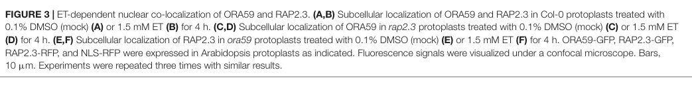

## Question

# Gene Research for Functional Annotation

## ⚠️ CRITICAL: Gene/Protein Identification Context

**BEFORE YOU BEGIN RESEARCH:** You MUST verify you are researching the CORRECT gene/protein. Gene symbols can be ambiguous, especially for less well-characterized genes from non-model organisms.

### Target Gene/Protein Identity (from UniProt):
- **UniProt Accession:** Q9LND1
- **Protein Description:** RecName: Full=Ethylene-responsive transcription factor ERF094; AltName: Full=Protein OCTADECANOID-RESPONSIVE ARABIDOPSIS AP2/ERF 59;
- **Gene Information:** Name=ERF094; Synonyms=ORA59; OrderedLocusNames=At1g06160; ORFNames=F9P14.2;
- **Organism (full):** Arabidopsis thaliana (Mouse-ear cress).
- **Protein Family:** Belongs to the AP2/ERF transcription factor family. ERF
- **Key Domains:** AP2/ERF_dom. (IPR001471); AP2/ERF_dom_sf. (IPR036955); DNA-bd_dom_sf. (IPR016177); ERF_plant. (IPR044808); AP2 (PF00847)

### MANDATORY VERIFICATION STEPS:

1. **Check if the gene symbol "ERF094" matches the protein description above**
2. **Verify the organism is correct:** Arabidopsis thaliana (Mouse-ear cress).
3. **Check if protein family/domains align with what you find in literature**
4. **If you find literature for a DIFFERENT gene with the same or similar symbol, STOP**

### If Gene Symbol is Ambiguous or You Cannot Find Relevant Literature:

**DO NOT PROCEED WITH RESEARCH ON A DIFFERENT GENE.** Instead:
- State clearly: "The gene symbol 'ERF094' is ambiguous or literature is limited for this specific protein"
- Explain what you found (e.g., "Found extensive literature on a different gene with the same symbol in a different organism")
- Describe the protein based ONLY on the UniProt information provided above
- Suggest that the protein function can be inferred from domain/family information

### Research Target:

Please provide a comprehensive research report on the gene **ERF094** (gene ID: ERF094, UniProt: Q9LND1) in ARATH.

The research report should be a detailed narrative explaining the function, biological processes, and localization of the gene product. Citations should be given for all claims.

You should prioritize authoritative reviews and primary scientific literature when conducting research. You can supplement
this with annotations you find in gene/protein databases, but these can be outdated or inaccurate.

We are specifically interested in the primary function of the gene - for enzymes, what reaction is catalyzed, and what is the substrate specificity? For transporters, what is the substrate? For structural proteins or adapters, what is the broader structural role? For signaling molecules, what is the role in the pathway.

We are interested in where in or outside the cell the gene product carries out its function.

We are also interested in the signaling or biochemical pathways in which the gene functions. We are less interested in broad pleiotropic effects, except where these elucidate the precise role.

Include evidence where possible. We are interested in both experimental evidence as well as inference from structure, evolution, or bioinformatic analysis. Precise studies should be prioritized over high-throughput, where available.

## Output

Question: You are an expert researcher providing comprehensive, well-cited information.

Provide detailed information focusing on:
1. Key concepts and definitions with current understanding
2. Recent developments and latest research (prioritize 2023-2024 sources)
3. Current applications and real-world implementations
4. Expert opinions and analysis from authoritative sources
5. Relevant statistics and data from recent studies

Format as a comprehensive research report with proper citations. Include URLs and publication dates where available.
Always prioritize recent, authoritative sources and provide specific citations for all major claims.

# Gene Research for Functional Annotation

## ⚠️ CRITICAL: Gene/Protein Identification Context

**BEFORE YOU BEGIN RESEARCH:** You MUST verify you are researching the CORRECT gene/protein. Gene symbols can be ambiguous, especially for less well-characterized genes from non-model organisms.

### Target Gene/Protein Identity (from UniProt):
- **UniProt Accession:** Q9LND1
- **Protein Description:** RecName: Full=Ethylene-responsive transcription factor ERF094; AltName: Full=Protein OCTADECANOID-RESPONSIVE ARABIDOPSIS AP2/ERF 59;
- **Gene Information:** Name=ERF094; Synonyms=ORA59; OrderedLocusNames=At1g06160; ORFNames=F9P14.2;
- **Organism (full):** Arabidopsis thaliana (Mouse-ear cress).
- **Protein Family:** Belongs to the AP2/ERF transcription factor family. ERF
- **Key Domains:** AP2/ERF_dom. (IPR001471); AP2/ERF_dom_sf. (IPR036955); DNA-bd_dom_sf. (IPR016177); ERF_plant. (IPR044808); AP2 (PF00847)

### MANDATORY VERIFICATION STEPS:

1. **Check if the gene symbol "ERF094" matches the protein description above**
2. **Verify the organism is correct:** Arabidopsis thaliana (Mouse-ear cress).
3. **Check if protein family/domains align with what you find in literature**
4. **If you find literature for a DIFFERENT gene with the same or similar symbol, STOP**

### If Gene Symbol is Ambiguous or You Cannot Find Relevant Literature:

**DO NOT PROCEED WITH RESEARCH ON A DIFFERENT GENE.** Instead:
- State clearly: "The gene symbol 'ERF094' is ambiguous or literature is limited for this specific protein"
- Explain what you found (e.g., "Found extensive literature on a different gene with the same symbol in a different organism")
- Describe the protein based ONLY on the UniProt information provided above
- Suggest that the protein function can be inferred from domain/family information

### Research Target:

Please provide a comprehensive research report on the gene **ERF094** (gene ID: ERF094, UniProt: Q9LND1) in ARATH.

The research report should be a detailed narrative explaining the function, biological processes, and localization of the gene product. Citations should be given for all claims.

You should prioritize authoritative reviews and primary scientific literature when conducting research. You can supplement
this with annotations you find in gene/protein databases, but these can be outdated or inaccurate.

We are specifically interested in the primary function of the gene - for enzymes, what reaction is catalyzed, and what is the substrate specificity? For transporters, what is the substrate? For structural proteins or adapters, what is the broader structural role? For signaling molecules, what is the role in the pathway.

We are interested in where in or outside the cell the gene product carries out its function.

We are also interested in the signaling or biochemical pathways in which the gene functions. We are less interested in broad pleiotropic effects, except where these elucidate the precise role.

Include evidence where possible. We are interested in both experimental evidence as well as inference from structure, evolution, or bioinformatic analysis. Precise studies should be prioritized over high-throughput, where available.

# Functional annotation of Arabidopsis ERF094/ORA59

## Identity and principal function

The supplied UniProt accession **Q9LND1** identifies **ERF094**, also called **ORA59**, at *Arabidopsis thaliana* locus **At1g06160**. Independent primary literature confirms the organism, ORA59–At1g06160 assignment, and classification as a group IX AP2/ERF transcription factor. The synonym ERF094 and accession Q9LND1 come from the supplied UniProt record; the papers examined generally use **ORA59**. Importantly, ORA59 is distinct from **ERF1/At3g23240** and from other similarly named ERFs. Its supplied AP2/ERF DNA-binding-domain annotation is consistent with experimental promoter binding. (pre2008theap2erfdomain pages 1-2, huang2016ethyleneresponsefactors pages 6-7, pre2008theap2erfdomain pages 6-8, zarei2011twogccboxes pages 4-5)

**Primary molecular function:** ORA59 is a sequence-specific **transcriptional activator**, not an enzyme or transporter. It converts jasmonate (JA) and ethylene (ET) signaling into expression of selected defense genes by binding promoter cis-elements and engaging transcriptional cofactors. Its experimentally established DNA specificities include the **GCC box** (GCCGCC) and an ethylene-response element (ERE) represented by **AWTTCAAA**; JA/MeJA preferentially supports GCC-box-associated responses, whereas ET or its precursor ACC preferentially supports ERE-associated responses. This is a conditional preference, not an absolute separation of JA and ET targets. (zareiUnknownyeartwogccboxes pages 1-6, yang2021thetranscriptionfactor pages 13-15, yang2021thetranscriptionfactor pages 7-9)

The following table separates directly tested regulatory targets and interactions from broader gene-expression associations. (zarei2011twogccboxes pages 5-6, yang2021thetranscriptionfactor pages 7-9, li2018jasmonicacidethylenesignaling pages 4-7, kim2018ap2erffamilytranscription pages 3-5)

| Direct target or interaction | Experiment and mechanistic detail | Interpretation / evidence quality | Year / DOI |
|---|---|---|---|
| **PDF1.2 promoter — two GCC elements** | ORA59 activated a *PDF1.2* promoter reporter approximately **40-fold** in Arabidopsis protoplasts. The canonical GCC box at −262/−257 and GCC-like element at −222/−214 were functionally equivalent: mutating either reduced activation about twofold, whereas mutating both reduced it five- to sixfold. EMSA demonstrated direct binding, ChIP demonstrated in-vivo promoter occupancy, and stable promoter-mutant lines established that both elements are required for JA/ethephon responsiveness. (zarei2011twogccboxes pages 4-5, zarei2011twogccboxes pages 5-6) | **High-confidence direct transcriptional target:** supported by biochemical binding, cellular transactivation, chromatin occupancy, and stable-plant cis-element mutagenesis. | **2011** — [10.1007/s11103-010-9728-y](https://doi.org/10.1007/s11103-010-9728-y) |
| **GLIP1 promoter — ERE motifs, with comparison to GCC binding** | ORA59 bound ERE sequences represented by **AWTTCAAA**, including tested ATTTCAAA and AATTCAAA variants, and activated ERE-containing reporters. EMSA and ChIP-qPCR supported direct binding to ERE-containing *GLIP1* promoter regions. ACC/ethylene favored ERE-associated binding and transcription, whereas MeJA favored GCC-box activity; phosphatase treatment reduced binding and eliminated hormone-dependent preference. (yang2021thetranscriptionfactor pages 7-9) | **High-confidence direct target and dual-specificity mechanism.** Hormone-associated phosphorylation was observed, but the responsible kinase and distinct causal phosphosites were not established. | **2021** — [10.1093/plphys/kiab437](https://doi.org/10.1093/plphys/kiab437) |
| **AtACT promoter — two GCC boxes, MED25, ORA59 homodimer, and EDLL Leu228** | *AtACT* is a **separate gene encoding agmatine coumaroyl transferase**, an enzyme in hydroxycinnamic-acid-amide biosynthesis; it is not ORA59 itself. ORA59 bound two adjacent promoter GCC boxes at −197/−193 and −190/−186 and activated an *AtACT* reporter approximately **50-fold**. EMSA/ChIP, promoter mutagenesis, Y2H/BiFC, and mutant assays support a complex involving an ORA59 homodimer and MED25. Substitution of EDLL-motif **Leu228** impaired transcriptional activation without abolishing dimerization or MED25 interaction; ORA59 activity increased p-coumaroylagmatine (CouAgm). (li2018jasmonicacidethylenesignaling pages 4-7, li2018jasmonicacidethylenesignaling pages 10-13) | **High-confidence direct regulatory module:** convergent promoter-binding, cis-mutagenesis, protein-interaction, genetic, and metabolite evidence. Leu228 appears to support activation rather than partner binding. | **2018** — [10.1111/tpj.13960](https://doi.org/10.1111/tpj.13960) |
| **RAP2.3 interaction and localization** | Y2H, GST pull-down, and BiFC supported physical interaction between ORA59 and RAP2.3, with BiFC signal in the nucleus. Fluorescent fusions in Arabidopsis protoplasts were largely cytosolic under mock conditions but became predominantly nuclear after **1.5 mM ethephon for 4 h**. ORA59 nuclear translocation remained intact in *rap2.3* and vice versa, showing that interaction is not required for import. Genetic crosses indicated that ORA59-dependent ethylene responses and resistance to *Pectobacterium carotovorum* require RAP2.3. (kim2018ap2erffamilytranscription pages 3-5, kim2018ap2erffamilytranscription media f0d4be4b) | **Strong interaction/localization evidence**, including orthogonal physical assays, imaging, and genetic epistasis. Localization derives from transient fluorescent-fusion experiments rather than endogenous-protein imaging. | **2018** — [10.3389/fpls.2018.01675](https://doi.org/10.3389/fpls.2018.01675) |

*Table: Direct targets and protein interactions experimentally established for Arabidopsis Q9LND1/At1g06160/ORA59. The table distinguishes direct mechanistic evidence from interpretations and records key quantitative results.*

## Cellular location and mechanism

ORA59 carries out its promoter-binding function **in the nucleus**. Fluorescent-fusion experiments in Arabidopsis protoplasts detected ORA59 outside the nucleus under mock conditions and predominantly in the nucleus after ethylene-releasing treatment; nuclear ORA59–RAP2.3 interaction was also supported by bimolecular fluorescence complementation. These results establish signal-responsive nuclear localization in that experimental system, rather than proving that endogenous ORA59 is exclusively nuclear in every tissue or condition. The cropped localization panels of **Kim and colleagues’ Figure 3** illustrate the mock-versus-ethylene comparison. (kim2018ap2erffamilytranscription pages 3-5, kim2018ap2erffamilytranscription pages 5-7, kim2018ap2erffamilytranscription media f0d4be4b)

ORA59 binds the *PDF1.2* promoter both in vitro and in plant chromatin. Its two relevant GCC elements support JA/ET-responsive transcription: mutating either impairs activation, while a synthetic GCC-box tetramer can confer hormone responsiveness. For the separate metabolic gene *AtACT*, promoter binding, cis-element mutations, ORA59 homodimerization, and MEDIATOR25 (**MED25**) interaction support a transcriptional-activation module. Substituting **Leu228** in ORA59’s EDLL activation motif diminishes *AtACT* activation without eliminating the tested MED25 interaction or homodimerization. **AtACT is the enzyme-encoding target gene; ORA59 itself does not catalyze hydroxycinnamic-acid-amide synthesis.** (zareiUnknownyeartwogccboxes pages 1-6, li2018jasmonicacidethylenesignaling pages 10-13, li2018jasmonicacidethylenesignaling pages 7-10, li2018jasmonicacidethylenesignaling pages 4-7)

A 2021 study extended the original GCC-only model: ORA59 also occupies ERE-containing regions of the ethylene-responsive *GLIP1* promoter and can regulate different promoter elements according to hormone context. Hormone treatment increased detectable ORA59 phosphorylation; phosphatase treatment reduced DNA binding and eliminated the observed hormone-dependent binding preference. These experiments support a role for phosphorylation, but **the responsible kinases and distinct causal phosphorylation sites remain unestablished** in the cited evidence. (yang2021thetranscriptionfactor pages 7-9, yang2021thetranscriptionfactor pages 15-16)

## Signaling pathways and biological output

**JA–ET defense branch.** JA and ethylene each induce *ORA59* expression, and combined treatment produces stronger, sustained induction. Full induction depends on intact JA and ET signaling: it is impaired in **coi1** and **ein2** backgrounds. In one hormone-treatment experiment, the combined treatment yielded approximately **tenfold ORA59 mRNA induction** in controls. ORA59 loss or silencing compromises induction of *PDF1.2* and selected other defense genes, whereas overexpression enhances resistance to the necrotrophic fungus *Botrytis cinerea*. Thus, the strongest established pathway assignment is a positive regulator of a **subset** of JA/ET-responsive antimicrobial transcription, rather than a universal regulator of all jasmonate outputs. (pre2008theap2erfdomain pages 1-2, pre2008theap2erfdomain pages 5-6, pre2008theap2erfdomain pages 3-5)

**Defense-metabolite branch.** ORA59 directly activates *AtACT*, which encodes an acyltransferase involved in hydroxycinnamic-acid-amide synthesis. JA plus ET promotes *AtACT* expression and accumulation of the antimicrobial metabolite **p-coumaroylagmatine**; genetic, promoter-binding and metabolite measurements connect ORA59/MED25-dependent transcription with this biochemical output. The protein regulates the **enzyme’s abundance through transcription**, not its catalytic substrate selection. (li2018jasmonicacidethylenesignaling pages 10-13, li2018jasmonicacidethylenesignaling pages 1-4, li2018jasmonicacidethylenesignaling pages 7-10, li2018jasmonicacidethylenesignaling pages 4-7)

**Ethylene-associated protein partners.** ORA59 physically interacts with **RAP2.3** in the nucleus. In Arabidopsis genetic crosses, RAP2.3 was needed for the enhanced ethylene-response and *Pectobacterium carotovorum* resistance phenotypes of ORA59-overexpressing plants. ORA59 also associates with the ethylene-signaling transcription factor **EIN3** in interaction assays. Those partnerships add regulatory context; they do not make ORA59 itself an ethylene receptor. (kim2018ap2erffamilytranscription pages 3-5, kim2018ap2erffamilytranscription pages 1-2, he2017ora59andein3 pages 4-6, kim2018ap2erffamilytranscription pages 5-7)

**Salicylic-acid antagonism.** Salicylic acid (SA) can suppress JA-responsive GCC-box transcription downstream of the COI1–JAZ signaling step. A 2013 study observed reduced **ORA59 protein accumulation** after SA treatment, without a corresponding requirement for reduced ORA59 transcript abundance in its overexpression experiments. A 2017 study reported SA-associated, **EIN3/EIL1-dependent** ORA59 destabilization; ORA59–EIN3 interaction and rescue by the proteasome inhibitor MG132 support proteasome involvement. These findings concern protein abundance and should not be simplified to “SA always turns off *ORA59* transcription.” A 2024 authoritative review describes direct targeting of ORA59 by an NPR-associated CRL3 ubiquitin ligase as **plausible**, not as an established ORA59 ubiquitination reaction. (he2017ora59andein3 pages 6-8, does2013salicylicacidsuppresses pages 9-10, spoel2024salicylicacidin pages 8-9, he2017ora59andein3 pages 4-6)

## Scale, specificity, and recent assessment

In the 2021 RNA-seq study, ACC treatment produced **516** differentially expressed genes in wild type versus **105** in *ora59*; corresponding MeJA values were **683** versus **134**. The authors classified **479 ACC-responsive** and **596 MeJA-responsive** genes as ORA59-dependent under their analysis, with **54** shared between sets. These are **condition-dependent transcriptomic associations, not hundreds of independently proven direct DNA-binding targets**; the promoter assays and chromatin experiments provide the stronger evidence for specific direct targets. (yang2021thetranscriptionfactor pages 7-9, yang2021thetranscriptionfactor pages 9-13)

The phenotypes are also context-specific. ORA59 silencing increased *Botrytis* susceptibility, but an earlier study found **no corresponding loss of resistance to *Alternaria brassicicola*** under its tested conditions, despite changes in defense-gene expression; ORA59 overexpression did not enhance resistance to *Pseudomonas syringae* pv. *tomato* DC3000 in those assays. Broad claims of protection against every pathogen are therefore unwarranted. Constitutive overexpression also produced severe dwarfism in an experimental line, a practical warning against assuming that maximal ORA59 activity is agronomically beneficial. (pre2006oraestfunctional pages 19-22, pre2008theap2erfdomain pages 5-6, pre2008theap2erfdomain pages 3-5)

**2023–2024 perspective and implementation.** The 2024 AP2/ERF disease-resistance review retains ORA59 as a well-supported JA/ET-associated defense regulator, while the 2024 SA review emphasizes the complexity of hormone crosstalk and distinguishes observed ORA59 depletion from proposed ubiquitin-ligase mechanisms. The mechanistically decisive, accessible experiments for this particular protein remain the primary studies above, especially the 2018 metabolic-promoter analysis and 2021 dual-DNA-specificity study. ORA59 manipulation is **implemented experimentally** through mutant, inducible-expression, promoter-reporter and overexpression systems to probe pathogen resistance and defense-metabolite production. The reviewed evidence does **not** establish a deployed ORA59-engineered crop or field-level efficacy. A late-2024 paper specifically concerning ORA59 and ethylene-induced phytoalexin synthesis was identified by bibliographic search, but its primary results could not be verified from accessible text here and are not used to extend the functional annotation. (ma2024plantdiseaseresistance pages 4-6, li2018jasmonicacidethylenesignaling pages 7-10, yang2021thetranscriptionfactor pages 13-15, spoel2024salicylicacidin pages 8-9)

### Key sources and publication dates

- Pré *et al.*, **May 2008**, *Plant Physiology*, ORA59 in JA/ET integration and *Botrytis* defense: https://doi.org/10.1104/pp.108.117523. (pre2008theap2erfdomain pages 1-2)
- Zarei *et al.*, **2011**, *Plant Molecular Biology*, direct *PDF1.2* GCC-box regulation: https://doi.org/10.1007/s11103-010-9728-y. (zareiUnknownyeartwogccboxes pages 1-6, zarei2011twogccboxes pages 5-6)
- Van der Does *et al.*, **February 2013**, *The Plant Cell*, SA antagonism and ORA59 protein accumulation: https://doi.org/10.1105/tpc.112.108548. (does2013salicylicacidsuppresses pages 9-10)
- He *et al.*, **April 2017**, *Journal of Integrative Plant Biology*, EIN3–ORA59 interaction and protein stability: https://doi.org/10.1111/jipb.12524. (he2017ora59andein3 pages 6-8)
- Li *et al.*, **June 2018**, *The Plant Journal*, *AtACT* promoter, MED25 and defense metabolites: https://doi.org/10.1111/tpj.13960. (li2018jasmonicacidethylenesignaling pages 1-4)
- Kim *et al.*, **November 2018**, *Frontiers in Plant Science*, RAP2.3 interaction and localization: https://doi.org/10.3389/fpls.2018.01675. (kim2018ap2erffamilytranscription pages 3-5, kim2018ap2erffamilytranscription media f0d4be4b)
- Yang *et al.*, **September 2021**, *Plant Physiology*, dual DNA-binding specificity and transcriptomics: https://doi.org/10.1093/plphys/kiab437. (yang2021thetranscriptionfactor pages 7-9, yang2021thetranscriptionfactor pages 1-2)
- Ma *et al.*, **January 2024**, *Stress Biology*, AP2/ERF immunity review: https://doi.org/10.1007/s44154-023-00140-y; Spoel and Dong, **January 2024**, *The Plant Cell*, SA-signaling review: https://doi.org/10.1093/plcell/koad329. (ma2024plantdiseaseresistance pages 4-6, spoel2024salicylicacidin pages 8-9)

References

1. (pre2008theap2erfdomain pages 1-2): Martial Pré, Mirna Atallah, Antony Champion, Martin De Vos, Corné M. J. Pieterse, and Johan Memelink. The ap2/erf domain transcription factor ora59 integrates jasmonic acid and ethylene signals in plant defense. Plant Physiology, 147(3):1347-1357, May 2008. URL: https://doi.org/10.1104/pp.108.117523, doi:10.1104/pp.108.117523. This article has 886 citations and is from a highest quality peer-reviewed journal.

2. (huang2016ethyleneresponsefactors pages 6-7): Pin-Yao Huang, Jérémy Catinot, and Laurent Zimmerli. Ethylene response factors in arabidopsis immunity. Journal of experimental botany, 67 5:1231-41, Mar 2016. URL: https://doi.org/10.1093/jxb/erv518, doi:10.1093/jxb/erv518. This article has 261 citations and is from a domain leading peer-reviewed journal.

3. (pre2008theap2erfdomain pages 6-8): Martial Pré, Mirna Atallah, Antony Champion, Martin De Vos, Corné M. J. Pieterse, and Johan Memelink. The ap2/erf domain transcription factor ora59 integrates jasmonic acid and ethylene signals in plant defense. Plant Physiology, 147(3):1347-1357, May 2008. URL: https://doi.org/10.1104/pp.108.117523, doi:10.1104/pp.108.117523. This article has 886 citations and is from a highest quality peer-reviewed journal.

4. (zarei2011twogccboxes pages 4-5): Adel Zarei, Ana Paula Körbes, Parisa Younessi, Gregory Montiel, Antony Champion, and Johan Memelink. Two gcc boxes and ap2/erf-domain transcription factor ora59 in jasmonate/ethylene-mediated activation of the pdf1.2 promoter in arabidopsis. Plant Molecular Biology, 75:321-331, Jan 2011. URL: https://doi.org/10.1007/s11103-010-9728-y, doi:10.1007/s11103-010-9728-y. This article has 317 citations and is from a peer-reviewed journal.

5. (zareiUnknownyeartwogccboxes pages 1-6): A Zarei, AP Körbes, and P Younessi. Two gcc boxes and ap2/erf-domain transcription factors ora59 and erf1 in jasmonate-ethylene mediated activation of the pdf1. 2 gene in arabidopsis. Unknown journal, Unknown year.

6. (yang2021thetranscriptionfactor pages 13-15): Young Nam Yang, Youngsung Kim, Hyeri Kim, Su Jin Kim, Kwang-Moon Cho, Yerin Kim, Dong Sook Lee, Myoung-Hoon Lee, Soo Young Kim, Jong Chan Hong, Sun Jae Kwon, Jungmin Choi, and Ohkmae K Park. The transcription factor ora59 exhibits dual dna binding specificity that differentially regulates ethylene- and jasmonic acid-induced genes in plant immunity. Plant Physiology, 187:2763-2784, Sep 2021. URL: https://doi.org/10.1093/plphys/kiab437, doi:10.1093/plphys/kiab437. This article has 39 citations and is from a highest quality peer-reviewed journal.

7. (yang2021thetranscriptionfactor pages 7-9): Young Nam Yang, Youngsung Kim, Hyeri Kim, Su Jin Kim, Kwang-Moon Cho, Yerin Kim, Dong Sook Lee, Myoung-Hoon Lee, Soo Young Kim, Jong Chan Hong, Sun Jae Kwon, Jungmin Choi, and Ohkmae K Park. The transcription factor ora59 exhibits dual dna binding specificity that differentially regulates ethylene- and jasmonic acid-induced genes in plant immunity. Plant Physiology, 187:2763-2784, Sep 2021. URL: https://doi.org/10.1093/plphys/kiab437, doi:10.1093/plphys/kiab437. This article has 39 citations and is from a highest quality peer-reviewed journal.

8. (zarei2011twogccboxes pages 5-6): Adel Zarei, Ana Paula Körbes, Parisa Younessi, Gregory Montiel, Antony Champion, and Johan Memelink. Two gcc boxes and ap2/erf-domain transcription factor ora59 in jasmonate/ethylene-mediated activation of the pdf1.2 promoter in arabidopsis. Plant Molecular Biology, 75:321-331, Jan 2011. URL: https://doi.org/10.1007/s11103-010-9728-y, doi:10.1007/s11103-010-9728-y. This article has 317 citations and is from a peer-reviewed journal.

9. (li2018jasmonicacidethylenesignaling pages 4-7): Jinbo Li, Kaixuan Zhang, Yu Meng, Jianping Hu, Mengqi Ding, Jiahui Bian, Mingli Yan, Jianming Han, and Meiliang Zhou. Jasmonic acid/ethylene signaling coordinates hydroxycinnamic acid amides biosynthesis through ora59 transcription factor. The Plant Journal, 95:444–457, Jun 2018. URL: https://doi.org/10.1111/tpj.13960, doi:10.1111/tpj.13960. This article has 109 citations.

10. (kim2018ap2erffamilytranscription pages 3-5): Na Young Kim, Young Jin Jang, and Ohkmae K. Park. Ap2/erf family transcription factors ora59 and rap2.3 interact in the nucleus and function together in ethylene responses. Frontiers in Plant Science, Nov 2018. URL: https://doi.org/10.3389/fpls.2018.01675, doi:10.3389/fpls.2018.01675. This article has 84 citations.

11. (li2018jasmonicacidethylenesignaling pages 10-13): Jinbo Li, Kaixuan Zhang, Yu Meng, Jianping Hu, Mengqi Ding, Jiahui Bian, Mingli Yan, Jianming Han, and Meiliang Zhou. Jasmonic acid/ethylene signaling coordinates hydroxycinnamic acid amides biosynthesis through ora59 transcription factor. The Plant Journal, 95:444–457, Jun 2018. URL: https://doi.org/10.1111/tpj.13960, doi:10.1111/tpj.13960. This article has 109 citations.

12. (kim2018ap2erffamilytranscription media f0d4be4b): Na Young Kim, Young Jin Jang, and Ohkmae K. Park. Ap2/erf family transcription factors ora59 and rap2.3 interact in the nucleus and function together in ethylene responses. Frontiers in Plant Science, Nov 2018. URL: https://doi.org/10.3389/fpls.2018.01675, doi:10.3389/fpls.2018.01675. This article has 84 citations.

13. (kim2018ap2erffamilytranscription pages 5-7): Na Young Kim, Young Jin Jang, and Ohkmae K. Park. Ap2/erf family transcription factors ora59 and rap2.3 interact in the nucleus and function together in ethylene responses. Frontiers in Plant Science, Nov 2018. URL: https://doi.org/10.3389/fpls.2018.01675, doi:10.3389/fpls.2018.01675. This article has 84 citations.

14. (li2018jasmonicacidethylenesignaling pages 7-10): Jinbo Li, Kaixuan Zhang, Yu Meng, Jianping Hu, Mengqi Ding, Jiahui Bian, Mingli Yan, Jianming Han, and Meiliang Zhou. Jasmonic acid/ethylene signaling coordinates hydroxycinnamic acid amides biosynthesis through ora59 transcription factor. The Plant Journal, 95:444–457, Jun 2018. URL: https://doi.org/10.1111/tpj.13960, doi:10.1111/tpj.13960. This article has 109 citations.

15. (yang2021thetranscriptionfactor pages 15-16): Young Nam Yang, Youngsung Kim, Hyeri Kim, Su Jin Kim, Kwang-Moon Cho, Yerin Kim, Dong Sook Lee, Myoung-Hoon Lee, Soo Young Kim, Jong Chan Hong, Sun Jae Kwon, Jungmin Choi, and Ohkmae K Park. The transcription factor ora59 exhibits dual dna binding specificity that differentially regulates ethylene- and jasmonic acid-induced genes in plant immunity. Plant Physiology, 187:2763-2784, Sep 2021. URL: https://doi.org/10.1093/plphys/kiab437, doi:10.1093/plphys/kiab437. This article has 39 citations and is from a highest quality peer-reviewed journal.

16. (pre2008theap2erfdomain pages 5-6): Martial Pré, Mirna Atallah, Antony Champion, Martin De Vos, Corné M. J. Pieterse, and Johan Memelink. The ap2/erf domain transcription factor ora59 integrates jasmonic acid and ethylene signals in plant defense. Plant Physiology, 147(3):1347-1357, May 2008. URL: https://doi.org/10.1104/pp.108.117523, doi:10.1104/pp.108.117523. This article has 886 citations and is from a highest quality peer-reviewed journal.

17. (pre2008theap2erfdomain pages 3-5): Martial Pré, Mirna Atallah, Antony Champion, Martin De Vos, Corné M. J. Pieterse, and Johan Memelink. The ap2/erf domain transcription factor ora59 integrates jasmonic acid and ethylene signals in plant defense. Plant Physiology, 147(3):1347-1357, May 2008. URL: https://doi.org/10.1104/pp.108.117523, doi:10.1104/pp.108.117523. This article has 886 citations and is from a highest quality peer-reviewed journal.

18. (li2018jasmonicacidethylenesignaling pages 1-4): Jinbo Li, Kaixuan Zhang, Yu Meng, Jianping Hu, Mengqi Ding, Jiahui Bian, Mingli Yan, Jianming Han, and Meiliang Zhou. Jasmonic acid/ethylene signaling coordinates hydroxycinnamic acid amides biosynthesis through ora59 transcription factor. The Plant Journal, 95:444–457, Jun 2018. URL: https://doi.org/10.1111/tpj.13960, doi:10.1111/tpj.13960. This article has 109 citations.

19. (kim2018ap2erffamilytranscription pages 1-2): Na Young Kim, Young Jin Jang, and Ohkmae K. Park. Ap2/erf family transcription factors ora59 and rap2.3 interact in the nucleus and function together in ethylene responses. Frontiers in Plant Science, Nov 2018. URL: https://doi.org/10.3389/fpls.2018.01675, doi:10.3389/fpls.2018.01675. This article has 84 citations.

20. (he2017ora59andein3 pages 4-6): Xiang He, Jishan Jiang, Chang‐Quan Wang, and Katayoon Dehesh. Ora59 and ein3 interaction couples jasmonate-ethylene synergistic action to antagonistic salicylic acid regulation of pdf expression. Journal of integrative plant biology, 59 4:275-287, Apr 2017. URL: https://doi.org/10.1111/jipb.12524, doi:10.1111/jipb.12524. This article has 93 citations and is from a peer-reviewed journal.

21. (he2017ora59andein3 pages 6-8): Xiang He, Jishan Jiang, Chang‐Quan Wang, and Katayoon Dehesh. Ora59 and ein3 interaction couples jasmonate-ethylene synergistic action to antagonistic salicylic acid regulation of pdf expression. Journal of integrative plant biology, 59 4:275-287, Apr 2017. URL: https://doi.org/10.1111/jipb.12524, doi:10.1111/jipb.12524. This article has 93 citations and is from a peer-reviewed journal.

22. (does2013salicylicacidsuppresses pages 9-10): Dieuwertje Van der Does, Antonio Leon-Reyes, Annemart Koornneef, Marcel C. Van Verk, Nicole Rodenburg, Laurens Pauwels, Alain Goossens, Ana P. Körbes, Johan Memelink, Tita Ritsema, Saskia C.M. Van Wees, and Corné M.J. Pieterse. Salicylic acid suppresses jasmonic acid signaling downstream of scfcoi1-jaz by targeting gcc promoter motifs via transcription factor ora59. The Plant Cell, 25:744-761, Feb 2013. URL: https://doi.org/10.1105/tpc.112.108548, doi:10.1105/tpc.112.108548. This article has 540 citations.

23. (spoel2024salicylicacidin pages 8-9): Steven H. Spoel and Xinnian Dong. Salicylic acid in plant immunity and beyond. The Plant Cell, 36:1451-1464, Jan 2024. URL: https://doi.org/10.1093/plcell/koad329, doi:10.1093/plcell/koad329. This article has 259 citations.

24. (yang2021thetranscriptionfactor pages 9-13): Young Nam Yang, Youngsung Kim, Hyeri Kim, Su Jin Kim, Kwang-Moon Cho, Yerin Kim, Dong Sook Lee, Myoung-Hoon Lee, Soo Young Kim, Jong Chan Hong, Sun Jae Kwon, Jungmin Choi, and Ohkmae K Park. The transcription factor ora59 exhibits dual dna binding specificity that differentially regulates ethylene- and jasmonic acid-induced genes in plant immunity. Plant Physiology, 187:2763-2784, Sep 2021. URL: https://doi.org/10.1093/plphys/kiab437, doi:10.1093/plphys/kiab437. This article has 39 citations and is from a highest quality peer-reviewed journal.

25. (pre2006oraestfunctional pages 19-22): M Pré. Ora est: functional anal sis of asmonate-responsi e ap2/erf-domain transcription factors in arabidopsis thaliana. Unknown journal, 2006.

26. (ma2024plantdiseaseresistance pages 4-6): Ning Ma, Ping Sun, Zhao-Yang Li, Fu-Jun Zhang, Xiao-Fei Wang, Chun-Xiang You, Chun-Ling Zhang, and Zhenlu Zhang. Plant disease resistance outputs regulated by ap2/erf transcription factor family. Stress Biology, Jan 2024. URL: https://doi.org/10.1007/s44154-023-00140-y, doi:10.1007/s44154-023-00140-y. This article has 70 citations.

27. (yang2021thetranscriptionfactor pages 1-2): Young Nam Yang, Youngsung Kim, Hyeri Kim, Su Jin Kim, Kwang-Moon Cho, Yerin Kim, Dong Sook Lee, Myoung-Hoon Lee, Soo Young Kim, Jong Chan Hong, Sun Jae Kwon, Jungmin Choi, and Ohkmae K Park. The transcription factor ora59 exhibits dual dna binding specificity that differentially regulates ethylene- and jasmonic acid-induced genes in plant immunity. Plant Physiology, 187:2763-2784, Sep 2021. URL: https://doi.org/10.1093/plphys/kiab437, doi:10.1093/plphys/kiab437. This article has 39 citations and is from a highest quality peer-reviewed journal.

## Artifacts

- [Edison artifact artifact-00](ERF094-deep-research-falcon_artifacts/artifact-00.md)

## Citations

1. yang2021thetranscriptionfactor pages 7-9
2. does2013salicylicacidsuppresses pages 9-10
3. li2018jasmonicacidethylenesignaling pages 1-4
4. huang2016ethyleneresponsefactors pages 6-7
5. zarei2011twogccboxes pages 4-5
6. yang2021thetranscriptionfactor pages 13-15
7. zarei2011twogccboxes pages 5-6
8. li2018jasmonicacidethylenesignaling pages 4-7
9. li2018jasmonicacidethylenesignaling pages 10-13
10. li2018jasmonicacidethylenesignaling pages 7-10
11. yang2021thetranscriptionfactor pages 15-16
12. spoel2024salicylicacidin pages 8-9
13. yang2021thetranscriptionfactor pages 9-13
14. pre2006oraestfunctional pages 19-22
15. ma2024plantdiseaseresistance pages 4-6
16. yang2021thetranscriptionfactor pages 1-2
17. 10.1007/s11103-010-9728-y
18. 10.1093/plphys/kiab437
19. 10.1111/tpj.13960
20. 10.3389/fpls.2018.01675
21. https://doi.org/10.1007/s11103-010-9728-y
22. https://doi.org/10.1093/plphys/kiab437
23. https://doi.org/10.1111/tpj.13960
24. https://doi.org/10.3389/fpls.2018.01675
25. https://doi.org/10.1104/pp.108.117523.
26. https://doi.org/10.1007/s11103-010-9728-y.
27. https://doi.org/10.1105/tpc.112.108548.
28. https://doi.org/10.1111/jipb.12524.
29. https://doi.org/10.1111/tpj.13960.
30. https://doi.org/10.3389/fpls.2018.01675.
31. https://doi.org/10.1093/plphys/kiab437.
32. https://doi.org/10.1007/s44154-023-00140-y;
33. https://doi.org/10.1093/plcell/koad329.
34. https://doi.org/10.1104/pp.108.117523,
35. https://doi.org/10.1093/jxb/erv518,
36. https://doi.org/10.1007/s11103-010-9728-y,
37. https://doi.org/10.1093/plphys/kiab437,
38. https://doi.org/10.1111/tpj.13960,
39. https://doi.org/10.3389/fpls.2018.01675,
40. https://doi.org/10.1111/jipb.12524,
41. https://doi.org/10.1105/tpc.112.108548,
42. https://doi.org/10.1093/plcell/koad329,
43. https://doi.org/10.1007/s44154-023-00140-y,